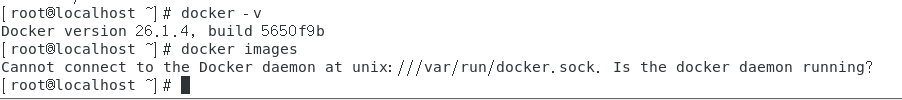
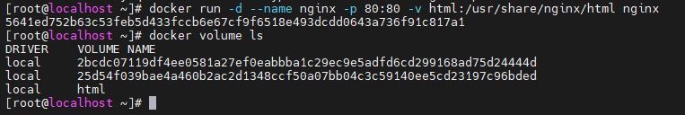
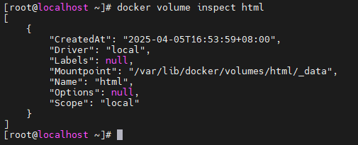
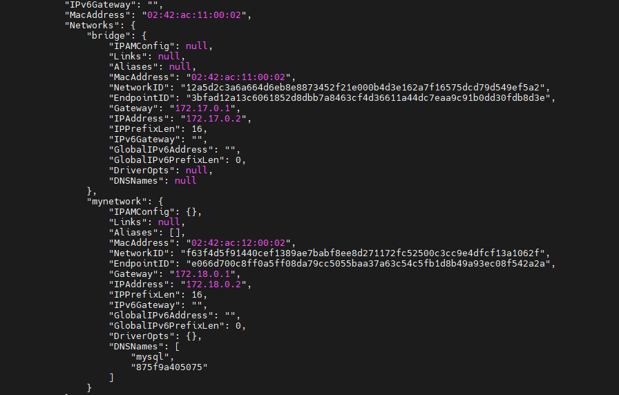

# Docker学习笔记

参考视频：[黑马程序员Docker快速入门到项目部署，MySQL部署+Nginx部署+docker自定义镜像+DockerCompose项目实战一套搞定_哔哩哔哩_bilibili](https://www.bilibili.com/video/BV1HP4118797/?spm_id_from=333.337.search-card.all.click&vd_source=f3cb3ea986b26c6910b4df6d37acd60d)


以下学习使用的系统为CentOS7

## 前置知识

需要先配置以下CentOS7系统

### 如何在局域网中访问虚拟机

首先参考教程[访问局域网中的虚拟机（详细教程！）_vm虚拟机加入局域网-CSDN博客](https://blog.csdn.net/weixin_42340926/article/details/104972208) 对虚拟机网路进行设置。

使用MobaXterm控制终端建立与虚拟机的连接

1.获取虚拟机的ip地址

```
ip addr
```


2.使用MobaXterm建立连接

点击MobaXterm左上角的Session，进入SSH连接，按下图设置即可完成连接


完成连接即可通过终端操控虚拟机


## Docker安装

#### 1.卸载旧版Docker

```
yum remove docker \
    docker-client \
    docker-client-latest \
    docker-common \
    docker-latest \
    docker-latest-logrotate \
    docker-logrotate \
    docker-engine \
    docker-selinux 
```


#### 2.配置Docker的yum库

##### 前置须知

由于CentOS7早在2024年就已经停止维护了，因此它自带的仓库已经无法使用了，所以在进行下一步操作前需要更改一下仓库源

我通过问DeepSeek解决了这个问题，但是有点乱，稀里糊涂地就搞定了，也不知道到底步骤是怎么样的，下面的操作仅供参考

1）备份原有仓库文件

```
mv /etc/yum.repos.d/CentOS-Base.repo /etc/yum.repos.d/CentOS-Base.repo.backup
```

2）下载阿里云镜像配置

```
wget -O /etc/yum.repos.d/CentOS-Base.repo http://mirrors.aliyun.com/repo/Centos-7.repo
```

3）禁用失效的仓库

```
yum-config-manager --disable centos-sclo-sclo
```

4）清理缓存，然后重新生成缓存

```
yum clean all
yum makecache
```

5）验证仓库可用性

```
yum repolist
```

如果成功，运行结果会是下图这样


再提一嘴

如果从库中下载东西时发现网络问题，可以尝试ping一下，测试网络是否通畅

```
ping 8.8.8.8
```

如果结果为：网络不可达，可能是虚拟机网络没配好（我这里用的是虚拟机）

解决方法为检查虚拟机的网络配置，右键虚拟机，进入网络设置，开启NAT模式（好像开启后需要还配置什么）

使用命令，查看虚拟机ip情况 

```
ip a
```

如果结果中，存在网卡ens33，且有IP地址：198.120.xxx.xxx什么的就说明配置成功了，可以在ping一下来验证网络


如果ens33网卡中的ip地址未分配，可能是DHCP未分配，使用命令来手动获取

```
dhclient ens33
```


##### 正式配置

有了上面的前置知识，应该就能正常进行配置了

1）首先安装yum工具

```
sudo yum install -y yum-utils device-mapper-persistent-data lvm2
```

2）配置Docker的yum源

```
sudo yum-config-manager --add-repo https://mirrors.aliyun.com/docker-ce/linux/centos/docker-ce.repo

sudo sed -i 's+download.docker.com+mirrors.aliyun.com/docker-ce+' /etc/yum.repos.d/docker-ce.repo
```

3）更新yum，建立缓存

```
sudo yum makecache fast
```


#### 3.安装Docker

执行以下命令安装Docker

```
yum install -y docker-ce docker-ce-cli containerd.io docker-buildx-plugin docker-compose-plugin
```

执行结果


#### 4.验证Docker安装情况

输入以下命令可以查看docker的版本

```
docker -v
```

能够查看到docker的版本不能完全说明docker安装成功

输入以下命令查看docker镜像

```
docker images
```

结果可能发现无法连接docker，因为此时docker还未启动



接下来启动docker并进行相关配置

```
# 启动Docker
systemctl start docker

# 停止Docker
systemctl stop docker

# 重启
systemctl restart docker

# 设置开机自启
systemctl enable docker

# 执行docker ps命令，如果不报错，说明安装启动成功
docker ps
```

启动完成后再尝试获取docker的镜像，就能获取成功了。


#### 5.配置Docker的镜像加速

由于Docker的服务器在国外，默认下载比较慢，因此我们需要配置一下镜像加速。

视频中使用的阿里云的镜像加速，但是现在阿里云只支持阿里云服务器镜像加速，我现在用的本地虚拟机无法使用阿里云，因此我找了其他的镜像加速源，网站：[DockerHub镜像加速器 - 免费Docker镜像源国内加速 - DockerHub加速国内解决方案](https://docker.xuanyuan.me/) 先用着，但以后会不会失效就不知道了。


1）首先修改 /etc/docker/daemon.json，设置 registry mirror

```
sudo vim /etc/docker/daemon.json <<EOF
{
    "registry-mirrors": [
        "https://docker.1ms.run",
        "https://docker.xuanyuan.me"
    ]
}
EOF
```

这里我输入这个命令执行没成功，报了个警告：输入不是来自终端（键盘），不知道什么意思，看来以后需要补一补linux的知识。

于是我手动创建了该文件，然后把内容复制进去了。

2）重启docker

```
systemctl daemon-reload
systemctl restart docker
```


 

## 使用Docker部署MySQL

直接使用以下命令就可以部署一个MySQL服务

```
docker run -d \
> --name mysql \
> -p 3306:3306 \
> -e TZ=Asiz/Shanghai \
> -e MYSQL_ROOT_PASSWORD=123 \
> mysql
```

运行结果如下


可以发现这样一句话：Unable to find image 'mysql:lagest' locally，意为无法在本地找到mysql，因此docker就会到docker仓库中去拉取MySQL。

使用Docker来部署MySQL不需要下载MySQL安装包，而是直接从Docker仓库中拉取MySQL相关的镜像，该镜像已经包括了MySQL这个软件本身的文件，以及运行该软件的相关依赖和环境，所以一拉取下来就可以直接部署启动。并且通过上面的命令我们也以及对MySQL进行了必要的设置，如：端口设为了3306，密码设为了123。

所以我们可以使用navicat来尝试连接这个数据库，如下图所示，连接测试通过了，说明这个虚拟机上的MySQL确实部署起来了。


Docker在运行拉取下来的镜像时会创建一个隔离环境，称为容器（container），因此我们还可以部署多个MySQL服务，且这些服务之间是相互隔离的。

接下来我就再部署一个MySQL服务，但是需要改一下名字和端口号，名字改为mysql2，端口号改为3307

```
docker run -d \
> --name mysql2 \
> -p 3307:3306 \
> -e TZ=Asiz/Shanghai \
> -e MYSQL_ROOT_PASSWORD=123 \
> mysql
```

然后可以发现这一次并没有去拉取相关镜像，因为在部署第一个时已经拉取了，部署第二个时可以直接用。


再次用navicat来连接第二个MySQL，可以发现也连接成功了。


## 部署MySQL的命令解读

 上面部署MySQL时用到了下面这个命令

```
docker run -d \
> --name mysql \
> -p 3306:3306 \
> -e TZ=Asiz/Shanghai \
> -e MYSQL_ROOT_PASSWORD=123 \
> mysql
```

实际上这是一行命令，只不过因为太长就写成多行了。

下面我们来解释以下这个命令

docker run：创建并运行一个容器，-d代表让该容器在后台运行，通常与docker run一起使用。如果不加-d，运行该容器后就会自动进入该服务的控制台界面，此时就不能进行与该服务无关的其他命令了，如果退出，该服务也会一起退出，因此我们通常将启动的容器放在后台运行。


--name mysql：代表给容器起一个名字，名字必须唯一，这里就是把本容器的名字起为mysql。

-p 3306:3306：设置端口映射。意为将宿主机的3306端口映射到容器中的3306端口。

每一个容器都有一个独立的网络环境，可以使用下面的命令来查看一个容器的网络情况

```
docker inspect mysql
```

该命令意为查看名为mysql容器的网络环境


我们可以在图中看到一个ip地址，这个ip地址是无法直接访问到的，需要通过访问宿主机的ip，然后通过映射，才能访问到相关的容器。


-e key=value：设置环境变量。这个环境变量的设置会根据容器使用的镜像服务的不同而不同。具体要设置什么可以看镜像的官方文档。这里运行的是MySQL的镜像服务，因此设置了MySQL的密码以及时区。


mysql：最后一行的mysql代表容器运行的镜像，其规范为：[repository]:[tag]，其中repository代表镜像名，tag代表镜像版本，如果没有指定tag，默认为最新版。因此这里代表使用mysql最新版的镜像。


## Docker常见命令

通过完成以下案例来认识Docker的常见命令


#### 从仓库拉取镜像

```
docker pull
```


#### 将镜像推送到仓库

```
docker push
```

#### 查看本地所有的镜像

```
docker images
```


#### 移除本地镜像

```
docker rmi
```


#### 构建一个镜像

```
docker build
```

#### 将镜像保存为压缩文件

```
docker save
```

如果不知道命令该如何用，可以在命令后面加上--help来查看命令的用法


#### 加载压缩文件为镜像

```
docker load
```


#### 创建并启动一个容器

```
docker run
```


#### 停止运行容器

```
docker stop
```


#### 启动容器

这个命令需要与docker run区分一下，docker run每次都会创建一个新的容器，而docker start是在原有容器的基础上启动容器

```
docker start
```


#### 查看已有容器

默认只会显示正在运行的容器，如果想查看所有容器可以加上-a

```
docker ps
```

#### 移除一个容器

这个命令要与docker rmi区分一下，rmi代表删除镜像(image)。

默认只能移除未启动的容器，但可以加-f强制删除容器

```
docker rm
```


#### 查看容器的日志

加上-f 以持续跟踪显示该容器的日志

```
docker logs
```


#### 进入一个容器

加上-it 表示添加一个可输入的终端

进入容器后就可以执行容器中运行的服务相关的命令了

```
docker exec
```


从上图就可以看出容器就是一个独立的运行环境，每个容器都有自己的文件系统。


## Docker命令别名

如果嫌Docker的命令太长，我们可以给命令取一个别名，这样我们输入命令别名就能正常执行原本很长的命令了。

如下面这个命令，用于查看容器信息，并将信息格式化，可以为这个命令取个别名pst

```
docker ps --format "table {{.ID}}\t{{.Image}}\t{{.Ports}}\t{{.Status}}\t{{.Names}}"
```


首先进入`~/.bashrc`文件

```
vim ~/.bashrc
```

然后添加下面的配置

```
alias pst='docker ps --format "table {{.ID}}\t{{.Image}}\t{{.Ports}}\t{{.Status}}\t{{.Names}}"'
```


然后保存，保存完后使用，让其生效

```
source /root/.bashrc
```

然后我们就可以直接使用pst命令来查看格式化后的容器信息了


## Docker数据卷挂载

### 什么是数据卷

首先看一下数据卷的定义


在Docker容器中虽然提供了运行镜像所需的必要环境，但也仅限于必要环境了，如果我们想要对其中的文件进行修改，比如使用vim编辑器，在容器中就无法使用，因为容器内没有这个东西。那这就导致我们很难在容器内对文件进行修改，但我们又难免需要对容器内文件进行修改，要解决这个问题就要用到数据卷了。

一旦数据卷在容器内文件与宿主机文件之间建立了映射，容器就会自动将对应的宿主机文件挂载到容器文件中，并且数据卷让容器内目录与宿主机目录实现了双向绑定，也就是说宿主机的文件修改，容器中的文件也会跟着修改，反过来容器中的文件修改，宿主机的文件也会跟着修改。因此，如果我们需要修改容器中的文件，直接在宿主机上修改即可。


### 数据卷相关的命令

可以使用docker volume --help查看数据卷相关的命令


### 如何实现数据卷挂载

要想实现数据卷挂载，需要在容器创建的时候就指定数据卷，容器创建后就无法实现数据卷挂载了。

在使用docker run命令时加上`-v 数据卷:容器内目录`  来实现数据卷挂载。

比如这里我们要实现nginx容器的数据卷挂载


通过查询nginx镜像的官方文档可以知道nginx容器内存放index.html文件的目录为`/usr/share/nginx/html`


所以我们在创建nginx容器是可以指定该目录，从而实现数据卷挂载

```
docker run -d --name nginx -p 80:80 -v html:/usr/share/nginx/html nginx
```



我们可以具体查看一下该数据卷



其中，Mountpoint代表的路径就是映射到的宿主机的路径，此时查看宿主机的这个路径，可以看到容器中对应路径的文件，宿主机中也有


一旦建立了数据卷，就会在宿主机`/var/lib/docker/volumes`路径下创建一个目录来与容器中的目录相互映射，实现双向绑定。

而我们操作宿主机就非常方便了，通过某些操作终端的软件，我们就可以很方便地访问到这个路径并进行相应的修改


你看，我在宿主机中加了一张图片，容器中也出现了这张图片


## Docker本地目录挂载

### 前置须知

在前面学习数据卷挂载的时候，我们有进行查看所有数据卷的操作


html是我们创建的数据卷，那上面两个那么长一串的东西是啥呢？也是数据卷，但不是我们创建的，是我们创建MySQL容器时自动创建的匿名数据卷

我们可以查看一下这些数据卷，然后进入该数据卷所指定的挂载目录，如下图的左侧边栏所示，可以发现这是mysql的数据文件夹。


我们输入以下命令也可以通过查看容器详情来查看到挂载情况

```
docker inspect mysql
```


这种自动生成匿名数据卷的挂载方式会带来一些问题：

1.数据卷名字过于复杂，不利于我们查询使用文件

2.数据卷名字是随机生成的，如果我们需要对数据库进行升级，那么新创建的数据库容器生成的数据卷和原本的数据卷就对不上，也就会导致原本数据库的数据的丢失。当然我们可以通过复制的方式将原来的数据迁移到新的目录中，但这样显然也不方便。

所以，为了防止上面两个问题，我们可以使用本地挂载。


### 如何实现本地挂载

实现本地挂载的方式与数据卷挂载类似，它们都只能在容器创建时实现挂载。下图是实现本地挂载的具体方法


数据库挂载是使用`-v 数据卷名：容器内目录`而本地挂载将数据卷名改为了本地目录。

接下来我们通过完成一个需求来熟悉本地挂载的使用方法


首先我们需要提前在宿主机上创建好要挂载的文件目录


然后将初始化脚本放入init文件夹，将配置文件放入conf文件夹

在创建启动容器时进行本地挂载

```
docker run -d \
--name mysql \
-p 3306:3306 \
-e TZ=Asia/Shanghai \
-e MYSQL_ROOT_PASSWORD=123 \
-v /root/mysql/data:/var/lib/mysql \
-v /root/mysql/init:/docker-entrypoint-initdb.d \
-v /root/mysql/conf:/etc/mysql/conf.d \
mysql
```

这个时候我们就可以看到在宿主机目录下数据创建成功了，并且自动执行了初始化sql脚本，创建了一个hmall表


此时我们可以再查看mysql容器的详细情况，挂载方式从原来的volume变成了bind，这就说明实现了本地挂载。


## Dockerfile语法

### 前置须知

Dockerfile语法是用来描述镜像的，我们制作Docker镜像时就需要Dockerfile。

镜像是包含了应用程序、程序运行的系统函数、运行配置等文件的文件包，而构建镜像就上将上述包含的文件进行打包的过程。

假如我们需要制作一个Java程序的镜像，那么需要准备哪些文件呢？如下图所示


Docker镜像可以看成是一个有层级结构的包，如下图所示。


在Dockerfile中会描述一个镜像所需要的各种包（镜像），在制作镜像时，就是根据Dockerfile描述的顺序来进行打包的，比如上面构建Java镜像的步骤：首先准备一个linux环境，那么就会先将linux环境压缩成一个包，接着是JRE，也会压缩成一个包，然后是jar包，最后是运行脚本，把这些东西全压缩成一个一个包后，就如同上图中的层级结构一样，统一打包，这样就形成了一个镜像。

实际上在我们拉取镜像时也可以看到层级结构，如下图所示，nginx镜像也是由多个压缩后的包组合而成，可以看到pull complete前面有一些编码一样的字样如：6e909.....，也就是说拉取镜像时就是拉取这些包。


而Dockerfile就是来描述一个镜像需要哪些包，然后在制作镜像时，docker会自动根据Dockerfile来制作镜像。

采用这种分层结构的镜像有一个好处：对于一些用的比较多的包，比如这里的linux环境，我们可以直接使用别人做好的包（基础镜像），在此基础上我们再去添加我们需要的包，这就大大方便了镜像的制作。

也因此，上面的Java程序的镜像步骤我们也可以大大地减少，因为存在一个Java基础镜像，里面就包含所需的运行环境以及JDK，所以我们只需要在这个基础包上添加自己的程序jar包以及入口（Entrypint）就行了。


### Dockerfile语法


下面是一个Dockerfile的示例

```
# 基础镜像
FROM openjdk:11.0-jre-buster
# 设定时区
ENV TZ=Asia/Shanghai
RUN ln -snf /usr/share/zoneinfo/$TZ /etc/localtime && echo $TZ > /etc/timezone
# 拷贝jar包
COPY docker-demo.jar /app.jar
# 入口
ENTRYPOINT ["java", "-jar", "/app.jar"]
```


## 自定义镜像

使用以下命令来创建镜像

```
docker build -t ImageName:1.0 .
```

-t 代表给创建的镜像取名

ImageName:1.0  ImageName代表镜像的名字，后面的1.0代表镜像版本，如果不指定默认为latest

注意最后面还有一个`.`，这个代表Dockerfile文件的路径，如果就在当前目录就指定为`.`


尝试一下创建镜像

这里Dockerfile文件内容为

```
# 基础镜像
FROM openjdk:11.0-jre-buster
# 设定时区
ENV TZ=Asia/Shanghai
RUN ln -snf /usr/share/zoneinfo/$TZ /etc/localtime && echo $TZ > /etc/timezone
# 拷贝jar包
COPY docker-demo.jar /app.jar
# 入口
ENTRYPOINT ["java", "-jar", "/app.jar"]
```

输入以下命令

```
docker build -t myimage .
```

结果如下


由于制作镜像时用到了`openjdk:11.0-jre-buster`这个基础镜像，其实我们可以提前加载好这个镜像（资料里面提供了），这样在制作自己的镜像时会快很多


我们可以尝试启动这个镜像


## 容器网络互连

### 容器的ip地址

当我们安装docker时，会自动创建一个docker0网卡


默认情况下，所有的容器都是以bridge的方式连接到Docker的虚拟网桥上，这个虚拟网桥就是上面说的自动创建的docker0


通过这种方式，容器之间就能够互相访问。例如下面我在demo容器里面去ping mysql2容器，通过查询mysql2容器的ip为172.17.0.3


可以发现能够正常ping通。

这样我们就可以在一个容器中去访问另一个容器的服务了，比如在A容器中启动Java服务，在B容器中启动mysql服务，通过网络让A容器的Java服务使用B容器的mysql服务。

理论上来说，这样没什么问题，但是又存在一个问题。因为容器的ip地址是会发生变化的，如果有什么特殊情况，导致容器B关闭了，然后重启容器B，此时容器B的ip地址可能会发生变化，但是容器A中设置的用来访问容器B的ip地址还没变，这就导致容器A访问不到容器B了。

那要解决这个问题就需要用到自定义网络


### 自定义网络

自定义网络的作用和docker自己创建的网卡作用大差不差，但是自定义网络可以通过容器名互相访问，也就是说即使容器ip地址变了，只要有容器名，那就能访问到对应的容器，不管容器ip地址变成啥。

下面是与自定义网络相关的命令:


#### 创建网络

最后面指定的是自定义网络的名字。

```
docker network create networkname
```


创建自定义网络会创建一个新的网卡


#### 指定容器加入网络

将已存在的容器加入网络

```
docker network connect 自定义网络名 容器名
docker network connect mynetwork mysql
```

在创建容器时指定容器加入网络

```
docker run -d --name 容器名 -p 8080:8080 --network 自定义网络名 镜像名
docker run -d --name demo -p 8080:8080 --network mynetwork myimage
```


加入网络后查看该容器就可以看到新的网络情况，如下图可以看到新创建的网络`mynetwork`



如果是在容器创建时指定网络，就只会有一个网络情况：mynetwork


此时我们就可以直接通过容器名来进行访问，下图既尝试了通过ip访问，也尝试了通过容器名访问。


## 部署Java项目

尝试部署Java项目，资料中提供了Java项目。

首先对该项目进行打包，maven项目打包，就不细说了。但是要注意在打包前要改一改配置文件

将jar包和Dockerfile文件放在同一目录下后执行镜像制作命令

```
docker build -t hmall .
```

创建并启动容器，要将该容器连接到自定义网络上，与mysql一起。

```
docker run -d --name hmall -p 8080:8080 --network mynetwork hmall
```

可以尝试在进入hmall容器ping mysql


## 部署前端项目

通常使用nginx来部署前端项目。资料中提供了前端项目。

首先我们要检查一下nginx的配置文件，根据配置文件，我们可以知道前端页面的存放路径，这样在进行挂载的时候才能够知道要挂载哪些路径

资料提供的项目分为用户端和管理端，用户端访问18080端口，管理端访问18081端口


根据前端项目所在的位置我们就可以确定要挂载的路径为`/usr/share/nginx/html`

同时不要忘了配置文件也需要挂载，这样我们也可以方便修改配置文件，配置文件的路径可以查看nginx镜像的官方文档查看到

```
-v /root/nginx/html:/usr/share/nginx/html		 #挂载前端页面
-v /root/nginx/nginx.conf:/etc/nginx/nginx.conf  #挂载nginx配置文件
```

在查看配置文件时还要注意访问的后端地址，从上图可以看出后端地址都是`http://hmall:8080`，和我们前面部署的Java项目对的上，前面部署的Java项目连接在自定义网络中，并且容器名为hmall，因此为了前端能够正常访问到Java后端，我们也需要将前端的容器连接到同一个自定义网络上。

下面是前端项目的容器的创建与运行命令

```
docker run -d \
--name nginx \
-p 18080:18080 \
-p 18081:18081 \
-v /root/nginx/html:/usr/share/nginx/html \		
-v /root/nginx/nginx.conf:/etc/nginx/nginx.conf  \
--network mynetwork \
nginx
```


此时我们能够正常访问页面了


## 使用DockerCompose来部署


前面我们部署项目时是手动一个一个来部署的，先部署mysql，然后部署后端，最后部署前端。这种方式显而易见太繁琐了，并且容易出错。

为了解决这个问题，我们可以使用DockerCompose。

DockerCompose通过一个单独的docker-compose.yml模板文件来定义一组相关联的应用容器，帮助我们实现多个相关联的Docker容器的快速部署。

#### docker-compose.yml模板文件

简单来说上面部署的三个容器，我们只需要统一写在一个docker-compose.yml文件中，docker就能根据这个文件来帮我们一键部署，并且这些容器全部都会连接到同一个自定义网络中，非常方便。

下面是一个模板文件的示例：

```yaml
version: "3.8"

services:
  mysql:
    image: mysql
    container_name: mysql
    ports:
      - "3306:3306"
    environment:
      TZ: Asia/Shanghai
      MYSQL_ROOT_PASSWORD: 123
    volumes:
      - "./mysql/conf:/etc/mysql/conf.d"
      - "./mysql/data:/var/lib/mysql"
      - "./mysql/init:/docker-entrypoint-initdb.d"
    networks:
      - hm-net
  hmall:
    build: 
      context: .			#表示当前目录
      dockerfile: Dockerfile
    container_name: hmall
    ports:
      - "8080:8080"
    networks:
      - hm-net
    depends_on:		#depends_on代表依赖，指定依赖后会在依赖的容器创建好后才会创建本容器
      - mysql
  nginx:
    image: nginx
    container_name: nginx
    ports:
      - "18080:18080"
      - "18081:18081"
    volumes:
      - "./nginx/nginx.conf:/etc/nginx/nginx.conf"
      - "./nginx/html:/usr/share/nginx/html"
    depends_on:
      - hmall
    networks:
      - hm-net
networks:
  hm-net:				#网络标识，在这个模板文件中用这个来代表要连接的网络
    name: hmall			#自定义网络名称，这是自定义网络真正创建时的名称
```


可以发现在模板文件中定义容器，和我们手动创建启动容器是对应的上的


对比如下


#### DockerCompose相关命令

命令基本语法:

```bash
docker compose [OPTIONS] [COMMAND]
```

其中，OPTIONS和COMMAND都是可选参数，比较常见的有：


在执行命令时要保证模板文件中指定的Dockerfile文件、相关的jar包，以及挂载路径都要符合模板文件中指定的条件

比如这里，模板中指定的Dockerfile文件的路径是`.`也就是当前目录，所以Dockerfile文件和模板文件就要放在同一个路径下

再比如挂载路径为`./nginx/nginx.conf:/etc/nginx/nginx.conf`这里使用的是相对路径，因此这个路径也要和模板文件在同一目录下

本项目的文件目录要如下图所示


接下来就可以执行命令来一键部署了，-d代表后台运行项目

```bash
docker compose up -d
```

运行结果如下


如果我们想要关闭项目，也可以一键关闭

```bash
docker compose down
```

如下图所示，一键移除，干干净净


好用呢
