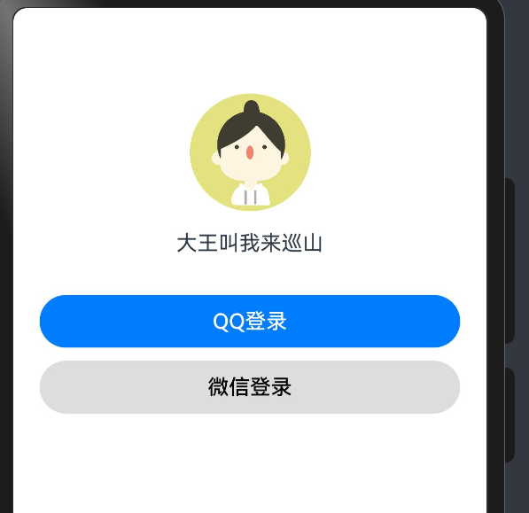
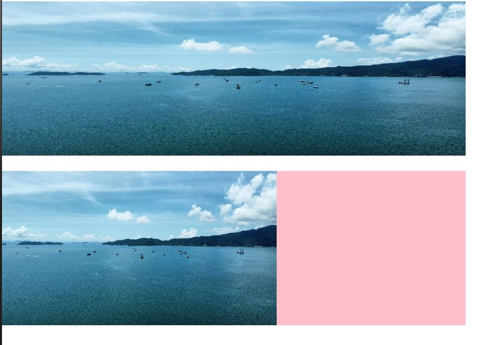
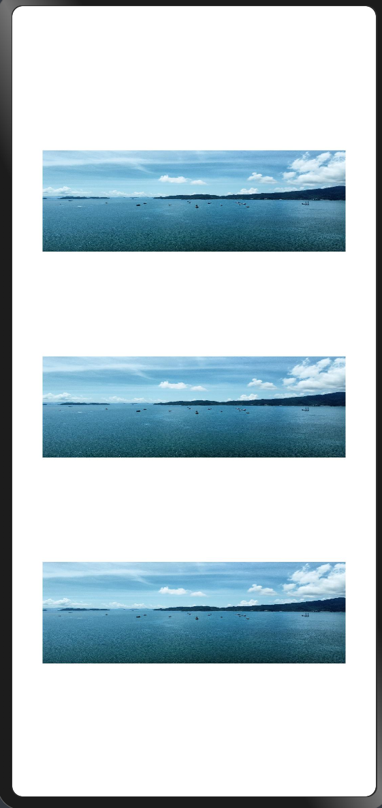
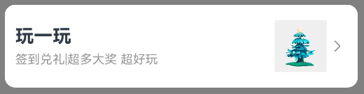

# HarmonyOS开发

HarmonyOS的技术理念：

1.一次开发，多端部署

2.可分可合，自由流转

3.统一生态，原生智能


## ArkTS基础语法

### 变量声明

语法

```ts
let 变量名:类型 = 值
```

```TS
//变量声明
//字符串类型，可以用单引号，也可以用双引号
let name: string = 'Arthur';
console.log("name",name);
//数字类型
let age: number = 21;
console.log("age",age);
//布尔类型
let isLogin: boolean = true;
console.log("isLogin",isLogin);
```


### 常量声明

语法

```TS
const 变量名:类型 = 值
```

```TS
//常量声明
const PI: number = 3.1415926
const companyName:string = "华为"
console.log("PI",PI)
console.log("companyName",companyName)
```


### 变量命名规则

1.变量只能由数字、字母、下划线、美元符$组成，不能以数字开头

2.不能使用内置关键字或保留字作为变量名

3.变量名严格区分大小写


### 数组声明

语法

```TS
let 数组名:类型[] = [数据1，数据2，数据3...]
```

```ts
//数组声明
let hobby:string[] = ["java","c++","game"]
let prices:number[] = [1.1,3.2,4.4,8.8]
console.log("hobby",hobby)
console.log("prices",prices)
//取数组的数据，索引从0开始
console.log("hobby1",hobby[1])  //c++
```


### 操作数组元素

最基本的修改数组元素，可以通过数组下标访问数组然后赋值即可，和Java大差不差。


#### 1.向数组添加元素

向数组添加元素分为从数组头部添加、从数组尾部添加、指定任意位置添加（splice）

1）从数组头部添加，使用`unshift`方法，可以一次性添加多个值，该方法会返回操作后的数组长度

2）从数组尾部添加，使用`push`方法，可以一次性添加多个值，该方法会返回操作后的数组长度


#### 2.删除数组中的元素

从数组中删除元素也分为从数组头部删除、从数组尾部删除、指定任意位置删除（splice）

1）从数组头部删除，使用`shift`方法，该方法会返回被删除的元素

2）从数组尾部删除，使用`pop`方法，该方法会返回被删除的元素


上面讲到的四个方法的综合使用如下：

```ts
let hobby:string[] = ['game','java']
console.log('hobby',hobby)

//添加元素到数组中
//从头部添加
hobby.unshift('C++')
//从尾部添加
hobby.push('ArkTS')
console.log('hobby',hobby)
//可以一次性添加多个元素
hobby.unshift('python','C')   //python,C,C++,game,java,ArkTS
hobby.push('C#','go')
console.log('hobby',hobby)    //python,C,C++,game,java,ArkTS,C#,go


//从数组中删除元素
//从头部删除
console.log("删除了:",hobby.shift());   //go
//从尾部删除
console.log("删除了",hobby.pop());      //python
console.log("hobby",hobby);
```


#### 3.`splice`

除了上面将的新增删除元素的方法，还有一个更为强大的方法：`splice`，它可以用来实现删除操作，也可以实现添加操作，使用语法如下

```ts
数组名.splice(索引,删除元素个数,添加元素1,添加元素2,....)
```

使用示例如下：

```ts
let hobby:string[] = ['game','java','C++','ArkTS']
console.log('hobby',hobby)
//指定位置删除
//从索引1开始，删除1个元素,也可以设置为数字，表示要删除元素的个数
hobby.splice(1,1)
console.log("hobby",hobby);   //game,C++,ArkTS

//指定位置添加元素
//从索引1开始，添加多个元素，指定删除元素个数为0
hobby.splice(1,0,'C#','go')
console.log("hobby",hobby);   //game,C#,go,C++,ArkTS

//实现替换元素--在添加的同时删除
//替换索引为1的元素
hobby.splice(1,1,'python')
console.log("hobby",hobby);   //game,python,go,C++,ArkTS
```


### 函数声明

函数可以理解为可以重复使用的代码块

函数声明语法

```ts
function 函数名 (形参1:类型,形参2:类型...){
	函数体
}
```

```ts
//可以在前面调用
f1()
//函数声明
function f1() {
  console.log("函数体执行,打印字符*", "****")
}
//调用函数
f1();

function buy(num: number, price: number) {
  let result: number = num * price
  return result
}
let applePrices = buy(3,4.5)
console.log("苹果总价",applePrices);
```


### 箭头函数（函数的简化版本）

箭头函数是函数声明简化后的形式，语法如下

```ts
let 函数名 = (形参1:类型,形参2:类型...)=>{
    函数体
}
```

```ts
//使用箭头函数来简化函数声明
let f1 = () => {
  console.log("函数体执行,打印字符*", "****")
}
f1()

let buy = (num: number, price: number) => {
  let result: number = num * price
  return result
}
let sum: number = buy(6, 10)
console.log("sum",sum)
```


### 接口&对象

对象是一个容器，可以用来存储不同类型的数据，通常用来描述一个物体的特征或行为。

对象的创建需要基于接口，接口是用来定义对象的的结构的。

定义接口的语法

```ts
//定义接口
interface Person {
  //接口中属性之间不需要逗号分割
  name: string
  age: number
  hobby: string
}
```


创建对象的语法

```ts
let 对象名:接口类型 = {
    对象的具体属性
}
```

```ts
//使用接口来创建对象
let person: Person = {
  name: 'arthur',
  age: 21,
  hobby: "game"
}
```


访问对象的属性

```ts
对象名.具体的属性名
```

```ts
//访问对象的属性
let myName:string = person.name;
let myAge:number = person.age;
let myHobby:string = person.hobby;
console.log("name",myName)
console.log("age",myAge)
console.log("hobby",myHobby)
```


### 对象数组

```ts
//对象数组
//首先定义接口
interface Person{
  name:string,
  age:number,
  hobby:string
}
//创建对象数组
//语法： let 数组名:接口名[] = [{定义每一个对象},....]
let persons:Person[] = [
  {name:'arthur',age:18,hobby:'game'},
  {name:'sky',age:20,hobby:'java'},
  {name:'liren',age:21,hobby:'C++'},
  {name:'ArthurSky',age:17,hobby:'ArkTS'},
]
//使用JSON.stringify(复杂对象)，可将各种复杂对象转换成字符串，如：对象、数组
console.log(JSON.stringify(persons));
```


### 对象的方法

前面讲到，对象通常用来描述一个物体的特征和行为，上面讲到对象的属性描述的其实就是对象的特征，而对象的方法就是用来描述对象的行为。

在接口中定义对象的方法

```ts
interface 接口名 {
    //接口中不需要具体去定义方法体，只需要声明一个方法，这和Java的接口类似
    方法名:(形参1:类型,形参2:类型...)=>方法返回类型
}
```

```ts
interface Person {
  name: string
  age: number
  hobby: string
  //定义对象方法
  run: () => void
}
```

在对象中实现具体的方法

```ts
let 对象名:接口名 = {
    方法名:()=>{
        具体的方法体实现
    }
}
```

```ts
let person: Person = {
  name: 'arthur',
  age: 21,
  hobby: "game",

  //实现方法体
  run: () => {
    console.log(name,"跑得贼快");
  }
}
```

调用对象的方法

```ts
对象名.方法名()
```

```ts
//调用对象的方法
person.run();
```


### 联合类型数据

联合类型是一种灵活的数据类型，它修饰的变量可以存储不同类型的值

联合类型数据声明

```ts
let 变量名:类型1|类型2|...
```

```ts
//非联合数据类型在存储不同类型数据时会报错
let a:number
a=10    //不会报错
console.log("a",a)
//a='10'  //会报错
//联合数据类型
let judge:number|string
judge=100.0
console.log('judge',judge);
judge='A+'
console.log('judge',judge)
```


此外联合数据类型还可以用来将数据约束到一个数据范围内

```ts
//这样该变量的值只能在数据1、数据2...中取，不能是其他值
let 变量名:数据1|数据2|...
```

```ts
//联合数据类型约束数据范围
let gender:'man'|'woman'|'unknow'
gender = 'man'  //这段代码不会报错
//gender = 'boy'  //boy不属于上面3个数据，因此这段代码会报错
```


### 枚举类型

语法

```ts
enmu 枚举名{
    常量1=值1,
    常量2=值2,
    ...
}
```

下面完成一个案例：利用枚举类型，给变量设置主色，将主色范围限定在红色、橙色、绿色

```ts
//枚举类型
enum themeColor {
  Red = "#ff0f29",
  Orange = "#ff7100",
  Green = "#30b30e"
}

//使用枚举
let color:themeColor = themeColor.Red;
console.log("color",color);
```

从上面的案例我们可以知道，枚举可以用来限定变量的取值范围。

说到取值范围，前面讲的联合类型好像也可以，不过联合类型只能存储变量的真实数据，无法像枚举一样定义多个变量名，这就导致我们无法根据联合类型变量的值来判断这个值究竟代表什么意思，比如上面的案例用联合类型来实现：

```ts
//用联合类型来实现
let color2:"#ff0f29"|"#ff7100"|"#30b30e"
color2 = "#ff0f29" //根据这个值"#30b30e" 我们很难具体得知它到底代表什么颜色
```


### 字符串拼接

ArkTS中字符串拼接用的的是`+`，当加号两边存在字符串时就是拼接字符串操作，当两边都为数字时就是加法运算操作，和Java很像。


### 模板字符串

模板字符串也是用来拼接字符串的，不过相较于使用加号`+`来拼接，模板字符串适合用来拼接多个字符串

模板字符串是由``包裹的字符串，如下示例：

```ts
//模板字符串
let name:string = '小明'
let age:number = 21
//其中 ${变量名} 可以动态获取到变量对应的值
console.log("身份信息：",`姓名：${name},年龄：${age}`);
```


### 类型转换（数字和字符串）

#### 字符串转数字

##### 1.Number()

```ts
//s是某一个字符串
let n:number = Number(s)
```

```ts
let str1:string = '1'
let str2:string = '1.2'
let str3:string = '1.2a'
let str4:string = 'a'

console.log("str1",Number(str1))  //1
console.log("str1",Number(str2))  //1.2
console.log("str1",Number(str3))  //NaN 如果转换失败，返回NaN
console.log("str1",Number(str4))  //NaN
```

##### 2.parseInt()

获取字符串的整数部分，然后转换成数字

```ts
let n:number = parseInt(s)
```

```ts
console.log("str1",parseInt(str1))  //1
console.log("str1",parseInt(str2))  //1
console.log("str1",parseInt(str3))  //1 parseInt会先去掉小数部分，再进行转换
console.log("str1",parseInt(str4))  //NaN
```

##### 3.parseFloat()

获取字符串的小数部分，然后转换成数字，获取第一个非数字以前的所有数字部分，因此字符串中如果有非数字，只要截取的部分能够转换成数字就不会返回NaN

```ts
console.log("str1",parseFloat(str1))  //1
console.log("str1",parseFloat(str2))  //1.2
console.log("str1",parseFloat(str3))  //1.2 这个注意一下，就算最后面有个a也不会影响转换，它会截取第一个非数字前的所以数字
console.log("str1",parseFloat(str4))  //NaN
```


#### 数字转字符串

##### 1.toString()

数字直接转换成对应的字符串

```ts
//数字转字符串
let num1:number = 1.1
let num2:number = 1.9
let num3:number = 1.9152

//数字直接转换成对应的字符串 .toString()
console.log('num1',num1.toString())   //1.1
console.log('num2',num2.toString())   //1.9
console.log('num3',num3.toString())   //1.9152
```

##### 2.toFixed()

四舍五入转成字符串，并且可以设置保留几位小数

```ts
//四舍五入转成字符串，并且可以设置保留几位小数, toFixed(保留几位小数)
console.log('num1',num1.toFixed())    //默认保留0位小数，1
console.log('num2',num2.toFixed())    // 2
console.log('num3',num3.toFixed(2))    //保留两位小数 1.92
```


### 交互-点击事件

通过配置组件的`.onClick()`属性来设置组件的点击事件，语法如下：

```ts
//最典型的Button组件
Button()
	.onClick(
		()=>{
            //当组件被点击后就会执行该函数
        }
)
```

示例：

```ts
@Entry
@Component
struct Click {
  build() {
    //点击事件
    Row() {
      Column() {
        Button('点击弹出提示框')
          .onClick(
            () => {
              AlertDialog.show({
                message: '这是一个提示框'
              })
            }
          )
        //除了用在按钮上，也可以给文本框设置点击事件
        Text('点击这个文本')
          .onClick(
            () => {
              AlertDialog.show({
                message:'这是文本框的点击事件'
              })
            }
          )
      }
      .width('100%')
    }
    .width('100%')
    .height('100%')

  }
}
```


### 状态管理

如果想要构建一个动态页面，即页面会随着交互进行相应的改变，就需要使用到状态管理。

这里首先要引入两个概念：1.普通变量 2.状态变量

#### 1.普通变量

```ts
//全局普通变量
let var:number = 1

struct demo{
    //局部普通变量，调用时需要使用this
    var2:number = 2
}
```

类似于上面这样声明的变量就是普通变量。

普通变量只会在页面初始化时渲染，后序就算发生改变，页面也不会重新渲染这个变量


#### 2.状态变量

```ts
struct demo{
    @State var:string = '3'
}
```

像上面这种声明时使用了`@State`装饰器的变量就是状态变量，该变量必须设置类型和初始值。

状态变量的特点时一旦发生改变，就会立刻更新页面


示例：

```ts
//组件外的普通变量
let myName: string = 'Arthur'

@Entry
@Component
struct stateDemo {
  //组件内的普通变量
  myAge: number = 21
  //组件内的状态变量
  @State msg: string = 'Hello,World!'

  build() {
    Column() {
      Column() {
        Row() {
          Text(this.msg)
            .fontSize(50)
        }
        Row({space:5}) {
          Button('中文')
            .width(100)
            .fontSize(24)
            .onClick(
              ()=>{
                //修改状态变量，页面会立刻更新
                this.msg = '你好,世界!'
              }
            ).layoutWeight(1)
          Button('English')
            .width(100)
            .fontSize(24)
            .onClick(
              ()=>{
                this.msg = 'Hello,World!'
              }
            ).layoutWeight(1)
        }
        .padding({left:5,right:5})

        Blank()
        Row() {
          Text(myName)
            .fontSize(50)
          Text(this.myAge.toString())
            .fontSize(50)
        }
        Row({space:5}) {
          Button('修改姓名')
            .width(100)
            .fontSize(24)
            .onClick(
              ()=>{
                //修改普通变量，页面不会更新
                myName = 'sky'
                console.log('myName',myName)
              }
            ).layoutWeight(1)
          Button('修改年龄')
            .width(100)
            .fontSize(24)
            .onClick(
              ()=>{
                this.myAge = 22
                console.log("myAge",this.myAge)
              }
            ).layoutWeight(1)
        }
        .padding({left:5,right:5})

      }
      .height('100%')
    }
    .width('100%')
    .height('100%')
  }
}
```


### 案例：实现计数器

```ts
@Entry
@Component
struct countDemo {
  @State count: number = 1

  build() {
    Row() {
      Button('-')
        .onClick(
          () => {
            this.count = this.count - 1
          }
        )
      Text(this.count.toString())
        .fontSize(24)
        .margin({left:10,right:10})
      Button('+')
        .onClick(
          () => {
            this.count = this.count + 1
          }
        )
    }
    .padding(10)
  }
}
```


### 算数运算符和赋值运算符

简单看看就行，基本和Java一样


### 一元运算符

也基本和Java一样。


还有自增`++`和自减`--`


### 运算符优先级


### 分支语句-if

也和Java大差不差

#### 1.单分支

```ts
if(逻辑条件){
	//条件成立时执行的代码
}
```

#### 2.双分支

```ts
if(逻辑条件){
	//条件成立时执行的代码
}
else{
    //条件不成立时执行的代码
}
```

#### 3.多分支

```ts
if(条件1){
	//条件1成立时执行的代码
}
else if(条件2){
    //条件2成立时执行的代码
}
else if(条件3){
    //条件3成立时执行的代码
}
else if(条件3){
    //条件3成立时执行的代码
}
...
else{
   //全部条件都不成立时执行的代码 
}
```

注意一点，如果逻辑条件的值不为布尔值，它会自动转化成布尔值。


### switch分支

也和Java大差不差

```ts
switch(表达式){
        case:值1
        与值1匹配时执行的代码
        break
        case:值2
        与值2匹配时执行的代码
        break
        case:值3
        与值3匹配时执行的代码
        break
        ...
    default:
        都匹配不到时执行的代码
}
```


### 三元条件表达式

和Java一模一样

```ts
逻辑表达式?表达式结果为true执行的代码:表达式结果为fasle执行的代码
```


### 条件渲染

基于各种分支语句，实现不同条件下渲染不同的UI界面

```ts
@Entry
@Component
struct test{
  @State age:number = 17
  build() {
    //条件渲染
    Column(){
      Row(){
        //年龄不同，渲染的文本不同
        if(this.age<18){
          Text('未成年')
        }else if(this.age>=18&&this.age<60){
          Text('成年人')
        }else{
          Text('老年人')
        }
      }
      Button('成长+1')
        .onClick(
          ()=>{
            this.age+=1
          }
        )
    }
    .width('100%')
  }
}
```


### 循环

和Java一模一样

```ts
while(条件表达式){
    //条件表达式为true执行的代码
}

for(let i = 1;i<某个数;i++){
    //循环执行的代码
}
```

退出循环的用法也一样，break和continue都是与Java一样的用法


### 遍历数组

遍历数组当然可以使用普通for循环来遍历了（ArkTS的数组也可以通过`.length`来获取长度），这样方式就不多讲了。

这里讲一下ArkTS提供的另一种遍历数组的方式`for...of`

```ts
//item变量用于接收遍历到的数组元素，这个变量的名字可以任取
for(let item of 数组名){
    //执行逻辑
    console.log("item",item)
}
```

使用示例：

```ts
let hobby:string[] = ['game','java','C++','ArkTS']
//遍历数组
for(let element of hobby){
  console.log('element',element)
}
```


### ForEach渲染控制

ForEach可以基于数组的个数来渲染组件，数组中有多少个元素，就可以渲染多少个组件，简化了代码的书写。因为在这之前，我们渲染多个组件就是通过手写多个组件的方式，非常繁琐。

使用语法:

```ts
//item代表遍历到的数组元素，index代表下标
ForEach(数组名,(item:类型,index:类型)=>{
    组件的渲染逻辑
})
```

使用示例：

```ts
@Entry
@Component
struct ForEachDemo {
  @State titles:string[] = ['电子产品','精品服饰','母婴产品','影音娱乐','海外旅游']
  build() {
    //ForEach渲染控制
    Column(){
      //item代表遍历的数组元素，index代表下标，类型也可以不写，因为通常都是number
      ForEach(this.titles,(item:string,index:number)=>{
        Text((index+1).toString()+item)
          .fontSize(24)
          .fontColor(Color.Orange)
          .fontWeight(FontWeight.Bold)
      })
    }
  }
}
```

渲染结果：


## ArkUI

ArkUI（方舟开发框架）是一套构建鸿蒙应用界面的框架

### 基于ArkUI开发界面的布局思路

在ArkUI开发框架中，构建页面的最小单位是“组件”

组件分为：基础组件和容器组件


基于ArkUI开发界面的布局思路就是：先排版，再放内容

比如下面这个界面


再来看看最基础的HelloWorld页面代码

```ts
@Entry
@Component
struct Index {
  @State message: string = 'Hello World';

  //所有的页面代码都要写在build组件里面
  build() {
    //容器组件：列Column
    Column() {
      //容器组件：行Row
      Row() {
        Text(this.message)
          .id('HelloWorld')
          .fontSize($r('app.float.page_text_font_size'))
          .fontWeight(FontWeight.Bold)
          .alignRules({
            center: { anchor: '__container__', align: VerticalAlign.Center },
            middle: { anchor: '__container__', align: HorizontalAlign.Center }
          })
          .onClick(() => {
            this.message = 'Welcome';
          })
      }
      .width('100%')
      .height('100%')
    }
    .height('100%')
    .width('100%')
  }
}
```


### 组件语法

#### 1.容器组件

使用容器组件来搭建页面布局的整体排版，常用的容器组件有：行Row、列Column

使用容器组件的语法

```ts
容器组件(){
    内容
}
```

```ts
Column(){
    Text('具体内容')
}
```

#### 2.基础组件

基础组件就是放在容器组件内部的组件，比如:文字Text、图片等

使用基础组件的语法

```ts
基础组件(参数)
```

```ts
Text('Text就是一个基础组件')
```


#### 3.案例

比如我们现在需要完成下面的布局


首先我们先完成布局

```ts
@Entry
@Component
struct Demo1{
  build() {
    //列容器，用来存放所有页面内容
    Column(){
      //行容器，用来存放 都市、都市生活。。。这一排内容
      Row(){
        
      }
    }
  }
}
```


然后我们可以向布局中添加内容

```ts
@Entry
@Component
struct Demo1 {
  build() {
    Column() {
      //向布局添加内容
      Text('小说简介')
      Row() {
        //向布局添加内容
        Text('都市')
        Text('都市生活')
        Text('情感')
        Text('男频')
      }
    }
  }
}
```

此时的页面效果是这样的


### 组件属性方法

通过修改组件的属性，我们可以去美化页面内容。

组件属性的使用语法:

1.容器组件的组件属性

```ts
组件()){}
.属性方法1(参数)
.属性方法2(参数)
.属性方法3(参数)
。。。
.属性方法n(参数)
```

2.基础组件的组件属性

```ts
组件()
.属性方法1(参数)
.属性方法2(参数)
.属性方法3(参数)
。。。
.属性方法n(参数)
```

常见的几个属性方法：


接下来我们再使用组件属性方法来优化上面还未完成的案例，我们先将其优化成下图这样：


```ts
@Entry
@Component
struct Demo1 {
  build() {
    //build里面只能有一个容器组件
    Column() {
      //容器内的内容默认是居中的。
      Text('小说简介')
        .width('100%')
        .fontSize(20)
        .fontWeight(FontWeight.Bold)  //也可以填100-900之间的数字，可以记住两个常用的值 加粗：700 默认：400
      Row() {
        Text('都市')
          .width(50)
          .height(30)
          .backgroundColor(Color.Orange)
        Text('都市生活')
          .width(80)
          .height(30)
          .backgroundColor(Color.Pink)
        Text('情感')
          .width(50)
          .height(30)
          .backgroundColor(Color.Yellow)
        Text('男频')
          .width(50)
          .height(30)
          .backgroundColor(Color.Gray)
      }
      .width('100%')
    }
    .width('100%')
  }
}
```


### 案例：完成新华社新闻置顶页面布局

完成下面这个页面布局


```ts
@Component
@Entry
struct Demo2 {
  build() {
    Column() {
      Text('学鸿蒙，就来黑马程序员~')
        .width('100%')
        .height(30)
        .fontSize(24)
      Row() {
        Text('置顶  ')
          .fontColor('#df3c50')
        Text('新华社  ')
          .fontColor('#a1a1a1')
        Text('4680评论')
          .fontColor('#a1a1a1')
      }
      .width('100%')
    }
    .width('100%')
  }
}
```


### 文本溢出省略、设置文本行高

#### 1.设置文本溢出省略

使用组件属性方法：`.textOverflow`，其使用细节如下图所示


#### 2.设置文本行高

使用组件属性方法：`.lineHeight(数字)`


基于以上两个属性方法，实现下面的页面效果，即：如果文本放不下了，就自动用省略号省略后面的文本


```ts
@Entry
@Component
struct Demo3{
  build() {
    Column(){
      Text('HarmonyOS 应用开发者基础认证')
        .width('100%')
        .fontSize(23)
        .fontWeight(FontWeight.Bold)
      Row(){
        Text('通过系统化的课程学习，熟练掌握 DevEco Studio，ArkTS，ArkUI，预览器，模拟器，SDK 等 HarmonyOS 应用开发的关键概念，具备基础的应用开发能力。')
          //设置文本行高
          .lineHeight(20)
          .textOverflow({
            overflow:TextOverflow.Ellipsis
          })
          .maxLines(2)
      }

    }
    .width('100%')
  }
}
```


### 图片组件

图片组件是`image(图片地址)`

图片组件加载的图片分为网络图片和本地图片，它们的写法会有所不一样

1.网络图片

```ts
image('网络图片地址')
```

2.本地图片

本地图片资源通常放在项目中的`resources`文件夹下的`/base/media`中，如下图


加载本地文件的语法为：

```ts
image($r('app.media.图片文件名'))
```


比如现在需要完成类似这样一个页面布局


我这里的网络图片链接为:https://javaweb-tlias-case-sky.oss-cn-beijing.aliyuncs.com/pictures/fbd1129a-5891-4897-ba6a-54d8fece11b3.jpg

```ts
@Entry
@Component
struct Demo4{
  build() {
    Column(){
      //加载网络图片
      Image("https://javaweb-tlias-case-sky.oss-cn-beijing.aliyuncs.com/pictures/fbd1129a-5891-4897-ba6a-54d8fece11b3.jpg")
        .width(300) //设置一下图片的大小，设置宽、高任意一个就行，它会自动等比例缩放
      Text('新建的大桥真是宏伟！')
        .width(300)
      Row(){
        //加载本地图片,注意图片名只能由字母数字下划线组成
        //Image($r('app.media.呆呆雾子'))
        Image($r('app.media.kiriko'))
          .width(20)
        Text('爱玩守望的sky')
          .fontSize(10)
      }
      .width(300)
    }
  }
}
```

效果如下


### 输入框组件

输入框组件是使用`TextInput`组件，其使用语法如下

```ts
TextInput(参数对象)
	.属性方法()
```

其中参数对象经常使用的是placeholder，用来设置输入框的提示

属性方法常用`.type()`,用来设置输入框类型，常用的两个类型:`InputType.Normal`（默认）、`InputType.Password` 密码


通过实现下面的布局来熟悉输入组件的使用


```ts
@Entry
@Component
struct Demo5{
  build() {
    Column({
      //设置组件之间的间距
      space:10
    }){
      TextInput({
        //参数对象
        placeholder:'请输入用户名'
      })
      TextInput({
        placeholder:'请输入密码'
      })
        //设置输入框类型
        .type(InputType.Password)
      Button('登录')
        .width(200)
    }
  }
}
```

实现结果


### 案例：实现华为登录页面

 

```ts
@Entry
@Component
struct HuaweiLogin{
  build() {
    Column({space:15}){
      Image($r('app.media.huawei'))
        .width(50)
      TextInput({
        placeholder:'请输入用户名'
      })
      TextInput({
        placeholder:'请输入密码'
      }).type(InputType.Password)
      Button('登录')
        .width('100%')
      Row({space:15}){
        Text('前往注册')
        Text('忘记密码')
      }
    }
    .width('100%')
    //设置容器的内边距
    .padding(30)
  }
}
```

实现结果


### svg图标

svg是*Scalable Vector Graphics*的缩写，意为可缩放矢量图像

它相对于普通的png等格式的图片有以下两点好处：

1.它可以任意缩放，且不会失真

2.它的颜色可以随时改变


获取svg可以从Harmony官方图标库中下载，官方图标库：[HarmonyOS 主题图标库 | icon素材免费下载 | 华为开发者联盟](https://developer.huawei.com/consumer/cn/design/harmonyos-icon/)

svg的使用和普通图片的使用方式没有任何差别，都是通过Image组件来使用的

```ts
@Entry
@Component
struct svg {
  build() {
    Column() {
      //与使用普通图片一样来使用svg
      Image($r('app.media.ic_gallery_create'))
        //svg的放大与缩小不会导致图片的失真
        .width(200)
        //可以修改svg图片的颜色
        .fillColor(Color.Pink)
    }
  }
}
```


### 布局元素的组成

一个组件的布局元素如下图所示：

经典的盒子模型


#### 内边距（padding）

要设置组件的内边距需要通过`.padding()`属性方法

如果上下左右四个方向的内边距一致，可以直接通过`.padding(数值)`来统一设置

但是如果上下左右四个方向的内边距不一致，就需要单独进行设置了

```ts
Text('内边距的设置')
  .backgroundColor(Color.Pink)
  .padding(20)    //四个方向内边距一致的情况

Text('内边距的设置')
  .backgroundColor(Color.Pink)
  .padding({
    left:30,
    top:10,
    right:20,
    bottom:5
  })    //四个方向内边距不一致的情况
```


#### 外边距（margin）

要设置组件的外边距可以通过`.margin()`属性方法来设置

与设置内边距同理，如果外边距四个方向一致，就只需要`.margin(数值)`，来统一设置

如果外边距四个方向不一致，就需要单独设置

```ts
@Entry
@Component
struct Demo6{
  build() {
    Column(){
      Row(){
        Text('刘备')
          .backgroundColor(Color.Green)
        Text('关羽')
          .backgroundColor(Color.Blue)
          .margin(20)     //四个方向外边距一致的情况
        Text('张飞')
          .backgroundColor(Color.Red)
      }
      Row(){
        Text('刘备')
          .backgroundColor(Color.Green)
          .margin({
            right:20
          })//如果两个组件同时设置了外边距，那这个外边距就会叠加
        Text('关羽')
          .backgroundColor(Color.Blue)
          .margin({
            left:20,
            right:30
          })     //四个方向外边距不一致的情况
        Text('张飞')
          .backgroundColor(Color.Red)
      }
    }
  }
}
```

通过再容器组件上配置space属性也能够实现容器内组件之间保持间距，但是这种方式保持的间距只能是统一的。

而使用margin可以更加灵活地来设置组件之间的边距


#### 案例：实现QQ音乐登录页面

```ts
@Entry
@Component
struct QQMusicLogin{
  build() {
    Column(){
      Image($r('app.media.m_user'))
        .width(100)
      Text('大王叫我来巡山')
        .margin({
          top:10,
          bottom:30
        })
      Button('QQ登录')
        .width('100%')
        .margin({
          bottom:10
        })
      Button('微信登录')
        .backgroundColor('#ddd')
        .fontColor('#000')
        .width('100%')
    }
    .width('100%')
    .padding(20)
  }
}
```

实现结果




#### 边框（border）

边框的作用是给组件添加边界，进行装饰美化

配置边框的语法

```ts
组件()
.border({
    //可以3个属性
 	width:值,			//配置边框的宽度，这个是必须要配置的
    color:值,			//配置边框的颜色，不是必须的，默认为黑色
    style:BorderStyle类型的值				//配置边框的样式，不是必须的，默认为实线
	
    //以上三个属性在只配一个值得时候都是统一配置四个方向得边框
    //如果希望四个方向上配置不同得边框，可以传入对象，如下
    width:{
    	left:值,
    	top:
    	...
	},
    color:{
    	left:值,
        ...
    },  
    style:{
        left:值,
        ...
    }  
        
})

```


```ts
@Entry
@Component
struct Border{
  build() {
    Column(){
      Row({space:10}){
        Text('组件1')
          .backgroundColor(Color.Gray)
          .border({
            width:2,
            color:Color.Orange,
            style:BorderStyle.Dotted
          })  //四个方向边框一致的情况

        Text('组件2')
          .backgroundColor(Color.Pink)
          .border({
            width:{
              right:1,
              left:2
            },
            color:{
              right:Color.Blue,
              left:Color.Red
            },
            style:{
              right:BorderStyle.Dashed,
              left:BorderStyle.Dotted
            }
          })    //四个方向边框不一致的情况
      }
      .padding(10)
    }
  }
}
```

运行结果


### 设置组件圆角

使用`.borderRadius()`来设置组件圆角

与设置外边距、内边距同理，如果传入一个参数就代表统一设置四个方向的圆角，也可以传入一个参数对象来分别设置各个方向的圆角

```ts
@Entry
@Component
struct radiusDemo{
  build() {
    Column(){
      //设置组件圆角
      Text('没有圆角')
        .width(100)
        .height(60)
        .backgroundColor(Color.Pink)
        .margin({bottom:10})

      Text('添加圆角')
        .width(100)
        .height(60)
        .backgroundColor(Color.Orange)
        .borderRadius(10)   //统一设置圆角
        .borderRadius({     //会覆盖掉上面的同样的圆角配置
          //分别设置圆角
          topLeft:5,
          topRight:10,
          bottomLeft:20,
          bottomRight:20,
        })
        .margin({bottom:10})
      Text('VIP')
        .width(100)
        .height(60)
        .backgroundColor(Color.Orange)
        .borderRadius({
          topLeft:20,
          bottomRight:20,
        })

    }
    .padding(10)

  }
}
```

运行结果


### 特殊形状的圆角设置

如何设置一些特殊的圆角呢？比如正圆、胶囊

#### 1.正圆

正圆的设置要求组件的宽和高一定要一样，在此基础上设置圆角大小为宽（高）长度的一半

```ts
//设置正圆
Image($r('app.media.kiriko'))
  .width(100)
  .height(100)      //正圆要求组件宽高一致
  .borderRadius(50) //设置圆角大小为宽（高）的一半
```

#### 2.胶囊

胶囊分为横向胶囊和纵向胶囊

横向胶囊关注组件的高，设置圆角为高的一半

纵向胶囊关注组件的宽，设置圆角为宽的一半

```ts
//设置胶囊
Text('横向胶囊')
  .backgroundColor(Color.Pink)
  .height(30)
  .borderRadius(15)   //横向胶囊关注组件的高，设置圆角为高的一半

Text('纵向胶囊')
  .backgroundColor(Color.Orange)
  .width(30)
  .borderRadius(15)   //纵向胶囊关注组件的宽，设置圆角为宽的一半
```

运行结果如图


### 背景属性

常用的背景属性如下图所示


背景色前面都用的比较多了，就不讲了

#### 1.背景图片

背景图片的设置可以通过`.backgroundImage('图片地址',设置平铺方式)`来实现

图片地址使用方式和`Image`组件一致，可以使用本地图片和网络图片。

而平铺方式是指设置背景图的填充规则，它可以设置4种规则，如下图所示，它是`ImageRepeat`枚举类型


如果不设置这个值，默认为不平铺。


```ts
@Entry
@Component
struct BackgroundDemo {
  build() {
    Column({ space: 10 }) {
      Text('设置背景图片-设置平铺')
        .width(300)
        .height(200)
        .backgroundColor(Color.Pink)
        .backgroundImage($r('app.media.flower'), ImageRepeat.XY)
        .fontColor(Color.White)

      Text('设置背景图片-不设置平铺')
        .width(300)
        .height(200)
        .backgroundColor(Color.Pink)
        .backgroundImage($r('app.media.flower'))
        .fontColor(Color.White)
    }
  }
}
```

运行结果图，可以明显看出平铺与不平铺的区别


#### 2.背景图片位置

背景图片的位置默认是在左上角的，但是我们可以通过`.backgroundImagePosition()`属性方法来设置

该方法可以接收两种参数：

1）坐标对象，通过设置x，y坐标，来指定背景图片的位置

2）Alignment枚举类型，这里面列举了一些特殊位置，如：居中、左上角等

```ts
Text('设置背景图片-指定背景图片的位置')
  .width(300)
  .height(200)
  .backgroundColor(Color.Pink)
  .backgroundImage($r('app.media.flower'))
  // .backgroundImagePosition({
  //   x:100,
  //   y:100,
  // })  //坐标的单位与组件的默认单位不一致，这里注意一下   修正：现在经过更新坐标的单位默认和组件大小单位一致了，都是vp
  //直接通过Alignment枚举设置居中
  .backgroundImagePosition(Alignment.Center)
  .fontColor(Color.White)
```


#### 3.单位问题

在开发中通常会用到两个单位：px和vp，它们两个的区别如下图


由于px指的是实际的物理像素点，因此如果用px的话，用户设备分辨率的不同可能会导致页面显示的不同，因此在实际开发中我们通常使用vp作为单位。

如果想让vp转换成px，可以使用`vp2px(vp值)`这个方法，它会将传入的vp值转换成对应设备的px值


#### 4.背景图片大小

设置背景图片的大小可以通过`.backgroundImageSize()`来设置，参数可以填一个对象（对象中具体设置背景图片的宽高），也可以填一个ImageSize枚举类


Contain可能会导致页面留白

Cover可能会导致背景图片显示不全，具体使用哪个应该根据业务灵活选择

```ts
@Entry
@Component
struct demo{
  build() {
    Column({space:10}){
      Text()
        .width(300)
        .height(100)
        .backgroundColor(Color.Pink)
        .backgroundImage($r('app.media.test2'))
        .backgroundImageSize({
          width:300,
          height:100,   //直接传入一个参数对象，设置背景图片的大小。
        })

      Text()
        .width(300)
        .height(100)
        .backgroundColor(Color.Pink)
        .backgroundImage($r('app.media.test2'))
        .backgroundImageSize(ImageSize.Contain)
    }
  }
}
```

运行结果




### 线性布局

#### 1.主轴对齐方式

对于Column这个容器组件，它的子元素是垂直方向排列的，因此它的主轴就是垂直方向的

对于Row这个容器组件，它的子元素是水平方向排列的，因此它的主轴就是水平方向。


而对于这两个容器，可以设置它们主轴方向上的元素对齐方式，通过`.justifyContent(枚举类型FlexAlign)`属性方法。

FlexAlign枚举提供了以下6中对齐方式：

这是Column的，Row的也同理。

默认是第一种对齐方式，也就是居顶（居左）

图中的数字代表的不是实际的间隙大小，而是各个间隙之间的比例。


```ts
@Entry
@Component
struct demo{
  build() {
    Column(){
      Text()
        .width(300)
        .height(100)
        .backgroundColor(Color.Pink)
        .backgroundImage($r('app.media.test2'))
        .backgroundImageSize({
          width:300,
          height:100,   
        })
      Text()
        .width(300)
        .height(100)
        .backgroundColor(Color.Pink)
        .backgroundImage($r('app.media.test2'))
        .backgroundImageSize({
          width:300,
          height:100,   
        })
      Text()
        .width(300)
        .height(100)
        .backgroundColor(Color.Pink)
        .backgroundImage($r('app.media.test2'))
        .backgroundImageSize({
          width:300,
          height:100,   
        })
    }
    //注意，在设置对齐方式之前要先让设置一下容器的大小，不然容器默认大小为里面所有元素的大小，这样不管怎么设置，可能结果都不会发生变化
    .width('100%')
    .height('100%')
    //设置主轴对齐方式
    .justifyContent(FlexAlign.SpaceEvenly)
  }
}
```

这里只展示了最后一种对齐方式




#### 2.交叉轴对齐方式

交叉轴指的是与主轴垂直的那个方向的轴。

所以，对于Column组件来说，交叉轴就是水平方向的，对于Row组件来说，交叉轴就是垂直方向的。

设置水平方向交叉轴的对齐方式和设置垂直方向交叉轴的对齐方式使用的属性方法为`alignItems()`，不过参数有两种，不像主轴一样都是用`FlexAlign`作为参数

对于交叉轴，水平方向交叉轴使用`HorizontalAlign`，垂直方向交叉轴使用`VerticalAlign`

交叉轴对齐有三种对齐方式：

水平交叉轴


垂直交叉轴


```ts
@Entry
@Component
struct demo{
  build() {
    Column(){
      Text()
        .width(300)
        .height(100)
        .backgroundColor(Color.Pink)
        .backgroundImage($r('app.media.test2'))
        .backgroundImageSize({
          width:300,
          height:100,
        })
      Text()
        .width(300)
        .height(100)
        .backgroundColor(Color.Pink)
        .backgroundImage($r('app.media.test2'))
        .backgroundImageSize({
          width:300,
          height:100,
        })
      Text()
        .width(300)
        .height(100)
        .backgroundColor(Color.Pink)
        .backgroundImage($r('app.media.test2'))
        .backgroundImageSize({
          width:300,
          height:100,
        })
    }
    .width('100%')
    .height('100%')
    .justifyContent(FlexAlign.SpaceEvenly)
    //设置交叉轴对齐方式
    .alignItems(HorizontalAlign.End)
  }
}
```

运行结果，可以发现容器中的组件全部靠右对齐了，这里只展示这一种，默认是居中对齐。


### 案例：实现顶部导航页面

实现下图中的效果


```ts
@Entry
@Component
struct TopNav {
  build() {
    //完成顶部导航页面
    Column() {
      Row(){
        Image($r('app.media.ic_arrow_left'))
          .width(20)
        Text('个人中心')
        Image($r('app.media.ic_more'))
          .width(20)
      }
      .width('100%')
      .height(40)
      .backgroundColor(Color.White)
      .justifyContent(FlexAlign.SpaceBetween)
      .padding(10)
    }
    .width('100%')
    .height('100%')
    .backgroundColor(Color.Gray)
  }
}
```


### 案例：实现得物列表项

实现下图中的页面布局




```ts
@Entry
@Component
struct dewu {
  build() {
    Column() {
      Row() {
        Column({space:5}) {
         Text('玩一玩')
           .fontSize(18)
           .fontWeight(FontWeight.Bold)
         Text('签到兑礼|超多大奖 超好玩')
           .fontSize(12)
           .fontColor('#999')
        }
        //设置交叉轴对齐
        .alignItems(HorizontalAlign.Start)
        Row() {
          Image($r('app.media.tree'))
            .width(50)
            .backgroundColor('#efefef')
          Image($r('app.media.ic_arrow_right'))
            .width(20)
            .fillColor('#999')
        }
      }
      .width('100%')
      .height(80)
      .backgroundColor(Color.White)
      .borderRadius(10)
      //设置主轴对齐
      .justifyContent(FlexAlign.SpaceBetween)
      .padding({
        left:10,
        right:10,
      })
    }
    .width('100%')
    .height('100%')
    .backgroundColor(Color.Gray)
    .padding(10)
  }
}
```


### 自适应伸缩-layoutWeight

设置了layoutWeight属性的元素，会按照**权重**来分配**剩余**的主轴空间

该属性方法的参数就是要设置的权重

例如：

```ts
@Entry
@Component
struct demo{
  build() {
    Row(){
      Text('左侧')
        //设置剩余空间的占比权值，由于只有一个元素，因此设置为1就代表该元素占据了所有剩余空间
        .layoutWeight(1)
        .backgroundColor(Color.Pink)
      Text('右侧')
        //设置固定空间，那么剩余空间就是整个空间减去右侧这部分的空间所剩下的空间
        .width(50)
        .backgroundColor(Color.Orange)
    }
    .width('100%')
    .height(100)
  }
}
```

此时的页面布局是这样的：


由于右侧设定了固定大小，因此先分配完右侧固定大小的空间，那么剩下的部分就全归左侧了

但是如果有多个元素来分配剩余空间，那么元素获取到的实际空间就由分配的权值决定，权值越大，分配到的空间就越大

例如：

```ts
Row() {
  Text('左侧')
    //设置剩余空间的占比权值
    .layoutWeight(1)
    .backgroundColor(Color.Pink)
  Text('中间')
    //设置剩余空间的占比权值
    .layoutWeight(2)
    .backgroundColor(Color.Orange)
  Text('右侧')
    .width(50)
    .backgroundColor(Color.Green)
}
```

此时空间的分配情况如下图所示：


可以看到，再分配完右侧空间后的剩余空间中，左侧占了1份，中间占了2份，也就说明左侧和中间根据权值来分配了剩余的主轴空间


### 案例：实现得物卡片

```ts
@Entry
@Component
struct dewuCard {
  //实现得物卡片效果
  build() {
    Column() {
      Column() {
        //图片
        Image($r('app.media.xixi'))
          .width('100%')
          .borderRadius({
            topLeft: 10,
            topRight: 10
          })

        //标题
        Text('嘻嘻一笑 | 每日meme图 No.43')
          .fontSize(15)
          .fontWeight(FontWeight.Bold)
          .lineHeight(22)
          .padding(15)

        Row() {
          //作者，点赞数等信息
          Row({space:5}) {
            Image($r('app.media.kiriko'))
              .width(20)
              .borderRadius(10)
            Text('爱打守望的sky')
              .fontSize(10)
              .fontColor('#999')
          }
          .layoutWeight(1)
          Row({space:5}) {
            Image($r('app.media.ic_like'))
              .width(15)
            Text('2300')
              .fontSize(10)
              .fontColor('#999')
          }
        }
        .width('100%')
        .padding({left:15,right:15})

      }
      .width(200)
      .backgroundColor(Color.White)
      .borderRadius(10)
      .alignItems(HorizontalAlign.Start)
      .padding({bottom:10})
    }
    .width('100%')
    .height('100%')
    .backgroundColor(Color.Gray)
    .padding({ top: 10 })
  }
}
```

实现效果：


### 综合案例：京东登录页面

```ts
@Entry
@Component
struct JDLogin {
  //实现京东登录页面
  build() {
    Column() {
      //顶部导航区域
      Row() {
        Image($r('app.media.jd_cancel'))
          .width(20)
        Text('帮助')
      }
      .width('100%')
      //设置主轴布局
      .justifyContent(FlexAlign.SpaceBetween)

      //Logo图片
      Image($r('app.media.jd_logo'))
        .width(250)

      //国家/地址
      Row() {
        Text('国家/地址')
          //设置自适应伸缩
          .layoutWeight(1)
          .fontColor('#999')
        Row() {
          Text('中国(+86)')
            .fontColor('#999')
          Image($r('app.media.jd_right'))
            .width(16)
            .fillColor('#999')
        }
      }
      .width('100%')
      .height(40)
      .backgroundColor(Color.White)
      .borderRadius(20)
      .padding({left:15,right:10})

      //请输入手机号
      TextInput({
        placeholder:'请输入手机号'
      })
        //设置输入框提示文本的颜色
        .placeholderColor('#999')
        .backgroundColor(Color.White)
        .margin({top:20})

      //复选框
      Row(){
        Checkbox()
          .width(10)
          .margin({top:7})
        //这里的文本比较特殊，一段文本内涉及不同的样式，因此可以使用Text来包裹多个Span来实现这种情况
        Text(){
          Span('我已阅读并同意')
          Span(' 《京东隐私政策》 ')
            .fontColor('#3274f6')
          Span('《京东用户服务协议》 ')
            .fontColor('#3274f6')
          Span('未注册的手机号将自动创建京东账号')
        }
        .fontSize(12)
        .fontColor('#666')
        .lineHeight(20)
      }
      .width('100%')
      //设置交叉轴布局
      .alignItems(VerticalAlign.Top)
      .margin({top:20})

      //登录按钮
      Button('登录')
        .width('100%')
        .backgroundColor('#bf2828')
        .margin({top:25})

      //新用户注册，账户密码登录...
      Row({space:25}){
        Text('新用户注册').fontSize(14).fontColor('#666')
        Text('账户密码登录').fontSize(14).fontColor('#666')
        Text('无法登录').fontSize(14).fontColor('#666')
      }
      .margin({top:15})

      //填充组件，可以将该组件下面的所有组件推到底部
      Blank()

      //其他登录方式
      Column(){
        Text('其他登录方式')
          .fontSize(14)
          .fontColor('#666')
          .height(22)
          .margin({bottom:28})
        Row(){
          Image($r('app.media.jd_huawei')).width(34)
          Image($r('app.media.jd_wechat')).width(34).fillColor('#56a444')
          Image($r('app.media.jd_weibo')).width(34).fillColor('#c8493b')
          Image($r('app.media.jd_QQ')).width(34).fillColor('#4ba0e8')
        }
        .width('100%')
        //设置主轴对齐方式
        .justifyContent(FlexAlign.SpaceAround)
      }
      .margin({bottom:30})

    }
    .width('100%')
    .height('100%')
    .backgroundColor(Color.Pink)
    .backgroundImage($r('app.media.jd_login_bg'))
    //设置背景图片铺满整个容器
    .backgroundImageSize(ImageSize.Cover)
    //设置内边距
    .padding(20)
  }
}
```

实现效果：


### 弹性布局

除了前面讲的线性布局，还有一个弹性布局，弹性布局中包含主轴和交叉轴，可以通过参数对象来配置弹性布局的主轴方向和交叉轴方向。


弹性布局的容器组件为`Flex(){}`

使用语法如下

```ts
Flex(参数对象){
    组件1
    组件2
    ...
}
```

其中参数对象包含的属性如下图所示：


由此可见，我们可以通过配置参数对象的属性来配置弹性布局的主轴方向，以及配置主轴、交叉轴的对齐方式。

实际上线程布局就是基于弹性布局来的，因此线性布局能够做到的，弹性布局也能够做到，但是线性布局做了性能优化，所以，如果不是必须，建议还是使用线性布局。

那什么时候用弹性布局呢？当布局需要换行的时候，就要用到弹性布局了，因为线性布局做不到布局换行。

#### 1.不实现换行布局

使用示例:

```ts
@Entry
@Component
struct FlexDemo{
  build() {
    Flex({
      //设置弹性布局的主轴方向为从左向右
      direction:FlexDirection.Row,
      //设置主轴对齐方式
      justifyContent:FlexAlign.Center,
      //设置交叉轴对齐方式
      alignItems:ItemAlign.Center
    }){
      Text().width(100).height(100).backgroundColor(Color.Pink)
      Text().width(100).height(100).backgroundColor(Color.Orange)
      Text().width(100).height(100).backgroundColor(Color.Green)
    }
    .width('100%')
    .height('100%')
    .backgroundColor(Color.Gray)
  }
}
```

运行结果


当子元素的大小总和溢出父元素时，如果不实现换行布局，那么子元素就会被压缩显示，如下图：

我这里的每一个组件的大小设置的都和上面设置的是一模一样的，但是数量太多，大小总和已经溢出，所以这里就压缩显示了


因此换行布局就是来解决这个问题的

#### 2.实现换行布局

例如实现下面这个换行布局


```ts
@Entry
@Component
struct FlexDemo {
  build() {
    Column() {
      Text('阶段选择').fontSize(24).fontWeight(FontWeight.Bold)
      Flex({
        //开启换行布局
        wrap:FlexWrap.Wrap
      }) {
        Text('ArkUI').margin(5).padding(10).backgroundColor('#f1f1f1')
        Text('ArkTS').margin(5).padding(10).backgroundColor('#f1f1f1')
        Text('界面开发').margin(5).padding(10).backgroundColor('#f1f1f1')
        Text('系统能力').margin(5).padding(10).backgroundColor('#f1f1f1')
        Text('权限控制').margin(5).padding(10).backgroundColor('#f1f1f1')
        Text('元服务').margin(5).padding(10).backgroundColor('#f1f1f1')
      }
    }
    .width('100%')
    .height('100%')
  }
}
```


### 绝对定位

可以通过`.positon(参数对象)`来控制组件的位置，通过这种方式，可以实现层叠效果

比如下面这个图中，vip那个图标就是叠在图片之上的，实现了层叠效果


使用语法

```ts
组件()
	.position({
    x:值
    y:值
})
```

一定要记住绝对定位的两个特点：

1.绝对定位是相对于**父元素**的左上角来进行偏移的

2.绝对定位的组件不再占用它原来的位置。

```ts
@Entry
@Component
struct Demo{
  //绝对定位
  build() {
    Column(){
      Text('子组件1').width(100).height(100).backgroundColor(Color.Green)
      Text('子组件2-绝对定位').width(100).height(100).backgroundColor(Color.Orange)
        //设置绝对定位
        .position({
          x:10,
          y:30
        })
      Text('子组件3').width(100).height(100).backgroundColor(Color.Red)

    }
    .width(300)
    .height(300)
    .backgroundColor(Color.Pink)
  }
}
```

运行结果


这里可以发现组件2覆盖了组件1，但是组件3又覆盖了组件2，这里涉及到另一个小知识：层级。

默认情况下，定义在越后面的组件层级越高，上图就是这种情况，如果想指定组件的层级，可以使用`.zIndex(数值)`，数值越高层级越高

```ts
@Entry
@Component
struct Demo{
  //绝对定位
  build() {
    Column(){
      Text('子组件1').width(100).height(100).backgroundColor(Color.Green)
        .zIndex(3)
      Text('子组件2-绝对定位').width(100).height(100).backgroundColor(Color.Orange)
        //设置绝对定位
        .position({
          x:10,
          y:30
        })
        //指定层级
        .zIndex(1)
      Text('子组件3').width(100).height(100).backgroundColor(Color.Red)

    }
    .width(300)
    .height(300)
    .backgroundColor(Color.Pink)
  }
}
```

比如这里指定了组件1的层级为3，组件2的层级为1，此时组件1的层级最高，页面显示情况如下：


### 案例：影视卡片（左上角VIP图标）

```ts
@Entry
@Component
struct card {
  build() {
    Column() {
      Column() {

        //VIP标记
        Text('VIP')
          .width(40)
          .height(20)
          .backgroundColor('#e49642')
          .position({
            x:0,
            y:0
          })
          .zIndex(3)
          .borderRadius({
            topLeft:10,
            bottomRight:10
          })
          //设置文本居中
          .textAlign(TextAlign.Center)
          .fontColor('#fbe7a3')
          //设置边框
          .border({
            width:2,
            color:'#fbe7a3'
          })

        //图片
        Image($r('app.media.position_moco'))
          .borderRadius(10)
          .width('100%')
          .height(210)

        //标题Row
        Row() {
          Image($r('app.media.position_earphone'))
            .width(20)
            .backgroundColor('#55b7f4')
            .borderRadius(10)
            .padding(2)
            .fillColor(Color.White)
            .margin({left:6,right:6})
          Text('飞狗MOCO')
        }
        .height(30)
        .width('100%')
      }
      .width(160)
      .borderRadius(10)

    }
    .width('100%')
    .height('100%')
    // .backgroundColor(Color.Pink)
  }
}
```

效果如下：


### 层叠布局

层叠布局可以用来实现层叠样式，相较于通过绝对定位来实现层叠样式，使用层叠布局代码编写更加简洁，但是使用绝对定位会更加灵活

层叠布局的容器如下：

```ts
Stack(参数对象){
    组件1
    组件2
    ...
}
```

越后面的组件，其层级越高，当然也可以通过`.zIndex()`来手动指定组件的层级

可以在参数对象中指定`alignContent`来配置层叠布局的对齐方式，默认为`Alignment.Center`

层叠布局提供了9中对齐方式：


示例如下：

```ts
@Entry
@Component
struct StackDemo{
  build() {
    //层叠布局
    Stack({
      //可通过alignContent来指定层叠布局的对齐方式,默认是Center
      alignContent:Alignment.Top
    }){
      //组件越后面，层级越高
      Text('组件1').width(250).height(250).backgroundColor(Color.Green)
      Text('组件2').width(100).height(100).backgroundColor(Color.Yellow)
      Text('组件3').width(50).height(50).backgroundColor(Color.Orange)
    }
    .width(300)
    .height(600)
    .backgroundColor(Color.Pink)

  }
}
```

运行效果：


### 案例：完成B站视频卡片


首先要明确布局，这里将布局分为上下两个区域，上面图片区域，采用层叠布局，下面标题区域采用列布局

```ts
@Entry
@Component
struct BiliBiliDemo {
  build() {
    //实现BiliBili视频卡片布局
    Column() {
      Column() {
        //上半部分图片区域，采用层叠布局
        Stack({
          alignContent:Alignment.Bottom
        }) {
          Image($r('app.media.bz_img'))
            .height(125)
            .borderRadius({ topLeft: 10, topRight: 10 })
          Row() {
            Row() {

              Row({ space: 3 }) {
                Image($r('app.media.bz_play'))
                  .width(14)
                  .fillColor(Color.White)
                Text('288万')
                  .fontColor(Color.White)
                  .fontSize(11)

              }
              .margin({ right: 5 })

              Row({ space: 3 }) {
                Image($r('app.media.bz_msg'))
                  .width(14)
                  .fillColor(Color.White)
                Text('8655')
                  .fontColor(Color.White)
                  .fontSize(11)
              }
            }
            .layoutWeight(1)
            Text('4:33')
              .fontColor(Color.White)
              .fontSize(11)
          }
          .width('100%')
          .padding({left:5,right:5})
          .margin({bottom:3})
          // .backgroundColor(Color.Orange)
        }

        //下半部分标题区域
        Column({space:10}) {
          Text('【凤凰传奇新歌】 欢迎来到国风统治区：唢呐一响神曲《铁衣流派推广曲》')
            .fontSize(13)
            .lineHeight(16)
            .textOverflow({
              overflow:TextOverflow.Ellipsis
            })
            .maxLines(2)
            .margin({bottom:4})
          Row(){
            Text('19万点赞')
              .fontColor('#e66c43')
              .backgroundColor('#fef0ef')
              .fontSize(12)
            Image($r('app.media.bz_more'))
              .width(12)
          }
          .width('100%')
          .justifyContent(FlexAlign.SpaceBetween)
        }
        .padding(8)
      }
      .width(200)
      .height(200)
      .backgroundColor(Color.White)
      .borderRadius(10)
    }
    .width('100%')
    .height('100%')
    .backgroundColor(Color.Gray)
    .padding(10)
  }
}
```

最终效果


### 综合案例：完成支付宝首页布局


首先分析整个页面的布局，底部导航栏始终在页面之上的，中间部分是主体页面，因此整体可以采用层叠布局，可以先完成底部导航栏部分


实现完底部导航，再去看页面的主体部分，页面的主体由顶部搜索栏和内容主体部分组成，那么这个主体部分也要采用层叠样式了，并且内容主体部分还需要是可滑动的，因为内容太多，一个页面放不下。默认情况下Column和Row组件都不支持滚动，要想实现滚动，可以将内容放在`Scroll(){}`这个容器组件内部。

先完成搜索栏部分，然后再去完成主体内容部分


最终代码

```ts
@Entry
@Component
struct zfb {
  build() {
    Stack({
      alignContent: Alignment.Bottom
    }) {
      //页面主体
      Stack({
        alignContent: Alignment.Top
      }) {
        //页面主体由顶部搜索栏和内容主体组成
        Row() {
          //搜索栏部分
          //左边天气部分
          Column() {
            Text('北京')
              .fontSize(20)
              .fontWeight(700)
              .fontColor(Color.White)
            Text('晴 2°C')
              .fontSize(12)
              .fontColor(Color.White)
            Image($r('app.media.zfb_head_down'))
              .width(10)
              .position({
                x: 42,
                y: 0
              })
              .fillColor(Color.White)
          }

          //中间搜索栏部分
          Row() {
            Image($r('app.media.zfb_head_search'))
              .width(20)
              .fillColor('#666')
              .margin({ left: 5, right: 5 })
            Text('北京交通一卡通')
              .layoutWeight(1)
            Text('搜索')
              .fontColor('#5b73de')
              .width(55)
              .fontWeight(700)
              .border({
                width: {
                  left: 1
                },
                color: {
                  left: '#666'
                }
              })
              .textAlign(TextAlign.Center)
          }
          .layoutWeight(1)
          .height(32)
          .backgroundColor('#fff')
          .margin({ left: 18, right: 12 })
          .borderRadius(6)

          //右边加号部分
          Image($r('app.media.zfb_head_plus'))
            .width(24)
            .fillColor(Color.White)
        }.zIndex(2)
        .height(60)
        .padding({ left: 10, right: 10 })
        .backgroundColor('#5b73de')

        //内容主体，使用Scroll组件实现滚动效果
        Scroll() {
          Column() {
            //内容主体，快捷卡片部分
            Row() {
              Column() {
                Image($r('app.media.zfb_top_scan'))
                  .width(36)
                  .fillColor('#fff')
                Text('扫一扫')
                  .fontColor('#fff')
              }.layoutWeight(1)

              Column() {
                Image($r('app.media.zfb_top_pay'))
                  .width(36)
                  .fillColor('#fff')
                Text('收付款')
                  .fontColor('#fff')
              }.layoutWeight(1)

              Column() {
                Image($r('app.media.zfb_top_travel'))
                  .width(36)
                  .fillColor('#fff')
                Text('出行')
                  .fontColor('#fff')
              }.layoutWeight(1)

              Column() {
                Image($r('app.media.zfb_top_card'))
                  .width(36)
                  .fillColor('#fff')
                Text('卡包')
                  .fontColor('#fff')
              }.layoutWeight(1)
            }
            .width('100%')
            .backgroundColor('#5b73de')
            .padding({ top: 5, bottom: 5 })

            //快捷卡片下面的区域
            Column() {
              //导航列表部分，名字太多不想改了
              Column({ space: 15 }) {
                //第一行
                Row() {
                  Column() {
                    Image($r('app.media.zfb_nav1'))
                      .width(20)
                    Text('滴滴出行')
                      .fontSize(8)
                      .fontColor('#666')
                  }.layoutWeight(1)

                  Column() {
                    Image($r('app.media.zfb_nav2'))
                      .width(20)
                    Text('滴滴出行')
                      .fontSize(8)
                      .fontColor('#666')
                  }.layoutWeight(1)

                  Column() {
                    Image($r('app.media.zfb_nav2'))
                      .width(20)
                    Text('滴滴出行')
                      .fontSize(8)
                      .fontColor('#666')
                  }.layoutWeight(1)

                  Column() {
                    Image($r('app.media.zfb_nav4'))
                      .width(20)
                    Text('滴滴出行')
                      .fontSize(8)
                      .fontColor('#666')
                  }.layoutWeight(1)

                  Column() {
                    Image($r('app.media.zfb_nav5'))
                      .width(20)
                    Text('滴滴出行')
                      .fontSize(8)
                      .fontColor('#666')
                  }.layoutWeight(1)

                }
                //第二行
                Row() {
                  Column() {
                    Image($r('app.media.zfb_nav6'))
                      .width(20)
                    Text('滴滴出行')
                      .fontSize(8)
                      .fontColor('#666')
                  }.layoutWeight(1)

                  Column() {
                    Image($r('app.media.zfb_nav7'))
                      .width(20)
                    Text('滴滴出行')
                      .fontSize(8)
                      .fontColor('#666')
                  }.layoutWeight(1)

                  Column() {
                    Image($r('app.media.zfb_nav8'))
                      .width(20)
                    Text('滴滴出行')
                      .fontSize(8)
                      .fontColor('#666')
                  }.layoutWeight(1)

                  Column() {
                    Image($r('app.media.zfb_nav9'))
                      .width(20)
                    Text('滴滴出行')
                      .fontSize(8)
                      .fontColor('#666')
                  }.layoutWeight(1)

                  Column() {
                    Image($r('app.media.zfb_nav10'))
                      .width(20)
                    Text('滴滴出行')
                      .fontSize(8)
                      .fontColor('#666')
                  }.layoutWeight(1)

                }
                //第三行
                Row() {
                  Column() {
                    Image($r('app.media.zfb_nav11'))
                      .width(20)
                    Text('滴滴出行')
                      .fontSize(8)
                      .fontColor('#666')
                  }.layoutWeight(1)

                  Column() {
                    Image($r('app.media.zfb_nav12'))
                      .width(20)
                    Text('滴滴出行')
                      .fontSize(8)
                      .fontColor('#666')
                  }.layoutWeight(1)

                  Column() {
                    Image($r('app.media.zfb_nav13'))
                      .width(20)
                    Text('滴滴出行')
                      .fontSize(8)
                      .fontColor('#666')
                  }.layoutWeight(1)

                  Column() {
                    Image($r('app.media.zfb_nav14'))
                      .width(20)
                    Text('滴滴出行')
                      .fontSize(8)
                      .fontColor('#666')
                  }.layoutWeight(1)

                  Column() {
                    Image($r('app.media.zfb_nav15_more'))
                      .width(20)
                    Text('滴滴出行')
                      .fontSize(8)
                      .fontColor('#666')
                  }.layoutWeight(1)

                }
              }
              //导航列表下面的部分
              Row({space:3}){
                  Image($r('app.media.zfb_pro_pic1'))
                    .layoutWeight(1)
                  Image($r('app.media.zfb_pro_pic2'))
                    .layoutWeight(1)
                  Image($r('app.media.zfb_pro_pic3'))
                    .layoutWeight(1)
              }.margin({top:10,bottom:10})
              .padding(10)
              Column({space:5}){
                Image($r('app.media.zfb_pro_list1'))
                  .width('100%')
                Image($r('app.media.zfb_pro_list2'))
                  .width('100%')
              }.width('100%')
            }
            .width('100%')
            // .height('100%')
            .backgroundColor('#f6f6f6')
            .borderRadius({
              topLeft:10,
              topRight:10
            })
            .padding({
              top:10
            })

          }
        }
        .width('100%')
        //防止主体部分被搜索栏和导航栏覆盖
        .padding({ top: 60,bottom:60 })

      }
      .width('100%')
      .height('100%')

      //底部导航
      Row() {
        Column() {
          Image($r('app.media.zfb_tab_home'))
            .width(35)
        }.layoutWeight(1)

        Column() {
          Image($r('app.media.zfb_tab_money'))
            .width(28)
          Text('理财')
            .fontSize(11)
        }.layoutWeight(1)

        Column() {
          Image($r('app.media.zfb_tab_life'))
            .width(28)
          Text('生活')
            .fontSize(11)
        }.layoutWeight(1)

        Column() {
          Image($r('app.media.zfb_tab_chat'))
            .width(28)
          Text('消息')
            .fontSize(11)
        }.layoutWeight(1)

        Column() {
          Image($r('app.media.zfb_tab_me'))
            .width(28)
          Text('我的')
            .fontSize(11)
        }.layoutWeight(1)

      }
      .width('100%')
      .height(60)
      .backgroundColor(Color.White)
    }
    .width('100%')
    .height('100%')
    .backgroundColor('#5b73de')
  }
}


```

最终效果


### Badge角标组件

如果想要实现这种角标效果，使用定位的方式可以实现，但是由于这种用法很常见，ArkUI封装了专门的角标组件`Badge`


Badge语法如下：

```ts
Badge({
    //参数对象，三个都是必须的
    count:1,		//角标的数字
    position:BadgePosition.RightTop,	//角标的位置，从BadgePosition枚举类里面选
    style:{
         fontSize:14,		//角标文字大小
         badgeSize:xx,		//角标大小
         badgeColor:xx,		//角标背景颜色
       }
}){
    //放入要标记角标的组件
}
```

使用示例：

```ts
@Entry
@Component
struct BadgeDemo {
  build() {
    //Badge角标组件
    Column() {
     Badge({
       count:1,
       position:BadgePosition.RightTop,
       style:{
         fontSize:14,
         badgeSize:10,
         badgeColor:'#fa2a2d' //默认为红色
       }
     }){
       Image($r('app.media.bg_01'))
         .width(100)
     }
    }
    .width('100%')
  }
}
```

