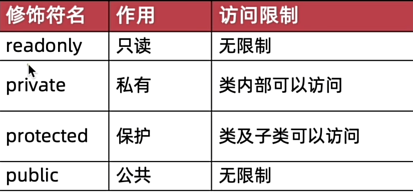
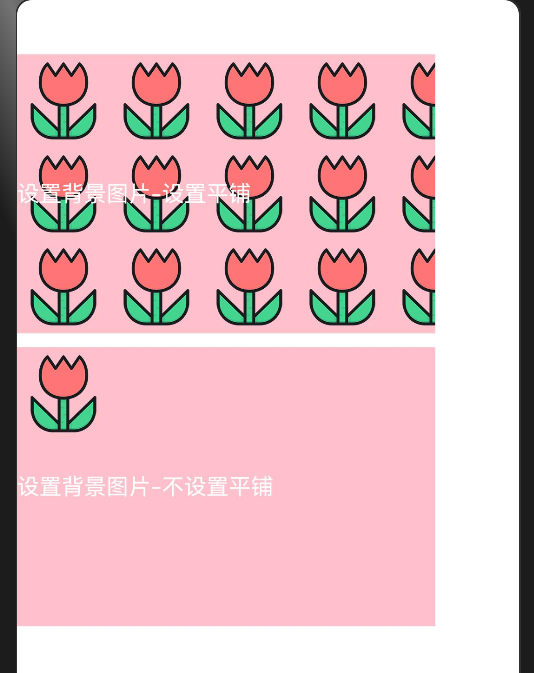
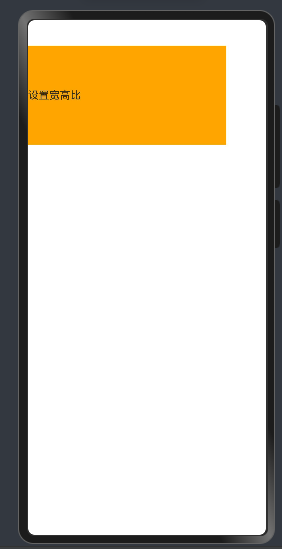
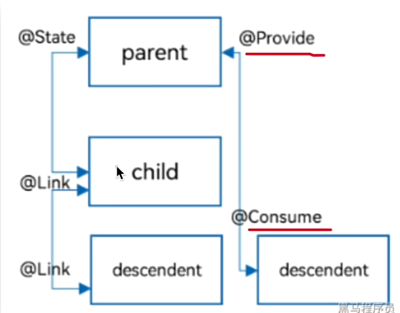
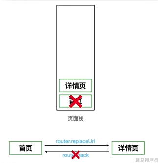
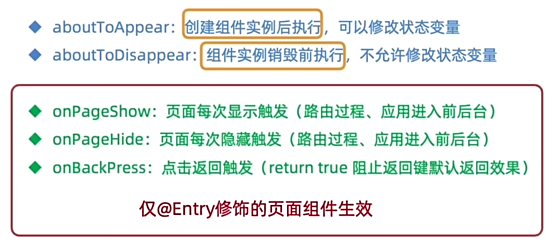
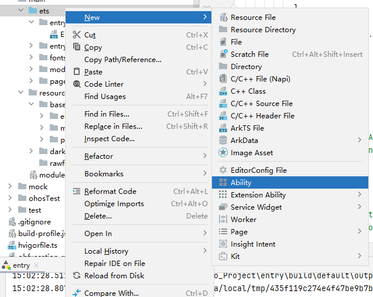
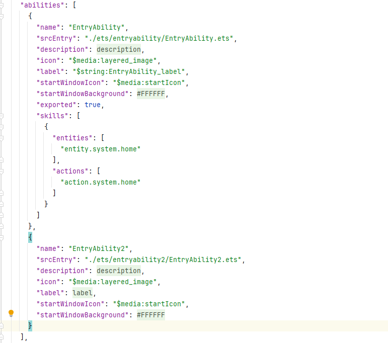

# HarmonyOS开发

HarmonyOS的技术理念：

1.一次开发，多端部署

2.可分可合，自由流转

3.统一生态，原生智能


## ArkTS基础语法

### 变量声明

语法

```ts
let 变量名:类型 = 值
```

```TS
//变量声明
//字符串类型，可以用单引号，也可以用双引号
let name: string = 'Arthur';
console.log("name",name);
//数字类型
let age: number = 21;
console.log("age",age);
//布尔类型
let isLogin: boolean = true;
console.log("isLogin",isLogin);
```


### 常量声明

语法

```TS
const 变量名:类型 = 值
```

```TS
//常量声明
const PI: number = 3.1415926
const companyName:string = "华为"
console.log("PI",PI)
console.log("companyName",companyName)
```


### 变量命名规则

1.变量只能由数字、字母、下划线、美元符$组成，不能以数字开头

2.不能使用内置关键字或保留字作为变量名

3.变量名严格区分大小写


### 数组声明

语法

```TS
let 数组名:类型[] = [数据1，数据2，数据3...]
```

```ts
//数组声明
let hobby:string[] = ["java","c++","game"]
let prices:number[] = [1.1,3.2,4.4,8.8]
console.log("hobby",hobby)
console.log("prices",prices)
//取数组的数据，索引从0开始
console.log("hobby1",hobby[1])  //c++
```


### 操作数组元素

最基本的修改数组元素，可以通过数组下标访问数组然后赋值即可，和Java大差不差。


#### 1.向数组添加元素

向数组添加元素分为从数组头部添加、从数组尾部添加、指定任意位置添加（splice）

1）从数组头部添加，使用`unshift`方法，可以一次性添加多个值，该方法会返回操作后的数组长度

2）从数组尾部添加，使用`push`方法，可以一次性添加多个值，该方法会返回操作后的数组长度


#### 2.删除数组中的元素

从数组中删除元素也分为从数组头部删除、从数组尾部删除、指定任意位置删除（splice）

1）从数组头部删除，使用`shift`方法，该方法会返回被删除的元素

2）从数组尾部删除，使用`pop`方法，该方法会返回被删除的元素


上面讲到的四个方法的综合使用如下：

```ts
let hobby:string[] = ['game','java']
console.log('hobby',hobby)

//添加元素到数组中
//从头部添加
hobby.unshift('C++')
//从尾部添加
hobby.push('ArkTS')
console.log('hobby',hobby)
//可以一次性添加多个元素
hobby.unshift('python','C')   //python,C,C++,game,java,ArkTS
hobby.push('C#','go')
console.log('hobby',hobby)    //python,C,C++,game,java,ArkTS,C#,go


//从数组中删除元素
//从头部删除
console.log("删除了:",hobby.shift());   //go
//从尾部删除
console.log("删除了",hobby.pop());      //python
console.log("hobby",hobby);
```


#### 3.`splice`

除了上面将的新增删除元素的方法，还有一个更为强大的方法：`splice`，它可以用来实现删除操作，也可以实现添加操作，使用语法如下

```ts
数组名.splice(索引,删除元素个数,添加元素1,添加元素2,....)
```

使用示例如下：

```ts
let hobby:string[] = ['game','java','C++','ArkTS']
console.log('hobby',hobby)
//指定位置删除
//从索引1开始，删除1个元素,也可以设置为数字，表示要删除元素的个数
hobby.splice(1,1)
console.log("hobby",hobby);   //game,C++,ArkTS

//指定位置添加元素
//从索引1开始，添加多个元素，指定删除元素个数为0
hobby.splice(1,0,'C#','go')
console.log("hobby",hobby);   //game,C#,go,C++,ArkTS

//实现替换元素--在添加的同时删除
//替换索引为1的元素
hobby.splice(1,1,'python')
console.log("hobby",hobby);   //game,python,go,C++,ArkTS
```


### 函数声明

函数可以理解为可以重复使用的代码块

函数声明语法

```ts
function 函数名 (形参1:类型,形参2:类型...){
	函数体
}
```

```ts
//可以在前面调用
f1()
//函数声明
function f1() {
  console.log("函数体执行,打印字符*", "****")
}
//调用函数
f1();

function buy(num: number, price: number) {
  let result: number = num * price
  return result
}
let applePrices = buy(3,4.5)
console.log("苹果总价",applePrices);
```


### 箭头函数（函数的简化版本）

箭头函数是函数声明简化后的形式，语法如下

```ts
let 函数名 = (形参1:类型,形参2:类型...)=>{
    函数体
}
```

```ts
//使用箭头函数来简化函数声明
let f1 = () => {
  console.log("函数体执行,打印字符*", "****")
}
f1()

let buy = (num: number, price: number) => {
  let result: number = num * price
  return result
}
let sum: number = buy(6, 10)
console.log("sum",sum)
```


### 接口&对象

对象是一个容器，可以用来存储不同类型的数据，通常用来描述一个物体的特征或行为。

对象的创建需要基于接口，接口是用来定义对象的的结构的。

定义接口的语法

```ts
//定义接口
interface Person {
  //接口中属性之间不需要逗号分割
  name: string
  age: number
  hobby: string
}
```


创建对象的语法

```ts
let 对象名:接口类型 = {
    对象的具体属性
}
```

```ts
//使用接口来创建对象
let person: Person = {
  name: 'arthur',
  age: 21,
  hobby: "game"
}
```


访问对象的属性

```ts
对象名.具体的属性名
```

```ts
//访问对象的属性
let myName:string = person.name;
let myAge:number = person.age;
let myHobby:string = person.hobby;
console.log("name",myName)
console.log("age",myAge)
console.log("hobby",myHobby)
```


### 接口继承

使用extends可以实现接口的继承

```ts
//接口继承
interface Animal{
  name:string
  age:number
}

interface Dog extends Animal{
  //继承了Animal接口的所有属性，在此基础上定义自己的属性
  color:string
}

let myDog:Dog = {
  name:'虎狼丸',   //属于Animal接口
  age:3,          //属于Animal接口
  color:'灰色'    //属于Dog接口
}
```


### 接口实现

类可以通过`inplements`关键字来实现接口，从而限制类必须要有哪些属性和方法

```ts
// 接口的实现
interface IDog {
  name:string

  run:()=>void
}

//类实现接口
class Dog implements IDog{
  name: string    //实现接口的属性
  color:string    //类自己定义的属性
  constructor(name:string,color:string) {
    this.name = name
    this.color = color
  }
  //接口的方法
  run(){
    console.log(this.name,'跑得很快');
  }
}
let myDog:Dog = new Dog('虎狼丸','灰色')
myDog.run()
```


### 对象数组

```ts
//对象数组
//首先定义接口
interface Person{
  name:string,
  age:number,
  hobby:string
}
//创建对象数组
//语法： let 数组名:接口名[] = [{定义每一个对象},....]
let persons:Person[] = [
  {name:'arthur',age:18,hobby:'game'},
  {name:'sky',age:20,hobby:'java'},
  {name:'liren',age:21,hobby:'C++'},
  {name:'ArthurSky',age:17,hobby:'ArkTS'},
]
//使用JSON.stringify(复杂对象)，可将各种复杂对象转换成字符串，如：对象、数组
console.log(JSON.stringify(persons));
```


### 对象的方法

前面讲到，对象通常用来描述一个物体的特征和行为，上面讲到对象的属性描述的其实就是对象的特征，而对象的方法就是用来描述对象的行为。

在接口中定义对象的方法

```ts
interface 接口名 {
    //接口中不需要具体去定义方法体，只需要声明一个方法，这和Java的接口类似
    方法名:(形参1:类型,形参2:类型...)=>方法返回类型
}
```

```ts
interface Person {
  name: string
  age: number
  hobby: string
  //定义对象方法
  run: () => void
}
```

在对象中实现具体的方法

```ts
let 对象名:接口名 = {
    方法名:()=>{
        具体的方法体实现
    }
}
```

```ts
let person: Person = {
  name: 'arthur',
  age: 21,
  hobby: "game",

  //实现方法体
  run: () => {
    
    //console.log(name,"跑得贼快");
  	//后面来的，纠个错，上面代码是有错误的，
    //name是无法直接被访问到的，不只是name，在接口中的所有属性，这里的方法都无法访问到
    //只有通过类实现接口的方法，才能在该方法中访问接口的属性
    console.log("跑得贼快");
    
  }
}
```

调用对象的方法

```ts
对象名.方法名()
```

```ts
//调用对象的方法
person.run();
```


### 联合类型数据

联合类型是一种灵活的数据类型，它修饰的变量可以存储不同类型的值

联合类型数据声明

```ts
let 变量名:类型1|类型2|...
```

```ts
//非联合数据类型在存储不同类型数据时会报错
let a:number
a=10    //不会报错
console.log("a",a)
//a='10'  //会报错
//联合数据类型
let judge:number|string
judge=100.0
console.log('judge',judge);
judge='A+'
console.log('judge',judge)
```


此外联合数据类型还可以用来将数据约束到一个数据范围内

```ts
//这样该变量的值只能在数据1、数据2...中取，不能是其他值
let 变量名:数据1|数据2|...
```

```ts
//联合数据类型约束数据范围
let gender:'man'|'woman'|'unknow'
gender = 'man'  //这段代码不会报错
//gender = 'boy'  //boy不属于上面3个数据，因此这段代码会报错
```


### 枚举类型

语法

```ts
enmu 枚举名{
    常量1=值1,
    常量2=值2,
    ...
}
```

下面完成一个案例：利用枚举类型，给变量设置主色，将主色范围限定在红色、橙色、绿色

```ts
//枚举类型
enum themeColor {
  Red = "#ff0f29",
  Orange = "#ff7100",
  Green = "#30b30e"
}

//使用枚举
let color:themeColor = themeColor.Red;
console.log("color",color);
```

从上面的案例我们可以知道，枚举可以用来限定变量的取值范围。

说到取值范围，前面讲的联合类型好像也可以，不过联合类型只能存储变量的真实数据，无法像枚举一样定义多个变量名，这就导致我们无法根据联合类型变量的值来判断这个值究竟代表什么意思，比如上面的案例用联合类型来实现：

```ts
//用联合类型来实现
let color2:"#ff0f29"|"#ff7100"|"#30b30e"
color2 = "#ff0f29" //根据这个值"#30b30e" 我们很难具体得知它到底代表什么颜色
```


### 字符串拼接

ArkTS中字符串拼接用的的是`+`，当加号两边存在字符串时就是拼接字符串操作，当两边都为数字时就是加法运算操作，和Java很像。


### 模板字符串

模板字符串也是用来拼接字符串的，不过相较于使用加号`+`来拼接，模板字符串适合用来拼接多个字符串

模板字符串是由``包裹的字符串，如下示例：

```ts
//模板字符串
let name:string = '小明'
let age:number = 21
//其中 ${变量名} 可以动态获取到变量对应的值
console.log("身份信息：",`姓名：${name},年龄：${age}`);
```


### 类型转换（数字和字符串）

#### 字符串转数字

##### 1.Number()

```ts
//s是某一个字符串
let n:number = Number(s)
```

```ts
let str1:string = '1'
let str2:string = '1.2'
let str3:string = '1.2a'
let str4:string = 'a'

console.log("str1",Number(str1))  //1
console.log("str1",Number(str2))  //1.2
console.log("str1",Number(str3))  //NaN 如果转换失败，返回NaN
console.log("str1",Number(str4))  //NaN
```

##### 2.parseInt()

获取字符串的整数部分，然后转换成数字

```ts
let n:number = parseInt(s)
```

```ts
console.log("str1",parseInt(str1))  //1
console.log("str1",parseInt(str2))  //1
console.log("str1",parseInt(str3))  //1 parseInt会先去掉小数部分，再进行转换
console.log("str1",parseInt(str4))  //NaN
```

##### 3.parseFloat()

获取字符串的小数部分，然后转换成数字，获取第一个非数字以前的所有数字部分，因此字符串中如果有非数字，只要截取的部分能够转换成数字就不会返回NaN

```ts
console.log("str1",parseFloat(str1))  //1
console.log("str1",parseFloat(str2))  //1.2
console.log("str1",parseFloat(str3))  //1.2 这个注意一下，就算最后面有个a也不会影响转换，它会截取第一个非数字前的所以数字
console.log("str1",parseFloat(str4))  //NaN
```


#### 数字转字符串

##### 1.toString()

数字直接转换成对应的字符串

```ts
//数字转字符串
let num1:number = 1.1
let num2:number = 1.9
let num3:number = 1.9152

//数字直接转换成对应的字符串 .toString()
console.log('num1',num1.toString())   //1.1
console.log('num2',num2.toString())   //1.9
console.log('num3',num3.toString())   //1.9152
```

##### 2.toFixed()

四舍五入转成字符串，并且可以设置保留几位小数

```ts
//四舍五入转成字符串，并且可以设置保留几位小数, toFixed(保留几位小数)
console.log('num1',num1.toFixed())    //默认保留0位小数，1
console.log('num2',num2.toFixed())    // 2
console.log('num3',num3.toFixed(2))    //保留两位小数 1.92
```


### 交互-点击事件

通过配置组件的`.onClick()`属性来设置组件的点击事件，语法如下：

```ts
//最典型的Button组件
Button()
	.onClick(
		()=>{
            //当组件被点击后就会执行该函数
        }
)
```

示例：

```ts
@Entry
@Component
struct Click {
  build() {
    //点击事件
    Row() {
      Column() {
        Button('点击弹出提示框')
          .onClick(
            () => {
              AlertDialog.show({
                message: '这是一个提示框'
              })
            }
          )
        //除了用在按钮上，也可以给文本框设置点击事件
        Text('点击这个文本')
          .onClick(
            () => {
              AlertDialog.show({
                message:'这是文本框的点击事件'
              })
            }
          )
      }
      .width('100%')
    }
    .width('100%')
    .height('100%')

  }
}
```


### 状态管理（@State）

如果想要构建一个动态页面，即页面会随着交互进行相应的改变，就需要使用到状态管理。

这里首先要引入两个概念：1.普通变量 2.状态变量

#### 1.普通变量

```ts
//全局普通变量
let var:number = 1

struct demo{
    //局部普通变量，调用时需要使用this
    var2:number = 2
}
```

类似于上面这样声明的变量就是普通变量。

普通变量只会在页面初始化时渲染，后序就算发生改变，页面也不会重新渲染这个变量


#### 2.状态变量

```ts
struct demo{
    @State var:string = '3'
}
```

像上面这种声明时使用了`@State`装饰器的变量就是状态变量，该变量必须设置类型和初始值。

状态变量的特点时一旦发生改变，就会立刻更新页面


示例：

```ts
//组件外的普通变量
let myName: string = 'Arthur'

@Entry
@Component
struct stateDemo {
  //组件内的普通变量
  myAge: number = 21
  //组件内的状态变量
  @State msg: string = 'Hello,World!'

  build() {
    Column() {
      Column() {
        Row() {
          Text(this.msg)
            .fontSize(50)
        }
        Row({space:5}) {
          Button('中文')
            .width(100)
            .fontSize(24)
            .onClick(
              ()=>{
                //修改状态变量，页面会立刻更新
                this.msg = '你好,世界!'
              }
            ).layoutWeight(1)
          Button('English')
            .width(100)
            .fontSize(24)
            .onClick(
              ()=>{
                this.msg = 'Hello,World!'
              }
            ).layoutWeight(1)
        }
        .padding({left:5,right:5})

        Blank()
        Row() {
          Text(myName)
            .fontSize(50)
          Text(this.myAge.toString())
            .fontSize(50)
        }
        Row({space:5}) {
          Button('修改姓名')
            .width(100)
            .fontSize(24)
            .onClick(
              ()=>{
                //修改普通变量，页面不会更新
                myName = 'sky'
                console.log('myName',myName)
              }
            ).layoutWeight(1)
          Button('修改年龄')
            .width(100)
            .fontSize(24)
            .onClick(
              ()=>{
                this.myAge = 22
                console.log("myAge",this.myAge)
              }
            ).layoutWeight(1)
        }
        .padding({left:5,right:5})

      }
      .height('100%')
    }
    .width('100%')
    .height('100%')
  }
}
```


### 状态管理补充


这里的对象第二层开始的属性如果发生变化，框架无法观察到这个修改。

例如:person里面的name改变可以引起刷新，dog改变也可以引起刷新，因为它们都是第一层数据，但是dog.name发生变化就无法引起刷新，因为第二层开始的属性变化框架无法观察到。


### 案例：实现计数器

```ts
@Entry
@Component
struct countDemo {
  @State count: number = 1

  build() {
    Row() {
      Button('-')
        .onClick(
          () => {
            this.count = this.count - 1
          }
        )
      Text(this.count.toString())
        .fontSize(24)
        .margin({left:10,right:10})
      Button('+')
        .onClick(
          () => {
            this.count = this.count + 1
          }
        )
    }
    .padding(10)
  }
}
```


### 算数运算符和赋值运算符

简单看看就行，基本和Java一样


### 一元运算符

也基本和Java一样。


还有自增`++`和自减`--`


### 运算符优先级


### 分支语句-if

也和Java大差不差

#### 1.单分支

```ts
if(逻辑条件){
	//条件成立时执行的代码
}
```

#### 2.双分支

```ts
if(逻辑条件){
	//条件成立时执行的代码
}
else{
    //条件不成立时执行的代码
}
```

#### 3.多分支

```ts
if(条件1){
	//条件1成立时执行的代码
}
else if(条件2){
    //条件2成立时执行的代码
}
else if(条件3){
    //条件3成立时执行的代码
}
else if(条件3){
    //条件3成立时执行的代码
}
...
else{
   //全部条件都不成立时执行的代码 
}
```

注意一点，如果逻辑条件的值不为布尔值，它会自动转化成布尔值。


### switch分支

也和Java大差不差

```ts
switch(表达式){
        case:值1
        与值1匹配时执行的代码
        break
        case:值2
        与值2匹配时执行的代码
        break
        case:值3
        与值3匹配时执行的代码
        break
        ...
    default:
        都匹配不到时执行的代码
}
```


### 三元条件表达式

和Java一模一样

```ts
逻辑表达式?表达式结果为true执行的代码:表达式结果为fasle执行的代码
```


### 条件渲染

基于各种分支语句，实现不同条件下渲染不同的UI界面

```ts
@Entry
@Component
struct test{
  @State age:number = 17
  build() {
    //条件渲染
    Column(){
      Row(){
        //年龄不同，渲染的文本不同
        if(this.age<18){
          Text('未成年')
        }else if(this.age>=18&&this.age<60){
          Text('成年人')
        }else{
          Text('老年人')
        }
      }
      Button('成长+1')
        .onClick(
          ()=>{
            this.age+=1
          }
        )
    }
    .width('100%')
  }
}
```


### 循环

和Java一模一样

```ts
while(条件表达式){
    //条件表达式为true执行的代码
}

for(let i = 1;i<某个数;i++){
    //循环执行的代码
}
```

退出循环的用法也一样，break和continue都是与Java一样的用法


### 遍历数组

遍历数组当然可以使用普通for循环来遍历了（ArkTS的数组也可以通过`.length`来获取长度），这样方式就不多讲了。

这里讲一下ArkTS提供的另一种遍历数组的方式`for...of`

```ts
//item变量用于接收遍历到的数组元素，这个变量的名字可以任取
for(let item of 数组名){
    //执行逻辑
    console.log("item",item)
}
```

使用示例：

```ts
let hobby:string[] = ['game','java','C++','ArkTS']
//遍历数组
for(let element of hobby){
  console.log('element',element)
}
```


### ForEach渲染控制

ForEach可以基于数组的个数来渲染组件，数组中有多少个元素，就可以渲染多少个组件，简化了代码的书写。因为在这之前，我们渲染多个组件就是通过手写多个组件的方式，非常繁琐。

使用语法:

```ts
//item代表遍历到的数组元素，index代表下标
ForEach(数组名,(item:类型,index:类型)=>{
    组件的渲染逻辑
})
```

使用示例：

```ts
@Entry
@Component
struct ForEachDemo {
  @State titles:string[] = ['电子产品','精品服饰','母婴产品','影音娱乐','海外旅游']
  build() {
    //ForEach渲染控制
    Column(){
      //item代表遍历的数组元素，index代表下标，类型也可以不写，因为通常都是number
      ForEach(this.titles,(item:string,index:number)=>{
        Text((index+1).toString()+item)
          .fontSize(24)
          .fontColor(Color.Orange)
          .fontWeight(FontWeight.Bold)
      })
    }
  }
}
```

渲染结果：


### Class类

类是用来创建对象模板的，可以定义对象的属性、方法以及构造函数。

前面用到了`interface`也可以创建对象，但是如果需要定义一个更复杂的对象用的比较多的还是Class

#### 1.实例属性

定义Class的属性语法如下图所示：


其中字段名后面带有问号`?`的代表属性可选，非可选属性需要在定义时给出初始值。

使用示例：

```ts
//类名首字母大写（规范）
class Cat{
  //定义属性
  name:string = 'Tom'
  //可选属性，定义时不需要给出初始值
  foods?:string
}

//创建类的对象
let littleCat:Cat = new Cat()
//获取类的属性
console.log(littleCat.name);    //Tom
console.log(littleCat.foods);   //undefined

//打印属性的长度，如果是可选属性，需要配合 可选链操作符?使用，因为可选属性不一定存在
console.log(littleCat.name.length.toString());    //3
//如果不加？就会报错
littleCat.foods = '鱼罐头'
console.log(littleCat.foods?.length.toString());   //3


@Entry
@Component
struct ClassDemo {
  build() {

  }
}
```


#### 2.构造函数

构造函数用来初始化对象的属性，其使用语法如下：


使用示例：

```ts
class Food {
  //如果有构造函数，就可以不给属性赋初始值
  name: string
  price: number
  desc: string

  //构造函数，初始化属性
  constructor(name: string, price: number, desc: string) {
    this.name = name
    this.price = price
    this.desc = desc
  }
}

//创建对象时传入构造函数的参数
let food1:Food = new Food('土豆丝',12,'土豆丝永不过时')
let food2:Food = new Food('黄瓜炒鸡蛋',20,'清爽可口')
```

传入构造函数的参数时需要严格按照顺序来，但是如果参数过多时，顺序容易混乱，就会照成不必要的麻烦，要解决这个问题可以将构造函数结合`interface`使用，传入构造函数的参数不再是一个一个单独的参数，而是一个`interface`的参数对象，interface定义了这个构造方法所需的所有参数，这样在使用构造函数时就会方便很多，如下示例：

```ts
//定义接口
interface food{
  name: string
  price: number
  desc: string
}

class Food {
  //如果有构造函数，就可以不给属性赋初始值
  name: string
  price: number
  desc: string

  //构造函数参数传入的是参数对象，不再是一个个属性
  constructor(paramsObj:food) {
    this.name = paramsObj.name
    this.price = paramsObj.price
    this.desc = paramsObj.desc
  }
}

//传入参数对象
let food1:Food = new Food({
  name:'土豆丝',
  price:12,
  desc:'土豆丝真好吃'
})
let food2:Food = new Food({
  name:'黄瓜炒鸡蛋',
  price:20,
  desc:'清爽可口'
})
```


#### 3.定义方法

在类中定义方法的语法如下:


使用示例：

```ts
class Person {
  name: string
  age: number

  constructor(name: string, age: number) {
    this.name = name
    this.age = age
  }

  //定义方法,如果没有返回值，就不需要写返回值类型
  sayHi(name:string){
    console.log('hello',name,'my name is',this.name);
  }
  //如果有返回值，需要写返回值类型
  getAge():number{
    return this.age
  }
  
}

let person:Person = new Person('Arthur',18)
//调用对象的方法
person.sayHi('Sky')
console.log(person.getAge().toString());


@Entry
@Component
struct ClassDemo {
  build() {

  }
}
```


#### 4.静态属性和静态方法

定义类的静态属性和静态方法的语法如下：


使用示例：

```ts
class Animal{
  //定义静态属性，如果不设置初始值，默认为undefined
  static home:string = '地球'

  //定义静态方法
  static live(){
    console.log('住在地球');
  }

}

//调用类的静态方法，通过类名来调用，不需要实例对象名
console.log(Animal.home);
Animal.live()

@Entry
@Component
struct ClassDemo {
  build() {

  }
}
```


#### 5.继承extends

类可以通过继承快速获取另一个类的字段和方法，继承的语法如下：


如果要在子类中调用父类方法，需要使用`super`关键字


```ts
//父类
class Animal{
  name:string

  constructor(name:string) {
    this.name=name
  }

  run(){
    console.log('动物都会跑');
  }
}

//子类继承父类
class Cat extends Animal{
  //子类自己的属性
  age:number


  constructor(name:string,age:number) {
    //调用父类的构造方法
    super(name)
    this.age=age
  }

  //重写父类的函数
  run(){
    //调用父类的函数
    super.run()
    console.log('猫跑得更灵活');
  }
}

//子类继承父类
class Dog extends Animal{
  //子类自己的属性
  age:number


  constructor(name:string,age:number) {
    //调用父类的构造方法
    super(name)
    this.age=age
  }

  //重写父类的函数
  run(){
    //调用父类的函数
    super.run()
    console.log('狗跑得更快');
  }
}

let cat:Cat = new Cat('Mona',3)
let dog:Dog = new Dog('虎狼丸',2)
//子类重写了run方法，因此Cat和Dog run方法的执行结果会不一样
cat.run()
dog.run()


@Entry
@Component
struct ClassDemo {
  build() {

  }
}
```


#### 6.instanceof

`instanceof`用于判断一个对象是否为某个类

`typeof`也可以来获取某个变量的属于哪个类，但是`typeof`只能用于判断简单类型如：string，number，复杂的对象就不行。

```ts
class Animal{}
class Dog extends Animal{}
class Cat extends Animal{}

let dog:Dog = new Dog()
let cat:Cat = new Cat()

console.log('判断结果',dog instanceof Dog); //true
console.log('判断结果',dog instanceof Cat); //false
console.log('判断结果',dog instanceof Animal); //true

//typeof
console.log(typeof cat);    //只会显示object，无法具体得知cat是什么类型
console.log(typeof 123);    //number，对于简单类型可以判断
console.log(typeof '123');  //string


@Entry
@Component
struct ClassDemo {
  build() {

  }
}
```


#### 7.类的修饰符

可以通过类的修饰符来限制类的属性、方法的访问

修饰符包括：`readonly`、`private`、`protected`、`public`，如果不写修饰符默认为`public`

`readonly`只读


private 只允许在类的内部访问

protected 也不允许在类的外部访问，但是允许在派生类（子类）中访问




### 剩余参数和展开运算符

#### 1.剩余参数

剩余参数类似于Java中的可变参数，可以将多个不定量的参数表示为一个数组，其使用语法如下


```ts
//剩余参数
function sum (num1:number,num2:number,...numArr:number[]){
  let sum:number =  num1+num2;
  for(let num of numArr){
    sum+=num
  }
  return sum
}

console.log(sum(1, 2).toString());    //3
console.log(sum(1, 2, 3, 4).toString());    //10
console.log(sum(1, 2, 3, 4, 5, 6, 7).toString());  //28
```


#### 2.展开运算符

展开运算符：`...`

在ArkTS中，展开运算符可以用来将一个数组中的内容全部展开比如[1,2,3,4]就会展开成1,2,3,4  这可以用在参数中


```ts
//展开运算符，可以用来平铺数组
let arr1:number[] = [1,2,3]
let arr2:number[] = [4,5,6,7]
//这里就将arr1和arr2展开了
let arrSum:number[]= [...arr1,...arr2]    //结果为：1,2,3,4,5,6,7
console.log('arrSum',arrSum);
```


### 泛型

#### 1.泛型函数

泛型函数的定义语法如下：


```ts
//泛型函数
//定义泛型函数
function fn<T> (param:T):T{
  return param
}
//调用泛型函数，需要执行泛型参数
fn<number>(123)
fn<string>('1234')
fn<boolean>(true)
fn<number[]>([1,2,3])

//也可以不指定泛型参数，ArkTS会自动推断参数类型，然后判断泛型参数T是什么
fn(123)
fn([1,2,3,4])
```


#### 2.泛型约束

没有约束泛型时，能够传任意类型的数据

使用泛型约束，来限制传递的类型


```ts
//泛型约束
interface ILength {
  length: number
}
//约束传进来的泛型必须要有length属性
function fn3<T extends ILength>(param: T): number {
  console.log(param.length.toString());
  return param.length
}
//number没有length属性，不可以传
// fn3<number>(1)
//string有length属性，可以传
fn3<string>('123')
//数组有length属性，可以传
fn3<number[]>([1,2,3,4])
```


#### 3.多个泛型参数


#### 4.泛型接口

定义泛型接口的语法如下：


```ts
//泛型接口
interface id<T>{
  id:T
  getId:()=>T
}

//实现泛型接口
let myId:id<number> = {
  id:123,
  getId(){
    return 12
  }
}
```


#### 5.泛型类

泛型类的定义语法如下：


```ts
//泛型类
class ID<T>{
  id:T
  constructor(id:T) {
    this.id = id
  }

  getID():T{
    return this.id
  }

}

let myId:ID<number> = new ID(123)
console.log(myId.getID().toString());
let myId2:ID<string> = new ID('1234')
console.log(myId2.getID());
```


### 模块化语法

当一个功能比较复杂时，可以将其拆分为多个模块，然后通过导入使用这些模块，可以完成各种复杂的功能，而且模块可以复用。

实际上每一个`ets`都相当于是一个模块。


#### 1.默认导入和导出

从一个模块A中导出一个值或者对象，甚至可以是一个函数，然后在另一个模块B中导入，就可以在模块B中使用模块A中的内容了

使用语法如下：


使用示例：

module1

```ts
//模块1

//导出语句要写在导出内容的下面
// export default num  这行代码会报错

let num:number = 3

interface obj{
  name:string,
  age:number
}
let myObj:obj={
  name:'sky',
  age:18
}

function fn(id:number):number{
  return id
}

//默认导出，注意，导出语句要写在导出内容的下面，并且默认导出只能导出一个
//可以导出一个值
// export default num
//还可以导出对象
export default myObj
//也可以导出函数
// export default fn
```


module2

```ts
//模块2
//默认导入
import obj from './module1'

console.log('模块1的导出内容',JSON.stringify(obj));

@Entry
@Component
struct module2 {
  build() {

  }
}
```


#### 2.按需导出和导入


要注意的是，按需导入和导出，导入的名字要与导出的名字对应，如果要自定义名字需要使用`as`

使用示例：

module1

```ts
let num:number = 3

class Obj{
  name:string
  age:number
  constructor(name:string,age:number) {
    this.name=name
    this.age=age
  }
}
let myObj:Obj = new Obj('Arthur',21)

function sayHi(){
  console.log('Hello,World!');
}

//按需导出
export {
  num,
  myObj,
  sayHi
}
```

module2

```ts
//模块2
//按需导入
import {num,myObj,sayHi as sayHello} from './module1'

console.log('模块1的内容',num,JSON.stringify(myObj));
sayHello()

@Entry
@Component
struct module2 {
  build() {

  }
}
```


#### 3.全部导入


注意全部导入必须要设置别名

使用示例：

module1

```ts
let num:number = 3

class Obj{
  name:string
  age:number
  constructor(name:string,age:number) {
    this.name=name
    this.age=age
  }
}
let myObj:Obj = new Obj('Arthur',21)

function sayHi(){
  console.log('Hello,World!');
}

//按需导出
export {
  num,
  myObj,
  sayHi
}
```

module2

```ts
//模块2
//全部导入，这里必须设置别名
import * as module1 from './module1'

//通过 别名.内容  的方式来访问全部导入的内容
console.log('模块1的内容',module1.num,JSON.stringify(module1.myObj));
module1.sayHi()

@Entry
@Component
struct module2 {
  build() {

  }
}
```


## ArkUI

ArkUI（方舟开发框架）是一套构建鸿蒙应用界面的框架

### 基于ArkUI开发界面的布局思路

在ArkUI开发框架中，构建页面的最小单位是“组件”

组件分为：基础组件和容器组件


基于ArkUI开发界面的布局思路就是：先排版，再放内容

比如下面这个界面


再来看看最基础的HelloWorld页面代码

```ts
@Entry
@Component
struct Index {
  @State message: string = 'Hello World';

  //所有的页面代码都要写在build组件里面
  build() {
    //容器组件：列Column
    Column() {
      //容器组件：行Row
      Row() {
        Text(this.message)
          .id('HelloWorld')
          .fontSize($r('app.float.page_text_font_size'))
          .fontWeight(FontWeight.Bold)
          .alignRules({
            center: { anchor: '__container__', align: VerticalAlign.Center },
            middle: { anchor: '__container__', align: HorizontalAlign.Center }
          })
          .onClick(() => {
            this.message = 'Welcome';
          })
      }
      .width('100%')
      .height('100%')
    }
    .height('100%')
    .width('100%')
  }
}
```


### 组件语法

#### 1.容器组件

使用容器组件来搭建页面布局的整体排版，常用的容器组件有：行Row、列Column

使用容器组件的语法

```ts
容器组件(){
    内容
}
```

```ts
Column(){
    Text('具体内容')
}
```

#### 2.基础组件

基础组件就是放在容器组件内部的组件，比如:文字Text、图片等

使用基础组件的语法

```ts
基础组件(参数)
```

```ts
Text('Text就是一个基础组件')
```


#### 3.案例

比如我们现在需要完成下面的布局


首先我们先完成布局

```ts
@Entry
@Component
struct Demo1{
  build() {
    //列容器，用来存放所有页面内容
    Column(){
      //行容器，用来存放 都市、都市生活。。。这一排内容
      Row(){
        
      }
    }
  }
}
```


然后我们可以向布局中添加内容

```ts
@Entry
@Component
struct Demo1 {
  build() {
    Column() {
      //向布局添加内容
      Text('小说简介')
      Row() {
        //向布局添加内容
        Text('都市')
        Text('都市生活')
        Text('情感')
        Text('男频')
      }
    }
  }
}
```

此时的页面效果是这样的


### 组件属性方法

通过修改组件的属性，我们可以去美化页面内容。

组件属性的使用语法:

1.容器组件的组件属性

```ts
组件()){}
.属性方法1(参数)
.属性方法2(参数)
.属性方法3(参数)
。。。
.属性方法n(参数)
```

2.基础组件的组件属性

```ts
组件()
.属性方法1(参数)
.属性方法2(参数)
.属性方法3(参数)
。。。
.属性方法n(参数)
```

常见的几个属性方法：


接下来我们再使用组件属性方法来优化上面还未完成的案例，我们先将其优化成下图这样：


```ts
@Entry
@Component
struct Demo1 {
  build() {
    //build里面只能有一个容器组件
    Column() {
      //容器内的内容默认是居中的。
      Text('小说简介')
        .width('100%')
        .fontSize(20)
        .fontWeight(FontWeight.Bold)  //也可以填100-900之间的数字，可以记住两个常用的值 加粗：700 默认：400
      Row() {
        Text('都市')
          .width(50)
          .height(30)
          .backgroundColor(Color.Orange)
        Text('都市生活')
          .width(80)
          .height(30)
          .backgroundColor(Color.Pink)
        Text('情感')
          .width(50)
          .height(30)
          .backgroundColor(Color.Yellow)
        Text('男频')
          .width(50)
          .height(30)
          .backgroundColor(Color.Gray)
      }
      .width('100%')
    }
    .width('100%')
  }
}
```


### 案例：完成新华社新闻置顶页面布局

完成下面这个页面布局


```ts
@Component
@Entry
struct Demo2 {
  build() {
    Column() {
      Text('学鸿蒙，就来黑马程序员~')
        .width('100%')
        .height(30)
        .fontSize(24)
      Row() {
        Text('置顶  ')
          .fontColor('#df3c50')
        Text('新华社  ')
          .fontColor('#a1a1a1')
        Text('4680评论')
          .fontColor('#a1a1a1')
      }
      .width('100%')
    }
    .width('100%')
  }
}
```


### 文本溢出省略、设置文本行高

#### 1.设置文本溢出省略

使用组件属性方法：`.textOverflow`，其使用细节如下图所示


#### 2.设置文本行高

使用组件属性方法：`.lineHeight(数字)`


基于以上两个属性方法，实现下面的页面效果，即：如果文本放不下了，就自动用省略号省略后面的文本


```ts
@Entry
@Component
struct Demo3{
  build() {
    Column(){
      Text('HarmonyOS 应用开发者基础认证')
        .width('100%')
        .fontSize(23)
        .fontWeight(FontWeight.Bold)
      Row(){
        Text('通过系统化的课程学习，熟练掌握 DevEco Studio，ArkTS，ArkUI，预览器，模拟器，SDK 等 HarmonyOS 应用开发的关键概念，具备基础的应用开发能力。')
          //设置文本行高
          .lineHeight(20)
          .textOverflow({
            overflow:TextOverflow.Ellipsis
          })
          .maxLines(2)
      }

    }
    .width('100%')
  }
}
```


### 图片组件

图片组件是`image(图片地址)`

图片组件加载的图片分为网络图片和本地图片，它们的写法会有所不一样

1.网络图片

```ts
image('网络图片地址')
```

2.本地图片

本地图片资源通常放在项目中的`resources`文件夹下的`/base/media`中，如下图


加载本地文件的语法为：

```ts
image($r('app.media.图片文件名'))
```


比如现在需要完成类似这样一个页面布局


我这里的网络图片链接为:https://javaweb-tlias-case-sky.oss-cn-beijing.aliyuncs.com/pictures/fbd1129a-5891-4897-ba6a-54d8fece11b3.jpg

```ts
@Entry
@Component
struct Demo4{
  build() {
    Column(){
      //加载网络图片
      Image("https://javaweb-tlias-case-sky.oss-cn-beijing.aliyuncs.com/pictures/fbd1129a-5891-4897-ba6a-54d8fece11b3.jpg")
        .width(300) //设置一下图片的大小，设置宽、高任意一个就行，它会自动等比例缩放
      Text('新建的大桥真是宏伟！')
        .width(300)
      Row(){
        //加载本地图片,注意图片名只能由字母数字下划线组成
        //Image($r('app.media.呆呆雾子'))
        Image($r('app.media.kiriko'))
          .width(20)
        Text('爱玩守望的sky')
          .fontSize(10)
      }
      .width(300)
    }
  }
}
```

效果如下


### 输入框组件

输入框组件是使用`TextInput`组件，其使用语法如下

```ts
TextInput(参数对象)
	.属性方法()
```

其中参数对象经常使用的是placeholder，用来设置输入框的提示

属性方法常用`.type()`,用来设置输入框类型，常用的两个类型:`InputType.Normal`（默认）、`InputType.Password` 密码


通过实现下面的布局来熟悉输入组件的使用


```ts
@Entry
@Component
struct Demo5{
  build() {
    Column({
      //设置组件之间的间距
      space:10
    }){
      TextInput({
        //参数对象
        placeholder:'请输入用户名'
      })
      TextInput({
        placeholder:'请输入密码'
      })
        //设置输入框类型
        .type(InputType.Password)
      Button('登录')
        .width(200)
    }
  }
}
```

实现结果


### 案例：实现华为登录页面

 

```ts
@Entry
@Component
struct HuaweiLogin{
  build() {
    Column({space:15}){
      Image($r('app.media.huawei'))
        .width(50)
      TextInput({
        placeholder:'请输入用户名'
      })
      TextInput({
        placeholder:'请输入密码'
      }).type(InputType.Password)
      Button('登录')
        .width('100%')
      Row({space:15}){
        Text('前往注册')
        Text('忘记密码')
      }
    }
    .width('100%')
    //设置容器的内边距
    .padding(30)
  }
}
```

实现结果


### svg图标

svg是*Scalable Vector Graphics*的缩写，意为可缩放矢量图像

它相对于普通的png等格式的图片有以下两点好处：

1.它可以任意缩放，且不会失真

2.它的颜色可以随时改变


获取svg可以从Harmony官方图标库中下载，官方图标库：[HarmonyOS 主题图标库 | icon素材免费下载 | 华为开发者联盟](https://developer.huawei.com/consumer/cn/design/harmonyos-icon/)

svg的使用和普通图片的使用方式没有任何差别，都是通过Image组件来使用的

```ts
@Entry
@Component
struct svg {
  build() {
    Column() {
      //与使用普通图片一样来使用svg
      Image($r('app.media.ic_gallery_create'))
        //svg的放大与缩小不会导致图片的失真
        .width(200)
        //可以修改svg图片的颜色
        .fillColor(Color.Pink)
    }
  }
}
```


### 布局元素的组成

一个组件的布局元素如下图所示：

经典的盒子模型


#### 内边距（padding）

要设置组件的内边距需要通过`.padding()`属性方法

如果上下左右四个方向的内边距一致，可以直接通过`.padding(数值)`来统一设置

但是如果上下左右四个方向的内边距不一致，就需要单独进行设置了

```ts
Text('内边距的设置')
  .backgroundColor(Color.Pink)
  .padding(20)    //四个方向内边距一致的情况

Text('内边距的设置')
  .backgroundColor(Color.Pink)
  .padding({
    left:30,
    top:10,
    right:20,
    bottom:5
  })    //四个方向内边距不一致的情况
```


#### 外边距（margin）

要设置组件的外边距可以通过`.margin()`属性方法来设置

与设置内边距同理，如果外边距四个方向一致，就只需要`.margin(数值)`，来统一设置

如果外边距四个方向不一致，就需要单独设置

```ts
@Entry
@Component
struct Demo6{
  build() {
    Column(){
      Row(){
        Text('刘备')
          .backgroundColor(Color.Green)
        Text('关羽')
          .backgroundColor(Color.Blue)
          .margin(20)     //四个方向外边距一致的情况
        Text('张飞')
          .backgroundColor(Color.Red)
      }
      Row(){
        Text('刘备')
          .backgroundColor(Color.Green)
          .margin({
            right:20
          })//如果两个组件同时设置了外边距，那这个外边距就会叠加
        Text('关羽')
          .backgroundColor(Color.Blue)
          .margin({
            left:20,
            right:30
          })     //四个方向外边距不一致的情况
        Text('张飞')
          .backgroundColor(Color.Red)
      }
    }
  }
}
```

通过再容器组件上配置space属性也能够实现容器内组件之间保持间距，但是这种方式保持的间距只能是统一的。

而使用margin可以更加灵活地来设置组件之间的边距


#### 案例：实现QQ音乐登录页面

```ts
@Entry
@Component
struct QQMusicLogin{
  build() {
    Column(){
      Image($r('app.media.m_user'))
        .width(100)
      Text('大王叫我来巡山')
        .margin({
          top:10,
          bottom:30
        })
      Button('QQ登录')
        .width('100%')
        .margin({
          bottom:10
        })
      Button('微信登录')
        .backgroundColor('#ddd')
        .fontColor('#000')
        .width('100%')
    }
    .width('100%')
    .padding(20)
  }
}
```

实现结果


#### 边框（border）

边框的作用是给组件添加边界，进行装饰美化

配置边框的语法

```ts
组件()
.border({
    //可以3个属性
 	width:值,			//配置边框的宽度，这个是必须要配置的
    color:值,			//配置边框的颜色，不是必须的，默认为黑色
    style:BorderStyle类型的值				//配置边框的样式，不是必须的，默认为实线
	
    //以上三个属性在只配一个值得时候都是统一配置四个方向得边框
    //如果希望四个方向上配置不同得边框，可以传入对象，如下
    width:{
    	left:值,
    	top:
    	...
	},
    color:{
    	left:值,
        ...
    },  
    style:{
        left:值,
        ...
    }  
        
})

```


```ts
@Entry
@Component
struct Border{
  build() {
    Column(){
      Row({space:10}){
        Text('组件1')
          .backgroundColor(Color.Gray)
          .border({
            width:2,
            color:Color.Orange,
            style:BorderStyle.Dotted
          })  //四个方向边框一致的情况

        Text('组件2')
          .backgroundColor(Color.Pink)
          .border({
            width:{
              right:1,
              left:2
            },
            color:{
              right:Color.Blue,
              left:Color.Red
            },
            style:{
              right:BorderStyle.Dashed,
              left:BorderStyle.Dotted
            }
          })    //四个方向边框不一致的情况
      }
      .padding(10)
    }
  }
}
```

运行结果


### 设置组件圆角

使用`.borderRadius()`来设置组件圆角

与设置外边距、内边距同理，如果传入一个参数就代表统一设置四个方向的圆角，也可以传入一个参数对象来分别设置各个方向的圆角

```ts
@Entry
@Component
struct radiusDemo{
  build() {
    Column(){
      //设置组件圆角
      Text('没有圆角')
        .width(100)
        .height(60)
        .backgroundColor(Color.Pink)
        .margin({bottom:10})

      Text('添加圆角')
        .width(100)
        .height(60)
        .backgroundColor(Color.Orange)
        .borderRadius(10)   //统一设置圆角
        .borderRadius({     //会覆盖掉上面的同样的圆角配置
          //分别设置圆角
          topLeft:5,
          topRight:10,
          bottomLeft:20,
          bottomRight:20,
        })
        .margin({bottom:10})
      Text('VIP')
        .width(100)
        .height(60)
        .backgroundColor(Color.Orange)
        .borderRadius({
          topLeft:20,
          bottomRight:20,
        })

    }
    .padding(10)

  }
}
```

运行结果


### 特殊形状的圆角设置

如何设置一些特殊的圆角呢？比如正圆、胶囊

#### 1.正圆

正圆的设置要求组件的宽和高一定要一样，在此基础上设置圆角大小为宽（高）长度的一半

```ts
//设置正圆
Image($r('app.media.kiriko'))
  .width(100)
  .height(100)      //正圆要求组件宽高一致
  .borderRadius(50) //设置圆角大小为宽（高）的一半
```

#### 2.胶囊

胶囊分为横向胶囊和纵向胶囊

横向胶囊关注组件的高，设置圆角为高的一半

纵向胶囊关注组件的宽，设置圆角为宽的一半

```ts
//设置胶囊
Text('横向胶囊')
  .backgroundColor(Color.Pink)
  .height(30)
  .borderRadius(15)   //横向胶囊关注组件的高，设置圆角为高的一半

Text('纵向胶囊')
  .backgroundColor(Color.Orange)
  .width(30)
  .borderRadius(15)   //纵向胶囊关注组件的宽，设置圆角为宽的一半
```

运行结果如图


### 背景属性

常用的背景属性如下图所示


背景色前面都用的比较多了，就不讲了

#### 1.背景图片

背景图片的设置可以通过`.backgroundImage('图片地址',设置平铺方式)`来实现

图片地址使用方式和`Image`组件一致，可以使用本地图片和网络图片。

而平铺方式是指设置背景图的填充规则，它可以设置4种规则，如下图所示，它是`ImageRepeat`枚举类型


如果不设置这个值，默认为不平铺。


```ts
@Entry
@Component
struct BackgroundDemo {
  build() {
    Column({ space: 10 }) {
      Text('设置背景图片-设置平铺')
        .width(300)
        .height(200)
        .backgroundColor(Color.Pink)
        .backgroundImage($r('app.media.flower'), ImageRepeat.XY)
        .fontColor(Color.White)

      Text('设置背景图片-不设置平铺')
        .width(300)
        .height(200)
        .backgroundColor(Color.Pink)
        .backgroundImage($r('app.media.flower'))
        .fontColor(Color.White)
    }
  }
}
```

运行结果图，可以明显看出平铺与不平铺的区别




#### 2.背景图片位置

背景图片的位置默认是在左上角的，但是我们可以通过`.backgroundImagePosition()`属性方法来设置

该方法可以接收两种参数：

1）坐标对象，通过设置x，y坐标，来指定背景图片的位置

2）Alignment枚举类型，这里面列举了一些特殊位置，如：居中、左上角等

```ts
Text('设置背景图片-指定背景图片的位置')
  .width(300)
  .height(200)
  .backgroundColor(Color.Pink)
  .backgroundImage($r('app.media.flower'))
  // .backgroundImagePosition({
  //   x:100,
  //   y:100,
  // })  //坐标的单位与组件的默认单位不一致，这里注意一下   修正：现在经过更新坐标的单位默认和组件大小单位一致了，都是vp
  //直接通过Alignment枚举设置居中
  .backgroundImagePosition(Alignment.Center)
  .fontColor(Color.White)
```


#### 3.单位问题

在开发中通常会用到两个单位：px和vp，它们两个的区别如下图


由于px指的是实际的物理像素点，因此如果用px的话，用户设备分辨率的不同可能会导致页面显示的不同，因此在实际开发中我们通常使用vp作为单位。

如果想让vp转换成px，可以使用`vp2px(vp值)`这个方法，它会将传入的vp值转换成对应设备的px值


#### 4.背景图片大小

设置背景图片的大小可以通过`.backgroundImageSize()`来设置，参数可以填一个对象（对象中具体设置背景图片的宽高），也可以填一个ImageSize枚举类


Contain可能会导致页面留白

Cover可能会导致背景图片显示不全，具体使用哪个应该根据业务灵活选择

```ts
@Entry
@Component
struct demo{
  build() {
    Column({space:10}){
      Text()
        .width(300)
        .height(100)
        .backgroundColor(Color.Pink)
        .backgroundImage($r('app.media.test2'))
        .backgroundImageSize({
          width:300,
          height:100,   //直接传入一个参数对象，设置背景图片的大小。
        })

      Text()
        .width(300)
        .height(100)
        .backgroundColor(Color.Pink)
        .backgroundImage($r('app.media.test2'))
        .backgroundImageSize(ImageSize.Contain)
    }
  }
}
```

运行结果


### 线性布局

#### 1.主轴对齐方式

对于Column这个容器组件，它的子元素是垂直方向排列的，因此它的主轴就是垂直方向的

对于Row这个容器组件，它的子元素是水平方向排列的，因此它的主轴就是水平方向。


而对于这两个容器，可以设置它们主轴方向上的元素对齐方式，通过`.justifyContent(枚举类型FlexAlign)`属性方法。

FlexAlign枚举提供了以下6中对齐方式：

这是Column的，Row的也同理。

默认是第一种对齐方式，也就是居顶（居左）

图中的数字代表的不是实际的间隙大小，而是各个间隙之间的比例。


```ts
@Entry
@Component
struct demo{
  build() {
    Column(){
      Text()
        .width(300)
        .height(100)
        .backgroundColor(Color.Pink)
        .backgroundImage($r('app.media.test2'))
        .backgroundImageSize({
          width:300,
          height:100,   
        })
      Text()
        .width(300)
        .height(100)
        .backgroundColor(Color.Pink)
        .backgroundImage($r('app.media.test2'))
        .backgroundImageSize({
          width:300,
          height:100,   
        })
      Text()
        .width(300)
        .height(100)
        .backgroundColor(Color.Pink)
        .backgroundImage($r('app.media.test2'))
        .backgroundImageSize({
          width:300,
          height:100,   
        })
    }
    //注意，在设置对齐方式之前要先让设置一下容器的大小，不然容器默认大小为里面所有元素的大小，这样不管怎么设置，可能结果都不会发生变化
    .width('100%')
    .height('100%')
    //设置主轴对齐方式
    .justifyContent(FlexAlign.SpaceEvenly)
  }
}
```

这里只展示了最后一种对齐方式


#### 2.交叉轴对齐方式

交叉轴指的是与主轴垂直的那个方向的轴。

所以，对于Column组件来说，交叉轴就是水平方向的，对于Row组件来说，交叉轴就是垂直方向的。

设置水平方向交叉轴的对齐方式和设置垂直方向交叉轴的对齐方式使用的属性方法为`alignItems()`，不过参数有两种，不像主轴一样都是用`FlexAlign`作为参数

对于交叉轴，水平方向交叉轴使用`HorizontalAlign`，垂直方向交叉轴使用`VerticalAlign`

交叉轴对齐有三种对齐方式：

水平交叉轴


垂直交叉轴


```ts
@Entry
@Component
struct demo{
  build() {
    Column(){
      Text()
        .width(300)
        .height(100)
        .backgroundColor(Color.Pink)
        .backgroundImage($r('app.media.test2'))
        .backgroundImageSize({
          width:300,
          height:100,
        })
      Text()
        .width(300)
        .height(100)
        .backgroundColor(Color.Pink)
        .backgroundImage($r('app.media.test2'))
        .backgroundImageSize({
          width:300,
          height:100,
        })
      Text()
        .width(300)
        .height(100)
        .backgroundColor(Color.Pink)
        .backgroundImage($r('app.media.test2'))
        .backgroundImageSize({
          width:300,
          height:100,
        })
    }
    .width('100%')
    .height('100%')
    .justifyContent(FlexAlign.SpaceEvenly)
    //设置交叉轴对齐方式
    .alignItems(HorizontalAlign.End)
  }
}
```

运行结果，可以发现容器中的组件全部靠右对齐了，这里只展示这一种，默认是居中对齐。


### 案例：实现顶部导航页面

实现下图中的效果


```ts
@Entry
@Component
struct TopNav {
  build() {
    //完成顶部导航页面
    Column() {
      Row(){
        Image($r('app.media.ic_arrow_left'))
          .width(20)
        Text('个人中心')
        Image($r('app.media.ic_more'))
          .width(20)
      }
      .width('100%')
      .height(40)
      .backgroundColor(Color.White)
      .justifyContent(FlexAlign.SpaceBetween)
      .padding(10)
    }
    .width('100%')
    .height('100%')
    .backgroundColor(Color.Gray)
  }
}
```


### 案例：实现得物列表项

实现下图中的页面布局


```ts
@Entry
@Component
struct dewu {
  build() {
    Column() {
      Row() {
        Column({space:5}) {
         Text('玩一玩')
           .fontSize(18)
           .fontWeight(FontWeight.Bold)
         Text('签到兑礼|超多大奖 超好玩')
           .fontSize(12)
           .fontColor('#999')
        }
        //设置交叉轴对齐
        .alignItems(HorizontalAlign.Start)
        Row() {
          Image($r('app.media.tree'))
            .width(50)
            .backgroundColor('#efefef')
          Image($r('app.media.ic_arrow_right'))
            .width(20)
            .fillColor('#999')
        }
      }
      .width('100%')
      .height(80)
      .backgroundColor(Color.White)
      .borderRadius(10)
      //设置主轴对齐
      .justifyContent(FlexAlign.SpaceBetween)
      .padding({
        left:10,
        right:10,
      })
    }
    .width('100%')
    .height('100%')
    .backgroundColor(Color.Gray)
    .padding(10)
  }
}
```


### 自适应伸缩-layoutWeight

设置了layoutWeight属性的元素，会按照**权重**来分配**剩余**的主轴空间

该属性方法的参数就是要设置的权重

例如：

```ts
@Entry
@Component
struct demo{
  build() {
    Row(){
      Text('左侧')
        //设置剩余空间的占比权值，由于只有一个元素，因此设置为1就代表该元素占据了所有剩余空间
        .layoutWeight(1)
        .backgroundColor(Color.Pink)
      Text('右侧')
        //设置固定空间，那么剩余空间就是整个空间减去右侧这部分的空间所剩下的空间
        .width(50)
        .backgroundColor(Color.Orange)
    }
    .width('100%')
    .height(100)
  }
}
```

此时的页面布局是这样的：


由于右侧设定了固定大小，因此先分配完右侧固定大小的空间，那么剩下的部分就全归左侧了

但是如果有多个元素来分配剩余空间，那么元素获取到的实际空间就由分配的权值决定，权值越大，分配到的空间就越大

例如：

```ts
Row() {
  Text('左侧')
    //设置剩余空间的占比权值
    .layoutWeight(1)
    .backgroundColor(Color.Pink)
  Text('中间')
    //设置剩余空间的占比权值
    .layoutWeight(2)
    .backgroundColor(Color.Orange)
  Text('右侧')
    .width(50)
    .backgroundColor(Color.Green)
}
```

此时空间的分配情况如下图所示：


可以看到，再分配完右侧空间后的剩余空间中，左侧占了1份，中间占了2份，也就说明左侧和中间根据权值来分配了剩余的主轴空间


### 案例：实现得物卡片

```ts
@Entry
@Component
struct dewuCard {
  //实现得物卡片效果
  build() {
    Column() {
      Column() {
        //图片
        Image($r('app.media.xixi'))
          .width('100%')
          .borderRadius({
            topLeft: 10,
            topRight: 10
          })

        //标题
        Text('嘻嘻一笑 | 每日meme图 No.43')
          .fontSize(15)
          .fontWeight(FontWeight.Bold)
          .lineHeight(22)
          .padding(15)

        Row() {
          //作者，点赞数等信息
          Row({space:5}) {
            Image($r('app.media.kiriko'))
              .width(20)
              .borderRadius(10)
            Text('爱打守望的sky')
              .fontSize(10)
              .fontColor('#999')
          }
          .layoutWeight(1)
          Row({space:5}) {
            Image($r('app.media.ic_like'))
              .width(15)
            Text('2300')
              .fontSize(10)
              .fontColor('#999')
          }
        }
        .width('100%')
        .padding({left:15,right:15})

      }
      .width(200)
      .backgroundColor(Color.White)
      .borderRadius(10)
      .alignItems(HorizontalAlign.Start)
      .padding({bottom:10})
    }
    .width('100%')
    .height('100%')
    .backgroundColor(Color.Gray)
    .padding({ top: 10 })
  }
}
```

实现效果：


### 综合案例：京东登录页面

```ts
@Entry
@Component
struct JDLogin {
  //实现京东登录页面
  build() {
    Column() {
      //顶部导航区域
      Row() {
        Image($r('app.media.jd_cancel'))
          .width(20)
        Text('帮助')
      }
      .width('100%')
      //设置主轴布局
      .justifyContent(FlexAlign.SpaceBetween)

      //Logo图片
      Image($r('app.media.jd_logo'))
        .width(250)

      //国家/地址
      Row() {
        Text('国家/地址')
          //设置自适应伸缩
          .layoutWeight(1)
          .fontColor('#999')
        Row() {
          Text('中国(+86)')
            .fontColor('#999')
          Image($r('app.media.jd_right'))
            .width(16)
            .fillColor('#999')
        }
      }
      .width('100%')
      .height(40)
      .backgroundColor(Color.White)
      .borderRadius(20)
      .padding({left:15,right:10})

      //请输入手机号
      TextInput({
        placeholder:'请输入手机号'
      })
        //设置输入框提示文本的颜色
        .placeholderColor('#999')
        .backgroundColor(Color.White)
        .margin({top:20})

      //复选框
      Row(){
        Checkbox()
          .width(10)
          .margin({top:7})
        //这里的文本比较特殊，一段文本内涉及不同的样式，因此可以使用Text来包裹多个Span来实现这种情况
        Text(){
          Span('我已阅读并同意')
          Span(' 《京东隐私政策》 ')
            .fontColor('#3274f6')
          Span('《京东用户服务协议》 ')
            .fontColor('#3274f6')
          Span('未注册的手机号将自动创建京东账号')
        }
        .fontSize(12)
        .fontColor('#666')
        .lineHeight(20)
      }
      .width('100%')
      //设置交叉轴布局
      .alignItems(VerticalAlign.Top)
      .margin({top:20})

      //登录按钮
      Button('登录')
        .width('100%')
        .backgroundColor('#bf2828')
        .margin({top:25})

      //新用户注册，账户密码登录...
      Row({space:25}){
        Text('新用户注册').fontSize(14).fontColor('#666')
        Text('账户密码登录').fontSize(14).fontColor('#666')
        Text('无法登录').fontSize(14).fontColor('#666')
      }
      .margin({top:15})

      //填充组件，可以将该组件下面的所有组件推到底部
      Blank()

      //其他登录方式
      Column(){
        Text('其他登录方式')
          .fontSize(14)
          .fontColor('#666')
          .height(22)
          .margin({bottom:28})
        Row(){
          Image($r('app.media.jd_huawei')).width(34)
          Image($r('app.media.jd_wechat')).width(34).fillColor('#56a444')
          Image($r('app.media.jd_weibo')).width(34).fillColor('#c8493b')
          Image($r('app.media.jd_QQ')).width(34).fillColor('#4ba0e8')
        }
        .width('100%')
        //设置主轴对齐方式
        .justifyContent(FlexAlign.SpaceAround)
      }
      .margin({bottom:30})

    }
    .width('100%')
    .height('100%')
    .backgroundColor(Color.Pink)
    .backgroundImage($r('app.media.jd_login_bg'))
    //设置背景图片铺满整个容器
    .backgroundImageSize(ImageSize.Cover)
    //设置内边距
    .padding(20)
  }
}
```

实现效果：


### 弹性布局

除了前面讲的线性布局，还有一个弹性布局，弹性布局中包含主轴和交叉轴，可以通过参数对象来配置弹性布局的主轴方向和交叉轴方向。


弹性布局的容器组件为`Flex(){}`

使用语法如下

```ts
Flex(参数对象){
    组件1
    组件2
    ...
}
```

其中参数对象包含的属性如下图所示：


由此可见，我们可以通过配置参数对象的属性来配置弹性布局的主轴方向，以及配置主轴、交叉轴的对齐方式。

实际上线程布局就是基于弹性布局来的，因此线性布局能够做到的，弹性布局也能够做到，但是线性布局做了性能优化，所以，如果不是必须，建议还是使用线性布局。

那什么时候用弹性布局呢？当布局需要换行的时候，就要用到弹性布局了，因为线性布局做不到布局换行。

#### 1.不实现换行布局

使用示例:

```ts
@Entry
@Component
struct FlexDemo{
  build() {
    Flex({
      //设置弹性布局的主轴方向为从左向右
      direction:FlexDirection.Row,
      //设置主轴对齐方式
      justifyContent:FlexAlign.Center,
      //设置交叉轴对齐方式
      alignItems:ItemAlign.Center
    }){
      Text().width(100).height(100).backgroundColor(Color.Pink)
      Text().width(100).height(100).backgroundColor(Color.Orange)
      Text().width(100).height(100).backgroundColor(Color.Green)
    }
    .width('100%')
    .height('100%')
    .backgroundColor(Color.Gray)
  }
}
```

运行结果


当子元素的大小总和溢出父元素时，如果不实现换行布局，那么子元素就会被压缩显示，如下图：

我这里的每一个组件的大小设置的都和上面设置的是一模一样的，但是数量太多，大小总和已经溢出，所以这里就压缩显示了


因此换行布局就是来解决这个问题的

#### 2.实现换行布局

例如实现下面这个换行布局


```ts
@Entry
@Component
struct FlexDemo {
  build() {
    Column() {
      Text('阶段选择').fontSize(24).fontWeight(FontWeight.Bold)
      Flex({
        //开启换行布局
        wrap:FlexWrap.Wrap
      }) {
        Text('ArkUI').margin(5).padding(10).backgroundColor('#f1f1f1')
        Text('ArkTS').margin(5).padding(10).backgroundColor('#f1f1f1')
        Text('界面开发').margin(5).padding(10).backgroundColor('#f1f1f1')
        Text('系统能力').margin(5).padding(10).backgroundColor('#f1f1f1')
        Text('权限控制').margin(5).padding(10).backgroundColor('#f1f1f1')
        Text('元服务').margin(5).padding(10).backgroundColor('#f1f1f1')
      }
    }
    .width('100%')
    .height('100%')
  }
}
```


### 绝对定位

可以通过`.positon(参数对象)`来控制组件的位置，通过这种方式，可以实现层叠效果

比如下面这个图中，vip那个图标就是叠在图片之上的，实现了层叠效果


使用语法

```ts
组件()
	.position({
    x:值
    y:值
})
```

一定要记住绝对定位的两个特点：

1.绝对定位是相对于**父元素**的左上角来进行偏移的

2.绝对定位的组件不再占用它原来的位置。

```ts
@Entry
@Component
struct Demo{
  //绝对定位
  build() {
    Column(){
      Text('子组件1').width(100).height(100).backgroundColor(Color.Green)
      Text('子组件2-绝对定位').width(100).height(100).backgroundColor(Color.Orange)
        //设置绝对定位
        .position({
          x:10,
          y:30
        })
      Text('子组件3').width(100).height(100).backgroundColor(Color.Red)

    }
    .width(300)
    .height(300)
    .backgroundColor(Color.Pink)
  }
}
```

运行结果


这里可以发现组件2覆盖了组件1，但是组件3又覆盖了组件2，这里涉及到另一个小知识：层级。

默认情况下，定义在越后面的组件层级越高，上图就是这种情况，如果想指定组件的层级，可以使用`.zIndex(数值)`，数值越高层级越高

```ts
@Entry
@Component
struct Demo{
  //绝对定位
  build() {
    Column(){
      Text('子组件1').width(100).height(100).backgroundColor(Color.Green)
        .zIndex(3)
      Text('子组件2-绝对定位').width(100).height(100).backgroundColor(Color.Orange)
        //设置绝对定位
        .position({
          x:10,
          y:30
        })
        //指定层级
        .zIndex(1)
      Text('子组件3').width(100).height(100).backgroundColor(Color.Red)

    }
    .width(300)
    .height(300)
    .backgroundColor(Color.Pink)
  }
}
```

比如这里指定了组件1的层级为3，组件2的层级为1，此时组件1的层级最高，页面显示情况如下：


### 案例：影视卡片（左上角VIP图标）

```ts
@Entry
@Component
struct card {
  build() {
    Column() {
      Column() {

        //VIP标记
        Text('VIP')
          .width(40)
          .height(20)
          .backgroundColor('#e49642')
          .position({
            x:0,
            y:0
          })
          .zIndex(3)
          .borderRadius({
            topLeft:10,
            bottomRight:10
          })
          //设置文本居中
          .textAlign(TextAlign.Center)
          .fontColor('#fbe7a3')
          //设置边框
          .border({
            width:2,
            color:'#fbe7a3'
          })

        //图片
        Image($r('app.media.position_moco'))
          .borderRadius(10)
          .width('100%')
          .height(210)

        //标题Row
        Row() {
          Image($r('app.media.position_earphone'))
            .width(20)
            .backgroundColor('#55b7f4')
            .borderRadius(10)
            .padding(2)
            .fillColor(Color.White)
            .margin({left:6,right:6})
          Text('飞狗MOCO')
        }
        .height(30)
        .width('100%')
      }
      .width(160)
      .borderRadius(10)

    }
    .width('100%')
    .height('100%')
    // .backgroundColor(Color.Pink)
  }
}
```

效果如下：


### 层叠布局

层叠布局可以用来实现层叠样式，相较于通过绝对定位来实现层叠样式，使用层叠布局代码编写更加简洁，但是使用绝对定位会更加灵活

层叠布局的容器如下：

```ts
Stack(参数对象){
    组件1
    组件2
    ...
}
```

越后面的组件，其层级越高，当然也可以通过`.zIndex()`来手动指定组件的层级

可以在参数对象中指定`alignContent`来配置层叠布局的对齐方式，默认为`Alignment.Center`

层叠布局提供了9中对齐方式：


示例如下：

```ts
@Entry
@Component
struct StackDemo{
  build() {
    //层叠布局
    Stack({
      //可通过alignContent来指定层叠布局的对齐方式,默认是Center
      alignContent:Alignment.Top
    }){
      //组件越后面，层级越高
      Text('组件1').width(250).height(250).backgroundColor(Color.Green)
      Text('组件2').width(100).height(100).backgroundColor(Color.Yellow)
      Text('组件3').width(50).height(50).backgroundColor(Color.Orange)
    }
    .width(300)
    .height(600)
    .backgroundColor(Color.Pink)

  }
}
```

运行效果：


### 案例：完成B站视频卡片


首先要明确布局，这里将布局分为上下两个区域，上面图片区域，采用层叠布局，下面标题区域采用列布局

```ts
@Entry
@Component
struct BiliBiliDemo {
  build() {
    //实现BiliBili视频卡片布局
    Column() {
      Column() {
        //上半部分图片区域，采用层叠布局
        Stack({
          alignContent:Alignment.Bottom
        }) {
          Image($r('app.media.bz_img'))
            .height(125)
            .borderRadius({ topLeft: 10, topRight: 10 })
          Row() {
            Row() {

              Row({ space: 3 }) {
                Image($r('app.media.bz_play'))
                  .width(14)
                  .fillColor(Color.White)
                Text('288万')
                  .fontColor(Color.White)
                  .fontSize(11)

              }
              .margin({ right: 5 })

              Row({ space: 3 }) {
                Image($r('app.media.bz_msg'))
                  .width(14)
                  .fillColor(Color.White)
                Text('8655')
                  .fontColor(Color.White)
                  .fontSize(11)
              }
            }
            .layoutWeight(1)
            Text('4:33')
              .fontColor(Color.White)
              .fontSize(11)
          }
          .width('100%')
          .padding({left:5,right:5})
          .margin({bottom:3})
          // .backgroundColor(Color.Orange)
        }

        //下半部分标题区域
        Column({space:10}) {
          Text('【凤凰传奇新歌】 欢迎来到国风统治区：唢呐一响神曲《铁衣流派推广曲》')
            .fontSize(13)
            .lineHeight(16)
            .textOverflow({
              overflow:TextOverflow.Ellipsis
            })
            .maxLines(2)
            .margin({bottom:4})
          Row(){
            Text('19万点赞')
              .fontColor('#e66c43')
              .backgroundColor('#fef0ef')
              .fontSize(12)
            Image($r('app.media.bz_more'))
              .width(12)
          }
          .width('100%')
          .justifyContent(FlexAlign.SpaceBetween)
        }
        .padding(8)
      }
      .width(200)
      .height(200)
      .backgroundColor(Color.White)
      .borderRadius(10)
    }
    .width('100%')
    .height('100%')
    .backgroundColor(Color.Gray)
    .padding(10)
  }
}
```

最终效果


### 综合案例：完成支付宝首页布局


首先分析整个页面的布局，底部导航栏始终在页面之上的，中间部分是主体页面，因此整体可以采用层叠布局，可以先完成底部导航栏部分


实现完底部导航，再去看页面的主体部分，页面的主体由顶部搜索栏和内容主体部分组成，那么这个主体部分也要采用层叠样式了，并且内容主体部分还需要是可滑动的，因为内容太多，一个页面放不下。默认情况下Column和Row组件都不支持滚动，要想实现滚动，可以将内容放在`Scroll(){}`这个容器组件内部。

先完成搜索栏部分，然后再去完成主体内容部分


最终代码

```ts
@Entry
@Component
struct zfb {
  build() {
    Stack({
      alignContent: Alignment.Bottom
    }) {
      //页面主体
      Stack({
        alignContent: Alignment.Top
      }) {
        //页面主体由顶部搜索栏和内容主体组成
        Row() {
          //搜索栏部分
          //左边天气部分
          Column() {
            Text('北京')
              .fontSize(20)
              .fontWeight(700)
              .fontColor(Color.White)
            Text('晴 2°C')
              .fontSize(12)
              .fontColor(Color.White)
            Image($r('app.media.zfb_head_down'))
              .width(10)
              .position({
                x: 42,
                y: 0
              })
              .fillColor(Color.White)
          }

          //中间搜索栏部分
          Row() {
            Image($r('app.media.zfb_head_search'))
              .width(20)
              .fillColor('#666')
              .margin({ left: 5, right: 5 })
            Text('北京交通一卡通')
              .layoutWeight(1)
            Text('搜索')
              .fontColor('#5b73de')
              .width(55)
              .fontWeight(700)
              .border({
                width: {
                  left: 1
                },
                color: {
                  left: '#666'
                }
              })
              .textAlign(TextAlign.Center)
          }
          .layoutWeight(1)
          .height(32)
          .backgroundColor('#fff')
          .margin({ left: 18, right: 12 })
          .borderRadius(6)

          //右边加号部分
          Image($r('app.media.zfb_head_plus'))
            .width(24)
            .fillColor(Color.White)
        }.zIndex(2)
        .height(60)
        .padding({ left: 10, right: 10 })
        .backgroundColor('#5b73de')

        //内容主体，使用Scroll组件实现滚动效果
        Scroll() {
          Column() {
            //内容主体，快捷卡片部分
            Row() {
              Column() {
                Image($r('app.media.zfb_top_scan'))
                  .width(36)
                  .fillColor('#fff')
                Text('扫一扫')
                  .fontColor('#fff')
              }.layoutWeight(1)

              Column() {
                Image($r('app.media.zfb_top_pay'))
                  .width(36)
                  .fillColor('#fff')
                Text('收付款')
                  .fontColor('#fff')
              }.layoutWeight(1)

              Column() {
                Image($r('app.media.zfb_top_travel'))
                  .width(36)
                  .fillColor('#fff')
                Text('出行')
                  .fontColor('#fff')
              }.layoutWeight(1)

              Column() {
                Image($r('app.media.zfb_top_card'))
                  .width(36)
                  .fillColor('#fff')
                Text('卡包')
                  .fontColor('#fff')
              }.layoutWeight(1)
            }
            .width('100%')
            .backgroundColor('#5b73de')
            .padding({ top: 5, bottom: 5 })

            //快捷卡片下面的区域
            Column() {
              //导航列表部分，名字太多不想改了
              Column({ space: 15 }) {
                //第一行
                Row() {
                  Column() {
                    Image($r('app.media.zfb_nav1'))
                      .width(20)
                    Text('滴滴出行')
                      .fontSize(8)
                      .fontColor('#666')
                  }.layoutWeight(1)

                  Column() {
                    Image($r('app.media.zfb_nav2'))
                      .width(20)
                    Text('滴滴出行')
                      .fontSize(8)
                      .fontColor('#666')
                  }.layoutWeight(1)

                  Column() {
                    Image($r('app.media.zfb_nav2'))
                      .width(20)
                    Text('滴滴出行')
                      .fontSize(8)
                      .fontColor('#666')
                  }.layoutWeight(1)

                  Column() {
                    Image($r('app.media.zfb_nav4'))
                      .width(20)
                    Text('滴滴出行')
                      .fontSize(8)
                      .fontColor('#666')
                  }.layoutWeight(1)

                  Column() {
                    Image($r('app.media.zfb_nav5'))
                      .width(20)
                    Text('滴滴出行')
                      .fontSize(8)
                      .fontColor('#666')
                  }.layoutWeight(1)

                }
                //第二行
                Row() {
                  Column() {
                    Image($r('app.media.zfb_nav6'))
                      .width(20)
                    Text('滴滴出行')
                      .fontSize(8)
                      .fontColor('#666')
                  }.layoutWeight(1)

                  Column() {
                    Image($r('app.media.zfb_nav7'))
                      .width(20)
                    Text('滴滴出行')
                      .fontSize(8)
                      .fontColor('#666')
                  }.layoutWeight(1)

                  Column() {
                    Image($r('app.media.zfb_nav8'))
                      .width(20)
                    Text('滴滴出行')
                      .fontSize(8)
                      .fontColor('#666')
                  }.layoutWeight(1)

                  Column() {
                    Image($r('app.media.zfb_nav9'))
                      .width(20)
                    Text('滴滴出行')
                      .fontSize(8)
                      .fontColor('#666')
                  }.layoutWeight(1)

                  Column() {
                    Image($r('app.media.zfb_nav10'))
                      .width(20)
                    Text('滴滴出行')
                      .fontSize(8)
                      .fontColor('#666')
                  }.layoutWeight(1)

                }
                //第三行
                Row() {
                  Column() {
                    Image($r('app.media.zfb_nav11'))
                      .width(20)
                    Text('滴滴出行')
                      .fontSize(8)
                      .fontColor('#666')
                  }.layoutWeight(1)

                  Column() {
                    Image($r('app.media.zfb_nav12'))
                      .width(20)
                    Text('滴滴出行')
                      .fontSize(8)
                      .fontColor('#666')
                  }.layoutWeight(1)

                  Column() {
                    Image($r('app.media.zfb_nav13'))
                      .width(20)
                    Text('滴滴出行')
                      .fontSize(8)
                      .fontColor('#666')
                  }.layoutWeight(1)

                  Column() {
                    Image($r('app.media.zfb_nav14'))
                      .width(20)
                    Text('滴滴出行')
                      .fontSize(8)
                      .fontColor('#666')
                  }.layoutWeight(1)

                  Column() {
                    Image($r('app.media.zfb_nav15_more'))
                      .width(20)
                    Text('滴滴出行')
                      .fontSize(8)
                      .fontColor('#666')
                  }.layoutWeight(1)

                }
              }
              //导航列表下面的部分
              Row({space:3}){
                  Image($r('app.media.zfb_pro_pic1'))
                    .layoutWeight(1)
                  Image($r('app.media.zfb_pro_pic2'))
                    .layoutWeight(1)
                  Image($r('app.media.zfb_pro_pic3'))
                    .layoutWeight(1)
              }.margin({top:10,bottom:10})
              .padding(10)
              Column({space:5}){
                Image($r('app.media.zfb_pro_list1'))
                  .width('100%')
                Image($r('app.media.zfb_pro_list2'))
                  .width('100%')
              }.width('100%')
            }
            .width('100%')
            // .height('100%')
            .backgroundColor('#f6f6f6')
            .borderRadius({
              topLeft:10,
              topRight:10
            })
            .padding({
              top:10
            })

          }
        }
        .width('100%')
        //防止主体部分被搜索栏和导航栏覆盖
        .padding({ top: 60,bottom:60 })

      }
      .width('100%')
      .height('100%')

      //底部导航
      Row() {
        Column() {
          Image($r('app.media.zfb_tab_home'))
            .width(35)
        }.layoutWeight(1)

        Column() {
          Image($r('app.media.zfb_tab_money'))
            .width(28)
          Text('理财')
            .fontSize(11)
        }.layoutWeight(1)

        Column() {
          Image($r('app.media.zfb_tab_life'))
            .width(28)
          Text('生活')
            .fontSize(11)
        }.layoutWeight(1)

        Column() {
          Image($r('app.media.zfb_tab_chat'))
            .width(28)
          Text('消息')
            .fontSize(11)
        }.layoutWeight(1)

        Column() {
          Image($r('app.media.zfb_tab_me'))
            .width(28)
          Text('我的')
            .fontSize(11)
        }.layoutWeight(1)

      }
      .width('100%')
      .height(60)
      .backgroundColor(Color.White)
    }
    .width('100%')
    .height('100%')
    .backgroundColor('#5b73de')
  }
}


```

最终效果


### Badge角标组件

如果想要实现这种角标效果，使用定位的方式可以实现，但是由于这种用法很常见，ArkUI封装了专门的角标组件`Badge`


Badge语法如下：

```ts
Badge({
    //参数对象，三个都是必须的
    count:1,		//角标的数字
    position:BadgePosition.RightTop,	//角标的位置，从BadgePosition枚举类里面选
    style:{
         fontSize:14,		//角标文字大小
         badgeSize:xx,		//角标大小
         badgeColor:xx,		//角标背景颜色
       }
}){
    //放入要标记角标的组件
}
```

使用示例：

```ts
@Entry
@Component
struct BadgeDemo {
  build() {
    //Badge角标组件
    Column() {
     Badge({
       count:1,
       position:BadgePosition.RightTop,
       style:{
         fontSize:14,
         badgeSize:10,
         badgeColor:'#fa2a2d' //默认为红色
       }
     }){
       Image($r('app.media.bg_01'))
         .width(100)
     }
    }
    .width('100%')
  }
}
```


### Grid布局

Grid布局可以用来实现多行多列规整的布局，比如下图这种布局：


Grid布局里面可以包含多个`GridItem`组件，每个`GridItem`组件里面只能放一个组件，通过`columnsTemplate`来配置列，通过`rowsTemplate`来配置行

使用示例如下：

```ts
@Entry
@Component
struct GridDemo {
  arr:number[] = [1,2,3,4,5,6,7,8,9,10,11,12]
  build() {
    Grid(){
      //可以放多个GridItem组件，这里用ForEach来实现
      ForEach(this.arr,(item:number,index:number)=>{
        GridItem(){
          Column(){

          }
          .width('100%')
          .height('100%')
          .backgroundColor(Color.Orange)
          .border({
            width:1
          })
        }
      })
    }
    //使用columnsTemplate属性方法来配置列数以及没列占的空间百分比
    //有多少个fr就代表有多少列，fr前面的数字代表该列所占空间的百分比
    //比如下面这个配置就是配置了3列，其中第二列的空间占了2份，第一、三列分别占1份
    .columnsTemplate('1fr 2fr 1fr')
    //使用rowsTemplate来配置行数以及每行占的空间百分比，使用方法与columnsTemplate同理
    .rowsTemplate('1fr 1fr 1fr 1fr')
    //通过columnGap来配置列之间的间隙
    .columnsGap(5)
    //通过rowsGap来控制行之间的间隙
    .rowsGap(5)
    .width('100%')
    .height(600)
    .backgroundColor(Color.Pink)
  }
}
```

渲染结果


### 综合案例：生肖抽卡小游戏

#### 1.基本布局

结合Badge角标组件和Grid组件，我们就能实现一个简单的抽卡小游戏页面布局：

```ts
@Entry
@Component
struct CardsDemo {
  //完成生肖抽卡
  build() {
    Column(){
      Grid(){
        ForEach([1,2,3,4,5,6],(item:number,index:number)=>{
          GridItem(){
            Badge({
              count:1,
              position:BadgePosition.RightTop,
              style:{
                fontSize:14,
              }
            }){
              Image($r('app.media.bg_01'))
                .width(100)
            }
          }
        })
      }
      .columnsTemplate('1fr 1fr 1fr')
      .rowsTemplate('1fr 1fr')
      .height('60%')

      Button('立即抽卡')
        .width(200)
        .backgroundColor('#ed5b8c')
    }
    .width('100%')
    .padding(10)
    // .height(600)
    // .backgroundColor(Color.Pink)
  }
}
```


#### 2.动态渲染

上面的布局中，每一张卡片的图片地址和数量都还是固定的，所以接下来要实现图片和数量的动态渲染。

我们首先提取需要动态渲染的数据：1.卡片数量 2.图片地址

可以把这两个数据放在一个对象中，然后通过ForEach遍历对象，就能够动态渲染卡片了

```ts
//定义接口，每一张卡片
interface card{
  //卡片地址
  url:string,
  //卡片数量
  count:number
}

@Entry
@Component
struct CardsDemo {
  //完成生肖抽卡

  //定义状态量
  @State cards:card[] = [
    {url:'app.media.bg_00',count:0},
    {url:'app.media.bg_01',count:1},
    {url:'app.media.bg_02',count:2},
    {url:'app.media.bg_03',count:3},
    {url:'app.media.bg_04',count:4},
    {url:'app.media.bg_05',count:5},

  ]

  build() {
    Column(){
      Grid(){
        //ForEach遍历每一张卡片对象
        ForEach(this.cards,(card:card,index:number)=>{
          GridItem(){
            Badge({
              count:card.count,
              position:BadgePosition.RightTop,
              style:{
                fontSize:14,
              }
            }){
              Image($r(card.url))
                .width(100)
            }
          }
        })
      }
      .columnsTemplate('1fr 1fr 1fr')
      .rowsTemplate('1fr 1fr')
      .height('60%')

      Button('立即抽卡')
        .width(200)
        .backgroundColor('#ed5b8c')
    }
    .width('100%')
    .padding(10)
    // .height(600)
    // .backgroundColor(Color.Pink)
  }
}
```

渲染效果


#### 3.遮罩和显隐动画

在点击立即抽卡后，会在原来的页面上层叠一层，用来展示抽到的卡片，这个层叠层是半透明的，要实现这个层叠效果，那么自然就要使用Stack组件了

实现抽卡遮罩

```ts
//定义接口，每一张卡片
interface card {
  //卡片地址
  url: string,

  //卡片数量
  count: number
}

@Entry
@Component
struct CardsDemo {
  //完成生肖抽卡

  //定义状态量
  @State cards: card[] = [
    { url: 'app.media.bg_00', count: 0 },
    { url: 'app.media.bg_01', count: 1 },
    { url: 'app.media.bg_02', count: 2 },
    { url: 'app.media.bg_03', count: 3 },
    { url: 'app.media.bg_04', count: 4 },
    { url: 'app.media.bg_05', count: 5 },

  ]

  build() {

    Stack() {
      //主布局
      Column() {
        Grid() {
          //ForEach遍历每一张卡片对象
          ForEach(this.cards, (card: card, index: number) => {
            GridItem() {
              Badge({
                count: card.count,
                position: BadgePosition.RightTop,
                style: {
                  fontSize: 14,
                }
              }) {
                Image($r(card.url))
                  .width(100)
              }
            }
          })
        }
        .columnsTemplate('1fr 1fr 1fr')
        .rowsTemplate('1fr 1fr')
        .height('60%')

        Button('立即抽卡')
          .width(200)
          .backgroundColor('#ed5b8c')
      }
      .width('100%')
      .padding(10)
      .height('100%')
      .backgroundColor(Color.Pink)

      //层叠布局
      Column({space:30}) {
        Text('获得生肖卡')
          .fontSize(24)
          .fontColor('#f5ebcf')
          .fontWeight(FontWeight.Bold)
        Image($r('app.media.img_01'))
          .width(200)
        Button('开心收下')
          //设置背景透明
          .width(200)
          .height(50)
          .backgroundColor(Color.Transparent)
          .border({width:1,color:'#fff9e0'})
      }
      .justifyContent(FlexAlign.Center)
      .width('100%')
      .height('100%')
      //设置背景颜色时，如果颜色是8位十六进制数，前两位就代表透明度
      .backgroundColor('#cc000000')
    }
  }
}
```

渲染效果


抽卡遮罩实现完后，我们还要去实现显隐动画，也就是遮罩显示出来的效果。

这里要实现显隐动画的话可以从两点入手：1.遮罩的透明度：从0到80  2.图片的缩放：从0到1

此外还需要注意一个点，遮罩显示的触发时机是点击立即抽奖按钮，但是现在的情况是遮罩的层级在原本布局之上，所以我们需要调整遮罩的层级，让遮罩到原本布局的下面去，不然我们会点不到原本层级的立即抽奖按钮

因此，总结一下：

这里涉及到的状态量有：1.遮罩的透明度    2.图片的缩放比例   3.遮罩的层级

```ts
//定义接口，每一张卡片
interface card {
  //卡片地址
  url: string,
  //卡片数量
  count: number
}

@Entry
@Component
struct CardsDemo {
  //完成生肖抽卡

  //定义状态量
  @State cards: card[] = [
    { url: 'app.media.bg_00', count: 0 },
    { url: 'app.media.bg_01', count: 1 },
    { url: 'app.media.bg_02', count: 2 },
    { url: 'app.media.bg_03', count: 3 },
    { url: 'app.media.bg_04', count: 4 },
    { url: 'app.media.bg_05', count: 5 },

  ]
  //遮罩的透明度
  @State maskOpacity:number = 0
  //遮罩的层级
  @State maskZIndex:number = -1
  //图片的缩放比例
  @State imageScaleX:number = 0
  @State imageScaleY:number = 0

  build() {

    Stack() {
      //主布局
      Column() {
        Grid() {
          //ForEach遍历每一张卡片对象
          ForEach(this.cards, (card: card, index: number) => {
            GridItem() {
              Badge({
                count: card.count,
                position: BadgePosition.RightTop,
                style: {
                  fontSize: 14,
                }
              }) {
                Image($r(card.url))
                  .width(100)
              }
            }
          })
        }
        .columnsTemplate('1fr 1fr 1fr')
        .rowsTemplate('1fr 1fr')
        .height('60%')

        Button('立即抽卡')
          .width(200)
          .backgroundColor('#ed5b8c')
          .onClick(()=>{
            //点击立即抽奖按钮后，弹出遮罩
            //透明度变化
            this.maskOpacity=1
            //层级变化
            this.maskZIndex=99
            //图片缩放
            this.imageScaleX=1
            this.imageScaleY=1
          })
      }
      .width('100%')
      .padding(10)
      .height('100%')
      .backgroundColor(Color.Pink)

      //抽卡遮罩层（弹层）
      Column({space:30}) {
        Text('获得生肖卡')
          .fontSize(24)
          .fontColor('#f5ebcf')
          .fontWeight(FontWeight.Bold)
        Image($r('app.media.img_01'))
          .width(200)
          //配置图片缩放比例
          .scale({
            x:this.imageScaleX,
            y:this.imageScaleY
          })
          //配置图片动画效果
          .animation({
            duration:200
          })
        Button('开心收下')
          //设置背景透明
          .width(200)
          .height(50)
          .backgroundColor(Color.Transparent)
          .border({width:1,color:'#fff9e0'})
          .onClick(()=>{
            //当点击收下卡片时，就隐藏遮罩
            this.maskOpacity=0
            this.maskZIndex=-1
            this.imageScaleX=0
            this.imageScaleY=0
          })
      }
      .justifyContent(FlexAlign.Center)
      .width('100%')
      .height('100%')
      //设置背景颜色时，如果颜色是8位十六进制数，前两位就代表透明度
      .backgroundColor('#cc000000')
      //配置遮罩透明度
      .opacity(this.maskOpacity)
      //配置遮罩层级
      .zIndex(this.maskZIndex)
      //配置动画，使用animation配置动画时间，只要组件属性发生变化，就会自动播放动画
      .animation({
        duration:400
      })

    }
  }
}
```


#### 4.随机卡片

这里每一张卡片都是通过访问对象数组来获取的，而6张卡片对应的下标就是：0，1，2，3，4，5。那么要实现随机卡片的效果，我们只需要随机生成0~5的数字，这样就能做到随机卡片的效果了。

那么在ArkTS中怎样生成随机数呢？要用到一些Math方法：

1）`Math.random()`，会随机生成[0,1)的随机小数

2）`Math.floor()`，自动向下取整

要随机生成0~5的数，可以在random生成的结果下*6，这样就能随机生成[0,6）之间的小数，然后再将这个小数向下取整，也就实现了随机生成[0,5]的数的效果了

然后，当收下随机生成的卡片后，我们需要去修改主布局里面的卡片，修改角标，修改图片地址以显示获取到的卡片的图片。

这里要特别注意一点：对于对象数组，如果仅仅是修改对象里的内容是不会触发更新渲染的，而是要修改整个对象。

设计成这样主要是一个性能的考虑，一个复杂的对象中可能会有大量的属性，如果对对象的每一个属性都去监听，会很浪费性能，因此对于对象数组，只会去监听每一个对象，只有改变整个对象时才会触发更新渲染。

```ts
//定义接口，每一张卡片
interface card {
  //卡片地址
  url: string,

  //卡片数量
  count: number
}

@Entry
@Component
struct CardsDemo {
  //完成生肖抽卡

  //定义状态量
  @State cards: card[] = [
    { url: 'app.media.bg_00', count: 0 },
    { url: 'app.media.bg_01', count: 0 },
    { url: 'app.media.bg_02', count: 0 },
    { url: 'app.media.bg_03', count: 0 },
    { url: 'app.media.bg_04', count: 0 },
    { url: 'app.media.bg_05', count: 0 },

  ]
  //遮罩的透明度
  @State maskOpacity: number = 0
  //遮罩的层级
  @State maskZIndex: number = -1
  //图片的缩放比例
  @State imageScaleX: number = 0
  @State imageScaleY: number = 0
  //抽到的卡片编号
  @State cardNumber: number = -1

  build() {

    Stack() {
      //主布局
      Column() {
        Grid() {
          //ForEach遍历每一张卡片对象
          ForEach(this.cards, (card: card, index: number) => {
            GridItem() {
              Badge({
                count: card.count,
                position: BadgePosition.RightTop,
                style: {
                  fontSize: 14,
                }
              }) {
                Image($r(card.url))
                  .width(100)
              }
            }
          })
        }
        .columnsTemplate('1fr 1fr 1fr')
        .rowsTemplate('1fr 1fr')
        .height('60%')

        Button('立即抽卡')
          .width(200)
          .backgroundColor('#ed5b8c')
          .onClick(() => {
            //点击立即抽奖按钮后，弹出遮罩
            //透明度变化
            this.maskOpacity = 1
            //层级变化
            this.maskZIndex = 99
            //图片缩放
            this.imageScaleX = 1
            this.imageScaleY = 1

            //生成随机卡片
            this.cardNumber = Math.floor(Math.random() * 6)
          })
      }
      .width('100%')
      .padding(10)
      .height('100%')
      .backgroundColor(Color.Pink)

      //抽卡遮罩层（弹层）
      Column({ space: 30 }) {
        Text('获得生肖卡')
          .fontSize(24)
          .fontColor('#f5ebcf')
          .fontWeight(FontWeight.Bold)
        //动态显示抽取的卡片
        Image($r(`app.media.img_0${this.cardNumber}`))
          .width(200)//配置图片缩放比例
          .scale({
            x: this.imageScaleX,
            y: this.imageScaleY
          })//配置图片动画效果
          .animation({
            duration: 200
          })
        Button('开心收下')//设置背景透明
          .width(200)
          .height(50)
          .backgroundColor(Color.Transparent)
          .border({ width: 1, color: '#fff9e0' })
          .onClick(() => {
            //当点击收下卡片时，就隐藏遮罩
            this.maskOpacity = 0
            this.maskZIndex = -1
            this.imageScaleX = 0
            this.imageScaleY = 0

            //收下卡片后修改卡片数组，实现动态渲染已有的卡片
            //不能只是修改原对象里的count，如下
            // this.cards[this.cardNumber].count++
            this.cards[this.cardNumber] = {
              url: `app.media.img_0${this.cardNumber}`,
              count: this.cards[this.cardNumber].count+1
            }

          })
      }
      .justifyContent(FlexAlign.Center)
      .width('100%')
      .height('100%')
      //设置背景颜色时，如果颜色是8位十六进制数，前两位就代表透明度
      .backgroundColor('#cc000000')
      //配置遮罩透明度
      .opacity(this.maskOpacity)
      //配置遮罩层级
      .zIndex(this.maskZIndex)
      //配置动画，使用animation配置动画时间，只要组件属性发生变化，就会自动播放动画
      .animation({
        duration: 400
      })

    }
  }
}
```


#### 5.集齐卡片弹出大奖

弹出大奖遮罩层实际上和抽取卡片弹出的遮罩层是一个性质的，都是属于层叠布局。

在抽取卡片时，是通过控制遮罩层的透明度和层级来控制遮罩显示的，但是这里的大奖遮罩可以换一种方式：采用条件渲染。

维一个布尔值isWin，用于判断是否要渲染大奖遮罩，isWin默认为false，当所有卡片的数量都不为0时，isWin就为true，此时就可以渲染大奖遮罩了。


#### 6.随机大奖

当用户集齐所有卡片后，就可以获得随机大奖，要实现这个随机大奖其实和随机卡片的思路差不多。

随机大奖的话，可以维护一个大奖数组，然后通过随机数的方式获取随机生成的大奖，然后将这个大奖的值赋给一个大奖变量，大奖遮罩显示的时候就是显示这个大奖变量所代表的大奖。

得到大奖后，点击再来一次，重置所有数据。


最终代码如下：

```ts
//定义接口，每一张卡片
interface card {
  //卡片地址
  url: string,

  //卡片数量
  count: number
}

@Entry
@Component
struct CardsDemo {
  //完成生肖抽卡

  //定义状态量
  @State cards: card[] = [
    { url: 'app.media.bg_00', count: 0 },
    { url: 'app.media.bg_01', count: 0 },
    { url: 'app.media.bg_02', count: 0 },
    { url: 'app.media.bg_03', count: 0 },
    { url: 'app.media.bg_04', count: 0 },
    { url: 'app.media.bg_05', count: 0 },

  ]
  //遮罩的透明度
  @State maskOpacity: number = 0
  //遮罩的层级
  @State maskZIndex: number = -1
  //图片的缩放比例
  @State imageScaleX: number = 0
  @State imageScaleY: number = 0
  //抽到的卡片编号
  @State cardNumber: number = -1
  //是否显示大奖遮罩
  @State isWin: boolean = false

  //奖池
  @State prices:string[] = ['hw','xm','pg']
  //具体的大奖
  @State price:string = ''

  build() {

    Stack() {
      //主布局
      Column() {
        Grid() {
          //ForEach遍历每一张卡片对象
          ForEach(this.cards, (card: card, index: number) => {
            GridItem() {
              Badge({
                count: card.count,
                position: BadgePosition.RightTop,
                style: {
                  fontSize: 14,
                }
              }) {
                Image($r(card.url))
                  .width(100)
              }
            }
          })
        }
        .columnsTemplate('1fr 1fr 1fr')
        .rowsTemplate('1fr 1fr')
        .height('60%')

        Button('立即抽卡')
          .width(200)
          .backgroundColor('#ed5b8c')
          .onClick(() => {
            //点击立即抽奖按钮后，弹出遮罩
            //透明度变化
            this.maskOpacity = 1
            //层级变化
            this.maskZIndex = 99
            //图片缩放
            this.imageScaleX = 1
            this.imageScaleY = 1

            //生成随机卡片
            this.cardNumber = Math.floor(Math.random() * 6)
          })
      }
      .width('100%')
      .padding(10)
      .height('100%')
      .backgroundColor(Color.Pink)

      //抽卡遮罩层（弹层）
      Column({ space: 30 }) {
        Text('获得生肖卡')
          .fontSize(24)
          .fontColor('#f5ebcf')
          .fontWeight(FontWeight.Bold)
        //动态显示抽取的卡片
        Image($r(`app.media.img_0${this.cardNumber}`))
          .width(200)//配置图片缩放比例
          .scale({
            x: this.imageScaleX,
            y: this.imageScaleY
          })//配置图片动画效果
          .animation({
            duration: 200
          })
        Button('开心收下')//设置背景透明
          .width(200)
          .height(50)
          .backgroundColor(Color.Transparent)
          .border({ width: 1, color: '#fff9e0' })
          .onClick(() => {
            //当点击收下卡片时，就隐藏遮罩
            this.maskOpacity = 0
            this.maskZIndex = -1
            this.imageScaleX = 0
            this.imageScaleY = 0

            //收下卡片后修改卡片数组，实现动态渲染已有的卡片
            //不能只是修改原对象里的count，如下
            // this.cards[this.cardNumber].count++
            this.cards[this.cardNumber] = {
              url: `app.media.img_0${this.cardNumber}`,
              count: this.cards[this.cardNumber].count + 1
            }

            //收下卡片时判断卡片中是否有0的卡片
            let flag: boolean = true
            for (let card of this.cards) {
              if (card.count == 0) {
                flag = false;
                break;
              }
            }
            this.isWin = flag

            //如果中大奖了就随机生成大奖
            if(flag){
              this.price = this.prices[Math.floor(Math.random()*3)]
            }

          })
      }
      .justifyContent(FlexAlign.Center)
      .width('100%')
      .height('100%')
      //设置背景颜色时，如果颜色是8位十六进制数，前两位就代表透明度
      .backgroundColor('#cc000000')
      //配置遮罩透明度
      .opacity(this.maskOpacity)
      //配置遮罩层级
      .zIndex(this.maskZIndex)
      //配置动画，使用animation配置动画时间，只要组件属性发生变化，就会自动播放动画
      .animation({
        duration: 400
      })


      //大奖遮罩层,条件渲染
      if(this.isWin){
        Column({ space: 30 }) {
          Text('恭喜获得手机一部')
            .fontSize(24)
            .fontColor('#f5ebcf')
            .fontWeight(FontWeight.Bold)
          //随机生成大奖
          Image($r(`app.media.${this.price}`))
            .width(250)
          Button('再来一次')
            .width(200)
            .backgroundColor(Color.Transparent)
            .border({ width: 1, color: '#fff9e0' })
            .onClick(()=>{
              //重置数据
              this.isWin=false
              this.price = ''
              this.cards = [
                { url: 'app.media.bg_00', count: 0 },
                { url: 'app.media.bg_01', count: 0 },
                { url: 'app.media.bg_02', count: 0 },
                { url: 'app.media.bg_03', count: 0 },
                { url: 'app.media.bg_04', count: 0 },
                { url: 'app.media.bg_05', count: 0 },

              ]
            })

        }
        .justifyContent(FlexAlign.Center)
        .width('100%')
        .height('100%')
        .backgroundColor('#cc000000')
      }

    }
  }
}
```


### Swiper轮播组件

#### 1.使用语法

Swiper是一个容器组件，它里面可以放多个子组件，实现对子组件的轮播效果。

使用语法：

```ts
Swiper(){
    子组件1
    子组件2
    ...
}
//在Swiper组件外部统一设置大小，子组件会自动拉伸成Swiper组件设置的大小
.width('100%')
.height('100%')
```

使用示例

```ts
@Entry
@Component
struct SwiperDemo {
  build() {
    Swiper(){
      Image($r('app.media.ic_swiper_xmyp01'))
      Image($r('app.media.ic_swiper_xmyp02'))
      Image($r('app.media.ic_swiper_xmyp03'))
      Image($r('app.media.ic_swiper_xmyp04'))
    }
    .width('100%')
  }
}
```

也可以使用ForEach

```ts
@Entry
@Component
struct SwiperDemo {
  arr:number[] = [1,2,3,4]
  build() {
    Swiper(){
      ForEach(this.arr,(item:number,index:number)=>{
        Image($r(`app.media.ic_swiper_xmyp0${item}`))
      })
    }
    .width('100%')
  }
}
```


#### 2.常用属性

Swiper组件的常用属性如下图所示：


使用示例：

```ts
@Entry
@Component
struct SwiperDemo {
  arr:number[] = [1,2,3,4]
  build() {
    Swiper(){
      ForEach(this.arr,(item:number,index:number)=>{
        Image($r(`app.media.ic_swiper_xmyp0${item}`))
      })
    }
    .width('100%')
    //设置是否循环轮播
    .loop(true)
    //设置是否自动播放
    .autoPlay(true)
    //设置自动播放时间间隔
    .interval(2000)
    //设置纵向滑动轮播
    .vertical(true)
  }
}
```


#### 3.样式自定义

可以自定义Swiper组件的样式，例如配置指示器的样式

语法如下：


也可以直接配置是否需要指示器

```ts
Swiper(){
    
}
//不需要指示器，改成true就使用默认指示器
.indicator(false)
```


#### 4.案例：实现小米有品轮播图

```ts
@Entry
@Component
struct SwiperDemo {
  arr:number[] = [1,2,3,4]
  build() {
    Swiper(){
      ForEach(this.arr,(item:number,index:number)=>{
        Image($r(`app.media.ic_swiper_xmyp0${item}`))
      })
    }
    .width('100%')
    //设置是否循环轮播
    .loop(true)
    //设置是否自动播放
    .autoPlay(true)
    //设置自动播放时间间隔
    .interval(2000)
    //自定义样式
    .indicator(
      Indicator.dot()
        .itemWidth(10)
        .selectedItemWidth(20)
        .selectedColor(Color.White)
    )
  }
}
```


### aspectRatio设置组件宽高比

使用`aspectRatio`属性方法可以配置一个组件的宽高比，这可以用来方便地适配不同机型，不管机型的屏幕大小多大，组件的宽高比始终不变，也就可以保证组件在不同机型上能够正常显示。

使用示例：

```ts
@Entry
@Component
struct aspectRatioDemo {
  build() {
    Column(){
      Text('设置宽高比')
        .width('100%')
        //设置宽高比
        .aspectRatio(2)
        .backgroundColor(Color.Orange)
    }
    //不管这个宽度如何变化，Text组件显示的比例始终不会改变
    .width(300)
    .backgroundColor(Color.Pink)
  }
}
```

渲染效果：




### @Extend扩展组件

可以将一些组件重复的样式、事件封装到一个被`@Extend`装饰器装饰的函数中，这样一来我们就可以在组件中使用这些重复的样式、事件了，实现了复用效果，大大减少了代码量，简化了代码

使用语法：

```ts
@Extend(要扩展的组件)
function textExtend(参数列表){
  //重复的代码
}
```

比如下面这个代码：

Text组件有大量的重复代码

```ts
@Entry
@Component
struct ExtendDemo {
  build() {
    //扩展组件
    Column(){
      Text('组件1')
        //重复的代码
        .width(100)
        .aspectRatio(1)
        .fontSize(24)
        .fontWeight(FontWeight.Bold)
        .backgroundColor(Color.Pink)
      Text('组件2')
        //重复的代码
        .width(100)
        .aspectRatio(1)
        .fontSize(24)
        .fontWeight(FontWeight.Bold)
        .backgroundColor(Color.Orange)
      Text('组件3')
        //重复的代码
        .width(100)
        .aspectRatio(1)
        .fontSize(24)
        .fontWeight(FontWeight.Bold)
        .backgroundColor(Color.Grey)
    }
  }
}
```

如果要简化，我们就可以扩展Text组件，如下，可以发现代码简化了很多

```ts
@Extend(Text) //扩展Text组件，这个函数只能给Text组件使用
function textExtend(color:ResourceColor){
  //将重复的代码定义在扩展组件
  .width(100)
  .aspectRatio(1)
  .fontSize(24)
  .fontWeight(FontWeight.Bold)
  //这里是个变量
  .backgroundColor(color)
}

@Entry
@Component
struct ExtendDemo {
  build() {
    //扩展组件
    Column(){
      Text('组件1')
        //重复的代码
        // .width(100)
        // .aspectRatio(1)
        // .fontSize(24)
        // .fontWeight(FontWeight.Bold)
        // .backgroundColor(Color.Pink)
        //使用扩展组件替代重复的代码
        .textExtend(Color.Pink)
      Text('组件2')
        //使用扩展组件替代重复的代码
        .textExtend(Color.Orange)
      Text('组件3')
        //使用扩展组件替代重复的代码
        .textExtend(Color.Gray)
    }
  }
}
```


### @Styles抽取通用属性、事件

`@Styles`只能用来抽取通用的属性，比如：width、height。像fontSize这种只属于Text组件的属性就不能抽取。

被`@Styles`装饰的函数不能带有参数，即不支持参数（和`@Extend`的一个差别）

`@Styles`可以定义在组件外部，即全局的，也可以定义在组件内部，定义在组件内部就可以通过this来访问组件内部的变量

使用语法如下：

```ts
//组件外部
@Styles function 方法名(){
    //通用属性
}
struct demo{
    @State var:string = ''
    
   //定义在组件内部 
   @Styles 方法名(){
       //通用属性
       //可用通过this访问组件内部变量
       this.var = 'test'
   } 
}
```

例如要简化下面这个代码:

```ts
@Entry
@Component
struct StyleDemo {
  @State color:ResourceColor  = Color.Pink
  build() {
    Column(){
      Text('文本组件')
        .width(100)     //公共属性，不带有this，可以抽取到外部
        .height(100)
        .backgroundColor(this.color)    //公共属性，带有this，说明要访问组件内部变量，可以抽取到在组件内部
        .onClick(()=>{                  //公共事件，带有this，可以抽取到内部
          this.color=Color.Orange
        })

      Column(){

      }
      .width(100)
      .height(100)
      .backgroundColor(this.color)
      .onClick(()=>{
        this.color=Color.Orange
      })

      Button('按钮组件')
        .width(100)
        .height(100)
        .backgroundColor(this.color)
        .onClick(()=>{
          this.color=Color.Orange
        })

    }
  }
}
```

使用`@Styles`抽取通用属性、事件，简化后代码如下：

```ts
//外部定义@Style
@Styles function commonStyle(){
  .width(100)
  .height(100)
}

@Entry
@Component
struct StyleDemo {
  @State color:ResourceColor  = Color.Pink
  //内部定义 可以不带function
  @Styles commonStyleInner(){
    .backgroundColor(this.color)    //公共属性，带有this，说明要访问组件内部变量，可以抽取到在组件内部
    .onClick(()=>{                  //公共事件，带有this，可以抽取到内部
      this.color=Color.Orange
    })
  }

  build() {
    Column(){
      Text('文本组件')
        //使用外部定义的@Style函数替换
        // .width(100)     //公共属性，不带有this，可以抽取到外部
        // .height(100)
        .commonStyle()
        .commonStyleInner()

      Column(){

      }
      .commonStyle()
      .commonStyleInner()

      Button('按钮组件')
        .commonStyle()
        .commonStyleInner()
    }
  }
}
```


### @Builder自定义构建函数

`@Builder`的用法其实和`@Styles`同理，只不过`@Builder`可以提取结构，例如可以提取行、列等，而`@Styles`只能提取属性

使用语法：

```ts
//定义在外部
@Builder function 方法名(){
	//可以提取公共属性，也可以提取结构
    Column(){
        Row(){
            Text('文本')
            	.width(30)
            	.fontSize(24)
        }
    }
    
    
}
struct demo{
    @State var:string = ''
    
   //定义在组件内部 
   @Builder 方法名(){
		//公共结构
       //可用通过this访问组件内部变量
       this.var = 'test'
   } 
}
```

例如要简化下面这个例子：

```ts
@Entry
@Component
struct BuilderDemo {
  build() {
    Column(){
      Row({space:10}){
        //这个一整个列结构可以提取到一个被@Builder修饰的方法中
        Column({space:10}){
          Image($r('app.media.ic_reuse_01'))
            .width(50)
          Text('阿里拍卖')
            .fontSize(12)
        }
        Column({space:10}){
          Image($r('app.media.ic_reuse_02'))
            .width(50)
          Text('菜鸟')
            .fontSize(12)
        }
        Column({space:10}){
          Image($r('app.media.ic_reuse_03'))
            .width(50)
          Text('芭芭农场')
            .fontSize(12)
        }
        Column({space:10}){
          Image($r('app.media.ic_reuse_04'))
            .width(50)
          Text('阿里药房')
            .fontSize(12)
        }
      }
      .padding(10)
    }
    .width('100%')
  }
}
```

简化后结果如下：

```ts
@Builder
function navi(icon:ResourceStr,text:string){
  //提取公共结构
  Column({space:10}){
    Image(icon)
      .width(50)
    Text(text)
      .fontSize(12)
  }
}

@Entry
@Component
struct BuilderDemo {
  build() {
    Column(){
      Row({space:10}){
        //这个一整个列结构可以提取到一个被@Builder修饰的方法中
        //直接使用@Builder函数
        //注意这里和@Styles有点区别，@Styles是 .方法名() 的形式  这里是直接 方法名() 的形式
        navi($r('app.media.ic_reuse_01'),'阿里拍卖')
        navi($r('app.media.ic_reuse_02'),'菜鸟')
        navi($r('app.media.ic_reuse_03'),'芭芭农场')
        navi($r('app.media.ic_reuse_04'),'阿里药房')

      }
      .padding(10)
    }
    .width('100%')
  }
}
```


### Scroll滚动容器

Scroll容器里面只能放一个子组件，该子组件的内容如果溢出，就可以通过滚动的方式查看溢出的内容。

#### 1.使用方法

Scroll的使用语法：

```ts
Scroll(){
  Column(){
      //内容会溢出的子组件
  }  
}
//设置滚动组件的属性，如宽、高、滚动方向等
.width('100%')
```

使用示例：

```ts
@Entry
@Component
struct ScrollDemo {
  build() {
    //滚动组件
    Scroll(){
      //内容会溢出的组件
      Column({space:10}){
        //Array.from({length:长度}) 用于快速生成一个指定长度的数组，通常用于测试
        ForEach(Array.from({length:10}),()=>{
          Text('组件1')
            .width('100%')
            .height(100)
            .backgroundColor(Color.Orange)
            .borderRadius(10)
        })
      }
    }
    .width('100%')
    .height('100%')
    .padding(10)
  }
}
```


#### 2.常见属性


使用示例：

```ts
@Entry
@Component
struct ScrollDemo {
  build() {
    //滚动组件
    Scroll(){
      //内容会溢出的组件
      Column({space:10}){
        //Array.from({length:长度}) 用于快速生成一个指定长度的数组，通常用于测试
        ForEach(Array.from({length:10}),()=>{
          Text('组件1')
            .width('100%')
            .height(100)
            .backgroundColor(Color.Orange)
            .borderRadius(10)
        })
      }
    }
    .width('100%')
    .height('100%')
    .padding(10)
    //设置滚动方向,有纵向滚动和横向滚动
    .scrollable(ScrollDirection.Vertical)
    //设置滚动条状态,有三种状态：滚动条一直显示：On  滚动时才显示：Auto  不显示：Off
    .scrollBar(BarState.On)
    //设置滚动条颜色
    .scrollBarColor(Color.Pink)
    //设置滚动条大小
    .scrollBarWidth(10)
    //设置边缘效果，即滚动到头或滚动到底时页面会显示的效果
    .edgeEffect(EdgeEffect.Spring)

  }
}
```


#### 3.控制器

使用滚动容器的控制器，可以对滚动条执行一些操作，比如：将滚动条滚到最顶部/最底部、获取已经滚动的距离。

使用步骤：

1.实例化滚动容器控制器对象（Scroller）

2.将滚动容器控制器对象与滚动容器（Scroll）绑定

3.使用控制器的方法来操作滚动容器

示例：

```ts
@Entry
@Component
struct ScrollDemo {
  //1.创建滚动容器控制器对象
  myScroll: Scroller = new Scroller()

  build() {
    Column() {
      //2.将控制器与滚动容器绑定，在容器参数列表中填入控制器对象
      Scroll(this.myScroll) {
        Column({ space: 10 }) {
          ForEach(Array.from({ length: 10 }), () => {
            Text('组件1')
              .width('100%')
              .height(100)
              .backgroundColor(Color.Orange)
              .borderRadius(10)
          })
        }
      }
      .width('100%')
      .height(500)
      .padding(10)
      .scrollable(ScrollDirection.Vertical)
      .scrollBar(BarState.On)
      .scrollBarColor(Color.Pink)
      .scrollBarWidth(10)
      .edgeEffect(EdgeEffect.Spring)

      Button('回到顶部').margin({top:10})
        .onClick(()=>{
          this.myScroll.scrollEdge(Edge.Top)
        })

      Button('获取已滚动距离').margin({top:10})
        .onClick(()=>{
          let offset:number = this.myScroll.currentOffset().yOffset
          AlertDialog.show({
            message:offset.toString()
          })
        })
    }
  }
}
```


#### 4.事件

滚动组件中有一个滚动事件`onScroll`，当滚动时就会一直触发

定义事件语法如下：

```ts
Scroll(){
    
}
.onScroll((x,y)=>{
    //x，y代表本次滚动的偏移量
    //滚动事件执行的代码逻辑
})
```

使用示例：

```ts
Scroll(this.myScroll) {
  Column({ space: 10 }) {
    ForEach(Array.from({ length: 10 }), () => {
      Text('组件1')
        .width('100%')
        .height(100)
        .backgroundColor(Color.Orange)
        .borderRadius(10)
    })
  }
}
.width('100%')
.height(500)
.padding(10)
.scrollable(ScrollDirection.Vertical)
.scrollBar(BarState.On)
.scrollBarColor(Color.Pink)
.scrollBarWidth(10)
.edgeEffect(EdgeEffect.Spring)
//定义滚动事件
.onScroll((x,y)=>{
  console.log('offset',this.myScroll.currentOffset().yOffset.toString());
})
```


### List列表组件（可滚动）

除了上面讲的Scroll可以实现滚动页面外，List也可以用来实现滚动页面，如果滚动页面呈现的是规则的纵向排布的，就非常适合使用List，例如评论区页面：


List是一个容器组件，它里面只能放`ListItem`，`ListItem`也只能放一个子组件。

List组件常用的配置如下：


使用示例：

```ts
@Entry
@Component
struct ListDemo {
  build() {
    List() {
      ForEach(Array.from({ length: 20 }), () => {
        ListItem() {
          Row() {
            Text('子组件')
          }
          .width(300)
          .height(100)
        }
        .padding(10)
        .height(200)
        .backgroundColor(Color.Pink)
      })
    }
    .width('100%')
    //设置主轴方向
    .listDirection(Axis.Vertical)
    .lanes(1,10)
    //设置列对齐方式
    .alignListItem(ListItemAlign.Center)
    //设置滚动条状态
    .scrollBar(BarState.Auto)
    //设置分割线样式
    .divider({
      //分割线线宽
      strokeWidth:3,
      color:Color.Gray,
      //设置分割线左边距边缘的距离
      startMargin:10,
      //设置分割线右边据边缘的距离
      endMargin:10
    })

  }
}
```


### Tabs组件

当有多个页面需要分类展示时，就可以使用Tabs组件。

在Tabs组件中可以定义多个`TabContent`，这个`TabContent`就是要显示的页面，定义多个页面时，这些页面其实相当于层叠在了一起，当前显示出来的页面就是选择的页面。

经常使用Tabs组件来实现底部导航，如下图所示：


#### 1.使用语法

在Tabs容器中可以有多个`TabConent`组件，可以通过`.tabBar`来为每一个页面配置导航

```ts
@Entry
@Component
struct TabsDemo {
  build() {
    Tabs(){
      TabContent(){
        Text('首页内容')
      }.tabBar('首页')  //使用tabBar来配置页面导航

      TabContent(){
        Text('推荐内容')
      }.tabBar('推荐')
      TabContent(){
        Text('发现内容')
      }.tabBar('发现')
      TabContent(){
        Text('我的内容')
      }.tabBar('我的')
    }
  }
}
```

渲染效果：


#### 2.常用属性

其中barPosition是通过参数来配置的


使用示例：

```ts
@Entry
@Component
struct TabsDemo {
  build() {
    //这个导航栏是根据导航是垂直还是水平来的，如果导航是水平的，那么Top就代表导航在屏幕顶端，End就代表导航在屏幕底部
    Tabs({barPosition:BarPosition.End}){
      TabContent(){
        Text('首页内容')
      }.tabBar('首页')  //使用tabBar来配置页面导航
      TabContent(){
        Text('推荐内容')
      }.tabBar('推荐')
      TabContent(){
        Text('发现内容')
      }.tabBar('发现')
      TabContent(){
        Text('我的内容')
      }.tabBar('我的')
    }
    //配置导航栏是否垂直，默认为水平
    .vertical(false)
    //配置是否允许通过滑动切换页面
    .scrollable(false)
    //配置页面切换动画时间
    .animationDuration(300)
  }
}
```


#### 3.滚动导航栏

如果导航太多，一个页面放不下的话，就可以使用滚动导航栏

通过`.barMode(BarMode.Scrollable)`来实现滚动导航栏

```ts
@Entry
@Component
struct TabsDemo {
  arr:string[] = ['军事','新闻','国际','娱乐','游戏','旅行','动漫','影视','音乐','歌剧']

  build() {
    //这个导航栏是根据导航是垂直还是水平来的，如果导航是水平的，那么Top就代表导航在屏幕顶端，End就代表导航在屏幕底部
    Tabs({barPosition:BarPosition.Start}){
      ForEach(this.arr,(item:string,index)=>{
        TabContent(){
          Text(`${item}内容`)
        }.tabBar(item)  //使用tabBar来配置页面导航
      })
    }
    //配置滚动导航栏
    .barMode(BarMode.Scrollable)
  }
}
```

实现效果：


#### 4.自定义TabBar

通过`.tabBar('文字')`的方式是TabS组件生成导航栏的默认方式，如果我们想要给实现图片形式的导航栏，就需要用到自定义TabBar。

自定义TabBar的步骤：

1）自定义Builder

2）在创建导航栏时参数传入自定义Builder，如`.tarBar(myBuilder)`，myBuilder里面就定义了导航栏的结构


示例：

```ts
@Entry
@Component
struct TabsDemo {
  //定义Builder
  @Builder
  myTabBar(icon:ResourceStr,title:string){
    //在Builder里面定义导航栏结构
    Column(){
      Image(icon)
        .width(30)
      Text(title)
        .width(30)
        .fontSize(10)
        .fontWeight(FontWeight.Bold)
        .textAlign(TextAlign.Center)

    }
  }

  build() {
    //这个导航栏是根据导航是垂直还是水平来的，如果导航是水平的，那么Top就代表导航在屏幕顶端，End就代表导航在屏幕底部
    Tabs({barPosition:BarPosition.Start}){
        TabContent(){
          Text(`购物车内容`)
        }.tabBar(this.myTabBar($r('app.media.ic_tabbar_icon_2'),'购物车'))  //使用tabBar来配置页面导航
      TabContent(){
        Text(`我的内容`)
      }.tabBar(this.myTabBar($r('app.media.ic_tabbar_icon_3'),'我的'))  //使用tabBar来配置页面导航
    }
  }
}
```

渲染效果如下


#### 5.页面切换事件


#### 6.自定义TabBar-高亮切换

高亮切换的思路:

1.用一个变量`selectIndex`专门标记当前显示的页面的序号

2.对每一个导航项进行标记，从0开始，可以看成是导航项的下标

3.监听Tabs组件的切换事件，每当发生切换事件时，`selectIndex`就会发生改变。将`selectIndex`与每个导航项的标记对比，如果相同说明当前页面就是该导航项的页面，该导航项就高亮显示，否则就不高亮

```ts
@Entry
@Component
struct TabsDemo {
  //1.用一个变量标记当前显示页面的序号，默认是第一个页面
  @State selectIndex:number  = 0

  @Builder
  myTabBar(barIndex:number,icon:ResourceStr,iconSelected:ResourceStr,title:string){
    //barIndex代表导航项的标记，icon代表非高亮图片，iconSelected代表高亮图片
    Column(){
      //4.判断当前页面是不是正在显示的页面，如果是就高亮显示
      Image(this.selectIndex==barIndex?iconSelected:icon)
        .width(30)
      Text(title)
        .width(30)
        .fontSize(10)
        .fontWeight(FontWeight.Bold)
        .textAlign(TextAlign.Center)
        .fontColor(this.selectIndex==barIndex?Color.Orange:Color.Black)
    }
  }

  build() {
    Tabs({barPosition:BarPosition.End}){
        TabContent(){
          Text(`购物车内容`)
        }
        //2.标记每一个导航项,将当前导航项的标记传给Builder以便处理
        .tabBar(this.myTabBar(0,$r('app.media.ic_tabbar_icon_2'),$r('app.media.ic_tabbar_icon_2_selected'),'购物车'))
      TabContent(){
        Text(`我的内容`)
      }.tabBar(this.myTabBar(1,$r('app.media.ic_tabbar_icon_3'),$r('app.media.ic_tabbar_icon_3_selected'),'我的'))
    }
    //3.监听页面切换事件，将selectIndex改为新的显示的页面的序号
    .onChange((index:number)=>{
      this.selectIndex = index
    })

  }
}
```

渲染效果


### 自定义组件

在框架中，由框架提供的组件被称为系统组件，如：Row、Column；由开发者自定义的组件被称为自定义组件

#### 1.自定义组件语法


例如：可以将一个页面分为三个部分：头部、主体、底部

那么我们就可以为这三个部分分别定义一个组件，然后在主页面只需要调用这三个组件。

每一个自定义组件都可以拥有自己的状态，它们之间相互独立。

代码如下：

```ts
//自定义组件-头部组件
@Component
struct Header {
  build() {
    Row() {
      Text('我是头部组件')
        .fontSize(24)
    }
    .width('100%')
    .backgroundColor(Color.Pink)
    .justifyContent(FlexAlign.Center)
  }
}

//自定义组件-主体页面组件
@Component
struct Main {
  //每个组件可以有自己的状态
  @State count: number = 1

  build() {
    Column() {
      Text(this.count.toString())
        .fontSize(24)
        .fontColor(Color.White)
      Button('修改数字')
        .width(100)
        .onClick(()=>{
          this.count+=1
        })
    }
    .width('100%')
    .backgroundColor(Color.Gray)
    .layoutWeight(1)
  }
}

//自定义组件-底部组件
@Component
struct Footer {
  build() {
    Row(){
      Text('底部组件')
        .fontSize(24)

    }
    .width('100%')
    .backgroundColor(Color.Orange)
    .justifyContent(FlexAlign.Center)
  }
}

@Entry
@Component
struct ComponentDemo {
  build() {
    Column() {
      //使用自定义组件
      Header()
      Main()
      Footer()
    }
    .width('100%')
    .height('100%')
  }
}
```


####  2.通用属性

对于组件的通用属性，如：width、height、onclick等，自定义组件也能够使用，并且配置这个属性不会影响自定义组件内部的其他组件的属性

对于上面的示例代码，我们可以去配置一下Main组件的通用属性

```ts
//自定义组件-主体页面组件
@Component
struct Main {
  //每个组件可以有自己的状态
  @State count: number = 1

  build() {
    Column() {
      Text(this.count.toString())
        .fontSize(24)
        .fontColor(Color.White)
      Button('修改数字')
        .width(100)
        .onClick(()=>{
          this.count+=1
        })
    }
    .width('100%')
    .backgroundColor(Color.Gray)
    // .layoutWeight(1)
  }
}


//配置自定义组件的通用属性
Main()
  .width('100%')
  .height(500)
  .backgroundColor(Color.Red)
```

渲染效果如下：

对Main这个组件配置了宽和高，且它并没有影响Main组件内部的其他组件的布局配置，因为自定义组件实际上就是在一个容器中放入了多个组件，对自定义组件的配置实际上就是配置这个容器，不会影响容器内放的组件


#### 3.自定义组件的导出与导入

通常我们会将自定义组件放在一个单独的代码文件中，如果需要使用就将其导出即可。当然，要使用另一个代码文件的组件，肯定也是需要先导入。

现在我们将上面例子中的三个自定义组件分别放在三个代码文件中，并导出


此时页面入口文件代码如下：

```ts
//导入自定义组件
import {Header} from './Header'
import {Main} from './Main'
import {Footer} from './Footer'

@Entry
@Component
struct ComponentDemo {
  build() {
    Column() {
      //使用自定义组件
      Header()
      //配置自定义组件的通用属性
      Main()
        .width('100%')
        .height(500)
        .backgroundColor(Color.Red)
      Footer()
    }
    .width('100%')
    .height('100%')
  }
}
```


#### 4.自定义组件的成员变量与成员函数

在自定义组件中可以定义成员变量以及成员函数，这些成员变量和成员函数是可以被外部覆盖的，也就是说外部在使用自定义组件时，额可以通过传参来覆盖自定义组件默认的成员变量与成员函数。

这种特性可以用来实现下面这个功能：

对于下图中的两个页面，可以发现它们的基本结构是一样的，这里说的是左上角和右上角的部分，只不过是文字不一样，因此我们就可以通过自定义组件来定义一个统一的结构，并维护左上角和右上角文字的成员变量，如果想要实现不同的效果，只需要在外部调用时传入不同的参数即可


下图是自定义组件定义成员变量与成员函数的语法：

要注意的是，外部只能覆盖成员变量而不能覆盖成员函数


示例如下

```ts
@Component
struct myComponent {
  //自定义组件定义成员变量
  title:string = '我的订单'
  extra:string = '全部订单>'
  event=()=>{
    AlertDialog.show({
      message:'全部订单内容'
    })
  }

  build() {
    Column(){
      Row(){
        Text(this.title)
        Text(this.extra)
          .onClick(this.event)
      }
      .width('100%')
      .justifyContent(FlexAlign.SpaceBetween)
      Text('内容')
    }
    .width('100%')
    .height(100)
    .padding(10)
    .backgroundColor(Color.White)
    .borderRadius(10)
  }
}


@Entry
@Component
struct ComponentDemo {
  build() {
    Column({space:10}) {
      //不覆盖组件的成员变量
      myComponent()
      //覆盖自定义组件的成员变量
      myComponent({
        title:'小米有品众筹',
        extra:'7款众筹中>',
        //要注意一下这个覆盖函数的写法
        event(){
          AlertDialog.show({
            message:'众筹内容'
          })
        }
      })
    }
    .width('100%')
    .height('100%')
    .backgroundColor(Color.Gray)
    .padding(10)
  }
}
```

渲染效果：

可以发现，通过覆盖组件的成员变量，实现了不同的展现效果


#### 5.BuilderParam构建函数-传递UI

还记得前面讲的`@Builder`吗，被它修饰的函数可以封装一个页面结构。

在上面讲的例子中，如下图所示，左上角和右上角的文字可以由外部修改，那么里面的内容能不能也由外部修改呢？

答案是可以的。由于主体页面内容比较复杂，不是通过修改自定义组件的成员函数就能够实现的，而是要直接传入页面主体的整体布局，也就是外部直接传如一整个UI，这个整体布局其实就可以是一个构建函数`@Builder`


外部传递UI的语法如下


上面的案例的整体代码如下：

```ts
@Component
struct myComponent {
  //自定义组件定义成员变量
  title:string = '我的订单'
  extra:string = '全部订单>'
  event=()=>{
    AlertDialog.show({
      message:'全部订单内容'
    })
  }

  //外部传入UI
  @BuilderParam contentBuilder:()=>void = this.defaultBuilder
  @Builder
  defaultBuilder(){
    Text('默认主体内容')
  }

  build() {
    Column(){
      Row(){
        Text(this.title)
        Text(this.extra)
          .onClick(this.event)
      }
      .width('100%')
      .justifyContent(FlexAlign.SpaceBetween)
      //使用构建函数
      this.contentBuilder()
    }
    .width('100%')
    .height(100)
    .padding(10)
    .backgroundColor(Color.White)
    .borderRadius(10)
  }
}


@Entry
@Component
struct ComponentDemo {
  build() {
    Column({space:10}) {
      //不覆盖组件的成员变量
      myComponent(){
        //通过尾随闭包传入UI
        Text('我的订单页面')
      }
      //覆盖自定义组件的成员变量
      myComponent({
        title:'小米有品众筹',
        extra:'7款众筹中>',
        event(){
          AlertDialog.show({
            message:'众筹内容'
          })
        }
      }){
        //通过尾随闭包传入UI
        Button('小米众筹页面按钮')
      }
    }
    .width('100%')
    .height('100%')
    .backgroundColor(Color.Gray)
    .padding(10)
  }
}
```

此时页面效果如下：


#### 6.多个BuilderParam

如果存在多个`@BuilderParam`时，就不能通过尾随闭包的方式来传递UI了，只能通过参数的形式。

语法如下:


示例如下：

```ts
@Component
struct myComponent {
  //外部传入UI
  @BuilderParam titleBuilder:()=>void = this.defaultTitleBuilder
  @BuilderParam contentBuilder:()=>void =  this.defaultContentBuilder
  @Builder
  defaultTitleBuilder(){
    Text('默认标题内容')
  }
  @Builder
  defaultContentBuilder(){
    Text('默认主体内容')
  }

  build() {
    Column(){
      Row(){
        this.titleBuilder()
      }
      .width('100%')
      .justifyContent(FlexAlign.SpaceBetween)
      .border({width:{bottom:1},color:'#ffb0abab'})
      //使用构建函数
      this.contentBuilder()
    }
    .width('100%')
    .height(100)
    .padding(10)
    .backgroundColor(Color.White)
    .borderRadius(10)
  }
}


@Entry
@Component
struct ComponentDemo {
  @Builder
  titleBuilder1(){
    Text('小米有品众筹标题内容')
  }

  @Builder
  contentBuilder1(){
    Button('小米有品众筹主体内容')
  }

  build() {
    Column({space:10}) {
      //不覆盖组件的成员变量
      myComponent()
      //覆盖自定义组件的成员变量
      myComponent({
        //通过参数传入多个UI
        titleBuilder:this.titleBuilder1,
        contentBuilder:this.contentBuilder1
      })
    }
    .width('100%')
    .height('100%')
    .backgroundColor(Color.Gray)
    .padding(10)
  }
}
```

渲染效果：


### 父子组件的参数传递

#### 1.单向传递（@Prop）

如果想将父组件的状态同步到子组件，就可以在子组件中定义一个被`@Prop`修饰的成员变量，并在父组件调用子组件是，通过参数的形式将父组件的状态传给子组件中对应的被`@Prop`修饰的变量。

经过这样绑定，一旦父组件中的状态发生变化，就会同步到子组件中，比如下面这个代码：

```ts
//子组件
@Component
struct Son {
  //定义被@Prop修饰的变量
  @Prop sCar:string = ''
  build() {
    Column(){
      Text(`子组件--${this.sCar}`)
    }
    .width(100)
    .height(100)
    .backgroundColor(Color.Pink)
    .padding(10)
  }
}


//父组件
@Entry
@Component
struct Father {
  //定义父组件的状态
  @State fCar:string = '小电驴'
  build() {
    Column(){
      Text(`父组件--${this.fCar}`)

      //调用子组件的同时传入父组件的状态
      Son({
        sCar:this.fCar
      })
      Button('换车')
        .onClick(()=>{
          this.fCar='小米su7'
        })
    }
    .width(200)
    .height(200)
    .backgroundColor(Color.Orange)
    .padding(10)
  }
}
```

父组件刚开是的状态是：'小电驴',点击按钮后状态就变成了'小米su7'，同时子组件也同步发生了变化


此时就已经完成了父组件到子组件的参数传递，当父组件的状态发生改变时，子组件会同步变化。

但是，子组件将被`@Prop`修饰的变量改变时，这个改变并不会同步到父组件中，如下图

子组件的按钮组件代码为：

```ts
Button('子组件-换车')
  .onClick(()=>{
    this.sCar = '兰博基尼'
  })
```


也就是说使用`@Prop`只能完成父组件向子组件的参数传递，而不能实现子组件向父组件的参数传递。

那么，如果我们希望能够在子组件中改变父组件的状态，要如何做呢？

可以给子组件提供一个专门用来改变父组件状态的函数，子组件通过调用这个函数，就可以改变父组件状态。

修改后代码：

```ts
//子组件
@Component
struct Son {
  //定义被@Prop修饰的变量
  @Prop sCar:string = ''
  change : ()=>void = this.defaultChange

  defaultChange(){
    console.log('默认方法啥都不干');
  }

  build() {
    Column(){
      Text(`子组件--${this.sCar}`)
      Button('子组件-换车')
        .onClick(()=>{
          // this.sCar = '兰博基尼'
          this.change()
        })
    }
    .width(200)
    .height(200)
    .backgroundColor(Color.Pink)
    .padding(10)
  }
}


//父组件
@Entry
@Component
struct Father {
  //定义父组件的状态
  @State fCar:string = '小电驴'
  build() {
    Column(){
      Text(`父组件--${this.fCar}`)

      //调用子组件的同时传入父组件的状态
      Son({
        sCar:this.fCar,
        //给子组件传递用于修改父组件状态的函数
        change:()=>{
          this.fCar = '兰博基尼'
        },
        //这里给子组件传递函数时，不能是下面这种方式
        // change(){
        //   //这种方式是直接覆盖子组件的chang方法，而不是将方法提供给子组件
        //   //区别在于，如果是覆盖，那么方法的执行就是在子组件内部的，就会产生错误，因为子组件内部没有fCar
        //   //而另一种，方法执行时实际上是调用父组件的方法，方法的执行是在父组件内部执行的
        //   this.fCar = '兰博基尼'
        // }

      })
      Button('换车')
        .onClick(()=>{
          this.fCar='小米su7'
        })
    }
    .width(400)
    .height(400)
    .backgroundColor(Color.Orange)
    .padding(10)
  }
}
```

此时点击子组件的换车按钮，就能够同时改变子组件和父组件的值，其本质上还是先修改父组件的值，然后父组件同步到子组件。


#### 2.双向传递（@Link）

`@Link`与`@Prop`的区别在于，用`@Link`修饰时，子组件的变化也会同时同步给父组件，实现了父组件与子组件之间数据的双向绑定。

传递的数据可以时普通类型数据，也可以是复杂类型数据。

使用示例如下：

```ts
interface Person{
  name:string
  age:number
}

@Entry
@Component
struct LinkDemo {
  //父组件的状态
  //普通类型数据
  @State fatherState:number = 1
  //复杂类型数据
  @State person:Person = {
    name:'Arthur',
    age:21
  }

  build() {
    Column({space:20}){
      Text('父组件')
        .fontSize(24)
      Text(this.fatherState.toString())
      Text(JSON.stringify(this.person))
      Button('父组件-修改')
        .onClick(()=>{
          //父组件修改数据的同时子组件也会修改
          this.fatherState++
          this.person.age++
        })
      //将父组件的数据传递给子组件
      Son({
        sonState:this.fatherState,
        sonPerson:this.person
      })
    }
    .width('100%')
    .alignItems(HorizontalAlign.Center)
    .padding(15)
  }
}

//子组件
@Component
struct Son {
  //子组件接收父组件的数据，使用@Link实现双向绑定
  @Link sonState:number
  @Link sonPerson:Person

  build() {
    Column({space:10}){
      Text('子组件')
        .fontSize(20)
      Text(this.sonState.toString())
      Text(JSON.stringify(this.sonPerson))
      Button('子组件-修改')
        .onClick(()=>{
          //子组件修改数据的同时父组件的数据也会修改
          this.sonState++
          this.sonPerson.age++
        })
    }
    .padding(10)
    .width('100%')
    .height(300)
    .borderRadius(10)
    .backgroundColor(Color.Pink)
  }
}
```


#### 3.`@Provide`和`@Consume`

前面的`@Prop`和`@Link`都只能用在父子组件之间的数据传递，不能用在父组件与孙子组件的数据传递，如下图所示：



如果要实现父组件与任何子组件（包括孙子组件）之间实现数据传递，可以使用`@Provide`和`@Consume`

使用步骤如下：

1.使用`@Provide`修饰父组件的状态

2.使用`@Consume`修饰子组件（或孙子组件）用来接收父组件数据的变量，**要注意变量名一定要与父组件一致**

这样一来，父组件就与子组件（或孙子组件）完成了数据绑定，并且这个数据绑定是双向的

使用示例：

```ts
interface Person{
  name:string
  age:number
}

@Entry
@Component
struct LinkDemo {
  //使用@Provide修饰父组件的状态
  @Provide fatherState:number = 1
  @Provide person:Person = {
    name:'Arthur',
    age:21
  }

  build() {
    Column({space:20}){
      Text('父组件')
        .fontSize(24)
      Text(this.fatherState.toString())
      Text(JSON.stringify(this.person))
      Button('父组件-修改')
        .onClick(()=>{
          //父组件修改数据的同时子组件也会修改
          this.fatherState++
          this.person.age++
        })
      Son()
    }
    .width('100%')
    .alignItems(HorizontalAlign.Center)
    .padding(15)
  }
}

//子组件
@Component
struct Son {
  build() {
    Column({space:10}){
      Text('子组件')
        .fontSize(20)
      Text()
      Text()
      Button('子组件-修改')
        .onClick(()=>{
        })
      grandSon()
    }
    .padding(10)
    .width('100%')
    .height(300)
    .borderRadius(10)
    .backgroundColor(Color.Pink)
  }
}

//孙子组件
@Component
struct grandSon {
  //使用@Consume来修饰用于接收父组件数据的变量
  // @Consume grandSonState:number 这行代码会出错，变量名必须与接收的父组件的变量名一致
  @Consume fatherState:number
  @Consume person:Person

  build() {
    Column({space:10}){
      Text('孙子组件')
        .fontSize(20)
      Text(this.fatherState.toString())
      Text(JSON.stringify(this.person))
      Button('孙子组件-修改')
        .onClick(()=>{
          this.fatherState++
          this.person.age++
        })
    }
    .padding(10)
    .width('100%')
    .height(100)
    .borderRadius(10)
    .backgroundColor(Color.Orange)
  }
}
```


#### 4.`@Observed`和`@ObjectLink`

前面使用到的装饰器，比如：`@State`，`@Provide`，都只能观察到第一层数据的变化，而对于更深层的数据是无法被观察到的，比如一个对象数组，如果数组中某一个对象整体发生改变，就能被观察到并触发刷新页面，因为这是属于第一层，而如果是对象内部的某个数据发生变化，就无法被观察到，无法触发页面的更新，因为这属于第二层数据。为了解决这个问题，就可以使用`@Observed`。

被`@Observed`修饰的类，如果该类内部的变量发生变化，就能够被观察到并触发页面更新。

使用步骤如下：

1.使用`@Observed`修饰类

2.在父组件中定义该类的对象，并用`@State`修饰

3.在子组件中使用`@ObjectLink`来接收父组件的数据，完成双向绑定

注意：`@ObjectLink`不能用在被`@Entry`修饰的组件中

如下图所示：


使用示例：

```ts
interface obj{
  name:string
  age:number
}

//使用@Observed修饰类
@Observed
class Person {
  name: string
  age: number

  constructor(person:obj) {
    this.name = person.name
    this.age = person.age
  }
}

@Entry
@Component
struct ObservedDemo {
  //定义父组件的状态
  @State person:Person[] = [
    new Person({name:'Arthur',age:12}),
    new Person({name:'Sky',age:18}),
    new Person({name:'ArthurSky',age:21}),
  ]
  build() {
    Column({ space: 10 }) {
      Text('父组件')
      //如果希望下面这个数据也能够及时更新，就业需要用@ObjectLink修饰该数据
      Text(JSON.stringify(this.person[0]))      //这个数据的更新不会刷新页面
      //但是，由于被@Entry修饰的组件中不能使用@ObjectLink，因此想实现上面数据的更新，可以先将其包在一个子组件中
      //就像下面这样
      myComp({
        person:this.person[0]                   //这个组件中的数据更新会引起页面刷新
      })
      Button('修改')
        .onClick(()=>{
          console.log('1');
          this.person[0].age++
          AlertDialog.show({
            message:JSON.stringify(this.person[0])
          })
        })
      Son({
        person:this.person[0]
      })
    }
    .padding(10)
    .width('100%')
  }
}

//用子组件来包一层，这样就能使用@ObjectLink了
@Component
struct myComp {
  @ObjectLink person:Person
  build() {
    Text(JSON.stringify(this.person))
  }
}


@Component
struct Son {
  //这里的数据类型只能是被@Observed修饰的类
  //被@ObjectLink修饰的数据才会自动更新页面
  @ObjectLink person:Person
  build() {
    Column() {
      Text('子组件')
      Text(JSON.stringify(this.person))
      Button('修改')
        .onClick(()=>{
          this.person.age++
        })
    }
    .width('100%')
    .height(300)
    .borderRadius(10)
    .backgroundColor(Color.Pink)
  }
}
```


注意事项：只有被`ObjcetLink`修饰的数据发生变化才会触发页面更新，如果没有`@ObjcetLink`，即使类被`@Observed`修饰了也不会触发更新。

底层：被`@Observed`修饰的类都会给该类的所有属性添加get和set方法，用于监听类中的所有属性


### iconfont的使用

iconfont是一种字体图标，可以把它看成是一个字体，可以使用字体的属性方法，如：fontSize、fontColor等

并且这个字体图标在放大缩小时也不会失真。

使用步骤：

#### 1.下载iconfont图标

前往[iconfont-阿里巴巴矢量图标库](https://www.iconfont.cn/)下载图标

将需要的图片添加至项目中


然后点击下载至本地，下载后就会得到这样一些文件


#### 2.将下载的文件导入项目

将下载下来的文件全部导入项目中，可以专门创建一个文件夹来存放iconfont


打开`demo.index`文件可以看到图标的使用示例：


其中每一个图标下面的unicode等会在项目中就需要使用到，重点看字母x后面的编码，比如要使用点赞图标，就需要编码：`e600`


#### 3.在项目中将iconfont注册为自定义字体

```ts
//将iconfont注册成自定义字体
//1.导入font包
import font from '@ohos.font';

@Entry
@Component
struct iconFontDemo {

  //2.在组件一加载时注册自定义字体
  //aboutToAppear是一个生命周期函数
  aboutToAppear(): void {
      //使用导入的font进行注册
    font.registerFont({
      //自定义字体名字
      familyName: 'myFont',
      //加载字体文件，就是下载下来的iconfont文件,其中的ttf文件
      //路径好像不能用 ../ 去寻找，否则图标会显示不出来，不知道为什么
      // familySrc:'../fonts/font_4910312_g2rqqc1k5qe/iconfont.ttf'
      familySrc:'/fonts/font_4910312_g2rqqc1k5qe/iconfont.ttf'
    })
  }

  build() {
    Column(){
      //3.使用iconfont,使用图标对应的Unicode,\u表示使用Unicode
      Text('\ue607')
        //指定当前字体的fontFamily
        .fontFamily('myFont')
        .fontSize(100)
        .fontColor(Color.Pink)
    }
  }
}
```

此时就能看到图标了


### 路由

#### 1.页面的创建

页面的创建有两种方式，如下图所示:


main_pages.json文件目录：/resources/base/profile/main_pages.json


#### 2.页面跳转、后退

页面的跳转和后退的语法如下图所示：


使用示例：

登录页面：

```ts
import { router } from '@kit.ArkUI'
//登录页面
@Entry
@Component
struct loginPage {
  build() {
    Column(){
      Text('登录页面')
        .fontSize(64)
      Button('点击登录')
        .onClick(()=>{
            router.replaceUrl({
              //这个路径要和路由配置中的路径相同
              url:'pages/router/DetailPage'
            })
        })
    }
  }
}
```

详细页面

```ts
import { router } from '@kit.ArkUI'
//详细页面
@Entry
@Component
struct DetailPage {
  build() {
    Column(){
      Text('详细页面')
        .fontSize(64)
      Button('点击编辑')
        .onClick(()=>{
          router.pushUrl({
            url:'pages/router/EditPage'
          })
        })

    }
  }
}
```

编辑页面

```ts
import { router } from '@kit.ArkUI'
//编辑页面
@Entry
@Component
struct EditPage {
  build() {
    Column(){
      Text('编辑页面')
        .fontSize(64)
      Button('点击返回')
        .onClick(()=>{
          router.back()
        })
    }
  }
}
```


#### 3.页面栈

页面栈是用来存储程序运行时页面的一种数据结构，页面栈的最大容量为32

可以使用`router.getLength`来获取页面栈的长度，使用`router.clear`来清空页面栈

1）使用pushUrl来跳转页面时，就是在向页面栈推入新的页面


2）使用replaceUrl来跳转页面，实际上是替换页面栈最上面的页面




#### 4.路由模式

路由提供了两种页面跳转的模式：


通过设置跳转时的第二个参数来设置路由跳转模式，如：router.pushUrl(页面地址,路由模式)

使用示例：

```ts
Button('点击编辑')
  .onClick(()=>{
    router.pushUrl({
      url:'pages/router/EditPage'
    },router.RouterMode.Single)			//设置路由模式
  })
```


#### 5.路由传参

对于下面这个场景，每一个跳转到的页面展示的数据都不一致，这就要用到路由传参。


路由传参用于在一个页面跳转到另一个页面时进行数据传递，语法如下：

1）传递参数


2）接收参数


使用示例：

传递参数:

```ts
//登录页面
@Entry
@Component
struct loginPage {
  @State username:string = ''
  @State age:number = 18
  build() {
    Column({space:10}){
      Text('登录页面')
        .fontSize(64)
      TextInput({
        placeholder:'请输入用户名',
        text: $$this.username
      })

      Button('点击登录')
        .onClick(()=>{
            router.replaceUrl({
              url:'pages/router/DetailPage',
              //参数传递
              params:{
                username:this.username,
                age:this.age
              }
            })
        })
    }
  }
}
```

接收参数

```ts
import { router } from '@kit.ArkUI'
//接收参数时首先需要定义一个对象，用来断言接收到的参数类型
interface person{
  username:string
  age:number
}

@Entry
@Component
struct DetailPage {

  @State username:string = ''
  @State age:number = 1

  aboutToAppear(): void {
    //接收参数，类型断言，可以理解为告诉程序接收到的参数格式到底是怎么样的
    let user:person = router.getParams() as person
    this.username = user.username
    this.age = user.age
  }

  build() {
    Column({space:10}){
      Text('详细页面')
        .fontSize(64)
      Text(`你好,${this.username}`)
    }
  }
}
```


### 生命周期

生命周期是一个组件或页面从创建到显示再到销毁的整个过程。

在生命周期的每个阶段都会自动执行一系列操作，这些操作被称为生命周期钩子

生命周期钩子包括：

其中上面两个是组件的生命周期钩子，后面三个是页面（带有@Entry的组件）的生命周期钩子



其中，最后一个`onBackPress`的意思是这个方法会在点击返回时触发，也就是此时点击设备的返回不再是默认执行返回上一个页面的操作，而是执行我们在`onoBackPress`中自定义的代码逻辑。

使用示例：

登录页面与详细页面之间的跳转

```ts
import { router } from '@kit.ArkUI'
//登录页面
@Entry
@Component
struct loginPage {
  @State username:string = ''
  @State age:number = 18
  build() {
    Column({space:10}){
      Text('登录页面')
        .fontSize(64)
      TextInput({
        placeholder:'请输入用户名',
        text: $$this.username
      })
      Son({
        username:this.username,
        age:this.age
      })
    }
  }
}


@Component
struct Son {
  //组件的生命周期钩子
  aboutToAppear(): void {
    console.log('子组件创建完成');
  }
  aboutToDisappear(): void {
    console.log('子组件准备销毁');
  }
  @Prop username:string = ''
  @Prop age:number = 18
  build() {
    Column(){
      Button('点击登录')
        .onClick(()=>{
          router.replaceUrl({
            url:'pages/router/DetailPage',
            //参数传递
            params:{
              username:this.username,
              age:this.age
            }
          })
        })
      Button('获取栈长度')
        .onClick(() => {
          AlertDialog.show({
            message:router.getLength()
          })
        })
    }
  }
}
```

```ts
import { router } from '@kit.ArkUI'
//接收参数时首先需要定义一个对象，用来断言接收到的参数类型
interface person{
  username:string
  age:number
}

@Entry
@Component
struct DetailPage {
  //页面的生命周期钩子
  onPageShow(): void {
    console.log('跳转页面显示成功');
  }
  onPageHide(): void {
    console.log('页面隐藏')
  }
  onBackPress(): boolean | void {
    console.log('点击了返回按钮');
    //如果有return true 这个语句，就会阻止返回原来的页面
    return true
  }


  @State username:string = ''
  @State age:number = 1

  aboutToAppear(): void {
    //接收参数，类型断言，可以理解为告诉程序接收到的参数格式到底是怎么样的
    let user:person = router.getParams() as person
    this.username = user.username
    this.age = user.age
  }

  build() {
    Column({space:10}){
      Text('详细页面')
        .fontSize(64)
      Text(`你好,${this.username}`)
      Button('点击编辑')
        .onClick(()=>{
          router.pushUrl({
            url:'pages/router/EditPage'
          },router.RouterMode.Single)
        })
      Button('获取栈长度')
        .onClick(() => {
          AlertDialog.show({
            message:router.getLength()
          })
        })

    }
  }
}
```


### Stage模型

HarmonyOS提供了两种应用模型：

1.FA模型

从API7开始支持的模型，现在不再主推

2.Stage模型

从API9开始新增的模型，是目前主推并且会长期演进的模型

接下来要学习的Stage模型就是一种应用模型，应用模型规范了程序的运行流程、项目结构、文件功能等

我们创建的整个项目文件目录就是Stage模型：


根据Stage模型，如果我们希望修改应用在应用管理界面中的状态或者修改应用的桌面图标应用名称等，都可以通过修改项目的相关配置文件来完成修改。


#### 1.配置应用图标、名称、版本号等

下图是设备管理界面中，应用的相关信息，包括应用的图标、名称、版本号等


这些应用配置在AppScope目录下的app.json5文件中


示例：


其中名字和图标找的都是与app.json5文件同级的resources目录下的文件


只需要修改对应的值就可以完成配置（备注：这步骤是视频里的讲的步骤，我实践后发现这个办法好像不行，只有版本号修改成功了，反而在下面修改桌面图标和名称时能一起给在应用管理的状态修改了）


修改桌面图标、名字、标签配置（入口图标、名字）等信息在src目录下的module.json5文件中

在该文件的abilities部分


#### 2.UIAbility


如下图：

这个文件管理就是一个UIAbility，且是一个单UIAbility


而多UIAbility应用就是类似那种从一个应用里面能开出多个小应用的那种软件，比如下面这个：

一个聊天应用，聊天应用里面又开出了一个外卖应用，这就是两个UIAbility。


应用与UIAbility的关系如下图：

一个应用可以有多个模块，一个模块可以有多个UIAbility，一个UIAbility可以有多个页面


如果我们没有去配置添加UIAbility，我们的项目就默认只有一个UIAbility

在src目录下就可以看到一个EntryAbility文件，就在这个文件里面配置UIAbility


UIAbility里面可以配置启动展示页面等

如果想要创建多个UIAbility，可以右键



创建完成后就可以看到两个UIAbility的文件


此时，在module.json5文件中也可以发现两个UIAbility的配置信息




#### 3.Ability生命周期

实际上默认的EntryAbility文件或创建新的UIAbility时创建的Ability文件，里面写的就是Ability生命周期函数

```ts
const DOMAIN = 0x0000;

export default class EntryAbility extends UIAbility {
  //Ability被创建时触发
  onCreate(want: Want, launchParam: AbilityConstant.LaunchParam): void {
    this.context.getApplicationContext().setColorMode(ConfigurationConstant.ColorMode.COLOR_MODE_NOT_SET);
    hilog.info(DOMAIN, 'testTag', '%{public}s', 'Ability onCreate');
  }

  //Ability被销毁时触发
  onDestroy(): void {
    hilog.info(DOMAIN, 'testTag', '%{public}s', 'Ability onDestroy');
  }

  //当界面创建好时触发
  onWindowStageCreate(windowStage: window.WindowStage): void {
    // Main window is created, set main page for this ability
    hilog.info(DOMAIN, 'testTag', '%{public}s', 'Ability onWindowStageCreate');
	
    //注意这里加载的页面路径要和配置的页面路由路径一致
    windowStage.loadContent('pages/Index', (err) => {
      if (err.code) {
        hilog.error(DOMAIN, 'testTag', 'Failed to load the content. Cause: %{public}s', JSON.stringify(err));
        return;
      }
      hilog.info(DOMAIN, 'testTag', 'Succeeded in loading the content.');
    });
  }

  onWindowStageDestroy(): void {
    // Main window is destroyed, release UI related resources
    hilog.info(DOMAIN, 'testTag', '%{public}s', 'Ability onWindowStageDestroy');
  }
  //当Ability进入前台时触发
  onForeground(): void {
    // Ability has brought to foreground
    hilog.info(DOMAIN, 'testTag', '%{public}s', 'Ability onForeground');
  }

  //当Ability进入后台时触发
  onBackground(): void {
    // Ability has back to background
    hilog.info(DOMAIN, 'testTag', '%{public}s', 'Ability onBackground');
  }
}
```


#### 4.同模块Ability拉起

这里先只讲如何实现，具体原理先不搞

1.准备Want作为UIAbility的启动参数

2.利用上下文对象context，调用startAbility传入want参数启动Ability

```ts
@Entry
@Component
@Preview
struct Index {
  @State message: string = 'Hello World'

  //获取上下文对象
  context = getContext(this) as common.UIAbilityContext

  build() {
    Row() {
      Column() {
        Text(this.message)
          .fontSize(50)
          .fontWeight(FontWeight.Bold)
        // 添加按钮，以响应用户点击
        Button() {
          Text('Next')
            .fontSize(30)
            .fontWeight(FontWeight.Bold)
        }
        .type(ButtonType.Capsule)
        .margin({
          top: 20
        })
        .backgroundColor('#ff167ee5')
        .width('40%')
        .height('5%')
        // 跳转按钮绑定onClick事件，点击时跳转到第二页
        .onClick(() => {
          console.info(`Succeeded in clicking the 'Next' button.`)
          // 跳转到第二页
          router.pushUrl({ url: 'pages/Second' }).then(() => {
            console.info('Succeeded in jumping to the second page.')

          }).catch((err: BusinessError) => {
            console.error(`Failed to jump to the second page. Code is ${err.code}, message is ${err.message}`)
          })
        })
        Button('唤起Ability')
          .onClick(()=>{
            //1.准备want作为启动参数
            let wantInfo:Want = {
              deviceId:'',     //设备ID，空表示本设备
              bundleName:'com.example.myapplication',     //包名，可在AppScope/app.json5中查看
              moduleName:'entry',      //模块名
              abilityName:'EntryAbility2',   //Ability名，可在module.json5中查看
              parameters:{
                //传递的参数
                info:'来自Ability1的参数'
              }
            }
            //2.调用context的API来唤起Ability
            this.context.startAbility(wantInfo)
          })
      }
      .width('100%')
    }
    .height('100%')
  }
}
```

运行结果如下：

可以看到成功唤起了两个Ability


#### 5.跨模块Ability拉起

与同模块Ability拉起类似，只不过需要特别修改want中的一些参数：模块名、Ability名等

```ts
@Entry
@Component
@Preview
struct Index {
  @State message: string = 'Hello World'

  //获取上下文对象
  context = getContext(this) as common.UIAbilityContext

  build() {
    Row() {
      Column({space:10}) {
        Text(this.message)
          .fontSize(50)
          .fontWeight(FontWeight.Bold)
        // 添加按钮，以响应用户点击
        Button() {
          Text('Next')
            .fontSize(30)
            .fontWeight(FontWeight.Bold)
        }
        .type(ButtonType.Capsule)
        .margin({
          top: 20
        })
        .backgroundColor('#ff167ee5')
        .width('40%')
        .height('5%')
        // 跳转按钮绑定onClick事件，点击时跳转到第二页
        .onClick(() => {
          console.info(`Succeeded in clicking the 'Next' button.`)
          // 跳转到第二页
          router.pushUrl({ url: 'pages/Second' }).then(() => {
            console.info('Succeeded in jumping to the second page.')

          }).catch((err: BusinessError) => {
            console.error(`Failed to jump to the second page. Code is ${err.code}, message is ${err.message}`)
          })
        })
        Button('唤起Ability')
          .onClick(()=>{
            //1.准备want作为启动参数
            let wantInfo:Want = {
              deviceId:'',     //设备ID，空表示本设备
              bundleName:'com.example.myapplication',     //包名，可在AppScope/app.json5中查看
              moduleName:'entry',      //模块名
              abilityName:'EntryAbility2',   //Ability名，可在module.json5中查看
              parameters:{
                //传递的参数
                info:'来自Ability1的参数'
              }
            }
            //2.调用context的API来唤起Ability
            this.context.startAbility(wantInfo)
          })

        Button('跨模块唤起Ability')
          .onClick(()=>{
            let wantInfo:Want = {
              deviceId:'',
              bundleName:'com.example.myapplication',
              moduleName:'Test2',           //跨模块，需要指定模块
              abilityName:'Test2Ability',    //去到另一个模块的module.json5文件中找要唤起的Ability名字
              parameters:{
                info:'跨模块唤起'
              }
            }
            this.context.startAbility(wantInfo)
          })

      }
      .width('100%')
    }
    .height('100%')
  }
}
```


