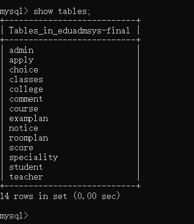
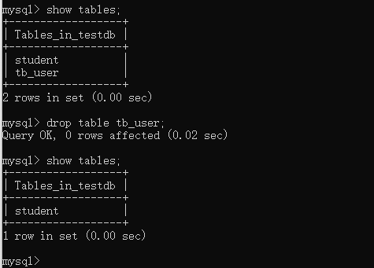
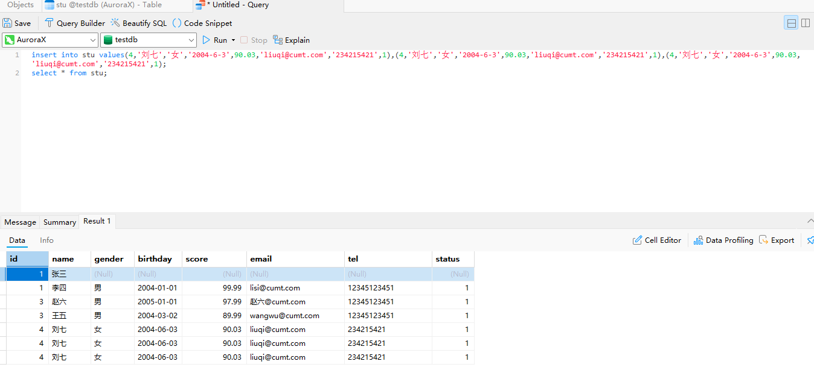
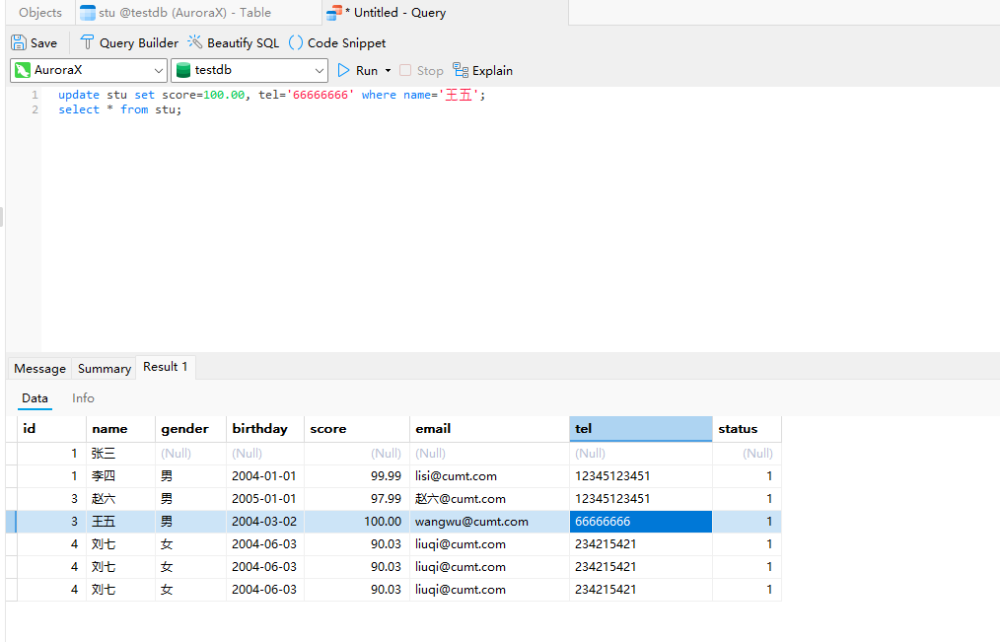
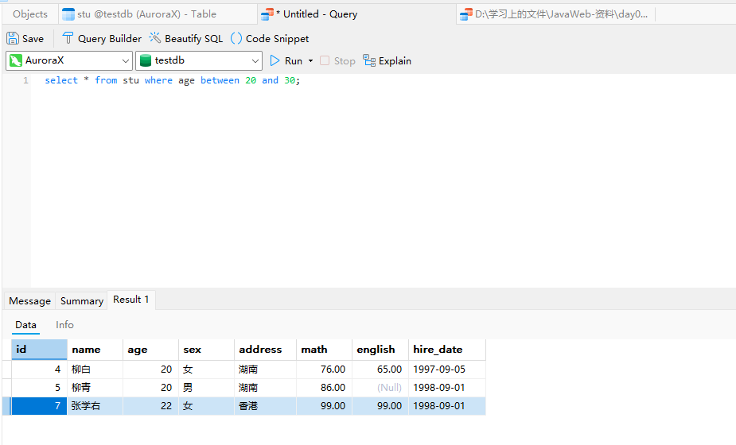
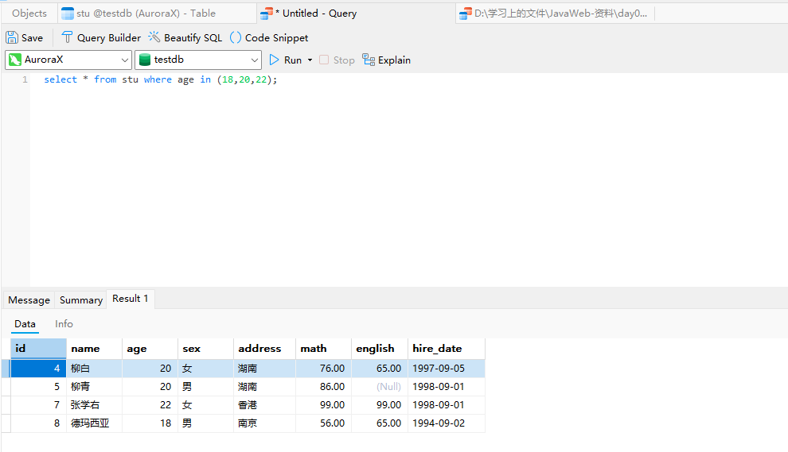
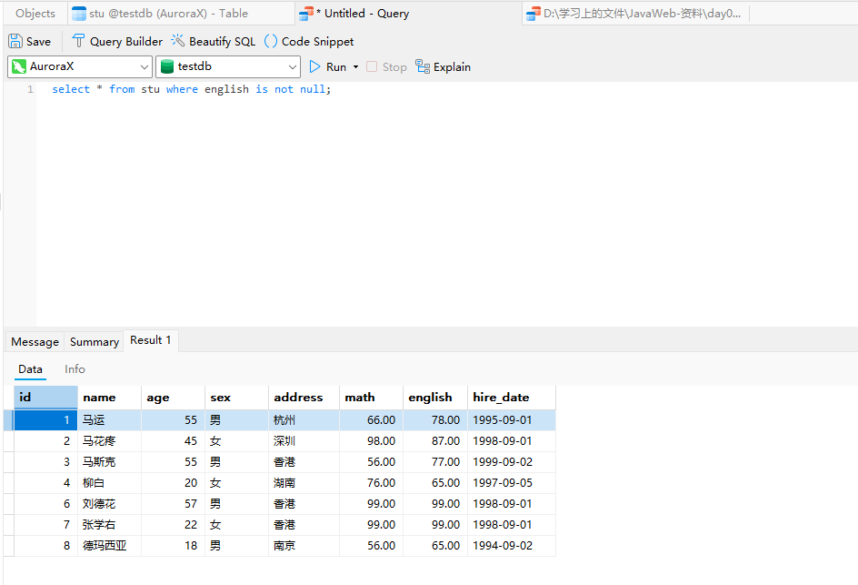
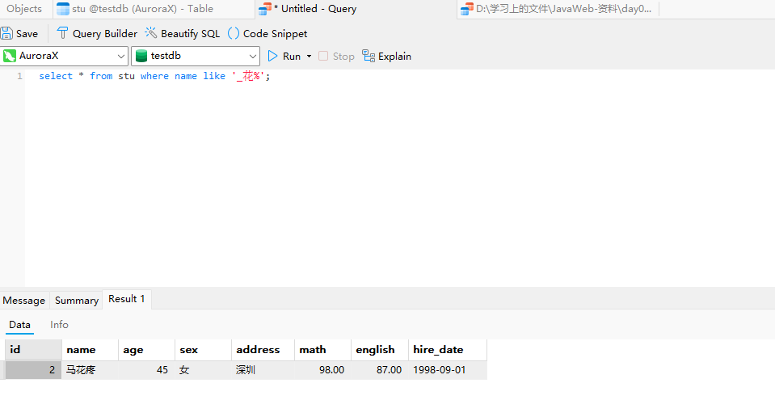

# JavaWeb快速入门

参考视频：[05-DDL-操作数据库_哔哩哔哩_bilibili](https://www.bilibili.com/video/BV1Qf4y1T7Hx?spm_id_from=333.788.player.switch&vd_source=f3cb3ea986b26c6910b4df6d37acd60d&p=6)

## 05-DDL-操作数据库

命令行登录数据库

```mysql
mysql -u root -p			-- 然后输入密码进入mysql操作环境
```


### 相关命令

#### 查询数据库命令

```mysql
show databases;
```


#### 创建数据库命令

```mysql
create database 数据库名称;
create database testdb;
create database if not exists testdb;		-- 创建testdb数据库如果该数据库不存在
```


#### 删除数据库命令

```mysql
drop database 数据库名称;
drop database testdb;
drop database if exists testdb;			-- 删除数据库，如果该数据库存在
```


#### 使用数据库命令

```mysql
select database();			-- 查看当前使用的数据库
use 数据库名称;				-- 使用指定数据库
use eduadmsys-final;
```


## 06-DDL-操作表-查询表&创建表

#### 查询表命令

```mysql
show tables;
```



#### 查询表结构命令

```mysql
desc 表名称;
desc teacher;
```


#### 创建表命令

```mysql
create table 表名(
	字段名 字段类型,
    字段名 字段类型,
    字段名 字段类型		--最后一个字段不能加逗号,
);

create table tb_user(
	id int,
    username varchar(25),		--括号里面要指定字段的长度
    password varchar(32)
);
```


## 07-DDL-操作表-数据类型

#### mysql的主要数据类型


熟悉一下mysql的数据类型的使用

创建以下学生表


```mysql
create table student(
	id int,
    name varchar(10),
    gender char(1),
    birthday date,
    score double(5,2),				-- 使用double类型，括号中前一个数字表示最大长度，后一个数字表示保留几位小数
    email varchar(64),
    tel varchar(15),
    status tinyint					-- 学生状态一般也就几个，所以用tinyint即可
);
```


## 08-DDL-操作表-修改&删除

#### 删除表命令

```mysql
drop table 表名;
drop table tb_user;
```



### 修改表的一系列命令

#### 修改表名

```mysql
alter table 表名 rename to 新的表名;
alter table student rename to stu;
```


#### 添加一列

```mysql
alter table 表名 add 列名 数据类型;
alter table stu add class_id int;
```


#### 修改数据类型

```mysql
alter table 表名 modify 列名 新的数据类型;
alter table stu modify status varchar(10);
```


#### 修改列名和数据类型

```mysql
alter table 表名 change 列名 新的列名 新的数据类型;
alter table stu change class_id class_name varchar(10);
```


#### 删除列

```mysql
alter table 表名 drop 列名;
alter table stu drop class_name;
```


## 10-DML-操作数据-添加&修改&删除

### 添加系列命令

#### 给指定列添加数据

```mysql
insert into 表名(列名1,列名2,....) values(值1,值2,...);
insert into stu(id,name) values(1,'张三');
```


#### 给全部列添加数据

```mysql
insert into 表名 values(值1,值2,....);			-- 表名后面的括号里的列名可以省略也可以全写
insert into 表名(列名1,列名2,等全部列名) values(值1,值2,...);
```


#### 批量添加数据

```mysql
insert into 表名 values(值1,值2,...),(值1,值2,...),(值1,值2,...)....;
insert into 表名(列名1,列名2,...) values (值1,值2,...),(值1,值2,...),(值1,值2,...)....;
```



### 修改数据命令

```mysql
update 表名 set 列名1=值1,列名2=值2,.....;			-- 如果不添加where条件，该命令会对所有行执行修改操作
update 表名 set 列名1=值1,列名2=值2,..... where 某个列=某个值;
```



### 删除数据命令

```mysql
delete from 表名 where 条件;					-- 如果不添加where条件，该命令会删除所有的行
delete from 表名;								 -- 删除所有行
```


## 11-DQL-基础查询

#### 查询多个字段

```mysql
select 字段1,字段2,..... from 表名;
select * from 表名;					-- 实际业务中不建议使用，若要查询全部，仍然要写出全部字段
```


#### 去除重复记录

```mysql
select distinct 字段1,字段2,.... from 表名; 		-- 只需加上distinct关键字
```


#### 为查询字段起别名

```mysql
select 字段1 as 别名1,字段2 as 别名2,...... from 表名;			-- as可省略
select 字段1 别名1,字段2 别名2,..... from 表名;
```


## 12-DQL-条件查询

```mysql
select * from 表名 where 条件;
```

### 几个条件查询的例子

#### 查询年龄大于20岁的学员信息

```mysql
select * from stu where age >20;
```


#### 查询年龄大于等于20岁的学员信息

```mysql
select * from stu where age >=20;
```


#### 查询年龄大于等于20岁并且小于30岁的学员信息

```mysql
select * from stu where age >=20 and age < 30;
select * from stu where age >=20 && age <30;			-- 不推荐使用&&
select * from stu where age between 20 and 30;
```




#### 查询入学日期在‘1998-09-01’到‘1999-09-01’之间的学员信息

```mysql
select * from stu where hire_date between '1998-09-01' and '1999-09-01' ;  -- date类型数据也支持比较
```


#### 查询年龄等于18岁的学院信息

```mysql
select * from stu where age = 18;
```


#### 查询年龄不等于18岁的学员信息

```mysql
select * from stu where age != 18;
```


#### 查询年龄等于18岁或20岁或22岁的学员信息

```mysql
select * from stu where age=18 or age=20 or age=22;
select * from stu where age=18||age=20||age=22;				-- 不推荐使用||
select * from stu where age in 一个集合;
select * from stu where age in (18,20,22);
```



#### 查询英语成绩为null的学员信息

要注意的是查询为null的数据不能使用 = 与 !=来比较，要使用 is null 或 is not null

```mysql
select * from stu where english is null;
select * from stu where english is not null;
```




### 模糊查询

`_`代表单个字符，`%`代表任意字符

#### 查询姓‘马‘的学员信息

```mysql
select * from stu where name like '马%';
```


#### 查询第二个字是’花‘的学员信息

```mysql
select * from stu where name like '_花%';
```



#### 查询名字中包含’德‘的学员信息

```mysql
select * from stu where name like '%德%';
```

