# JavaWeb快速入门

参考视频：[05-DDL-操作数据库_哔哩哔哩_bilibili](https://www.bilibili.com/video/BV1Qf4y1T7Hx?spm_id_from=333.788.player.switch&vd_source=f3cb3ea986b26c6910b4df6d37acd60d&p=6)

## 05-DDL-操作数据库

命令行登录数据库

```mysql
mysql -u root -p			-- 然后输入密码进入mysql操作环境
```


### 相关命令

#### 查询数据库命令

```mysql
show databases;
```


#### 创建数据库命令

```mysql
create database 数据库名称;
create database testdb;
create database if not exists testdb;		-- 创建testdb数据库如果该数据库不存在
```


#### 删除数据库命令

```mysql
drop database 数据库名称;
drop database testdb;
drop database if exists testdb;			-- 删除数据库，如果该数据库存在
```


#### 使用数据库命令

```mysql
select database();			-- 查看当前使用的数据库
use 数据库名称;				-- 使用指定数据库
use eduadmsys-final;
```

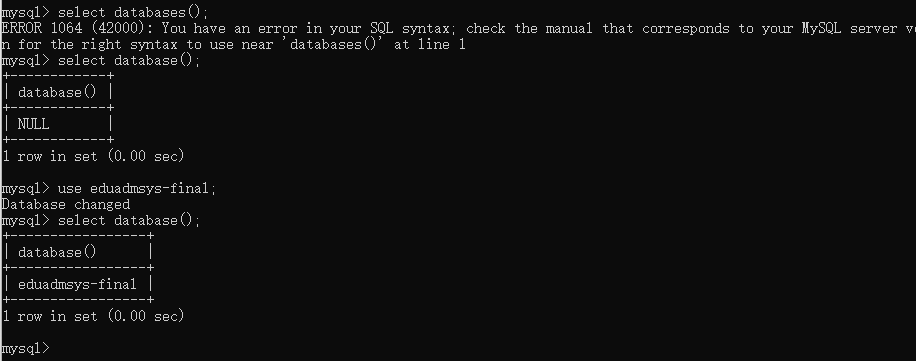


## 06-DDL-操作表-查询表&创建表

#### 查询表命令

```mysql
show tables;
```


#### 查询表结构命令

```mysql
desc 表名称;
desc teacher;
```


#### 创建表命令

```mysql
create table 表名(
	字段名 字段类型,
    字段名 字段类型,
    字段名 字段类型		--最后一个字段不能加逗号,
);

create table tb_user(
	id int,
    username varchar(25),		--括号里面要指定字段的长度
    password varchar(32)
);
```


## 07-DDL-操作表-数据类型

#### mysql的主要数据类型


熟悉一下mysql的数据类型的使用

创建以下学生表


```mysql
create table student(
	id int,
    name varchar(10),
    gender char(1),
    birthday date,
    score double(5,2),				-- 使用double类型，括号中前一个数字表示最大长度，后一个数字表示保留几位小数
    email varchar(64),
    tel varchar(15),
    status tinyint					-- 学生状态一般也就几个，所以用tinyint即可
);
```


## 08-DDL-操作表-修改&删除

#### 删除表命令

```mysql
drop table 表名;
drop table tb_user;
```


### 修改表的一系列命令

#### 修改表名

```mysql
alter table 表名 rename to 新的表名;
alter table student rename to stu;
```


#### 添加一列

```mysql
alter table 表名 add 列名 数据类型;
alter table stu add class_id int;
```


#### 修改数据类型

```mysql
alter table 表名 modify 列名 新的数据类型;
alter table stu modify status varchar(10);
```

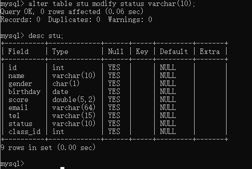

#### 修改列名和数据类型

```mysql
alter table 表名 change 列名 新的列名 新的数据类型;
alter table stu change class_id class_name varchar(10);
```

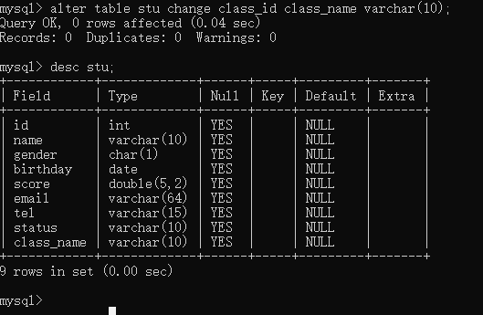

#### 删除列

```mysql
alter table 表名 drop 列名;
alter table stu drop class_name;
```


## 10-DML-操作数据-添加&修改&删除

### 添加系列命令

#### 给指定列添加数据

```mysql
insert into 表名(列名1,列名2,....) values(值1,值2,...);
insert into stu(id,name) values(1,'张三');
```


#### 给全部列添加数据

```mysql
insert into 表名 values(值1,值2,....);			-- 表名后面的括号里的列名可以省略也可以全写
insert into 表名(列名1,列名2,等全部列名) values(值1,值2,...);
```


#### 批量添加数据

```mysql
insert into 表名 values(值1,值2,...),(值1,值2,...),(值1,值2,...)....;
insert into 表名(列名1,列名2,...) values (值1,值2,...),(值1,值2,...),(值1,值2,...)....;
```


### 修改数据命令

```mysql
update 表名 set 列名1=值1,列名2=值2,.....;			-- 如果不添加where条件，该命令会对所有行执行修改操作
update 表名 set 列名1=值1,列名2=值2,..... where 某个列=某个值;
```


### 删除数据命令

```mysql
delete from 表名 where 条件;					-- 如果不添加where条件，该命令会删除所有的行
delete from 表名;								 -- 删除所有行
```

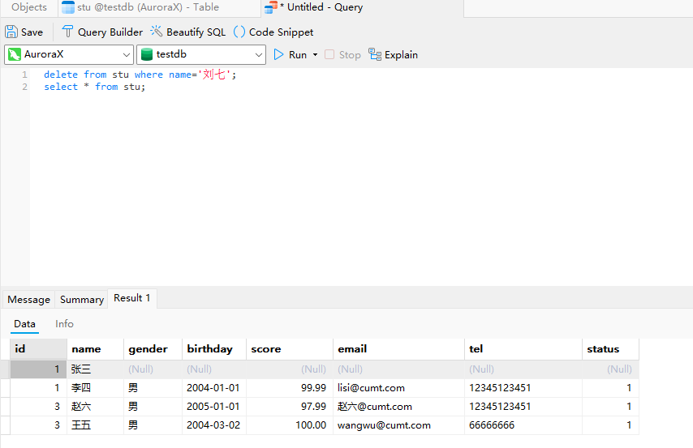


## 11-DQL-基础查询

#### 查询多个字段

```mysql
select 字段1,字段2,..... from 表名;
select * from 表名;					-- 实际业务中不建议使用，若要查询全部，仍然要写出全部字段
```

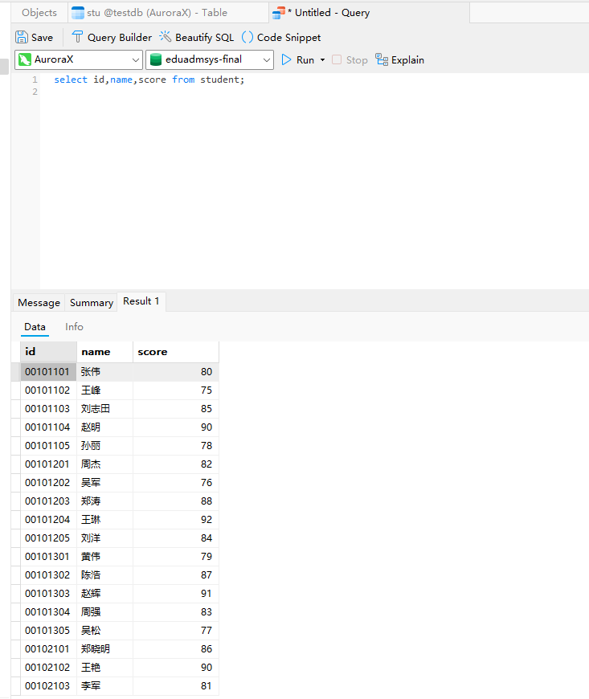

#### 去除重复记录

```mysql
select distinct 字段1,字段2,.... from 表名; 		-- 只需加上distinct关键字
```


#### 为查询字段起别名

```mysql
select 字段1 as 别名1,字段2 as 别名2,...... from 表名;			-- as可省略
select 字段1 别名1,字段2 别名2,..... from 表名;
```


## 12-DQL-条件查询

```mysql
select * from 表名 where 条件;
```

### 几个条件查询的例子

#### 查询年龄大于20岁的学员信息

```mysql
select * from stu where age >20;
```


#### 查询年龄大于等于20岁的学员信息

```mysql
select * from stu where age >=20;
```


#### 查询年龄大于等于20岁并且小于30岁的学员信息

```mysql
select * from stu where age >=20 and age < 30;
select * from stu where age >=20 && age <30;			-- 不推荐使用&&
select * from stu where age between 20 and 30;
```

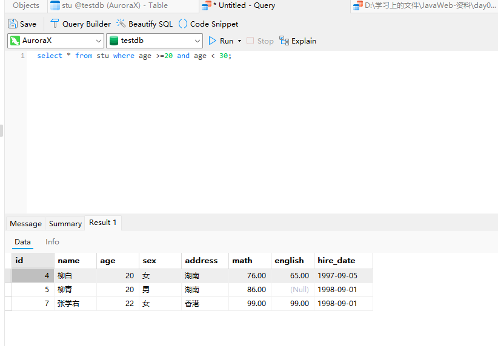


#### 查询入学日期在‘1998-09-01’到‘1999-09-01’之间的学员信息

```mysql
select * from stu where hire_date between '1998-09-01' and '1999-09-01' ;  -- date类型数据也支持比较
```


#### 查询年龄等于18岁的学院信息

```mysql
select * from stu where age = 18;
```


#### 查询年龄不等于18岁的学员信息

```mysql
select * from stu where age != 18;
```


#### 查询年龄等于18岁或20岁或22岁的学员信息

```mysql
select * from stu where age=18 or age=20 or age=22;
select * from stu where age=18||age=20||age=22;				-- 不推荐使用||
select * from stu where age in 一个集合;
select * from stu where age in (18,20,22);
```


#### 查询英语成绩为null的学员信息

要注意的是查询为null的数据不能使用 = 与 !=来比较，要使用 is null 或 is not null

```mysql
select * from stu where english is null;
select * from stu where english is not null;
```


### 模糊查询

`_`代表单个字符，`%`代表任意字符

#### 查询姓‘马‘的学员信息

```mysql
select * from stu where name like '马%';
```


#### 查询第二个字是’花‘的学员信息

```mysql
select * from stu where name like '_花%';
```


#### 查询名字中包含’德‘的学员信息

```mysql
select * from stu where name like '%德%';
```


## 13-DQL-排序查询

排序方式主要有升序排序`asc`，这是默认的；还有一个降序排序`desc`

```mysql
select 字段1,字段2,.... from 表名 order by 排序字段名1 排序方式1 ,排序字段名2 排序方式2,....;
```

#### 按照年龄升序排列

```mysql
select * from stu order by age asc;				-- asc 也可以不写，默认升序排列
```

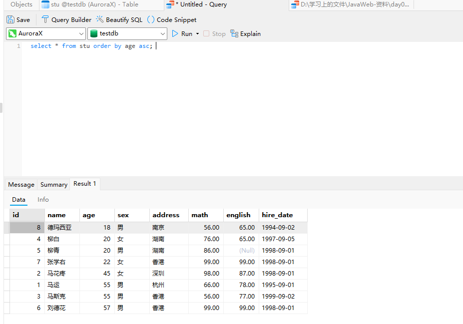

#### 按照数学成绩降序排列

```mysql
select * from stu order by math desc;
```

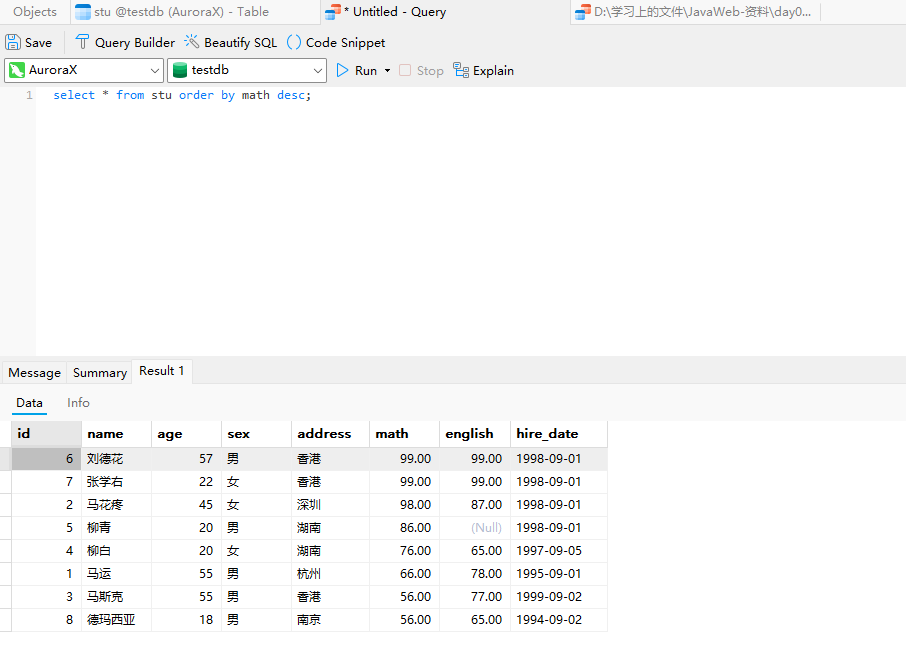

#### 按照数学成绩降序排列，如果数学成绩一样，再按照英语成绩升序排列

```mysql
select * from stu order by math desc , english asc;
```


## 14-DQL-聚合函数

聚合函数是将一列数据作为整体，进行纵向计算。

主要有以下5个聚合函数

```mysql
/*
	count		统计数量，如果有值为null，则null不参与统计
	max			求某一列的最大值
	min			求某一列的最小值
	sum			求某一列值的总和
	avg			求某一列的平均值
	需要注意，null也不参与计算比较
*/
select 聚合函数名(列名) from 表名;
```

#### 统计班级一共有多少个学生

```mysql
select count(name) from stu;
```


#### 查询数学成绩的最高分

```mysql
select max(math) from stu;
```


#### 查询数学成绩的最低分

```mysql
select min(math) from stu;
```

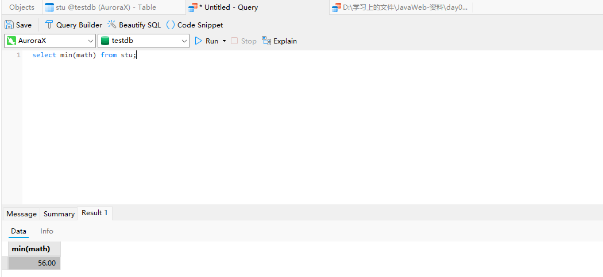

#### 查询数学成绩的总分

```mysql
select sum(math) from stu;
```

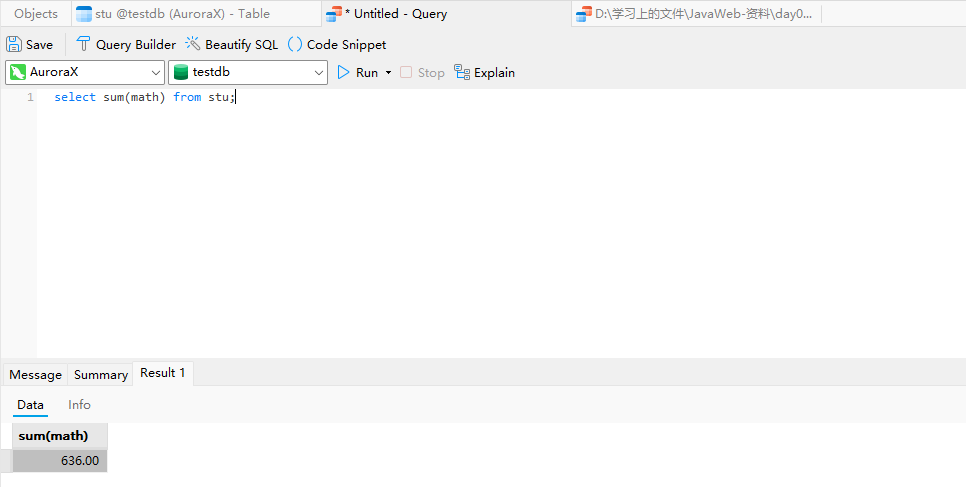

#### 查询数学成绩的平均分

```mysql
select avg(math) from stu;
```


#### 查询英语成绩的最低分

英语成绩中的null值不会参与比较

```mysql
select min(english) from stu;
```


## 15-DQL-分组查询

```mysql
select 字段列表 from 表名 [where 条件语句] group by 分组字段名 [having 筛选语句]
```

要注意的是分组查询只能查询被分组的字段和聚合函数，查询其他字段是没有意义的

#### 查询男同学和女同学各自的数学平均分

```mysql
select sex,avg(math) from stu group by sex;			-- sex是分组字段 avg(math)是聚合函数
```


#### 查询男同学和女同学各自的数学平均分，以及各自的人数

```mysql
select sex,avg(math),count(*) from stu group by sex;
```

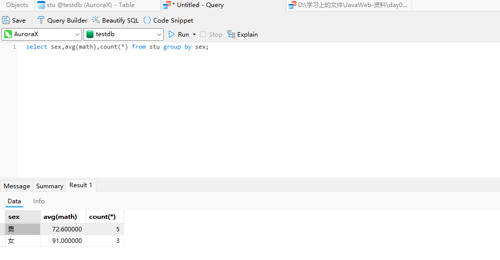

#### 查询男同学和女同学各自的数学平均分，以及各自的人数，并且要求分数低于70分的不参与分组

```mysql
select sex,avg(math),count(*) from stu where math >=70 group by sex;
```


#### 查询男同学和女同学各自的数学平均分，以及各自的人数，并且要求分数低于70分的不参与分组、分组后人数大于2的才显示


```mysql
select sex,avg(math),count(*) from stu where math >=70 group by sex having count(*)>2;
```


## 16-DQL-分页查询

```mysql
select 字段列表 from 表名 limit 起始索引, 查询条目数;
```

起始索引的计算公式：

起始索引=(当前查询的页码-1)*查询条目数

#### 从0开始查询，查询3条数据

```mysql
select * from stu limit 0,3;
```


#### 每页显示3条数据，查询第1页数据

```mysql
select * from stu limit 0,3;
```

#### 每页显示3条数据，查询第2页数据

```mysql
select * from stu limit 3,3;
```


#### 每页显示3条数据，查询第3页数据

```mysql
select * from stu limit 6,3;
```


## 08-多表查询-内连接&外连接

### 内连接

```mysql
select 字段列表 from 表1,表2.... where 条件;			-- 这是隐式内连接
select 字段列表 from 表1 [inner] join 表2 on 条件;		-- 这是显式内连接，其中inner可以省略
```

内连接是查询 表1 与 表2相交的数据


#### 隐式内连接查询emp和dept的数据

```mysql
select * from emp,dept where emp.dep_id=dept.did;			-- 隐式内连接
```


#### 隐式内连接查询emp的name,gender,和dept表的dname

```mysql
select emp.name,emp.gender,dept.dname from emp,dept where emp.dep_id=dept.did;
```


#### 显示内连接查询数据

```mysql
select * from emp inner join dept on emp.dep_id=dept.did;
select * from emp join dept on emp.dep_id=dept.did;				-- 省略inner
```


### 外连接

#### 左外连接

```mysql
select 字段列表 from 表1 left [outer] join 表2 on 条件;				-- outer可省略

```

查询emp表的所有数据及对应的部门信息

```mysql
select * from emp left join dept on emp.dep_id=dept.did;
```


#### 右外连接

```mysql
select 字段列表 from 表1 right [outer] join 表2 on 条件;			-- outer可省略 
```

查询dept表的所有数据及其对应的员工信息

```mysql
select * from emp right join dept on emp.dep_id = dept.did;
```


## 09-多表查询-子查询

子查询根据查询结果的不同，其作用也不同，主要有三种查询情况：1.单行单列 2.多行单列 3.多行多列

#### 子查询结果为单行单列

可以作为条件值来进行条件判断

```mysql
select 字段列表 from 表1 where 表1.某个字段 {=,>,<,...} (子查询);
select * from emp where emp.salary > (
	select salary from emp where emp.name = '猪八戒'					--子查询不能带分号;
);		-- 查询工资大于猪八戒的所有员工信息，子查询先查出猪八戒的工资.
```


#### 子查询结果为多行单列

可以作为一个集合条件，查询在这个集合内的数据，使用in关键字进行条件判断

```mysql
select 字段列表 from 表1 where 表1.某个字段 in (子查询);
-- 查询财务部和市场部所有员工信息
select * from emp where emp.dep_id in (
	select did from dept where dname in ('财务部','市场部')
);
```

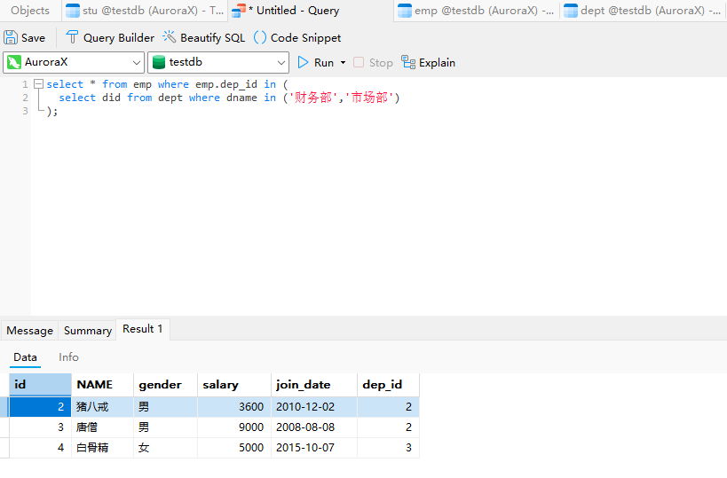

#### 子查询结果为多行多列

可以作为一个虚拟表来与其他表进行连接

```mysql
select 字段列表 from 表1 left join (
	select 字段列表 from 表2 where 条件
) on 连接条件;

-- 查询入职日期是'2011-11-11'之后的员工信息和部门信息
select * from (
	select * from emp where emp.join_date > '2011-11-11'
) as t1 left join dept on t1.dep_id=dept.did;
```


## 10-多表查询-案例

相关数据表的模型如下：


```mysql
-- 1.查询所有员工信息。查询员工编号，员工姓名，工资，职务名称，职务描述
SELECT
  emp.id,
  emp.ename,
  emp.salary,
  job.jname,
  job.description 
FROM
  emp
  JOIN job ON emp.job_id = job.id;
-- 2.查询员工编号，员工姓名，工资，职务名称，职务描述，部门名称，部门位置
SELECT
  emp.id,
  emp.ename,
  emp.salary,
  job.jname,
  job.description,
  dept.dname,
  dept.loc 
FROM
  emp,
  job,
  dept 
WHERE
  emp.job_id = job.id 
  AND emp.dept_id = dept.id;-- 隐式内连接
SELECT
  emp.id,
  emp.ename,
  emp.salary,
  job.jname,
  job.description,
  dept.dname,
  dept.loc 
FROM
  emp
  JOIN job ON emp.job_id = job.id
  JOIN dept ON emp.dept_id = dept.id;-- 显式内连接
-- 3.查询员工姓名，工资，工资等级
SELECT
  emp.ename,
  emp.salary,
  t1.grade 
FROM
  emp
  LEFT JOIN salarygrade t1 ON emp.salary BETWEEN t1.losalary 
  AND t1.hisalary;		-- 外连接方法
  
SELECT
  emp.ename,
  emp.salary,
  t1.grade 
FROM
  emp,
  salarygrade t1 
WHERE
  emp.salary BETWEEN t1.losalary 
  AND t1.hisalary;-- 内连接方法
-- 4.查询员工姓名，工资，职务名称，职务描述，部门名称，部门位置，工资等级
SELECT
  emp.id,
  emp.ename,
  emp.salary,
  job.jname,
  job.description,
  dept.dname,
  dept.loc,
  t1.grade 
FROM
  emp
  JOIN job ON emp.job_id = job.id
  JOIN dept ON emp.dept_id = dept.id
  JOIN salarygrade t1 ON emp.salary BETWEEN t1.losalary 
  AND t1.hisalary;-- 显式内连接
-- 5.查询出部门编号、部门名称、部门位置、部门人数
SELECT
  dept.id,
  dept.dname,
  dept.loc,
  count 
FROM
  dept,
  (SELECT dept_id, count(*) count FROM emp GROUP BY dept_id) t1 
WHERE
  dept.id = t1.dept_id;
```


## 01-JDBC简介 快速入门

使用jdbc的步骤如下

#### 0.首先创建工程，导入数据库驱动jar包

创建一个空工程，进入project structure设置jdk和language level

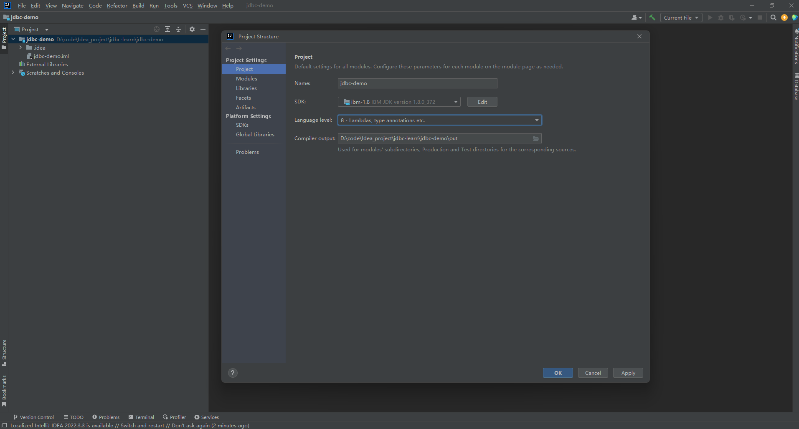

然后创建一个模块，在模块里面创建一个lib文件夹，将驱动jar包放入lib文件夹并将该文件夹设置为library文件夹


设置该文件夹的有效范围


#### 1.注册驱动

```java
Class.forName("com.mysql.jdbc.Driver");
```

#### 2.获取连接

```java
String url = "jdbc:mysql://127.0.0.1:3306/testdb";
String username = "root";
String password = "对应的数据库密码";
Connection conn = DriverManager.getConnection(url,username,password);
```

#### 3.定义sql语句

```java
String sql = "update account set money = 2000 where id =1 ";
```

#### 4.获取执行sql对象

```java
Statement stmt = conn.createStatement();
```

#### 5.执行sql

```java
int count = stmt.executeUpdate(sql);			//返回结果为受影响的行数
```

#### 6.处理返回结果

```java
System.out.println(count);
```

#### 7.释放资源

```java
stmt.close();
conn.close();
```


修改成功


## 02-JDBC-API详解-DriverManager

DriverManager是驱动管理类，其主要有以下两个作用：

1.注册驱动

2.获取sql连接对象

DriverManager是一个工具类，其函数都是静态函数，因此可以直接通过类名来访问成员函数

```java
Connection conn = DriverManager.getConnection(url,username,password);
```

url的定义详解如下

```java
//设置url的完整语法
String url = "数据库协议://数据库ip地址:数据库端口号/要访问的数据库名?参数键值对1&参数键值对2....";
//后面的键值对可以进行某些设置，比如配置useSSL=false参数，禁用安全连接方式，解决警告提醒
//如果是访问本地数据库并且端口为3306，ip地址还可以省略
String url = "jdbc:mysql:///testdb?useSSL=false";
```

警告提醒：


禁用安全连接方式，解决警告提醒


## 03-JDBC-API详解-Connection

Connection是数据库连接对象，其主要作用如下：

1.获取执行sql的对象

2.管理事务

这里先将管理事务，第一个后面讲

```java
//connection提供了三个管理事务的函数
//1.setAutoCommit(boolean autoCommit);	true为自动提交事务，false为手动提交事务
//2.commit()							提交事务
//3.roolback()							回滚事务
```

修改前面快速入门代码，使其要么修改两个数据，要么一个也不修改

```java
//1.注册驱动
Class.forName("com.mysql.jdbc.Driver");
//2.获取连接
String url ="jdbc:mysql:///testdb?useSSL=false";
String username="root";
String password="gt1303190518";
Connection conn = DriverManager.getConnection(url,username,password);
//3.定义sql语句
String sql1="update account set money=2000 where id = 1";
String sql2="update account set money=3000 where id = 2";
//4.获取执行sql对象
Statement stmt = conn.createStatement();
conn.setAutoCommit(false);                  //设置手动提交事务
        try {

            //5.执行sql语句
            int count1 = stmt.executeUpdate(sql1);
            int i=3/0;							//这里会抛出异常，使得第一个sql成功执行，第二个sql不能执行
            
            int count2 = stmt.executeUpdate(sql2);
            //6.处理执行结果
            System.out.println(count1);
            System.out.println(count2);
            conn.commit();                      //提交事务
        } catch (SQLException e) {
            conn.rollback();                    //捕获到错误就回滚
            throw new RuntimeException(e);
        }
//7.释放资源
stmt.close();
conn.close();
```

如果没有报错，数据会被正常修改，但如果让int i = 3/0;这行代码生效的话，结果如下

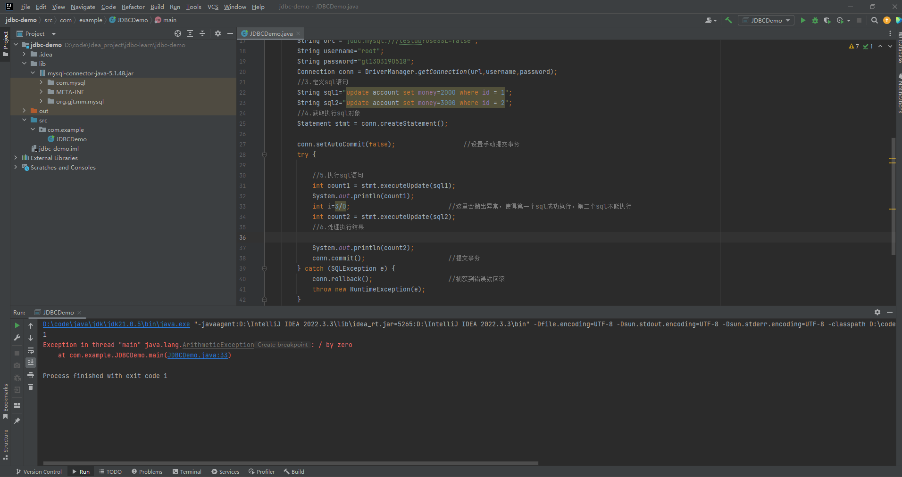


控制台第一行打印出来的1就是第一个sql执行的结果，sql1成功修改了一行数据，但数据库里面并没有看到sql1的修改，因为事务被回滚了，此时如果我们再把回滚、提交、设置自动提交的代码去掉，就会发现sql1的修改成功了，但sql2没有执行

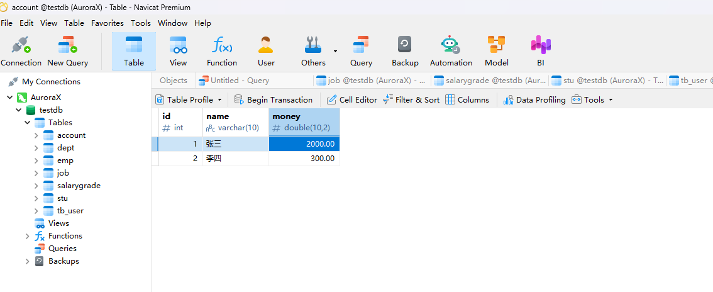

## 04-JDBC-API详解-Statement

Statement的作用是执行sql语句，其提供两种执行函数

1.执行DML、DDL语句，即对数据库的修改语句

```java
int executeUpdate(sql);					//返回受影响的行数
```

前面快速入门里的代码就是这个

2.执行DQL语句，即查询语句

```java
ResultSet executeQuery(sql);			//返回ResultSet结果集对象
```

## 05-JDBC-API详解-ResultSet

ResultSet是查询语句的结果的集合，如果要取出里面的数据，就要通过一个抽象的“光标”一行一行去访问里面的数据，其提供了以下用于访问里面数据的函数

#### 1.next()函数

```java
boolean next();					//将访问光标向下移动一行，并判断该行是否是有效行，有效行就返回true
```

#### 2.getxxx函数

```java
xxx getxxx(索引或字段名);			//xxx代表数据类型，索引是指要获取的数据在第几列，从1开始
int getInt("id");
String getString(2);
```

总获取数据方式是通过一个while循环来遍历所有行

```java
		//1.注册驱动
        Class.forName("com.mysql.jdbc.Driver");
        //2.获取连接
        String url ="jdbc:mysql:///testdb?useSSL=false";
        String username="root";
        String password="gt1303190518";
        Connection conn = DriverManager.getConnection(url,username,password);
        //3.定义sql语句
        String sql1="select * from account";
        //4.获取执行sql对象
        Statement stmt = conn.createStatement();
        //5.执行sql语句
        ResultSet res=stmt.executeQuery(sql1);
        //6.获取查询的数据
        while(res.next()){
            System.out.println(res.getInt(1));          //通过索引来获取数据
            System.out.println(res.getString("name"));  //通过字段名来获取数据
            System.out.println(res.getDouble(3));
            System.out.println("---------------");
        }
        //7.释放资源
        res.close();
        stmt.close();
        conn.close();
```


#### 案例

查询account账户表数据，将其封装为Account对象中，并且存储到ArrayList集合中

首先建立一个Account的实体类

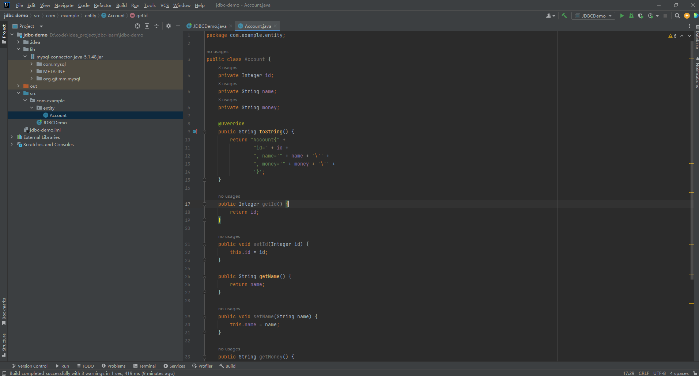

然后将数据封装成Account对象并打印出来

```java
public static void main(String[] args) throws ClassNotFoundException, SQLException {
        //1.注册驱动
        Class.forName("com.mysql.jdbc.Driver");
        //2.获取连接
        String url ="jdbc:mysql:///testdb?useSSL=false";
        String username="root";
        String password="gt1303190518";
        Connection conn = DriverManager.getConnection(url,username,password);
        //3.定义sql语句
        String sql1="select * from account";
        //4.获取执行sql对象
        Statement stmt = conn.createStatement();
        //5.执行sql语句
        ResultSet res=stmt.executeQuery(sql1);
        //6.获取查询的数据
        //建立list集合
        ArrayList<Account> list = new ArrayList<>();
        while(res.next()){
            //创建实体
            Account account=new Account();

            account.setId(res.getInt(1));          //通过索引来获取数据
            account.setName(res.getString("name"));  //通过字段名来获取数据
            account.setMoney(res.getDouble(3));
            list.add(account);
        }
        System.out.println(list);
        //7.释放资源
        res.close();
        stmt.close();
        conn.close();
    }
```


 

## 06-JDBC-API详解-PreparedStatement-SQL注入

PreparedStatement是预编译sql语句执行类，是Statement的一个继承类，同样是用来执行sql语句的，但是它可以放置SQL注入。

#### 什么是SQL注入

```java
//通常我们用于查询的sql语句是这样定义的
String name="username";
String pwd="123";				//这是一验证用户登录的查询语句
//sql语句是通过字符串拼接出来的
String sql="select * from tb_user where username= '"+name+"'and password='"+pwd+"'";

//然后根据查询结果，如果查询结果大于0，则表示存在用户且密码正确，则允许登录，否则不允许登录
```

而sql注入就是通过输入相关字符来达到修改sql语句的目的

```java
//举个例子
//这里不管用户名输什么
//只要对password输入
String pwd = "0' or '1' = '1'";
//此时sql语句就变成了 select * from tb_user where username = 'username' and password='0' or '1'= '1'
//而这个sql语句由于后面的or ‘1’=’1‘,不管怎样都能查出所有的数据，也就是会导致最终判断结果>0成立，从而使得可以登录成功

```

输入正确的账号密码登录


sql注入方式登录成功


## 06-JDBC-API详解-PreparedStatement

如何解决sql注入，这就要用到PreparedStatement。

### 使用PreparedStatement的步骤

#### 1.获取PreparedStatement对象

```java
//要使用PreparedStatement的话就要先定义sql语句，且语句中的参数值要用?替代
//定义sql语句
String sql="select * from tb_user where username=? and password = ?";
//获取对象,将sql语句传入构造函数来获取PreparedStatement对象
Connection conn = DriverManager.getConnection(url,username,password);			//先获取连接
PreparedStatement pstmt=conn.preparedStatement(sql);
```


#### 2.设置参数值

```java
//PreparedStatement有 setxxx(参数1,参数2)函数
//xxx代表数据类型
//参数1代表?的位置,从1开始
//参数2代表要替换的值
pstmt.setString(1,name);
pstmt.setString(2,pwd);
```

#### 3.执行sql

```java
//通过PreparedStatement执行sql语句不需要再传递sql语句
//直接使用函数executeUpdate()或executeQuery()来执行
pstmt.executeQuery();
```

```java
public static void main(String[] args) throws ClassNotFoundException, SQLException {
        //1.注册驱动
        Class.forName("com.mysql.jdbc.Driver");
        //2.获取连接
        String url ="jdbc:mysql:///testdb?useSSL=false";
        String username="root";
        String password="gt1303190518";
        Connection conn = DriverManager.getConnection(url,username,password);
        //3.定义sql语句
        String name="fjdaklfjla";
        String pwd="0' or '1' = '1";
        String sql1="select * from tb_user where username=?and password=?";
        System.out.println(sql1);
        //4.获取执行sql对象
        PreparedStatement pstmt = conn.prepareStatement(sql1);
        //设置参数值
        pstmt.setString(1,name);
        pstmt.setString(2,pwd);
        //5.执行sql语句
        ResultSet res=pstmt.executeQuery();
        //6.处理执行结果
        if(res.next()){
            System.out.println("登录成功");
        }else{
            System.out.println("登录失败");
        }
        //7.释放资源
        res.close();
        pstmt.close();
        conn.close();
    }
```


通过这样修改sql注入便不再生效


#### 注意事项

使用预编译性能会更好，但mysql默认是没有开启这个功能的，所以我们要在获取与数据库连接的时候去将它打开

```java
String url = "jdbc:mysql:///testdb?useSSL=false&useServerPrepStmts=true";
String username = "root";
String password = "对应的数据库密码";
Connection conn = DriverManager.getConnection(url,username,password);
```

## 09-数据库连接池-简介&Druid使用

Druid使用步骤

#### 1.导入jar包

#### 2.定义配置文件

```properties
driverClassName=com.mysql.jdbc.Driver
url=jdbc:mysql:///testdb?useSSL=false&useServerPrepStmts=true
username=root
password=gt1303190518
#最小连接数
initialSize=5
#最大连接数
maxActive=10
#最大等待时间
maxWait=3000
```


#### 3.加载配置文件

```java
Properties prop = new Properties();				
prop.load(new FileInputStream("src/druid.properties"));			//记得做异常处理
```

#### 4.获取数据库连接池对象

```java
DataSource datasource=DuridDataSourceFactory.createDataSource(prop);		
```

#### 5.获取连接

```java
Connection connection = datasource.getConnection();
```

```java
public class JDBCDemo {
    public static void main(String[] args) throws Exception {
        //1.导入Durid jar包
        //2.定义配置文件
        //3.加载配置文件
        Properties prop = new Properties();
        prop.load(new FileInputStream("src/druid.properties"));
        //4.获取数据库连接池对象
        DataSource dataSource= DruidDataSourceFactory.createDataSource(prop);       //根据配置文件建立连接池
        //5.获取连接
        Connection connection= dataSource.getConnection();
        System.out.println(connection);
    }
}
```


## 02-MyBatis快速入门

### 1.创建user表，添加数据

### 2.创建工程模块，导入MyBatis依赖坐标

mybatis依赖坐标可以在mybatis官网找到 [入门_MyBatis中文网](https://mybatis.net.cn/getting-started.html)

```xml
<dependency>
  <groupId>org.mybatis</groupId>
  <artifactId>mybatis</artifactId>
  <version>x.x.x</version>
</dependency>
```


### 3.编写mybatis核心配置文件

mybatis配置文件可以替换连接信息，解决硬编码问题

在mybatis官方入门案例中找到示例的配置文件，在resources文件夹中创建配置文件

```xml
<?xml version="1.0" encoding="UTF-8" ?>
<!DOCTYPE configuration
        PUBLIC "-//mybatis.org//DTD Config 3.0//EN"
        "http://mybatis.org/dtd/mybatis-3-config.dtd">
<configuration>
    <environments default="development">
        <environment id="development">
            <transactionManager type="JDBC"/>
            <dataSource type="POOLED">
                <!--连接信息-->
                <property name="driver" value="com.mysql.jdbc.Driver"/>	<!--配置驱动-->
                <property name="url" value="jdbc:mysql:///mybatis?useSSL=false"/>	<!--配置数据库地址-->
                <property name="username" value="root"/>
                <property name="password" value=""/>			<!--配置密码-->
            </dataSource>
        </environment>
    </environments>
    <mappers>
        <mapper resource="org/mybatis/example/BlogMapper.xml"/>
    </mappers>
</configuration>
```


### 4.编写sql映射文件

sql映射文件可以统一管理sql语句，解决硬编码问题

sql映射文件统一命名为xxxMapper.xml  xxx代表实体类

```xml
<?xml version="1.0" encoding="UTF-8" ?>
<!DOCTYPE mapper
        PUBLIC "-//mybatis.org//DTD Mapper 3.0//EN"
        "http://mybatis.org/dtd/mybatis-3-mapper.dtd">
<mapper namespace="User">				<!--命名空间可以替换-->
    <select id="selectAll" resultType="com.example.entity.User">	<!--id、返回类型都可以替换-->
        select * from tb_user;
    </select>
</mapper>
```


### 5.编码

#### a.定义实体类

```java
public class User {
    private Integer id;
    private String username;
    private String password;
    private String gender;
    private String addr;

    @Override
    public String toString() {
        return "User{" +
                "id=" + id +
                ", username='" + username + '\'' +
                ", password='" + password + '\'' +
                ", gender='" + gender + '\'' +
                ", addr='" + addr + '\'' +
                '}';
    }

    public Integer getId() {
        return id;
    }

    public void setId(Integer id) {
        this.id = id;
    }

    public String getUsername() {
        return username;
    }

    public void setUsername(String username) {
        this.username = username;
    }

    public String getPassword() {
        return password;
    }

    public void setPassword(String password) {
        this.password = password;
    }

    public String getGender() {
        return gender;
    }

    public void setGender(String gender) {
        this.gender = gender;
    }

    public String getAddr() {
        return addr;
    }

    public void setAddr(String addr) {
        this.addr = addr;
    }
}
```


#### b.加载核心配置文件，获取SqlSessionFactory对象

```java
String resource = "配置文件的路径";
InputStream inputStream = Resources.getResourceAsStream(resource);
SqlSessionFactory sqlSessionFactory = new SqlSessionFactoryBuilder().build(inputStream);
```


#### c.获取SqlSession对象，执行sql语句

```java
SqlSession sqlSession=sqlSessionFactory.openSession();
List<User> users = sqlSession.selectList("User.selectAll");
System.out.println(users);
```

#### d.释放资源

```java
sqlSession.close();
```

```java
public static void main(String[] args) throws Exception {
        //1.加载配置文件
        String resource = "mybatis-config.xml";
        InputStream inputStream = Resources.getResourceAsStream(resource);
        SqlSessionFactory sqlSessionFactory = new SqlSessionFactoryBuilder().build(inputStream);
        //2.获取SqlSession对象
        SqlSession sqlSession=sqlSessionFactory.openSession();
        List<User> users = sqlSession.selectList("User.selectAll");
        System.out.println(users);
        //3.释放资源
        sqlSession.close();

    }
```

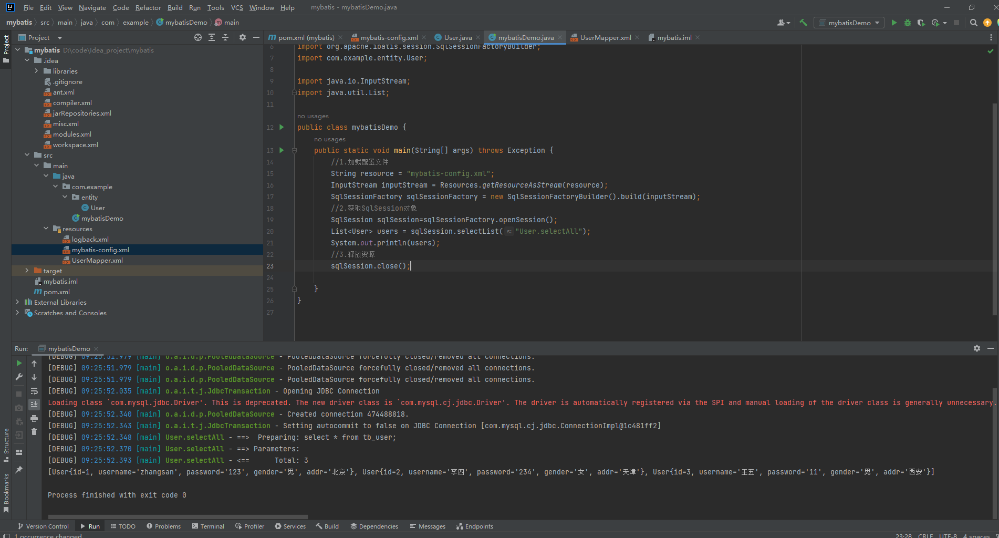

## 04-Mapper代理开发

不使用Mapper代理的方法

```java
List<User> users = sqlSession.selectList("User.selectAll");			//是"命名空间.id"的形式
```

我们需要去写对应映射文件里面定义好的命名空间和sql语句的id，不是很方便

而使用Mapper代理开发，我们可以将对应的映射文件里面的sql语句像使用类的成员函数一样去使用，这样使用起来会很方便

```java
SqlSession sqlSession=sqlSessionFactory.openSession();
//执行sql语句改为用Mapper代理的方式
//获取代理接口对象
UserMapper userMapper=sqlSession.getMapper(UserMapper.class);
//执行语句
List<User> users=userMapper.selectAll();
```

为什么会很方便，看下图，当我要使用映射文件里面的sql语句时，它自动弹出来了，就像一个成员函数一样


### 使用步骤

#### 1.定义与sql映射文件同名的Mapper接口，并将Mapper接口和sql映射文件放在同一目录文件下

这里的放在同一目录文件下指的是Mapper接口所在的目录层次结构和映射文件所在的目录层次结构一致，如下所示

这里看起来好像没在同一目录下，因为Mapper在java目录中，而映射文件在resources中，但其实，只要它们的目录层次结构一样就没问题，比如说这里的Mapper在com.example.Mapper下，而映射文件也在com.example.Mapper下，只要是这样放的，在编译的时候，他们就会放到一起去。


下图是编译后的文件结构，可以发现接口和映射文件已经放到同一文件夹下了


#### 2.设置sql映射文件的namespace属性为Mapper接口全限定名

```xml
<?xml version="1.0" encoding="UTF-8" ?>
<!DOCTYPE mapper
        PUBLIC "-//mybatis.org//DTD Mapper 3.0//EN"
        "http://mybatis.org/dtd/mybatis-3-mapper.dtd">
<mapper namespace="com.example.Mapper.UserMapper">			<!--Mapper接口的全限定名-->
    <select id="selectAll" resultType="com.example.entity.User">
        select * from tb_user;
    </select>
</mapper>
```

#### 3.在Mapper接口中定义方法（不用实现）

定义的方法名就是映射文件中sql语句的id，返回类型对应位sql语句执行完的返回类型

```java
public interface UserMapper {
    List<User> selectAll();				//selectAll语句是查询所有
}
```

#### 4.编码

```java
//1.首先通过SqlSession的getMapper方法获取Mapper接口的代理对象
UserMapper userMapper=sqlSession.getMapper(UserMapper.class);
//2.调用对应方法来执行
List<User> users=userMapper.selectAll();
```

```java
public class mybatisDemo {
    public static void main(String[] args) throws Exception {
        //1.加载配置文件
        String resource = "mybatis-config.xml";
        InputStream inputStream = Resources.getResourceAsStream(resource);
        SqlSessionFactory sqlSessionFactory = new SqlSessionFactoryBuilder().build(inputStream);
        //2.获取SqlSession对象
        SqlSession sqlSession=sqlSessionFactory.openSession();
        //执行sql语句改为用Mapper代理的方式
        //获取代理接口对象
        UserMapper userMapper=sqlSession.getMapper(UserMapper.class);
        //执行语句
        List<User> users=userMapper.selectAll();
        System.out.println(users);
        //3.释放资源
        sqlSession.close();

    }
}
```


### 注意事项

如果Mapper接口名称和sql映射文件名称相同，并在同一目录下，则可以使用包扫描的方式简写mybatis配置文件里面的sql映射文件的加载

```xml
<?xml version="1.0" encoding="UTF-8" ?>
<!DOCTYPE configuration
        PUBLIC "-//mybatis.org//DTD Config 3.0//EN"
        "http://mybatis.org/dtd/mybatis-3-config.dtd">
<configuration>
    <environments default="development">
        <environment id="development">
            <transactionManager type="JDBC"/>
            <dataSource type="POOLED">
                <!--连接信息-->
                <property name="driver" value="com.mysql.jdbc.Driver"/>
                <property name="url" value="jdbc:mysql:///mybatis"/>
                <property name="username" value="root"/>
                <property name="password" value="gt1303190518"/>
            </dataSource>
        </environment>
    </environments>
    <mappers>
<!--        <mapper resource="UserMapper.xml"/>-->
        <package name="com.example.Mapper"/>			<!--包扫描方式-->
    </mappers>
</configuration>
```


## **05-MyBatis核心配置文件**

所有配置属性详解可见官方文档：[配置_MyBatis中文网](https://mybatis.net.cn/configuration.html)

#### environments

环境配置是用来配置数据库连接的，可以配置多个数据库连接

```xml
<environments default="development">            <!--使用default属性来更改当前使用的数据库，现在是开发环境的数据库，可以改成对应要使用数据库环境的id-->
        <!--第一个数据库连接配置，开发环境的数据库-->
        <environment id="development">
            <transactionManager type="JDBC"/>
            <dataSource type="POOLED">
                <!--连接信息-->
                <property name="driver" value="com.mysql.jdbc.Driver"/>
                <property name="url" value="jdbc:mysql:///mybatis"/>
                <property name="username" value="root"/>
                <property name="password" value="gt1303190518"/>
            </dataSource>
        </environment>
        <!--第二个数据库连接配置，测试环境的数据库-->
        <environment id="test">
            <transactionManager type="JDBC"/>
            <dataSource type="POOLED">
                <!--连接信息-->
                <property name="driver" value="com.mysql.jdbc.Driver"/>
                <property name="url" value="jdbc:mysql:///mybatis"/>
                <property name="username" value="root"/>
                <property name="password" value="gt1303190518"/>
            </dataSource>
        </environment>
    </environments>
```

#### typeAliases

类型别名可为 Java 类型设置一个缩写名字。 它仅用于 XML 配置，意在降低冗余的全限定类名书写。

```xml
<typeAliases>
    <typeAlias alias="User" type="com.example.entity.User"></typeAlias>
    <!--使用包扫描方式配置别名-->
    <package name="com.example.entity"/>                <!--使用包扫描方式配置别名，自动将类名作为别名-->
</typeAliases>
```

在配置文件中设置了别名后，映射文件中使用类就可以直接使用别名而不用全限定类名书写

```xml
<?xml version="1.0" encoding="UTF-8" ?>
<!DOCTYPE mapper
        PUBLIC "-//mybatis.org//DTD Mapper 3.0//EN"
        "http://mybatis.org/dtd/mybatis-3-mapper.dtd">
<mapper namespace="com.example.Mapper.UserMapper">
    <select id="selectAll" resultType="User">		<!--使用User别名-->
        select * from tb_user;
    </select>
</mapper>
```

 

## 06-MyBatis案例

## 07-查询-查询所有&结果映射

查询所有时会遇到一个问题，当我们实体类里面存在驼峰命名时，可能会出现以下的查询问题

brandName和companyName的查询结果为null

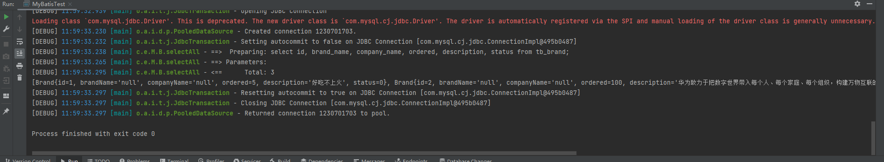

这是因为在数据库字段中没有使用驼峰命名而是brand_name的形式，因为mysql数据库不区分大小写，导致实体类和字段对不上

### 如何解决驼峰命名与字段对不上的问题

有三种解决方法

#### 1.给字段名取别名

```xml
<select id="selectAll" resultType="Brand">
        select id, brand_name brandName, company_name companyName, ordered, description, status from tb_brand;  <!--给字段取别名-->
    </select>
```

#### 2.使用sql片段

```xml
<sql id="Base_Column">
        id, brand_name brandName, company_name companyName, ordered, description, status <!--先定义sql片段-->
    </sql>

    <select id="selectAll" resultType="Brand">
        select 
        <include refid="Base_Column"/>
        from tb_brand;
    </select>
```

#### 3.使用resultMap

resultMap是字段映射，可以把数据库的字段映射为其他别名

##### a.定义resultMap

```xml
<resultMap id="brandResultMap" type="Brand">
        <!--
        id标签用于替换主键字段
        result标签用于替换一般字段
        column是要替换的字段
        property是要替换成对应实体类的属性
        -->
        <result column="brand_name" property="brandName"/>
        <result column="company_name" property="companyName"/>
    </resultMap>
```


##### b.使用resultMap替换resultType

```xml
<select id="selectAll" resultMap="brandResultMap">        <!--将resultType替换成resultMap-->
        select 
        id, brand_name, company_name, ordered, description, status              <!--使用了resultMap后这里写原来的字段就没问题了-->
        from tb_brand;
    </select>
```

```xml
<resultMap id="brandResultMap" type="Brand">
        <!--
        id标签用于替换主键字段
        result标签用于替换一般字段
        column是要替换的字段
        property是要替换成对应实体类的属性
        -->
        <result column="brand_name" property="brandName"/>
        <result column="company_name" property="companyName"/>
    </resultMap>
    <select id="selectAll" resultMap="brandResultMap">        <!--将resultType替换成resultMap-->
        select 
        id, brand_name, company_name, ordered, description, status              <!--使用了resultMap后这里写原来的字段就没问题了-->
        from tb_brand;
    </select>
```

## 08-查询-查看详情

查看详情就是通过id来将某一行的详细信息查询出来

```xml
<select id="selectById" resultMap="brandResultMap">
        select
            id, brand_name, company_name, ordered, description, status
        from tb_brand where id=#{id};
    </select>
```

主要关注的点是如何使用参数占位符

#### 参数占位符

```xml
<!--MyBatis里面有两种参数占位符-->
<!--第一种 #{}-->
<!--第二种 ${}-->
```

使用第一种得到的sql语句的参数是用?替代的


使用第二种得到的sql语句的参数是直接显示出来的

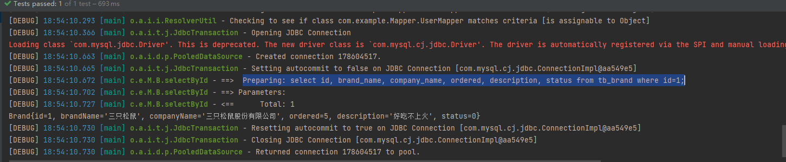

这样一来它两的区别就明了了

```xml
<!--使用 #{} 可以避免sql注入问题-->
#{}
<!--使用 ${} 会有sql注入的风险-->
${}
```

#### 在MyBatis映射文件中不能直接使用`<`符号

由于`<`符号与xml文件中的<>标签符号有冲突，所以如果要使用`<`，就要通过以下两种方法

##### 1.使用转义字符

```xml
HTML的 &lt; &gt; &amp; &quot; &copy; 分别是 < > & " © 的转义字符

<select id="selectById" resultMap="brandResultMap">
        select
            id, brand_name, company_name, ordered, description, status
        from tb_brand where id &lt; ${id};			<!--id<#{id}-->
    </select>
```


##### 2.使用CDATA区

直接在CDATA区里面输入特殊字符即可

```xml
<select id="selectById" resultMap="brandResultMap">
        select
            id, brand_name, company_name, ordered, description, status
        from tb_brand where id
         <![CDATA[						<!--CDATA区-->
         <
         ]]>
         #{id};
    </select>
```

## 09-查询-条件查询

条件查询必然涉及到多个参数，所以如何处理替换多个参数是重点

### 三种处理参数的方法

#### 1.使用Param注解

形象的说是用来处理”散装“数据

在定义Mapper的成员函数时通过Param注解来指定那个参数该去替换哪个参数占位符

```java
//@Param("要替换的占位符") 参数类型 参数名
//接收到的status参数去替换#{status},companyName去替换#{companyName},brandName去替换#{brandName}
Brand selectByCondition(@Param("status") int status,@Param("companyName") String companyName,@Param("brandName") String brandName);
```

#### 2.使用实体类对象

这种方式需要严格定义参数占位符的名字，要让参数占位符的名字与实体类对象里面的属性名字一致

```java
//接收参数
int status=1;
String companyName="华为";
String brandName="华为";
//处理接收的数据
companyName="%"+companyName+"%";
brandName="%"+brandName+"%";
//封装成对象
Brand brand=new Brand();
brand.setStatus(status);
brand.setCompanyName(companyName);
brand.setBrandName(brandName);
//在传递对象前要先封装对象
Brand  brand1=selectByCondition(Brand brand);			//传递一个实体类对象
```

#### 3.使用Map键值对

这种方式要先定义一个Map键值对，在调用函数时直接传入键值对，这样就能知道用哪个数据去替换哪个参数占位符了，需要注意键值对的键要严格定义成与参数占位符的名字一致

```java
//接收参数
int status=1;
String companyName="华为";
String brandName="华为";
//处理接收的数据
companyName="%"+companyName+"%";
brandName="%"+brandName+"%";
//封装成键值对
Map map=new HashMap();
map.put("status",status);
map.put("companyName",companyName);
map.put("brandName",brandName);

Brand brand1=brandMapper.selectByCondition(map);		//传递一个键值对
```


## 10-查询-动态条件查询

MyBatis对动态条件查询的支持非常强大，提供了多种方式来实现动态查询

#### 使用if

使用if来判断当前字段是否要加入查询语句中

if标签里面有test属性，test属性里面写逻辑表达式，用于完成条件判断

```xml
<!--动态条件查询-->
    <select id="selectByCondition" resultMap="brandResultMap">
        select * from tb_brand where
            <if test="status!=null">
                status = #{status}
            </if>
            <if test="companyName !=null and companyName!=''">
                and company_name like #{companyName}
            </if>
            <if test="brandName !=null and brandName!=''">
                and brand_name like #{brandName};
            </if>
	</select>
```

但是这种方法有一个问题，比如说这里status为空，这时候status字段就不会写入sql语句中，此时就会出差错，见下图

这个时候sql语句变成了 

```xml
....where and ....  		<!--sql语法错误-->
```


##### 解决错误

要解决这个问题有两种方法

###### 1.在where后面加上恒等式

```xml
    <!--动态条件查询-->
    <select id="selectByCondition" resultMap="brandResultMap">
        select * from tb_brand where 1=1			<!--加上恒等式1=1-->
            <if test="status!=null">
               and status = #{status}
            </if>
            <if test="companyName !=null and companyName!=''">
                and company_name like #{companyName}
            </if>
            <if test="brandName !=null and brandName!=''">
                and brand_name like #{brandName};
            </if>

    </select>
```

###### 2.使用MyBatis提供的`<where>`标签替换where关键字

```xml
    <!--动态条件查询-->
    <select id="selectByCondition" resultMap="brandResultMap">
        select * from tb_brand <where>			<!--将字段判断放在where标签里面-->
        <if test="status!=null">
             status = #{status}
        </if>
        <if test="companyName !=null and companyName!=''">
            and company_name like #{companyName}
        </if>
        <if test="brandName !=null and brandName!=''">
            and brand_name like #{brandName};
        </if>

    </where>
    </select>
```

#### 单条件-动态条件查询

使用`<choose>`和`<when> <otherwise>`标签

```xml
    <!--单条件动态条件查询-->
    <select id="selectByConditionSingle" resultMap="brandResultMap">
        select * from tb_brand
        <where>
            <choose>            <!--相当于switch-->
                <when test="status!=null">
                    status = #{status}
                </when>
                <when test="companyName !=null and companyName!=''">
                    company_name like #{companyName}
                </when>
                <when test="brandName !=null and brandName!=''">
                    brand_name like #{brandName}
                </when>
                <otherwise>                <!--相当于default-->
                    1=1;
                </otherwise>
            </choose>
        </where>
    </select>
```

## 11-添加&修改功能

添加功能需要注意的是事务的提交，在使用openSession()来创建SqlSession对象时是默认关闭自动提交事务的，需要加上true参数来打开自动提交事务功能，否则需要手动提交

#### 事务提交

```java
    @Test
    public  void add() throws Exception {
        //接收参数
        int status=1;
        String companyName="8848";
        String brandName="8848";
        int ordered=100;
        String description="不是所有手机都叫8848";

//        //处理接收的数据
//        companyName="%"+companyName+"%";
//        brandName="%"+brandName+"%";
//        //封装成对象
        Brand brand=new Brand();
        brand.setStatus(status);
        brand.setCompanyName(companyName);
        brand.setBrandName(brandName);
        brand.setOrdered(ordered);
        brand.setDescription(description);

        //封装成键值对
        Map map=new HashMap();
        //map.put("status",status);
        map.put("companyName",companyName);
        // map.put("brandName",brandName);
        //1.加载配置文件
        String resource = "mybatis-config.xml";
        InputStream inputStream = Resources.getResourceAsStream(resource);                   //异常未处理
        SqlSessionFactory sqlSessionFactory = new SqlSessionFactoryBuilder().build(inputStream);
        //2.获取SqlSession对象
        SqlSession sqlSession=sqlSessionFactory.openSession(); //默认开启手动提交事务，使用openSession(true)来开启自动提交事务
        //3.获取代理接口对象
        BrandMapper brandMapper=sqlSession.getMapper(BrandMapper.class);
        //4.执行语句
        brandMapper.add(brand);
        //提交事务
        sqlSession.commit();
        //5.释放资源
        sqlSession.close();
    }
}
```

#### 主键返回

在添加数据后，尝试把id打印出来，发现id为null


这就需要通过主键返回才能正确打印id

主键返回主要是在映射文件的sql语句中添加两个属性`useGeneratedKeys``keyProperty`

```xml
<insert id="add" useGeneratedKeys="true" keyProperty="id">
	insert into tb_brand(brand_name, company_name, ordered, description, status) values (#{brandName},#			{companyName},#{ordered},#{description},#{status});
</insert>
```

这样执行后就能成功打印出刚刚添加数据的主键

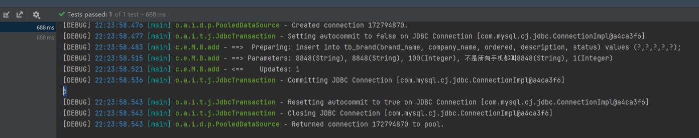

#### 修改动态字段

和动态查询差不多，都要用到`<if test="">`标签，同时再使用`<set>`标签，`<set>`作用和动态查询时用的`<where>`作用差不多

```xml
    <!--修改动态字段-->
    <update id="update">
        update tb_brand
        <set>
            <if test="brandName !=null and brandName!=''">
                brand_name = #{brandName},
            </if>
            <if test="companyName !=null and companyName!=''">
                company_name = #{companyName},
            </if>
            <if test="ordered !=null">
                ordered = #{ordered},
            </if>
            <if test="description !=null and description!=''">
                description = #{description},
            </if>
            <if test="status !=null">
                status = #{status}
            </if>
        </set>
        where id=#{id};
    </update>
```

## 12-删除功能

#### 批量删除

批量删除根据传过来的id数组来删除数据，由于每次传来的id数组的数据个数不能确定，所以要用到动态sql，这里使用foreach来遍历

```xml
<!--collection属性表示要遍历的集合,item为遍历出来的每一个元素，separator表示分隔符，open表示在开始添加的符号，close表示在结尾添加的符号-->    
<delete id="deleteByIds">
        delete from tb_brand where id in
        <foreach collection="array" item="id" open="(" close=")" separator=",">
            #{id}
        </foreach>
        ;				<!--这个分号不要忘了-->
</delete>
```

array是MyBatis默认的集合名，如果想要指定为其他，就要在Mapper中定义函数时添加@Param注解

```java
int deleteByIds(@Param("ids") int[] ids);
```

## 13-参数传递

了解MyBatis底层是如何封装传递过来的数据的

#### 多个参数

```java
/*
    * MyBatis在接收多个参数时会将每个参数封装为两个键值对
    * 比如这里,如果没有使用注解,就会有以下键值对
    * arg0->status
    * param1->status
    * arg1->companyName
    * param2->companyName
    * arg2->brandName
    * param3->brandName
    *
    *arg是从0开始
    *param是从1开始
    * */
 Brand selectByCondition(int status,String companyName,tring brandName);
```

此时如果还是按自己定义的方式去查询

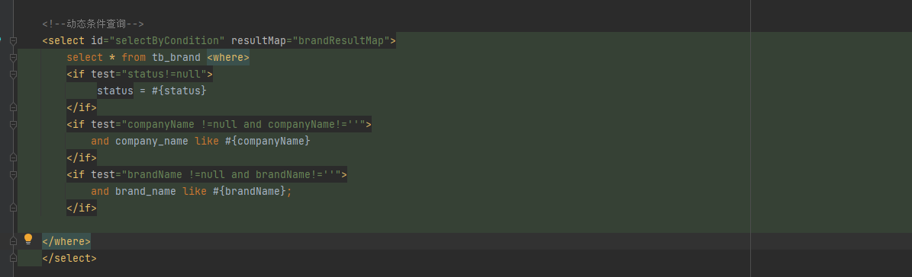

就会出现以下错误，通过看报错信息可以知道，能够使用的只有arg0，arg1，arg2，param1......


所以我们换种方式，把自己定义的参数占位符改成MyBatis默认的,arg和param是等效的

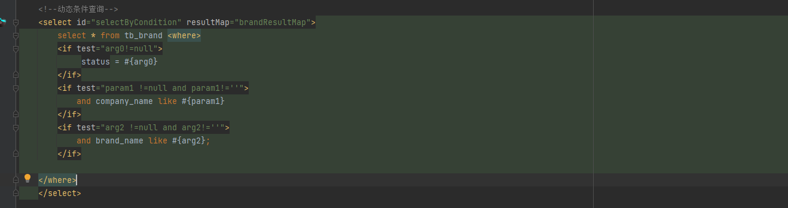

这时候就成功查询

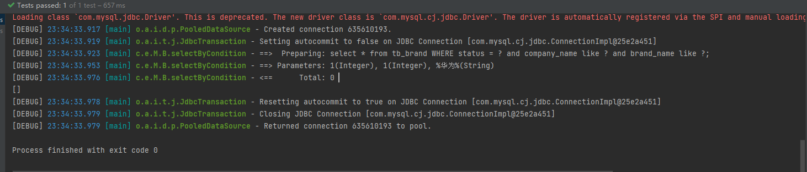

我们再尝试使用一个注解的情况

```java
List<Brand> selectByCondition(@Param("status")int status,String companyName,String brandName);
//此时键值对arg0会被替换成status
/*
*	status->status
*	param0->status
*	arg1->companyName
*	param1.....后面的一样，没有被替换
*/
```

这时我们再看，键值对arg0已经被替换成status了，如果第二个参数继续使用注解，那么arg2也会被替换，但param不受影响

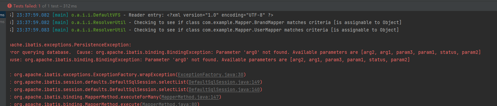

## 14-注解开发

注解开发适合完成简单功能

```java
    /*
    * 注解开发有以下三种
    * 1.@Select
    * 2.@Update
    * 3.@Delete
    * 4.@Insert
    * */
	//如下是简单的示例
    @Select("select * from tb_brand where id = #{id}")
    Brand selectById(int id);
```

如果sql语句很复杂还是用定义映射文件方式更好


## 03-HTTP-请求数据格式

### HTTP数据分为三部分

#### 1.请求行

请求数据的第一行是请求头

示例

```http
GET /HTTP/1.1
GET表示请求方法 
HTTP/1.1表示协议版本
```

#### 2.请求头

请求数据的第二行开始是请求头，格式为key:value格式

示例

```http
Host: www.bilibili.com
Connection: keep-alive
```

需要知道下面几个常见的请求头的含义

```http
Host: 表示请求的主机名
User-Agent: 表示浏览器版本，可以用来做浏览器适配
Accept: 表示浏览器能够接受的资源类型 如 text/*,image/*,*/*表示所有类型
Accept-Language: 表示浏览器偏好语言，服务器可以根据不同的偏好语言提供不同的页面
Accept-Encoding: 表示浏览器支持的压缩类型
```


#### 3.请求体

只有当请求方式为POST的时候才会有请求体，请求体用于存放POST请求的参数

#### GET与POST请求的区别

GET请求的参数放在请求数据的第一行，且有参数大小限制

POST请求的参数放在请求体里面，即请求数据的最后，并且参数大小没有限制
