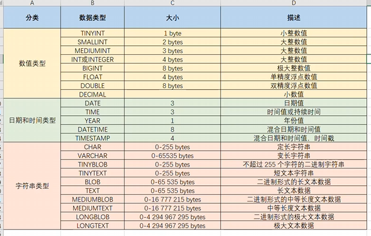
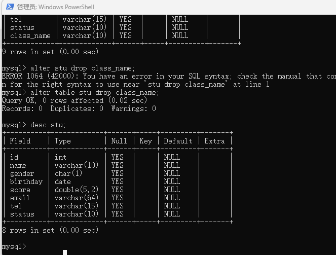
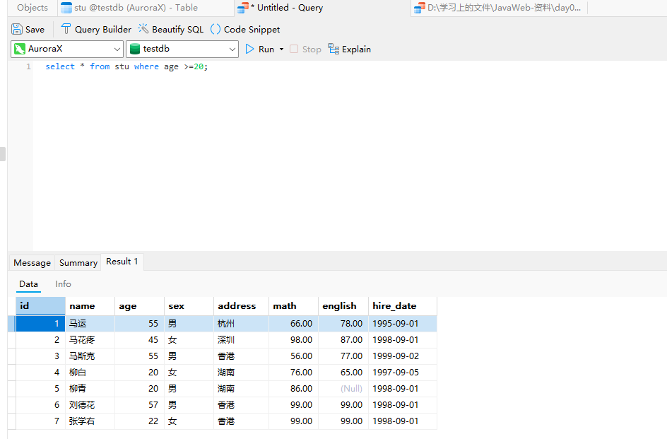
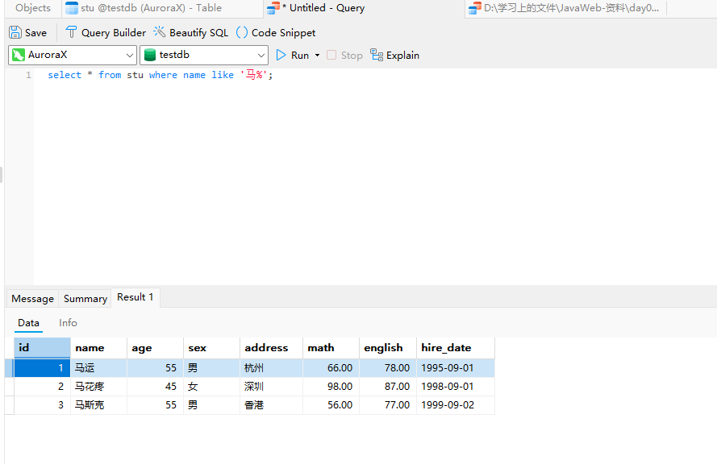
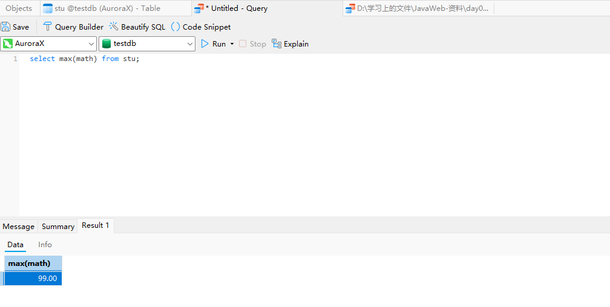
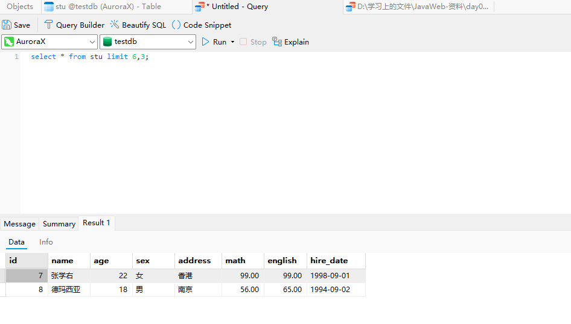
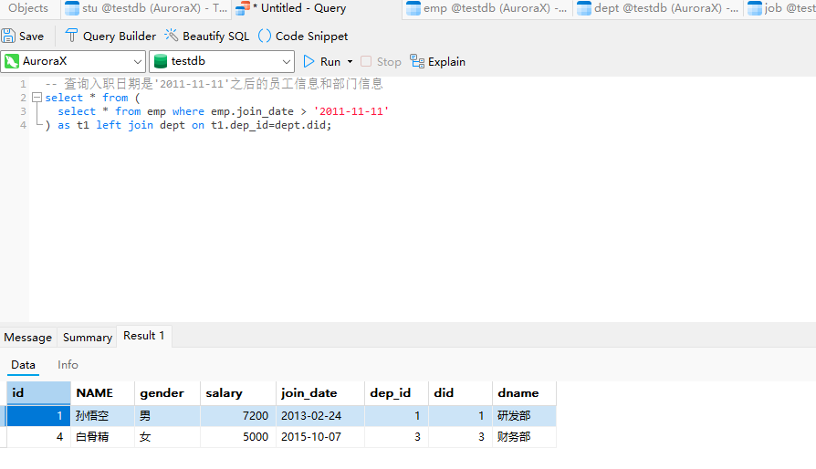

# JavaWeb快速入门

参考视频：[05-DDL-操作数据库_哔哩哔哩_bilibili](https://www.bilibili.com/video/BV1Qf4y1T7Hx?spm_id_from=333.788.player.switch&vd_source=f3cb3ea986b26c6910b4df6d37acd60d&p=6)

## 05-DDL-操作数据库

命令行登录数据库

```mysql
mysql -u root -p			-- 然后输入密码进入mysql操作环境
```


### 相关命令

#### 查询数据库命令

```mysql
show databases;
```


#### 创建数据库命令

```mysql
create database 数据库名称;
create database testdb;
create database if not exists testdb;		-- 创建testdb数据库如果该数据库不存在
```


#### 删除数据库命令

```mysql
drop database 数据库名称;
drop database testdb;
drop database if exists testdb;			-- 删除数据库，如果该数据库存在
```


#### 使用数据库命令

```mysql
select database();			-- 查看当前使用的数据库
use 数据库名称;				-- 使用指定数据库
use eduadmsys-final;
```


## 06-DDL-操作表-查询表&创建表

#### 查询表命令

```mysql
show tables;
```


#### 查询表结构命令

```mysql
desc 表名称;
desc teacher;
```


#### 创建表命令

```mysql
create table 表名(
	字段名 字段类型,
    字段名 字段类型,
    字段名 字段类型		--最后一个字段不能加逗号,
);

create table tb_user(
	id int,
    username varchar(25),		--括号里面要指定字段的长度
    password varchar(32)
);
```


## 07-DDL-操作表-数据类型

#### mysql的主要数据类型



熟悉一下mysql的数据类型的使用

创建以下学生表


```mysql
create table student(
	id int,
    name varchar(10),
    gender char(1),
    birthday date,
    score double(5,2),				-- 使用double类型，括号中前一个数字表示最大长度，后一个数字表示保留几位小数
    email varchar(64),
    tel varchar(15),
    status tinyint					-- 学生状态一般也就几个，所以用tinyint即可
);
```


## 08-DDL-操作表-修改&删除

#### 删除表命令

```mysql
drop table 表名;
drop table tb_user;
```


### 修改表的一系列命令

#### 修改表名

```mysql
alter table 表名 rename to 新的表名;
alter table student rename to stu;
```


#### 添加一列

```mysql
alter table 表名 add 列名 数据类型;
alter table stu add class_id int;
```


#### 修改数据类型

```mysql
alter table 表名 modify 列名 新的数据类型;
alter table stu modify status varchar(10);
```


#### 修改列名和数据类型

```mysql
alter table 表名 change 列名 新的列名 新的数据类型;
alter table stu change class_id class_name varchar(10);
```


#### 删除列

```mysql
alter table 表名 drop 列名;
alter table stu drop class_name;
```



## 10-DML-操作数据-添加&修改&删除

### 添加系列命令

#### 给指定列添加数据

```mysql
insert into 表名(列名1,列名2,....) values(值1,值2,...);
insert into stu(id,name) values(1,'张三');
```


#### 给全部列添加数据

```mysql
insert into 表名 values(值1,值2,....);			-- 表名后面的括号里的列名可以省略也可以全写
insert into 表名(列名1,列名2,等全部列名) values(值1,值2,...);
```


#### 批量添加数据

```mysql
insert into 表名 values(值1,值2,...),(值1,值2,...),(值1,值2,...)....;
insert into 表名(列名1,列名2,...) values (值1,值2,...),(值1,值2,...),(值1,值2,...)....;
```


### 修改数据命令

```mysql
update 表名 set 列名1=值1,列名2=值2,.....;			-- 如果不添加where条件，该命令会对所有行执行修改操作
update 表名 set 列名1=值1,列名2=值2,..... where 某个列=某个值;
```


### 删除数据命令

```mysql
delete from 表名 where 条件;					-- 如果不添加where条件，该命令会删除所有的行
delete from 表名;								 -- 删除所有行
```


## 11-DQL-基础查询

#### 查询多个字段

```mysql
select 字段1,字段2,..... from 表名;
select * from 表名;					-- 实际业务中不建议使用，若要查询全部，仍然要写出全部字段
```


#### 去除重复记录

```mysql
select distinct 字段1,字段2,.... from 表名; 		-- 只需加上distinct关键字
```


#### 为查询字段起别名

```mysql
select 字段1 as 别名1,字段2 as 别名2,...... from 表名;			-- as可省略
select 字段1 别名1,字段2 别名2,..... from 表名;
```


## 12-DQL-条件查询

```mysql
select * from 表名 where 条件;
```

### 几个条件查询的例子

#### 查询年龄大于20岁的学员信息

```mysql
select * from stu where age >20;
```


#### 查询年龄大于等于20岁的学员信息

```mysql
select * from stu where age >=20;
```



#### 查询年龄大于等于20岁并且小于30岁的学员信息

```mysql
select * from stu where age >=20 and age < 30;
select * from stu where age >=20 && age <30;			-- 不推荐使用&&
select * from stu where age between 20 and 30;
```


#### 查询入学日期在‘1998-09-01’到‘1999-09-01’之间的学员信息

```mysql
select * from stu where hire_date between '1998-09-01' and '1999-09-01' ;  -- date类型数据也支持比较
```


#### 查询年龄等于18岁的学院信息

```mysql
select * from stu where age = 18;
```


#### 查询年龄不等于18岁的学员信息

```mysql
select * from stu where age != 18;
```


#### 查询年龄等于18岁或20岁或22岁的学员信息

```mysql
select * from stu where age=18 or age=20 or age=22;
select * from stu where age=18||age=20||age=22;				-- 不推荐使用||
select * from stu where age in 一个集合;
select * from stu where age in (18,20,22);
```


#### 查询英语成绩为null的学员信息

要注意的是查询为null的数据不能使用 = 与 !=来比较，要使用 is null 或 is not null

```mysql
select * from stu where english is null;
select * from stu where english is not null;
```


### 模糊查询

`_`代表单个字符，`%`代表任意字符

#### 查询姓‘马‘的学员信息

```mysql
select * from stu where name like '马%';
```



#### 查询第二个字是’花‘的学员信息

```mysql
select * from stu where name like '_花%';
```


#### 查询名字中包含’德‘的学员信息

```mysql
select * from stu where name like '%德%';
```


## 13-DQL-排序查询

排序方式主要有升序排序`asc`，这是默认的；还有一个降序排序`desc`

```mysql
select 字段1,字段2,.... from 表名 order by 排序字段名1 排序方式1 ,排序字段名2 排序方式2,....;
```

#### 按照年龄升序排列

```mysql
select * from stu order by age asc;				-- asc 也可以不写，默认升序排列
```


#### 按照数学成绩降序排列

```mysql
select * from stu order by math desc;
```


#### 按照数学成绩降序排列，如果数学成绩一样，再按照英语成绩升序排列

```mysql
select * from stu order by math desc , english asc;
```


## 14-DQL-聚合函数

聚合函数是将一列数据作为整体，进行纵向计算。

主要有以下5个聚合函数

```mysql
/*
	count		统计数量，如果有值为null，则null不参与统计
	max			求某一列的最大值
	min			求某一列的最小值
	sum			求某一列值的总和
	avg			求某一列的平均值
	需要注意，null也不参与计算比较
*/
select 聚合函数名(列名) from 表名;
```

#### 统计班级一共有多少个学生

```mysql
select count(name) from stu;
```


#### 查询数学成绩的最高分

```mysql
select max(math) from stu;
```



#### 查询数学成绩的最低分

```mysql
select min(math) from stu;
```


#### 查询数学成绩的总分

```mysql
select sum(math) from stu;
```


#### 查询数学成绩的平均分

```mysql
select avg(math) from stu;
```


#### 查询英语成绩的最低分

英语成绩中的null值不会参与比较

```mysql
select min(english) from stu;
```


## 15-DQL-分组查询

```mysql
select 字段列表 from 表名 [where 条件语句] group by 分组字段名 [having 筛选语句]
```

要注意的是分组查询只能查询被分组的字段和聚合函数，查询其他字段是没有意义的

#### 查询男同学和女同学各自的数学平均分

```mysql
select sex,avg(math) from stu group by sex;			-- sex是分组字段 avg(math)是聚合函数
```


#### 查询男同学和女同学各自的数学平均分，以及各自的人数

```mysql
select sex,avg(math),count(*) from stu group by sex;
```


#### 查询男同学和女同学各自的数学平均分，以及各自的人数，并且要求分数低于70分的不参与分组

```mysql
select sex,avg(math),count(*) from stu where math >=70 group by sex;
```


#### 查询男同学和女同学各自的数学平均分，以及各自的人数，并且要求分数低于70分的不参与分组、分组后人数大于2的才显示


```mysql
select sex,avg(math),count(*) from stu where math >=70 group by sex having count(*)>2;
```


## 16-DQL-分页查询

```mysql
select 字段列表 from 表名 limit 起始索引, 查询条目数;
```

起始索引的计算公式：

起始索引=(当前查询的页码-1)*查询条目数

#### 从0开始查询，查询3条数据

```mysql
select * from stu limit 0,3;
```


#### 每页显示3条数据，查询第1页数据

```mysql
select * from stu limit 0,3;
```

#### 每页显示3条数据，查询第2页数据

```mysql
select * from stu limit 3,3;
```


#### 每页显示3条数据，查询第3页数据

```mysql
select * from stu limit 6,3;
```



## 08-多表查询-内连接&外连接

### 内连接

```mysql
select 字段列表 from 表1,表2.... where 条件;			-- 这是隐式内连接
select 字段列表 from 表1 [inner] join 表2 on 条件;		-- 这是显式内连接，其中inner可以省略
```

内连接是查询 表1 与 表2相交的数据


#### 隐式内连接查询emp和dept的数据

```mysql
select * from emp,dept where emp.dep_id=dept.did;			-- 隐式内连接
```


#### 隐式内连接查询emp的name,gender,和dept表的dname

```mysql
select emp.name,emp.gender,dept.dname from emp,dept where emp.dep_id=dept.did;
```


#### 显示内连接查询数据

```mysql
select * from emp inner join dept on emp.dep_id=dept.did;
select * from emp join dept on emp.dep_id=dept.did;				-- 省略inner
```


### 外连接

#### 左外连接

```mysql
select 字段列表 from 表1 left [outer] join 表2 on 条件;				-- outer可省略

```

查询emp表的所有数据及对应的部门信息

```mysql
select * from emp left join dept on emp.dep_id=dept.did;
```


#### 右外连接

```mysql
select 字段列表 from 表1 right [outer] join 表2 on 条件;			-- outer可省略 
```

查询dept表的所有数据及其对应的员工信息

```mysql
select * from emp right join dept on emp.dep_id = dept.did;
```


## 09-多表查询-子查询

子查询根据查询结果的不同，其作用也不同，主要有三种查询情况：1.单行单列 2.多行单列 3.多行多列

#### 子查询结果为单行单列

可以作为条件值来进行条件判断

```mysql
select 字段列表 from 表1 where 表1.某个字段 {=,>,<,...} (子查询);
select * from emp where emp.salary > (
	select salary from emp where emp.name = '猪八戒'					--子查询不能带分号;
);		-- 查询工资大于猪八戒的所有员工信息，子查询先查出猪八戒的工资.
```


#### 子查询结果为多行单列

可以作为一个集合条件，查询在这个集合内的数据，使用in关键字进行条件判断

```mysql
select 字段列表 from 表1 where 表1.某个字段 in (子查询);
-- 查询财务部和市场部所有员工信息
select * from emp where emp.dep_id in (
	select did from dept where dname in ('财务部','市场部')
);
```


#### 子查询结果为多行多列

可以作为一个虚拟表来与其他表进行连接

```mysql
select 字段列表 from 表1 left join (
	select 字段列表 from 表2 where 条件
) on 连接条件;

-- 查询入职日期是'2011-11-11'之后的员工信息和部门信息
select * from (
	select * from emp where emp.join_date > '2011-11-11'
) as t1 left join dept on t1.dep_id=dept.did;
```



## 10-多表查询-案例

相关数据表的模型如下：


```mysql
-- 1.查询所有员工信息。查询员工编号，员工姓名，工资，职务名称，职务描述
SELECT
  emp.id,
  emp.ename,
  emp.salary,
  job.jname,
  job.description 
FROM
  emp
  JOIN job ON emp.job_id = job.id;
-- 2.查询员工编号，员工姓名，工资，职务名称，职务描述，部门名称，部门位置
SELECT
  emp.id,
  emp.ename,
  emp.salary,
  job.jname,
  job.description,
  dept.dname,
  dept.loc 
FROM
  emp,
  job,
  dept 
WHERE
  emp.job_id = job.id 
  AND emp.dept_id = dept.id;-- 隐式内连接
SELECT
  emp.id,
  emp.ename,
  emp.salary,
  job.jname,
  job.description,
  dept.dname,
  dept.loc 
FROM
  emp
  JOIN job ON emp.job_id = job.id
  JOIN dept ON emp.dept_id = dept.id;-- 显式内连接
-- 3.查询员工姓名，工资，工资等级
SELECT
  emp.ename,
  emp.salary,
  t1.grade 
FROM
  emp
  LEFT JOIN salarygrade t1 ON emp.salary BETWEEN t1.losalary 
  AND t1.hisalary;		-- 外连接方法
  
SELECT
  emp.ename,
  emp.salary,
  t1.grade 
FROM
  emp,
  salarygrade t1 
WHERE
  emp.salary BETWEEN t1.losalary 
  AND t1.hisalary;-- 内连接方法
-- 4.查询员工姓名，工资，职务名称，职务描述，部门名称，部门位置，工资等级
SELECT
  emp.id,
  emp.ename,
  emp.salary,
  job.jname,
  job.description,
  dept.dname,
  dept.loc,
  t1.grade 
FROM
  emp
  JOIN job ON emp.job_id = job.id
  JOIN dept ON emp.dept_id = dept.id
  JOIN salarygrade t1 ON emp.salary BETWEEN t1.losalary 
  AND t1.hisalary;-- 显式内连接
-- 5.查询出部门编号、部门名称、部门位置、部门人数
SELECT
  dept.id,
  dept.dname,
  dept.loc,
  count 
FROM
  dept,
  (SELECT dept_id, count(*) count FROM emp GROUP BY dept_id) t1 
WHERE
  dept.id = t1.dept_id;
```


