# JavaWeb快速入门

参考视频：[05-DDL-操作数据库_哔哩哔哩_bilibili](https://www.bilibili.com/video/BV1Qf4y1T7Hx?spm_id_from=333.788.player.switch&vd_source=f3cb3ea986b26c6910b4df6d37acd60d&p=6)


# MySQL基础

## 05-DDL-操作数据库

命令行登录数据库

```mysql
mysql -u root -p			-- 然后输入密码进入mysql操作环境
```


### 相关命令

#### 查询数据库命令

```mysql
show databases;
```

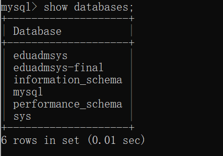


#### 创建数据库命令

```mysql
create database 数据库名称;
create database testdb;
create database if not exists testdb;		-- 创建testdb数据库如果该数据库不存在
```

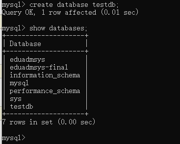


#### 删除数据库命令

```mysql
drop database 数据库名称;
drop database testdb;
drop database if exists testdb;			-- 删除数据库，如果该数据库存在
```

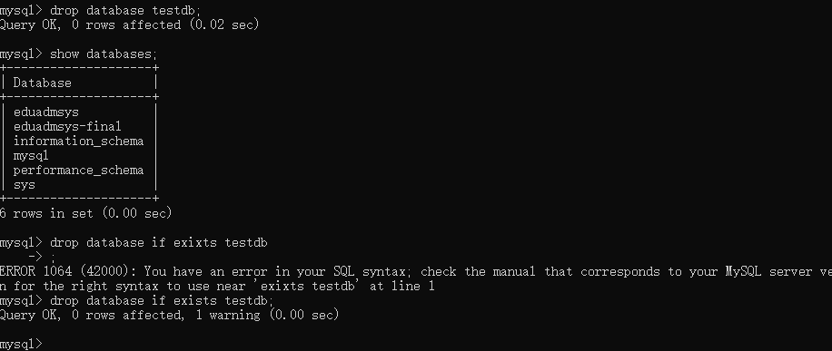

#### 使用数据库命令

```mysql
select database();			-- 查看当前使用的数据库
use 数据库名称;				-- 使用指定数据库
use eduadmsys-final;
```


## 06-DDL-操作表-查询表&创建表

#### 查询表命令

```mysql
show tables;
```


#### 查询表结构命令

```mysql
desc 表名称;
desc teacher;
```

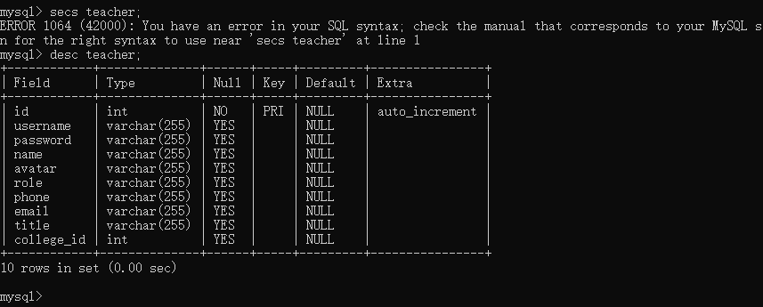

#### 创建表命令

```mysql
create table 表名(
	字段名 字段类型,
    字段名 字段类型,
    字段名 字段类型		--最后一个字段不能加逗号,
);

create table tb_user(
	id int,
    username varchar(25),		--括号里面要指定字段的长度
    password varchar(32)
);
```

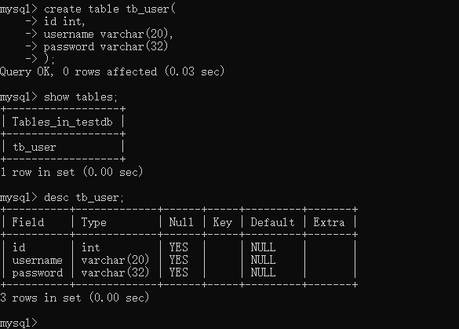


## 07-DDL-操作表-数据类型

#### mysql的主要数据类型


熟悉一下mysql的数据类型的使用

创建以下学生表


```mysql
create table student(
	id int,
    name varchar(10),
    gender char(1),
    birthday date,
    score double(5,2),				-- 使用double类型，括号中前一个数字表示最大长度，后一个数字表示保留几位小数
    email varchar(64),
    tel varchar(15),
    status tinyint					-- 学生状态一般也就几个，所以用tinyint即可
);
```


## 08-DDL-操作表-修改&删除

#### 删除表命令

```mysql
drop table 表名;
drop table tb_user;
```


### 修改表的一系列命令

#### 修改表名

```mysql
alter table 表名 rename to 新的表名;
alter table student rename to stu;
```


#### 添加一列

```mysql
alter table 表名 add 列名 数据类型;
alter table stu add class_id int;
```


#### 修改数据类型

```mysql
alter table 表名 modify 列名 新的数据类型;
alter table stu modify status varchar(10);
```


#### 修改列名和数据类型

```mysql
alter table 表名 change 列名 新的列名 新的数据类型;
alter table stu change class_id class_name varchar(10);
```


#### 删除列

```mysql
alter table 表名 drop 列名;
alter table stu drop class_name;
```


## 10-DML-操作数据-添加&修改&删除

### 添加系列命令

#### 给指定列添加数据

```mysql
insert into 表名(列名1,列名2,....) values(值1,值2,...);
insert into stu(id,name) values(1,'张三');
```


#### 给全部列添加数据

```mysql
insert into 表名 values(值1,值2,....);			-- 表名后面的括号里的列名可以省略也可以全写
insert into 表名(列名1,列名2,等全部列名) values(值1,值2,...);
```

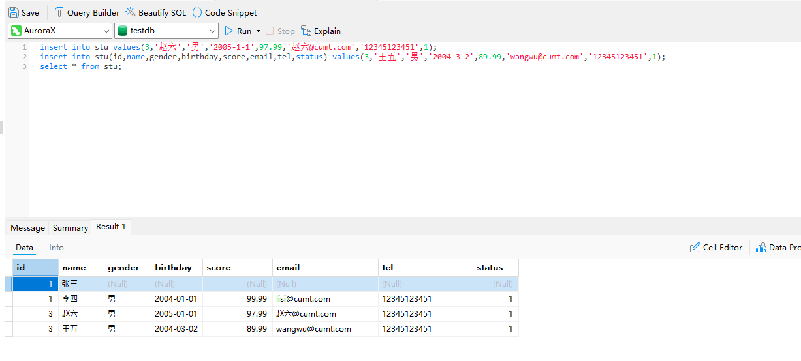

#### 批量添加数据

```mysql
insert into 表名 values(值1,值2,...),(值1,值2,...),(值1,值2,...)....;
insert into 表名(列名1,列名2,...) values (值1,值2,...),(值1,值2,...),(值1,值2,...)....;
```


### 修改数据命令

```mysql
update 表名 set 列名1=值1,列名2=值2,.....;			-- 如果不添加where条件，该命令会对所有行执行修改操作
update 表名 set 列名1=值1,列名2=值2,..... where 某个列=某个值;
```


### 删除数据命令

```mysql
delete from 表名 where 条件;					-- 如果不添加where条件，该命令会删除所有的行
delete from 表名;								 -- 删除所有行
```


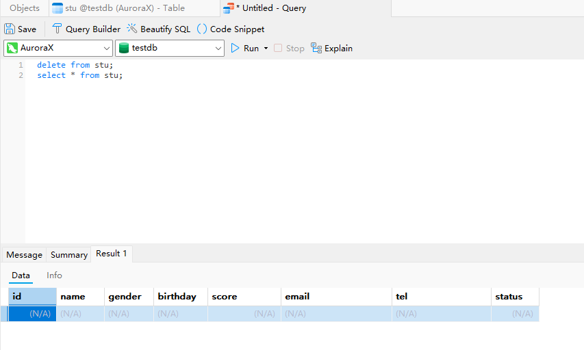

## 11-DQL-基础查询

#### 查询多个字段

```mysql
select 字段1,字段2,..... from 表名;
select * from 表名;					-- 实际业务中不建议使用，若要查询全部，仍然要写出全部字段
```


#### 去除重复记录

```mysql
select distinct 字段1,字段2,.... from 表名; 		-- 只需加上distinct关键字
```


#### 为查询字段起别名

```mysql
select 字段1 as 别名1,字段2 as 别名2,...... from 表名;			-- as可省略
select 字段1 别名1,字段2 别名2,..... from 表名;
```

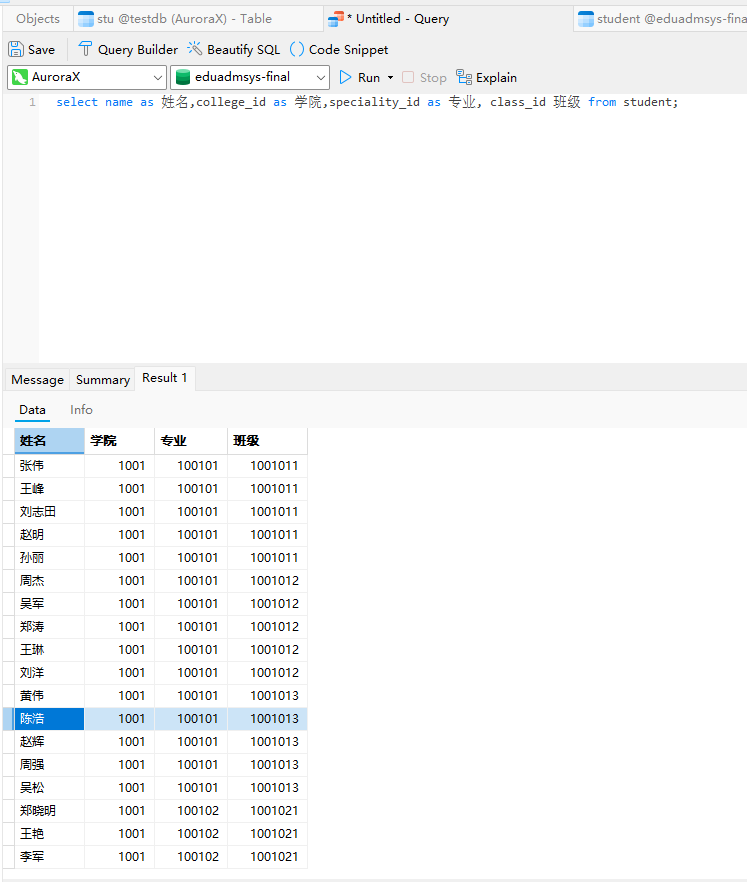

## 12-DQL-条件查询

```mysql
select * from 表名 where 条件;
```

### 几个条件查询的例子

#### 查询年龄大于20岁的学员信息

```mysql
select * from stu where age >20;
```

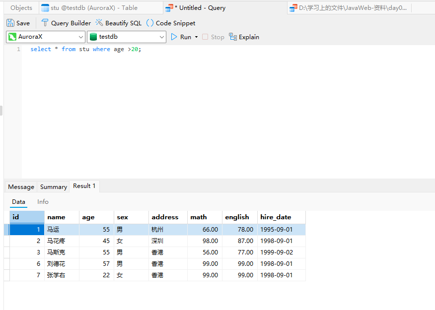

#### 查询年龄大于等于20岁的学员信息

```mysql
select * from stu where age >=20;
```


#### 查询年龄大于等于20岁并且小于30岁的学员信息

```mysql
select * from stu where age >=20 and age < 30;
select * from stu where age >=20 && age <30;			-- 不推荐使用&&
select * from stu where age between 20 and 30;
```


#### 查询入学日期在‘1998-09-01’到‘1999-09-01’之间的学员信息

```mysql
select * from stu where hire_date between '1998-09-01' and '1999-09-01' ;  -- date类型数据也支持比较
```

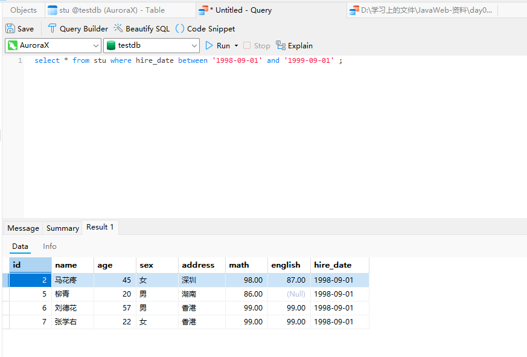

#### 查询年龄等于18岁的学院信息

```mysql
select * from stu where age = 18;
```


#### 查询年龄不等于18岁的学员信息

```mysql
select * from stu where age != 18;
```

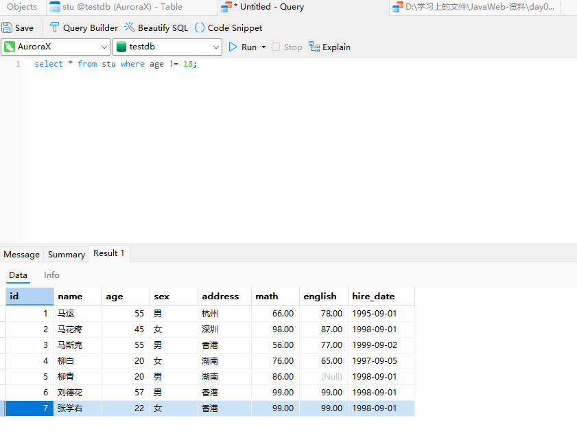

#### 查询年龄等于18岁或20岁或22岁的学员信息

```mysql
select * from stu where age=18 or age=20 or age=22;
select * from stu where age=18||age=20||age=22;				-- 不推荐使用||
select * from stu where age in 一个集合;
select * from stu where age in (18,20,22);
```


#### 查询英语成绩为null的学员信息

要注意的是查询为null的数据不能使用 = 与 !=来比较，要使用 is null 或 is not null

```mysql
select * from stu where english is null;
select * from stu where english is not null;
```


### 模糊查询

`_`代表单个字符，`%`代表任意字符

#### 查询姓‘马‘的学员信息

```mysql
select * from stu where name like '马%';
```


#### 查询第二个字是’花‘的学员信息

```mysql
select * from stu where name like '_花%';
```


#### 查询名字中包含’德‘的学员信息

```mysql
select * from stu where name like '%德%';
```

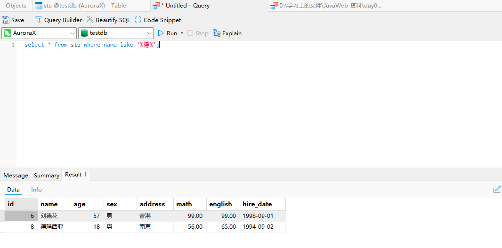

## 13-DQL-排序查询

排序方式主要有升序排序`asc`，这是默认的；还有一个降序排序`desc`

```mysql
select 字段1,字段2,.... from 表名 order by 排序字段名1 排序方式1 ,排序字段名2 排序方式2,....;
```

#### 按照年龄升序排列

```mysql
select * from stu order by age asc;				-- asc 也可以不写，默认升序排列
```


#### 按照数学成绩降序排列

```mysql
select * from stu order by math desc;
```


#### 按照数学成绩降序排列，如果数学成绩一样，再按照英语成绩升序排列

```mysql
select * from stu order by math desc , english asc;
```


## 14-DQL-聚合函数

聚合函数是将一列数据作为整体，进行纵向计算。

主要有以下5个聚合函数

```mysql
/*
	count		统计数量，如果有值为null，则null不参与统计
	max			求某一列的最大值
	min			求某一列的最小值
	sum			求某一列值的总和
	avg			求某一列的平均值
	需要注意，null也不参与计算比较
*/
select 聚合函数名(列名) from 表名;
```

#### 统计班级一共有多少个学生

```mysql
select count(name) from stu;
```

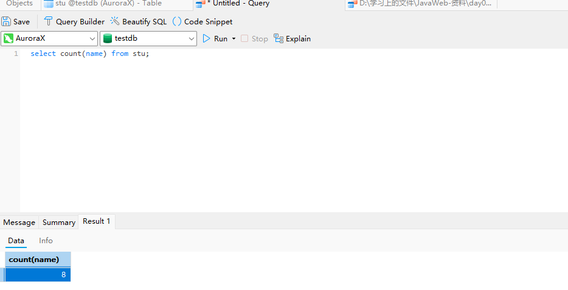

#### 查询数学成绩的最高分

```mysql
select max(math) from stu;
```


#### 查询数学成绩的最低分

```mysql
select min(math) from stu;
```


#### 查询数学成绩的总分

```mysql
select sum(math) from stu;
```


#### 查询数学成绩的平均分

```mysql
select avg(math) from stu;
```


#### 查询英语成绩的最低分

英语成绩中的null值不会参与比较

```mysql
select min(english) from stu;
```


## 15-DQL-分组查询

```mysql
select 字段列表 from 表名 [where 条件语句] group by 分组字段名 [having 筛选语句]
```

要注意的是分组查询只能查询被分组的字段和聚合函数，查询其他字段是没有意义的

#### 查询男同学和女同学各自的数学平均分

```mysql
select sex,avg(math) from stu group by sex;			-- sex是分组字段 avg(math)是聚合函数
```


#### 查询男同学和女同学各自的数学平均分，以及各自的人数

```mysql
select sex,avg(math),count(*) from stu group by sex;
```


#### 查询男同学和女同学各自的数学平均分，以及各自的人数，并且要求分数低于70分的不参与分组

```mysql
select sex,avg(math),count(*) from stu where math >=70 group by sex;
```


#### 查询男同学和女同学各自的数学平均分，以及各自的人数，并且要求分数低于70分的不参与分组、分组后人数大于2的才显示


```mysql
select sex,avg(math),count(*) from stu where math >=70 group by sex having count(*)>2;
```


## 16-DQL-分页查询

```mysql
select 字段列表 from 表名 limit 起始索引, 查询条目数;
```

起始索引的计算公式：

起始索引=(当前查询的页码-1)*查询条目数

#### 从0开始查询，查询3条数据

```mysql
select * from stu limit 0,3;
```


#### 每页显示3条数据，查询第1页数据

```mysql
select * from stu limit 0,3;
```

#### 每页显示3条数据，查询第2页数据

```mysql
select * from stu limit 3,3;
```

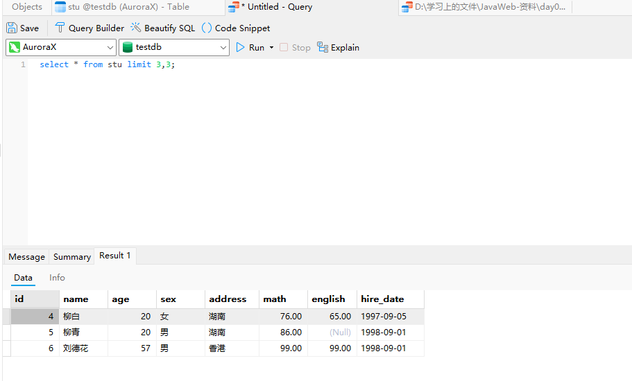

#### 每页显示3条数据，查询第3页数据

```mysql
select * from stu limit 6,3;
```


# MySQL高级

## 08-多表查询-内连接&外连接

### 内连接

```mysql
select 字段列表 from 表1,表2.... where 条件;			-- 这是隐式内连接
select 字段列表 from 表1 [inner] join 表2 on 条件;		-- 这是显式内连接，其中inner可以省略
```

内连接是查询 表1 与 表2相交的数据


#### 隐式内连接查询emp和dept的数据

```mysql
select * from emp,dept where emp.dep_id=dept.did;			-- 隐式内连接
```


#### 隐式内连接查询emp的name,gender,和dept表的dname

```mysql
select emp.name,emp.gender,dept.dname from emp,dept where emp.dep_id=dept.did;
```

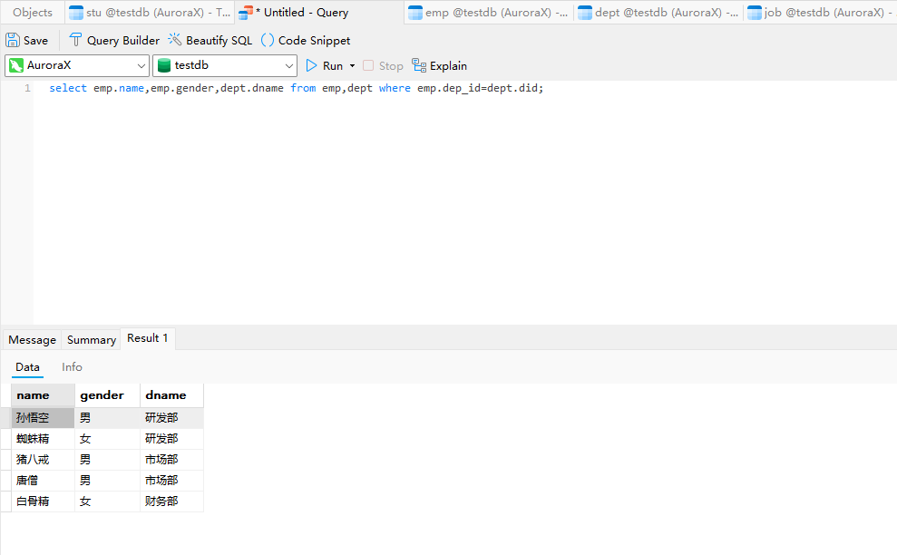

#### 显示内连接查询数据

```mysql
select * from emp inner join dept on emp.dep_id=dept.did;
select * from emp join dept on emp.dep_id=dept.did;				-- 省略inner
```

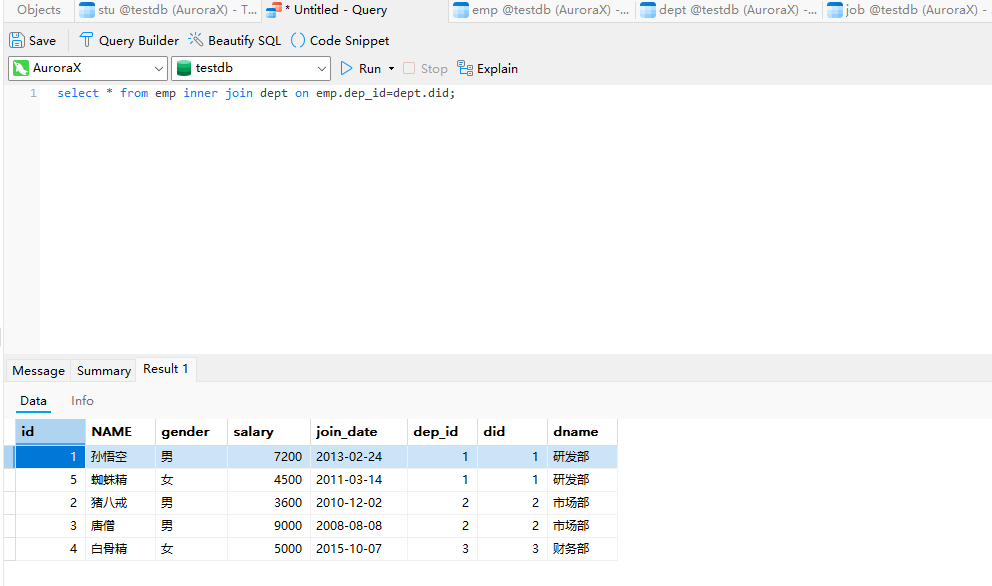

### 外连接

#### 左外连接

```mysql
select 字段列表 from 表1 left [outer] join 表2 on 条件;				-- outer可省略

```

查询emp表的所有数据及对应的部门信息

```mysql
select * from emp left join dept on emp.dep_id=dept.did;
```

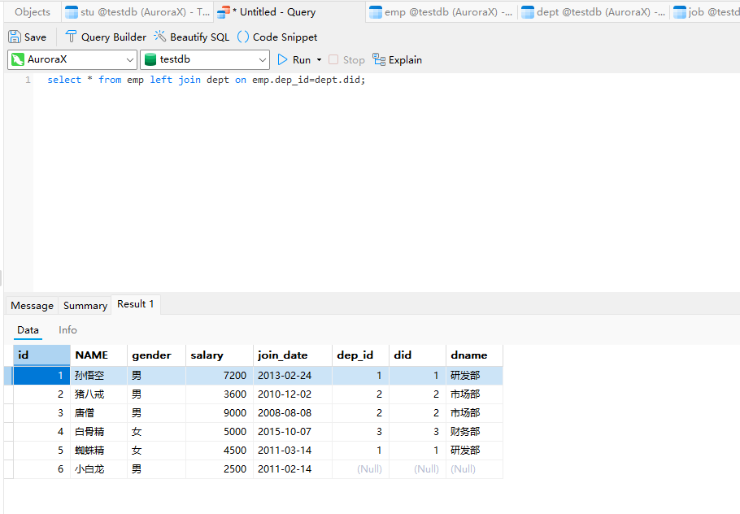

#### 右外连接

```mysql
select 字段列表 from 表1 right [outer] join 表2 on 条件;			-- outer可省略 
```

查询dept表的所有数据及其对应的员工信息

```mysql
select * from emp right join dept on emp.dep_id = dept.did;
```

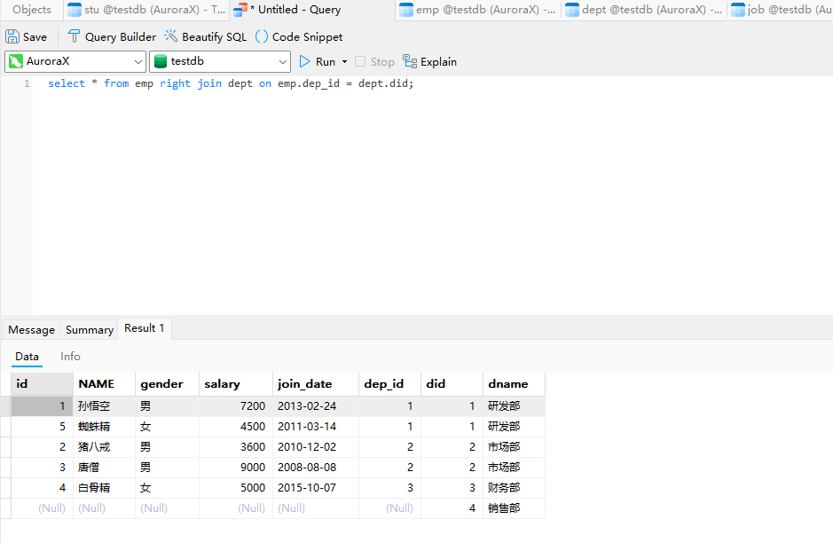

## 09-多表查询-子查询

子查询根据查询结果的不同，其作用也不同，主要有三种查询情况：1.单行单列 2.多行单列 3.多行多列

#### 子查询结果为单行单列

可以作为条件值来进行条件判断

```mysql
select 字段列表 from 表1 where 表1.某个字段 {=,>,<,...} (子查询);
select * from emp where emp.salary > (
	select salary from emp where emp.name = '猪八戒'					--子查询不能带分号;
);		-- 查询工资大于猪八戒的所有员工信息，子查询先查出猪八戒的工资.
```


#### 子查询结果为多行单列

可以作为一个集合条件，查询在这个集合内的数据，使用in关键字进行条件判断

```mysql
select 字段列表 from 表1 where 表1.某个字段 in (子查询);
-- 查询财务部和市场部所有员工信息
select * from emp where emp.dep_id in (
	select did from dept where dname in ('财务部','市场部')
);
```


#### 子查询结果为多行多列

可以作为一个虚拟表来与其他表进行连接

```mysql
select 字段列表 from 表1 left join (
	select 字段列表 from 表2 where 条件
) on 连接条件;

-- 查询入职日期是'2011-11-11'之后的员工信息和部门信息
select * from (
	select * from emp where emp.join_date > '2011-11-11'
) as t1 left join dept on t1.dep_id=dept.did;
```


## 10-多表查询-案例

相关数据表的模型如下：


```mysql
-- 1.查询所有员工信息。查询员工编号，员工姓名，工资，职务名称，职务描述
SELECT
  emp.id,
  emp.ename,
  emp.salary,
  job.jname,
  job.description 
FROM
  emp
  JOIN job ON emp.job_id = job.id;
-- 2.查询员工编号，员工姓名，工资，职务名称，职务描述，部门名称，部门位置
SELECT
  emp.id,
  emp.ename,
  emp.salary,
  job.jname,
  job.description,
  dept.dname,
  dept.loc 
FROM
  emp,
  job,
  dept 
WHERE
  emp.job_id = job.id 
  AND emp.dept_id = dept.id;-- 隐式内连接
SELECT
  emp.id,
  emp.ename,
  emp.salary,
  job.jname,
  job.description,
  dept.dname,
  dept.loc 
FROM
  emp
  JOIN job ON emp.job_id = job.id
  JOIN dept ON emp.dept_id = dept.id;-- 显式内连接
-- 3.查询员工姓名，工资，工资等级
SELECT
  emp.ename,
  emp.salary,
  t1.grade 
FROM
  emp
  LEFT JOIN salarygrade t1 ON emp.salary BETWEEN t1.losalary 
  AND t1.hisalary;		-- 外连接方法
  
SELECT
  emp.ename,
  emp.salary,
  t1.grade 
FROM
  emp,
  salarygrade t1 
WHERE
  emp.salary BETWEEN t1.losalary 
  AND t1.hisalary;-- 内连接方法
-- 4.查询员工姓名，工资，职务名称，职务描述，部门名称，部门位置，工资等级
SELECT
  emp.id,
  emp.ename,
  emp.salary,
  job.jname,
  job.description,
  dept.dname,
  dept.loc,
  t1.grade 
FROM
  emp
  JOIN job ON emp.job_id = job.id
  JOIN dept ON emp.dept_id = dept.id
  JOIN salarygrade t1 ON emp.salary BETWEEN t1.losalary 
  AND t1.hisalary;-- 显式内连接
-- 5.查询出部门编号、部门名称、部门位置、部门人数
SELECT
  dept.id,
  dept.dname,
  dept.loc,
  count 
FROM
  dept,
  (SELECT dept_id, count(*) count FROM emp GROUP BY dept_id) t1 
WHERE
  dept.id = t1.dept_id;
```


# JDBC

## 01-JDBC简介 快速入门

使用jdbc的步骤如下

#### 0.首先创建工程，导入数据库驱动jar包

创建一个空工程，进入project structure设置jdk和language level


然后创建一个模块，在模块里面创建一个lib文件夹，将驱动jar包放入lib文件夹并将该文件夹设置为library文件夹


设置该文件夹的有效范围


#### 1.注册驱动

```java
Class.forName("com.mysql.jdbc.Driver");
```

#### 2.获取连接

```java
String url = "jdbc:mysql://127.0.0.1:3306/testdb";
String username = "root";
String password = "对应的数据库密码";
Connection conn = DriverManager.getConnection(url,username,password);
```

#### 3.定义sql语句

```java
String sql = "update account set money = 2000 where id =1 ";
```

#### 4.获取执行sql对象

```java
Statement stmt = conn.createStatement();
```

#### 5.执行sql

```java
int count = stmt.executeUpdate(sql);			//返回结果为受影响的行数
```

#### 6.处理返回结果

```java
System.out.println(count);
```

#### 7.释放资源

```java
stmt.close();
conn.close();
```


修改成功


## 02-JDBC-API详解-DriverManager

DriverManager是驱动管理类，其主要有以下两个作用：

1.注册驱动

2.获取sql连接对象

DriverManager是一个工具类，其函数都是静态函数，因此可以直接通过类名来访问成员函数

```java
Connection conn = DriverManager.getConnection(url,username,password);
```

url的定义详解如下

```java
//设置url的完整语法
String url = "数据库协议://数据库ip地址:数据库端口号/要访问的数据库名?参数键值对1&参数键值对2....";
//后面的键值对可以进行某些设置，比如配置useSSL=false参数，禁用安全连接方式，解决警告提醒
//如果是访问本地数据库并且端口为3306，ip地址还可以省略
String url = "jdbc:mysql:///testdb?useSSL=false";
```

警告提醒：


禁用安全连接方式，解决警告提醒


## 03-JDBC-API详解-Connection

Connection是数据库连接对象，其主要作用如下：

1.获取执行sql的对象

2.管理事务

这里先讲管理事务，第一个后面讲

```java
//connection提供了三个管理事务的函数
//1.setAutoCommit(boolean autoCommit);	true为自动提交事务，false为手动提交事务
//2.commit()							提交事务
//3.roolback()							回滚事务
```

修改前面快速入门代码，使其要么修改两个数据，要么一个也不修改

```java
//1.注册驱动
Class.forName("com.mysql.jdbc.Driver");
//2.获取连接
String url ="jdbc:mysql:///testdb?useSSL=false";
String username="root";
String password="gt1303190518";
Connection conn = DriverManager.getConnection(url,username,password);
//3.定义sql语句
String sql1="update account set money=2000 where id = 1";
String sql2="update account set money=3000 where id = 2";
//4.获取执行sql对象
Statement stmt = conn.createStatement();
conn.setAutoCommit(false);                  //设置手动提交事务
        try {

            //5.执行sql语句
            int count1 = stmt.executeUpdate(sql1);
            int i=3/0;							//这里会抛出异常，使得第一个sql成功执行，第二个sql不能执行
            
            int count2 = stmt.executeUpdate(sql2);
            //6.处理执行结果
            System.out.println(count1);
            System.out.println(count2);
            conn.commit();                      //提交事务
        } catch (SQLException e) {
            conn.rollback();                    //捕获到错误就回滚
            throw new RuntimeException(e);
        }
//7.释放资源
stmt.close();
conn.close();
```

如果没有报错，数据会被正常修改，但如果让int i = 3/0;这行代码生效的话，结果如下


控制台第一行打印出来的1就是第一个sql执行的结果，sql1成功修改了一行数据，但数据库里面并没有看到sql1的修改，因为事务被回滚了，此时如果我们再把回滚、提交、设置自动提交的代码去掉，就会发现sql1的修改成功了，但sql2没有执行


## 04-JDBC-API详解-Statement

Statement的作用是执行sql语句，其提供两种执行函数

1.执行DML、DDL语句，即对数据库的修改语句

```java
int executeUpdate(sql);					//返回受影响的行数
```

前面快速入门里的代码就是这个

2.执行DQL语句，即查询语句

```java
ResultSet executeQuery(sql);			//返回ResultSet结果集对象
```

## 05-JDBC-API详解-ResultSet

ResultSet是查询语句的结果的集合，如果要取出里面的数据，就要通过一个抽象的“光标”一行一行去访问里面的数据，其提供了以下用于访问里面数据的函数

#### 1.next()函数

```java
boolean next();					//将访问光标向下移动一行，并判断该行是否是有效行，有效行就返回true
```

#### 2.getxxx函数

```java
xxx getxxx(索引或字段名);			//xxx代表数据类型，索引是指要获取的数据在第几列，从1开始
int getInt("id");
String getString(2);
```

总获取数据方式是通过一个while循环来遍历所有行

```java
		//1.注册驱动
        Class.forName("com.mysql.jdbc.Driver");
        //2.获取连接
        String url ="jdbc:mysql:///testdb?useSSL=false";
        String username="root";
        String password="gt1303190518";
        Connection conn = DriverManager.getConnection(url,username,password);
        //3.定义sql语句
        String sql1="select * from account";
        //4.获取执行sql对象
        Statement stmt = conn.createStatement();
        //5.执行sql语句
        ResultSet res=stmt.executeQuery(sql1);
        //6.获取查询的数据
        while(res.next()){
            System.out.println(res.getInt(1));          //通过索引来获取数据
            System.out.println(res.getString("name"));  //通过字段名来获取数据
            System.out.println(res.getDouble(3));
            System.out.println("---------------");
        }
        //7.释放资源
        res.close();
        stmt.close();
        conn.close();
```


#### 案例

查询account账户表数据，将其封装为Account对象中，并且存储到ArrayList集合中

首先建立一个Account的实体类


然后将数据封装成Account对象并打印出来

```java
public static void main(String[] args) throws ClassNotFoundException, SQLException {
        //1.注册驱动
        Class.forName("com.mysql.jdbc.Driver");
        //2.获取连接
        String url ="jdbc:mysql:///testdb?useSSL=false";
        String username="root";
        String password="gt1303190518";
        Connection conn = DriverManager.getConnection(url,username,password);
        //3.定义sql语句
        String sql1="select * from account";
        //4.获取执行sql对象
        Statement stmt = conn.createStatement();
        //5.执行sql语句
        ResultSet res=stmt.executeQuery(sql1);
        //6.获取查询的数据
        //建立list集合
        ArrayList<Account> list = new ArrayList<>();
        while(res.next()){
            //创建实体
            Account account=new Account();

            account.setId(res.getInt(1));          //通过索引来获取数据
            account.setName(res.getString("name"));  //通过字段名来获取数据
            account.setMoney(res.getDouble(3));
            list.add(account);
        }
        System.out.println(list);
        //7.释放资源
        res.close();
        stmt.close();
        conn.close();
    }
```

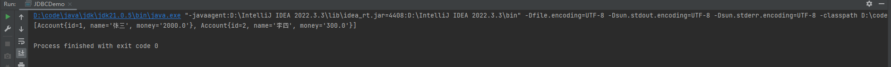

 

## 06-JDBC-API详解-PreparedStatement-SQL注入

PreparedStatement是预编译sql语句执行类，是Statement的一个继承类，同样是用来执行sql语句的，但是它可以放置SQL注入。

#### 什么是SQL注入

```java
//通常我们用于查询的sql语句是这样定义的
String name="username";
String pwd="123";				//这是一验证用户登录的查询语句
//sql语句是通过字符串拼接出来的
String sql="select * from tb_user where username= '"+name+"'and password='"+pwd+"'";

//然后根据查询结果，如果查询结果大于0，则表示存在用户且密码正确，则允许登录，否则不允许登录
```

而sql注入就是通过输入相关字符来达到修改sql语句的目的

```java
//举个例子
//这里不管用户名输什么
//只要对password输入
String pwd = "0' or '1' = '1'";
//此时sql语句就变成了 select * from tb_user where username = 'username' and password='0' or '1'= '1'
//而这个sql语句由于后面的or ‘1’=’1‘,不管怎样都能查出所有的数据，也就是会导致最终判断结果>0成立，从而使得可以登录成功

```

输入正确的账号密码登录

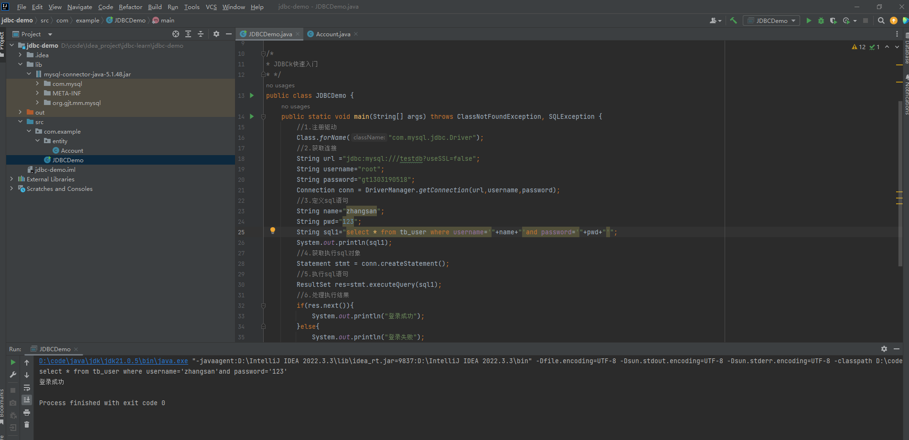

sql注入方式登录成功

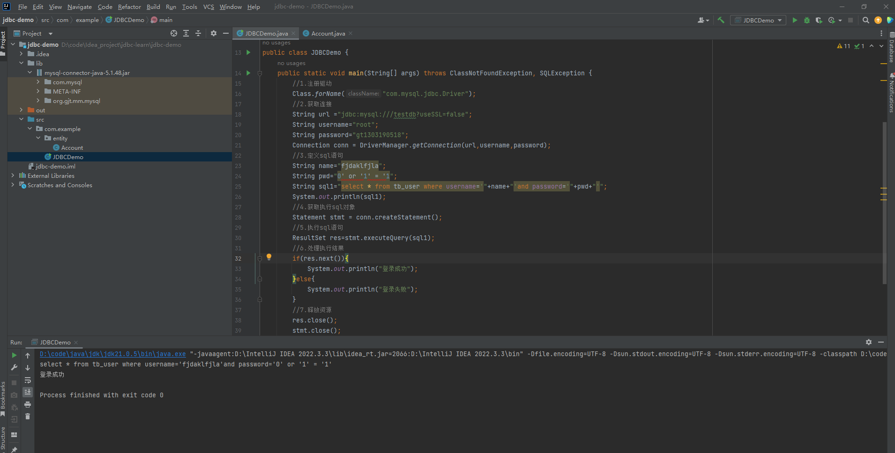

## 06-JDBC-API详解-PreparedStatement

如何解决sql注入，这就要用到PreparedStatement。

### 使用PreparedStatement的步骤

#### 1.获取PreparedStatement对象

```java
//要使用PreparedStatement的话就要先定义sql语句，且语句中的参数值要用?替代
//定义sql语句
String sql="select * from tb_user where username=? and password = ?";
//获取对象,将sql语句传入构造函数来获取PreparedStatement对象
Connection conn = DriverManager.getConnection(url,username,password);			//先获取连接
PreparedStatement pstmt=conn.preparedStatement(sql);
```


#### 2.设置参数值

```java
//PreparedStatement有 setxxx(参数1,参数2)函数
//xxx代表数据类型
//参数1代表?的位置,从1开始
//参数2代表要替换的值
pstmt.setString(1,name);
pstmt.setString(2,pwd);
```

#### 3.执行sql

```java
//通过PreparedStatement执行sql语句不需要再传递sql语句
//直接使用函数executeUpdate()或executeQuery()来执行
pstmt.executeQuery();
```

```java
public static void main(String[] args) throws ClassNotFoundException, SQLException {
        //1.注册驱动
        Class.forName("com.mysql.jdbc.Driver");
        //2.获取连接
        String url ="jdbc:mysql:///testdb?useSSL=false";
        String username="root";
        String password="gt1303190518";
        Connection conn = DriverManager.getConnection(url,username,password);
        //3.定义sql语句
        String name="fjdaklfjla";
        String pwd="0' or '1' = '1";
        String sql1="select * from tb_user where username=?and password=?";
        System.out.println(sql1);
        //4.获取执行sql对象
        PreparedStatement pstmt = conn.prepareStatement(sql1);
        //设置参数值
        pstmt.setString(1,name);
        pstmt.setString(2,pwd);
        //5.执行sql语句
        ResultSet res=pstmt.executeQuery();
        //6.处理执行结果
        if(res.next()){
            System.out.println("登录成功");
        }else{
            System.out.println("登录失败");
        }
        //7.释放资源
        res.close();
        pstmt.close();
        conn.close();
    }
```


通过这样修改sql注入便不再生效

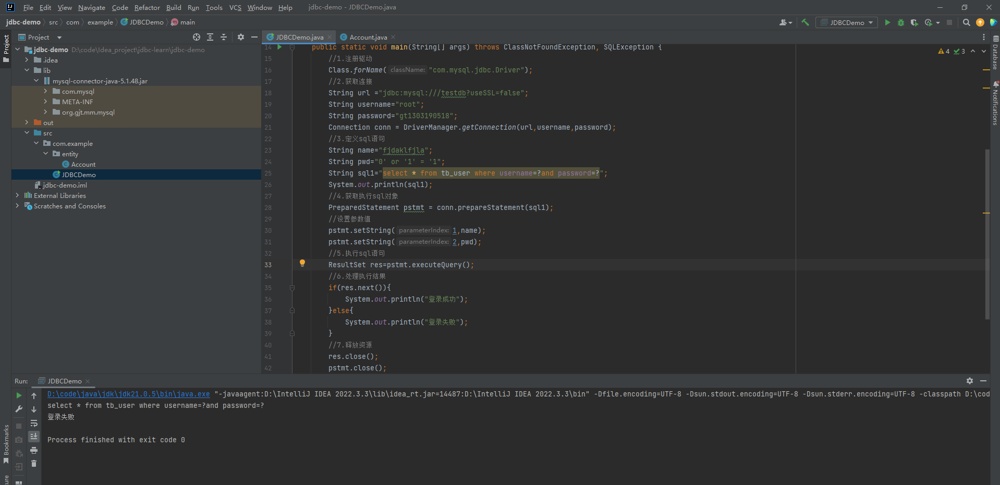

#### 注意事项

使用预编译性能会更好，但mysql默认是没有开启这个功能的，所以我们要在获取与数据库连接的时候去将它打开

```java
String url = "jdbc:mysql:///testdb?useSSL=false&useServerPrepStmts=true";
String username = "root";
String password = "对应的数据库密码";
Connection conn = DriverManager.getConnection(url,username,password);
```

## 09-数据库连接池-简介&Druid使用

Druid使用步骤

#### 1.导入jar包

#### 2.定义配置文件

```properties
driverClassName=com.mysql.jdbc.Driver
url=jdbc:mysql:///testdb?useSSL=false&useServerPrepStmts=true
username=root
password=gt1303190518
#最小连接数
initialSize=5
#最大连接数
maxActive=10
#最大等待时间
maxWait=3000
```


#### 3.加载配置文件

```java
Properties prop = new Properties();				
prop.load(new FileInputStream("src/druid.properties"));			//记得做异常处理
```

#### 4.获取数据库连接池对象

```java
DataSource datasource=DuridDataSourceFactory.createDataSource(prop);		
```

#### 5.获取连接

```java
Connection connection = datasource.getConnection();
```

```java
public class JDBCDemo {
    public static void main(String[] args) throws Exception {
        //1.导入Durid jar包
        //2.定义配置文件
        //3.加载配置文件
        Properties prop = new Properties();
        prop.load(new FileInputStream("src/druid.properties"));
        //4.获取数据库连接池对象
        DataSource dataSource= DruidDataSourceFactory.createDataSource(prop);       //根据配置文件建立连接池
        //5.获取连接
        Connection connection= dataSource.getConnection();
        System.out.println(connection);
    }
}
```

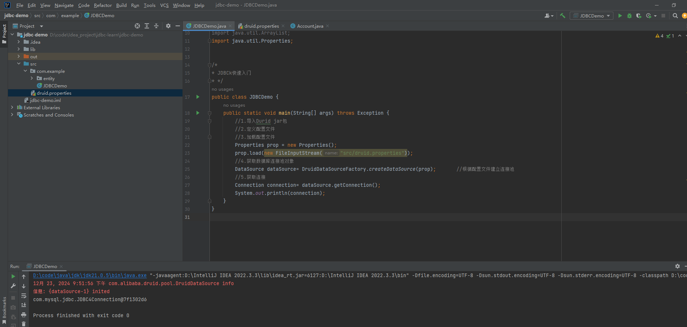


# Maven&MyBatis

## 02-MyBatis快速入门

### 1.创建user表，添加数据

### 2.创建工程模块，导入MyBatis依赖坐标

mybatis依赖坐标可以在mybatis官网找到 [入门_MyBatis中文网](https://mybatis.net.cn/getting-started.html)

```xml
<dependency>
  <groupId>org.mybatis</groupId>
  <artifactId>mybatis</artifactId>
  <version>x.x.x</version>
</dependency>
```

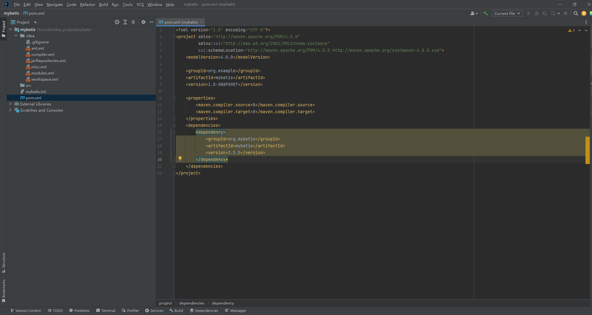

### 3.编写mybatis核心配置文件

mybatis配置文件可以替换连接信息，解决硬编码问题

在mybatis官方入门案例中找到示例的配置文件，在resources文件夹中创建配置文件

```xml
<?xml version="1.0" encoding="UTF-8" ?>
<!DOCTYPE configuration
        PUBLIC "-//mybatis.org//DTD Config 3.0//EN"
        "http://mybatis.org/dtd/mybatis-3-config.dtd">
<configuration>
    <environments default="development">
        <environment id="development">
            <transactionManager type="JDBC"/>
            <dataSource type="POOLED">
                <!--连接信息-->
                <property name="driver" value="com.mysql.jdbc.Driver"/>	<!--配置驱动-->
                <property name="url" value="jdbc:mysql:///mybatis?useSSL=false"/>	<!--配置数据库地址-->
                <property name="username" value="root"/>
                <property name="password" value=""/>			<!--配置密码-->
            </dataSource>
        </environment>
    </environments>
    <mappers>
        <mapper resource="org/mybatis/example/BlogMapper.xml"/>
    </mappers>
</configuration>
```


### 4.编写sql映射文件

sql映射文件可以统一管理sql语句，解决硬编码问题

sql映射文件统一命名为xxxMapper.xml  xxx代表实体类

```xml
<?xml version="1.0" encoding="UTF-8" ?>
<!DOCTYPE mapper
        PUBLIC "-//mybatis.org//DTD Mapper 3.0//EN"
        "http://mybatis.org/dtd/mybatis-3-mapper.dtd">
<mapper namespace="User">				<!--命名空间可以替换-->
    <select id="selectAll" resultType="com.example.entity.User">	<!--id、返回类型都可以替换-->
        select * from tb_user;
    </select>
</mapper>
```


### 5.编码

#### a.定义实体类

```java
public class User {
    private Integer id;
    private String username;
    private String password;
    private String gender;
    private String addr;

    @Override
    public String toString() {
        return "User{" +
                "id=" + id +
                ", username='" + username + '\'' +
                ", password='" + password + '\'' +
                ", gender='" + gender + '\'' +
                ", addr='" + addr + '\'' +
                '}';
    }

    public Integer getId() {
        return id;
    }

    public void setId(Integer id) {
        this.id = id;
    }

    public String getUsername() {
        return username;
    }

    public void setUsername(String username) {
        this.username = username;
    }

    public String getPassword() {
        return password;
    }

    public void setPassword(String password) {
        this.password = password;
    }

    public String getGender() {
        return gender;
    }

    public void setGender(String gender) {
        this.gender = gender;
    }

    public String getAddr() {
        return addr;
    }

    public void setAddr(String addr) {
        this.addr = addr;
    }
}
```


#### b.加载核心配置文件，获取SqlSessionFactory对象

```java
String resource = "配置文件的路径";
InputStream inputStream = Resources.getResourceAsStream(resource);
SqlSessionFactory sqlSessionFactory = new SqlSessionFactoryBuilder().build(inputStream);
```


#### c.获取SqlSession对象，执行sql语句

```java
SqlSession sqlSession=sqlSessionFactory.openSession();
List<User> users = sqlSession.selectList("User.selectAll");
System.out.println(users);
```

#### d.释放资源

```java
sqlSession.close();
```

```java
public static void main(String[] args) throws Exception {
        //1.加载配置文件
        String resource = "mybatis-config.xml";
        InputStream inputStream = Resources.getResourceAsStream(resource);
        SqlSessionFactory sqlSessionFactory = new SqlSessionFactoryBuilder().build(inputStream);
        //2.获取SqlSession对象
        SqlSession sqlSession=sqlSessionFactory.openSession();
        List<User> users = sqlSession.selectList("User.selectAll");
        System.out.println(users);
        //3.释放资源
        sqlSession.close();

    }
```


## 04-Mapper代理开发

不使用Mapper代理的方法

```java
List<User> users = sqlSession.selectList("User.selectAll");			//是"命名空间.id"的形式
```

我们需要去写对应映射文件里面定义好的命名空间和sql语句的id，不是很方便

而使用Mapper代理开发，我们可以将对应的映射文件里面的sql语句像使用类的成员函数一样去使用，这样使用起来会很方便

```java
SqlSession sqlSession=sqlSessionFactory.openSession();
//执行sql语句改为用Mapper代理的方式
//获取代理接口对象
UserMapper userMapper=sqlSession.getMapper(UserMapper.class);
//执行语句
List<User> users=userMapper.selectAll();
```

为什么会很方便，看下图，当我要使用映射文件里面的sql语句时，它自动弹出来了，就像一个成员函数一样


### 使用步骤

#### 1.定义与sql映射文件同名的Mapper接口，并将Mapper接口和sql映射文件放在同一目录文件下

这里的放在同一目录文件下指的是Mapper接口所在的目录层次结构和映射文件所在的目录层次结构一致，如下所示

这里看起来好像没在同一目录下，因为Mapper在java目录中，而映射文件在resources中，但其实，只要它们的目录层次结构一样就没问题，比如说这里的Mapper在com.example.Mapper下，而映射文件也在com.example.Mapper下，只要是这样放的，在编译的时候，他们就会放到一起去。

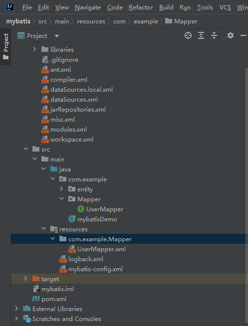

下图是编译后的文件结构，可以发现接口和映射文件已经放到同一文件夹下了

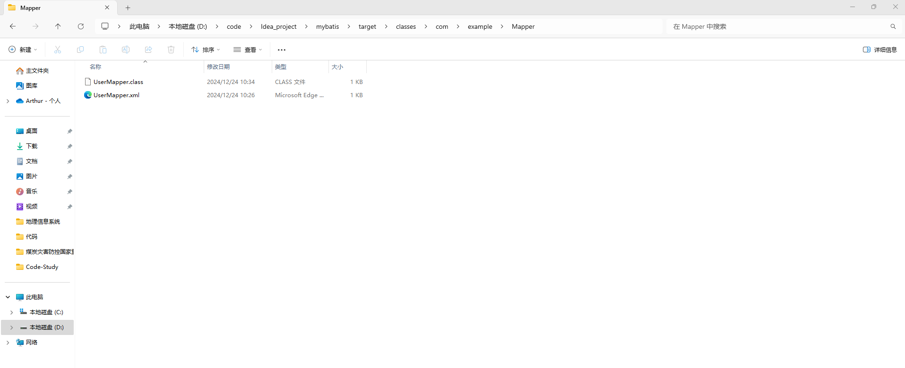

#### 2.设置sql映射文件的namespace属性为Mapper接口全限定名

```xml
<?xml version="1.0" encoding="UTF-8" ?>
<!DOCTYPE mapper
        PUBLIC "-//mybatis.org//DTD Mapper 3.0//EN"
        "http://mybatis.org/dtd/mybatis-3-mapper.dtd">
<mapper namespace="com.example.Mapper.UserMapper">			<!--Mapper接口的全限定名-->
    <select id="selectAll" resultType="com.example.entity.User">
        select * from tb_user;
    </select>
</mapper>
```

#### 3.在Mapper接口中定义方法（不用实现）

定义的方法名就是映射文件中sql语句的id，返回类型对应位sql语句执行完的返回类型

```java
public interface UserMapper {
    List<User> selectAll();				//selectAll语句是查询所有
}
```

#### 4.编码

```java
//1.首先通过SqlSession的getMapper方法获取Mapper接口的代理对象
UserMapper userMapper=sqlSession.getMapper(UserMapper.class);
//2.调用对应方法来执行
List<User> users=userMapper.selectAll();
```

```java
public class mybatisDemo {
    public static void main(String[] args) throws Exception {
        //1.加载配置文件
        String resource = "mybatis-config.xml";
        InputStream inputStream = Resources.getResourceAsStream(resource);
        SqlSessionFactory sqlSessionFactory = new SqlSessionFactoryBuilder().build(inputStream);
        //2.获取SqlSession对象
        SqlSession sqlSession=sqlSessionFactory.openSession();
        //执行sql语句改为用Mapper代理的方式
        //获取代理接口对象
        UserMapper userMapper=sqlSession.getMapper(UserMapper.class);
        //执行语句
        List<User> users=userMapper.selectAll();
        System.out.println(users);
        //3.释放资源
        sqlSession.close();

    }
}
```

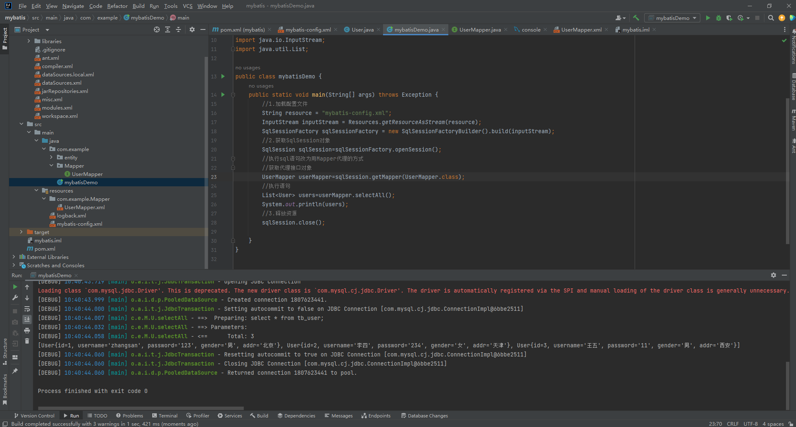

### 注意事项

如果Mapper接口名称和sql映射文件名称相同，并在同一目录下，则可以使用包扫描的方式简写mybatis配置文件里面的sql映射文件的加载

```xml
<?xml version="1.0" encoding="UTF-8" ?>
<!DOCTYPE configuration
        PUBLIC "-//mybatis.org//DTD Config 3.0//EN"
        "http://mybatis.org/dtd/mybatis-3-config.dtd">
<configuration>
    <environments default="development">
        <environment id="development">
            <transactionManager type="JDBC"/>
            <dataSource type="POOLED">
                <!--连接信息-->
                <property name="driver" value="com.mysql.jdbc.Driver"/>
                <property name="url" value="jdbc:mysql:///mybatis"/>
                <property name="username" value="root"/>
                <property name="password" value="gt1303190518"/>
            </dataSource>
        </environment>
    </environments>
    <mappers>
<!--        <mapper resource="UserMapper.xml"/>-->
        <package name="com.example.Mapper"/>			<!--包扫描方式-->
    </mappers>
</configuration>
```


## **05-MyBatis核心配置文件**

所有配置属性详解可见官方文档：[配置_MyBatis中文网](https://mybatis.net.cn/configuration.html)

#### environments

环境配置是用来配置数据库连接的，可以配置多个数据库连接

```xml
<environments default="development">            <!--使用default属性来更改当前使用的数据库，现在是开发环境的数据库，可以改成对应要使用数据库环境的id-->
        <!--第一个数据库连接配置，开发环境的数据库-->
        <environment id="development">
            <transactionManager type="JDBC"/>
            <dataSource type="POOLED">
                <!--连接信息-->
                <property name="driver" value="com.mysql.jdbc.Driver"/>
                <property name="url" value="jdbc:mysql:///mybatis"/>
                <property name="username" value="root"/>
                <property name="password" value="gt1303190518"/>
            </dataSource>
        </environment>
        <!--第二个数据库连接配置，测试环境的数据库-->
        <environment id="test">
            <transactionManager type="JDBC"/>
            <dataSource type="POOLED">
                <!--连接信息-->
                <property name="driver" value="com.mysql.jdbc.Driver"/>
                <property name="url" value="jdbc:mysql:///mybatis"/>
                <property name="username" value="root"/>
                <property name="password" value="gt1303190518"/>
            </dataSource>
        </environment>
    </environments>
```

#### typeAliases

类型别名可为 Java 类型设置一个缩写名字。 它仅用于 XML 配置，意在降低冗余的全限定类名书写。

```xml
<typeAliases>
    <typeAlias alias="User" type="com.example.entity.User"></typeAlias>
    <!--使用包扫描方式配置别名-->
    <package name="com.example.entity"/>                <!--使用包扫描方式配置别名，自动将类名作为别名-->
</typeAliases>
```

在配置文件中设置了别名后，映射文件中使用类就可以直接使用别名而不用全限定类名书写

```xml
<?xml version="1.0" encoding="UTF-8" ?>
<!DOCTYPE mapper
        PUBLIC "-//mybatis.org//DTD Mapper 3.0//EN"
        "http://mybatis.org/dtd/mybatis-3-mapper.dtd">
<mapper namespace="com.example.Mapper.UserMapper">
    <select id="selectAll" resultType="User">		<!--使用User别名-->
        select * from tb_user;
    </select>
</mapper>
```

 

## 06-MyBatis案例

## 07-查询-查询所有&结果映射

查询所有时会遇到一个问题，当我们实体类里面存在驼峰命名时，可能会出现以下的查询问题

brandName和companyName的查询结果为null


这是因为在数据库字段中没有使用驼峰命名而是brand_name的形式，因为mysql数据库不区分大小写，导致实体类和字段对不上

### 如何解决驼峰命名与字段对不上的问题

有三种解决方法

#### 1.给字段名取别名

```xml
<select id="selectAll" resultType="Brand">
        select id, brand_name brandName, company_name companyName, ordered, description, status from tb_brand;  <!--给字段取别名-->
    </select>
```

#### 2.使用sql片段

```xml
<sql id="Base_Column">
        id, brand_name brandName, company_name companyName, ordered, description, status <!--先定义sql片段-->
    </sql>

    <select id="selectAll" resultType="Brand">
        select 
        <include refid="Base_Column"/>
        from tb_brand;
    </select>
```

#### 3.使用resultMap

resultMap是字段映射，可以把数据库的字段映射为其他别名

##### a.定义resultMap

```xml
<resultMap id="brandResultMap" type="Brand">
        <!--
        id标签用于替换主键字段
        result标签用于替换一般字段
        column是要替换的字段
        property是要替换成对应实体类的属性
        -->
        <result column="brand_name" property="brandName"/>
        <result column="company_name" property="companyName"/>
    </resultMap>
```


##### b.使用resultMap替换resultType

```xml
<select id="selectAll" resultMap="brandResultMap">        <!--将resultType替换成resultMap-->
        select 
        id, brand_name, company_name, ordered, description, status              <!--使用了resultMap后这里写原来的字段就没问题了-->
        from tb_brand;
    </select>
```

```xml
<resultMap id="brandResultMap" type="Brand">
        <!--
        id标签用于替换主键字段
        result标签用于替换一般字段
        column是要替换的字段
        property是要替换成对应实体类的属性
        -->
        <result column="brand_name" property="brandName"/>
        <result column="company_name" property="companyName"/>
    </resultMap>
    <select id="selectAll" resultMap="brandResultMap">        <!--将resultType替换成resultMap-->
        select 
        id, brand_name, company_name, ordered, description, status              <!--使用了resultMap后这里写原来的字段就没问题了-->
        from tb_brand;
    </select>
```

## 08-查询-查看详情

查看详情就是通过id来将某一行的详细信息查询出来

```xml
<select id="selectById" resultMap="brandResultMap">
        select
            id, brand_name, company_name, ordered, description, status
        from tb_brand where id=#{id};
    </select>
```

主要关注的点是如何使用参数占位符

#### 参数占位符

```xml
<!--MyBatis里面有两种参数占位符-->
<!--第一种 #{}-->
<!--第二种 ${}-->
```

使用第一种得到的sql语句的参数是用?替代的


使用第二种得到的sql语句的参数是直接显示出来的


这样一来它两的区别就明了了

```xml
<!--使用 #{} 可以避免sql注入问题-->
#{}
<!--使用 ${} 会有sql注入的风险-->
${}
```

#### 在MyBatis映射文件中不能直接使用`<`符号

由于`<`符号与xml文件中的<>标签符号有冲突，所以如果要使用`<`，就要通过以下两种方法

##### 1.使用转义字符

```xml
HTML的 &lt; &gt; &amp; &quot; &copy; 分别是 < > & " © 的转义字符

<select id="selectById" resultMap="brandResultMap">
        select
            id, brand_name, company_name, ordered, description, status
        from tb_brand where id &lt; ${id};			<!--id<#{id}-->
    </select>
```


##### 2.使用CDATA区

直接在CDATA区里面输入特殊字符即可

```xml
<select id="selectById" resultMap="brandResultMap">
        select
            id, brand_name, company_name, ordered, description, status
        from tb_brand where id
         <![CDATA[						<!--CDATA区-->
         <
         ]]>
         #{id};
    </select>
```

## 09-查询-条件查询

条件查询必然涉及到多个参数，所以如何处理替换多个参数是重点

### 三种处理参数的方法

#### 1.使用Param注解

形象的说是用来处理”散装“数据

在定义Mapper的成员函数时通过Param注解来指定那个参数该去替换哪个参数占位符

```java
//@Param("要替换的占位符") 参数类型 参数名
//接收到的status参数去替换#{status},companyName去替换#{companyName},brandName去替换#{brandName}
Brand selectByCondition(@Param("status") int status,@Param("companyName") String companyName,@Param("brandName") String brandName);
```

#### 2.使用实体类对象

这种方式需要严格定义参数占位符的名字，要让参数占位符的名字与实体类对象里面的属性名字一致

```java
//接收参数
int status=1;
String companyName="华为";
String brandName="华为";
//处理接收的数据
companyName="%"+companyName+"%";
brandName="%"+brandName+"%";
//封装成对象
Brand brand=new Brand();
brand.setStatus(status);
brand.setCompanyName(companyName);
brand.setBrandName(brandName);
//在传递对象前要先封装对象
Brand  brand1=selectByCondition(Brand brand);			//传递一个实体类对象
```

#### 3.使用Map键值对

这种方式要先定义一个Map键值对，在调用函数时直接传入键值对，这样就能知道用哪个数据去替换哪个参数占位符了，需要注意键值对的键要严格定义成与参数占位符的名字一致

```java
//接收参数
int status=1;
String companyName="华为";
String brandName="华为";
//处理接收的数据
companyName="%"+companyName+"%";
brandName="%"+brandName+"%";
//封装成键值对
Map map=new HashMap();
map.put("status",status);
map.put("companyName",companyName);
map.put("brandName",brandName);

Brand brand1=brandMapper.selectByCondition(map);		//传递一个键值对
```


## 10-查询-动态条件查询

MyBatis对动态条件查询的支持非常强大，提供了多种方式来实现动态查询

#### 使用if

使用if来判断当前字段是否要加入查询语句中

if标签里面有test属性，test属性里面写逻辑表达式，用于完成条件判断

```xml
<!--动态条件查询-->
    <select id="selectByCondition" resultMap="brandResultMap">
        select * from tb_brand where
            <if test="status!=null">
                status = #{status}
            </if>
            <if test="companyName !=null and companyName!=''">
                and company_name like #{companyName}
            </if>
            <if test="brandName !=null and brandName!=''">
                and brand_name like #{brandName};
            </if>
	</select>
```

但是这种方法有一个问题，比如说这里status为空，这时候status字段就不会写入sql语句中，此时就会出差错，见下图

这个时候sql语句变成了 

```xml
....where and ....  		<!--sql语法错误-->
```

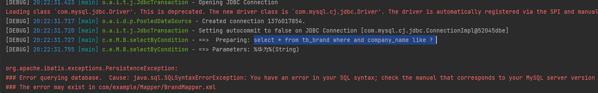

##### 解决错误

要解决这个问题有两种方法

###### 1.在where后面加上恒等式

```xml
    <!--动态条件查询-->
    <select id="selectByCondition" resultMap="brandResultMap">
        select * from tb_brand where 1=1			<!--加上恒等式1=1-->
            <if test="status!=null">
               and status = #{status}
            </if>
            <if test="companyName !=null and companyName!=''">
                and company_name like #{companyName}
            </if>
            <if test="brandName !=null and brandName!=''">
                and brand_name like #{brandName};
            </if>

    </select>
```

###### 2.使用MyBatis提供的`<where>`标签替换where关键字

```xml
    <!--动态条件查询-->
    <select id="selectByCondition" resultMap="brandResultMap">
        select * from tb_brand <where>			<!--将字段判断放在where标签里面-->
        <if test="status!=null">
             status = #{status}
        </if>
        <if test="companyName !=null and companyName!=''">
            and company_name like #{companyName}
        </if>
        <if test="brandName !=null and brandName!=''">
            and brand_name like #{brandName};
        </if>

    </where>
    </select>
```

#### 单条件-动态条件查询

使用`<choose>`和`<when> <otherwise>`标签

```xml
    <!--单条件动态条件查询-->
    <select id="selectByConditionSingle" resultMap="brandResultMap">
        select * from tb_brand
        <where>
            <choose>            <!--相当于switch-->
                <when test="status!=null">
                    status = #{status}
                </when>
                <when test="companyName !=null and companyName!=''">
                    company_name like #{companyName}
                </when>
                <when test="brandName !=null and brandName!=''">
                    brand_name like #{brandName}
                </when>
                <otherwise>                <!--相当于default-->
                    1=1;
                </otherwise>
            </choose>
        </where>
    </select>
```

## 11-添加&修改功能

添加功能需要注意的是事务的提交，在使用openSession()来创建SqlSession对象时是默认关闭自动提交事务的，需要加上true参数来打开自动提交事务功能，否则需要手动提交

#### 事务提交

```java
    @Test
    public  void add() throws Exception {
        //接收参数
        int status=1;
        String companyName="8848";
        String brandName="8848";
        int ordered=100;
        String description="不是所有手机都叫8848";

//        //处理接收的数据
//        companyName="%"+companyName+"%";
//        brandName="%"+brandName+"%";
//        //封装成对象
        Brand brand=new Brand();
        brand.setStatus(status);
        brand.setCompanyName(companyName);
        brand.setBrandName(brandName);
        brand.setOrdered(ordered);
        brand.setDescription(description);

        //封装成键值对
        Map map=new HashMap();
        //map.put("status",status);
        map.put("companyName",companyName);
        // map.put("brandName",brandName);
        //1.加载配置文件
        String resource = "mybatis-config.xml";
        InputStream inputStream = Resources.getResourceAsStream(resource);                   //异常未处理
        SqlSessionFactory sqlSessionFactory = new SqlSessionFactoryBuilder().build(inputStream);
        //2.获取SqlSession对象
        SqlSession sqlSession=sqlSessionFactory.openSession(); //默认开启手动提交事务，使用openSession(true)来开启自动提交事务
        //3.获取代理接口对象
        BrandMapper brandMapper=sqlSession.getMapper(BrandMapper.class);
        //4.执行语句
        brandMapper.add(brand);
        //提交事务
        sqlSession.commit();
        //5.释放资源
        sqlSession.close();
    }
}
```

#### 主键返回

在添加数据后，尝试把id打印出来，发现id为null

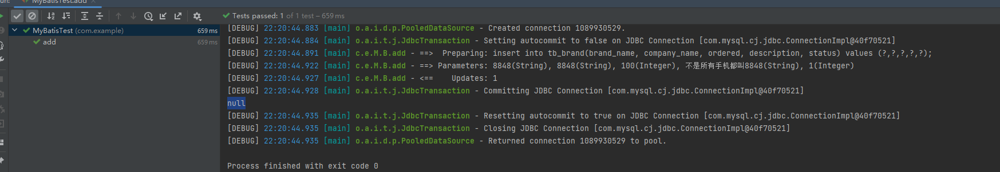

这就需要通过主键返回才能正确打印id

主键返回主要是在映射文件的sql语句中添加两个属性`useGeneratedKeys``keyProperty`

```xml
<insert id="add" useGeneratedKeys="true" keyProperty="id">
	insert into tb_brand(brand_name, company_name, ordered, description, status) values (#{brandName},#			{companyName},#{ordered},#{description},#{status});
</insert>
```

这样执行后就能成功打印出刚刚添加数据的主键


#### 修改动态字段

和动态查询差不多，都要用到`<if test="">`标签，同时再使用`<set>`标签，`<set>`作用和动态查询时用的`<where>`作用差不多

```xml
    <!--修改动态字段-->
    <update id="update">
        update tb_brand
        <set>
            <if test="brandName !=null and brandName!=''">
                brand_name = #{brandName},
            </if>
            <if test="companyName !=null and companyName!=''">
                company_name = #{companyName},
            </if>
            <if test="ordered !=null">
                ordered = #{ordered},
            </if>
            <if test="description !=null and description!=''">
                description = #{description},
            </if>
            <if test="status !=null">
                status = #{status}
            </if>
        </set>
        where id=#{id};
    </update>
```

## 12-删除功能

#### 批量删除

批量删除根据传过来的id数组来删除数据，由于每次传来的id数组的数据个数不能确定，所以要用到动态sql，这里使用foreach来遍历

```xml
<!--collection属性表示要遍历的集合,item为遍历出来的每一个元素，separator表示分隔符，open表示在开始添加的符号，close表示在结尾添加的符号-->    
<delete id="deleteByIds">
        delete from tb_brand where id in
        <foreach collection="array" item="id" open="(" close=")" separator=",">
            #{id}
        </foreach>
        ;				<!--这个分号不要忘了-->
</delete>
```

array是MyBatis默认的集合名，如果想要指定为其他，就要在Mapper中定义函数时添加@Param注解

```java
int deleteByIds(@Param("ids") int[] ids);
```

## 13-参数传递

了解MyBatis底层是如何封装传递过来的数据的

#### 多个参数

```java
/*
    * MyBatis在接收多个参数时会将每个参数封装为两个键值对
    * 比如这里,如果没有使用注解,就会有以下键值对
    * arg0->status
    * param1->status
    * arg1->companyName
    * param2->companyName
    * arg2->brandName
    * param3->brandName
    *
    *arg是从0开始
    *param是从1开始
    * */
 Brand selectByCondition(int status,String companyName,tring brandName);
```

此时如果还是按自己定义的方式去查询


就会出现以下错误，通过看报错信息可以知道，能够使用的只有arg0，arg1，arg2，param1......

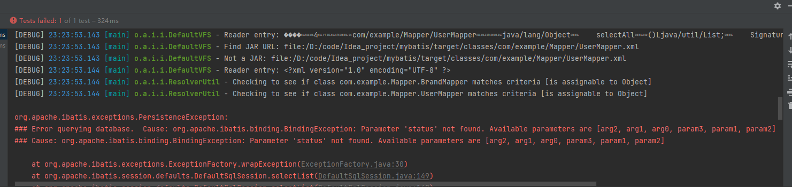

所以我们换种方式，把自己定义的参数占位符改成MyBatis默认的,arg和param是等效的


这时候就成功查询


我们再尝试使用一个注解的情况

```java
List<Brand> selectByCondition(@Param("status")int status,String companyName,String brandName);
//此时键值对arg0会被替换成status
/*
*	status->status
*	param0->status
*	arg1->companyName
*	param1.....后面的一样，没有被替换
*/
```

这时我们再看，键值对arg0已经被替换成status了，如果第二个参数继续使用注解，那么arg2也会被替换，但param不受影响


## 14-注解开发

注解开发适合完成简单功能

```java
    /*
    * 注解开发有以下三种
    * 1.@Select
    * 2.@Update
    * 3.@Delete
    * 4.@Insert
    * */
	//如下是简单的示例
    @Select("select * from tb_brand where id = #{id}")
    Brand selectById(int id);
```

如果sql语句很复杂还是用定义映射文件方式更好


# HTTP&Tomcat&Servlet

## 03-HTTP-请求数据格式

### HTTP数据分为三部分

#### 1.请求行

请求数据的第一行是请求行

示例

```http
GET /HTTP/1.1
GET表示请求方法 
HTTP/1.1表示协议版本
```

#### 2.请求头

请求数据的第二行开始是请求头，格式为key:value格式

示例

```http
Host: www.bilibili.com
Connection: keep-alive
```

需要知道下面几个常见的请求头的含义

```http
Host: 表示请求的主机名
User-Agent: 表示浏览器版本，可以用来做浏览器适配
Accept: 表示浏览器能够接受的资源类型 如 text/*,image/*,*/*表示所有类型
Accept-Language: 表示浏览器偏好语言，服务器可以根据不同的偏好语言提供不同的页面
Accept-Encoding: 表示浏览器支持的压缩类型
```


#### 3.请求体

只有当请求方式为POST的时候才会有请求体，请求体用于存放POST请求的参数

#### GET与POST请求的区别

GET请求的参数放在请求数据的第一行，且有参数大小限制

POST请求的参数放在请求体里面，即请求数据的最后，并且参数大小没有限制

## 04-HTTP-响应数据格式

### HTTP响应数据分为三部分

#### 1.响应行

响应数据的第一行

```http
HTTP/1.1 200 OK
```

HTTP/1.1代表协议及版本，200代表服务器返回的状态码，ok是对返回结果状态码的具体描述

#### 2.响应头

第二行开始

响应头的数据格式是  键:值  `key`:`value`  形式的

```http
Server: Tengin
Content-Type: text/html
Transfer-Encoding: chunked....
```

常见的响应头含义

Content-Type:表示响应的数据类型 如：text/html，image/jpeg

Content-Length:表示响应内容的长度

Content-Encoding:表示该响应压缩算法，如gzip

Cache-Control:表示客户端该如何缓存，如：max-age=300 表示最多缓存300秒

#### 3.响应体

最后一部分，存放响应数据

### 常见的响应状态码

#### 一、状态码大类


| 状态码分类 | 说明                                                         |
| ---------- | ------------------------------------------------------------ |
| 1xx        | **响应中**——临时状态码，表示请求已经接受，告诉客户端应该继续请求或者如果它已经完成则忽略它 |
| 2xx        | **成功**——表示请求已经被成功接收，处理已完成                 |
| 3xx        | **重定向**——重定向到其它地方：它让客户端再发起一个请求以完成整个处理。 |
| 4xx        | **客户端错误**——处理发生错误，责任在客户端，如：客户端的请求一个不存在的资源，客户端未被授权，禁止访问等 |
| 5xx        | **服务器端错误**——处理发生错误，责任在服务端，如：服务端抛出异常，路由出错，HTTP版本不支持等 |

状态码大全：https://cloud.tencent.com/developer/chapter/13553 


#### 二、常见的响应状态码

| 状态码 | 英文描述                               | 解释                                                         |
| ------ | -------------------------------------- | ------------------------------------------------------------ |
| 200    | **`OK`**                               | 客户端请求成功，即**处理成功**，这是我们最想看到的状态码     |
| 302    | **`Found`**                            | 指示所请求的资源已移动到由`Location`响应头给定的 URL，浏览器会自动重新访问到这个页面 |
| 304    | **`Not Modified`**                     | 告诉客户端，你请求的资源至上次取得后，服务端并未更改，你直接用你本地缓存吧。隐式重定向 |
| 400    | **`Bad Request`**                      | 客户端请求有**语法错误**，不能被服务器所理解                 |
| 403    | **`Forbidden`**                        | 服务器收到请求，但是**拒绝提供服务**，比如：没有权限访问相关资源 |
| 404    | **`Not Found`**                        | **请求资源不存在**，一般是URL输入有误，或者网站资源被删除了  |
| 428    | **`Precondition Required`**            | **服务器要求有条件的请求**，告诉客户端要想访问该资源，必须携带特定的请求头 |
| 429    | **`Too Many Requests`**                | **太多请求**，可以限制客户端请求某个资源的数量，配合 Retry-After(多长时间后可以请求)响应头一起使用 |
| 431    | **` Request Header Fields Too Large`** | **请求头太大**，服务器不愿意处理请求，因为它的头部字段太大。请求可以在减少请求头域的大小后重新提交。 |
| 405    | **`Method Not Allowed`**               | 请求方式有误，比如应该用GET请求方式的资源，用了POST          |
| 500    | **`Internal Server Error`**            | **服务器发生不可预期的错误**。服务器出异常了，赶紧看日志去吧 |
| 503    | **`Service Unavailable`**              | **服务器尚未准备好处理请求**，服务器刚刚启动，还未初始化好   |
| 511    | **`Network Authentication Required`**  | **客户端需要进行身份验证才能获得网络访问权限**               |

## 05-Tomcat-简介&基本使用

在做web开发的时候，后端接收到了浏览器发送的请求后要如何处理呢，这当然要写很多代码来负责处理浏览器的发送信息，是一项很繁琐的动作。但是正好这项动作具有很多通用性，也就是说一个人写好了处理请求的代码，另一个人说不定也能直接使用，于是Tomcat应运而生，Tomcat就是别人写好的用于处理浏览器请求的代码，这样我们就能专心在处理业务逻辑上了。

### Tomcat软件的使用

Tomcat是绿色版软件，直接下载解压包解压即用

#### Tomcat的启动

找到bin(bin是binary即二进制的缩写，即存放二进制可执行文件的地方，里面的文件都是可以直接执行的)文件夹下的启动脚本

windows系统找startup.bat

linux系统找startup.sh

##### 启动后发现有乱码

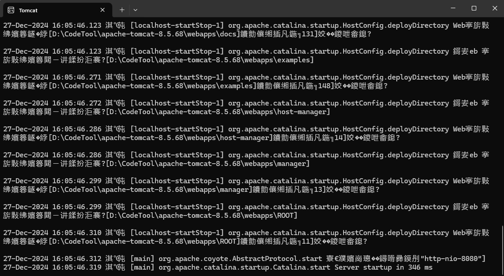

原因是windows控制台是GBK编码，而Tomcat输出的是UTF-8编码

解决方法

进入conf文件夹，找到logging.properties文件


打开后进行如下图的修改

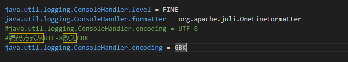

再次启动就正常了


此时我们用浏览器访问`localhost:8080`就能看到对应的页面


### 部署自己的项目

只需将自己的项目资源放在webapps目录下，然后输入正确链接访问即可


## 06-Tomcat配置和部署项目

### Tomcat配置

如果想对Tomcat进行一些配置，如配置端口号，可以进到conf目录下，找到server.xml文件，使用文本编辑器或vscode等工具打开

找到如下代码修改即可

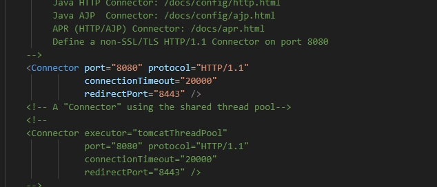

### 可能遇到的启动异常

如果在启动Tomcat时出现控制台闪了一下就消失或者没有出现控制台的情况，可能时jdk环境没有配置好，修改一下系统变量的jdk环境即可

### Tomcat项目部署

对于javaWeb项目的部署，直接将项目打包成一个war包，然后将war包放入webapps文件夹下即可


## 09-Tomcat-Idea集成本地Tomcat

### 集成步骤

#### 编辑一个运行Configuration


#### 找到Tomcat本地选项

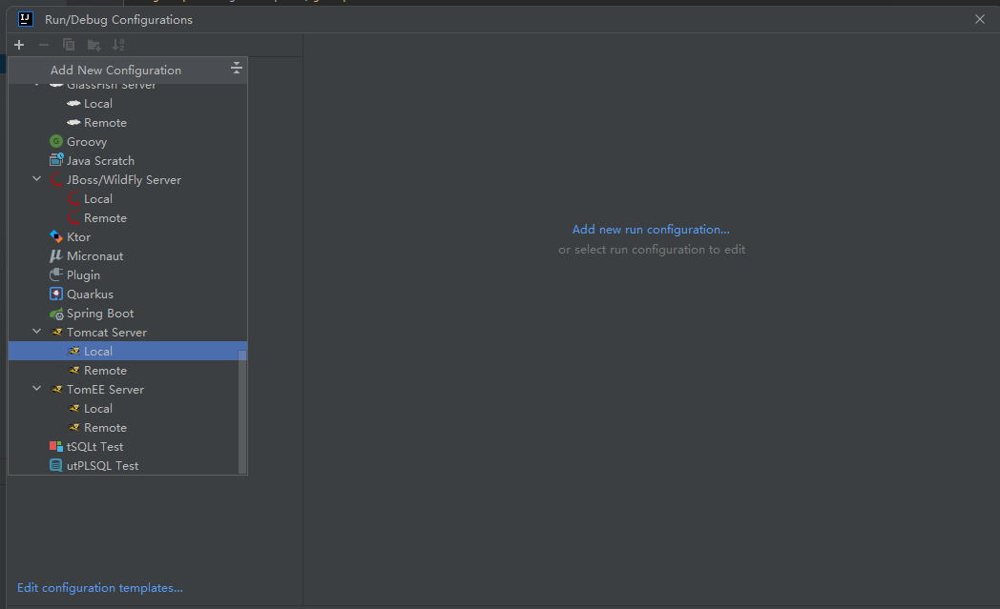

#### 选择本地Tomcat安装目录

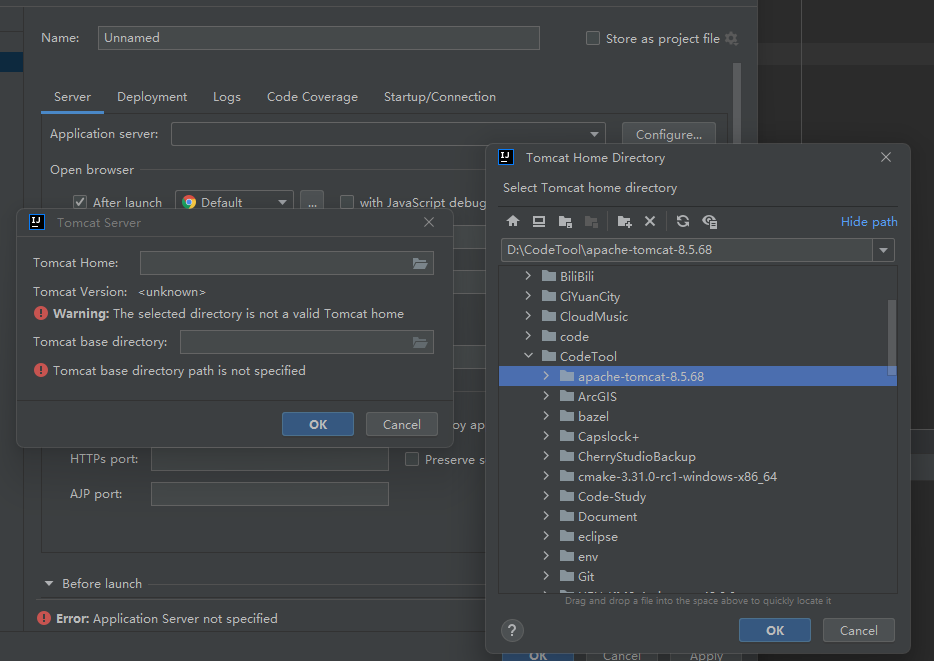

#### 选择要部署的项目


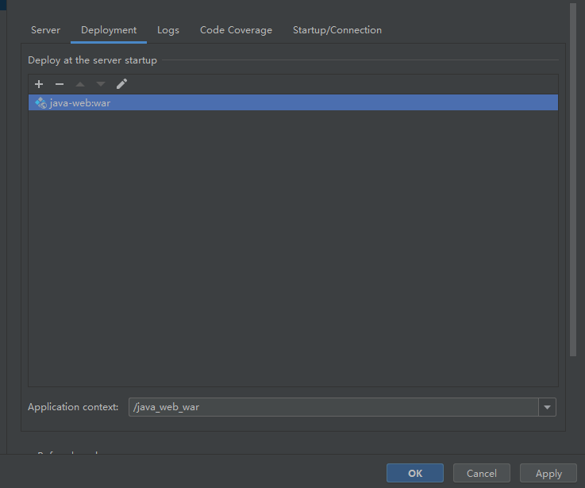

### 相关配置

#### 配置端口


## 10-Tomcat-Tomcat的Maven插件

可以使用快捷键 `alt`+`insert`来快速导入插件


```xml
      <plugin>
        <groupId>org.apache.tomcat.maven</groupId>
        <artifactId>tomcat7-maven-plugin</artifactId>
        <version>2.2</version>
      </plugin>
```

还可以使用configuration标签来进行相关配置

```xml
      <plugin>
        <groupId>org.apache.tomcat.maven</groupId>
        <artifactId>tomcat7-maven-plugin</artifactId>
        <version>2.2</version>
        <configuration>
          <port>8081</port>				<!--配置默认端口号-->
          <path>/</path>				<!--配置默认启动路径-->
        </configuration>
      </plugin>
```

然后再maven里面通过插件启动


## 11-Servlet简介&快速入门

### Servlet快速入门

#### 1.导入Servlet依赖

注意这里要配置该依赖的作用范围，因为Tomcat里面也有这个包，如果配置作用范围就会和Tomcat里面的这个包发生冲突，产生报错

```xml
    <dependency>
      <groupId>javax.servlet</groupId>
      <artifactId>javax.servlet-api</artifactId>
      <version>3.1.0</version>
      <scope>provided</scope>     <!--运行和编译时生效，打包不生效-->
    </dependency>
```

如果不配置依赖范围的话在访问时就会产生如下错误

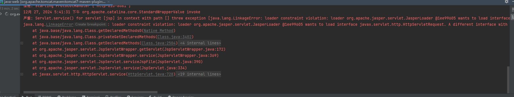

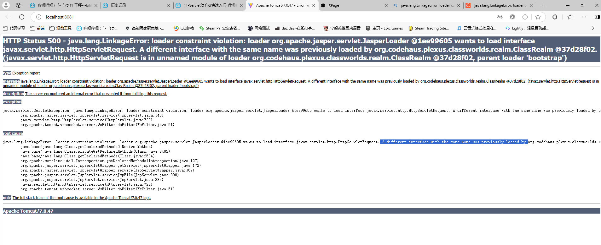

#### 2.创建一个实现Servlet接口的类

```java
import javax.servlet.*;
import java.io.IOException;

public class servlet implements Servlet {


    //访问时运行service函数
    @Override
    public void service(ServletRequest servletRequest, ServletResponse servletResponse) throws ServletException, IOException {
        System.out.println("servlet hello world~~");
    }

    @Override
    public String getServletInfo() {
        return null;
    }

    @Override
    public void destroy() {

    }
    @Override
    public void init(ServletConfig servletConfig) throws ServletException {

    }

    @Override
    public ServletConfig getServletConfig() {
        return null;
    }
}
```


#### 3.使用注解配置访问路径

使用`@WebServlet`注解来配置访问路径

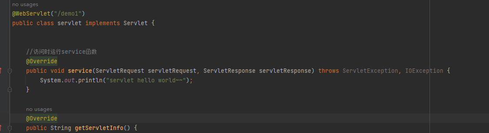

#### 4.启动Tomcat

启动Tomcat，访问对对应路径后可以看到控制台的输出


## 12-Servlet执行流程&生命周期

### Servlet执行流程

Servlet类由Tomcat创建，并且Servlet中的service函数也是由Tomcat服务器调用的

### Servlet生命周期

Servlet运行在Servlet容器中(web服务器)，其生命周期由容器来管理，主要有以下四个阶段

#### 1.加载和实例化

这个阶段会创建Servlet实例，可以设置实例的创建时期，默认在访问这个Servlet的时候才会创建。

可以在`@WebServlet`注解中添加loadOnstartup属性，该属性表示优先级，服务器在启动时就会根据优先级提前创建Servlet实例

```java
@WebServlet(value = "/demo1",loadOnStartup = 1)			
```

如下图所示，当我设置了`loadOnStartup`属性后，Servlet类就会在服务器启动时创建实例


#### 2.初始化

这个阶段用于加载Servlet类所需的资源，需要自己定义，这个函数只会执行一次

```java
    //Servlet类一旦创建就会执行init函数
    @Override
    public void init(ServletConfig servletConfig) throws ServletException {
        System.out.println("Servlet实例创建成功");
    }
```

如下图，当我第一访问demo1的时候Servlet实例创建，并且调用了init函数，随后我刷新网页多次访问demo1，后面调用的都是service函数，init函数并没有被调用

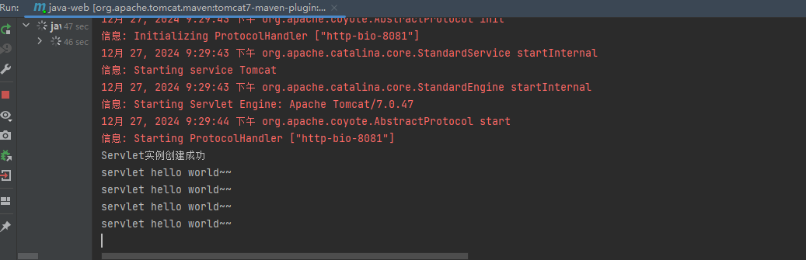

#### 3.调用service

当每次访问Servlet的时候都会调用service函数，service函数可以被多次调用

#### 4.服务终止

当服务器关闭或者服务停止时会调用destroy函数，该函数用于销毁init函数申请的资源

```java
    //当服务停止时调用destroy函数
    @Override
    public void destroy() {
        System.out.println("调用destroy函数，释放资源");
    }
```

如下图所示，我通过控制台启动Tomcat服务，并通过控制台终止服务，可以看到服务器调用了destroy函数，但这里是乱码，因为编码问题，不过确实看到destroy函数运行了

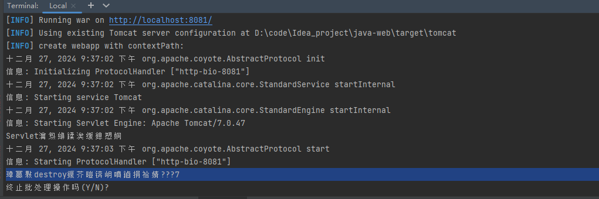


## 13-Servlet方法介绍&体系结构

### 如何使用HttpServlet

HttpServlet是继承GenericServlet类的一个对HTTP协议封装的Servlet类，而GenericServlet类实现了Servlet接口

#### 1.创建一个自己的Servlet类并且继承HttpServlet

```java
@WebServlet("/demo2")
public class servlet2 extends HttpServlet {
    @Override
    protected void doGet(HttpServletRequest req, HttpServletResponse resp) throws ServletException, IOException {
        System.out.println("Get....");
    }

    @Override
    protected void doPost(HttpServletRequest req, HttpServletResponse resp) throws ServletException, IOException {
        System.out.println("Post...");
    }
}
```


#### 2.覆写HttpServlet里面的相关方法

```java
    //覆写get方法
    @Override
    protected void doGet(HttpServletRequest req, HttpServletResponse resp) throws ServletException, IOException {
        System.out.println("Get....");
    }

    
    //覆写post方法
    @Override
    protected void doPost(HttpServletRequest req, HttpServletResponse resp) throws ServletException, IOException {
        System.out.println("Post...");
    }
```


之所有要使用HttpServlet，是因为不同的请求方式，服务器发出的请求信息是不同的，如get请求的请求参数在请求头中，而post的请求参数或数据在请求体中。因此如果每次接收这些请求时都要写代码去处理识别这些请求是什么方法就很麻烦，于是HttpServlet就帮我们封装好了，我们只需要提供每一种请求方法的具体执行函数就行，所以我们使用HttpServlet时需要覆写这些实现函数


## 14-urlPattern配置

### 一个Servlet服务可以配置多个路径可以

使用`urlPatterns`或`value`属性

```java
@WebServlet(urlPatterns = {"/demo2","/demo3"})
```

### 路径的几种匹配方式

#### 1.精确匹配

前面的所有路径配置用的都是精确匹配

#### 2.目录匹配

```java
@WebServlet(value = "/demo3/*")
```

后面*的地方不管写什么都能访问到demo3的路径

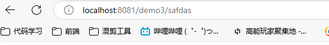

访问成功


#### 3.扩展名匹配

注意扩展名匹配的路径前面不能有`/`不然会报错

```java
@WebServlet(value = "*.do")
@WebServlet(value = "/demo4/*.do")			//错误写法

```

错误写法报错

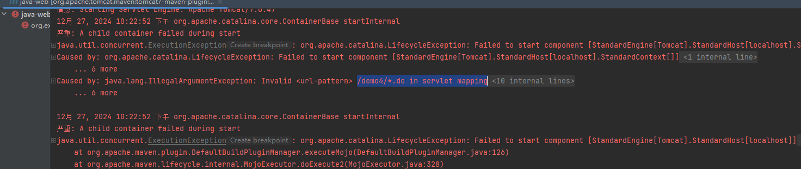

正确写法访问成功

访问路径示例:

```http
http://localhost:8081/sfjkaslf.do
```


#### 4.任意匹配

```java
@WebServlet(value = "/")
@WebServlet(value = "/*")			//这种也可以
```

任意匹配下，不管输入什么都会访问到任意匹配的Servlet

访问路径示例:

```http
http://localhost:8081/sfjkafdasfa
```

##### 注意事项

Tomcat自己自带一个默认的任意匹配，如果再定义任意匹配就会覆盖掉Tomcat的任意匹配，而覆盖掉这个的后果就是无法访问静态资源，所以一般不使用任意匹配


## 15-XML配置Servlet

前面配置Servlet的访问路径使用的都是注解配置，但是在还不支持注解配置的时候用的是XML配置，要在web.xml文件里面配置

使用`<servlet>`和`servlet-mapping`标签来配置

```xml
<web-app>
  <display-name>Archetype Created Web Application</display-name>

  <servlet>
    <servlet-name>xmlServlet</servlet-name>                   <!--这里配置名字-->
    <servlet-class>com.example.servlet6</servlet-class>       <!--这里配置对应Servlet服务的全限定名-->
  </servlet>


  <servlet-mapping>
    <servlet-name>xmlServlet</servlet-name>               <!--这里配置的名字要与前面配置servlet标签起的名字的一致-->
    <url-pattern>/demo6</url-pattern>                     <!--这里配置路径-->
  </servlet-mapping>
</web-app>
```


# Request&Response

## 01-Request和Request介绍&Request继承体系

#### Request继承体系如下

java提供了Request的接口，然后由服务器程序（如：Tomcat）去创建实现类

java提供了Request根接口，ServletRequest

同时提供了继承自ServletRequest的对Http协议封装的请求对象接口HttpServletRequest

Tomcat提供了实现类RequestFacade


## 02-Request获取请求数据-请求行&请求头&请求体

#### 1.请求行

```java
@WebServlet("/req1")
public class req1 extends HttpServlet {
    @Override
    protected void doGet(HttpServletRequest req, HttpServletResponse resp) throws ServletException, IOException {
        //Tomcat的实现的请求对象
        System.out.println("请求对象"+req);
        //Tomcat实现的响应对象
        System.out.println("响应对象"+resp);

        //获取请求方式
        String method=req.getMethod();
        System.out.println(method);

        //获取虚拟目录
        String contextPath=req.getContextPath();
        System.out.println(contextPath);

        //获取URL,返回的是stringBuffer
        StringBuffer url = req.getRequestURL();
        System.out.println(url.toString());

        //获取URI（统一资源标识符）
        String uri = req.getRequestURI();
        System.out.println(uri);

        //获取请求参数
        String query = req.getQueryString();
        System.out.println(query);
    }
}
```

输入请求路径

```http
http://localhost:8081/req-demo/req1?username=zhangsan
```

得到结果如下

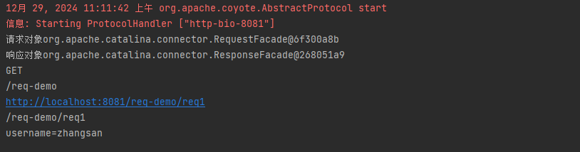


#### 2.请求头

请求头的获取通过`getHeader`函数来获取，输入对应键值，就能获取对应的信息

```java
        //获取请求头
        //获取浏览器信息
        String UserAgent = req.getHeader("User-Agent");
        System.out.println(UserAgent);
```


#### 3.请求体

请求体的获取要先获取对应的输入流

如果获取的是文本就用字符输入流，`BufferedReader`

如果获取的是文件（如图片），就用字节输入流,`ServletInputStream`

注意要写在dopost函数里面

```java
    @Override
    protected void doPost(HttpServletRequest req, HttpServletResponse resp) throws ServletException, IOException {
        //获取请求体
        //如果要获取文本信息就使用字符输入流BufferedReader
        BufferedReader bufferedReader = req.getReader();
        String line = bufferedReader.readLine();
        System.out.println(line);
//        //如果要获取文件，就是用字节输入流
//        ServletInputStream inputStream = req.getInputStream();
    }
```

在表单中输入数据

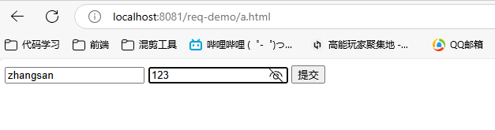

提交后的结果如下：


## 03-Request通用方式获取请求参数

在前面学的请求方式中，对于不同的请求方式get和post，所用的获取方法也不同，而这样就会使得代码重复量变多，为了解决这个问题，我们可以使用一个通用的方式来获取请求参数，这些通用的方法底层用的其实也是前面学的方法，只不过相当于把它们整合起来。

### 通用请求方式有以下三种

#### 1.`getParameterMap()`

getParameterMap方式，得到的是所有参数的键值对集合

```java
        //1.getParameterMap方式，得到的是所有参数的键值对集合
        Map<String, String[]> parameterMap = req.getParameterMap();
        System.out.println("第一种方法");
        for(String key : parameterMap.keySet()){
            System.out.print(key+":");
            for(String value : parameterMap.get(key)){
                System.out.print(value+" ");
            }
            System.out.println();
        }
```

#### 2.`getParameterValues()`

getParameterValues方式，得到的是对应键值的参数数组

```java
        //2.getParameterValues方式，得到的是对应键值的参数数组
        System.out.println("第二种方法");
        String[] hobbies = req.getParameterValues("hobby");
        System.out.print("hobby");
        for(String value : hobbies){
            System.out.print(value+" ");
        }
```


#### 3.`getParameter`

getParameter方式，得到的是对应键值的值，该键对应的值只能有一个

```java
        //3.getParameter方式，得到的是对应键值的值，该键对应的值只能有一个
        System.out.println("第三种方法");
        String username = req.getParameter("username");
        String password = req.getParameter("password");
        System.out.println("username:"+username);
        System.out.println("password:"+password);
```

使用以上通用方式后，我们可以只在一个方法里面写获取参数的代码，然后其他方法直接调用这个方法即可，例如，在doGet里面写获取参数的方法，在doPost里面直接调用doGet方法

```java
    @Override
    protected void doGet(HttpServletRequest req, HttpServletResponse resp) throws ServletException, IOException {
        //在doGet方法里面写获取参数的代码
        //1.getParameterMap方式，得到的是所有参数的键值对集合
        Map<String, String[]> parameterMap = req.getParameterMap();
        System.out.println("第一种方法");
        for(String key : parameterMap.keySet()){
            System.out.print(key+":");
            for(String value : parameterMap.get(key)){
                System.out.print(value+" ");
            }
            System.out.println();
        }

        //2.getParameterValues方式，得到的是对应键值的参数数组
        System.out.println("第二种方法");
        String[] hobbies = req.getParameterValues("hobby");
        System.out.print("hobby");
        for(String value : hobbies){
            System.out.print(value+" ");
        }
        System.out.println();

        //3.getParameter方式，得到的是对应键值的值，该键对应的值只能有一个
        System.out.println("第三种方法");
        String username = req.getParameter("username");
        String password = req.getParameter("password");
        System.out.println("username:"+username);
        System.out.println("password:"+password);

    }

    @Override
    protected void doPost(HttpServletRequest req, HttpServletResponse resp) throws ServletException, IOException {
        //调用doGet方法获取参数
        this.doGet(req,resp);
    }
```


提交如下表单

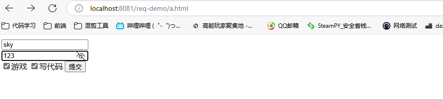

结果如下


## 05-请求参数中文乱码-POST解决方案

对于中文参数

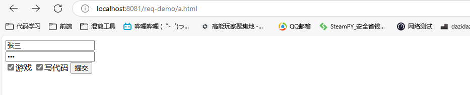

会产出以下乱码结果


### 解决方法

使用`setCharacterEncoding`函数设置字符输入流的编码，这样就正常了

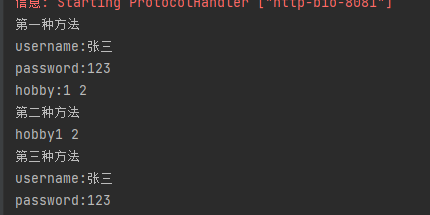

 

## 06-Request请求参数中文乱码-GET解决方案

GET方法参数的获取方式是通过`getQueryString`函数来获取的，而这个函数的编码方式是在Tomcat中写死的，所以不能像解决POST方法那样去修改编码方式。

浏览器处理中文时是将中文转换为URL编码，采用的字符集是`ISO-8859-1`，所以Tomcat在处理请求参数时就是以`ISO-8859-1`的编码方式来处理的

### 解决方法

#### 1.将Tomcat用`ISO-8859-1`编码方式得到的乱码结果转化为字节数组

```java
        //1.先将乱码结果转化未字节数组
        byte[] bytes = username.getBytes("ISO_8859_1");
```


#### 2.再将字节数组用`UTF-8`的方式进行编码

```java
        //2.再将字节数组使用UTF-8的编码方式进行编码
        username = new String(bytes,"UTF-8");
        System.out.println("未解决乱码后 username:"+username);
```


#### 综合为一行代码

上面两个步骤可以合并为一行代码

```java
        //合并为一行代码
        username = new String(username.getBytes("ISO_8859_1"),"UTF-8");
```

结果如下


## 07-Request请求转发

请求转发(forward)就是浏览器请求的时资源A，然后资源A在处理的时候可能需要另一个资源B的处理，于是对资源B发出请求，并将数据一起传过去

#### 实现方式

使用`getRequestDispatcher`和`forward`函数

```java
req.getRequestDispatcher("/reqB").forward(req,resp);
```

如图所示，请求的是A资源

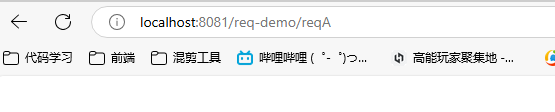

结果如下


#### 参数的传递

参数的传递要用到`setAttribute`和`getAttribute`

##### 1.资源A设置要传递的参数

```java
        System.out.println("资源A的处理");
        String username = "被资源A处理的部分";
        //setAttribute用于设置要传递的参数，设置为键值对
        req.setAttribute("username",username);
        req.getRequestDispatcher("/reqB").forward(req,resp);
```


##### 2.资源B从资源A传递过来的参数里面取出要处理的参数

```java
        System.out.println("资源B的处理");
        //获取资源A传递的参数
        Object username = req.getAttribute("username");
        //对传递的参数进行处理
        username = username +"+资源B对参数的处理";
        System.out.println(username);
```


结果如下


## 08-Response设置响应数据功能介绍&完成重定向

### 如何设置响应数据

#### 1.设置响应行

设置响应行可以使用函数`setStatus`设置状态码

```java
resp.setStatus(200);
```


#### 2.设置响应头

设置响应头使用函数`setHeader`，设置键值对

```java
resp.setHeader("Content-Encoding","gzip");
```


#### 3.设置响应体

设置响应体要使用输出流

获取字符输出流使用函数`getWriter`

获取字节输出流使用函数`getOutputStream`

```java
        //获取字符输出流
        PrintWriter writer = resp.getWriter();
        //获取字节输出流
        ServletOutputStream outputStream = resp.getOutputStream();
```


### 重定向

重定向也是一种资源跳转方式，与前面学的请求转发不同，请求转发只有一次请求与响应，而重定向是浏览器先请求资源A，然后资源A返回一个响应，这个响应是为了告诉浏览器要重新请求哪个资源，所以浏览器又会向服务器发出一个请求用于请求另一个资源B，资源B对请求做出处理后又会返回一个响应

#### 重定向的步骤

##### 1.设置状态码为302

重定向的状态码固定为302

```java
//设置状态码
resp.setStatus(302);
```


##### 2.设置响应头

响应头要固定设置为location:具体重定向的路径这样的键值对形式

```java
//设置响应头
resp.setHeader("location","/req-demo/response2");
```


##### 以上步骤可以简写

HttpServletResponse提供了一个重定向函数`sendRedirect`

```java
//简写以上步骤
resp.sendRedirect("/req-demo/response2");
```


如图所示，输入的路径原本为

```http
http://localhost:8081/req-demo/response1
```

自动重定向到了response2

```http
http://localhost:8081/req-demo/response2
```


### 重定向的特点

重定向可以重定向到任意位置，包括其他服务器的资源

```java
resp.sendRedirect("https://www.bilibili.com/");
```

而请求转发只能转发都本地服务器的资源，不能转发到其他服务器


## 09-资源路径问题

### 如何判断设置路径是否要带上虚拟路径

先说结论：如果这个路径是给浏览器的，就要带上虚拟路径；如果这个路径是给服务器的，就可以不带上虚拟路径

在请求转发或者重定向时，转到的路径设定会有所不同。

请求转发的路径是给服务器使用的，所以可以不带虚拟路径，如下
```java
req.getRequestDispatcher("/reqB").forward(req,resp);
```

而重定向的路径是给浏览器使用的，应该带上虚拟路径，如下

```java
resp.sendRedirect("/req-demo/response2");
```

否则在重定向时会发生以下情况，找不到页面

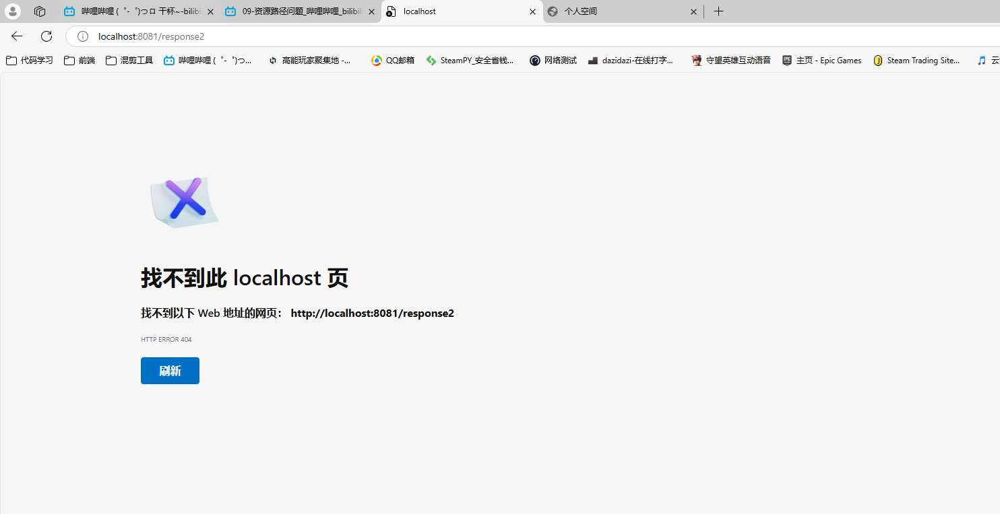


### 如何动态获取当前的虚拟路径

使用`getContentPath`函数

```java
String contextPath = req.getContextPath();
```

### 如何获取当前项目的工作路径

使用`getProperty`函数

```java
String contextPath = System.getProperty("user.dir");
System.out.println(contextPath);
```


## 10-Response响应字符&字节数据

### 响应字符

使用`PrintWriter`字符输出类来输出响应字符

#### 输出普通字符串

```java
//首先获取字符输出流
PrintWriter printWriter = resp.getWriter();
//使用字符输出流输出字符
printWriter.write("aaa");
```


#### 输出html类型

```java
//可以输出html信息，不过要先设置响应类型才能正确解析html
resp.setHeader("Content-Type","text/html");
printWriter.write("<h1>aaa</h1>");
```

如下图所示，标签会被浏览器解析为输出为html


#### 输出中文类型

如果不进行处理，输出中文字符时会出现乱码，因为Response获取的字符输出流的默认编码为ISO-8859-1

```java
//首先获取字符输出流
PrintWriter printWriter = resp.getWriter();
//使用字符输出流输出字符
printWriter.write("你好");
```

如图所示，中文输出为乱码


##### 解决中文乱码问题

需要在获取字符输出流前设置响应头，设置响应类型和字符编码

```java
        //在获取字符输出流之前设置响应类型和字符编码
        resp.setContentType("text/html;charset=utf-8");
		//获取字符输出流
        PrintWriter printWriter = resp.getWriter();
        //使用字符输出流输出字符
        printWriter.write("你好");
        //可以输出html信息，不过要先设置响应类型才能正确解析html
        printWriter.write("<h1>你好</h1>");
```

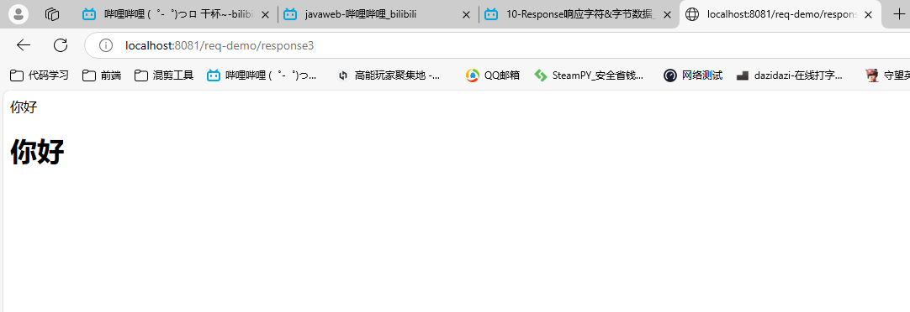


### 响应图片等文件

响应图像、视频等文件需要用到字节输出流

```java
//首先读取文件
FileInputStream fileInputStream = new FileInputStream("D:\\code\\Idea_project\\java-web\\src\\main\\resources\\images\\test1.jpg");
//获取字节输出流
ServletOutputStream servletOutputStream = resp.getOutputStream();
//完成流的copy
byte[] buff = new byte[1024];
int len = 0;
while((len = fileInputStream.read(buff))!=-1){
    servletOutputStream.write(buff,0,len);
}
//关闭文件输入流
fileInputStream.close();
```

响应结果为一张图片

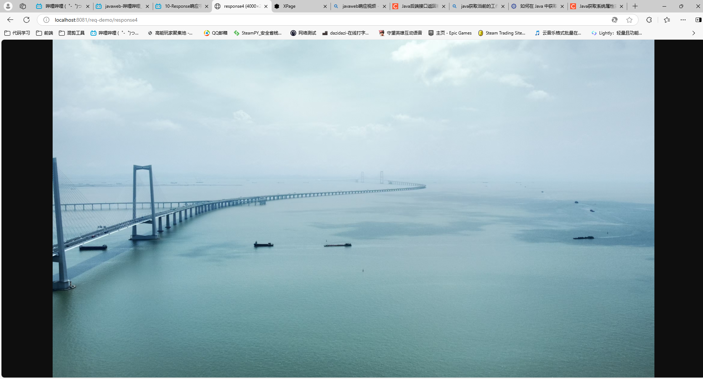

可以添加依赖，来简写流的copy

依赖

```xml
    <dependency>
      <groupId>commons-io</groupId>
      <artifactId>commons-io</artifactId>
      <version>2.6</version>
    </dependency>
```


简写

```java
        //完成流的copy
//        byte[] buff = new byte[1024];
//        int len = 0;
//        while((len = fileInputStream.read(buff))!=-1){
//            servletOutputStream.write(buff,0,len);
//        }

        //使用工具，简化流的copy
        IOUtils.copy(fileInputStream,servletOutputStream);
```


## 13-SqlSessionFactory工具类抽取

我们每次在使用mybatis的时候，都要创建SqlSessionFactory对象，这样会有两个问题

1.代码重复量增多

2.每次创建SqlSessionFactory都会消耗资源池资源，浪费资源

为了解决这个问题，可以创建一个工具类

```java
import org.apache.ibatis.io.Resources;
import org.apache.ibatis.session.SqlSessionFactory;
import org.apache.ibatis.session.SqlSessionFactoryBuilder;

import java.io.IOException;
import java.io.InputStream;

public class SqlSessionFactoryUtils {
    private static SqlSessionFactory sqlSessionFactory;

    //静态代码块会随着类的加载而执行，且只会执行一次
    static {
        try {
            //1.加载核心配置文件，获取SqlSessionFactory对象
            String resource = "mybatis-config.xml";
            InputStream inputStream = Resources.getResourceAsStream(resource);
            sqlSessionFactory = new SqlSessionFactoryBuilder().build(inputStream);
        } catch (IOException e) {
            e.printStackTrace();
        }
    }

    public static SqlSessionFactory getSqlSessionFactory(){
        return sqlSessionFactory;
    }
}
```

这样创建SqlSessionFactory的代码就可以改成如下

```java
        //1.加载核心配置文件，获取SqlSessionFactory对象
//        String resource = "mybatis-config.xml";
//        InputStream inputStream = Resources.getResourceAsStream(resource);
//        SqlSessionFactory sqlSessionFactory = new SqlSessionFactoryBuilder().build(inputStream);

		//修改后的代码
        SqlSessionFactory sqlSessionFactory = SqlSessionFactoryUtils.getSqlSessionFactory();
```

# JSP

## 01-JSP概述&快速入门&原理

JSP是Java Server Pages的简写，叫做java服务端页面，是html和java的结合

### 使用JSP的步骤

#### 1.导入JSP依赖

注意导入JSP依赖时要设置生效范围为provided，因为tomcat里面也存在JSP依赖，如果不设置生效范围会发生冲突

```xml
    <dependency>
      <groupId>javax.servlet.jsp</groupId>
      <artifactId>jsp-api</artifactId>
      <version>2.2</version>
      <scope>provided</scope>
    </dependency>
```


#### 2.编写jsp文件

```jsp
<%--
  Created by IntelliJ IDEA.
  User: Aurora
  Date: 2025/1/14
  Time: 15:20
  To change this template use File | Settings | File Templates.
--%>
<%@ page contentType="text/html;charset=UTF-8" language="java" %>
<html>
<head>
    <title>Hello JSP</title>
</head>
<body>
    <h1>
        hello jsp
    </h1>
    <%
        System.out.println("hello JSP");
    %>
</body>
</html>
```


#### 3.无法编译jsp的问题

在运行时出现了如下问题


上网找解决方法，发现可能是以下问题导致的

1.最新版的jdk17自带servlet和jsp等jar包，而运行tomcat7会导致jar包冲突

解决办法是

1.仍然使用tomcat7，但是要将jdk版本降到1.7

2.将tomcat7升级为tomcat10

我这里采用的是第二种方法，升级tomcat7为tomcat10

如下图所示，运行成功了


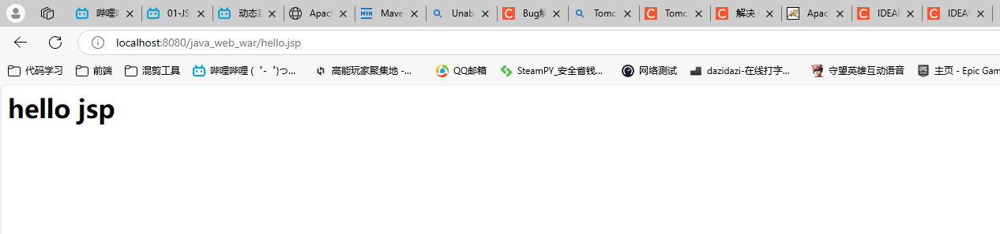


## 2025年2月6日补充

#### 解决无法编译jsp问题

今天又遇到了jsp无法编译的问题，用上面的方法还是没法解决，搞了半天最后也不知道怎么就解决了，这里把用的jdk版本、tomcat版本和pom.xml文件放在这给出一个参考，反正我今天这样设置就能运行了，先参考参考吧

##### jdk版本

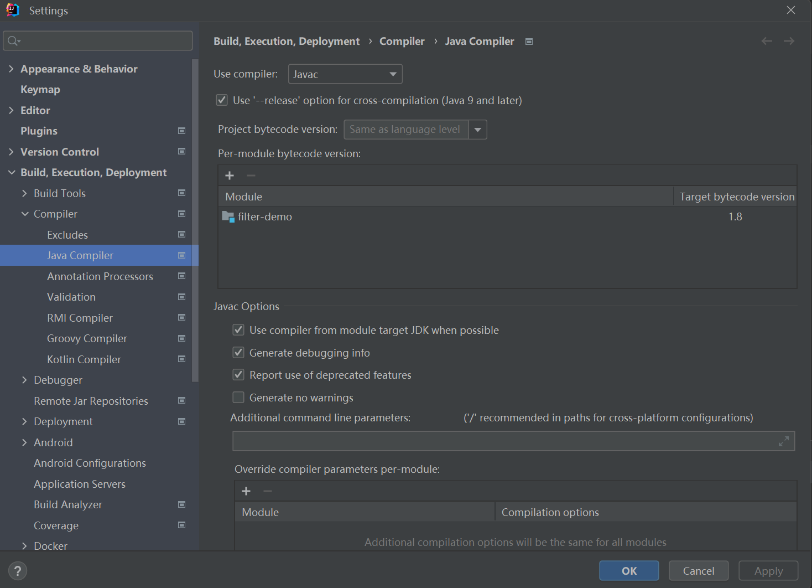


##### tomcat版本

tomcat用的是插件，tomcat7

```xml
  <build>
    <plugins>
      <plugin>
        <groupId>org.apache.tomcat.maven</groupId>
        <artifactId>tomcat7-maven-plugin</artifactId>
        <version>2.2</version>
        <configuration>
          <port>80</port>
        </configuration>
      </plugin>
    </plugins>
  </build>
```


##### pom.xml文件

```xml
<?xml version="1.0" encoding="UTF-8"?>
<project xmlns="http://maven.apache.org/POM/4.0.0"
         xmlns:xsi="http://www.w3.org/2001/XMLSchema-instance"
         xsi:schemaLocation="http://maven.apache.org/POM/4.0.0 http://maven.apache.org/xsd/maven-4.0.0.xsd">
  <modelVersion>4.0.0</modelVersion>

  <groupId>org.example</groupId>
  <artifactId>filter-demo</artifactId>
  <version>1.0-SNAPSHOT</version>

  <packaging>war</packaging>

  <properties>
    <maven.compiler.source>8</maven.compiler.source>
    <maven.compiler.target>8</maven.compiler.target>
  </properties>


  <dependencies>

    <dependency>
      <groupId>javax.servlet</groupId>
      <artifactId>javax.servlet-api</artifactId>
      <version>3.1.0</version>
      <scope>provided</scope>
    </dependency>


  </dependencies>

  <build>
    <plugins>
      <plugin>
        <groupId>org.apache.tomcat.maven</groupId>
        <artifactId>tomcat7-maven-plugin</artifactId>
        <version>2.2</version>
        <configuration>
          <port>80</port>
        </configuration>
      </plugin>
    </plugins>
  </build>

</project>
```


#### 解决jsp输出中文乱码问题

只需要在jsp文件中添加一行代码

```jsp
<%@ page language="java" contentType="text/html; charset=UTF-8" pageEncoding="UTF-8"%>
```


### 总结

JSP实际上是一个Servlet，因为服务器在调用JSP的时候会自动将JSP转换成servlet，然后再将servlet编译成字节码来提供服务

通过查看target文件夹，可以找到由JSP转换来的servlet类文件

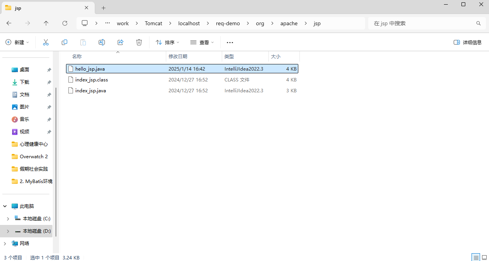


查看这个类文件

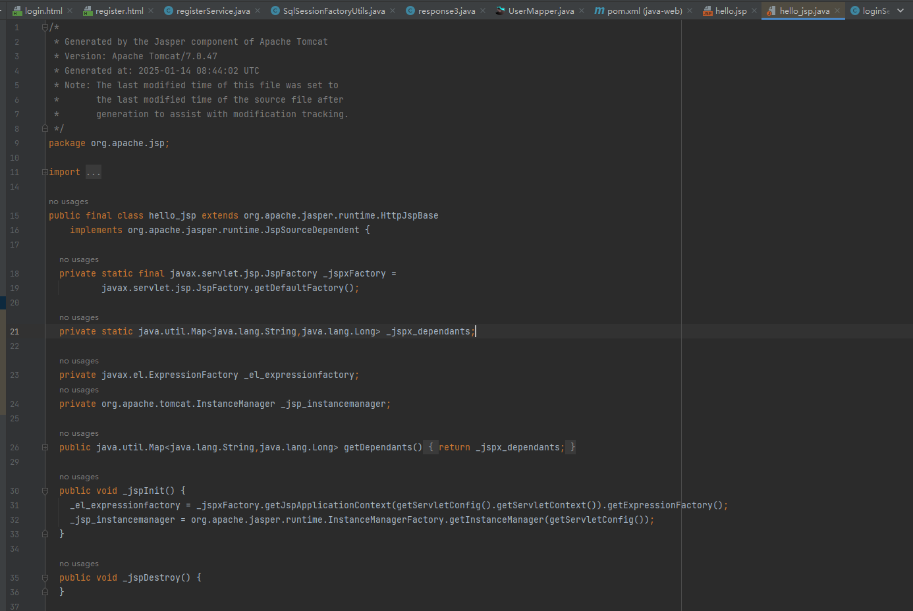

可以找到一个叫`_jspService`的函数，刚刚在JSP文件里面写的java代码就在这里，运行JSP文件，实际上就是运行这个函数

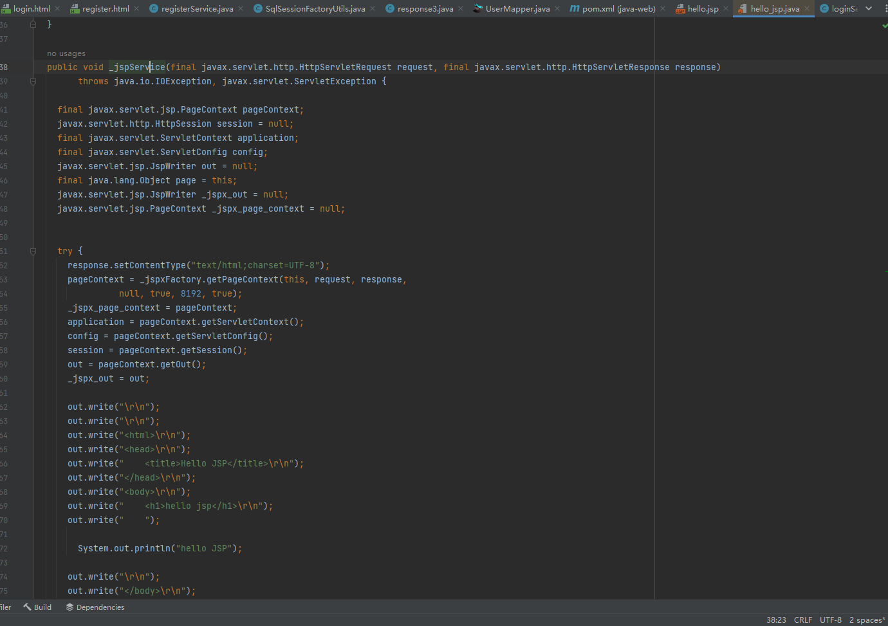


## 02-JSP脚本

### JSP有三种脚本

#### 1.`<%....%>`

这种脚本会放在_jspService函数中

例如

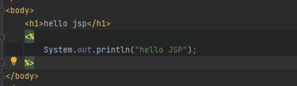

会放在_jspService函数中


#### 2.`<%=.....%>`

这种脚本会将对应的代码放在`out.print()`中

例如

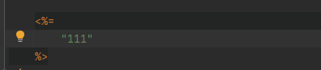

会放在


#### 3.`<%!....%>`

这种脚本会把写在这里面的代码放在_jspService函数外边，适合用于创建成员变量和成员函数

例如


会放在

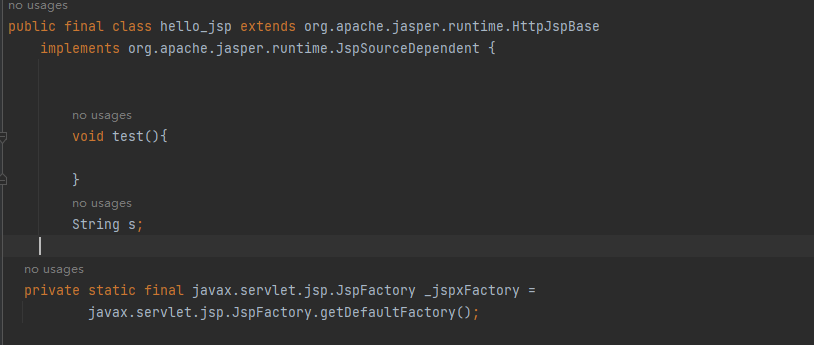


## 04-EL表达式

EL表达式的主要功能是获取数据，其简化了JSP的数据获取

语法如下

获取expression的数据，expression放在request域中，通过转发传给JSP文件

```jsp
${expression}		
```

### 使用步骤

1.在Servlet中获取数据

2.将数据放入request域中

3.将请求转发给JSP

```java
package com.example.response;

import com.example.pojo.Brand;

import javax.servlet.ServletException;
import javax.servlet.annotation.WebServlet;
import javax.servlet.http.HttpServlet;
import javax.servlet.http.HttpServletRequest;
import javax.servlet.http.HttpServletResponse;
import java.io.IOException;
import java.util.ArrayList;
import java.util.List;

@WebServlet("/EL")
public class ELService extends HttpServlet {

    @Override
    protected void doGet(HttpServletRequest req, HttpServletResponse resp) throws ServletException, IOException {
        //1.先获取数据
        List<Brand> brands = new ArrayList<Brand>();
        brands.add(new Brand(1,"三只松鼠","三只松鼠",100,"三只松鼠，好吃不上火",1));
        brands.add(new Brand(2,"优衣库","优衣库",200,"优衣库，服适人生",0));
        brands.add(new Brand(3,"小米","小米科技有限公司",1000,"为发烧而生",1));

        //2.然后将数据放入request域中
        req.setAttribute("Brands",brands);

        //3.将请求转发给JSP
        req.getRequestDispatcher("/EL.jsp").forward(req,resp);

    }
}

```

4.在JSP文件中通过EL表达式获取数据

```jsp
<%--
  Created by IntelliJ IDEA.
  User: Aurora
  Date: 2025/1/14
  Time: 19:29
  To change this template use File | Settings | File Templates.
--%>
<%@ page contentType="text/html;charset=UTF-8" language="java" isELIgnored="false" %>
<html>
<head>
    <title>Title</title>
</head>
<body>
    ${Brands}
</body>
</html>

```

### 解决JSP不识别EL表达式的问题

在page标签中再加上isELIgnored="false"

```jsp
<%@ page contentType="text/html;charset=UTF-8" language="java" isELIgnored="false" %>
```


## 05-JSTL-if&foreach

JSTL 是JSP Standar Tag Library 的缩写，表示JSP标准标签库，其通过定义标签库来简化了JSP 中java代码的书写

### 使用步骤

#### 1.导入依赖

要导入两个依赖，一个`jstl`，另一个`standard`

```xml
    <dependency>
      <groupId>jstl</groupId>
      <artifactId>jstl</artifactId>
      <version>1.2</version>
    </dependency>
    <dependency>
      <groupId>taglibs</groupId>
      <artifactId>standard</artifactId>
      <version>1.1.2</version>
    </dependency>
```


#### 2.为JSTL标签定义前缀

前缀名可以自定义，一般为c

```jsp
<%@taglib prefix="c" uri="http://java.sun.com/jsp/jstl/core" %>
```


### `c:if`

注意判断条件要一起写在大括号内`{}`

```jsp
<%--
  Created by IntelliJ IDEA.
  User: Aurora
  Date: 2025/1/14
  Time: 20:26
  To change this template use File | Settings | File Templates.
--%>
<%@ page contentType="text/html;charset=UTF-8" language="java" isELIgnored="false" %>
<%@taglib prefix="c" uri="http://java.sun.com/jsp/jstl/core" %>
<html>
<head>
    <title>Title</title>
</head>
<body>
    <c:if test="${b==1}">
        true
    </c:if>

    <c:if test="${b==0}">
        false
    </c:if>

</body>
</html>

```


### `c:foreach`

foreach的基本用法

```jsp
<%@ page contentType="text/html;charset=UTF-8" language="java" %>
<%@ page import="com.example.pojo.Brand" %>
<%@ page import="java.util.ArrayList" %>
<%@ page import="java.util.List" isELIgnored="false" %>
<%@taglib prefix="c" uri="http://java.sun.com/jsp/jstl/core" %>
<!DOCTYPE html>
<html lang="en">
<head>
  <meta charset="UTF-8">
  <title>Title</title>
</head>
<body>
<input type="button" value="新增"><br>
<hr>
<table border="1" cellspacing="0" width="800">
  <tr>
    <th>序号</th>
    <th>品牌名称</th>
    <th>企业名称</th>
    <th>排序</th>
    <th>品牌介绍</th>
    <th>状态</th>
    <th>操作</th>

  </tr>
    <c:forEach items="${Brands}" var="brand">
     <tr align="center">
       <td>${brand.id}</td>
  <td>${brand.brandName}</td>
  <td>${brand.companyName}</td>
  <td>${brand.ordered}</td>
  <td>${brand.description}</td>
       <c:if test="${brand.status==1}">
         <td>启用</td>
       </c:if>
       <c:if test="${brand.status==0}">
         <td>禁用</td>
       </c:if>

  <td><a href="#">修改</a> <a href="#">删除</a></td>
     </tr>

    </c:forEach>

</table>

</body>
</html>
```


还可以编成for循环的用法

```jsp
  <c:forEach begin="1" end="10" step="1" var="i">
    ${i}
  </c:forEach>
```


## 06-MVC模式和三层架构

### MVC模式

MVC是一种开发模式，其中

M：Model，业务模型，负责业务处理

V：View，视图，负责页面展示

C：Controller，控制器，负责调用Model和View

在下图示例中，浏览器将请求发给Controller，Controller收到请求后对请求进行处理，然后调用Model来对请求进行业务处理，接着将业务处理后的数据传给View，使其显示在页面上，并返回给浏览器


### 三层架构

三层架构包括：

数据访问层：负责对数据库进行基本的增删改查操作，常见的是开发中的Mapper/dao部分的代码

业务逻辑层：对业务逻辑进行封装，可以通过调用数据访问层的基本操作来形成复杂的逻辑处理操作，常见的是开发中的Service部分

表现层：接收请求，封装数据，调用业务逻辑层，常见的是开发中的Controller/web部分的代码

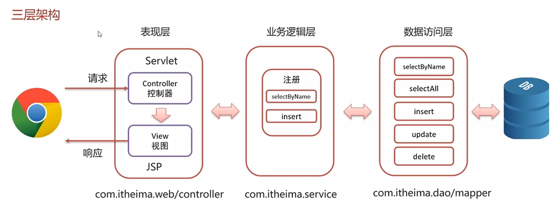

### 三大框架

三层架构中，每一层都有一个重要的框架，合起来有三大框架，如下：

表现层：SpringMVC

业务逻辑层：Spring

数据访问层：MyBatis


## 02-Cookie-基本使用

Cookie的使用对于后端来说，主要关注点有两个

一个是如何发送cookie

另一个是如何接收cookie

### 如何发送cookie

#### 1.建立Cookie对象

Cookie对象接收的是一个键值对

```java
//创建Cookie对象
Cookie cookie = new Cookie("username","zs");
//创建了一个键值对为username:zs的Cookie
```


#### 2.在响应中添加对应的cookie

将cookie添加到响应中需要用到响应的addCookie函数

```java
//将上面创建的cookie添加到响应中
resp.addCookie(cookie);
```


下面是完整的代码

```java
    @Override
    protected void doGet(HttpServletRequest req, HttpServletResponse resp) throws ServletException, IOException {
        //1.创建cookie对象
        Cookie cookie = new Cookie("username","zs");

        //2.发送cookie，将cookie放入响应中
        resp.addCookie(cookie);

    }

```

在访问对应的站点后，就可以从浏览器中找到对应的Cookie信息

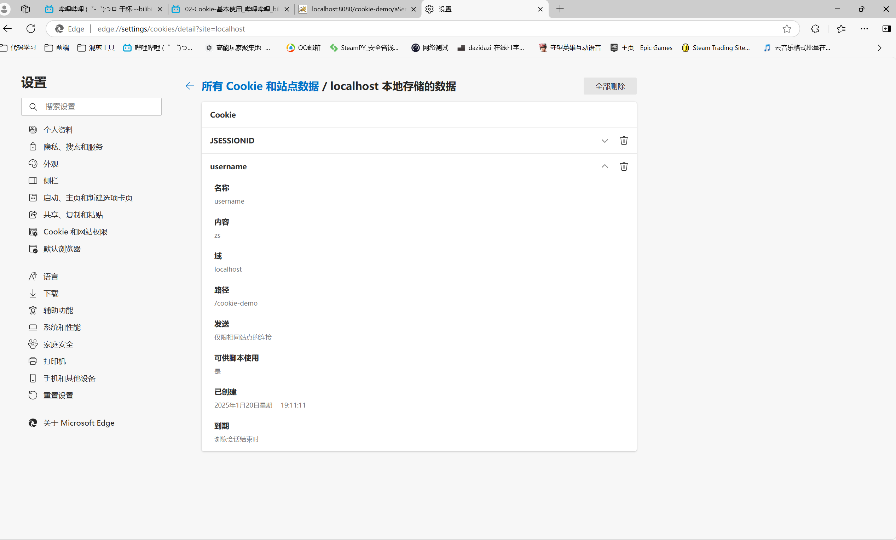


### 如何接收cookie

#### 1.接收cookie数组

接收cookie数组需要用到request的函数`getCookies`

```java
//接收cookie数组
Cookie[] cookies = req.getCookies();
```


#### 2.遍历cookie数组，找出需要的cookie信息

获取cookie信息需要用到`getName`函数和`getValue`函数

```java
//遍历上面获取的cookie数组，找出需要的cookie信息
for(Cookie cookie : cookies){
    String name = cookie.getName();
    if(name.equals("username")){
        System.out.println("username:" + cookie.getValue());
    }  
}
```


完整代码如下：

```java
    @Override
    protected void doGet(HttpServletRequest req, HttpServletResponse resp) throws ServletException, IOException {
        //1.首先接收cookie数组
        Cookie[] cookies = req.getCookies();

        //2.然后遍历cookie数组，取出需要的cookie信息
        for(Cookie cookie :cookies){
            String name = cookie.getName();
            if(name.equals("username")){
                System.out.println("username:" + cookie.getValue());
            }
        }

    }
```


访问对应的网站后，可以得到下图结果，下图成功获取到了username的cookie信息

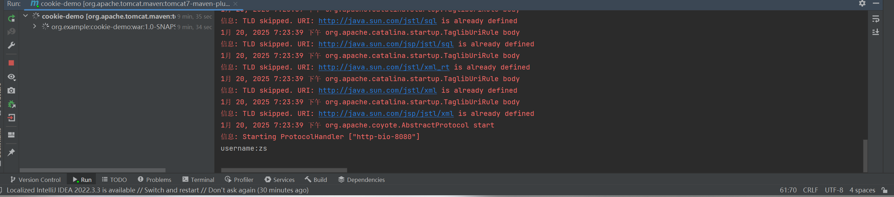


## 03-Cookie原理&细节

### Cookie原理

cookie是基于HTTP协议的

后端发送Cookie时会在响应标头里面给出`Set-Cookie`,用于告知浏览器要保存的Cookie


浏览器发送Cookie信息给后端时，会在请求标头里添加`Cookie`，用于告知后端浏览器所具有的Cookie信息

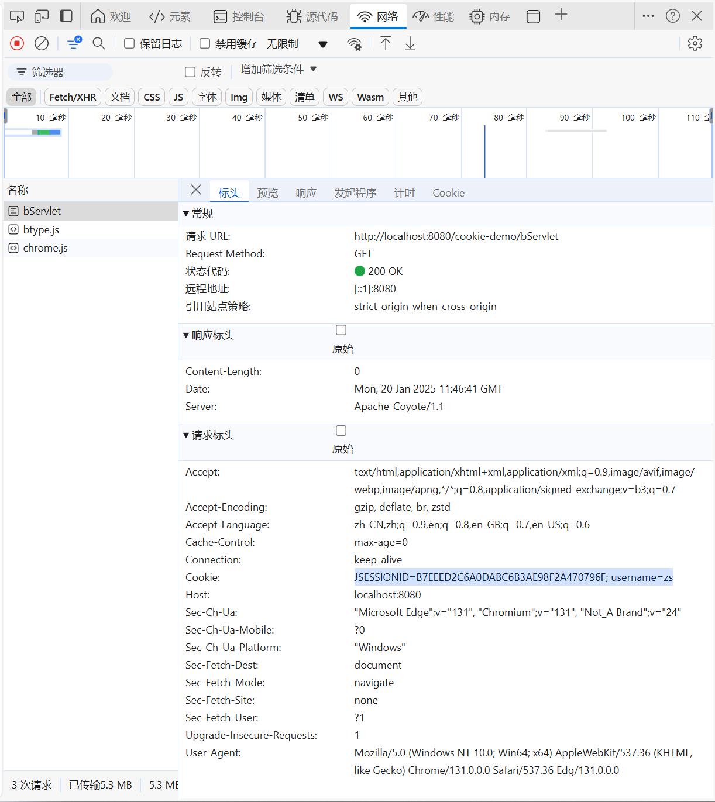


### Cookie使用细节

#### Cookie存活时间

Cookie是存储在浏览器的内存中的，默认情况下，Cookie的存活时间是一直到浏览器关闭为止，可以通过在后端使用`setMaxAge`这个函数来修改默认情况，自定义cookie存活时间

#### `setMaxAge`的使用

可以设置三种参数：

##### 1.设置为正数

将cookie存储在硬盘中，进行持久化存储，在规定时间后删除

```java
//设置cookie存活时间，存活时间为7天
cookie.setMaxAge(60*60*24*7);
```

这样获取到的cookie的信息就可以保存7天，如下图所示到期时间刚好是7天后

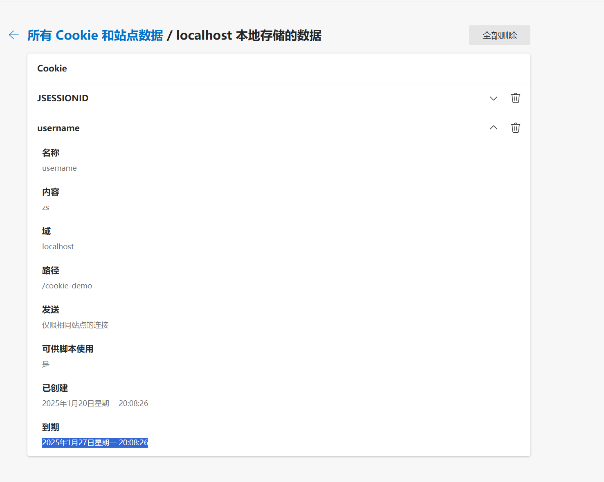


##### 2.设置为负数

这是Cookie的默认情况，即cookie会一直存活到浏览器关闭为止

##### 3.设置为0

这种情况用于删除对应的cookie


### Cookie存储中文

默认情况下Cookie不能存储中文

如果后端强制发送中文的Cookie信息，那么浏览器就会报错

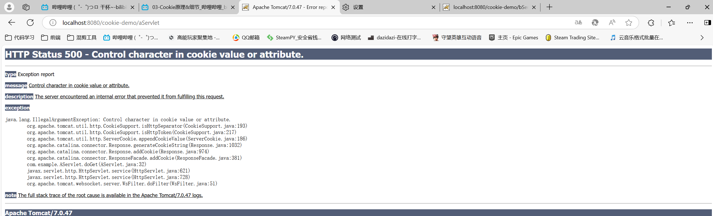

所以为了满足存储中文的需求，需要按以下方法来存储中文

#### 1.首先在发送Cookie时先对中文进行编码

使用URL编码来进行编码和解码操纵

使用`URLEncode.encode("要编码的中文","编码所用的字符集")`

```java
String value = "张三";
value = URLEncode.encode(value,"UTF-8");
//在编码后创建Cookie对象
Cookie cookie = new Cookie("username",value);
```

如图所示，在编码后，浏览器所存储的cookie信息就变成了对应的编码信息而不是中文

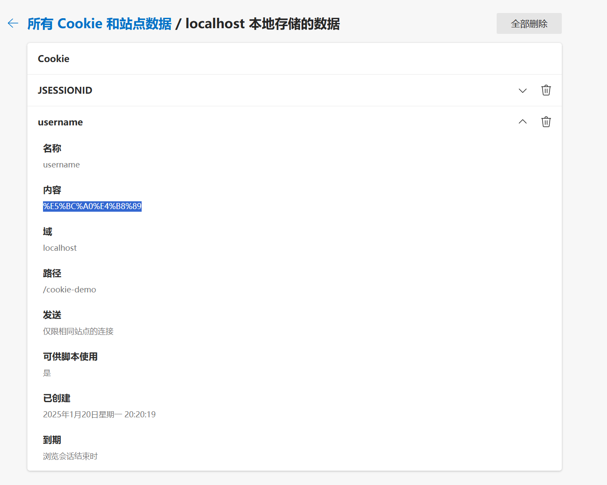


#### 2.在接收Cookie时再进行解码

使用`URLDecoder.decode("要解码的字符","解码用的字符集")`

```java
//对获取到的cookie信息进行解码
String name = URLDecoder.decode(cookie.getName(),"UTF-8");
```

如下图所示，解码后仍然可以正常显示中文

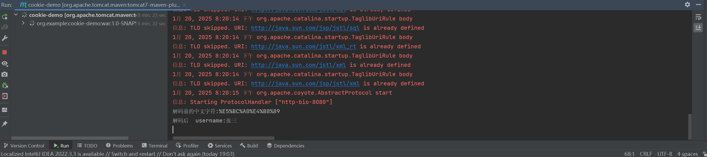


## 04-Session-基本使用

Session是服务器会话跟踪技术，前面使用的Cookie是将需要共享的信息存在浏览器端，而这个Session是存在服务器端，相比于Cookie更加安全

### 将信息存储到Session中

#### 1.获取Session对象

使用`request.getSession()`函数来获取Session对象

```java
//获取Session对象
HttpSession session = req.getSession();
```


#### 2.存储数据

使用Session对象的`setAttribute("要存储的键","要存储的值")`函数来存储数据

```java
//存储数据
sessiono.setAttribute("username","zs");
```


### 获取Session中的信息

#### 1.获取Session对象

```java
//获取Session对象
HttpSession session = req.getSession();
```


#### 2.获取信息

使用`getAttribute("要获取信息的键")`

```java
//获取信息
Object username = session.getAttribute("username");

```


### Session对象的所有函数

1.`setAttribute`

用于存储键值对信息

```java
session.setAttribute("key","value")
```


2.`getAttribute`

根据key获取信息

```java
session.getAttribute("key");
```


3.`removeAttribute`

根据key删除键值对

```java
session.removeAttribute("key");
```


## 05-Session原理&细节

### Session原理

Session是基于Cookie的，服务器是如何保证每次获取的Session对象都是同一个呢？

#### 第一次创建Session对象时

实际上，在服务器中，每次创建一个Session对象的时候，服务器就会给这个Session对象指定一个id，并通过在响应中添加set-cookie响应头来告知这个id

如下图所示


#### 后面再次创建对象时

浏览器在知道服务器发来的Session对象的id后，就会在请求标头中添加`cookie`属性，用于告知服务器应该访问那个Session对象，如果服务器找不到这个对象就会创建一个，然后将id赋给这个新创建的对象

如下图所示，浏览器的请求头中有`cookie`属性


通过上面所说的这个机制，服务器就能准确知道究竟要访问哪个Session对象


### Session细节

#### Session钝化和活化

Session在服务器正常关闭重启时不会消失，原因如下

##### 1.Session钝化

当服务器正常关闭的时候，tomcat会将Session文件自动存入服务器的硬盘中

如下图所示，`SESSIONS.ser`文件就是tomcat存储的Session文件


##### 2.Session活化

当服务器重新启动时，会中文件中加载Session文件，并将前面存储的`SESSIONS.ser`文件删除


通过这样一个机制，服务器中的Session信息就不会因为服务器的重启而消失

##### 3.浏览器关闭对Session的影响

浏览器关闭再启动访问服务器时，其产生的是两个会话，因此生成的Session不是同一个

如下图所示，第二次访问是在关闭浏览器重启后进行的访问，两个Session的地址不一样，所以不是同一个Session

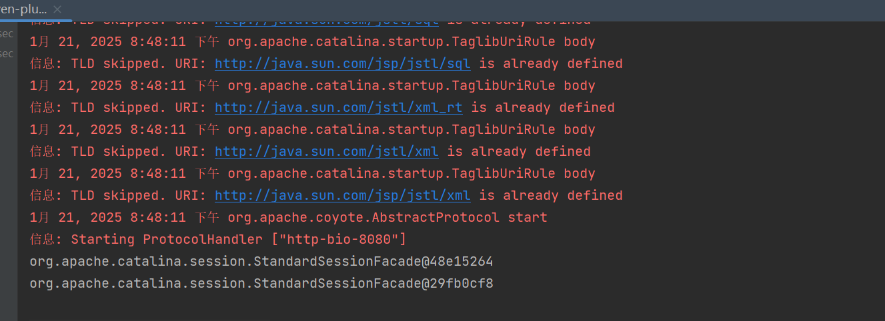


####  Session的销毁

Session销毁有两种方式

##### 1.通过配置销毁时间销毁

默认情况下Session会在30分钟后自动销毁，这是tomcat服务器自己的配置

我们也可以在`web.xml`文件中自己配置销毁时间

```xml
<session-config>
	<session-timeout>40</session-timeout>
</session-config>
```

如下图所示，这样配置Session将在40分钟后销毁

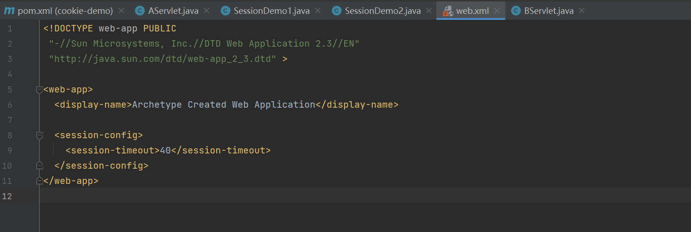


##### 2.使用Session的`invalidate()`函数来销毁

```java
//使用Session的函数invalidate来销毁
session.invalidate();
```

如下图所示示例


此时我们访问服务器会发生如下报错，因为Session已经被销毁了


## 11-案例-验证码-展示&校验

### 如何实现验证码功能

使用工具类`CheckCodeUtil`

工具类如下

```java
package com.example.util;

import javax.imageio.ImageIO;
import java.awt.*;
import java.awt.geom.AffineTransform;
import java.awt.image.BufferedImage;
import java.io.*;
import java.util.Arrays;
import java.util.Random;

/**
 * 生成验证码工具类
 */
public class CheckCodeUtil {

    public static final String VERIFY_CODES = "123456789ABCDEFGHIJKLMNOPQRSTUVWXYZ";
    private static Random random = new Random();

//    public static void main (String[] args) throws IOException {
//        OutputStream fos = new FileOutputStream("D:\\code\\Idea_project\\JSPExample\\src\\main\\webapp\\imgs\\a.jpg");
//        String checkCode = CheckCodeUtil.outputVerifyImage(100,50,fos,4);
//        System.out.println(checkCode);
//
//    }

    /**
     * 输出随机验证码图片流,并返回验证码值（一般传入输出流，响应response页面端，Web项目用的较多）
     *
     * @param width
     * @param height
     * @param os
     * @param verifySize
     * @return
     * @throws IOException
     */
    public static String outputVerifyImage(int width, int height, OutputStream os, int verifySize) throws IOException {
        String verifyCode = generateVerifyCode(verifySize);
        outputImage(width, height, os, verifyCode);
        return verifyCode;
    }

    /**
     * 使用系统默认字符源生成验证码
     *
     * @param verifySize 验证码长度
     * @return
     */
    public static String generateVerifyCode(int verifySize) {
        return generateVerifyCode(verifySize, VERIFY_CODES);
    }

    /**
     * 使用指定源生成验证码
     *
     * @param verifySize 验证码长度
     * @param sources    验证码字符源
     * @return
     */
    public static String generateVerifyCode(int verifySize, String sources) {
        // 未设定展示源的字码，赋默认值大写字母+数字
        if (sources == null || sources.length() == 0) {
            sources = VERIFY_CODES;
        }
        int codesLen = sources.length();
        Random rand = new Random(System.currentTimeMillis());
        StringBuilder verifyCode = new StringBuilder(verifySize);
        for (int i = 0; i < verifySize; i++) {
            verifyCode.append(sources.charAt(rand.nextInt(codesLen - 1)));
        }
        return verifyCode.toString();
    }

    /**
     * 生成随机验证码文件,并返回验证码值 (生成图片形式，用的较少)
     *
     * @param w
     * @param h
     * @param outputFile
     * @param verifySize
     * @return
     * @throws IOException
     */
    public static String outputVerifyImage(int w, int h, File outputFile, int verifySize) throws IOException {
        String verifyCode = generateVerifyCode(verifySize);
        outputImage(w, h, outputFile, verifyCode);
        return verifyCode;
    }


    /**
     * 生成指定验证码图像文件
     *
     * @param w
     * @param h
     * @param outputFile
     * @param code
     * @throws IOException
     */
    public static void outputImage(int w, int h, File outputFile, String code) throws IOException {
        if (outputFile == null) {
            return;
        }
        File dir = outputFile.getParentFile();
        //文件不存在
        if (!dir.exists()) {
            //创建
            dir.mkdirs();
        }
        try {
            outputFile.createNewFile();
            FileOutputStream fos = new FileOutputStream(outputFile);
            outputImage(w, h, fos, code);
            fos.close();
        } catch (IOException e) {
            throw e;
        }
    }

    /**
     * 输出指定验证码图片流
     *
     * @param w
     * @param h
     * @param os
     * @param code
     * @throws IOException
     */
    public static void outputImage(int w, int h, OutputStream os, String code) throws IOException {
        int verifySize = code.length();
        BufferedImage image = new BufferedImage(w, h, BufferedImage.TYPE_INT_RGB);
        Random rand = new Random();
        Graphics2D g2 = image.createGraphics();
        g2.setRenderingHint(RenderingHints.KEY_ANTIALIASING, RenderingHints.VALUE_ANTIALIAS_ON);

        // 创建颜色集合，使用java.awt包下的类
        Color[] colors = new Color[5];
        Color[] colorSpaces = new Color[]{Color.WHITE, Color.CYAN,
                Color.GRAY, Color.LIGHT_GRAY, Color.MAGENTA, Color.ORANGE,
                Color.PINK, Color.YELLOW};
        float[] fractions = new float[colors.length];
        for (int i = 0; i < colors.length; i++) {
            colors[i] = colorSpaces[rand.nextInt(colorSpaces.length)];
            fractions[i] = rand.nextFloat();
        }
        Arrays.sort(fractions);
        // 设置边框色
        g2.setColor(Color.GRAY);
        g2.fillRect(0, 0, w, h);

        Color c = getRandColor(200, 250);
        // 设置背景色
        g2.setColor(c);
        g2.fillRect(0, 2, w, h - 4);

        // 绘制干扰线
        Random random = new Random();
        // 设置线条的颜色
        g2.setColor(getRandColor(160, 200));
        for (int i = 0; i < 20; i++) {
            int x = random.nextInt(w - 1);
            int y = random.nextInt(h - 1);
            int xl = random.nextInt(6) + 1;
            int yl = random.nextInt(12) + 1;
            g2.drawLine(x, y, x + xl + 40, y + yl + 20);
        }

        // 添加噪点
        // 噪声率
        float yawpRate = 0.05f;
        int area = (int) (yawpRate * w * h);
        for (int i = 0; i < area; i++) {
            int x = random.nextInt(w);
            int y = random.nextInt(h);
            // 获取随机颜色
            int rgb = getRandomIntColor();
            image.setRGB(x, y, rgb);
        }
        // 添加图片扭曲
        shear(g2, w, h, c);

        g2.setColor(getRandColor(100, 160));
        int fontSize = h - 4;
        Font font = new Font("Algerian", Font.ITALIC, fontSize);
        g2.setFont(font);
        char[] chars = code.toCharArray();
        for (int i = 0; i < verifySize; i++) {
            AffineTransform affine = new AffineTransform();
            affine.setToRotation(Math.PI / 4 * rand.nextDouble() * (rand.nextBoolean() ? 1 : -1), (w / verifySize) * i + fontSize / 2, h / 2);
            g2.setTransform(affine);
            g2.drawChars(chars, i, 1, ((w - 10) / verifySize) * i + 5, h / 2 + fontSize / 2 - 10);
        }

        g2.dispose();
        ImageIO.write(image, "jpg", os);
    }

    /**
     * 随机颜色
     *
     * @param fc
     * @param bc
     * @return
     */
    private static Color getRandColor(int fc, int bc) {
        if (fc > 255) {
            fc = 255;
        }
        if (bc > 255) {
            bc = 255;
        }
        int r = fc + random.nextInt(bc - fc);
        int g = fc + random.nextInt(bc - fc);
        int b = fc + random.nextInt(bc - fc);
        return new Color(r, g, b);
    }

    private static int getRandomIntColor() {
        int[] rgb = getRandomRgb();
        int color = 0;
        for (int c : rgb) {
            color = color << 8;
            color = color | c;
        }
        return color;
    }

    private static int[] getRandomRgb() {
        int[] rgb = new int[3];
        for (int i = 0; i < 3; i++) {
            rgb[i] = random.nextInt(255);
        }
        return rgb;
    }

    private static void shear(Graphics g, int w1, int h1, Color color) {
        shearX(g, w1, h1, color);
        shearY(g, w1, h1, color);
    }

    private static void shearX(Graphics g, int w1, int h1, Color color) {

        int period = random.nextInt(2);

        boolean borderGap = true;
        int frames = 1;
        int phase = random.nextInt(2);

        for (int i = 0; i < h1; i++) {
            double d = (double) (period >> 1)
                    * Math.sin((double) i / (double) period
                    + (6.2831853071795862D * (double) phase)
                    / (double) frames);
            g.copyArea(0, i, w1, 1, (int) d, 0);
            if (borderGap) {
                g.setColor(color);
                g.drawLine((int) d, i, 0, i);
                g.drawLine((int) d + w1, i, w1, i);
            }
        }

    }

    private static void shearY(Graphics g, int w1, int h1, Color color) {

        int period = random.nextInt(40) + 10; // 50;

        boolean borderGap = true;
        int frames = 20;
        int phase = 7;
        for (int i = 0; i < w1; i++) {
            double d = (double) (period >> 1)
                    * Math.sin((double) i / (double) period
                    + (6.2831853071795862D * (double) phase)
                    / (double) frames);
            g.copyArea(i, 0, 1, h1, 0, (int) d);
            if (borderGap) {
                g.setColor(color);
                g.drawLine(i, (int) d, i, 0);
                g.drawLine(i, (int) d + h1, i, h1);
            }

        }

    }
}


```

使用该工具类直接调用其中的`outputVerifyImage`函数，参数定义为，`width`图片长度，`height`图片高度，`os`图片文件输出流，`verifySize`验证码长度

使用示例如下

```java
//创建文件输出流
OutputStream os = new FileOutputStream("图片输出的路径");
//调用工具类的函数
String checkCode = CheckCodeUtil.outputVerifyImage(100,50,fos,4);
System.out.println(checkCode);
```

执行后会得到如下结果

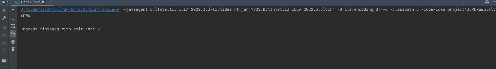

生成的图片如下


### 如何在Web服务中使用验证码

只需要在调用工具类函数生成验证码的时候修改以下输出流就行，改成ServletOutputStream

如下示例

```java
//创建ServletOutputStream
ServletOutputStream os = resp.getOutputStream();
//调用生成验证码的工具类函数
CheckCodeUtil.outputVerifyImage(100,50,os,4);
```

此外，还需要在前端页面中设置图片的路径

如下是案例中前端验证码部分的代码，设置的图片路径是调用工具类函数的Servlet，输出流会将图片直接输出到页面上

```jsp
      <tr>
        <td>验证码</td>
        <td class="inputs">
          <input name="checkCode" type="text" id="checkCode">
          
          <a href="#" id="changeImg">看不清？</a>
        </td>
      </tr>
```

### 如何实现点击更换验证码图片

只需要在点击时重新设置一下图片路径即可

```jsp
<script>
document.getElementById("changeImg").onclick = function (){
    document.getElementById("checkCodeImg").src = "/JSPExample_war/checkCodeServlet?"+ new Date().getMilliseconds();
  }
</script>  
```

注意，路径不能修改成和原来一样,如下所示

因为浏览器会缓存图片，如果路径一样，就算重新设置，图片也不会改变，因此要在路径后面加上时间，这样一来路径就是唯一的，每次设置路径浏览器都会发出请求然后修改图片

```jsp
<script>
document.getElementById("changeImg").onclick = function (){
    document.getElementById("checkCodeImg").src = "/JSPExample_war/checkCodeServlet?"+ new Date().getMilliseconds();
  }
</script>  
```


### 如何校验验证码

校验验证码，即对比生成的验证码和用户输入的验证码

利用Session来校验验证码，首先在生成验证码的时候将生成的验证码存放在Session中

如下所示

```java
        ServletOutputStream os = resp.getOutputStream();
        String checkCode = CheckCodeUtil.outputVerifyImage(100,50,os,4);
        System.out.println(checkCode);

        HttpSession session = req.getSession();
        session.setAttribute("checkCode",checkCode);
```


然后在校验验证码的时候从Session中取出验证码，再从请求中取出用户输入的验证码，将两者进行对比

```java
		//校验验证码
        HttpSession session = req.getSession();
        String checkCode = (String) session.getAttribute("checkCode");
        System.out.println(checkCode);

        //获取用户填写的验证码
        String checkCode1 = req.getParameter("checkCode");

        //对比验证码,这里忽略大小写比较
        if(!checkCode.equalsIgnoreCase(checkCode1)){
            //验证码不一致时不允许注册
            req.setAttribute("register_msg","验证码错误");
            req.getRequestDispatcher("/register.jsp").forward(req,resp);
            return;
        }
		/..验证码通过时的后续代码../
	
```


# Filter&Listener

## 01-Filter-概述&快速入门&执行流程

### Filter概述

Filter过滤器是JavaWeb三大组件（Servlet，Filter，Listener）之一

Filter可以将对资源的请求拦截下来，进行统一的处理

利用Filter可以完成一些通用的操作，比如权限控制、统一编码处理

### Filter过滤器快速入门

#### 1.实现Filter接口，重写接口函数

使用过滤器要实现Filter接口并重写函数

Filter接口主要有三个函数

##### 1).init初始化函数

##### 2).doFilter

##### 3).destroy销毁函数

#### 2.配置Filter要拦截的资源的路径

如下图所示，与Servlet不同，Servlet配置路径配置的是资源访问路径，而Filter配置的是要拦截的路径，下图中`/*`这个路径表示拦截所有资源


在未设置拦截器之前访问index.jsp时可以直接访问

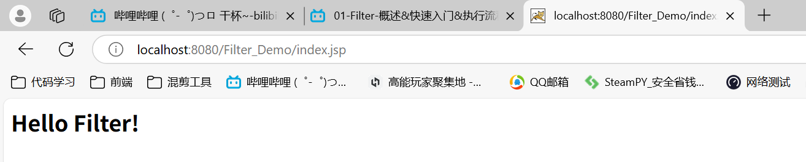

而设置了拦截路径后，访问index.jsp会出现空白页面，即访问被拦截了


利用这个功能可以控制资源访问，如只允许登录后才能访问资源，如果没有登录则拦截并跳回登录页面


#### 3.在doFilter函数中输出拦截信息并放行

既然拦截了下来，要是不放行，就无法访问执行的资源

通过在doFilter函数中调用`filterChain.doFilter(request,response)`来放行，以前是使用`chain.doFilter(request,response)`,现在改成了`filterChain.doFilter`

如下示例

```java
    @Override
    public void doFilter(ServletRequest servletRequest, ServletResponse servletResponse, FilterChain filterChain) throws IOException, ServletException {
        System.out.println("Filter被执行了");
        filterChain.doFilter(servletRequest, servletResponse);
    }
```

放行后就能正常访问资源，并可以在控制台中看到，Filter正常执行了

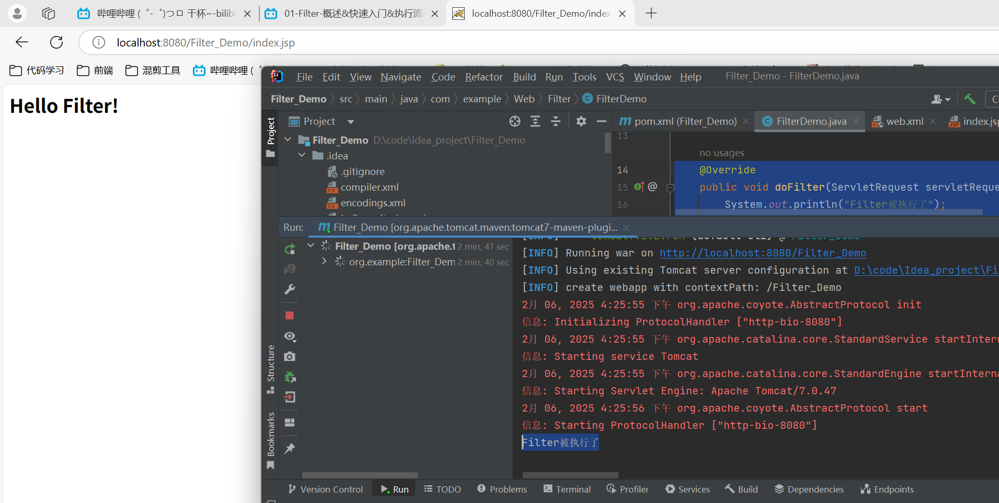


### Filter的执行流程

在doFilter函数中，除了上面提到的放行代码`filterChain.doFilter(request,response)`外，还有放行前的逻辑代码和放行后的逻辑代码

而Filter的执行流程为，先执行放行前的逻辑代码，然后被放行后接着执行对应访问资源的代码，最后再执行放行后的逻辑代码

如下图所示

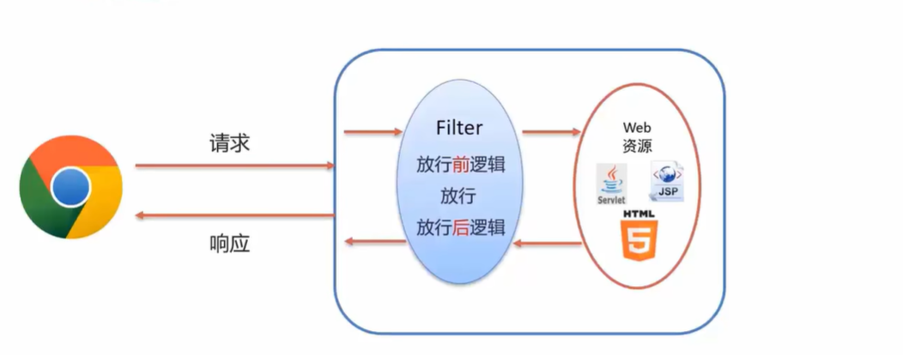


在doFilter函数中添加测试代码

```java
    @Override
    public void doFilter(ServletRequest servletRequest, ServletResponse servletResponse, FilterChain filterChain) throws IOException, ServletException {
        System.out.println("1.放行前的逻辑代码");
        filterChain.doFilter(servletRequest, servletResponse);
        System.out.println("3.放行后的逻辑代码");
    }
```

执行结果如下

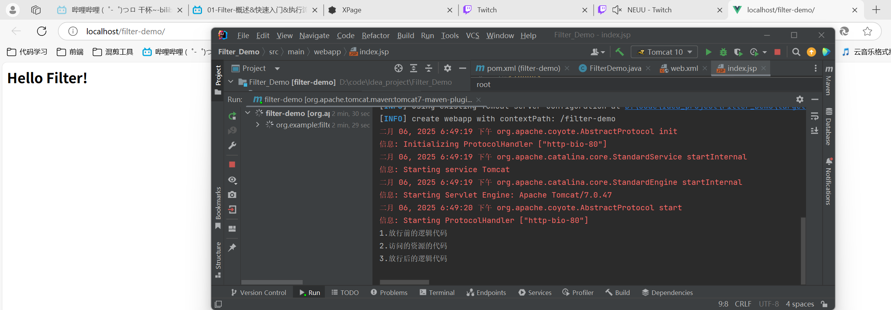


## 02-Filter-拦截路径配置&过滤器链

### Filter拦截路径配置

配置Filter拦截路径有四种方式

#### 1.拦截具体的资源

```java
@WebFilter("/index.jsp")			//资源名为index.jsp的资源会被拦截
```


#### 2.目录拦截

```java
@WebFilter("/user/*")				//user目录下的资源会被全部拦截
```


#### 3.后缀名拦截

```java
@WebFilter("/*.jsp")				//jsp文件会被拦截
```


#### 4.全部拦截

```java
@WebFilter("/*")					//所有文件会被拦截
```


### 过滤器链

一个Web应用可以配置多个过滤器，这多个过滤器被称为过滤器链

其执行流程如下图所示，先执行过滤器1的放行前的逻辑，然后放行，放行后来到过滤器2，就执行过滤器2的放行前逻辑，如果后面还有过滤器就接着执行放行前逻辑，如果没有，就直接执行资源代码，执行完资源代码后，从后往前执行放行后的逻辑，即先执行过滤器2的放行后逻辑再执行过滤器1的放行后逻辑

过滤器的执行顺序默认是按照过滤器的全限定名称来排序的


## 03-Filter-案例-登录验证

### 1.验证用户是否登录

实现验证用户是否登录，如果没有登录，则不允许访问资源，并自动跳转到登录页面，如果登录了，则放行，允许访问资源

在前面jsp的案例中，已经实现了用户登录功能，代码如下

```java
package com.example.web;

import com.example.pojo.User;
import com.example.service.UserService;

import javax.servlet.ServletException;
import javax.servlet.annotation.WebServlet;
import javax.servlet.http.*;
import java.io.IOException;

@WebServlet("/loginServlet")
public class LoginServlet extends HttpServlet {
    private UserService userService = new UserService();
    @Override
    protected void doGet(HttpServletRequest req, HttpServletResponse resp) throws ServletException, IOException {
        String username = req.getParameter("username");
        String password = req.getParameter("password");

        //获取用户信息
        User user = userService.login(username,password);

        if(user != null){
            //登录成功

            //判断用户是否勾选记住用户
            String if_remember = req.getParameter("remember");

            //如果用户勾选了记住用户，则发送cookie
            if("1".equals(if_remember)){
                Cookie usernameCookie = new Cookie("username",username);
                Cookie passwordCookie = new Cookie("password",password);

                usernameCookie.setMaxAge(60*60*24*7);
                passwordCookie.setMaxAge(60*60*24*7);
                resp.addCookie(usernameCookie);
                resp.addCookie(passwordCookie);


            }

            //将用户信息保存到Session中
            HttpSession session = req.getSession();
            session.setAttribute("user",user);

            String contextPath = req.getContextPath();
            System.out.println(contextPath);
            resp.sendRedirect(contextPath+"/selectAllServlet");
        }else {
            //登录失败
            //存储信息到request域中
            req.setAttribute("login_msg","用户名或密码错误");

            //将请求转发到login.jsp
            req.getRequestDispatcher("/login.jsp").forward(req,resp);
        }
    }

    @Override
    protected void doPost(HttpServletRequest req, HttpServletResponse resp) throws ServletException, IOException {
        this.doGet(req, resp);
    }
}

```

用户登录时会将用户登录信息放入Session中，所以接下来要实现的登录验证功能就要从Session中取出用户登录信息，以此来判断用户是否已经登录

登录验证过滤器代码如下

```java
package com.example.web.Filter;


import javax.servlet.*;
import javax.servlet.annotation.*;
import javax.servlet.http.HttpServletRequest;
import javax.servlet.http.HttpSession;
import java.io.IOException;

/**
 * 登录过滤器
 * */
@WebFilter("/*")
public class LoginFilter implements Filter {
    public void init(FilterConfig config) throws ServletException {
    }

    public void destroy() {
    }

    @Override
    public void doFilter(ServletRequest request, ServletResponse response, FilterChain chain) throws ServletException, IOException {
        //1.首先将ServletRequest强转为HttpServletRequest
        HttpServletRequest req = (HttpServletRequest) request;

        //2.然后从请求中获取Session
        HttpSession session = req.getSession();

        //3.获取用户登录信息
        Object user = session.getAttribute("user");

        //4.判断用户是否已经登录
        if(user!=null){
            //用户已经登录，放行
            chain.doFilter(request,response);
        }else {
            //非法请求，跳转到登录页面
            req.setAttribute("login_msg","请登陆后再访问");
            req.getRequestDispatcher("/login.jsp").forward(request,response);
        }
    }
}

```


这样实现后还没完，因为单单这样会出现下面的问题

登录页面的样式不见了，这是因为过滤器也将登录页面的图片、css等资源也拦截了，因此我们要将与登录注册相关的资源全部放行

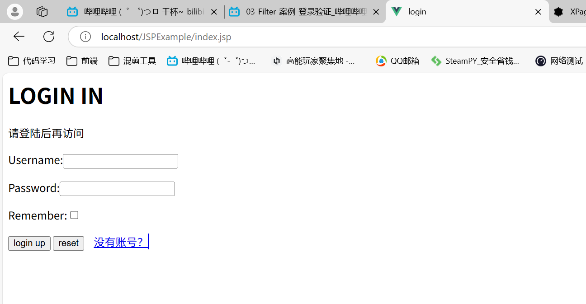


### 2.放行所有登录注册相关资源

在登录过滤器中添加判断登录注册资源路径的代码

```java
        //首先定义所有登录注册资源的访问路径
        String[] urls = {"/login.jsp","/register.jsp","/loginServlet","/registerServlet","/css/","/imgs/"};

        //获取请求路径
        String requestURL = req.getRequestURL().toString();

        //判断访问的路径是否包含登录注册资源的访问路径
        //循环判断
        for(String u :urls){
            if(requestURL.contains(u)){
                //如果访问路径包含登录注册相关资源的路径，则放行
                chain.doFilter(request,response);
                return;
            }
        }
```

这样一来，跳转到登录页面就能正常显示了


## 04-Listener

### Listener概述

Listener是JavaWeb的三大组件之一

Listener是用来监听application、session、request三个对象的创建、销毁以及往其中添加或修改删除属性时自动执行代码的组件

JavaWeb提供了8个监听器，如下图所示

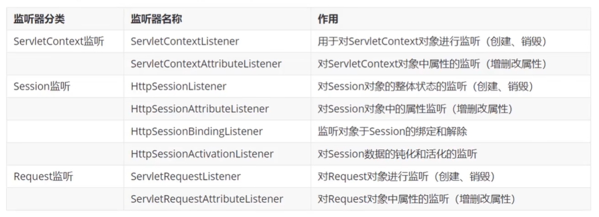

### Listener快速入门

这里以使用ServletContext监听器为例

#### 1.首先创建一个类并实现相关接口

这里要实现ServletContextListener接口


#### 2.为Listener类添加WebListener注解

完整的代码如下

```java
package com.example.web.Listener;

import javax.servlet.ServletContextEvent;
import javax.servlet.ServletContextListener;
import javax.servlet.annotation.WebListener;

@WebListener
public class ListenerDemo implements ServletContextListener {
    @Override
    public void contextInitialized(ServletContextEvent servletContextEvent) {
        //一般用于加载相关资源
        System.out.println("监听器的初始化函数执行了");
    }

    @Override
    public void contextDestroyed(ServletContextEvent servletContextEvent) {

    }
}

```

如下图所示，web应用加载时，监听器就监听到了，并成功执行了初始化函数


# AJAX

## 01-AJAX-概述

AJAX的全称是Asynchronous JavaScript And Xml，以为异步JavaScript和Xml

### AJAX作用

#### 1.与服务器进行数据交换，实现前后端分离

通过AJAX可以向服务器发送请求获取服务器响应的数据，以前不使用AJAX的方式的时候是用JSP来实现的，将数据放在请求域中，再通过JSP的EL表达式来获取数据，但使用JSP方式无法实现前后端分离，因为JSP是服务器管理，需要后端统一编写。而使用AJAX可以解决这个问题

#### 2.实现异步交互

异步交互是指可以在不重新加载整个页面的情况下，与服务器交换数据并更行部分页面。例如：搜索联想，用户名校验等

搜索联想

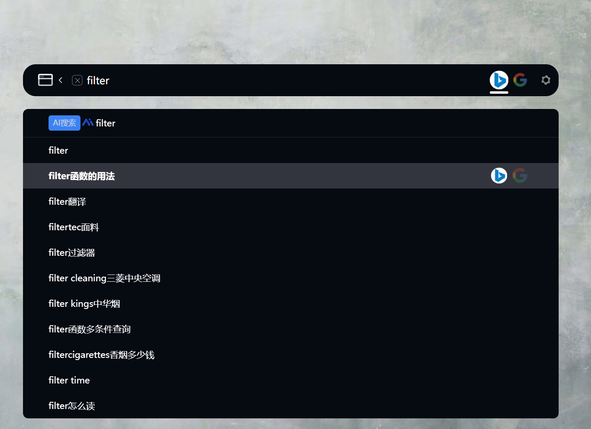


 

## 02-AJAX-快速入门

实现一个AJAX应用分为前端部分和后端部分

### 后端部分编写

后端部分只需要实现一个AjaxServlet类（实际上还是一个继承自HttpServlet的类），并使用response输出字符串

代码如下所示

```java
package com.example.web;

import javax.servlet.ServletException;
import javax.servlet.annotation.WebListener;
import javax.servlet.annotation.WebServlet;
import javax.servlet.http.HttpServlet;
import javax.servlet.http.HttpServletRequest;
import javax.servlet.http.HttpServletResponse;
import java.io.IOException;

@WebServlet("/ajaxServlet")
public class AjaxDemo extends HttpServlet {
    @Override
    protected void doGet(HttpServletRequest req, HttpServletResponse resp) throws ServletException, IOException {

        //响应数据
        resp.getWriter().write("hello Ajax~~");
    }

    @Override
    protected void doPost(HttpServletRequest req, HttpServletResponse resp) throws ServletException, IOException {
        this.doGet(req, resp);
    }
}

```


### 前端部分编写

前端部分编写有三步

#### 1.创建XMLHttpRequest核心对象

XMLHttpRequest是AJAX的核心

```html
<!--创建一个核心对象-->
var xhttp = new XMLHttpRequest;
```


#### 2.向服务器发送请求

向服务器发送数据要使用函数`open`和`send`函数

其中open函数的参数含义如下图所示

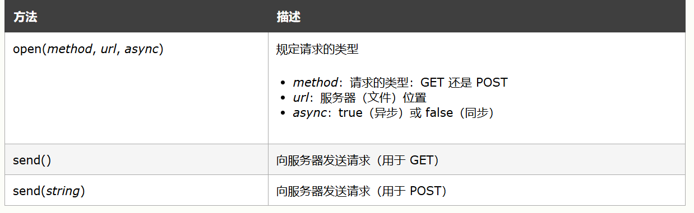

```html
xhttp.open("请求方法","请求路径","异步还是同步");
xhttp.send();
```


#### 3.获取服务器响应的数据

获取服务器响应的数据是通过`XMLHttpRequest`的`onreadystatechange`属性

`onreadystatechange`属性是根据readyState来判断执行时机的，每当readyState发生变化时，就会执行一次`onreadystatechange`属性定义的函数

会涉及到三个属性

`readyState` 属性存留 XMLHttpRequest 的状态。

`onreadystatechange` 属性定义当 readyState 发生变化时执行的函数。

`status` 属性和 `statusText` 属性存有 XMLHttpRequest 对象的状态。

这些属性的状态代码以及含义如下图所示

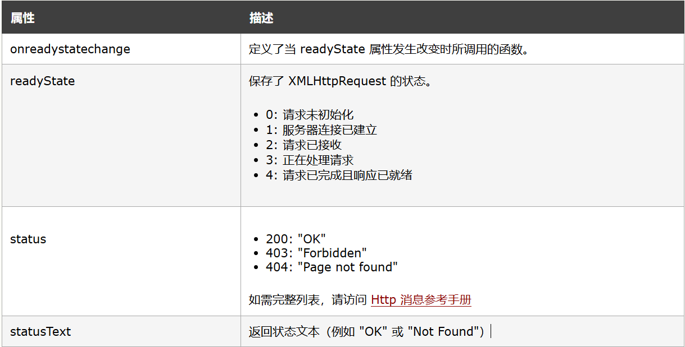

其中当readyState为4，status为200时代表请求已经完成，响应就绪

```html
    xhttp.onreadystatechange = function () {
        if(xhttp.readyState == 4 && xhttp.status == 200){
            alert(xhttp.responseText);
        }
    }
```

前端部分总代码如下

```html
<!DOCTYPE html>
<html lang="en">
<head>
    <meta charset="UTF-8">
    <title>Title</title>
</head>
<body>

</body>
<script>
    //1.创建核心对象
    var xhttp = new XMLHttpRequest();

    //2.向服务器发送请求，第三个参数默认为true，代表异步
    xhttp.open("GET","http://localhost/Ajax_Demo/ajaxServlet");
    xhttp.send();

    //3.获取服务器的数据
    xhttp.onreadystatechange = function () {
        if(xhttp.readyState == 4 && xhttp.status == 200){
            alert(xhttp.responseText);
        }
    }
</script>
</html>
```


## 03-案例-验证用户是否存在

验证注册时用户名是否已经存在，在光标移出输入框时进行验证，如果存在则给出提示，不存在则清除提示消息，这是一个异步请求的案例

实现逻辑为，通过请求将用户名发送给后端服务器，服务器验证完成后将结果通过response给出，前端再使用AJAX来获取后端结果，根据结果来给出不同的提示

### 后端部分

```java
package com.example.web;

import javax.servlet.ServletException;
import javax.servlet.annotation.WebServlet;
import javax.servlet.http.HttpServlet;
import javax.servlet.http.HttpServletRequest;
import javax.servlet.http.HttpServletResponse;
import java.io.IOException;

@WebServlet("/selectUserServlet")
public class SelectUserServlet extends HttpServlet {
    @Override
    protected void doGet(HttpServletRequest req, HttpServletResponse resp) throws ServletException, IOException {
        //1.获取用户名
        String username = req.getParameter("username");

        //2.校验用户名是否存在，这里模拟验证，直接返回假数据
        String flag = "false";

        //3.响应结果
        resp.getWriter().write(flag);
    }

    @Override
    protected void doPost(HttpServletRequest req, HttpServletResponse resp) throws ServletException, IOException {
        this.doGet(req, resp);
    }
}
```


### 前端部分

```html
<script>

    //1.获取对象,一旦光标移出输入框就执行函数
    document.getElementById("username").onblur = function (){
        //2.发送ajax请求
        var xhttp = new XMLHttpRequest();

        xhttp.open("GET","http://localhost/Ajax_Demo/selectUserServlet",true);
        xhttp.send();

        xhttp.onreadystatechange = function () {
            if(this.readyState == 4 && this.status == 200){
                if(xhttp.responseText == "true"){
                    //说明用户名存在，给出提示信息
                    document.getElementById("username_err").style.display = "";
                }else{
                    //说明用户名不存在，允许创建，清除提示信息
                    document.getElementById("username_err").style.display = "none";

                }
            }
        }
    }


</script>
```


## 04-Axios-基本使用&请求方式别名

### Axios的使用

Axios是对AJAX的封装，通过使用Axios就不必写过多的代码就可以简单地使用AJAX

#### 1.引入Axios的js文件

在webapp下新建一个`js`文件夹用于存放js文件

将Axios的js文件放如`js`文件夹

然后引入，引入js文件用如下代码

```html
<script src="js/axios-0.18.0.js"></script>
```


#### 2.通过Axios使用get方法

通过Axios使用get方法的代码示例如下

其中`method`属性就是指请求方法，`url`指请求的地址

```html
<script>
  axios({
    method:"get",
    url:"http://localhost/Ajax_Demo/ajaxServlet?username=zhangsan"
  }).then(function (resp){
    alert(resp.data);
  })
</script>
```


#### 3.通过Axios使用post方法

与get方法基本相同，不同的地方是get方法的参数放在请求路径的后面，而post方法的参数放在`data`属性中

```html
<script>
  axios({
    method:"get",
    url:"http://localhost/Ajax_Demo/ajaxServlet",
    data:"username=zhangsan"  
  }).then(function (resp){
    alert(resp.data);
  })
</script>
```


### Axios请求方式别名

Axios提供了请求方式的别名，通过使用别名可以用更少的代码来发送请求

#### 1.get方法别名

简化的get方法中只需要填写要请求的url地址作为参数即可

```html
<script>
	axios.get("http://localhost/Ajax_Demo/axiosServlet?username=zhangsan").then(function (resp){
      alert(resp.data);
  })
</script>  
```


#### 2.post方法别名

简化的post方法中除了要填写url地址，还要填写请求参数

```html
<script>
  axios.post("http://localhost/Ajax_Demo/axiosServlet","username=zhangsan").then(function (resp){
      alert(resp.data);
  })
</script>
```


## 05-JSON-概述和基本语法

### JSON概述

JSON是JavaScript Object Notation的缩写，以为JavaScript对象表示法

其格式与JavaScript的对象格式非常像，如下图所示

JavaScript对象的键可以不加双引号，但JSON必须要加双引号


### JSON基础语法

语法定义

```html
<script>
   var 变量名={
	"key1":value1,
	"key2":value2,
	....
	}
</script>
```

其中value的值可以是数字、字符串、逻辑值、数组（放在中括号中）、对象（放在花括号中）、null

示例如下

```html
<script>
var json={
	"name":"zhangsan",
	"age":23,
	"addr":["北京","上海","深圳"]
}
</script>
```

可通过`json.key`的形式来访问json对象里的数据

示例如下

```html
json.name			
```


## 06-JSON数据和Java对象转换

JSON数据和java对象的转换可以直接使用fastjson

使用fastjson提供的函数即可完成转换

### 1.导入fastjson包

fastjson包的坐标如下

```xml
    <dependency>
      <groupId>com.alibaba</groupId>
      <artifactId>fastjson</artifactId>
      <version>1.2.62</version>
    </dependency>
```


### 2.Java对象转JSON对象

使用函数`JSON.toJSONString`

示例如下

```java
        //1.Java对象转JSON
        User user = new User();
        user.setId("1");
        user.setUsername("zhangsan");
        user.setPassword("123");
        String json =JSON.toJSONString(user);
        System.out.println(json);
```

转换结果如下

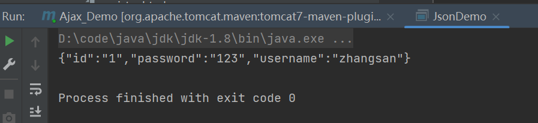

### 3.JSON对象转Java对象

使用函数`JSON.parseObject("JSON字符串",要转换成的对象.class)`

示例如下

```java
        //2.JSON对象转Java对象
        User u = JSON.parseObject(json,User.class);
        System.out.println(u);
```

结果如下，这里注意一下，要先在User对象中定义toString方法，不然打印出来的是User对象的地址，而不是图中的结果


