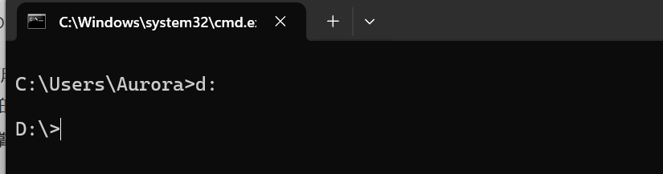

# Java基础知识复习

参考视频：[Java入门基础视频教程，java零基础自学就选黑马程序员Java入门教程（含Java项目和Java真题）_哔哩哔哩_bilibili](https://www.bilibili.com/video/BV1Cv411372m?spm_id_from=333.788.videopod.episodes&vd_source=f3cb3ea986b26c6910b4df6d37acd60d)


# Java入门

## 03、Java入门：JDK的选择安装和下载

jdk的安装直接去Oracle官网下载，这里省略了

### 检查java是否可用以及版本

进入控制台输入命令`java`或`javac`，如果出现以下界面则说明Java安装成功


输入命令`java -version`或`javac -version`检查java版本


### `java`和`javac`的基本作用

`java`和`javac`命令实际上就是执行下图中的程序


其中`javac`是编译工具，用于翻译java程序，将java程序翻译成计算机底层能够识别的语言

`java`是执行工具，用于运行javac翻译后的程序


## 04、Java入门：掌握DOS窗口常见命令

几个命令行窗口常用命令如下

### 1.切换盘符

命令：`盘符字母:`

示例如下

```cmd
C:\Users\Aurora>d:
```



### 2.查看当前路径下的文件

命令：`dir`

示例如下

```cmd
D:\>dir
```


### 3.进入某一级目录

命令：`cd 目录名`

示例如下

```cmd
cd code
```


退回上一级

```cmd
cd ..
```


退回盘符根目录

```cmd
cd \
```


### 4.清屏

命令：`cls`


## 08、Java入门：JDK组成、跨平台原理

### JDK组成

JDK是Java Development Kit的缩写，意为Java开发工具包

JDK由JVM（Java虚拟机，真正运行java程序的地方）、核心类库（java事先提供的程序）和开发工具（java和javac等)组成，其中由JVM和核心类库组成JRE（Java Runtime Environment 即Java运行环境）


### Java程序的运行过程

编写好的Java程序先由javac编译成`.class`文件，再通过`java`命令将`.class`文件放入`JVM`中运行，运行过程中`JVM`会从核心类库中调用相关函数

其中`JVM`分为几个部分，具体见本笔记Java数组部分的 `05、Java数组：数组的内存执行原理`


### Java跨平台原理

Java跨平台指的是"一次编译，处处可用"，编译后的`.class`文件可以在任何平台运行。

原因：

`.class`文件的运行实际上是在`JVM`中运行，在常见的Widows系统中，下载的jdk就已经提供了Windows版本的`JVM`。因此如果要在其他平台上运行，也需要对应平台的`JVM`

如下图所示


## 12、Java入门：IDEA配置、快捷键设置

### 配置IDEA外观

进入设置，搜索appearance，找到Theme即可修改

		


### 设置字体大小

进入设置，搜索font即可修改


### 设置代码背景颜色

进入设置，找到下图所示的页面，想要护眼可以修改背景色为豆沙绿，豆沙绿的rgb是(204,238,200)


### 常用快捷键

#### 1.复制当前行至下一行

`ctrl+D` 


#### 2.删除所在行

`ctrl+Y`或`ctrl+X`


#### 3.格式化代码

`ctrl+alt+L`


#### 4.上下移动当前代码

`alt+shift+上下方向键`


## 14、Java入门：基础语法-注释详解

### 单行注释

以`//`开头，只能注释一行代码

```java
//只能注释一行代码
```


### 多行注释

`/*要注释的内容*/`，可以注释多行

```java
/*
可以注释多行内容
注释
*/
```


### 文档注释

`/**要注释的内容*/`，文档注释与多行注释的区别在于文档注释的内容可以提取到一个程序说明文档里面去

```java
/**
文档注释的内容可以提取到一个说明文档里面去
注释内容
*/
```


### 注释快捷键

#### 1.对选中代码进行单行注释

`ctrl+/`

#### 2.对选中代码进行多行注释

`ctrl+shift+/`


## 15、Java入门：基础语法-字面量详解


## 16、Java入门：基础语法-变量详解

最基本的变量的赋值就不讲了，这里讲一讲变量赋值的原理

### 变量赋值的原理

下面代码变量赋值的原理如下

创建一个变量可以想象为是创建了一个用于存放变量的盒子，所以`int age = 20;`这行代码就是创建一个用于存放`age`数据的盒子

而`age = 21; `这行代码的赋值原理是将盒子里面的数据直接替换为21

Java中的赋值语句是从右往左看的，因此，`age = age + 1;`这行代码的执行原理是先从“盒子”中取出`age`的值，然后加1，最后将相加的结果再放入存放`age`的“盒子”中

```java
int age = 20;			//创建一个变量
age = 21;				//age变为了21
age = age + 1;			//age变为了22
```


## 17、Java入门：基础语法-变量使用时的注意事项

### 变量的注意事项

#### 1.变量必须先声明再使用

```java
int age = 20;					//先声明变量
System.out.println(age);		//再使用变量
```


#### 2.变量只能接收其对应的类型

```java
int age; 				
age = 21;						//int类型变量只能接收整形数据

String s;						
s = "字符串";					//String类型变量只能接收字符串数据
```


#### 3.在同一个`{}`范围内变量的名字不能一致

```java
public static void main (String[] args){
    int age = 2;
    {
        int age =1;		//不在同一个{}范围的变量名可以一致 
    }
    
    int age = 4;		//这行代码会报错，同一个{}范围的变量名不可以一致
}
```

会报类似下图中的错误


#### 4.变量的定义可以不赋初始值，但使用的时候变量一定要有值

```java
int age;						//创建变量时可以不赋初始值
System.out.println(age);		//这行代码会报错，因为此时变量没有值
age = 1;						//为变量赋值
System.out.println(age);		//赋值后的变量才可以正常使用
```


## 18、Java入门：基础语法-关键字、标识符

### 关键字

关键字就是Java语言自己用到的一些词，具有特殊作用，因此我们在创建变量的时候就不能再使用这些词，就像电话号码，110、120等号码就类似与Java关键字，我们的电话号码就不能使用这些。

Java的关键字如下图所示


### 标识符

标识符就是名字，我们创建的类的类名、变量名等都是标识符

### 标识符的要求

1.由数字、字母、下划线、美元符($)等字符组成，甚至用中文来组成标识符也可以，不过很少有人这么干


2.不能由数字开头，且不能是Java关键字，且区分大小写


# Java语法

## 05、Java语法：数据类型

### 基本数据类型

如下图所示


### 注意事项

在Java中，写一个整数是默认为`int`类型，写一个小数默认为`double`类型

因此如下图所示，即使创建的类型是long类型，但数据超出了int类型的范围，就会报错，要解决这个问题就要在数据后面加上字母`L`


加上`L`后不再报错，对于`float`也是一样，小数默认为`double`，要使用`float`的话要在数据后面加上字母`F`


## 06、Java语法：自动类型转换

### 为什么要进行类型转换

因为在开发中存在将不同类型的数据赋给其他类型的变量的情况，如将`byte`类型的数据赋值给`int`类型


### 什么是自动类型转换

将范围小的变量赋值给范围大的变量时，范围小的变量的类型会自动变为范围大的变量类型，不需要我们进行任何操作

```java
byte b = 12;					//byte类型只占一个字节
int i = b;						//int类型占四个字节，因此b可以直接赋值给i，其中已经发生了自动类型转换
```


### 自动类型转换的原理

举个例子，一个`byte`类型的变量记录的数字为12，其底层记录的就是二进制的数字00001100，在`byte`类型转换为`int`类型的时候，由于`int`类型占32位，比`byte`类型长，所以可以直接取出`byte`类型存储的二进制数据00001100放入`int`类型中，而不足32位的只要在左边补上0即可，即转换后`int`类型存储的数据为00000000 00000000 00000000 00001100。


## 07、Java语法：表达式的自动类型转换

在表达式中，小范围的类型会自动转换为大范围的类型后再进行运算

### 注意事项

#### 1.表达式的结果类型是表达式中范围最大的类型

```java
byte b = 1;
int i = 200;
long l = 234702840;
long re1 = b + i + l;				//这个表达式中范围最大的类型是long，因此数据由long类型来接收

int i = 222;
float f = 23432.3323;
double d = 2342424332.34242;
double re2 = i + f + d;				//这个表达式中范围最大的类型是double，因此数据由double类型来接收
```


#### 2.在表达式中btye、short、char是直接转换为int类型来运算的

```java
byte b = 1;
short s = 2;
short re = b + s;					//这行代码是错误代码，虽然short的范围是该表达式中最大的，但由于byte、short在运算时都会转换为int类型，因此最后应该用int类型来接收
int re = b + s;						//这行代码才是正确的
```


## 08、Java语法：强制类型转换

前面讲到的自动类型转换是发生在范围小的数据类型转换为范围大的数据类型，而强制类型转换发生在范围大的数据类型转换为范围小的数据类型

### 强制类型转换语法

```java
要转换的数据类型 变量名 = （要转换的数据类型）被转换的变量;
int i = 20;
byte b = (byte) i;		//int类型强制转换为byte类型
```


### 强制类型转换原理

例如将`int`类型的`i=20`转换为`byte`类型的b，`int`类型占32位，`byte`类型占8位，因此在转换的时，`byte`类型只能存储`int`的8位数据，于是只取出`int`类型的后8位，前面的位数全部舍去。


### 注意事项

大范围转换为小范围可能会导致数据的丢失。


## 09、Java语法：算数运算符、`+`符号做连接符

### 基本算数运算符

基本的算数运算符有加（+）、减（-）、乘（*）、除（/）、取余（%）

加减乘就不讲了，主要讲一下除法需要注意的事项

Java中两个整数的除法结果是整数，原因前面讲了，因为那个表达式的自动类型转换，表达式的结果为表达式中数据范围最大的

```java
int i1 = 4;
int i2 = 2;
int re1 = i1 / i2;						//结果为2

int i3 = 5;
int re2 = i3 / i2;						//结果也为2，如果想要得到2.5，可以看下面的方法

int re3 = 1.0 * i3 / i2;				//结果为2.5，因为此时表达式中范围最大的类型已经变为了double类型
```


### `+`符号做连接符

`+`符号除了用于加法运算，还可以用于字符串的连接，注意是字符串而不是字符，因为字符与数字是可以运算的

```java
System.out.println('a' + 3.14);					//输出结果为100.14
System.out.println("string" + 3);				//输出结果为string3
System.out.println("string" + 3 + 'a');			//输出结果为string3a
System.out.println(3 + 'a' + "string");			//输出结果为100string，因为3和字符a可以先运算，运算结果为100，然后再与后面的字符串连接
```


## 10、Java语法：自增、自减运算符

自增自减的用法就不说了，主要说一下其注意事项

### 自增自减注意事项

#### 1.自增自减不能用在字面量上

字面量就是直接写出来的数据，如`1、2、"字符串"、'a'`等

```java
1++;				//这行代码是错误的，自增自减运算符不能用在字面量上
```


#### 2.自增自减的运算顺序

自增自减放在变量的前面和后面区别非常大

```java
int a = 1;
int re1 = ++a;				//运算符在前面，先进行自增运算，再赋值，所以结果为2

int b =1;
int re2 = b++;				//运算符在后面，先进行赋值运算，再进行自增运算，所以结果为1
```


## 12、Java语法：赋值运算符

要注意的点就是扩展赋值运算符的底层存在一个强制类型转换的操作


## 14、Java语法：逻辑运算符

基本的逻辑运算符如下图所示


### 注意事项

之前用逻辑运算符一直是这样用的

```java
true && false;
true || false;
```

现在回来复习发现中间那个符号只写一个也可以

```java
true & false;
true | false;
```

单符号和双符号的区别如下


双符号的称为短路与、短路或，其性能或好一点，因此实际应用中，一般使用双符号的形式


还有一个用的比较少的，逻辑异或，这个就只能写一个符号

```java
true ^ false;						//这是正确的
true ^^ false;						//这是错误的，只能写一个逻辑异或符号
```


## 15、Java语法：三元运算符、运算符优先级

### 三元运算符

三元运算符的执行流程如下

首先计算条件表达式，如果条件表达式的值为true，则返回值1，如果条件表达式的值为false，则返回值2

```java
条件表达式 ? 值1 : 值2; 

double score = 98.5;
String re = score >=60 ? "成绩合格" : "成绩不合格";				//返回结果为 成绩合格
```


### 运算符优先级

运算符优先级如下图所示


这里就讲一讲`&&`与`||`的优先级，`&&`的优先级比`||`高

```java
System.out.println(3 < 10 || 10 < 100 && 100 > 1000);           //先执行&&，结果为true
System.out.println((3 < 10 || 10 < 100) && 100 > 1000);           //先执行||，结果为false
```


# 流程控制

## 02、流程控制：分支控制：if、switch、switch穿透性

`if`和`switch`的语法就不说了，这里简单说一下`if`和`switch`的区别

`switch`相对于`if`来说比较局限，`switch`主要用于完成值的匹配判断，而`if`还可以用于条件的区间判断，因此`switch`能做到的`if`也能做到，而`if`能做到的`switch`不一定能做到

### `if`语法

```java
if(判断表达式){
    结果为true执行的代码
}else {
    结果为false执行的代码
}
```


### `switch`语法

```java
switch(表达式){
        case 值1:
        {
            要执行的代码;
            break;
        }
        case 值2:
        {
            要执行的代码;
        	break;
        }
        ......
        case 值n:{
            要执行的代码;
            break;
        }
        default :{
            
        }
        	
}
```


### `switch`注意事项

#### 1.switch支持的数据类型

switch的表达式类型只支持`byte` `short` `int` `char` `枚举(jdk5开始支持)` `String(jdk7开始支持)`类型，不支持`long` `double` `float`类型

如下图所示，如果使用long类型会报错


至于为什么不支持小数类型，原因如下

Java中，小数类型的计算是有精度的，可能会导致匹配不准确，如下面示例所示

```java
        double d1 = 0.1;
        double d2 = 0.2;
        double d3 = d1 + d2;
        System.out.println(d3);					//输出为0.30000000000000004，而不是0.3
```


#### 2.case给出的值不允许重复，且只能是字面量，不能是变量


#### 3.switch穿透

如果使用switch的时候没有用break，就会出现穿透现象

例如这段代码

```java
        int l = 2;
        switch (l) {
            case 1: {
                System.out.println("数字为1");
                break;
            }
            case 2:{
                System.out.println("数字为2");
                //break;							//这里省略break，会出现穿透
            }
            case 3:{
                System.out.println("数字为3");
                break;
            }
            default:{
                System.out.println("数字为其他");
            }
        }
```

运行结果如下图所示


原因就是值为2时的break语句被省略了，执行完代码时不会跳出switch，而是继续向下执行，它不仅继续执行还不进行任何判断，这就导致后面其他情况的语句都会被全部执行，直到遇见break


## 07、流程控制：break、continue

### 跳转关键字

#### 1.break

跳出并结束当前所在循环的执行


#### 2.continue

用于跳出循环的当次执行，直接进入循环的下一次执行，其只能再循环中使用


# Java数组

## 02、Java数组：静态初始化数组，数组的访问

### 静态初始化数组

静态初始化数组指在创建数组的时候就给出数组的所有值

语法如下：

```java
数据类型[] 数组名 = new 数据类型[]{元素1,元素2,元素3,....,元素n};
int[] ages = new int[]{13,14,15};
```

或

```java
数据类型 数组名[] = new 数据类型[]{元素1,元素2,元素3,....,元素n};
```


简化格式如下：

```java
数据类型[] 数组名 = {元素1,元素2,元素3,....,元素n};
int[] ages = {13,14,15};
```

或

```java
数据类型 数组名[] = {元素1,元素2,元素3,....,元素n};
```


### 数组在计算机中的基本原理

数组在计算机中的存储原理如下

在创建数组是，计算机会为数组名开辟一个空间，用于存放第一个元素的地址，接着会开辟一块内存空间，用于按顺序存放数组的数据


### 引用数据类型

引用数组类型指的是存储一个对象地址的变量，数组就是一个引用数据类型，因为数组变量存储的就是地址


### 数组的访问

#### 数组访问的语法

```java
数组变量名[索引]
int[] ages = {13,14,15};
ages[1]=ages[0]+ages[2];					//访问并修改数组元素
```


#### 获取数组的长度


```java
变量名.length
int[] ages = {13,14,15};
int len = ages.length;						//len的结果为3
```


## 03、Java数组：数组遍历，案例练习

数组怎么遍历就不讲了

### 数组遍历的快捷键

在IDEA中，遍历数组可以使用快捷键来快速编写代码

快捷键为 `数组名.fori`，如下图所示


## 04、Java数组：动态初始化数组，案例练习

### 动态初始化数组

#### 1.定义

动态初始化数组指的是定义数组时不存入具体的数据，只确定数组的长度和数据类型

```java
数据类型[] 数组名 = new 数据类型[数组长度];
int[] arr = new int[3];
```


#### 2.注意事项

a.动态初始化数组和静态初始化数组不能混合使用，如下所示


b.使用动态初始化数组时，如果暂时还没有为数组赋值，那么数组里面元素的值默认为0(int类型)，其他类型的默认值如下图所示


## 05、Java数组：数组的内存执行原理

### Java内存分配

前面讲了，一个Java程序的运行，是先将Java程序编译成`.class`文件，然后将`.class`文件放入JVM中运行。

JVM是运行在内存中的虚拟机，那么JVM的内存分配是怎样的呢

JVM将内存分为5个部分，分别是方法区、栈、堆、本地方法栈、程序计数器

这里主要讲解前三个，它们的作用如下

#### 1.方法区

Java编译后的`.class`文件(字节码文件)要运行的时候就会先加载到这个区域


#### 2.栈内存

`.class`文件中可能存在多个方法，如`main`方法，在运行这些方法的时候，这些方法会进入栈内存，并且变量也会存放在这里


#### 3.堆内存

这个地方用于存放new出来的数据，new出来的数据会在这里开辟空间并产生地址


下面是一个具体的程序的内存使用情况


# Java方法

## 02、Java方法：方法定义的其他形式，常见问题

### 方法使用时的常见问题

常见问题如下图所示，第一点注意一下，有点忘记这个了


## 04、Java方法：方法在计算机中的执行

### 方法的执行原理

main方法调用其他方法的时候底层到底发生了什么，为什么其他方法执行完后程序又能回到main方法继续执行后面的代码？

前面讲过，Java程序是在JVM中运行的，而JVM将内存分为5个部分，而其中三个最为主要：方法区、栈、堆

而方法的执行就是在栈中执行的，栈的特点是先进后出、后进先出，由于这个特点，一个main方法在执行的时候，main方法就会先进入栈中，在执行的过程中，如果main方法需要调用其他方法，就接着把其他方法放入栈中，这时在栈顶的方法就是最近才进来的方法，在栈顶的方法会先执行，当栈顶的方法执行完后会弹出，继续执行下面的函数，所以当main函数调用的其他方法执行完后，程序最后都会回到位于栈底的main函数。

通过这样一种方式还能够及时清除执行完的方法所占的内存


## 05、Java方法：方法参数传递

### 值传递

Java参数传递的机制是值传递，值传递指的是在传递实参给方法的形参时传递的并不是实参本身，而是复制一个实参的赋给给形参

 ```java
     public static void main(String[] args) {
         int a = 3;
         print(a);
         System.out.println("main: " + a);                   //打印结果还是为3，尽管前面调用的方法将a改变了，但改变的只是传过去的副本，main方法中的a本身根本没变
     }
 
     public static void print(int a) {
         System.out.println("print1: " + a);                 //打印结果为3
         a = 20;
         System.out.println("print2: " + a);                 //打印结果为20
     }
 ```


### 引用类型的参数传递

上面讲的值传递的例子是基本类型的数据传递，接下来看引用类型的参数传递

```java
    public static void main(String[] args) {
        int[] arr = {13,31,20};
        print(arr);
        System.out.println("main:"+arr[1]);                     //结果为300，因为传递的是数组的地址，因此print函数对数组的改变会直接影响到这里的数组结果，因为指向的都是同一个数组

    }

    public static void print(int[] arr){
        System.out.println("print1:"+arr[1]);                   //结果为31
        arr[1]=300;
        System.out.println("print2:"+arr[1]);                   //结果为300
    }
```


## 07、Java方法：方法重载，return关键字

### 方法重载

#### 1.概述

一个类中，出现多个方法名字相同而参数列表不同的方法，这些方法称为方法重载


#### 2.注意事项


这里列举几个之前没那么注意的

首先第一点，只要方法名称相同就是方法重载，下面是三个重载的方法

```java
    public int function(int a) {			
        return a;
    }

    int function() {				//修饰符不同，但方法名相同且形参列表不同，是方法重载
        return 1;
    }

    public double function(double a) {		//返回类型不同，但方法名相同且形参列表不同，是方法重载
        return a;
    }
```


第二点，怎样才算形参列表不同，没复习前不太了解顺序不同和不关心形参的名称是什么意思，现在可以看看下面的例子

```java
    public int function(int a, double b) {
        return a;
    }

	//形参类型出现的顺序不一致，所以形参列表不同但方法名相同，是方法重载
    public int function(double a, int b) {	
        return b;
    }
	
	//虽然形参的名字不一样，看起来形参列表也是不同的，但这个不是方法重载，因为重载不关心名称，名称是什么不管，只看类型
	//这里第一个出现的是int类型，第二个出现的是double类型，因此与前面的方法形参列表是一致的，因此不属于方法重载
    public int function(int a1, double b1){
        return a1;
    }
```


# 面向对象基础

## 02、面向对象基础：对象执行原理，类与对象注意事项

### 对象执行原理

假如有如下学生对象

```java
public class Student {
    String name;				//学生姓名
    double chinese;				//学生的语文成绩
    double math;				//学生的数学成绩
    public void printTotalScore(){
        //打印学生总成绩的代码
    }
}
```

下面是创建该对象的代码

```java
public class Test {
    public static void main (String[] args){
        Student s1 = new Student();					//这行代码用于创建学生对象
    }
}
```

那么在执行上述创建学生对象的代码时计算机底层到底发生了什么呢

首先，在执行到`Student s1 = new Student();`这行代码时，程序首先遇见的是`Student`这个类名，这时计算机会将`Student`这个类编译后的`.class`文件放入方法区。接着，再下一个就是`s1`这个变量名，这时计算机就会在栈中的main方法中创建一个`s1`的变量区域，用于存放对象的地址。最后执行到`new Student()`的时候，计算机便会根据`Student`这个类的具体要求在堆内存中创建相应的空间区域，比如这里就会创建`name`,`chinese`,`math`三个空间，创建好后就会将这块对象区域的地址给到前面在栈中创建的`s1`，并且除了创建对象要求的变量外，还会再开辟一个空间用于存放`Student`这个对象的`.class`文件的地址

下图是一个具体例子


### 类和对象注意事项

如下图所示，主要注意一下第四点，同一个代码文件中可以写多个class类，但只能一个用public修饰


## 03、面向对象基础：this关键字

### this关键字概述

this就是一个变量，可以用在对象的成员方法中，来拿的当前的对象


### this关键字执行原理

假如有如下类

```java
public class Student {
    public void printThis(){
        System.out.println(this);
    }
}
```

类的方法会统一和类的`.class`文件一起放在方法区，当创建出来的对象要调用方法的时候，调用的就是放在方法区里面的对象，每一个创建出来的对象都可以调用这放在方法区里的同一个方法。

而就在每一个对象执行方法的时候，对象会将自己的地址传给所调用的方法，因此在方法中使用`this`就能获取到当前的对象


## 04、面向对象基础：构造器

### 构造器的写法

构造器是一个方法名与类名一致，且不具有返回值类型的一个特殊方法，下面是一个构造器的示例

```java
public class Student {
    
    public Student(){
        //构造器方法
    }
    
}

```

构造器和普通的方法一样，也可以重载，只要参数列表不一样

```java
public class Student {

    public Student(){
        //构造器方法，无参构造器
    }

    public Student(int a,double b){
        //重载的构造器方法，有参构造器
    }
}
```


### 构造器的作用

对象在被创建时会自动执行构造器，如

```java
Student s1 = new Student();					//这行代码会执行上面的无参构造器

Student s2 = new Student(1,13.1);			//这行代码会执行上面的有参构造器
```

一般使用构造器来为对象赋初始值

```java
//对于创建对象有两种赋值的方法
//1.先创建对象再一个个赋值
Student s1 = new Student();
s1.name = "张三";
s1.score = 100;

//2.通过使用有参构造器来为对象赋值
Student s2 = new Student("李四",98);				//会调用有参构造器

//假设有参构造器如下
public Student(String name ,double score){
    this.name = name;							//在有参构造器里面为对象赋值
    this.score = score;
}
```


### 构造器的注意事项

1.类在设计时如果没有写构造器，Java会自动创建一个无参构造器

2.一旦定义了一个构造器，Java就不会再为我们自动创建一个无参构造器了，因此如果定义了有参构造器，最好连同无参构造器一起定义好


## 05、面向对象基础：封装，实体JavaBean

### Java对象的三大特征

Java对象的三大特征是封装、继承、多态。

封装就是三大特征中的其中一个


### 什么是封装

封装就是指将要处理的数据以及处理这些数据的方法设计到一个对象中去


### 封装的合理暴露、合理隐藏

例如有如下对象

```java
public class Student {
    public String name;				
    public double score;			
}
```

该对象的两个属性都是共有的，因此外界在使用这个对象时可以随意修改访问这些对象，这就会导致一些风险，因此封装的同时需要做到合理暴露、合理隐藏。

那怎样才算合理暴露、合理隐藏呢？答案是将属性设置为私有的，再设计一个公有的方法来访问这个属性，外界仅可以通过这个方法来访问修改属性，如下所示

```java
public class Student {
    private String name;			//将属性设置为私有，仅对内可访问，对外不可访问				
    private double score;			

	public void setName(String name){
        this.name = name;			//通过提供的方法来访问属性
    }
    
    public String getName(){
        return this.name;
    }
}
```

我原来觉得这样做根本没有什么意义，因为通过这个方法不一样可以随便访问修改属性吗。实则不然，因为我们可以在提供给外界的方法中进行一些额外的校验操作，如下

```java
public class Student {
    private String name;			//将属性设置为私有，仅对内可访问，对外不可访问				
    private double score;			

    public void setScore(double score){
        if(0<=score&&socre<=100){	//进行额外的校验操作，防止非法数据
	        this.score = score;    
        }else {
            return;					
        }
        			
    }
    
    public String getScore(){
        return this.Score;
    }
}
```

这个例子中对Score进行了额外的校验，这样可以防止一些非法数据，所以通过这种方法就可以防止外界对属性的随意访问修改，这样就做到了合理暴露、合理隐藏


### 什么是实体类

实体类是一种特殊的类，其满足下面的条件

1.这个类的所有成员变量都要私有，且都对外提供相应的get、set方法

2.必须提供一个无参构造器

3.实体类除了提供get、set方法外不再提供其他方法

基于这三点，实体类的作用就非常简单，就是单纯地用于存储相应地数据，并提供访问这些数据地方法


### 实体类的应用场景

在现实业务中，常常将对数据的存储和操作分开，实体类就是用于数据的存储，因此对数据的操作需要另外创建一个类，下面是一个例子

首先是Student实体类

```java
public class Student {
    private String name;
    private double score;
    
    public Student(){
        //无参构造器方法
    }

    public String getName() {
        return name;
    }

    public void setName(String name) {
        this.name = name;
    }

    public double getScore() {
        return score;
    }

    public void setScore(double score) {
        this.score = score;
    }
}
```

然后是Student操作类

```java
public class StudentOperator {
    //操作学生类的类
    private Student student;

    public StudentOperator() {

    }

    public StudentOperator(Student student) {
        //通过有参构造函数将要操作的对象传进来
        this.student = student;
    }

    //定义操作方法
    public void printScore(){
        System.out.println(student.getName()+"的成绩为："+student.getScore());
    }
}
```

接着就是使用学生操作类来操作学生对象

```java
public class Test3 {
    public static void main(String[] args) {
        //创建学生实体对象
        Student student = new Student();
        student.setName("张三");
        student.setScore(100);

        //将学生实体对象传给学生操作类
        StudentOperator studentOperator = new StudentOperator(student);

        //使用学生操作类来对学生进行操作
        studentOperator.printScore();
    }
}
```

操作结果为


# 常用API

## 01、常用API：课程介绍、包

### 什么是包

在Java中，包用于分门别类地管理不同程序，通过建包，我们能更好地管理和维护项目


### 包的语法

在IDEA中开发时，要求我们先建包后写程序，建包的语法如下

```java
package 包的位置;

package com.example.project;
```


在IDEA中，我们创建类的时候IDEA会自动为我们写好创建包的代码


### 调用包的注意事项


前三点比较好理解，最后一点举个例子，如下图，这里在两个不同的包下建立了两个类名一样的类


当我要同时使用这两个类的时候，只能导入其中一个包，剩下的另一个就必须带上包名，如下图


## 02、常用API：String，API

### 创建String对象的方法

#### 1.直接将字符串给String对象

```java
String s = "字符串";
```

这种方法也最常用


#### 2.使用String类的构造方法

String提供了多个构造方法

##### 1)无参构造方法

```java
String s = new String();
```

使用该方法创建出来的String对象默认值为空字符串`""`


##### 2)构造方法参数为字符数组

```java
char[] chars = {'a','b','c'};
String s = new String(chars);				//abc	
```

这种方法会自动将字符数组拼接，然后再给到String对象


##### 3)构造方法参数为字符串

```java
String s = new String("字符串");
```


##### 4)构造方法参数为字节数组

```java
byte[] bytes = {97,98,99};
String s = new String(bytes);				//abc
```

这种方法会将字节自动转化为所对应的字符然后拼接在一起后再给到String对象


### String的常用方法

#### 1.获取字符串长度

```java
String s = "abc";
//获取字符串的长度
System.out.println(s.length());				//结果为3
```


#### 2.获取字符串中某个索引位置的字符

```java
String s = "abc";
System.out.println(s.charAt(1));			//结果为b
```


#### 3.将字符串转换为字符数组

```java
String s = "abc";
char[] chars = s.toCharArray();
System.out.println(chars[0]);				//结果为a
System.out.println(chars);					//结果为abc
```


#### 4.判断字符串是否一致

这里要注意的是，字符串的判断要使用`equals`方法，不能使用`==`，因为String类型是引用数据类型，`==`判断的是它们的地址是否一致

```java
String s1 = new String("aaa");
String s2 = new String("aaa");
System.out.println(s1 == s2);					//结果为false，这里比较的是地址
System.out.println(s1.equals(s2));				//结果为true，这里才是判断具体字符串是否一致
```

还有一点要注意的是，不通过new方式创建出的字符串如果是相同的，那么它们的地址也是相同的。

```java
String s3 = "bbb";
String s4 = "bbb";
System.out.println(s3 == s4);					//结果为true，因为s3，s4的地址是一样的
```

s3在创建的时候，计算机会开辟一块空间用于存放字符串"bbb"，然后将这块空间的地址传给s3。接着s4创建的时候，Java发现s4创建的字符串也是"bbb"，它发现内存中已经有一个字符串"bbb"了，因此就不会再开辟空间，而是就将原来的"bbb"这个字符串的地址给s4，因此s3和s4的地址是一样的。


#### 5.忽略大小写比较字符串

```java
String s5 = "aBc";
String s6 = "AbC";
System.out.println(s5.equalsIgnoreCase(s6));	//结果为true
```


#### 6.截取字符串

##### 1)指定截取的起始索引

```java
substring(int begin, ing end);				//这个方法的索引是包前不包后的
String s7 = "java是最好的编程语言之一";
String rs = s7.substring(0,8);
System.out.println(rs);							//结果为"java是最好的"
```


##### 2)指定截取的开始索引

该方法会截取开始索引到字符串结束的所有字符

```java
substring(int begin);							//这个方法会截取包括开始索引后面的所有字符
String s7 = "java是最好的编程语言之一";
String rs2 = s7.substring(5);
System.out.println(rs2);						//结果为"最好的编程语言之一"
```


#### 7.将字符串中某个内容替换

```java
replace(String "要替换的字符串",String "要替换成什么字符串");
String s8 = "这是个垃圾游戏，简直侮辱了垃圾这个词";
String rs3 = s8.replace("垃圾", "**");
System.out.println(rs3);				
```


#### 8.判断字符串是否包含某个关键字

```java
contains("关键字");							//精准匹配，返回结果为true或者false
String s9 = "我爱Java";
System.out.println(s9.contains("Java"));		//结果为true
System.out.println(s9.contains("java"));		//结果为false，精准匹配，不忽略大小写
System.out.println(s9.contains("java1"));		//结果为false
```


#### 9.判断字符串是否以某个字符串开头

```java
startsWith("某个字符串");
String s10 = "张三丰";
System.out.println(s10.startsWith("张"));			 //true
System.out.println(s10.startsWith("张三"));			//true
System.out.println(s10.startsWith("张三1"));			//false
```


#### 10.将字符串根据某个字符串分割

该方法根据某个字符串来分割字符串，并返回一个字符串数组

```java
split("分隔符");
String s11 = "c++,python,java,c,c#,html";
String[] strings = s11.split(",");
for (int i = 0; i < strings.length; i++) {
    System.out.println(strings[i]);
}
```


## 03、常用API：String的注意事项

### 1.String的对象是不可变字符串对象

只要是以`"..."`这种形式写出来的字符串对象会在堆内存中的字符常量池中存储，且相同内容的字符串只会存储一份

因此，如果创建同样的字符串，就会发现两个变量的地址是一样的

```java
String s1 = "aaa";
String s2 = "aaa";
System.out.println(s1==s2);				//结果为true，即s1和s2地址一致
```


如下代码所示

```java
String s1 = "java";
s1 +="c++";
s1 +="python";
```

第一行代码会创建一个`"java"`String对象放在堆内存的常量池中，运行到第二行代码时又会创建一个`"c++"`String对象放在堆内存的常量池中，然后再将java与c++相加的到`"javac++"`再放入堆内存中，然后再把存放"javac++"的内存空间的地址给到s1。运行到第三行再执行上面的操作


### 2.通过new创建对象的内存情况

通过new创建String，每次创建都会在堆内存中开辟新的空间，所以通过new创建的String对象，即使字符串一样，地址也不一样

```java
String s1 = new String("bbb");
String s2 = new String("bbb");
System.out.println(s1==s2);					//结果为false，因为s1与s2的地址不一致
```


### 面试案例（我答错了）

#### 案例1

首先执行第一行代码，第一行代码创建了两个对象，我答的是一个。两个，其中一个是`"..."`双引号形式创建的，另一个是new出来的。

然后第二行代码创建了0个对象，我答的是一个。之所以是0个，是因为前面已经通过`"..."`的形式创建了一个"abc"对象，这个对象已经放在常量池了，第二行代码再创建时就之间用放在常量池里的对象就行了，所以就没有再创建对象。假如没有第一行代码就是创建了一个对象


#### 案例2

下图中代码的正确打印结果应该为false，我却认为是true。分析一下，首先要知道的是，通过运算而创建的字符串会单独开辟一个空间，而不是放在常量池里的，因此s3会单独开辟一个空间而不是和s1共用常量池里面的同一个"abc"


#### 案例3

更想不到的来了，下图中的答案是true而不是false，为什么呢？上面不是说通过运算得到的字符串会单独开辟一个空间吗？

哎，这里是因为java有一个编译优化机制，程序在编译`"a"+"b"+"c"`的时候会自动将其转化为`"abc"`，这样一转化不就往常量池里面已经存在的`"abc"`撞上了吗？所以常量池里的`"abc"`的地址也会赋给s2，所以s1和s2的地址是一致的。哎，服了


我们来反编译看一下就知道了

就下图这个程序


将编译后的文件用IDEA打开再看一下，发现确实变了


## 05、常用API：ArrayList概述，使用

### 什么是集合

集合是一种容器，用于存储数据，类似于数组。

那么既然有了数组这个东西来存储数据，为什么还要设计一个集合呢？原因是数组能存储的数据的数量在数组被定义的时候就已经固定了，但是在开发中经常会有添加新的数据的要求，如果用数组就要重新开辟一个更大空间的数组，然后把原来数组的数据复制给新的数组，非常麻烦。而集合可以随意地增加新的数据，更加方便


集合最显著的特点就是集合的大小可变，这是数组不能做到的


### ArrayList的创建

创建一个ArrayList对象的语法如下，如果没有指定集合的类型，那么集合可以放入任何类型的数据

```java
        ArrayList arrayList = new ArrayList();			//不指定集合数据类型的创建方法
        arrayList.add("字符串");
        arrayList.add(123);
        arrayList.add('a');
        arrayList.add(21.2);
        System.out.println(arrayList);
```


但是，开发中一般都会指定集合的数据类型，用于约束集合的数据

```java
ArrayList<要指定的数据类型> 集合名 = new ArrayList<>();
ArrayList<String> arrayList1 = new ArrayList<>();
```


### ArrayList常用方法

#### 1.添加数据方法

##### 1)将数据添加到集合末尾

add方法用于向集合中添加数据

```java
        public boolean add(要添加的数据)							//方法语法，会返回boolean值，添加成功返回true
		ArrayList<String> arrayList1 = new ArrayList<>();
        arrayList1.add("字符串");
        arrayList1.add("abc");
        arrayList1.add("汉字");
```


##### 2)将数据插入到集合指定位置

```java
		public void add(索引,要插入的数据);					//方法语法，注意这是插入数据，不是替换数据
		arrayList1.add(1,"添加的数据");
```


#### 2.获取指定索引的元素

get方法用于获取指定索引的元素

```java
	public E get(int index);					//方法语法
	arrayList1.get(1);					
```


#### 3.获取集合的大小

```java
	public int size();					//方法语法，返回集合的长度
	int len = arrayList.size();				
```


#### 4.删除元素

##### 1)删除指定索引的元素

```java
	public E remove(int index);			//方法语法，返回被删除的那个元素
```


##### 2)删除指定的元素

这个与上面删除指定索引的元素的区别在于，这个是根据元素内容来删除，上面那个是根据元素索引来删除，如果集合中存在多个指定的元素，会默认删除第一次出现的元素

```java
	public boolean remove(Object o);	//方法语法，返回是否删除成功.
```


#### 5.修改指定索引的元素

set方法用于修改指定索引的元素，并返回被修改的元素

```java
	public E set(int index,E element);		//方法语法，返回被修改的元素
```


# 面向对象高级一

## 02、面向对象高级一：static修饰成员变量、类变量应用场景

### static修饰符

static以为静态，可以类的成员变量和成员方法。

#### 1.static修饰成员变量

没被static修饰的变量称为实例变量

被static修饰的变量称为类变量，类变量属于类，不属于创建出来的对象，在计算机中只有一份，会被类的全部对象共享。

```java
public class Student {
    static String name;						//被static修饰，属于类变量
	public double score;					//没被static修饰，是普通的成员变量 
}
```

类变量的访问是通过`类名.变量名`的方式来访问的，有区别于类的普通成员变量的访问方式`对象名.变量名`

```java
        Student.name = "张三";				//访问类变量
        System.out.println(Student.name);		

        Student student = new Student();	
        student.score = 99.1;					//访问成员变量，要先创建一个对象
        System.out.println(student.score);		
```

类变量的访问也可以通过`对象名.变量名`的方式访问，但不推荐这么做


#### 2.类变量的执行原理

当一个类有类变量的时候，计算机会将类文件加载到方法区内存中，同时会把类的类变量加载一份到堆内存中。


#### 3.类变量的应用场景

在开发中，如果某个数据只需要一份，且希望能够被共享，则该数据可以定义成类变量

如，要求User类能够记住自己创建了多少个对象

User类

```java
public class User {
    public static int count;


    public User(){                  //通过构造方法来记录对象的个数
        User.count++;
    }
}
```

主程序

```java
        User user1 = new User();
        User user2 = new User();
        User user3 = new User();
        System.out.println(User.count);			//输出结果为3
```


#### 4.static修饰方法

static也可以用来修饰方法，没被static修饰的方法称为实例方法，被static修饰的方法称为类方法，与类变量类似，类方法属于类，是所有对象共享的方法。

类方法是以`类名.方法名`的方式来访问的，有区别与实例方法，实例方法是通过`对象名.方法名`的方式来访问的。

类方法也可以通过`对象名.方法名`的方式来访问，不过不推荐这样做

```java
public class Student {
    static String name;
    public double score;

    public static void printHelloWorld(){               //类方法的定义
        System.out.println("类方法被访问了");
        System.out.println("Hello World~~");
    }

    public void printPass(){                            //实例方法，只能建立对象来访问
        System.out.println(score >= 60 ? "成绩及格" : "成绩不及格");
    }
}
```

访问类方法

```java
Student.printHelloWorld();				
```


#### 5.搞懂main方法

前面经常能看见类的main方法

```java
public class Test {
    public static void main(String[] args) {
        System.out.println("HelloWorld");
    }
}
```

现在学了static修饰符的知识，就能够理解main方法了

main方法就是类方法，当我们执行main方法的时候，Java虚拟机会直接通过`类名.main`来执行，这里就是直接执行`Test.main`


## 04、面向对象高级一：static修饰方法类的应用场景-工具类

工具类的所有方法都是类方法，利用工具类来实现需求可以减少代码重复量。

下面设计一个生成验证码的工具类

```java
import java.util.Random;

public class CreateCode {

    private CreateCode(){
        //将构造方法私有化，防止创建工具类的对象
    }

    public static String createCode(int n){         //生成n为验证码
        String code = "";
        String s = "abcdefghijklmnopqrstuvwxyz";    //从这个序列中生成验证码
        Random random = new Random();
        for (int i = 0; i < n; i++) {
            int index;
            index = random.nextInt(s.length());
            code+=s.charAt(index);
        }
        return code;
    }
}
```

使用这个工具类

```java
public class Test {
    public static void main(String[] args) {
        System.out.println(CreateCode.createCode(4));		//随机生成4位验证码
        System.out.println(CreateCode.createCode(5));		//随机生成5位验证码	

    }
}
```


## 05、面向对象高级一：static注意事项

### static注意事项

如下图所示

其中第一点类的成员包括类变量和类方法


多注意一下第三点


## 06、面向对象高级一：static应用-代码块

### 静态代码块

static修饰的代码块被称为静态代码块，静态代码块在类加载的时候执行一次，由于类只会加载一次，因此静态代码块也只会执行一次。

静态代码块的格式如下

```java
static {
    //静态代码块的代码
}
```


静态代码块主要用于给类的类变量赋初始值

```java
public class Student {
    static String name;

    //静态代码块
    static {
        System.out.println("静态代码块执行了");
        name = "张三";				//为类变量赋初始值
    }

}
```


### 实例代码块

实例代码块的格式如下

```java
{
    //实例代码块的代码
}
```

与静态代码块的区别是实例代码块前面没有static修饰

实例代码块在每次创建对象的时候执行一次，并且是在构造器前面执行，其作用和构造器一样也是用来完成对象的初始化的，如对实例变量进行初始化赋值

```java
public class Student {
    static String name;
    public double score;

    //静态代码块
    static {
        System.out.println("静态代码块执行了");
        name = "张三";
    }

    //实例代码块
    {
        System.out.println("实例代码块执行了");
        this.score = 99.0;
    }
}

```

不过实际业务中一般不会对实例变量赋值，而实例代码块更多地用于记录日志

```java
public class Student {
    static String name;
    public double score;


    //实例代码块
    {
        //用于记录日志
        System.out.println("某某在某时间创建了对象");
			
    }
}

```


## 07、面向对象高级一：static应用-单例设计模式

### 什么是设计模式

一个问题通常有n种解法，而其中被总结出来的最优的一种解法被称为设计模式

目前设计模式有20多种，对应20多种软件开发中遇到的问题，比如：单例设计模式


### 单例设计模式

单例设计模式是确保一个类只有一个对象的设计模式

单例设计模式的写法

#### 1.饿汉式单例

1.构造器私有化

2.定义一个类变量，记住类的一个对象

3.定义一个类方法，返回类的对象

下面设计一个饿汉式单例，饿汉式单例指的是拿对象时对象早就建立好了

```java
public class A {
    //设计单例类，这是饿汉式单例

    //2.定义一个类变量，记录类的一个对象
    static A a = new A();

    //1.构造器私有化
    private A() {

    }

    //3.定义一个类方法，返回对象
    public static A getInstance() {
        return a;
    }
}
```

获取单例类

```java
        A a1 = A.getInstance();
        A a2 = A.getInstance();
        System.out.println(a1);
        System.out.println(a2);				//输出的a1和a2的地址是一样的，说明对象是同一个对象
```


#### 2.懒汉式单例

```java
public class B {
    //懒汉式单例

    //2.定义一个类变量记录对象
    static B b;             //与饿汉式不同，这里不能创建对象

    //1.构造器私有化

    private B() {

    }

    //3.定义一个类方法，返回对象
    public static B getInstance(){
        if(b == null){
            b = new B();            //当第一次获取对象时才创建对象，后面返回的都是同一个对象
        }
        return b;
    }
}

```


## 08、面向对象高级一：继承：使用继承的好处

### 继承

#### 1.什么是继承

Java提供了一个关键字`extends`，使用这个关键字可以让一个类与另一个类建立父子关系。


#### 2.继承的特点

子类会继承父类的所有非私有成员，包括父类的成员变量和成员方法

示例如下

父类

```java
public class A {
    //父类
    //父类的公共成员可以被子类继承
    public int i;
    public void print1() {
        System.out.println("父类的公共成员方法");
    }

    //父类的私有成员不能被子类继承
    private int j;
    private void print2(){
        System.out.println("父类的私有成员方法");
    }
}
```

子类

```java
public class B extends A{
    //子类，继承自A类
    //可以使用A类的公有成员
    public void print3(){
        System.out.println(i);          //这个i继承自父类中的i
        print1();                       //可以调用父类中定义的公共方法

        //A类中的私有成员不能被使用
        System.out.println(j);			//这行代码会报错
        print2();						//这行代码会报错
    }

}
```


#### 3.子类对象的创建

把类看成是创建对象的设计图，对象的创建就是根据类的定义来创建的。因此父类中的私有变量也会参与到对象的创建中，只不过不能被直接访问而已，可以通过写get和set方法来访问这些变量

而子类的对象就是由子类和父类这两张设计图共同创建的

当要创建一个子类的对象的时候，计算机会将子类和父类的类文件都加载到方法区中


#### 4.继承的使用场景

使用继承可以减少代码的重复量，比如下面的例子

讲师类中有name以及对应的get和set方法，而咨询师类也有这些，这些代码显然重复了，所以可以设计一个父类，将这些重复的代码都写进父类中，然后让这两个类继承父类就行。


父类

```java
public class People {
    //父类
    private String name;

    public String getName() {
        return name;
    }

    public void setName(String name) {
        this.name = name;
    }
}

```

子类

```java
public class Teacher extends People{
    //子类
    private String skill;

    public String getSkill() {
        return skill;
    }

    public void setSkill(String skill) {
        this.skill = skill;
    }

    public void printInfo(){
        System.out.println(getName()+"具备的技能有："+skill);
    }
}
```

对象的创建和使用

```java
public class Test {
    public static void main(String[] args) {
        Teacher teacher = new Teacher();
        teacher.setName("张三");            //父类提供的方法
        teacher.setSkill("java、c++");       //子类提供的方法
        teacher.printInfo();                //子类提供的方法
    }
}
```


## 09、面向对象高级一：继承：权限修饰符

### 权限修饰符

#### 1.什么是权限修饰符

权限修饰符用来限制类中成员能够被访问的范围。


#### 2.不同权限修饰符的访问范围


## 10、面向对象高级一：继承：单继承、Object、方法重写

### 什么是单继承

单继承指的是子类最多能继承1个父类，不能继承多个父类。

但是Java支持多层继承，多层继承指的是子类继承自父类，而父类又继承自父类的父类，这样被称为多层继承。


### Object类

Object类是Java中所有类的祖宗，Java中所有的类要么直接继承Object类，要么间接继承Object类

```java
class C{				//一个类如果没有写extends来继承父类，那么会默认继承Object类

}

class D extends C{		//D类继承了C类，而C类默认继承Object类，所以D类间接继承Object类

}
```


### 方法重写

#### 1.什么是方法重写

如果父类提供的方法无法满足子类的需求，那么子类可以写一个方法名和参数列表与父类一样的方法，用于覆盖父类提供的方法，这就叫方法重写


#### 2.方法重写示例

父类

```java
public class A {
    //父类
    public void print1(){
        System.out.println("父类提供的方法1");
    }

    public void print2(int a, int b){
        System.out.println("父类提供的方法2");
    }
}
```

子类

```java
public class B extends A{
    //子类

    //重写方法
    public void print1(){
        System.out.println("子类重写的方法1");
    }

    public void print2(int a,int b){
        System.out.println("子类重写的方法2");
    }
}
```


#### 3.方法重写的注意事项

了解一下就行


#### 4.重写toString方法

toString方法是Object提供的方法，我们在打印输出对象的时候一般输出的是对象的地址，而调用Object提供的toString方法也是输出地址，也就是说打印输出对象，实际上是调用toString方法

如下

```java
    public static void main(String[] args) {
        B b = new B();
        System.out.println(b);
        System.out.println(b.toString());
    }
```

输出结果为


而当我们重写了toString方法后，如下

```java
public class B extends A{
    //子类
    private String name;
    private String skill;
    
    //重写方法

    public void print1(){
        System.out.println("子类重写的方法1");
    }

    public void print2(int a,int b){
        System.out.println("子类重写的方法2");
    }

    @Override							//重写toString方法
    public String toString() {
        return "B{" +
                "name='" + name + '\'' +
                ", skill='" + skill + '\'' +
                '}';
    }
}
```

其结果变为如下


## 11、面向对象高级一：继承：子类访问成员的特点

### 子类访问成员的特点

子类访问成员是依照就近原则

#### 1.在子类中访问成员变量

例子如下

父类

```java
public class F {
    String name="父类名字";
}
```

子类

```java
public class Z extends F{
    String name = "子类名字";

    public void showName(){
        String name = "局部名字";
        System.out.println(name);				//就近原则访问的是局部名字
        System.out.println(this.name);			//通过this，访问的是子类中的名字
        System.out.println(super.name);			//通过super，访问的是父类中的名字

    }
}
```

调用

```java
public class Test {
    public static void main(String[] args) {
        Z z = new Z();
        z.showName();			
    }
}
```

打印结果如下


#### 2.在子类中访问成员方法

也是根据就近原则。

典型的是方法的重写，如果一定要访问父类中的方法，也可以通过使用`super`来访问


## 12、面向对象高级一：继承：子类构造器的特点，super、this调用兄弟构造器

### 子类构造器的特点

子类构造器在执行前会先调用父类的无参构造器。因为所有子类构造器里面默认存在一行代码`super()`，即使不写出来也存在

例子如下

```java
package com.example.extends_constructor;

class F{
    public F(){
        System.out.println("父类的无参构造器执行了");
    }

}

class Z extends F{
    public Z(){
        //子类的无参构造器
        //super();			//默认存在的一行代码，用于调用父类构造器	
        System.out.println("子类的无参构造器执行了");
    }

    public Z(String name){
		//super();			//默认存在的一行代码，用于调用父类构造器
        System.out.println("子类的有参构造器执行了");

    }
}

public class Test {
    public static void main(String[] args) {
        Z z = new Z();
        Z z1 = new Z();

    }

}

```

执行结果为


如果父类没有无参构造器，那么子类的构造器代码就会报错。

如果一定要使用父类的无参构造器怎么办呢？那就在`super()`括号中加上对应的参数

如下

```java
class F{  
    public F(String name,int age){
        //父类有参构造器
        System.out.println("父类有参构造器执行了");
    }
}

class Z extends F{
    public Z(){
        //子类的无参构造器
        super("张三",18);                     //手动写出super()加上对应的参数用于调用父类的有参构造器
        System.out.println("子类的无参构造器执行了");
    }

    public Z(String name){
        super("张三",18);                     //手动写出super()加上对应的参数用于调用父类的有参构造器
        System.out.println("子类的有参构造器执行了");

    }
}

public class Test {
    public static void main(String[] args) {
        Z z = new Z();
        Z z1 = new Z();

    }

}
```

执行结果为


### 子类构造器的应用场景

由于子类的对象是由子类和父类共同设计的，因此对象涉及的变量有的存在于子类，有的存在于父类，因此子类构造器在运行时需要先调用父类构造器以保证对象的所有成员变量都能够初始化

如下

```java
class People{
    String name;
    String age;

    public People(String name, String age) {
        this.name = name;
        this.age = age;
    }

    public String getName() {
        return name;
    }

    public void setName(String name) {
        this.name = name;
    }

    public String getAge() {
        return age;
    }

    public void setAge(String age) {
        this.age = age;
    }
}

class Teacher extends People{
    String skill;

    public Teacher(String name, String age, String skill) {
        super(name, age);				//调用父类构造器来初始化父类中的变量
        this.skill = skill;
    }
    
}

```


### this调用兄弟构造器

调用兄弟构造器指的是在一个类中调用类中的其他的构造器，通过`this(...)`来调用

```java
package com.example.extends_constructor;

class Student{
    String name;
    String age;
    String schoolName;

    public Student() {
    }

    public Student(String name, String age) {
        //使用这种方式可以减少代码重复量
        this(name,age,"中国矿业大学");//使用this来调用其他构造函数，用在假如用户没有填写所有参数的情况下，可以给一个默认的参数。

    }

    public Student(String name, String age, String schoolName) {
        this.name = name;
        this.age = age;
        this.schoolName = schoolName;
    }

    @Override
    public String toString() {
        return "Student{" +
                "name='" + name + '\'' +
                ", age='" + age + '\'' +
                ", schoolName='" + schoolName + '\'' +
                '}';
    }
}
public class Test3 {
    public static void main(String[] args) {
        Student student = new Student("sky","20");
        System.out.println(student);
    }
}

```

需要注意的是不能同时使用super和this调用构造器，因为this调用其他构造器的时候，其他构造器本身就已经调用super了
