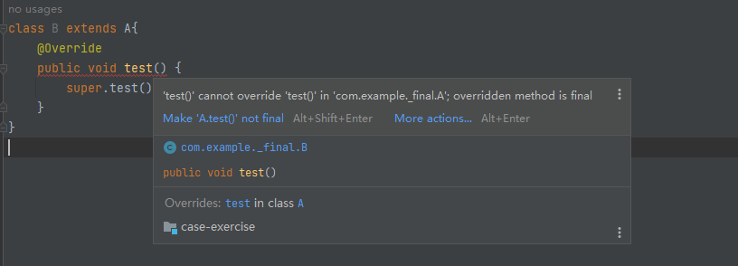
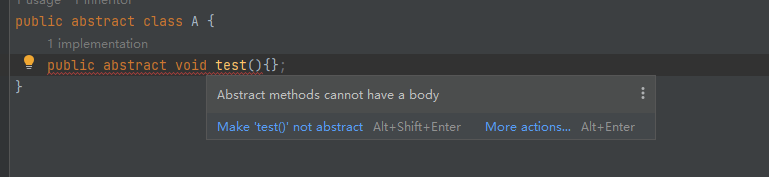
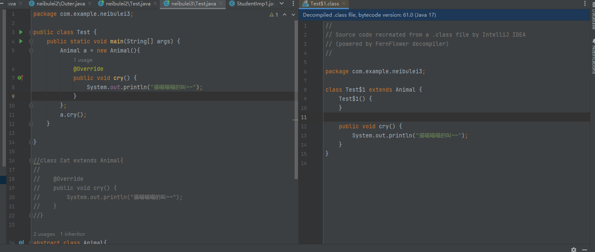
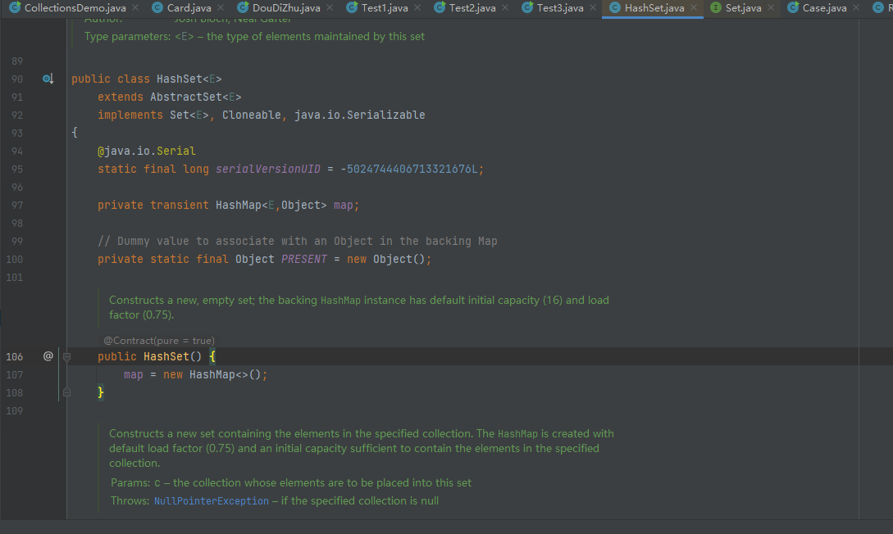
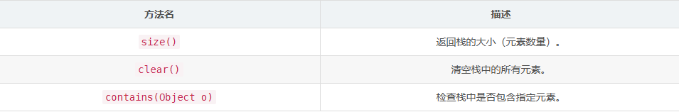
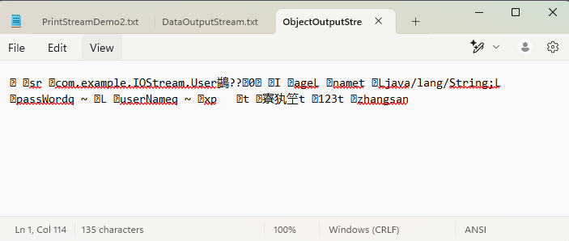
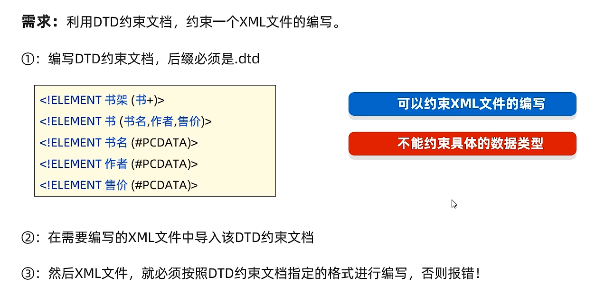

# Java基础知识复习

参考视频：[Java入门基础视频教程，java零基础自学就选黑马程序员Java入门教程（含Java项目和Java真题）_哔哩哔哩_bilibili](https://www.bilibili.com/video/BV1Cv411372m?spm_id_from=333.788.videopod.episodes&vd_source=f3cb3ea986b26c6910b4df6d37acd60d)


# Java入门

## 03、Java入门：JDK的选择安装和下载

jdk的安装直接去Oracle官网下载，这里省略了

### 检查java是否可用以及版本

进入控制台输入命令`java`或`javac`，如果出现以下界面则说明Java安装成功


输入命令`java -version`或`javac -version`检查java版本


### `java`和`javac`的基本作用

`java`和`javac`命令实际上就是执行下图中的程序


其中`javac`是编译工具，用于翻译java程序，将java程序翻译成计算机底层能够识别的语言

`java`是执行工具，用于运行javac翻译后的程序


## 04、Java入门：掌握DOS窗口常见命令

几个命令行窗口常用命令如下

### 1.切换盘符

命令：`盘符字母:`

示例如下

```cmd
C:\Users\Aurora>d:
```

xxxxxxxxxx import java.io.File;​public class ListFiles {    public static void main(String[] args) {        listFiles(new File("D:\\工作上的文件"),0);    }​    /**     * 列出当前目录下的所有文件     * @param file      当前目录     * @param level     目录的深度，用于格式化列出来的文件     */    public static void listFiles(File file,int level){        //先进行非法判断        if(!file.exists()){            //如果文件目录不存在则返回            return;        }        //打印当前目录名        for (int i = 0; i < level-1; i++) {            //进行格式化，开头缩进            System.out.print("\t");        }        System.out.println(file.getName());        //列出当前目录的所有文件对象        File[] files = file.listFiles();        //遍历files        for (File f : files) {            if(f.isFile()){                //如果是文件，就直接打印出文件名                for (int i = 0; i < level; i++) {                    //进行格式化，开头缩进                    System.out.print("\t");                }                System.out.println(f.getName());            }else {                //如果是目录,递归调用本方法                listFiles(f,level+1);            }        }​    }}java

### 2.查看当前路径下的文件

命令：`dir`

示例如下

```cmd
D:\>dir
```


### 3.进入某一级目录

命令：`cd 目录名`

示例如下

```cmd
cd code
```


退回上一级

```cmd
cd ..
```


退回盘符根目录

```cmd
cd \
```


### 4.清屏

命令：`cls`


## 08、Java入门：JDK组成、跨平台原理

### JDK组成

JDK是Java Development Kit的缩写，意为Java开发工具包

JDK由JVM（Java虚拟机，真正运行java程序的地方）、核心类库（java事先提供的程序）和开发工具（java和javac等)组成，其中由JVM和核心类库组成JRE（Java Runtime Environment 即Java运行环境）


### Java程序的运行过程

编写好的Java程序先由javac编译成`.class`文件，再通过`java`命令将`.class`文件放入`JVM`中运行，运行过程中`JVM`会从核心类库中调用相关函数

其中`JVM`分为几个部分，具体见本笔记Java数组部分的 `05、Java数组：数组的内存执行原理`


### Java跨平台原理

Java跨平台指的是"一次编译，处处可用"，编译后的`.class`文件可以在任何平台运行。

原因：

`.class`文件的运行实际上是在`JVM`中运行，在常见的Widows系统中，下载的jdk就已经提供了Windows版本的`JVM`。因此如果要在其他平台上运行，也需要对应平台的`JVM`

如下图所示


## 12、Java入门：IDEA配置、快捷键设置

### 配置IDEA外观

进入设置，搜索appearance，找到Theme即可修改

		


### 设置字体大小

进入设置，搜索font即可修改


### 设置代码背景颜色

进入设置，找到下图所示的页面，想要护眼可以修改背景色为豆沙绿，豆沙绿的rgb是(204,238,200)


#### 1.复制当前行至下一行

`ctrl+D` 


#### 2.删除所在行

`ctrl+Y`或`ctrl+X`


#### 3.格式化代码

`ctrl+alt+L`


#### 4.上下移动当前代码

`alt+shift+上下方向键`


## 14、Java入门：基础语法-注释详解

### 单行注释

以`//`开头，只能注释一行代码

```java
//只能注释一行代码
```


### 多行注释

`/*要注释的内容*/`，可以注释多行

```java
/*
可以注释多行内容
注释
*/
```


### 文档注释

`/**要注释的内容*/`，文档注释与多行注释的区别在于文档注释的内容可以提取到一个程序说明文档里面去

```java
/**
文档注释的内容可以提取到一个说明文档里面去
注释内容
*/
```


### 注释快捷键

#### 1.对选中代码进行单行注释

`ctrl+/`

#### 2.对选中代码进行多行注释

`ctrl+shift+/`


## 15、Java入门：基础语法-字面量详解


## 16、Java入门：基础语法-变量详解

最基本的变量的赋值就不讲了，这里讲一讲变量赋值的原理

### 变量赋值的原理

下面代码变量赋值的原理如下

创建一个变量可以想象为是创建了一个用于存放变量的盒子，所以`int age = 20;`这行代码就是创建一个用于存放`age`数据的盒子

而`age = 21; `这行代码的赋值原理是将盒子里面的数据直接替换为21

Java中的赋值语句是从右往左看的，因此，`age = age + 1;`这行代码的执行原理是先从“盒子”中取出`age`的值，然后加1，最后将相加的结果再放入存放`age`的“盒子”中

```java
int age = 20;			//创建一个变量
age = 21;				//age变为了21
age = age + 1;			//age变为了22
```


## 17、Java入门：基础语法-变量使用时的注意事项

### 变量的注意事项

#### 1.变量必须先声明再使用

```java
int age = 20;					//先声明变量
System.out.println(age);		//再使用变量
```


#### 2.变量只能接收其对应的类型

```java
int age; 				
age = 21;						//int类型变量只能接收整形数据

String s;						
s = "字符串";					//String类型变量只能接收字符串数据
```


#### 3.在同一个`{}`范围内变量的名字不能一致

```java
public static void main (String[] args){
    int age = 2;
    {
        int age =1;		//不在同一个{}范围的变量名可以一致 
    }
    
    int age = 4;		//这行代码会报错，同一个{}范围的变量名不可以一致
}
```

会报类似下图中的错误


#### 4.变量的定义可以不赋初始值，但使用的时候变量一定要有值

```java
public class Test {
    public static void main(String[] args) throws Exception{
        int age;						//创建变量时可以不赋初始值
//        System.out.println(age);		//这行代码会报错，因为此时变量没有值
        age = 1;						//为变量赋值
        System.out.println(age);		//赋值后的变量才可以正常使用
        System.out.println(A.a);        //类的成员变量可以不赋初始值，成员变量有默认值，这里int类型的默认值为0
    }
}

class A{
    public static int a;
}
```

在类中的变量可以不赋初始值，类中的变量有默认值


## 18、Java入门：基础语法-关键字、标识符

### 关键字

关键字就是Java语言自己用到的一些词，具有特殊作用，因此我们在创建变量的时候就不能再使用这些词，就像电话号码，110、120等号码就类似与Java关键字，我们的电话号码就不能使用这些。

Java的关键字如下图所示


### 标识符

标识符就是名字，我们创建的类的类名、变量名等都是标识符

### 标识符的要求

1.由数字、字母、下划线、美元符($)等字符组成，甚至用中文来组成标识符也可以，不过很少有人这么干


2.不能由数字开头，且不能是Java关键字，且区分大小写


# Java语法

## 05、Java语法：数据类型

### 基本数据类型

如下图所示


### 注意事项

在Java中，写一个整数是默认为`int`类型，写一个小数默认为`double`类型

因此如下图所示，即使创建的类型是long类型，但数据超出了int类型的范围，就会报错，要解决这个问题就要在数据后面加上字母`L`


加上`L`后不再报错，对于`float`也是一样，小数默认为`double`，要使用`float`的话要在数据后面加上字母`F`


## 06、Java语法：自动类型转换

### 为什么要进行类型转换

因为在开发中存在将不同类型的数据赋给其他类型的变量的情况，如将`byte`类型的数据赋值给`int`类型


### 什么是自动类型转换

将范围小的变量赋值给范围大的变量时，范围小的变量的类型会自动变为范围大的变量类型，不需要我们进行任何操作

```java
byte b = 12;					//byte类型只占一个字节
int i = b;						//int类型占四个字节，因此b可以直接赋值给i，其中已经发生了自动类型转换
```


### 自动类型转换的原理

举个例子，一个`byte`类型的变量记录的数字为12，其底层记录的就是二进制的数字00001100，在`byte`类型转换为`int`类型的时候，由于`int`类型占32位，比`byte`类型长，所以可以直接取出`byte`类型存储的二进制数据00001100放入`int`类型中，而不足32位的只要在左边补上0即可，即转换后`int`类型存储的数据为00000000 00000000 00000000 00001100。


## 07、Java语法：表达式的自动类型转换

在表达式中，小范围的类型会自动转换为大范围的类型后再进行运算

### 注意事项

#### 1.表达式的结果类型是表达式中范围最大的类型

```java
byte b = 1;
int i = 200;
long l = 234702840;
long re1 = b + i + l;				//这个表达式中范围最大的类型是long，因此数据由long类型来接收

int i = 222;
float f = 23432.3323;
double d = 2342424332.34242;
double re2 = i + f + d;				//这个表达式中范围最大的类型是double，因此数据由double类型来接收
```


#### 2.在表达式中btye、short、char是直接转换为int类型来运算的

```java
byte b = 1;
short s = 2;
short re = b + s;					//这行代码是错误代码，虽然short的范围是该表达式中最大的，但由于byte、short在运算时都会转换为int类型，因此最后应该用int类型来接收
int re = b + s;						//这行代码才是正确的
```


## 08、Java语法：强制类型转换

前面讲到的自动类型转换是发生在范围小的数据类型转换为范围大的数据类型，而强制类型转换发生在范围大的数据类型转换为范围小的数据类型

### 强制类型转换语法

```java
要转换的数据类型 变量名 = （要转换的数据类型）被转换的变量;
int i = 20;
byte b = (byte) i;		//int类型强制转换为byte类型
```


### 强制类型转换原理

例如将`int`类型的`i=20`转换为`byte`类型的b，`int`类型占32位，`byte`类型占8位，因此在转换的时，`byte`类型只能存储`int`的8位数据，于是只取出`int`类型的后8位，前面的位数全部舍去。


### 注意事项

大范围转换为小范围可能会导致数据的丢失。


## 09、Java语法：算数运算符、`+`符号做连接符

### 基本算数运算符

基本的算数运算符有加（+）、减（-）、乘（*）、除（/）、取余（%）

加减乘就不讲了，主要讲一下除法需要注意的事项

Java中两个整数的除法结果是整数，原因前面讲了，因为那个表达式的自动类型转换，表达式的结果为表达式中数据范围最大的

```java
int i1 = 4;
int i2 = 2;
int re1 = i1 / i2;						//结果为2

int i3 = 5;
int re2 = i3 / i2;						//结果也为2，如果想要得到2.5，可以看下面的方法

int re3 = 1.0 * i3 / i2;				//结果为2.5，因为此时表达式中范围最大的类型已经变为了double类型
```


### `+`符号做连接符

`+`符号除了用于加法运算，还可以用于字符串的连接，注意是字符串而不是字符，因为字符与数字是可以运算的

```java
System.out.println('a' + 3.14);					//输出结果为100.14
System.out.println("string" + 3);				//输出结果为string3
System.out.println("string" + 3 + 'a');			//输出结果为string3a
System.out.println(3 + 'a' + "string");			//输出结果为100string，因为3和字符a可以先运算，运算结果为100，然后再与后面的字符串连接
```


## 10、Java语法：自增、自减运算符

自增自减的用法就不说了，主要说一下其注意事项

### 自增自减注意事项

#### 1.自增自减不能用在字面量上

字面量就是直接写出来的数据，如`1、2、"字符串"、'a'`等

```java
1++;				//这行代码是错误的，自增自减运算符不能用在字面量上
```


#### 2.自增自减的运算顺序

自增自减放在变量的前面和后面区别非常大

```java
int a = 1;
int re1 = ++a;				//运算符在前面，先进行自增运算，再赋值，所以结果为2

int b =1;
int re2 = b++;				//运算符在后面，先进行赋值运算，再进行自增运算，所以结果为1
```


## 12、Java语法：赋值运算符

要注意的点就是扩展赋值运算符的底层存在一个强制类型转换的操作


## 14、Java语法：逻辑运算符

基本的逻辑运算符如下图所示


### 注意事项

之前用逻辑运算符一直是这样用的

```java
true && false;
true || false;
```

现在回来复习发现中间那个符号只写一个也可以

```java
true & false;
true | false;
```

单符号和双符号的区别如下


双符号的称为短路与、短路或，其性能或好一点，因此实际应用中，一般使用双符号的形式


还有一个用的比较少的，逻辑异或，这个就只能写一个符号

```java
true ^ false;						//这是正确的
true ^^ false;						//这是错误的，只能写一个逻辑异或符号
```


## 15、Java语法：三元运算符、运算符优先级

### 三元运算符

三元运算符的执行流程如下

首先计算条件表达式，如果条件表达式的值为true，则返回值1，如果条件表达式的值为false，则返回值2

```java
条件表达式 ? 值1 : 值2; 

double score = 98.5;
String re = score >=60 ? "成绩合格" : "成绩不合格";				//返回结果为 成绩合格
```


### 运算符优先级

运算符优先级如下图所示


这里就讲一讲`&&`与`||`的优先级，`&&`的优先级比`||`高

```java
System.out.println(3 < 10 || 10 < 100 && 100 > 1000);           //先执行&&，结果为true
System.out.println((3 < 10 || 10 < 100) && 100 > 1000);           //先执行||，结果为false
```


# 流程控制

## 02、流程控制：分支控制：if、switch、switch穿透性

`if`和`switch`的语法就不说了，这里简单说一下`if`和`switch`的区别

`switch`相对于`if`来说比较局限，`switch`主要用于完成值的匹配判断，而`if`还可以用于条件的区间判断，因此`switch`能做到的`if`也能做到，而`if`能做到的`switch`不一定能做到

### `if`语法

```java
if(判断表达式){
    结果为true执行的代码
}else {
    结果为false执行的代码
}
```


### `switch`语法

```java
switch(表达式){
        case 值1:
        {
            要执行的代码;
            break;
        }
        case 值2:
        {
            要执行的代码;
        	break;
        }
        ......
        case 值n:{
            要执行的代码;
            break;
        }
        default :{
            
        }
        	
}
```


### `switch`注意事项

#### 1.switch支持的数据类型

switch的表达式类型只支持`byte` `short` `int` `char` `枚举(jdk5开始支持)` `String(jdk7开始支持)`类型，不支持`long` `double` `float`类型

如下图所示，如果使用long类型会报错


至于为什么不支持小数类型，原因如下

Java中，小数类型的计算是有精度的，可能会导致匹配不准确，如下面示例所示

```java
        double d1 = 0.1;
        double d2 = 0.2;
        double d3 = d1 + d2;
        System.out.println(d3);					//输出为0.30000000000000004，而不是0.3
```


#### 2.case给出的值不允许重复，且只能是字面量，不能是变量


#### 3.switch穿透

如果使用switch的时候没有用break，就会出现穿透现象

例如这段代码

```java
        int l = 2;
        switch (l) {
            case 1: {
                System.out.println("数字为1");
                break;
            }
            case 2:{
                System.out.println("数字为2");
                //break;							//这里省略break，会出现穿透
            }
            case 3:{
                System.out.println("数字为3");
                break;
            }
            default:{
                System.out.println("数字为其他");
            }
        }
```

运行结果如下图所示


原因就是值为2时的break语句被省略了，执行完代码时不会跳出switch，而是继续向下执行，它不仅继续执行还不进行任何判断，这就导致后面其他情况的语句都会被全部执行，直到遇见break


## 07、流程控制：break、continue

### 跳转关键字

#### 1.break

跳出并结束当前所在循环的执行


#### 2.continue

用于跳出循环的当次执行，直接进入循环的下一次执行，其只能再循环中使用


# Java数组

## 02、Java数组：静态初始化数组，数组的访问

### 静态初始化数组

静态初始化数组指在创建数组的时候就给出数组的所有值

语法如下：

```java
数据类型[] 数组名 = new 数据类型[]{元素1,元素2,元素3,....,元素n};
int[] ages = new int[]{13,14,15};
```

或

```java
数据类型 数组名[] = new 数据类型[]{元素1,元素2,元素3,....,元素n};
```


简化格式如下：

```java
数据类型[] 数组名 = {元素1,元素2,元素3,....,元素n};
int[] ages = {13,14,15};
```

或

```java
数据类型 数组名[] = {元素1,元素2,元素3,....,元素n};
```


### 数组在计算机中的基本原理

数组在计算机中的存储原理如下

在创建数组是，计算机会为数组名开辟一个空间，用于存放第一个元素的地址，接着会开辟一块内存空间，用于按顺序存放数组的数据


### 引用数据类型

引用数组类型指的是存储一个对象地址的变量，数组就是一个引用数据类型，因为数组变量存储的就是地址


### 数组的访问

#### 数组访问的语法

```java
数组变量名[索引]
int[] ages = {13,14,15};
ages[1]=ages[0]+ages[2];					//访问并修改数组元素
```


#### 获取数组的长度


```java
变量名.length
int[] ages = {13,14,15};
int len = ages.length;						//len的结果为3
```


## 03、Java数组：数组遍历，案例练习

数组怎么遍历就不讲了

### 数组遍历的快捷键

在IDEA中，遍历数组可以使用快捷键来快速编写代码

快捷键为 `数组名.fori`，如下图所示


## 04、Java数组：动态初始化数组，案例练习

### 动态初始化数组

#### 1.定义

动态初始化数组指的是定义数组时不存入具体的数据，只确定数组的长度和数据类型

```java
数据类型[] 数组名 = new 数据类型[数组长度];
int[] arr = new int[3];
```


#### 2.注意事项

a.动态初始化数组和静态初始化数组不能混合使用，如下所示


b.使用动态初始化数组时，如果暂时还没有为数组赋值，那么数组里面元素的值默认为0(int类型)，其他类型的默认值如下图所示


## 05、Java数组：数组的内存执行原理

### Java内存分配

前面讲了，一个Java程序的运行，是先将Java程序编译成`.class`文件，然后将`.class`文件放入JVM中运行。

JVM是运行在内存中的虚拟机，那么JVM的内存分配是怎样的呢

JVM将内存分为5个部分，分别是方法区、栈、堆、本地方法栈、程序计数器

这里主要讲解前三个，它们的作用如下

#### 1.方法区

Java编译后的`.class`文件(字节码文件)要运行的时候就会先加载到这个区域


#### 2.栈内存

`.class`文件中可能存在多个方法，如`main`方法，在运行这些方法的时候，这些方法会进入栈内存，并且变量也会存放在这里


#### 3.堆内存

这个地方用于存放new出来的数据，new出来的数据会在这里开辟空间并产生地址


下面是一个具体的程序的内存使用情况


# Java方法

## 02、Java方法：方法定义的其他形式，常见问题

### 方法使用时的常见问题

常见问题如下图所示，第一点注意一下，有点忘记这个了


## 04、Java方法：方法在计算机中的执行

### 方法的执行原理

main方法调用其他方法的时候底层到底发生了什么，为什么其他方法执行完后程序又能回到main方法继续执行后面的代码？

前面讲过，Java程序是在JVM中运行的，而JVM将内存分为5个部分，而其中三个最为主要：方法区、栈、堆

而方法的执行就是在栈中执行的，栈的特点是先进后出、后进先出，由于这个特点，一个main方法在执行的时候，main方法就会先进入栈中，在执行的过程中，如果main方法需要调用其他方法，就接着把其他方法放入栈中，这时在栈顶的方法就是最近才进来的方法，在栈顶的方法会先执行，当栈顶的方法执行完后会弹出，继续执行下面的函数，所以当main函数调用的其他方法执行完后，程序最后都会回到位于栈底的main函数。

通过这样一种方式还能够及时清除执行完的方法所占的内存


## 05、Java方法：方法参数传递

### 值传递

Java参数传递的机制是值传递，值传递指的是在传递实参给方法的形参时传递的并不是实参本身，而是复制一个实参的赋给给形参

 ```java
     public static void main(String[] args) {
         int a = 3;
         print(a);
         System.out.println("main: " + a);                   //打印结果还是为3，尽管前面调用的方法将a改变了，但改变的只是传过去的副本，main方法中的a本身根本没变
     }
 
     public static void print(int a) {
         System.out.println("print1: " + a);                 //打印结果为3
         a = 20;
         System.out.println("print2: " + a);                 //打印结果为20
     }
 ```


### 引用类型的参数传递

上面讲的值传递的例子是基本类型的数据传递，接下来看引用类型的参数传递

```java
    public static void main(String[] args) {
        int[] arr = {13,31,20};
        print(arr);
        System.out.println("main:"+arr[1]);                     //结果为300，因为传递的是数组的地址，因此print函数对数组的改变会直接影响到这里的数组结果，因为指向的都是同一个数组

    }

    public static void print(int[] arr){
        System.out.println("print1:"+arr[1]);                   //结果为31
        arr[1]=300;
        System.out.println("print2:"+arr[1]);                   //结果为300
    }
```


## 07、Java方法：方法重载，return关键字

### 方法重载

#### 1.概述

一个类中，出现多个方法名字相同而参数列表不同的方法，这些方法称为方法重载


#### 2.注意事项


这里列举几个之前没那么注意的

首先第一点，只要方法名称相同就是方法重载，下面是三个重载的方法

```java
    public int function(int a) {			
        return a;
    }

    int function() {				//修饰符不同，但方法名相同且形参列表不同，是方法重载
        return 1;
    }

    public double function(double a) {		//返回类型不同，但方法名相同且形参列表不同，是方法重载
        return a;
    }
```


第二点，怎样才算形参列表不同，没复习前不太了解顺序不同和不关心形参的名称是什么意思，现在可以看看下面的例子

```java
    public int function(int a, double b) {
        return a;
    }

	//形参类型出现的顺序不一致，所以形参列表不同但方法名相同，是方法重载
    public int function(double a, int b) {	
        return b;
    }
	
	//虽然形参的名字不一样，看起来形参列表也是不同的，但这个不是方法重载，因为重载不关心名称，名称是什么不管，只看类型
	//这里第一个出现的是int类型，第二个出现的是double类型，因此与前面的方法形参列表是一致的，因此不属于方法重载
    public int function(int a1, double b1){
        return a1;
    }
```


# 面向对象基础

## 02、面向对象基础：对象执行原理，类与对象注意事项

### 对象执行原理

假如有如下学生对象

```java
public class Student {
    String name;				//学生姓名
    double chinese;				//学生的语文成绩
    double math;				//学生的数学成绩
    public void printTotalScore(){
        //打印学生总成绩的代码
    }
}
```

下面是创建该对象的代码

```java
public class Test {
    public static void main (String[] args){
        Student s1 = new Student();					//这行代码用于创建学生对象
    }
}
```

那么在执行上述创建学生对象的代码时计算机底层到底发生了什么呢

首先，在执行到`Student s1 = new Student();`这行代码时，程序首先遇见的是`Student`这个类名，这时计算机会将`Student`这个类编译后的`.class`文件放入方法区。接着，再下一个就是`s1`这个变量名，这时计算机就会在栈中的main方法中创建一个`s1`的变量区域，用于存放对象的地址。最后执行到`new Student()`的时候，计算机便会根据`Student`这个类的具体要求在堆内存中创建相应的空间区域，比如这里就会创建`name`,`chinese`,`math`三个空间，创建好后就会将这块对象区域的地址给到前面在栈中创建的`s1`，并且除了创建对象要求的变量外，还会再开辟一个空间用于存放`Student`这个对象的`.class`文件的地址

下图是一个具体例子


### 类和对象注意事项

如下图所示，主要注意一下第四点，同一个代码文件中可以写多个class类，但只能一个用public修饰


## 03、面向对象基础：this关键字

### this关键字概述

this就是一个变量，可以用在对象的成员方法中，来拿的当前的对象


### this关键字执行原理

假如有如下类

```java
public class Student {
    public void printThis(){
        System.out.println(this);
    }
}
```

类的方法会统一和类的`.class`文件一起放在方法区，当创建出来的对象要调用方法的时候，调用的就是放在方法区里面的对象，每一个创建出来的对象都可以调用这放在方法区里的同一个方法。

而就在每一个对象执行方法的时候，对象会将自己的地址传给所调用的方法，因此在方法中使用`this`就能获取到当前的对象


## 04、面向对象基础：构造器

### 构造器的写法

构造器是一个方法名与类名一致，且不具有返回值类型的一个特殊方法，下面是一个构造器的示例

```java
public class Student {
    
    public Student(){
        //构造器方法
    }
    
}

```

构造器和普通的方法一样，也可以重载，只要参数列表不一样

```java
public class Student {

    public Student(){
        //构造器方法，无参构造器
    }

    public Student(int a,double b){
        //重载的构造器方法，有参构造器
    }
}
```


### 构造器的作用

对象在被创建时会自动执行构造器，如

```java
Student s1 = new Student();					//这行代码会执行上面的无参构造器

Student s2 = new Student(1,13.1);			//这行代码会执行上面的有参构造器
```

一般使用构造器来为对象赋初始值

```java
//对于创建对象有两种赋值的方法
//1.先创建对象再一个个赋值
Student s1 = new Student();
s1.name = "张三";
s1.score = 100;

//2.通过使用有参构造器来为对象赋值
Student s2 = new Student("李四",98);				//会调用有参构造器

//假设有参构造器如下
public Student(String name ,double score){
    this.name = name;							//在有参构造器里面为对象赋值
    this.score = score;
}
```


### 构造器的注意事项

1.类在设计时如果没有写构造器，Java会自动创建一个无参构造器

2.一旦定义了一个构造器，Java就不会再为我们自动创建一个无参构造器了，因此如果定义了有参构造器，最好连同无参构造器一起定义好


## 05、面向对象基础：封装，实体JavaBean

### Java对象的三大特征

Java对象的三大特征是封装、继承、多态。

封装就是三大特征中的其中一个


### 什么是封装

封装就是指将要处理的数据以及处理这些数据的方法设计到一个对象中去


### 封装的合理暴露、合理隐藏

例如有如下对象

```java
public class Student {
    public String name;				
    public double score;			
}
```

该对象的两个属性都是共有的，因此外界在使用这个对象时可以随意修改访问这些对象，这就会导致一些风险，因此封装的同时需要做到合理暴露、合理隐藏。

那怎样才算合理暴露、合理隐藏呢？答案是将属性设置为私有的，再设计一个公有的方法来访问这个属性，外界仅可以通过这个方法来访问修改属性，如下所示

```java
public class Student {
    private String name;			//将属性设置为私有，仅对内可访问，对外不可访问				
    private double score;			

	public void setName(String name){
        this.name = name;			//通过提供的方法来访问属性
    }
    
    public String getName(){
        return this.name;
    }
}
```

我原来觉得这样做根本没有什么意义，因为通过这个方法不一样可以随便访问修改属性吗。实则不然，因为我们可以在提供给外界的方法中进行一些额外的校验操作，如下

```java
public class Student {
    private String name;			//将属性设置为私有，仅对内可访问，对外不可访问				
    private double score;			

    public void setScore(double score){
        if(0<=score&&socre<=100){	//进行额外的校验操作，防止非法数据
	        this.score = score;    
        }else {
            return;					
        }
        			
    }
    
    public String getScore(){
        return this.Score;
    }
}
```

这个例子中对Score进行了额外的校验，这样可以防止一些非法数据，所以通过这种方法就可以防止外界对属性的随意访问修改，这样就做到了合理暴露、合理隐藏


### 什么是实体类

实体类是一种特殊的类，其满足下面的条件

1.这个类的所有成员变量都要私有，且都对外提供相应的get、set方法

2.必须提供一个无参构造器

3.实体类除了提供get、set方法外不再提供其他方法

基于这三点，实体类的作用就非常简单，就是单纯地用于存储相应地数据，并提供访问这些数据地方法


### 实体类的应用场景

在现实业务中，常常将对数据的存储和操作分开，实体类就是用于数据的存储，因此对数据的操作需要另外创建一个类，下面是一个例子

首先是Student实体类

```java
public class Student {
    private String name;
    private double score;
    
    public Student(){
        //无参构造器方法
    }

    public String getName() {
        return name;
    }

    public void setName(String name) {
        this.name = name;
    }

    public double getScore() {
        return score;
    }

    public void setScore(double score) {
        this.score = score;
    }
}
```

然后是Student操作类

```java
public class StudentOperator {
    //操作学生类的类
    private Student student;

    public StudentOperator() {

    }

    public StudentOperator(Student student) {
        //通过有参构造函数将要操作的对象传进来
        this.student = student;
    }

    //定义操作方法
    public void printScore(){
        System.out.println(student.getName()+"的成绩为："+student.getScore());
    }
}
```

接着就是使用学生操作类来操作学生对象

```java
public class Test3 {
    public static void main(String[] args) {
        //创建学生实体对象
        Student student = new Student();
        student.setName("张三");
        student.setScore(100);

        //将学生实体对象传给学生操作类
        StudentOperator studentOperator = new StudentOperator(student);

        //使用学生操作类来对学生进行操作
        studentOperator.printScore();
    }
}
```

操作结果为


# 常用API

## 01、常用API：课程介绍、包

### 什么是包

在Java中，包用于分门别类地管理不同程序，通过建包，我们能更好地管理和维护项目


### 包的语法

在IDEA中开发时，要求我们先建包后写程序，建包的语法如下

```java
package 包的位置;

package com.example.project;
```


在IDEA中，我们创建类的时候IDEA会自动为我们写好创建包的代码


### 调用包的注意事项


前三点比较好理解，最后一点举个例子，如下图，这里在两个不同的包下建立了两个类名一样的类


当我要同时使用这两个类的时候，只能导入其中一个包，剩下的另一个就必须带上包名，如下图


## 02、常用API：String，API

### 创建String对象的方法

#### 1.直接将字符串给String对象

```java
String s = "字符串";
```

这种方法也最常用


#### 2.使用String类的构造方法

String提供了多个构造方法

##### 1)无参构造方法

```java
String s = new String();
```

使用该方法创建出来的String对象默认值为空字符串`""`


##### 2)构造方法参数为字符数组

```java
char[] chars = {'a','b','c'};
String s = new String(chars);				//abc	
```

这种方法会自动将字符数组拼接，然后再给到String对象


##### 3)构造方法参数为字符串

```java
String s = new String("字符串");
```


##### 4)构造方法参数为字节数组

```java
byte[] bytes = {97,98,99};
String s = new String(bytes);				//abc
```

这种方法会将字节自动转化为所对应的字符然后拼接在一起后再给到String对象


### String的常用方法

#### 1.获取字符串长度

```java
String s = "abc";
//获取字符串的长度
System.out.println(s.length());				//结果为3
```


#### 2.获取字符串中某个索引位置的字符

```java
String s = "abc";
System.out.println(s.charAt(1));			//结果为b
```


#### 3.将字符串转换为字符数组

```java
String s = "abc";
char[] chars = s.toCharArray();
System.out.println(chars[0]);				//结果为a
System.out.println(chars);					//结果为abc
```


#### 4.判断字符串是否一致

这里要注意的是，字符串的判断要使用`equals`方法，不能使用`==`，因为String类型是引用数据类型，`==`判断的是它们的地址是否一致

```java
String s1 = new String("aaa");
String s2 = new String("aaa");
System.out.println(s1 == s2);					//结果为false，这里比较的是地址
System.out.println(s1.equals(s2));				//结果为true，这里才是判断具体字符串是否一致
```

还有一点要注意的是，不通过new方式创建出的字符串如果是相同的，那么它们的地址也是相同的。

```java
String s3 = "bbb";
String s4 = "bbb";
System.out.println(s3 == s4);					//结果为true，因为s3，s4的地址是一样的
```

s3在创建的时候，计算机会开辟一块空间用于存放字符串"bbb"，然后将这块空间的地址传给s3。接着s4创建的时候，Java发现s4创建的字符串也是"bbb"，它发现内存中已经有一个字符串"bbb"了，因此就不会再开辟空间，而是就将原来的"bbb"这个字符串的地址给s4，因此s3和s4的地址是一样的。


#### 5.忽略大小写比较字符串

```java
String s5 = "aBc";
String s6 = "AbC";
System.out.println(s5.equalsIgnoreCase(s6));	//结果为true
```


#### 6.截取字符串

##### 1)指定截取的起始索引

```java
substring(int begin, ing end);				//这个方法的索引是包前不包后的
String s7 = "java是最好的编程语言之一";
String rs = s7.substring(0,8);
System.out.println(rs);							//结果为"java是最好的"
```


##### 2)指定截取的开始索引

该方法会截取开始索引到字符串结束的所有字符

```java
substring(int begin);							//这个方法会截取包括开始索引后面的所有字符
String s7 = "java是最好的编程语言之一";
String rs2 = s7.substring(5);
System.out.println(rs2);						//结果为"最好的编程语言之一"
```


#### 7.将字符串中某个内容替换

```java
replace(String "要替换的字符串",String "要替换成什么字符串");
String s8 = "这是个垃圾游戏，简直侮辱了垃圾这个词";
String rs3 = s8.replace("垃圾", "**");
System.out.println(rs3);				
```


#### 8.判断字符串是否包含某个关键字

```java
contains("关键字");							//精准匹配，返回结果为true或者false
String s9 = "我爱Java";
System.out.println(s9.contains("Java"));		//结果为true
System.out.println(s9.contains("java"));		//结果为false，精准匹配，不忽略大小写
System.out.println(s9.contains("java1"));		//结果为false
```


#### 9.判断字符串是否以某个字符串开头

```java
startsWith("某个字符串");
String s10 = "张三丰";
System.out.println(s10.startsWith("张"));			 //true
System.out.println(s10.startsWith("张三"));			//true
System.out.println(s10.startsWith("张三1"));			//false
```


#### 10.将字符串根据某个字符串分割

该方法根据某个字符串来分割字符串，并返回一个字符串数组

```java
split("分隔符");
String s11 = "c++,python,java,c,c#,html";
String[] strings = s11.split(",");
for (int i = 0; i < strings.length; i++) {
    System.out.println(strings[i]);
}
```


## 03、常用API：String的注意事项

### 1.String的对象是不可变字符串对象

只要是以`"..."`这种形式写出来的字符串对象会在堆内存中的字符常量池中存储，且相同内容的字符串只会存储一份

因此，如果创建同样的字符串，就会发现两个变量的地址是一样的

```java
String s1 = "aaa";
String s2 = "aaa";
System.out.println(s1==s2);				//结果为true，即s1和s2地址一致
```


如下代码所示

```java
String s1 = "java";
s1 +="c++";
s1 +="python";
```

第一行代码会创建一个`"java"`String对象放在堆内存的常量池中，运行到第二行代码时又会创建一个`"c++"`String对象放在堆内存的常量池中，然后再将java与c++相加的到`"javac++"`再放入堆内存中，然后再把存放"javac++"的内存空间的地址给到s1。运行到第三行再执行上面的操作


### 2.通过new创建对象的内存情况

通过new创建String，每次创建都会在堆内存中开辟新的空间，所以通过new创建的String对象，即使字符串一样，地址也不一样

```java
String s1 = new String("bbb");
String s2 = new String("bbb");
System.out.println(s1==s2);					//结果为false，因为s1与s2的地址不一致
```


### 面试案例（我答错了）

#### 案例1

首先执行第一行代码，第一行代码创建了两个对象，我答的是一个。两个，其中一个是`"..."`双引号形式创建的，另一个是new出来的。

然后第二行代码创建了0个对象，我答的是一个。之所以是0个，是因为前面已经通过`"..."`的形式创建了一个"abc"对象，这个对象已经放在常量池了，第二行代码再创建时就之间用放在常量池里的对象就行了，所以就没有再创建对象。假如没有第一行代码就是创建了一个对象


#### 案例2

下图中代码的正确打印结果应该为false，我却认为是true。分析一下，首先要知道的是，通过运算而创建的字符串会单独开辟一个空间，而不是放在常量池里的，因此s3会单独开辟一个空间而不是和s1共用常量池里面的同一个"abc"


#### 案例3

更想不到的来了，下图中的答案是true而不是false，为什么呢？上面不是说通过运算得到的字符串会单独开辟一个空间吗？

哎，这里是因为java有一个编译优化机制，程序在编译`"a"+"b"+"c"`的时候会自动将其转化为`"abc"`，这样一转化不就往常量池里面已经存在的`"abc"`撞上了吗？所以常量池里的`"abc"`的地址也会赋给s2，所以s1和s2的地址是一致的。哎，服了


我们来反编译看一下就知道了

就下图这个程序


将编译后的文件用IDEA打开再看一下，发现确实变了


## 05、常用API：ArrayList概述，使用

### 什么是集合

集合是一种容器，用于存储数据，类似于数组。

那么既然有了数组这个东西来存储数据，为什么还要设计一个集合呢？原因是数组能存储的数据的数量在数组被定义的时候就已经固定了，但是在开发中经常会有添加新的数据的要求，如果用数组就要重新开辟一个更大空间的数组，然后把原来数组的数据复制给新的数组，非常麻烦。而集合可以随意地增加新的数据，更加方便


集合最显著的特点就是集合的大小可变，这是数组不能做到的


### ArrayList的创建

创建一个ArrayList对象的语法如下，如果没有指定集合的类型，那么集合可以放入任何类型的数据

```java
        ArrayList arrayList = new ArrayList();			//不指定集合数据类型的创建方法
        arrayList.add("字符串");
        arrayList.add(123);
        arrayList.add('a');
        arrayList.add(21.2);
        System.out.println(arrayList);
```


但是，开发中一般都会指定集合的数据类型，用于约束集合的数据

```java
ArrayList<要指定的数据类型> 集合名 = new ArrayList<>();
ArrayList<String> arrayList1 = new ArrayList<>();
```


### ArrayList常用方法

#### 1.添加数据方法

##### 1)将数据添加到集合末尾

add方法用于向集合中添加数据

```java
        public boolean add(要添加的数据)							//方法语法，会返回boolean值，添加成功返回true
		ArrayList<String> arrayList1 = new ArrayList<>();
        arrayList1.add("字符串");
        arrayList1.add("abc");
        arrayList1.add("汉字");
```


##### 2)将数据插入到集合指定位置

```java
		public void add(索引,要插入的数据);					//方法语法，注意这是插入数据，不是替换数据
		arrayList1.add(1,"添加的数据");
```


#### 2.获取指定索引的元素

get方法用于获取指定索引的元素

```java
	public E get(int index);					//方法语法
	arrayList1.get(1);					
```


#### 3.获取集合的大小

```java
	public int size();					//方法语法，返回集合的长度
	int len = arrayList.size();				
```


#### 4.删除元素

##### 1)删除指定索引的元素

```java
	public E remove(int index);			//方法语法，返回被删除的那个元素
```


##### 2)删除指定的元素

这个与上面删除指定索引的元素的区别在于，这个是根据元素内容来删除，上面那个是根据元素索引来删除，如果集合中存在多个指定的元素，会默认删除第一次出现的元素

```java
	public boolean remove(Object o);	//方法语法，返回是否删除成功.
```


#### 5.修改指定索引的元素

set方法用于修改指定索引的元素，并返回被修改的元素

```java
	public E set(int index,E element);		//方法语法，返回被修改的元素
```


# 面向对象高级一

## 02、面向对象高级一：static修饰成员变量、类变量应用场景

### static修饰符

static以为静态，可以类的成员变量和成员方法。

#### 1.static修饰成员变量

没被static修饰的变量称为实例变量

被static修饰的变量称为类变量，类变量属于类，不属于创建出来的对象，在计算机中只有一份，会被类的全部对象共享。

```java
public class Student {
    static String name;						//被static修饰，属于类变量
	public double score;					//没被static修饰，是普通的成员变量 
}
```

类变量的访问是通过`类名.变量名`的方式来访问的，有区别于类的普通成员变量的访问方式`对象名.变量名`

```java
        Student.name = "张三";				//访问类变量
        System.out.println(Student.name);		

        Student student = new Student();	
        student.score = 99.1;					//访问成员变量，要先创建一个对象
        System.out.println(student.score);		
```

类变量的访问也可以通过`对象名.变量名`的方式访问，但不推荐这么做


#### 2.类变量的执行原理

当一个类有类变量的时候，计算机会将类文件加载到方法区内存中，同时会把类的类变量加载一份到堆内存中。


#### 3.类变量的应用场景

在开发中，如果某个数据只需要一份，且希望能够被共享，则该数据可以定义成类变量

如，要求User类能够记住自己创建了多少个对象

User类

```java
public class User {
    public static int count;


    public User(){                  //通过构造方法来记录对象的个数
        User.count++;
    }
}
```

主程序

```java
        User user1 = new User();
        User user2 = new User();
        User user3 = new User();
        System.out.println(User.count);			//输出结果为3
```


#### 4.static修饰方法

static也可以用来修饰方法，没被static修饰的方法称为实例方法，被static修饰的方法称为类方法，与类变量类似，类方法属于类，是所有对象共享的方法。

类方法是以`类名.方法名`的方式来访问的，有区别与实例方法，实例方法是通过`对象名.方法名`的方式来访问的。

类方法也可以通过`对象名.方法名`的方式来访问，不过不推荐这样做

```java
public class Student {
    static String name;
    public double score;

    public static void printHelloWorld(){               //类方法的定义
        System.out.println("类方法被访问了");
        System.out.println("Hello World~~");
    }

    public void printPass(){                            //实例方法，只能建立对象来访问
        System.out.println(score >= 60 ? "成绩及格" : "成绩不及格");
    }
}
```

访问类方法

```java
Student.printHelloWorld();				
```

要注意，在类方法中不能访问实例变量，因为实例变量属于对象。但是可以访问类变量。

而实例方法既可以访问实例变量，也可以访问类变量


#### 5.搞懂main方法

前面经常能看见类的main方法

```java
public class Test {
    public static void main(String[] args) {
        System.out.println("HelloWorld");
    }
}
```

现在学了static修饰符的知识，就能够理解main方法了

main方法就是类方法，当我们执行main方法的时候，Java虚拟机会直接通过`类名.main`来执行，这里就是直接执行`Test.main`


## 04、面向对象高级一：static修饰方法类的应用场景-工具类

工具类的所有方法都是类方法，利用工具类来实现需求可以减少代码重复量。

下面设计一个生成验证码的工具类

```java
import java.util.Random;

public class CreateCode {

    private CreateCode(){
        //将构造方法私有化，防止创建工具类的对象
    }

    public static String createCode(int n){         //生成n为验证码
        String code = "";
        String s = "abcdefghijklmnopqrstuvwxyz";    //从这个序列中生成验证码
        Random random = new Random();
        for (int i = 0; i < n; i++) {
            int index;
            index = random.nextInt(s.length());
            code+=s.charAt(index);
        }
        return code;
    }
}
```

使用这个工具类

```java
public class Test {
    public static void main(String[] args) {
        System.out.println(CreateCode.createCode(4));		//随机生成4位验证码
        System.out.println(CreateCode.createCode(5));		//随机生成5位验证码	

    }
}
```


## 05、面向对象高级一：static注意事项

### static注意事项

如下图所示

其中第一点类的成员包括类变量和类方法


多注意一下第三点


## 06、面向对象高级一：static应用-代码块

### 静态代码块

static修饰的代码块被称为静态代码块，静态代码块在类加载的时候执行一次，由于类只会加载一次，因此静态代码块也只会执行一次。

静态代码块的格式如下

```java
static {
    //静态代码块的代码
}
```


静态代码块主要用于给类的类变量赋初始值

```java
public class Student {
    static String name;

    //静态代码块
    static {
        System.out.println("静态代码块执行了");
        name = "张三";				//为类变量赋初始值
    }

}
```


### 实例代码块

实例代码块的格式如下

```java
{
    //实例代码块的代码
}
```

与静态代码块的区别是实例代码块前面没有static修饰

实例代码块在每次创建对象的时候执行一次，并且是在构造器前面执行，其作用和构造器一样也是用来完成对象的初始化的，如对实例变量进行初始化赋值

```java
public class Student {
    static String name;
    public double score;

    //静态代码块
    static {
        System.out.println("静态代码块执行了");
        name = "张三";
    }

    //实例代码块
    {
        System.out.println("实例代码块执行了");
        this.score = 99.0;
    }
}

```

不过实际业务中一般不会对实例变量赋值，而实例代码块更多地用于记录日志

```java
public class Student {
    static String name;
    public double score;


    //实例代码块
    {
        //用于记录日志
        System.out.println("某某在某时间创建了对象");
			
    }
}

```


## 07、面向对象高级一：static应用-单例设计模式

### 什么是设计模式

一个问题通常有n种解法，而其中被总结出来的最优的一种解法被称为设计模式

目前设计模式有20多种，对应20多种软件开发中遇到的问题，比如：单例设计模式


### 单例设计模式

单例设计模式是确保一个类只有一个对象的设计模式

单例设计模式的写法

#### 1.饿汉式单例

1.构造器私有化

2.定义一个类变量，记住类的一个对象

3.定义一个类方法，返回类的对象

下面设计一个饿汉式单例，饿汉式单例指的是拿对象时对象早就建立好了

```java
public class A {
    //设计单例类，这是饿汉式单例

    //2.定义一个类变量，记录类的一个对象
    static A a = new A();

    //1.构造器私有化
    private A() {

    }

    //3.定义一个类方法，返回对象
    public static A getInstance() {
        return a;
    }
}
```

获取单例类

```java
        A a1 = A.getInstance();
        A a2 = A.getInstance();
        System.out.println(a1);
        System.out.println(a2);				//输出的a1和a2的地址是一样的，说明对象是同一个对象
```


#### 2.懒汉式单例

```java
public class B {
    //懒汉式单例

    //2.定义一个类变量记录对象
    static B b;             //与饿汉式不同，这里不能创建对象

    //1.构造器私有化

    private B() {

    }

    //3.定义一个类方法，返回对象
    public static B getInstance(){
        if(b == null){
            b = new B();            //当第一次获取对象时才创建对象，后面返回的都是同一个对象
        }
        return b;
    }
}

```


## 08、面向对象高级一：继承：使用继承的好处

### 继承

#### 1.什么是继承

继承是面向对象的三大特征之一

Java提供了一个关键字`extends`，使用这个关键字可以让一个类与另一个类建立父子关系。


#### 2.继承的特点

子类会继承父类的所有非私有成员，包括父类的成员变量和成员方法

示例如下

父类

```java
public class A {
    //父类
    //父类的公共成员可以被子类继承
    public int i;
    public void print1() {
        System.out.println("父类的公共成员方法");
    }

    //父类的私有成员不能被子类继承
    private int j;
    private void print2(){
        System.out.println("父类的私有成员方法");
    }
}
```

子类

```java
public class B extends A{
    //子类，继承自A类
    //可以使用A类的公有成员
    public void print3(){
        System.out.println(i);          //这个i继承自父类中的i
        print1();                       //可以调用父类中定义的公共方法

        //A类中的私有成员不能被使用
        System.out.println(j);			//这行代码会报错
        print2();						//这行代码会报错
    }

}
```


#### 3.子类对象的创建

把类看成是创建对象的设计图，对象的创建就是根据类的定义来创建的。因此父类中的私有变量也会参与到对象的创建中，只不过不能被直接访问而已，可以通过写get和set方法来访问这些变量

而子类的对象就是由子类和父类这两张设计图共同创建的

当要创建一个子类的对象的时候，计算机会将子类和父类的类文件都加载到方法区中


#### 4.继承的使用场景

使用继承可以减少代码的重复量，比如下面的例子

讲师类中有name以及对应的get和set方法，而咨询师类也有这些，这些代码显然重复了，所以可以设计一个父类，将这些重复的代码都写进父类中，然后让这两个类继承父类就行。


父类

```java
public class People {
    //父类
    private String name;

    public String getName() {
        return name;
    }

    public void setName(String name) {
        this.name = name;
    }
}

```

子类

```java
public class Teacher extends People{
    //子类
    private String skill;

    public String getSkill() {
        return skill;
    }

    public void setSkill(String skill) {
        this.skill = skill;
    }

    public void printInfo(){
        System.out.println(getName()+"具备的技能有："+skill);
    }
}
```

对象的创建和使用

```java
public class Test {
    public static void main(String[] args) {
        Teacher teacher = new Teacher();
        teacher.setName("张三");            //父类提供的方法
        teacher.setSkill("java、c++");       //子类提供的方法
        teacher.printInfo();                //子类提供的方法
    }
}
```


## 09、面向对象高级一：继承：权限修饰符

### 权限修饰符

#### 1.什么是权限修饰符

权限修饰符用来限制类中成员能够被访问的范围。


#### 2.不同权限修饰符的访问范围


## 10、面向对象高级一：继承：单继承、Object、方法重写

### 什么是单继承

单继承指的是子类最多能继承1个父类，不能继承多个父类。

但是Java支持多层继承，多层继承指的是子类继承自父类，而父类又继承自父类的父类，这样被称为多层继承。


### Object类

Object类是Java中所有类的祖宗，Java中所有的类要么直接继承Object类，要么间接继承Object类

```java
class C{				//一个类如果没有写extends来继承父类，那么会默认继承Object类

}

class D extends C{		//D类继承了C类，而C类默认继承Object类，所以D类间接继承Object类

}
```


### 方法重写

#### 1.什么是方法重写

如果父类提供的方法无法满足子类的需求，那么子类可以写一个方法名和参数列表与父类一样的方法，用于覆盖父类提供的方法，这就叫方法重写


#### 2.方法重写示例

父类

```java
public class A {
    //父类
    public void print1(){
        System.out.println("父类提供的方法1");
    }

    public void print2(int a, int b){
        System.out.println("父类提供的方法2");
    }
}
```

子类

```java
public class B extends A{
    //子类

    //重写方法
    public void print1(){
        System.out.println("子类重写的方法1");
    }

    public void print2(int a,int b){
        System.out.println("子类重写的方法2");
    }
}
```


#### 3.方法重写的注意事项

了解一下就行


#### 4.重写toString方法

toString方法是Object提供的方法，我们在打印输出对象的时候一般输出的是对象的地址，而调用Object提供的toString方法也是输出地址，也就是说打印输出对象，实际上是调用toString方法

如下

```java
    public static void main(String[] args) {
        B b = new B();
        System.out.println(b);
        System.out.println(b.toString());
    }
```

输出结果为


而当我们重写了toString方法后，如下

```java
public class B extends A{
    //子类
    private String name;
    private String skill;
    
    //重写方法

    public void print1(){
        System.out.println("子类重写的方法1");
    }

    public void print2(int a,int b){
        System.out.println("子类重写的方法2");
    }

    @Override							//重写toString方法
    public String toString() {
        return "B{" +
                "name='" + name + '\'' +
                ", skill='" + skill + '\'' +
                '}';
    }
}
```

其结果变为如下


#### 5.子类不能重写父类的静态方法

这部分内容是后续补充的

静态方法属于类本身，而不是类的实例，因此它们不参与多态性。子类可以定义一个与父类静态方法签名相同的静态方法，但这实际上是方法的隐藏（method hiding），而不是重写（overriding）。

```java
public class Test {
    public static void main(String[] args) throws Exception{
        Father a = new Son();
        a.say();            //对于普通成员方法，调用的是Son类的say方法，说明普通成员方法被子类成功重写了
        a.action();         //对于类静态方法，调用的是Father类的action方法，这说明子类虽然有一个方法名与父类一模一样的静态方法，但是并不算子类重写了父类的该方法
    }
}

class Father{
    

    public void say(){
        System.out.println("爸爸在说话");
    }

    public static void action(){
        System.out.println("爸爸教训儿子");
    }
}

class Son extends Father{
    public void say(){
        System.out.println("儿子在说话");
    }

    public static void action(){
        System.out.println("儿子哇哇大哭");
    }
}
```


## 11、面向对象高级一：继承：子类访问成员的特点

### 子类访问成员的特点

子类访问成员是依照就近原则

#### 1.在子类中访问成员变量

例子如下

父类

```java
public class F {
    String name="父类名字";
}
```

子类

```java
public class Z extends F{
    String name = "子类名字";

    public void showName(){
        String name = "局部名字";
        System.out.println(name);				//就近原则访问的是局部名字
        System.out.println(this.name);			//通过this，访问的是子类中的名字
        System.out.println(super.name);			//通过super，访问的是父类中的名字

    }
}
```

调用

```java
public class Test {
    public static void main(String[] args) {
        Z z = new Z();
        z.showName();			
    }
}
```

打印结果如下


#### 2.在子类中访问成员方法

也是根据就近原则。

典型的是方法的重写，如果一定要访问父类中的方法，也可以通过使用`super`来访问


## 12、面向对象高级一：继承：子类构造器的特点，super、this调用兄弟构造器

### 子类构造器的特点

子类构造器在执行前会先调用父类的无参构造器。因为所有子类构造器里面默认存在一行代码`super()`，即使不写出来也存在

例子如下

```java
package com.example.extends_constructor;

class F{
    public F(){
        System.out.println("父类的无参构造器执行了");
    }

}

class Z extends F{
    public Z(){
        //子类的无参构造器
        //super();			//默认存在的一行代码，用于调用父类构造器	
        System.out.println("子类的无参构造器执行了");
    }

    public Z(String name){
		//super();			//默认存在的一行代码，用于调用父类构造器
        System.out.println("子类的有参构造器执行了");

    }
}

public class Test {
    public static void main(String[] args) {
        Z z = new Z();
        Z z1 = new Z();

    }

}

```

执行结果为


如果父类没有无参构造器，那么子类的构造器代码就会报错。

如果一定要使用父类的无参构造器怎么办呢？那就在`super()`括号中加上对应的参数

如下

```java
class F{  
    public F(String name,int age){
        //父类有参构造器
        System.out.println("父类有参构造器执行了");
    }
}

class Z extends F{
    public Z(){
        //子类的无参构造器
        super("张三",18);                     //手动写出super()加上对应的参数用于调用父类的有参构造器
        System.out.println("子类的无参构造器执行了");
    }

    public Z(String name){
        super("张三",18);                     //手动写出super()加上对应的参数用于调用父类的有参构造器
        System.out.println("子类的有参构造器执行了");

    }
}

public class Test {
    public static void main(String[] args) {
        Z z = new Z();
        Z z1 = new Z();

    }

}
```

执行结果为


### 子类构造器的应用场景

由于子类的对象是由子类和父类共同设计的，因此对象涉及的变量有的存在于子类，有的存在于父类，因此子类构造器在运行时需要先调用父类构造器以保证对象的所有成员变量都能够初始化

如下

```java
class People{
    String name;
    String age;

    public People(String name, String age) {
        this.name = name;
        this.age = age;
    }

    public String getName() {
        return name;
    }

    public void setName(String name) {
        this.name = name;
    }

    public String getAge() {
        return age;
    }

    public void setAge(String age) {
        this.age = age;
    }
}

class Teacher extends People{
    String skill;

    public Teacher(String name, String age, String skill) {
        super(name, age);				//调用父类构造器来初始化父类中的变量
        this.skill = skill;
    }
    
}

```


### this调用兄弟构造器

调用兄弟构造器指的是在一个类中调用类中的其他的构造器，通过`this(...)`来调用

```java
package com.example.extends_constructor;

class Student{
    String name;
    String age;
    String schoolName;

    public Student() {
    }

    public Student(String name, String age) {
        //使用这种方式可以减少代码重复量
        this(name,age,"中国矿业大学");//使用this来调用其他构造函数，用在假如用户没有填写所有参数的情况下，可以给一个默认的参数。

    }

    public Student(String name, String age, String schoolName) {
        this.name = name;
        this.age = age;
        this.schoolName = schoolName;
    }

    @Override
    public String toString() {
        return "Student{" +
                "name='" + name + '\'' +
                ", age='" + age + '\'' +
                ", schoolName='" + schoolName + '\'' +
                '}';
    }
}
public class Test3 {
    public static void main(String[] args) {
        Student student = new Student("sky","20");
        System.out.println(student);
    }
}

```

需要注意的是不能同时使用super和this调用构造器，因为this调用其他构造器的时候，其他构造器本身就已经调用super了


# 面向对象高级二

## 01、面向对象高级二：多态、使用多态的好处

### 什么是多态

多态是指在继承/实现情况下的一种现象，表现为：对象多态、行为多态。

例如：现实生活中，一个人可以是儿子、学生、父亲等多种身份，这叫对象多态，而对于跑步这一行为，有的人跑得快，有的人跑得慢，这叫行为多态。

那么反映到代码中如下

People类

```java
public class People {
    public void run(){
        System.out.println("人会跑步");
    }
}
```

Student类

```java
public class Student extends People{
    @Override
    public void run() {
        System.out.println("学生跑得较快");
    }
}
```

Teacher类

```java
public class Teacher extends People{
    @Override
    public void run() {
        System.out.println("老师跑得较慢");
    }
}
```

调用

```java
People p1 = new Teacher();				//Student和Teacher类都继承自People类。

People p2 = new Student();				//People类既可以是Student类的对象也可以是Teacher类的对象，这叫对象多态

p1.run();								//p1是学生，p2是老师，它们都可以调用run方法,但是结果不一样，这叫行为多态
p2.run();								
```

结果如下，虽然调用的方法是一个方法，但是结果不同，这就是行为多态


### 多态的前提

有继承/实现关系；存在父类引用子类对象；存在方法重写 


### 多态的好处

#### 1.解耦合

在多态下，对象是解耦合的，更便于扩展和维护

举个例子

```java
People p1 = new Student();			//假如Student类的对象不好用了，后面要修改成Teacher对象，那么只用修改这行代码即可
//People p1 = new Teacher();		//只需修改一行代码，后面还是使用p1来调用相关方法，更便于维护

p1.run();
......
```

假如没有使用多态，如下

```java
Student s1 = new Student();			//如果不用多态，那么如果要修改，下面的代码全部要修改
//Teacher t1 = new Teacher();		//后面代码中的Student对象s1全部要修改为Teacher对象t1，不便于维护

s1.run();
```


#### 2.用于在方法中接收一切子类对象

定义方法时，使用父类型的形参，可以接收一切子类对象，扩展性更强。

例如，假如定义了一个方法

```java
public class Test {
    public static void main(String[] args) {
        People p1 = new Teacher();

        People p2 = new Student();

        p1.run();

        p2.run();
        
        get(p1);//那么我们在调用方法的时候就可以不用考虑参数类型，p1是Teacher，但是由于多态，其可以被看作People类
        get(p2);//p2是Student，也是被看作People类，可以直接使用get方法。
        //假如get方法的参数是单Teacher或Student，p1或p2中只有一个能作为该方法的参数
    }

    public void get(People p){
        //定义的方法，参数使用的时父类型People
    }
}
```


### 多态产生的问题

使用多态会导致子类的独有方法不能被调用

例如

Teacher类

```java
public class Teacher extends People{
    @Override
    public void run() {
        System.out.println("老师跑得较慢");
    }

    public void teach(){				//Teacher独有的方法
        System.out.println("老师要备课");
    }
}
```

Student类

```java
public class Student extends People{
    @Override
    public void run() {
        System.out.println("学生跑得较快");
    }

    public void test(){					//Student独有的方法
        System.out.println("学生要考试");
    }
}
```

那么在调用的时候

```java
    public static void main(String[] args) {
        People p1 = new Teacher();
        People p2 = new Student();

        p1.teach();					//这行代码会报错，因为，尽管Teacher类中有这个方法，但People类中没有这个方法
        p2.test();					//这行代码会报错，原因同上，所有作为People类的时候不能调用子类独有的方法
    }
```


### 解决多态产生的问题

上面讲了，多态会导致子类独有的方法无法使用，那么如何解决这个问题呢？答案是强制类型转换

如下所示

```java
    public static void main(String[] args) {
        People p1 = new Teacher();
        People p2 = new Student();
        
        Teacher t1 = (Teacher) p1;		//将类型强制转换成Teacher类型就能调用Teacher独有的方法了
        t1.teach();

        Student s1 = (Student) p2;		//将类型强制转换成Student类型就能调用Student独有的方法了
        s1.test();
    }
```


但是强制类型转换的类型一定是要对的上的，举个例子

```java
    public static void main(String[] args) {
        People p1 = new Teacher();
        People p2 = new Student();
        
        Teacher t1 = (Teacher) p1;		
        t1.teach();

        Student s1 = (Student) p1;//这行代码在编译阶段不会报错，但执行时会出现异常，因为p1本生不是Student类，如果强制转换就会报错异常
        s1.test();
    }
```

异常如下图所示


所以在强制类型转换前要判断这个类型是否对的上，Java提供了`instancefo`关键字，用于判断某个对象是否属于某个类

语法如下

```java
 对象名 instanceof 类名				//返回boolean值
```

用法示例

```java
    public static void main(String[] args) {
        People p1 = new Teacher();

        People p2 = new Student();


        if(p1 instanceof Student){			//判断p1对象是否是学生类的对象
            Student s1 = (Student) p1;
        }else {
            Teacher t1 = (Teacher) p1;
        }
    }
```


### 多态注意事项

这部分内容是后续补充的

判断下面的说法是不是正确的

```
在Java多态调用中，new的是哪一个类就是调用哪个类的方法
```

这种说法是错误的。

要分两种情况，如果调用方法时普通的成员方法，那就是对的；如果调用的方法是静态方法，那就是错的

如下面的例子

```java
public class Test {
    public static void main(String[] args) throws Exception{
        Father a = new Son();
        a.say();            //对于普通成员方法，调用的是Son类的say方法
        a.action();         //对于类静态方法，调用的是Father类的action方法
    }
}

class Father{
    public void say(){
        System.out.println("爸爸在说话");
    }

    public static void action(){
        System.out.println("爸爸教训儿子");
    }
}

class Son extends Father{
    public void say(){
        System.out.println("儿子在说话");
    }

    public static void action(){
        System.out.println("儿子哇哇大哭");
    }
}
```

运行结果


产生这样一个结果的原因是在Java中，静态方法是属于类的，而不是属于实例的。因此，静态方法的调用是基于引用变量的编译时类型（即声明类型），而不是运行时类型（即实际对象的类型）。

我们常说的`编译看左边，运行看右边`一般指的是成员方法的运行是根据右边的实际对象类型来的。

问题产生的原因综合来说就是静态方法与实例方法的绑定方式不同：

1. **静态方法的绑定**：
   - 静态方法在编译时就已经确定了调用的方法，这个过程称为“静态绑定”或“早期绑定”。
   - 由于`a`的编译时类型是`Father`，所以`a.action()`调用的是`Father`类中的`action`方法。
2. **实例方法的绑定**：
   - 实例方法（非静态方法）是在运行时根据对象的实际类型来确定的，这个过程称为“动态绑定”或“晚期绑定”。
   - 因此，`a.say()`调用的是`Son`类中的`say`方法，因为`a`的实际类型是`Son`。


## 02、面向对象高级二：final、常量

### final关键字

final关键字用于修饰类、方法、变量

#### 1.final修饰类

被final修饰的类不能再被继承

```java
final class A{				//final修饰的类无法被继承
    
}

class B extends A{			//这行代码会报错，因为无法继承被final修饰的类
    
}
```

报错如下图所示


#### 2.final修饰方法

被final修饰的方法不能再被重写

```java
class A{
    public final void test(){	//final修饰的方法不能被重写
        
    }
}

class B extends A{
    @Override
    public void test() {		//这行代码会报错，因为被final修饰的方法不能被重写
        super.test();
    }
}
```

报错如下图所示




#### 3.final修饰变量

被final修饰的变量只能被赋值一次

```java
    public static void main(String[] args) {
        final int a;	//被final修饰的变量只能被赋值一次
        a = 1;			//第一次赋值
        a = 2;			//这行代码会报错，因为被final修饰的变量只能被赋值一次
    }
```


#### 4.利用final来创建常量

因为被final修饰的变量只能被赋值一次，因此可以防止其被修改，用来创建常量很好用

常量的命名通常为全大写，多个英文单词用下划线连接。

一般被`static final` 修饰的变量被认为是常量

```java
public class Test {
    public static final String SCHOOL_NAME = "中国矿业大学";	//常量

}
```

使用常量会让代码的可读性更好，可维护性也会更好 

同时使用常量不会影响程序的性能，因为在编译时，常量会被宏替换，出现常量的地方会被替换成其记住的字面量。

如下图所示，对比编译前和编译后的代码就可以发现常量全被替换成了常量记住的字面量


## 03、面向对象高级二：抽象类-认识抽象类和其好处

### 什么是抽象

#### 1.抽象类

抽象类是是指被`abstract`修饰的类

```java
public abstract class A {		//被abstract修饰的类是抽象类
    public abstract void test();
}
```

#### 2.抽象方法

抽象方法指的是被`abstract`修饰的方法

抽象方法不能有方法体，且抽象方法一定在抽象类里面

```java
public abstract class A {		//这段代码是正确的
    public abstract void test();
}

public class A {				//这段代码会报错，因为抽象方法必须在抽象类里面，而这个类不是抽象类
    public abstract void test();
}

public abstract class A {			//这段代码会报错，因为抽象方法不能有方法体，而这个抽象方法有方法体
    public abstract void test(){};	//抽象方法不能有方法体
}
```

抽象方法所在类不是抽象类报错如下图所示


抽象方法有方法体报错如下图所示




### 抽象类的注意事项、特点

抽象类的特点一定要记住，抽象类不能创建对象，且一个类如果继承抽象类，那么其一定要重写完所有的抽象方法，否则这个类也要被定义为抽象类


### 抽象类的好处

设计抽象类是为了更好地支持多态。假如父类知道子类要做哪些行为，但子类做这些行为的具体结果又不一样，那么父类就可以定义成抽象类，再把这些行为定义成抽象方法，最后交给子类继承，然后由子类根据自己的情况去重写抽象方法。这样就能更好地支持多态。

下面是一个具体的例子


Animal类

```java
public abstract class Animal {
    private String name;

    public String getName() {
        return name;
    }

    public void setName(String name) {
        this.name = name;
    }

    public abstract void cry();         //抽象方法，每一种动物都会叫
}
```

Cat类

```java
public class Cat extends Animal{
    @Override
    public void cry() {
        System.out.println(getName()+"喵喵喵的叫~~");
    }
}
```

Dog类

```java
public class Dog extends Animal{

    @Override
    public void cry() {
        System.out.println(getName()+"汪汪汪的叫~~");
    }
}
```

调用

```java
public class Test {
    public static void main(String[] args) {
        Animal a1 = new Cat();
        a1.setName("莫纳");
        a1.cry();

        Animal a2 = new Dog();
        a2.setName("虎狼丸");
        a2.cry();
    }
}
```

上面的例子中，Dog和Cat类继承的都是Animal这个抽象类，Animal抽象类定义了一个cry这个Dog和Cat类都有的抽象方法，更好的支持了多态


## 04、面向对象高级二：抽象类的应用-模板方法设计模式

### 模板方法设计模式解决了什么问题

如下图所示，在开发中存在下图中的情况，两个类调用同一种方法，其方法中大部分代码是一样的，只有某一小部分代码不一致，这就会导致代码重复量过多，而使用模板方法设计模式就可以解决这个问题


### 模板方法设计模式的写法

1.定义一个抽象类

2.在抽象类里面定义两个方法，一个是模板方法：把相同的代码放入模板方法中；另一个是抽象方法：不同的代码交给子类自己去实现


举个例子，在学校中学生和教师都有相同的安排，例如：吃饭、休息，也有不同的安排，例如：学生的上课，教师的是授课。根据这个例子来设计模板方法

首先定义一个抽象类

```java
public abstract class People {

    public void day(){					//定义模板方法
        System.out.println("一天的安排如下");
        System.out.println("吃饭");
        System.out.println(action());	//这里就是学生与教师不同的地方，也就是模板方法设计的关键所在
        System.out.println("休息");
    }

    public abstract String action();	//定义抽象方法
}
```

接着定义学生类来具体实现抽象方法

```java
public class Student extends People{
    @Override
    public String action() {			//实现抽象方法
        return "学生要上课";
    }
}
```

再定义教师类具体实现抽象方法

```java
public class Teacher extends People{


    @Override
    public String action() {			//实现抽象方法
        return "教师要授课";
    }
}
```

调用

```java
public class Test {
    public static void main(String[] args) {
        Student s = new Student();
        s.day();						//调用结果会根据学生类和老师类具体实现抽象方法的不同而不同

        System.out.println("---------------------");

        Teacher t = new Teacher();
        t.day();
    }
}
```

运行结果如下图所示


最后，建议使用`final`关键字修饰模板方法，以防止模板方法被子类重写

```java
public abstract class People {

    public final void day(){					//定义模板方法
        System.out.println("一天的安排如下");
        System.out.println("吃饭");
        System.out.println(action());	//这里就是学生与教师不同的地方，也就是模板方法设计的关键所在
        System.out.println("休息");
    }

    public abstract String action();	//定义抽象方法
}
```


## 05、面向对象高级二：接口：认识接口，使用接口的好处

### 什么是接口

Java提供了一个关键字`interface`，使用这个关键字可以定义出一个特殊的结构：接口。

接口中只含有成员变量和成员方法，并且成员变量默认为常量，成员方法默认为抽象方法。

```java
public interface A {
    String SCHOOL_NAME = "中国矿业大学";		//常量，就算不写public static final，Java也会自动加上

    void test();							//抽象方法，就算不写public abstract，Java也会自动加上
}
```


### 接口的实现

接口不能创建对象。接口是用来被类实现的，Java提供了一个关键字`implements`来实现接口，实现接口的类被称为实现类，一个类可以实现多个接口。

接口实现的语法

```java
修饰符 class 类名 implements 接口1,接口2,接口3,....{
    
}
```

实现类一定要重写接口的所有方法，否则自己就要被定义成抽象类

```java
public class Test implements A,B,C{
    //重写所有接口的方法
    @Override
    public void testA() {

    }

    @Override
    public void testB() {

    }

    @Override
    public void testC() {

    }
}
```


### 接口的好处

1.接口弥补了单继承的不足，一个类可以同时实现多个接口。

例如下面的例子，学生类已经继承了People类，但是学生同时想当歌手和司机怎么办呢，那就可以定义司机和歌手这两个接口，然后实现

```java
public class Student extends People implements Driver,Singer{
    //实现接口，重写所有方法
    @Override
    public void driver() {
        
    }
    @Override
    public void sing() {

    }
}

class People{
    private String name;

    public String getName() {
        return name;
    }

    public void setName(String name) {
        this.name = name;
    }
}

interface Driver{
    void driver();
}

interface Singer{
    void sing();
}
```


2.接口可以让程序面向接口编程，这样方便程序员灵活切换各种业务

例如下面的例子中，Student类和Teacher类都实现了Driver接口

```java
public class Student extends People implements Driver,Singer{
    @Override
    public void driver() {

    }
    @Override
    public void sing() {

    }
}

class People{
    private String name;

    public String getName() {
        return name;
    }
    public void setName(String name) {
        this.name = name;
    }
}

class Teacher implements Driver{
    @Override
    public void driver() {

    }
}

interface Driver{
    void driver();
}

interface Singer{
    void sing();
}
```

那么使用Driver就可以同时接收Student和Teacher类的对象，这有点类似于多态

```java
    public static void main(String[] args) {
        Driver d1 = new Student();			//Driver接口可以同时接收Student和Teacher的对象
											//使得代码变为了面向接口编程
        Driver d2 = new Teacher();
    }
```


## 06、面向对象高级二：接口：综合案例

### 案例

有下图中的需求


Student类

```java
public class Student {
    private String name;
    private char sex;
    private double score;

    public Student() {

    }

    public Student(String name, char sex, double score) {
        this.name = name;
        this.sex = sex;
        this.score = score;
    }

    public String getName() {
        return name;
    }

    public void setName(String name) {
        this.name = name;
    }

    public char getSex() {
        return sex;
    }

    public void setSex(char sex) {
        this.sex = sex;
    }

    public double getScore() {
        return score;
    }

    public void setScore(double score) {
        this.score = score;
    }
}
```

StudentManager类

```java
import java.util.ArrayList;

public class StudentManager {
    private ArrayList<Student> students;
    private StudentOperator studentOperator = new StudentImp2();//这里是关键，通过切换不同的StudentImp，可实现多个方案快速切换
	//private StudentOperator studentOperator = new StudentImp1();//变成StudentImp1又是另一种方案
    public StudentManager(ArrayList<Student> students) {
        this.students = students;
    }

    public void printInfo(){
        studentOperator.printAllInfo(students);
    }

    public void printAverage(){
        studentOperator.printAverage(students);
    }
}
```

StudentOperator接口

```java
import java.util.ArrayList;

public interface StudentOperator {
    void printAllInfo(ArrayList<Student> students);

    void printAverage(ArrayList<Student> students);
}
```

下面是实现类，实现类根据接口，实现具体不同的功能

方案一的实现类

```java
import java.util.ArrayList;

public class StudentImp1 implements StudentOperator{
    @Override
    public void printAllInfo(ArrayList<Student> students) {
        //打印所有学生的信息
        System.out.println("所有学生的信息如下");
        for (int i = 0; i < students.size(); i++) {
            Student s = students.get(i);
            System.out.println("姓名："+s.getName()+" 性别："+s.getSex()+" 成绩："+s.getScore());

        }
        System.out.println("----------------------");

    }

    @Override
    public void printAverage(ArrayList<Student> students) {
        //打印班级平均成绩
        double score = 0;
        System.out.println("班级平均成绩如下");
        for (int i = 0; i < students.size(); i++) {
            Student s = students.get(i);
            score+=s.getScore();
        }
        System.out.println("班级的平均成绩为"+score/students.size());


    }
}
```

方案二的实现类

```java
import java.util.ArrayList;

public class StudentImp2 implements StudentOperator {
    @Override
    public void printAllInfo(ArrayList<Student> students) {
        //打印所有学生的信息
        System.out.println("所有学生的信息如下");
        int boy = 0;
        int girl = 0;
        for (int i = 0; i < students.size(); i++) {
            Student s = students.get(i);
            System.out.println("姓名：" + s.getName() + " 性别：" + s.getSex() + " 成绩：" + s.getScore());
            if (s.getSex() == '男') {
                boy++;
            } else {
                girl++;
            }
        }
        System.out.println("男：" + boy + " 女：" + girl);
        System.out.println("总人数" + students.size());
        System.out.println("----------------------");

    }

    @Override
    public void printAverage(ArrayList<Student> students) {
        //打印班级平均成绩
        double score = 0;
        double max = students.get(0).getScore();
        double min = students.get(0).getScore();
        System.out.println("班级平均成绩如下");
        for (int i = 0; i < students.size(); i++) {
            Student s = students.get(i);
            score += s.getScore();
            if (s.getScore() > max) {
                max = s.getScore();
            }
            if (s.getScore() < min) {
                min = s.getScore();
            }
        }
        System.out.println("最高分为：" + max + " 最低分为：" + min);
        System.out.println("班级的平均成绩为" + (score - max - min) / (students.size() - 2));


    }
}
```

调用

```java
import java.util.ArrayList;

public class Test {
    public static void main(String[] args) {
        ArrayList<Student> students = new ArrayList<>();
        students.add(new Student("张三",'男',89.0));
        students.add(new Student("李四",'男',100.0));
        students.add(new Student("小丽",'女',99.0));
        students.add(new Student("小红",'女',98.0));
        students.add(new Student("小美",'女',99.9));
        students.add(new Student("小明",'男',60.0));

        StudentManager studentManager = new StudentManager(students);
        studentManager.printInfo();
        studentManager.printAverage();

    }
}
```


## 07、面向对象高级二：接口：JDK8开始接口新增的方法、接口的多继承、注意事项

### 接口新增的方法

上面讲的接口在接口内只支持写成员变量(默认为常量)和成员方法(默认为抽象方法)，而在JDK8以后接口新增了一些方法

#### 1.默认方法

默认方法必须用`default`修饰，默认是`public`的，可以不用写出`public`修饰符。

默认方法有方法体，可以由接口实现类的对象调用

```java
public interface A {
    default void test1(){
        //默认方法，可由接口实现类的对象调用
    }
}
```

调用

```java
B b = new B();
b.test1();			//由接口实现类的对象调用
```


#### 2.私有方法

从JDK9才开始支持，私有方法必须用`private`修饰，私有方法不能被对象调用，只能在接口内被调用

```java
public interface A {
    default void test1(){
		test2();			//在接口内调用私有方法
    }

    private void test2(){
        //私有方法
    }
}
```


#### 3.静态方法

静态方法必须用`static`修饰，默认为`public`的，可以不用写`public`，静态方法可以通过`接口名.方法名`来调用

```java
public interface A {
    static void test3(){
        //静态方法
    }
}
```

调用

```java
A.test3();				//通过 接口名.方法名 的方式即可调用
```


### 接口的多继承

类只能继承一个类，而接口可以继承多个接口

```java
public interface A {
}
interface C{}
interface D{}
interface E extends A,C,D{			//接口可以继承多个接口
    
}
```

接口的多继承可以将多个接口合并为一个接口，这样更方便类去实现。实现类同样要将接口所有抽象方法重写

```java
public interface A {
}
interface C{
    void testC();
}
interface D{
    void testD();
}
interface E extends A,C,D{
    
}
class Test3 implements E {

    @Override
    public void testC() {

    }

    @Override
    public void testD() {

    }
}
```


### 接口的一些注意事项


# 面向对象高级三

## 01、面向对象高级三：内部类概述、成员内部类、静态内部类

### 内部类概述

内部类是Java中类的五大成分（成员变量、方法、构造器、内部类、代码块）之一，如果在一个类中定义另一个类，那么这个类就是内部类。

使用场景：当一个类的内部包含一个完整的事物，且这个事物没有必要单独设计时，就可以把这个事物设计成内部类。

如下，汽车类中包含发动机内部类

```java
public class Car {
    public class engine{
        //发动机内部类
    }
}
```

内部类有四种形式，分别是成员内部类、静态内部类、局部内部类、匿名内部类。


### 四种内部类

#### 1.成员内部类

成员内部类可以看成是类中的一个普通成员，就如同类的成员变量、成员方法，可以无条件的访问外部类的所有成员属性和成员方法（包括private成员和静态成员）

下面是一个成员内部类的示例，请注意看注释

```java
public class Outer {
    private int age = 99;

    public class inner {
        //成员内部类
        private String name;            //成员内部类和普通类一样可以有自己的成员变量和成员方法以及构造器等
        public static String SCHOOL_NAME;   //JDK16开始，内部类支持拥有静态变量

        private int age = 66;

        public inner() {
        }

        public String getName() {
            return name;
        }

        public void setName(String name) {
            this.name = name;
        }

        public void test() {
            //如何分别访问外部类和内部类以及局部变量中同名的变量，这里是age
            int age = 33;           //局部变量
            System.out.println(age);                //直接访问局部变量
            System.out.println(this.age);           //访问内部类变量
            System.out.println(Outer.this.age);     //访问外部类变量，语法格式为：外部类名.this
        }
    }

}
```

调用

```java
public class Test {
    public static void main(String[] args) {
        Outer.inner inner = new Outer().new inner();            //内部类对象的创建比较特殊
        inner.test();
    }
}
```

内部类对象的创建的语法如下，内部类的对象的创建要先new一个外部类，再new一个内部类

```java
外部类名.内部类名 内部类对象名 = new 外部类名().new 内部类名();	
```


下面是成员内部类的总结

（1）该类像是外部类的一个成员，可以无条件的访问外部类的所有成员属性和成员方法（包括private成员和静态成员）； 

  （2）成员内部类拥有与外部类同名的成员变量时，会发生隐藏现象，即默认情况下访问的是成员内部类中的成员。如果要访问外部类中的成员，需要以下形式访问：【外部类.this.成员变量  或  外部类.this.成员方法】； 

  （3）在外部类中如果要访问成员内部类的成员，必须先创建一个成员内部类的对象，再通过指向这个对象的引用来访问； 

  （4）成员内部类是依附外部类而存在的，也就是说，如果要创建成员内部类的对象，前提是必须存在一个外部类的对象； 

  （5）内部类可以拥有private访问权限、protected访问权限、public访问权限及包访问权限。如果成员内部类用private修饰，则只能在外部类的内部访问；如果用public修饰，则任何地方都能访问；如果用protected修饰，则只能在同一个包下或者继承外部类的情况下访问；如果是默认访问权限，则只能在同一个包下访问。外部类只能被public和包访问两种权限修饰。


#### 2.静态内部类

静态内部类是有static修饰的内部类，是属于外部类自己特有的内部类。

和成员内部类一样，普通类有的东西，静态内部类都有

 ```java
 public class Outer {
     private int age;
     public static String schoolName;
     
     public static class Inner{
         private String name;
         public static int a;
 
         public void test(){
             System.out.println(age);        //这行代码会报错，静态内部类中不能直接访问外部类的实例变量
             System.out.println(schoolName); //静态内部类中可以直接访问外部类的类变量
         }
 
         public String getName() {
             return name;
         }
 
         public void setName(String name) {
             this.name = name;
         }
     }
 }
 ```

静态内部类对象的创建

```java
public class Test {
    public static void main(String[] args) {
        Outer.Inner inner = new Outer.Inner();	//与成员内部类要先new出外部类再new内部类不同，静态内部类可以直接new
        inner.test();
    }
}
```

静态内部类对象创建的语法

```java
外部类名.内部类名 对象名 = new 外部类名.内部类名();
```

 

静态内部类总结：

（1）静态内部类是不需要依赖于外部类的，这点和类的静态成员属性有点类似；

（2）不能使用外部类的非static成员变量或者方法。


#### 3.局部内部类

局部内部类是定义在方法、代码块、构造器等执行体中的类

```java
public class Test {
    public static void main(String[] args) {
        Outer.Inner inner = new Outer.Inner();
        inner.test();
        class A{
            //局部内部类，位于方法等执行体中
        }
    }
}
```


局部内部类的总结

（1）局部内部类是定义在一个方法或者一个作用域里面的类，它和成员内部类的区别在于局部内部类的访问仅限于方法内或者该作用域内； 

  （2）局部内部类就像是方法里面的一个局部变量一样，是不能有public、protected、private以及static修饰符的。


#### 4.匿名内部类(重点)

匿名内部类是一种特殊的局部内部类，且不需要为这个类声明名字

##### 1)匿名内部类的特点

匿名内部类本质上就是一个子类，并会立即创建出一个子类对象。

##### 2)匿名内部类的作用

用于方便的创建一个子类对象。

##### 3)匿名内部类的用法

对于如下代码，假如Cat类只会创建一次对象，那么为了方便，我们就可以不写Cat这个子类，而是直接使用匿名内部类

```java
public class Test {
    public static void main(String[] args) {
        Animal a = new Cat();
        a.cry();
    }

}

class Cat extends Animal{

    @Override
    public void cry() {
        System.out.println("猫喵喵喵的叫~~");
    }
}

abstract class Animal{
    public abstract void cry();

}
```

要使用匿名内部类首先要知道其语法，这么写相当于直接创建了一个类并同时创建了这个类的一个对象

```java
new 类或接口(参数值..){
    类体(一般是方法重写);
};
```


使用匿名内部类的写法如下

```java
public class Test {
    public static void main(String[] args) {
        //这里new Animal其实就代表创建了Animal的子类
        Animal a = new Animal(){ //创建匿名内部类，并且会直接创建一个对象，可以把这个对象赋给父类变量来记住
            @Override
            public void cry() {
                System.out.println("猫喵喵喵的叫~~");
            }
        };
        a.cry();
    }

}

//class Cat extends Animal{					//不再创建子类，而是直接使用匿名内部类的写法
//
//    @Override
//    public void cry() {
//        System.out.println("猫喵喵喵的叫~~");
//    }
//}

abstract class Animal{
    public abstract void cry();

}
```

如下图所示，匿名内部类再编译后会自动生成一个类文件，这个类就是匿名内部类的内容。右边是生成的类文件



##### 4)匿名内部类的使用场景

匿名内部类通常作为一个参数来传输给方法

举个例子，假如猫和狗都要参加游泳比赛，用代码来描述

```java
public class Test {
    public static void main(String[] args) {
        match(new Swimming() {					//匿名内部类直接作为参数传给match方法，这里重写的是狗游泳的方法
            @Override
            public void swim() {
                System.out.println("-----比赛开始-----");
                System.out.println("狗游的很快");
            }
        });
        match(new Swimming() {					//匿名内部类直接作为参数传给match方法，这里重写的是猫游泳的方法
            @Override
            public void swim() {
                System.out.println("-----比赛开始-----");
                System.out.println("猫游的还行");
            }
        });

    }
    public static void match(Swimming s){	//用接口Swimming作为参数，可以接收Swimming的一切实现类
        s.swim();
    }
}

interface Swimming{				//创建一个接口，猫和狗都会实现这个接口
     void swim();
}
```

上面这个例子就是把匿名内部类直接作为参数给到方法。


##### 5)匿名内部类总

  （1）一般使用匿名内部类的方法来编写事件监听代码； 

  （2）匿名内部类是不能有访问修饰符和static修饰符的； 

  （3）匿名内部类是唯一一种没有构造器的类； 

  （4）匿名内部类用于继承其他类或是实现接口，并不需要增加额外的方法，只是对继承方法的实现或是重写。

## 03、面向对象高级三：认识枚举，枚举的作用和应用场景

### 枚举的写法

枚举的写法如下

```java
public enum A {
    //枚举的第一行写枚举的对象
    X,Y,Z;

    //后面可以写其他，普通的类可以写什么，枚举就能写什么
    private String name;

    //枚举的构造器是私有的，默认也是私有的。

    public String getName() {
        return name;
    }

    public void setName(String name) {
        this.name = name;
    }
}
```


### 枚举的注意事项

1.枚举的第一行都是常量，记住的是枚举类的对象

如下图所示，通过反编译我们可以发现，在枚举类第一行定义的对象名在反编译出来后都是由public static final修饰的，可以证明枚举的第一行都是常量，并且枚举类还默认提供了一些方法，如：values()，这些方法下面会再详细讲述


2.枚举的构造器是私有的，不允许对外创建对象

看上面反编译后的图可以发现，编译后提供出来的构造器是私有的，说明枚举不允许对外创建对象


3.枚举都是最终类，不可以被继承

看上图反编译的结果可以发现枚举被final修饰

### 枚举的使用

在使用枚举的时候只能使用在枚举类第一行定义的对象，不能自己创建枚举类对象

```java
public class Test {
    public static void main(String[] args) {
        A z = A.Z;					//Z是上面枚举类中第一行写的
        A x = A.X;					//X也是上面枚举类中第一行写的
        A i = new A();              //不允许对外创建对象
    }
}
```


### 枚举的API

枚举默认提供了一些API

#### 1.拿到枚举的全部对象

使用`values()`方法可以获取枚举的全部对象，返回的是一个数组

```java
public class Test {
    public static void main(String[] args) {
        A[] as = A.values();					//获取枚举类的所有对象
        for (int i = 0; i < as.length; i++) {
            System.out.println(as[i]);
        }
    }
}
```

#### 2.根据对象名获取枚举的对象

使用`valueof("对象名")`可以根据对象名来获取枚举的对象

```java
public class Test {
    public static void main(String[] args) {
        A x = A.valueOf("X");					//获取到名字为X的对象
        System.out.println(x);
        A a = A.valueOf("A");					//代码运行到这里时会抛出异常，因为没有定义名字为A的对象
        System.out.println(a);
    }
}
```

异常如图所示


#### 3.获取某个枚举对象的名字

使用`name()`可以获取某个枚举对象在枚举中定义的名字

```java
public class Test {
    public static void main(String[] args) {
        A a = A.X;
        System.out.println(a.name());			//打印结果为X

    }
}
```

#### 4.获取某个枚举对象的索引

使用`ordinal()`可以获取某个枚举对象在枚举中定义时的索引

```java
public class Test {
    public static void main(String[] args) {
        A a = A.X;
        System.out.println(a.ordinal());		//打印结果为0，因为上面定义对象时X是第一个，那么索引自然就是0了

    }
}
```


### 抽象枚举的写法

抽象枚举类就是枚举类中有抽象方法。

由于存在抽象方法，抽象枚举类对象在定义的时候需要重写抽象方法。

```java
public enum B {
    //如果枚举中有一个抽象方法的时候，那么就不能直接定义枚举的对象，而是在定义枚举的对象的时候要重写抽象方法
    //I后面的括号相当于调用这个枚举类的构造器，如果想调用有参构造器，在括号内加上对应的参数即可
    I(){
        @Override
        public void go() {
            //重写抽象方法
        }
    },J(){
        @Override
        public void go() {
            //重写抽象方法
        }
    };
    //假如枚举中有一个抽象方法
    public abstract void go();
}
```


### 使用枚举来设计单例模式

之前我们已经学过了单例设计模式是如何设计的。

现在学了枚举，发现单例设计模式也可以通过枚举来设计

如下

```java
public enum C {
    X;					//就这样，单例就设计好了
    //下面写类的成员啥的
}

```


### 枚举类的初始化

这部分内容是后续补充的

当第一次调用枚举类的对象的时候，会将枚举类中的所有对象都创建出来，即：枚举类中如果定义了3个对象，那么不管第一次使用哪个对象，这三个对象都会一次性创建出来，就会调用三次构造方法。

如下示例：

```java
public class Test {
    public static void main(String[] args) throws Exception{
        AccountType a = AccountType.SAVING;
        System.out.println("调用的枚举类对象是："+a);
    }
}

enum AccountType{
    SAVING,FIXED,CURRENT;

    AccountType(){
        System.out.println("枚举类的对象创建好了");
    }
}
```

运行结果，可以发现第一次调用SAVING对象时，就已经把所有枚举的对象都创建好了。


### 枚举的应用场景

枚举可以用来表示一组信息，然后作为参数进行传递

举个例子，下面需要根据用户性别进行个性化推荐

首先创建一个Sex枚举类

```java
public enum Sex {
    BOY,GIRL;
}
```

接着调用

```java
public class Test {
    public static void main(String[] args) {
        check(Sex.GIRL);
    }

    public static void check(Sex sex){
        //这个方法用于判断用户性别并进行个性化推荐
        switch(sex){
            case BOY :{
                System.out.println("男生的个性化推荐");
                break;
            }
            case GIRL:{
                System.out.println("女生的个性化推荐");
                break;
            }
        }

    }
}
```


## 04、面向对象高级三：认识泛型，泛型类和泛型接口

### 认识泛型

定义类、接口、方法时，同时声明了一个或者多个类型变量(如：<E>)，称为泛型类、泛型接口、泛型方法、它们统称为泛型。

我们常用的ArrayList集合就是一个泛型类

```java
public class ArrayList<E>{
    ....
}
```

个人理解，泛型类有点类似于数学里面的定义变量的感觉，数学里面定义一个数为x=10，那么凡是出现x的地方，其值都是等于10。而回到泛型也同理，泛型定义类型变量为E，假如E为String(当然，E可以为任意类型)，那么凡是出现E的地方，其类型都会是String

### 泛型的作用

泛型提供了在编译阶段约束所能操作的数据类型，并自动进行检查的能力，这样可以避免强制类型转换，及其可能出现的异常。

下面是一个不使用泛型的例子

```java
import java.util.ArrayList;
public class Test {
    public static void main(String[] args) {
        //假如不使用泛型来约束数据类型
        ArrayList arrayList = new ArrayList();
        //可以添加任意类型的数据
        arrayList.add("字符串");
        arrayList.add("java");
        arrayList.add("cccc");
        arrayList.add(new Cat());

        //这样会导致一个问题，如果要使用这些数据，就要将这些数据转换成正确的类型
        for (int i = 0; i < arrayList.size(); i++) {
            String s = (String) arrayList.get(i);		//运行到这的最后一个循环会抛出异常，因为Cat类不能转换为String
            System.out.println(s);
        }

    }
}
class Cat{

}
```

异常如下图所示


而如果使用泛型，就可以约束类型，减少这些问题的发生

```java
import java.util.ArrayList;

public class Test {
    public static void main(String[] args) {
        //使用了泛型，将类型约束为String
        ArrayList<String> arrayList = new ArrayList<String>();
        //只允许添加String类型数据
        arrayList.add("字符串");
        arrayList.add("java");
        arrayList.add("cccc");
        for (int i = 0; i < arrayList.size(); i++) {
            String s = arrayList.get(i);	//这样就不需要强制类型转换
            System.out.println(s);
        }

    }
}

class Cat {

}
```


### 如何定义泛型类

定义泛型类的格式如下

```java
修饰符 class 类名<类型变量,类型变量,...>{
    
}
```

具体例子，定义单个类型变量的泛型类

```java
//这里的E可以代指任意类型，假如E是String，则后面所有E指的地方都是String类型
public class MyArrayList<E> {
    private Object[] objects = new Object[10];
    private int size;

    public boolean add(E e) {
        //往集合中添加数据
        objects[size++] = e;
        return true;
    }
    
    public E get(int index){
        //获取集合中的元素
        //由于数组是Object类型的，所以要强转成E类型
        return (E) objects[index];
    }
}
```

定义多个类型变量的泛型类

```java
//泛型类的类型变量可以有多个，这里E，T都可以代指任意类型。
public class MyClass<E,T> {
    public void put(E e,T t){
        
    }
}
```

还可以将类型变量指定为继承自某个类的类

```java
//这里的E继承自Animal，那么创建这个泛型类所使用的类型要么是Animal类，要么是Animal的子类
public class MyClass2<E extends Animal> {
    
}
```

假如有

```java
public class Dog extends Animal{
    //Animal的子类
}
```

则可以

```java
public static void main(String[] args){
    //这里的泛型类就是Dog，用Dog代指E。
    MyClass2<Dog> myclass2 = new MyClass2<>();
}
```


### 如何定义泛型接口

泛型接口的定义和泛型类差不多

```java
修饰符 interface 接口名<类型变量,类型变量,...>{
    
}
```

下面举个例子来理解泛型接口的用法

系统需要处理学生和老师的数据，需要提供2个功能：1.保存添加学生或老师的数据。2.根据名字获取学生或老师的信息

首先设计泛型接口

```java
import java.util.ArrayList;

public interface Data<E> {
    //设计这个泛型接口的意义在于，分别处理学生和老师的数据时，只需要在实现接口时将学生或老师类型传入再重写方法即可
    void add(E e);
    ArrayList<E> getByName(String name);
}
```

然后设计老师类

```java
public class Teacher {
   private String name;

    public String getName() {
        return name;
    }

    public void setName(String name) {
        this.name = name;
    }
}
```

接着设计老师数据操作类

```java
import java.util.ArrayList;

public class TeacherOperator implements Data<Teacher>{
    //可以看到，这里实现Data接口时，由于传入的泛型类型是Teacher，此时重写的方法对应的类型全变成了Teacher
    @Override
    public void add(Teacher teacher) {
		
    }

    @Override
    public ArrayList<Teacher> getByName(String name) {
        return null;
    }
}

```

设计学生类

```java
public class Student {
    private String name;

    public String getName() {
        return name;
    }

    public void setName(String name) {
        this.name = name;
    }
}
```

设计学生数据操作类

```java
import java.util.ArrayList;

public class StudentOperator implements Data<Student>{
    @Override
    public void add(Student student) {

    }

    @Override
    public ArrayList<Student> getByName(String name) {
        return null;
    }
}
```


## 05、面向对象高级三：泛型方法、泛型的通配符和泛型的上下限、泛型的注意事项

### 如何定义泛型方法

泛型方法的定义语法如下

```java
修饰符 <类型变量,类型变量,...> 返回类型 方法名 (形参列表){
    
}
```

具体例子如下

```java
    public static <T> T test1(T t){
        return t;
    }
```

注意下面这样不是泛型方法，下面这个方法一般存在于泛型类中，也就是作为泛型类的成员方法

```java
    public static T test1(T t){
        return t;
    }
```


### 泛型方法的基本使用

对于上面定义的泛型方法要如何使用呢

```java
public class Test {
    public static void main(String[] args) {
        String java = test1("java");        //直接传入String类型的参数，此时泛型方法中所有T类型都将变成String
        Cat cat = test1(new Cat());            //直接传入Cat类型的参数，此时泛型方法中所有T类型都将变成Cat类型
    }

    public static  <T> T test1(T t){
        return t;
    }
}
class Cat {
    
}
```


### 泛型的通配符

`?`问号是泛型的通配符，代表任意类型

有一个go方法，其参数类型为ArrayList<Car>.

其中BMW和BENZ都是Car的子类

```java
import java.util.ArrayList;

public class Test {
    public static void main(String[] args) {
        ArrayList<Car> arrayList1 = new ArrayList<>();
        arrayList1.add(new Car());
        arrayList1.add(new Car());

        ArrayList<BMW> arrayList2 = new ArrayList<>();
        arrayList2.add(new BMW());
        arrayList2.add(new BMW());

        ArrayList<BENZ> arrayList3 = new ArrayList<>();
        arrayList3.add(new BENZ());
        arrayList3.add(new BENZ());

        go(arrayList1);				//这行代码不会报错
        go(arrayList2);				//这行代码会报错，即使BMW是Car的子类，ArrayList<Car>和ArrayList<BMW>也是不同类型
        go(arrayList3);				//这行代码会报错
    }
    public static void go(ArrayList<Car> arrayList){

    }
    //如果要解决这个问题，想把arraylist123都可以放入方法中，就可以使用通配符,即把上面的方法改成下面的方法
    public static void go(ArrayList<?> arrayList){
			//改成这个方法后上面报错的代码就不会报错
    }
}
```


### 泛型的上下限

#### 1.上限

`? extends 父类` 代表泛型的上限

意为类型只能为父类或父类的子类

如上面的例子中就是，也就是说只允许Car的子类作为参数

```java
    public static void go(ArrayList<? extends Car> arrayList){

    }
```


#### 2.下限

`? super 父类 `代表泛型的下限

以为类型只能为父类或父类的父类

如上面的例子中就是

```java
    public static void go(ArrayList<? super Car> arrayList){

    }
```


### 泛型注意事项

#### 1.泛型擦除

泛型擦除指的是：泛型是工作在编译阶段的，一旦程序编译成class文件，class文件中就不存在泛型，这就是泛型擦除


#### 2.泛型不支持基本数据类型

泛型不支持基本数据类型，只能支持对象类型。

如果一定要使用基本数据类型，则可以使用基本数据类型的对象类型，如：int的对象类型是Integer，double的对象类型是Double

```java
ArrayList<int> arrayList = new ArrayList<>();			//这行代码是错的
ArrayList<Integer> arratList = new ArrayList<>();		//这行代码是正确的
```


# 常用API（一）

## 06、常用API（一）：Object类、toString、equals方法、对象克隆clone

### Object类的toString方法

toString方法是用于返回对象的字符串形式

Object提供的toString方法默认是返回对象的地址的字符串，并且，直接打印对象相当于调用toString方法，然后将toString方法返回的字符串打印出来

```java
public class Test {
    public static void main(String[] args) {
        Student s = new Student();
        System.out.println(s.toString());       //调用toString方法等同于下面的代码
        System.out.println(s);              
    }
}
```

打印结果如下


而一般我们要的不是对象的地址，而是要对象的内容，因此，我们可以重写toString方法，这样打印出来的就是对象的内容

重写toString方法

```java
    @Override
    public String toString() {
        return "Student{" +
                "name='" + name + '\'' +
                ", age=" + age +
                '}';
    }
```

此时再调用，结果就会使对象的内容

```java
public class Test {
    public static void main(String[] args) {
        Student s = new Student();
        s.setName("张三");
        s.setAge(21);
        System.out.println(s.toString());       //调用toString方法等同于下面的代码
        System.out.println(s);
    }
}
```

如下图所示


### Object类的equals方法

Object提供的equals方法默认是比较两个对象的地址是否相同

```java
public class Test {
    public static void main(String[] args) {
        Student s1 = new Student();
        s1.setName("张三");
        s1.setAge(21);;

        Student s2 = new Student();
        s2.setName("张三");
        s2.setAge(21);

        Student s3 = s1;

        System.out.println(s2.equals(s1));	//打印结果为false，因为s2和s1的地址不同
        System.out.println(s3.equals(s1));	//打印结果为true，因为s3和s1地址相同
    }
}

```

而一般我们想要比较的不是两个对象的地址，而是对象的内容具体是否相同，因此我们可以重写equals方法

```java
    @Override
    public boolean equals(Object o) {
        if (this == o) return true;
        if (o == null || getClass() != o.getClass()) return false;
        Student student = (Student) o;
        return age == student.age && Objects.equals(name, student.name);
    }
```

重写后比较结果就都为true


### Object的clone方法

clone方法用于复制一个一模一样的新对象返回。

其再Object类中是定义为protected的，而被protected修饰的方法只能在类中、与类同一个包下的其他类中、任意包下的子类中访问，而Object所在的包肯定与项目中类的包是不一样的，因此项目中的类不能直接使用Object的clone方法。那么怎么办呢？

可以通过重写clone方法来使用clone方法

下面是Student类

```java
import java.util.Objects;

//要注意，一个类如果想被克隆就一定要实现Cloneabale接口。
//Cloneable接口里面什么都没写，它存在的意义相当于一个标记、一个规则，反正只有实现这个接口的类才能被克隆
public class Student implements Cloneable{
    private String name;
    private int age;

    private double[] scores;

    public Student() {
    }

    @Override
    protected Object clone() throws CloneNotSupportedException {
        //在子类中重写clone方法，调用Object的clone方法。
        //既然在外面的类用不了，那就在子类里面来用这个方法，然后将结果返回出去就是，相当于一个中转站
        return super.clone();
    }

    @Override
    public String toString() {
        return "Student{" +
                "name='" + name + '\'' +
                ", age=" + age +
                '}';
    }

    @Override
    public boolean equals(Object o) {
        if (this == o) return true;
        if (o == null || getClass() != o.getClass()) return false;
        Student student = (Student) o;
        return age == student.age && Objects.equals(name, student.name);
    }

    public double[] getScores() {
        return scores;
    }

    public void setScores(double[] scores) {
        this.scores = scores;
    }

    public Student(String name, int age) {
        this.name = name;
        this.age = age;
    }

    public String getName() {
        return name;
    }

    public void setName(String name) {
        this.name = name;
    }

    public int getAge() {
        return age;
    }

    public void setAge(int age) {
        this.age = age;
    }
}
```

调用clone方法

```java
public class Test {
    public static void main(String[] args) throws CloneNotSupportedException {
        Student s1 = new Student("张三",21,new double[10]);
        Student s2 = (Student) s1.clone();

        System.out.println("原对象的内容如下");
        System.out.println(s1.getName());
        System.out.println(s1.getAge());
        System.out.println(s1.getScores());

        System.out.println("克隆的对象的内容如下");
        System.out.println(s2.getName());
        System.out.println(s2.getAge());
        System.out.println(s2.getScores());

    }
}
```

运行结果如下，可以发现克隆出来的对象与被克隆对象的内容是一模一样的。


### 浅克隆(浅拷贝)

上面实现的例子就是浅克隆

浅克隆是指拷贝出的对象与原对象中的数据一模一样，并且对于引用数据类型，只会克隆其地址，例如上面例子中对象有一个double类型的数组，其克隆的也只是地址。


### 深克隆(深拷贝)

深克隆对于基本类型是直接拷贝数据。

但对于引用类型数据，String类型除外，不会拷贝地址，而是会创建一份新的对象，新的对象与原来被克隆的对象的数据一模一样，当然地址肯定不一样。

对于String类型还是会直接拷贝地址，因为String类型的数据是放在常量池中的，不管多少份，只要字符串内容一致，最终都是存储一份


如何将浅克隆改为深克隆，只需修改浅克隆时重写的clone方法即可

```java
    @Override
    protected Object clone() throws CloneNotSupportedException {
        //深克隆
        Student s = (Student) super.clone();
        //让引用数据类型自己再调用一次克隆方法，并将克隆的结果返回
        s.scores = s.scores.clone();
        return s;
    }
```

此时克隆返回的结果如下，可以发现数组的地址不一样了，说明克隆出来的对象拥有一份自己的数组，而不是与被克隆对象共享一份。


## 07、常用API（一）：Objects类、包装类

### 什么是Objects类

Objects类是Java提供的一个工具类，提供了很多用于操作对象的静态方法供我们使用。

要注意区分Object类和Objects类，这两个是不同的类


### Objects提供的equals方法

前面讲过，类在重写Object提供的equals方法时是这样重写的，这个重写是IDEA自动生成的，可以发现这自动生成的重写方法中用了Objects提供的equals方法来比较字符串内容，那为什么不用字符串自己自带的equals方法呢？

```java
    @Override
    public boolean equals(Object o) {
        if (this == o) return true;
        if (o == null || getClass() != o.getClass()) return false;
        Student student = (Student) o;
        return age == student.age && Objects.equals(name, student.name);	//这里用的是Objects提供的equals
    }
```


原因如下

字符串自带的equals方法要由字符串对象自己调用，如果字符串对象为null，就会出现空指针异常。

而Objects提供的equals方法防止了这个问题的发生，因此使用Objects提供的equals方法会更安全

```java
import java.util.Objects;

public class Test {
    public static void main(String[] args) {
        String s1 = null;
        String s2 = "非空字符串";

        System.out.println(Objects.equals(s1, s2));
        System.out.println(s1.equals(s2));		//当主调字符串为null的时候，程序运行会出现异常
    }
}
```

运行结果如下


我们查看Objects提供的equals方法就可以发现这个方法在比较两个字符串之前会判断字符串是否为null，因此更安全


### Objects提供的isNull方法

isNull方法用于判断某个对象是否为空

```java
import java.util.Objects;
public class Test {
    public static void main(String[] args) {
        String s1 = null;
        String s2 = "非空字符串";

        System.out.println(Objects.isNull(s1));			//结果为true
        System.out.println(s1 == null);					//其实isNull方法内部就是用 == 来判断是否为空的
        System.out.println(Objects.isNull(s2));			//结果为false
        System.out.println(s2 == null);
    }
}
```


### Objects提供的nonNull方法

nonNull方法用于判断某个对象是否为非空

```java
import java.util.Objects;

public class Test {
    public static void main(String[] args) {
        String s1 = null;
        String s2 = "非空字符串";

        System.out.println(Objects.nonNull(s1));		//s1为空，返回false
        System.out.println(Objects.nonNull(s2));		//s2为非空，返回为true
    }
}
```


### 包装类

包装类就是把基本类型的数据包装成对象，这样基本数据类型就可以用在泛型上了。


#### 1.基本类型及其对应包装类

所有基本数据及其对应的包装类如下图所示


#### 2.包装类对象的创建

```java
public class Test {
    public static void main(String[] args) {
        //Integer i = new Integer(12);          这个方法已经过时
        Integer i = Integer.valueOf(12);        //通常使用包装类提供的静态方法valueOf来创建包装类对象
        System.out.println(i);

        Double d = Double.valueOf(12.3);
        System.out.println(d);
    }
}
```


#### 3.自动装箱和自动拆箱

自动装箱是指基本数据类型会自动转换成包装类的对象

自动拆箱是指包装类的对象会自动转换成基本数据类型

```java
public class Test {
    public static void main(String[] args) {
        Integer i = 12;                 //自动装箱
        System.out.println(i);

        int a = i;                      //自动拆箱
        System.out.println(a);
    }
}
```


### 包装类提供的方法

#### 1.toString方法，将数值转化为字符串

包装类提供的toString方法会把基本数据类型转化为字符串，这个方法是静态方法

```java
public class Test {
    public static void main(String[] args) {
        Integer a = 21;
        String rs1 = Integer.toString(a);
        System.out.println(rs1 + 1);              //字符串21加上1等于211

        String rs2 = a.toString();
        System.out.println(rs2 + 2);			//结果为212

        //为了将基本数据类型转化为字符串也可不调用toString方法
        String rs3 = a + "";
        System.out.println(rs3 + 3);			//结果为213
    }
}
```


#### 2.将字符串数值转换为对应的数据类型

使用方法如下

需要注意的是，不能将非字符串数值，如：21a，转化为对应类型。

还有就是不能将字符串数值转换成对应不上的类型，如将"21.1"转化成int类型

```java
public class Test {
    public static void main(String[] args) {
        String s1 = "21";
        int age = Integer.parseInt(s1);
        int age2 = Integer.valueOf(s1);         //也可以使用valueOf方法
        System.out.println(age + 1);           //整形21加1等于22
        System.out.println(age2 + 1);


        String s2 = "99.5";
        double score = Double.parseDouble(s2);
        double score2 = Double.parseDouble(s2);
        System.out.println(score + 0.5);         //小数99.5加0.5等于100.0
        System.out.println(score2 + 0.5);
        
//        String s3 = "21a";				这三行代码都会运行出错
//        int age3 = Integer.parseInt(s3);
//        int age3 = Integer.parseInt(s2);
    }
}
```


## 08、常用API（一）：StringBuilder、StringBuffer、StringJoiner

### StringBuilder

#### 1.什么是StringBuilder

StringBuilder代表可变字符串对象，是一个容器，它里面装的字符串是可以改变的，就是用来操作字符串的。

使用StringBuilder更适合做字符串的修改操作，效率更高，代码更加简洁


#### 2.StringBuilder提供的构造器

StringBuilder提供了有参构造器和无参构造器

```java
public class Test {
    public static void main(String[] args) {
        StringBuilder stringBuilder = new StringBuilder();          //无参构造器
        //有参构造器，可以直接用字符串创建StringBuilder对象
        StringBuilder stringBuilder1 = new StringBuilder("字符串");        
    }
}
```


#### 3.StringBuilder提供的append方法

append方法用于拼接字符串

```java
public class Test {
    public static void main(String[] args) {
        StringBuilder stringBuilder1 = new StringBuilder("字符串");       

        stringBuilder1.append("aaa");
        stringBuilder1.append("bbb");
        stringBuilder1.append(11);
        stringBuilder1.append(true);

        System.out.println(stringBuilder1);	//拼接结果为 字符串aaabbb11true
    }
}
```


append支持链式编程

append会返回StringBuilder对象，返回的是调用append的那个对象

```java
public class Test {
    public static void main(String[] args) {
        StringBuilder stringBuilder1 = new StringBuilder("字符串");        

        stringBuilder1.append("aaa").append("bbb").append(11).append(true);	//链式编程

        System.out.println(stringBuilder1);
    }
}
```


#### 4.StringBuilder提供的reverse方法

reverse方法用于反转字符串，也会返回调用这个方法的对象

```java
public class Test {
    public static void main(String[] args) {
        StringBuilder stringBuilder1 = new StringBuilder("字符串");

        stringBuilder1.append("aaa").append("bbb").append(11).append(true);

        System.out.println(stringBuilder1);

        stringBuilder1.reverse();				//反转字符串
        System.out.println(stringBuilder1);		//打印结果为 eurt11bbbaaa串符字

    }
}
```


#### 5.StringBuilder提供的length方法

length方法用于获取StringBuilder对象的字符串长度

```java
public class Test {
    public static void main(String[] args) {
        StringBuilder stringBuilder1 = new StringBuilder("字符串");

        stringBuilder1.append("aaa").append("bbb").append(11).append(true);

        System.out.println(stringBuilder1);

        System.out.println(stringBuilder1.length());		//获取长度结果为15
    }
}
```


#### 6.StringBuilder提供的toString方法

toString方法用于将StringBuilder对象转换成String对象

```java
public class Test {
    public static void main(String[] args) {
        StringBuilder stringBuilder1 = new StringBuilder("字符串");
        stringBuilder1.append("aaa").append("bbb").append(11).append(true);
        System.out.println(stringBuilder1);

        String s = stringBuilder1.toString();	//将StringBuilder对象转换成String对象
        System.out.println(s);

    }
}
```


#### 7.使用StringBuilder的好处

使用StringBuilder来操作字符串比直接使用String来操作字符串效率要高得多

举个例子，让一个字符串拼接100万次 "abc"

使用String，经过测试，使用这段代码半天看不到结果

```java
public class Test2 {
    public static void main(String[] args) {
        String s = "";
        for (int i = 0; i < 1000000; i++) {
            s = s + "abc";
        }
        System.out.println(s);
    }
}
```

使用StringBuilder，经过测试，结果不到1秒就出来了

```java
public class Test2 {
    public static void main(String[] args) {
        StringBuilder sb = new StringBuilder();
        for (int i = 0; i < 1000000; i++) {
             sb.append("abc");
        }
        System.out.println(sb);
    }
}
```


### StringBuffer

StringBuffer实际上用法和StringBuilder的用法几乎一模一样，如果把上面的所有代码中的StringBuilder直接替换成StringBuffer，结果也不会出错。

它们的区别在于StringBuilder是线程不安全的，而StringBuffer是线程安全的

线程不安全指的是当有很多个用户同时使用StringBuilder的时候，程序会出问题。

而线程安全指的是当很多个用户同时使用StringBuffer的时候，程序不会报错。


### StringJoiner

StringJoiner和StringBuilder一样，也是用来操作字符串的容器，但相比于StringBuilder，有时候使用StringJoiner来操作字符串代码会更简洁

StringJoiner其实可以理解为定义一个字符串拼接模板，这点可以从StringJoiner的构造器中看出

#### 1.StringJoiner的构造器

第一种构造器

```java
public StringJoiner(间隔符号);		//创建一个StringJoiner对象并指定拼接字符串时的建个符号
```

例子

```java
import java.util.StringJoiner;
public class Test3 {
    public static void main(String[] args) {
        StringJoiner stringJoiner = new StringJoiner(","); 
//        StringJoiner stringJoiner = new StringJoiner(" aaa "); //可以用千奇百怪的字符串来分隔
//        StringJoiner stringJoiner = new StringJoiner(" sfasfd ");
        
        stringJoiner.add("java");
        stringJoiner.add("c++");
        stringJoiner.add("python");

        System.out.println(stringJoiner);		//结果为 java,c++,python   可以发现就是用','来分隔的
    }
}
```


第二种构造器

```java
public StringJoiner(间隔符号,开始符号,结束符号);	//这个更是确定了开始和结束用什么符号，就像是定义模板
```

例子

```java
public class Test3 {
    public static void main(String[] args) {
        StringJoiner stringJoiner = new StringJoiner(",","[","]");
        //也可以用千奇百怪的开始字符串和结束字符串
        StringJoiner stringJoiner = new StringJoiner(","," aaa "," SFA ");
        stringJoiner.add("java");
        stringJoiner.add("c++");
        stringJoiner.add("python");

        System.out.println(stringJoiner);

    }
}
```


#### 2.StringJoiner提供的几个方法

##### 1)add方法

add方法用于添加数据，并返回调用这个方法的对象

##### 2)length方法

length方法用于返回字符串长度

##### 3)toString方法

将StringJoiner对象转化成字符串


# 常用API（二）

## 01、常用API（二）：Math、System、Runtime

### Math

Math是一个工具类，提供了一些操作数据的静态方法

### Math提供的方法

#### 1.abs方法，返回绝对值

```java
public static int abs(int a);
```


abs方法用于返回一个数的绝对值

```java
public class Test1 {
    public static void main(String[] args) {
        System.out.println(Math.abs(-12));		//12
        System.out.println(Math.abs(123));		//123
        System.out.println(Math.abs(-3.14));	//3.14
    }
}
```


#### 2.ceil方法，对一个数向上取整

```java
public static double ceil(doubel a);
```


```java
public class Test1 {
    public static void main(String[] args) {
        System.out.println(Math.ceil(4.0000001));	//结果为5.0
        System.out.println(Math.ceil(4.0));			//结果为4.0
    }
}

```


#### 3.floor方法，对一个数向下取整

```java
public static double floor(double a)
```


```java
public class Test1 {
    public static void main(String[] args) {
        System.out.println(Math.floor(4.9999999));	//4.0
        System.out.println(Math.floor(4.0));		//4.0
    }
}
```


#### 4.round方法，四舍五入返回一个整数

```Java
public static long round(double a)			//注意返回的是long类型
```


```Java
public class Test1 {
    public static void main(String[] args) {
        System.out.println(Math.round(3.49999));		//3
        System.out.println(Math.round(3.500001));		//4
		//四舍五入的原理是在参数上加0.5然后在向下取整，负数要尤其注意
        System.out.println(Math.round(-11.5));			//-11
    }
}
```


#### 5.max、min方法，取最大最小值

```java
public static int max(int a, int b)
public static int min(int a, int b)
```


```java
public class Test1 {
    public static void main(String[] args) {
        System.out.println(Math.max(10, 20));		//20
        System.out.println(Math.min(10, 20));		//10
    }
}
```


#### 6.pow，取次方

```java
public static double pow(double a, double b)		//返回a的b次方
```

```java
public class Test1 {
    public static void main(String[] args) {
        System.out.println(Math.pow(2, 3));			//8.0
        System.out.println(Math.pow(3, 2));			//9.0
    }
}
```


#### 7.random，取随机数

```java
public static double random()			//返回[0.0,1.0)之间的一个随机数，包前不包后，
```

```java
public class Test1 {
    public static void main(String[] args) {
        System.out.println(Math.random());		//一个随机数，0.5994077273059244

    }
}
```


### System

System代表程序运行所在的系统，也是一个工具类


### System提供的方法

#### 1.exit方法，终止java虚拟机的运行

```java
public static void exit(int status)			//参数为状态码
    
//例子
public class Test1 {
    public static void main(String[] args) {
        System.exit(0);
    }
}
```


#### 2.currentTimeMillis方法，获取系统当前时间的毫秒值

```java
public static native long currentTimeMillis();
```


```java
public class Test1 {
    public static void main(String[] args) {
        //获取从1970年1月1日0:0:0到现在的总共的时间的毫秒值
        System.out.println(System.currentTimeMillis());		//1740476036043

    }
}
```


这个方法可用于测试一段代码的运行时间

```java
public class Test1 {
    public static void main(String[] args) {
        //获取从1970年1月1日0:0:0到现在的总共的时间的毫秒值
        //1970年这个时间是c语言的生日，具有纪念意义
        long start = System.currentTimeMillis();

        int a=1;
        for (int i = 0; i < 10000; i++) {
            //随便干点啥
            System.out.println("输出了："+(a += i));
        }
        long end = System.currentTimeMillis();
        System.out.println("共耗时："+(end - start)/1000.0+"s");		//共耗时0.024s
    }
}
```


### Runtime

Runtime指程序所在的 运行环境，这是一个单例类(想一想就可以理解，程序运行只需要一个运行环境)


### Runtime提供的方法

#### 1.getRuntime，获取Runtime对象

前面讲了，Runtime是一个单例类，因此要用Runtime提供的静态方法来获取唯一对象

```java
public static Runtime getRuntime() {
    return currentRuntime;
}
```

```java
public class Test1 {
    public static void main(String[] args) {
        Runtime runtime = Runtime.getRuntime();		//获取Runtime对象
    }
}
```


#### 2.exit方法，终止当前运行的虚拟机

前面也讲到了一个exit方法，System的exit方法，实际上System的exit方法内部调用的也是Runtime的exit方法

```java
//System的exit方法
public static void exit(int status) {
    Runtime.getRuntime().exit(status);
}
```


#### 3.availableProcessors，获取虚拟机能够使用的处理器数

```java
public native int availableProcessors();
```

```java
public class Test1 {
    public static void main(String[] args) {
        Runtime runtime = Runtime.getRuntime();
        int i = runtime.availableProcessors();
        System.out.println(i);					//24
    }
}
```


#### 4.totalMemory，获取Java虚拟机中内存总量

```java
public native long totalMemory();
```

```java
public class Test1 {
    public static void main(String[] args) {
        Runtime runtime = Runtime.getRuntime();
        System.out.println(runtime.totalMemory()/1024.0/1024.0+"MB");  //1024 = 1K  1024*1024 = 1MB
 		//结果为252.0MB
    }
}
```


#### 5.freeMemory，获取虚拟机中剩余内存

```java
public native long freeMemory();
```

```java
public class Test1 {
    public static void main(String[] args) {
        Runtime runtime = Runtime.getRuntime();
        System.out.println(runtime.freeMemory()/1024.0/1024.0+"MB");  //1024 = 1K  1024*1024 = 1MB
 		//结果为 249.1180191040039MB
    }
}
```


#### 6.exec，启动指定路径的程序

```java
public Process exec(String command) throws IOException {
    return exec(command, null, null);
}
```

```java
import java.io.IOException;

public class Test1 {
    public static void main(String[] args) throws IOException {
        Runtime runtime = Runtime.getRuntime();
        runtime.exec("D:\\steam\\steam.exe");			//steam启动了，也可以直接启动在环境变量里面的程序
    }
}
```

该方法会返回启动程序的进程对象，可以通过这个进程对象操作这个进程

```java
import java.io.IOException;

public class Test1 {
    public static void main(String[] args) throws IOException, InterruptedException {
        Runtime runtime = Runtime.getRuntime();
        Process exec = runtime.exec("D:\\QQNT\\QQ.exe");        //会返回这个进程的对象，可以通过这个对象操作这个进程
        Thread.sleep(5000);
        exec.destroy();				//qq启动5s后自动关闭了
    }
}
```


## 02、常用API（二）：BigDecimal

### BigDecimal

BigDecimal用于解决浮点型运算时出现结果失真的问题

浮点型运算结果失真例子如下，下面这些运算都无法准确的出结果，都存在结果失真问题

```java
public class Test {
    public static void main(String[] args) {
        System.out.println(0.1 + 0.2);
        System.out.println(1.0 - 0.32);
        System.out.println(1.015 * 100);
        System.out.println(1.301 / 100);
    }
}
```

运行结果如图所示


### 使用BigDecimal解决小数运算失真问题

#### 1.创建BigDecimal的对象

BigDecimal类提供了几个构造器

```java
public BigDecimal(double val);		//用小数直接创建BigDecimal对象，但不推荐这样创建对象，因为小数可能本身有误差
public BigDecimal(String val);		//用字符串数值来创建BigDecimal对象，一般使用这种构造器
```

```java
import java.math.BigDecimal;

public class BigDecimalDemo1 {
    public static void main(String[] args) {
        double a = 0.1;
        double b = 0.2;
        BigDecimal a1 = new BigDecimal(Double.toString(a));     //先将double转化为字符串
        BigDecimal b1 = new BigDecimal(Double.toString(b));
    }
}
```


也可以直接使用BigDecimal提供的静态方法valueOf

valueOf方法内部如下

```java
public static BigDecimal valueOf(double val) {
    return new BigDecimal(Double.toString(val));
}
```

```java
public class BigDecimalDemo1 {
    public static void main(String[] args) {
        double a = 0.1;
        double b = 0.2;
        BigDecimal a1 = BigDecimal.valueOf(a);
        BigDecimal b1 = BigDecimal.valueOf(b);
    }
}
```


#### 2.使用BigDeciaml提供的方法来进行基本运算

```java
import java.math.BigDecimal;

public class BigDecimalDemo1 {
    public static void main(String[] args) {
        double a = 0.1;
        double b = 0.2;
        System.out.println("未使用BigDecimal:");
        System.out.println(a + b);
        System.out.println(a - b);
        System.out.println(a * b);
        System.out.println(a / b);
        BigDecimal a1 = BigDecimal.valueOf(a);
        BigDecimal b1 = BigDecimal.valueOf(b);

        System.out.println("--------------");

        System.out.println("使用了BigDecimal:");
        System.out.println(a1.add(b1));             //加法
        System.out.println(a1.subtract(b1));        //减法
        System.out.println(a1.multiply(b1));        //乘法
        System.out.println(a1.divide(b1));          //除法
    }
}
```

运行结果如下，可以发现如果不使用BigDecimal可能会出现结果失真，而使用了BigDecimal就防止了结果失真的发生


这里要特殊地讲一下除法运算，如果除法运算是像1/3这种结果无法除尽的，如果还是用上面的方法，程序会报错

```java
import java.math.BigDecimal;
import java.math.RoundingMode;

public class BigDecimalDemo1 {
    public static void main(String[] args) {
        double a = 0.1;
        BigDecimal a1 = BigDecimal.valueOf(a); 
        double c = 0.3;
        BigDecimal c1 = BigDecimal.valueOf(c);
        System.out.println(a1.divide(c1));							//这种会报错
        System.out.println(a1.divide(c1, 2, RoundingMode.HALF_UP));	//这种指定了处理方法为四舍五入，不会报错
    }
}
```

报错结果


指定了如果无法除尽时的处理方法时就能正确得到结果，如图时0.1/0.3的结果

使用如下方法来指定无法除尽时的处理方法

```java
//第一个参数为被除数，第二个参数为保留几位，第三个参数为处理模式，如：四舍五入
public BigDecimal divide(BigDecimal divisor, int scale, RoundingMode roundingMode) {
  	return divide(divisor, scale, roundingMode.oldMode);
}
```


#### 3.将BigDecimal对象转换为double类型

使用doubleValue方法来进行转换

```java
public class BigDecimalDemo1 {
    public static void main(String[] args) {
        double a = 0.1;
        BigDecimal a1 = BigDecimal.valueOf(a);
        double c = 0.3;
        BigDecimal c1 = BigDecimal.valueOf(c);
        BigDecimal rs = a1.divide(c1,2,RoundingMode.HALF_UP);

        double v = rs.doubleValue();		//将BigDecimal类型转换为double类型
        System.out.println(v);
    }
}
```


## 03、常用API二：传统时间：Date日期类、SimpleDateFormat

### 创建Date日期类对象

主要使用两种方法来创建Date日期类对象，如下代码所示

```java
import java.util.Date;

public class Test1 {
    public static void main(String[] args) {
        Date d1 = new Date();           //方法一，直接使用无参构造器
        System.out.println(d1);

        long time = d1.getTime();       //getTime方法用于获取时间的毫秒值
        time += 2*1000;                 //让时间加上2秒

        Date d2 = new Date(time);       //方法二，使用时间毫秒值来创建Date的对象
        System.out.println(d2);
    }
}
```

运行结果为


### Date提供的两种常用方法

#### 1.getTime方法，用于获取Date对象的时间毫秒值

#### 2.setTime方法，设置时间对象的时间为指定时间毫秒值对应的时间

这两种方法的综合使用如下所示

```java
public class Test1 {
    public static void main(String[] args) {
        Date d1 = new Date();
        System.out.println("设置时间前：");
        System.out.println(d1);

        long time = d1.getTime();       //getTime方法用于获取时间的毫秒值
        time += 10*1000;                 //让时间加上10秒

        System.out.println();
        d1.setTime(time);				//setTime方法用于设置时间为时间毫秒值对应的时间
        System.out.println("设置时间后:");
        System.out.println(d1);
    }
}
```

运行结果如下


### SimpleDateFormat

SimpleDateFormat代表简单日期格式化，通过它将Date对象、时间毫秒值转化为我们想要的格式

### SimpleDateFormat的构造器

```java
public SimpleDateFormat(String pattern);
```

SimpleDateFormat提供的构造器用于创建日期格式化对象，并封装日期格式，参数pattern就是我们要指定的日期格式。

其中日期格式不能乱写，Java的API文档中搜SimpDateFormat可以找到格式的规范书写，如下图


下图是一些例子


### 使用SimpleDateFormat来格式化时间

SimpleDateFormat提供了一些方法来格式化时间，格式化时间会根据我们创建对象时定义的格式来格式化

```java
import java.text.SimpleDateFormat;
import java.util.Date;

public class Test1 {
    public static void main(String[] args) {
        Date d1 = new Date();
        System.out.println("格式化前的时间：");
        System.out.println(d1);
        long time = d1.getTime();

        //创建SimpleDateFormat对象并定义格式
        SimpleDateFormat dateFormat = new SimpleDateFormat("yyyy年MM月dd日 HH:mm:ss EEE a");

        System.out.println();

        System.out.println("格式化后的时间：");
        String format1 = dateFormat.format(d1);             //将Date对象格式化
        String format = dateFormat.format(time);            //将时间毫秒值格式化
        System.out.println(format);
        System.out.println(format1);
    }
}
```

运行结果如下


常用的两个格式如下图所示


### 使用SimpleDateFormat来解析时间

很多时候前端传到后端的时间是一个字符串，所有如何将字符串解析为Date时间就显得非常重要

使用SimpleDateFormat提供的parse方法来解析时间

```java
import java.text.ParseException;
import java.text.SimpleDateFormat;
import java.util.Date;

public class Test1 {
    public static void main(String[] args) throws ParseException {
        System.out.println("解析前的时间格式：");
        String time1 = "2025年2月25日 20:30 周二 下午";
        System.out.println(time1);
        System.out.println();
        //创建格式化对象，注意定义的格式一定要与被解析时间的格式一致，否则程序会出错
        SimpleDateFormat simpleDateFormat = new SimpleDateFormat("yyyy年MM月dd日 HH:mm EE a");
        Date d1 = simpleDateFormat.parse(time1);
        System.out.println("解析后的时间格式：");
        System.out.println(d1);
    }
}
```

运行结果如下


## 04、常用API二：传统时间：秒杀案例、Calendar

### 秒杀案例

案例如下图所示


编写的代码如下

```java
import java.text.ParseException;
import java.text.SimpleDateFormat;
import java.util.Date;

public class CaseExercise {
    public static void main(String[] args) throws ParseException {
        //判断用户是否秒杀成功
        String start = "2023年11月11日 0:0:0";
        String end = "2023年11月11日 0:10:0";
        String xj = "2023年11月11日 0:01:18";
        String xp = "2023年11月11日 0:10:57";

        //首先解析时间
        //定义SimpleDateFormat类
        SimpleDateFormat simpleDateFormat = new SimpleDateFormat("yyyy年MM月dd日 HH:mm:ss");

        //将字符串时间解析为Date对象
        Date startDt = simpleDateFormat.parse(start);
        Date ednDt = simpleDateFormat.parse(end);
        Date xjDt = simpleDateFormat.parse(xj);
        Date xpDt = simpleDateFormat.parse(xp);

        //再将Date对象转化为时间毫秒值
        long startDtTime = startDt.getTime();
        long ednDtTime = ednDt.getTime();
        long xjDtTime = xjDt.getTime();
        long xpDtTime = xpDt.getTime();

        //再判断用户的下单时间是否再秒杀时间范围内
        if (startDtTime <= xjDtTime && xjDtTime <= ednDtTime){
            System.out.println("小贾秒杀成功");
        }else {
            System.out.println("小贾秒杀失败");
        }

        if (startDtTime <= xpDtTime && xpDtTime <= ednDtTime){
            System.out.println("小皮秒杀成功");
        }else {
            System.out.println("小皮秒杀失败");
        }
    }
}
```

运行结果如下


### Calendar

Calendar代表的就是系统此时此刻时间对应的日历

使用Calendar可以单独修改时间中的年、月、日、时、分、秒，比较方便

Calendar是一个抽象类


### Calendar提供的方法

#### 1.getInstance，用于获取当前日历对象

这个方法是Calendar提供的静态方法

```java
public static Calendar getInstance()
{
    Locale aLocale = Locale.getDefault(Locale.Category.FORMAT);
    return createCalendar(defaultTimeZone(aLocale), aLocale);
}
```

```java
import java.util.Calendar;

public class Test2 {
    public static void main(String[] args) {
        Calendar calendar = Calendar.getInstance();
        System.out.println(calendar);		//打印出的日历信息非常详细
    }
}
```

打印出的日历信息如下图所示,要注意的是其月份是从0开始的，因此月份加上1就是我们真实的月份


#### 2.get，用于获取日历对象中的数据

```java
import java.util.Calendar;

public class Test2 {
    public static void main(String[] args) {
        Calendar calendar = Calendar.getInstance();
        int year = calendar.get(Calendar.YEAR);             //获取年份
        System.out.println(year);
        int month = calendar.get(Calendar.MONTH);           //获取月份
        System.out.println(month + 1);                        //月份要加1才是真实的月份
        int days = calendar.get(Calendar.DAY_OF_YEAR);       //获取今天是今年的第几天
        System.out.println(days);
    }
}
```

运行结果如下


#### 3.getTime，用于获取日历对象中的日期对象

```java
import java.util.Calendar;
import java.util.Date;

public class Test2 {
    public static void main(String[] args) {
        Calendar calendar = Calendar.getInstance();
        Date time = calendar.getTime();             //获取日历对象中的日期Date对象
        System.out.println(time);
    }
}
```

运行结果如下


#### 4.getTimeInMillis，获取日历对象中的时间毫秒值

```java
public class Test2 {
    public static void main(String[] args) {
        Calendar calendar = Calendar.getInstance();
        long time = calendar.getTimeInMillis();             //获取日历对象中的时间毫秒值
        System.out.println(time);
    }
}
```

运行结果如下


#### 5.set，修改日历对象中某个字段的值

set方法有两个参数，第一个参数代表要修改的部分，如：年份、月份、日期等，第二个参数代表修改的目标值

```java
public class Test2 {
    public static void main(String[] args) {
        Calendar calendar = Calendar.getInstance();
        calendar.set(Calendar.MONTH,9);             //修改日历月份为10月，注意参数为9，因为月份是从0开始的
        calendar.set(Calendar.YEAR,2026);           //修改日历年份为2026
        System.out.println(calendar);
    }
}
```

运行结果如下


#### 6.add，为日历的某个字段增加或减少一定的值

add方法有两个参数，第一个参数代表要增加或减少的字段，第二个参数代表要增加的值，负数代表要减少的值

```java
public class Test2 {
    public static void main(String[] args) {
        Calendar calendar = Calendar.getInstance();
        calendar.add(Calendar.YEAR,100);            //为年份字段加100
        calendar.add(Calendar.MONTH,-1);            //为月份字段减1
        System.out.println(calendar);
    }
}
```

运行结果如下


## 05、常用API二：为啥要学习JDK8新增的时间

传统的时间类设计的是不合理的，它与JDK8新增的时间的对比如下图所示


## 06、常用API二：JDK8新时间：LocalDate等等

### LocalDate、LocalTime和LocalDateTime

#### 1.三个时间类的区别

这三个类都是JDK8开始提供的时间类

LocalDate代表本地日期（年，月，日，星期）

LocalTime代表本地时间（时，分，秒，纳秒）

LocalDateTime代表本地日期和时间（就是上面两个合在一起）

#### 2.如何创建它们的对象

这三个类创建对象都可以用类提供的一个静态方法now

```java
import java.time.LocalDate;
import java.time.LocalDateTime;
import java.time.LocalTime;

public class Test {
    public static void main(String[] args) {
        LocalDate localDate = LocalDate.now();
        LocalTime localTime = LocalTime.now();
        LocalDateTime localDateTime = LocalDateTime.now();
        System.out.println(localDate);
        System.out.println(localTime);
        System.out.println(localDateTime);
    }
}
```

运行结果如下


### LoacalDate等提供的方法

#### 1.获取日期对象中的信息

可以用多种方法来获取日期对象中的不同信息，下面代码是一个例子

这里要注意的是getDayOfWeek方法，这个方法返回的是枚举类型DayOfWeek，所以后面要再调用一个getValue方法才能得到最终表示星期几的数字。

```java
public class Test {
    public static void main(String[] args) {
        LocalDate localDate = LocalDate.now();
        int year = localDate.getYear();             //获取年份
        int month = localDate.getMonthValue();      //获取月份
        int day = localDate.getDayOfMonth();        //获取日
        int dayOfYear = localDate.getDayOfYear();   //获取一年中的第几天
        int dayOfWeek = localDate.getDayOfWeek().getValue();        //获取星期几

        System.out.println(year);
        System.out.println(month);
        System.out.println(day);
        System.out.println(dayOfYear);
        System.out.println(dayOfWeek);
    }
}
```


#### 2.修改日期中的某个信息

与传统的日期类不同的是，新日期类是不可变对象，也就是说修改日期不会修改最开始获取的日期，而是直接返回一个新的对象，这样就不会丢失最开始的时间 。

```java
public class Test {
    public static void main(String[] args) {
        //注意JDK8提供的日期类是不可变对象，也就是说修改日期不会修改最开始获取的日期，而是直接返回一个新的对象
        LocalDate localDate = LocalDate.now();
        System.out.println("修改前的时间:");
        System.out.println(localDate);

        System.out.println();

        //修改方法都是以with开头，例如withYear,withMonth,withDayOfYear等等
        System.out.println("修改后的时间：");
        LocalDate localDate1 = localDate.withYear(2099);        //修改年份为2099，并返回新对象
        System.out.println(localDate1);
        LocalDate localDate2 = localDate.withMonth(3);          //修改月份为3，并返回新对象
        System.out.println(localDate2);
    }
}
```

运行结果如下


#### 3.将日期中某个信息加多少

将日期中信息增加多少的方法都是以plus开头的

```java
public class Test {
    public static void main(String[] args) {

        LocalDate localDate = LocalDate.now();
        System.out.println("修改前的时间:");
        System.out.println(localDate);

        System.out.println();

        //增加方法都是以plus开头，例如plusYears,plusMonths等等
        System.out.println("修改后的时间：");
        LocalDate localDate1 = localDate.plusYears(100);        //将年份增加100
        System.out.println(localDate1);
        LocalDate localDate2 = localDate.plusMonths(3);       //将月份增加3
        System.out.println(localDate2);
    }
}
```

运行结果如下


#### 4.将日期中某个信息减多少

将日期中的信息减多少的方法都是以minus开头

```java
public class Test {
    public static void main(String[] args) {

        LocalDate localDate = LocalDate.now();
        System.out.println("修改前的时间:");
        System.out.println(localDate);

        System.out.println();

        //增加方法都是以minus开头，例如minusYears,minusMonths等等
        System.out.println("修改后的时间：");
        LocalDate localDate1 = localDate.minusYears(100);        //将年份减少100
        System.out.println(localDate1);
        LocalDate localDate2 = localDate.minusMonths(3);     //将月份减少3，如果减少后月份小于1，年份会自动变回前一年
        System.out.println(localDate2);
    }
}
```

运行结果如下


#### 5.获取指定日期的LocalDate对象

要获取指定日期的LocalDate对象可以使用下面的方法

```java
public static LocalDate of(int year, int month, int dayOfMonth);
```

```java
public class Test {
    public static void main(String[] args) {
        LocalDate localDate1 = LocalDate.of(2025,2,25);     //获取日期为2025年2月25日的LocalDate对象
        LocalDate localDate2 = LocalDate.of(2026,2,25);
        System.out.println(localDate1);
        System.out.println(localDate2);
    }
}
```


#### 6.判断两个日期对象是否相等、在前还是在后

判断日期是否相等以及日期前后问题，要分别使用equals、isBefore、isAfter方法

```java
public class Test {
    public static void main(String[] args) {
        LocalDate localDate1 = LocalDate.of(2025,2,25);     //获取日期为2025年2月25日的LocalDate对象
        LocalDate localDate2 = LocalDate.of(2026,2,25);

        System.out.println(localDate1.equals(localDate2));
        System.out.println(localDate1.isBefore(localDate2));
        System.out.println(localDate1.isAfter(localDate2));
    }
}
```


上面提到的这些方法都是以LocalDate为例子的，不过换成LocalTime和LocalDateTime也同理，只不过是获取的信息不一样罢了


#### 7.LocalDateTime转换成LocalDate和LocalTime是其独特的方法

由于LocalDateTime包含日期和时间，因此LocalDateTime可以转换成LocalDate和LocalTime

如下所示

```java
import java.time.LocalDate;
import java.time.LocalDateTime;
import java.time.LocalTime;

public class Test {
    public static void main(String[] args) {
        LocalDateTime localDateTime = LocalDateTime.now();
        System.out.println(localDateTime);
        LocalDate localDate = localDateTime.toLocalDate();      //转换成LocalDate
        LocalTime localTime = localDateTime.toLocalTime();      //转换成LocalTime
        System.out.println(localDate);
        System.out.println(localTime);

        LocalDateTime localDateTime1 = LocalDateTime.of(localDate,localTime);       //还可以由两个对象合并
        System.out.println(localDateTime1);
    }
}
```


### ZoneId

ZoneId代表时区ID，世界标准时间指的是第0时区，即本初子午线所在地区的时间，简写为UTC。北京在东八区，所以北京时间为UTC+8


### ZoneId提供的方法

#### 1.systemDefault，获取系统默认时区

systemDefault是ZoneId提供的静态方法，用于获取当前系统默认时区的对象

```java
public static ZoneId systemDefault()
```

```java
public class Test {
    public static void main(String[] args) {
        ZoneId zoneId = ZoneId.systemDefault();	//获取系统默认时区的对象
        System.out.println(zoneId.getId());		//打印结果为 Asia/Hong_Kong
    }
}
```


#### 2.getId，获取时区对象的时区ID

使用getId，来获取时区对象的时区ID

```java
public class Test {
    public static void main(String[] args) {
        ZoneId zoneId = ZoneId.systemDefault();
        System.out.println(zoneId);		//直接打印时区对象实际上是调用toString方法，而toString方法也调用了getId方法
        System.out.println(zoneId.getId());//使用getId方法获取时区对象的时区ID
    }
}
```


#### 3.getAvailableZoneIds，获取Java支持的全部时区ID

使用这个方法可以查询我们想要的时区ID

```java
public class Test {
    public static void main(String[] args) {
        Set<String> availableZoneIds = ZoneId.getAvailableZoneIds();    //返回一个字符串的set集合
        System.out.println(availableZoneIds);
    }
}
```

会打印出所有支持的时区ID，可以使用`ctrl+F`开始查找


#### 4.of，将时区ID封装成ZoneId对象

of是ZoneId提供的一个静态方法

```java
public static ZoneId of(String zoneId)
```

```java
public class Test {
    public static void main(String[] args) {
        ZoneId shanghai = ZoneId.of("Asia/Shanghai");//将上海的时区id封装成ZoneId对象
        
    }
}
```


### ZonedDateTime

ZonedDateTime是带时区的时间，它提供了now这个静态方法，用于获取对应时区的带时区时间

```java
public class Test {
    public static void main(String[] args) {
        ZoneId shanghai = ZoneId.of("Asia/Shanghai");//将上海的时区id封装成ZoneId对象

        //ZonedDateTime提供的静态方法now可以获取对应时区对象的时间，如果不带参数则是获取系统默认时区时间
        //获取上海时区对象的时间
        ZonedDateTime shanghaiTime = ZonedDateTime.now(shanghai);
        System.out.println("上海时间：");
        System.out.println(shanghaiTime);

        //获取系统默认时区对象的时间
        ZonedDateTime systemTime = ZonedDateTime.now();
        System.out.println("系统默认时区时间：");
        System.out.println(systemTime);

        //获取世界标准时间
        ZonedDateTime UTC = ZonedDateTime.now(Clock.systemUTC());       //Clock.systemUTC会返回UTC的Clock对象
        System.out.println("世界标准时间：");
        System.out.println(UTC);
    }
}
```

运行结果如下图


ZonedDateTime对象获取具体信息的方法是与LocalDate的方法同理的。


### Instant时间戳

Instant对比LocalDateTime的优势在于Instant可以拿到从1970年到现在的总秒数，LocalDateTime只能拿到纳秒数

Instant对象可以拿到此刻的时间，这个时间包括从1970年1月1日00:00开始至现在经过的秒值以及少于1秒的纳秒值，如下图所示


### Instant提供的方法

#### 1.now，获取Instant对象

#### 2.getEpochSecond，获取对象的总秒数

#### 3.getNano，获取不足1秒的纳秒值

#### 4.对Instant对象的修改，和LocalDate同理

上面四种方法见下面代码示例

```java
public class Test {
    public static void main(String[] args) {
        //1.获取Instant对象
        Instant instant = Instant.now();    //获取Instant对象
        System.out.println(instant);

        //2.获取总秒数
        long epochSecond = instant.getEpochSecond();
        System.out.println(epochSecond);

        //3.获取不够1秒的纳秒数
        int nano = instant.getNano();
        System.out.println(nano);

        //4.对instant时间对象的修改和LocalDate提供的方法同理
    }
}
```


### DateTimeFormatter

DateTimeFormatter指时间格式化器，其使用方法如下

```java
import java.time.LocalDateTime;
import java.time.format.DateTimeFormatter;

public class Test {
    public static void main(String[] args) {
        //1.首先创建时间格式化器的对象
        DateTimeFormatter dateTimeFormatter = DateTimeFormatter.ofPattern("yyyy年MM月dd日 HH:mm:ss");

        //2.再用格式化器来格式化时间
        LocalDateTime now = LocalDateTime.now();        //获取当前时间
        System.out.println("未格式化的时间：");
        System.out.println(now);

        //使用时间格式化器来格式化时间
        String time = dateTimeFormatter.format(now);
        System.out.println("格式化后的时间：");
        System.out.println(time);

        //格式化时间还有另一种写法,直接使用LocalDateTime提供的格式化方法
        String formatTime = now.format(dateTimeFormatter);
        System.out.println(formatTime);

        System.out.println();

        //解析时间，调用LocalDateTime提供的静态方法
        String time1 = "2025年02月25日 19:00:00";
        System.out.println("解析前的时间：");
        System.out.println(time1);

        LocalDateTime parseTime = LocalDateTime.parse(time1, dateTimeFormatter);
        System.out.println("解析后的时间：");
        System.out.println(parseTime);
    }
}

```

运行结果如下


其主要提供了如下方法

#### 1.创建DateTimeFormatter对象

使用它提供的静态方法ofPattern,参数为字符串，用于指定格式


#### 2.使用对象来格式化时间

使用对象的方法format，参数接收LocalDateTime等时间类


#### 3.解析时间

时间类提供了静态方法parse来解析时间，例如LocalDateTime提供了parse，第一个参数为要解析的时间字符串，第二个参数为格式化器对象。


### Period

Period代表日期间隔，用于返回两个LocalDate对象的间隔时间对象

### Period提供的方法

#### 1.between，获取两个LocalDate对象的间隔时间的对象

#### 2.getXXX，用于获取间隔时间的信息

如：获取间隔多少年，多少月

要注意的是Period只能获取间隔的日期，如年、月、日，不能获取间隔的时间，如小时、分钟、秒、纳秒

上述两个方法的实现如下代码所示

```java
public class PeriodDemo {
    public static void main(String[] args) {
        //首先要有两个LocalDate的对象
        LocalDate start = LocalDate.of(2025,2,28);
        LocalDate end = LocalDate.of(2025,4,30);

        //使用between获取两个日期的时间间隔对象
        Period period = Period.between(start,end);

        //使用getXXX方法来获取间隔时间的一些信息
        int years = period.getYears();      //获取间隔多少年
        System.out.println(years);
        int months = period.getMonths();    //获取间隔多少个月
        System.out.println(months);
        int days = period.getDays();        //获取间隔几天
        System.out.println(days);

    }
}
```

运行结果如下


### Duration

Duration指持续时间，用于计算两个时间对象相差的天数、小时数、分数、秒数、纳秒数，支持LocalTime、LocalDateTime、Instant对象

### Duration提供的方法

#### 1.between，获取两个时间对象的时间间隔Duration对象

#### 2.toXXX，用于获取具体信息的相差值，如相差几天、多少小时、多少分等


上述方法的使用见如下代码

```java
public class DurationDemo {
    public static void main(String[] args) {
        //首先要有时间对象
        LocalDateTime start = LocalDateTime.of(2025,2,26,13,27,20);
        LocalDateTime end = LocalDateTime.of(2025,2,26,13,28,30);

        //使用between方法获取间隔对象
        Duration duration = Duration.between(start,end);

        //使用toXXX系列方法获取具体的间隔信息
        System.out.println(duration.toDays());      //间隔几天
        System.out.println(duration.toHours());     //间隔几小时
        System.out.println(duration.toSeconds());   //间隔几秒
        System.out.println(duration.toMillis());    //间隔几毫秒
        System.out.println(duration.toNanos());     //间隔几纳秒
    }
}
```

运行结果如下


## 08、常用API二：Arrays类、自定义排序规则Comparable、自定义比较器Comparator

### Arrays

Arrays是一个工具类，用于操作数组

### Arrays提供了一些方法

#### 1.toString方法，将数组内容以字符串的形式返回

#### 2.copyOfRange方法，截取数组中指定范围的数据

#### 3.copyOf方法，将数组转存到一个指定了新长度的数组中

#### 4.setAll方法，将数组中的数据修改后再放回数组中

#### 5.sort方法，对数组排序，默认为升序

```java
public class ArraysDemo {
    public static void main(String[] args) {
        //Arrays提供的几个静态方法
        int[] ints = {10,21,34,235,23};
        //1.toString方法
        System.out.println(ints);       //正常打印数组名打印出来的是数组的地址
        System.out.println(Arrays.toString(ints));  //使用Arrays提供的toString方法可以直接打印出数组内容

        //2.copyOfRange方法，截取数组指定索引范围的数据并返回一个同类型数组，包前不包后
        int[] subInts = Arrays.copyOfRange(ints, 2, 4);
        System.out.println(Arrays.toString(subInts));

        //3.copyOf方法，将数组的所有数据转存到一个新数组
        int[] newInts1 = Arrays.copyOf(ints, 10);   //如果指定的新数组长度大于原数组，那么多余出来的位置用默认值补齐
        int[] newInts2 = Arrays.copyOf(ints, 3);    //如果指定的新数组长度小于原数组，那么新数组只会取原数组的前几个，比如这里只取三个。
        System.out.println(Arrays.toString(newInts1));
        System.out.println(Arrays.toString(newInts2));

        //4.setAll方法，将数组中所有数修改完后再放回原来位置
        //比如要将一个装有价格的数组全部打八折后再放回数组中
        double[] doubles = {10.2,3.14,5.5,8.9};
        System.out.println("修改前：");
        System.out.println(Arrays.toString(doubles));
        //这个方法的使用有点特殊
        Arrays.setAll(doubles, new IntToDoubleFunction() {
            @Override
            public double applyAsDouble(int value) {
                //为了防止小数运算失真，还要使用BigDecimal
                BigDecimal price = BigDecimal.valueOf(doubles[value]);
                return price.multiply(BigDecimal.valueOf(0.8)).doubleValue();
            }
        });
        System.out.println("修改后：");
        System.out.println(Arrays.toString(doubles));

        //5.sort方法,对数组排序，默认为升序
        Arrays.sort(ints);
        System.out.println(Arrays.toString(ints));
    }
}
```

运行结果如下图


### 对象数组如何排序

对于sort方法，如果指定的数组类型是基本数据类型，就能够正确排序，那假如数组类型是一个对象呢

如下面这个学生对象

```java
public class Student{
    private String name;
    private int age;
    private double Height;

    public Student() {
    }

    public Student(String name, int age, double height) {
        this.name = name;
        this.age = age;
        Height = height;
    }

    @Override
    public String toString() {
        return "Student{" +
                "name='" + name + '\'' +
                ", age=" + age +
                ", Height=" + Height +
                '}';
    }

    public String getName() {
        return name;
    }

    public void setName(String name) {
        this.name = name;
    }

    public int getAge() {
        return age;
    }

    public void setAge(int age) {
        this.age = age;
    }

    public double getHeight() {
        return Height;
    }

    public void setHeight(double height) {
        Height = height;
    }
}
```


Java提供了两种方法来解决这个问题

#### 1.让类实现Comparable接口，并重写compareTo方法

如下所示，注意看注释

```java
//要让存储对象的数组能够使用sort来自动排序就要让类实现comparable接口并重写compareTo方法
//注意Comparable接口是一个泛型结果，实现时要指定类型
public class Student implements Comparable<Student> {
    private String name;
    private int age;
    private double Height;

    public Student() {
    }

    public Student(String name, int age, double height) {
        this.name = name;
        this.age = age;
        Height = height;
    }

    //重写compareTo方法不能随便乱写，java对于重写这个方法有如下几条约定

    /**
     * 对象的比较时 this对象 也就是调用这个方法的对象 和 参数对象o 进行比较的
     * 可以把 this对象看成在左边， 把 参数对象o 看成在右边，约定如下：
     * 1.如果认为this对象比参数对象o大，则返回任意正整数
     * 2.如果认为this对象比参数对象o小，则返回任意负整数
     * 3.如果认为this对象与参数对象o相等，则放回0
     */
    @Override
    public int compareTo(Student o) {
        //这里重写比较方法，根据学生的年龄来比较
        if (this.age > o.age) {
            return 1;
        } else if (this.age < o.age) {
            return -1;
        } else {
            return 0;
        }
        
        //以上代码可以用一行代码直接完成
        //return this.age - o.age;
    }

    @Override
    public String toString() {
        return "Student{" +
                "name='" + name + '\'' +
                ", age=" + age +
                ", Height=" + Height +
                '}';
    }

    public String getName() {
        return name;
    }

    public void setName(String name) {
        this.name = name;
    }

    public int getAge() {
        return age;
    }

    public void setAge(int age) {
        this.age = age;
    }

    public double getHeight() {
        return Height;
    }

    public void setHeight(double height) {
        Height = height;
    }
}
```

重写完方法后再调用sort方法就能正常排序

```java
public class ArraysDemo2 {
    public static void main(String[] args) {
        Student s1 = new Student("张三",18,180.0);
        Student s2 = new Student("李四",19,160.0);
        Student s3 = new Student("王五",16,178.0);
        Student s4 = new Student("赵六",21,185.0);

        Student[] students = {s1,s2,s3,s4};

        System.out.println("排序前的数组：");
        System.out.println(Arrays.toString(students));

        Arrays.sort(students);

        System.out.println("排序后的数组");
        System.out.println(Arrays.toString(students));

    }
}
```

运行结果如下


#### 2.使用另一种sort方法，使用Comparator

如下所示，这一种sort方法有第二个参数，第二个参数要以匿名内部类的形式来创建一个Comparator对象，并重写方法，在重写方法中便可以制定比较规则

```java
public static <T> void sort(T[] a, Comparator<? super T> c) 
```

使用示例如下

```java
public class ArraysDemo2 {
    public static void main(String[] args) {
        Student s1 = new Student("张三",18,180.0);
        Student s2 = new Student("李四",19,160.0);
        Student s3 = new Student("王五",16,178.0);
        Student s4 = new Student("赵六",21,185.0);

        Student[] students = {s1,s2,s3,s4};

        System.out.println("排序前的数组：");
        System.out.println(Arrays.toString(students));

        Arrays.sort(students, new Comparator<Student>() {
            @Override
            public int compare(Student o1, Student o2) {
                if(o1.getHeight()>o2.getHeight()){
                    return 1;
                }else if(o1.getHeight()<o2.getHeight()){
                    return -1;
                }else {
                    return 0;
                }
                //可以使用一行代码直接搞定
//                return Double.compare(o1.getHeight(),o2.getHeight());   //升序
//                return Double.compare(o2.getHeight(),o1.getHeight());   //降序
            }
        });

        System.out.println("排序后的数组");
        System.out.println(Arrays.toString(students));

    }
}
```

运行结果如下

  


## 09、JDK8新特性：Lambda表达式、Lambda表达式的省略规则

### Lambda表达式

Lambda是JDK8新增的语法形式，其作用：用于简化匿名内部类的代码写法

要注意，Lambda表达式只能简化函数式接口的匿名内部类的创建。函数式接口指的是只有一个抽象方法的接口，函数式接口上面很可能会有一个`@FunctionalInterface`的注解

如下图


语法格式如下

```java
(被重写方法的形参列表) -> {
    被重写方法的方法体代码
};				//分号不能漏了
```


使用示例如下,注意看注释

```java
public class LambdaDemo {
    public static void main(String[] args) {
        //使用Lambda表达式的时候要注意一点，Lambda表达式不能简化所有的匿名内部类的创建
        //Lambda表达式只能简化函数式接口的匿名内部类的创建
        //函数式接口指的是只有一个抽象方法的接口
        //下面的Lambda表达式是错误的
//        Animal animal = () ->{
//            System.out.println("狗跑得很快");
//        }
        Swimming s1 = ()->{
            System.out.println("小明快乐地游着泳~~~");
        };

        //此时我们可以调用s1的swim方法
        s1.swim();

        Swimming s2 = ()->{
            System.out.println("小红高高兴兴地游着泳~~~");
        };
        s2.swim();
    }
}

//这是一个函数式接口
interface Swimming{
    void swim();
}

//非函数式接口不能用Lambda简化
abstract class Animal{
    public abstract void run();
}
```

运行结果如下


### Lambda表达式的省略写法

如下图所示


## 10、JDK8新特性：方法引用、特定类型方法引用、构造器引用

### 方法引用

方法引用是用来进一步简化Lambda表达式的，方法引用的标志性符号是`::`


### 几种不同的方法引用

#### 1.静态方法引用

简化形式

```java
类名::静态方法
```

使用场景：

如果一个Lambda表达式里面只是调用一个静态方法，并且重写的方法的形参和调用静态方法的形参一模一样，就可以使用静态方法引用来简化

例如要调用下面这个类的静态方法

```java
public class StudentCompare {
    public static int compare(Student o1, Student o2) {
        return o1.getAge() - o2.getAge();
    }
}
```

用静态方法引用来简化

```java
public class ArraysDemo2 {
    public static void main(String[] args) {
        Student s1 = new Student("张三",18,180.0);
        Student s2 = new Student("李四",19,160.0);
        Student s3 = new Student("王五",16,178.0);
        Student s4 = new Student("赵六",21,185.0);

        Student[] students = {s1,s2,s3,s4};

        System.out.println("排序前的数组：");
        System.out.println(Arrays.toString(students));
        //重写方法的形参列表是Student o1,Student o2,调用的静态方法也是这样，因此直接如下所示简化
        Arrays.sort(students,StudentCompare::compare);
        
//			下面一段代码直接由上面一行代码简化，运行结果不变
//        Arrays.sort(students, new Comparator<Student>() {
//            @Override
//            public int compare(Student o1, Student o2) {
//                if(o1.getHeight()>o2.getHeight()){
//                    return 1;
//                }else if(o1.getHeight()<o2.getHeight()){
//                    return -1;
//                }else {
//                    return 0;
//                }
//            }
//        });

        System.out.println("排序后的数组");
        System.out.println(Arrays.toString(students));

    }
}
```


#### 2.实例方法引用

和静态方法引用类似

简化形式如下

```java
对象名::实例方法名
```

使用场景：

如果一个Lambda表达式里面只是调用一个实例方法，并且重写的方法的形参和调用实例方法的形参一模一样，就可以使用实例方法引用来简化

将上面的StudentCompare类增加一个实例方法，作用为降序排序

```java
public class StudentCompare {
    public static int compare(Student o1, Student o2) {
        return o1.getAge() - o2.getAge();       //升序
    }

    public int compareDesc(Student o1, Student o2) {
        return o2.getAge() - o1.getAge();       //降序
    }
}
```

简化示例如下

```java
public class ArraysDemo2 {
    public static void main(String[] args) {
        Student s1 = new Student("张三",18,180.0);
        Student s2 = new Student("李四",19,160.0);
        Student s3 = new Student("王五",16,178.0);
        Student s4 = new Student("赵六",21,185.0);

        Student[] students = {s1,s2,s3,s4};

        System.out.println("排序前的数组：");
        System.out.println(Arrays.toString(students));
        //首先要创建一个对象
        StudentCompare studentCompare = new StudentCompare();
        //重写方法的形参列表是Student o1,Student o2,调用的实例方法也是这样，因此直接用实例方法引用简化
        Arrays.sort(students,studentCompare::compareDesc);
        //下面一段代码直接由上面代码简化前的代码
//        Arrays.sort(students, new Comparator<Student>() {
//            @Override
//            public int compare(Student o1, Student o2) {
//                  //调用实例方法
//                    studentCompare.compareDesc(o1,o2);
//                }
//            }
//        });

        System.out.println("排序后的数组");
        System.out.println(Arrays.toString(students));

    }
}
```


#### 3.特定类型的方法引用


使用示例

```java
public class Test {
    public static void main(String[] args) {
        String[] names = {"Arthur","Toby","bob","Ash","anna","Mercy","Brigitte","mama","tom"};
        //简化前的代码
//        Arrays.sort(names, new Comparator<String>() {
//            @Override
//            public int compare(String o1, String o2) {
//                return o1.compareToIgnoreCase(o2);
//            }
//        });

        //使用特定类型的方法引用来简写
        //简化后的代码
        Arrays.sort(names,String::compareToIgnoreCase);

        System.out.println(Arrays.toString(names));

    }
}
```


#### 4.构造器引用


## 01、算法：；认识、冒泡排序、选择排序及优化

### 冒泡排序


```java
public class Test {
    public static void main(String[] args) {
        //冒泡排序
        int[] arr = {1,6,32,20,12,39,20,50,3};
        for (int i = 0; i < arr.length-1; i++) {
            //要比较n-1轮，n为数组的长度
            for (int j = 0; j < arr.length-i-1; j++) {
                //每轮要比较n-1-i次，i指第i轮
                if(arr[j]>arr[j+1]){
                    //如果当前位置大于后面位置则交换顺序
                    int tem = arr[j+1];
                    arr[j+1]=arr[j];
                    arr[j]=tem;
                }
            }
        }
        System.out.println(Arrays.toString(arr));
    }
}
```


### 选择排序

每轮选择数组的一个位置，往后找到最小的数据填到这个位置。位置的选择按数组的索引来，从0~n，n为数组长度-1。

```java
public class Test {
    public static void main(String[] args) {
        //选择排序
        int[] arr = {1, 6, 32, 20, 12, 39, 20, 50, 3};
        for (int i = 0; i < arr.length - 1; i++) {
            //要进行n-1轮，n为数组的长度
            for (int j = i + 1; j < arr.length; j++) {
                //每轮开始比较的索引位置从i+1开始，也就是索引从1开始，每轮都往后一个位置
                if (arr[i] > arr[j]) {
                    //如果当前位置的数比后面的数大，则交换
                    int tem = arr[j];
                    arr[j] = arr[i];
                    arr[i] = tem;
                }
            }

        }
        System.out.println(Arrays.toString(arr));
    }
}
```


### 选择排序优化

可以发现选择排序每次在后面找到一个较小值的时候都会让两个数交换一下，但由于没有找完，后面可能还会找到更小的值，这样一来，前面的交换工作不就白交换了吗。

我们基于这点来进行优化，有没有什么办法让其一交换就是最终的最小值，不会再出现后面又找到一个更小的值的情况。

有的，只需要定义一个变量来记住较小值的索引，等和后面的数据全比完后再用这个索引与选择的位置进行交换，这样只用交换一次，而且这一次交换就是最终结果。

优化后的选择排序如下

```java
public class Test {
    public static void main(String[] args) {
        //选择排序
        int[] arr = {5, 1, 3, 2};
        for (int i = 0; i < arr.length - 1; i++) {
            //要进行n-1轮，n为数组的长度,从第0轮开始
            //第i轮选择的位置索引为i
            //定义一个变量用于记住每一轮找到的最小值的索引,索引从选择的位置后面一位开始
            int minIndex = i;
            for (int j = i + 1; j < arr.length; j++) {
                //每轮开始比较的索引位置从i+1开始，也就是索引从1开始，每轮都往后一个位置
                if (arr[minIndex] > arr[j]) {
                    //将记住的最小值与后面的值比较，如果有更小的就更新索引
                    minIndex = j;
                }
            }
            //如果最后记录的索引与选择的位置的索引不一致则进行交换
            //每一轮找完后将所选位置的值与记录的索引的值交换，这样就是换一遍即可
            if (i != minIndex) {
                int tem = arr[i];
                arr[i] = arr[minIndex];
                arr[minIndex] = tem;
            }


        }
        System.out.println(Arrays.toString(arr));
    }
}
```


## 02、算法：二分查找算法

### 二分查找算法

二分查找算法的前提条件：数组必须是有序的

核心思想：每次排除一半的数据。

```java
public class BinarySearch {
    public static void main(String[] args) {
        int[] arr = {12,43,65,76,87,90,93,95,100,120};
        System.out.println(binarySearch(arr, 65));
    }

    public static int binarySearch(int[] arr, int num) {
        //二分查找算法,返回索引，如果没找到则返回-1
        //定义左右索引
        int left = 0;
        int right = arr.length - 1;
        int middle = (left + right) / 2;

        //当左边索引小于右边索引时继续搜索
        while (left <= right) {
            if (arr[middle] < num) {
                //如果目标值比当前中间索引的值大,则更新左索引，排除左半部分数据
                left = middle + 1;
                //同时更新中间索引
                middle = (left + right) / 2;
            } else if (arr[middle] > num) {
                //如果目标值比当前中间索引的值小，则更新右索引，排除右半部分数据
                right=middle-1;
                //同时更新中间索引
                middle = (left+right)/2;
            }else{
                //如果目标值与中间索引的值一样，说明找到目标值
                //返回此时的中间索引
                return middle;
            }
        }
        //如果循环结束仍然没有跳出这个方法，说明没有找到目标值
        //返回-1
        return -1;
    }
}
```


其实java为我们提供了二分查找的算法

```java
Arrays.binarySearch(arr, 93);
```


## 03、正则表达式：概述、初体验、匹配规则

正则表达式的匹配规则如下图所示


下面是正则表达式的使用例子，注意看注释

```java
public class RegexDemo {
    public static void main(String[] args) {
        //正则表达式的例子
        //1.字符类
        System.out.println("a".matches("[abc]"));       //true 代表只能匹配a、b、c这三个字母
        System.out.println("d".matches("[abc]"));       //false

        System.out.println("a".matches("[^abc]"));      //false 代表只能匹配非a、b、c的字符
        System.out.println("d".matches("[^abc]"));      //true

        System.out.println("b".matches("[a-zA-Z]"));    //true  代表只能匹配字符a-z 和字符A-Z
        System.out.println("1".matches("[a-zA-Z]"));    //false 数字1不在匹配范围中，因此返回false

        System.out.println("k".matches("[a-z&&[^bc]]"));//true  代表匹配字符a-z并且要排除b、c
        System.out.println("b".matches("[a-z&&[^bc]]"));//false

        System.out.println("9".matches("[a-zA-Z0-9]")); //true
        System.out.println("a9".matches("[a-zA-Z0-9]")); //false 由[]定义的正则表达式只能匹配单个字符，所以a9两个字符无法匹配

        //2.预定义字符
        System.out.println("字".matches("."));   //true 匹配任意字符
        System.out.println("字符".matches(".")); //false，预定义字符只能匹配单个字符

        //  \d代表0-9的一个数字，但是如果只写\d会报错，因为在Java中 \符有特殊用法，如\n 用于换行
        //因此使用预定义字符时需要将 \符号转义，所以才变成了下面这样 \\d
        System.out.println("2".matches("\\d"));     //true,匹配0-9的数字
        System.out.println("2".matches("\\D"));     //false，匹配非数字

        System.out.println(" ".matches("\\s"));     //true 匹配空白字符
        System.out.println(" ".matches("\\S"));     //false 大写的S 匹配非空白字符

        System.out.println("a".matches("\\w"));     //true 相当于[a-zA-Z_0-9],即不能时数字字母和下划线
        System.out.println("A".matches("\\w"));     //true 相当于[a-zA-Z_0-9]
        System.out.println("2".matches("\\w"));     //true 相当于[a-zA-Z_0-9]
        System.out.println("2".matches("\\W"));     //false 大写的W 匹配一个非单词字符
        System.out.println("字".matches("\\W"));     //true 大写的W 匹配一个非单词字符


        //3.数量词，由于上面定义的都只能匹配单个字符，所以如果要匹配多个字符就要配合数量词来使用
        System.out.println("a".matches("\\w?"));    //true,?表示出现0次或1次
        System.out.println("".matches("\\w?"));    //true,?表示出现0次或1次
        System.out.println("ab".matches("\\w?"));    //false,?表示出现0次或1次

        System.out.println("a".matches("\\w*"));    //true,*表示出现0次或多次,出现1次也算true，我以为只能是0次或2次以上
        System.out.println("字符".matches("\\W*"));    //true,*表示出现0次或多次
        System.out.println("".matches("\\W*"));    //true,*表示出现0次或多次

        System.out.println("1".matches("\\d+"));    //true, +表示出现1次或多次
        System.out.println("".matches("\\d+"));    //false, +表示出现1次或多次
        System.out.println("123".matches("\\d+"));    //true, +表示出现1次或多次

        System.out.println("a".matches("\\D{3}"));  //false, {n}表示正好出现n次
        System.out.println("".matches("\\D{3}"));  //false, {n}表示正好出现n次
        System.out.println("aaa".matches("\\D{3}"));  //true, {n}表示正好出现n次

        System.out.println("a".matches("\\s{3,}"));     //false，{n, }表示至少出现n次
        System.out.println("    ".matches("\\s{3,}"));     //true，{n, }表示至少出现n次
        System.out.println(" ".matches("\\s{3,}"));     //false，{n, }表示至少出现n次

        System.out.println("a".matches("\\D{2,4}"));    //false,{n,m}表示出现次数大于等于n，小于等于m
        System.out.println("aaa".matches("\\D{2,4}"));    //true,{n,m}表示出现次数大于等于n，小于等于m
        System.out.println("aaaaa".matches("\\D{2,4}"));    //false,{n,m}表示出现次数大于等于n，小于等于m

    }
}
```


其他几个常用符号

`(?i)`表示忽略大小写

`|`表示或

`()表示分组`

后续补充

`\s表示空格 \x20表示空格 \f表示换页符 \n表示换行符 \r表示回车符`

下面是这几个符号的使用

```java
System.out.println("aBc".matches("(?i)abc"));       //true,(?i)表示忽略大小写
System.out.println("aBC".matches("(?i)abc"));       //true
System.out.println("abc".matches("(?i)abc"));       //true
System.out.println("AbC".matches("a((?i)b)c"));     //false 表示仅仅b字符忽略大小写
System.out.println("aBc".matches("a((?i)b)c"));     //true 表示仅仅b字符忽略大小写

//要么是3个小写字母，要么是3个数字
System.out.println("abc".matches("\\d{3}|[a-z]{3}"));   //true
System.out.println("a2c".matches("\\d{3}|[a-z]{3}"));   //false
System.out.println("123".matches("\\d{3}|[a-z]{3}"));   //true


//下面这个正则表达式表示为 必须以"我爱"开头，中间"编程"至少出现一次，后面"666"也至少出现一次
System.out.println("我爱".matches("我爱(编程)+(666)+"));      //false
System.out.println("我爱编程编程666".matches("我爱(编程)+(666)+"));      //true
System.out.println("我爱编程666666666".matches("我爱(编程)+(666)+"));      //true
```


## 04、正则表达式：应用案例、爬取信息、搜索替换

### 正则表达式的应用案例

#### 1.校验手机号码格式是否正确

```java
public static void checkPhone(){
    //校验手机号码格式是否正确
    //手机号码格式有11位数字、座机号0752-382482、3424242等
    System.out.println("请输入手机号:");
    while (true) {
        Scanner sc = new Scanner(System.in);
        String phone = sc.nextLine();
        if(phone.matches("(1[3-9]\\d{9})|0[1-9]{2,7}-?[1-9]\\d{4,19}")){
            System.out.println("您输入的号码格式正确");
            break;
        }else {
            System.out.println("请重新输入手机号码");
        }
    }

}
```


#### 2.校验邮箱格式是否正确

```java
public static void checkEmail(){
    //校验邮箱格式是否正确
    /**
     *
    *邮箱示例：2238543251@qq.com
     *       234242413@163.com
     *       arthur@cumt.edu.cn
     */

    System.out.println("请输入邮箱:");
    while (true) {
        Scanner sc = new Scanner(System.in);
        String phone = sc.nextLine();
        if(phone.matches("\\w{2,}@(\\w{2,10}\\.)+\\w{2,}")){
            System.out.println("您输入的邮箱格式正确");
            break;
        }else {
            System.out.println("请重新输入邮箱号码");
        }
    }
}
```


#### 3.校验时间格式是否正确

```java
public static void checkTime(){
    //校验时间是否正确，24小时制
    System.out.println("请输入时间:");
    while (true) {
        Scanner sc = new Scanner(System.in);
        String phone = sc.nextLine();
        if(phone.matches("([0-1][0-9]?:[0-5][0-9])|(2[0-4]):[0-5][0-9]")){
            System.out.println("您输入的时间格式正确");
            break;
        }else {
            System.out.println("请重新输入时间");
        }
    }
}
```


### 爬取信息

爬取信息指的是在一段文本中获取指定格式的信息，格式就用正则表达式来表示

```java
public class Find {
    public static void main(String[] args) {
        //爬取信息案例
        //要爬取的数据
        String data = "手机号：15505182203，13154326545\n" +
                "邮箱号：2238436548@qq.com，Arthur@cumt.edu.cn\n" +
                "热线电话：0752-4321-4343，078388764488";

        //定义正则表达式
        String regex = "((1[3-9]\\d{9})|0[1-9]{2,7}-?[1-9]\\d{4,19})|\\w{2,}@(\\w{2,10}\\.)+\\w{2,}|07[1-9]{2}-?[1-9]{4}-?[1-9]{4}";

        //将正则表达式封装成一个Pattern对象
        Pattern pattern = Pattern.compile(regex);

        //通过Pattern对象去获取要爬取数据的匹配器对象,使用matcher方法，参数放入要爬取的数据
        Matcher matcher = pattern.matcher(data);

        //定义一个循环开始爬取数据，使用Match的find方法
        //find方法每次找到符合条件的数据时会返回true,每次只会爬取一条符合条件的数据
        while (matcher.find()) {
            String rs = matcher.group();        //获取找到的内容
            System.out.println(rs);
        }

    }
}
```


### 搜索替换

使用正则表达式来完成对一段文本的搜索替换。

看下面代码中的案例

```java
public class Replace {
    public static void main(String[] args) {
        /**案例1，把 你好djsakfla世界asljfdlsa未来adlasjfl再见 这段文本中的非中文符用 - 替换
         *      解决这个问题要使用String类型提供的replaceAll方法
         *      第一个参数填目标文本的正则表达式，第二个参数填要替换成什么内容
         * */
        String data = "你好djsakfla世界asljfdlsa未来adlasjfl再见";
        System.out.println(data.replaceAll("\\w+", "-"));   //你好-世界-未来-再见

        /**案例2，某语言系统收到一个口吃的人说的信息："我我我喜欢编编编编编编程程程" 要把这句话优化成 我喜欢编程*
         *      虽然也是使用replaceAll方法，但这个的做法就比较抽象了
         *      解释一下下面的正则表达式
         *      .代表匹配任意字符，使用()分组，后面的\\1代表组号，即(.)是第一组的意思，+表示出现1次或多次
         *      而第二个参数 $1 代表第一组的字符，即第一组的字符是啥，就用啥替换，例如第一组匹配到我我我，就用我来替换
         *      匹配到编编编，就用编来替换
         * */
        String data2 =  "我我我喜欢编编编编编编程程程";
        System.out.println(data2.replaceAll("(.)\\1+", "$1"));  //我喜欢编程

        /**案例3，把 你好djsakfla世界asljfdlsa未来adlasjfl再见 中的中文获取出来
         *      使用String提供的spilt方法
         *      参数为正则表达式，结果是以正则表达式匹配到的字符为分隔符的字符串数组
         * */
        String[] words = data.split("\\w+");
        System.out.println(Arrays.toString(words));     //[你好, 世界, 未来, 再见]
    }
}
```


## 05、异常：认识异常、自定义异常

### Java的异常体系


### 处理异常的两种方式

#### 1.抛出异常

抛出异常指在方法上使用throws关键字，将异常抛出给调用者处理

其语法格式如下
```java
方法 throws 异常1，异常2，异常3...{
    ...
}
```


#### 2.捕获异常

捕获异常指直接捕获程序出现的异常

语法格式如下

```java
try{
    //监视可能会出现异常的代码
    
}catch(异常类型1 变量名){
    //异常处理
}catch(异常类型2 变量名){
    //异常处理
}
```


### 自定义异常类

Java无法为世界上每一个异常都提供异常类来代表，对于Java没有提供的异常类的异常，我们可以使用自定义异常


#### 1.自定义运行时异常

自定义运行时异常有下面几个步骤

1）定义一个异常类继承RuntimeException

2）重写构造器

3）通过throw 来抛出异常


定义自定义异常类

```java
public class AgeIllegalRuntimeException extends RuntimeException{
    public AgeIllegalRuntimeException() {
    }

    public AgeIllegalRuntimeException(String message) {
        super(message);
    }
}
```

当年龄不合法时抛出异常

```java
public class Test {
    public static void main(String[] args) {
        //定义一个保存年龄的方法，如果年龄不合法就抛出异常
        try {
            saveAge(200);		//年龄不合法，会出现异常
            System.out.println("没有异常，执行成功");
        } catch (Exception e) {
            System.out.println("出现异常，抛出异常");
            throw new RuntimeException(e);
        }
    }

    public static void saveAge(int age) {
        if (0 <= age && age <= 150) {
            //年龄合法
            System.out.println("成功保存年龄:"+age);
        }else{
            //年龄不合法，使用throw抛出异常
            //抛出异常信息
            throw new AgeIllegalRuntimeException("/age is illegal,your age is "+ age);
        }
    }
}
```

运行结果如下


#### 2.自定义编译时异常

自定义编译时异常的步骤和自定义运行时异常基本一样，只不过继承的是Exception而不是RuntimeException


定义编译时异常

```java
public class AgeIllegalException extends Exception{
    public AgeIllegalException() {
    }

    public AgeIllegalException(String message) {
        super(message);
    }
}
```

调用

```java
public class Test2 {
    public static void main(String[] args) {
        //定义一个保存年龄的方法，如果年龄不合法就抛出异常
        try {
            //编译时异常，使用try catch就不会出现报错
            saveAge2(200);
            System.out.println("没有异常，执行成功");
        } catch (Exception e) {
            System.out.println("出现异常，抛出异常");
            throw new RuntimeException(e);
        }

        saveAge2(200);      //编译时异常，如果直接调用方法就会出现报错提示
    }

    public static void saveAge2(int age) throws AgeIllegalException {
        if (0 <= age && age <= 150) {
            //年龄合法
            System.out.println("成功保存年龄:"+age);
        }else{
            //年龄不合法，使用throw抛出异常
            //抛出异常信息
            throw new AgeIllegalException("/age is illegal,your age is "+ age);
        }
    }

}
```

编译时报错如下图所示


## 06、异常：异常的两种处理方式

### 1.捕获异常，记录并响应合适的信息给用户

对用户更友好

```java
public class ExceptionHandle1 {
    public static void main(String[] args) {
        try {
            //将异常捕获，并分别处理
            checkTime();
            readFile();
        } catch (ParseException e) {
            //解析异常
            //给用户返回合适的信息
            System.out.println("您解析的时间格式有误");
            throw new RuntimeException(e);
        } catch (FileNotFoundException e) {
            //文件读取异常
            //给用户返回合适的信息
            System.out.println("您指定的文件路径不存在");
            throw new RuntimeException(e);
        }
    }

    public static void checkTime() throws ParseException {
        //该方法用于解析时间
        SimpleDateFormat format = new SimpleDateFormat("yyyy年MM月dd日 HH:mm:ss");
        Date time = format.parse("2024年12月31日 20:43:10");       //抛出解析异常

    }

    public static void readFile() throws FileNotFoundException {
        //该方法用于读取某个文件
        InputStream inputStream = new FileInputStream("D:/picture.png");    //某个不存在的路径，抛出文件未找到异常

    }
}
```


### 2.捕获异常，尝试重新修复

实现这样一个需求，让用户输入一个合适的价格，如果价格不合法就让用户重新输入


```java
public class ExceptionHandle2 {
    public static void main(String[] args) {

        //将异常处理代码放入一个循环中，以进行修复错误
        //使用循环来让重新调用方法，达到修复异常的目的
        while (true) {
            try {
                System.out.println(input());
                break;              //只有当输入正确的时候才会停止循环
            } catch (Exception e) {
                //出现异常，提醒用户输入正确的价格
                System.out.println("请输入合法的数字!!");
                //如果异常仍然存在就继续循环，知道用户输入正确的数据为止
            }
        }

    }

    public static double input(){
        //输入价格
        Scanner sc = new Scanner(System.in);
        while (true) {
            System.out.println("请输入合适的价格");
            double price = sc.nextDouble();     //这里会出现异常，如果用户输入的不是数字，而是乱七八糟的字符就会出现异常
            if(price>0){
                System.out.println("价格合法");
                return price;
            }else {
                System.out.println("价格不合法，请重新输入");
            }
        }
    }
}
```


# 集合框架

## 01、集合框架（一）：概述、Collection集合的常用方法

### 集合

集合分为单列集合和双列集合

单列集合的代表是Collection

双列集合的代表是Set

如下图所示


### Collection集合的体系

Collection是一个接口，List集合和Set集合都实现了Collection接口


### Collection集合的特点

#### 1.List系列集合

List系列集合的特点是：有序，可重复，有索引

如：ArrayList、LinkList


#### 2.Set系列集合

Set系列集合的特点是：无序，不可重复，无索引。但也有特殊的set系列集合和这些特点有点出入

如：

HashSet：无顺序、不可重复、无索引

LinkedHashSet：有序、不重复、无索引

TreeSet：按照大小默认升序排序，不重复，无索引


例子如下

```java
public class Test1 {
    public static void main(String[] args) {
        ArrayList<String> arrayList = new ArrayList<>();
        arrayList.add("java1");
        arrayList.add("java2");
        arrayList.add("java3");
        arrayList.add("java1");
        //ArrayList是有序的，可以重复
        System.out.println(arrayList);  //[java1, java2, java3, java1]

        HashSet<String> hashSet = new HashSet<>();
        hashSet.add("java1");
        hashSet.add("java2");
        hashSet.add("java3");
        hashSet.add("java2");
        hashSet.add("java1");
        //HashSet是无序的，不允许重复
        System.out.println(hashSet);    //[java3, java2, java1]
    }
}
```


### Collection提供的方法

由于List和Set都实现了Collection接口，因此Collection提供的方法是List和Set共有的方法

#### 1.add，向集合中添加元素

#### 2.clear，清空集合中的元素

#### 3.isEmpty，判断集合中的元素是否为空

#### 4.size，返回集合中元素的个数

#### 5.contains，判断集合是否包含某个元素

精确匹配，区分大小写

#### 6.remove，删除集合中某个元素

如果存在多个要删除的元素，则默认删除第一个出现的元素

#### 7.toArray，将集合转换成数组

返回的是一个Object类型的数组

#### 8.addAll，将一个集合中的元素全部添加到另一个集合中


上述方法的使用示例如下面代码所示

```java
public class Test2 {
    public static void main(String[] args) {
        //Collection提供的方法
        //首先创建一个Collection对象
        Collection<String> collection = new ArrayList<>();
        //1.add,向集合中添加元素
        collection.add("java1");
        collection.add("java2");
        collection.add("java3");
        collection.add("java1");
        System.out.println(collection);

        //2.clear,清空集合中所有元素
//        collection.clear();
//        System.out.println(collection);

        //3.isEmpty,判断集合中元素是否为空
        System.out.println(collection.isEmpty());

        //4.size,返回集合中元素个数
        System.out.println(collection.size());

        //5.contains,判断集合中是否包含某个元素
        System.out.println(collection.contains("java1"));       //true
        System.out.println(collection.contains("Java1"));       //false，精确匹配

        //6.remove，移除集合中某个元素
        //如果存在多个要删除的元素，则删除第一个
        collection.remove("java1");
        System.out.println(collection);

        //7.toArray，将集合转化为数组
        //返回的是Object类型的数组
        Object[] arr = collection.toArray();
        System.out.println(Arrays.toString(arr));

        //8.addAll,将一个集合中的元素全部添加到另一个元素中
        Collection<String> c1 = new ArrayList<>();
        c1.add("java1");
        c1.add("java2");
        Collection<String> c2 = new ArrayList<>();
        c2.add("java3");
        c2.add("java4");

        c1.addAll(c2);
        System.out.println(c1);     //[java1, java2, java3, java4]
    }
}
```


## 02、集合框架（一）：Collection集合的遍历方式-迭代器、增强for循环、Lambda、案例

### Collection集合的遍历方式

Collection提供了下面三种遍历方式

#### 1.迭代器

迭代器是用来遍历集合的专用方式（数组没有迭代器），在Java中Iterator代表迭代器

##### 1）获取迭代器

使用Collection提供的iterator方法来获取对应类型的迭代器

获取的迭代器位置默认在集合的第一个元素上

##### 2）hasNext

判断迭代器当前所在位置是否有元素

##### 3）next

返回当前位置的元素并同时将迭代器向前移动一位


上述三个方法的使用示例如下代码所示

```java
public class IteratorDemo {
    public static void main(String[] args) {
        //迭代器的使用
        Collection<String> c1 = new ArrayList<>();
        c1.add("arthur");
        c1.add("未来");
        c1.add("无限");
        c1.add("可能");

        //1.调用Collection提供的iterator方法获取迭代器
        //返回一个对应类型的迭代器
        //返回的迭代器的位置默认在第一个元素上
        Iterator<String> it = c1.iterator();

        //2.hasNext,判断迭代器当前位置是否有元素
        System.out.println(it.hasNext());       //当前位置有元素，返回true

        //3.next,获取当前元素并同时将迭代器移到下一个元素
        System.out.println(it.next());          //arthur

        //4.使用循环和迭代器来遍历集合
        //重新获取一个迭代器，第一个迭代器已经移动一次了
        Iterator<String> it2 = c1.iterator();
        //如果迭代器当前位置不存在元素，则退出循环
        while(it2.hasNext()){
            //如果当前迭代器位置存在元素则进入循环
            String s = it2.next();
            System.out.println(s);
        }

    }
}
```


#### 2.增强for循环

为什么不用普通for循环而要使用增强for循环呢？

因为普通for循环需要用到索引，而Collection有些集合是没有索引的，如Set。因此才要使用增强for循环

增强for循环本质上是迭代器遍历集合的简化写法

增强for循环也可以遍历数组


增强for循环的语法如下

```java
for(集合元素类型 变量名 : 元素或数组名){
    
}
```


增强for循环的使用示例如下

```java
public class IteratorDemo2 {
    public static void main(String[] args) {
        //增强for循环的使用
        Collection<String> c1 = new ArrayList<>();
        c1.add("arthur");
        c1.add("未来");
        c1.add("无限");
        c1.add("可能");

        //使用增强for循环遍历集合
        for (String s : c1) {
            System.out.println(s);
        }

        //使用增强for循环遍历数组
        String[] names = {"Arthur","Ash","Bob","Anna"};
        for (String name : names) {
            System.out.println(name);
        }

    }
}
```


#### 3.Lambda表达式

使用Lambda表达式的前提是要使用forEach方法

使用Lambda表达式来一步一步简化

```java
public class IteratorDemo3 {
    public static void main(String[] args) {
        //Lambda表达式遍历集合
        Collection<String> c1 = new ArrayList<>();
        c1.add("arthur");
        c1.add("未来");
        c1.add("无限");
        c1.add("可能");

        //这是使用匿名内部类的方式
        c1.forEach(new Consumer<String>() {
            @Override
            public void accept(String s) {
                System.out.println(s);
            }
        });

        System.out.println("------------------");

        //接着可以用Lambda来简化匿名内部类
        c1.forEach((String s)->{
            System.out.println(s);
        });

        System.out.println("------------------");

        //还可以进一步用实例方法引用来简化
        //println方法是out对象的实例方法，且参数与重写方法的参数一直
        c1.forEach(System.out::println);
    }
}
```


## 03、集合框架（一）：List系列集合：特点、方法、遍历方式、ArrayList集合的底层原理

List系列集合的特点是：有序、可重复、有索引


### List提供的方法

由于ArrayList、LinkedList是List的实现类，因此List提供的方法ArrayList、LinkedList的对象都可以使用

#### 1.add,在指定索引位置插入元素

#### 2.remove，删除指定索引位置的元素

删除元素指定元素的同时会返回被删除的元素

#### 3.get，获取指定索引位置的元素

#### 4.set，修改指定索引位置的元素

修改元素的同时会返回原来的元素


上述方法的使用示例见下面代码

```java
public class ListDemo {
    public static void main(String[] args) {
        //List提供的方法的使用
        //不能创建List的对象，因为List是接口
        //只能创建List实现类的对象，如ArrayList、LinkedList
        List<String> list = new ArrayList<>();
        list.add("西游记");
        list.add("三国演义");
        list.add("水浒传");
        list.add("红楼梦");

        //1.add，在指定索引位置插入元素
        list.add(2,"三体");
        System.out.println(list);

        //2.remove,删除指定索引位置的元素，并返回被删除的元素
        String s1 = list.remove(2);
        System.out.println("被删除的元素："+s1);
        System.out.println(list);

        //3.get,获取指定索引位置的元素
        String s2 = list.get(3);
        System.out.println("获取到的元素："+s2);
        System.out.println(list);

        //4.set，修改指定索引的元素，并返回被修改的元素
        String s3 = list.set(1,"三国志");
        System.out.println("修改前的元素："+s3);
        System.out.println(list);
    }
}
```


### List的遍历方法

由于List继承了Collection接口，因此遍历Collection的方法，List也能使用，但除此之外，List还能使用普通for循环来遍历，因为List集合有索引

#### 1.普通for循环

#### 2.迭代器

#### 3.增强for循环

#### 4.Lambda表达式

上述四种遍历方法的示例如下所示

```java
public class ListDemo2 {
    public static void main(String[] args) {
        //使用多种方法来遍历List集合
        List<String> list = new ArrayList<>();
        list.add("西游记");
        list.add("三国演义");
        list.add("水浒传");
        list.add("红楼梦");

        //1.普通for循环，因为List集合有索引，所以可以用普通for循环来遍历
        for (int i = 0; i < list.size(); i++) {
            System.out.println(list.get(i));
        }

        System.out.println("----------------");

        //2.迭代器
        Iterator<String> it = list.listIterator();
        while (it.hasNext()) {
            String s = it.next();
            System.out.println(s);
        }

        System.out.println("----------------");

        //3.增强for循环
        for (String s : list) {
            System.out.println(s);
        }

        System.out.println("----------------");

        //4.Lambda表达式
        list.forEach(s->{
            System.out.println(s);
        });

    }
}
```


### ArrayList集合的底层原理

ArrayList集合是基于数组实现的，因此其具有：查询快，增删慢的特点

ArrayList的底层实现有下面几点细节

1.使用无参构造器创建ArrayList对象的时候，会默认创建一个长度为0的数组

2.当ArrayList集合中存入第一个数据的时候，默认会创建一个长度为10的数组，然后在数组的第一个位置存放数据，同时让成员变量size等于1，这样size既可以表示下一个空位置的索引，也可以表示集合长度

3.当集合存满时会自动扩容，扩容大小为原来大小的1.5倍

4.一次性存储多个数据时，如果扩容后也放不下所有数据，就会自动扩容到刚好放得下所有数据为止，即创建的数组长度以实际为准。


### ArrayList的使用场景

由ArrayList的底层原理可以知道，ArrayList适合数据量较小的、较多查询操作、较少增删操作的业务场景


## 04、集合框架（一）：List系列集合：LinkedList集合的底层原理、特有方法、栈、队列

### LinkedList集合的底层原理

LinkedList集合是基于双向链表实现的，而双向链表的特点是：查询慢、增删快，同时对首尾元素进行增删改查的速度是极快的。因为双向链表存在头节点和尾节点，所有要找到头尾节点是很迅速的


### LinkedList集合特有的方法

由于LinkedList对首尾节点的修改查询是非常迅速的，因此Java为LinkedList集合提供了一些特有的方法。用于操作首尾节点


#### 1.addFirst，在列表开头插入指定元素

#### 2.addLast，将指定元素追加到列表结尾

#### 3.getFirst，获取列表首节点的元素

#### 4.getLast，获取列表最后一个元素

#### 5.removeFirst，从列表中删除并返回第一个元素

#### 6.removeLast，从列表中删除并返回最后一个元素


### LinkedList集合的应用场景

基于LinkedList集合处理首尾节点数据的速度较快这个特点，LinkedList适合用在对首尾数据操作频繁的场景，如：排队系统、队列、栈


## 05、集合框架（一）：Set集合的特点、底层原理、哈希表、去重复原理

### Set集合的特点

Set集合具有的特点：无序、不可重复、没有索引，但是Set的具体实现类有些特例，如下

HashSet的特点:无序、不重复、无索引

LinkedHashSet的特点：有序、不重复、无索引，LinkedHashSet是HashSet的子类

TreeSet的特点：排序，不重复，无索引，TreeSet会自动排序，默认为升序

Set的常用方法基本上由Collection提供，自己没有新增什么方法


```java
public class SetDemo {
    public static void main(String[] args) {
        //认识Set几个集合的特点
        //HashSet  无序、不重复、无索引
        Set<Integer> set1 = new HashSet<>();
        set1.add(555);
        set1.add(111);
        set1.add(666);
        set1.add(555);
        System.out.println(set1);       //结果为 [666, 555, 111]

        //LinkedHashSet  有序、不重复、无索引
        Set<Integer> set2 = new LinkedHashSet<>();
        set2.add(555);
        set2.add(111);
        set2.add(666);
        set2.add(555);
        System.out.println(set2);       //结果为 [555, 111, 666] 打印结果顺序为输入顺序

        //TreeSet 排序、不重复、无索引
        Set<Integer> set3 = new TreeSet<>();
        set3.add(555);
        set3.add(111);
        set3.add(666);
        set3.add(555);
        System.out.println(set3);       //结果为 [111, 555, 666] 打印结果为排序后的结果
    }
}
```


### 哈希值

#### 1.什么是哈希值

哈希值是一个int类型的数据，每一个对象都有一个哈希值

Java中的每一个对象都可以调用Object提供的hashCode方法来返回对象自己的哈希值


#### 2.哈希值的特点

同一个对象调用多次hashCode，返回的哈希值是一样的

不同的对象的哈希值一般不同，会有极小概率出现哈希值相同的情况（哈希碰撞）


可根据下面的代码来了解哈希值

```java
public class HashCodeDemo {
    public static void main(String[] args) {
        //认识哈希值
        Student s1 = new Student("张三",18);
        Student s2 = new Student("李四",17);
        System.out.println(s1.hashCode());      //不同对象的哈希值一般不同
        System.out.println(s1.hashCode());      //同一个对象多次调用hashCode方法，返回的哈希值还是一样的
        System.out.println(s2.hashCode());
    }
}
```

代码运行结果如下


### HashSet集合的底层原理

HashSet是基于哈希表来实现的，而哈希表具有对数据增删改查性能都较好的特点。

在JDK8之前，哈希表是由数组+链表组成的。

JDK8之后，哈希表由数组+链表+红黑树组成。


#### 1.JDK8之前，HashSet的底层原理

创建HashSet时，会创建一个默认大小为16的数组，默认加载因子为0.75，数组名为table。

默认加载因子为0.75指的是，当数组的索引被占用数量超过16*0.75=12的时候，就会进行数组扩容

要存入元素的时候，会用元素的哈希值来对数组的长度求余计算出应存入的位置。

判断要存入位置是否为null，如果为null则存入元素。

如果要存入位置的元素不为null，则调用equals方法，与已经存入的元素进行比较，如果有相同的就不存入，如果不相同有下面两种做法

1）JDK8之前，新元素存入数组，占据老元素的位置，老元素会作为链表的一部分挂在新元素下面。

2）JDK8之后，新元素不会占据老元素的位置，而是直接作为链表的一部分挂在老元素的下面。


基于上面的原理，就能理解为什么HashSet是无序、不重复、无索引的了

因为存入元素的时候压根不知道会存到哪个地方，因此是无序的。

因为存入元素时会调用equals方法比较，因此不会出现重复。

因为存入的顺序都不能保证，更不用说要索引了。


#### 2.JDK8之后，HashSet的底层原理

实际上JDK8之后是对原来的HashSet进行优化。原来的HashSet存在一些问题，比如：当存储的链表长度过长时会影响数据的读写。

为了解决这个问题，JDK8开始，HashSet用的哈希表变成由：数组+链表+红黑树组成

当链表的长度超过8，~~且数组的长度>=64的时候，~~会自动将链表转换成红黑树


### HashSet去重复细节

HashSet去重复默认不能对相同的对象去重

如下所示

```java
public class HashCodeDemo {
    public static void main(String[] args) {
        Student s1 = new Student("张三",18);
        Student s2 = new Student("张三",18);//默认无法对相同对象去重
        Student s3 = new Student("李四",17);

        Set<Student> set = new HashSet<>();
        set.add(s1);
        set.add(s2);
        set.add(s3);

        System.out.println(set);
    }
}
```

运行结果如下，可以看到打印结果中出现了两个相同的 "张三"Student对象


#### 如何对相同的对象去重

那么如果我们想对上面的学生对象也去重的话要怎么实现呢？

很简单，只要在Student类里面重写equals和hashCode方法即可

如下所示，重写equals和hashCode方法

```java
public class Student {
    private String name;
    private int age;

    //....构造器、get、set方法啥的

    @Override
    public String toString() {
        return "Student{" +
                "name='" + name + '\'' +
                ", age=" + age +
                '}';
    }

    //重写equals方法
    @Override
    public boolean equals(Object o) {
        if (this == o) return true;
        if (o == null || getClass() != o.getClass()) return false;
        Student student = (Student) o;
        return age == student.age && Objects.equals(name, student.name);
    }
	//重写hashCode方法
    @Override
    public int hashCode() {
        return Objects.hash(name, age);
    }
}
```

此时再运行上面那个程序可以发现Student的对象成功去重了


## 06、集合框架（一）：LinkedHashSet的底层原理、TreeSet集合

### LinkedHashSet底层原理

LinkedHashSet的底层实现依然是基于哈希表：数组+链表+红黑树实现的。

LinkedHashSet之所以能够记录元素的顺序，是因为其用到了双向链表。

LinkedHashSet的每个元素都额外多了一个双向链表的机制记录它前后元素的位置。所以它是用空间来换取的记住元素顺序这个特点的。


### TreeSet底层原理

TreeSet的特点是：可排序，不重复，无索引。

TreeSet底层是基于红黑树来实现排序的


排序需要注意以下几点：

1.对于数值类型是根据数值大小来排序

2.对于字符串是根据字符串的编号来排序

3.对于自定义类型对象，默认是无法直接排序的

第三点代码示例如下

```java
public class HashCodeDemo {
    public static void main(String[] args) {
        Student s1 = new Student("张三",18);
        Student s2 = new Student("张三",18);//默认无法对相同对象去重
        Student s3 = new Student("李四",17);

        Set<Student> set = new TreeSet<>();
        set.add(s1);
        set.add(s2);
        set.add(s3);

        System.out.println(set);
    }
}
```

程序运行会发生报错


### TreeSet存放自定义类型数据

前面讲到，用TreeSet存放自定义类型数据的时候会产生报错，因为TreeSet压根不知道到底要如何比较自定义类型的数据。

因此需要我们来自定义比较规则，这点和Arrays提供的sort方法一样，sort方法比较自定义类型数据的时候也要自定义规则。

#### 1.让类实现Comparable接口，并重写compareTo方法

```java
public class Student implements Comparable<Student>{	//实现Comparable接口
    private String name;
    private int age;

    //...中间代码省略

    //实现Comparable接口后，重写compareTo方法
    @Override
    public int compareTo(Student o) {
        return this.age - o.age;
    }
}
```

此时运行就不会报错


但要注意的是，如果此时存在一个对象的年龄与打印的结果一致，但姓名不一致，此时这个对象也会被认为是重复的，不会被存入集合中

假如有下面四个对象，由于自定义的比较规则中比较的是年龄，此时李四的年龄为17，而王五的年龄也为17，这时王五这个对象会被认为是重复的，就不会被存入集合中

```java
Student s1 = new Student("张三", 18);
Student s2 = new Student("张三", 18);
Student s3 = new Student("李四", 17);
Student s4 = new Student("王五", 17);
```

#### 2.使用TreeSet的有参构造器，在参数中用匿名内部类定义比较方法

```java
public class HashCodeDemo {
    public static void main(String[] args) {
        Student s1 = new Student("张三", 18);
        Student s2 = new Student("张三", 18);//默认无法对相同对象去重
        Student s3 = new Student("李四", 17);

        //在创建集合时用匿名内部类定义比较方法
        Set<Student> set = new TreeSet<>(new Comparator<Student>() {
            @Override
            public int compare(Student o1, Student o2) {
                return o1.getAge() - o2.getAge();
            }
        });
        
//			可用Lambda表达式来简化
//        Set<Student> set = new TreeSet<>((Student o1, Student o2) -> o1.getAge() - o2.getAge());

        set.add(s1);
        set.add(s2);
        set.add(s3);

        System.out.println(set);
    }
}
```


## 07、集合框架（一）：Collection集合的使用总结、集合的并发修改异常问题

### 集合的并发修改异常

当对一个集合同时进行遍历和删除操作的时候就会产生并发修改异常

例如下面这段程序，在遍历list的同时删除list中的元素

```java
public class Test4 {
    public static void main(String[] args) {
        List<String> list =new ArrayList<>();

        list.add("张国军");
        list.add("李飞");
        list.add("王国");
        list.add("小李");
        list.add("李花");
        System.out.println(list);

        //要求删除 带有 李 的元素
        Iterator<String> it = list.iterator();
        while(it.hasNext()){
            String s = it.next();
            if(s.contains("李")){
                list.remove(s);     //删除目标
            }
        }
        System.out.println(list);
    }
}
```

此时的报错如下


### 并发修改异常产生的原因

我们可以用for循环来尝试一下同时遍历并删除集合中元素会发生什么

```java
public class Test4 {
    public static void main(String[] args) {
        List<String> list =new ArrayList<>();

        list.add("张国军");
        list.add("李飞");
        list.add("王国");
        list.add("小李");
        list.add("李花");
        System.out.println(list);
        
		//用for循环同时遍历并删除元素
        for (int i = 0; i < list.size(); i++) {
            String s = list.get(i);
            if(s.contains("李")){
                list.remove(i);
            }
        }

        System.out.println(list);
    }
}
```

正确的删除结果应该为[张国军，王国]，但实际的结果如下图所示


可以发现漏删除了 李花 这一元素。

产生这个问题的原因如下：

在删除小李这一元素的时候，后面的剩余元素会向前移动，即李花这一元素会移动到原本小李所在的位置，然而到下一个循环时，由于i++的原因，i此时直接跳过了李花这一元素，最终导致了问题的产生

集合的并发修改异常产生的原因也正是如此。


### 如何解决集合的并发修改异常

既然知道了问题所在，那么该如何解决呢？

有三种方法

#### 1.使用for循环，在删除元素时同时让索引减1

如下面代码所示

```java
public class Test4 {
    public static void main(String[] args) {
        List<String> list =new ArrayList<>();

        list.add("张国军");
        list.add("李飞");
        list.add("王国");
        list.add("小李");
        list.add("李花");
        System.out.println(list);

        for (int i = 0; i < list.size(); i++) {
            String s = list.get(i);
            if(s.contains("李")){
                list.remove(i);
                i--;        //删除元素的同时让索引减1
            }
        }

        System.out.println(list);
    }
}
```


#### 2.使用for循环，从后往前遍历

```java
public class Test4 {
    public static void main(String[] args) {
        List<String> list =new ArrayList<>();

        list.add("张国军");
        list.add("李飞");
        list.add("王国");
        list.add("小李");
        list.add("李花");
        System.out.println(list);

        //从后往前遍历
        for (int i = list.size()-1; i >= 0; i--) {
            String s = list.get(i);
            if(s.contains("李")){
                list.remove(i);

            }
        }

        System.out.println(list);
    }
}
```


#### 3.使用迭代器遍历，删除元素时使用迭代器提供的删除方法

迭代器提供的删除方法在删除元素的时候会自动将迭代器往前移动一个位置，所以可以解决并发修改异常问题

```java
public class Test4 {
    public static void main(String[] args) {
        List<String> list =new ArrayList<>();

        list.add("张国军");
        list.add("李飞");
        list.add("王国");
        list.add("小李");
        list.add("李花");
        System.out.println(list);

//        要求删除 带有 李 的元素
        Iterator<String> it = list.iterator();
        while(it.hasNext()){
            String s = it.next();
            if(s.contains("李")){
//                list.remove(s);     //不使用集合提供的remove方法
                it.remove();            //使用迭代器提供的remove方法
            }
        }

        System.out.println(list);
    }
}
```


如果使用增强for循环或Lambda表达式，貌似无法解决这个问题


## 01、集合框架（二）：前置知识-可变参数、Collections工具类

### 可变参数

#### 什么是可变参数

可变参数是一种特殊的形参，定义在方法、构造器的形参列表中

可变参数的定义格式如下

```java
数据类型...可变参数名
```


#### 可变参数的特点

可变参数可以灵活地接收数据，可以不接受数据，也可以只接受一个数据，也可以接收多个数据，还可以接收一个数组

#### 可变参数的注意事项

1.一个参数列表只能有一个可变参数

2.可变参数只能放在形参列表的末尾

如下代码示例，

```java
public class Test1 {
    public static void main(String[] args) {
        //可变参数的传值非常灵活
        //1.可以不传任何参数
        test();
        //2.可以只传一个参数
        test(1);
        //3.可以传多个参数;
        test(1,2,3);
        //4.也可以传一个数组
        int[] arr = {12,13,14,15};
        test(arr);
    }

    //将该方法的参数定义为可变参数
    public static void test(int...nums){
        //可变参数本质上是一个数组
        //1.可以获取可变参数的长度
        System.out.println("可变参数长度为："+nums.length);
        //2.可以用Arrays提供的toString方法,打印可变参数的内容
        System.out.println("内容为："+Arrays.toString(nums));

        System.out.println("------------------");
    }

    //可变参数的两点注意事项
    //1.一个参数列表只能有一个可变参数
    //下面这个方法会报错，因为一个形参列表只能有一个可变参数，而下面的形参列表有两个可变参数
    public static void test2(int...nums,String...strings){

    }

    //2.可变参数只能放在形参列表的末尾
    //下面这个方法不会报错，即使传入的参数有多个，第一个形参age只会取第一个，剩下的都是nums的
    public static void test3(int age,int...nums){

    }

    //下面这方法就会报错，因为可变参数没有放在形参列表最后
    public static void test4(int...nums,int age){

    }
}
```


### Collections

Collections是一个工具类，提供了一些用于操作Collection集合的静态方法


### Collections提供的方法

#### 1.addAll，向一个集合中批量添加数据

方法定义如下，第二个参数为可变参数

```java
public static <T> boolean addAll(Collection<? super T> c, T... elements)
```

#### 2.shuffle，打乱List集合中的元素顺序

```java
public static void shuffle(List<?> list)
```

#### 3.sort，为List集合中的元素进行升序排序

```java
public static <T extends Comparable<? super T>> void sort(List<T> list)
```

#### 4.如何让sort能够对自定义类型元素排序

有两种方法，第一种是调用sort方法的时候使用匿名内部类传入Comparator的子类，并重写方法，在重写方法中定义比较规则

第二种是让自定义类实现Comparable接口并重写compareTo方法，在compareTo方法中定义比较规则


上面四个方法的使用示例如下所示

```java
public class CollectionsDemo {
    public static void main(String[] args) {
        //Collections提供的常见方法
        //1.addAll，向一个集合中批量添加数据
        List<String> list1 = new ArrayList<>();
        List<String> list2 = new ArrayList<>();
        Collections.addAll(list1,"成龙","小玉","老爹","特鲁","阿龙");
        Collections.addAll(list2,"Arthur","Sky","Sigma","Bob","Ash");

        System.out.println(list1);

        //2.shuffle，打乱List集合中的元素顺序
        Collections.shuffle(list1);
        System.out.println("打乱后的集合:"+list1);

        //3.sort，为List集合中的元素进行升序排序
        Collections.sort(list2);
        System.out.println(list2);


        // 4.如何让sort能够对自定义类型元素排序
        List<Student> list3 = new ArrayList<>();
        Collections.addAll(list3,new Student("成龙",21),new Student("小玉",12),new Student("老爹",60),new Student("特鲁",35));

        Collections.sort(list3, new Comparator<Student>() {
            @Override
            public int compare(Student o1, Student o2) {
                return o1.getAge()-o2.getAge();
            }
        });
        System.out.println(list3);
    }
```


## 02、集合框架（二）：斗地主游戏综合案例

这个游戏只做到了发牌、洗牌，展示牌

Card类

```java
public class Card {
    //牌类
    private String number;      //代表牌的数字
    private String color;       //代表牌的花色
    private int size;           //代表牌的大小

    public Card(String number, String color, int size) {
        this.number = number;
        this.color = color;
        this.size = size;
    }

    @Override
    public String toString() {
        return number+color;
    }

    public String getNumber() {
        return number;
    }

    public void setNumber(String number) {
        this.number = number;
    }

    public String getColor() {
        return color;
    }

    public void setColor(String color) {
        this.color = color;
    }

    public int getSize() {
        return size;
    }

    public void setSize(int size) {
        this.size = size;
    }
}
```

Room类，代表开始的房间

```java
import java.util.ArrayList;
import java.util.Collections;
import java.util.Comparator;
import java.util.List;

public class Room {
    //游戏房间类
    //存储一副牌
    private List<Card> allCards = new ArrayList<>();

    public Room() {
        //调用无参构造器的时候生成一副牌
        //牌面数值
        String[] numbers = {"3", "4", "5", "6", "7", "8", "9", "10", "J", "Q", "K", "A", "2"};
        //牌面花色
        String[] colors = {"♠", "♥", "♣", "♦"};

        //使用双层循环来生成一副牌
        int size = 0;           //牌的大小值
        for (String number : numbers) {
            for (String color : colors) {
                size++;
                allCards.add(new Card(number, color, size));
            }
        }
        //添加完普通牌后别忘了大小王
        allCards.add(new Card("", "小🃏", ++size));
        allCards.add(new Card("", "大🃏", ++size));
        System.out.println(allCards);
    }

    public void start() {
        //开始游戏
        //首先要洗牌
        Collections.shuffle(allCards);
        System.out.println("洗牌后的牌：");
        System.out.println(allCards);

        //洗完牌后就是发牌
        //首先创建三个玩家
        List<Card> ChengLong = new ArrayList<>();
        List<Card> XiaoYu = new ArrayList<>();
        List<Card> LaoDie = new ArrayList<>();

        //再将牌依次发给玩家
        //轮询发牌，第一张发给玩家1，第二张发给玩家2，第三张发给玩家3，第四张再发给玩家1，以此类推
        //发牌要留三张牌作为底牌
        for (int i = 0; i < allCards.size() - 3; i++) {
            if (i % 3 == 0) {
                //发牌给第一个玩家
                ChengLong.add(allCards.get(i));
            } else if (i % 3 == 1) {
                //发牌给第二个玩家
                XiaoYu.add(allCards.get(i));
            } else {
                //发牌给第三个玩家
                LaoDie.add(allCards.get(i));
            }
        }
        //将最后三张底牌获取出来
        List<Card> lastThreeCards = allCards.subList(allCards.size() - 3, allCards.size());

        //接着为玩家的牌进行排序
        sortCard(ChengLong);
        sortCard(XiaoYu);
        sortCard(LaoDie);

        //最后将玩家的牌展示出来
        System.out.println("成龙的牌：" + ChengLong);
        System.out.println("小玉的牌：" + XiaoYu);
        System.out.println("老爹的牌：" + LaoDie);
        System.out.println("底牌：" + lastThreeCards);


    }

    private void sortCard(List<Card> cards) {
        Collections.sort(cards, new Comparator<Card>() {
            @Override
            public int compare(Card o1, Card o2) {
                return o1.getSize() - o2.getSize();
            }
        });
    }
}
```

调用类

```java
public class DouDiZhu {
    public static void main(String[] args) {
        Room room = new Room();
        room.start();
    }
}
```

运行结果如下


## 03、集合框架（二）：Map系列集合：概述、常用方法

### Map集合

Map集合是双列集合，即集合中的元素有两个值，其中一个值被称为键（key），另一个值被称为值（value）,因此Map集合也被叫做键值对集合。

Map集合中的键是要求不能重复，而值可以重复，键和值是一一对应的，一个键只能对应一个值。


### Map集合体系

Map是一个泛型接口，其下面有很多实现类，如下图所示


### Map系列集合的特点

Map系列集合的特点是由键来决定的，值只是一个附属品，值不做要求

常见的Map集合及其特点如下

HashMap：无序、不重复、无索引

LinkedHashMap：有序、不重复、无索引

TreeMap：默认按大小升序排序，不重复，无索引

上述三个集合的特点示例如下所示

```java
public class Test1 {
    public static void main(String[] args) {
        //1.HashMap的特点：无序、不重复、无索引
        Map<String,Integer> map1 = new HashMap<>();
        map1.put("手机",100);
        map1.put("手机",200);     //键不允许重复，后面出现的键的值会覆盖前面的值
        map1.put("手表",30);
        map1.put("java",20);
        map1.put("C++",20);     //值允许重复
//        map1.put(null,null);    //允许存入null
        
        //打印结果是无序的，即先放入集合中的元素不一定先出现
        System.out.println(map1);   //{手表=30, C++=20, 手机=200, java=20}

        //2.LinkedHashMap的特点：有序、不重复、无索引
        Map<String,Integer> map2 = new LinkedHashMap<>();
        map2.put("手机",100);
        map2.put("手机",200);     //键不允许重复，后面出现的键的值会覆盖前面的值
        map2.put("手表",30);
        map2.put("java",20);
        map2.put("C++",20);     //值允许重复
        //打印结果是有序的，即先放入集合中的元素会先出现
        System.out.println(map2);   //{手机=200, 手表=30, java=20, C++=20}

        //3.TreeMap的特点：默认按大小升序排序、不重复、无索引
        Map<Integer,String> map3 = new TreeMap<>();
        map3.put(20,"java");
        map3.put(10,"c++");
        map3.put(1,"python");
        map3.put(50,"html");
        map3.put(30,"javaScript");
        //打印结果根据键值按升序排序
        System.out.println(map3);   //{1=python, 10=c++, 20=java, 30=javaScript, 50=html}


    }
}
```


### Map提供的方法

Map提供的方法可以给所有Map的实现类使用，如：HashMap、LinkedHashMap、TreeMap


#### 1.put，向集合中存入键值对

#### 2.size，获取集合的大小

#### 3.clear，清空集合

#### 4.isEmpty，判断集合是否为空

#### 5.get，获取键对应的值

#### 6.remove，根据键删除整个元素

会返回被删除的键对应的值

#### 7.containsKey，判断集合是否包含某个键

#### 8.containsValue，判断集合是否包含某个值

#### 9.keySet，获取集合的全部键

会返回一个Set集合，因为Map的键本身就是无序、不重复、无索引的，和Set很像

#### 10.values，获取集合的全部值

会返回一个Collection集合，这里不和keySet方法一样，返回Set集合的原因是：值允许重复，所以可能存在重复值，因此返回Collection会更好

#### 11.putAll，将一个Map集合的值全部复制一份到另一个Map集合


以上方法的使用示例如下所示

```java
public class Test2 {
    public static void main(String[] args) {
        //认识Map的常见方法
        Map<String,Integer> map1 = new HashMap<>();

        //1.put，向集合中存入键值对
        map1.put("手机",200);
        map1.put("手机",20);
        map1.put("电脑",300);
        map1.put("手表",20);
        map1.put(null,null);
        System.out.println(map1);

        //2.size，获取集合的大小
        System.out.println(map1.size());

        //3.clear，清空集合
        map1.clear();
        System.out.println(map1);

        //4.isEmpty，判断集合是否为空
        System.out.println(map1.isEmpty());     //true
        //重新添加数据
        map1.put("手机",200);
        map1.put("手机",20);
        map1.put("电脑",300);
        map1.put("手表",20);
        map1.put(null,null);
        System.out.println(map1.isEmpty());        //false

        //5.get，获取键对应的值
        System.out.println(map1.get("手机"));     //20
        System.out.println(map1.get("张三"));     //对于不存在的键值，返回null
        System.out.println(map1.get("null"));       //null

        //6.remove，根据键删除整个元素，并返回被删除的键对应的值
        System.out.println(map1.remove(null));      //null
        System.out.println(map1.remove("手表"));     //20

        //7.containsKey，判断集合是否包含某个键
        System.out.println(map1.containsKey("手机"));     //true
        System.out.println(map1.containsKey("手表"));     //手表刚刚被删了，false

        //8.containsValue，判断集合是否包含某个值
        System.out.println(map1.containsValue(20));        //true
        System.out.println(map1.containsValue("200"));     //false,传入的值的类型要对的上

        //9.keySet，获取集合的全部键，会返回一个Set集合
        Set<String> set = map1.keySet();
        System.out.println(set);

        //10.values，获取集合的全部会返回一个Collection集合
        Collection<Integer> collections = map1.values();
        System.out.println(collections);

        //11.putAll，将一个Map集合的值全部复制一份到另一个Map集合
        Map<String,Integer> map2 = new HashMap<>();
        map2.put("java1",20);
        map2.put("java2",30);

        Map<String,Integer> map3 = new HashMap<>();
        map3.put("java3",20);
        map3.put("java2",300);  //如果键值已经存在，则覆盖其所对应的值

        map2.putAll(map3);
        System.out.println(map2);

    }
}
```


### 04、集合框架（二）：Map集合的遍历方式

### Map集合的遍历方式

遍历Map集合的方式有三种

#### 1.键找值

键找值指的是先使用keySet方法来获取Map集合的所有键，再通过get方法来获取键对应的值


示例如下

```java
public class Test3 {
    public static void main(String[] args) {
        //遍历Map的方法
        Map<String,Double> map = new HashMap<>();
        map.put("成龙",180.0);
        map.put("小玉",165.3);
        map.put("老爹",172.8);
        map.put("特鲁",210.5);
        map.put("瓦龙",183.7);

        //1.键找值
        //首先获取Map集合的所有键
        Set<String> keys = map.keySet();
        //接着遍历所有键来找值
        for (String key : keys) {
            System.out.println(key+"==>"+map.get(key));
        }
    }
}
```


#### 2.键值对

用键值对方式来遍历指的是：把键值对看成一个整体进行遍历

要用这种方式遍历首先要学一些前置知识

Map集合提供了一个方法，叫entrySet，这个方法会返回Map集合中的所有键值对，没错，返回的是键值对这个整体，不是单一个键，也不是单一个值。

```java
Set<Map.Entry<K, V>> entrySet();
```

那么键值对这个类型是怎么表示出来的呢，看上面返回的Set集合是以`Map.entry<K,V>`作为泛型的，这就是键值对类型的表示。

实际上，在Map接口内部，还存在一个内部接口，叫`Entry`，如下

```java
interface Entry<K,V>{
    //接口的具体内容
}
```

当往Map集合中存入元素的时候，Map集合就会创建一个Entry接口的实现类，用于存放键值对，这样一来就明了了，键值对实际上就是一个类，这个类是Entry的实现类，所以当然可以用Map.Entry的方式来代表键值对类，这不就是一种多态的表现吗


当我们获取到键值对后，又如何来获取键值对的具体键或值呢？

这就不用担心，因为键值对类型提供了获取键、值得方法，如下

```java
//这是Entry接口里的方法，所有实现类都要重写这个方法
K getKey();        
V getValue();
```

因此，我们可以通过`getKey`和`getValue`来获取键值对对应的键和值了。


遍历键值对的示例如下

```java
public class Test3 {
    public static void main(String[] args) {
        //遍历Map的方法
        Map<String, Double> map = new HashMap<>();
        map.put("成龙", 180.0);
        map.put("小玉", 165.3);
        map.put("老爹", 172.8);
        map.put("特鲁", 210.5);
        map.put("瓦龙", 183.7);
        
        //2.键值对
        //首先获取Map集合中所有键值对
        Set<Map.Entry<String, Double>> entries = map.entrySet();
        //遍历获取到的键值对
        for (Map.Entry<String, Double> entry : entries) {
            String key = entry.getKey();        //获取键
            double value = entry.getValue();    //获取值
            System.out.println(key + "==>" + value);
        }
    }
}
```


#### 3.Lambda表达式

使用Lambda表达式就非常简单，先看示例代码，如下

```java
public class Test3 {
    public static void main(String[] args) {
        //遍历Map的方法
        Map<String, Double> map = new HashMap<>();
        map.put("成龙", 180.0);
        map.put("小玉", 165.3);
        map.put("老爹", 172.8);
        map.put("特鲁", 210.5);
        map.put("瓦龙", 183.7);

        //3.Lambda
        map.forEach((k,v)->{
            System.out.println(k+"==>"+v);
        });

    }
}
```

Lambda表达式实际上是对forEach循环的简化，可以看下面没有用Lambda简化的代码

```java
public class Test3 {
    public static void main(String[] args) {
        //遍历Map的方法
        Map<String, Double> map = new HashMap<>();
        map.put("成龙", 180.0);
        map.put("小玉", 165.3);
        map.put("老爹", 172.8);
        map.put("特鲁", 210.5);
        map.put("瓦龙", 183.7);

        //3.Lambda
        //未使用Lambda简化
        map.forEach(new BiConsumer<String, Double>() {
            @Override
            public void accept(String s, Double aDouble) {
                System.out.println(s + "==>" + aDouble);
            }
        });


    }
}
```

从没有简化的代码可以看到，遍历Map集合可以使用forEach来遍历，使用forEach遍历需要用匿名内部类，来创建一个`BioConsumer`接口的实现了，并重写`accept`方法。

我们可以看看forEach的具体内部代码，可以返现其实际上内部用的还是上面讲的第二种遍历方式，只不过最后通过accept方法将值返回给了主调方法。


### 案例

案例要求及其分析如下图所示


代码实现

```java
public class Case {
    public static void main(String[] args) {
        //统计学生选择春游景点的选择情况

        //模拟学生选择
        //selects存储每一个学生的选择
        List<String> choices = new ArrayList<>();
        //selects表示可供选择的景点
        String[] selects={"A","B","C","D"};

        Random r = new Random();
        for (int i = 0; i < 80; i++) {
            //循环80次，来模拟学生选择
            //随机选择
            int choice = r.nextInt(4);
            //将选择存入List集合中
            choices.add(selects[choice]);
        }

//        System.out.println(choices);

        //用Map集合存放统计结果
        Map<String,Integer> rs = new HashMap<>();
        for (String choice : choices) {
            if(rs.containsKey(choice)){
                //如果已经存入过景点，就在原来基础上加1
                rs.put(choice,rs.get(choice)+1);
            }else {
                //如果没有存入过，则将值设为1
                rs.put(choice,1);
            }
        }
        System.out.println(rs);
    }
}
```


## 05、集合框架（二）：Map系列集合：HashMap、LinkedHashMap、TreeMap原理

### HashMap底层原理

实际上HashMap的底层原理和HashSet的底层原理是一模一样的，HashSet实际上就是一个HashMap，只不过HashSet只取了HashMap的键，而没有取HashMap的值，所有HashSet是单列集合而HashMap是双列集合。

对于下面这行代码

```java
HashSet<String> set = new HashSet<>();
```

我们可以用IDEA点进去查看HashSet的构造方法，如下图

可以发现在创建HashSet时就是创建了一个HashMap，因此HashSet的底层是咋样的，HashMap底层就是咋样的。

HashSet的底层原理可以看前面的笔记




### LinkedHashMap底层原理

LinkedHashMap的底层原理和LinkedHashSet底层原理是一样的，实际上LinkedHashSet就是用的LinkedHashMap。

LinkedHashMap之所以能够记住元素的存入顺序，是因为LinkedHashMap用了双向链表来记录了元素的存入顺序


### TreeMap底层原理

TreeMap底层原理也和TreeSet底层原理一样，实际上TreeSet内部用的就是TreeMap。

TreeMap是基于红黑树来实现排序的


### TreeMap存储自定义类型的两种方法

#### 1.让自定义类型实现Comparable接口，并重写compareTo方法

#### 2.使用TreeMap的有参构造方法，传入通过匿名内部类创建的Comparator接口的实现类对象，并重写compare方法


## Stack（栈）

这部分内容是后面补充的内容

### 什么是stack

Stack是一种先进后出的数据结构，它在Java中继承自`vector`类

Stack类的声明

```java
public class Stack<E> extends Vector<E>
```

由于 `Stack` 继承自 `Vector`，它拥有 `Vector` 的所有方法，同时也增加了一些专门为栈设计的方法。

目前Stack已经过时，推荐使用Deque双端队列来实现栈。


### Stack的主要方法

#### 1.将元素压入栈顶

```java
push (E item)
```

#### 2.移除并返回栈顶元素

```java
pop()
```

如果栈顶为空，会返回EmptyStackException

#### 3.返回栈顶元素但不移除

```java
peek()
```

如果栈顶为空，会返回EmptyStackException

#### 4.检查栈是否为空

```java
isEmpty()
```

#### 5.返回元素在栈中的位置

```java
search(Object o)
```

返回的位置索引是基于1的。如果对象不存在返回-1


继承自`vector`的方法



### 注意事项

(1) 线程安全
Stack 是线程安全的，因为它继承自 Vector，并且 Vector 的方法都被同步（synchronized）保护。
如果不需要线程安全，推荐使用 Deque（如 ArrayDeque）代替 Stack，性能更高。
(2) 栈溢出
如果栈使用不当，可能会导致内存溢出问题（特别是在递归实现中）。

(3) 替代数据结构
推荐使用 Deque 替代 Stack，它是 Java Collections Framework 的一部分，效率和功能更优。

```java
Deque<Integer> stack = new ArrayDeque<>();
stack.push(10);
stack.pop();
```


### **优缺点**

#### 优点：

- 简单易用，方法直观。
- 线程安全（适用于多线程环境）。

#### 缺点：

- 继承自 `Vector`，导致性能不如 `Deque`。
- 多线程环境使用可能导致不必要的开销。


## Queue（队列）

这部分内容是后面补充的。

### 什么是Queue

队列是一种先进先出的数据结构，Java中队列是继承自Collection，并提供了多个用于操作队列的方法。


### Queue的主要方法

#### 1.从尾部添加元素到队列

```java
Queue<Integer> queue = new ArrayDeque<>();
//添加元素到队列
queue.add(1);
queue.add(2);
queue.offer(3);
queue.offer(4);
System.out.println(queue);
```

#### 2.移除并获取队列头部的元素

```java
//移除并返回队列头部的元素
Integer element1 = queue.poll();
Integer element2 = queue.remove();
System.out.println("获取到的元素" + element1 + " " + element2);
System.out.println(queue);
```

#### 3.获取队列头部的元素但不删除

```java
//返回队列头部的元素但不删除
element1 = queue.peek();
element2 = queue.element();
System.out.println("获取到的元素" + element1 + " " + element2);
System.out.println(queue);
```

#### 4.判断队列是否为空

```java
//判断队列是否为空
System.out.println(queue.isEmpty());
```

#### 5.返回队列中元素的个数

```java
//返回队列中元素个数
System.out.println(queue.size());
```

#### 6.清空队列

```java
//清空队列
queue.clear();
System.out.println(queue);
```


### Java中Queue的实现类

Java中常用的队列实现类主要是下面三个：

#### 1.LinkedList

LinkedList是Java中常用的双向链表，它同时实现了List和Queue接口，因此它既可以作为List集合也可以作为队列来使用

```java
//LinkedList作为队列来使用
Queue<Integer> queue = new LinkedList<>();
//添加元素
queue.add(1);
queue.offer(2);
queue.offer(3);
System.out.println(queue);
//移除并获取元素
System.out.println(queue.poll());
System.out.println(queue.remove());
System.out.println(queue);
//获取元素但不删除
System.out.println(queue.peek());
System.out.println(queue.element());
System.out.println(queue);
```


#### 2.ArrayDeque

ArrayDeque是基于数组的双端队列的实现，它同样实现了Queue接口。对ArrayDeque的尾部进行插入和删除操作具有较低的时间复杂度

```java
//ArrayDeque双端队列
Queue<Integer> queue = new ArrayDeque<>();
//添加元素
queue.add(1);
queue.offer(2);
queue.offer(3);
System.out.println(queue);
//移除并获取元素
System.out.println(queue.poll());
System.out.println(queue.remove());
System.out.println(queue);
//获取元素但不删除
System.out.println(queue.peek());
System.out.println(queue.element());
System.out.println(queue);
```


#### 3.PriorityQueue

PriorityQueue是基于优先堆实现的优先队列，它可以确保每次出队的元素都是队列中优先级最高的元素。

关于优先队列有几个注意点

- PriorityQueue是一个无限制的队列，并且动态增长。默认初始容量`'11'`可以使用相应构造函数中的**initialCapacity**参数覆盖。
- 它不允许NULL对象。
- 添加到PriorityQueue的对象必须具有可比性。
- **默认情况下，**优先级队列的对象**按自然顺序排序**。
- 比较器可用于队列中对象的自定义排序。
- 优先级队列的**头部**是基于自然排序或基于比较器的排序的**最小**元素。当我们轮询队列时，它从队列中返回头对象。
- 如果存在多个具有相同优先级的对象，则它可以随机轮询其中任何一个。
- PriorityQueue **不是线程安全的**。`PriorityBlockingQueue`在并发环境中使用。
- 它为add和poll方法提供了**O（log（n））**时间。

下面是优先队列的使用

```java
public class Test1 {
    public static void main(String[] args) {
        //PriorityQueue优先队列
        Queue<Student> queue = new PriorityQueue<>();
        //添加元素
        queue.add(new Student("arthur",30));
        queue.offer(new Student("sky",23));
        queue.offer(new Student("liren",20));
//注意这里打印出来的顺序可能没有按实际的排序顺序来，但是在优先堆中的顺序是实际排好序的，当我们获取元素是就是按真正的顺序获取的
        System.out.println(queue);
        //移除并获取元素
        System.out.println(queue.poll());
        System.out.println(queue.remove());
//        System.out.println(queue.remove());
        System.out.println(queue);
        //获取元素但不删除
        System.out.println(queue.peek());
        System.out.println(queue.element());
        System.out.println(queue);

    }
}

//实现了Comparable接口的类就是可以进行比较的类，注意该接口是泛型接口，最好指定一下要比较的类
class Student implements Comparable<Student>{

    private String name;
    private int age;

    public Student(String name, int age) {
        this.name = name;
        this.age = age;
    }

    /**
     * 重写比较逻辑，这里根据学生年龄按升序排序
     * @param o the object to be compared.
     * @return
     */
    @Override
    public int compareTo(Student o) {
        //重写compareTo方法，自定义比较逻辑
        return this.age-o.age;
    }

    @Override
    public String toString() {
        return "Student{" +
                "name='" + name + '\'' +
                ", age=" + age +
                '}';
    }
}
```


## Deque（双端队列）

### 什么是Deque

Deque（Double Ended Queue）是一个双端队列接口，继承自Queue接口。Deque的实现类是LinkedList、ArrayDeque、LinkedBlockingDeque，其中LinkedList是最常用的。

Deque主要有如下三种用途：

1.普通队列(一端进另一端出):
`Queue queue = new LinkedList()`或`Deque deque = new LinkedList()`
2.双端队列(两端都可进出)
`Deque deque = new LinkedList()`
3.堆栈（Java中的Stack已经过时，推荐使用双端队列来实现栈）
`Deque deque = new LinkedList()`

Deque用于堆栈的方法有：`pop()`从头部弹出元素、`push()`从头部添加元素、`peek()`从头部获取元素但不删除。


### Deque的常见方法

以下内容来自博客[【Java】Java双端队列Deque使用详解_dequeuejava-CSDN博客](https://blog.csdn.net/devnn/article/details/82716447)

Deque中访问、插入、移除元素等方法基本都存在两种形式，一种会抛出异常，另一种则不会抛出异常，而是在有异常时返回特殊值。

各种操作两种形式的方法的比较如下图


Deque接口继承了Queue接口，因此Deque接口可以用来实现Queue，下面是Deque中与Queue等效的方法


Deque也可以用来实现栈，下面是Deque中与栈等效的方法


## 06、集合框架（二）：补充知识：集合的嵌套

### 集合的嵌套

集合的嵌套指的是集合的元素又是一个集合

下面通过一个例子来掌握集合嵌套，如下图


代码如下

```java
public class Case2 {
    public static void main(String[] args) {
        //创建一个Map，该Map的键为省份名，值为对应省份的城市名的集合
        Map<String, List<String>> map = new HashMap<>();
        //存入江苏省的城市
        List<String> jiangsu = new ArrayList<>();
        Collections.addAll(jiangsu,"南京市","扬州市","苏州市","无锡市","常州市");
        map.put("江苏省",jiangsu);

        //存入湖北省的城市
        List<String> hubei = new ArrayList<>();
        Collections.addAll(hubei,"武汉市","孝感市","十堰市","宜昌市","鄂州市");
        map.put("湖北省",hubei);

        //存入河北省的城市
        List<String> hebei = new ArrayList<>();
        Collections.addAll(hebei,"石家庄市","唐山市","邢台市","保定市","张家口市");
        map.put("河北省",hebei);

        //可以循环遍历出每个省份对应其城市
        map.forEach((k,v)->{
            System.out.println(k+"的城市有："+v);
        });

    }
}
```


## 07、JDK8新特性：Stream流入门、Stream流的创建

### Stream流

Stream流是JDK8的新特性，是一套新的API（在java.util.stream.*包下），可以用于操作集合或数组中的数据

那之前学集合和数组的时候，不是也学了那么多用于操作集合和数组的方法吗，为啥又来个Stream。

实际上Stream流相比于前面学的用于操作集合和数组的API功能更强大，代码更简洁，可读性更好，因为Stream流支持Lambda表达式


### 如何获取Stream流

对于Collection系列的集合，可以使用Collection提供的stream方法来获取Stream流

对于数组，可以使用Arrays提供的stream方法，也可以使用Stream提供的of方法

#### 1.List集合如何获取Stream流

使用Collectiong提供的stream方法

#### 2.Set集合如何获取Stream流

使用Collectiong提供的stream方法

#### 3.Map集合如何获取Stream流

Map不属于Collection系列集合，不能使用stream方法。

a.可以先将Map集合的键和值单独获取出来再使用stream方法

b.也可以先将Map集合的键值对集合获取出来再使用stream方法

#### 4.数组如何获取Stream流

a.使用Arrays提供的stream方法

b.使用Stream提供的of方法


上述方法的使用示例如下所示

```java
public class GetStream {
    public static void main(String[] args) {
        //学会如何获取Stream流
        //1.List集合如何获取Stream流
        List<String> list = new ArrayList<>();
        Collections.addAll(list,"张三","张无忌","小李子","张天爱");
        //使用Collection提供的stream方法
        Stream<String> stream = list.stream();


        //2.Set集合如何获取Stream流
        Set<String> set = new HashSet<>();
        Collections.addAll(set,"成龙","瓦龙","特鲁","小玉","老爹");
        //使用Collection提供的stream方法
        Stream<String> stream1 = set.stream();


        //3.Map集合如何获取Stream流
        Map<String,Double> map = new HashMap<>();
        map.put("小明",189.0);
        map.put("小红",169.0);
        map.put("小华",179.0);
        map.put("小光",199.0);
        //Map不属于Collection系列集合，不能使用stream方法
        //a.可以先将Map集合的键和值单独获取出来再使用stream方法
        //获取map的键的set集合
        Set<String> ks = map.keySet();
        Stream<String> keyStream = ks.stream();
        //获取map的值的Collection集合
        Collection<Double> values = map.values();
        Stream<Double> valueStream = values.stream();

        //b.也可以先将Map集合的键值对集合获取出来再使用stream方法
        Set<Map.Entry<String,Double>> entries = map.entrySet();
        //直接遍历打印输出身高超过180的人
        entries.stream().filter(k->k.getValue()>=180.0).forEach(e->System.out.println(e.getKey()+"-->"+e.getValue()));


        //4.数组如何获取Stream流
        int[] arr = {13,25,54,20,29};
        //a.使用Arrays提供的stream方法
        IntStream arrStream = Arrays.stream(arr);
        //b.使用Stream提供的of方法
        Stream<int[]> arrStream2 = Stream.of(arr);
        //也可以直接填入数组的数据
        Stream<Integer> arrStream3 = Stream.of(12, 13, 15, 18, 20);

    }
}
```


## 08、JDK8新特性：Stream流的中间方法、终结方法

Stream流的中间方法指的是对Stream流的内容进行加工的方法，通常这些方法在处理完数据后还会返回一个Stream流。

终结方法通常指的是遍历Stream流数据的方法，这些方法通常用于最终输出，不会再返回Stream流


### Stream流的中间方法

#### 1.filter，对Stream流中的数据进行过滤

#### 2.sorted，对元素进行升序排序

如果要对自定义类型的元素进行排序需要使用有参数的sorted方法，并传入排序规则

#### 3.limit，获取Steam流的前几个元素

#### 4.skip，跳过Stream流的前几个元素

即获取最后几个元素

#### 5.distinct，去除流中重复的元素

如果想要去除自定义类型的重复数据，就要在类中重写`equals`和``hashCode方法

#### 6.map,对元素进行加工并返回新流

#### 7.concat，将两个流合并为一个流


通过几个案例来熟悉上面几个方法的使用

```java
public class StreamDemo {
    public static void main(String[] args) {
        //案例1,找出成绩大于等于60分的的数据，按升序排序后再输出
        List<Double> scores = new ArrayList<>();
        Collections.addAll(scores,89.0,45.5,20.9,98.9,87.6,74.3);
        //先用filter方法过滤出分数大于等于60的数据，再用sorted将数据排序,最后再输出
        scores.stream().filter(score -> score>=60.0).sorted().forEach(System.out::println);

        System.out.println("----------------------------");

        //案例2，找出年龄大于20，小于30的学生，并按年龄降序输出
        List<Student> students = new ArrayList<>();
        Student s1 = new Student("张三",21,169.0);
        Student s2 = new Student("李四",18,178.9);
        Student s3 = new Student("王五",32,181.2);
        Student s4 = new Student("赵六",29,169.3);
        Student s5 = new Student("钱七",27,175.9);
        Student s6 = new Student("钱七",27,180.9);
        Collections.addAll(students,s1,s2,s3,s4,s5,s6);
        students.stream().filter(student -> 20<student.getAge()&&student.getAge()<30)
                .sorted((o1,o2)->o2.getAge()-o1.getAge()).forEach(student -> System.out.println(student));

        System.out.println("----------------------------");


        //案例3，取出身高最高的前三位
        //先用sorted对升高进行降序排序，再用limit取出前三个元素
        students.stream().sorted((o1,o2)-> Double.compare(o2.getHeight(),o1.getHeight()))
                .limit(3).forEach(student -> System.out.println(student));

        System.out.println("----------------------------");

        //案例4，取出身高倒数的2名学生
        //skip方法是跳过参数指定的前n个
        students.stream().sorted((o1,o2)->Double.compare(o2.getHeight(),o1.getHeight()))
                .skip(students.size()-2).forEach(System.out::println);

        System.out.println("----------------------------");


        //案例5，找出身高超过170的学生，并取出名字，要求去重复再输出
        //其中map方法是对流的元素进行了加工，这里将流的元素从学生对象加工成了单学生的名字
        students.stream().filter(student -> student.getHeight()>170.0)
                .map(student -> student.getName()).distinct().forEach(System.out::println);

        System.out.println("----------------------------");

        //案例6，合并两个流
        Stream<String> stream1 = Stream.of("java1", "java2");
        Stream<String> stream2 = Stream.of("java3", "java4", "C++");
        Stream.concat(stream1,stream2).forEach(System.out::println);
    }
}
```


### 中间方法（补充）

这部分是在后面学习的时候遇到的知识，不是视频资料的内容，在这里补充到笔记中，方便后续查阅。

#### `mapToInt`方法

该方法属于Stream流的中间方法，用于将原本Stream流中的元素映射为int类型的值。

其主要作用是将对象流转换为原始类型流（IntStream）

使用示例如下

```java
import java.util.Arrays;
import java.util.HashSet;
import java.util.Set;
import java.util.function.ToIntFunction;

public class Test {
    public static void main(String[] args) {
        Set<Integer> set = new HashSet<>();
        set.add(1);
        set.add(2);
        set.add(3);

        //将Integer对象流转换为原始类型流IntStream
        int[] arr1 = set.stream().mapToInt(new ToIntFunction<Integer>() {
            @Override
            public int applyAsInt(Integer value) {
                return value.intValue();
            }
        }).toArray();       //如果没有转换为IntStream，那么toArray出来的数组就不是int类型的，而是Object类型的

        //ToIntFunction是函数式接口，所以可以使用Lambda表达式简化上面的写法
        int[] arr2 = set.stream().mapToInt(value -> value.intValue()).toArray();

        // 进一步使用方法引用-特定类型的方法引用来简化
        int[] arr3 = set.stream().mapToInt(Integer::intValue).toArray();

        System.out.println(Arrays.toString(arr1));
        System.out.println(Arrays.toString(arr2));
        System.out.println(Arrays.toString(arr3));
    }
}
```


### Stream流中的终结方法

#### 1.forEach，对处理后的流的数据进行遍历

#### 2.count，返回流中元素个数

返回的是long类型数据

#### 3.max，返回流中最大的元素

返回的是一个Optional容器，需要通过该容器提供的get方法来获取里面的元素数据

如果元素是自定义类型的数据，在调用max这个方法时需要传入比较规则

#### 4.min，返回流中最小的元素

如果元素是自定义类型的数据，在调用max这个方法时需要传入比较规则


通过几个案例来熟悉上面几个方法的使用

```java
public class StreamDemo2 {
    public static void main(String[] args) {
        List<Student> students = new ArrayList<>();
        Student s1 = new Student("张三",21,169.0);
        Student s2 = new Student("李四",18,178.9);
        Student s3 = new Student("王五",32,181.2);
        Student s4 = new Student("赵六",29,169.3);
        Student s5 = new Student("钱七",27,175.9);
        Collections.addAll(students,s1,s2,s3,s4,s5);

        //案例1，返回身高超过175的学生个数
        long count = students.stream().filter(student -> student.getHeight() > 175.0).count();
        System.out.println(count);

        System.out.println("---------------------");

        //案例2，返回身高最高的学生
        Optional<Student> max = students.stream().max(((o1, o2) -> Double.compare(o1.getHeight(), o2.getHeight())));
        //使用get方法来获取容器中的数据
        System.out.println(max.get());

        System.out.println("---------------------");

        //案例3，返回身高最矮的学生
        Optional<Student> min = students.stream().min(((o1, o2) -> Double.compare(o1.getHeight(), o2.getHeight())));
        //使用get方法来获取容器中的数据
        System.out.println(min.get());

    }
}
```


### 收集Stream流

Stream流提供的终结方法中还有一些是用来将流中元素收集起来，然后返回一个对于类型的集合的。

#### 1.collect，将流中元素收集到一个指定集合中去

```java
R collect(Collecter collector);	//在参数中指定集合的类型 
```


#### 2.toArray，把流的元素收集到一个数组中去

默认返回的数组类型是Object类型

如果想要返回指定类型的数组，需要在参数中指定


```java
public class StreamDemo2 {
    public static void main(String[] args) {
        List<Student> students = new ArrayList<>();
        Student s1 = new Student("张三",21,169.0);
        Student s2 = new Student("李四",18,178.9);
        Student s3 = new Student("王五",32,181.2);
        Student s4 = new Student("赵六",29,169.3);
        Student s5 = new Student("钱七",27,175.9);
        Collections.addAll(students,s1,s2,s3,s4,s5);

        //1.找出身高超过170的学生对象，并将其放入新的集合中返回
        //收集到List集合中
        List<Student> list = students.stream().filter(student -> student.getHeight() > 170.0)
                .collect(Collectors.toList());  //在参数中指定要返回的集合类型，Collectors.toList()
        System.out.println(list);

        System.out.println("---------------------");

        //收集到Set集合中
        Set<Student> set = students.stream().filter(student -> student.getHeight() > 170.0)
                .collect(Collectors.toSet());
        System.out.println(set);

        System.out.println("---------------------");

        //2.找出身高超过170的学生，并把学生对象名字和身高存入一个Map集合
        Map<String, Double> map = students.stream()
                .filter(student -> student.getHeight() > 170.0).distinct()     //在收集前一定要去重，不然会报错
                .collect(Collectors.toMap(student -> student.getName(), student -> student.getHeight()));
        System.out.println(map);

        //转换成数组
        Object[] arr1 = students.stream().filter(student -> student.getHeight() > 170.0).toArray();
        System.out.println(Arrays.toString(arr1));
        //如果要转换成指定类型的数组
        Student[] arr2 = students.stream().filter(student -> student.getHeight() > 170.0).toArray(len -> new Student[len]);
        System.out.println(Arrays.toString(arr2));
    }
}
```


要注意，每一个流只能收集一次集合，收集一次后流就会关闭，不能再收集，下面的代码是错误的

```java
//1.找出身高超过170的学生对象，并将其放入新的集合中返回
//收集到List集合中
//创建的流
Stream<Student> stream = students.stream().filter(student -> student.getHeight() > 170.0);
List<Student> list = stream.collect(Collectors.toList());  //流已经收集了一次
System.out.println(list);

//收集到Set集合中
Set<Student> set = stream.collect(Collectors.toSet());	//流第二次再收集就会报错
System.out.println(set);
```

报错如下图所示


# IO流

## 01、IO流（一）：File、IO流概述、File文件对象的创建

### File

File代表文件，是java.io.*下的包，是是用来操作文件本身的，如：获取文件信息（文件大小、修改时间等）、文件类型、创建文件、删除文件。要注意的是File不能用于读写文件，读写文件要交给IO流。


### IO流

上面讲到，File只能用于操作文件本身，不能用于文件的读写。

而IO流就是用来读写文件的


### 关于路径

创建File对象时可以使用两种路径，一种是绝对路径，一种是相对路径

#### 1.绝对路径

绝对路径是带盘符的路径，是文件在计算机中的具体路径，使用绝对路径可能会导致程序在另一台机器上无法使用

#### 2.相对路径

相对路径不带盘符，相对路径是相对于工程目录的路径，默认直接到当前工程下的目录寻找文件，使用相对路径，程序的跨平台性会更好


### File的简单使用

下面是File的简单使用的代码，用于简单认识File

```java
public class FileDemo1 {
    public static void main(String[] args) {
        //认识File的基本使用
        //创建File文件对象
        //一般使用File的有参构造器来创建对象，构造器参数为文件或文件夹的路径
        File file1 = new File("D:\\zzz\\FileStudy.txt");
        System.out.println(file1.length());     //可以通过File获取文件的大小

        //关于路径分隔符
        //有三种路径分隔符
        //1. \\    就是上面那个
        //2.  /
        File file2 = new File("D:/zzz/FileStudy.txt");
        System.out.println(file2.length());

        //3. File.separator   这是File类提供的分隔符，由本机系统决定，使用这种分隔符可以更好地实现跨平台
        File file3 = new File("D:"+File.separator+"zzz"+File.separator+"FileStudy.txt");
        System.out.println(file3.length());


        //File可以指代一个不存在的路径
        File file4 = new File("D:/zzz/aaaaa.txt");      //这个路径是不存在的
        System.out.println(file4.exists());                 //使用exists方法来判断文件是否存在，这里是false

        
    }
}
```


## 02、IO流（一）：File类的常用方法、案例

### File提供的判断文件类型、获取文件信息的常用方法

#### 1.exists，判断文件是否存在

#### 2.isFile，判断文件对象是否是文件

#### 3.isDirectory，判断文件对象是否是文件夹

#### 4.getName，获取文件名或文件夹名

#### 5.length，获取文件大小

#### 6.lastModified，获取文件最后修改时间

返回的是Long类型的时间毫秒值，可以使用SimpleDateFormat来格式化

#### 7.getPath，获取创建文件的路径

创建File对象用的是什么路径，返回的就是什么路径

#### 8.getAbsolutePath，获取绝对路径

不管创建File对象时用的是相对路径还是绝对路径，返回的都是绝对路径


上述方法的使用示例如下所示

```java
public class FileDemo2 {
    public static void main(String[] args) {
        File file = new File("D:\\zzz\\FileStudy.txt");
        //  1.exists，判断文件是否存在
        System.out.println(file.exists());      //true
        //  2.isFile，判断文件对象是否是文件
        System.out.println(file.isFile());      //true
        //  3.isDirectory，判断文件对象是否是文件夹
        System.out.println(file.isDirectory()); //false
        //  4.getName，获取文件名或文件夹名
        System.out.println(file.getName());     //包括后缀名
        //  5.length，获取文件大小
        System.out.println(file.length());
        //  6.lastModified，获取文件最后修改时间
        //获取的是时间毫秒值
        long time = file.lastModified();
        //将时间毫秒值格式化
        SimpleDateFormat simpleDateFormat = new SimpleDateFormat("yyyy/MM/dd HH:mm:ss");
        System.out.println(simpleDateFormat.format(time));

        //  7.getPath，获取创建文件的路径
        //创建File对象用的是什么路径，返回的就是什么路径
        System.out.println(file.getPath());

        //  8.getAbsolutePath，获取绝对路径
        //不管创建File对象时用的是相对路径还是绝对路径，返回的都是绝对路径
        System.out.println(file.getPath());
    }
}
```


### File提供的创建、删除文件的方法

#### 1.createNewFile，在File对象指定的路径下创建文件

创建成功放回true，失败返回false

#### 2.mkdir，在File对象指定的路径下创建文件夹

成功返回true，失败返回false。

只能创建一级文件夹，无法创建多级文件夹


#### 3.mkdirs，在File对象指定的路径下创建多级文件夹

成功返回true，失败返回false


#### 4.delete，删除File对象指定路径下的文件

删除成功返回true，失败返回false

可以删除文件，也可以删除文件夹，但是不能删除非空文件夹


上述方法的使用示例如下

```java
public class FileDemo3 {
    public static void main(String[] args) throws IOException {
        //File提供的新建删除文件的方法
        File file = new File("D:\\zzz\\NewFile.txt");
        //1.createNewFile
        System.out.println(file.createNewFile());

        //2.mkdir
        File file1 = new File("D:\\zzz\\aaa");//只能创建一级文件夹
        File file2 = new File("D:\\zzz\\bbb\\ccc");//不能创建多级文件夹
        System.out.println(file1.mkdir());              //true
        System.out.println(file2.mkdir());              //false

        //3.mkdirs,允许创建多级文件夹
        System.out.println(file2.mkdirs());         //true

        //4.delete
        File file3 = new File("D:\\zzz\\bbb");
        System.out.println(file.delete());          //true
        System.out.println(file1.delete());         //true
        System.out.println(file3.delete());         //false,不允许删除非空文件夹
    }
}
```


### File提供的遍历文件夹的方法

#### 1.list,获取当前目录下的所有一级文件名称

会返回一个字符串数组


#### 2.listFiles，获取当前目录下的所有一级文件对象

会返回一个File类型的数组

使用该方法的注意事项如下图所示


上述方法的使用示例如下所示

```java
public class FileDemo4 {
    public static void main(String[] args) {
        //File提供的遍历文件夹的方法
        //1.list
        File file = new File("D:\\code");
        String[] files1 = file.list();
        for (String s : files1) {
            //将获取到的文件名字遍历打印出来
            System.out.println(s);
        }

        //2.listFiles
        File[] files2 = file.listFiles();
        for (File file1 : files2) {
            //将获取到的文件对象循环遍历一遍
            System.out.println(file1.getAbsolutePath());
        }
    }
}
```


### 案例：寻找电脑中QQ.exe这个文件

这个案例要注意的点还是很多，自己尝试不看视频写了写，报了很多次空指针异常，哎，看来还是需要写不少代码来积累经验啊


下面是我看了视频后，修改的代码

```java
public class FileDemo5 {
    public static void main(String[] args) {
        //案例，在d盘中找到QQ.exe这个文件，并输出其绝对路径
        //使用递归遍历
        File file = new File("d:/");
        search(file,"QQ.exe");
    }

    /**
     *搜索指定File对象下的所有文件的方法
     * @param file
     */
    public static boolean search(File file,String fileName){
        if(file == null || !file.exists()||file.isFile()){
            //非法情况,文件对象为空，文件夹不存在，文件对象是文件而不是文件夹
            return false;
        }
        //经过非法情况处理，进来的一定是文件夹
        //获取文件夹的所有一级目录
        File[] files = file.listFiles();

        //还要判断获取的文件夹下的文件目录是否为空
        if(files == null || files.length==0){
            return false;
        }

        //遍历目录下的所有文件对象
        for (File f : files) {
            //如果是文件，则看看是不是要找的文件
            if(f.isFile()){
                if(f.getName().contains(fileName)){
                    System.out.println("找到了："+f.getAbsolutePath());
                    return true;            //找到了就终止搜索
                }
            }else {
                //如果是文件夹，就继续调用search方法接着寻找
                System.out.println("搜索:"+f.getAbsolutePath());
                if(search(f,fileName)){
                    return true;
                }
            }

        }
        return false;

    }
}
```


### 案例：递归删除所有文件

```java
/**
 * 删除指定目录下的所有文件
 *
 * @param file
 */
public static void delete(File file) {
    //处理非法情况
    if (file == null || !file.exists()) {
        //如果文件为空或文件不存在，就直接返回
        return;
    }

    //获取文件夹下的所有文件
    File[] files = file.listFiles();
    //要注意判断获取的文件是否为空，有时候文件夹下没有文件返回的数组为null
    if (files == null || files.length <= 0) {
        //如果文件夹为空，则删除后返回
        System.out.println(file.getName()+"已删除");
        file.delete();
        return;
    }

    //接下来就是遍历删除所有文件
    for (File f : files) {
        if(f.isFile()){
            //如果f是文件，就直接删除
            System.out.println(f.getName()+"已删除");
            f.delete();
        }else {
            //如果f是文件夹,就继续调用delete方法
            delete(f);
        }
    }
    //当文件夹中所有文件删除后就把文件也删除
    System.out.println(file.getName()+"文件夹已删除");
    file.delete();


}
```


### 案例：啤酒问题

啤酒问题：啤酒2元一瓶，4个盖子可以换一瓶，2个空瓶子可以换一瓶，请问10元能喝几瓶

```java
public class Case {
    public static void main(String[] args) {
        //啤酒问题：啤酒2元一瓶，4个盖子可以换一瓶，2个空瓶子可以换一瓶，请问10元能喝几瓶
        System.out.println(drinkBeer(5, 5) + 5);
    }

    public static int drinkBeer(int cap, int bottle) {
        //递归条件，盖子和瓶子不够再换啤酒
        if (cap < 4 && bottle < 2) {
            return 0;
        }
        //如果还能换就继续递归
        if (cap >= 4 && bottle < 2) {
            //只有盖子够换啤酒
            return 1 + drinkBeer(cap - 3, bottle+1);
        } else if (cap < 4 && bottle >= 2) {
            //只有瓶子够换啤酒
            return 1 + drinkBeer(cap+1, bottle - 1);
        } else {
            //盖子和瓶子都能换啤酒
            return 2 + drinkBeer(cap - 2, bottle);
        }
    }
}
```


## 05、IO流（一）：前置知识-字符集、UTF-8、GBK、ASCII、乱码问题、编码和解码

### ASCII码

ASCII是American Standard Code for Information Interchange的缩写，即美国信息交换标准代码。

ASCII使用一个字节来存储一个字符，首位是0，总共可表示128个字符。 


### GBK

GBK是汉字内码扩展规范（国标），它是一个汉字编码字符集，包含了2万多个汉字等字符。

GBK中一个中文字符编码成两个字节的形式存储。

GBK兼容ASCII码

GBK中，汉字的第一个字节的第一位一定是1，所以能够和ASCII进行区分。当识别到首位为1时，计算机会自动将后面两个字节看成一个字符，如果首位是0，就看成是ASCII，即只识别一个字节


### Unicode字符集

Unicode字符集由国际组织指定，几乎容纳了世界上所有的字符。

Unicode有好几种编码方案

#### 1.UTF-32

UTF-32用4个字节来存储每一个字符。

但这样会导致存储空间变大，通信效率变低。比如ASCII原本只要一个字节，要用UTF-32的话就变成了4个字节、BGK编码也是一样，原本GBK编码中中文字符只要2个字节，到了UTF-32里，也变成了4个字节，太奢侈了。


#### 2.UTF-8

UTF-8是可变长编码方案，共分为四个长度区：1个字节，2个字节，3个字节，4个字节

英文、数字占一个字节（兼容ASCII），中文占3个字节。

那么问题又来了，解码的时候要如何判断到底是解码1个字节还是解码3个字节呢？

UTF-8在设计的时候规定了不同长度区的编码格式，如下图所示


所以在编码的时候，假如看到首位为0，说明就是ASCII码；看到1110，就说明要连着后面三个字节一起解码。

现在代码开发使用UTF-8编码最好


### 如何对字符进行编码和解码

#### 1.编码

String提供了用于编码的getBytes方法。

如果不指定参数，会用平台默认的编码方式来编码。

参数填入字符集，则会用指定的字符集来进行编码

#### 2.解码

String提供了有参构造器用于解码

String(byte[] bytes)	用平台默认的字符集来解码

String(byte[] bytes,String charsetName)	用指定的字符集来解码

上述编码解码的使用示例如下所示

```java
public class FileDemo6 {
    public static void main(String[] args) throws UnsupportedEncodingException {
        //学会编码
        String s = "a我m";
        //1.getBytes,不指定字符集
        byte[] bytes1 = s.getBytes();    //用平台的默认字符集进行编码
        System.out.println(Arrays.toString(bytes1));  //UTF-8 结果为5个字节 [97, -26, -120, -111, 109]

        //2.getBytes，指定字符集
        byte[] gbks = s.getBytes("GBK");
        System.out.println(Arrays.toString(gbks));  //GBK 结果为4个字节 [97, -50, -46, 109]


        //学会解码
        //1.不指定字符集
        String s1 = new String(bytes1);         //使用平台的默认字符集来解码
        System.out.println(s1);

        //2.指定字符集
        String s2 = new String(gbks, "GBK");    //指定GBK来解码
        System.out.println(s2);

        String s3 = new String(gbks);           //如果使用不同的字符集来解码，会导致解码错误
        System.out.println(s3);                 //结果乱码

    }
}
```

 

## 06、IO流（一）：IO流概述、字节流-FileInputStream每次读取一个字节

### IO流的分类

IO流按方向来分分为：输入流、输出流，按流中数据最小的单位来分分为：字节流、字符流。

如下图所示


而由上述两大类组合而来，IO流又整体分为：字节输入流、字节输出流、字符输入流、字符输出流四大类

IO流的体系结构如下，在复习前我一直分不清InputStream和FileInputStream这些类之间的关系，现在复习了才明白了，InputStream是 抽象类，而FileInputStream是其实现类。


### FileInputStream：文件字节输入流

FileInputStream是以内存为基准，将磁盘中的文件以字节的形式读入内存中

FileInputStream提供的常用方法如下图所示


#### 1.创建字节输入流

FileInputStream提供了创建字节输入流的方法

```java
//FileInputStream的构造方法
FileInputStream(File file);		//以File对象作为参数
FileInputStream(String FilePath);	//以文件路径作为参数，推荐用这个
```

#### 2.读入数据

FileInputStream提供了一个read方法用于读入数据。

##### 1）每次读取1个字节

read方法每次读入1个字节的数据，如果数据已经被读完则返回-1

可以使用循环来读取文件中的所有数据，但是这种读取方法有两个缺点：

1）读取性能很差，因为每次读取的时候都要去调用计算机的相关硬件资源，是很费时的，因此在开发中要尽量减少对计算机硬件资源的调用

2）会导致读取中文会乱码，并且这种乱码是无法解决的。因为在一般编码中，中文字符不可能只有一个字节，而read方法每次只会读一个字节，这样当然会乱码了。


还要注意的是，流使用完后要即使关闭以释放系统资源


上述方法的使用示例如下

```java
public class FileInputStreamDemo1 {
    public static void main(String[] args) throws IOException {
        //使用FileInputStream
        //1.创建FileInputStream对象，建议用InputStream类型的变量来接收，多态的写法
        //参数可以为一个File对象
        InputStream fileInputStream1 = new FileInputStream(new File("D:\\zzz\\FileInputStreamDemo.txt"));

        //参数也可以直接写路径
        FileInputStream fileInputStream2 = new FileInputStream("D:\\zzz\\FileInputStreamDemo.txt");

        fileInputStream2.close();

        //2.读入数据
        //使用read,从文件中读入1个字节的数据
        int data1 = fileInputStream1.read();
        System.out.println((char) data1);

        //继续使用read,从文件中再读入1个字节的数据，也就是文件的第二个字节的数据
        int data2 = fileInputStream1.read();
        System.out.println((char) data2);

        //继续使用read，如果文件中的数据已经被读完，则会返回-1
        int data3 = fileInputStream1.read();
        System.out.println(data3);

        //使用循环来改善读取文件的代码
        int a;
        while ((a = fileInputStream1.read()) != -1) {
            System.out.print((char) a);
        }

        //注意，流使用完后要及时关闭，释放资源
        fileInputStream1.close();
    }
}
```


##### 2）每次读取多个字节

前面read的用法是用于每次读取一个字节。但read方法也可以每次读取多个字节

将一个字节类型的数组传入read的参数即可读取多个字节，如果数据足够，每次读取的数据长度为传入数组的长度，数据读取完后会返回实际读取数据的长度。

如果文件数据已经被读完了，会返回-1.

```java
public class FileInputStreamDemo2 {
    public static void main(String[] args) throws IOException {
        //这个文件中的内容为：abc66
        InputStream is = new FileInputStream("D:\\zzz\\FileInputStreamDemo.txt");

        //定义一个字节数组
        byte[] buffer = new byte[3];    //长度为3，因此每次最多可以读取3字节的数据

        int len1 = is.read(buffer);
        //将读取出来的数据转成字符串
        String s1 = new String(buffer);
        System.out.println(s1);         //结果为abc

        //接着读取，这里要注意了，由于这个文件本身就只有5个字节的数据，前面还读了3字节了，所有只剩下2个字节的数据了
        //这2个字节的数据会覆盖掉数组原来读取的数据，但是数组第三个位置没有被覆盖掉，所以会发现下面打印的结果是66c而不是66
        int len2 = is.read(buffer);
        String s2 = new String(buffer);
        System.out.println(s2);         //结果为66c

        //那要如何解决上面的问题呢
        //要解决很简单，只需要读多少打印多少就好了嘛
        //只截取数组的前两字节转换成字符串
        String s3 = new String(buffer, 0, len2);
        System.out.println(s3);         //这时打印的结果才是66
        is.close();

        //使用循环来优化代码，使用字节数组来接收数据很大程度上提高了文件读取的性能，因为调用硬件资源的次数变少了
        InputStream is2 = new FileInputStream("D:\\zzz\\FileInputStreamDemo.txt");
        int len;
        while ((len = is2.read(buffer)) != -1) {
            //读多少，取多少
            String s4 = new String(buffer,0,len);
            System.out.print(s4);
        }
       //但是这种方法依然没法解决中文字符乱码的问题，当然可以把字节数组的大小定义成和文件大小一样大，这。。应该也算一种解决方法吧
    }
}
```


Java提供了一个方法来读取文件的所有数据，这个方法是流的readAllBytes方法，这个方法会返回一个字节数组，返回的字节数组里面装的就是读取的文件数据

```java
public class FileInputStreamDemo2 {
    public static void main(String[] args) throws IOException {
        //readAllBytes方法会读取文件的所有数据并返回一个字节数组
        InputStream is3 = new FileInputStream("D:\\zzz\\FileInputStreamDemo.txt");
        byte[] allData = is3.readAllBytes();
        String s5 = new String(allData);
        System.out.println(s5);
    }
}
```


## 08、IO流（一）：字节流-FileOutputStream、字节流完成文件拷贝

### FileOutputStream：文件字节输出流

FileOutputStream以内存为基准，把内存中的数据以字节的形式写出到磁盘中的文件里去。

FileOutputStream提供的常用方法如下图所示


#### 1.创建字节输出流

```java
//FileOutputStream的构造方法
FileOutputStream(File file);		//以File对象作为参数
FileOutputStream(String FilePath);	//以文件路径作为参数
```

#### 2.写出数据

FileOutputStream提供了write方法用于写出数据

##### 1）一次写一个字节的数据

```java
OutputStream os1 = new FileOutputStream("D:\\zzz\\FileOutputStreamDemo.txt");
os1.write(一个字节的数据);

//写出一个字节的数据
os1.write(97);
os1.write('b');
```

##### 2）一次写多个字节的数据

在write方法参数中填入字节数组，就可以一次写出多个字节的数据

```java
public class FileOutputStream1 {
    public static void main(String[] args) throws IOException {
        //使用FileOutputStream
        //创建字节输出流,如果文件不存在则会自动创建一个文件
        OutputStream os1 = new FileOutputStream("D:\\zzz\\FileOutputStreamDemo.txt");

        //写出一个字节的数据
        os1.write(97);
        os1.write('b');

        //写出多个字节
        byte[] bytes = "我爱编程abc".getBytes();
        os1.write(bytes);

        //截取部分数组写出去
        os1.write(bytes,0,12);      //截取 我爱编程 这四个字

        os1.close();
    }
}
```


上面讲的写出数据的方法会将源文件的数据覆盖掉。

那有没有什么办法不覆盖源文件的数据，而是直接在源文件的基础上再追加数据呢？有的有的，看下面

##### 3）在源文件基础上追加数据

在创建FileOutputStream对象的时候传入第二个参数true，这样产生的FileOutputStream对象就可以在源文件基础上追加数据了。

```java
public class FileOutputStream1 {
    public static void main(String[] args) throws IOException {
        //使用FileOutputStream
        //只有一个参数创建的输出流会覆盖源文件的数据
//        OutputStream os1 = new FileOutputStream("D:\\zzz\\FileOutputStreamDemo.txt");

        //传入第二个参数true，代表输出流支持追加数据
        OutputStream os1 = new FileOutputStream("D:\\zzz\\FileOutputStreamDemo.txt",true);

        //写出一个字节的数据
        os1.write(97);
        os1.write('b');

        //写出多个字节
        byte[] bytes = "我爱编程abc".getBytes();
        os1.write(bytes);

        //截取部分数组写出去
        os1.write(bytes,0,12);      //截取 我爱编程 这四个字
        //输出换行符
        os1.write("\r\n".getBytes());

        os1.close();

    }
}
```


### 实现文件复制功能

```java
public class CopyDemo {
    public static void main(String[] args) throws IOException {
        //完成文件复制功能
        //将D:\pictures\我来助你！.jpg 路径下的图片复制到当前项目的目录下

        //1.首先创建一个字节输入流与源文件建立连接
        InputStream is = new FileInputStream("D:\\pictures\\我来助你！.jpg");

        //2.再创建一个字节输出流与目标路径连接
        OutputStream os = new FileOutputStream("D:\\code\\Idea_project\\Java_learn\\case-exercise\\src\\com\\example\\我来助你！.jpg");

        //3.读取文件并传输给目标文件
        //创建一个字节数组来读入数据
        byte[] buffer = new byte[1024];     //每次最多读入1kB的数据
        int len;
        while ((len = is.read(buffer)) != -1) {
            //写出数据，读多少写多少
            os.write(buffer,0,len);
        }

        //关闭流，释放资源
        os.close();
        is.close();
    }
}
```

 


## 09、IO流（一）：释放资源-try-catch-finally、try-catch-resource

### 释放资源的两种方式

前面我们在用完流的时候会在代码文件结尾调用流的close方法来释放资源，但是这种方式是存在一定问题的，因为如果程序运行到中间时就出现了异常，结尾的释放文件的代码就根本没有机会执行。所以，我们要学习下面两种释放资源的方式

#### 1.try-catch-finally

语法格式如下


示例如下

```java
public class FinallyDemo {
    public static void main(String[] args) {
        try {
            int a = 10 / 5;       //正常情况
            int b = 10 / 0;       //异常情况，此时程序会抛出异常，但是finally中的代码依然能够执行

            return;                 //即使存在return语句，return也会让finally执行完再执行return语句
        } catch (Exception e) {
            e.printStackTrace();
        } finally {
            //finally中的代码无论什么情况最后都会执行一次，除非JVM异常终止
            System.out.println("finally代码块执行了");
            
            //尽量不要在finally中使用return语句,因为正常的return语句会在finally执行完之前再执行自己的return语句
            //假如finally把return执行完了，程序都终止了，那正常的return执行啥呢
            //return;
        }
    }
}
```

运行结果如下，可以看到程序先抛出的异常，但是最后finally中的代码还是执行了


使用try-catch-finally来优化上面文件复制案例的代码

```java
public class CopyDemo {
    public static void main(String[] args) {
        //完成文件复制功能
        //将D:\pictures\我来助你！.jpg 路径下的图片复制到当前项目的目录下
        InputStream is = null;
        OutputStream os = null;

        try {
            //1.首先创建一个字节输入流与源文件建立连接
            is = new FileInputStream("D:\\pictures\\我来助你！.jpg");

            //2.再创建一个字节输出流与目标路径连接
            os = new FileOutputStream("D:\\code\\Idea_project\\Java_learn\\case-exercise\\src\\com\\example\\我来助你！.jpg");

            //3.读取文件并传输给目标文件
            //创建一个字节数组来读入数据
            byte[] buffer = new byte[1024];     //每次最多读入1kB的数据
            int len;
            while ((len = is.read(buffer)) != -1) {
                //写出数据，读多少写多少
                os.write(buffer, 0, len);
            }
        } catch (IOException e) {
            throw new RuntimeException(e);
        } finally {
            //在finally中关闭流，释放资源
            //在关闭流之前要判断流是否为空，否则容易出现空指针异常
            try {
                if (os != null) {
                    os.close();
                }
            } catch (IOException e) {
                throw new RuntimeException(e);
            }
            try {
                if (is != null) {
                    is.close();
                }
            } catch (IOException e) {
                throw new RuntimeException(e);
            }
        }
    }
}
```


#### 2.try-with-resource

上面讲的的try-catch-finally用于释放资源是完全没有问题的，但是用try-catch-finally方法会让代码显得非常臃肿，因此，从JDK7开始，Java提供了一种新的方法来释放资源，就是try-with-resource方法，其语法定义如下


只要将资源定义在try后面的括号中，代码执行完后，资源就会自动释放。


用try-with-resource的方法来优化前面文件复制功能的代码

```java
public class CopyDemo2 {
    public static void main(String[] args) throws IOException {
        //完成文件复制功能
        //将D:\pictures\我来助你！.jpg 路径下的图片复制到当前项目的目录下
        try (
                //将资源定义在try后面的括号中
                //1.首先创建一个字节输入流与源文件建立连接
                InputStream is = new FileInputStream("D:\\pictures\\我来助你！.jpg");

                //2.再创建一个字节输出流与目标路径连接
                OutputStream os = new FileOutputStream("D:\\code\\Idea_project\\Java_learn\\case-exercise\\src\\com\\example\\我来助你！.jpg");
           
                ){
            //3.读取文件并传输给目标文件
            //创建一个字节数组来读入数据
            byte[] buffer = new byte[1024];     //每次最多读入1kB的数据
            int len;
            while ((len = is.read(buffer)) != -1) {
                //写出数据，读多少写多少
                os.write(buffer,0,len);
            }
        } catch (IOException e) {
            throw new RuntimeException(e);
        }
    }
}
```


try-with-resource的注意事项

try后面的括号里面只能用于创建资源，如果创建例如int a = 10的其他资源就会报错。

那什么样才算资源呢？在Java中，资源一般是实现了AutoCloseable接口的类，实现AutoCloseable接口的类会有一个close方法，在这里创建的资源在被用完后就会自动执行自己的close方法，以此来释放资源


#### 3.try-catch注意事项

这部分内容是后续补充的内容

try-catch如果捕获了异常那try-catch后续代码还会执行吗？

这个问题分为两种情况：

1).catch捕获到异常成功进行了处理。这种情况会继续执行后续代码

2).catch捕获到异常但并未进行处理，而是直接抛出。这种情况不会执行后续代码

如下代码示例：

```java
public class Test {
    public static void main(String[] args) throws Exception{
        //tyr-catch后续代码的执行情况
        //1.catch捕获异常并进行处理
        try{
            System.out.println("第一个try代码块执行了");
            int i=10;
             i/=0;     //除0异常

        }catch(Exception e){
            //对异常进行处理
            System.out.println("第一个catch代码块执行了");
            e.printStackTrace();
        }
        System.out.println("第一个try的后续代码执行了");


        //2.catch虽然捕获了异常，但并未对异常进行处理，而是直接抛出异常
        try{
            System.out.println("第二个try代码块执行了");
            int i=10;
            i/=0;       //除0异常
        }catch(Exception e){
            //捕获到异常并直接抛出
            System.out.println("第二个catch代码块执行了");
            throw e;
        }

        System.out.println("第二个try的后续代码执行了");
    }
}
```

运行结果


## 01、IO流（二）：字符流-FileReader、FileWriter、字符输出流的注意事项

### FileReader：文件字符输入流

FileReader以内存为基准，可以把文件中的数据以字符的形式读入到内存中

FileReader提供的方法如下图所示


#### 1.创建字符输入流

和文件字节输入流的创建方法类似，可以使用参数为File对象的构造器，也可以使用参数为文件路径的构造器

```java
public FileReader(File file);
public FileReader(String FilePath);
```


#### 2.读入字符数据

FileReader提供了read方法用于读入字符

```java
public int read();		//每次读取一个字符，如果没有数据可以读取返回-1
public int read(char[] buffer);		//每次用一个字符数组接收数据，返回每次读取的字符个数，没有数据返回-1
```


上述方法的使用示例如下

```java
public class FileReaderDemo1 {
    public static void main(String[] args) {
        //文件字符输入流的使用
        //FileReader对象的创建
        try (
                //使用try-with-resource方式来释放资源
                FileReader reader = new FileReader("D:\\zzz\\FileReaderDemo.txt");
                ){
            //1.read每次读取一个字符
            int c1 = reader.read();
            System.out.println((char) c1);

            //2.read每次读取多个字符
            //首先创建一个字符数组用于接收读取的数据
            char[] buffer = new char[3];
            //返回每次读取的字符个数
            int len = reader.read(buffer);
            System.out.println(new String(buffer));

            //使用循环来优化读取
            while((len = reader.read(buffer))!=-1){
                System.out.print(new String(buffer, 0, len));
            }
        } catch (IOException e) {
            throw new RuntimeException(e);
        }

    }
}
```


### FileWriter：文件字符输出流

FileWriter以内存为基准，将内存中的数据以字符串的形式写出到文件中去。

FileWriter提供的方法如下图所示


#### 1.创建字符输出流

使用FileWriter的构造方法

#### 2.写出字符数据

使用writer方法，可以写出多种类型的数据，如：单字符、字符串、字符数组


上述方法的使用示例如下：

```java
public class FileWriterDemo1 {
    public static void main(String[] args) {
        //使用文件字符输出流
        //0.创建FileWriter对象
        try (
                //覆盖管道
//                FileWriter writer1 = new FileWriter("D:\\zzz\\FileWriterDemo.txt");
                //追加管道
                //在这里发现一个问题，如果上面那行代码不进行注释，即使下面创建的是追加管道，也无法生效
                FileWriter writer2 = new FileWriter("D:\\zzz\\FileWriterDemo.txt",true);

                //又尝试了一下先创建追加管道，后创建覆盖管道，发现只要创建了相同路径的覆盖管道，这个路径的追加管道会失效
//                FileWriter writer1 = new FileWriter("D:\\zzz\\FileWriterDemo.txt");
        ) {
            //1.写出一个字符
            writer2.write(97);
            writer2.write('b');
            writer2.write('中');//写中文字符也没问题

            //2.写出一个字符串
            writer2.write("我爱中国");
            writer2.write("\r\n");      //换行符

            //3.写出一个字符串的一部分
            String s = "我爱编程abc";
            writer2.write(s,0,4);   //将 我爱编程 四个字符写出
            writer2.write("\r\n");

            //4.写出一个字符数组
            char[] buffer = {'学','无','止','境'};
            writer2.write(buffer);

            //5.写出一个字符数组的一部分
            //注意这个方法的参数，第二个参数是要写出的起始字符的索引，第三个是要写出的长度
            writer2.write(buffer,1,2);     //将 止境 写出

        } catch (IOException e) {
            throw new RuntimeException(e);
        }
    }
}
```


### 字符输出流输出后一定要刷新或关闭流

字符输出流写出后一定要刷新流或者关闭流，写出的数据才会生效。

这是因为字符输出流有一个缓存机制，如果每次输出一些字符就调用硬件资源写到硬盘中会非常耗时，所以字符输出流进行了优化，当字符输出流创建的时候，会在内存空间开辟一块缓存区域，写出的字符会先放到缓存区域中，等到缓存满了或者流调用了刷新方法，计算机才会调用硬件资源将缓存区中的数据写出到硬盘文件中，这样一来多个字符数据调用一次硬件资源就可以写出到硬盘中去了，大大提高了性能。

刷新、关闭流的使用示例如下

```java
public class FileWriterDemo2 {
    public static void main(String[] args) throws IOException {
        //字符输出流写出后一定要刷新流或者关闭流，写出的数据才会生效
        FileWriter writer = new FileWriter("D:\\zzz\\FileWriterDemo2.txt",true);
        writer.write("我爱中国");
        writer.write("\r\n");
        writer.write("abc");

        //1.刷新流
        writer.flush();
        //使用刷新流后还能继续使用流
        writer.write("使用刷新流后的传输的数据");

        //2.关闭流
        //流关闭后就不能再使用
        writer.close();
    }
}
```


## 02、IO流（二）：缓冲流-BufferedReader、BufferedWriter、案例

### 缓冲流

缓冲流是对原始流的包装，以提高原始流读写数据的性能。

原始流指的就是前面学的四个：FileInputStream、FileOutputStream、FileReader、FileWriter

缓冲流以及原始流的体系结构如下图所示


### 字节缓冲流

字节缓冲流提高了字节流的读写性能。

缓冲流之所以能够提高字节流的读写性能，是因为缓冲流自带一个8kb的缓冲池。

假如在进行文件拷贝的时候，我们用一个1kb的字节数组来传输数据，要拷贝一个16kb大小的文件，下面是使用缓冲流工作的原理：

字节缓冲输入流会先将文件数据读到字节输入缓冲流自带的缓冲区内，也就是说能一次性读取8kb的数据到缓冲区中，接着1kb的字节数组会直接从缓冲区中读取数据，由于缓冲区和字节数组都在内存中，所以这个读写性能是非常快的。字节数组一边从输入缓冲区读取数据，再一边将读取到的数据写出到字节缓冲输出流的缓冲区中，待字节缓冲输出流的缓冲区占满后一次性将8kb的数据写出到硬盘的文件中。这样一来，拷贝16kb的文件只需读取硬盘2次和写入硬盘2次。所以字节缓冲流能够大大提高数据的读写性能


#### 创建字节缓冲流

##### 1.创建字节缓冲输入流

使用BufferedInputStream提供的构造器方法

```java
public BufferedInputStream(InputStream is);		//将字节输入流包装成字节缓冲输入流
public BufferedInputStream(InputStream is,int size);	//如果不想用默认缓冲区的大小，还可以指定缓冲区
```


##### 2.创建字节缓冲输入流

使用BufferOutputStream提供的构造器方法

```java
public BufferedOutputStream(OutputStream os);	//将字节输出流包装成字节缓冲输出流
public BufferedOutputStream(OutputStream os,int size);	//如果不想用默认缓冲区的大小，还可以指定缓冲区
```


使用字节缓冲流来优化实现复制文件功能的代码

```java
public class CopyDemo2 {
    public static void main(String[] args) throws IOException {
        //完成文件复制功能
        //将D:\pictures\我来助你！.jpg 路径下的图片复制到当前项目的目录下
        try (
                //将资源定义在try后面的括号中
                //1.首先创建一个字节输入流与源文件建立连接
                InputStream is = new FileInputStream("D:\\pictures\\我来助你！.jpg");
                //将字节输入流包装成字节缓冲输入流
                InputStream bis = new BufferedInputStream(is);

                //2.再创建一个字节输出流与目标路径连接
                OutputStream os = new FileOutputStream("D:\\code\\Idea_project\\Java_learn\\case-exercise\\src\\com\\example\\我来助你！.jpg");
                //将字节输出流包装成字节缓冲输出流
                OutputStream bos = new BufferedOutputStream(os);
                ){
            //3.读取文件并传输给目标文件
            //创建一个字节数组来读入数据
            byte[] buffer = new byte[1024];     //每次最多读入1kB的数据
            int len;
            while ((len = bis.read(buffer)) != -1) {
                //写出数据，读多少写多少
                bos.write(buffer,0,len);
            }
        } catch (IOException e) {
            throw new RuntimeException(e);
        }
    }
}
```


### 字符缓冲流

#### 1.字符缓冲输入流

字符缓冲输入流也自带8kb的缓冲池，字符缓冲输入流提供了以下构造器来创建字符缓冲输入流

字符缓冲输入流的构造器只能包装原始流，不能直接用File对象或者路径名来创建

```java
public BufferedReader(Reader in);		//将字符输入流包装成字符缓冲输入流
public BufferedReader(Reader in, int size);		//可以指定缓冲区的大小
```

字符缓冲输入流还提供了一个BufferedReader独有的方法

```java
public String readLine();			//读取一行文本，如果没有数据可读会返回null
```


字符缓冲输入流的使用示例如下

```java
public class BufferedReaderDemo1 {
    public static void main(String[] args) {
        try (
                Reader fileReader = new FileReader("D:\\zzz\\BufferedReaderDemo.txt");
                //用字符缓冲输入流来包装原始字符流
                BufferedReader bf = new BufferedReader(fileReader);

        ) {
            //字符缓冲输入流的用法和字符输入流的用法几乎一样，这里就不展示了
            //仅展示字符缓冲输入流提供的特有的方法readLine
            String s;
            while ((s = bf.readLine()) != null) {
                System.out.println(s);
            }

        } catch (Exception e) {

        }
    }
}
```


#### 2.字符缓冲输出流

字符缓冲输出流也自带8kb的缓冲池，字符缓冲输出流提供了以下构造器来创建字符缓冲输出流

字符缓冲输出流的构造器只能包装原始流，不能直接用File对象或者路径名来创建

```java
public BufferedWriter(Writer out);		//将字符输出流包装成字符缓冲输出流
public BufferedWriter(Writer in, int size);		//可以指定缓冲区的大小
```

字符缓冲输入流还提供了一个BufferedWriter独有的方法

```java
public String newLine();			//写出换行符
```


字符缓冲输出流的使用示例如下

```java
public class BufferedWriterDemo1 {
    public static void main(String[] args) {
        try (
                FileWriter out = new FileWriter("D:\\zzz\\BufferedWriterDemo.txt", true);
                //使用字符缓冲输出流来包装
                BufferedWriter bw = new BufferedWriter(out);

        ) {
            bw.write('a');
            bw.newLine();           //BufferedWriter的独有功能，写入换行符
            bw.write("窗前明月光");
            bw.newLine();
            char[] buffer = {'疑','似','地','上','霜'};
            bw.write(buffer);
        } catch (IOException e) {
            throw new RuntimeException(e);
        }
    }
}
```


## 03、IO流（二）：原始流、缓冲流的性能分析

性能分析方法如下图所示


代码如下

```java
public class Test {
    //源文件路径
    public static final String SRC_FILE = "C:\\Users\\Aurora\\Videos\\Overwatch 2\\Overwatch 2 2024.09.25 - 12.55.20.01.mp4";
    //目标文件路径
    public static final String DESC_FILE = "C:\\Users\\Aurora\\Videos\\Overwatch 2\\";

    public static void main(String[] args) {
        //原始流、缓冲流的性能分析
//        copy1();        //第一种方法复制半天没出结果，耗时太久了，看了一下复制了大概3分钟，只复制了70多mb
        copy2();
        copy3();
        copy4();
    }

    public static void copy1() {
        //使用原始流一个字节一个字节复制
        try (
                FileInputStream is = new FileInputStream(SRC_FILE);
                FileOutputStream os = new FileOutputStream(DESC_FILE + "01.mp4");
        ) {
            //开始复制
            //开始计时
            long start = System.currentTimeMillis();
            int s;
            while ((s = is.read()) != -1) {
                os.write(s);
            }
            long end = System.currentTimeMillis();
            System.out.println("原始流+单字节耗时："+(end - start) / 1000.0 + "s");

        } catch (IOException e) {
            throw new RuntimeException(e);
        }
    }

    public static void copy2() {
        //使用原始流按字节数组的形式复制
        try (
                FileInputStream is = new FileInputStream(SRC_FILE);
                FileOutputStream os = new FileOutputStream(DESC_FILE + "02.mp4");
        ) {
            //开始复制
            long start = System.currentTimeMillis();
            byte[] buffer = new byte[1024];
            int len;
            while ((len = is.read(buffer)) != -1) {
                os.write(buffer, 0, len);
            }
            long end = System.currentTimeMillis();
            System.out.println("原始流+数组耗时："+(end - start) / 1000.0 + "s");
        } catch (IOException e) {
            throw new RuntimeException(e);
        }
    }

    public static void copy3() {
        //使用缓冲流一个字节一个字节复制
        try (
                InputStream is = new FileInputStream(SRC_FILE);
                //包装输入流
                InputStream bis = new BufferedInputStream(is);

                OutputStream os = new FileOutputStream(DESC_FILE + "03.mp4");
                //包装输出流
                OutputStream bos = new BufferedOutputStream(os);
        ) {
            //开始复制
            long start = System.currentTimeMillis();
            int s;
            while ((s = bis.read()) != -1) {
                bos.write(s);
            }
            long end = System.currentTimeMillis();
            System.out.println("缓冲流+单字节耗时："+(end - start) / 1000.0 + "s");
        } catch (IOException e) {
            throw new RuntimeException(e);
        }
    }

    public static void copy4() {
        //使用缓冲流按字节数组的形式复制
        try (
                FileInputStream is = new FileInputStream(SRC_FILE);
                InputStream bis = new BufferedInputStream(is);
                FileOutputStream os = new FileOutputStream(DESC_FILE + "04.mp4");
                OutputStream bos = new BufferedOutputStream(os);
        ) {
            //开始复制
            long start = System.currentTimeMillis();
            byte[] buffer = new byte[1024];
            int len;
            while ((len = bis.read(buffer)) != -1) {
                bos.write(buffer, 0, len);
            }
            long end = System.currentTimeMillis();
            System.out.println("缓冲流+数组耗时："+(end - start) / 1000.0 + "s");
        } catch (IOException e) {
            throw new RuntimeException(e);
        }
    }
}
```

运行结果，复制一个大小为233mb的视频


所以推荐使用缓冲流来读写文件。

这里提一个小点，原始流并不是一无是处，如果用原始流+数组的方式，然后将数组的大小稍微定义大一点，可以发现其性能可以和缓冲流接近持平


## 05、IO流（二）：转换流-InputStreamReader、OutputStreamWriter

使用原始字符流来读取相同编码方式的文件时，不会出现乱码问题。如：平台使用UTF-8，文件也使用UTF-8

使用原始字符流来读取不同编码方法的文件时，会出现乱码问题。如：平台使用UTF-8，而文件使用GBK

那如何在UTF-8的平台下读取GBK文件呢?这就要用到转换流。

转换流解决上述问题的思路是这样的：不管文件用的是GBK也好，UTF-32也好，反正读取文件就用原始字节流InputStream来读取，这样读取的就是文件的原始字节流，读到文件的原始字节流后再用指定的字符集编码将原始字节流转换成对应的字符流，这样读出来的数据就不会出现乱码


转换流的体系结构如下图所示


### InputStreamReader：字符输入转换流

InputStreamReader提供了构造器来创建字符输入转换流

```java
public InputStreamReader(InputStream in);//使用的是平台默认的字符集编码来创建字符输入转换流，与FileReader效果没差
public InputStreamReader(InputStream in,String charset);//指定字符集来创建字符输入转换流，一般用这个
```


字符输入转换流的使用如下

```java
public class InputStreamReaderDemo1 {
    public static void main(String[] args) {
        try (
                //首先创建字节输入流
                InputStream is = new FileInputStream("D:\\code\\Idea_project\\Java_learn\\case-exercise\\src\\InputStreamReaderDemo.txt");
                //然后创建字符输入转换流,可以用Reader的变量来引用字符输入转换流
                Reader r1 = new InputStreamReader(is);          //默认用平台的字符集，这里会出现乱码，因为文件是GBK编码的
                Reader r2 = new InputStreamReader(is,"GBK");          //使用GBK编码字符集
                //可以再将字符输入转换流包装成缓冲流
                BufferedReader br1 = new BufferedReader(r1);
                BufferedReader br2 = new BufferedReader(r2);
        ) {
//            //会出现乱码的方式
//            String s1;
//            while ((s1=br1.readLine())!=null){
//                System.out.println(s1);
//            }

            System.out.println("---------------------");

            //不会出现乱码的方式
            String s2;
            while((s2=br2.readLine())!=null){
                System.out.println(s2);
            }

        } catch (Exception e) {
            throw new RuntimeException(e);
        }

    }
}
```


### OutputStreamWriter：字符输出转换流

如何将字符按指定字符集编码输出呢？有两种方法

1.使用String提供的getBytes方法

```java
//1.getBytes方法
String s1 = "床前明月光";
try {
    byte[] bytes = s1.getBytes("GBK");//获取的就是s1的GBK编码的结果
} catch (UnsupportedEncodingException e) {
    throw new RuntimeException(e);
}
```


2.使用字节输出转换流

OutputStreamReader提供了构造器来创建字符输入转换流

```java
public OutputStreamReader(OutputStream in);//使用的是平台默认的字符集编码来创建字符输出转换流，与FileWriter效果没差
public OutputStreamReader(OutputStream in,String charset);//指定字符集来创建字符输出转换流，一般用这个
```

使用示例如下

```java
public class OutputStreamWriterDemo1 {
    public static void main(String[] args) {
        //将字符按指定字符集编码输出
        //2.字节输出转换流
        try (
                //首先获取字节输出流
                OutputStream os = new FileOutputStream("D:\\zzz\\OutputStreamWriterDemo.txt");
                //然后将字节输出流包装成字节输出转换流
                Writer wos = new OutputStreamWriter(os,"GBK");
                //最后还可以将字节输出转换流包装成字符缓冲流
                BufferedWriter bwos = new BufferedWriter(wos);

        ) {
            bwos.write("1窗前明月光a");
            bwos.newLine();
            bwos.write("2疑是地上霜b");  //是以GBK编码的形式写出


        } catch (Exception e) {
            throw new RuntimeException(e);
        }
    }
}
```


## 06、IO流（二）：其他流：打印流、打印流应用

### 打印流

打印流可以实现更方便、更高效的打印数据。打印流可以实现打印啥出去，那显示的就是啥。比如：打印97，就是97，不会变成a。

打印流的性能也不错，因为打印流内部包含了缓冲流

打印流的体系如下：


### PrintStream

printStream提供的方法如下图所示


PrintStream的使用

```java
public class PrintStreamDemo {
    public static void main(String[] args) {
        //打印流PrintStream的使用
        try (
//                PrintStream ps = new PrintStream("D:\\zzz\\PrintStreamDemo.txt");
                //还可以指定字符集编码，注意指定字符集用的参数是Charset类型的
//                PrintStream ps1 = new PrintStream("D:\\zzz\\PrintStreamDemo.txt", Charset.forName("GBK"));

                //打印流不能直接实现数据追加，要通过包装实现追加的低级流来间接实现追加
                PrintStream ps = new PrintStream(new FileOutputStream("D:\\zzz\\PrintStreamDemo.txt",true));

        ) {
            //使用打印流打印数据
            //打印流可以打印多种数据
            ps.println("可以打印字符串");      //打印字符串
            ps.println('a');                //打印单字符
            ps.println(91);                 //打印整数
            ps.println(99.9);               //打印小数
            ps.print("使用print还可以实现不换行打印，println是换行打印");

            //打印流也可以写入字节数据
            ps.write(97);               //写到文件内显示为a
            ps.write(98);               //写到文件内显示为b

        } catch (FileNotFoundException e) {
            throw new RuntimeException(e);
        }
    }
}
```


### PrintWriter

PrintWriter的使用基本和PrintStream一致，不同点在于PringStream可以写入字节数据而PrintWriter可以写入字符数据

PrintWriter提供的方法如下图所示


PrintWriter的使用示例如下

```java
public class PrintWriterDemo {
    public static void main(String[] args) {
        //打印流PrintWriter的使用
        try (
                //PrintWriter不能直接追加数据，需要包装能追加数据的低级流，从而实现间接追加数据
                PrintWriter pw = new PrintWriter(new FileWriter("D:\\zzz\\PrintWriterDemo.txt", true));

        ) {
            //同样可以打印各种数据
            pw.println("打印字符串");
            pw.println('a');
            pw.println(99);
            pw.println(88.8);
            pw.print("不换行打印");

            //也可以用于写字符数据
            pw.write("字符数据");
            pw.write(99);

        } catch (IOException e) {
            throw new RuntimeException(e);
        }
    }
}
```


### 打印流的应用：输出语句的重定向

我们经常用的输出语句，实际上也是打印流

```java
System.out.println("长风破浪会有时");
```

我们深入查看System类的源码，可以发现out实际上就是一个PrintStream对象，如下图所示


在调用上面的输出语句的时候，系统会初始化System，并将打印流的目标设置为控制台。

那我们能否修改System.out.println的目标呢？比如将System.out.println的结果打印在一个文件中呢。

当然可以，System提供了一个`setOut`方法用于修改打印流，如下代码所示

```java
public class PrintStreamDemo2 {
    public static void main(String[] args) {
        System.out.println("长风破浪会有时");  //这句话会出现在控制台

        try (
                //首先创建一个目标为文件的打印流
                PrintStream ps = new PrintStream(new FileOutputStream("D:\\zzz\\PrintStreamDemo2.txt", true))
        ) {
            //接着设置System的打印流
            System.setOut(ps);
            //此时打印的结果就不会出现在控制台上，而是出现在文件中
            System.out.println("直挂云帆济沧海");  //这句话会出现在文件中

        } catch (FileNotFoundException e) {
            throw new RuntimeException(e);
        }

    }
}
```

运行结果如下图所示


## 07、IO流（二）：其他流：数据流、序列化流

### 数据流

前面学的打印流什么的将数据输出后都是输出成字符串的形式，但在开发中我们想同时将数据及其对应的数据类型存储起来要怎么做呢？这就要用到数据流了。

数据流可以同时输出数据及其数据类型到文件中去，数据流分为数据输出流和数据输入流

数据流的体系结构如下图所示


#### 1.DataOutputStream：数据输出流

数据输出流用于将数据及其数据类型写出去

数据输出流提供的方法如下图所示：


DataOutputStream的使用如下

```java
public class DataOutputStreamDemo1 {
    public static void main(String[] args) {
        //学会DataOutputStream的使用
        try (
                //数据输出流的创建需要包装一个低级流
                DataOutputStream dos = new DataOutputStream(new FileOutputStream("D:\\zzz\\DataOutputStream.txt", true));
        ) {
            //写出byte类型的数据
            dos.writeByte(10);
            //写出int类型的数据
            dos.writeInt(100);
            //写出boolean类型的数据
            dos.writeBoolean(true);
            //将字符串数据以UTF-8的编码方式写出
            dos.writeUTF("沉舟侧畔千帆过");

        } catch (Exception e) {
            throw new RuntimeException(e);
        }
    }
}
```

运行结果如下，可以发现结果乱码了，这。。这对吗？对的对的兄弟，这是存储数据及其数据类型的特殊编码方式，要用下面的DataInputStream数据输入流来读取。


#### 2.DataInputStream：数据输入流

数据输入流用于读取数据输出流输出的数据

DataInputStream提供的方法如下图所示


DataInputStream的使用如下

```java
public class DataInputStreamDemo1 {
    public static void main(String[] args) {
        //学会DataInputStream的使用
        //这里意外发现一个快捷键 ctrl+alt+方向键下 会打开当前项目编译后的文件所在目录
        try (
                //DataInputStream的创建需要包装一个低级流
                DataInputStream dis = new DataInputStream(new FileInputStream("D:\\zzz\\DataOutputStream.txt"));

        ) {
            //使用DataInputStream读取数据的时候要DataOutputStream写数据时的顺序一致
            //也就是说，写的时候第一个写的整形，读的时候第一个就得读整形。第一个写的是boolean型，第一个就得读boolean型
            byte b =dis.readByte();
            System.out.println(b);
            int i = dis.readInt();
            System.out.println(i);
            boolean bool = dis.readBoolean();
            System.out.println(bool);
            String s = dis.readUTF();
            System.out.println(s);

        } catch (Exception e) {
            throw new RuntimeException(e);
        }

    }
}
```


### 序列化流

既然前面已经实现了同时存入数据及其数据类型，那么能不能实现存入Java对象呢？当然可以，Java提供了一个序列化流就是专门来处理这个问题的。

对象序列化：把Java对象写入到文件中去

对象反序列化：把文件里的Java对象读出来

序列化流的体系如下


#### 1.ObjectOutputStream

ObjectOutputStream用于将对象序列化


使用示例

```java
public class ObjectOutputStreamDemo1 {
    public static void main(String[] args) {
        //学会对象序列化

        try (
                //ObjectOutputStream的创建需要包装一个低级流
                ObjectOutputStream oos = new ObjectOutputStream(new FileOutputStream("D:\\zzz\\ObjectOutputStreamDemo.txt"));

        ) {
            User user = new User("张三",21,"zhangsan","123");
            //将对象序列化
            oos.writeObject(user);
            
        } catch (IOException e) {
            throw new RuntimeException(e);
        }

    }
}
```

运行结果如下，和数据输出流一样，输出到文件的结果是乱码的。这个文件需要用ObjectInputStream来读取




有一点非常重要，如果希望对象能够被序列化，需要让对象对应的类去实现Serializable接口，这个接口啥都没有，相当于一个标志，告诉计算机这个类可以被序列化

#### 2.ObjectInputStream

ObjectInputStream用于对象反序列化：将存储在文件中的Java对象读入到内存中

ObjectInputStream提供的方法如下


使用示例

```java
public class ObjectInputStreamDemo1 {
    public static void main(String[] args) {
        //学会对象的反序列化

        try (
                //创建ObjectInputStream需要包装一个低级流
                ObjectInputStream ois = new ObjectInputStream(new FileInputStream("D:\\zzz\\ObjectOutputStreamDemo.txt"));

        ) {
            //从文件中读入对象，返回的是一个Object类型的结果
            User user = (User) ois.readObject();
            System.out.println(user);
        } catch (Exception e) {
            throw new RuntimeException(e);
        }

    }
}
```

如果想要实现一次序列化多个对象，可以将多个对象存储到ArrayList集合（ArrayList已经实现了Serializable接口）中，然后直接序列化ArrayList集合即可

一次序列化多个对象

```java
public class ObjectOutputStreamDemo1 {
    public static void main(String[] args) {
        //学会对象序列化

        try (
                //ObjectOutputStream的创建需要包装一个低级流
                ObjectOutputStream oos = new ObjectOutputStream(new FileOutputStream("D:\\zzz\\ObjectOutputStreamDemo.txt"));

        ) {
            User user1 = new User("张三",21,"zhangsan","123");
            User user2 = new User("李四",18,"lisi","123");
            User user3 = new User("王五",30,"wangwu","123");
            //同时序列化多个对象
            ArrayList<User> list = new ArrayList<>();
            Collections.addAll(list,user1,user2,user3);
            oos.writeObject(list);

        } catch (IOException e) {
            throw new RuntimeException(e);
        }

    }
}
```

一次反序列化多个对象

```java
public class ObjectInputStreamDemo1 {
    public static void main(String[] args) {
        //学会对象的反序列化

        try (
                //创建ObjectInputStream需要包装一个低级流
                ObjectInputStream ois = new ObjectInputStream(new FileInputStream("D:\\zzz\\ObjectOutputStreamDemo.txt"));

        ) {
            //从文件中读入对象，返回的是一个Object类型的结果
            //一次反序列化多个对象
            ArrayList<User> list = (ArrayList<User>) ois.readObject();
            System.out.println(list);
        } catch (Exception e) {
            throw new RuntimeException(e);
        }

    }
}
```


#### 3.对象成员部分序列化

在开发中有时候我们不希望将对象的全部成员序列化，例如密码啥的，因为密码序列化到文件里可能导致信息泄露。

那如何做到对对象的部分成员序列化呢？

只需要在不想序列化的成员前面用`transient`修饰，被`transient`修饰的成员变量不会参与序列化

如下图所示


## 08、IO流（二）：补充知识：IO框架

### 什么是框架


### 如何将框架整合到自己的项目中

以Commons IO框架为例

#### 1.首先要获取框架的jar包

Commons IO框架有官方下载地址，直接搜就行


解压出来得到jar包


#### 2.在项目文件目录下创建一个文件夹用于存放框架的jar包

如下图所示，文件夹名可以随便取，不过一般取lib


#### 3.将存放框架jar包的文件夹设置为Library目录


这样一来框架就整合到项目中了，如下图，可以看到框架的具体文件


### Commons-IO框架

Commons-IO提供的方法如下


使用示例

```java
public class CommonIODemo1 {
    public static void main(String[] args) throws IOException {
        //CommonIO的基本使用
        //复制文件
        FileUtils.copyFile(
                new File("C:\\Users\\Aurora\\Videos\\Overwatch 2\\Overwatch 2 2024.09.25 - 12.55.20.01.mp4")
                ,new File("C:\\Users\\Aurora\\Videos\\Overwatch 2\\02.mp4"));

        //复制文件夹
        FileUtils.copyDirectory(new File("D:\\zzz\\aaa"),new File("D:\\zzz\\ccc"));
        //删除文件夹，可以直接删除非空文件夹
        FileUtils.deleteDirectory(new File("D:\\zzz\\aaa"));

    }
}
```


# 特殊文件、日志文件

## 02、特殊文件：Properties属性文件、案例

### 特殊文件

前面学习IO流的时候，我们将信息输出到文件中，用的最多的就是.txt文件。.txt是普通文件，还存在一种特殊文件如：.properties文件、.xml文件。特殊文件都有其特别的作用，例如：.properties文件可以存储键值对，.xml文件是以标签形式来存储信息。


### Properties属性文件

Properties属性文件存储的数据是有格式要求的。

要求只能存储键值对且键不能重复。

对于Properties属性文件Java提供了专门的方法来加载和读取这种类型的文件，这些方法在Properties类中


### 如何设置Idea的属性文件默认编码格式

进入Settings，找到File Encodings，如下图


### Properties类

Properties类属于Map集合，虽然它属于Map系列集合，但我们一般不把它当集合使用，而是通过Properties来读写属性文件的内容。

Properties在Map系列集合的体系结构如下图所示


### 读取Properties

Properties提供了如下用于读取properties文件的方法


#### 1.获取Properties集合对象

使用Properties提供的无参构造器，返回的是一个空的容器

#### 2.load，加载properties文件

以字节输入流或字符输入流的对象作为参数，使用load加载properties文件后，Propertes对象才会有数据

#### 3.getProperty，获取键所对应的值

和Map系列集合的get方法类似

#### 4.stringPropertyNames，获取属性文件中的所有键

返回一个Set集合

#### 5.containsKey，判断是否包含某个键


Properties的使用如下

```java
public class PropertiesDemo1 {
    public static void main(String[] args) throws Exception {
        //学会使用Properties
        //1.获取Properties对象
        Properties properties = new Properties();
        System.out.println(properties);         //此时对象为空，打印结果为{}，啥都没有
        //2.load,加载properties文件
        InputStream is = new FileInputStream("D:\\code\\Idea_project\\Java_learn\\case-exercise\\src\\User.properties");
        properties.load(is);
        System.out.println(properties);         //此时对象已经加载数据，打印结果为{李四=2314, 张三=2324, 王五=82934, admin=123}
        //3.getProperty,根据键获取值
        System.out.println(properties.getProperty("张三"));
        System.out.println(properties.getProperty("admin"));

        //4.stringPropertyNames,获取所有键
        Set<String> set = properties.stringPropertyNames();

        //可根据获取到的键集合来遍历获取属性文件中的数据
        for (String s : set) {
            System.out.println(s + "-->" + properties.getProperty(s));
        }

        System.out.println("---------------");
        //还有另一种遍历方式，直接遍历Properties对象
        properties.forEach((k, v) -> {
            System.out.println(k + "-->" + v);
        });

        //5.判断是否包含某个键
        System.out.println(properties.containsKey("admin"));        //true
        System.out.println(properties.containsKey("zhangsan"));     //false
    }
}
```


### 保存Properties

Properties提供了如下方法来保存Properties文件


#### 1.setProperty，保存键值对

将键值对数据保存到Properties对象中。

#### 2.store，将Properties对象中的数据存为一个属性文件

第一个参数为输出流对象，这个流不用自己关，store方法用完后会自动关闭流

第二个参数为要写进属性文件的注释。


使用示例

```java
public class PropertiesDemo2 {
    public static void main(String[] args) throws IOException {
        //保存properties文件
        //创建Properties对象
        Properties properties = new Properties();

        //1.setProperty,存入键值对
        properties.setProperty("李白","666");
        properties.setProperty("杜甫","134");
        properties.setProperty("苏轼","878");

        //2.store，将properties对象存为文件
        properties.store(new FileWriter("D:\\code\\Idea_project\\Java_learn\\case-exercise\\src\\User2.properties"),"这是注释");
    }
}
```

运行结果


## 03、特殊文件：XML概述、解析

### XML文件

XML是EXtensible Markup Language的缩写，意为可扩展标记语言。

其特点和注意事项如下图所示


下面是一个xml文件的示例

```xml
<?xml version="1.0" encoding="UTF-8" ?>
<!--上面一行必须写在xml文件的第一行-->
<!--根标签只能有一个-->
<Users>
    <user>
        <name>李白</name>
        <age>30</age>
        <password>123</password>
        <data>1 &lt; 3 &amp; 3&gt;4</data>
    </user>
    <user>
        <name>杜甫</name>
        <age>25</age>
        <password>2324</password>
        <data>
            <!--CDATA区中可以写任意字符，包括< && 等冲突字符-->
            <![CDATA[
                 1<3 && 3>5
            ]]>
        </data>
    </user>
    <user>
        <name>白居易</name>
        <age>34</age>
        <password>135</password>
    </user>
</Users>
```


由于xml文件本质上是一种复杂的数据结构，可以存储复杂的数据关系，因此常用来作为配置文件，或者作为一种特殊结构用于在网络中传输。


### 解析XML文件(Dom4j)

解析XML文件一般使用一个开源框架叫：dom4j

dom4j解析XML文件是将XML文件解析成一个文档对象模型，然后在从文档对象模型里获取xml的属性等相关信息

dom4j提供的方法如下图所示


使用示例

```java
public class XMLDemo {
    public static void main(String[] args) throws DocumentException {
        //使用dom4j开源框架解析XML文件
        //1.首先创建dom4j提供的解析器对象
        SAXReader saxReader = new SAXReader();
        //2.read，读入xml文件，参数可填字节输入流对象，也可直接填文件路径
        Document dom = saxReader.read("D:\\code\\Idea_project\\Java_learn\\case-exercise\\src\\test.xml");
        //3.Document提供的方法，getRootElement，获取根元素对象
        Element rootElement = dom.getRootElement();
        System.out.println(rootElement.getName());
    }
}
```

dom4j提供的用于解析子元素的方法如下图所示


## 04、特殊文件：XML的生成、约束

### XML的生成

XML的生成指的是将XML信息存入到一个xml文件中去。

xml的生成不建议使用dom4j，因为dom4j要生成各种元素，比较繁琐。

可以直接使用拼接字符串的方法来拼接xml信息，然后再用字符输出流将xml信息输出到xml文件中去

```java
public class XMLDemo2 {
    public static void main(String[] args) {
        //xml的生成
        //拼接xml信息
        StringBuilder sb = new StringBuilder();
        sb.append("<?xml version=\"1.0\" encoding=\"UTF-8\" ?>\r\n");
        sb.append("<User>\r\n");        //根标签
        sb.append("\t<name>李白</name>\r\n");  //子标签
        sb.append("\t<age>30</age>\r\n");  //子标签
        sb.append("\t<poem>静夜思</poem>\r\n");  //子标签
        sb.append("</User>\r\n");        //根标签

        //再将xml信息用字符输出流输出到文件中
        try (
               BufferedWriter bw =  new BufferedWriter(new FileWriter("D:\\code\\Idea_project\\Java_learn\\case-exercise\\src\\test2.xml"));

        ) {
            bw.write(sb.toString());
        } catch (Exception e) {
            throw new RuntimeException(e);
        }
    }
}
```

运行结果如下


### XML的约束

如果一个XML文件没有按正确且统一的格式来编写，那么在解析的时候极有可能会出错。因此为了防止一个项目开发中不同程序员写的XML的格式会有所不同，可以使用约束文件来约束XML的格式。使用约束文件约束后，如果格式不对就会报错。

约束文件有两种:`.dtd`文档（DTD文档）和`.xsd`文档（schema文档） 


### DTD约束文档

DTD文档不能约束数据类型




### schema约束文档

schema可以约束文档类型


## 05、日志技术：概述、体系、Logback日志框架介绍、入门

### 基于输出语句的日志技术

基于输出语句的日志技术如下示例

```java
public class LogDemo1 {
    public static void main(String[] args) {
        try {
            int a = 10/2;
            System.out.println(a);
        }catch (Exception e){
            System.out.println("程序出错，除数不能为0");      //输出报错信息
            e.printStackTrace();
        }
    }
}
```

这种方法有很多缺点：

1.结果直接打印到控制台，控制台一关闭日志信息就会丢失

2.无法方便地将日志信息记录到文件、数据库等其他位置

3.如果想要修改或取消日志必须修改源码


### 日志技术的体系结构

现在有很多日志框架，包括Java官方（如：JUL）和第三方（如：log4j，Logback）。有这么多框架，如果框架提供的API不同，那么学习这些框架是非常费劲的。所以，日志框架的设计必须实现日志接口，这样日志框架提供的API就能够统一，程序员就能够面向接口来学习日志框架，减小了学习成本。

日志技术的体系接口如下图所示


### Logback框架

Logback框架提供了下面三个模块


如果要使用Logback框架，则必须要在项目中整合下面3个模块：

1.slf4j-api日志接口

2.logback-core

3.logback-classic


Logback框架的使用步骤

1.将logback的三个基本模块整合到项目中

整合方法见IO流使用Commons-IO框架的学习记录

2.将logback的配置文件拷贝到src目录下

注意，一定要在src目录下

3.在类中定义一个Logger常量

使用LoggerFactory提供的getLogger方法来获取Logger对象，getLogger的参数为要设置的日志名

4.在方法中用Logger对象提供的`inof`、`error`、`debug`等方法来记录日志


使用示例：

```java
public class LogDemo2 {
    //创建一个Logger常量对象，getLogger的参数为要设置的日志名
    private static final Logger LOGGER = LoggerFactory.getLogger("LogTest");

    public static void main(String[] args) {
        try {
            LOGGER.info("除法开始执行");
            divide(10,2);
            LOGGER.info("除法执行成功");
        }catch (Exception e){
            LOGGER.error("除法执行失败，程序出现异常");
        }

    }
    public static int divide(int a,int b){
        //在调用的方法中也可以记录方法的执行过程，一般使用debug，可以用来检查方法的bug
        LOGGER.debug("a："+a);
        LOGGER.debug("b："+b);
        int c = a/b;
        return c;
    }
}
```

运行结果如下，结果会打印到控制台，并输出到配置文件指定的文件中去


## 06、日志技术：logback的核心配置文件详解、日志级别

### logback核心配置文件详解

下面是一个logback核心配置文件的示例：

```xml
<?xml version="1.0" encoding="UTF-8"?>
<configuration>
    <!--
        CONSOLE ：表示当前的日志信息是可以输出到控制台的。
    -->
    <appender name="CONSOLE" class="ch.qos.logback.core.ConsoleAppender">
        <!--输出流对象 默认 System.out 改为 System.err-->
        <target>System.out</target>
        <encoder>
            <!--格式化输出：%d表示日期，%thread表示线程名，%-5level：级别从左显示5个字符宽度
                %msg：日志消息，%n是换行符-->
            <pattern>%d{yyyy-MM-dd HH:mm:ss.SSS} [%-5level]  %c [%thread] : %msg%n</pattern>
        </encoder>
    </appender>

    <!-- File是输出的方向通向文件的 -->
    <appender name="FILE" class="ch.qos.logback.core.rolling.RollingFileAppender">
        <encoder>
            <pattern>%d{yyyy-MM-dd HH:mm:ss.SSS} [%thread] %-5level %logger{36} - %msg%n</pattern>
            <charset>utf-8</charset>
        </encoder>
        <!--日志输出路径-->
        <file>D:/code/Log/logtest.log</file>
        <!--指定日志文件拆分和压缩规则-->
        <rollingPolicy
                class="ch.qos.logback.core.rolling.SizeAndTimeBasedRollingPolicy">
            <!--通过指定压缩文件名称，来确定分割文件方式-->
            <fileNamePattern>D:/code/Log/logtest/logtest-data-%i-%d{yyyy-MM-dd}-.log.gz</fileNamePattern>
            <!--文件拆分大小-->
            <maxFileSize>1MB</maxFileSize>
            <!--当日志文件的大小超过设置的文件拆分大小的时候会将以前的日志信息存为一个压缩文件，压缩文件名和路径可以自己指定-->
        </rollingPolicy>
    </appender>

    <!--
        1、控制日志的输出情况：如，开启日志，取消日志
    -->
    <!--如果设置为OFF，就不会产生日志-->
    <!--这里会产生debug及debug以上级别的信息-->
    <root level="debug">
        <appender-ref ref="CONSOLE"/>
        <appender-ref ref="FILE" />
    </root>
</configuration>
```


### 日志级别

日志级别指的是日志的信息类型，日志的信息可根据严重程度分为以下几个级别，严重程度依次升高


只有级别等级大于或等于配置文件中配置的级别的日志信息才会被打印出来

下图这样配置就只会打印error及比error级别高的日志信息，不过error已经是最高的了，哈哈。


# 多线程

## 01、多线程：概述、线程创建方式一、创建方式二Runnable

### 什么是线程

线程（Thread）是一个程序内部的一条执行流程


### 什么是多线程

多线程指的是从软硬件上实现多条执行流程的技术


### 多线程的创建

多线程有三种创建方式

#### 1.继承Thread

自定义线程类要继承Thread类并重写run方法，在run方法中写子线程要执行的代码

创建线程类

```java
public class MyThread extends Thread{       //继承Thread
    //重写run方法
    @Override
    public void run() {
        for (int i = 0; i < 5; i++) {
            System.out.println("子线程MyThread执行了:" + i);
        }
    }
}
```

主线程

```java
public class MainThread {
    public static void main(String[] args) {
        //main方法是由一条默认的主线程执行的
        //创建子线程，首先要创建线程的对象，此时该对象就代表一个线程
        MyThread mythread = new MyThread();
        //然后调用线程的start方法
        mythread.start();       //此时程序中有两条线程，一条是main的线程，另一条是MyThread子线程

        for (int i = 0; i < 5; i++) {
            System.out.println("主线程main执行了" + i);
        }
    }
}
```

运行结果如下，下图中的结果每次运行还会不一样，因为两条线程在执行的时候可能主线程跑一会儿，子线程又跑一会儿换着跑


这种方式代码相对简单，但是由于继承了Thread类，会导致其无法再继承其他类，不利于功能的扩展


#### 2.实现Runnable接口

创建一个任务类并实现Runnable接口，接着创建该任务类的对象，然后将任务类对象交给线程类对象处理，由线程类对象来启动线程

创建任务类

```java
public class MyRunnable implements Runnable{
    @Override
    public void run() {
        for (int i = 0; i < 5; i++) {
            System.out.println("子线程MyRunnable执行了:" + i);
        }
    }
}
```

主线程

```java
public class MainRunnable {
    public static void main(String[] args) {
        //创建多线程的第二种方式，实现Runnable接口
        //1.创建任务类对象
        Runnable myRunnable = new MyRunnable();
        //2.将任务类对象交给线程类对象处理
        //3.调用线程对象的start方法来启动线程
        new Thread(myRunnable).start();     //此时子线程启动了

        for (int i = 0; i < 5; i++) {
            System.out.println("主线程main执行了：" + i);
        }
    }
}
```

执行结果如下，执行结果每次都会有所不同


这种方式只实现了接口，因此可以继承其他类，功能可扩展性更强


#### 3.实现Runnable接口的匿名内部类写法

```java
public class MainRunnable2 {
    public static void main(String[] args) {
        //实现Runnable接口方式来创建多线程的匿名内部类写法
        Runnable target = new Runnable() {
            @Override
            public void run() {
                for (int i = 0; i < 5; i++) {
                    System.out.println("子线程1执行了：" + i);
                }
            }
        };
        new Thread(target).start();

        //简化写法1
        new Thread(new Runnable() {
            @Override
            public void run() {
                for (int i = 0; i < 5; i++) {
                    System.out.println("子线程2执行了：" + i);
                }
            }
        }).start();

        //简化写法2，Runnable接口是函数式接口，因此可以用Lambda表达式来简化
        new Thread(()->{
            for (int i = 0; i <5; i++) {
                System.out.println("子线程3执行了：" + i);
            }
        }).start();

        for (int i = 0; i < 5; i++) {
            System.out.println("主线程main执行了：" + i);
        }

    }
}
```


#### 4.实现Callable接口

前面两种实现多线程的方法存在一个问题，如果我需要获取子线程的运行结果，前两种方法都无法返回，因为前两种方法重写的是run方法，而run方法的返回类型是void。所以，如果我们想要拿到子线程的运行结果，就必须使用第三种方法，实现Callable接口。

实现Callable接口方法的步骤如下：

1.定义一个类实现Callable接口，并重写call方法

Callable接口是一个泛型类接口，在实现时将子线程的返回结果类型作为其泛型类

2.将上述实现Callable接口的对象交给FutureTask类的对象处理。

FutureTask类是一个任务类，它也实现了Runnable接口，所以它也可以交给Thread类来处理

3.将FutureTask对象交给Thread类处理，再由Thread类的对象调用start方法来启动线程

4.待线程执行完毕后可以通过FutureTask的对象调用get方法来获取子线程的执行结果

如果主线程在调用FutureTask的get方法获取对象的时候，子线程还未执行完毕，此时主线程会等待子线程执行完毕后再获取子线程的结果


实现Callable接口

```java
public class MyCallable implements Callable<Integer> {
    private int n;

    public MyCallable(int n) {
        this.n = n;
    }

    @Override
    public Integer call() throws Exception {
        //实现1-n的累加，返回结果
        int sum = 0;
        for (int i = 1; i <= n; i++) {
            sum += i;
        }
        return sum;
    }
}
```

主线程

```java
public class MainCallable {
    public static void main(String[] args) throws ExecutionException, InterruptedException {
        //创建多线程的第三种方法，实现Callable接口
        //1.创建实现Callable接口的对象
        Callable<Integer> call = new MyCallable(100);
        //2.将Callable对象交给FutureTask处理
        FutureTask<Integer> futureTask = new FutureTask<>(call);
        //3.将FutureTask对象交给Thread处理,并调用start方法以启动线程
        new Thread(futureTask).start();
        //4.通过FutureTask的get方法来获取子线程的运行结果
        System.out.println("子线程求1-100的累加和的结果为：" + futureTask.get());

        //再创建一个线程来求1-200的累加和，可以创建多个线程
        Callable<Integer> call2 = new MyCallable(200);
        FutureTask<Integer> futureTask2 = new FutureTask<>(call2);
        new Thread(futureTask2).start();
        System.out.println("子线程求1-200的累加和的结果为：" + futureTask2.get());

    }
}
```


这种方法也具有可扩展性强的有点，同时它还可以获取到子线程的执行结果，但是编码会稍微复杂一点


### Thread提供的用于操作线程的方法


使用示例

```java
public class MainThread {
    public static void main(String[] args) throws InterruptedException {
        //Thread提供的用于操作线程的方法的使用
        MyThread mythread = new MyThread();
        mythread.start();
        //1.获取线程的名字
        System.out.println(mythread.getName());

        //2.为线程设置名字,建议在线程执行之前为线程设置名字
        mythread.setName("子线程1");
        System.out.println(mythread.getName());

        //3.在创建线程对象的时候就设置线程的名字，使用有参构造方法，参数为要设置的名字
        /*这里注意，如果要使用这种方式为自定义线程类命名，需要在线程类里面定义一个有参构造器
        并在该构造器里面调用父类Thread的有参构造器*/
        MyThread myThread2 = new MyThread("子线程2");
        System.out.println(myThread2.getName());

        //4.获取当前执行的线程的对象，这是Thread的一个静态方法
        //当前线程是main线程
        Thread mainThread = Thread.currentThread();
        mainThread.setName("这是最牛逼的线程");
        System.out.println(mainThread.getName());

        //5.让当前执行的线程休眠指定时间
        //让当前的main线程休眠5s，这是Thread的一个静态方法
        Thread.sleep(5000);

        //6.让线程优先执行完
        //假如有下面3个线程，要求它们必须按顺序执行
        Thread thread1 = new MyThread("线程1");
        Thread thread2 = new MyThread("线程2");
        Thread thread3 = new MyThread("线程3");

        //thread1优先执行
        thread1.start();
        thread1.join();

        //thread2再执行
        thread2.start();
        thread2.join();

        //thread3最后执行
        thread3.start();
        thread3.join();

        for (int i = 0; i < 5; i++) {
            System.out.println("主线程main执行了" + i);
        }
    }
}
```


### 多线程的注意事项

1.启动线程必须调用start方法而不是run方法，如果调用run方法就仅仅是当作一个普通对象的实例方法来执行，会将run方法执行完后才继续后面的流程，相当于还是一个单线程。而调用start会向计算机注册一个线程，此时才是真正的多线程

2.主线程的任务不能放在线程启动之前。如果将主线程的任务放在启动子线程之前，主线程会先执行完所有任务，最后再启动子线程，这看起来也和单线程没有区别了


## 03、多线程：线程安全问题、取钱问题的模拟

### 什么是线程安全问题

多个线程，同时操作同一个共享资源的时候，可能会出现业务安全问题，这个问题就是线程安全问题

线程安全问题出现的原因如下：

1.存在多个线程同时执行

2.同时访问一个共享资源

3.同时对该资源进行修改 


### 模拟线程安全问题

通过下面这个案例来模拟线程安全问题


账户类

```java
public class Account {
    //模拟银行账户
    private String cardId;
    private double money;

    public Account(String cardId, double money) {
        this.cardId = cardId;
        this.money = money;
    }

    public String getCardId() {
        return cardId;
    }

    public void setCardId(String cardId) {
        this.cardId = cardId;
    }

    public double getMoney() {
        return money;
    }

    public void setMoney(double money) {
        this.money = money;
    }

    public void drawMoney(double money) throws InterruptedException {
        System.out.println(Thread.currentThread().getName()+"开始取钱");
        //取钱逻辑
        if (this.money >= money) {
            /*这里休眠3秒钟是为了更好地出现线程安全问题，不然结果总是正常的
            反正线程安全问题就是一种极端情况*/
            Thread.sleep(3000);
            this.money -= money;
            System.out.println(Thread.currentThread().getName()+"取走了"+money);
            System.out.println(Thread.currentThread().getName()+"取走后余额"
                    +this.money);
        }else {
            System.out.println(Thread.currentThread().getName()+"没取到钱");
        }
    }
}
```

取钱线程

```java
public class DrawThread extends Thread {
    //模拟取钱线程
    private Account acc;

    public DrawThread(Account acc,String threadName) {
        //设置进程的名字
        super(threadName);
        this.acc = acc;

    }

    @Override
    public void run()
    {
        //取钱
        try {
            acc.drawMoney(100000);
        } catch (InterruptedException e) {
            throw new RuntimeException(e);
        }
    }

    public Account getAcc() {
        return acc;
    }

    public void setAcc(Account acc) {
        this.acc = acc;
    }
}
```

主线程

```java
public class Test {
    public static void main(String[] args) {
        //模拟取钱
        //小明和小红的共同账户
        Account acc = new Account("1314",100000);
        //创建小明和小红的取钱进程
        new DrawThread(acc,"小明").start();        //小明取钱
        new DrawThread(acc,"小红").start();        //小红取钱

    }
}
```

运行结果


## 04、多线程：线程同步

### 线程同步

线程同步是用来解决线程安全问题方案。

线程同步的思想是让线程先后依次访问共享资源，这样就可以解决线程安全问题


### 加锁

加锁是线程同步的一种方案，当多个线程要访问某一共享资源的时候，必须先加锁，才能访问资源，其他线程如果没有拿到锁，就必须等拿到锁的线程访问完资源后解锁，才能再加锁，从而访问资源。

可以把这个锁理解为一种权限，在访问某个共享资源的时候，必须先加锁，加锁就代表拿到权限，才能访问资源。其他线程在没有权限的时候只能等权限被放出来，也就是解锁后才能再次尝试访问资源。


### 加锁的方式

有三种加锁的方式

#### 1.同步代码块

同步代码块是指将访问共享资源的核心代码放在同步代码块中，同步代码块的语法如下

```java
synchronized (同步锁){
    访问共享资源的核心代码
}
```

其中 同步锁 指的就是某个Java对象，可以是字符串啥的。

当多个线程来访问该同步代码块的时候，线程之间会竞争获取锁，一旦锁被某个线程得到，其他线程就必须等待。当存在多个线程同时获取锁的时候，会由算法来决定由那个线程来获得锁。

使用同步代码块来解决上面模拟取钱时产生的线程安全问题

其他部分代码保持原样，修改Account类中取钱方法的代码

```java
public class Account {
    //模拟银行账户
    private String cardId;
    private double money;

    public Account(String cardId, double money) {
        this.cardId = cardId;
        this.money = money;
    }

    public String getCardId() {
        return cardId;
    }

    public void setCardId(String cardId) {
        this.cardId = cardId;
    }

    public double getMoney() {
        return money;
    }

    public void setMoney(double money) {
        this.money = money;
    }

    public void drawMoney(double money) throws InterruptedException {
        //使用同步代码块
        //同步锁实际上是一个Java对象，这里用的是字符串
        synchronized ("同步锁") {
            System.out.println(Thread.currentThread().getName()+"开始取钱");
            //取钱逻辑
            if (this.money >= money) {
                /*这里休眠3秒钟是为了更好地出现线程安全问题，不然结果总是正常的
                反正线程安全问题就是一种极端情况*/
                Thread.sleep(3000);
                this.money -= money;
                System.out.println(Thread.currentThread().getName()+"取走了"+money);
                System.out.println(Thread.currentThread().getName()+"取走后余额"
                        +this.money);
            }else {
                System.out.println(Thread.currentThread().getName()+"没取到钱");
            }
        }
    }
}
```

运行结果


使用字符串来作为同步锁会产生一个问题，就是锁的限制范围太大了，它会影响其他无关线程的执行，看下面的例子

假如此时不止小明小红一家来取钱，还有小黑小白一家

```java
public class Test {
    public static void main(String[] args) {
        //模拟取钱
        //小明和小红的共同账户
        Account acc = new Account("1314",100000);
        //创建小明和小红的取钱进程
        new DrawThread(acc,"小明").start();        //小明取钱
        new DrawThread(acc,"小红").start();        //小红取钱

        Account acc2 = new Account("131413",100000);
        //创建小白和小白的取钱进程
        new DrawThread(acc2,"小黑").start();        //小黑取钱
        new DrawThread(acc2,"小白").start();        //小白取钱

    }
}
```

那么此时，由于字符串对于所有线程都是唯一一份，所以当小明线程获取锁后，不能访问资源的不仅仅是小红，还有小黑和小白，但我们不希望小黑和小白被锁，那么就最好使用各自的唯一对象来作为锁，比如对于小明小红，他们拥有的唯一对象就是他们的账户对象acc，而对于小黑和小白，他们拥有的唯一对象也是他们的账户acc2，基于这点，我们可以修改同步代码块的锁为this，如下所示

```java
public class Account {
    //模拟银行账户
    private String cardId;
    private double money;

    public Account(String cardId, double money) {
        this.cardId = cardId;
        this.money = money;
    }

    public String getCardId() {
        return cardId;
    }

    public void setCardId(String cardId) {
        this.cardId = cardId;
    }

    public double getMoney() {
        return money;
    }

    public void setMoney(double money) {
        this.money = money;
    }

    public void drawMoney(double money) throws InterruptedException {
        //用当前账户对象作为锁
        synchronized (this) {
            System.out.println(Thread.currentThread().getName()+"开始取钱");
            //取钱逻辑
            if (this.money >= money) {
                /*这里休眠3秒钟是为了更好地出现线程安全问题，不然结果总是正常的
                反正线程安全问题就是一种极端情况*/
                Thread.sleep(3000);
                this.money -= money;
                System.out.println(Thread.currentThread().getName()+"取走了"+money);
                System.out.println(Thread.currentThread().getName()+"取走后余额"
                        +this.money);
            }else {
                System.out.println(Thread.currentThread().getName()+"没取到钱");
            }
        }
    }
}
```

对于类的静态方法如何加锁

```java
public static void test(){
    /*对于静态方法推荐使用类的.class文件作为锁
    * 因为类的.class文件在计算机中也是唯一一份*/
    synchronized(Account.class){
        //访问共享资源的核心代码
    }
}
```


#### 2.同步方法

同步方法是把访问共享资源的核心方法上锁，以此保证线程安全

同步方法的语法如下

```java
修饰符 synchronized 返回值类型 方法名(参数列表){
	操作共享资源的代码
}
```

同步方法底层也是有隐式锁对象的，锁的范围是整个方法，如果是实例方法默认用的是this作为锁对象，如果是静态方法默认用的是类的.class作为锁对象

使用同步方法来优化取钱案例，其他代码不变，仅对Account类的取钱方法进行修改

```java
//同步方法
public synchronized void drawMoney(double money) throws InterruptedException {
    System.out.println(Thread.currentThread().getName() + "开始取钱");
    //取钱逻辑
    if (this.money >= money) {
            /*这里休眠3秒钟是为了更好地出现线程安全问题，不然结果总是正常的
            反正线程安全问题就是一种极端情况*/
        Thread.sleep(3000);
        this.money -= money;
        System.out.println(Thread.currentThread().getName() + "取走了" + money);
        System.out.println(Thread.currentThread().getName() + "取走后余额"
                + this.money);
    } else {
        System.out.println(Thread.currentThread().getName() + "没取到钱");
    }
}
```


#### 3.Lock锁

Lock锁是JDK5开始提供的一个新的锁定操作，通过它可以创建出锁对象来进行加锁和解锁，更灵活方便。

Lock是一个接口，要创建Lock对象可以用Lock的实现类ReentrantLock。

使用Lock锁的时候有以下注意事项：

1.使用锁是在类中创建实例变量来代表这个类对象的锁，为了防止锁被修改，在定义锁的对象时需要将其用final修饰，如下：

```java
private final Lock lk = new ReentrantLock(); 
```

2.要及时进行解锁操作。如果加锁后程序出现异常，要求在跳出这个异常程序的时候也要解锁，这就要用到finally了，把解锁操作放在finally代码块中，以确保最终都能实现解锁操作，如下

```java
try{
    //加锁
    lk.lock();
}catch(Exception e){
    
}finally{
    //解锁
    lk.unlock();
}
```


使用Lock锁来优化存钱案例，其他代码不变，修改Account类

```java
public class Account {
    //模拟银行账户
    private String cardId;
    private double money;

    //定义一个锁对象，要求用final修饰
    private final Lock lk = new ReentrantLock();

    public Account(String cardId, double money) {
        this.cardId = cardId;
        this.money = money;
    }

    public String getCardId() {
        return cardId;
    }

    public void setCardId(String cardId) {
        this.cardId = cardId;
    }

    public double getMoney() {
        return money;
    }

    public void setMoney(double money) {
        this.money = money;
    }

    public static void test() {
        /*对于静态方法推荐使用类的.class文件作为锁
         * 因为类的.class文件在计算机中也是唯一一份*/
        synchronized (Account.class) {
            //访问共享资源的核心代码
        }
    }
    public void drawMoney(double money) throws InterruptedException {
        try {
            //使用Lock锁进行加锁操作
            lk.lock();
            System.out.println(Thread.currentThread().getName() + "开始取钱");
            //取钱逻辑
            if (this.money >= money) {
                    /*这里休眠3秒钟是为了更好地出现线程安全问题，不然结果总是正常的
                    反正线程安全问题就是一种极端情况*/
                Thread.sleep(3000);
                this.money -= money;
                System.out.println(Thread.currentThread().getName() + "取走了" + money);
                System.out.println(Thread.currentThread().getName() + "取走后余额"
                        + this.money);
            } else {
                System.out.println(Thread.currentThread().getName() + "没取到钱");
            }
        } finally {
            //在finally代码块中解锁
            lk.unlock();
        }
    }
}
```


## 05、多线程：线程通信

### 什么是线程通信

当多个线程共同操作共享资源的时候，线程之间通过某种方式互相告知自己的状态，以相互协调，避免无效的资源争夺

线程通信的常见模型是生产者与消费者模型：

1.生产者负责生产数据

2.消费者负责消费生产者生产的数据

3.生产者生产完数据应该等待自己，并通知消费者消费；消费者消费完数据也应该等待自己，并通知生产者生产。

实现线程通信需要使用Object提供的方法


特别注意，以上方法只能使用当前同步锁的对象来调用，因为只有当前同步锁的对象直到当前的线程有哪些，否则会出问题。


下面是一个生产者与消费者模型的例子


Desk类 桌子类

```java
import java.util.ArrayList;
import java.util.List;

public class Desk {
    //代表桌子
    //list用于存放桌子上的东西
    private List<String> list = new ArrayList<>();

    //注意需要用synchronized同步方法，线程通信需要建立在线程安全的基础上
    public synchronized void put() {
        if(list.isEmpty()){
            try {
                //如果桌上没有包子，就生产包子
                list.add("包子");
                System.out.println(Thread.currentThread().getName()+
                        "生产了一个包子");
                //生产完包子后等待自己，唤醒其他线程
                this.notifyAll();
                this.wait();
            } catch (InterruptedException e) {
                throw new RuntimeException(e);
            }
        }else{
            //如果桌上已经有包子了，就直接等待自己并唤醒其他线程
            try {
                this.notifyAll();
                this.wait();
            } catch (InterruptedException e) {
                throw new RuntimeException(e);
            }
        }

    }

    public synchronized void get() {
        if(list.size()==1){
            try {
                //如果桌子上有包子，则消费包子
                list.clear();
                System.out.println(Thread.currentThread().getName()
                +"消费了一个包子");
                //消费完包子后等待自己并唤醒其他线程
                this.notifyAll();
                this.wait();
            } catch (InterruptedException e) {
                throw new RuntimeException(e);
            }
        }else{
            try {
                //如果桌子上没有包子，则直接等待自己并唤醒其他线程
                this.notifyAll();
                this.wait();
            } catch (InterruptedException e) {
                throw new RuntimeException(e);
            }
        }

    }
}
```

main

```java
public class Test2 {
    public static void main(String[] args) {
        //生产者与消费者模型
        //有一个桌子用于放包子
        Desk desk = new Desk();

        //3个生产者线程，负责生产包子
        new Thread(() -> {
            while (true) {
                desk.put();
            }
        }, "生产者1").start();
        new Thread(() -> {
            while (true) {
                desk.put();
            }
        }, "生产者2").start();
        new Thread(() -> {
            while (true) {
                desk.put();
            }
        }, "生产者3").start();

        //2个消费者线程，负责吃包子
        new Thread(() -> {
            while (true) {
                desk.get();
            }
        }, "消费者1").start();
        new Thread(() -> {
            while (true) {
                desk.get();
            }
        }, "消费者2").start();
    }
}
```

运行结果如下：


## 06、多线程：线程池、处理Runnable、Callable任务

### 什么是线程池

线程池是一种实现线程复用的技术。

如果不使用线程池，每处理一个任务都会创建一个线程，但创建线程会占用系统资源，当任务数量过多的时候会导致系统资源不足甚至系统崩溃。而线程池就很好地解决了这点。

线程池的原理是提前创建一定数量的线程放在线程池中，当有任务（实现Runnable或Callable接口）进来，就会使用已经创建好的线程来处理任务，当处理完一个任务该线程还会继续处理后续的任务。在线程池中有一个工作线程区，里面提前存放了创建好的线程，还有一个任务队列，待处理的任务会在队列中等待。


### 如何创建线程池

从JDK5开始，Java提供代表线程池的接口：ExecutorService，其下有很多实现类，如：ThreadPoolExecutor

创建线程池有两种方式

#### 1.使用ThreadPoolExecutor

要使用ThreadPoolExecutor就必须先明白它构造器的使用

```java
//ThreadPoolExecutor的构造器
public ThreadPoolExecutor(int corePoolSize, int maximumPoolSize, long keepAliveTime, TimeUnit unit, BlockingQueue<Runnable> workQueue, ThreadFactory threadFactory, RejectedExecutionHandler handler);
```

下面解释其参数的含义

corePoolSize表示线程池的主线程个数

maximumPoolSize表示线程池的最大线程个数，如果主线程不够用，可能会创建几个个临时线程，但总线程数不会超过最大线程数

keepAliveTime表示临时线程的存活时间，如果临时线程在某段时间内没有任务则会被销毁

unit表示存活时间的单位，秒、分、天

workQueue表示任务队列，指定任务队列

threadFactory表示线程工厂，指定用什么线程工厂来创建线程

handler表示任务队列满了后，对后面来的任务的处理策略

下面来创建一个线程池

```java
import java.util.concurrent.*;

public class ThreadPoolDemo1 {
    public static void main(String[] args) {
        //创建线程池
        ExecutorService threadPoolExecutor= new ThreadPoolExecutor(3,5,3, TimeUnit.MINUTES,
                new ArrayBlockingQueue<>(3), Executors.defaultThreadFactory(),new ThreadPoolExecutor.AbortPolicy());
    }
}
```


#### 2.使用Executors

Executors是线程池的工具类，提供了很多静态方法来创建线程池对象，如下


Executors工具类的底层也是通过创建ThreadPooExecutor对象来实现的，使用Executors工具类创建出来的线程池的任务队列是无限大的`Interger.MAX_VALUE`，因此容易出现错误，导致OOM，因此很多企业都不建议用Executors工具类来创建线程池

使用如下

```java
import java.util.concurrent.*;

public class ThreadPoolDemo2 {
    public static void main(String[] args) throws ExecutionException, InterruptedException {
        //使用线程池工具类Executors来创建线程池
        //创建固定数量的线程池
//        ExecutorService threadPoolExecutor = Executors.newFixedThreadPool(3);

        //创建只有一个线程的线程池
        ExecutorService threadPoolExecutor = Executors.newSingleThreadExecutor();

        //2.使用线程池处理Callable任务
        Future<Integer> rs1 = threadPoolExecutor.submit(new MyCallable(100));
        Future<Integer> rs2 = threadPoolExecutor.submit(new MyCallable(200));
        Future<Integer> rs3 = threadPoolExecutor.submit(new MyCallable(300));
        Future<Integer> rs4 = threadPoolExecutor.submit(new MyCallable(400));

        System.out.println(rs1.get());
        System.out.println(rs2.get());
        System.out.println(rs3.get());
        System.out.println(rs4.get());

    }
}
```


#### 线程池的注意事项

1.临时线程什么时候创建？

当新任务提交时，发现核心线程都在忙，任务队列也满了，并且还能够创建临时线程，此时就会创建临时线程

2.什么时候开始拒绝新任务？

当核心线程和临时线程都在忙，且任务队列已经满了，此时新任务进来才会开始拒绝新任务


### 线程池处理Runnable任务

ExecutorService提供了以下方法来处理任务


使用示例

```java
import java.util.List;
import java.util.concurrent.*;

public class ThreadPoolDemo1 {
    public static void main(String[] args) {
        //创建线程池
        ExecutorService threadPoolExecutor= new ThreadPoolExecutor(3,5,3, TimeUnit.MINUTES,
                new ArrayBlockingQueue<>(3), Executors.defaultThreadFactory(),new ThreadPoolExecutor.AbortPolicy());

        //1.使用线程池来处理Runnable任务
        //首先创建Runnable任务
        Runnable myTask = new MyRunnable();
        //使用execute方法来处理任务
        threadPoolExecutor.execute(myTask);
        threadPoolExecutor.execute(myTask);
        threadPoolExecutor.execute(myTask);
        threadPoolExecutor.execute(myTask);
        threadPoolExecutor.execute(myTask);
        threadPoolExecutor.execute(myTask);
        threadPoolExecutor.execute(myTask);
        threadPoolExecutor.execute(myTask);

        //shutdown,等待所有任务完成后关闭线程池
//        threadPoolExecutor.shutdown();

        //shutdownNow，强制关闭线程池，并返回没有执行完的任务集合
        List<Runnable> runnables = threadPoolExecutor.shutdownNow();


    }
}
```


### 新任务的拒绝策略

有如下新任务的拒绝策略


### 线程池处理Callable任务

处理Callable任务要使用线程池提供的submit方法，该方法会返回处理Callable任务后的FutureTask对象，通过FutureTask对象可以获取到任务的执行结果

代码示例

```java
import java.util.concurrent.*;

public class ThreadPoolDemo2 {
    public static void main(String[] args) throws ExecutionException, InterruptedException {
        //创建线程池
        ExecutorService threadPoolExecutor= new ThreadPoolExecutor(3,5,3, TimeUnit.MINUTES,
                new ArrayBlockingQueue<>(3), Executors.defaultThreadFactory(),new ThreadPoolExecutor.AbortPolicy());

        //2.使用线程池处理Callable任务
        Future<Integer> rs1 = threadPoolExecutor.submit(new MyCallable(100));
        Future<Integer> rs2 = threadPoolExecutor.submit(new MyCallable(200));
        Future<Integer> rs3 = threadPoolExecutor.submit(new MyCallable(300));
        Future<Integer> rs4 = threadPoolExecutor.submit(new MyCallable(400));

        System.out.println(rs1.get());
        System.out.println(rs2.get());
        System.out.println(rs3.get());
        System.out.println(rs4.get());

    }
}
```


### 如何配置线程池中线程的数量

可以参考下面两条原则：

1.如果是计算密集型任务，核心线程数量=CPU的核数+1

2.如果是IO密集型任务，核心线程数量=CPU的核数*2


## 08、多线程：并发、并行、生命周期

### 什么是进程

正在运行的程序或者软件就是一个进程

线程属于进程，一个进程中可以同时运行多个线程

进程中的多个线程是并发和并行执行的


### 什么是并发

并发指的是单个处理器同时处理多个任务，但这个同时是“虚假”的同时。

由于单个处理器能同时处理的线程数有限，因此为了保证多个任务能同时往前执行，处理器会轮询为系统中的每个线程服务，也就是说执行一会儿这个线程又会去执行另一个线程，又因为处理器的执行速度非常之快，会给人的感觉是这些任务是在同时向前执行的，实际上它们的执行是断断续续的，也因此并发又被说成是逻辑上的同时发生


### 什么是并行

并行指的是在同一时刻，有多个CPU或多核CPU在同时执行多个线程，这些线程才是真正意义上的同时执行，也因此并行又被说成物理上的同时发生


### 多线程是如何执行的

多线程就是靠并发和并行同时进行的。

假如有300个线程，CPU只能并行处理16个线程，此时由于并发和并行同时进行，CPU会处理完16个线程，又去处理另外16个线程，然后又会再去处理另外16个线程，也就是按每16个线程来轮询执行。


### 线程的生命周期

线程的生命周期指的是一个线程从创建到死亡，其中间经历的状态以及状态转换。

线程有6种状态，Java将其定义在Thread的枚举类中，可以使用`Thread.State`来查看


6种状态及它们的转换关系如下图所示


其中要说的一点是线程的sleep方法不会释放锁，而wait方法会释放锁，如果因为调用wait进入等待状态，被唤醒后需要重新获得锁才能再执行。

6种状态的说明如下


## 09、多线程：乐观锁、多线程练习题（拓展）

### 乐观锁

前面学的加锁机制加的都是悲观锁，要访问一个共享资源必须先加锁再访问。但这会导致一个问题，如果有很多很多个线程要访问同一个资源，那么就会造成很多线程在等待锁释放，从而会有性能问题。

那有没有什么方法既能实现线程安全，又能保证线程不用等待释放锁而同时进行呢。这就要用到乐观锁了。

乐观锁其实没有用到加锁的机制，而是用了一种思想：CAS，意为compare and set ，即：比较后再修改。

对于某一共享资源，假如有两个线程在同时访问这个共享资源，并且现在这个共享资源的值为10，那么两个线程同时读取到这个共享资源的值为10。接下来关键的来了，当其中一个线程A将读取到的10修改为11，准备将11这个值传给共享资源的时候会先再取出共享资源此时的值，然后判断共享资源与刚读取那会儿有没有变化，假如此时共享资源早就从10变成了其他数据如：18，线程A就会将修改全部撤销，并重新读取最新的共享资源的数据18，再对这个新的数据进行修改，比如改成19，再尝试将共享资源的值修改成19


Java提供了用于实现乐观锁的机制，一些特殊类型，使用这些类型，在被修改时会自动执行CAS算法


下面是一个乐观锁的案例：

在一个任务对象中有一个计数器，该任务每次被执行时计数器都会加1，有100个线程同时执行这个任务，用代码来实现

任务类

```java
import java.util.concurrent.atomic.AtomicInteger;

public class MyRunnable2 implements Runnable {
    //任务对象中的计数器count
    AtomicInteger count = new AtomicInteger();

    @Override
    public void run() {
        for (int i = 0; i < 100; i++) {
            //AtomicInteger提供的decrementAndGet方法会自动加1并返回结果
            System.out.println(Thread.currentThread().getName()+"执行结果：" + (count.incrementAndGet()));
        }
    }
}
```

主程序

```java
public class Test3 {
    public static void main(String[] args) {
        //乐观锁案例
        //调用100个线程来执行同一个任务
        Runnable task = new MyRunnable2();
        for (int i = 0; i < 100; i++) {
            new Thread(task).start();
        }
    }
}
```


### 多线程案例


解题思路：

这是我自己的思路，视频的思路我觉得不大好

定义一个任务类，实现Callable接口，用于表示送礼物这个任务，创建小明送礼物和小红送礼物这两个任务，由两个线程来执行。

任务类

```java
import java.util.ArrayList;
import java.util.List;
import java.util.Random;
import java.util.concurrent.Callable;

public class SendGift implements Callable<Integer> {
    //发礼物任务
    //count记住每个人发的礼物数量
    private int count;
    private List<String> gifts = new ArrayList<>();
    private Random r = new Random();

    public SendGift(List<String> gifts) {
        this.count = 0;
        this.gifts = gifts;
    }

    @Override
    public Integer call() throws Exception {
        while(gifts.size()>=10){
            //同步代码块，每次发礼物前要加锁,用gift是作为锁，因为gifts是小明小红俩个任务共享的
            synchronized (gifts) {
                int index = r.nextInt(gifts.size());
                System.out.println(Thread.currentThread().getName()+"发出礼物："+gifts.get(index));
                gifts.remove(index);
                count++;
            }
        }
        //如果礼物不够10个了就停止发，并返回已经发了的礼物数量
        return count;

    }
}
```

主程序

```java
import java.util.ArrayList;
import java.util.List;
import java.util.Random;
import java.util.concurrent.Callable;
import java.util.concurrent.ExecutionException;
import java.util.concurrent.FutureTask;

public class Test4 {
    public static void main(String[] args) throws ExecutionException, InterruptedException {
        List<String> gifts = new ArrayList<>();
        Random r = new Random();
        String[] giftName = {"电脑", "手办", "蛋糕", "游戏", "手表"};
        //生成礼物列表
        for (int i = 0; i < 100; i++) {
            gifts.add(giftName[r.nextInt(giftName.length)] + (i + 1));
        }
        //创建两个发礼物的任务
        Callable<Integer> sendGift1 = new SendGift(gifts);
        Callable<Integer> sendGift2 = new SendGift(gifts);
        FutureTask<Integer> xm = new FutureTask<>(sendGift1);
        FutureTask<Integer> xh = new FutureTask<>(sendGift2);
        
        new Thread(xm,"小明").start();
        new Thread(xh,"小红").start();

        System.out.println("小明送出了"+xm.get()+"份礼物");
        System.out.println("小红送出了"+xh.get()+"份礼物");
    }
}
```


# 网络编程

## 01、网络通信：概述、IP地址、InetAddress

### 网络通信三要素

1.IP

2.端口

3.协议


### ipv4和ipv6

ipv4是32位，每8位为一组，共有4组

ipv6是128位，每16位为一组，共有8组


### InetAddress类

InetAddress类是Java提供的用于代表ip地址的类

其提供的常用方法如下


使用示例

```java
import java.net.InetAddress;

public class InetAddressDemo1 {
    public static void main(String[] args) throws Exception {
        //使用InetAddress
        //1.getLocalHost，获取当前主机的ip地址对象
        InetAddress ip1 = InetAddress.getLocalHost();

        //2.getByName，根据ip或者域名返回一个ip地址对象
        InetAddress ip2 = InetAddress.getByName("www.bilibili.com");

        //3.getHostName，获取ip地址对象对应的主机名
        System.out.println(ip1.getHostName());
        System.out.println(ip2.getHostName());

        //4.getHostAddress，获取该ip地址对象对应的ip地址信息
        System.out.println(ip1.getHostAddress());
        System.out.println(ip2.getHostAddress());

        //5.isReachable，在指定毫秒时间内，判断主机与调用这个方法的ip地址对象是否可连通
        System.out.println(ip2.isReachable(6000));
    }
}
```


## 02、网络通信：端口和协议

### 端口

端口是用来标记计算机中的应用程序的，是一个16位的二进制，范围是0~65535

端口号分为以下三种：

1.周知端口，0~1023，被预先定义的应用占用（如：HTTP占用80，FTP占用21）

2.注册端口，1024~49151，分配给用户进程和某些应用程序

3.动态端口，49152~65535，之所以称为动态端口，是因为它一般不固定分配给某个进程，而是动态分配


### 通信协议

网络通信协议指的是网络中的设备事先规定好的连接规则以及数据传输的规则


### 网络参考模型


### 两种通信协议

#### 1.UDP

UDP是User Datagram Protocol的缩写，意为：用户数据报协议

UDP是一种无连接，不可靠协议。

UDP不事先建立连接，数据按照包发，包的数据包括：自己的ip地址、程序端口、目的地IP地址、目的地程序端口、数据。

基于UDP的上述特点，UDP适合用在语言通信、网络直播等方面，因为UDP的传输效率高，就算中间出现了一些丢包也对语言通话、网络直播的影响不会太大


#### 2.TCP

TCP是Transmission Control Protocol的缩写，意为传输控制协议。

TCP的特点是面向连接、可靠通信。

基于以上特点，TCP适合用在文件下载、网页浏览、网上支付等场景

TCP通过下面三个步骤来保证可靠通信:

1.三次握手建立连接

三次握手的过程：

第一次握手：客户端向服务器发出连接请求

第二次握手：服务端向客户端返回一个响应

第三次握手：客户端向服务端发送一个确认信息，确认连接


2.传输数据进行确认

客户端发送数据后，需要接收服务端的确认响应

如果客户端没有收到服务端的确认响应，就会重新发送数据

3.四次挥手断开连接

四次挥手的过程：

第一次挥手：客户端发出断开请求

第二次挥手：服务端返回一个响应。服务端返回响应后会继续处理客户端发来的数据，直到将客户端的数据接收完毕就会进行第三次挥手

第三次挥手：服务端再返回一个响应，用于表示数据已经接收完成，确认断开

第四次挥手：客户端发出正式确认断开连接的响应


 

## 03、网络通信：UDP通信，一发一收，多发多收

### 实现UDP通信

Java提供了用于实现UDP通信的包：DatagramSocket，位于java.net.DatagramSocket

DatagramSocket提供的方法如下


#### 1.客户端

步骤如下：

1.创建一个DatagramSocket对象，用于表示客户端

2.创建一个DatagramPacket对象用于存放数据

3.调用DatagramSocket的send方法发送数据包

```java
import java.net.DatagramPacket;
import java.net.DatagramSocket;
import java.net.InetAddress;

public class Client {
    public static void main(String[] args) throws Exception {
        //实现UDP通信-客户端
        //1.创建DatagramSocket对象，表示客户端
        //如果不设置端口号则会随机分配端口号
        DatagramSocket socket = new DatagramSocket();

        //2.创建DatagramPacket对象用来封装数据
        byte[] bytes = "Hello~~,服务端，我是客户端呀~~".getBytes();
        //参数依次为，要发送的数据、发送数据的大小、服务端地址、服务端端口号
        DatagramPacket packet = new DatagramPacket(bytes,bytes.length, InetAddress.getLocalHost(),6868);

        //3.使用DatagramSocket提供的send方法发送数据
        socket.send(packet);
        System.out.println("客户端发送数据成功");

        //4.最后将关闭DatagramSocket对象
        socket.close();
    }
}
```


#### 2.服务端

步骤如下：

1.创建一个DatagramSocket对象用于表示服务端，并注册端口号

2.创建一个DatagramPacket对象用于接收客户端发来的数据

3.调用DatagramSocket提供的receive方法来接收数据

4.使用DatagramPacket提供的getLength方法获取接收到的数据长度，然后将拿到的数据打印出来

```java
import java.net.DatagramPacket;
import java.net.DatagramSocket;

public class Server {
    public static void main(String[] args) throws Exception {
        //实现UDP通信-服务端
        System.out.println("----服务端启动----");
        //1.创建DatagramSocket对象用于表示服务器，并注册端口号
        DatagramSocket socket = new DatagramSocket(6868);

        //2.创建一个DatagramPacket对象用于接收数据
        //定义数组大小为64字节，因为UDP数据包的大小不会超过64kb
        byte[] buffer = new byte[1024*64];
        //参数依次为：用于存放数据的字节数组，字节数组的大小
        DatagramPacket packet = new DatagramPacket(buffer,buffer.length);

        //3.调用DatagramSocket的receive方法来接收数据
        socket.receive(packet);

        //4.打印接收到的数据，收到多少打印多少
        int length = packet.getLength();
        String data = new String(buffer,0,length);
        System.out.println(data);

        //5.DatagramPacket接收到的不只是客户端发来的信息，还有客户端的相关信息
        System.out.println("客户端的IP地址："+packet.getAddress());
        System.out.println("客户端的端口号："+packet.getPort());
    }
}
```


客户端、服务端运行结果如下


#### 3.实现UDP多发多收

修改客户端代码

```java
import java.net.DatagramPacket;
import java.net.DatagramSocket;
import java.net.InetAddress;
import java.util.Scanner;

public class Client {
    public static void main(String[] args) throws Exception {
        //实现UDP通信-客户端
        //1.创建DatagramSocket对象，表示客户端
        //如果不设置端口号则会随机分配端口号
        DatagramSocket socket = new DatagramSocket();

        Scanner sc = new Scanner(System.in);
        while (true) {
            //2.创建DatagramPacket对象用来封装数据
            //让用户自己输入消息
            System.out.println("请输入消息：");
            String msg = sc.nextLine();
            //如果用户输入exit命令，则退出客户端
            if(msg.equals("exit")){
                break;
            }
            byte[] bytes = msg.getBytes();
            //参数依次为，要发送的数据、发送数据的大小、服务端地址、服务端端口号
            DatagramPacket packet = new DatagramPacket(bytes,bytes.length, InetAddress.getLocalHost(),6868);

            //3.使用DatagramSocket提供的send方法发送数据
            socket.send(packet);
            System.out.println("客户端发送数据成功");
        }

        System.out.println("退出成功！欢迎下次使用");
        //4.最后将关闭DatagramSocket对象
        socket.close();
    }
}
```

修改服务端代码

```java
import java.net.DatagramPacket;
import java.net.DatagramSocket;

public class Server {
    public static void main(String[] args) throws Exception {
        //实现UDP通信-服务端
        System.out.println("----服务端启动----");
        //1.创建DatagramSocket对象用于表示服务器，并注册端口号
        DatagramSocket socket = new DatagramSocket(6868);

        //将服务端接收信息的代码放在循环中，实现反复接收消息
        while (true) {
            //2.创建一个DatagramPacket对象用于接收数据
            //定义数组大小为64字节，因为UDP数据包的大小不会超过64kb
            byte[] buffer = new byte[1024*64];
            //参数依次为：用于存放数据的字节数组，字节数组的大小
            DatagramPacket packet = new DatagramPacket(buffer,buffer.length);

            //3.调用DatagramSocket的receive方法来接收数据
            socket.receive(packet);

            //4.打印接收到的数据，收到多少打印多少
            int length = packet.getLength();
            String data = new String(buffer,0,length);
            System.out.println(data);

            //5.DatagramPacket接收到的不只是客户端发来的信息，还有客户端的相关信息
            System.out.println("客户端的IP地址："+packet.getAddress());
            System.out.println("客户端的端口号："+packet.getPort());

            System.out.println("---------------------------");
        }
    }
}
```


启动多个客户端

要启动多个客户端先要在设置允许多个实例启动，步骤如下


选择允许启动多个实例


运行结果如下


## 04、网络通信：TCP通信，一发一收，多发多收

### 实现TCP通信

Java提供了用于实现TCP客户端的包Socket，在java.net.Socket下，使用这个包来进行通信就是使用TCP通信。Socket用于TCP客户端

Java提供了用于实现TCP服务端的包ServerrSocket，在java.net包下，使用这个包来进行TCP服务端的开发

Socket提供的方法如下


ServerSocket提供的方法如下


#### 1.客户端

客户端的实现需要用到Socket类

客户端的实现步骤如下：

1.创建Socket对象，并同时与服务器建立连接

2.从Socket对象中获取字节输出流

3.可以将字节输出流包装成更高级的流

4.使用输出流将数据发出去

```java
import java.io.DataOutputStream;
import java.io.OutputStream;
import java.net.Socket;

public class TCPClient {
    public static void main(String[] args) throws Exception {
        //实现TCP通信-客户端
        //1.创建Socket对象并与服务器建立连接
        //构造器的参数依次为：服务器IP地址，服务器端口号
        Socket socket = new Socket("127.0.0.1",9090);

        //2.从Socket对象中获取字节输出流
        OutputStream os = socket.getOutputStream();

        //3.将字节输出流包装成更高级的流
        DataOutputStream dos = new DataOutputStream(os);

        //4.使用输出流输出数据
        dos.writeUTF("你好呀，我是TCP客户端");
        System.out.println("客户端消息发送成功");
        dos.close();

        socket.close();
    }
}
```


#### 2.服务端

服务端实现需要用到ServerSocket类

服务端的实现步骤如下：

1.创建ServerSocket对象并注册端口号

2.调用ServerSocket对象的accept方法，等待客户端连接

accept方法会返回一个Socket对象，可以把该Socket对象理解为就是与客户端连接的管道

3.从返回的Socket对象中获取字节输入流

4.可以将字节输入流包装成更高级的流

5.使用输入流来接收数据

```java
import java.io.DataInputStream;
import java.io.InputStream;
import java.net.ServerSocket;
import java.net.Socket;

public class TCPServer {
    public static void main(String[] args) throws Exception {
        System.out.println("----服务端启动成功----");
        //实现TCP通信-服务端
        //1.创建ServerSocket对象并注册端口号
        ServerSocket serverSocket = new ServerSocket(9090);

        //2.调用ServerSocket对象的accept方法来等待客户端的连接
        Socket socket = serverSocket.accept();

        //3.从返回的Socket对象中获取字节输入流
        InputStream is = socket.getInputStream();

        //4.将字节输入流包装成更高级的流
        DataInputStream dis = new DataInputStream(is);

        //5.使用输入流来获取客户端发来的数据
        String data = dis.readUTF();
        System.out.println(data);

        //6.也可以获取到客户端的其他信息
        System.out.println("客户端的IP地址：" + socket.getRemoteSocketAddress());

        dis.close();
        socket.close();
    }
}
```


#### 3.实现TCP多发多收-单客户端

改造客户端

```java
import java.io.DataOutputStream;
import java.io.OutputStream;
import java.net.Socket;
import java.util.Scanner;

public class TCPClient {
    public static void main(String[] args) throws Exception {
        //实现TCP通信-客户端
        //1.创建Socket对象并与服务器建立连接
        //构造器的参数依次为：服务器IP地址，服务器端口号
        Socket socket = new Socket("127.0.0.1",9090);

        //2.从Socket对象中获取字节输出流
        OutputStream os = socket.getOutputStream();

        //3.将字节输出流包装成更高级的流
        DataOutputStream dos = new DataOutputStream(os);

        //改造客户端实现客户端发送多条消息
        Scanner sc = new Scanner(System.in);
        while (true) {
            System.out.println("请输入消息：");
            String msg = sc.nextLine();
            //如果输入消息为exit，退出客户端
            if(msg.equals("exit")){
                System.out.println("退出成功！欢迎下次使用");
                break;
            }
            //4.使用输出流输出数据
            dos.writeUTF(msg);
            System.out.println("客户端消息发送成功");
        }

        //如果客户端关闭了连接，服务端会抛出异常
        dos.close();
        socket.close();
    }
}
```

改造服务端


```java
import java.io.DataInputStream;
import java.io.IOException;
import java.io.InputStream;
import java.net.ServerSocket;
import java.net.Socket;

public class TCPServer {
    public static void main(String[] args) throws Exception {
        System.out.println("----服务端启动成功----");
        //实现TCP通信-服务端
        //1.创建ServerSocket对象并注册端口号
        ServerSocket serverSocket = new ServerSocket(9090);

        //2.调用ServerSocket对象的accept方法来等待客户端的连接
        Socket socket = serverSocket.accept();

        //3.从返回的Socket对象中获取字节输入流
        InputStream is = socket.getInputStream();

        //4.将字节输入流包装成更高级的流
        DataInputStream dis = new DataInputStream(is);

        //改造服务端实现接收多条消息
        while (true) {
            //如果客户端断开了连接，程序会抛出异常，因此可以捕获这个异常，然后进行异常处理
            try {
                //5.使用输入流来获取客户端发来的数据
                String data = dis.readUTF();
                System.out.println(data);

                //6.也可以获取到客户端的其他信息
                System.out.println("客户端的IP地址：" + socket.getRemoteSocketAddress());

                System.out.println("---------------------");
            } catch (IOException e) {
                System.out.println(socket.getRemoteSocketAddress()+"下线了");
                dis.close();
                socket.close();
                break;
            }
        }

    }
}
```

运行结果如下


## 05、网络通信：TCP通信-支持与多个客户端同时通信

### 实现TCP多客户端通信

前面代码只实现了单个客户端发送多条消息，不能实现多客户端通信。因为服务端只能与一个客户端建立连接，如果想实现多客户端连接就需要用到多线程，每当服务器的主线程建立一个连接，就为这个连接创建一个线程来接收对应客户端的信息。

对前面的代码进行修改

客户端不变

创建一个线程类来接收客户端消息

```java
import java.io.DataInputStream;
import java.io.IOException;
import java.io.InputStream;
import java.net.Socket;

public class SocketThread extends Thread {
    private Socket socket;

    public SocketThread(Socket socket) {
        this.socket = socket;
    }

    //该线程类用于接收客户端发送的消息
    @Override
    public void run() {
        //在run方法中实现接收消息的逻辑
        try {
            //3.从返回的Socket对象中获取字节输入流
            InputStream is = socket.getInputStream();

            //4.将字节输入流包装成更高级的流
            DataInputStream dis = new DataInputStream(is);

            //改造服务端实现接收多条消息
            while (true) {
                //如果客户端断开了连接，程序会抛出异常，因此可以捕获这个异常，然后进行异常处理
                try {
                    //5.使用输入流来获取客户端发来的数据
                    String data = dis.readUTF();
                    System.out.println(data);

                    //6.也可以获取到客户端的其他信息
                    System.out.println("客户端的IP地址：" + socket.getRemoteSocketAddress());

                    System.out.println("---------------------");
                } catch (IOException e) {
                    System.out.println("客户："+socket.getRemoteSocketAddress()+"已下线");
                    dis.close();
                    socket.close();
                    break;
                }
            }
        } catch (IOException e) {
            throw new RuntimeException(e);
        }
    }
}
```


服务端修改如下

```java
import java.net.ServerSocket;
import java.net.Socket;

public class TCPServer {
    public static void main(String[] args) throws Exception {
        System.out.println("----服务端启动成功----");
        //利用多线程实现TCP多客户端通信
        //1.创建ServerSocket对象并注册端口号
        ServerSocket serverSocket = new ServerSocket(9090);
        Socket socket = null;

        //利用循环让服务端来建立与多个客户端的连接并为连接分配线程
        while (true) {
            //2.调用ServerSocket对象的accept方法来等待客户端的连接
            socket = serverSocket.accept();
            System.out.println("客户："+socket.getRemoteSocketAddress()
            +"已上线");
            //每当服务端与一个客户端建立连接，就为这个连接分配一个线程
            new SocketThread(socket).start();
        }
        
    }
}
```


运行结果


## 06、网络通信：TCP通信：群聊

### 实现TCP通信：群聊

客户端接收消息的线程

```java
import java.io.DataInputStream;
import java.io.IOException;
import java.io.InputStream;
import java.net.Socket;

public class SocketThreadClient extends Thread{
    //客户端也需要一个线程类来接收消息
    private Socket socket;

    public SocketThreadClient(Socket socket) {
        this.socket = socket;
    }

    @Override
    public void run() {
        //在run方法中实现接收消息的逻辑
        try {
            InputStream is = socket.getInputStream();
            DataInputStream dis = new DataInputStream(is);
            while (true) {
                try {
                    //使用输入流来获取其他客户端发来的数据
                    String data = dis.readUTF();
                    System.out.println("----------------");
                    System.out.println(data);
                    System.out.println("----------------");

                } catch (IOException e) {
                    System.out.println("连接已断开");
                    dis.close();
                    socket.close();
                    break;
                }
            }
        } catch (IOException e) {
            throw new RuntimeException(e);
        }
    }
}
```

客户端

```java
import java.io.DataOutputStream;
import java.io.OutputStream;
import java.net.Socket;
import java.util.Scanner;

public class TCPClient {
    public static void main(String[] args) throws Exception {
        //实现TCP多客户端通信-客户端
        Socket socket = new Socket("127.0.0.1",9090);

        //启动一个线程用于接收其他客户端的信息
        new SocketThreadClient(socket).start();

        OutputStream os = socket.getOutputStream();

        DataOutputStream dos = new DataOutputStream(os);

        Scanner sc = new Scanner(System.in);
        while (true) {
            System.out.println("你说：");
            String msg = sc.nextLine();
            //如果输入消息为exit，退出客户端
            if(msg.equals("exit")){
                System.out.println("退出成功！欢迎下次使用");
                break;
            }
            //4.使用输出流输出数据
            dos.writeUTF(msg);
            System.out.println("----------------");
        }

        //如果客户端关闭了连接，服务端会抛出异常
        dos.close();
        socket.close();
    }
}
```

服务端接收消息线程

```java
import java.io.*;
import java.net.Socket;

public class SocketThread extends Thread {
    private Socket socket;

    public SocketThread(Socket socket) {
        this.socket = socket;
    }

    //该线程类用于接收客户端发送的消息
    @Override
    public void run() {
        //在run方法中实现接收消息的逻辑
        try {
            //3.从返回的Socket对象中获取字节输入流
            InputStream is = socket.getInputStream();

            //4.将字节输入流包装成更高级的流
            DataInputStream dis = new DataInputStream(is);

            //改造服务端实现接收多条消息
            while (true) {
                //如果客户端断开了连接，程序会抛出异常，因此可以捕获这个异常，然后进行异常处理
                try {
                    //5.使用输入流来获取客户端发来的数据
                    String data = dis.readUTF();
                    System.out.println(data);
                    //同时将消息发送给其他客户端
                    sendMsgToAll(data);

                    //6.也可以获取到客户端的其他信息
                    System.out.println("客户端的IP地址：" + socket.getRemoteSocketAddress());

                    System.out.println("---------------------");
                } catch (IOException e) {
                    System.out.println("客户："+socket.getRemoteSocketAddress()+"已下线");
                    dis.close();
                    socket.close();
                    break;
                }
            }
        } catch (IOException e) {
            throw new RuntimeException(e);
        }
    }

    public void sendMsgToAll(String msg) throws IOException {
        //将收到的消息转发给其他客户端
        for (Socket socket : TCPServer.sockets) {
            if(socket.equals(this.socket)){
                //不用将消息发给本机
                continue;
            }
            OutputStream os = socket.getOutputStream();
            DataOutputStream dos = new DataOutputStream(os);
            dos.writeUTF(this.socket.getRemoteSocketAddress().toString()+"说：\r\n"+msg);
            dos.flush();
        }
    }
}
```

服务端

```java
import java.net.ServerSocket;
import java.net.Socket;
import java.util.ArrayList;
import java.util.List;

public class TCPServer {
    //利用多线程实现TCP多客户端通信-服务端
    //创建一个Socket集合，用于记住连接服务器的所有客户端
    public static List<Socket> sockets = new ArrayList<>();

    public static void main(String[] args) throws Exception {
        System.out.println("----服务端启动成功----");
        //1.创建ServerSocket对象并注册端口号
        ServerSocket serverSocket = new ServerSocket(9090);
        Socket socket = null;

        //利用循环让服务端来建立与多个客户端的连接并为连接分配线程
        while (true) {
            //2.调用ServerSocket对象的accept方法来等待客户端的连接
            socket = serverSocket.accept();
            sockets.add(socket);
            System.out.println("客户："+socket.getRemoteSocketAddress()
            +"已上线");
            //每当服务端与一个客户端建立连接，就为这个连接分配一个线程
            new SocketThread(socket).start();
        }

    }
}
```

运行结果


## 07、网络通信：TCP通信实现BS架构，网站开发的原理，线程池优化BS架构

### 使用TCP实现BS架构

BS架构即浏览器/服务器架构，我们只需要开发服务器，服务器返回浏览器请求的数据就行。

要注意的是，服务器返回的数据格式一定是HTTP格式的，否则浏览器无法识别

HTTP的数据格式如下


线程类

```java
import java.io.IOException;
import java.io.OutputStream;
import java.io.PrintStream;
import java.net.Socket;

public class BSThread extends Thread {
    private Socket socket;

    public BSThread(Socket socket) {
        this.socket = socket;
    }

    @Override
    public void run() {
        try {
            OutputStream os = socket.getOutputStream();
            //输出HTTP格式的数据，推荐使用打印流，打印流适合输出换行的数据
            PrintStream ps = new PrintStream(os);
            ps.println("HTTP/1.1 200 OK");
            ps.println("Content-Type: text/html;charset=UTF-8");
            ps.println();       //传输数据前必须换行
            ps.println("<div style=\"color:red;font-size:120px;text-align:center" +
                    "\">长风破浪会有时</div>");
            ps.flush();
            ps.close();
            socket.close();

        } catch (IOException e) {
            throw new RuntimeException(e);
        }
    }
}
```

服务器

```java
import java.io.IOException;
import java.net.ServerSocket;
import java.net.Socket;

public class BSServer {
    public static void main(String[] args) throws IOException {
        //实现BS架构下的服务器
        System.out.println("---服务器启动---");
        //1.首先创建ServerSocket对象，并注册端口号
        ServerSocket serverSocket = new ServerSocket(8080);

        //不断等待浏览器的连接
        while (true) {
            //2.使用accept方法来等待浏览器连接
            Socket socket = serverSocket.accept();
            System.out.println(socket.getRemoteSocketAddress()+"已连接");

            //3.一旦建立连接，就新建一个线程向浏览器发送数据
            new BSThread(socket).start();
        }
    }
}
```

运行结果


### 使用线程池来优化服务器

使用线程池优化服务端

```java
import java.io.IOException;
import java.net.ServerSocket;
import java.net.Socket;
import java.util.concurrent.ArrayBlockingQueue;
import java.util.concurrent.Executors;
import java.util.concurrent.ThreadPoolExecutor;
import java.util.concurrent.TimeUnit;

public class BSServer {
    public static void main(String[] args) throws IOException {
        //实现BS架构下的服务器
        System.out.println("---服务器启动---");
        //1.首先创建ServerSocket对象，并注册端口号
        ServerSocket serverSocket = new ServerSocket(8080);

        //创建线程池
        ThreadPoolExecutor pool = new ThreadPoolExecutor(24,24,10,
                TimeUnit.SECONDS,new ArrayBlockingQueue<>(8),
                Executors.defaultThreadFactory(),new ThreadPoolExecutor.AbortPolicy());

        //不断等待浏览器的连接
        while (true) {
            //2.使用accept方法来等待浏览器连接
            Socket socket = serverSocket.accept();
            System.out.println(socket.getRemoteSocketAddress()+"已连接");

            //3.一旦建立连接，将任务交给线程池来处理
            Thread task = new BSThread(socket);
            //Thread本身实现了Runnable接口，因此可以将继承Thread的类看成是任务类
            pool.execute(task);
        }
    }
}
```


# Java高级

## 01、Java高级：junit单元测试框架详解

### 什么是单元测试

单元测试指的是针对最小的功能单元（方法），编写测试代码对其进行正确性测试。

最原始的测试方法是直接在main方法里面去调用要测试的方法，这种方法不仅麻烦，实用性也不高。

比如：一个方法如果出现异常会影响后面方法的测试；并且这种测试方法无法得到测试报告，需要我们自己检查测试是否成功。

基于上面的原因，我们测试会选择使用junit单元测试框架。


### 使用junit进行测试

使用junit进行测试的步骤如下：

1.导入junit框架的jar包，现在很多工具已经整合了junit框架，如：idea，因此这一步不需要我们做

2.为要业务类类单独创建一个测试类，并为这个类中的每一个业务方法编写一个测试方法，测试方法必须是public，无参，无返回值的。

3.为所有测试方法声明一个@Test注解，并编写测试方法的详细测试代码

添加注解时可以按alt+enter将junit框架整合到项目中


4.执行测试代码，选中测试方法，右键运行。每个测试方法都能够单独执行。


业务类

```java
//业务类
public class StringUtil {
    public static void printNumber(String name){
        System.out.println(name+"的长度为"+name.length());
    }
    
}
```

测试类

```java
import org.junit.Test;

//1.为要测试的类创建一个测试类
public class StringUtilTest {
    //2.为要测试的方法编写一个测试方法
    //3.为测试方法加上@Test注解
    @Test
    public void testPrintNumber(){
        //4.编写测试代码
        StringUtil.printNumber("Arthur");
        StringUtil.printNumber(null);
    }
}
```

运行测试方法结果如下，可以看到此时业务代码是有异常的


我们修改业务代码后再测试，结果如下，此时会显示测试都通过


### 断言机制

断言就是将期望值与实际值对比来判断结果到底符不符合预期，不使用断言，测试方法仅仅只会判断程序会不会出现异常，如：空指针异常，而不关心程序运行结果到底符不符合预期。

下面使用断言机制来进行测试

业务类

```java
//业务类
public class StringUtil {
    public static void printNumber(String name) {
        if (name == null) {
            System.out.println(0);
            return;
        }
        System.out.println(name + "的长度为" + name.length());
    }

    /**
     * 返回字符串的最大索引
     * @param s
     * @return
     */
    public static int getMaxIndex(String s) {
        if (s == null) {
            return -1;
        }
        return s.length();
    }

}
```

测试类

```java
import org.junit.Assert;
import org.junit.Test;

//1.为要测试的类创建一个测试类
public class StringUtilTest {
    //2.为要测试的方法编写一个测试方法
    //3.为测试方法加上@Test注解
    @Test
    public void testPrintNumber() {
        //4.编写测试代码
        StringUtil.printNumber("Arthur");
        StringUtil.printNumber(null);
    }

    @Test
    public void testGetMaxIndex() {
        //测试getMaxIndex方法
        int index1 = StringUtil.getMaxIndex(null);
        System.out.println(index1);

        int index2 = StringUtil.getMaxIndex("Arthur");
        System.out.println(index2);

        /*如果仅仅靠上面的代码，只能测出程序是否会出现异常，
        并不会检查结果到底是不是正确的，比如这里Arthur字符串的最大索引是5，但返回的结果是6
        这种结果的错误并不能被检测出来。
        为此，junit提供了一个强大的机制：断言
        断言就是将期望值与实际值对比来判断结果到底符不符合预期，如下*/
        //方法参数依次为：出现异常的提示信息、期望的结果、实际的结果
        Assert.assertEquals("测试结果不符合预期",5,index2);
        //通过断言机制，可以检测出程序运行结果是否正确
    }
}
```

可以直接在测试类上选择运行测试类，这样就不用一个一个去启动测试方法，而是直接一次性测试测试类的所有测试方法


也可以在项目窗口来选择启动整个项目的测试方法


测试结果如下，可以看到，第一个测试方法测试通过，第二个测试方法测试不通过，可以看到使用断言的测试结果


当我们修改业务代码后再进行测试，此时测试通过


### junit框架提供的注解

junit提供的常用注解如下图所示

junit4版本的注解


junit5版本的注解


注解的使用

```java
import org.junit.*;

//1.为要测试的类创建一个测试类
public class StringUtilTest {
    @Before
    public void test1(){
        System.out.println("实例方法Before执行了");
        System.out.println("--------------------");
    }

    @BeforeClass
    public static void test11(){
        System.out.println("静态方法BeforeClass执行了");
        System.out.println("--------------------");
    }

    @After
    public void test2(){
        System.out.println("实例方法After执行了");
        System.out.println("--------------------");
    }

    @AfterClass
    public static void test22(){
        System.out.println("静态方法AfterClass执行了");
        System.out.println("--------------------");
    }


    //2.为要测试的方法编写一个测试方法
    //3.为测试方法加上@Test注解
    @Test
    public void testPrintNumber() {
        //4.编写测试代码
        StringUtil.printNumber("Arthur");
        StringUtil.printNumber(null);
    }

    @Test
    public void testGetMaxIndex() {
        //测试getMaxIndex方法
        int index1 = StringUtil.getMaxIndex(null);
        System.out.println(index1);

        int index2 = StringUtil.getMaxIndex("Arthur");
        System.out.println(index2);

        /*如果仅仅靠上面的代码，只能测出程序是否会出现异常，
        并不会检查结果到底是不是正确的，比如这里Arthur字符串的最大索引是5，但返回的结果是6
        这种结果的错误并不能被检测出来。
        为此，junit提供了一个强大的机制：断言
        断言就是将期望值与实际值对比来判断结果到底符不符合预期，如下*/
        //方法参数依次为：出现异常的提示信息、期望的结果、实际的结果
        Assert.assertEquals("测试结果不符合预期",5,index2);
        //通过断言机制，可以检测出程序运行结果是否正确
    }
}
```

运行结果


# Java高级

## 02、Java高级：反射-认识反射、获取类

### 什么是反射

在Java官方文档中是这样解释反射的：

反射允许以编程方式访问有关加载类的字段、方法和构造方法的信息，以及使用反射字段、方法和构造方法在封装和安全限制范围内对其底层对应项进行操作。

简单来说：

反射就是加载类，并允许通过编程的方式来将解剖类中的各种成分，包括：成员变量、方法、构造器


### 如何使用反射

使用反射简单来说就以下几步

1.加载类，获取类的字节码文件

Java认为万物皆对象，类的加载文件也不例外，Java提供了一个Class类用于封装类的字节码文件。

2.获取类的构造器，Constructor对象

3.获取类的成员变量，Field对象

4.获取类的成员方法，Method对象


#### 1.获取Class对象

获取Class对象有3种方式


使用如下

```java
public class GetClass {
    public static void main(String[] args) throws ClassNotFoundException {
        //使用3种方法来获取类的class对象
        //1.类名.class
        Class c1 = Student.class;
        System.out.println(c1.getName());   //获取类的全类名
        System.out.println(c1.getSimpleName()); //获取简名，即单类名

        //2.Class提供的静态方法forName
        //使用这个方法必须使用全类名
        Class c2 = Class.forName("com.example.reflect.Student");
        //由于类的字节码文件在内存中只会有一份，因此c1的地址和c2的地址是一致的
        System.out.println(c1 == c2);   //true

        //3.对象.getClass  使用Object提供的getClass方法
        Student s = new Student();
        Class c3 = s.getClass();
        System.out.println(c1 == c3);   //true
    }
}
```

运行结果


#### 2.获取类的构造器

Class提供了从类中获取构造器的方法


获取目标类

```java
public class Cat {
    private String name;
    private int age;

    //public修饰的构造器
    public Cat() {
    }

    //protected修饰的构造器
    protected Cat(String name) {
        this.name = name;
    }

    //缺省修饰的构造器
    Cat(int age) {
        this.age = age;
    }

    //private修饰的构造器
    private Cat(String name, int age) {
        this.name = name;
        this.age = age;
    }

    public String getName() {
        return name;
    }

    public void setName(String name) {
        this.name = name;
    }

    public int getAge() {
        return age;
    }

    public void setAge(int age) {
        this.age = age;
    }
}
```


使用如下

```java
import org.junit.Test;

import java.lang.reflect.Constructor;

public class TestGetConstructor {
    //获取类的构造器
    @Test
    public void testGetAllConstructors(){
        //这个方法用于获取类的所有构造器
        //1.首先加载类
        Class c = Cat.class;

        //2.使用getConstructors方法来获取所有构造器，该方法只能获取被public修饰的构造器
        Constructor[] constructors1 = c.getConstructors();
        System.out.println("获取由public修饰的所有构造器:");
        for (Constructor constructor : constructors1) {
            System.out.println(constructor.getName()+"参数个数："
                    +constructor.getParameterCount());

        }
        System.out.println("---------------");

        //3.使用getDeclaredConstructors来获取所有构造器，包括不是被public修饰的
        Constructor[] constructors2 = c.getDeclaredConstructors();
        System.out.println("获取所有构造器:");
        for (Constructor constructor : constructors2) {
            System.out.println(constructor.getName()+"参数个数："
                    +constructor.getParameterCount());
        }
        System.out.println("---------------");
    }

    @Test
    public void getSingleConstructor() throws NoSuchMethodException {
        //这个方法用于获取类的单个构造器
        //1.首先加载类
        Class c = Cat.class;
        //2.使用getConstructor方法获取构造器，根据构造器的参数来获取，只能获取由public修饰的构造器
        //获取public修饰的无参构造器
        Constructor constructor1 = c.getConstructor();
        System.out.println(constructor1.getName()+"参数个数："
                +constructor1.getParameterCount());
        System.out.println("---------------");

        //3.使用getDeclaredConstructor，可以获取非public修饰的构造器
        //获取无参构造器
        Constructor declaredConstructor1 = c.getDeclaredConstructor();
        System.out.println(declaredConstructor1.getName()+"参数个数："
                +declaredConstructor1.getParameterCount());
        //获取参数类型为String的有参构造器
        Constructor declaredConstructor2 = c.getDeclaredConstructor(String.class);
        System.out.println(declaredConstructor2.getName()+"参数个数："
                +declaredConstructor2.getParameterCount());
        //获取参数类型为int的有参构造器
        Constructor declaredConstructor3 = c.getDeclaredConstructor(int.class);
        System.out.println(declaredConstructor3.getName()+"参数个数："
                +declaredConstructor3.getParameterCount());
        //获取参数类型为String、int的有参构造器
        Constructor declaredConstructor4 = c.getDeclaredConstructor(String.class, int.class);
        System.out.println(declaredConstructor4.getName()+"参数个数："
                +declaredConstructor4.getParameterCount());
    }

}
```

获取到的类的构造器的主要用途还是用来创建类的对象。


#### 3.使用反射获取的构造器来创建对象

Constructor类提供了方法用于创建对象


使用获取到的构造器创建对象

```java
    @Test
    public void testNewInstance() throws NoSuchMethodException, InvocationTargetException, InstantiationException, IllegalAccessException {
        //使用获取来的构造器创建对象
        //1.首先加载类
        Class c = Cat.class;
        //2.获取类的构造器
        Constructor constructor = c.getDeclaredConstructor(String.class, int.class);
        //3.使用Constructor类提供的方法来创建对象
        //由于这里获取到的构造器是私有的，所以需要先禁止检查访问控制，否则不能用私有构造器创建对象
        //这种做法被称为暴力反射
        constructor.setAccessible(true);
        //返回的是一个Object类的对象
        Cat cat = (Cat) constructor.newInstance("Mona",2);
        System.out.println(cat.toString());
    }

}
```


#### 4.获取类的成员变量

Class类提供了以下方法来获取类的成员变量


使用如下

```java
import org.junit.Test;

import java.lang.reflect.Field;

public class TestGetField {
    @Test
    public void getAllField(){
        //通过反射获取类的所有成员变量，并打印出它们的名字和对应的类型
        //1.加载类
        Class c = Cat.class;

        //2.使用getFields方法获取所有成员变量，只能获取public修饰的
        Field[] fields = c.getFields();
        for (Field field : fields) {
            System.out.println(field.getName()+"-->"+field.getType());
        }

        System.out.println("------------");

        //3.使用getDeclaredFields方法获取所有成员变量，包括非public修饰的
        Field[] declaredFields = c.getDeclaredFields();
        for (Field field : declaredFields) {
            System.out.println(field.getName()+"-->"+field.getType());
        }
    }

    @Test
    public void getSingleField() throws NoSuchFieldException {
        //通过反射获取单个变量
        //1.加载类
        Class c = Cat.class;

        //2.使用getField方法来获取单个成员变量，根据变量名来获取,只能获取由public修饰的变量
        Field field1 = c.getField("a");
        System.out.println(field1.getName()+"-->"+field1.getType());
        System.out.println("------------");

        //3.使用getDeclaredField来获取单个成员变量，可以获取非public修饰的成员变量
        Field field2 = c.getDeclaredField("name");
        System.out.println(field2.getName()+"-->"+field2.getType());

        System.out.println("------------");
    }
}
```

获取到的成员变量对象主要用来对成员变量进行赋值和取值


#### 5.使用反射获取到的成员变量来赋值取值

Field类提供了如下方法来对类的成员变量赋值取值


使用示例

```java
@Test
public void testUseField() throws NoSuchFieldException, IllegalAccessException {
    //使用通过反射获取来的成员变量对对象进行赋值取值
    //1.首先加载类
    Class c = Cat.class;

    //2.获取成员变量对象
    Field name = c.getDeclaredField("name");

    //3.使用Field的set方法来赋值
    //因为成员变量是不能脱离对象单独存在的，因此要先创建一个对象
    Cat cat = new Cat();
    //由于成员变量是私有的，所以还有禁止检查访问控制
    name.setAccessible(true);
    //下面代码意为将cat对象中的成员变量name赋值为 Mona
    name.set(cat, "Mona");
    System.out.println(cat);

    //4.使用get方法来取值，返回的是一个Object类型的数据
    //下面代码意为从cat对象中取出成员变量name的值
    String o = (String) name.get(cat);
    System.out.println(o);

    //5.还可以通过反射获取age变量，然后取值
    Field age = c.getDeclaredField("age");
    age.setAccessible(true);
    int o1 = (int) age.get(cat);
    System.out.println(o1);
}
```


#### 6.获取类的成员方法


```java
import org.junit.Test;

import java.lang.reflect.Method;

public class TestGetMethods {
    @Test
    public void getAllMethods(){
        //通过反射获取类得所有成员方法
        //1.加载类
        Class c = Cat.class;

        //2.使用getMethods方法来获取类得所有成员方法，只能获取public修饰的方法
        Method[] methods1 = c.getMethods();
        for (Method method : methods1) {
            System.out.println(method.getName()+"-->"+method.getParameterCount()
            +"-->"+method.getReturnType());
        }

        //3.使用getDeclaredMethods方法来获取所有成员方法，包括非public修饰的成员方法
        Method[] methods2 = c.getDeclaredMethods();
        for (Method method : methods2) {
            System.out.println(method.getName()+"-->"+method.getParameterCount()
                    +"-->"+method.getReturnType());
        }
    }

    @Test
    public void getSingleMethod() throws NoSuchMethodException {
        //通过反射来获取单个成员方法
        //1.加载类
        Class c = Cat.class;

        //2.使用getMethod来获取单个成员方法，只能获取public修饰的
        Method method1 = c.getMethod("eat", String.class);
        System.out.println(method1.getName()+"-->"+method1.getParameterCount()
                +"-->"+method1.getReturnType());

        //3.使用getDeclaredMethod来获取单个成员方法，可以获取非public修饰的成员方法
        Method method2 = c.getDeclaredMethod("eat");
        System.out.println(method2.getName()+"-->"+method2.getParameterCount()
                +"-->"+method2.getReturnType());

    }
}
```

通过反射的方式获取到的成员方法的作用依旧是执行


#### 7.使用反射获取到的成员方法来执行

Method提供的方法如下


```java
@Test
public void runMethod() throws NoSuchMethodException, InvocationTargetException, IllegalAccessException {
    //使用反射获取到的方法来执行
    //1.首先加载类
    Class c = Cat.class;

    //2.获取成员方法
    Method run = c.getDeclaredMethod("run");

    //3.使用Method提供的invoke方法来执行方法，该方法会返回成员方法的执行结果
    // 如果成员方法返回类型为void，则返回null
    //由于成员方法不能脱离对象而存在，因此执行成员方法必须先有对象
    Cat cat = new Cat();
    //由于获取到的方法是private修饰的，因此需要禁止检查访问控制
    run.setAccessible(true);
    //下面代码意为执行cat对象中的run方法
    Object rs1 = run.invoke(cat);
    System.out.println(rs1);    //null

    Method eat = c.getDeclaredMethod("eat", String.class);
    eat.setAccessible(true);
    String rs2 = (String) eat.invoke(cat, "鱼摆摆~~");
    System.out.println(rs2);    //猫很爱吃鱼摆摆~~

}
```


## 05、Java高级：反射的作用、应用场景

### 反射的作用

1.反射的基本作用：可以得到一个类的全部成分然后对其进行操作

2.可以破化一个类的封装性，可以获取到类的私有成员（暴力反射）

3.适合用来做Java框架


### 使用反射设计一个简单框架

设计一个用于保存对象的所有字段及其对应的数据到文件中去。


框架设计

```java
import java.io.FileNotFoundException;
import java.io.FileOutputStream;
import java.io.PrintStream;
import java.lang.reflect.Field;

public class ObjectFrame {
    public static void saveObject(Object ob) throws FileNotFoundException, IllegalAccessException {
        //用于保存每个对象的成员变量到文件中去
        //1.加载类
        Class c = ob.getClass();

        //2.获取对象的所有成员变量
        Field[] fields = c.getDeclaredFields();

        //3.循环遍历fields将数据保存至文件
        PrintStream ps = new PrintStream(new FileOutputStream("D:\\zzz\\ObjectDemo.txt",true));
        ps.println("===="+c.getSimpleName()+"====");
        for (Field field : fields) {
            field.setAccessible(true);
            ps.println(field.getName()+" "+field.get(ob));
        }
        ps.close();
    }
}
```

主程序

```java
import java.io.FileNotFoundException;

public class SaveObject {
    public static void main(String[] args) throws FileNotFoundException, IllegalAccessException {
        Cat cat = new Cat("Mona",1);
        Student student = new Student("Arthur",'男',20,180.9);

        ObjectFrame.saveObject(cat);
        ObjectFrame.saveObject(student);

    }
}
```


## 06、Java高级：注解、自定义注解、元注解

### 什么是注解

注解是Java中的特殊标记，如：@Override、@Test等，注解的作用是让其他程序根据注解判断如何执行该程序。

注解可以用在类上、构造器上、方法上、成员变量上、参数上等等。


### 自定义注解

自定义注解的语法如下

```java
public @interface 注解名称{
    public 属性类型 属性名() default 默认值;
}
```


例子

```java
public @interface MyAnnotation1 {
    //注解的属性，默认是public的，public可以不写
    public String name();
    //默认值，有默认值的时候在用注解时可以不填该属性
    int age() default 13;
    //属性也可以为数组
    String[] skill();
}
```


使用自定义注解

```java
//使用注解
//使用注解时要带上属性名,格式为 属性名1 = 值1
@MyAnnotation1(name = "Arthur",age = 20,skill = {"java","html","spring","springBoot"})
public class AnnotationTest1 {

}
```


特殊属性名：如果注解的属性只有一个value时，在使用注解的时候可以不带上属性名，直接填入值即可

```java
public @interface MyAnnotation2 {
    //特殊属性
    //注意特殊属性名只能为value
    String value();
}
```

使用特殊属性名

```java
//使用特殊属性时可以不带属性名
@MyAnnotation2("java")
public class AnnotationTest2 {
}
```


如果除了特殊属性，其他属性都有默认值，那么使用注解时也可以不带属性名

```java
public @interface MyAnnotation3 {
    String value();
    //其他属性，带默认值
    int age() default 20;
    double height() default 180.2;
}
```

使用该注解

```java
@MyAnnotation3("Arthur")
public class AnnotationTest3 {

}
```


### 注解的原理

注解本质上是一个继承了Annotation接口的接口，注解的属性实际上全是抽象方法，使用注解实际上创建了一个创建了一个注解的实现类，实现了注解以及Annotation接口

将下面这个注解反编译


反编译结果如下


### 元注解

元注解指的是注解的注解

如下

```java
import java.lang.annotation.ElementType;
import java.lang.annotation.Target;

@Target(ElementType.TYPE)       //元注解
public @interface MyAnnotation1 {
    //注解的属性，默认是public的，public可以不写
    public String name();
    //默认值，有默认值的时候在用注解时可以不填该属性
    int age() default 13;
    //属性也可以为数组
    String[] skill();
}
```

Java中常见的元注解就两个

 


## 07、Java高级：注解的应用场景：模拟junit框架

### 注解解析

注解的解析就是判断类、方法、成员变量上是否存在注解，并把注解的内容解析出来。


如何解析注解

解析注解的核心思想就是：要解析谁就要先拿到谁。

比如要解析一个类是否存在注解，就要先获取到该类的Class对象，再判断这个类有没有注解

要解析一个方法是否存在注解，就要先获取到该方法的Method对象，再判断这个方法有没有注解

Class、Method、Field、Constructor等都实现了AnnotatedElement接口，这个接口提供了如下方法来解析注解


完成下面注解解析的案例


在做这个案例的时候我发现，注解必须要被元注解Retention修饰成Retention.Policy.RUNTIME才能在测试时被解析出来

测试类

```java
import org.junit.Test;

import java.lang.annotation.Annotation;
import java.lang.reflect.Method;
import java.util.Arrays;

public class AnnotationTest3 {
    @Test
    public void getClassAnnotation(){
        //1.解析类的注解，首先要获取类
        Class<Demo> c = Demo.class;

        //2.判断这个类是否存在某个注解
        if(c.isAnnotationPresent(MyTest4.class)){
            //3.如果存在就取出这个注解，返回一个Annotation对象
            //可以直接转换成注解类
            MyTest4 myTest4 = c.getDeclaredAnnotation(MyTest4.class);
            //访问该注解的内容
            System.out.println(myTest4.value());
            System.out.println(myTest4.aaa());
            System.out.println(Arrays.toString(myTest4.bbb()));
        }
    }

    @Test
    public void getAllAnnotation() throws NoSuchMethodException {
        Class c = Demo.class;
        //获取Demo类上的全部注解
        Annotation[] declaredAnnotations = c.getDeclaredAnnotations();
        for (Annotation annotation : declaredAnnotations) {
            System.out.println(annotation);
        }

        Method m = c.getDeclaredMethod("test1");
        //获取test1方法上的全部注解
        Annotation[] declaredAnnotations1 = m.getDeclaredAnnotations();
        for (Annotation annotation : declaredAnnotations1) {
            System.out.println(annotation);
        }
    }

    @Test
    public void getMethodAnnotation() throws NoSuchMethodException {
        //1.首先加载类，并获取方法
        Class c = Demo.class;
        Method test1 = c.getDeclaredMethod("test1");

        //2.判断方法上是否存在某个注解
        if (test1.isAnnotationPresent(MyTest4.class)) {
            //3.如果注解存在就取出
            MyTest4 declaredAnnotation = test1.getDeclaredAnnotation(MyTest4.class);
            //访问该注解的内容
            System.out.println(declaredAnnotation.value());
            System.out.println(declaredAnnotation.aaa());
            System.out.println(Arrays.toString(declaredAnnotation.bbb()));
        }
    }

}
```

Demo类

```java
@MyAnnotation1(name = "Arthur",age = 20,skill = {"java","html","spring","springBoot"})
@MyTest4(value = "Arthur",aaa = 30.1,bbb={"java","C++","Game"})
public class Demo {
    @MyTest4(value = "Sky",aaa = 1002.1,bbb={"Python","html","css"})
    public void test1(){}
}
```

注解类

```java
import java.lang.annotation.ElementType;
import java.lang.annotation.Retention;
import java.lang.annotation.RetentionPolicy;
import java.lang.annotation.Target;

@Retention(RetentionPolicy.RUNTIME)
@Target({ElementType.TYPE,ElementType.METHOD})
public @interface MyTest4 {
    String value();
    double aaa() default 100;
    String[] bbb();
}
```


### 使用注解模拟Junit框架

完成如下需求


```java
import java.lang.reflect.InvocationTargetException;
import java.lang.reflect.Method;

public class JunitDemo {
    @MyTest
    public void test1(){
        System.out.println("====test1====");
    }

    public void test2(){
        System.out.println("====test2====");
    }
    @MyTest
    public void test3(){
        System.out.println("====test3====");
    }

    @MyTest
    public void test4(){
        System.out.println("====test4====");
    }

    public static void main(String[] args) throws InvocationTargetException, IllegalAccessException {
        //模拟junit框架，只让被MyTest修饰的方法执行
        //创建一个对象，用于等会儿执行方法
        JunitDemo junitDemo = new JunitDemo();
        //1.加载类，取出所有方法
        Class<JunitDemo> c = JunitDemo.class;
        Method[] methods = c.getDeclaredMethods();
        //2.遍历所有方法，解析方法注解，判断是否要执行该方法
        for (Method method : methods) {
            if(method.isAnnotationPresent(MyTest.class)){
                method.invoke(junitDemo);
            }
        }
    }
}
```


## 08、Java高级：动态代理设计模式介绍、准备工作服、代码实现

### 认识代理

感觉这个代理有点抽象，不大好理解

#### 1.为什么需要代理

当一个方法要执行的工作太繁琐了，可以把其中部分工作交给其他类来做，这个类可以看成是代理类，然后自己就可以只保留核心的工作代码

代理类和被代理的类必须要有同样的方法，如：被代理类有一个sing方法，那么代理类也需要有一个sing方法


#### 2.如何实现代理


例如，下面有一个歌手类，歌手有唱歌sing和跳舞dance两个方法，其中歌手只用负责在方法里唱歌就行，唱歌的准备工作和善后工作可以交给代理人来实现。

在Java中来实先它们的代理关系

被代理的类

```java
//必须实现连接代理类和被代理类的接口
public class Singer implements Star{
    private String name;

    public Singer(String name) {
        this.name = name;
    }

    public String sing(String name) {
        return this.name + "正在唱" + name;
    }

    public void dance() {
        System.out.println(name + "正在跳舞");
    }

}
```

接口

```java
public interface Star {
    //接口在代理中的作用是保证代理和被代理类中实现的方法一致
    String sing(String name);
    void dance();
}
```

代理类

```java
import java.lang.reflect.InvocationHandler;
import java.lang.reflect.Method;
import java.lang.reflect.Proxy;

public class ProxyUtil {
    //代理工具类，用于生成代理，参数代表要为谁生成代理，这里指的是要为Singer的对象singer生成代理，返回的类型就是被实现的接口
    public static Star createSingerProxy(Star singer){
        //静态方法，用于生成Singer的代理
        /*newProxyInstance(ClassLoader loader,  指定一个类加载器
                Class<?>[] interfaces,          指定代理要实现的方法，可以理解成代理想要代理谁，这里就是代理Singer，所以填Star.class，因为Singer也实现了Star接口
                InvocationHandler h)            指定代理具体要做些什么，也就是编写代理的执行代码*/
        Star singerProxy = (Star) Proxy.newProxyInstance(ProxyUtil.class.getClassLoader(),
                new Class[]{Star.class},
                new InvocationHandler() {
                    //回调方法
                    //这个方法是代理执行的代码
                    @Override
                    public Object invoke(Object proxy, Method method, Object[] args) throws Throwable {
                        if(method.getName().equals("sing")){
                            //如果方法是sing，则需要代理执行的代码
                            System.out.println("代理准备好了唱歌场地，收好了门票");
                        }else if(method.getName().equals("dance")){
                            //如果方法是dance，则需要代理执行的代码
                            System.out.println("代理准备好了跳舞场地，收好了没票");
                        }
                        //代理执行完代理的代码后，再让被代理的执行它自己的代码
                        Object invoke = method.invoke(singer, args);
                        return invoke;
                    }
                });
        return singerProxy;
    }
}
```

主程序

```java
public class Test1 {
    public static void main(String[] args) {
        //创建歌手
        Singer singer = new Singer("张三");
        //使用代理
        Star singerProxy = ProxyUtil.createSingerProxy(singer);
        //调用代理的方法
        System.out.println(singerProxy.sing("两只老虎"));
        singerProxy.dance();
    }
}
```


## 09、Java高级：动态代理的应用场景和好处

实现下面的需求


该模块源代码每一个功能都有获取时间的代码，代码重复量很大。我们可以把用来统计时间的代码交给代理来执行

用户类，由于使用了代理，就不需要在每个方法中单独统计时间了，只用专心在业务代码上即可

```java
public class User implements UserService {
    @Override
    public void login() throws InterruptedException {
        //模拟耗时
        Thread.sleep(1000);
        System.out.println("用户登录了");
    }

    @Override
    public void deleteUsers() throws InterruptedException {
        Thread.sleep(2400);
        System.out.println("删除了1000个用户");
    }

    @Override
    public void searchUsers() throws InterruptedException {
        Thread.sleep(3220);
        System.out.println("找到了30000个用户");
    }
}
```

接口

```java
public interface UserService {
    //用户登录
    void login() throws InterruptedException;
    //删除用户
    void deleteUsers() throws InterruptedException;
    //查找用户
    void searchUsers() throws InterruptedException;
}
```

代理类

```java
import java.lang.reflect.InvocationHandler;
import java.lang.reflect.Method;
import java.lang.reflect.Proxy;

public class ProxyUtil2 {
    //生成代理
    public static UserService createUserProxy(UserService user) {
        //使用Proxy提供的静态方法newProxyInstance方法
        UserService userProxy = (UserService) Proxy.newProxyInstance(ProxyUtil2.class.getClassLoader(),
                new Class[]{UserService.class},
                new InvocationHandler() {
                    @Override
                    public Object invoke(Object proxy, Method method, Object[] args) throws Throwable {
                        if (method.getName().equals("login") || method.getName().equals("deleteUsers") || method.getName().equals("searchUsers")) {
                            long startTime = System.currentTimeMillis();
                            method.invoke(user, args);
                            long endTime = System.currentTimeMillis();
                            System.out.println("花费了"+(endTime - startTime) / 1000.0 + "s");
                        }else{
                            method.invoke(user,args);
                        }

                        return null;
                    }
                });
        return userProxy;
    }
}
```

主程序

```java
public class Test2 {
    public static void main(String[] args) throws InterruptedException {
        User user = new User();
        //创建代理
        UserService userService = ProxyUtil2.createUserProxy(user);
        //通过代理来调用方法
        userService.login();
        userService.deleteUsers();
        userService.searchUsers();
    }
}
```


# Java知识补充

以下笔记是后续学习过程中遇到的Java方面的知识，我将学到的新知识补充在本笔记后面，以供后续学习时查阅。


## if的条件表达式与赋值符号`=`的关系

if的条件表达式要求返回值必须是boolean类型的值，所以赋值`=`在表达式中是不能使用的，使用后会报错，如下图所示


同时，在Java中不能将一个正整数看成是true，在C++等其他语言中才可以这么干。


## volatile关键字

volatile关键字与synchronized关键字常用于并发编程，来保证线程安全

要弄明白volatile，需要先了解并发编程的三个基本概念

### 并发编程的三个基本概念

#### 1.原子性

原子性指的是一个操作不可分割，或者说多个操作要么全都执行，要么全都不执行。

原子性的操作在运行过程中不允许被打断。

常见的如：a=1就是原子操作，而a++，a--，a=b，就不属于原子操作，a++实际上是a=a+1，而a=b，赋值时b可能会被其他线程修改。

#### 2.可见性

可见性是指当多个线程访问一个变量时，一个线程对变量的修改可以立即被其他线程所看见。

一般来说：由于 CPU 缓存的存在，一个线程对共享变量的修改可能不会立即写回主内存，导致其他线程看不到最新的值。

而Java提供的volatile关键字就可以解决这个问题

#### 3.有序性

有序性是指程序执行的顺序是按照代码的先后顺序来执行的。

由于指令重排序（编译器、处理器或运行时环境为了优化性能而重新排列指令的执行顺序），多线程环境下代码的执行顺序可能会与编写顺序不一致。

而Java提供的volatile关键字可以禁止指令重排序。


### volatile的作用

#### 1.保证可见性

被volatile修饰的变量在被修改时会立刻刷新到主内存中，而不仅仅更新线程的本地缓存。其他线程可以直接在主内存中获得被volatile修饰的变量。

因此修改volatile变量对所有线程是可见的

#### 2.保证有序性

volatile会禁止指令重排序，编译器和处理器可能会对指令进行重排序以优化性能，但在多线程环境下，这种重排序可能导致程序行为异常。`volatile` 通过插入内存屏障（Memory Barrier）来禁止重排序。

例如

```java
class Example {
    private int a = 0;
    private volatile boolean flag = false;

    public void write() {
        a = 1;          // 操作1
        flag = true;    // 操作2
    }

    public void read() {
        if (flag) {     // 操作3
            System.out.println(a); // 操作4
        }
    }
}
```

当write和read方法分别在两个不同的线程内执行的时候，如果没有 `volatile`，操作1和操作2可能会被重排序，导致线程在 `flag` 为 `true` 时读到 `a` 的旧值（`0`）。

使用 `volatile` 后，操作1一定会在操作2之前执行，保证了有序性。


volatile不能保证原子性
