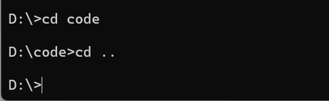
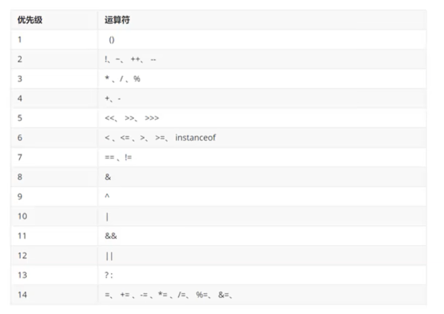

# Java基础知识复习

参考视频：[Java入门基础视频教程，java零基础自学就选黑马程序员Java入门教程（含Java项目和Java真题）_哔哩哔哩_bilibili](https://www.bilibili.com/video/BV1Cv411372m?spm_id_from=333.788.videopod.episodes&vd_source=f3cb3ea986b26c6910b4df6d37acd60d)


# Java入门

## 03、Java入门：JDK的选择安装和下载

jdk的安装直接去Oracle官网下载，这里省略了

### 检查java是否可用以及版本

进入控制台输入命令`java`或`javac`，如果出现以下界面则说明Java安装成功


输入命令`java -version`或`javac -version`检查java版本


### `java`和`javac`的基本作用

`java`和`javac`命令实际上就是执行下图中的程序


其中`javac`是编译工具，用于翻译java程序，将java程序翻译成计算机底层能够识别的语言

`java`是执行工具，用于运行javac翻译后的程序


## 04、Java入门：掌握DOS窗口常见命令

几个命令行窗口常用命令如下

### 1.切换盘符

命令：`盘符字母:`

示例如下

```cmd
C:\Users\Aurora>d:
```


### 2.查看当前路径下的文件

命令：`dir`

示例如下

```cmd
D:\>dir
```


### 3.进入某一级目录

命令：`cd 目录名`

示例如下

```cmd
cd code
```


退回上一级

```cmd
cd ..
```




退回盘符根目录

```cmd
cd \
```


### 4.清屏

命令：`cls`


## 08、Java入门：JDK组成、跨平台原理

### JDK组成

JDK是Java Development Kit的缩写，意为Java开发工具包

JDK由JVM（Java虚拟机，真正运行java程序的地方）、核心类库（java事先提供的程序）和开发工具（java和javac等)组成，其中由JVM和核心类库组成JRE（Java Runtime Environment 即Java运行环境）


### Java程序的运行过程

编写好的Java程序先由javac编译成`.class`文件，再通过`java`命令将`.class`文件放入`JVM`中运行，运行过程中`JVM`会从核心类库中调用相关函数


### Java跨平台原理

Java跨平台指的是"一次编译，处处可用"，编译后的`.class`文件可以在任何平台运行。

原因：

`.class`文件的运行实际上是在`JVM`中运行，在常见的Widows系统中，下载的jdk就已经提供了Windows版本的`JVM`。因此如果要在其他平台上运行，也需要对应平台的`JVM`

如下图所示


## 12、Java入门：IDEA配置、快捷键设置

### 配置IDEA外观

进入设置，搜索appearance，找到Theme即可修改

		


### 设置字体大小

进入设置，搜索font即可修改


### 设置代码背景颜色

进入设置，找到下图所示的页面，想要护眼可以修改背景色为豆沙绿，豆沙绿的rgb是(204,238,200)


### 常用快捷键

#### 1.复制当前行至下一行

`ctrl+D` 


#### 2.删除所在行

`ctrl+Y`或`ctrl+X`


#### 3.格式化代码

`ctrl+alt+L`


#### 4.上下移动当前代码

`alt+shift+上下方向键`


## 14、Java入门：基础语法-注释详解

### 单行注释

以`//`开头，只能注释一行代码

```java
//只能注释一行代码
```


### 多行注释

`/*要注释的内容*/`，可以注释多行

```java
/*
可以注释多行内容
注释
*/
```


### 文档注释

`/**要注释的内容*/`，文档注释与多行注释的区别在于文档注释的内容可以提取到一个程序说明文档里面去

```java
/**
文档注释的内容可以提取到一个说明文档里面去
注释内容
*/
```


### 注释快捷键

#### 1.对选中代码进行单行注释

`ctrl+/`

#### 2.对选中代码进行多行注释

`ctrl+shift+/`


## 15、Java入门：基础语法-字面量详解


## 16、Java入门：基础语法-变量详解

最基本的变量的赋值就不讲了，这里讲一讲变量赋值的原理

### 变量赋值的原理

下面代码变量赋值的原理如下

创建一个变量可以想象为是创建了一个用于存放变量的盒子，所以`int age = 20;`这行代码就是创建一个用于存放`age`数据的盒子

而`age = 21; `这行代码的赋值原理是将盒子里面的数据直接替换为21

Java中的赋值语句是从右往左看的，因此，`age = age + 1;`这行代码的执行原理是先从“盒子”中取出`age`的值，然后加1，最后将相加的结果再放入存放`age`的“盒子”中

```java
int age = 20;			//创建一个变量
age = 21;				//age变为了21
age = age + 1;			//age变为了22
```


## 17、Java入门：基础语法-变量使用时的注意事项

### 变量的注意事项

#### 1.变量必须先声明再使用

```java
int age = 20;					//先声明变量
System.out.println(age);		//再使用变量
```


#### 2.变量只能接收其对应的类型

```java
int age; 				
age = 21;						//int类型变量只能接收整形数据

String s;						
s = "字符串";					//String类型变量只能接收字符串数据
```


#### 3.在同一个`{}`范围内变量的名字不能一致

```java
public static void main (String[] args){
    int age = 2;
    {
        int age =1;		//不在同一个{}范围的变量名可以一致 
    }
    
    int age = 4;		//这行代码会报错，同一个{}范围的变量名不可以一致
}
```

会报类似下图中的错误


#### 4.变量的定义可以不赋初始值，但使用的时候变量一定要有值

```java
int age;						//创建变量时可以不赋初始值
System.out.println(age);		//这行代码会报错，因为此时变量没有值
age = 1;						//为变量赋值
System.out.println(age);		//赋值后的变量才可以正常使用
```


## 18、Java入门：基础语法-关键字、标识符

### 关键字

关键字就是Java语言自己用到的一些词，具有特殊作用，因此我们在创建变量的时候就不能再使用这些词，就像电话号码，110、120等号码就类似与Java关键字，我们的电话号码就不能使用这些。

Java的关键字如下图所示


### 标识符

标识符就是名字，我们创建的类的类名、变量名等都是标识符

### 标识符的要求

1.由数字、字母、下划线、美元符($)等字符组成，甚至用中文来组成标识符也可以，不过很少有人这么干


2.不能由数字开头，且不能是Java关键字，且区分大小写


# Java语法

## 05、Java语法：数据类型

### 基本数据类型

如下图所示


### 注意事项

在Java中，写一个整数是默认为`int`类型，写一个小数默认为`double`类型

因此如下图所示，即使创建的类型是long类型，但数据超出了int类型的范围，就会报错，要解决这个问题就要在数据后面加上字母`L`


加上`L`后不再报错，对于`float`也是一样，小数默认为`double`，要使用`float`的话要在数据后面加上字母`F`


## 06、Java语法：自动类型转换

### 为什么要进行类型转换

因为在开发中存在将不同类型的数据赋给其他类型的变量的情况，如将`byte`类型的数据赋值给`int`类型


### 什么是自动类型转换

将范围小的变量赋值给范围大的变量时，范围小的变量的类型会自动变为范围大的变量类型，不需要我们进行任何操作

```java
byte b = 12;					//byte类型只占一个字节
int i = b;						//int类型占四个字节，因此b可以直接赋值给i，其中已经发生了自动类型转换
```


### 自动类型转换的原理

举个例子，一个`byte`类型的变量记录的数字为12，其底层记录的就是二进制的数字00001100，在`byte`类型转换为`int`类型的时候，由于`int`类型占32位，比`byte`类型长，所以可以直接取出`byte`类型存储的二进制数据00001100放入`int`类型中，而不足32位的只要在左边补上0即可，即转换后`int`类型存储的数据为00000000 00000000 00000000 00001100。


## 07、Java语法：表达式的自动类型转换

在表达式中，小范围的类型会自动转换为大范围的类型后再进行运算

### 注意事项

#### 1.表达式的结果类型是表达式中范围最大的类型

```java
byte b = 1;
int i = 200;
long l = 234702840;
long re1 = b + i + l;				//这个表达式中范围最大的类型是long，因此数据由long类型来接收

int i = 222;
float f = 23432.3323;
double d = 2342424332.34242;
double re2 = i + f + d;				//这个表达式中范围最大的类型是double，因此数据由double类型来接收
```


#### 2.在表达式中btye、short、char是直接转换为int类型来运算的

```java
byte b = 1;
short s = 2;
short re = b + s;					//这行代码是错误代码，虽然short的范围是该表达式中最大的，但由于byte、short在运算时都会转换为int类型，因此最后应该用int类型来接收
int re = b + s;						//这行代码才是正确的
```


## 08、Java语法：强制类型转换

前面讲到的自动类型转换是发生在范围小的数据类型转换为范围大的数据类型，而强制类型转换发生在范围大的数据类型转换为范围小的数据类型

### 强制类型转换语法

```java
要转换的数据类型 变量名 = （要转换的数据类型）被转换的变量;
int i = 20;
byte b = (byte) i;		//int类型强制转换为byte类型
```


### 强制类型转换原理

例如将`int`类型的`i=20`转换为`byte`类型的b，`int`类型占32位，`byte`类型占8位，因此在转换的时，`byte`类型只能存储`int`的8位数据，于是只取出`int`类型的后8位，前面的位数全部舍去。


### 注意事项

大范围转换为小范围可能会导致数据的丢失。


## 09、Java语法：算数运算符、`+`符号做连接符

### 基本算数运算符

基本的算数运算符有加（+）、减（-）、乘（*）、除（/）、取余（%）

加减乘就不讲了，主要讲一下除法需要注意的事项

Java中两个整数的除法结果是整数，原因前面讲了，因为那个表达式的自动类型转换，表达式的结果为表达式中数据范围最大的

```java
int i1 = 4;
int i2 = 2;
int re1 = i1 / i2;						//结果为2

int i3 = 5;
int re2 = i3 / i2;						//结果也为2，如果想要得到2.5，可以看下面的方法

int re3 = 1.0 * i3 / i2;				//结果为2.5，因为此时表达式中范围最大的类型已经变为了double类型
```


### `+`符号做连接符

`+`符号除了用于加法运算，还可以用于字符串的连接，注意是字符串而不是字符，因为字符与数字是可以运算的

```java
System.out.println('a' + 3.14);					//输出结果为100.14
System.out.println("string" + 3);				//输出结果为string3
System.out.println("string" + 3 + 'a');			//输出结果为string3a
System.out.println(3 + 'a' + "string");			//输出结果为100string，因为3和字符a可以先运算，运算结果为100，然后再与后面的字符串连接
```


## 10、Java语法：自增、自减运算符

自增自减的用法就不说了，主要说一下其注意事项

### 自增自减注意事项

#### 1.自增自减不能用在字面量上

字面量就是直接写出来的数据，如`1、2、"字符串"、'a'`等

```java
1++;				//这行代码是错误的，自增自减运算符不能用在字面量上
```


#### 2.自增自减的运算顺序

自增自减放在变量的前面和后面区别非常大

```java
int a = 1;
int re1 = ++a;				//运算符在前面，先进行自增运算，再赋值，所以结果为2

int b =1;
int re2 = b++;				//运算符在后面，先进行赋值运算，再进行自增运算，所以结果为1
```


## 12、Java语法：赋值运算符

要注意的点就是扩展赋值运算符的底层存在一个强制类型转换的操作


## 14、Java语法：逻辑运算符

基本的逻辑运算符如下图所示


### 注意事项

之前用逻辑运算符一直是这样用的

```java
true && false;
true || false;
```

现在回来复习发现中间那个符号只写一个也可以

```java
true & false;
true | false;
```

单符号和双符号的区别如下


双符号的称为短路与、短路或，其性能或好一点，因此实际应用中，一般使用双符号的形式


还有一个用的比较少的，逻辑异或，这个就只能写一个符号

```java
true ^ false;						//这是正确的
true ^^ false;						//这是错误的，只能写一个逻辑异或符号
```


## 15、Java语法：三元运算符、运算符优先级

### 三元运算符

三元运算符的执行流程如下

首先计算条件表达式，如果条件表达式的值为true，则返回值1，如果条件表达式的值为false，则返回值2

```java
条件表达式 ? 值1 : 值2; 

double score = 98.5;
String re = score >=60 ? "成绩合格" : "成绩不合格";				//返回结果为 成绩合格
```


### 运算符优先级

运算符优先级如下图所示



这里就讲一讲`&&`与`||`的优先级，`&&`的优先级比`||`高

```java
System.out.println(3 < 10 || 10 < 100 && 100 > 1000);           //先执行&&，结果为true
System.out.println((3 < 10 || 10 < 100) && 100 > 1000);           //先执行||，结果为false
```


# 流程控制

## 02、流程控制：分支控制：if、switch、switch穿透性

`if`和`switch`的语法就不说了，这里简单说一下`if`和`switch`的区别

`switch`相对于`if`来说比较局限，`switch`主要用于完成值的匹配判断，而`if`还可以用于条件的区间判断，因此`switch`能做到的`if`也能做到，而`if`能做到的`switch`不一定能做到

### `if`语法

```java
if(判断表达式){
    结果为true执行的代码
}else {
    结果为false执行的代码
}
```


### `switch`语法

```java
switch(表达式){
        case 值1:
        {
            要执行的代码;
            break;
        }
        case 值2:
        {
            要执行的代码;
        	break;
        }
        ......
        case 值n:{
            要执行的代码;
            break;
        }
        default :{
            
        }
        	
}
```


### `switch`注意事项

#### 1.switch支持的数据类型

switch的表达式类型只支持`byte` `short` `int` `char` `枚举(jdk5开始支持)` `String(jdk7开始支持)`类型，不支持`long` `double` `float`类型

如下图所示，如果使用long类型会报错


至于为什么不支持小数类型，原因如下

Java中，小数类型的计算是有精度的，可能会导致匹配不准确，如下面示例所示

```java
        double d1 = 0.1;
        double d2 = 0.2;
        double d3 = d1 + d2;
        System.out.println(d3);					//输出为0.30000000000000004，而不是0.3
```


#### 2.case给出的值不允许重复，且只能是字面量，不能是变量


#### 3.switch穿透

如果使用switch的时候没有用break，就会出现穿透现象

例如这段代码

```java
        int l = 2;
        switch (l) {
            case 1: {
                System.out.println("数字为1");
                break;
            }
            case 2:{
                System.out.println("数字为2");
                //break;							//这里省略break，会出现穿透
            }
            case 3:{
                System.out.println("数字为3");
                break;
            }
            default:{
                System.out.println("数字为其他");
            }
        }
```

运行结果如下图所示


原因就是值为2时的break语句被省略了，执行完代码时不会跳出switch，而是继续向下执行，它不仅继续执行还不进行任何判断，这就导致后面其他情况的语句都会被全部执行，直到遇见break
