# Java并发编程学习笔记

参考资料：[黑马程序员深入学习Java并发编程，JUC并发编程全套教程](https://www.bilibili.com/video/BV16J411h7Rd?spm_id_from=333.788.videopod.episodes&vd_source=f3cb3ea986b26c6910b4df6d37acd60d&p=5)


## 基本概念

进程、线程、并发、并行、同步、异步等基本概念在这里就不赘述了。


## 前置

接下来的所有代码都是基于maven项目的，其中pom.xml文件如下：

```xml
<?xml version="1.0" encoding="UTF-8"?>
<project xmlns="http://maven.apache.org/POM/4.0.0"
         xmlns:xsi="http://www.w3.org/2001/XMLSchema-instance"
         xsi:schemaLocation="http://maven.apache.org/POM/4.0.0 http://maven.apache.org/xsd/maven-4.0.0.xsd">
  <modelVersion>4.0.0</modelVersion>

  <groupId>cn.itcast.concurrent</groupId>
  <artifactId>JUC_Learn</artifactId>
  <version>1.0-SNAPSHOT</version>
  <properties>
    <maven.compiler.source>1.8</maven.compiler.source>
    <maven.compiler.target>1.8</maven.compiler.target>
  </properties>
  <dependencies>
    <dependency>
      <groupId>org.projectlombok</groupId>
      <artifactId>lombok</artifactId>
      <version>1.18.10</version>
    </dependency>
    <dependency>
      <groupId>ch.qos.logback</groupId>
      <artifactId>logback-classic</artifactId>
      <version>1.2.3</version>
    </dependency>
  </dependencies>

</project>
```


logback.xml文件如下：

```xml
<?xml version="1.0" encoding="UTF-8"?>
<configuration
        xmlns="http://ch.qos.logback/xml/ns/logback"
        xmlns:xsi="http://www.w3.org/2001/XMLSchema-instance"
        xsi:schemaLocation="http://ch.qos.logback/xml/ns/logback logback.xsd">
    <appender name="STDOUT" class="ch.qos.logback.core.ConsoleAppender">
        <encoder>
            <pattern>%date{HH:mm:ss} [%t] %logger - %m%n</pattern>
        </encoder>
    </appender>
    <logger name="c" level="debug" additivity="false">
        <appender-ref ref="STDOUT"/>
    </logger>
    <root level="ERROR">
        <appender-ref ref="STDOUT"/>
    </root>
</configuration>
```


## 线程的创建

创建线程有多种方法


### 方法1：直接创建Thread类

```java
@Slf4j(topic = "c.test1")
public class CreateThread {

    public static void main(String[] args) {
        
        //创建Thread类对象，并重写run方法
        Thread thread = new Thread(){
            @Override
            public void run(){
                log.debug("running");
            }
        };
        
        //设置线程名
        thread.setName("myThread");
        thread.start();

        log.debug("running");
    }
}
```

输出结果如下：注意看`[]`里面的线程名

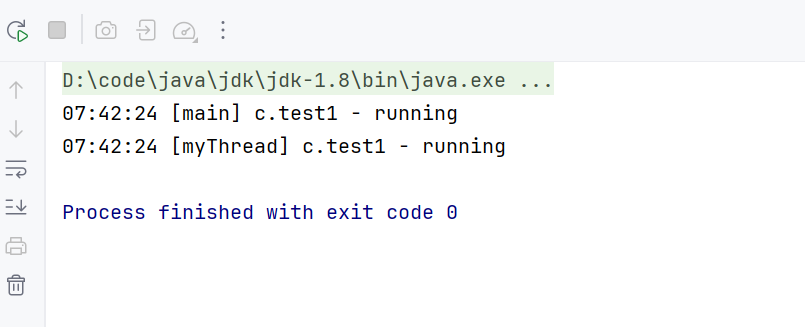


### 方法2：实现Runnable接口

```java
@Slf4j(topic = "c.test1")
public class CreateThread {

    public static void main(String[] args) {

        //创建Thread类对象，并重写run方法
        Thread thread1 = new Thread(){
            @Override
            public void run(){
                log.debug("running");
            }
        };

        //实现Runnable接口，直接通过匿名内部类
        Runnable r = new Runnable() {
            @Override
            public void run() {
                log.debug("running");
            }
        };
        //再利用Runnable接口创建Thread类
        Thread thread2 = new Thread(r,"myThread2");


        //设置线程名
        thread1.setName("myThread1");
        thread1.start();

        thread2.start();

        log.debug("running");
    }
}
```

运行结果如下：

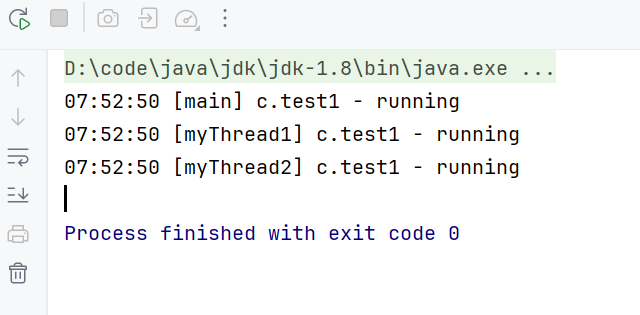


Runnable接口里面只有一个抽象方法，属于函数式接口，可以用Lambda表达式简化：

```java
//实现Runnable接口，直接通过匿名内部类
Runnable r = () -> {
    log.debug("running");
};
//再利用Runnable接口创建Thread类
Thread thread2 = new Thread(r, "myThread2");
```


### 方法1和方法2创建线程的原理

如下图所示：在Thread类中有一个run方法

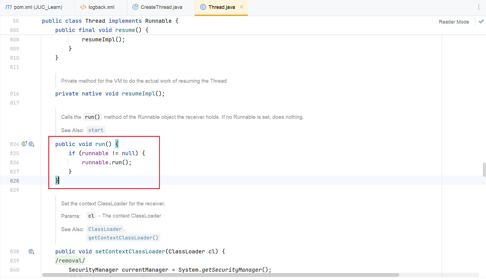

使用方法1创建线程时会重写这个run方法，所以在执行线程时，执行的就是我们自己写的方法。

使用方法2创建线程时，是通过Thread的构造方法传入了一个Runnable对象，可以看到上图中Thread的run方法就是判断runnable对象是否为空，如果不为空就执行runnable对象的方法，这是方法2的原理。

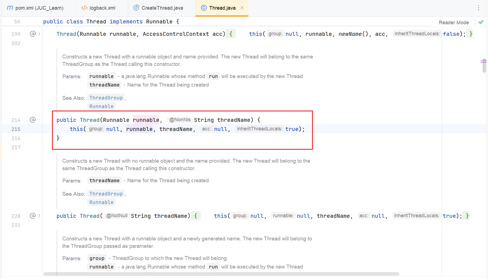


### 方法3：使用`FutureTask`类

前面两种方法创建的线程并不能获取到线程的执行结果，而使用`FutureTask`就可以获取到线程的执行结果。

```java
@Slf4j(topic = "c.test2")
public class FutureTaskDemo {

    public static void main(String[] args) throws ExecutionException, InterruptedException {

        FutureTask<Integer> task = new FutureTask<>(new Callable<Integer>() {
            @Override
            public Integer call() throws Exception {
                log.debug("running");
                //等待1s后返回结果
                Thread.sleep(1000);
                return 100;
            }
        });
		
        //使用FutureTask创建新线程
        Thread thread = new Thread(task,"myThread");
        thread.start();

        //获取任务执行结果，主线程会被阻塞在这里，直到获取到返回结果
        log.debug("{}",task.get());

        log.debug("running");
    }
}
```

运行结果如下：可以看到在1秒后，成功获取到了运行结果100

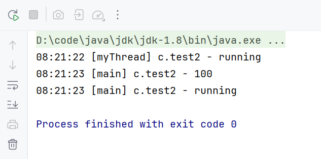


### 查看运行的Java线程

#### windows系统

使用`tasklist`命令可以查看当前运行的所有线程

再加上`findstr`可以过滤出Java线程

```bash
tasklist | findstr java
```

如下图所示：但是该命令没办法查看具体的线程名，没法确定具体是哪一个线程，此时可以使用`jps`命令来查看所有的Java线程。

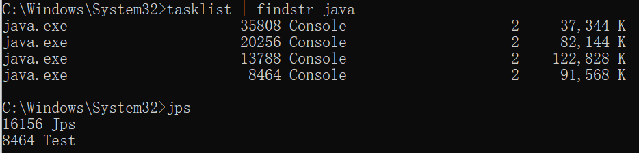


#### Linux系统

`ps -fe `查看所有进程 

`ps -fT -p`  查看某个进程（PID）的所有线程 

`kill`  杀死进程 `top` 按大写 H 切换是否显示线程

 `top -H -p`  查看某个进程（PID）的所有线程


#### 图形化工具jconsole

windows系统下直接`win+r`输入`jconsole`可以进入一个图形化界面，可以查看本地或远程的线程运行情况

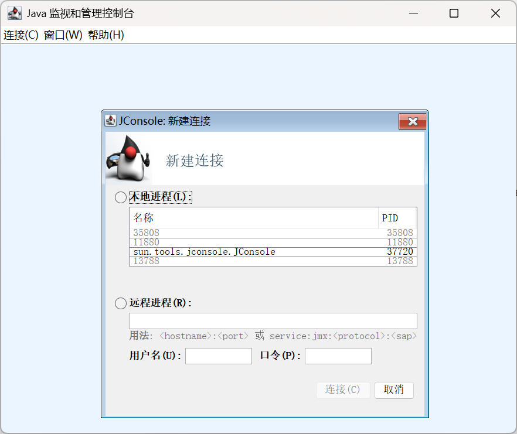

这里就可以看到我们运行的线程：

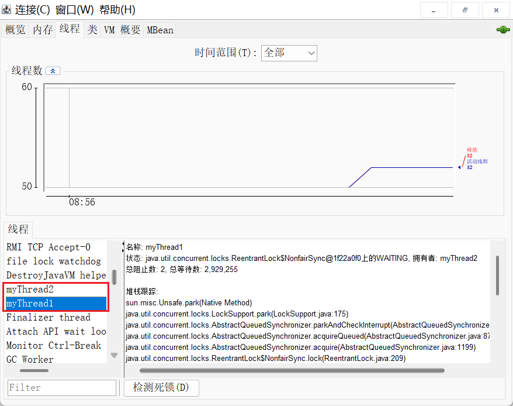


**注意：**如果需要监控远程的Java线程，那么那个被监控的Java程序在启动时需要进行一些配置，要通过下面这种方式运行Java程序：

```bash
java -Djava.rmi.server.hostname=`ip地址` -Dcom.sun.management.jmxremote 
Dcom.sun.management.jmxremote.port=`连接端口` -Dcom.sun.management.jmxremote.ssl=是否安全连接 
Dcom.sun.management.jmxremote.authenticate=是否认证 java类
```


## 多线程调试

如果希望通过打断点的方式查看多个线程的运行情况，需要注意在打上断点时需要右键断点，如下图所示，选择Thread，所有的断点都要这样做。

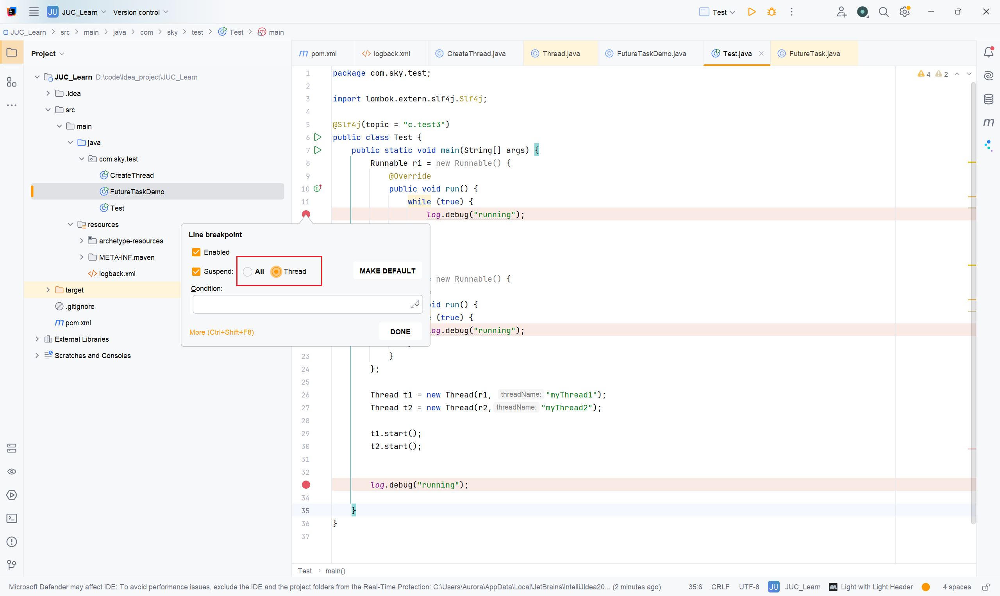


此时我们可以在调试页面看到每一个线程对应的栈帧：点击切换就可以看到每一个线程的运行情况。

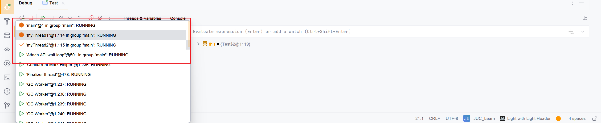


## 线程的上下文切换

 以下几种情况都会导致线程的上下文切换：

1.线程的CPU时间片用完了

2.垃圾回收线程开始执行

3.更高优先级的线程开始执行

4.当前线程主动执行sleep、yield、wait、join、park、synchronize、lock等方法。


当发生线程切换时，操作系统需要保存当前线程的状态，并恢复另一个线程的状态。状态包括程序计数器、每一个栈帧的信息（局部变量、操作数栈、返回地址），所以频繁的上下文切换会消耗性能。


## 线程相关方法

### start和run方法

start方法用于启动线程，调用start方法后，线程会进入就绪状态，具体的执行时机由操作系统决定。同一个线程的start方法只能调用一次，如果再次调用会抛出`IllegalThreadStateException`异常

而调用run方法仅仅只是执行run方法，并没有启动线程，run方法是由主线程调用的，调用该方法的线程需要等待run方法执行完毕才会继续执行。


### sleep方法

sleep方法可以让线程进入等待状态，从`Runnable`状态转换成`Time_Waiting`状态。

进入睡眠状态的线程可以被其他线程调用`interrupt`打断睡眠，睡眠被打断后线程会抛出`InterruptedException`异常

```java
@Slf4j(topic = "c.test3")
public class Test {
    public static void main(String[] args) throws InterruptedException {
        Runnable r1 = new Runnable() {
            @Override
            public void run() {
                    try {
                        //执行sleep方法后线程进入Time_Waiting状态
                        log.debug("enter sleep...");
                        Thread.sleep(2000);
                    } catch (InterruptedException e) {
                        log.debug("wake up...");
                        throw new RuntimeException(e);
                    }
                    log.debug("running");
            }
        };

        Thread t1 = new Thread(r1, "myThread1");

        t1.start();

        Thread.sleep(1000);
        //使用下面这种方式睡眠代码可读性会更好，TimeUnit里面提供了多个时间单位
        //TimeUnit.SECONDS.sleep(1);
        
        //打断线程t1的睡眠
        t1.interrupt();

        log.debug("running");

    }
}
```

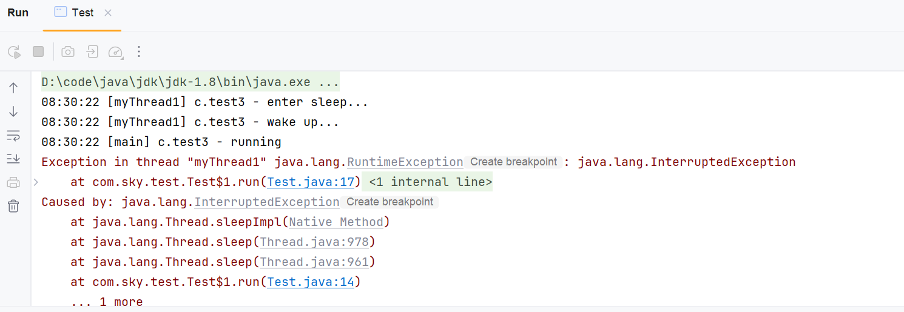


### yield方法

调用yield方法会让当前线程从`Running`状态转为`Runnable`状态，它会使线程主动让出CPU时间片。

yield方法和sleep方法的区别在于，执行sleep方法后会使线程进入阻塞等待状态，线程在某段时间内一定不会执行，但是执行yield方法后，线程仍然可能会被CPU调度执行。

可以看一下下面这个程序：

```java
//线程优先级
@Slf4j
public class ThreadPriority {

    public static void main(String[] args) {

        Runnable r1 = new Runnable() {
            @Override
            public void run() {
                int count = 0;
                for (;;){
                    System.out.println("------->1:"+count++);
                }
            }
        };

        Runnable r2 = new Runnable() {
            @Override
            public void run() {
                int count = 0;
                for (;;){
                    //让出CPU
                    Thread.yield();
                    System.out.println("             ------->2:"+count++);
                }
            }
        };

        Thread t1 = new Thread(r1);
        Thread t2 = new Thread(r2);

        t1.start();
        t2.start();
        
    }
}
```

线程t2让出了CPU时间，运行结果如下：线程1打印次数上百万了，线程2才到十万级

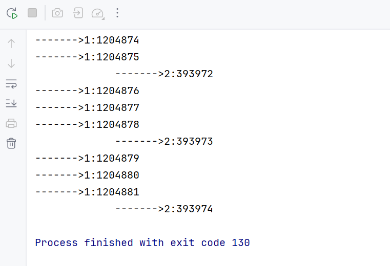


### join方法

join方法用于等待某个线程执行结束。

```java
//join方法测试
@Slf4j(topic = "c.test")
public class TestJoin {

    public static int num = 0;

    public static void main(String[] args) throws InterruptedException {

        Runnable r = new Runnable() {
            @Override
            public void run() {
                try {
                    TimeUnit.SECONDS.sleep(2);
                } catch (InterruptedException e) {
                    throw new RuntimeException(e);
                }

                num = 10;
            }
        };

        long start = System.currentTimeMillis();

        Thread t = new Thread(r);
        t.start();
        log.debug("线程开始执行");
        //等待线程执行结束，最终num会变成10
        //t.join();

        //限时等待，最多等待1.5s，所以此时num还没变成10就已经被输出了
        t.join(1500);

        long end = System.currentTimeMillis();
        log.debug(num+" 耗时："+(end-start));


    }
}
```

运行结果

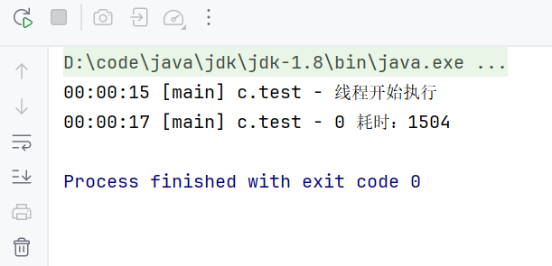


### interrupt方法

interrupt方法用于打断线程的执行，被打断的线程会有一个打断标记，正常来讲如果线程是因为被打断而停止，那么这个打断标记会被标记为true，但是实际情况是如果被打断的线程是阻塞状态的（比如线程中调用了sleep、wait、join方法）那么打断标记会被置为false，其他情况则为正常的true。

使用interrupt方法后，就可以继续使用`isInterrupted`或`interrupted`方法判断线程是否被终止

`isInterrupted`方法不会重置打断状态

`interrupted`方法会重置打断状态


#### 两阶段终止模式

两阶段终止模式的实现思路如下图所示：

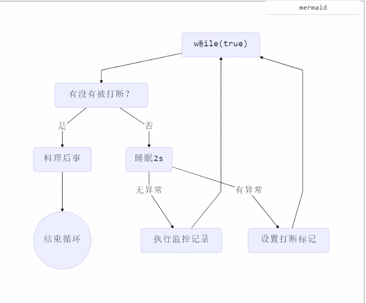

具体代码实现

```java
//两阶段终止
@Slf4j(topic = "c.TwoPhaseTermination")
public class TwoPhaseTermination {

    private Thread thread;

    //开启线程
    public void start() {

        thread = new Thread(() -> {
            Thread curThread = Thread.currentThread();
            while (true){
                //检查是否需要终止
                if(curThread.isInterrupted()){
                    log.debug("线程终止，执行相关资源释放操作");
                    break;
                }

                //如果没有终止，就隔1秒继续执行
                try {
                    Thread.sleep(1000);
                    log.debug("执行线程具体逻辑");
                } catch (InterruptedException e) {
                    //如果sleep时发生异常，interrupt状态会被重置为false，所以需要手动再将interrupt状态设置为true
                    curThread.interrupt();      //重新设置打断标记
                    e.printStackTrace();
                }
            }
        });

        thread.start();
    }

    //终止线程
    public void stop() {
        thread.interrupt();
    }

}

//测试类
class TestClass{
    public static void main(String[] args) throws InterruptedException {
        TwoPhaseTermination twoPhaseTermination = new TwoPhaseTermination();
        twoPhaseTermination.start();
        //隔3秒后终止线程
        Thread.sleep(3000);
        twoPhaseTermination.stop();
    }
}
```


### park、unpark方法

park方法是LockSupport类提供的方法，可以用来暂停一个线程的执行

unpark方法则是用来恢复一个线程的执行。


调用park方法后，线程处于wait状态

调用unpark方法后，后面即使再次使用park方法，**线程也不会暂停**


如果此时线程的中断状态为true，那么park方法不会生效，线程仍然会执行

如果中断状态为false，park方法才会生效


```java
@Slf4j(topic = "c.testPark")
public class TestPark {

    public static void main(String[] args) throws InterruptedException {
        testPark();
    }

    public static void testPark() throws InterruptedException {
        Thread thread = new Thread(()->{
            log.debug("线程正常执行");
            log.debug("park");
            LockSupport.park();     //线程中断状态为false，park方法生效
            //log.debug("打断状态{}",Thread.interrupted());   //外部调用interrupt方法后，中断状态变为true，但是调用interrupted方法后中断状态重置为false，后续park方法仍然生效

            log.debug("打断状态{}",Thread.currentThread().isInterrupted());//isInterrupted方法不会重置中断状态，中断状态始终为true，后续park方法不会生效

            LockSupport.park();         //线程中断状态为false，park方法生效，线程暂停
            log.debug("后续代码逻辑");    //线程暂停，这行代码执行不到

        });

        thread.start();

        Thread.sleep(1000);
        thread.interrupt();
    }


}
```


## 守护线程

在Java中，只要一个进程中还有一个线程在运行，那么这个进程就不会结束。

而守护线程例外，一旦主线程结束，守护线程也会跟着结束

```java
//守护线程
@Slf4j(topic = "c.DaemonThreadTest")
public class DaemonThreadTest {

    public static void main(String[] args) {
        Thread thread = new Thread(() -> {
            while (true){
                try {
                    Thread.sleep(1000);
                    log.debug("子线程运行");
                } catch (InterruptedException e) {
                    throw new RuntimeException(e);
                }
                if(Thread.interrupted()){
                    break;
                }
            }
            log.debug("子线程结束");
        });

        thread.setDaemon(true);     //设置该线程为守护线程,一旦主线程结束，该守护线程也会一起结束
        thread.start();

        log.debug("main线程结束");
    }
}
```


