# Linux学习笔记

参考资料：[第二章-01-Linux目录结构_哔哩哔哩_bilibili](https://www.bilibili.com/video/BV1n84y1i7td?spm_id_from=333.788.videopod.episodes&vd_source=f3cb3ea986b26c6910b4df6d37acd60d&p=11)


## Linux的目录结构

与常用的Windows系统比较，Linux的目录结构有下面几点不同：

1.Windows系统有多个盘符，也就是多个顶级目录，而Linux没有盘符的概念，仅仅只用一个`/`符号就表示根目录，只有一个顶级目录。

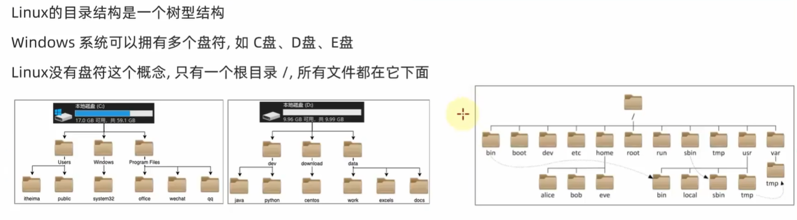


2.Linux系统用`/`来作为路径分隔符，而Windows系统一般用`\`来作为路径分隔符（好像`/`和`\`都可以）。


## Linux命令

### Linux命令基础语法

在Linux操作系统中，不管什么命令，都有一个基本的语法格式，如下：

```sh
command [-options] [parameter]
```

command代表命令本身、options代表可选项、parameter代表参数

例如下面这个命令：

```sh
ls -l /opt/var/logs
```

表示以列表的形式显示/opt/var/logs路径下的所有文件，其中ls就是命令、-l就是可选项、/opt/var/logs 就是命令的参数


### Home目录和工作目录

不管是Linux还是Windows系统，它们都是多用户系统，因此每一个用户都有一个专属于自己的目录，这个目录就是Home目录。

在Linux系统中，Home目录一般在`/Home/用户名`下，这个目录就是Home目录。

而工作目录就是当前终端控制台所在的目录，有些终端在启动时会默认把Home目录作为工作目录。


### 特殊路径符

Linux系统中有下面三种特殊路径符：

1、`.`表示当前目录

2、`..`表示上一级目录，如果想表示上一级的上一级，可以用`../..`，上一级的上一级的上一级可以用`../../..`

3、`~`表示Home目录。


### 普通用户与root用户之间的转换

在普通用户身份下，输入以下命令可以转换成root身份：

```sh
su - root
```

然后输入`exit`就可以退回原来的用户。


### ls命令的选项和参数

#### 参数

ls命令的参数就是要查看的路径

如果没有参数就默认查看当前工作目录下的所有文件，如果有参数就查看指定目录下的所有文件。


#### 选项

ls命令的选项有3个：

1、`-a`

表示列出指定路径下的所有文件，包括隐藏文件。

在Linux系统中，隐藏文件前面有一个`.`

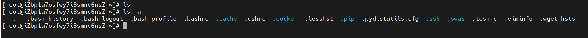


2、`-l`

表示以列表的形式展示指定路径下的文件，列表会展示文件的详细信息，包括权限、创建/更新时间、文件大小等。

多个命令选项可以放在一起使用，写法多种多样，如：`-l -a` `-la`  `-al`

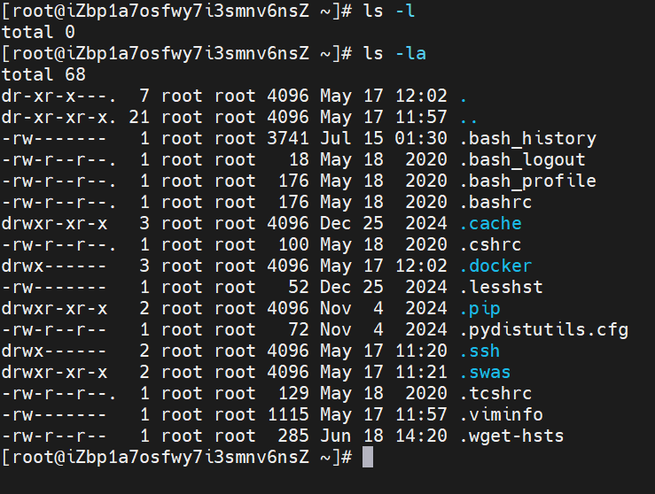

3、`-h`

这个选项通常与`-l`选项一起使用，用于在显示文件大小的同时显示大小单位，如下图可以看到文件大小带上了单位。

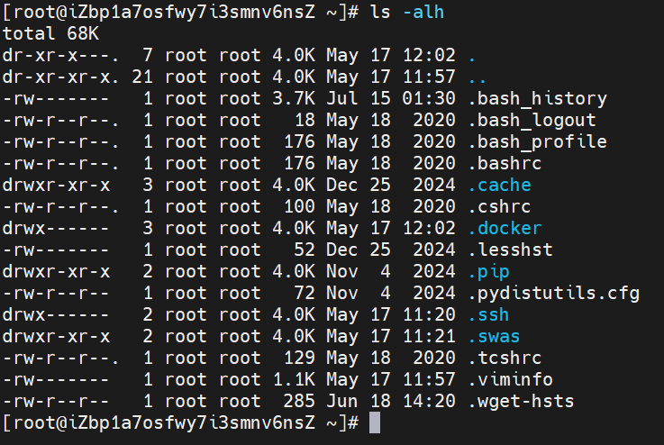


### cd命令

cd命令是change directory的缩写，表示改变当前的工作目录

#### 参数

如果有参数，代表将工作目录修改为指定目录。如果没有参数，默认将工作目录修改为Home目录

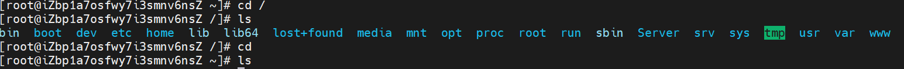

#### 选项

cd命令无选项


### pwd命令

pwd命令是print work directory的缩写，意为打印当前的工作目录。

该命令无参数无选项。

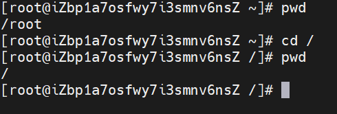


### mkdir命令

mkdir命令取自make directory，即创建文件夹。

mkdir命令需要修改权限，如果登录用户不是root，那么一般只能在Home目录下创建文件夹，在Home目录外会提示权限不足。

#### 参数

mkdir命令的参数是必填的，代表要创建文件夹的路径，路径可以使用`~`、`.`、`..`等特殊路径符。

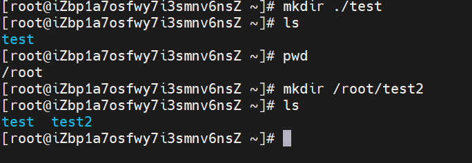

#### 选项

mkdir命令的选项只有一个`-p`，意为在创建目录时，如果父目录不存在，就会连同父目录一起创建。

如果创建文件夹时父目录不存在就会出现以下提示：

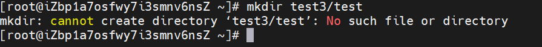

使用了`-p`选项后就会连同父目录一同创建


### touch命令

touch命令用于创建文件

该命令只有参数，没有选项。

参数代表要创建的文件的路径，可以使用特殊路径。

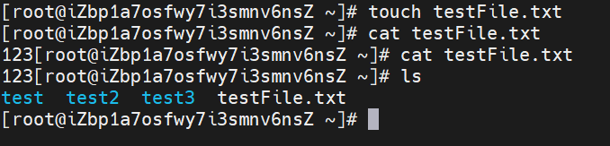


### cat命令

cat命令用于展示某个文件的全部内容。

该命令只有参数，没有选项。

参数代表要展示的文件路径。


### more命令

more命令也是用于展示某个文件的内容，但是与cat不同的是，more命令只会展示部分内容，并可以通过空格翻到下一页，通过B键翻到上一页，按Q可退出。

more命令只有参数，没有选项。

参数代表要展示的文件路径。

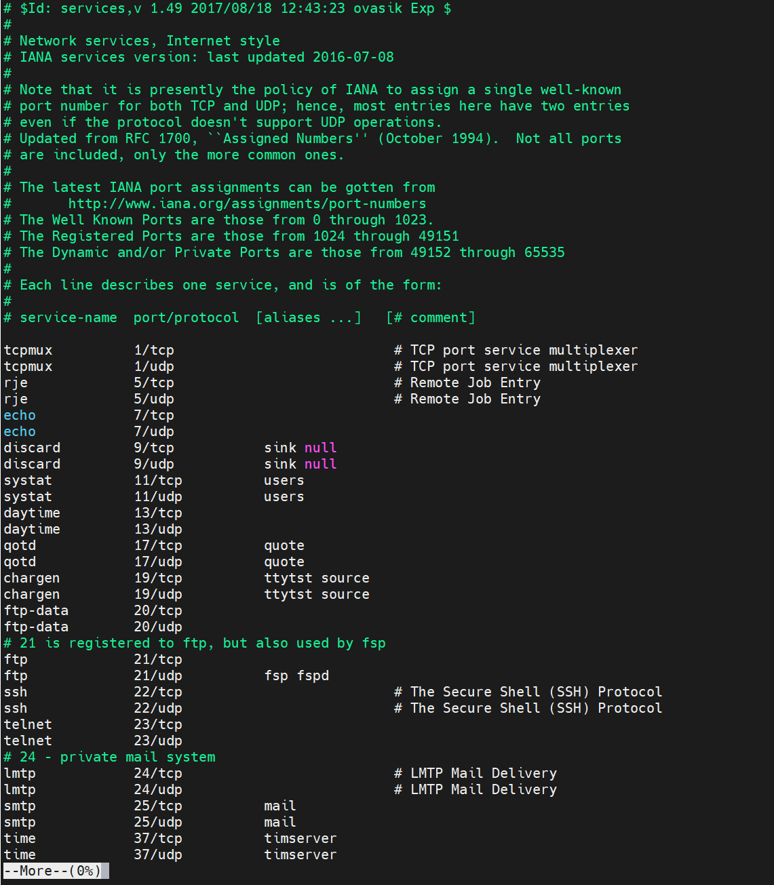


### cp命令

cp命令取自copy，用于复制文件或文件夹。

cp命令的语法如下：

```sh
cp [选项] 参数1 参数2
```

#### 参数

参数1代表被复制的文件或文件夹的路径。

参数2代表文件需要复制到的路径。

#### 选项

cp命令只有一个选项`-r`，用于复制文件夹时表示递归复制。


将testFile.txt文件复制到test文件夹下：

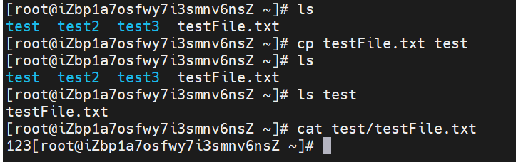


复制文件夹时需要带上`-r`选项：

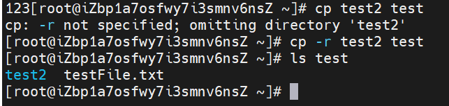


### mv命令

mv命令取自英文move，表示移动文件或文件夹。

mv命令只有参数，没有选项。

mv命令语法如下：

```sh
mv 参数1 参数2
```

参数1代表被移动的文件或文件夹的路径

参数2代表目标路径，如果目标路径不存在，则会将被移动的文件移动过去后将文件名改成目标路径的文件名。


将testFile.txt文件移动到test2文件夹下：

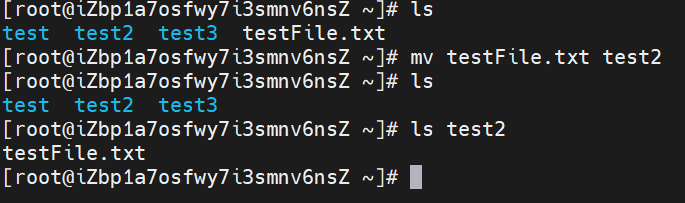


将test3文件夹移动到为test4文件夹，但是test4文件夹并不存在，因此test3会将文件名修改为test4：

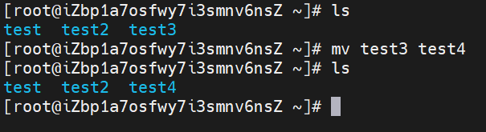


### rm命令

rm命令取自英文remove，表示删除文件或文件夹。

rm命令的语法如下：

```sh
rm [-r -f] 参数1 参数2 ...... 参数N
```


#### 参数

rm命令的参数可以有无数个，每一个参数都代表要删除的文件或文件夹的路径。


#### 选项

`-r` 和cp命令的`-r`选项一样，是用在删除文件夹的时候。

`-f`选项表示强制删除，使用`-f`选项后，执行删除命令时不会弹出提示信息。（需要注意的是，只有root用户在执行删除操作时才会出现删除提示信息，其他的普通用户执行删除操作时不会出现提示信息。）


如下图所示，被删除的是test文件夹，如果不带上`-r`选项，文件夹就无法被删除，然后在执行删除操作时，由于没有使用`-f`选项，所以出现了删除提示信息。

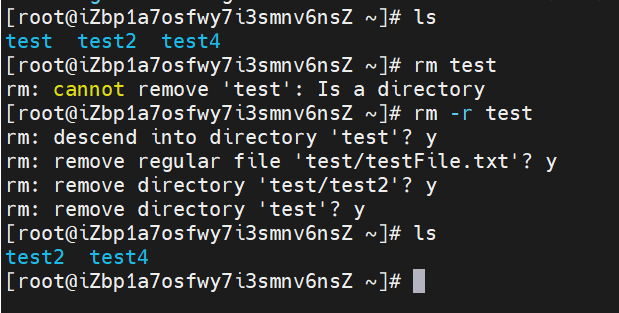

使用了`-f`选项后，就没有出现删除提示信息。

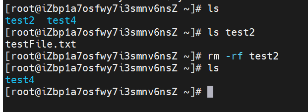


#### 通配符的使用

rm命令支持通配符`*`的使用，使用通配符可以快速删除多个文件。

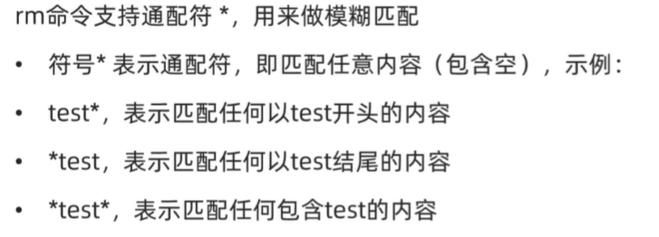


### which命令

在Linux操作系统中有很多命令，这些命令实际上都是一些可执行的二进制文件。

通过which命令，就可以找到这些二进制文件存放的路径

语法如下

```sh
which 要查找的命令
```

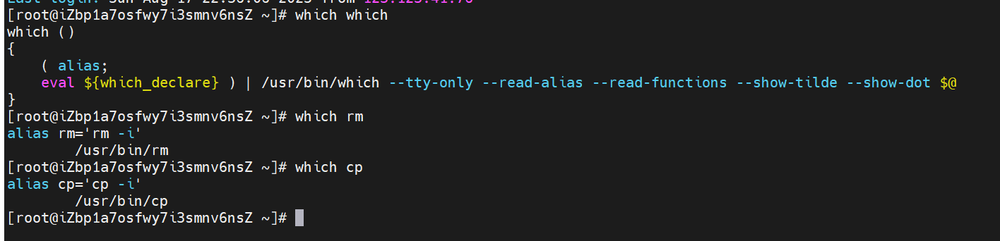


### find命令

通过find命令，可以查找符合条件的文件，有两种查找方式：1.根据文件名来查找  2.根据文件大小查找

#### 根据文件名查找

find命令的语法如下：

```sh
find 起始路径 -name "被查找的文件名"
```

`-name`表示根据文件名来查找

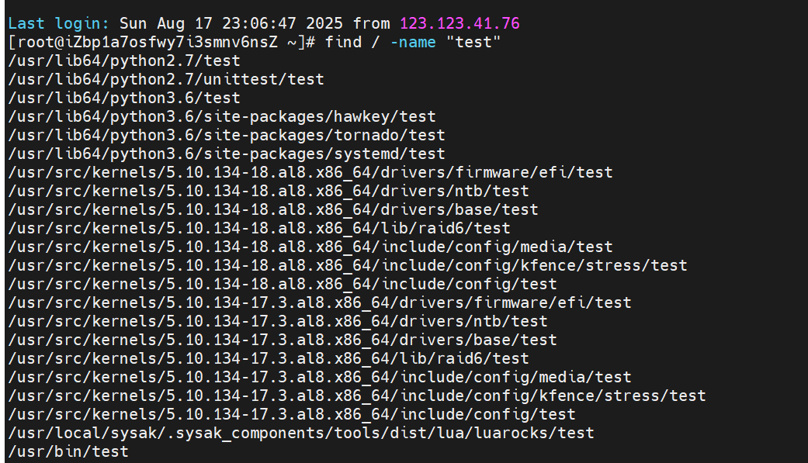


find命令支持通配符的使用，如下图所示：查找文件名包含sky的文件

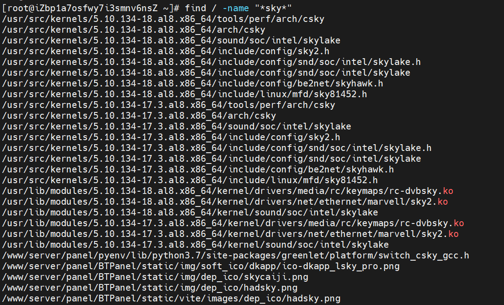


#### 根据文件大小查找

根据文件大小查找文件的语法如下：

```sh
find 起始路径 -size +|- n[KMG]
```

其中：

`-size`选项表示根据文件大小查找

`+`表示大于、`-`表示小于

`n`代表文件大小的数字

`KMG`表示文件大小单位，K表示kb，M表示mb，G表示gb


示例如下：

查找根目录下文件大小大于100kb的文件

```sh
find / -size +100K
```

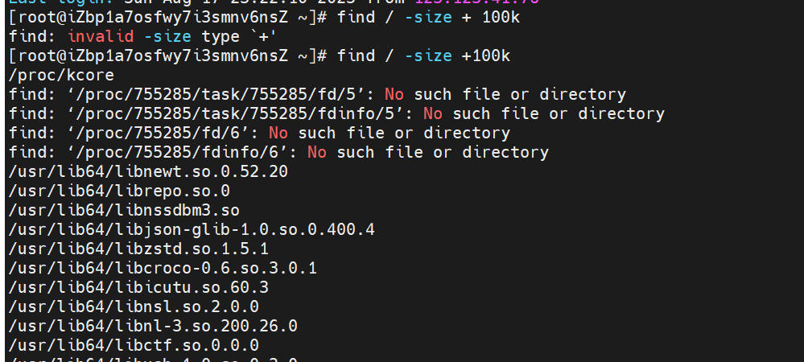


### grep命令

grep命令用于从文件中通过关键字过滤出某一行。

语法如下:

```sh
grep [-n] 关键字 文件路径
```


#### 参数

grep命令有两个参数。

第一个参数表示要过滤的关键字，如果关键字中带有空格等特殊符号，需要用`""`将关键字包围起来，不过建议直接就使用`""`来包围关键字。

第二个参数代表要过滤的文件的路径，第二个参数可以作为内容输入端口（见`管道符`部分）。


#### 选项

grep命令提供了`-n`选项，带上该选项后，命令执行结果会显示出过滤出来的行是文件的第几行

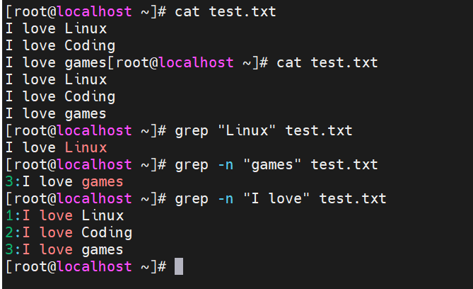


### wc命令

wc命令用于统计文件的行数、单词数、字节数等。

语法如下：

```sh
wc [-c -m -l -w] 文件路径
```


#### 参数

wc命令只有一个参数，代表的是要统计文件的路径，该参数可作为内容输入端口（这块内容见本笔记的`管道符`部分）。


#### 选项

在不使用选项时，wc命令执行结果如下图所示：

前面3个数字依次代表：行数、单词数、字节数

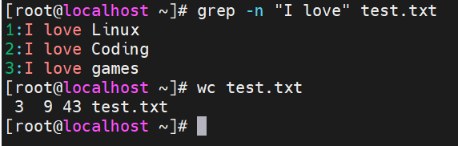

使用选项后，会单独统计出某一个数据。

`-c` 统计字节数

`-m` 统计字符数

`-l` 统计行数

`-w` 统计单词数

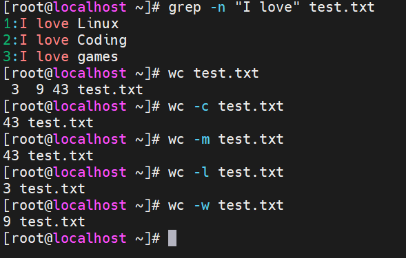


### echo命令

echo命令用于在控制台中打印某些内容，有点类似Java中的print

语法如下：

```sh
echo 要打印的内容
```

#### 反引号

如果想要`echo`打印出某些命令的执行结果，就需要用反引号`将命令包围起来，否则会直接将命令本身打印出来，而不是命令的执行结果。

如下图所示，区分一下带反引号和不带反引号的结果：


### tail命令

tail命令用于查看文件尾部内容。

语法如下：

```sh
tail [-f -num] 文件路径
```


#### 参数

tail命令只有一个参数，代表有查看文件的路径


#### 选项

`tail`命令提供了两个选项。

`-f`表示持续跟踪查看文件尾部内容

`-num`表示要查看尾部多少行，其中num指的是具体的数字，如果不填默认查看尾部10行内容


例如：

test.txt文件中写入了`ls -l` 命令的执行结果

查看文件尾部10行内容:

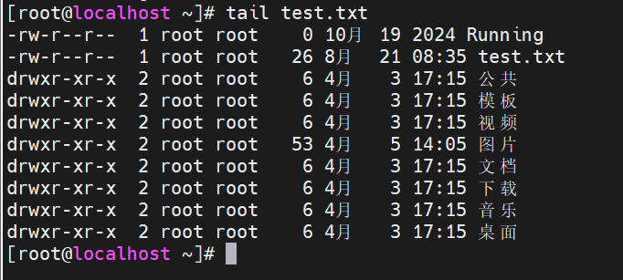


查看尾部5行内容：

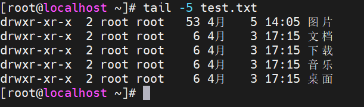

持续跟踪查看文件尾部内容：

当文件被写入新的内容，能够立刻被显示出来。

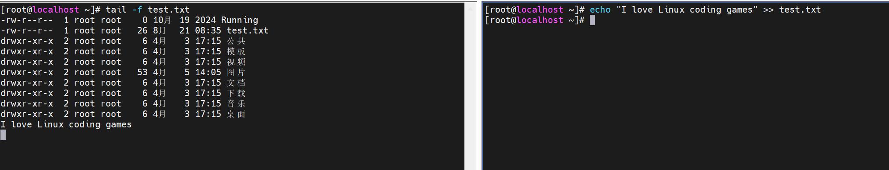


## 管道符

`|`表示管道符，意为左边命令的输出可以作为右边命令的输入，常常配合`grep`等命令使用。

例如：

左边`cat`命令的输出作为右边`grep`命令的输入，然后`grep`命令再进行过滤

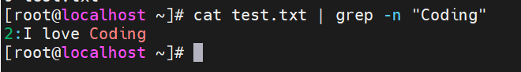


`ls`命令配合`wc`命令还可以用来统计文件夹的文件数量：

注意最终结果应该比实际结果要多一行，因为第一行不是文件信息。


管道符还可以嵌套，例如：

` cat test.txt | grep -n "I love"`命令的结果作为最后一个`grep`命令的输入。

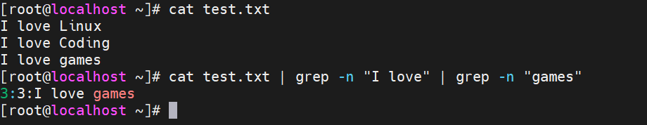


## 重定向符

Linux提供了两种重定向符：`>`和`>>`

它们都表示将左边的结果写入到右边的文件中。

不同点在于`>`是覆盖写入，`>>`是追加写入。

例如：

`>`覆盖写入：

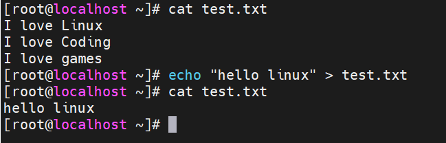


`>>`追加写入：

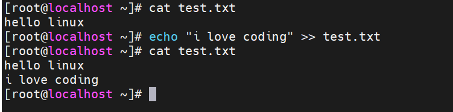


## vi/vim编辑器

vim编辑器是vi编辑器的增强版，它兼容vi编辑器的所有指令，在vi编辑器的基础上进行了增强，适合用来进行shell编程。所以使用vi还是vim都是一样的。

vim编辑器有三种模式，分别是命令模式、输入模式、底线命令模式：

最开始输入vim进入时，处于命令模式

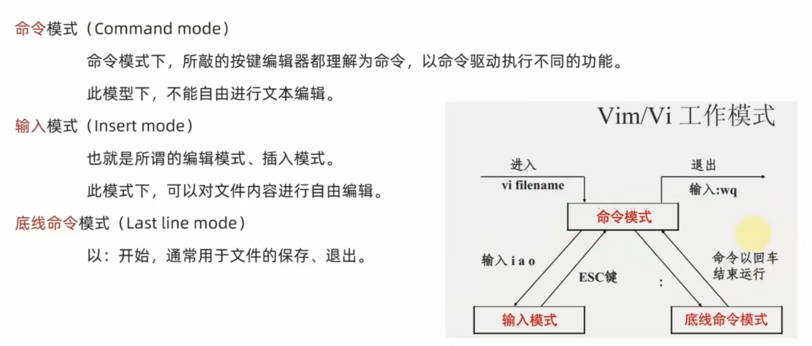

命令模式下的常用指令：

```sh
: -- 切换到底线命令模式，以在最底一行输入命令。
i -- 切换到输入模式，在光标当前位置开始输入文本。（常用）
a -- 进入插入模式，在光标下一个位置开始输入文本。
o：在当前行的下方插入一个新行，并进入插入模式。
O -- 在当前行的上方插入一个新行，并进入插入模式。
x -- 删除当前光标所在处的字符。
dd -- 剪切当前行。（常用）
yy -- 复制当前行。（常用）
p（小写） -- 粘贴剪贴板内容到光标下方。（常用）
P（大写）-- 粘贴剪贴板内容到光标上方。
u -- 撤销上一次操作。（常用）
Ctrl + r -- 重做上一次撤销的操作。
```


底线命令模式下的常用指令：

```sh
:w -- 保存文件。
:q -- 退出 Vim 编辑器。
:q! -- 强制退出Vim 编辑器，不保存修改。
:wq -- 保存并退出文件。（常用）
```


## root用户和普通用户

root用户即为超级管理员，在系统中拥有最高权限，其他用户都是普通用户。

普通用户只有在Home目录下权限才不会受到限制，出了Home目录大多数情况都会受到限制。

如下图所示：

在普通用户arthur下，执行创建文件夹命令时，只有在Home目录下成功了，在根目录下就提示权限不够。

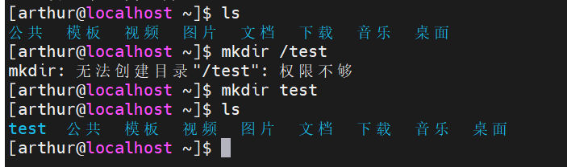

### 用户切换命令su

`su`命令取自英文switch user，用于切换用户。

语法如下：

```sh
su [-] 用户名
```

该命令只有一个选项`-`，且是可选的，带上这个选项表示切换用户的同时会加载环境变量，建议带上。

tips：root切换到普通用户不需要输入密码，而普通用户切换到root用户时需要输入密码。


### sudo命令

由于root用户拥有最高权限，可以执行任何命令，因此如果执行了错误的命令很可能会对系统造成不可逆的影响，所以不建议长期使用root用户。

但是使用普通用户时，执行命令可能会受到权限限制，那怎么办呢?

`sudo`命令可以为普通用户提供临时root权限，在要执行的命令最前面加上`sudo`就可以临时以最高权限执行该命令。

如下图所示：

在arthur用户下执行`mkdir`命令时，在前面加上了`sudo`才执行成功。


### sudo认证

并不是所有的用户都能够使用`sudo`命令的，如果所有用户都能使用`sudo`，那还不如一直保持在root用户下。

普通用户在使用`sudo`命令前需要进行sudo认证。

有两种方式进行sudo认证，都需要在root用户下：

1.使用`visudo`命令，会自动进入`/etc/sudoers`文件的vim编辑界面。

2.直接使用vim编辑器打开`/etc/sudoers`文件、

然后在文件末尾添加下面的内容
```sh
arthur ALL=(ALL) NOPASSWD:ALL
用户名            执行sudo时不需要密码
```

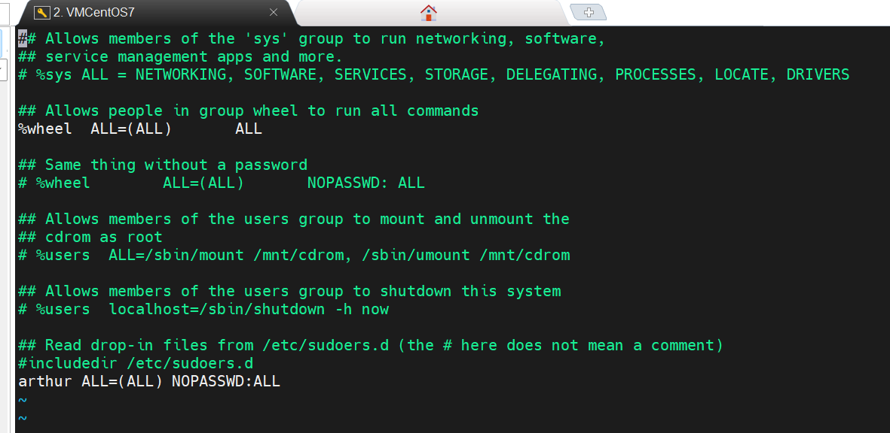

此时再次使用arthur用户就可以直接使用`sudo`命令：


## 用户和用户组

在Linux系统中，权限管理分为了两个粒度，一个是用户（可以指定某一个用户拥有某些权限），另一个是用户组（可以指定用户组中的所有用户拥有某些权限）

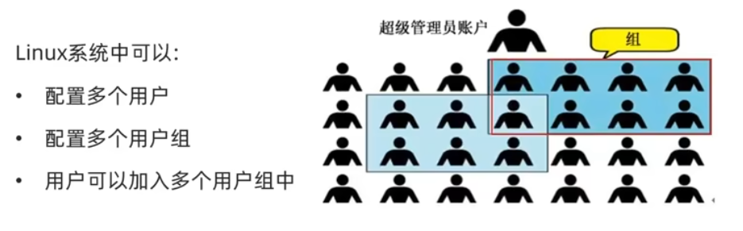

### 常用命令

#### 创建/删除用户组

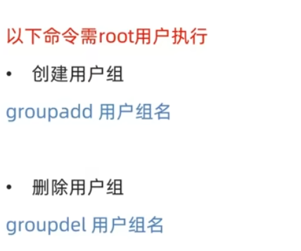

#### 管理用户

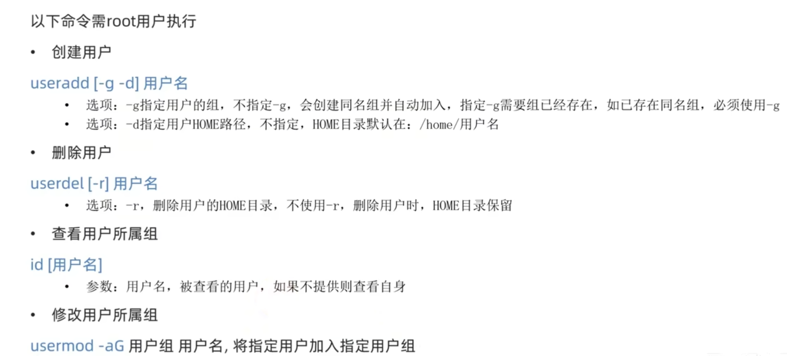


#### 查看当前系统中的所有用户

```sh
getent passwd
```

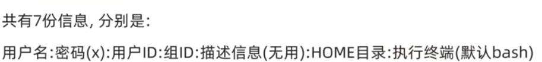

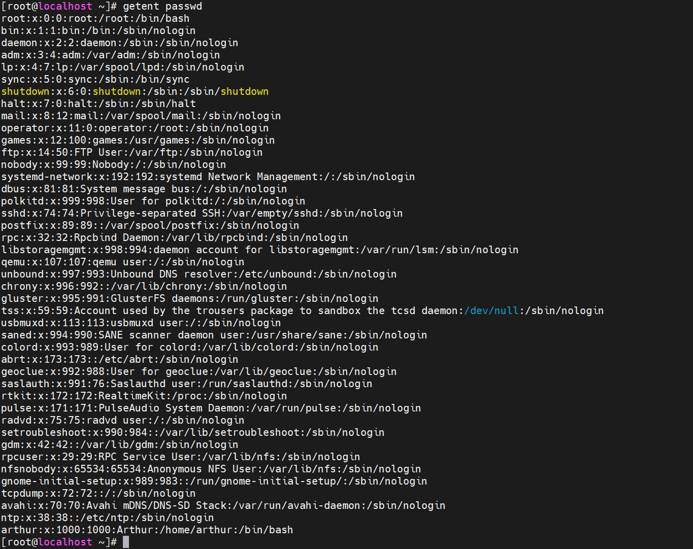


#### 查看当前系统中的所有用户组

```sh
getent group 
```


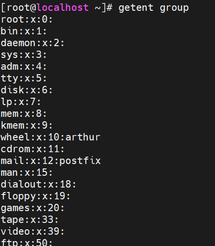


## 权限控制信息（查看文件/文件夹的权限）

当执行`ls -l` 命令时，每一行的最左边都是文件/文件夹对应的权限信息。

文件/文件夹的权限主要看下图中的三个部分：

第一个部分表示权限细节，其组成部分如下图所示：

其中r代表可读，`w`代表可写，`x`代表可运行，`-`代表没有对应的权限。

如果文件能被执行`cd`命令，说明当前用户拥有这个文件的x权限

如果文件能被执行`ls`命令，说明当前用户拥有这个文件的r权限

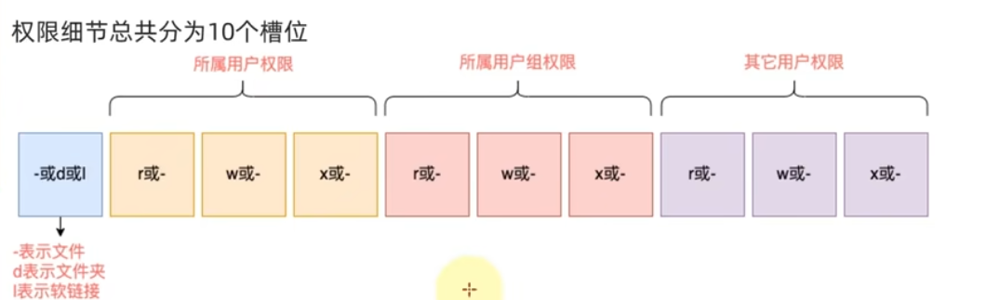

第二个部分表示这个文件所属的用户。

第三个部分表示这个文件所属的用户组。

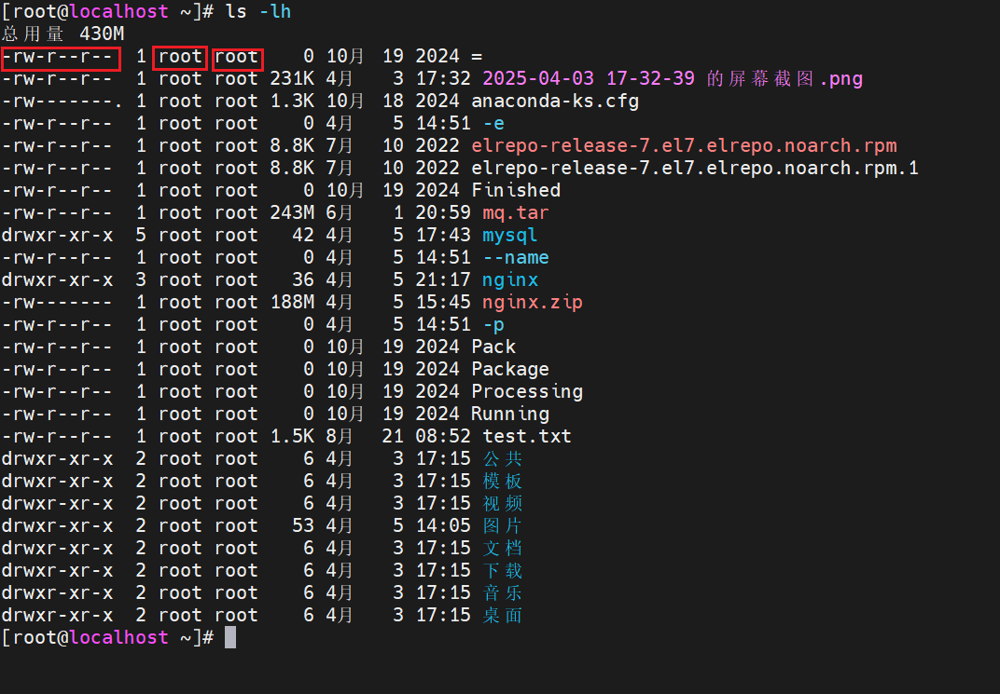


## 修改文件/文件夹权限（chmod命令）

`chmod`命令可以用来修改文件/文件夹的权限，该命令只能由root用户执行。

语法如下：

```sh
chmod [-R] 权限 文件/文件夹路径
```

其中`-R`选项表示对文件夹内部的所有文件同样修改相同权限。

使用示例如下：

```sh
chmod u=rw,g=rw,o=rw 2025-04-03 17-32-39 的屏幕截图.png
```

其中`u`表示设置用户权限，`g`表示设置用户组权限，`o`表示设置其他用户的权限。

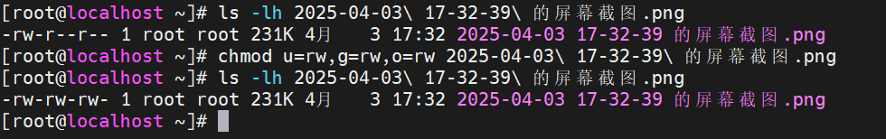


命令简化：

实际上上面这种修改权限的写法相对比较麻烦，需要写u、g、o啥的，但这些其实都可以简化的。

每一个用户的权限都可以用一个数字来表示，比如：

```sh
chmod 751 文件路径
```

上面的命令表示将文件权限设置为：用户为rwx、用户组为rx、其他用户的权限为x。

可以从二进制的角度来理解，不管是用户还是用户组，都对应这三个权限rwx，那么也就可以用三位数来表示权限，比如：

所有权限都有，也就是rwx都有：111，只有x权限：001，然后将这个二进制转化成10进制即可，即：所有权限：7，只有x权限：1


## 修改文件/文件夹所属用户/用户组（chown命令）

使用`chown`命令来修改文件/文件夹所属的用户/用户组，只有root用户可以执行该命令，即使该文件/文件夹属于某个用户。

语法如下：

```sh
chown [-R] [用户][:][用户组] 文件/文件夹路径
```

`-R`选项表示对文件夹内部的所有子文件进行同样的修改操作。

使用示例如下：

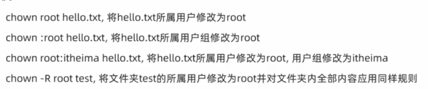


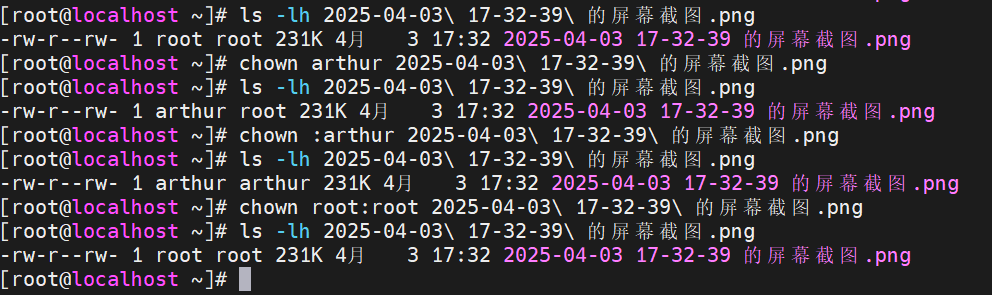


## 快捷键/快捷命令

### 强制停止

使用`ctrl + c` 来强制停止命令的执行或者终止命令的输入

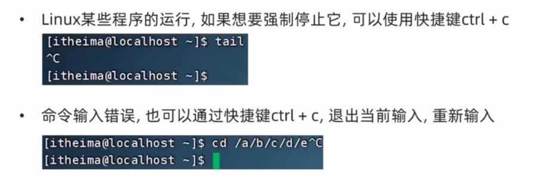


### 退出/登出

使用`ctrl + d`来退出当前用户登录或者退出某个特定的环境，比如：python环境。

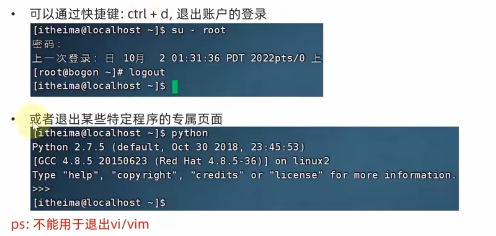


### 历史命令

使用`history`命令来查看所有历史命令。

使用`!前缀`来执行匹配到前缀的历史命令，优先匹配最近的历史命令

使用`ctrl + r`来通过关键字搜索历史命令，也是通过关键字优先匹配最近的历史命令。

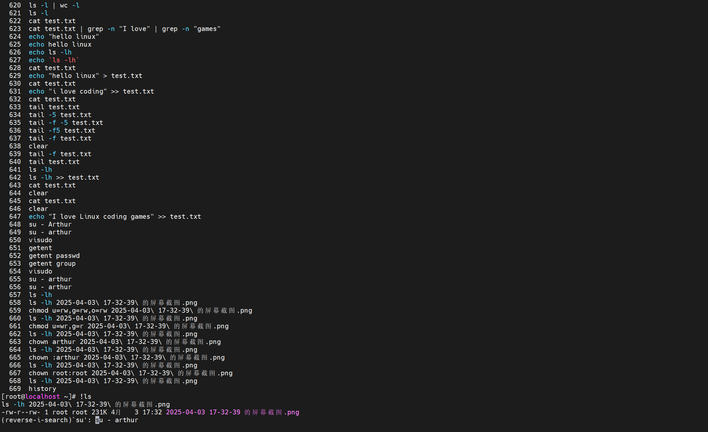


### 快速移动光标

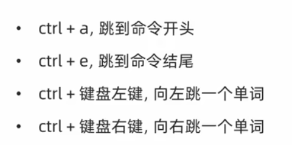


### 清屏

使用`clear`命令或者`ctrl + l`实现清屏效果


## 软件安装

由于Linux有很多发行版本，常见的有CentOS、Ubuntu，不同发行版本使用的程序安装包格式不一样，CentOS使用的是`.rpm`，而Ubuntu使用的是`.deb`，所以它们的软件安装方式不一样。


### CentOS

在CentOS中通常使用`yum`命令来安装软件，`yum`是一个包管理工具，只需要通过一个命令就可以完成软件的安装，它会自动安装软件以及软件所需要的依赖包。

语法如下：

```sh
yum -y [install | remove | search] 软件名称
```

可选项`-y`表示执行安装或卸载命令时不再需要确认。

搜索软件：

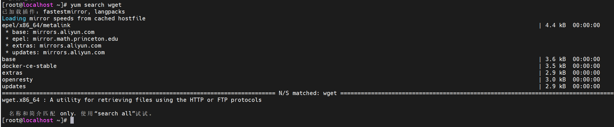


卸载软件：

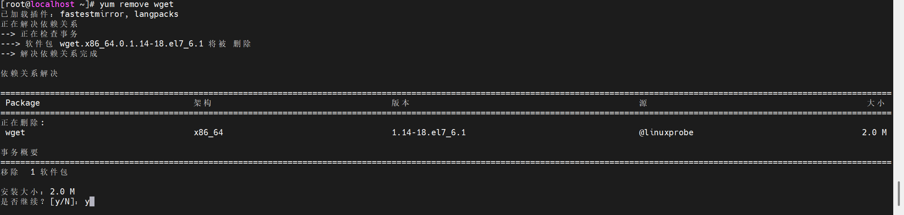


下载软件：

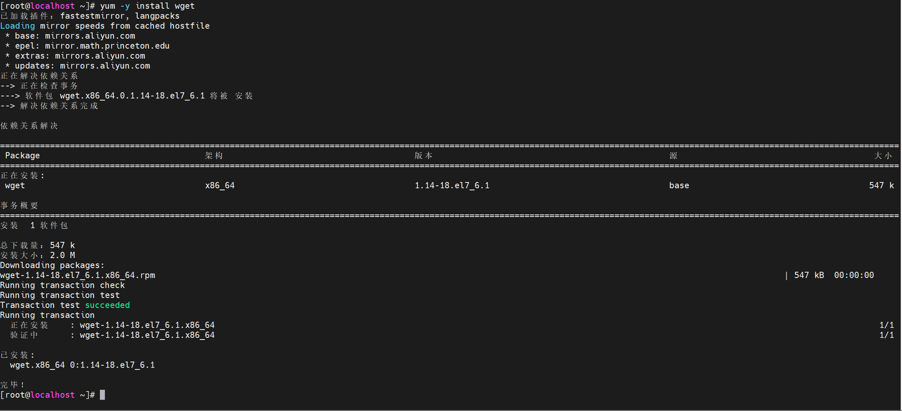


### Ubuntu

在Ubuntu系统中是使用`apt`命令来安装软件的。

其语法如下：

```sh
apt -y [install | remove | search] 软件名称
```

其用法与CentOS的`yum`基本一致。


## 控制服务的启动与关闭（systemctl命令）

在Linux中，很多软件都可以使用`systemctl`命令来控制其启动或停止，这些能被`systemctl`命令控制的软件被称为服务。

一般Linux系统自带的软件都能够用该命令进行控制，而第三方软件有的会自动注册服务，有的不会，组成成服务的第三方软件就能够被该命令控制。

语法如下：

```sh
systemctl start | stop | status | enable | disable 服务名称
```

`start`：启动服务

`stop`：停止服务

`status`：查看服务的状态

`enable`：将服务设置为开机自启动

`disable`：取消服务的开机自启动


使用示例：

查看防火墙的状态

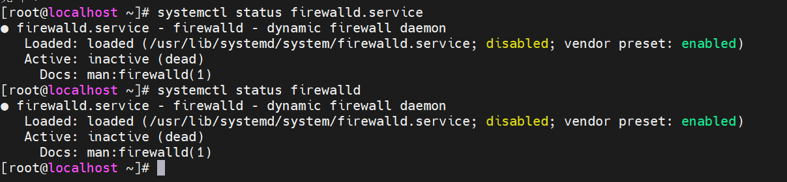


开启/关闭防火墙


## 软链接

软链接类似于windows系统中的快捷方式，可以创建一个软链接指向其他位置的文件或文件夹。

比如有一个文件的路径太复杂了，我想给它在用户空间创建一个快捷方式，就可以给它创建一个软链接

创建软链接的语法如下：

```sh
ln -s 被链接的文件路径 软链接创建的路径
```

**注意：**选项`-s`表示创建软链接，必须要带上选项软链接才会创建成功。

如下图所示，在Home目录下创建了一个软链接：yum.conf，可以看到软链接的最左边权限部分的第一个字母是`l`，代表的就是软链接

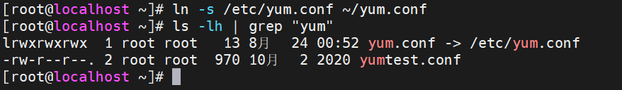


## 日期和时区

在Linux中可以是使用`date`命令来查看日期。

语法如下：

```sh
date [-d] [字符串格式]
```


### 时间格式化

`date`命令的第一个参数就是用来格式化时间的

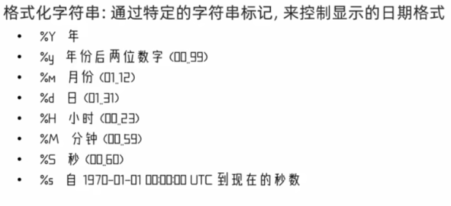

使用示例：将时间格式化为`yyyy-MM-dd HH:mm:ss`格式

```sh
date "+%Y-%m-%d %H:%M:%S"
```

注意格式化字符串前面要带上`+`号，再特别注意`M`是分钟，`m`才是月份

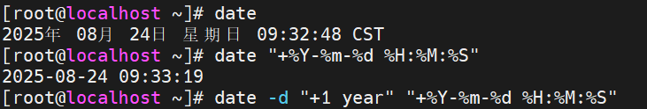


### 时间的计算

使用`-d`选项可以用来计算时间，用法如下：

```sh
date -d "+|-数字 时间标记"
```

`+`表示将当前时间加上指定的时间

`-`表示将当前时间减去指定的时间

支持的时间单位如下图所示：


用法示例：显示当前时间一年后的时间，后面的格式化字符串是可选的

```sh
date -d "+1 year" "+%Y-%m-%d %H:%M:%S"
```

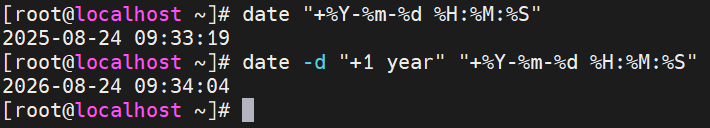


### 修改系统时区

修改Linux系统的时区步骤如下：

1.删除`/etc/localtime`

2.建立要设置的时区的软链接，软链接建立的目标地址就是上面删除的`/etc/localtime`

比如我要将当前时区改成`Aden`时区

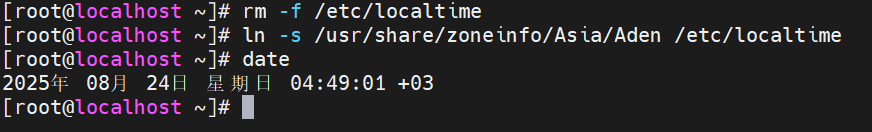


### ntp程序（自动校对时间）

ntp程序会定时联网校对时间。

安装ntp程序：

```sh
yum -y install ntp
```

该程序会自动注册服务，可以使用`systemctl`命令来控制服务的状态。

也可以使用该程序来主动校准时间：

```sh
ntpdate -u 服务器地址
ntpdate -u ntp.aliyun.com
```

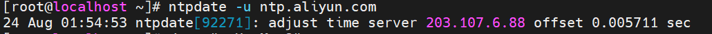


##  IP地址和主机名

### 查看IP地址

可以使用下面的命令来查看ip地址：

```sh
ip addr
ifconfig
```

**注意：**第二个命令是`ifconfig`不是`ipconfig`

在使用第二个命令时如果提示命令找不到，就需要先安装`net-tools`

```sh
yum -y install net-tools
```

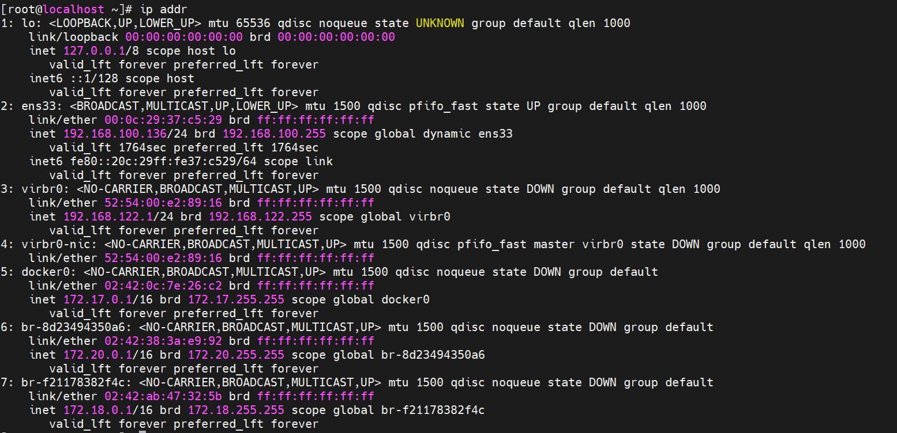


### 查看/修改主机名

使用`hostname`命令可以查看主机名，如下图所示：

实际上，命令终端最左边的`[]`里面的内容除了当前用户的用户名外，`@`后面的就是主机名。

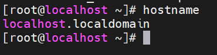

修改主机名可以使用下面的命令：

```sh
hostnamectl set-hostname 新的主机名
```

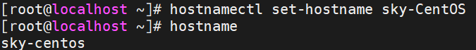


### 通过主机名来访问Linux系统

现在我链接Linux系统是通过ip地址来链接的，但是有了主机名过后，我们就可以在windows系统中配置ip地址与主机名的关系，然后直接通过主机名就可以连接到Linux系统。

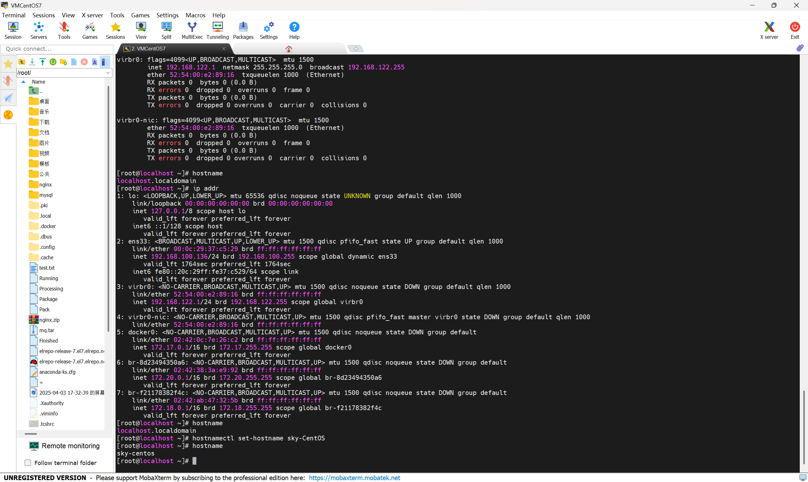


配置方法：

直接编辑windows系统中的`C:\Windows\System32\drivers\etc\hosts`文件，添加ip与主机名的映射

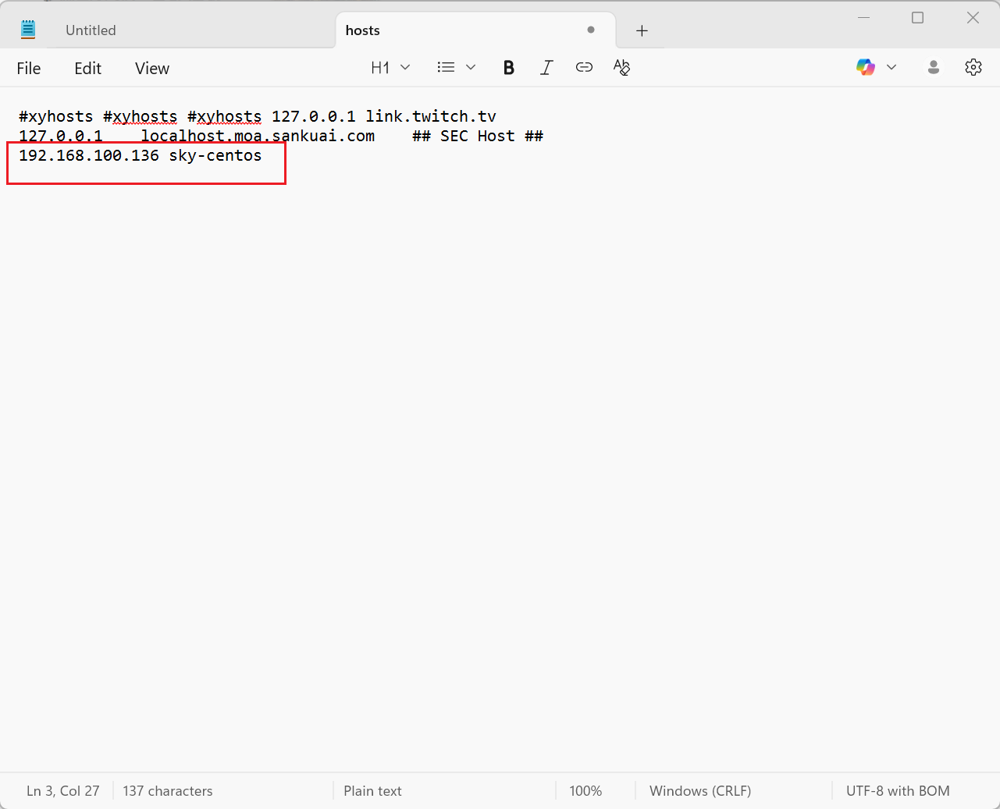


## 网络请求和下载

### 测试ip或域名的连通性

使用`ping`命令来测试当前主机与某个ip或域名的连通性。

语法如下：

```sh
ping [-c num] ip/域名
```

选项`-c`表示测试连通性的测试，如果不带这个选项就会无限次地测试。


### 从网络中下载文件

可以使用`wget`命令来从网络中下载文件。

语法如下：

```sh
wget [-b] url
```

选项`-b`表示在后台下载，后台下载时会将下载情况记录到`wget-log`文件

后台下载：


### 发起请求

使用`curl`命令可以向某个网址发起请求。

语法如下：

```sh
curl [-o] url
```

选项`-o`表示下载文件。


## 查看端口占用

### nmap命令

`nmap`命令不是系统自带的，需要先安装：

```sh
yum -y install nmap
```

`nmap`命令语法如下：

```sh
nmap ip地址
```

该命令会列出对应ip地址所有开放的端口。

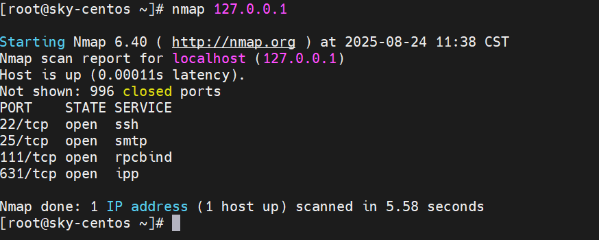


### netstat命令

`netstat`命令会列出很多端口的占用情况，可以配合`grep`命令过滤出想看的信息。

比如查看22端口的占用情况，也可以用来查看某个进程号的端口占用情况。

```sh
netstat -anp | grep "22"
```


如果执行命令后什么都没有显示，说明该端口没有被占用，且也没有对应进程号的进程。


## 进程管理

### 查看进程

使用`ps`命令可以查看进程运行情况。

语法如下：

```sh
ps [-e -f]
```

`-e`选项表示显示出全部进程

`-f`选项表示以完全格式化的形式显示进程，也就是会显示出进程的全部信息。


通常该命令会配合管道符和`grep`命令来过滤出我们想要的进程。


### 杀死进程

使用`kill`命令可以杀死进程。

语法如下：

```sh
kill [-9] 进程号
```

`-9`选项表示强制关闭进程。


## 系统资源监控

使用`top`命令可以查看系统当前的资源占用情况以及进程运行情况。

top命令支持的选项：

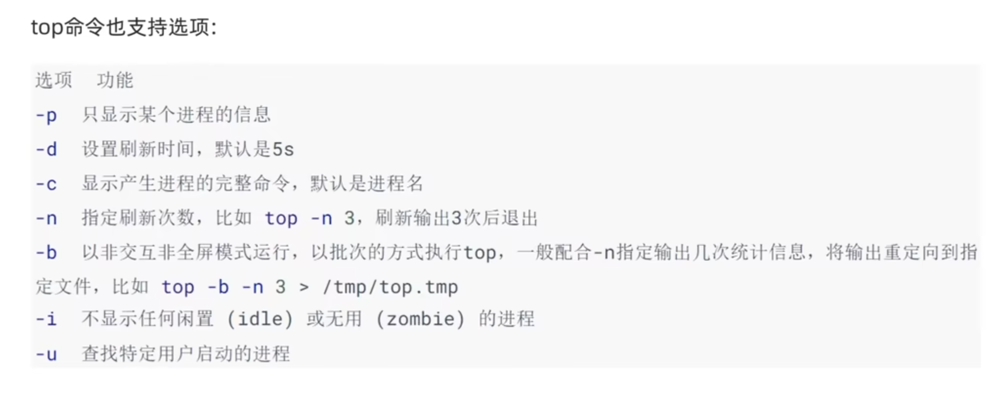

示例：

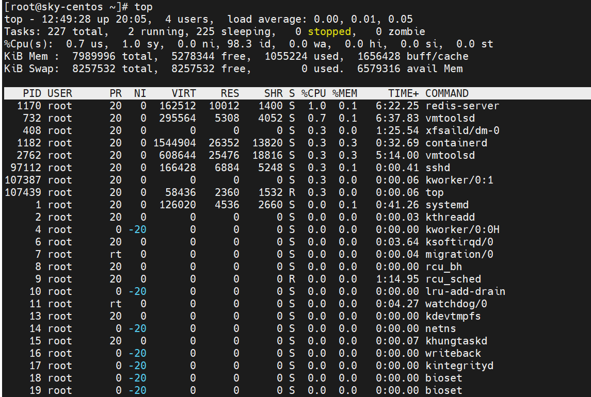

展示的信息详解：

系统资源部分：

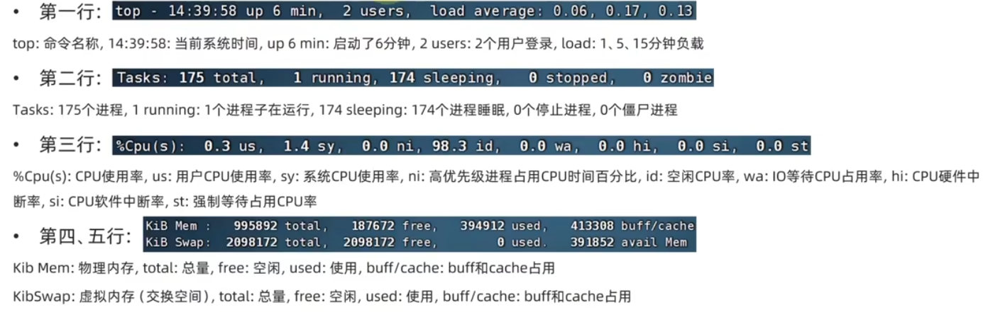


## 磁盘资源监控

使用`df`命令来查看磁盘的使用情况。

```sh
df [-h]
```

`-h`选项表示显示大小单位，空间大小显示更人性化

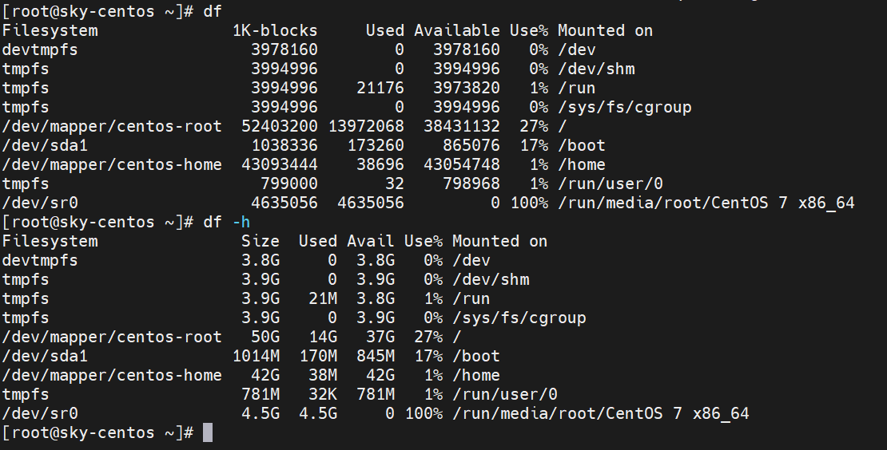


## 环境变量

### 查看环境变量

在Linux系统中，可以使用`env`命令来查看环境变量

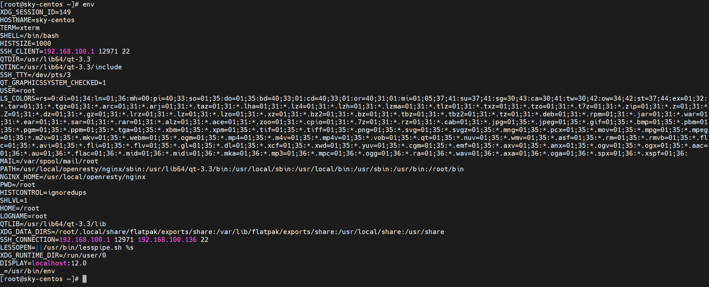

环境变量是键值对的形式。

我们知道，执行命令时，实际就是执行一个对应的文件，那为什么在任何工作目录下命令都能够准确无误地找到要执行的文件呢？答案就是环境变量。

环境变量中有一个键叫`PATH`，在执行程序时会优先从这个`PATH`里的路径中去寻找对应的文件，而所有命令对应的可执行文件都已经配置到这个`PATH`路径中了。

使用`$`加对应键值就可以查看环境变量中该键对应的值：

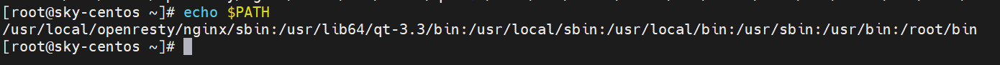

所以如果自己写了一个程序希望在任何目录下都能够执行，就可以把这个程序的路径添加到这个`PATH`值里面。


### 设置环境变量

可以使用`export`命令来设置一个环境变量，但要注意，通过这种方式设置的环境变量是临时的，一旦终端退出或重启就会失效。

语法：

```sh
export key=value
```

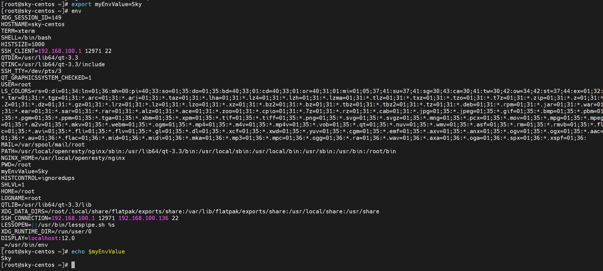


如果想要让环境变量永久生效，可以采用下面的方式：

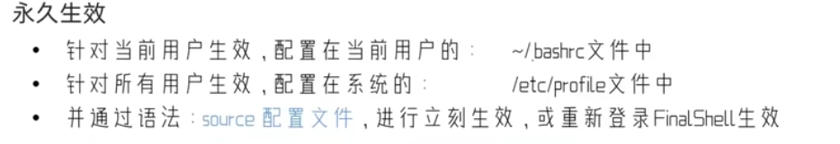


### 将程序添加到PATH中

将程序路径添加到`PATH`中后，程序就可以在任意路径下被执行了。

步骤如下：

1.修改`~/.bashrc`或`/etc/profile`文件

将自定义的程序的路径`~`（在Home目录中）添加到了`PATH`中，注意下图中的意思表示先取`PATH`的值，再在此基础上添加`~`路径，不然原本`PATH`的值会被覆盖

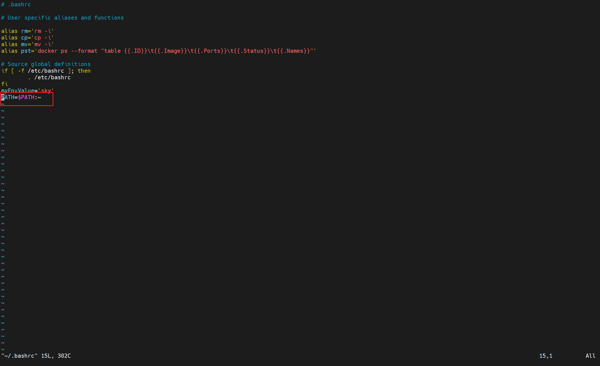

2.执行`source ~/.bashrc`使配置立刻生效。这样路径就添加完成了

此时不管是在`/`目录下还是`~`目录下都能够执行这个文件了：

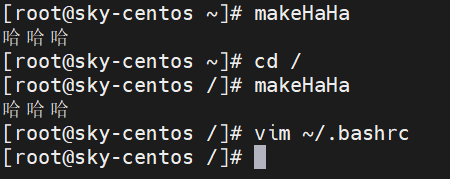


## 文件上传和下载

文件上传和下载有两种方式

第一种方式直接通过终端操控软件，直接以图形化的方式就可以完成本机与被远程操控的Linux主机之间的文件传输。这种就不赘述了。

第二种方式可以通过命令的方式，这种方式要先下载一个工具

```sh
yum -y install lrzsz
```


### 从被操控的Linux主机中下载文件

可以使用`sz`命令

```sh
sz 要下载的文件路径
```


### 向Linux主机上传文件

可以使用`rz`命令，执行该命令后，会自动弹出一个操作窗口让选择要上传的文件。


## 文件的解压缩

Linux中常用的压缩包格式有两种：`.tar`，`.gz`

`.tar`包并没有对文件起到压缩文件的效果，它仅仅是起到将多个文件归档到一块，是一个封装的效果，压缩成`.tar`不会使文件大小变小

`.gz`才是对文件起到了压缩的效果，它可以使文件体积减小。


### 压缩文件

解压缩文件可以使用`tar`命令，其选项如下：

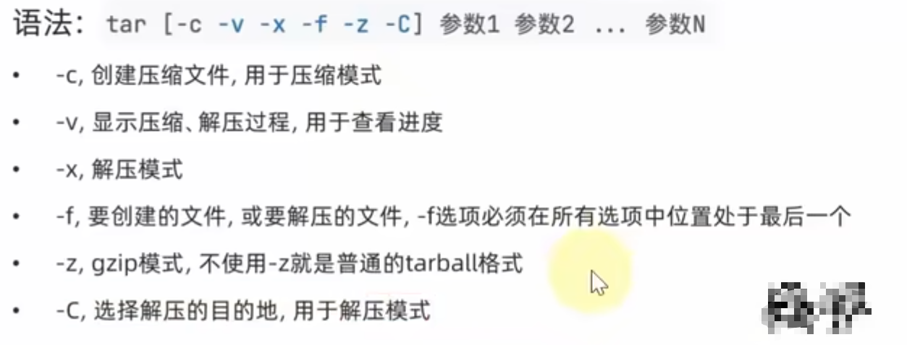

这么多选项了解一下即可，具体使用一般用下面两个固定的命令：

1.压缩成`.tar`文件

```sh
tar -cvf test.tar 要压缩的文件路径列表
```


2.压缩成`.gz`文件

```sh
tar -zcvf test.tar.gz 要压缩的文件路径列表
```


### 解压文件

解压文件也有几个比较常用的命令组合：

1.将文件解压到当前目录

```sh
tar -xvf test.tar
```


2.将文件解压到指定目录

```sh
tar -xvf test.tar -C 指定目录
```


3.以GZip模式来解压，并将结果存放到指定目录

```sh
tar -zxvf test.tar -C 指定目录
```


### zip格式文件的解压缩

虽然Linux通常不用zip格式，但总是需要用到，所以对于zip格式的文件需要使用`zip`命令来压缩，使用`unzip`命令来解压。


#### zip命令

`zip`命令用来将文件压缩成`.zip`压缩包，其语法如下：

```sh
zip [-r] 参数1 参数2 参数3 。。。参数N
```

`-r`选项表示如果被压缩的文件中带有文件夹就需要带上`-r`选项。

**注意：**第一个参数表示将文件压缩到的路径，不是被压缩文件的路径


#### unzip命令

`unzip`命令用来解压`.zip`文件，语法如下：

```sh
unzip [-d] 参数
```

`-d`选项用来指定压缩结果应该放到哪个路径下

参数是被解压的文件的路径。

比如：

1.将test.zip解压到当前目录

```sh
unzip test.zip
```

2.将test.zip解压到指定目录

```sh
unzip -d /root/test test.zip
```


