# Maven学习

参考视频：[黑马程序员Maven全套教程，maven项目管理从基础到高级，Java项目开发必会管理工具maven_哔哩哔哩_bilibili](https://www.bilibili.com/video/BV1Ah411S7ZE/?spm_id_from=333.337.search-card.all.click&vd_source=f3cb3ea986b26c6910b4df6d37acd60d)


## 01Maven简介

#### 什么是maven

maven是一个项目管理工具，其将项目资源看成一个项目对象模型（POM），并进行管理

#### maven的作用

maven用来管理依赖，可以统一依赖版本，避免jar包版本冲突
maven提供了标准的、跨平台的自动化构建方式
同时，由于maven过于好用，使用范围广泛，所有其间接地统一了一些项目的文件结构


## 02Maven的环境配置

#### 配置MAVEN_HOME

找到maven的安装目录：D:\CodeTool\env\apache-maven-3.9.9


进入系统变量设置，新建一个MAVEN_HOME变量


进入系统变量的path，再添加一个环境变量，输入：%MAVEN_HOME%\bin


打开cmd，输入mvn，检查配置是否成功


## 03Maven基本概念-仓库

maven仓库是用于存放jar包的，仓库有本地仓库和远程仓库两种。


当本地用户需要获取jar包时，其首先访问本地仓库，如果没有才接着访问远程仓库。
远程仓库又分为私服和中央仓库
私服属于企业自己搭建的仓库，除了存放从中央仓库获取的jar包外，还存放自己研发的不开源的jar包。
中央仓库是maven官方维护的，里面存放的都是开源的jar包。


## 04Maven基本概念-坐标

maven中央仓库里面有很多jar包，也因此要找到这些jar包是一件不大容易的事。于是就有了坐标

#### 坐标的定义

maven中坐标用于描述仓库中资源的位置，如jutil的坐标如下
```xml
<!-- https://mvnrepository.com/artifact/io.github.topicstudy/jutil -->
<dependency>
    <groupId>io.github.topicstudy</groupId>
    <artifactId>jutil</artifactId>
    <version>3.3.1</version>
</dependency>

```

groupId：代表该jar包所属的组织名称（通常是域名反写）

artifactId：代表该jar包的名称

version：代表该jar包的版本

#### 如何查看jar包的坐标？

访问：[Maven Repository: Search/Browse/Explore](https://mvnrepository.com/)


进入要找的jar包后，可以看到对应的坐标代码


## 05Maven基本概念-仓库配置

maven的默认本地仓库是在c盘下对应用户名文件夹下的一个叫.m2文件


如果不改的话，随着jar包的越来越多，c盘就会爆满，所以我们需要修改本地仓库

#### 如何修改本地仓库的位置？

首先找到maven的安装目录，进入conf文件夹，打开setting.xml文件


找到里面的<localRepository>标签，添加本地仓库的位置


#### 如何添加镜像仓库？

原来的中央仓库位于国外，访问速度很慢，因此我们需要配置一个国内的镜像仓库，来提高访问速度

和修改本地仓库一样，打开setting.xml文件，但这里我们去找<mirrors>标签，在<mirrors>里面添加一个<mirror>

阿里云镜像仓库
```xml
<mirror>
  <id>aliyunmaven</id>
  <mirrorOf>central</mirrorOf>
  <name>阿里云公共仓库</name>
  <url>https://maven.aliyun.com/repository/public</url>
</mirror>
```


我这里添加了一个阿里云镜像仓库，其他镜像仓库地址可参考文章：[国内Maven仓库镜像地址汇总及配置-CSDN博客](https://blog.csdn.net/yuanmomoya/article/details/143200519)


## 06第一个Maven程序-Maven项目结构（手动搭建）

根据maven项目的文件目录结构来搭建maven项目


java文件夹用于存放项目源代码
resources文件夹用于存放项目的配置文件

项目文件结构搭建好后我们来写main程序

Demo.java
```java
package com.myDemo;

public class Demo{
	public String say(String name){
		System.out.println("hello"+name);
		return "hello"+name;	
	}

}
```

写完后将其放在对应的包文件夹下，这里目录对应下来就是D:\IDEA_Porject\Maven-project\project-jave\src\main\java\com\myDemo

写好了main程序接着写test程序

TestDemo.java
```java
package com.myDemo;

import org.junit.Test;
import org.junit.Assert;


public class DemoTest{
	@Test
	public void testSay(){
		Demo d=new Demo();
		String ret=d.say("maven");
		Assert.assertEquals("hello maven",ret);
	}
}
```

注意也要将该文件放在对应的包文件夹中

写好了main和test，还需要写一个pom.xml文件，这样一个maven项目才算创建完成

将pom.xml文件放在与src文件夹同级的目录下


pom.xml
```xml
<project xmlns="http://maven.apache.org/POM/4.0.0"
         xmlns:xsi="http://www.w3.org/2001/XMLSchema-instance"
         xsi:schemaLocation="http://maven.apache.org/POM/4.0.0 http://maven.apache.org/xsd/maven-4.0.0.xsd">
    <modelVersion>4.0.0</modelVersion>
    <groupId>com.myDemo</groupId>
    <artifactId>project-java</artifactId>
    <version>1.0.0</version>
    <packaging>jar</packaging>
    <dependencies>
        <dependency>
            <groupId>junit</groupId>
            <artifactId>junit</artifactId>
            <version>4.12</version>
        </dependency>
    </dependencies>
</project>
```

这样，一个maven工程就手工搭建完成

## 07第一个Maven程序-Maven项目构建

在上面maven工程文件搭建好后，我们还需要执行一系列的命令

#### 编译命令：mvn compile

在cmd中进入src所在目录下执行该命令，注意需要管理员权限进入cmd，我这里没用管理员权限出了点问题


执行该命令后，如果本地仓库内没有相关的依赖，那么maven会先下载相关依赖到本地仓库，如图所示，本地仓库出现了下载下来的依赖


编译成功，如下图所示


编译完成后，在与src同级的目录下会生成一个target目录，用于存放编译后的.class等文件


#### 清除命令：mvn clean

输入清除命令后，compile生成的target文件会消失


#### 测试命令：mvn test

输入测试命令，会去编译/src/test下的代码，并将编译结果也放到target文件夹中，同时返回测试结果并生成测试报告


在target目录下生成测试报告


#### 打包命令：mvn package

使用该命令，会自动执行前面讲到的编译命令和测试命令，只有编译和测试成功后就会在target目录下生成一个jar包


生成的jar包如图


#### 安装命令：mvn install

执行该命令会将项目文件生成为一个jar包并存入本地仓库


位置与写项目时的包有关，例如我这里写的包是com.myDemo，那么jar包就会被放在仓库的com/myDemo下


## 08第一个Maven程序-插件创建Maven工程

使用插件创建Maven工程，实际上是使用命令来创建
注意创建Maven工程时所在的目录不能是在Mavne工程目录下，创建工程的目录不能有pom.xml文件

#### 创建java工程

使用命令如下
```cmd
mvn archetype:generate -DgroupId=com.myProject -DartifactId=java-project -DarchetypeArtifactId=maven-archetype-quickstart -Dversion=0.0.1-snapshot-DinteractiveMode=false
```

创建java工程里面的pom.xml文件packing标签里面内容为jar


#### 创建Web工程

使用命令如下
```cmd
mvn archetype:generate -DgroupId=com.myProject -DartifactId=web-project -DarchetypeArtifactId=maven-archetype-webapp -Dversion=0.0.1-snapshot-DinteractiveMode=false
```

创建Web工程，main文件夹里面会多出一个webapp文件，此外pom.xml文件packing标签里的内容为war


## 09-10第一个Maven程序-idea版创建Maven工程

首先创建一个空工程


进入projectStructure配置jdk


然后进入settings搜索maven，然后设置maven路径和配置文件


配置好后接着进入projectStructure创建新的maven模块


这样就能创建出一个maven工程，这里文件缺少resources可以自己添加


可以在idea右侧找到maven相关的快捷命令


此外还可以自定义运行配置


自定义运行配置的好处是可以通过点调试按钮，来打断点调试maven命令


## 11第一个Maven程序-tomcat插件安装与web工程启动

#### 安装tomcat

安装tomcat插件，可以先去maven坐标网站查找其对应坐标，这里查找如下

```xml
<!-- https://mvnrepository.com/artifact/org.apache.tomcat.maven/tomcat7-maven-plugin -->
<dependency>
    <groupId>org.apache.tomcat.maven</groupId>
    <artifactId>tomcat7-maven-plugin</artifactId>
    <version>2.1</version>
</dependency>

```

要安装tomcat插件，需要在项目的pom.xml文件中进行配置，与依赖配置不同，插件配置需要在<build>标签中的<plugins>中进行配置

```xml
<build>
    <finalName>web</finalName>
    <plugins>
      <plugin>
        <groupId>org.apache.tomcat.maven</groupId>
        <artifactId>tomcat7-maven-plugin</artifactId>
        <version>2.1</version>
      </plugin>
    </plugins>
  </build>
```

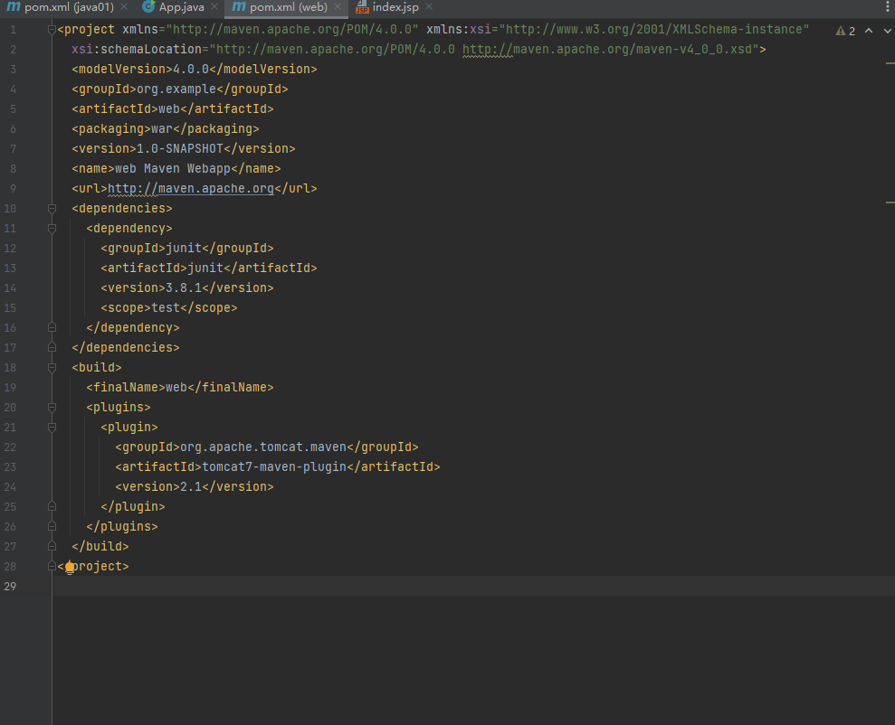

配置好后就可以在右边的maven条中查看到对应的插件
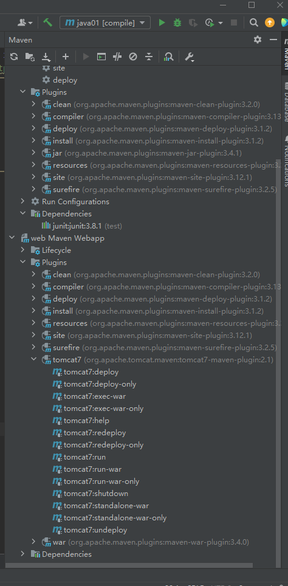

#### 启动web工程

在安装了tomcat后可以直接通过tomcat的run命令来启动web


启动后便可本地访问对应网页
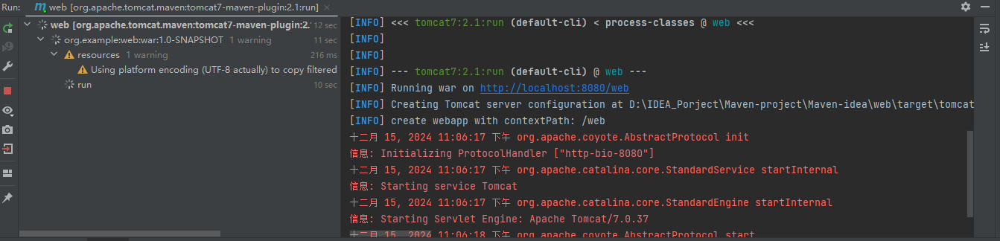

此外可以在安装插件是进行配置，可以配置端口等
```xml
<build>
    <finalName>web</finalName>
    <plugins>
      <plugin>
        <groupId>org.apache.tomcat.maven</groupId>
        <artifactId>tomcat7-maven-plugin</artifactId>
        <version>2.1</version>
        <configuration>
          <port>80</port>			<!-- 配置端口-->
          <path>/</path>
        </configuration>
      </plugin>
    </plugins>
  </build>
```


## 12依赖管理-依赖配置与依赖传递

#### 依赖管理

项目需要用哪些依赖，就在其pom.xml文件进行配置即可，这里我在java01项目中添加一个log4j的依赖

只需在pom.xml的<dependency>标签中添加一个依赖坐标，然后刷新maven，就可以在java01的依赖中看到

```xml
<dependency>
    <groupId>org.apache.logging.log4j</groupId>
    <artifactId>log4j-core</artifactId>
    <version>2.24.3</version>
</dependency>
```

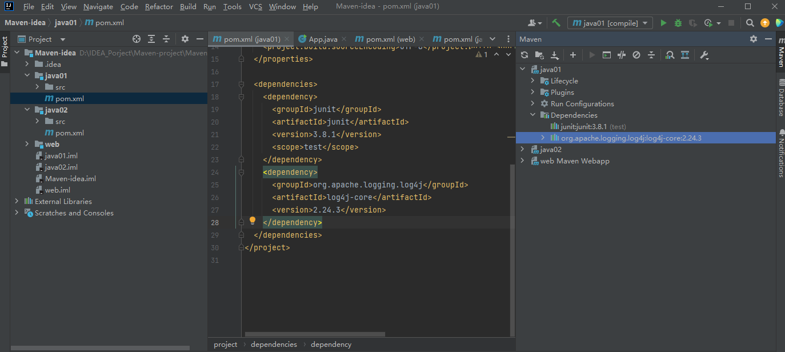

#### 依赖传递

在开发中，可以在一个项目中使用另一个项目，在这里我可以在java01项目中去使用java02项目，如果这样，java02项目中的所有依赖也会被java01继承，这种情况就是依赖传递

在java02的pom.xml文件中找到其坐标
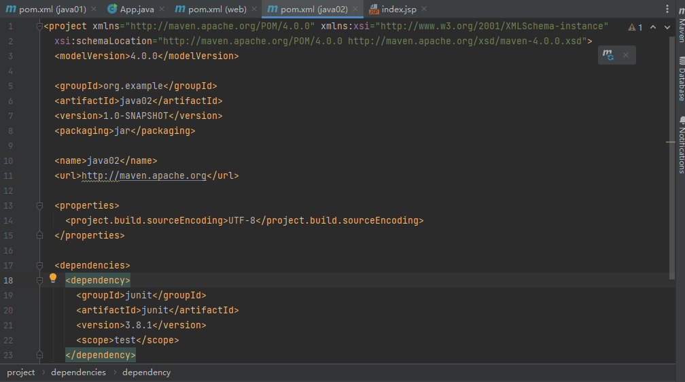

将java02的坐标写入java01的pom.xml文件中

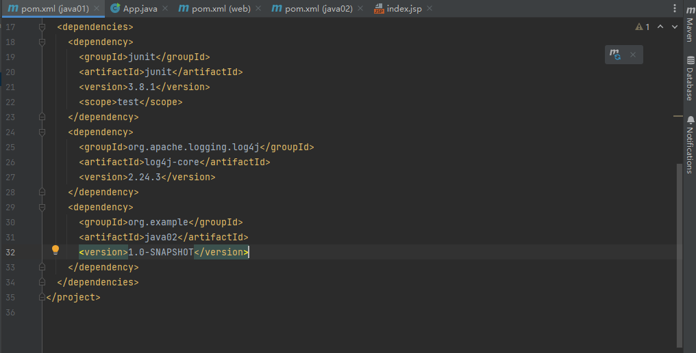

刷新maven就可以看到java01也继承了java02的依赖
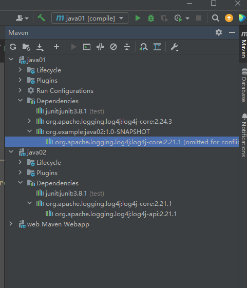

#### 依赖冲突

这里java01自己有log4j 2.24.3版本的依赖，但同时它也继承了java02的log4j 2.21.1版本的依赖，这就会导致一个依赖冲突。

解决依赖冲突有下面一个原则：
深度更浅的优先，最先声明的优先
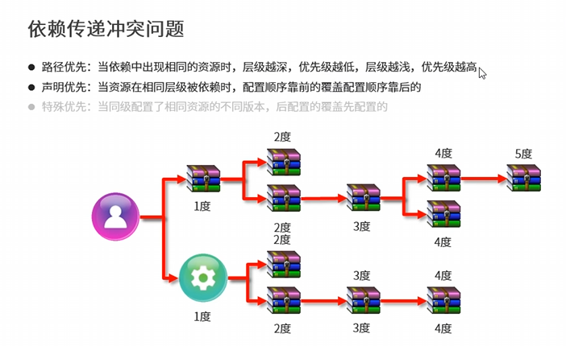

所以，这里我们log4j的版本就是2.24.3的版本，因为这里2.24.3的版本对java01项目来说是直接依赖，而2.24.1是继承自java02，是间接依赖，因此层级更深

#### 可选依赖

可选依赖通过<optional>来实现，当optional标记为true时，该依赖不被继承这个项目的项目所见，例如：我将java02的log4j依赖标记为true
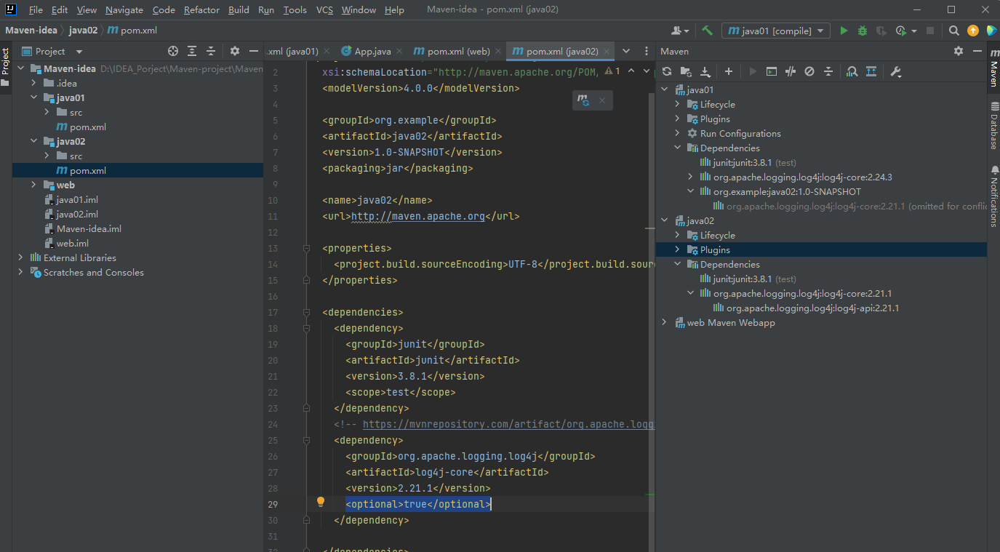

刷新后就会发现java01并不能检测到java02的log4j依赖
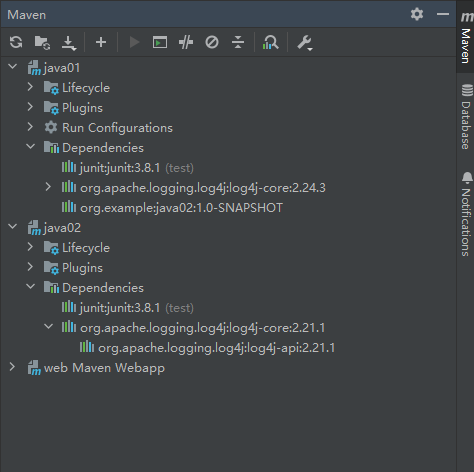

#### 排除依赖

排除依赖通过exclusion来实现，exclusion写在原项目中，比如这里是java01要依赖java02，如果我们要排除java02中的依赖，我们就在java01的pom.xml文件中修改，

```XML
<dependency>		<!--这是依赖java02的dependency-->
      <groupId>org.example</groupId>
      <artifactId>java02</artifactId>
      <version>1.0-SNAPSHOT</version>
      <exclusions>			<!--在这里写要排除的依赖-->
    	<exclusion>
        	<!--写要排除依赖的坐标，不需要版本号，反正都要排除-->
          <groupId>org.apache.logging.log4j</groupId>
          <artifactId>log4j-core</artifactId>
        </exclusion>
      </exclusions>				
    </dependency>
```

这样java02中的log4j依赖，java01也不会看到
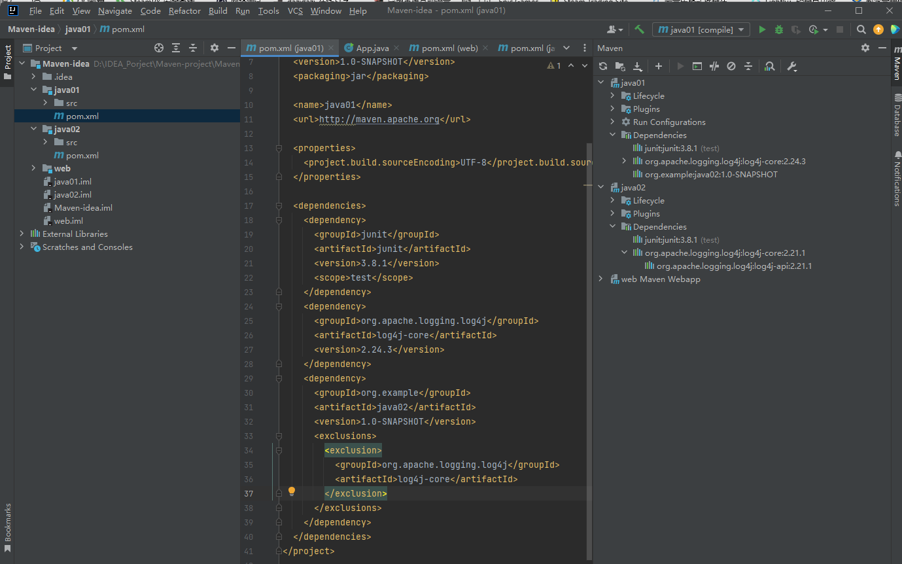