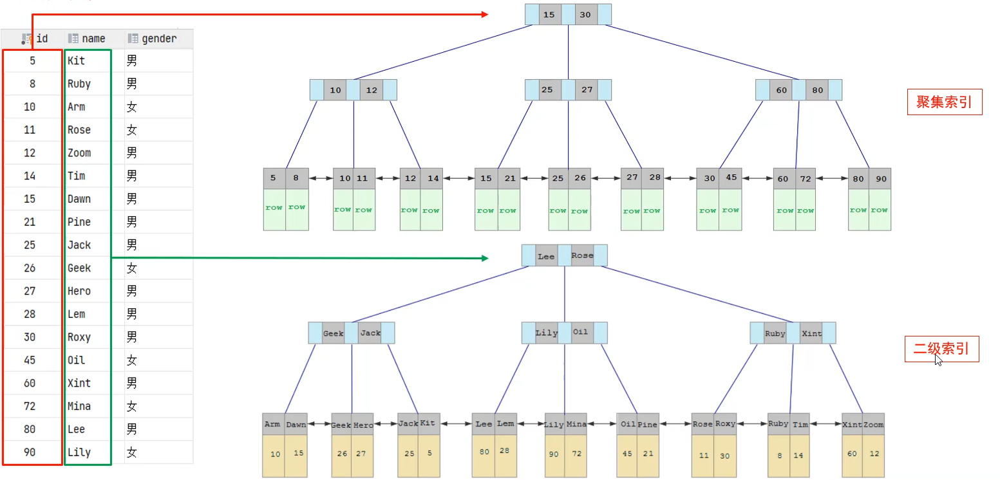
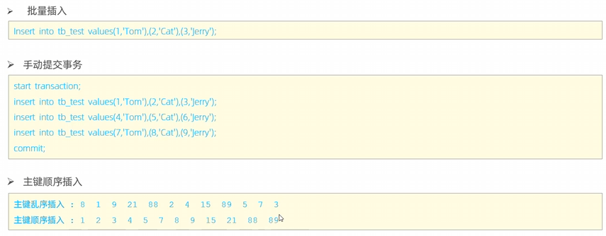
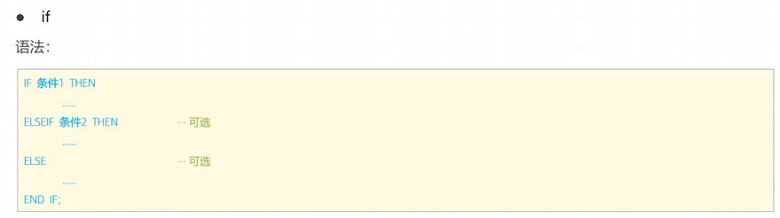
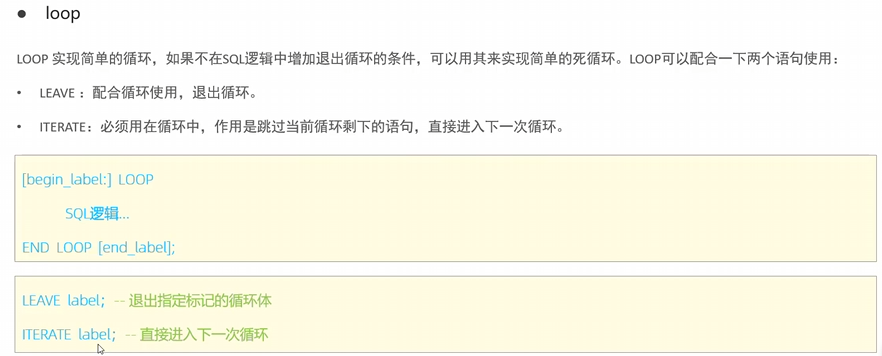
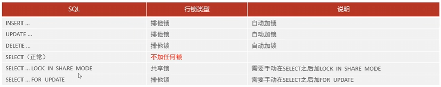
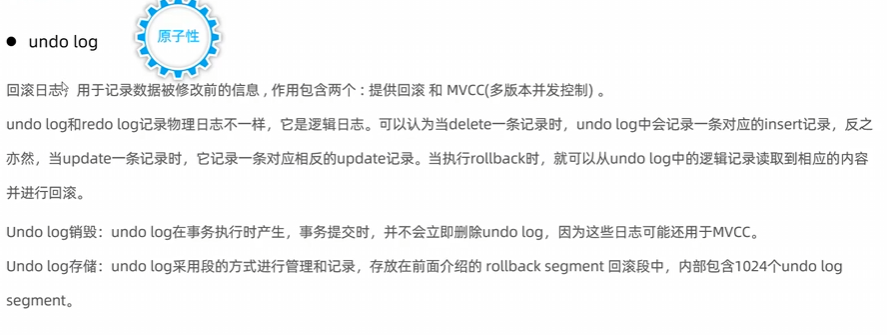

# MySQL

MySQL的基础操作已经在JavaWeb中学了，这里就不在赘述


## 事务

### 并发事务问题

以下内容取自小林Coding[事务隔离级别是怎么实现的？ | 小林coding](https://xiaolincoding.com/mysql/transaction/mvcc.html#不可重复读)

#### 1.脏读

一个事务读取数据并且对数据进行了修改，这个修改对其他事务来说是可见的，即使当前事务没有提交。这时另外一个事务读取了这个还未提交的数据，但第一个事务突然回滚，导致数据并没有被提交到数据库，那第二个事务读取到的就是脏数据，这也就是脏读的由来。

假设有 A 和 B 这两个事务同时在处理，事务 A 先开始从数据库中读取小林的余额数据，然后再执行更新操作，如果此时事务 A 还没有提交事务，而此时正好事务 B 也从数据库中读取小林的余额数据，那么事务 B 读取到的余额数据是刚才事务 A 更新后的数据，即使没有提交事务。


#### 2.不可重复读

当在一个事务内多次读取同一个数据，如果出现前后数据读取不一致的情况，说明出现了不可重复读现象。

假设有 A 和 B 这两个事务同时在处理，事务 A 先开始从数据库中读取小林的余额数据，然后继续执行代码逻辑处理，**在这过程中如果事务 B 更新了这条数据，并提交了事务，那么当事务 A 再次读取该数据时，就会发现前后两次读到的数据是不一致的，这种现象就被称为不可重复读。**


#### 3.幻读

**在一个事务内多次查询某个符合查询条件的「记录数量」，如果出现前后两次查询到的记录数量不一样的情况，就意味着发生了「幻读」现象。**

假设有 A 和 B 这两个事务同时在处理，事务 A 先开始从数据库查询账户余额大于 100 万的记录，发现共有 5 条，然后事务 B 也按相同的搜索条件也是查询出了 5 条记录。

接下来，事务 A 插入了一条余额超过 100 万的账号，并提交了事务，此时数据库超过 100 万余额的账号个数就变为 6。

然后事务 B 再次查询账户余额大于 100 万的记录，此时查询到的记录数量有 6 条，**发现和前一次读到的记录数量不一样了，就感觉发生了幻觉一样，这种现象就被称为幻读。**


### 事务隔离级别

- **读未提交（\*read uncommitted\*）**，指一个事务还没提交时，它做的变更就能被其他事务看到；
- **读提交（\*read committed\*）**，指一个事务提交之后，它做的变更才能被其他事务看到；
- **可重复读（\*repeatable read\*）**，指一个事务执行过程中看到的数据，一直跟这个事务启动时看到的数据是一致的，**MySQL InnoDB 引擎的默认隔离级别**；
- **串行化（\*serializable\* ）**；会对记录加上读写锁，在多个事务对这条记录进行读写操作时，如果发生了读写冲突的时候，后访问的事务必须等前一个事务执行完成，才能继续执行；


按隔离水平高低排序如下：


针对不同的隔离级别，并发事务时可能发生的现象也会不同：


## 存储引擎

#### MySQL体系结构


#### 什么是存储引擎

 存储引擎是存储数据、建立索引、更新查询表等操作的实现方式。存储引擎是基于表来的，每一个表所使用的存储引擎可以不一样，因此存储引擎也被称为表类型。

在创建表的时候可以指定存储引擎：


如果不指定存储引擎，默认使用InnoDB

可以查看当前MySQL支持的存储引擎：

```mysql
show engines
```


#### InnoDB介绍

#####  InnoDB的特点

1.对数据的增删改查（DML）操作遵循ACID原则，支持事务

2.支持行级锁，提高并发访问性能

3.支持外键，可以保证数据的完整性和一致性


每一个使用InnonDB引擎的表都会有一个对应的`xxx.ibd`文件，该文件包括了表的结构、表的数据、索引。


##### InnoDB的逻辑存储结构


每一个区的大小固定为1M，包含多个页

每一个页的大小固定为16K，包含多个行，每一行对应的就是每一条记录


#### MyISAM介绍

MyISAM是MySQL早期的默认存储引擎。

特点：

1.不支持事务，不支持外键

2.支持表级锁，不支持行级锁

3.访问速度快


文件结构：

使用MyISAM的表会产生3个文件：

1.`xxx.MYD`，保存了表的数据

2.`xxx.MYI`，保存了表的索引

3.`xxx.sdi`，保存了表的结构


#### Memory介绍

Memory引擎的表的数据是存放在内存中的，因此只适合用来作为临时表或缓存使用

特点：

1.数据存储在内存中，访问速度快

2.默认使用hash索引


文件结构：

使用Memory引擎的表只有一个`xxx.sdi`文件用于存储表结构


#### 三个存储引擎的对比


## 索引

### 索引介绍

索引是一种帮助MySQL快速查询数据的数据结构。

索引的优缺点如下：


### 索引结构简述

常见的索引有如下几种：


由于索引是在数据引擎层实现的，因此不同的引擎所支持的索引结构也不一样：


### BTree

#### 使用二叉树实现索引的缺点

1.当顺序存储数据时，二叉树索引就会形成一个链表。

2.二叉树的每个节点只有两个子节点，当数据量较大时，层级较深，检索速度慢。


红黑树虽然解决了第一个缺点，但是第二个缺点仍然存在


#### BTree的构建过程

BTree是多路平衡搜索树。

BTree涉及到一个概念：树的度数

树的度数指的是一个节点的最大子节点个数。


对于度数为5的树，其每一个节点最多存储4个数据，因为需要5个指针指向子节点，而指针树就是每个几点的数据个数+1。

当一个节点存储的数据个数等于度数时，该节点的中间数值会向上分裂，如下图所示：

下图展示的是一个度数为4的BTree，依次插入下面数据时，树的构建过程

**6 10 4 14 5 11 15 3 2 12 1 7 8 8 6 3 6 21 5 15 15 6 32 23 45 65 7 8 6 5 4**


### B+Tree

#### B+Tree的特点

1.所有的数据都会出现在叶子节点

2.非叶子节点起到索引的作用，不存放数据（对比BTree的不同）

3.所有叶子节点之间形成一个单向链表（MySQL实际使用中对此进行了一定优化）。


#### B+Tree的构建过程

以一个度数为4的B+Tree为例，依次插入以下数据：

**6 10 4 14 5 11 15 3 2 12 1 7 8 8 6 3 6 21 5 15 15 6 32 23 45 65 7 8 6 5 4**


#### MySQL中的B+Tree结构

MySQL在原本的B+Tree基础上进行了优化：


#### MySQL中采用B+Tree而不采用BTree的原因

1.BTree每个节点都要存放数据，而节点又是放在页中存储的，页的空间大小是固定的，因此BTree在一个节点中能存放的键值是小于B+Tree的，也就导致了BTree单个节点的指针数量会减少，此时如果要保存大量数据，BTree就只能增加树的高度，导致性能降低。

2.B+Tree的所有数据都在叶子节点，查询性能稳定

3.B+Tree结构中，所有叶子节点之间采用双向链表连接，方便排序和范围查找


#### 不同高度的B+Tree存储的数据量为多少

B+Tree的每一个节点是存放在页中的，而每一页的大小固定为16k，那么就会有如下计算方法：


可以看到高度为3的B+Tree就可以存储2千万条数据。


###  Hash索引

#### Hash索引的特点

1.只支持等值匹配，不支持范围查询

2.无法利用索引完成排序操作

3.查询效率高，通常只需要一次检索就能找到数据。


#### Hash索引的构建过程


### 索引分类

#### MySQL下的索引分类

MySQL有以下四种类型的索引：


#### InnoDB下的索引分类

在InnoDB引擎下，根据索引的存储形式，又将索引分为以下两种：

1.聚集索引

2.二级索引


下面是聚集索引和二级索引具体的实现情况：



当通过name字段查询是，首先就会查询name字段的二级索引，比如要查询name=Arm的数据，就会先从二级索引中找到该记录的主键id值为10，接着再用主键id值去聚集索引里面找该条记录的真正数据。

根据从二级索引找到的主键id去聚集索引里面寻找这一过程称为回表查询。


### 索引相关语法


如果索引关联一个字段，就称这个索引为单列索引；如果索引关联多个字段，就称这个索引为联合索引、组合索引。


### 性能分析

#### 查看数据库各种操作执行的频率


查询结果如下：


可以看到各个操作的的执行次数，其中select操作执行次数最多。


#### 慢查询日志

慢查询日志里面记录了所有执行时间超过指定时间（默认为10s）的SQL语句。


可使用以下命令查看慢查询日志是否开启

```mysql
show variables like 'slow_query_log'
```


#### profile详情

profile中记录了所有SQL语句的执行耗时（不管执行时间是多少），并且通过query_id可以查看对应语句各个阶段的耗时。


具体使用命令：


#### explain执行计划


示例如下：


### 索引的使用

#### 最左前缀法则

对于联合索引，查询从索引的最左列开始，并且不跳过索引中的列，如果跳过了某一列，那么后续的索引将会失效。

假如有一个联合索引，其字段依次为：profession、age、status


对于上面几个查询命令的索引使用情况为：

1.三个字段的索引均成功使用

2.只使用了profession和age索引

3.只使用了profession索引

4.没有使用任何索引，因为最前面的profession索引没有使用，会导致后面的索引全部失效

5.没有使用任何索引，因为前面的profession和age索引都没有使用


#### 联合索引的范围查询


如上图所示

对于第一个查询，只使用了前面的profession和age索引，后面的status索引失效

对于第二个查询，虽然使用了范围查询，但是存在等号，后续的索引不会失效。


#### 指定要使用的索引

当存在多个索引时，可以通过SQL语句选择忽略或指定索引，如下：


第一个是建议使用某个索引，MySQL会先评估该索引是否高效，再决定要不要使用

第二个是获取某个索引

第三个是强制使用某个索引。


#### 覆盖索引

在使用索引进行查询时，尽量不要使用`select *`，而是具体指定索引包含的字段，这样查询性能会更高


比如上面的示例：

第一条命令，`select *`包含了表的全部字段，由于使用的是聚集索引，聚集索引里面就包含了所有字段，因此它的查询性能较高

第二条命令，id和name字段都被包含在右边的二级索引中，其查询性能也不错

第三条命令，由于gender字段不被包含在二级索引中，因此通过二级索引查询到id后还需要回表查询，性能较低。


### 索引失效情况

以下几种情况会导致索引失效：

1.对索引列进行运算操作，索引就会失效

2.索引列是字符串类型数据，但在查询时没有用引号包裹字符串

3.模糊查询。如果仅仅是尾部的模糊匹配，索引不会失效，但是如果存在头部的模糊匹配，索引就会失效。

4.查询条件中使用 OR，且 OR 的前后条件中有一个列没有索引，涉及的索引都不会被使用到；

5.数据分布影响，如果MySQL评估使用索引比全表更慢，则不会使用索引。


下面是后续补充：

6.创建了组合索引，但查询条件未遵守最左匹配原则；


### 前缀索引


 

### 联合索引

如果查询语句涉及到较多的条件查询，推荐使用联合索引，联合索引可以减少回表查询的次数

联合索引的结构如下：


优先使用第一个字段排序，如果第一个字段相同，再使用后面的字段排序。


### 索引设计原则

 


## SQL优化

### 插入数据

插入数据可以从以下几个方面来优化：

1.批量插入

2.手动提交事务，MySQL默认执行完一条语句就提交事务，如果有多条语句，频繁的提交事务会导致性能下降

3.按主键顺序插入数据



如果要插入大量数据，比如数据量达到百万级别，使用insert就会非常耗时，推荐使用load，通过加载本地文件的方式插入数据


需要注意，文件中的数据顺序也最好是按主键顺序来的。


### 主键优化

#### 1.主键设计原则

主键的设计有如下几个原则：


第一点：主键长度过长，会导致索引占用空间过大，磁盘IO资源消耗也会更多，数据检索时间变长

第二点：不按顺序插入可能会造成页分裂（下面有具体介绍）

第三点：UUID或身份证号等是无序的，并且长度也不短，因此不适合作为主键


#### 2.页分裂

假如现在插入一个主键id为50的新数据，但此时索引结构如下：


可以发现，此时新数据应该放在47后面，但是47所在的页所剩空间已经无法容纳新数据了，此时就会发生页分裂，第一页的数据会分为两半，后半部分会放在新的页中，并且要对页重新排序，完成页分裂后，再将新数据插入合适的位置。这个过程是非常消耗性能的。

如下图所示，page3是新建的页，原本第二页应该是page2，但是重排序后，第二页变成了page3.


#### 3.页合并

在执行删除操作时，InnoDB并不会立即删除该数据，而是对该数据进行标记，标记该数据所占的内存空间为可用状态，当某一页中被删除的内存达到一定值时，InnoDB会寻找该页相邻的页，判断是否能合并成一个页，以优化空间。

下面是页合并前：


合并后：

此时插入的新数据20就会按顺序存放


### 排序优化（order by）

当要对查询结果进行排序时，其执行有两种情况：


在执行需要排序的查询操作时，尽量选择Using index。

从以下几个方面来优化order by 查询：

1.根据字段排序建立合适的索引

比如：如果根据age升序排序，就建立一个age的升序索引。如果根据age升序排序同时根据手机号phone降序排序，则可以建立一个根据age升序，phone降序的索引。


2.尽量使用覆盖索引

3.如果不可避免的出现filesort，且要排序的数据量较大时，可以适当增加排序缓冲区的大小（默认为256K）


### 分组优化（group by）

分组优化也可以像排序优化一样建立合适的索引，其索引的使用也是满足最左前缀法则的。


### 分页查询优化（limit）

分页查询查询的记录越往后，消耗的时间越长。


图中的select id from ...就使用了覆盖索引。

通过覆盖索引查出所有分页数据的id，然后用id再去查找具体数据。


### count优化

对于count操作，不同的存储引擎使用的方式不同：


而对于InnoDB引擎的优化，可以从count的使用方法上入手：

count的使用有这么几种方式：

1.count *  2.count (主键)  3.count(字段)  4.count(1)

它们的具体执行流程如下：


因此，尽量使用耗时比较低的count就可以对count操作进行一定程度的优化。


### 更新优化（update）

更新操作的优化主要是要避免行级锁升级为表级锁。

InnoDB的行级锁是针对索引加的锁，而不是针对记录加的锁。

比如某个表tb的有两个字段：id（主键）,name

此时如果执行以下命令

```mysql
update tb set name = 'Arthur' where name = 'Sky'
```

就会出现表级锁，在这个命令的修改结果提交之前，整个表都会被锁住

但是如果执行以下命令

```mysql
update tb set name = 'Arthur' where id = 1
```

此时只有id为1的那一行记录被锁住，其他记录仍然可以被修改。

如果想解决用name字段作为条件会升级成表级锁这个问题，可以对name字段创建一个索引，这样就可以解决问题。


## 视图

### 什么是视图

视图是一张虚拟存在的表，视图中的数据是根据创建视图时所用的select语句动态生成的。

视图创建好后就可以像普通的表那样使用


### 视图的基本语法


### 视图检查选项

看上面的创建视图用的SQL语句，可以看到后面有可选项：with casaded/local check option

如果不添加这个选项，那么向视图中插入新数据时，不管这个数据符不符合要求都能够插入，但是这个新数据是查询不到的。

如果添加了这个选项，插入视图时，会先检查这个新数据是否符合要求，如果符合要求才允许插入。


而添加这个可选项也有两种选择：

#### 1.cascaded

cascaded类型的检查选项，在检查时，会先检查是否符合自己视图的要求，然后再去检查是否符合本视图依赖的视图的要求，如果都满足才会允许添加新数据。

例如下图中的三个语句，最后一个语句由于没有开启视图检查，所以不会判断是否符合v3，但是会判断是否符合v3依赖的v2的要求（也就是id是否>=10），接着由于v2使用的是cascaded类型的检查选项，所以还会接着检查是否符合v2依赖的v1的要求（也就是id是否<=20）。


#### 2.local

使用local类型的检查选项时，会先检查插入数据是否符合本视图的规则，然后去看本视图依赖的视图是否有设置检查选项，如果设置了检查选项才会去检查数据是否符合依赖视图的要求。

比如下面这个例子：

向v3插入数据时，由于v3没有设置检查选项，因此不会检查是否符合v3的要求，但是会检查是否符合v3依赖的v2的要求，接着由于v2使用的是local类型的检查选项，所以按理来说会去判断是否符合v2依赖的v1的要求，但是由于v1没有设置检查选项，因此不会判断是否符合v1的要求


 

### 视图的更新条件

如果想要通过视图来更新数据，需要符合以下条件：


### 视图的作用

在学到这里之前，我确实挺疑惑视图到底有啥用，为什么还要通过视图来修改数据，不能直接修改到表上吗？

学到这里我才恍然大悟：

补充讲解：

1.简单

例如：有一个商品表，它里面有各种字段：名称、id、价格、类型、销量、等等。。。

但是，假如只有销量经常变化，需要经常修改或查询的也就是销量，通过定义视图，只将必要的字段如：id、销量放在视图中，这样用户就能方便地进行操作，不需要关系其他无关的字段

再比如可以将涉及到多表的查询字段定义在一个视图中，这样就不需要每次都多表查询了，只需要查询视图即可。

2.数据独立

假如此时商品表的字段名发生了变化，商品名字段从原来的name变成了shopName

此时只需这样定义视图

```mysql
create or replace view v1 as select id shopName as name from shopItem
```

这样不管商品字段是shopName还是shoppingName，在用户看来永远都是name


  

## 存储过程

### 什么是存储过程

对于某一系列操作命令，客户端可能要通过多次网络请求，将命令多次发给MySQL服务器，以完成服务

例如下图中的例子：先发送select命令，接着继续发送后面的update命令


而存储过程就是将一段SQL语句提前编译并存储在数据库中：


这些提前编译好的SQL语句有如下特点：

1.提高了SQL语句的复用性

2.可以接收参数，可以返回结果

3.减少网络交互，效率提升。


### 存储过程相关语法

创建存储过程：


调用存储过程：


查看存储过程：

包括查看存储过程的信息以及其具体的定义的SQL语句


删除存储过程：


### 变量

MySQL中有两种变量：

#### 1.系统变量

系统变量是MySQL提供的变量，分为全局变量（global）和会话变量（session）

查看系统变量的语法 ：


例如：

```mysql
show global variables like 'auto%';			
select @@session.autocommit;		查看事务相关的系统变量
```


设置系统变量的语法：


#### 2.用户定义变量

用户自定义变量的作用范围是整个会话，其在使用时不需要提前声明，在使用时直接通过`@变量名`即可使用。

用户自定义变量的赋值语法：


最后一个是将查询结果直接赋值给var_name变量


用户自定义变量的使用语法：


#### 3.局部变量

局部变量是在定义存储过程声明的begin...end代码块中定义的，其作用范围也在begin...end代码块中。局部变量可以作为存储过程内部的局部变量或者作为存储过程的参数。

局部变量的声明语法：

在begin...end代码块内部使用以下语句声明，default是设置默认值


局部变量的赋值：


最后一个语句是将查询结果赋值给局部变量。


### if条件判断

if条件判断可以用在定义存储过程中，其语法如下：




### 存储过程的参数

在定义存储过程时，可以指定存储过程的参数，在调用存储过程时就需要传入对应的参数。

存储过程的参数分为以下三类：


定义存储过程的参数语法如下：


示例如下：

下面的代码中定义了一个输入参数和一个输出参数。

在调用该存储过程时，就需要传入输入参数，以及输出参数，存储过程执行完毕后会将返回值赋值给输出参数result


再比如下面的示例：

声明的是一个inout类型参数，传入的score最后会被存储过程的返回值更新，比如传入198，score最后就会更新为99


### case语句

case语句也可以用再存储过程的定义中，其语法有两种：


其中第二种语法中when后面跟的是条件判断语句。


### while循环语句

while循环语句也可以用在存储过程的定义中，其语法如下：


示例：


### repeat循环语句

repeat循环与while循环的区别在于，while是条件满足时进入循环，而repeat是条件满足时退出循环。

repeat的语法如下：


示例如下：


### loop循环语句

loop用于实现简单的循环，它需要配合leave、iterate使用。



其中`begin_label:`是循环的标识符，使用leave和iterate的时候就要指定循环的标识符。

使用示例如下：

该例子是将n内的所有偶数累加。


 

### 游标（cursor）

如果想要将查询出来的结果集交给某一变量，普通的变量是不行的，如下：

下面的例子中将从student表中查询出来的结果交给stu_count变量，在执行这个存储过程时程序会出错，因为查询结果是一个结果集，单用一个普通变量是无法接收的。


这时候就可以使用游标了：


使用示例如下：

下面的例子中，在定义游标时指定了查询语句，也就是将该查询语句的结果放入u_cursor游标中。

接着打开游标，并循环遍历游标中的记录，将游标中的每一条记录插入到了一个新创建的tb_user_pro表中。

游标中的记录遍历完成后，就需要关闭游标。

需要注意的是，游标的声明需要在变量声明之后，不然会报错，下图中的代码就会报错，需要把第一行声明游标的语句放在声明变量语句的后面。


这个程序存在一个问题，就是循环并没有终止条件，会导致当游标中的数据访问完毕时，循环依旧没有退出，此时再次访问游标时，由于游标中已经没有数据了，就会出现报错，但是游标的数据仍然会被成功插入新的表中。

要解决这个问题，就需要下面条件处理程序（handler）的知识


### 条件处理程序（handler）


具体状态码的含义可以查看MySQL官方文档


使用条件处理程序解决上面的遍历游标时产生的问题：

只需要在原来的语句基础上定义一个条件处理程序

图中定义的条件处理程序意为，当遇到状态码为02000的错误时，会执行条件处理程序，这里的条件处理程序定义的时终止执行当前程序，但是会在终止之前先执行条件处理程序中定义的statement语句，这里也就是`close u_cursor`关闭游标。


## 存储函数

存储函数是有返回值的存储过程，存储函数的参数只能是in类型。

存储函数的语法如下：


示例如下：


## 触发器

### 什么是触发器


这里的行级触发和语句级触发的具体含义如下：

如果某一个SQL语句影响的行数为5，那么触发器就会被触发5次，这就是行级触发；

而语句级触发是指不管SQL语句影响了多少行，一个SQL语句只会触发一次。

MySQL只支持行级触发器


### 触发器的语法

创建触发器：


查看触发器：


删除触发器：


### 触发器的分类

触发器有以下三种分类：


#### 1.insert型触发器

insert型触发器在执行insert操作前或后触发，示例如下：

这个触发器意为在每次insert操作后触发，该触发器是行级触发器（for each row），触发器执行的语句为向日志表中插入新日志。

其中`new`就代表要插入的新数据


#### 2.update型触发器

update型触发器在执行update操作前或后触发，示例如下：

这个触发器意为在每次对tb_user执行完update操作后触发，并将更新前数据与更新后数据插入到日志表中，其中old代表更新前的数据，new代表更新后的数据


#### 3.delete型触发器

delete型触发器在执行delete操作前或后触发，示例如下：

这个触发器意为在每次对tb_user执行完delete操作后触发，并将被删除的数据插入到日志表中，其中old代表要被删除的数据


## 锁

MySQL中有三类锁：

1.全局锁：锁定数据库中的所有表

2.表级锁：每次操作锁住整张表

3.行级锁：每次操作锁住对应的行数据


### 全局锁

#### 1.全局锁的使用

全局锁通常用在全库的逻辑备份的情况下，用来保证备份的数据一致性和完整性。

比如下面的备份操作，没有使用全局锁，所以在执行备份操作的同时，数据库还在处理业务，此时数据库中的数据会发生修改，这就会导致数据的不一致。这里的不一致体现在tb_stock与tb_order、tb_orderlog的不一致，因为先备份的tb_stock，但是后面由于业务，tb_order数据发生了更新，此时tb_order表就与备份的tb_stock数据就不一致了。


在使用了全局锁后，数据在备份的过程中，对数据的修改操作会被阻塞，只能执行查询操作：


使用全局锁实现数据库备份的操作步骤如下：

1.对数据库加上全局锁

使用命令：

```mysql
flush tables with read lock
```

此时数据库只能正常处理读操作，数据库的修改操作会被阻塞


2.使用MySQL提供的备份工具来备份数据库

使用以下命令：

注意该命令不是SQL语句，不能在SQL环境下使用，可以在windows控制台环境下或其他控制台下执行。

```cmd
mysqldump -h 数据库ip地址 -u用户名 -p密码 要备份的数据库名 > sql文件路径
```


3.备份完毕后解锁

使用命令：

```mysql
unlock tables
```


#### 2.全局锁的缺点


在InnoDB引擎中可以不使用全局锁来实现数据库备份：


### 表级锁

#### 1.表锁


读锁不会阻塞其他客户端的读操作，但会阻塞写操作；

写锁会阻塞其他客户端的所有操作，只允许子集进行读写操作。 


#### 2.元数据锁（meta data lock）

下面是元数据锁的介绍：


简单来说，元数据锁是为了防止对表进行读写操作，事务还没有提交时，就对表结构进行修改的操作，从而保证了数据读写的正确性。

再举一个简单的例子，如果你在查询一个表的过程中，另外一个session对该表删除了一个列，那前面的查询到底该显示什么呢？为了防止这种情况，表查询开始MySQL会在表上加一个锁，来防止被别的session修改了表定义，这个锁就叫‘metadata lock’，简称MDL，翻译成中文也叫‘元数据锁’。


#### 3.意向锁

下面是意向锁的介绍：


在不使用意向锁的时候，表锁在加锁前需要检查每一行数据是否已经加锁，这一过程性能是非常低的

但是在使用了意向锁之后，表锁在加锁前不再需要判断每一行的加锁情况，而是直接判断意向锁，判断是否与意向锁兼容，如果兼容就可以直接加锁，不兼容则被阻塞，直到事务提交，意向锁被释放


意向锁有两种：


它们与表锁的兼容情况如下：


### 行级锁


#### 1.行锁（记录锁）

行锁也叫记录所，它包括了：共享锁（S）和排他锁（X）


当对某行数据执行查询操作时，会对该行数据加上共享锁

当对某行数据执行修改操作时，会对该行数据加上排他锁


共享锁与排他锁的兼容情况如下：


即：

事务A如果已经对某一行数据加了共享锁，那么事务B就只能对该行数据加共享锁，共享锁与共享锁之间是兼容的

事务A如果已经对某一行数据加了排他锁，那么事务B无法对该行数据添加任何锁。


下面是不同的查询语句的加锁情况：




注意事项：


 

#### 2.间隙锁&临键锁

这地方听的时候感觉有点抽象，需要仔细复习复习（[MySQL 是怎么加锁的？ | 小林coding](https://xiaolincoding.com/mysql/lock/how_to_lock.html#唯一索引等值查询)）


间隙锁是对记录之间的间隙进行加锁，间隙锁的作用是防止其他事务将数据插入到间隙内。

间隙锁之间可以共存，多个事务可以对同一个间隙加间隙锁


当通过唯一索引进行等值查询时，如果要加锁的记录不存在，就会优化为间隙锁

例如：

对下面的表执行更新操作，但是要更新的id为5的记录不存在，此时本该加上的锁会被优化成间隙锁，也就是id从3~8这个间隙被加锁了


此时如果另一个事务对这个间隙进行插入操作，就会被阻塞：

如下图所示，插入操作被阻塞了。


## InnoDB引擎

### 逻辑存储结构


 

### 架构

InnoDB的整体架构如下：


#### 1.内存结构

InnoDB引擎的内存结构分为四个部分：1.缓冲池 2.更改缓冲区  3.自适应hash索引  4.日志缓冲区

1.缓冲池


2.更改缓冲区


3.自适应hash索引


4.日志缓冲区


这里应该还有一个磁盘结构的知识，内容有点多并且讲的很泛，所以就先简单了解一下

#### 2.后台线程

后台线程主要负责将缓冲区的数据写到磁盘中，后台线程又分为以下几个种类的线程：


### 事务原理

事务的ACID原则：原子性、一致性、隔离性、持久性

InnoDB采用了以下机制来分别实现ACID原则：


#### 1.redo log

redo log保证了事务的持久性，它记录的是事务提交时数据的修改。

当不使用redo log时，事务的提交会直接将缓冲区的数据写入到磁盘中，此时如果写入失败，就会造成事务的数据持久化失败。

但是如果使用了redo log，事务的每次都会被记录到redolog buffer（日志缓冲） 中 ，接着每当事务提交时，日志缓冲都会被持久化到磁盘中，当后面事务提交将脏页数据刷新到磁盘文件如果出现错误时，就可以使用磁盘中的redo log file（重做日志文件）来恢复数据。


#### 2.undo log

undo log 保证了事务的原子性，它记录的是每一个操作执行前的数据信息，通常用于回滚事务。

可以把它理解为记录与操作相反的操作，比如要执行delete语句，那么就会在undo log中记录一条insert语句，当要回滚delete语句时，执行的就是insert语句。




### MVCC

#### 1.基本概念

在了解MVCC之前首先要直到以下几个概念

##### 1.当前读

读取的是记录的最新版本，读取时还需要对记录进行加锁，保证其他事务不会修改当前记录。


##### 2.快照读

快照读读取的是记录的可见版本，有可能是历史数据，不会对记录加锁。

以下是不同隔离级别的快照读的情况：


对于RC，每次生成一个快照，也就是相当于读取的是已经提交的数据

对于RR，只有第一次读取时会生成一个快照，后续读取都是从快照中读取，从而保证了可重复读


##### 3.MVCC

MVCC（Multi-Version Concurrency Control）意为多版本并发控制。指的是维护一个数据的多个版本，使得读写操作不会发生冲突。

MVCC的实现依赖数据库记录的三个隐藏字段、undo log日志、redaView


#### 2.隐藏字段

每一张表中都存在三个隐藏字段：


#### 3.undo log 版本链

undo log 是回滚日志，用于在修改数据时产生便于进行回滚操作的日志。


而undo log 版本链指的是不同的事务或者同一个事务对同一条记录进行多次修改，使得该条记录的undolog形成一个记录版本链表。在undo log 版本链中，最下面的版本是最旧的数据，最上面的版本是最新的数据。


#### 4.readview

readview意为读视图，是快照读SQL执行时MVCC提取数据的依据，它记录并维护当前系统活跃的事务（也就是还未提交的事务）ID

readview包含以下4个字段：

****

使用readview来判断应该访问哪个版本的数据，判断规则如下：


要判断读取哪一个版本的数据需要结合readview和undolog。

##### 1.RC隔离级别

比如下面要执行事务5的查询id为30的记录时（RC隔离级别下），会先生成一个readview，然后结合readview依次去判断undo log中的版本是否能够被读取。

判断第一个版本，也就是最上面的版本，事务id为4，将这个事务id与对应的4条规则去对比，判断都不符合，说明不能读取该版本。

接着依次判断每一个版本是否能够被读取，最后判断发现事务2也就是倒数第二个版本由于事务id为2，符合第一条规则，则能够读取该版本


##### 2.RR隔离级别

RR隔离级别下，只会在第一次执行快照读时生成readview，后面会复用该readview

毕竟readview一样，说明匹配规则一样，匹配规则一样就能保证一个事务中多次读取同一数据的结果是一样的。


  

