# RabbitMQ

参考资料：[MQ基础-05.RabbitMQ-认识和安装_哔哩哔哩_bilibili](https://www.bilibili.com/video/BV1mN4y1Z7t9?spm_id_from=333.788.videopod.episodes&vd_source=f3cb3ea986b26c6910b4df6d37acd60d&p=5)


## 安装RabbitMQ

1.将RabbitMQ的压缩包传入虚拟机

2.使用docker加载压缩包，生成镜像，使用以下命令

```shell
docker load -i mq.tar
```

3.使用docker启动RabbitMQ

```sh
docker run \
 -e RABBITMQ_DEFAULT_USER=arthur \
 -e RABBITMQ_DEFAULT_PASS=123 \
 -v mq-plugins:/plugins \
 --name mq \
 --hostname mq \
 -p 15672:15672 \
 -p 5672:5672 \
 --network host \
 -d \
 rabbitmq:3.8-management
```

4.然后访问http://192.168.100.136:15672/ 就可以进入RabbitMQ管理界面

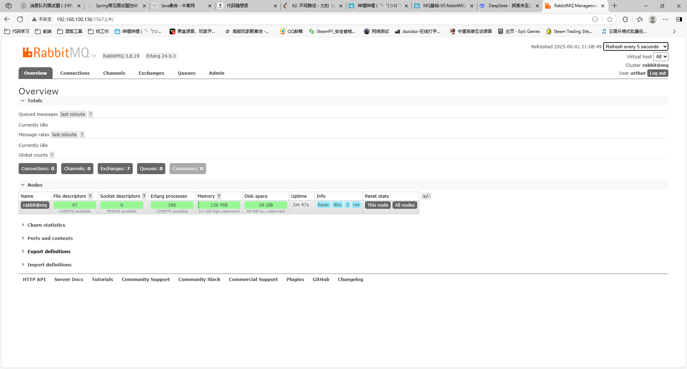


## RabbitMQ的整体框架

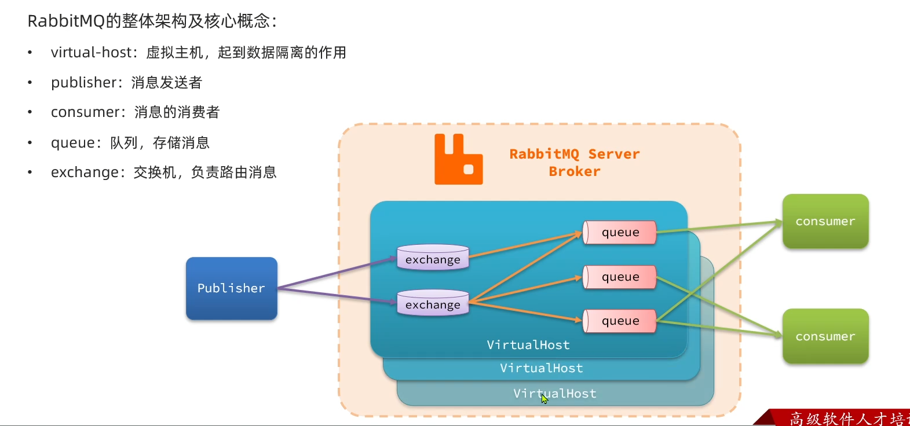


## RabbitMQ快速入门

首先完成RabbitMQ的一次消息发送，需求如下：

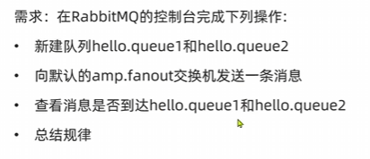

### 1.新建队列

直接在控制台页面添加新的队列即可

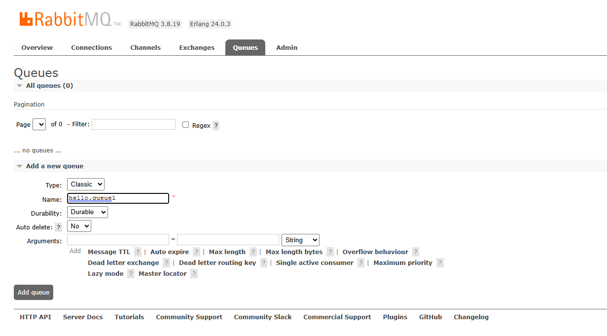

创建了两个队列

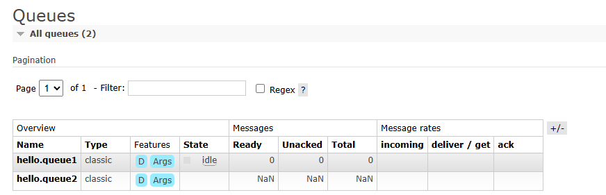


### 2.将交换机与队列绑定

如果不执行这一步，消息就无法到达队列。

直接在控制台的交换机选项页面完成交换机与队列的绑定

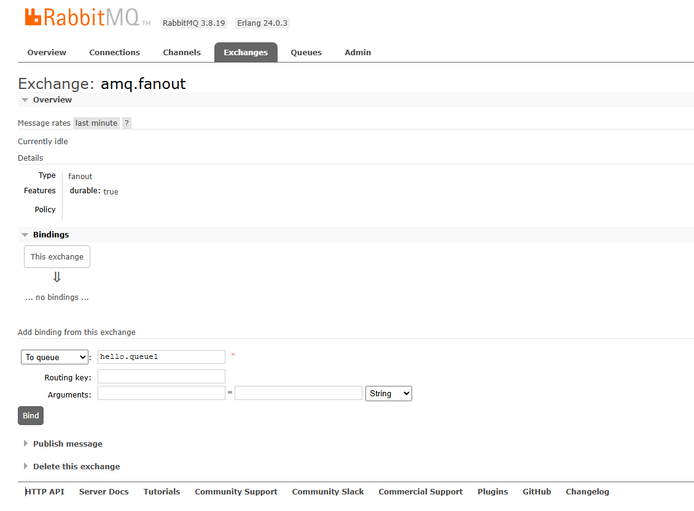

然后可以在hello.queue1的页面中看到这个绑定的交换机

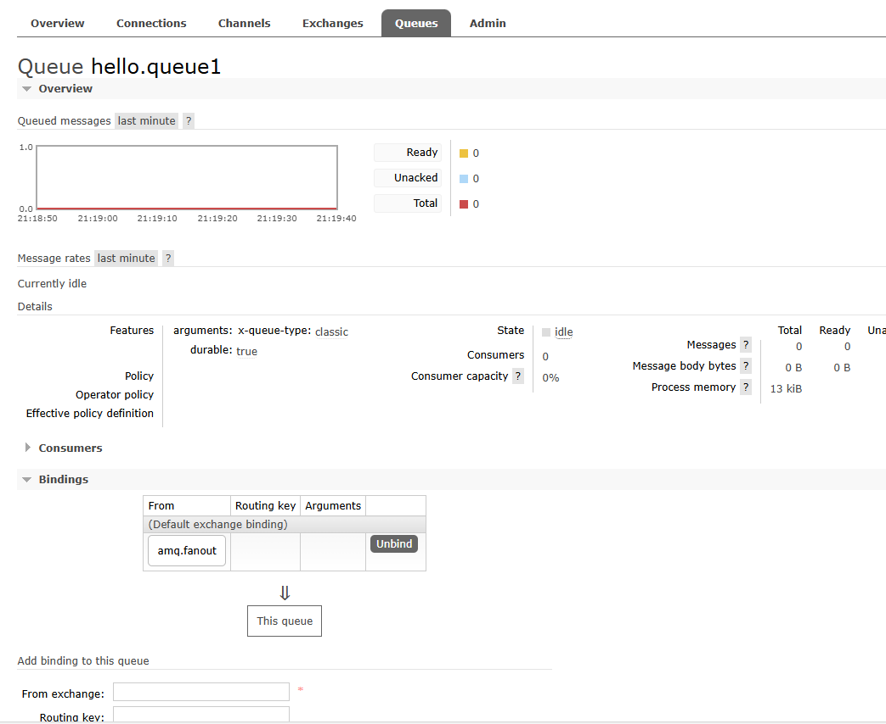


### 3.通过交换机发送消息

在控制台的交换机页面，就可以通过publish message发送消息

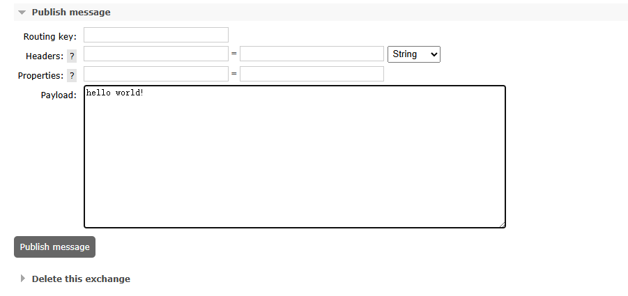

发送完毕后，就可以在消息队列那看到当前消息队列中的消息个数，可以看到现在消息个数为1

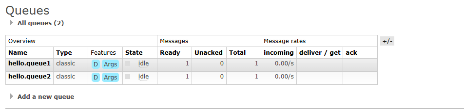

点进其中一个消息队列，可通过Get messages查看消息具体内容

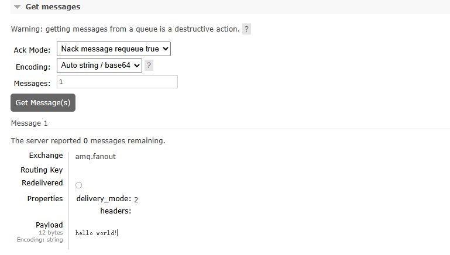


## 数据隔离（虚拟主机）

RabbitMQ可以实现数据的隔离，是通过虚拟主机来实现的。

每一个用户可以有属于自己的虚拟主机，虚拟主机可以有自己的交换机和消息队列，虚拟主机之间不能相互访问其他虚拟主机的消息队列。

### 1.添加新用户

在管理页面可以添加新用户

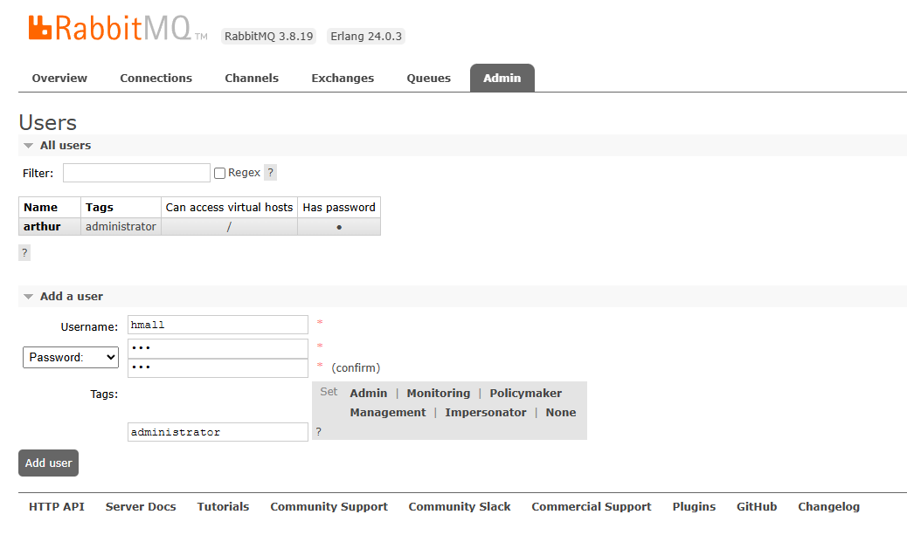

然后就可以使用这个新用户来登录到管理页面


### 2.为新用户创建新的虚拟主机

用新用户登陆后，可以在管理页面选择Virtual Hosts 来创建新的虚拟主机

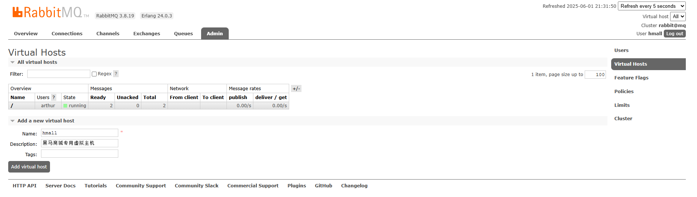

这样就实现了数据隔离。


## Java客户端快速入门

SpringAMQP提供了RabbitTemplate来实现Java客户端使用RabbitMQ

### 1.消息的发送

#### 导入SpringAMQP依赖

```xml
<!--AMQP依赖，包含RabbitMQ-->
<dependency>
    <groupId>org.springframework.boot</groupId>
    <artifactId>spring-boot-starter-amqp</artifactId>
</dependency>
```


#### 配置RabbitMQ信息

```yml
spring:
  rabbitmq:
    #配置主机ip地址
    host: 192.168.100.136
    #配置端口号
    port: 5672
    #配置使用的虚拟主机
    virtual-host: /hmall
    #用户名
    username: hmall
    #密码
    password: 123
```


#### 使用RabbitTemplate发送消息

需要先提前在控制台创建好`simple.queue`队列

```java
@Autowired
private RabbitTemplate rabbitTemplate;

@Test
public void testRabbitTemplate() {
    //要发送到的消息队列
    String queue = "hello.queue1";

    //要发送的消息
    String msg = "Hello World";
	
    //直接将消息发送到消息队列，没有使用交换机
    rabbitTemplate.convertAndSend(queue, msg);

}
```


### 2.消息的接收

与消息的发送一样，需要先导包并配置RabbitMQ的信息

消息的接收是使用`@RabbitListener`绑定要监听的消息队列，一旦消息队列中有新消息，就会自动接收，通过方法参数的形式传递

```java
@Component
public class MessageListener {


    @RabbitListener(queues = "hello.queue1")
    //msg就是接收到的消息
    public void receiveMessage(String msg){
        System.out.println("接收到的消息为："+msg);
    }

}
```

然后启动服务器，就可以接收到队列中的消息：

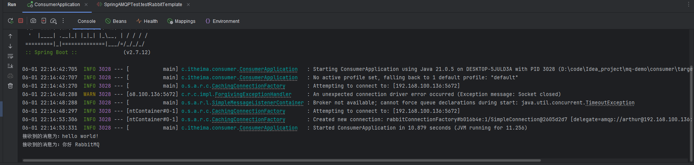


## work模型

work模型称为工作队列或者竞争消费者模式，多个消费者同时消费同一个消息队列中的数据，多个消费者消费的数据之和才是原来队列中的所有数据，适用于流量的削峰。

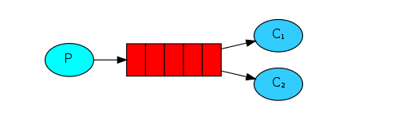

work模型可以用来处理消息堆积问题，当消息队列中的消息处理不过来时，就可以考虑添加多个消费者。

但是要特别注意的是，如下图：

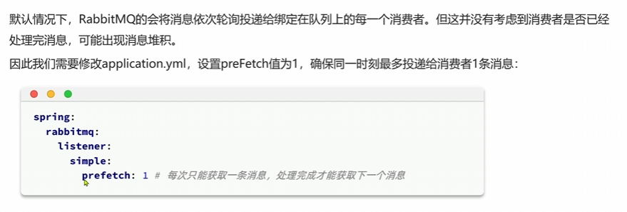

通过上面这种方式，那些处理能力快的消费者就能够处理更多的数据，而不是将所有消息均分到每一个消费者上。


## Fanout交换机

在实际使用中，通常消息是发给交换机的，然后由交换机将消息路由到各个消息队列中，根据这个路由策略的不同，交换机也分为多个不同的类型：

从下图可以看到交换机的类型

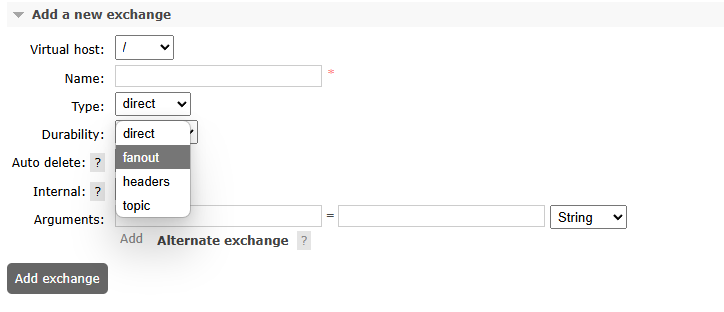


而Fanout类型的交换机会将接收到的消息发送给所有与交换机绑定的消息队列，因此也叫广播模式。

使用广播交换机发送消息的代码如下：

```java
@Autowired
private RabbitTemplate rabbitTemplate;

@Test
public void testRabbitTemplate() {
    //要发送到的交换机名称
    String exchangeName = "amq.fanout";

    //要发送的消息
    String msg = "Hello World";

    //将消息发送给交换机时需要配置三个参数，第一个是交换机名称，第二个是路由key，可以传""，第三个是消息内容
    rabbitTemplate.convertAndSend(exchangeName, null,msg);

}
```


## Direct交换机

Direct交换机会根据路由规则，将消息路由到指定的消息队列，这个路由规则就是RoutingKey，因此Direct交换机也被称为定向路由

在将消息队列与交换机进行绑定时，需要指定RoutingKey

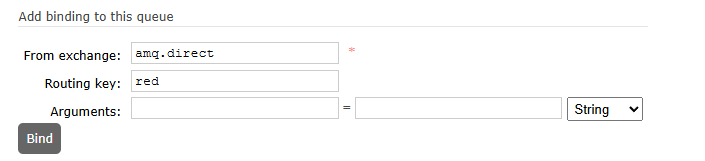

然后在发送消息时，也需要指定RoutingKey

```java
@Autowired
private RabbitTemplate rabbitTemplate;

@Test
public void testRabbitTemplate() {
    //定向路由交换机
    String exchangeName = "amq.direct";

    //要发送的消息
    String msg = "Hello World";

    //将消息发送给交换机时需要配置三个参数，第一个是交换机名称，第二个是RoutingKey，第三个是消息内容
    rabbitTemplate.convertAndSend(exchangeName, "red",msg);
}
```

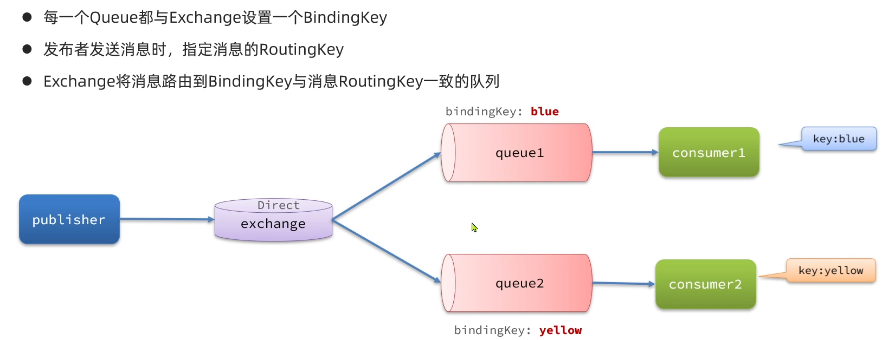

此外如果多个消息队列绑定都是同一个RoutingKey，Direct交换机也会把消息发送给多个消息队列，所以也能实现广播的效果。


## Topic交换机

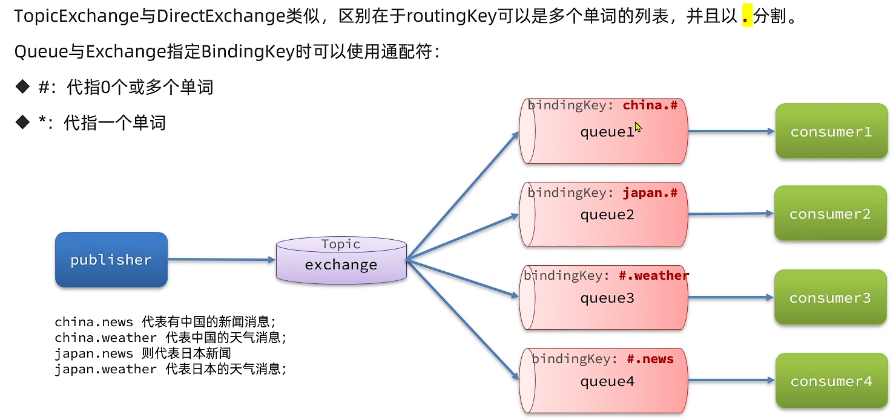

Topic交换机与Direct交换机的不同

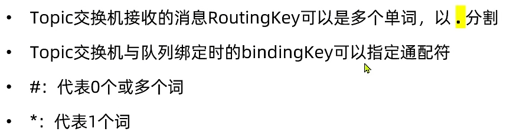


## 声明队列和交换机并绑定

在实际生产环境下，我们肯定不能手动地去创建消息队列和交换机吧，这太麻烦了，而SpringAMQP提供了在代码中声明队列和交换机的方法：

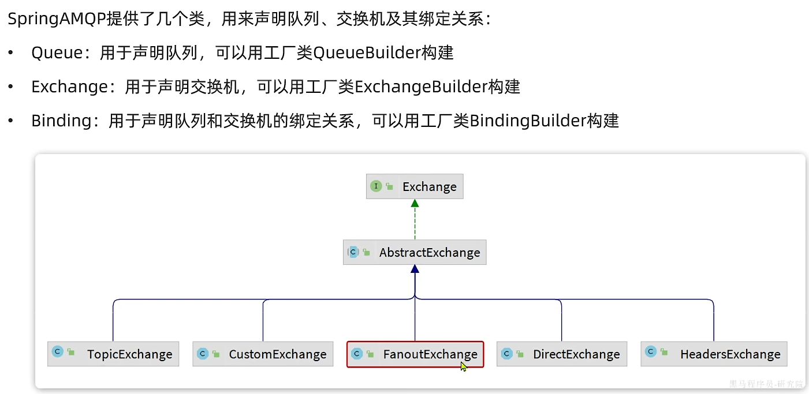


### 方式1

在配置类中声明队列和交换机并实现绑定关系

```java
@Configuration
public class FanoutConfig {

    //声明交换机
    @Bean
    public FanoutExchange fanoutExchange(){
        return new FanoutExchange("sky.fanout");
    }

    //声明队列
    @Bean
    public Queue queue(){
        return new Queue("sky.queue");
    }

    //声明绑定关系
    @Bean
    public Binding binding(Queue queue, FanoutExchange fanoutExchange){
        return BindingBuilder.bind(queue).to(fanoutExchange);
    }

}
```

启动服务器后，查看RabbitMQ控制台就能够看到新创建的交换机以及队列了

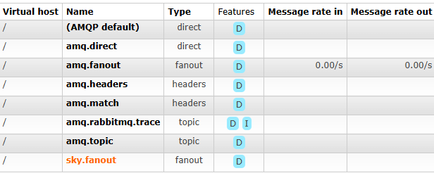

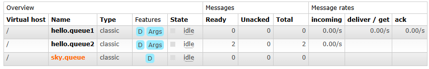

并且它们实现了绑定关系


### 方式2（基于注解）

基于注解的方式来声明交换机和队列会方便很多

这种方式是在使用`@RabbitListener`时指定绑定关系

```java
@Component
public class MessageListener {


    @RabbitListener(bindings = @QueueBinding(
            //声明队列
            value = @Queue(name = "direct.queue"),
            //声明交换机
            exchange = @Exchange(name = "sky.direct",type = ExchangeTypes.DIRECT),
            key = {"red","blue"}
    ))
    public void receiveMessage(String msg){
        System.out.println("接收到的消息为："+msg);
    }

}
```


## 消息转换器

Rabbit默认使用的是`SimpleMessageConverter`消息转换器，这个转换器是基于Java自带的对象转换流`ObjectOutputStream`来实现的

因此转换后消息可读性较差，并且体积也会变大。

**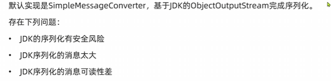**

所以在发送对象类型的消息时，最好切换消息转换器，使用`Jackson2JsonMessageConverter`转换器

首先需要导入jackson依赖：

```xml
<dependency>
    <groupId>com.fasterxml.jackson.core</groupId>
    <artifactId>jackson-databind</artifactId>
</dependency>
```

然后在配置类中配置MessageConverter

```java
//配置消息转换器
@Bean
public MessageConverter messageConverter(){
    return new Jackson2JsonMessageConverter();
}
```


## 保证消息队列服务的可靠性

要保证整个消息队列服务的可靠性，可以从三个方面入手：1.保证生产者的可靠性  2.保证MQ中间件的可靠性  3.保证消费者的可靠性


### 1.生产者的可靠性

#### 配置超时重连

如果生产者连接不上消息队列了，可以尝试开启超时重连，在配置文件中进行配置：

```yaml
spring:
  rabbitmq:
    #配置主机ip地址
    host: 192.168.100.136
    #配置端口号
    port: 5672
    #配置使用的虚拟主机
    virtual-host: /
    #用户名
    username: arthur
    #密码
    password: 123
    #超时等待时间
    connection-timeout: 1s
    template:
      retry:
        enabled: true       #开启超时重试
        initial-interval: 1000ms    #失败后的初始等待时间
        multiplier: 1       #重试失败后等待时间的倍数
        max-attempts: 3     #最大重试次数
```

但是重连会阻塞线程，因此可能会影响性能。


#### 生产者确认机制

生产者确认机制指的是，当向MQ发送一条消息后，生产者需要接收到来自MQ的确认，否则认为消息投递失败。

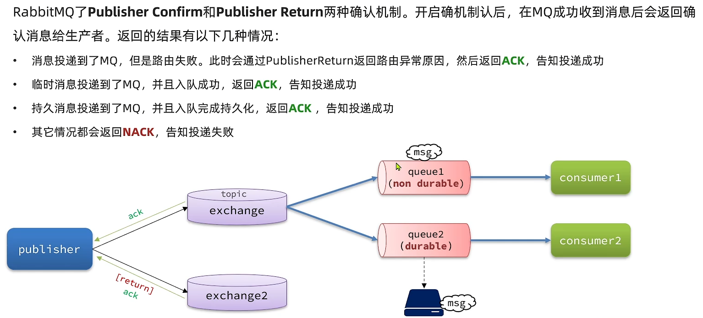

Publisher Confirm是用来确认消息是否投递成功

Publisher Return 是用来返回路由异常的。


书写具体的生产者确认机制的代码：

1.配置文件，开启确认机制

```yaml
spring:
  rabbitmq:
    #配置主机ip地址
    host: 192.168.100.136
    #配置端口号
    port: 5672
    #配置使用的虚拟主机
    virtual-host: /
    #用户名
    username: arthur
    #密码
    password: 123
    #超时等待时间
    connection-timeout: 1s
    template:
      retry:
        enabled: true       #开启超时重试
        initial-interval: 1000ms    #失败后的初始等待时间
        multiplier: 1       #重试失败后等待时间的倍数
        max-attempts: 3     #最大重试次数
        
    publisher-confirm-type: correlated    #开启publisher confirm机制
    publisher-returns: true               #开启publisher return机制
```

其中publisher-confirm-type有三种类型：

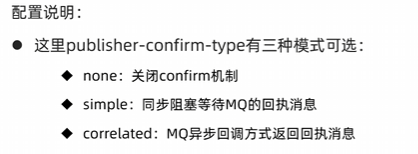


2.编写Publisher Return代码

```java
//注意需要配置类
@Configuration
public class CommonConfig implements ApplicationContextAware {

    @Override
    public void setApplicationContext(ApplicationContext applicationContext) throws BeansException {
        //通过ApplicationContext的方式获取rabbitTemplate这个对象，也可以直接使用AutoAwired注解
        RabbitTemplate rabbitTemplate = applicationContext.getBean(RabbitTemplate.class);

        //设置Publisher Return的回调方法
        rabbitTemplate.setReturnsCallback(new RabbitTemplate.ReturnsCallback() {
            @Override
            public void returnedMessage(ReturnedMessage returnedMessage) {
                //returnedMessage就是MQ返回过来的信息
                //获取返回的相关信息
                System.out.println("未被路由成功的消息是："+returnedMessage.getMessage());
            }
        });

    }
}
```


3.编写Publisher Confirm代码

CorrelationData的作用：
1、消息ID需要封装到CorrelationData
2、correlationData.getFuture().addCallback(…）是一个回调函数：决定了每个业务处理confirm成功或失败的逻辑

在发送消息时带上CorrelationData对象就可以将绑定消息ID，并设置确认回调函数

```java
@Test
public void testPublisherConfirm() throws InterruptedException {
    //确认机制发送消息时，需要给每个消息设置一个全局唯一id，以区分不同消息，避免ack冲突
    CorrelationData correlationData = new CorrelationData(UUID.randomUUID().toString());
    //设置确认回调方法
    correlationData.getFuture().addCallback(new ListenableFutureCallback<CorrelationData.Confirm>() {
        @Override
        public void onFailure(Throwable ex) {
            //future发生异常时触发的回调
        }

        @Override
        public void onSuccess(CorrelationData.Confirm result) {
           //收到确认消息触发的回调，确认消息包括ack和nack
           if(result.isAck()){
               System.out.println("消息投递成功");
           }else {
               System.out.println("消息投递失败");
           }

        }
    });

    //发送消息，要带上CorrelationData对象
    rabbitTemplate.convertAndSend("sky.direct","red1","Hello",correlationData);
    //发送完消息后等一会儿，等待确认
    Thread.sleep(5000);
}
```


### 2.数据持久化

RabbitMQ提供了数据持久化机制，持久化包括了交换机持久化、消息队列持久化以及消息持久化。

#### 交换机持久化

在创建一个交换机时，可以设置该交换机是否开启持久化功能

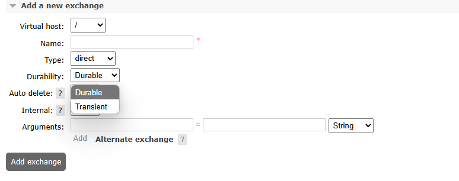

在使用RabbitTemplate来创建交换机时，默认是持久化的。


#### 消息队列持久化

创建消息队列时，也可以设置该消息队列是否开启持久化功能

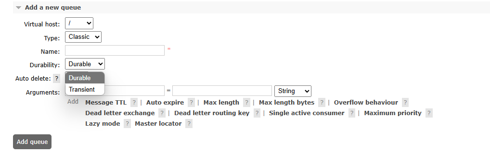

在使用RabbitTemplate来创建消息队列时，默认也是持久化的。


#### 消息持久化

在创建一个消息时，需要设置`Delivery mode`，设置为1代表临时消息，不需要持久化，设置为2代表持久化消息。

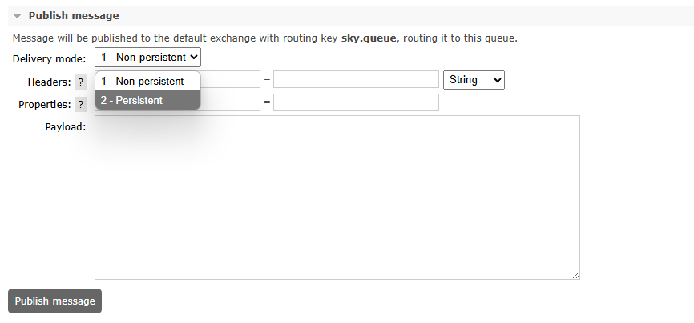

注意在使用RabbitTemplate来创建消息时，默认不是持久化的，需要我们手动指定`Delivery mode`

```java
@Test
public void testMessageDurable(){
    //创建一个消息，并设置该消息为需要持久化
    Message message = MessageBuilder.withBody("持久化的消息".getBytes())
            .setDeliveryMode(MessageDeliveryMode.PERSISTENT)	//设置消息的Delivery mode
            .build();

    //发送消息
    rabbitTemplate.convertAndSend("sky.queue",message);
    
}
```

发送结果如下：

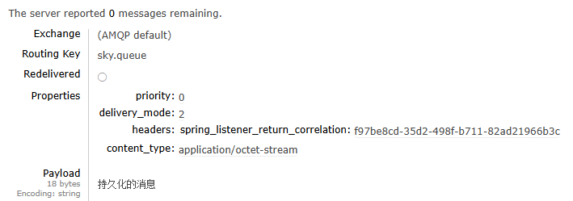


#### 惰性队列（Lazy Queue）

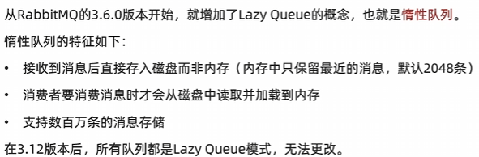


创建惰性队列：

在创建时指定参数，`x-queue-mode`=lazy

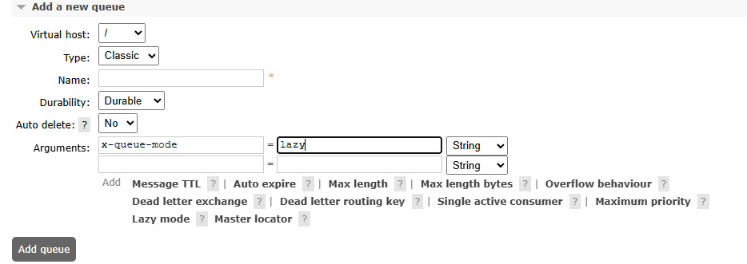


在Java代码中创建惰性队列：

通过注解的方式：

```java
@RabbitListener(bindings = @QueueBinding(
        //声明队列
        value = @Queue(name = "direct.queue"),
        //声明交换机
        exchange = @Exchange(name = "sky.direct",type = ExchangeTypes.DIRECT),
        key = {"red","blue"},
        arguments = @Argument(name = "x-queue-mode",value = "lazy")
))
public void receiveMessage(String msg){
    System.out.println("接收到的消息为："+msg);
}
```


通过配置文件的方式：

```java
//声明队列
@Bean
public Queue queue(){
    return QueueBuilder.durable("lazy.queue")
            .lazy()     //设置为惰性队列
            .build();
}
```


### 3.消费者的可靠性

#### 消费者确认机制

消费者确认机制如下：

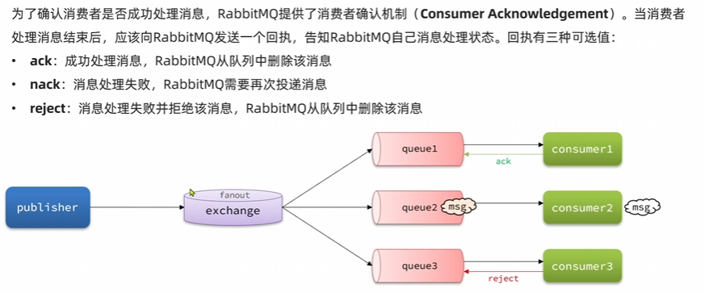

在代码中配置消费者确认机制：

SpringAMQP实现了消息确认功能，可以在配置文件中配置该功能，配置`acknowledge-mode`，有三种模式：

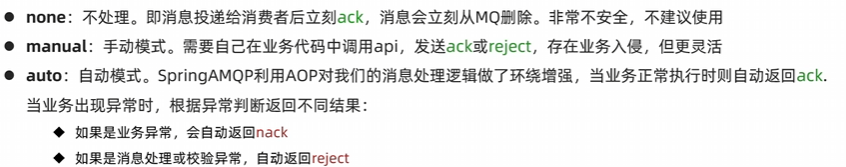

```yaml
spring:
  rabbitmq:
    #配置主机ip地址
    host: 192.168.100.136
    #配置端口号
    port: 5672
    #配置使用的虚拟主机
    virtual-host: /
    #用户名
    username: arthur
    #密码
    password: 123
    listener:
      simple:
        acknowledge-mode: auto
```


