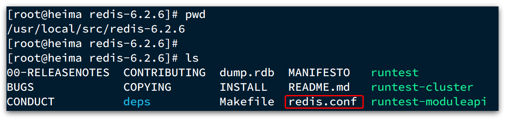
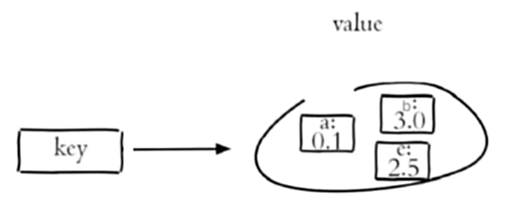

# Redis学习笔记

参考资料：[基础篇-01.Redis入门课程介绍_哔哩哔哩_bilibili](https://www.bilibili.com/video/BV1cr4y1671t?spm_id_from=333.788.videopod.episodes&vd_source=f3cb3ea986b26c6910b4df6d37acd60d&p=2)


## 认识Redis

Redis是Remote Dictionary Server的缩写，因为远程词典服务器，是一个基于内存的键值型NoSQL数据库

它具有以下特征


Redis属于非关系型数据库(NoSQL)，非关系型数据库与关系型数据库的区别如下


其中事务特性，SQL是满足ACID原则，NoSQL是满足BASE原则

扩展性，SQL垂直指的是SQL在存储数据时只能将数据存储到本地数据库中，不能像NoSQL一样可以将数据拆分进行分布式存储。


## Redis安装说明

大多数企业都是基于Linux服务器来部署项目，而且Redis官方也没有提供Windows版本的安装包。因此课程中我们会基于Linux系统来安装Redis.

此处选择的Linux版本为CentOS 7.

Redis的官方网站地址：https://redis.io/


1.单机安装Redis

### 1.1.安装Redis依赖

Redis是基于C语言编写的，因此首先需要安装Redis所需要的gcc依赖：

```sh
yum install -y gcc tcl
```


### 1.2.上传安装包并解压

然后将课前资料提供的Redis安装包上传到虚拟机的任意目录：


例如，我放到了/usr/local/src 目录：


解压缩：

```sh
tar -xzf redis-6.2.6.tar.gz
```

解压后：


进入redis目录：

```sh
cd redis-6.2.6
```


运行编译命令：

```sh
make && make install
```

如果没有出错，应该就安装成功了。


默认的安装路径是在 `/usr/local/bin`目录下：


该目录以及默认配置到环境变量，因此可以在任意目录下运行这些命令。其中：

- redis-cli：是redis提供的命令行客户端
- redis-server：是redis的服务端启动脚本
- redis-sentinel：是redis的哨兵启动脚本


### 1.3.启动

redis的启动方式有很多种，例如：

- 默认启动
- 指定配置启动
- 开机自启


### 1.3.1.默认启动

安装完成后，在任意目录输入redis-server命令即可启动Redis：

```
redis-server
```

如图：


这种启动属于`前台启动`，会阻塞整个会话窗口，窗口关闭或者按下`CTRL + C`则Redis停止。不推荐使用。


### 1.3.2.指定配置启动

如果要让Redis以`后台`方式启动，则必须修改Redis配置文件，就在我们之前解压的redis安装包下（`/usr/local/src/redis-6.2.6`），名字叫redis.conf：



我们先将这个配置文件备份一份：

```
cp redis.conf redis.conf.bck
```


然后修改redis.conf文件中的一些配置：

```
vi  redis.conf
```

```properties
# 允许访问的地址，默认是127.0.0.1，会导致只能在本地访问。修改为0.0.0.0则可以在任意IP访问，生产环境不要设置为0.0.0.0
bind 0.0.0.0
# 守护进程，修改为yes后即可后台运行
daemonize yes 
# 密码，设置后访问Redis必须输入密码
requirepass 123321
```


Redis的其它常见配置：

```properties
# 监听的端口
port 6379
# 工作目录，默认是当前目录，也就是运行redis-server时的命令，日志、持久化等文件会保存在这个目录
dir .
# 数据库数量，设置为1，代表只使用1个库，默认有16个库，编号0~15
databases 1
# 设置redis能够使用的最大内存
maxmemory 512mb
# 日志文件，默认为空，不记录日志，可以指定日志文件名
logfile "redis.log"
```


启动Redis：

```sh
# 进入redis安装目录 
cd /usr/local/src/redis-6.2.6
# 启动
redis-server redis.conf
```


停止服务：

```sh
# 利用redis-cli来执行 shutdown 命令，即可停止 Redis 服务，
# 因为之前配置了密码，因此需要通过 -u 来指定密码
redis-cli -u 123321 shutdown
```


### 1.3.3.开机自启

我们也可以通过配置来实现开机自启。

首先，新建一个系统服务文件：

```sh
vi /etc/systemd/system/redis.service
```

内容如下：

```conf
[Unit]
Description=redis-server
After=network.target

[Service]
Type=forking
ExecStart=/usr/local/bin/redis-server /usr/local/src/redis-6.2.6/redis.conf
PrivateTmp=true

[Install]
WantedBy=multi-user.target
```


然后重载系统服务：

```sh
systemctl daemon-reload
```


现在，我们可以用下面这组命令来操作redis了：

```sh
# 启动
systemctl start redis
# 停止
systemctl stop redis
# 重启
systemctl restart redis
# 查看状态
systemctl status redis
输入冒号  : 然后加q退出查看状态
```


执行下面的命令，可以让redis开机自启：

```sh
systemctl enable redis
```


## Redis命令行客户端

Redis在安装时自带了一个命令行客户端

```sh
redis-cli -h Redis数据库的地址 -p 端口号 [-a 密码]

redis-cli -h localhost -p 6379 -a 123456

redis-cli -h localhost -p 6379
#如果连接时不指定密码可以在连接后再验证密码
#连接后使用以下命名来验证密码
AUTH 密码
#使用ping命令来验证Redis是否连接成功
ping
```


## Redis命令

#### Redis常用数据类型

 Redis中key是String类型的，value有五种常用的数据类型

1.String，字符串。普通字符串，Redis中最简单的数据类型

2.hash，哈希。也叫做散列，hash内部也是类似于一个键值对形式的存储形式，实际上就是一个字符串类型的field和value的映射表，因此哈希适合存储对象类型数据。

3.list，列表。按照插入顺序排序，可以有重复数据，类似Java中的LinkedList

4.set，集合。无序且不能重复，类似Java中的HashSet

5.sorted set/zset，有序集合。集合中每个元素关联一个分数（score），根据分数升序排序，没有重复元素。

这五种数据类型如下图所示


 

#### Redis字符串（String）操作命令

字符串类型下面又分有三种类型：1.string普通字符串、2.int整数类型，可做自增自减操作、3.float浮点类型，可做自增自减操作。

不管那种格式，顶层都是以字节数组形式存储。字符串类型数据最大不能超过512M

操作字符串的命令常用的有如下几个：

设置key的值为value

```
SET key value 
```

批量添加修改key

```
MSET key1 value1 [key2 value2] [....]
```


获取key的值

```
GET key
```

批量获取key的值

```
MGET key1 [key2] [...] 
```


设置key的值为value，并指定key的过期时间为seconds秒

```
SETEX key seconds value

等效于
SET key value ex seconds
```


只有当key不存在时，才设置key的值为value

```
SETNX key value

等效于
SET key value nx
```


整形数据的自增自减

```
INCR key 		让整形key自增1
INCRBY key num		让key增加num
INCRBY key -1		让key自减1

```


浮点类型的增减

```
INCRBYFLOAT key num			让浮点类型的key增加num  
```


#### Redis哈希（Hash）操作命令

实际上哈希类型的数据就是一个哈希表


将key所指的哈希表中field对应的值设置为value

```
HSET key field value
```

批量添加哈希表的字段

```
HMSET key field1 value1 field2 value2 [field3 value3] [....]
```

当哈希表中某个field不存在才添加相应的field并设置为value

```
HSETNX key field value
```


取出key哈希表中field对应的值

```
HGET key field
```

批量取出key哈希表中field对应的值

```
HMGET key field1 field2 [field3] [....]
```


取出key哈希表中的所有field和value

```
HGETALL key
```


删除key哈希表中field对应的值

```
HDEL key field
```


获取key哈希表中的所有field

```
HKEYS key
```


获取key哈希表中的所有value

```
HVALS key 
```


让key哈希表中field的值自增指定大小increment

```
HINCRBY key field increment
```


 

#### Redis列表（List）操作命令

列表List是一个简单的字符串列表，依照插入顺序排列


将一个或多个数据插入列表头部（左边）

```
LPUSH key value1 [value2]
```

将一个或多个数据插入列表尾部（右边）

```
RPUSH key value1 [value2]
```


从列表中取出指定范围内的元素

其中 0 表示列表的第一个元素， 1 表示列表的第二个元素，以此类推。 你也可以使用负数下标，以 -1 表示列表的最后一个元素， -2 表示列表的倒数第二个元素，以此类推。

```
LRANGE key start stop
```


移出并获取列表的第一个元素（左边）

```
LPOP key
```

移出并获取列表的最后一个元素（右边）

```
RPOP key
```

BLPOP和BRPOP和LPOP、RPOP类似，只不过会在list没有元素时等待指定时间time，而不是返回nullkey 

```
BLPOP key time
```


获取列表长度

```
LLEN key
```


#### Redis集合（Set）操作命令

Set是字符串类型的无序集合


向key集合添加一个或多个成员

```
SADD key member1 [member2]
```


返回key集合的所有成员

```
SMEMBERS key
```


判断key集合中是否存在member元素

```
SISMEMBER key member
```


获取key集合的成员数

```
SCARD key
```


返回指定所有集合的交集

```
SINTER key1 [key2]
```


返回指定所有集合的并集

```
SUNION key1 [key2]
```


返回指定所有集合的差集

```
SDIFF key1 [key2]
```


删除key集合中的一个或多个成员

```
SREM key memeber1 [member2]
```


#### Redis有序集合（zset）操作命令

有序集合是一个字符串类型的集合，不能重复，根据每个成员的score来排序




zset有很多命令


向key有序集合中添加一个或多个成员

```
ZADD key score1 rember1 [score2 rember2]
```


返回有序集合中指定范围的成员，带上WITHSCORES代表返回成员时会带上成员的score

```
ZRANGE key start stop [WITHSCORES]
```


为key有序集合中的member成员的score值增加increment

```
ZINCRBY key increment member
```


删除key有序集合中一个或多个成员

```
ZREM key member1 [member2]
```

 


#### 通用命令

通用命令不区分类型，所有类型都可以使用


查找所有符合指定模式（pattern）的key

```
KEYS pattern
keys *     返回所有key
keys set*  返回所有以set开头的key
keys *s*   返回包含字母s的key

```

由于Redis是单线程的，因此在模糊查询key时，会阻塞线程，因此在实际开发中不建议使用该命令


判断某个key是否存在

```
EXISTS key
```


返回key所存储的类型

```
TYPE key
```


删除存在的key

```
DEL key
```

批量删除

```
DEL key1 key2 key3 ...
```


为key设置有效期

```
EXPIRE key seconds
EXPIRE age 20			设置age这个key的有效期为20秒
```

查询key的剩余有效期

```
TTL key
TTL age					查询age这个key的剩余有效期
```

有效期为-2表示key已经过期

有效期为-1表示key是永久的


#### Redis中key的分级存储

如果现在需要存储两种信息：一个用户信息，一个商品信息，它们中都有一个共同属性id，但redis中不允许存在重复的key，那要怎么同时存储这两个id呢？可以使用分级存储，分级存储就像是文件夹一样，既然同一个文件夹下不能存在同名，那就将这些同名的文件放在不同文件夹下呗。分级存储也是这个道理。

比如要同时存储用户的id和商品的id，可以这样设置key键

用户id

```
set info:usr:usr1 '{"id":1,"name":"sky"}'
```

商品id

```
set info:product:pro1 '{"id":3,"name":"pro1"}'
```

此时我们就可以通过图像化界面来看到存储数据的层级结构


## Redis客户端

Redis客户端有以下几种，其中Spring Data Redis集成了Jedis和lettuce


### Jedis快速入门

1.引入Jedis的依赖

```xml
    <dependency>
      <groupId>redis.clients</groupId>
      <artifactId>jedis</artifactId>
      <version>5.2.0</version>
    </dependency>
```


2.建立Redis连接

3.使用Jedis进行操作，命令与Redis原命令一致

4.释放资源

上面三步的整体代码如下

```java
import org.junit.jupiter.api.AfterEach;
import org.junit.jupiter.api.BeforeEach;
import org.junit.jupiter.api.Test;
import redis.clients.jedis.Jedis;

import java.util.HashMap;
import java.util.Map;

public class test {

    private Jedis jedis;

    //@BeforeEach注解表示该方法在测试方法每次执行前执行一次
    @BeforeEach
    public void init(){
        //建立连接
        jedis = new Jedis("120.26.90.87",6379);
        //输入密码
        jedis.auth("123456");
        //选择库
        jedis.select(0);
    }

    @Test
    public void testJedis(){
        //添加字符串数据
        jedis.set("Jedis","666");
        //获取字符串数据
        String data = jedis.get("Jedis");
        System.out.println("Jedis："+data);
    }
    @Test
    public void testHash(){
        //测试哈希类型的数据
        jedis.hset("user1","name","sky");
        jedis.hset("user1","age","21");

        //批量添加
        Map<String,String> user = new HashMap<>();
        user.put("name","arthur");
        user.put("age","22");
        jedis.hmset("user2",user);

        //获取哈希数据
        Map<String, String> user1 = jedis.hgetAll("user1");
        Map<String, String> user2 = jedis.hgetAll("user2");
        System.out.println("user1:"+user1);
        System.out.println("user2:"+user2);
    }

    //@AfterEach注解表示每次执行完测试方法后执行一次该方法
    @AfterEach
    public void tearDown(){
        //释放连接
        if(jedis!=null){
            jedis.close();
        }
    }


}
```

 


### Jedis连接池

Jedis本身是线程不安全的，并且频繁创建销毁连接会损耗性能，因此使用连接池会是一个更好的选择

首先创建一个连接工厂，用来获取连接，连接工厂使用的就是连接池

```java
import redis.clients.jedis.Jedis;
import redis.clients.jedis.JedisPool;
import redis.clients.jedis.JedisPoolConfig;

public class JedisConnectionFactory {
    private static final JedisPool jedisPool;

    static {
        //首先创建一个连接池的配置对象
        JedisPoolConfig jedisPoolConfig = new JedisPoolConfig();
        //配置Jedis连接池
        //设置最大连接
        jedisPoolConfig.setMaxTotal(8);
        //设置最大空闲连接
        jedisPoolConfig.setMaxIdle(8);
        //设置最小空闲连接
        jedisPoolConfig.setMinIdle(0);
        //设置最长等待时间 ms -1表示无限等待
        jedisPoolConfig.setMaxWaitMillis(200);

        //使用jedis配置对象创建jedisPool连接池对象
        jedisPool=new JedisPool(jedisPoolConfig,"120.26.90.87",6379,1000,"123456");

    }


    public static Jedis getJedis(){
        return jedisPool.getResource();
    }


}
```

此时获取连接对象就变成通过连接池来获取


### Spring Data Redis

1.导入Spring Data Redis的依赖

```xml
<dependency>
    <groupId>org.springframework.boot</groupId>
    <artifactId>spring-boot-starter-data-redis</artifactId>
</dependency>
```

如果要使用连接池还需要使用连接池依赖

```xml
<!--commons pool-->
<dependency>
    <groupId>org.apache.commons</groupId>
    <artifactId>commons-pool2</artifactId>
</dependency>
```

不管是Jedis还是lettuce，底层使用的连接池都是基于commons-pool


2.配置Redis服务器

```xml
spring:
  profiles:
    active: dev
  main:
    allow-circular-references: true
  redis:
    host: localhost
    port: 6379
    password: 123456
    database: 10			#指定使用哪一个数据库，Redis默认生成16个数据库，0~15，数据库之间是隔离的

```

如果要使用连接池，还需配置连接池的参数

```yaml
spring:
  data:
    redis:
      host:
      port:
      password:
      #配置连接池，如果使用的是Jedis，配置就要变成Jedis的
      lettuce:
        pool:
          max-active: 8     #最大连接
          max-idle: 8       #最大空闲连接
          min-idle: 0       #最小空闲连接
          max-wait: 200     #连接等待时间
```


3.编写配置类，创建RedisTemplate对象

```java
@Configuration
@Slf4j
public class RedisConfiguration {

    @Bean
    //RedisConnectionFactory导入的依赖已经自动创建并交给IOC容器管理了，因此这里我们可以直接通过依赖注入来获得
    public RedisTemplate redisTemplate(RedisConnectionFactory redisConnectionFactory){
        //创建一个RedisTemplate
        RedisTemplate redisTemplate = new RedisTemplate<>();
        //设置Redis的连接工厂对象
        redisTemplate.setConnectionFactory(redisConnectionFactory);
        //设置Redis的key的序列化器
        redisTemplate.setKeySerializer(new StringRedisSerializer());
        //哈希类型的key和value的序列化器需要单独设置，设置哈希类型数据的key（也就是field）的序列化器
        //redisTemplate.setHashKeySerializer(new StringRedisSerializer());
        //设置Redis的value的序列化器
        //redisTemplate.setValueSerializer(new GenericJackson2JsonRedisSerializer());
        //redisTemplate.setHashValueSerializer(new GenericJackson2JsonRedisSerializer());
        
        return redisTemplate;
    }
}
```

如果不设置Redis的序列化器，那么不管是key还是value，在存入Redis数据库时都要被默认序列化器序列化后再存入，但是默认序列化器的序列化后的可读性较差，并且对于key，没法存入原始的key，如：假如key为name，但经过序列化后会变成一连串的编码直接存入，就会导致实际上存入的key不是name。因此我们一般会设置KeySerializer为StringRedisSerializer，设置ValueSerializer为GenericJackson2JsonRedisSerializer()。

但是使用json序列化器会导致一个问题，如下图


在将对象序列化时，同时添加了改对象的类的字节码，这是为了在反序列化时能够知道该对象到底是一个什么类的对象。但是添加的字节码的大小比我们真正内容的大小还要大，这就造成了空间的浪费。

因此在实际开发中，建议key和value的序列化器都使用StringRedisSerializer，然后手动对对象进行序列化和反序列化。


4.使用RedisTemplate对象操作Redis

前面讲的所有命令在Java中的使用示例如下

```java
@SpringBootTest
public class SpringDataRedisTest {

    @Autowired
    RedisTemplate redisTemplate;

    @Test
    public void testRedisTemplate(){
        //使用RedisTemplate来创建操作Redis每种数据类型的对象
        System.out.println(redisTemplate);
        //创建操作Redis字符串类型数据的对象
        ValueOperations valueOperations = redisTemplate.opsForValue();
        //创建操作Redis哈希类型数据的对象
        HashOperations hashOperations = redisTemplate.opsForHash();
        //创建操作Redis列表类型数据的对象
        ListOperations listOperations = redisTemplate.opsForList();
        //创建操作Redis集合类型数据的对象
        SetOperations setOperations = redisTemplate.opsForSet();
        //创建操作Redis有序集合类型数据的对象
        ZSetOperations zSetOperations = redisTemplate.opsForZSet();
    }

    /**
     * 通过RedisTemplate对象来操作Redis的字符串类型数据
     */
    @Test
    public void testStringOperation(){
        ValueOperations valueOperations = redisTemplate.opsForValue();
        //Redis中的set命令，value的参数可以是任意类型的对象，最终都会被转换成字符串类型存入Redis数据库
        valueOperations.set("name","Arthur");
        //Redis中的get命令
        String name = (String) valueOperations.get("name");
        System.out.println(name);

        //Redis中的setex命令
        valueOperations.set("age",21,1, TimeUnit.MINUTES);
        //Redis中的setnx命令
        valueOperations.setIfAbsent("hobby","java");
        System.out.println(valueOperations.get("hobby"));   //java
        valueOperations.setIfAbsent("hobby","C++");
        System.out.println(valueOperations.get("hobby"));   //还是java

    }

    /**
     * 通过RedisTemplate对象来操作Redis的哈希类型数据
     */
    @Test
    public void testHashOperation(){
        HashOperations hashOperations = redisTemplate.opsForHash();

        //Redis中的hset命令
        hashOperations.put("people","name","张三");
        hashOperations.put("people","age",21);

        //Redis中的hget命令
        System.out.println(hashOperations.get("people", "name"));       //张三
        System.out.println(hashOperations.get("people", "age"));        //21

        //Redis中的hkeys命令
        Set keys = hashOperations.keys("people");
        System.out.println(keys);

        //Redis中的hvals命令
        List values = hashOperations.values("people");
        System.out.println(values);

        //Redis中的hdel命令
        hashOperations.delete("people","age");

    }

    /**
     * 通过RedisTemplate对象来操作Redis的列表类型数据
     */
    @Test
    public void testListOperation(){
        ListOperations listOperations = redisTemplate.opsForList();
        //Redis中的lpush命令
        listOperations.leftPushAll("list","a","b","c");
        listOperations.leftPush("list","d");

        //Redis中的lrange命令
        List list = listOperations.range("list", 0, -1);
        System.out.println(list);

        //Redis中的rpop命令
        System.out.println(listOperations.rightPop("list"));        //a

        //Redis中的llen命令
        System.out.println(listOperations.size("list"));            //3
    }


    /**
     * 通过RedisTemplate对象来操作Redis的集合类型数据
     */
    @Test
    public void testSetOperation(){
        SetOperations setOperations = redisTemplate.opsForSet();
        //Redis中的sadd命令
        setOperations.add("set1","a","b","c","d");
        setOperations.add("set2","a","b","x","y");

        //Redis中的smembers命令
        Set set1 = setOperations.members("set1");
        System.out.println(set1);

        //Redis中的scard命令
        System.out.println(setOperations.size("set1"));       //4

        //Redis中的sinter
        Set intersect = setOperations.intersect("set1", "set2");
        System.out.println(intersect);

        //Redis中的sunion命令
        Set union = setOperations.union("set1", "set2");
        System.out.println(union);

        //Redis中的srem命令
        setOperations.remove("set1","a","b");

    }

    /**
     * 通过RedisTemplate对象来操作Redis的有序集合类型数据
     */
    @Test
    public void testZSetOperation(){
        ZSetOperations zSetOperations = redisTemplate.opsForZSet();

        //Redis中的zadd命令
        zSetOperations.add("zset","a",10.2);
        zSetOperations.add("zset","b",10);
        zSetOperations.add("zset","c",11);

        //Redis中的zrange命令
        Set zset = zSetOperations.range("zset", 0, -1);
        System.out.println(zset);

        //Redis中的zincrby
        zSetOperations.incrementScore("zset","a",5.0);
        zset = zSetOperations.range("zset", 0, -1);
        System.out.println(zset);

        //Redis中的zrem命令
        zSetOperations.remove("zset","a");

    }


    /**
     * 通用命令
     */
    @Test
    public void testCommonOperation(){
        //Redis中的keys命令
        Set keys = redisTemplate.keys("*");
        System.out.println(keys);

        //Redis中的exists 命令
        System.out.println(redisTemplate.hasKey("list"));       //true
        System.out.println(redisTemplate.hasKey("abc"));        //false

        //Redis中的type命令
        for (Object key : keys) {
            System.out.println(redisTemplate.type(key));
        }

        //Redis中的del命令
        redisTemplate.delete("people");

    }
}
```


## 黑马点评实战

### 项目导入问题

我在导入项目时遇到了两个问题

1.Redis死循环

启动项目后控制台一直报这样一个错误：NOGROUP No such key 'stream.orders' or consumer group 'g1' in XREADGROUP with GROUP option

解决方法：

在Redis中输入命令

```
XGROUP CREATE stream.orders g1 0 MKSTREAM
XGROUP CREATE 队列名称  组名称  起始id  MKSTREAM不存在则自动创建
```


2.MySQL一直报错：Public Key Retrieval is not allowed

这是MySQL8.0及以上版本会出现的问题，默认情况下禁用了通过公钥检索用户密码的功能。

在旧版本的 MySQL 中，客户端连接到服务器时，可以使用公钥来检索用户密码。这种机制称为 “public key retrieval”，它允许客户端使用公钥来解密在服务器端加密的密码。然而，为了提高安全性，MySQL 开发团队在较新的版本中禁用了这个功能。禁用公钥检索可以防止恶意用户通过获取公钥来获取用户密码。

解决这个问题可以在配置MySQL连接路径是添加如下配置

```
allowPublicKeyRetrieval=true
```

即：


