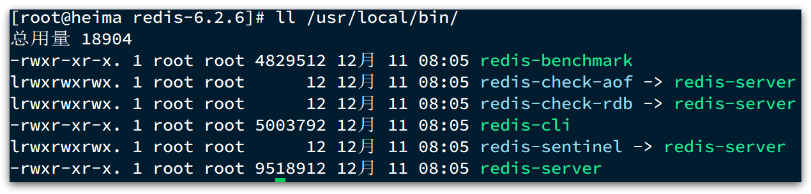
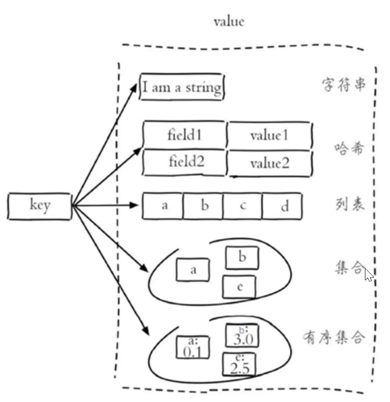
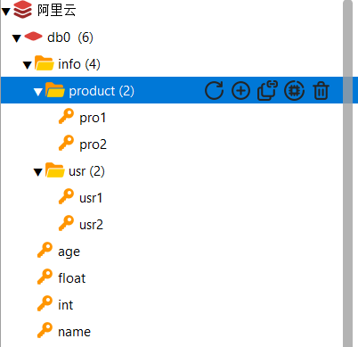
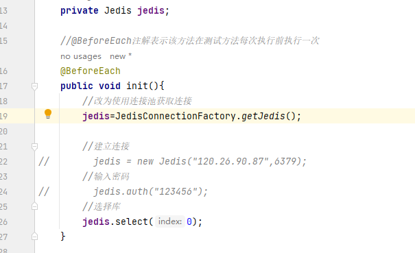
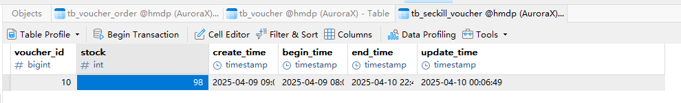
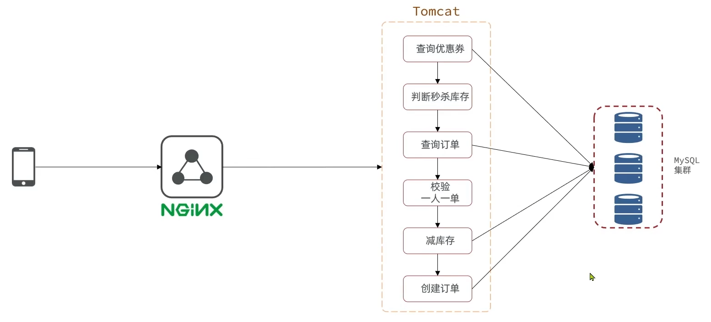
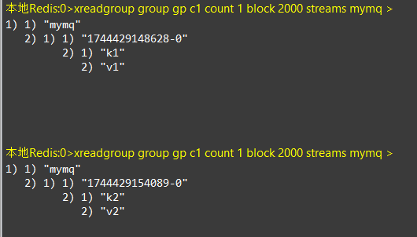
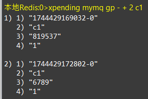
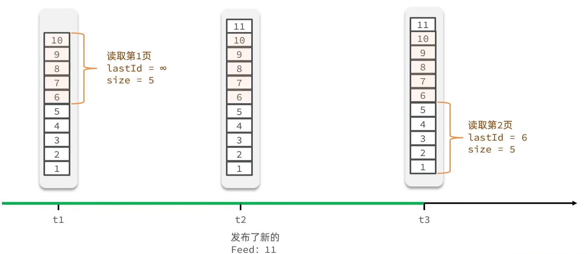
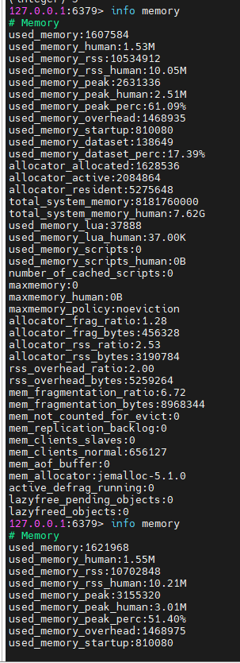

# Redis学习笔记

参考资料：[基础篇-01.Redis入门课程介绍_哔哩哔哩_bilibili](https://www.bilibili.com/video/BV1cr4y1671t?spm_id_from=333.788.videopod.episodes&vd_source=f3cb3ea986b26c6910b4df6d37acd60d&p=2)


## 认识Redis

Redis是Remote Dictionary Server的缩写，因为远程词典服务器，是一个基于内存的键值型NoSQL数据库

它具有以下特征


Redis属于非关系型数据库(NoSQL)，非关系型数据库与关系型数据库的区别如下


其中事务特性，SQL是满足ACID原则，NoSQL是满足BASE原则

扩展性，SQL垂直指的是SQL在存储数据时只能将数据存储到本地数据库中，不能像NoSQL一样可以将数据拆分进行分布式存储。


## Redis安装说明

大多数企业都是基于Linux服务器来部署项目，而且Redis官方也没有提供Windows版本的安装包。因此课程中我们会基于Linux系统来安装Redis.

此处选择的Linux版本为CentOS 7.

Redis的官方网站地址：https://redis.io/


1.单机安装Redis

### 1.1.安装Redis依赖

Redis是基于C语言编写的，因此首先需要安装Redis所需要的gcc依赖：

```sh
yum install -y gcc tcl
```


### 1.2.上传安装包并解压

然后将课前资料提供的Redis安装包上传到虚拟机的任意目录：


例如，我放到了/usr/local/src 目录：


解压缩：

```sh
tar -xzf redis-6.2.6.tar.gz
```

解压后：


进入redis目录：

```sh
cd redis-6.2.6
```


运行编译命令：

```sh
make && make install
```

如果没有出错，应该就安装成功了。


默认的安装路径是在 `/usr/local/bin`目录下：



该目录已经默认配置到环境变量，因此可以在任意目录下运行这些命令。其中：

- redis-cli：是redis提供的命令行客户端
- redis-server：是redis的服务端启动脚本
- redis-sentinel：是redis的哨兵启动脚本


### 1.3.启动

redis的启动方式有很多种，例如：

- 默认启动
- 指定配置启动
- 开机自启


### 1.3.1.默认启动

安装完成后，在任意目录输入redis-server命令即可启动Redis：

```
redis-server
```

如图：


这种启动属于`前台启动`，会阻塞整个会话窗口，窗口关闭或者按下`CTRL + C`则Redis停止。不推荐使用。


### 1.3.2.指定配置启动

如果要让Redis以`后台`方式启动，则必须修改Redis配置文件，就在我们之前解压的redis安装包下（`/usr/local/src/redis-6.2.6`），名字叫redis.conf：


我们先将这个配置文件备份一份：

```
cp redis.conf redis.conf.bck
```


然后修改redis.conf文件中的一些配置：

```
vi  redis.conf
```

```properties
# 允许访问的地址，默认是127.0.0.1，会导致只能在本地访问。修改为0.0.0.0则可以在任意IP访问，生产环境不要设置为0.0.0.0
bind 0.0.0.0
# 守护进程，修改为yes后即可后台运行
daemonize yes 
# 密码，设置后访问Redis必须输入密码
requirepass 123321
```


Redis的其它常见配置：

```properties
# 监听的端口
port 6379
# 工作目录，默认是当前目录，也就是运行redis-server时的命令，日志、持久化等文件会保存在这个目录
dir .
# 数据库数量，设置为1，代表只使用1个库，默认有16个库，编号0~15
databases 1
# 设置redis能够使用的最大内存
maxmemory 512mb
# 日志文件，默认为空，不记录日志，可以指定日志文件名
logfile "redis.log"
```


启动Redis：

```sh
# 进入redis安装目录 
cd /usr/local/src/redis-6.2.6
# 启动
redis-server redis.conf
```


停止服务：

```sh
# 利用redis-cli来执行 shutdown 命令，即可停止 Redis 服务，
# 因为之前配置了密码，因此需要通过 -u 来指定密码
redis-cli -u 123321 shutdown
```


### 1.3.3.开机自启

我们也可以通过配置来实现开机自启。

注意，要想这里的配置成功，上面的配置步骤一定要做，要允许Redis以守护进程方式运行。

首先，新建一个系统服务文件：

```sh
vi /etc/systemd/system/redis.service
```

内容如下：

```conf
[Unit]
Description=redis-server
After=network.target

[Service]
Type=forking
ExecStart=/usr/local/bin/redis-server /usr/local/src/redis-6.2.6/redis.conf
PrivateTmp=true

[Install]
WantedBy=multi-user.target
```


然后重载系统服务：

```sh
systemctl daemon-reload
```


现在，我们可以用下面这组命令来操作redis了：

```sh
# 启动
systemctl start redis
# 停止
systemctl stop redis
# 重启
systemctl restart redis
# 查看状态
systemctl status redis
输入冒号  : 然后加q退出查看状态
```


执行下面的命令，可以让redis开机自启：

```sh
systemctl enable redis
```


### Windows系统下设置开机自启

win+r，输入`services.msc`可快速打开当前服务的窗口，查看是否有Redis服务


如果没有就进入Redis的安装目录，执行以下命令

```cmd
redis-server --service-install redis.windows.conf --loglevel verbose
```

这样就能在服务中找到Redis了

然后一下命令用于操作Redis服务

```cmd
卸载服务：redis-server --service-uninstall
开启服务：redis-server --service-start
停止服务：redis-server --service-stop
```

以上操作需要进入Redis的安装目录才能有效，如果想全局生效，就将Redis的安装目录添加到环境变量里面


## Redis命令行客户端

Redis在安装时自带了一个命令行客户端

```sh
redis-cli -h Redis数据库的地址 -p 端口号 [-a 密码]

redis-cli -h localhost -p 6379 -a 123456

redis-cli -h localhost -p 6379
#如果连接时不指定密码可以在连接后再验证密码
#连接后使用以下命名来验证密码
AUTH 密码
#使用ping命令来验证Redis是否连接成功
ping
```


## Redis命令

#### Redis常用数据类型

 Redis中key是String类型的，value有五种常用的数据类型

1.String，字符串。普通字符串，Redis中最简单的数据类型

2.hash，哈希。也叫做散列，hash内部也是类似于一个键值对形式的存储形式，实际上就是一个字符串类型的field和value的映射表，因此哈希适合存储对象类型数据。

3.list，列表。按照插入顺序排序，可以有重复数据，类似Java中的LinkedList

4.set，集合。无序且不能重复，类似Java中的HashSet

5.sorted set/zset，有序集合。集合中每个元素关联一个分数（score），根据分数升序排序，没有重复元素。

这五种数据类型如下图所示



 

#### Redis字符串（String）操作命令

字符串类型下面又分有三种类型：1.string普通字符串、2.int整数类型，可做自增自减操作、3.float浮点类型，可做自增自减操作。

不管那种格式，顶层都是以字节数组形式存储。字符串类型数据最大不能超过512M

操作字符串的命令常用的有如下几个：

设置key的值为value

```
SET key value 
```

批量添加修改key

```
MSET key1 value1 [key2 value2] [....]
```


获取key的值

```
GET key
```

批量获取key的值

```
MGET key1 [key2] [...] 
```


设置key的值为value，并指定key的过期时间为seconds秒

```
SETEX key seconds value

等效于
SET key value ex seconds
```


只有当key不存在时，才设置key的值为value

```
SETNX key value

等效于
SET key value nx
```


整形数据的自增自减

```
INCR key 		让整形key自增1
INCRBY key num		让key增加num
INCRBY key -1		让key自减1

```


浮点类型的增减

```
INCRBYFLOAT key num			让浮点类型的key增加num  
```


#### Redis哈希（Hash）操作命令

实际上哈希类型的数据就是一个哈希表


将key所指的哈希表中field对应的值设置为value

```
HSET key field value
```

批量添加哈希表的字段

```
HMSET key field1 value1 field2 value2 [field3 value3] [....]
```

当哈希表中某个field不存在才添加相应的field并设置为value

```
HSETNX key field value
```


取出key哈希表中field对应的值

```
HGET key field
```

批量取出key哈希表中field对应的值

```
HMGET key field1 field2 [field3] [....]
```


取出key哈希表中的所有field和value

```
HGETALL key
```


删除key哈希表中field对应的值

```
HDEL key field
```


获取key哈希表中的所有field

```
HKEYS key
```


获取key哈希表中的所有value

```
HVALS key 
```


让key哈希表中field的值自增指定大小increment

```
HINCRBY key field increment
```


 

#### Redis列表（List）操作命令

列表List是一个简单的字符串列表，依照插入顺序排列


将一个或多个数据插入列表头部（左边）

```
LPUSH key value1 [value2]
```

将一个或多个数据插入列表尾部（右边）

```
RPUSH key value1 [value2]
```


从列表中取出指定范围内的元素

其中 0 表示列表的第一个元素， 1 表示列表的第二个元素，以此类推。 你也可以使用负数下标，以 -1 表示列表的最后一个元素， -2 表示列表的倒数第二个元素，以此类推。

```
LRANGE key start stop
```


移出并获取列表的第一个元素（左边）

```
LPOP key
```

移出并获取列表的最后一个元素（右边）

```
RPOP key
```

BLPOP和BRPOP和LPOP、RPOP类似，只不过会在list没有元素时等待指定时间time，而不是返回nullkey 

```
BLPOP key time
```


获取列表长度

```
LLEN key
```


#### Redis集合（Set）操作命令

Set是字符串类型的无序集合


向key集合添加一个或多个成员

```
SADD key member1 [member2]
```


返回key集合的所有成员

```
SMEMBERS key
```


判断key集合中是否存在member元素

```
SISMEMBER key member
```


获取key集合的成员数

```
SCARD key
```


返回指定所有集合的交集

```
SINTER key1 [key2]
```


返回指定所有集合的并集

```
SUNION key1 [key2]
```


返回指定所有集合的差集

```
SDIFF key1 [key2]
```


删除key集合中的一个或多个成员

```
SREM key memeber1 [member2]
```


#### Redis有序集合（zset）操作命令

有序集合是一个字符串类型的集合，不能重复，根据每个成员的score来排序


zset有很多命令


向key有序集合中添加一个或多个成员

```
ZADD key score1 rember1 [score2 rember2]
```


返回有序集合中指定范围的成员，带上WITHSCORES代表返回成员时会带上成员的score

```
ZRANGE key start stop [WITHSCORES]
```


为key有序集合中的member成员的score值增加increment

```
ZINCRBY key increment member
```


删除key有序集合中一个或多个成员

```
ZREM key member1 [member2]
```

 


#### Redis地理位置数据类型（GEO）操作命令

GEO是Geolocation的简写，代表地理坐标。其常见命令如下图所示


下面完成一个案例来熟悉GEO类型数据的操作命令


1.添加坐标信息到Redis

```bash
geoadd g1 116.378248 39.865275 bjn 116.42803 39.903738 bjz 116.322287 39.893729 bjx
```

2.计算北京西站到北京站的距离，km代表单位为千米

```bash
geodist g1 bjx bjz km
```

3.搜索天安门附近10km内所有的火车站

```bash
geosearch g1 fromlonlat 116.397904 39.909005 byradius 10 km withdist
```

以上3个命令的运行结果如下图所示


同时我们可以查看一下存储的具体内容，可以发现GEO类型数据其实也是基于SortedSet来的，它会将坐标自动转换成score


#### Redis位图（Bitmap）操作命令

Redis中是利用String类型数据来实现BitMap的，因此最大上限为512M，转换为bit则是2的32次方个bit位。

BitMap的常见命令如下图所示


命令示例如下

1.向指定位置存入0或1

向索引为1的位置，即第2个位置存入1

```bash
setbit bm1 1 1
```


连续执行上图命令的结果为：说明没有被指定的位置结果默认为0


2.获取指定位置的结果

获取键为bm1的BitMap的第3个位置的结果

```bash
getbit bm1 2
```


3.统计BitMap中1出现的次数

```bash
bigcount bm1
```


4.bitfield命令

这个命令比较复杂，如下图所示，有很多可选项


这里只展示get

get可以获取BitMap中多个位，并返回这些位组成的十进制的结果，type用于指定返回结果是无符号（u）的还是有符号（i）的，后面跟着的数字代表要获取的位的个数，最后一个0代表从第1位开始获取，如果是1就代表从第2位开始获取，以此类推。

```bash
bitfield bm1 get u3 0
```

下图是命令返回结果，其中bm1中的数据为`11010101`


5.查找第一个0或1出现的位置

查询bm1中第一个0出现的位置，该命令后面还可以带上start、end参数，表示一个查询范围

```bash
bitpos bm1 0
```


#### Hyperloglog（HLL）操作命令

HLL是从loglog算法派生出来的概率算法，用于确定非常大的集合的基数。

Redis中HLL是基于String类型实现的，其单个内存永远小于16kb。

HLL算法的测量结果是概率性的，具有误差，误差结果小于0.81%。因此非常适合用来实现UV统计，对于UV统计来说，0.81%的误差完全可以忽略不计。


HLL相关命令

1.向HLL添加元素

```bash
pfadd key element [element..]
pfadd hll1 e1 e2 e3 e4 e5
```

2.统计HLL中的元素个数

```bash
pfcount hll1
```

即使向HLL中存入多个相同的元素，HLL也只会统计一次


#### 通用命令

通用命令不区分类型，所有类型都可以使用


查找所有符合指定模式（pattern）的key

```
KEYS pattern
keys *     返回所有key
keys set*  返回所有以set开头的key
keys *s*   返回包含字母s的key

```

由于Redis是单线程的，因此在模糊查询key时，会阻塞线程，因此在实际开发中不建议使用该命令


判断某个key是否存在

```
EXISTS key
```


返回key所存储的类型

```
TYPE key
```


删除存在的key

```
DEL key
```

批量删除

```
DEL key1 key2 key3 ...
```


为key设置有效期

```
EXPIRE key seconds
EXPIRE age 20			设置age这个key的有效期为20秒
```

查询key的剩余有效期

```
TTL key
TTL age					查询age这个key的剩余有效期
```

有效期为-2表示key已经过期

有效期为-1表示key是永久的


#### Redis中key的分级存储

如果现在需要存储两种信息：一个用户信息，一个商品信息，它们中都有一个共同属性id，但redis中不允许存在重复的key，那要怎么同时存储这两个id呢？可以使用分级存储，分级存储就像是文件夹一样，既然同一个文件夹下不能存在同名，那就将这些同名的文件放在不同文件夹下呗。分级存储也是这个道理。

比如要同时存储用户的id和商品的id，可以这样设置key键

用户id

```
set info:usr:usr1 '{"id":1,"name":"sky"}'
```

商品id

```
set info:product:pro1 '{"id":3,"name":"pro1"}'
```

此时我们就可以通过图像化界面来看到存储数据的层级结构



## Redis客户端

Redis客户端有以下几种，其中Spring Data Redis集成了Jedis和lettuce


### Jedis快速入门

1.引入Jedis的依赖

```xml
    <dependency>
      <groupId>redis.clients</groupId>
      <artifactId>jedis</artifactId>
      <version>5.2.0</version>
    </dependency>
```


2.建立Redis连接

3.使用Jedis进行操作，命令与Redis原命令一致

4.释放资源

上面三步的整体代码如下

```java
import org.junit.jupiter.api.AfterEach;
import org.junit.jupiter.api.BeforeEach;
import org.junit.jupiter.api.Test;
import redis.clients.jedis.Jedis;

import java.util.HashMap;
import java.util.Map;

public class test {

    private Jedis jedis;

    //@BeforeEach注解表示该方法在测试方法每次执行前执行一次
    @BeforeEach
    public void init(){
        //建立连接
        jedis = new Jedis("120.26.90.87",6379);
        //输入密码
        jedis.auth("123456");
        //选择库
        jedis.select(0);
    }

    @Test
    public void testJedis(){
        //添加字符串数据
        jedis.set("Jedis","666");
        //获取字符串数据
        String data = jedis.get("Jedis");
        System.out.println("Jedis："+data);
    }
    @Test
    public void testHash(){
        //测试哈希类型的数据
        jedis.hset("user1","name","sky");
        jedis.hset("user1","age","21");

        //批量添加
        Map<String,String> user = new HashMap<>();
        user.put("name","arthur");
        user.put("age","22");
        jedis.hmset("user2",user);

        //获取哈希数据
        Map<String, String> user1 = jedis.hgetAll("user1");
        Map<String, String> user2 = jedis.hgetAll("user2");
        System.out.println("user1:"+user1);
        System.out.println("user2:"+user2);
    }

    //@AfterEach注解表示每次执行完测试方法后执行一次该方法
    @AfterEach
    public void tearDown(){
        //释放连接
        if(jedis!=null){
            jedis.close();
        }
    }


}
```

 


### Jedis连接池

Jedis本身是线程不安全的，并且频繁创建销毁连接会损耗性能，因此使用连接池会是一个更好的选择

首先创建一个连接工厂，用来获取连接，连接工厂使用的就是连接池

```java
import redis.clients.jedis.Jedis;
import redis.clients.jedis.JedisPool;
import redis.clients.jedis.JedisPoolConfig;

public class JedisConnectionFactory {
    private static final JedisPool jedisPool;

    static {
        //首先创建一个连接池的配置对象
        JedisPoolConfig jedisPoolConfig = new JedisPoolConfig();
        //配置Jedis连接池
        //设置最大连接
        jedisPoolConfig.setMaxTotal(8);
        //设置最大空闲连接
        jedisPoolConfig.setMaxIdle(8);
        //设置最小空闲连接
        jedisPoolConfig.setMinIdle(0);
        //设置最长等待时间 ms -1表示无限等待
        jedisPoolConfig.setMaxWaitMillis(200);

        //使用jedis配置对象创建jedisPool连接池对象
        jedisPool=new JedisPool(jedisPoolConfig,"120.26.90.87",6379,1000,"123456");

    }


    public static Jedis getJedis(){
        return jedisPool.getResource();
    }


}
```

此时获取连接对象就变成通过连接池来获取




### Spring Data Redis

#### 1.导入Spring Data Redis的依赖

```xml
<dependency>
    <groupId>org.springframework.boot</groupId>
    <artifactId>spring-boot-starter-data-redis</artifactId>
</dependency>
```

如果要使用连接池还需要使用连接池依赖

```xml
<!--commons pool-->
<dependency>
    <groupId>org.apache.commons</groupId>
    <artifactId>commons-pool2</artifactId>
</dependency>
```

不管是Jedis还是lettuce，底层使用的连接池都是基于commons-pool


#### 2.配置Redis

```xml
spring:
  profiles:
    active: dev
  main:
    allow-circular-references: true
  redis:
    host: localhost
    port: 6379
    password: 123456
    database: 10			#指定使用哪一个数据库，Redis默认生成16个数据库，0~15，数据库之间是隔离的

```

如果要使用连接池，还需配置连接池的参数

```yaml
spring:
  data:
    redis:
      host:
      port:
      password:
      #配置连接池，如果使用的是Jedis，配置就要变成Jedis的
      lettuce:
        pool:
          max-active: 8     #最大连接
          max-idle: 8       #最大空闲连接
          min-idle: 0       #最小空闲连接
          max-wait: 200     #连接等待时间
```


#### 3.编写配置类，创建RedisTemplate对象

```java
@Configuration
@Slf4j
public class RedisConfiguration {

    @Bean
    //RedisConnectionFactory导入的依赖已经自动创建并交给IOC容器管理了，因此这里我们可以直接通过依赖注入来获得
    public RedisTemplate redisTemplate(RedisConnectionFactory redisConnectionFactory){
        //创建一个RedisTemplate
        RedisTemplate redisTemplate = new RedisTemplate<>();
        //设置Redis的连接工厂对象
        redisTemplate.setConnectionFactory(redisConnectionFactory);
        //设置Redis的key的序列化器
        redisTemplate.setKeySerializer(new StringRedisSerializer());
        //哈希类型的key和value的序列化器需要单独设置，设置哈希类型数据的key（也就是field）的序列化器
        //redisTemplate.setHashKeySerializer(new StringRedisSerializer());
        //设置Redis的value的序列化器
        //redisTemplate.setValueSerializer(new GenericJackson2JsonRedisSerializer());
        //redisTemplate.setHashValueSerializer(new GenericJackson2JsonRedisSerializer());
        
        return redisTemplate;
    }
}
```

如果不设置Redis的序列化器，那么不管是key还是value，在存入Redis数据库时都要被默认序列化器序列化后再存入，但是默认序列化器的序列化后的可读性较差，并且对于key，没法存入原始的key，如：假如key为name，但经过序列化后会变成一连串的编码直接存入，就会导致实际上存入的key不是name。因此我们一般会设置KeySerializer为StringRedisSerializer，设置ValueSerializer为json序列化器：GenericJackson2JsonRedisSerializer()。

但是使用json序列化器会导致一个问题，如下图


在将对象序列化时，同时添加了改对象的类的字节码，这是为了在反序列化时能够知道该对象到底是一个什么类的对象。但是添加的字节码的大小比我们真正内容的大小还要大，这就造成了空间的浪费。

因此在实际开发中，建议key和value的序列化器都使用StringRedisSerializer，然后手动对对象进行序列化和反序列化。

Spring默认提供了一个StringRedisTemplate类，它的key和value的序列化器使用的就是StringRedisSerializer，因此我们可以通过依赖注入来直接使用这个类，省去了我们自己配置这个类的代码。


#### 4.使用RedisTemplate对象操作Redis

前面讲的所有命令在Java中的使用示例如下

```java
@SpringBootTest
public class SpringDataRedisTest {

    @Autowired
    RedisTemplate redisTemplate;

    @Test
    public void testRedisTemplate(){
        //使用RedisTemplate来创建操作Redis每种数据类型的对象
        System.out.println(redisTemplate);
        //创建操作Redis字符串类型数据的对象
        ValueOperations valueOperations = redisTemplate.opsForValue();
        //创建操作Redis哈希类型数据的对象
        HashOperations hashOperations = redisTemplate.opsForHash();
        //创建操作Redis列表类型数据的对象
        ListOperations listOperations = redisTemplate.opsForList();
        //创建操作Redis集合类型数据的对象
        SetOperations setOperations = redisTemplate.opsForSet();
        //创建操作Redis有序集合类型数据的对象
        ZSetOperations zSetOperations = redisTemplate.opsForZSet();
    }

    /**
     * 通过RedisTemplate对象来操作Redis的字符串类型数据
     */
    @Test
    public void testStringOperation(){
        ValueOperations valueOperations = redisTemplate.opsForValue();
        //Redis中的set命令，value的参数可以是任意类型的对象，最终都会被转换成字符串类型存入Redis数据库
        valueOperations.set("name","Arthur");
        //Redis中的get命令
        String name = (String) valueOperations.get("name");
        System.out.println(name);

        //Redis中的setex命令
        valueOperations.set("age",21,1, TimeUnit.MINUTES);
        //Redis中的setnx命令
        valueOperations.setIfAbsent("hobby","java");
        System.out.println(valueOperations.get("hobby"));   //java
        valueOperations.setIfAbsent("hobby","C++");
        System.out.println(valueOperations.get("hobby"));   //还是java

    }

    /**
     * 通过RedisTemplate对象来操作Redis的哈希类型数据
     */
    @Test
    public void testHashOperation(){
        HashOperations hashOperations = redisTemplate.opsForHash();

        //Redis中的hset命令
        hashOperations.put("people","name","张三");
        hashOperations.put("people","age",21);

        //Redis中的hget命令
        System.out.println(hashOperations.get("people", "name"));       //张三
        System.out.println(hashOperations.get("people", "age"));        //21

        //Redis中的hkeys命令
        Set keys = hashOperations.keys("people");
        System.out.println(keys);

        //Redis中的hvals命令
        List values = hashOperations.values("people");
        System.out.println(values);

        //Redis中的hdel命令
        hashOperations.delete("people","age");

    }

    /**
     * 通过RedisTemplate对象来操作Redis的列表类型数据
     */
    @Test
    public void testListOperation(){
        ListOperations listOperations = redisTemplate.opsForList();
        //Redis中的lpush命令
        listOperations.leftPushAll("list","a","b","c");
        listOperations.leftPush("list","d");

        //Redis中的lrange命令
        List list = listOperations.range("list", 0, -1);
        System.out.println(list);

        //Redis中的rpop命令
        System.out.println(listOperations.rightPop("list"));        //a

        //Redis中的llen命令
        System.out.println(listOperations.size("list"));            //3
    }


    /**
     * 通过RedisTemplate对象来操作Redis的集合类型数据
     */
    @Test
    public void testSetOperation(){
        SetOperations setOperations = redisTemplate.opsForSet();
        //Redis中的sadd命令
        setOperations.add("set1","a","b","c","d");
        setOperations.add("set2","a","b","x","y");

        //Redis中的smembers命令
        Set set1 = setOperations.members("set1");
        System.out.println(set1);

        //Redis中的scard命令
        System.out.println(setOperations.size("set1"));       //4

        //Redis中的sinter
        Set intersect = setOperations.intersect("set1", "set2");
        System.out.println(intersect);

        //Redis中的sunion命令
        Set union = setOperations.union("set1", "set2");
        System.out.println(union);

        //Redis中的srem命令
        setOperations.remove("set1","a","b");

    }

    /**
     * 通过RedisTemplate对象来操作Redis的有序集合类型数据
     */
    @Test
    public void testZSetOperation(){
        ZSetOperations zSetOperations = redisTemplate.opsForZSet();

        //Redis中的zadd命令
        zSetOperations.add("zset","a",10.2);
        zSetOperations.add("zset","b",10);
        zSetOperations.add("zset","c",11);

        //Redis中的zrange命令
        Set zset = zSetOperations.range("zset", 0, -1);
        System.out.println(zset);

        //Redis中的zincrby
        zSetOperations.incrementScore("zset","a",5.0);
        zset = zSetOperations.range("zset", 0, -1);
        System.out.println(zset);

        //Redis中的zrem命令
        zSetOperations.remove("zset","a");

    }


    /**
     * 通用命令
     */
    @Test
    public void testCommonOperation(){
        //Redis中的keys命令
        Set keys = redisTemplate.keys("*");
        System.out.println(keys);

        //Redis中的exists 命令
        System.out.println(redisTemplate.hasKey("list"));       //true
        System.out.println(redisTemplate.hasKey("abc"));        //false

        //Redis中的type命令
        for (Object key : keys) {
            System.out.println(redisTemplate.type(key));
        }

        //Redis中的del命令
        redisTemplate.delete("people");

    }
}
```


## 黑马点评实战

### 项目导入问题

我在导入项目时遇到了两个问题

1.Redis死循环

启动项目后控制台一直报这样一个错误：NOGROUP No such key 'stream.orders' or consumer group 'g1' in XREADGROUP with GROUP option

解决方法：

在Redis中输入命令

```
XGROUP CREATE stream.orders g1 0 MKSTREAM
XGROUP CREATE 队列名称  组名称  起始id  MKSTREAM不存在则自动创建
```


2.MySQL一直报错：Public Key Retrieval is not allowed

这是MySQL8.0及以上版本会出现的问题，默认情况下禁用了通过公钥检索用户密码的功能。

在旧版本的 MySQL 中，客户端连接到服务器时，可以使用公钥来检索用户密码。这种机制称为 “public key retrieval”，它允许客户端使用公钥来解密在服务器端加密的密码。然而，为了提高安全性，MySQL 开发团队在较新的版本中禁用了这个功能。禁用公钥检索可以防止恶意用户通过获取公钥来获取用户密码。

解决这个问题可以在配置MySQL连接路径是添加如下配置

```
allowPublicKeyRetrieval=true
```

即：


### 短信登录功能

#### 基于Session

实现短信登录功能可以基于Session来实现，即生成验证码后将验证码code存到Session中，当用户输入验证码进行登录时就可以根据用户请求的SessionID来从对应的Session中取出验证码code，接着进行比对即可完成登录校验。

但是这种方式存在Session共享问题：多台Tomcat服务器间的Session不共享，实际生产环境中，服务端通常部署在多台服务器上，由nginx来负载均衡，因此用户多次请求时访问的服务器很可能不是同一台，此时由于Session不共享，原本用户的Session信息就会丢失。


#### 基于Redis

基于Redis来实现本功能时，我们可以将生成的验证码code放在Redis数据库中，而多台Tomcat可以使用同一个Redis服务器，因此就可以解决Session共享问题。

实现思路如下：

用户发送验证码请求，生成验证码，以用户的手机号作为key，将验证码存入Redis中。

当用户使用验证码进行登录时，根据用户提供的手机号去Redis中查询验证码并进行校验，如果校验通过就再从mysql数据库中查询该用户以判断该用户是否为新用户，如果为新用户就创建新用户保存到数据库中，并将用户信息保存到Redis中，保存用户信息的key使用UUID生成的token（不使用手机号是为了避免用户手机号信息泄露），然后将token返回给客户端，客户端下次发起请求时就会带上这个token。


##### 1.定义拦截器

```java
public class LoginInteceptor implements HandlerInterceptor {
    
    //要先准备好操作Redis的类
    private StringRedisTemplate stringRedisTemplate;

    public LoginInteceptor(StringRedisTemplate stringRedisTemplate) {
        this.stringRedisTemplate = stringRedisTemplate;
    }

    @Override
    public boolean preHandle(HttpServletRequest request, HttpServletResponse response, Object handler) throws Exception {
        //获取token，不再获取Session
        //HttpSession session = request.getSession();
        Object token = request.getHeader("authorization");
        
        //从Redis中获取用户信息
        //Object user = session.getAttribute("user");
        String key = RedisConstants.LOGIN_USER_KEY+token;

        Map<Object, Object> userMap = stringRedisTemplate.opsForHash().entries(key);
        //判断用户是否存在，这里不用判断空指针，因为entries做了处理，如果没有对应的键，返回的是一个空的集合。
        if (userMap.isEmpty()) {
            //不存在则拦截请求
            response.setStatus(401);
            return false;
        }
        //将获取到的map转换成用户信息对象
        UserDTO user = BeanUtil.fillBeanWithMap(userMap, new UserDTO(), false);

        //存在则将用户信息存入LocalThread中，然后放行
        UserHolder.saveUser(user);
        /*刷新token的过期时间，只有当用户超过30分钟未访问才进行清除用户登录状态
        反之如果用户有持续访问，就要在每次访问呢时刷新过期时间。*/
        stringRedisTemplate.expire(key,RedisConstants.LOGIN_USER_TTL, TimeUnit.SECONDS);
        //放行
        return true;

    }


    @Override
    public void afterCompletion(HttpServletRequest request, HttpServletResponse response, Object handler, Exception ex) throws Exception {
        UserHolder.removeUser();
    }
}
```


##### 2.注册拦截器

```java
@Configuration
public class MVCConfig implements WebMvcConfigurer {

    @Autowired
    StringRedisTemplate stringRedisTemplate;

    @Override
    public void addInterceptors(InterceptorRegistry registry) {
        registry.addInterceptor(new LoginInteceptor(stringRedisTemplate)).excludePathPatterns(
                "/user/login",
                "/user/code",
                "/shop/**",
                "/voucher/**",
                "/shop-type/**",
                "upload/**",
                "blog/hot"
        );
    }
}
```

##### 3.Controller层

```java
/**
 * 发送手机验证码
 */
@PostMapping("code")
public Result sendCode(@RequestParam("phone") String phone, HttpSession session) {
    return userInfoService.sendCode(phone,session);

}

/**
 * 登录功能
 * @param loginForm 登录参数，包含手机号、验证码；或者手机号、密码
 */
@PostMapping("/login")
public Result login(@RequestBody LoginFormDTO loginForm, HttpSession session){
    // 实现登录功能
    //return Result.fail("功能待完成");
    return userService.login(loginForm,session);
}
```


##### 4.Service层

userInfoService

```java
@Service
@Slf4j
public class UserInfoServiceImpl extends ServiceImpl<UserInfoMapper, UserInfo> implements IUserInfoService {

    //直接使用Spring提供的StringRedisTemplate
    @Autowired
    StringRedisTemplate stringRedisTemplate;

    /**
     * 发送手机验证码
     *
     * @param phone
     * @param session
     * @return
     */
    @Override
    public Result sendCode(String phone, HttpSession session) {
        //1.校验手机号是否合法
        if (phone == null || !phone.matches(RegexPatterns.PHONE_REGEX)) {
            //2.如果不合法直接返回错误
            return Result.fail("请输入正确的手机号");

        }
        //3.如果合法就生成一个随机验证码
        String code = RandomUtil.randomNumbers(6);

        //4.将验证码存入Redis
        //session.setAttribute("code",code);
        stringRedisTemplate.opsForValue().set(RedisConstants.LOGIN_CODE_KEY+phone,code,RedisConstants.LOGIN_CODE_TTL, TimeUnit.MINUTES);


        //5.为用户发送验证码，暂时不实现发送验证码的功能
        log.debug("发送验证码：{}",code);

        return Result.ok();
    }
}
```


userService

```java
@Service
public class UserServiceImpl extends ServiceImpl<UserMapper, User> implements IUserService {

    @Autowired
    StringRedisTemplate stringRedisTemplate;

    /**
     * 用户登录
     * @param loginForm
     * @param session
     * @return
     */
    @Override
    public Result login(LoginFormDTO loginForm, HttpSession session) {
        //1.验证手机号
        String phone = loginForm.getPhone();
        if(phone==null|| RegexUtils.isPhoneInvalid(phone)){
            //手机号不合法
            return Result.fail("手机号错误");
        }
        //2.校验验证码
        String cacheCode = stringRedisTemplate.opsForValue().get(RedisConstants.LOGIN_CODE_KEY+phone);
        String code = loginForm.getCode();
        if(code==null||!code.equals(cacheCode)){
            //验证码校验失败
            return Result.fail("验证码错误");
        }
        //3.如果验证码通过，就在数据库中查询用户
        User user = query().eq("phone", phone).one();

        //4.如果数据库中不存在用户，则将该新用户存入数据库
        if(user==null){
            user = createUserWithPhone(phone);
        }

        //5.将用户信息存入Redis
        UserDTO userDTO = new UserDTO();
        BeanUtils.copyProperties(user,userDTO);
        //生成token作为键值
        String token = UUID.randomUUID().toString(true);
        //由于使用的是StringRedisTemplate来操作Redis，StringRedisTemplate要求key和value都要为String类型，所以这里要对对象中的数据处理一下
        Map<String, Object> userMap = BeanUtil.beanToMap(user,new HashMap<>(),CopyOptions.create()
                .setIgnoreNullValue(true)
                .setFieldValueEditor((fileName,fileValue)->fileValue.toString()));
        //将用户信息存入Redis
        stringRedisTemplate.opsForHash().putAll(RedisConstants.LOGIN_USER_KEY+token,userMap);
        //设置token过期时间
        stringRedisTemplate.expire(RedisConstants.LOGIN_USER_KEY+phone,RedisConstants.LOGIN_USER_TTL, TimeUnit.SECONDS);

        //不使用Session
        //session.setAttribute("user",userDTO);

        //返回token
        return Result.ok(token);
    }

    private User createUserWithPhone(String phone) {
        User user = new User();
        user.setPhone(phone);
        user.setNickName(SystemConstants.USER_NICK_NAME_PREFIX+phone);
        save(user);
        return user;
    }
}
```


#### 登录状态刷新问题

上面实现了短信登录的功能，但是仍然存在一个问题，我们刷新用户登录状态的操作是在拦截器中进行的，但是如果用户访问的是不需要拦截的路径，我们就无法刷新用户的登录状态了。

要解决这个问题我们可以在原来的基础上再加一层拦截器，这层拦截器拦截所有请求路径，拦截到请求后就在Redis中查询用户信息，如果查到用户信息，就刷新过期时间。


新增RefreshInterceptor，用于刷新登录状态

```java
public class RefreshInteceptor implements HandlerInterceptor {

    //要先准备好操作Redis的类
    private StringRedisTemplate stringRedisTemplate;

    public RefreshInteceptor(StringRedisTemplate stringRedisTemplate) {
        this.stringRedisTemplate = stringRedisTemplate;
    }

    @Override
    public boolean preHandle(HttpServletRequest request, HttpServletResponse response, Object handler) throws Exception {
        //获取token，不再获取Session
        //HttpSession session = request.getSession();
        Object token = request.getHeader("authorization");
        
        //从Redis中获取用户信息
        //Object user = session.getAttribute("user");
        String key = RedisConstants.LOGIN_USER_KEY+token;

        Map<Object, Object> userMap = stringRedisTemplate.opsForHash().entries(key);
        //判断用户是否存在，这里不用判断空指针，因为entries做了处理，如果没有对应的键，返回的是一个空的集合。
        if (userMap.isEmpty()) {
            //不存在直接放行
            return true;
        }
        //将获取到的map转换成用户信息对象
        UserDTO user = BeanUtil.fillBeanWithMap(userMap, new UserDTO(), false);

        //存在则将用户信息存入LocalThread中，然后放行
        UserHolder.saveUser(user);
        /*刷新token的过期时间，只有当用户超过30分钟未访问才进行清除用户登录状态
        反之如果用户有持续访问，就要在每次访问呢时刷新过期时间。*/
        stringRedisTemplate.expire(key,RedisConstants.LOGIN_USER_TTL, TimeUnit.SECONDS);
        //放行
        return true;

    }


    @Override
    public void afterCompletion(HttpServletRequest request, HttpServletResponse response, Object handler, Exception ex) throws Exception {
        UserHolder.removeUser();
    }
}
```

修改原来的拦截器

```java
public class LoginInteceptor implements HandlerInterceptor {
    @Override
    public boolean preHandle(HttpServletRequest request, HttpServletResponse response, Object handler) {
        //从ThreadLocal中获取用户信息
        UserDTO user = UserHolder.getUser();
        if(user==null){
            //如果用户不存在，就拦截请求
            response.setStatus(401);
            return false;
        }
        //用户存在则放行
        return true;

    }
}
```

注册拦截器

指定拦截器的order，来保证拦截器的执行顺序

```java
@Configuration
public class MVCConfig implements WebMvcConfigurer {

    @Autowired
    StringRedisTemplate stringRedisTemplate;

    @Override
    public void addInterceptors(InterceptorRegistry registry) {
        registry.addInterceptor(new LoginInteceptor()).excludePathPatterns(
                "/user/login",
                "/user/code",
                "/shop/**",
                "/voucher/**",
                "/shop-type/**",
                "/upload/**",
                "/blog/hot"
        ).order(1);
        registry.addInterceptor(new RefreshInteceptor(stringRedisTemplate)).addPathPatterns("/**").order(0);
    }
}
```


### 商户查询缓存

#### 缓存的优缺点

优点：

1.降低后端负载

2.提高读写效率，降低响应时间

缺点：

1.会导致数据一致性问题

2.代码维护成本较高（使用缓存，要在代码中添加保证数据一致性的代码等）

3.运维成本提高（需要额外维护用于缓存的数据库集群）。


#### 实现缓存商户

实现流程思路如下


```java
@Service
public class ShopServiceImpl extends ServiceImpl<ShopMapper, Shop> implements IShopService {

    @Resource
    StringRedisTemplate stringRedisTemplate;

    /**
     * 根据id查询商户
     * @param id
     * @return
     */
    @Override
    public Result queryById(Long id) {
        String key = RedisConstants.CACHE_SHOP_KEY+id;
        //1.查询缓存
        String shopJson = stringRedisTemplate.opsForValue().get(key);
        //2.缓存中存在商户信息，直接返回
        if(StrUtil.isNotBlank(shopJson)){
            Shop shop = JSONUtil.toBean(shopJson,Shop.class);
            return Result.ok(shop);
        }

        //3.不存在商户信息，查询数据库
        Shop shop = getById(id);
        //4.数据库不存在商户信息，返回404
        if(shop==null){
            return Result.fail("店铺不存在");
        }
        //5.存在商户信息，将信息存入缓存
        stringRedisTemplate.opsForValue().set(key,JSONUtil.toJsonStr(shop));
        //6.返回商户信息
        return Result.ok(shop);
    }
}
```


### 缓存更新策略

为了保证Redis与数据库中的数据保持一致，我们需要对Redis中的数据进行更新。

#### 三种缓存更新策略

下面有三种缓存更新策略

1.内存淘汰。当内存空间不足时，会自动删除一些缓存，Redis默认使用内存淘汰策略

2.超时剔除。给缓存设定过期时间，过期后自动删除缓存

3.主动更新。自己编写代码，每当数据发生变化就更新缓存

对于低一致性需求的业务，比如店铺类型数据，这些不经常变化的数据可以采用内存淘汰策略。

对于高一致性需求的业务，则采用主动更新策略，还可以用超时剔除策略来辅助（保底，就算没能主动更新成功，过期了也会自动删除缓存）。


#### 主动更新策略的实现方式

实现主动更新策略的方式也有多种

1.自己写代码来实现，在改动数据的同时更新缓存

2.将缓存与数据库整合为一个服务，由这个服务来保证缓存与数据库的一致性。无需开发者操心。

3.开发者只操作缓存，有其他线程异步地将缓存数据持久化到数据库中，保证数据的最终一致性。


#### 主动更新策略实现

这里我们采用第一种实现方式。

通过代码来实现改动数据的同时更新缓存。

要实现这个功能首先要考虑下面三个问题：

1.删除缓存还是更新缓存

一般选择直接删除缓存。因为如果选择更新缓存，那么每次更新数据库时都要更新缓存，但是可能在更新数据库那段时间并没有那么多访问请求，也就是说就算更新了缓存也没人访问，无效写操作较多。


2.如何保证对数据库和缓存的操作同时成功或失败

对于单体系统，我们可以将对缓存和数据库的操作放在同一个事务中。但是这种方式不能用于分布式系统

对于分布式系统，利用TCC等分布式事务方案（还没学过，想学的话去学微服务）


3.先操作缓存还是先操作数据库（线程安全问题）

先操作缓存会导致线程不安全的发生概率较高，因此先操作数据库。

因为操作缓存的速度比操作数据库的操作快很多，如果先操作缓存，在操作数据库的时候，可能数据库数据还没更新成功，其他线程就又会查询数据库将旧数据又放回缓存中。但是先操作数据库就会让这种可能大大降低，因为先操作完数据库后，操作缓存的速度非常快，很快就执行完了，执行时其他线程突然插进来执行的概率会变低。


#### 优化缓存商户功能（缓存更新）

当商户更新时我们需要同步更新缓存，以此保证数据的一致性。这里更新缓存采用的方式是直接删除原来的缓存。

下面是更新商户信息的功能代码

```java
/**
 * 更新商铺信息
 * @param shop
 * @return
 */
@Override
//开启事务
@Transactional
public Result update(Shop shop) {
    if(shop.getId()==null){
        return Result.fail("店铺id不能为空");
    }
    //更新数据库（先操作数据库，再操作缓存）
    updateById(shop);
    //删除缓存
    stringRedisTemplate.delete(RedisConstants.CACHE_SHOP_KEY+shop.getId());
    return Result.ok();
}
```


### 缓存穿透

#### 什么是缓存穿透

缓存穿透指的是客户端请求的数据在缓存和数据库中都不存在，这样缓存就永远不会生效，这些请求会全部打到数据库上，容易导致数据库服务崩溃。


#### 缓存穿透的解决方法

##### 1.缓存空值

如果一个请求查询数据库发现没有对应的数据，那么就将空值缓存到缓存中，这样这个请求下次来就不会造成缓存穿透了。

这种方式实现起来相对简单，但是有如下缺点：

1）会造成额外的内存消耗

2）会导致短期的数据不一致性。

如果将空值缓存到缓存中的这期间，在该缓存过期之前，如果正好该请求对应的数据就存储到数据库中了，就会导致数据不一致性，因为此时缓存的还是空值，但数据库里有刚存进来的值，只有当空值缓存过期后才能重新恢复一致性。


##### 2.布隆过滤

布隆过滤是在请求到达Redis之前再加一层布隆过滤器，布隆过滤器的作用是判断该请求对应的数据是否存在，如果存在则放行，如果不存在则直接拒绝请求。

布隆过滤器可以看成是一个byte数组，存储二进制位，数据库中存储的数据会基于某个哈希算法计算出其哈希值，再将哈希转转换为二级制位保存到布隆过滤器中，当我们判断请求的数据是否存在时，其实就是判断这个数据对应的位置是0还是1，以此判断数据是否存在。这种判断结果并不完全准确，它是一种基于概率上的结果，如果判断为不存在那就一定不存在，如果判断为存在就不一定存在。


布隆过滤虽然内存消耗小，没有存储多余的key，但是它有如下缺点：

1）实现复杂

2）存在误判可能


##### 3.减少会导致缓存穿透的请求

上面两种解决缓存穿透的方法是属于被动解决方法，就是别人已经发出了会导致缓存穿透的请求，我们来处理这个请求。那我们其实还可以采取一些措施主动地去减少会导致缓存穿透的请求。

下面是一些减少会导致缓存穿透的请求的数量的方法

1.增强请求路径的复杂度，比如对于请求路径携带的id值，我们可以刻意去设计id的格式，让别人难以猜测id的规律，这样我们在收到请求时只需要判断id是否合法就能够过滤掉很多会导致缓存穿透的请求了。

2.可以加强用户的权限校验，避免用户发出超出权限的请求。

3.可以对热点参数进行限流。让用户短时间内无法频繁发出请求。


#### 解决缓存穿透（缓存空值）

这里解决缓存穿透采用的方式是缓存空值。

```java
/**
 * 根据id查询商户
 * @param id
 * @return
 */
@Override
public Result queryById(Long id) {
    String key = RedisConstants.CACHE_SHOP_KEY+id;
    //1.查询缓存
    String shopJson = stringRedisTemplate.opsForValue().get(key);
    //2.缓存中存在商户信息，直接返回
    if(StrUtil.isNotBlank(shopJson)){
        Shop shop = JSONUtil.toBean(shopJson,Shop.class);
        return Result.ok(shop);
    }

    //解决缓存穿透，如果缓存为空值，说明信息不存在
    if(shopJson!=null){
        return Result.fail("店铺不存在");
    }

    //3.不存在商户信息，查询数据库
    Shop shop = getById(id);
    //4.数据库不存在商户信息，返回404
    if(shop==null){
        //并向缓存存入空值
        stringRedisTemplate.opsForValue().set(key,"",RedisConstants.CACHE_NULL_TTL,TimeUnit.MINUTES);
        return Result.fail("店铺不存在");
    }
    //5.存在商户信息，将信息存入缓存
    stringRedisTemplate.opsForValue().set(key,JSONUtil.toJsonStr(shop),RedisConstants.CACHE_SHOP_TTL, TimeUnit.MINUTES);
    //6.返回商户信息
    return Result.ok(shop);
}
```


### 缓存雪崩

#### 什么是缓存雪崩

缓存雪崩指的是在某一时刻，缓存中大量的key在同一时间失效，或者缓存服务直接宕机，导致大量请求一瞬间同时到达数据库，造成数据库服务的巨大压力甚至崩溃。


#### 如何解决缓存雪崩

##### 1.给不同的key的TTL设置为随机值

比如在缓存预热的时候存入TTL为随机值的缓存数据，这样就不会出现在同一时刻大量key失效的情况。


##### 2.利用Redis集群提高服务的可用性

微服务里面学


##### 3.给缓存业务添加降级限流策略

微服务里面学


##### 4.给业务添加多级缓存

微服务和Redis高级都有学


### 缓存击穿

#### 什么是缓存击穿

缓存击穿问题也叫热点key问题，指的是在一个被高并发访问（热点）并且缓存重构业务复杂（如：查询涉及多个表）的key突然失效了，大量的请求会瞬间给数据库带来巨大的压力。


#### 如何解决缓存击穿

##### 1.互斥锁

当key失效需要重新构建缓存时，需要先获取锁，然后才能执行缓存重构的业务，这样的话就只会有一个线程来访问数据库，减轻了数据库的压力。

其他未获得锁的线程会等待一段时间，然后重新查询缓存，如果缓存命中就可以直接返回，如果缓存没有命中就再尝试获取锁以执行缓存重构业务，如果又没有获取到锁，就再等待一段时间，重复上述流程。


##### 2.逻辑过期

逻辑过期指的是在缓存数据时多缓存一个expire数据，expire数据就表示过期时间，但是这个expire是放在缓存数据里的，实际的缓存是没有设置过期时间的，这样无论如何请求都能够命中缓存，只不过需要根据获取到的缓存数据中的expire来判断该缓存是否过期，如果过期就执行缓存重构业务，执行缓存重构业务之前同样需要获取互斥锁，但与上面讲的方式不同，这里获取到互斥锁后会再创建一个新的线程来单独执行缓存重构业务，而原本的线程则会直接返回旧的数据。其他没有获取到互斥锁的线程，也不会等待，而是直接返回旧数据。


#### 缓存击穿解决方法的比较


互斥锁的死锁风险：

如果一个缓存重构业务涉及到多个缓存，就可能需要获取多个锁，此时如果有多个线程，一个线程获取了一个锁还需要获取另一个锁，但另一个锁又被其他线程获取了，这个时候这两个线程都在等待获取剩下的锁，这就导致了死锁


逻辑过期的额外内存消耗指的是需要额外存储expire信息。


#### 解决缓存击穿（互斥锁）

##### 1.如何实现互斥锁

互斥锁实现是通过Redis的setnx来实现的，setnx有一个特点就是只有当key不存在时才能赋值成功，因此利用这个特性，我们可以在获取锁时尝试使用setnx来给key赋值，如果赋值成功说明获取到锁，如果获取失败说明锁被占用，如下图所示，第一次给key为lock的键赋值，成功，代表获取锁，第二次赋值失败，代表锁已经被占用。


##### 2.解决缓存击穿

有了如何实现互斥锁的知识，我们才能解决缓存击穿问题。在原来实现商铺缓存的逻辑上进行修改，当缓存未命中时不再直接访问数据库，而是先尝试获取锁，如果获取锁成功才会访问数据库，如果获取锁失败，则等待一段时间后再次尝试获取缓存，如果这时候缓存获取成功则直接返回，如果失败就继续尝试获取锁，就这样一直循环。


```java
/**
 * 根据id查询商户
 *
 * @param id
 * @return
 */
@Override
public Result queryById(Long id) {
    String key = RedisConstants.CACHE_SHOP_KEY + id;
    //.查询缓存
    Shop shop = getCache(id);
    if (shop != null) {
        return Result.ok(shop);
    }
    String s = stringRedisTemplate.opsForValue().get(key);
    if (s != null && StrUtil.isBlank(s)) {
        return Result.fail("店铺不存在");
    }

    //下面解决缓存击穿
    //.如果缓存中不存在商户信息，尝试获取锁
    try {
        Boolean flag = tryLock(RedisConstants.LOCK_SHOP_KEY + id);
        while (!flag) {
            //如果没有获取到锁，等待一段时间后再次查询缓存，存在则返回，不存在就再次尝试获取锁
            Thread.sleep(10);
            //再次查询缓存
            shop = getCache(id);
            if (shop != null) {
                //缓存存在则直接返回
                return Result.ok(shop);
            }
            s = stringRedisTemplate.opsForValue().get(key);
            if (s != null && StrUtil.isBlank(s)) {
                return Result.fail("店铺不存在");
            }else{
                //缓存不存在则再次尝试获取锁
                flag = tryLock(RedisConstants.LOCK_SHOP_KEY + id);
            }
        }

        //如果获取到锁，查询数据库
        //模拟一下高并发
        Thread.sleep(200);
        shop = getById(id);
        //4.数据库不存在商户信息，返回404
        if (shop == null) {
            //并向缓存存入空值
            stringRedisTemplate.opsForValue().set(key, "", RedisConstants.CACHE_NULL_TTL, TimeUnit.MINUTES);
            return Result.fail("店铺不存在");
        }
        //5.存在商户信息，将信息存入缓存
        stringRedisTemplate.opsForValue().set(key, JSONUtil.toJsonStr(shop), RedisConstants.CACHE_SHOP_TTL, TimeUnit.MINUTES);
        //6.返回商户信息
        return Result.ok(shop);
    } catch (InterruptedException e) {
        throw new RuntimeException(e);
    } finally {
        //最后别忘了释放锁
        unLock(RedisConstants.LOCK_SHOP_KEY + id);
    }

}
/**
 * 获取操作缓存的锁
 *
 * @param key
 * @return
 */
private Boolean tryLock(String key) {
    //尝试获取锁
    Boolean flag = stringRedisTemplate.opsForValue().setIfAbsent(key, "1", RedisConstants.LOCK_SHOP_TTL, TimeUnit.SECONDS);
    //返回获取结果
    return flag;
}

/**
 * 释放锁
 *
 * @param key
 */
private void unLock(String key) {
    stringRedisTemplate.delete(key);
}

/**
 * 尝试获取缓存
 * @param id
 * @return
 */
private Shop getCache(Long id) {
    String key = RedisConstants.CACHE_SHOP_KEY + id;
    //1.查询缓存
    String shopJson = stringRedisTemplate.opsForValue().get(key);
    //2.缓存中存在商户信息，直接返回
    if (StrUtil.isNotBlank(shopJson)) {
        Shop shop = JSONUtil.toBean(shopJson, Shop.class);
        return shop;
    }

    //解决缓存穿透，如果缓存为空值，说明信息不存在
    return null;
}
```


#### 解决缓存击穿（逻辑过期）

采用逻辑过期方式，需要提前预热缓存，即将热点数据提前存入缓存中，并且该缓存永不过期（但是会逻辑过期），也就是说一定能够在缓存中查到该数据，只不过需要判断该数据是否过期。如果没有查询到该数据，说明查询目标不存在。

数据过期后，需要获取锁，如果获取成功，则新建一个线程来重构缓存，然后返回过期数据；如果获取失败则直接返回过期数据。


需要有一个实体类来封装数据和逻辑过期时间

```java
/**
 * 逻辑缓存用的Redis数据实体类
 */
@Data
@AllArgsConstructor
@NoArgsConstructor
public class RedisData {
    private LocalDateTime expire;
    private Object data;

}
```

```java
//使用线程池来进行缓存重构,简单创建线程数为10的线程池
private static final ExecutorService CACHE_REBUILD_EXECUTOR = Executors.newFixedThreadPool(10);

/**
 * 根据id查询商户
 *
 * @param id
 * @return
 */
@Override
public Result queryById(Long id) {
    String key = RedisConstants.CACHE_SHOP_KEY + id;
    //查询缓存
    RedisData redisData = getCacheWithLogicExpire(key);
    //如果缓存不存在直接返回
    if(redisData==null){
        return Result.fail("店铺不存在");
    }
    //将查询结果反序列化
    Shop shop = JSONUtil.toBean((JSONObject) redisData.getData(), Shop.class);
    LocalDateTime expire = redisData.getExpire();
    //接下来解决缓存击穿问题，采用逻辑锁的方式
    //检查缓存是否过期
    if (expire.isAfter(LocalDateTime.now())) {
        //未过期，直接返回缓存信息
        return Result.ok(shop);

    }
    //已过期，需要进行缓存重建
    //先尝试获取锁
    Boolean flag = tryLock(RedisConstants.LOCK_SHOP_KEY+id);
    if (flag) {
        //锁获取成功，开启新线程进行缓存重建，然后直接返回旧数据
        //锁获取成功后再次尝试获取缓存，做二次校验
        redisData = getCacheWithLogicExpire(key);
        //如果二次校验结果仍然是过期时间就新建线程进行缓存重构
        if(redisData.getExpire().isBefore(LocalDateTime.now())){
            // TODO 新建线程重构缓存
            CACHE_REBUILD_EXECUTOR.submit(()->{
                try{
                    // TODO 过期时间暂时设定为30s，为了方便测试
                    saveShop2Redis(id,30L);
                } catch (InterruptedException e) {
                    throw new RuntimeException(e);
                } finally {
                    //最后别忘了释放锁
                    unLock(RedisConstants.LOCK_SHOP_KEY+id);
                }
            });
        }else{
            unLock(RedisConstants.LOCK_SHOP_KEY+id);
        }
    }
    //锁获取失败或者成功创建新线程后，直接返回数据
    shop = JSONUtil.toBean((JSONObject) redisData.getData(), Shop.class);
    return Result.ok(shop);
}


/**
 * 构建缓存（逻辑过期）
 *
 * @param id
 */
@Override
public void saveShop2Redis(Long id, Long expireSeconds) throws InterruptedException {
    String key = RedisConstants.CACHE_SHOP_KEY + id;
    //查询数据库
    //模拟高并发
    Thread.sleep(200);
    Shop shop = getById(id);
    //封装数据，封装expire逻辑过期时间
    RedisData redisData = new RedisData(LocalDateTime.now().plusSeconds(expireSeconds), shop);
    //将封装后的数据存入Redis
    stringRedisTemplate.opsForValue().set(key, JSONUtil.toJsonStr(redisData));

}

/**
 * 获取缓存（逻辑过期）
 * @return
 */
private RedisData getCacheWithLogicExpire(String key){
    //查询缓存
    String shopJson = stringRedisTemplate.opsForValue().get(key);
    //如果查询为空，直接返回，因为使用逻辑过期时一般会提前预热缓存，也就是说如果店铺存在，在缓存中就一定有，不会查出空值
    if (StrUtil.isBlank(shopJson)) {
        return null;
    }
    //将查询结果反序列化
    RedisData redisData = JSONUtil.toBean(shopJson, RedisData.class);
    return redisData;
}


/**
 * 获取操作缓存的锁
 *
 * @param key
 * @return
 */
private Boolean tryLock(String key) {
    //尝试获取锁
    Boolean flag = stringRedisTemplate.opsForValue().setIfAbsent(key, "1", RedisConstants.LOCK_SHOP_TTL, TimeUnit.SECONDS);
    //返回获取结果
    return flag;
}

/**
 * 释放锁
 *
 * @param key
 */
private void unLock(String key) {
    stringRedisTemplate.delete(key);
}
```


### 封装Redis工具类

在解决缓存问题（缓存击穿、缓存穿透等）的时候，通常涉及到很多复杂的业务，因此我们可以将这些业务封装到一个工具类中。

这里封装下面四个方法


这里封装工具类还是比较难的，这是第一次尝试自己用泛型来封装工具类，要学会使用泛型。还涉及到一个Function<K,T>，这个代表参数类型为K，返回结果为T的函数。

工具类封装如下

```java
/**
 * 缓存工具类
 */
@Component
public class CacheClient {

    @Autowired
    StringRedisTemplate stringRedisTemplate;

    //使用线程池来进行缓存重构,简单创建线程数为10的线程池
    private static final ExecutorService CACHE_REBUILD_EXECUTOR = Executors.newFixedThreadPool(10);


    /**
     * 将任意Java对象序列化为json并存入缓存
     *
     * @param key
     * @param object
     * @param time
     * @param unit
     */
    public void set(String key, Object object, Long time, TimeUnit unit) {
        stringRedisTemplate.opsForValue().set(key, JSONUtil.toJsonStr(object), time, unit);
    }


    /**
     * 将任意Java对象序列化并存入缓存，需要解决缓存基础
     *
     * @param key
     * @param object
     * @param time
     * @param unit
     */
    public void setWithLogicExpire(String key, Object object, Long time, TimeUnit unit) {
        //封装逻辑过期并序列化对象
        RedisData redisData = new RedisData();
        redisData.setData(object);
        redisData.setExpire(LocalDateTime.now().plusSeconds(unit.toSeconds(time)));
        String jsonData = JSONUtil.toJsonStr(redisData);
        //存入缓存
        stringRedisTemplate.opsForValue().set(key, jsonData);
    }

    /**
     * 查询缓存，解决了缓存穿透
     * @param keyPrefix
     * @param id
     * @param type
     * @param dbFallback
     * @param time
     * @param unit
     * @return
     * @param <T>
     * @param <ID>
     */
    public <T, ID> T queryWithPassThrough(
            String keyPrefix, ID id, Class<T> type, Function<ID,T> dbFallback,
            Long time,TimeUnit unit) {
        String key = keyPrefix + id;
        //1.查询缓存
        String jsonData = stringRedisTemplate.opsForValue().get(key);
        //2.缓存中存在，直接返回
        if (StrUtil.isNotBlank(jsonData)) {
            //将查询结果序列化为指定的对象
            return JSONUtil.toBean(jsonData,type);
        }

        //解决缓存穿透，如果缓存为空值，说明信息不存在
        if (jsonData != null) {
            return null;
        }

        //3.不存在商户信息，查询数据库
        //查询数据库对应的逻辑需要调用者提供
        T data = dbFallback.apply(id);
        //4.数据库不存在商户信息，返回null
        if (data == null) {
            //并向缓存存入空值，直接调用上面写的方法来存入缓存
            set(key,"",time,unit);
            return null;
        }
        //5.查询结果存在，将信息存入缓存
        set(key,data,time,unit);
        //6.返回查询结果
        return data;


    }

    /**
     * 查询缓存，解决了缓存击穿
     * @param keyPrefix
     * @param id
     * @param type
     * @param dbFallback
     * @param time
     * @param unit
     * @return
     * @param <T>
     * @param <ID>
     */
    public <T,ID> T queryWithLogicExpire(
            String keyPrefix,ID id,Class<T> type,Function<ID,T> dbFallback,
            Long time,TimeUnit unit){
        String key = keyPrefix + id;
        String lockKey = RedisConstants.LOCK_SHOP_KEY+id;
        //查询缓存
        String json = stringRedisTemplate.opsForValue().get(key);
        //如果缓存不存在直接返回
        if(StrUtil.isBlank(json)){
            return null;
        }
        //将查询结果反序列化
        RedisData redisData = JSONUtil.toBean(json, RedisData.class);
        T t = JSONUtil.toBean((JSONObject) redisData.getData(), type);
        LocalDateTime expire = redisData.getExpire();
        //接下来解决缓存击穿问题，采用逻辑过期的方式
        //检查缓存是否过期
        if (expire.isAfter(LocalDateTime.now())) {
            //未过期，直接返回缓存信息
            return t;

        }
        //已过期，需要进行缓存重建
        //先尝试获取锁
        Boolean flag = tryLock(lockKey);
        if (flag) {
            //锁获取成功，开启新线程进行缓存重建，然后直接返回旧数据
            //锁获取成功后再次尝试获取缓存，做二次校验
            redisData = JSONUtil.toBean(stringRedisTemplate.opsForValue().get(key), RedisData.class);
            //如果二次校验结果仍然是过期时间就新建线程进行缓存重构
            if(redisData.getExpire().isBefore(LocalDateTime.now())){
                // 新建线程重构缓存
                CACHE_REBUILD_EXECUTOR.submit(()->{
                    try{
                        //查询数据库
                        T t1 = dbFallback.apply(id);
                        // TODO 过期时间暂时设定为30s，为了方便测试
                        setWithLogicExpire(key,t1,30L,TimeUnit.SECONDS);
                    }finally {
                        //最后别忘了释放锁
                        unLock(lockKey);
                    }
                });
            }else{
                unLock(lockKey);
            }
        }
        //锁获取失败或者成功创建新线程后，直接返回数据
        t = JSONUtil.toBean((JSONObject) redisData.getData(), type);
        return t;
    }

    /**
     * 获取操作缓存的锁
     *
     * @param key
     * @return
     */
    private Boolean tryLock(String key) {
        //尝试获取锁
        Boolean flag = stringRedisTemplate.opsForValue().setIfAbsent(key, "1", RedisConstants.LOCK_SHOP_TTL, TimeUnit.SECONDS);
        //返回获取结果
        return flag;
    }

    /**
     * 释放锁
     *
     * @param key
     */
    private void unLock(String key) {
        stringRedisTemplate.delete(key);
    }


}
```

有了这个工具类，我们就可以来修改原来的业务逻辑代码，只需要调用工具类里面的方法即可。

```java
@Autowired
CacheClient cacheClient;

/**
 * 根据id查询商户
 *
 * @param id
 * @return
 */
@Override
public Result queryById(Long id) {
    //直接使用封装的缓存工具类来查询缓存（缓存穿透）
    //Shop shop = cacheClient.queryWithPassThrough(RedisConstants.CACHE_SHOP_KEY, id, Shop.class, this::getById, RedisConstants.CACHE_SHOP_TTL, TimeUnit.MINUTES);

    //查询缓存（缓存击穿）
    Shop shop = cacheClient.queryWithLogicExpire(RedisConstants.CACHE_SHOP_KEY, id, Shop.class, this::getById, RedisConstants.CACHE_SHOP_TTL, TimeUnit.SECONDS);

    if(shop==null){
        //如果查询结果为空，说明不存在
        return Result.fail("查询店铺不存在");
    }
    //存在则返回
    return Result.ok(shop);
}
```


### 全局唯一ID

#### 1.主键自增ID的缺点

以前我们数据库表的主键ID用的都是自增ID，从1开始。这种ID会带来一些问题：

1）id规律太明显。

id规律太明显，容易泄露出一些信息，也会带来缓存穿透的风险，因为用户可以很容易猜出id的规律，以此来发送无用的请求。

2）无法保证全局唯一性

在实际业务中，不会将所有数据存储到一个表中，而是使用分布式存储系统，将数据拆分成多个表来存储，此时如果仍然采用主键自增ID，就会导致ID的不唯一，因为每个表中的主键自增ID是单独计算的，因此会出现多个ID一样的记录。


#### 2.全局ID生成器

使用全局ID生成器生成的ID就能够保证在分布式系统中ID也唯一，并且该ID也比较复杂，没那么容易猜出规律。

全局ID生成器的特性：

1）唯一性

生成的ID必须全局唯一

2）高可用

全局ID生成器必须保证高可用，因为如果全局ID生成器宕机，会导致其他业务无法进行

3）高性能

全局ID生成器需要保证能够快速生成ID，如果ID生成慢会拖慢所有业务。

4）递增性

递增性指的后生成的ID值是大于前面生成的ID，这样有利于在数据库中建立索引，提高查询效率

5）安全性

生成的ID不能太简单，避免用户直接猜出ID规律。


基于以上特性，Redis就特别适合来实现全局ID生成器

全局ID结构大概如下：


1）符号位。永远为0

2）时间戳。基于某个时间点开始，所经过的时间，以秒为单位

3）序列号。秒内计数器，每秒可生成2的32次方个不同的ID。


#### 3.使用Redis实现全局ID生成器

实现时要注意两个点

1.Redis自增key如何设置

2.时间戳和序列号如何拼接

这两个点在代码注释有讲，注意看。

```java
/**
 * 全局ID生成器
 */
@Component
public class RedisIdWorker {

    //指定时间戳开始的时间，这里指定为2022年1月1日 00:00:00
    private static final long BEGIN_TIMESTAMP = 1640995200;
    @Autowired
    StringRedisTemplate stringRedisTemplate;


    /**
     * 生成全局id
     * @param prefix 代表业务的前缀
     * @return
     */
    public long nextId(String prefix){
        //生成时间戳
        LocalDateTime now = LocalDateTime.now();
        long nowTimestamp = now.toEpochSecond(ZoneOffset.UTC);
        long timestamp = nowTimestamp-BEGIN_TIMESTAMP;

        //生成序列号
        //序列号的生成使用Redis的自增
        /*获取当天的日期，精确到天，将日期添加到key中，这样可以防止key的值一直增长，防止Redis的值溢出
            因为Redis的值最长为64位，如果不带上日期，那么同一个业务的key就一直不变，其对应的值就会一直增长
            不让值一直增长的不仅仅是因为Redis的值会溢出，更是因为序列号只有32位，所以不允许生成的值超过32位
            而加上当天日期，即使是同一个业务，每天的自增长都是单独计算的，这样不仅可以防止值溢出，还可以很方便地统计每天，每月，每年的业务数量
         */
        String date = now.format(DateTimeFormatter.ofPattern("yyyy:MM:dd"));
        //这里类型不用Long包装类，是因为Redis的自增即使不存在key，也会创建该key，然后自增，因此不会出现null值
        //而且后面要进行计算，使用long避免了自动拆箱
        long count = stringRedisTemplate.opsForValue().increment("icr:" + prefix + ":" + date);
        //拼接并返回
        /*拼接时间戳和序列号的实现需要好好学，是以前没有用过的方法。
        * 这里拼接不使用转字符串啥的，转来转去太麻烦了。
        * 这里直接采用位运算（重点来了），可将时间戳的向左移动32位，32位指的是序列号的位数，如果序列号的位数为其他，就左移对应的位数
        * 左移完成后，再采用或运算（|）,或运算就是全为0，则为0，否则为1。
        * 通过使用或运算，就能对末尾的32位进行运算
        * 由于左移位后的时间戳的末尾32位全为0，因此此时时间戳与序列号进行或运算的后32位的结果就是序列号的值，序列号是啥，后32位就是啥
        * 这样就成功将时间戳与序列号拼接
        * */
        return timestamp<<32|count;
    }


}
```


测试代码

```java
private ExecutorService es = Executors.newFixedThreadPool(500);

@Test
public void testIdWorker() throws InterruptedException {
    CountDownLatch latch = new CountDownLatch(300);
    Runnable task = ()-> {
        long id=0L;
        for (int i = 0 ;i<100;i++){
            id = redisIdWorker.nextId("order");
        }
        System.out.println("id："+id);
        latch.countDown();
    };

    long begin = System.currentTimeMillis();
    for(int i = 0;i<300;i++){
        es.submit(task);
    }
    latch.await();
    long end = System.currentTimeMillis();
    System.out.println("time:"+(end-begin)/1000);
}
```

运行结果


此时我们查看Redis，就可以看到这一天生成的ID数，也就相当于是当天的业务数量，可以方便统计数据。

这里我执行了两次上面的测试代码，因此生成了60000个ID


### 秒杀下单功能

#### 秒杀下单功能（简单实现）

实现秒杀下单功能，但是有很多问题还没解决，只是基础实现。


Controller层

```java
    @PostMapping("seckill/{id}")
    public Result seckillVoucher(@PathVariable("id") Long voucherId) {
        return voucherOrderService.seckillVoucher(voucherId);
    }
```

Service层

```java
   @Autowired
    private ISeckillVoucherService seckillVoucherService;
    @Autowired
    private RedisIdWorker redisIdWorker;

    /**
     * 秒杀优惠券
     *
     * @return
     */
    @Override
    //涉及到两个表，使用事务
    @Transactional
    public Result seckillVoucher(Long voucherId) {
        //1.查询优惠券
        SeckillVoucher voucher = seckillVoucherService.getById(voucherId);

        //2.判断秒杀时间
        if (voucher.getBeginTime().isAfter(LocalDateTime.now())) {
            //秒杀还未开始
            return Result.fail("秒杀还未开始");
        }
        if (voucher.getEndTime().isBefore(LocalDateTime.now())) {
            //秒杀结束
            return Result.fail("秒杀已结束");
        }

        //3.判断库存
        if (voucher.getStock() < 1) {
            return Result.fail("库存不足");
        }

        //4.减少库存
        boolean success = seckillVoucherService.update()
                .setSql("stock=stock-1")
                .eq("voucher_id", voucherId).update();
        if(!success){
            return Result.fail("库存不足");
        }
        //5.生成订单
        //生成订单id
        long orderId = redisIdWorker.nextId("order");
        VoucherOrder voucherOrder = new VoucherOrder();
        //订单id
        voucherOrder.setId(orderId);
        //优惠券id
        voucherOrder.setVoucherId(voucherId);
        //用户id
        voucherOrder.setUserId(UserHolder.getUser().getId());
        save(voucherOrder);

        return Result.ok(orderId);
    }
```


#### 库存超卖问题分析

以上代码实现在有大量并发请求时会出现线程安全问题

现在我有一个秒杀优惠券，库存为100


如果有大量请求来尝试购买这个优惠券，正常来说是只会创建100个订单，但是结果却如下，这里测试发出了200次请求，可以发现库存剩余-9，这明显是错误的。


正常来讲只会建立100个订单，但是现在却建立了109个订单（右下角有显示记录数）


产生这个问题的原因如下图所示


假如此时库存剩余量为1，此时线程1进来查询发现还有剩余量，于是准备创建订单，但是在创建订单之前，线程2进来查询了库存，发现也为1，因此线程2也准备创建订单，这就出现问题了，因为库存容量为1，现在却有两个线程能够创建订单了。并且实际中还会有更多的线程，因此才会出现上面的多出9个订单的结果。


#### 解决库存超卖问题

要解决库存超卖问题有两种方法：

##### 1.悲观锁

认为线程安全问题一定会发生，因此每一个线程在操作数据之前要先获取锁，这种方式确保了线程的串行执行。


##### 2.乐观锁

悲观锁很显然会有性能上的问题。因此我们一般采用乐观锁的方式来解决这个问题

乐观锁是假设线程安全问题不一定发生，因此不对数据进行加锁，只是在要修改数据时去判断一下数据是否已经被其他线程修改过。

如果被其他线程修改过，就重试或直接返回异常。

如果没有被其他线程修改过，就可以直接修改数据。


#### 乐观锁解决库存超卖问题

基于乐观锁解决库存超卖问题有两种方案:

##### 1.版本号法

在原来数据的基础上再添加一个版本号数据，数据每次被修改，版本号就加1。当一个线程查询数据时，也会查询出版本号，接着在进行修改前会对比版本号，如果版本号与原来查询的不一致，说明数据被其他线程修改过了，可以重试或直接返回异常。如果版本号一致说明数据没被修改过，可以直接修改数据。


上图中线程1完成修改后版本号就会变为2，因此线程2无法完成修改。


##### 2.CAS

CAS是Compare And Set 的缩写，意为比较并交换。它其实和版本号法大差不差，只不过版本号需要单独用一个版本信息来判断数据是否被修改过。而CAS直接利用数据本身作为版本号，一个线程要进行修改操作时先查询数据，然后在修改之前再次查询数据，然后对比两次查询的结果是否发生变化，如果没发生变化，说明数据没有被其他线程修改，可以直接执行修改操作。如果两次查询结果不一致，说明数据被其他线程修改过，所以要么重试要么返回异常。


上图中，线程1执行完后stock就会变为0，因此线程2第二次查询结果就为0，与第一次的查询结果不一致，因此线程2执行失败。


##### 代码实现

只需在修改数据前判断库存量是否大于0


接着还是在1秒内发送200个请求，结果如下，并没有出现库存超卖问题


查看200个请求的报告也可以发现成功率为50%，也就说只有100条请求购买成功。


#### 实现一人一单功能

一人一单功能，即：同一个用户对同一张优惠券只能买一张。这个功能实现起来优点复杂，慢慢来。

首先来讲基本思路，要保证一个用户只能购买一张同类型的优惠券，只需要在建立订单之前去数据库查询一下当前用户是否存在购买当前优惠券的订单，即根据user_id和voucher_id来查询订单。


假如当前用户id为1010，购买的优惠券的id为10，那就去查user_id=1010，voucher_id=10的订单信息。

如果找到就不创建订单，反之则创建订单。

基于上面的思路我们来改进原本的代码，在减少库存创建订单之前查询用户是否已经购买过该优惠券


接下来我们进行测试，发送200个请求，所有请求的用户都是同一个用户，测试结果如下


可以发现，以上代码没有成功实现一人一单功能，因为同一个用户的200个请求按理来说也只会生成1个订单，但这里生成了10个。

那是什么原因造成的呢？

原因其实也很好分析，假设有一个线程1和一个线程2，线程1先进行查询，发现数据库不存在该用户的订单，说明该用户可以购买优惠券，于是线程1准备修改库存并创建订单记录，但是在线程1创建号订单记录之前，线程2进来了，线程2也去查询数据库，发现此时也不存在用户的订单，于是线程2也准备修改库存并创建订单记录，这就出现问题了，因为此时一个用户就已经购买了2张优惠券了。


那要如何解决这个问题呢？

要解决这个问题就必须采用悲观锁了，因为这里无法像乐观锁那样，存在某个数据让我们判断是否存在线程安全。

采用悲观锁，也就是要对数据库的操作进行加锁。

这里我们需要对从查询数据库判断用户是否已经购买过到创建新的订单记录的所有操作加锁。

我们可以将这一段逻辑封装到一个方法中，并对这一个方法加锁

```java
//涉及到两个表，使用事务
@Transactional
public synchronized Result createVoucherOrder(Long voucherId) {
    /**
     * 查询订单，判断用户是否已经购买过当前优惠券。
     */
    Long userId = UserHolder.getUser().getId();
    Integer count = query().eq("user_id", userId).eq("voucher_id", voucherId).count();
    if(count>0){
        //如果查询结果大于0，说明用户已经购买过了。
        return Result.fail("每人限购一张");
    }
    //如果查询结果为0，就继续后面的业务。

    //4.减少库存
    boolean success = seckillVoucherService.update()
            .setSql("stock=stock-1")
            .eq("voucher_id", voucherId)
            .gt("stock",0)      //用乐观锁解决线程安全问题，只需要在修改前判断库存量是否大于0，如果大于0则允许修改，否则不允许修改
            .update();
    if(!success){
        return Result.fail("库存不足");
    }
    //5.生成订单
    //生成订单id
    long orderId = redisIdWorker.nextId("order");
    VoucherOrder voucherOrder = new VoucherOrder();
    //订单id
    voucherOrder.setId(orderId);
    //优惠券id
    voucherOrder.setVoucherId(voucherId);
    //用户id
    voucherOrder.setUserId(UserHolder.getUser().getId());
    save(voucherOrder);

    return Result.ok(orderId);
}
```

然后在原本方法中调用这个方法


再次发起200个请求来测试，可以发现确实实现了一人一单功能


但是这种方法，默认是对this加锁，也就是说不管哪个用户，进来争夺的都是同一把锁，显然锁的范围太大了，性能可能非常差，所以还要进行优化。

要缩小锁的范围，可以将锁范围锁到同一个用户上，也就说如果多个线程是同一个用户，那这些线程抢这一把锁，如果是另一个用户，那就去抢另一把锁，不同用户之间互不干扰，这样性能就会好很多。


那如何将锁范围锁到同一个用户上呢？

可以使用用户的ID，将用户的ID转换为字符串，锁对象就为这个字符串对象，而不同用户的ID不同，因此生成的字符串对象肯定不同，因此每个用户也就会有自己的锁。

这里需要注意的是，toString方法会创建新的对象，因此即使是同一用户ID，使用toString也会创建多个地址不同的对象，这就会导致同一个用户的每次的请求争夺的锁并不是同一把了。为了解决这个问题，可以使用intern方法

String.intern()是一个Native方法,它的作用是:如果字符常量池中已经包含一个等于此String对象的字符串,则返回常量池中字符串的引用,否则,将新的字符串放入常量池,并返回新字符串的引用

因此使用intern方法能够保证同一ID生成的字符串对象是同一个，同一个用户的请求争夺的锁才会是同一把

```java
//涉及到两个表，使用事务
@Transactional
public Result createVoucherOrder(Long voucherId) {
    /**
     * 查询订单，判断用户是否已经购买过当前优惠券。
     */
    Long userId = UserHolder.getUser().getId();
    
    //使用用户ID转换为字符串对象来作为锁
    synchronized (userId.toString().intern()) {
        Integer count = query().eq("user_id", userId).eq("voucher_id", voucherId).count();
        if (count > 0) {
            //如果查询结果大于0，说明用户已经购买过了。
            return Result.fail("每人限购一张");
        }
        //如果查询结果为0，就继续后面的业务。

        //4.减少库存
        boolean success = seckillVoucherService.update()
                .setSql("stock=stock-1")
                .eq("voucher_id", voucherId)
                .gt("stock", 0)      //用乐观锁解决线程安全问题，只需要在修改前判断库存量是否大于0，如果大于0则允许修改，否则不允许修改
                .update();
        if (!success) {
            return Result.fail("库存不足");
        }
        //5.生成订单
        //生成订单id
        long orderId = redisIdWorker.nextId("order");
        VoucherOrder voucherOrder = new VoucherOrder();
        //订单id
        voucherOrder.setId(orderId);
        //优惠券id
        voucherOrder.setVoucherId(voucherId);
        //用户id
        voucherOrder.setUserId(UserHolder.getUser().getId());
        save(voucherOrder);

        return Result.ok(orderId);
    }
}
```


但是这样又会有一个问题，由于该方法使用了事务，如果我们在方法内部加锁，那么方法内部的被加锁的代码块执行完毕后就会自动释放锁，但是Spring事务的提交是在方法执行完毕后才会提交事务，这就会导致一个问题，如果在锁释放后，事务还没有提交的时候又进来了一个线程又获取了锁，查询订单发现该用户没有购买过该优惠券（实际上已经购买过了，但是由于事务还没提交，数据库内还不存在相应的记录），就又会产生一个新的订单，也就导致同一个用户购买了多张优惠券。


要解决这个问题，我们不能在方法内部加锁，而是要在调用方法外边进行加锁，只有获取到锁才能执行该方法，这样事务就会先提交，然后才会释放锁。如下图所示


但是这里又有一个问题，因为createVoucherOrder方法被@Transactional修饰了，而seckillVoucher方法没有开启事务。我们知道事务是由代理对象来实现了，但这里调用方法时其实是通过`this.createVoucherOrder`来调用的，因此实际执行createVoucherOrder方法的是VoucherOrderServiceImpl这个类本身的对象，并没有开启代理对象，这就会导致方法的事务失效。

要解决这个问题我们可以手动生成一个VoucherOrderServiceImpl类的代理对象，用这个代理对象去调用方法，这样就能保证事务有效。

手动创建代理对象需要先导入依赖

```xml
<dependency>
    <groupId>org.aspectj</groupId>
    <artifactId>aspectjweaver</artifactId>
</dependency>
```

还需要在启动类上添加`@EnableAspectJAutoProxy`以暴露代理对象，加上了该注解我们手动创建的代理对象才会生效


接下来就是在调用方法前创建代理对象，然后用代理对象去调用方法


最终的完整代码如下

```java
@Service
public class VoucherOrderServiceImpl extends ServiceImpl<VoucherOrderMapper, VoucherOrder> implements IVoucherOrderService {
    @Autowired
    private ISeckillVoucherService seckillVoucherService;
    @Autowired
    private RedisIdWorker redisIdWorker;

    /**
     * 秒杀优惠券
     *
     * @return
     */
    @Override
    public Result seckillVoucher(Long voucherId) {
        //1.查询优惠券
        SeckillVoucher voucher = seckillVoucherService.getById(voucherId);

        //2.判断秒杀时间
        if (voucher.getBeginTime().isAfter(LocalDateTime.now())) {
            //秒杀还未开始
            return Result.fail("秒杀还未开始");
        }
        if (voucher.getEndTime().isBefore(LocalDateTime.now())) {
            //秒杀结束
            return Result.fail("秒杀已结束");
        }

        //3.判断库存
        if (voucher.getStock() < 1) {
            return Result.fail("库存不足");
        }

        //调用创建订单的方法
        //在调用方法外部加锁
        Long userId = UserHolder.getUser().getId();
        synchronized (userId.toString().intern()) {
            //创建代理对象
            IVoucherOrderService proxy = (IVoucherOrderService) AopContext.currentProxy();
            //用代理对象去创建方法
            return proxy.createVoucherOrder(voucherId);
        }
    }

    //涉及到两个表，使用事务
    @Transactional
    public Result createVoucherOrder(Long voucherId) {
        /**
         * 查询订单，判断用户是否已经购买过当前优惠券。
         */
        Long userId = UserHolder.getUser().getId();
        Integer count = query().eq("user_id", userId).eq("voucher_id", voucherId).count();
        if (count > 0) {
            //如果查询结果大于0，说明用户已经购买过了。
            return Result.fail("每人限购一张");
        }
        //如果查询结果为0，就继续后面的业务。

        //4.减少库存
        boolean success = seckillVoucherService.update()
                .setSql("stock=stock-1")
                .eq("voucher_id", voucherId)
                .gt("stock", 0)      //用乐观锁解决线程安全问题，只需要在修改前判断库存量是否大于0，如果大于0则允许修改，否则不允许修改
                .update();
        if (!success) {
            return Result.fail("库存不足");
        }
        //5.生成订单
        //生成订单id
        long orderId = redisIdWorker.nextId("order");
        VoucherOrder voucherOrder = new VoucherOrder();
        //订单id
        voucherOrder.setId(orderId);
        //优惠券id
        voucherOrder.setVoucherId(voucherId);
        //用户id
        voucherOrder.setUserId(UserHolder.getUser().getId());
        save(voucherOrder);

        return Result.ok(orderId);

    }
}
```


这下才总算完成了一人一单功能。


#### 集群下的线程并发安全问题

上面完成一人一单功能只能在单机服务下保证线程安全，如果业务是部署在集群上的，上面的代码还是会出现线程安全问题。

下面我们先来模拟将业务部署在集群上

进入idea，在下面选择services，选中原本的服务，按ctrl+d，可以再创建一个一模一样的服务。


但是我们要先配置第二个服务的端口号，不然会产生端口冲突。

添加`VM option`配置，输入-Dserver.port=8082配置端口号


然后就可以同时启动两个项目来模拟集群环境了。

此外还需要修改一下nginx的配置，添加最下面两行配置，让nginx轮询访问集群中的两个服务


然后重启nginx服务器


接下来使用postman发送两个购买优惠券的请求，请求都是同一个用户，请求结果发现该用户买了两张优惠券，说明出现了线程安全问题



产生这个问题的原因是，在集群中，每一个服务都有一个单独的jvm，而每一个jvm的锁监视器都是独立的，因此即使是同一个用户，在两台不同的jvm上运行，也无法共享同一个锁


那要解决这个问题就要用到下面学的分布式锁了。


### 分布式锁

#### 什么是分布式锁

分布式锁是指在分布式或集群模式下多线程可见且互斥的锁。

使用分布式锁时，不同主机中不同线程获取锁的方式如下图所示

不管是jvm1还是jvm2，使用的都是同一个锁监视器


#### 分布式锁的基本特点

1.多线程可见

2.互斥

3.高性能

由于加锁会导致线程串行执行，本身就会有性能问题，因此为了最大程度减小性能问题，在获取锁这个过程上就尽量不能有性能问题，也就是说获取锁和释放锁不能太慢，即高性能。

4.高可用

要保证分布式锁的服务高可用，即大多数时候来执行获取锁的操作都是成功的，不能出现异常。

5.安全性

要防止获取了锁，但是由于分布式锁服务宕机，导致释放锁失败，后面的线程也就没法获取锁了，造成死锁，影响后续的业务。


#### 如何实现分布式锁（Redis）

实现分布式锁有很多种方式，除了使用Redis还可以用mysql、zookeeper。这里先用Redis


##### 实现思路

使用Redis来实现分布式锁是利用Redis的setnx命令，前面讲解决缓存击穿时用的互斥锁也是基于setnx命令来实现的，这里的分布式锁也差不多。

此外，要如何保证分布式锁的安全性呢？可以利用Redis的键过期机制，为锁设定一个过期时间，这样如果由于异常导致锁释放失败，Redis也会自动释放锁，防止死锁的发生。

这其中还是有很多细节的

首先第一个Redis操作命令上的细节

通常要在Redis中执行上面的操作，就按顺序执行下面的命令

```bash
setnx lock thread1				线程1获取锁
expire lock 10					设置过期时间
del lock						释放锁
```

但是这样执行会有一个问题，有可能在执行完第一个获取锁的命令后，在设置过期时间之前Redis服务宕机了，就会导致死锁。

要解决这个问题我们需要保证获取锁和设置过期时间这两个操作要么同时成功要么同时失败，所以将以上命令改成下面的

```bash
set lock thread1 ex 10 nx			获取锁的同时设置过期时间，保证操作原子性
del lock
```


其次还有一个线程阻塞问题，当线程获取锁失败了，我们是阻塞该线程呢，还是让这个线程继续执行呢？

这里我们选择非阻塞的，因为阻塞线程不仅会影响性能而且实现起来也更复杂。

这里非阻塞指的是当锁获取失败时，线程直接返回false结果就行，而不是等待锁的释放。


##### 实现代码（简单实现）

首先我们先实现一个专门用于进行锁操作的接口

```java
/**
 * 锁操作的接口
 */
public interface ILock {

    /**
     * 获取锁
     * @param timeout
     * @return
     */
    boolean tryLock(long timeout);

    /**
     * 释放锁
     */
    void unLock();

}
```


接着创建一个用于完成锁相关操作的类，该类实现了上面创建的锁操作的接口

```java
//创建一个锁操作相关的类，实现锁操作的接口
public class SimpleRedisLock implements ILock{

    //业务名称
    private String name;
    private StringRedisTemplate stringRedisTemplate;
    //key的前缀
    private String KEY_PREFIX="lock:";
    public SimpleRedisLock(String name, StringRedisTemplate stringRedisTemplate) {
        this.name = name;
        this.stringRedisTemplate = stringRedisTemplate;
    }

    @Override
    public boolean tryLock(long timeout) {
        //当前线程的id
        long threadId = Thread.currentThread().getId();

        Boolean success = stringRedisTemplate.opsForValue().setIfAbsent(KEY_PREFIX + name, "threadId:"+threadId , timeout, TimeUnit.SECONDS);
        //可以直接返回success，但是本方法返回结果为boolean，因此这里会自动拆箱，但是自动拆箱的话如果success为null就会产生空指针异常
        //return success;
        //因此为了保险起见，实现下面这种方式来返回Boolean类型的值
        return Boolean.TRUE.equals(success);
    }

    @Override
    public void unLock() {
        stringRedisTemplate.delete(KEY_PREFIX+name);
    }
}
```


##### 优化一人一单功能（分布式锁）

有了上面的锁操作类，我们就可以来优化一下一人一单功能。

原来使用synchronized来加锁，现在使用分布式锁，如下图所示


```java
@Service
public class VoucherOrderServiceImpl extends ServiceImpl<VoucherOrderMapper, VoucherOrder> implements IVoucherOrderService {
    @Autowired
    private ISeckillVoucherService seckillVoucherService;
    @Autowired
    private RedisIdWorker redisIdWorker;
    @Autowired
    StringRedisTemplate stringRedisTemplate;

    /**
     * 秒杀优惠券
     *
     * @return
     */
    @Override
    public Result seckillVoucher(Long voucherId) {
        //1.查询优惠券
        SeckillVoucher voucher = seckillVoucherService.getById(voucherId);

        //2.判断秒杀时间
        if (voucher.getBeginTime().isAfter(LocalDateTime.now())) {
            //秒杀还未开始
            return Result.fail("秒杀还未开始");
        }
        if (voucher.getEndTime().isBefore(LocalDateTime.now())) {
            //秒杀结束
            return Result.fail("秒杀已结束");
        }

        //3.判断库存
        if (voucher.getStock() < 1) {
            return Result.fail("库存不足");
        }

        //调用创建订单的方法
        //在调用方法外部加锁

        Long userId = UserHolder.getUser().getId();
        //获取锁对象
        SimpleRedisLock simpleRedisLock = new SimpleRedisLock("order:" + userId, stringRedisTemplate);
        //尝试获取锁
        boolean success = simpleRedisLock.tryLock(1200);
        if(!success){
            //如果获取锁失败，则直接返回错误信息
            return Result.fail("不允许重复下单");
        }

        //原本的加锁方式：使用synchronized
        //synchronized (userId.toString().intern()) {

        //如果获取锁成功，则接着执行业务逻辑
        try {
            //创建代理对象
            IVoucherOrderService proxy = (IVoucherOrderService) AopContext.currentProxy();
            //用代理对象去创建方法
            return proxy.createVoucherOrder(voucherId);
        } finally {
            //手动释放锁
            simpleRedisLock.unLock();
        }

    }

    //涉及到两个表，使用事务
    @Transactional
    public Result createVoucherOrder(Long voucherId) {
        /**
         * 查询订单，判断用户是否已经购买过当前优惠券。
         */
        Long userId = UserHolder.getUser().getId();
        Integer count = query().eq("user_id", userId).eq("voucher_id", voucherId).count();
        if (count > 0) {
            //如果查询结果大于0，说明用户已经购买过了。
            return Result.fail("每人限购一张");
        }
        //如果查询结果为0，就继续后面的业务。

        //4.减少库存
        boolean success = seckillVoucherService.update()
                .setSql("stock=stock-1")
                .eq("voucher_id", voucherId)
                .gt("stock", 0)      //用乐观锁解决线程安全问题，只需要在修改前判断库存量是否大于0，如果大于0则允许修改，否则不允许修改
                .update();
        if (!success) {
            return Result.fail("库存不足");
        }
        //5.生成订单
        //生成订单id
        long orderId = redisIdWorker.nextId("order");
        VoucherOrder voucherOrder = new VoucherOrder();
        //订单id
        voucherOrder.setId(orderId);
        //优惠券id
        voucherOrder.setVoucherId(voucherId);
        //用户id
        voucherOrder.setUserId(UserHolder.getUser().getId());
        save(voucherOrder);

        return Result.ok(orderId);

    }
}
```


##### Redis分布式锁误删问题

上面简单的分布式锁实现会产生一个问题

###### 原因分析

如下图所示，首先线程1成功获取锁，但是由于线程1业务阻塞了，线程1迟迟没有释放锁，这时由于我们设置了锁超时机制，Redis会超时自动释放锁。在释放锁后，线程2进来尝试获取锁就能成功获取锁，而在线程2执行业务逻辑期间，线程1原本阻塞的业务执行完成了，这时候线程1执行完业务就会释放锁，但它释放的不是自己的锁，而是线程2的锁。当线程2的锁被释放时，此时又进来一个线程3，线程3也能获取锁，于是线程3也会执行自己的业务逻辑，这就导致线程2与线程3并行执行，很容易产生线程安全问题。


造成线程2与线程3并行执行的根本原因是线程1误删了线程2的锁，要解决这个问题我们可以在释放锁的时候去判断当前锁是谁的，如果是自己的锁才能释放。那如何判断锁是谁的呢？可以在加锁时存入一个线程标识，比如当前线程的id，然后在释放锁时取出这个id与当前线程id做比较，id相同，说明是自己的锁。


###### 如何解决问题

我们要前面的锁操作的工具类进行修改，这里线程标识用的是UUID+当前线程ID，不直接使用线程ID是因为在集群环境下，每一个服务都有单独的jvm，而线程ID是由jvm根据线程启动顺序自增长的，因此如果只使用线程ID，在集群环境下就可能会出现线程标识重复的情况，所以这里使用UUID+线程ID

```java
//创建一个锁操作相关的类，实现锁操作的接口
public class SimpleRedisLock implements ILock {

    //业务名称
    private String name;
    private StringRedisTemplate stringRedisTemplate;
    //key的前缀
    private static final String KEY_PREFIX = "lock:";
    //使用UUID来作为线程标识的前缀，这里用的是hutool包提供的UUID工具类，其toString方法可以加上一个isSimple参数，来生成不带-分割符的UUID
    private static final String ID_PREFIX = UUID.randomUUID().toString(true) +"-";


    public SimpleRedisLock(String name, StringRedisTemplate stringRedisTemplate) {
        this.name = name;
        this.stringRedisTemplate = stringRedisTemplate;
    }

    @Override
    public boolean tryLock(long timeout) {
        //生成线程标识
        String threadId = ID_PREFIX + Thread.currentThread().getId();
        //获取锁时存入线程标识
        Boolean success = stringRedisTemplate.opsForValue().setIfAbsent(KEY_PREFIX + name, threadId, timeout, TimeUnit.SECONDS);
        return Boolean.TRUE.equals(success);
    }

    @Override
    public void unLock() {
        //释放锁时先判断线程标识是否一致
        //获取锁中的线程标识
        String threadId = stringRedisTemplate.opsForValue().get(KEY_PREFIX + name);
        //获取当前线程的线程标识
        String currentThreadId = ID_PREFIX+Thread.currentThread().getId();
        if (threadId.equals(currentThreadId)) {
            //如果标识一致，就允许释放锁
            stringRedisTemplate.delete(KEY_PREFIX + name);
        }
        //不一致就不管了。

    }
}
```


#### 分布式锁的原子性问题

上面我们解决了分布式锁的误删问题，但现在还没完，因为还会出现一个问题，如下图

我们前面已经通过线程标识解决了误删问题，所以现在线程1在执行完业务准备释放锁时会先判断锁是不是自己的，问题就发生在这，线程1判断锁，发现是自己的，然后准备执行释放锁操作，但是刚刚好就在释放锁操作执行之前，线程被阻塞了，此时释放锁的操作迟迟无法完成，而锁本身又由于Redis的过期机制被自动释放了，此时线程2进来就又能获取锁，而这时候又刚好线程1不阻塞了，它可以执行释放锁的操作了，由于前面已经判断过是自己的锁，因此线程1直接执行释放锁操作，但实际上，锁早已变成线程2的锁了，于是并发问题又发生了。


要解决这个问题，我们需要保证判断锁和释放锁这两个操作同时执行，这两个操作要合为一个原子性的操作。


#### Redis的事务

这部分内容是自己查找资料补充的。

Redis的事务与MySQL的事务不同。

Redis的事务指的是允许执行一批命令，这一批命令在执行的过程中不能被其他客户端的命令打断。并且Redis的事务是不允许回滚的，也就是说就算中间又命令执行失败了也还是会继续执行后续的命令，这明显与MySQL不同，因此Redis的事务是不能保证原子性的。

Redis通过执行 MULTI命令开启事务，执行 EXEC命令结束事务，WATCH 和 DISCARD 配合事务一起使用，提供了一种 CAS(check-and-set) 乐观锁的机制。WATCH 用于监听 Key，如果被监听的 Key有任何一个发生变化，则中止事务（被动关闭事务），而 DISCARD 用于主动中止事务。

如果要保证操作的原子性，需要使用Lua脚本。

- Lua脚本在Redis中以单线程方式执行，所有操作要么全成功，要么全失败（脚本执行失败时已修改的数据不会回滚，但可通过脚本内逻辑控制原子性）。（回答来自DeepSeek）


#### Lua脚本语法

上面提到如果我们要保证操作的原子性，就要用到Lua脚本，因此这里有必要学习一下Lua脚本的语法。

在脚本中调用Redis的命令，如set命令、get命令等

```lua
redis.call('命令名称','key','其他参数',....)
redis.call('set','name','arthur')		--这个命令相当于调用Redis的set name arthur命令
redis.call('get','name')				--get命令，get name
```

使用Lua脚本，可以执行稍微复杂的逻辑

```lua
redis.call('set','name','arthru')
local name = redis.call('get','name')	--Lua是一种弱类型的语言，local表示定义变量
return name								--返回变量name的值
```


在Redis中调用Lua脚本

语法如下

```bash
eval Lua脚本 脚本key的个数n key1 key2 ... keyn value1 value2 ... value3 
```

如下图，在redis中执行了一个Lua脚本，该Lua脚本仅有一条命令:`redis.call('set','name','arthur')`


上面的脚本命令key和value的值都是写死的，如果不想写死，我们就需要在调用脚本时来动态传入值，如下图所示。


如果脚本需要的key类型的参数个数指定为3，那么后面跟的参数前3个就是key，会放在KEYS数组中，后面剩下的就是value，会放在ARGV数组中，如果想要访问就通过数组加下标来访问，不过在Lua中，数组下标是从1开始的。


有了Lua脚本，我们就可以来解决分布式锁的原子性问题了


#### 解决分布式锁的原子性问题

解决分布式锁的原子性问题的关键就是要将比较线程标识的操作与释放锁的操作放在一起。

基于此我们先编写Lua脚本

```lua
--KEYS[1]就是传进来的锁的key，ARGV[1]就是传进来的线程标识
--比较锁标识与线程标识
if(redis.call('get',KEYS[1])==ARGV[1]) then
    --如果一致就释放锁
    return redis.call('del',KEYS[1])
end
--不一致则返回0
return 0
```

然后修改释放锁的逻辑，释放锁直接调用Lua脚本，这里注意，最好把Lua脚本提前加载，不然要用到的时候再去加载会影响性能。

```java
//创建一个锁操作相关的类，实现锁操作的接口
public class SimpleRedisLock implements ILock {

    //业务名称
    private String name;
    private StringRedisTemplate stringRedisTemplate;
    //key的前缀
    private static final String KEY_PREFIX = "lock:";
    //使用UUID来作为线程标识的前缀，这里用的是hutool包提供的UUID工具类，其toString方法可以加上一个isSimple参数，来生成不带-分割符的UUID
    private static final String ID_PREFIX = UUID.randomUUID().toString(true) + "-";

    //提前加载Lua脚本,避免用到时再去加载脚本影响性能
    private static final DefaultRedisScript<Long> UNLOCK_SCRIPT;

    static {
        //在静态代码块中来加载Lua脚本
        UNLOCK_SCRIPT = new DefaultRedisScript<>();
        //设置脚本资源的位置
        UNLOCK_SCRIPT.setLocation(new ClassPathResource("unlock.lua"));
        //设置脚本的返回值类型
        UNLOCK_SCRIPT.setResultType(Long.class);

    }


    public SimpleRedisLock(String name, StringRedisTemplate stringRedisTemplate) {
        this.name = name;
        this.stringRedisTemplate = stringRedisTemplate;
    }

    @Override
    public boolean tryLock(long timeout) {
        //生成线程标识
        String threadId = ID_PREFIX + Thread.currentThread().getId();
        //获取锁时存入线程标识
        Boolean success = stringRedisTemplate.opsForValue().setIfAbsent(KEY_PREFIX + name, threadId, timeout, TimeUnit.SECONDS);
        return Boolean.TRUE.equals(success);
    }

    /**
     * 调用Lua脚本来释放锁
     */
    @Override
    public void unLock() {
        //执行Lua脚本
        stringRedisTemplate.execute(UNLOCK_SCRIPT,
                Collections.singletonList(KEY_PREFIX + name),
                ID_PREFIX + Thread.currentThread().getId());
    }


//    不再自己去释放锁，而是调用Lua脚本
//    @Override
//    public void unLock() {
//        //释放锁时先判断线程标识是否一致
//        //获取锁中的线程标识
//        String threadId = stringRedisTemplate.opsForValue().get(KEY_PREFIX + name);
//        //获取当前线程的线程标识
//        String currentThreadId = ID_PREFIX+Thread.currentThread().getId();
//        if (threadId.equals(currentThreadId)) {
//            //如果标识一致，就允许释放锁
//            stringRedisTemplate.delete(KEY_PREFIX + name);
//        }
//        //不一致就不管了。
//    }
}
```


#### 基于setnx实现的分布式锁的问题

基于Redis的setnx命令实现的分布式锁有如下几个问题：

1.不可重入

同一个线程无法再次获取同一把锁，有些业务需要在同一个线程内多次获取锁

2.不可重试

如果获取锁失败直接返回false，没有重试机制

3.超时释放

线程1由于被阻塞，导致业务还没有执行完，锁就因为超时被释放了，此时线程2就能够获取锁并执行业务逻辑，这导致线程1与线程2并发执行，容易导致线程安全问题。

4.主从一致性

如果Redis提供了主从集群，主节点负责写，从节点负责读，主节点与从节点的同步是存在延时的，如果此时线程1成功获取了锁，但是在主从节点还没来得及同步的时候主节点就宕机了，此时会从从节点中选择一个节点作为主节点，但是此时新的主节点并没有线程1的锁信息，所以其他线程就能够获取锁，就导致线程并发执行，容易出现线程安全问题。


解决上面的这些问题是非常复杂的，而Redisson框架已经提供了各种锁的实现，包括解决了上面问题的锁，因此我们可以使用Redission来解决上面说到的问题。


# Redisson

## Redission快速入门

### 1.导入依赖

```xml
<dependency>
    <groupId>org.redisson</groupId>
    <artifactId>redisson</artifactId>
    <version>3.13.6</version>
</dependency>
```

### 2.配置Redission

```java
@Configuration
public class MyRedissonConfig {

    @Bean
    public RedissonClient redissonClient(){
        //这里Config类要用Redisson包的
        Config config = new Config();
        //配置Redis
        config.useSingleServer().setAddress("redis://localhost:6379").setPassword("123456");
        return Redisson.create(config);
    }

}
```

### 3.使用Redission

使用Redisson客户端对象来获取锁对象，然后用该锁对象来进行锁操作。用起来感觉和自己前面实现的分布式锁差不多，同样是使用将锁操作封装到一个锁对象中，通过调用trylock、unlock等方法来进行锁操作。


## 可重入锁的原理（不可重入）

可重入锁的一个重要特征就是允许同一个线程来多次获取锁。它与其他锁不同的是，可重入锁内部不仅记录了线程标识，还记录了一个value用来表示当前锁被获取了几次（重入次数），所以可重入锁需要用hash类型来实现。下图为可重入锁在Redis中的数据结构


那么在获取锁的时候就先判断锁是否已经被获取了，如果没有被获取就可以直接加锁，如果已经被获取了就判断当前这个锁是否属于自己线程，如果是自己线程也可以获取锁，但是要将锁的value值加1。

而在释放锁的时候也要判断锁是否是自己的锁，如果不是锁说明自己的锁早已经被释放了（超时释放），如果是自己的锁，就可以释放锁，但是这里重点来了，可重入锁释放锁的时候并不是直接删除锁，而是先将锁的value值减1，然后判断value值是否为0，如果为0就可以直接将锁删除。

由于可重入锁需要使用hash类型的数据来实现，而hash类型的数据不能像string类型的数据那样能使用原子性的setnx命令，因此为了保证操作原子性，可重入锁需要用到Lua脚本。

获取锁脚本

```lua
--可重入锁的获取锁的Lua脚本
--获取锁的key
local key = KEYS[1];
--获取线程标识
local threadId = ARGV[1];
--获取锁超时时间
local releaseTime = ARGV[2];
--判断锁是否存在
if(redis.call('exists',key)==0) then
    --不存在则直接加锁
    redis.call('hset',key,threadId,'1');
    --设置锁过期时间
    redis.call('expire',key,releaseTime);
    --返回结果
    return 1;
end;

--存在就判断是否为当前线程的锁
if(redis.call('hexists',key,threadId)==1) then
    --如果是,value+1
    redis.call('hincrby',key,threadId,'1');
    --重置过期时间
    redis.call('expire',key,releaseTime);
    --返回结果
    return 1;
end;
--上述请求都不满足就直接返回0
return 0;
```

释放锁脚本

```lua
--可重入锁的释放锁的Lua脚本
--获取锁的key
local key = KEYS[1];
--获取线程标识
local threadId = ARGV[1];
--获取锁超时时间
local releaseTime = ARGV[2];
--判断当前锁是否是自己的
if(redis.call('hexists',key,threadId)==0) then
    --如果不是自己的，直接返回nil
    return nil;
end;
--如果是自己的，让value-1
local count = redis.call('hincrby',key,threadId,'-1');
--判断value是否为0
if(count>0) then
    --如果不为0，重置过期时间
    redis.call('expire',key,releaseTime);
    return nil;
else
    --如果为0，直接删除锁
    redis.call('del',key);
    return nil;
end;
```


## 重试获取锁的原理(不可重试)

当尝试获取失败时，不会直接返回false，而是在指定等待时间内尝试重试获取锁，其原理如下：

1.首先会检查当前锁是否为自己的锁，如果获取自己锁成功，就直接让原本的锁的锁重入次数+1，然后直接返回true，如果获取自己的锁失败，就会返回当前锁的有效期。接着使用这个返回来的有效期去第一次尝试获取锁。

2.拿到当前锁的有效期后会先计算当前获取锁操作的剩余等待时间（指定等待时间减去上面步骤用的时间），如果剩余时间已经小于0，则直接返回false，如果剩余时间大于0，就会继续尝试获取锁，但是继续尝试获取锁不是说立刻就去获取锁，而会去订阅锁释放的消息并尝试等待锁释放的消息，只有收到锁释放消息的时候才会尝试获取锁，如果在收到锁释放消息之前等待时间就已经耗尽了，就直接返回false，如果在时间耗尽之前收到了锁释放消息才会真正开始尝试获取锁（前面第一个步骤是判断锁是否为自己的锁，并没有真正尝试获取锁），接着会在剩余时间内一直尝试获取锁，直到时间耗尽。在最后反复尝试获取锁时也并不是一直在不断尝试获取锁，而是会根据一个信号量去判断要不要尝试获取锁，只有当收到释放锁操作发出的信号时才会尝试获取锁。


## Redisson的看门狗机制（超时释放）

下图是Redisson的锁实现的整体流程。


Redisson的看门狗机制优点复杂，下面内容来自DeepSeek

### **1. 核心目标**

在分布式锁场景中，若锁的过期时间（`leaseTime`）设置过短，可能因业务未执行完毕而锁被自动释放，导致并发问题；若设置过长，客户端崩溃时锁无法及时释放，可能引发死锁。
**看门狗机制的目标**：

- **自动续期**：在业务执行期间，若未显式释放锁，后台线程定期续期锁的过期时间。
- **避免死锁**：客户端崩溃时，锁最终会因过期自动释放。

------

### **2. 工作机制**

#### **（1）获取锁时的行为**

- **默认行为**：当使用 Redisson 的 `tryLock()` 或 `lock()` 方法获取锁时，**若未显式指定 `leaseTime`（锁的持有时间）**，则看门狗机制会自动生效。
- **锁的初始过期时间**：默认 `30秒`（可通过配置调整）。
- **启动看门狗线程**：客户端获取锁成功后，会启动一个后台守护线程（看门狗），定期检查锁是否仍被持有并续期。

#### **（2）续期逻辑**

- **续期间隔**：默认每隔 `10秒`（锁过期时间的 1/3）触发一次续期操作。
- **续期动作**：通过 Lua 脚本向 Redis 发送 `PEXPIRE` 命令，将锁的过期时间重置为初始值（默认再续 `30秒`）。
- **续期条件**：仅当客户端仍持有锁且业务未完成（未调用 `unlock()`）时，续期才会执行。

#### **（3）终止条件**

- **业务完成**：当显式调用 `unlock()` 释放锁时，看门狗线程会主动终止。
- **客户端崩溃**：若客户端进程崩溃（如 JVM 退出），看门狗线程随之停止，锁因过期自动释放。

### 3.**注意事项**

1. **显式指定 `leaseTime` 会禁用看门狗**：
   若调用 `tryLock(10, TimeUnit.SECONDS)` 或 `lock(10, TimeUnit.SECONDS)`，此时锁的过期时间固定为 `10秒`，看门狗不会生效。
   **适用场景**：对锁持有时间有严格控制的场景。
2. **看门狗仅针对特定锁类型生效**：
   - 支持看门狗的锁：`RLock`（可重入锁）。
   - 不支持看门狗的锁：`RFairLock`（公平锁）、`RReadWriteLock`（读写锁）等需显式管理过期时间。
3. **资源消耗**：
   每个持有锁的客户端都会启动一个后台线程，需注意线程池资源管理（Redisson 默认使用 Netty 的 `HashedTimerWheel` 优化调度）。
4. **网络分区风险**：
   若客户端与 Redis 发生网络分区，看门狗仍会尝试续期，但续期命令无法到达 Redis。此时锁会在原定的过期时间后自动释放，符合最终一致性。


## Redisson的multiLock原理（主从一致）

multiLock的实现原理大致如下图所示

主从不一致的原因是主节点的锁信息还没来得及同步到从节点时，主节点挂了，此时从节点变为主节点，但是新的主节点并没有原来的锁信息，因此其他线程就能够在新的主节点上获取锁，也就导致了线程并发问题。

那要解决这个问题，我们就可以建立多个主节点，每次加锁是要在每一个主节点上加锁，每次释放锁时要在每一个主节点上释放锁，每次获取锁时，只有所有主节点上的锁都没有被占用时才能获取锁。

在这样的情况下，如果一个主节点挂了，也不会导致线程并发问题，因为如果要获取锁，必须所有节点都能够获取锁，因此就算能从新的主节点上获取锁也无法从剩余的主节点上获取锁，也就会导致最终获取锁失败。

每一个主节点可以有从节点，也可以没有。


这里我用虚拟机多创建了一个Redis服务，来模拟Redis集群。

测试代码，需要在提前配置类中再配置一个RedissonClient。

```java
@Configuration
public class MyRedissonConfig {

    @Bean
    public RedissonClient redissonClient(){
        //这里Config类要用Redisson包的
        Config config = new Config();
        //配置Redis
        config.useSingleServer().setAddress("redis://localhost:6379").setPassword("123456");
        return Redisson.create(config);
    }
    
    //再配置一个RedissonClient
    @Bean
    public RedissonClient redissonClient2(){
        //这里Config类要用Redisson包的
        Config config = new Config();
        //配置Redis
        config.useSingleServer().setAddress("redis://192.168.100.136:6379");
        return Redisson.create(config);
    }

}
```

```java
@Slf4j
@SpringBootTest
public class MultiLockTest {
    @Resource
    RedissonClient redissonClient;
    @Resource
    RedissonClient redissonClient2;

    private RLock lock;

    @BeforeEach
    void setUp(){
        //获取每一个Redis主节点的锁
        RLock lock1 = redissonClient.getLock("order");
        RLock lock2 = redissonClient2.getLock("order");
        //创建联锁 multiLock
         lock = redissonClient.getMultiLock(lock1, lock2);

    }


    @Test
    public void testMultiLock() throws InterruptedException {
        //使用multiLock来获取锁
        boolean isLock = lock.tryLock();
        if(!isLock){
            log.info("获取锁失败1");
            return;
        }
        try{
            log.info("获取锁成功1");
            testMultiLock2();
            log.info("执行业务逻辑1");

        }finally {
            lock.unlock();
            log.info("释放锁1");
        }

    }

    public void testMultiLock2() throws InterruptedException {
        //使用multiLock来获取锁
        boolean isLock = lock.tryLock();
        if(!isLock){
            log.info("获取锁失败2");
            return;
        }
        try{
            log.info("获取锁成功2");
            log.info("执行业务逻辑2");

        }finally {
            lock.unlock();
            log.info("释放锁2");
        }

    }

}
```

当加锁操作执行完后，两台Redis服务中都出现了key为order的锁


## 异步秒杀

前面我们虽然用Redisson完成了锁的基本功能，但是由于所有操作都是直接操作数据库的，并且还加上了锁，这样性能是非常差的。

下面我们来测试一下，多个用户并发执行秒杀业务的性能。

### 测试数据准备

用户如果要执行秒杀业务，一定要先登录获取token，但是现在库里有1000多条用户数据，我们不可能一个一个去登录然后记录token，那么要如何获取这1000个用户的token呢？

这里我是编写了一个测试代码，用于获取所有用户的token，使用的是HttpClient（不知道HttpClient怎么用就去看苍穹外卖开发日志）和IO流，使用HttpClient来向服务器发送请求，使用IO流将返回的token写到一个文件中方便测试使用。

下面是测试代码

```java
@SpringBootTest
public class TokenTest {
    @Autowired
    private IUserService userService;
    @Test
    public void testLogin() {
        try(
                FileWriter fw = new FileWriter(new File("D:\\zzz\\token.txt"));
                BufferedWriter bw = new BufferedWriter(fw);
                CloseableHttpClient httpClient = HttpClients.createDefault();
                ){
            List<User> users = userService.list();

            for (User user : users) {
                // 1. 创建请求对象
                HttpPost httpPost = new HttpPost("http://localhost:8081/user/login");
                //创建post请求体
                JSONObject jsonObject = new JSONObject();
                jsonObject.put("phone",user.getPhone());
                jsonObject.put("code","123456");
                StringEntity entity = new StringEntity(jsonObject.toString());
                entity.setContentEncoding("UTF-8");
                entity.setContentType("application/json");
                httpPost.setEntity(entity);
                // 2. 发送POST请求并获取Token
                CloseableHttpResponse response = httpClient.execute(httpPost);
                HttpEntity result = response.getEntity();
                String body = EntityUtils.toString(result);
                Result bean = JSONUtil.toBean(body, Result.class);
                String token = (String) bean.getData();
                //将token写入文件
                bw.write(token);
                bw.newLine();
                System.out.println("Token: " + token);
            }
        } catch (IOException e) {
            throw new RuntimeException(e);
        } catch (JSONException e) {
            throw new RuntimeException(e);
        }

    }
}
```

最后成功获取了所有用户的token


### 并发测试

有了测试数据，我们就可以模拟大量用户的并发请求了。

这里使用JMeter来模拟并发请求


这里注意要进入高级页面，把实现设置为Java，不然可能会出现拒绝连接的情况，原因未知，我发现有被拒绝连接的请求，于是上网搜说是要把这个实现设置Java，具体原因没找到。


token数据来源于上面准备的token数据文件


设置post请求的登录状态头，这里${token}就表示动态获取token，这样就可以模拟多个用户来发送请求


查看并发测试结果，可以发现平均耗时达到了577，性能非常差了。


因此我们就需要对其进行优化。

### 性能查的原因分析

我们的秒杀业务大致流程如下图所示，可以发现每一次业务的执行都是直接操作数据库的，那这样性能肯定好不到哪去，并且我们还给业务加了锁，那性能就更差了。




### 优化思路

优化方法就是采用异步机制。

对于判断秒杀库存和校验一人一单这两个步骤，它们都是读取数据库，相对于写数据库速度会快一点，因此我们可以先将这两个步骤提出来先完成，判断用户是否可以购买该优惠券，如果可以就会获取用户订单相关信息，然后把这些信息交给另外的线程，然另一个线程来异步执行剩下的步骤，这样订单创建好后就可以直接返回，不用等订单被存入数据库后才返回。

并且为了进一步提高性能，还可以将库存信息和订单信息缓存到Redis中，这样判断秒杀库存和校验一人一单这两个步骤的执行速度就会更快。

这个机制就像是在餐厅点餐，由服务员为顾客进行点单，至于制作步骤就不由服务员完成，而是交给后厨来完成，这里服务员和后厨就可以看作是两个线程，它们异步执行不同的操作。


### 实现思路

#### 1.缓存秒杀库存

优惠券的库存就是一个值，因此可以直接使用string类型来存储。

key为优惠券的id信息

value为优惠券的剩余库存


#### 2.缓存订单信息

由于秒杀优惠券业务不允许多个用户重复下单，因此可以使用set类型数据来避免重复

key为被秒杀优惠券的id信息

value为所有下单用户的id组成的set集合


#### 3.业务执行逻辑

当用户请求秒杀优惠券时，先判断缓存中的库存信息，如果库存足够，再判断用户是否重复购买，如果用户没有重复购买，就将用户id添加到缓存订单的set集合中，然后将缓存的库存减1（预减库存），生成订单id，最后将优惠券id、用户id、订单id添加到阻塞队列中等待异步线程将订单信息存入数据库

#### 4.保证操作原子性

对于上面的所有操作我们要保证操作的原子性，因此需要使用Lua脚本。

实现的整体流程图如下图所示：


### 代码实现

1.在新增优惠券的同时将优惠券库存信息存入缓存

修改原本保存秒杀优惠券的逻辑即可


2.编写Lua脚本

```lua
---
--- Created by Aurora.
--- DateTime: 2025/4/11 12:03
---
--seckill 业务Lua脚本

--1.相关参数
--优惠券id
local voucherId = ARGV[1];
--用户id
local userId = ARGV[2];

--2.相关key
--库存key
local stockKey = 'seckill:stock:'..voucherId;
--订单key
local orderKey = 'seckill:order:'..voucherId;

--3.业务逻辑
--判断库存是否充足
if(tonumber(redis.call('get',stockKey))<=0) then
    --库存不足
    return 1;
end
--判断用户是否重复购买
if(redis.call('ismember',orderKey,userId)==1) then
    --用户重复购买
    return 2;
end
--如果用户符合购买条件
--预减库存
redis.call('incrby',stockKey,-1);
--下单，将用户id存入订单缓存
redis.call('sadd',orderKey,userId);
--下单成功返回0
return 0
```


3.修改业务代码

```java
@Slf4j
@Service
public class VoucherOrderServiceImpl extends ServiceImpl<VoucherOrderMapper, VoucherOrder> implements IVoucherOrderService {
    @Autowired
    private ISeckillVoucherService seckillVoucherService;
    @Autowired
    private RedisIdWorker redisIdWorker;
    @Autowired
    StringRedisTemplate stringRedisTemplate;
    @Resource
    RedissonClient redissonClient;

    //提前加载Lua脚本
    private static final DefaultRedisScript SECKILL_SCRIPT;

    static {
        SECKILL_SCRIPT = new DefaultRedisScript<>();
        SECKILL_SCRIPT.setLocation(new ClassPathResource("seckill.lua"));
        SECKILL_SCRIPT.setResultType(Long.class);
    }

    /*阻塞队列，当线程在从阻塞队列中获取元素时如果队列中没有元素，那么线程就会被阻塞*/
    private BlockingQueue<VoucherOrder> orderTask = new ArrayBlockingQueue<>(1024 * 1024);

    //创建一个线程池用于异步处理
    private static final ExecutorService SECKILL_ORDER_EXECUTOR = Executors.newSingleThreadExecutor();

    //初始化异步处理订单的线程，让线程在本类加载完成就立即执行
    //@PostConstruct注解表示一单类加载完毕就执行该方法
    @PostConstruct
    private void init() {
        SECKILL_ORDER_EXECUTOR.submit(new SeckillOrderHandler());
    }


    //创建一个任务类，用于异步保存订单信息
    private class SeckillOrderHandler implements Runnable {
        @Override
        public void run() {
            while (true) {
                //不断尝试从阻塞队列中获取元素，不用担心会对CPU造成负担，因为如果没有元素，线程会被阻塞在这里
                try {
                    VoucherOrder order = orderTask.take();
                    handleVoucherOrder(order);
                } catch (InterruptedException e) {
                    log.info("处理秒杀订单异常", e);
                }
            }
        }
    }

    //代理对象
    private IVoucherOrderService proxy;


    /**
     * 秒杀优惠券
     *
     * @return
     */
    @Override
    public Result seckillVoucher(Long voucherId) throws InterruptedException {
        //用户id
        Long userId = UserHolder.getUser().getId();
        //1.执行Lua脚本，判断用户是否能够下单
        Long success = (Long) stringRedisTemplate.execute(SECKILL_SCRIPT, Collections.emptyList(), voucherId.toString(), userId.toString());
        int flag = success.intValue();
        if (flag != 0) {
            String text = success == 1 ? "库存不足" : "不允许重复下单";
            return Result.fail(text);
        }
        //2.如果能够下单就添加新线程到阻塞队列
        //生成订单id
        long orderId = redisIdWorker.nextId("order");
        //封装订单信息
        VoucherOrder voucherOrder = new VoucherOrder();
        //订单id
        voucherOrder.setId(orderId);
        //优惠券id
        voucherOrder.setVoucherId(voucherId);
        //用户id
        voucherOrder.setUserId(UserHolder.getUser().getId());
        //将订单信息保存到阻塞队列中
        orderTask.add(voucherOrder);
        //创建代理对象，要在主线程获取代理对象，因为currentProxy方法内部用了ThreadLocal，因此子线程无法获得主线程的代理对象。
        proxy = (IVoucherOrderService) AopContext.currentProxy();
        //返回订单id
        return Result.ok(orderId);
    }


    /**
     * 异步处理订单方法
     *
     * @param voucherOrder
     * @return
     */
    @Transactional
    public void handleVoucherOrder(VoucherOrder voucherOrder) {
        Long userId = voucherOrder.getUserId();
        //使用Redisson来获取锁对象
        RLock lock = redissonClient.getLock("lock:order:" + userId);
        //尝试获取锁,这里也可以不获取锁，因为前面已经在Redis中判断用户能够下订单才会执行到这
        //加锁可以进行二次校验，兜个底
        boolean isLock = lock.tryLock();
        if (!isLock) {
            //如果获取锁失败，则直接返回错误信息
            log.error("不允许重复下单");
            return;
        }
        //如果获取锁成功，则接着执行业务逻辑
        try {
            //创建代理对象
            //用代理对象去创建方法
            proxy.createVoucherOrder(voucherOrder);
        } finally {
            //手动释放锁
            lock.unlock();
        }
    }

    /**
     * 异步保存订单信息
     * @param voucherOrder
     */
    @Transactional
    public void createVoucherOrder(VoucherOrder voucherOrder) {
        //减少库存
        boolean success = seckillVoucherService.update()
                .setSql("stock=stock-1")
                .eq("voucher_id", voucherOrder.getVoucherId())
                .gt("stock", 0)      //用乐观锁解决线程安全问题，只需要在修改前判断库存量是否大于0，如果大于0则允许修改，否则不允许修改
                .update();
        if(!success){
            log.error("库存不足");
            return;
        }
        //保存订单
        save(voucherOrder);
    }

}
```

执行并发测试，还是让1000个用户同时发出并发请求，可以看到此时平均业务耗时降低到了140，时间消耗降低了75.7%，性能提升了312.1%


## Redis消息队列

### 什么是消息队列

消息队列字面意思就是存放消息的队列，它是基于生产者与消费者模型，生产者生产消息放在消息队列中，消费者从消息队列中取出消息，然后执行业务逻辑。


那么它有什么用呢？

上面我们优化了秒杀功能，优化代码中用到了阻塞队列，异步线程从阻塞队列中获取订单信息来保存，如果阻塞队列中没有订单信息，那么异步线程就会被阻塞。但是这种实现方式就没问题了吗？当然不是，这种实现方法至少存在下面两个问题：

1.JVM内存限制问题

如果并发线程过多，会导致阻塞队列存入过多数据，很有可能超出阻塞队列的上限。

2.数据安全问题

JVM内存是没有持久化机制的，因此如果服务宕机，阻塞队列中的所有数据全部会丢失，再或者从阻塞队列中取出元素进行处理时发生了异常，那么该元素就没有机会再被获取执行了。


而要解决上面两个问题，就要使用消息队列。

实际上消息队列的功能和阻塞队列差不多，但是消息队列有下面优点：

1.不受JVM内存限制

消息队列是JVM以外的一个独立服务，其不受JVM的内存限制。

2.保证数据安全

消息队列会对存入的数据进行持久化，这样就算服务宕机，数据也能够恢复，并且消息队列还要求服务进行确认，一个线程从消息队列中获取到元素后，消息队列要求该线程返回确认信息，如果线程由于异常未能完成业务，也就未能向发送消息队列发送确认信息，那么消息队列仍然会保留该元素，也就说消息队列会确保队列中的消息至少被成功执行一次。


### Redis消息队列的三种实现方式

#### 1.基于List

Redis的List类型数据是一个双向链表，因此我们可以使用LPush+RPop或者RPush+LPop来实现队列的效果。

如果要实现阻塞队列就要使用BRPoop或者BLPop，使用这两个命令可以实现阻塞效果。


用List来实现消息队列的优缺点：

优点：

除了具有上面提到的消息队列的两个基本优点以外，List来实现消息队列还可以保证消息的有序性

缺点：

1.无法避免消息丢失。

pop系列命令实际上是remove and get 所以从List类型的消息队列中取出消息时，消息就被移除了，此时如果线程异常导致业务逻辑没能正常执行，就不能再重新获取原来的消息了。

2.只支持单消费者。

当一个消费者从List类型的消息队列中获取消息后，获取的消息就会在原队列中被删除，因此其他消费者就无法获取消息了。


#### 2.PubSub（发布订阅）

PubSub是Redis2.0版本引入的消息队列模型。

在PubSub模型下，消费者可以订阅一个或多个channel，生产者向对应的channel发送消息，消息一经发送，订阅了对应channel的所有消费者就能立刻收到消息。

PubSub消息队列的常用命令：


PubSub的优缺点：

优点：

可以支持多个消费者

缺点：

1.不支持消息持久化

2.无法避免消息丢失

3.消息堆积有上限，超出时数据会丢失。

这里的上限是指消费者那边的上限，因为在PubSub类型的消息队列中，生产者一单发送消息，消费者就能立刻获取消息，而消费者可能处理消息的速度没那么快，所有就会导致消息堆积。


#### 3.基于Stream

Stream是Redis5.0引入的一种新数据类型，可以实现一个功能完善的消息队列。

Stream生产者发送消息的命令：


如下面命令，代表向mq消息队列（如果没有mq消息队列就自动创建一个）发送消息ID为`*`（*指自动生成消息ID）的消息，消息内容为两个Entry。分别为name->arthur，age->21

```bash
xadd mq * name arthur age 21
```


Stream消费者获取消息命令:


如下面的命令，表示从mq消息队列中从第一个消息开始，读取1条消息（block设置为0代表永久阻塞）

```bash
xread count 1 block 0 streams mq 0
```


下面命令表示阻塞等待mq队列的最新消息

```bash
xread count 1 block 0 streams mq $
```

它会一致等待，直到生产者发送新消息


要注意的是阻塞读取最新消息会产生漏读消息问题，比如下面的代码


当读取到一条消息后处理消息时，在消息还没处理完之前，生产者发送了多条最新消息，但是由于原本获取的消息还么处理完，现在该消费者并没有尝试读取队列中的消息，这就会导致生产者刚刚发送的所有最新消息消费者都读不到，只有当消费者又开始尝试读取队列中的消息后，生产者发送的最新消息才能被消费者收到，但前面发送的消息消费者全没有读到。


Stream类型消息队列的优缺点：

优点：

1.消息可回溯

消息被消费者获取后并不会消失，而是一直保存着。

2.一个消息可以被多个消费者获取

3.可以阻塞读取

缺点：

会有漏读消息的风险。


#### 三种实现方式的对比总结

#### 


### 消费者组

消费者组是指将多个消费者划分到同一个组中，同一个组中的消费者监听同一个消息队列。

#### 消费者组的特点

消费者组具有如下特点：

##### 1.消息分流

消息分流指的是消息队列中的消息会分流给组内不同的消费者，而不是重复消费，组内不同消费者之间是竞争消息的关系，这样可以加快消费者处理消息的速度，避免消息堆积

##### 2.消息标示

消费者组会维护一个标示，这个标示用于记录最后一个被处理的消息，保证消费者回来获取消息时都是从标示的位置开始，即使消费者宕机重启，也能确保从标示后面获取消息，从而避免了消息的漏读。

##### 3.消息确认

当消费者获取了消息时，该消息会处于pending状态，并存入pending-list。当消费者处理完消息后，需要通过xack命令来确认消息，标记消息已被处理，消息被确认后会被移除pending-list。这样可以保证消息不会丢失。


#### 消费者组的相关命令

##### 创建消费者组


以下命令创建了一个名为gp的消息组，该消息组监听的消息队列为mymq

```
xgroup create mymq gp 0 mkstream
```


##### 删除指定消费者组

```
xgroup destroy key groupname
```

key指消息队列

groupname指要删除的消费组名

如下，删除mymq队列的名为gp的消费者组

```
xgroup destroy mymq gp
```

注意命令是`destroy`而不是`destory` 下图中第二行命令是删除key为stream.orders队列下名为gp的消费者组，但是实际上该队列下没有消费者组因此返回0，第三行命令才正常删除了


##### 为消费者组添加消费者

```
xgroup createconsumer key groupname consumername
```

##### 为消费者组删除消费者

```
xgroup delconsumer key groupname consumername
```


##### 从消费者组读取消息


如下命令，gp消费者组的c1消费者从mymq队列中读取1条最新消息（此时mymq队列中共有6条新消息）

```
xreadgroup group gp c1 count 1 block 2000 streams mymq >
```



如果再指定c2消费者（如果不存在会自动创建），则会从第三条消息开始，因为前两条已经被c1读取了，已经不是最新的了。


此时消费者c1再来读的话，读到的就会是第5条


##### 确认消息

```
xack key groupname  id [id...]
```

id指的是消息的id，可以一次性指定多条要确认消息的id

如下图所示，确认了上面获取的5条消息的前四条消息


##### 查看pending-list

min-idle-time指的是要获取等待时间超过指定时间的消息。 start end 用来指定要获取的消息id范围（`-`代表最小，`+`代表最大），count表示要获取的消息的数量，consumer指的是获取对应消费者的待确认消息

```
XPENDING key group [[IDLE min-idle-time] start end count [consumer]]
```

如下面命令表示要获取2个消费者c1的未确认的，所有ID范围（- +表示最小到最大即所有ID）的消息。

```
xpending mymq gp - + 2 c1
```



##### 读取Pending-list中的消息

从pending-list的第一条消息开始读取1条消息

```
xreadgroup group gp c1 count 1 block 2000 streams mymq 0
```


如果pending-list中没有消息

第一行代表消息队列的名称

第二行null代表该消息队列的pending-list中没有未确认消息了


##### Java中利用消费者组监听消息的思路

下面是一个Java中使用消费者组的伪代码


### 基于Redis消息队列优化异步秒杀

这里消息队列当然是使用功能更加完善的基于Stream的消费者组了。

#### 1.创建消费者组和消息队列

```
xgroup create stream.orders g1 0 mkstream
```


#### 2.修改Lua脚本

在原来基础上，如果判断用户允许下单，就将订单消息直接存入消息队列中。

```lua
--1.相关参数
--优惠券id
local voucherId = ARGV[1];
--用户id
local userId = ARGV[2];
--订单id
local orderId = ARGV[3];


--2.相关key
--库存key
local stockKey = 'seckill:stock:'..voucherId;
--订单key
local orderKey = 'seckill:order:'..voucherId;

--3.业务逻辑
--判断库存是否充足
if(tonumber(redis.call('get',stockKey))<=0) then
    --库存不足
    return 1;
end
--判断用户是否重复购买
if(redis.call('sismember',orderKey,userId)==1) then
    --用户重复购买
    return 2;
end
--如果用户符合购买条件
--预减库存
redis.call('incrby',stockKey,-1);
--下单，将用户id存入订单缓存
redis.call('sadd',orderKey,userId);

--将订单信息存入消息队列
redis.call('xadd','stream.orders','*','userId',userId,'voucherId',voucherId,'id',orderId);
return 0;
```


#### 3.修改原业务代码

原业务代码使用阻塞队列来实现异步秒杀，现在换成使用消息队列来实现异步秒杀

```java
@Slf4j
@Service
public class VoucherOrderServiceImpl extends ServiceImpl<VoucherOrderMapper, VoucherOrder> implements IVoucherOrderService {
    @Autowired
    private ISeckillVoucherService seckillVoucherService;
    @Autowired
    private RedisIdWorker redisIdWorker;
    @Autowired
    StringRedisTemplate stringRedisTemplate;
    @Resource
    RedissonClient redissonClient;

    //提前加载Lua脚本
    private static final DefaultRedisScript SECKILL_SCRIPT;

    static {
        SECKILL_SCRIPT = new DefaultRedisScript<>();
        SECKILL_SCRIPT.setLocation(new ClassPathResource("seckill.lua"));
        SECKILL_SCRIPT.setResultType(Long.class);
    }
    
    //创建一个线程池用于异步处理
    private static final ExecutorService SECKILL_ORDER_EXECUTOR = Executors.newSingleThreadExecutor();

    //初始化异步处理订单的线程，让线程在本类加载完成就立即执行
    //@PostConstruct注解表示一单类加载完毕就执行该方法
    @PostConstruct
    private void init() {
        SECKILL_ORDER_EXECUTOR.submit(new SeckillOrderHandler());
    }

    //创建一个任务类，用于异步保存订单信息（消息队列）
    private class SeckillOrderHandler implements Runnable {

        @Override
        public void run() {
            String queueName = "stream.orders";
            while (true) {
                //1.从消息队列中获取消息,命令为：xgroupread  group g1 c1 count 1 block 2000 streams stream.orders >
                //返回结果为一个List，因为可能要读取多条消息，并且这里MapRecord包括了消息的id以及消息的所有键值对Map
                List<MapRecord<String, Object, Object>> list = stringRedisTemplate.opsForStream().read(
                        //Consumer类用于设置命令的组名和消费者名，注意这个类导入的时候要导入spring框架提供的
                        Consumer.from("g1", "c1"),
                        //StreamReadOptions用于设置读取消息相关的参数，比如要读多少条，阻塞多长时间等等
                        StreamReadOptions.empty().count(1).block(Duration.ofSeconds(2)),
                        //StreamOffset用于设置获取消息的起始ID，这里lastConsumed相当于'>'号，这里还需要在参数中指定消息队列的key
                        StreamOffset.create(queueName, ReadOffset.lastConsumed())
                );

                //2.判断消息是否获取成功
                if(list==null||list.size()<=0){
                    //如果获取失败就继续尝试获取消息
                    continue;
                }
                //获取成功就对消息进行处理
                try {
                    //3.对消息进行处理
                    //获取消息内容
                    MapRecord<String, Object, Object> message = list.get(0);
                    //getValue就是获取由消息中所有键值对组成的Map对象
                    Map<Object, Object> value = message.getValue();
                    //获取订单信息,将Map对象转换成订单信息对象
                    VoucherOrder order = BeanUtil.fillBeanWithMap(value,new VoucherOrder(),true);
                    //调用对订单进行处理的方法
                    handleVoucherOrder(order);
                    //3.确认消息,其中第一参数为组名，第二个参数为队列名，第三个参数为消息ID。
                    stringRedisTemplate.opsForStream().acknowledge("g1",queueName,message.getId());

                } catch (Exception e) {
                    log.info("处理订单异常",e);
                    //如果订单处理异常，就接着去处理pending-list中的消息
                    handlePendingList();
                }
            }
        }
    }

    /**
     * 处理异常订单消息
     */
    private void handlePendingList() {
        //处理逻辑与处理最新消息的逻辑大差不差
        String queueName = "stream.orders";
        while (true) {
            //1.从pending-list队列中获取消息,命令为：xgroupread  group g1 c1 count 1 streams stream.orders 0
            List<MapRecord<String, Object, Object>> list = stringRedisTemplate.opsForStream().read(
                    //Consumer类用于设置命令的组名和消费者名，注意这个类导入的时候要导入spring框架提供的
                    Consumer.from("g1", "c1"),
                    //StreamReadOptions用于设置读取消息相关的参数，比如要读多少条，阻塞多长时间等等
                    StreamReadOptions.empty().count(1),
                    //StreamOffset用于设置获取消息的起始ID,这里0代表从pending-list中的第一条消息开始读取
                    StreamOffset.create(queueName, ReadOffset.from("0"))
            );
            //2.判断消息是否获取成功
            if(list==null||list.size()<=0){
                //如果获取失败说明没有未确认的消息，直接退出循环
                break;
            }
            //获取成功就对消息进行处理
            try {
                //3.对消息进行处理
                //获取消息内容
                MapRecord<String, Object, Object> message = list.get(0);
                //getValue就是获取由消息中所有键值对组成的Map对象
                Map<Object, Object> value = message.getValue();
                //获取订单信息,将Map对象转换成订单信息对象
                VoucherOrder order = BeanUtil.toBean(value, VoucherOrder.class);
                //调用对订单进行处理的方法
                handleVoucherOrder(order);
                //3.确认消息,其中第一参数为组名，第二个参数为队列名，第三个参数为消息ID。
                stringRedisTemplate.opsForStream().acknowledge("g1",queueName,message.getId());
            } catch (Exception e) {
                log.info("处理订单异常",e);
                //如果依旧订单处理异常，就继续处理pending-list中的消息
            }
        }
    }
    //代理对象
    private IVoucherOrderService proxy;


    /**
     * 秒杀优惠券(消息队列)
     *
     * @return
     */
    @Override
    public Result seckillVoucher(Long voucherId) throws InterruptedException {
        //用户id
        Long userId = UserHolder.getUser().getId();
        long orderId = redisIdWorker.nextId("order");
        //1.执行Lua脚本，判断用户是否能够下单，如果用户能够下单，Lua脚本会将订单信息存入消息队列
        Long success = (Long) stringRedisTemplate.execute(SECKILL_SCRIPT, Collections.emptyList(), voucherId.toString(), userId.toString(), orderId + "");
        int flag = success.intValue();
        if (flag != 0) {
            String text = success == 1 ? "库存不足" : "不允许重复下单";
            return Result.fail(text);
        }
        //创建代理对象，要在主线程获取代理对象，因为currentProxy方法内部用了ThreadLocal，因此子线程无法获得主线程的代理对象。

        proxy = (IVoucherOrderService) AopContext.currentProxy();
        //返回订单id
        return Result.ok(orderId);
    }

    /**
     * 异步处理订单方法
     *
     * @param voucherOrder
     * @return
     */
    @Transactional
    public void handleVoucherOrder(VoucherOrder voucherOrder) {
        Long userId = voucherOrder.getUserId();
        //使用Redisson来获取锁对象
        RLock lock = redissonClient.getLock("lock:order:" + userId);
        //尝试获取锁,tryLock方法有3个参数，第一个最长等待时间，第二个是锁过期时间，第三个是过期时间的单位，如果都不指定默认等待时间为0即失败立即返回，锁过期时间默认为30s
        boolean isLock = lock.tryLock();
        if (!isLock) {
            //如果获取锁失败，则直接返回错误信息
            log.error("不允许重复下单");
            return;
        }
        //如果获取锁成功，则接着执行业务逻辑
        try {
            //创建代理对象
            //用代理对象去创建方法
            proxy.createVoucherOrder(voucherOrder);
        } finally {
            //手动释放锁
            lock.unlock();
        }
    }

    /**
     * 异步保存订单信息
     *
     * @param voucherOrder
     */
    @Transactional
    public void createVoucherOrder(VoucherOrder voucherOrder) {
        //减少库存
        boolean success = seckillVoucherService.update()
                .setSql("stock=stock-1")
                .eq("voucher_id", voucherOrder.getVoucherId())
                .gt("stock", 0)      
                .update();
        if (!success) {
            log.error("库存不足");
            return;
        }
        //保存订单
        save(voucherOrder);
    }
}
```


## 点赞功能

点赞功能的实现需求如下图所示


点赞功能有很多种实现方法，最暴力的就是直接在一个数据库中建立一个点赞表，但这显然不合适。

而Redis中的Set类型数据就很适合用来处理点赞业务。


```java
/**
 * 根据博客id查询博客
 * @param id
 * @return
 */
@Override
public Result queryByBlogId(Long id) {
    Blog blog = getById(id);
    if (blog == null) {
        return Result.fail("笔记不存在");
    }
    //查询博客作者信息
    getUser(blog);
    //查询博客是否已经被点赞
    isBolgLiked(blog);
    return Result.ok(blog);
}

/**
 * 查询博客是否已经被点赞
 * @param blog
 */
private void isBolgLiked(Blog blog) {
    Boolean isMember = stringRedisTemplate.opsForSet().isMember(RedisConstants.BLOG_LIKED_KEY + blog.getId(), UserHolder.getUser().getId().toString());
    blog.setIsLike(BooleanUtil.isTrue(isMember));
}

/**
 * 博客点赞
 *
 * @param id
 * @return
 */
@Override
public Result likeBlog(Long id) {
    //1.查询用户id
    Long userId = UserHolder.getUser().getId();
    String key = RedisConstants.BLOG_LIKED_KEY + id;
    //2.判断用户是否已经点赞
    Boolean liked = stringRedisTemplate.opsForSet().isMember(key, userId.toString());
    if (BooleanUtil.isFalse(liked)) {
        //如果没有点过赞则允许点赞
        //3.修改数据库
        boolean isSuccess = update().setSql("liked=liked+1").eq("id", id).update();
        if (isSuccess) {
            //4.修改缓存数据
            //如果修改数据库成功，则更新缓存
            stringRedisTemplate.opsForSet().add(key, userId.toString());
        }
    } else {
        //如果点过咱则取消点赞
        boolean isSuccess = update().setSql("liked=liked-1").eq("id", id).update();
        if(isSuccess){
            stringRedisTemplate.opsForSet().remove(key,userId.toString());
        }
    }
    return Result.ok();
}

private void getUser(Blog blog) {
    User user = userService.getById(blog.getUserId());
    blog.setIcon(user.getIcon());
    blog.setName(user.getNickName());
}
```


## 点赞排行榜

本业务是指要获取所有点赞用户中点赞时间最早的前5名用户。就像微信朋友圈一样，点赞名单会按点赞时间来排序。

那现在问题来了，要如何获取到前5名用户呢？前面是实现点赞功能时我们用的是Set类型的数据，Set类型能够保证唯一性，但不能保证有序性，因此这里显然不能使用Set类型，而是要使用SortedSet类型。下面是List、Set、SortedSet三种类型的比较


当用户点赞时，存入用户的id，并且指定score为点赞时的时间戳，这样集合中的元素就能够按照时间先后顺序来排序了。

但是使用SortedSet还会有一个问题，SortedSet没有判断某个元素是否属于该集合的方法，那我们又该如何去判断当前用户有没有对博客点过赞呢？这里可以使用SortedSet的另一个方法：`zscore`，该方法用于返回指定元素的score，但是如果指定元素不在集合中就会返回nil，所以也就可以用来判断某个元素是否在集合中。


## 共同关注

实现思路：

在Redis中缓存用户的关注列表，当关注其他用户并将关注信息添加到数据库的同时，也将被关注的用户id存入当前用户的关注列表缓存中，当取关其他用户的时候就删除数据库中的关注信息然后再将被取关用户的id从缓存的关注列表中移除。

缓存用的数据类型为Set类型，Set类型数据可以快速获取两个集合中的交集，用来获取两个用户的共同关注非常有用。


```java
/**
 * 关注、取关
 * @param followUserId
 * @param isFollow
 * @return
 */
@Override
public Result follow(Long followUserId, Boolean isFollow) {
    //1.获取用户id
    Long userId = UserHolder.getUser().getId();
    String key = "follow:" + userId;
    //2.判断用户是否已关注
    if (isFollow) {
        //关注，将关注信息存入数据库
        Follow follow = new Follow();
        follow.setFollowUserId(followUserId);
        follow.setUserId(userId);
        boolean success = save(follow);
        //如果关注成功，就将关注信息存入Redis
        if (success) {
            stringRedisTemplate.opsForSet().add(key, followUserId.toString());
        }
    } else {
        //取关，删除数据库对应的数据
        boolean success = remove(new QueryWrapper<Follow>().eq("user_id", userId).eq("follow_user_id", followUserId));
        //如果取关成功就删除Redis中缓存信息
        stringRedisTemplate.opsForSet().remove(key, followUserId.toString());
    }

    return Result.ok();
}

/**
 * 判断当前用户是否已经关注id为followUserId的用户
 * @param followUserId
 * @return
 */
@Override
public Result isFollow(Long followUserId) {
    Long userId = UserHolder.getUser().getId();
    //查询数据库中的关注数据
    Integer count = query().eq("user_id", userId).eq("follow_user_id", followUserId).count();
    return Result.ok(count > 0);
}

/**
 * 获取共同关注列表
 * @param id
 * @return
 */
@Override
public Result followCommons(Long id) {
    //获取当前用户
    Long userId = UserHolder.getUser().getId();
    //查询关注列表的交集
    String key1 = "follow:" + id;
    String key2 = "follow:" + userId;

    //根据交集结果查询数据库
    Set<String> intersect = stringRedisTemplate.opsForSet().intersect(key1, key2);
    //不要忘了判断查询结果是否为空
    if(intersect==null||intersect.isEmpty()){
        return Result.ok(Collections.emptyList());
    }

    List<Long> ids = intersect.stream().map(Long::valueOf).collect(Collectors.toList());
    List<User> users = userService.listByIds(ids);
    //封装查询结果
    List<UserDTO> userDTOS = users.stream().map(user -> BeanUtil.copyProperties(user, UserDTO.class)).collect(Collectors.toList());

    return Result.ok(userDTOS);
}
```


## 关注推送（Feed流）

实现关注推送功能需要使用到Feed流，Feed流用于自动将内容推送给用用户

### Feed流两种形式

#### 1.Timeline


#### 2.智能排序


在本项目中，关注推送是基于用户的关注列表来的，因此采用Timeline模式。


### Timeline形式Feed流的实现方案

#### 1.拉模式

拉模式也叫读扩散。

用户发送的消息会先存放在用户自己的发件箱中。当一个用户去获取关注列表的消息时，直接从关注的所有用户的发件箱中将信息获取到收件箱中，然后按照信息发布时间排序，接着用户通过读取收件箱就能够获取到关注推送


但是这种方式由于需要用户自己去发件箱拉取信息，因此获取消息的延迟比较高。


#### 2.推模式

推模式是将消息直接发送到关注者的收件箱中，这样就不需要关注者再从发送者的发件箱内获取信息了，因此这种方式延迟比较低。


但是由于需要为每一个关注者推送消息，因此如果关注者过多，会导致消息被重复存储多次，浪费空间。

#### 3.推拉结合模式

推拉结合模式也叫读写混合模式，兼具拉模式和推模式的优点

对于活跃度比较高的用户就采用推模式，以降低获取消息的延迟

对于活跃度比较低的用户就采用拉模式，以减少空间的浪费。


三种实现方案的对比如下图所示


本项目中我们采用推模式。


### 实现关注推送（推模式）

#### 实现思路分析

以下是关注推送功能的详细需求


首先要考虑采用那种数据类型来实现，List和SortedSet都能够实现排序，但是在实现分页查询上会有区别。

在分页查询消息推送时，不能使用传统的分页查询方式，因为消息的推送会导致原本消息列表的下标发生改变

如下图所示，先分页查询第一页，获取到的数据索引范围为[0,4]，但是如果在获取第二页之前，插入了一条新的消息，此时消息列表中所有的消息的索引都会发生变化，原本的索引为4的消息现在变成了索引为5的消息，此时如果再来查询第二页的消息，即索引范围为[5,9]，就会重复读取原本已经读过的索引为4的消息，也就导致了分页查询的混乱。


因此为了解决重复读取消息的情况，不能使用传统的分页查询，而是要使用滚动分页模式。

滚动分页模式会记录每次查询的最后一条消息的位置，然后在下一次查询时从记录的位置开始查询，因此不依赖于角标。




#### 1.将信息推送到粉丝收件箱

这个功能实现起来并不复杂，只需要在保存博客成功后，查询该用户的所有粉丝的id，然后根据粉丝id，将消息推送到对应的粉丝收件箱

```java
/**
 * 保存博客
 *
 * @param blog
 * @return
 */
@Override
public Result saveBlog(Blog blog) {
    // 获取登录用户
    UserDTO user = UserHolder.getUser();
    blog.setUserId(user.getId());
    // 保存探店博文
    boolean isSuccess = save(blog);
    if (!isSuccess) {
        return Result.fail("保存笔记失败");
    }
    //如果保存成功就将笔记推送给所有关注者
    //查询当前用户的所有关注者
    List<Follow> followUserId = followService.query().eq("follow_user_id", user.getId()).list();
    //将笔记id推送给所有关注者
    String key = "";
    for (Follow follow : followUserId) {
        key = RedisConstants.FEED_KEY + follow.getUserId();
        stringRedisTemplate.opsForZSet().add(key, blog.getId().toString(), System.currentTimeMillis());
    }
    // 返回id
    return Result.ok(blog.getId());
}
```


#### 2.滚动分页查询收件箱

前面讲了，分页查询需要使用滚动分页查询。那么滚动分页查询该如何实现呢？

存入消息到收件箱时，存入的是博客的id作为value，时间戳作为score，所以排序是根据时间戳来排序的

实现滚动分页查询涉及到的Redis的命令如下

```bash
zrevrangebyscore key max min limit offset count
```

zrange默认是升序排列的，而我们这里要根据时间戳来降序排序，所以使用反转的zrevrangebyscore

key代表键

max代表score的最大值，如果是第一查询就可以设置为当前时间，因为当前时间肯定是最大的

min代表score的最小值，获取消息时会获取max、min范围内的消息，而我们要获取的是上一次查询消息的最小值以后的消息，因此这里min可以设置为0

offset表示偏移量，代表从指定范围的第几个元素开始获取，即如果offset设为0，就从score=max的位置开始获取，如果设置为1，就从大于等于score的下一个位置，也就是第2个位置开始获取。

count表示获取数量。


在这个业务中，命令的参数设置详细如下

max：第一次查询需要把max设置为当前时间，后面查询就设置为上一次查询结果中的最小的score值

min：一直设置为0

offset：这个需要注意一下，我们需要将这个值设置为上一次最小的score值在上一次查询查询中出现的次数，即如果上一次查询结果为`v5->5,v4->4,v3->1,v2->1,v1->1`，查询结果中最小score为1，而1总共出现的次数为3次，因此在下一次查询需要将offset设置为3.

这么做的原因是如果消息中存在多个score值相同的元素，如果offset一直设置为1，就可能也会出现消息重复的情况。比如上一行示例的查询结果，score最小值为1，那么下一次查询时就是从v3开始，如果offset设置为1，那获取到的消息就是从v2开始，也就导致v2和v1重复读了。


实现代码

```java
/**
 * 查询关注列表的博客
 * @param max
 * @param offset
 * @return
 */
@Override
public Result queryBlogOfFollow(Long max, Integer offset) {
    Long userId = UserHolder.getUser().getId();
    String key = RedisConstants.FEED_KEY+userId;
    //1.分页查询当前用户的收件箱 zrevrangebysocre key max min limit offset count
    Set<ZSetOperations.TypedTuple<String>> typedTuples = stringRedisTemplate.opsForZSet().reverseRangeByScoreWithScores(key, 0, max, offset, 2);
    //别忘了非空判断
    if(typedTuples==null||typedTuples.isEmpty()){
        //查询结果为空，直接返回
        return Result.ok();
    }

    //2.解析分页查询结果（获取下一次查询的max,offset以及收件箱中所有的博客id）
    List<Long> blogIds = new ArrayList<>(typedTuples.size());
    //minTime代表查询结果的最小值
    long minTime = 0;
    //of代表下一次查询的offset，默认为1
    Integer of = 1;
    for (ZSetOperations.TypedTuple<String> tuple : typedTuples) {
        blogIds.add(Long.valueOf(tuple.getValue()));
        long score = tuple.getScore().longValue();
        if(minTime==score){
            of++;
        }else{
            minTime=score;
            of=1;
        }
    }

    //3.根据博客id查询详细的博客信息
    String ids = StrUtil.join(",",blogIds);
    List<Blog> blogs = query().in("id", blogIds).last("order by field(id," + ids + ")").list();
    //4.封装博客信息，查询博客作者的信息以及判断博客是否已经被点赞
    for (Blog blog : blogs) {
        getUser(blog);
        isBolgLiked(blog);
    }

    //5.封装返回数据
    ScrollResult result = new ScrollResult();
    result.setList(blogs);
    result.setMinTime(minTime);
    result.setOffset(of);
    return Result.ok(result);
}
```


## 附近商铺

附近商铺功能是基于Redis的GEO类型数据来实现的。我们将店铺坐标信息按店铺类型分类导入到Redis中，因为本项目前端查询店铺就是按店铺类型来查询的。

### 导入店铺位置信息到Redis

运行以下测试代码，将店铺地理位置信息提前导入到缓存中。

```java
/**
 * 将店铺地址导入缓存
 */
@Test
public void importLocation(){
    //查询店铺并按照店铺类型分组
    List<Shop> list = shopService.list();
    Map<Long, List<Shop>> collect = list.stream().collect(Collectors.groupingBy(Shop::getTypeId));
    for (Map.Entry<Long, List<Shop>> entry : collect.entrySet()) {
        String key = "shop:geo:"+entry.getKey();
        List<RedisGeoCommands.GeoLocation<String>> locations = new ArrayList<>();

        for (Shop shop : entry.getValue()) {
            locations.add(new RedisGeoCommands.GeoLocation<>(
                    shop.getId().toString(),
                    new Point(shop.getX(),shop.getY())
            ));
        }

        stringRedisTemplate.opsForGeo().add(key,locations);

    }

}
```


### 修改pom文件

需要将原本旧版本的相关依赖替换成新版本的依赖

```xml
<dependency>
    <groupId>org.springframework.boot</groupId>
    <artifactId>spring-boot-starter-data-redis</artifactId>
    <exclusions>
        <!--由于这个版本的springboot不支持redis6.2版本引入的geo命令，因此这里将这些依赖排除，然后自己导入支持的依赖-->
        <exclusion>
            <groupId>org.springframework.data</groupId>
            <artifactId>spring-data-redis</artifactId>
        </exclusion>
        <exclusion>
            <groupId>io.lettuce</groupId>
            <artifactId>lettuce-core</artifactId>
        </exclusion>
    </exclusions>
</dependency>
<!--添加支持Redis6.2的依赖-->
<dependency>
    <groupId>org.springframework.data</groupId>
    <artifactId>spring-data-redis</artifactId>
    <version>2.6.2</version>
</dependency>
<dependency>
    <groupId>io.lettuce</groupId>
    <artifactId>lettuce-core</artifactId>
    <version>6.1.6.RELEASE</version>
</dependency>
```


### 修改查询店铺信息的代码

代码稍微优点复杂，主要是GEO类型操作命令那一块儿代码，有很多比较陌生的类，需要熟悉一下。

```java
/**
 * 根据店铺类型查询店铺信息
 *
 * @param typeId
 * @param current
 * @param x
 * @param y
 * @return
 */
@Override
public Result queryShopByType(Integer typeId, Integer current, Double x, Double y) {
    //判断是否要根据坐标来查询
    if (x == null || y == null) {
        // 如果不需要根据坐标来查询
        Page<Shop> page = query()
                .eq("type_id", typeId)
                .page(new Page<>(current, SystemConstants.DEFAULT_PAGE_SIZE));
        // 返回数据
        return Result.ok(page.getRecords());
    }
    String key = RedisConstants.SHOP_GEO_KEY+typeId;
    //计算分页参数
    int from = (current-1)*SystemConstants.DEFAULT_PAGE_SIZE;
    int end = current*SystemConstants.DEFAULT_PAGE_SIZE;
    //根据坐标查询附近5km内的店铺
    //查询结果为GeoResults类型，里面封装了GeoLocation类型的集合,GeoLocation才是我们需要的结果
    GeoResults<RedisGeoCommands.GeoLocation<String>> results = stringRedisTemplate.opsForGeo().search(
            key,
            //表示查询参考点是坐标
            GeoReference.fromCoordinate(x, y),
            //表示查询范围为5000m，可以有第二个参数指定单位，默认为m
            new Distance(5000),
            //表示查询命令的其他参数，includeDistance表示查询结果带上距离，limit表示查询条数，只能指定一个参数，表示要获取多少条
            RedisGeoCommands.GeoSearchCommandArgs.newGeoSearchArgs().includeDistance().limit(end)
    );
    //解析查询结果，获取店铺信息
    if(results==null){
        return Result.ok(Collections.emptyList());
    }
    //GeoLocation类型数据封装了店铺id和其坐标信息
    List<GeoResult<RedisGeoCommands.GeoLocation<String>>> content = results.getContent();
    //我们只需要获取从from到end的店铺id以及距离信息
    //店铺的id集合
    List<Long> shopIds = new ArrayList<>(content.size());
    //店铺的距离信息集合
    Map<String,Distance> distanceMap = new HashMap<>();
    content.stream().skip(from).forEach((result)->{
        //获取店铺id
        String shopId = result.getContent().getName();
        shopIds.add(Long.valueOf(shopId));
        Distance distance = result.getDistance();
        distanceMap.put(shopId,distance);

    });
    if(shopIds==null||shopIds.isEmpty()){
        return Result.ok(Collections.emptyList());
    }
    //根据店铺id查询店铺相关信息
    String strIds = StrUtil.join(",",shopIds);
    List<Shop> shops = query().in("id", shopIds).last("order by field(id," + strIds +")").list();
    //补充每个店铺的距离信息
    for (Shop shop : shops) {
        shop.setDistance(distanceMap.get(shop.getId().toString()).getValue());
    }
    return Result.ok(shops);
}
```


## 用户签到

### 实现思路

实现用户签到最简单暴力的方法当然也可以采用数据库来做了，用数据库维护一个签到表，用户每签到一次就往里面放一条数据，数据包括签到日期，签到用户id等等。但是这种方式的所需的空间是巨大的，并且用户签到数据通常比较多，一张表适合存储那么多数据。


而要实现用户签到，其实只需要用位图就能很方便地来表示用户是否签到，比如要记录用户某一个月签到情况，只需要维护一个位数为31的位图，如果用户在n号签到，就将位图n-1的位置的值改为1即可。这样可以大大节省空间，并且实现起来更简单。

刚好Redis中也有一个专门用来表示位图的数据类型`BitMap`，因此可以直接使用Redis来实现用户签到功能。


### 实现代码

```java
/**
 * 用户签到
 * @return
 */
@Override
public Result sign() {
    //1.获取当前用户id
    Long userId = UserHolder.getUser().getId();
    //2.获取当前日期
    LocalDate date = LocalDate.now();
    //3.获取当前是月份的第几天
    int dayOfMonth = date.getDayOfMonth();
    //4.拼接key
    String key = RedisConstants.USER_SIGN_KEY+userId+date.format(DateTimeFormatter.ofPattern("yyyyMM"));
    //5.修改BitMap，由于BitMap是基于String类型的，因此SpringDataRedis中关于BitMap的操作被封装到了StringRedisTemplate中了
    stringRedisTemplate.opsForValue().setBit(key,dayOfMonth-1,true);
    return Result.ok();
}
```


## 统计连续签到天数

### 实现思路

要统计连续签到的天数，只需要获取本月开始截至目前的所有签到情况，然后从后往前遍历，直到遇到第一个0，即未签到的那天，也就是在BitMap中从后往前遍历，直到遇到第一个为0的bit位，此时遍历过的天数就是连续签到天数。


那要如何从后往前遍历呢？

可以采用位运算，然取出来的BitMap结果与1做与运算，这样就能获取到最后一天的结果，然后让BitMap整体右移一位，再与1做与运算，这样就能获取到倒数第二天的签到情况，以此类推，直到获取到签到结果为0的那天。


### 实现代码

```java
/**
 * 统计连续签到天数
 *
 * @return
 */
@Override
public Result signCount() {
    //首先获取当前用户本月截至当前的所有签到情况
    //1.获取当前用户id
    Long userId = UserHolder.getUser().getId();
    //2.获取当前日期
    LocalDate date = LocalDate.now();
    //3.获取当前是月份的第几天
    int dayOfMonth = date.getDayOfMonth();
    //4.拼接key
    String key = RedisConstants.USER_SIGN_KEY + userId + date.format(DateTimeFormatter.ofPattern("yyyyMM"));
    //5.获取BitMap的结果 bitfield key get u14 0 即从第1位开始获取14位结果
    //结果之所以为List类型，是因为bitfield命令可以有很多个操作，也就会有多个操作的结果，只不过这里只用了get操作。
    List<Long> results = stringRedisTemplate.opsForValue().bitField(key,
            BitFieldSubCommands.create().get(BitFieldSubCommands.BitFieldType.unsigned(dayOfMonth)).valueAt(0)
    );
    if (results == null || results.isEmpty()) {
        return Result.ok(0);
    }
    //bitfield的get操作返回的是一个十进制数
    Long num = results.get(0);
    if (num == null) {
        return Result.ok(0);
    }
    //6.连续签到天数，从最后一天开始，向前循环遍历与1做位运算
    int count = 0;
    while (true) {
        //让BitMap结果与1做与运算
        if ((num & 1) == 0) {
            //未签到，跳出循环
            break;
        } else {
            //签到，计数器+1
            count++;
        }
        //将BitMap结果无符号右移
        num >>>= 1;
    }

    return Result.ok(count);
}
```


## UV统计

### 什么是UV统计

UV统计


PV统计


### 尝试统计100万条数据

```java
/**
 * UV统计1000000条数据
 */
@Test
public void testUV() {
    String[] values = new String[1000];
    //分批次向HLL中添加1000000条数据
    for (int i = 0; i < 1000000; i++) {
        int j = i % 1000;
        values[j] = "user_id" + i;
        if (j == 999) {
            //每1000条数据存入Redis
            stringRedisTemplate.opsForHyperLogLog().add("hll2", values);
        }
    }
    //进行UV统计，统计数据量
    Long count = stringRedisTemplate.opsForHyperLogLog().size("hll2");
    System.out.println("count：" + count);
}
```

运行结果如下，可以发现结果非常接近1000000，误差极低


并且占用空间也极低，如下图所示，上面是存入100万条数据之前的内存占用情况，下面是存入100万条数据以后的。

通过计算发现使用HLL来存入100万条数据的内存使用量为14kb，非常小。




