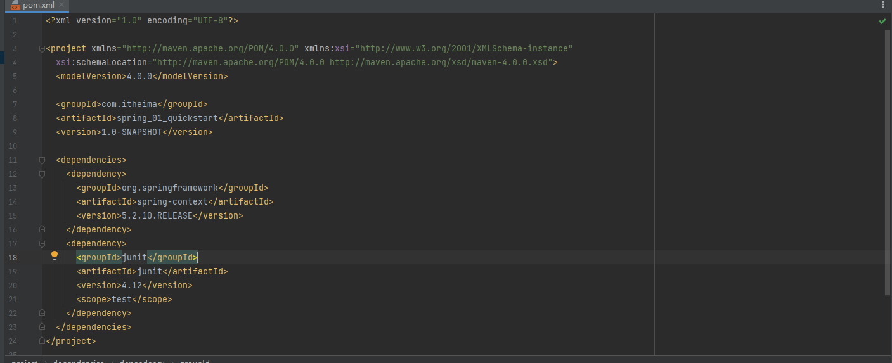
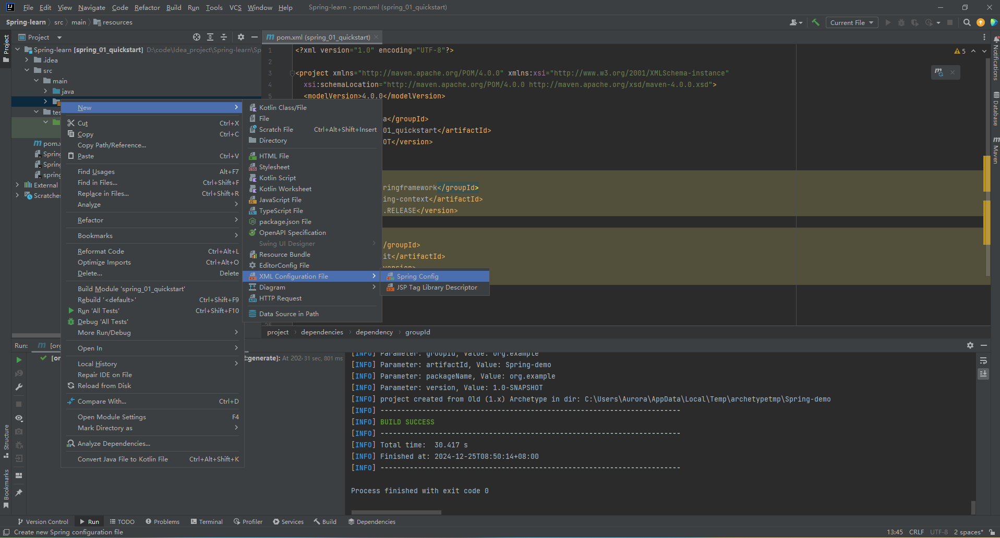
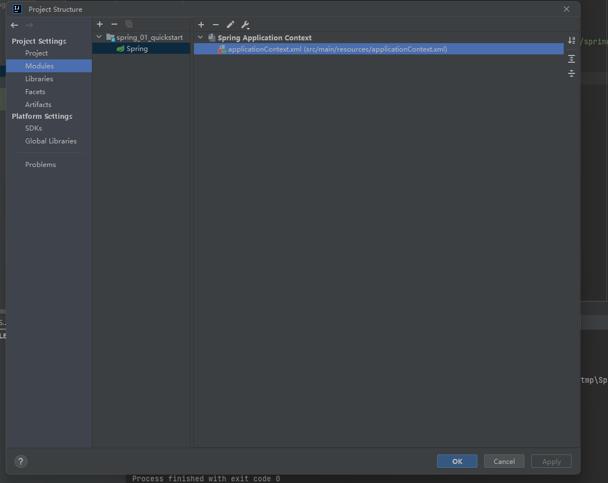
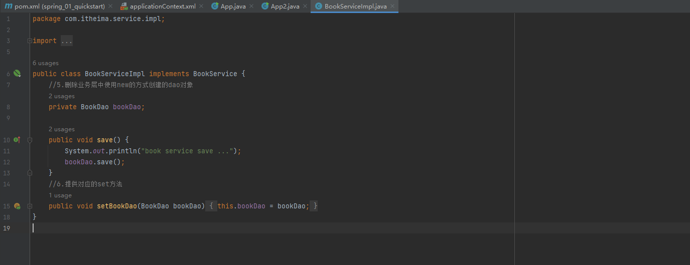
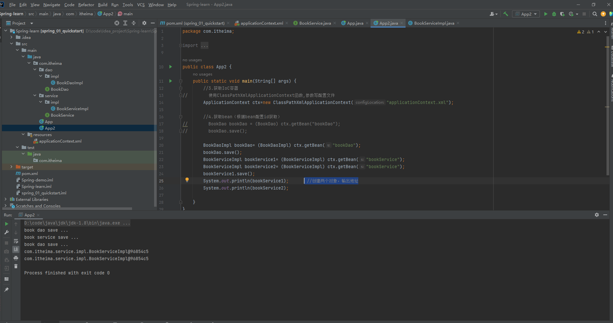
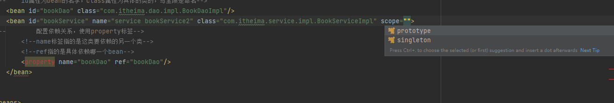
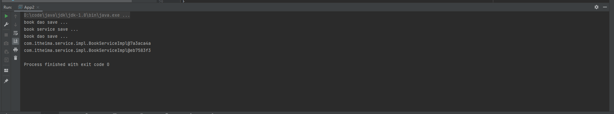
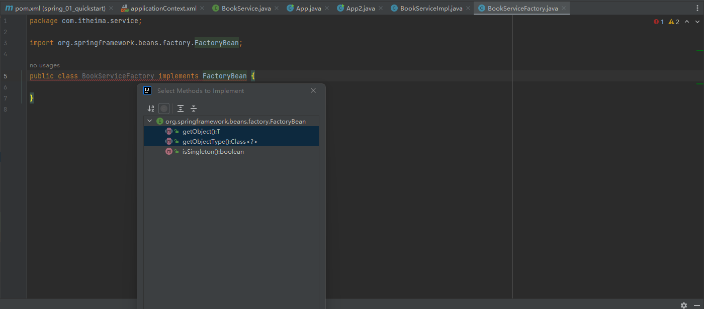

# SSM框架学习

参考视频：[黑马程序员SSM框架教程_Spring+SpringMVC+Maven高级+SpringBoot+MyBatisPlus企业实用开发技术_哔哩哔哩_bilibili](https://www.bilibili.com/video/BV1Fi4y1S7ix/?spm_id_from=333.788.comment.all.click&vd_source=f3cb3ea986b26c6910b4df6d37acd60d)

## Spring-04-IoC入门案例

#### 什么是IoC

IoC指的是控制反转，原来在没有spring框架的情况下，一个类的对象是程序通过new操作来创建的，而在spring框架下，对象的创建不用new，而是使用spring提供的一个叫IoC容器的东西，也叫spring容器，IoC容器存放了我们的类，而这个类到了IoC里面就被成为Bean，当要创建对象时，IoC容器会帮我们创建好，同时如果存在类与类之间的依赖，IoC容器也会记录依赖关系(依赖注入)。

### 如何使用IoC容器

#### 1.导入spring框架的依赖

```xml
    <dependency>
      <groupId>org.springframework</groupId>
      <artifactId>spring-context</artifactId>
      <version>5.2.10.RELEASE</version>
    </dependency>
```



#### 2.创建spring配置文件，用于管理bean

****

如果配置文件的顶部出现`application context not configured`的提示，进入文件结构设置里面设置一下



配置文件，使用`<bean>`标签即可，写在`<beans>`标签里面，配置依赖使用`<property>`标签

```xml
<!--id属性为bean的名字，class属性为具体的类的，写全限定命名-->
<bean id="bookDao" class="com.itheima.dao.impl.BookDaoImpl"/>
<bean id="bookService" class="com.itheima.service.impl.BookServiceImpl">
<!--配置依赖关系，使用property标签-->
<!--name标签指的是这类要依赖的另一个类-->
<!--ref指的是具体依赖哪一个bean-->
<property name="bookDao" ref="bookDao"/>
</bean>
```

比如这里，BookSerImpl要使用BookDao类，所以name指的就是BookDao类的属性bookDao，ref就指具体要依赖使用哪一个bean




#### 3.初始化容器，可以理解为创建IoC容器

```java
//3.获取IoC容器
//使用ClassPathXmlApplicationContext函数,参数写配置文件
ApplicationContext ctx=new ClassPathXmlApplicationContext("applicationContext.xml");

```


#### 4.获取bean

```java
//4.获取bean（根据bean配置id获取）
//BookDao bookDao = (BookDao) ctx.getBean("bookDao");
//bookDao.save();
BookDaoImpl bookDao= (BookDaoImpl) ctx.getBean("bookDao");		//getBean返回的是Object，所以要转成对应类
bookDao.save();
```

## Spring-06-bean基础配置

bean除了上面提到的`id`,`class`属性外还存在其他属性

#### bean别名

如果嫌bean的id名不好用，可以再为bean起多个别名，使用`name`标签，其中的多个别名可以用`;``,`以及空格来分割

```xml
<!--name属性定义别名 -->
<bean id="bookService" name="service bookService2" class="com.itheima.service.impl.BookServiceImpl"></bean>
```

#### bean作用范围(单例bean、多例bean)

默认情况下如果创建两个bean对象，其实际上用的是同一个对象，如下图

可以看到两个对象输出的地址是一致的



如果需要更改就要用到`scope`标签，默认为`scope=singleton`



改成`scope=prototype`后就可以看到输出的地址不一样了



但是一般使用spring容器来管理单例对象，像是一些实体类对象就不用spring容器来管理，因为如果是多例对象，每次创建对象都要建立一个新的，容器肯定放不下的。

## Spring-07-bean实例化--构造方法

bean的实例化的其中一种方法是使用类的无参构造方法，这个无参构造方法甚至是私有的也可以用

所以如果要使用bean，我们在定义类的时候一定要给出构造方法，且一定要是无参的

如果构造方法不存在，会抛出BeanCreationException异常


## Spring-08-bean实例化--静态工厂

早期为了一定程度降低耦合度，采用了静态工厂的方法来创建对象

```java
import com.itheima.dao.OrderDao;
import com.itheima.dao.impl.OrderDaoImpl;
//静态工厂创建对象
public class OrderDaoFactory {
    public static OrderDao getOrderDao(){
        System.out.println("factory setup....");
        return new OrderDaoImpl();
    }
}
//这是一个静态工厂，只有一个静态成员函数，因此可以直接通过类名和成员函数名来创建对象
//通过静态工厂创建对象
//OrderDao orderDao = OrderDaoFactory.getOrderDao();
//orderDao.save();
```


spring为了适应这种方式，也提供了这种方式的bean实例化方法，要使用到`factory-method`属性

```xml
    <!--方式二：使用静态工厂实例化bean-->
<bean id="orderDao" class="com.itheima.factory.OrderDaoFactory" factory-method="getOrderDao"/>
<!--factory-method属性指的是静态工厂类里用到的构造对象的静态成员函数-->
```


## Spring-09-bean实例化--实例工厂与FactoryBean

#### 实例工厂

实例工厂与静态工厂不同，实例工厂要先创建工厂对象实例，然后再使用成员函数来创建对象

所以实例工厂bean要用到`factory-bean`和`factory-method`

```xml
    <!--先配置实例化工厂bean-->
    <bean id="userFactory" class="com.itheima.factory.UserDaoFactory"/>
    <!--再用工厂bean来实例化对象，factory-bean指的就是前面的实例化工厂bean-->
    <bean id="userDao" factory-method="getUserDao" factory-bean="userFactory"/>
```

#### FactoryBean方法

这个方法是对实例工厂的改进，在实例工厂方法中，要先配置实力工厂的bean，而且工厂里面的创建对象的函数也不固定，会很麻烦，于是就有了这个FactoryBean方法

使用FactoryBean有以下两步

##### 1.创建FactoryBean工厂类

创建这个工厂对象要求要继承FactoryBean接口，然后重写这些接口函数



```java
import com.itheima.service.impl.BookServiceImpl;
import org.springframework.beans.factory.FactoryBean;

public class BookServiceFactory implements FactoryBean<BookServiceImpl> {	//注意这里接口要写泛型
    //代替工厂类的获取对象方法
    public BookServiceImpl getObject() throws Exception {
        return new BookServiceImpl();
    }

    //指要返回的对象类型
    public Class<?> getObjectType() {
        return BookService.class;
    }
        
    //这个是指是生成多例bean还是单例bean
    public boolean isSingleton() {
        return true;
    }
}
```


##### 2.配置bean

配置bean就把房间的工厂类当作一个普通的类配置bean即可

```xml
<bean id="bookServiceFactory" class="com.itheima.service.BookServiceFactory"/>
```

