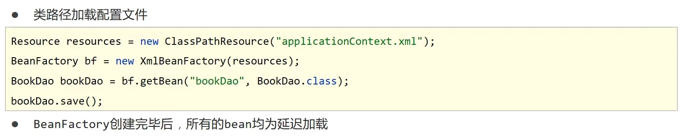
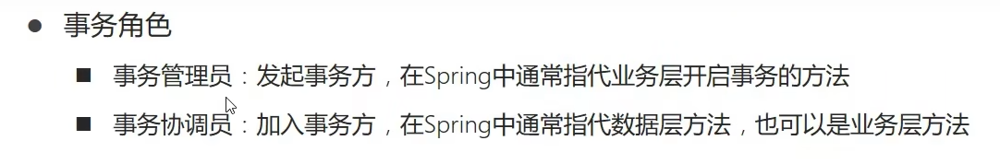

# SSM框架

参考资料：[黑马程序员SSM框架教程_Spring+SpringMVC+Maven高级+SpringBoot+MyBatisPlus企业实用开发技术_哔哩哔哩_bilibili](https://www.bilibili.com/video/BV1Fi4y1S7ix/?spm_id_from=333.1387.favlist.content.click&vd_source=f3cb3ea986b26c6910b4df6d37acd60d)


# Spring

Spring其实是一个技术的集合，包括Spring Framework、SpringBoot、Spring Cloud等等。

接下来要学的Spring指的就是Spring Framework，Spring的所有技术都是基于Spring Framework来的。

 

## Spring系统架构


## Spring核心概念

### IOC（控制反转）

IOC是Inversion of Control的缩写，意为控制反转。

其核心思想是：对象的创建控制权程序转移到外部。

再没有使用IOC思想时，程序在创建对象时需要自己手动通过new的方式来创建，这会导致代码耦合度较高。而使用了IOC思想后，程序就不需要自己手动创建对象，而是由外部提供对象，这样可以对代码解耦。


### Spring如何实现IOC

IOC的思想是将对象的创建控制权由程序转移到外部，而这个外部在Spring的实现中指的就是IOC容器。

Spring提供了IOC容器，负责对象的创建、初始化、管理等一系列操作。被IOC容器管理的对象成为Bean。

而类需要提供一个入口，让IOC容器通过这个入口来实例化对象，这个入口可以是set方法或者构造器。


### DI（依赖注入）

DI是Dependency Injection的缩写，意为依赖注入。

在容器中建立Bean与Bean之间的依赖关系的整个过程，称为依赖注入。

比如下图中BookServiceImpl依赖BookDaoImpl对象，那么IOC容器就会在IOC容器内部建立这两个Bean的依赖关系，这样获取到的BookServiceImpl对象就是已经建立好依赖关系的对象，可以直接使用了。


### AOP（面向切面编程）


特别记一下它的作用：在不修改原始代码的情况下对原始功能进行增强


## IOC入门案例

如何在Spring框架下使用IOC

入门案例使用到的两个类如下图所示


### 1.导入Spring依赖

```xml
<dependency>
  <groupId>org.springframework</groupId>
  <artifactId>spring-context</artifactId>
  <version>5.2.10.RELEASE</version>
</dependency>
```


### 2.编写配置文件

配置文件就是来配置IOC容器中应该管理哪些对象

```xml
<?xml version="1.0" encoding="UTF-8"?>
<beans xmlns="http://www.springframework.org/schema/beans"
       xmlns:xsi="http://www.w3.org/2001/XMLSchema-instance"
       xsi:schemaLocation="http://www.springframework.org/schema/beans http://www.springframework.org/schema/beans/spring-beans.xsd">
    <!--配置bean-->
    <!--bean标签标示配置bean
    id属性标示给bean起名字
    class属性表示给bean定义类型-->
    <bean id="bookDao" class="com.itheima.dao.impl.BookDaoImpl"/>

    <bean id="bookService" class="com.itheima.service.impl.BookServiceImpl"/>

</beans>
```


### 3.通过IOC容器获取对象

使用Spring提供的接口来获取IOC容器

```java
public class App2 {
    public static void main(String[] args) {
        //3.获取IoC容器
        //ApplicationContext是一个接口，ClassPathXmlApplicationContext是实现类，创建该实现类给的参数就是配置Bean的配置文件
        ApplicationContext ctx = new ClassPathXmlApplicationContext("applicationContext.xml");
        //4.获取bean（根据bean配置id获取）
//        BookDao bookDao = (BookDao) ctx.getBean("bookDao");
//        bookDao.save();

        BookService bookService = (BookService) ctx.getBean("bookService");
        bookService.save();

    }
}
```


## DI入门案例

DI的入门案例是基于IOC入门案例来的。

IOC的入门案例中，BookServiceImpl还是在内部手动创建BookDaoImpl对象的，没有实现解耦，通过DI在IOC容器内部完成对象的依赖绑定就可以实现解耦。

### 1.删除手动创建对象的代码

将原本手动new对象的代码删掉，只留下声明对象的代码，并提供对应的set方法，如下图所示


### 2.在配置文件中配置Bean之间的依赖关系

```xml
<?xml version="1.0" encoding="UTF-8"?>
<beans xmlns="http://www.springframework.org/schema/beans"
       xmlns:xsi="http://www.w3.org/2001/XMLSchema-instance"
       xsi:schemaLocation="http://www.springframework.org/schema/beans http://www.springframework.org/schema/beans/spring-beans.xsd">
    
    <bean id="bookDao" class="com.itheima.dao.impl.BookDaoImpl"/>
    <bean id="bookService" class="com.itheima.service.impl.BookServiceImpl">
        <!--配置server与dao的关系-->
<!--property标签表示配置当前bean的属性
name属性表示配置哪一个具体的属性，比如这里BookServiceImpl类中声明的BookDaoImpl对象名为bookDao，因此name就为bookDao
ref属性表示参照哪一个bean-->
        <property name="bookDao" ref="bookDao"/>
    </bean>

</beans>
```


这样就完成了依赖注入。


## Bean基础配置

### Bean别名配置

除了使用id来获取Bean对象，还可以使用别名来获取Bean对象

配置Bean的别名的方法如下图所示：


### Bean作用范围配置

配置Bean的作用范围其实就是配置Bean是单例还是非单例，Spring默认创建的是单例的Bean。


以上两个基本配置的示例如下：

```xml
<?xml version="1.0" encoding="UTF-8"?>
<beans xmlns="http://www.springframework.org/schema/beans"
       xmlns:xsi="http://www.w3.org/2001/XMLSchema-instance"
       xsi:schemaLocation="http://www.springframework.org/schema/beans http://www.springframework.org/schema/beans/spring-beans.xsd">

    <!--name:为bean指定别名，别名可以有多个，使用逗号，分号，空格进行分隔-->
    <bean id="bookService" name="service service4 bookEbi" class="com.itheima.service.impl.BookServiceImpl">
        <property name="bookDao" ref="bookDao"/>
    </bean>

    <!--scope：为bean设置作用范围，可选值为单例singloton，非单例prototype-->
    <bean id="bookDao" name="dao" class="com.itheima.dao.impl.BookDaoImpl" scope="prototype"/>
</beans>
```


## Bean实例化方式

### 1.构造方法

Bean实际上就是一个对象，而创建一个对象最经典的方法就是使用它的构造方法，而Bean的实例化也可以使用构造方法来完成Bean的实例化。

Spring在实例化Bean对象时，会通过反射来调用类的构造方法，因此如果我们要将对象交给IOC容器管理，就需要提供相应的构造方法。

例如下面的类，提供的构造方法


然后在运行如下代码就可以发现该构造方法被调用了。

配置bean

```xml
 <!--方式一：构造方法实例化bean-->
 <bean id="bookDao" class="com.itheima.dao.impl.BookDaoImpl"/>
```

```java
public class AppForInstanceBook {
    public static void main(String[] args) {

        ApplicationContext ctx = new ClassPathXmlApplicationContext("applicationContext.xml");
        //配置文件中已经配置了BookDaoImpl的Bean id为bookDao，所以通过id来获取Bean对象。
        BookDao bookDao = (BookDao) ctx.getBean("bookDao");

        bookDao.save();

    }
}
```


### 2.静态工厂

通过静态工厂类来创建对象

这种方式首先要在配置文件中配置工厂类，然后还要指定用工厂类中的哪个方法来创建Bean对象。

```xml
<!--方式二：使用静态工厂实例化bean-->
<!--class指定工厂类-->
<!--factory-method指定使用工厂类的哪个方法来创建Bean对象-->
<bean id="orderDao" class="com.itheima.factory.OrderDaoFactory" factory-method="getOrderDao"/>
```

然后获取Bean的方式也和使用构造方法实例化Bean的方式一样。


### 3.实例工厂

这种方式与静态工厂有点相似，都要指定使用工厂的哪个方法来创建Bean，但也有点不同，静态工厂只需要指定静态工厂类，因为静态工厂的方法都是静态方法，可以直接通过类来调用，而实例工厂需要先创建工厂的实例，通过工厂的实例才能调用工厂方法。

```xml
<!--方式三：使用实例工厂实例化bean-->
<!--首先创建实例工厂对象-->
<bean id="userFactory" class="com.itheima.factory.UserDaoFactory"/>
<!--然后通过factory-bean指定实例工厂对象，再通过factory-method指定要调用的工厂方法-->
<bean id="userDao" factory-method="getUserDao" factory-bean="userFactory"/>
```


### 4.FactoryBean（重点）

这种方式是工厂方式的改进。

首先要定义一个实现FactoryBean接口的工厂类。

```java
//FactoryBean创建对象，泛型指定为使用该工厂类要获取的类。
public class UserDaoFactoryBean implements FactoryBean<UserDao> {
    //代替原始实例工厂中创建对象的方法
    public UserDao getObject() throws Exception {
        return new UserDaoImpl();
    }
    //获取Bean的类
    public Class<?> getObjectType() {
        return UserDao.class;
    }
    //指定创建的Bean是否是单例
    public boolean isSingleton() {
        return true;
    }
}
```

配置文件

```xml
<!--方式四：使用FactoryBean实例化bean-->
<!--只需指定工厂类-->
<bean id="userDao" class="com.itheima.factory.UserDaoFactoryBean"/>
```


## Bean生命周期

Bean的生命周期指的是Bean对象从创建到销毁的整个过程。

Bean的生命周期控制指的是Bean对象从创建后到销毁前执行的一些操作。


### 如何实现Bean生命周期控制

#### 1.配置文件

可以在配置Bean时使用`init-method`属性指定Bean初始化后要执行的方法，使用`destroy-method`属性指定Bean销毁前要执行的方法。

```xml
<!--init-method：设置bean初始化生命周期回调函数-->
<!--destroy-method：设置bean销毁生命周期回调函数，仅适用于单例对象-->
<bean id="bookDao" class="com.itheima.dao.impl.BookDaoImpl" init-method="init" destroy-method="destory"/>
```


#### 2.实现接口

让类实现`InitializingBean`、`DisposableBean`接口，这两个接口分别提供了一个方法。

```java
public class BookServiceImpl implements BookService, InitializingBean, DisposableBean {
    private BookDao bookDao;

    public void setBookDao(BookDao bookDao) {
        System.out.println("set .....");
        this.bookDao = bookDao;
    }

    public void save() {
        System.out.println("book service save ...");
        bookDao.save();
    }
    
    //DisposableBean提供的方法，表示Bean销毁前执行的方法
    public void destroy() throws Exception {
        System.out.println("service destroy");
    }
    //InitializingBean提供的方法，表示Bean初始化后执行的方法
    public void afterPropertiesSet() throws Exception {
        System.out.println("service init");
    }
}
```


## 依赖注入的方式

### 1.setter注入

setter注入引用类型数据


如果需要注入多个引用类型数据，可以定义多个set方法，并在配置中定义多个property

```xml
<!--注入引用类型-->
<bean id="bookService" class="com.itheima.service.impl.BookServiceImpl">
    <!--property标签：设置注入属性-->
    <!--name属性：设置注入的属性名，实际是set方法对应的名称-->
    <!--ref属性：设置注入引用类型bean的id或name-->
    <property name="bookDao" ref="bookDao"/>
    <property name="userDao" ref="userDao"/>
</bean>
```


setter注入简单类型数据，简单类型数据指的是字符串、整数等数据


这里就可以做一下区分了，引用类型用的是ref，而简单类型用的是value


### 2.构造器注入

构造器注入引用类型数据


构造器注入简单类型数据


```xml
<bean id="bookDao" class="com.itheima.dao.impl.BookDaoImpl">
    <!--根据构造方法参数名称注入-->
    <constructor-arg name="connectionNum" value="10"/>
    <constructor-arg name="databaseName" value="mysql"/>
</bean>
<bean id="userDao" class="com.itheima.dao.impl.UserDaoImpl"/>
<bean id="bookService" class="com.itheima.service.impl.BookServiceImpl">
    <!--这里的name指的是构造器的参数名-->
    <constructor-arg name="userDao" ref="userDao"/>
    <constructor-arg name="bookDao" ref="bookDao"/>
</bean>
```

但是指定参数名会导致配置文件与原类文件的耦合度比较高，为了解耦，还可以使用下面两种方式

```xml
<!--解决形参名称的问题，与形参名不耦合-->
<bean id="bookDao" class="com.itheima.dao.impl.BookDaoImpl">
    <!--根据构造方法参数类型注入,指定参数的类型-->
    <constructor-arg type="int" value="10"/>
    <constructor-arg type="java.lang.String" value="mysql"/>
</bean>
<bean id="userDao" class="com.itheima.dao.impl.UserDaoImpl"/>
<bean id="bookService" class="com.itheima.service.impl.BookServiceImpl">
    <constructor-arg name="userDao" ref="userDao"/>
    <constructor-arg name="bookDao" ref="bookDao"/>
</bean>-->

<!--解决参数类型重复问题，使用位置解决参数匹配-->
<bean id="bookDao" class="com.itheima.dao.impl.BookDaoImpl">
    <!--根据构造方法参数位置注入-->
    <constructor-arg index="0" value="mysql"/>
    <constructor-arg index="1" value="100"/>
</bean>
<bean id="userDao" class="com.itheima.dao.impl.UserDaoImpl"/>
<bean id="bookService" class="com.itheima.service.impl.BookServiceImpl">
    <constructor-arg name="userDao" ref="userDao"/>
    <constructor-arg name="bookDao" ref="bookDao"/>
</bean>
```


### 3.如何选择依赖注入方式


## 依赖自动装配

Spring提供了自动进行依赖注入的方法，通过配置`autowire`属性。

通常有三种自动装配方式：

1.按类型装配

2.按名字装配

3.按构造方法装配

通常用前两个

### 1.按类型装配

```xml
<!--autowire属性：开启自动装配，通常使用按类型装配-->
<bean id="bookService" class="com.itheima.service.impl.BookServiceImpl" autowire="byType"/>
```

使用按类型装配必须保证IOC中同一类型的Bean唯一，不能出现多个类型相同的Bean，因为这样Spring就无法判断到底要使用哪一个Bean。


### 2.按名字装配

```xml
<bean id="bookService" class="com.itheima.service.impl.BookServiceImpl" autowire="byName"/>
```

按名字装配需要保证IOC容器中存在对应名字的Bean，名字就是在类中定义的对象名，如下图所示：

下面这个类中就定义了一个名为bookDao的BookDao对象，因此要对它使用按名字自动装配，就需要保证IOC容器中存在名为bookDao的对象。


### 3.自动装配的注意事项


## 集合注入

要对下面这个类的集合对象进行注入


```xml
<bean id="bookDao" class="com.itheima.dao.impl.BookDaoImpl">
    <!--数组注入-->
    <!--这里的name要与类中定义的集合对象名保持一直，下面面的其他类型的注入也是一样-->
    <property name="array">
        <array>
            <value>100</value>
            <value>200</value>
            <value>300</value>
        </array>
    </property>
    <!--list集合注入-->
    <property name="list">
        <list>
            <value>itcast</value>
            <value>itheima</value>
            <value>boxuegu</value>
            <value>chuanzhihui</value>
        </list>
    </property>
    <!--set集合注入-->
    <property name="set">
        <set>
            <value>itcast</value>
            <value>itheima</value>
            <value>boxuegu</value>
            <value>boxuegu</value>
        </set>
    </property>
    <!--map集合注入-->
    <property name="map">
        <map>
            <!--注意Map集合要用entry-->
            <entry key="country" value="china"/>
            <entry key="province" value="henan"/>
            <entry key="city" value="kaifeng"/>
        </map>
    </property>
    <!--Properties注入-->
    <property name="properties">
        <props>
            <!--注意，Properties类型的值的写法又不一样了，要与map注意区分-->
            <prop key="country">china</prop>
            <prop key="province">henan</prop>
            <prop key="city">kaifeng</prop>
        </props>
    </property>
</bean>
```


## Spring加载properties文件

假如现在需要加载resources目录下的jdbc.properties文件


### 1.开启context命名空间

这是添加context命名空间的Spring配置文件

```xml
<beans xmlns="http://www.springframework.org/schema/beans"
       xmlns:xsi="http://www.w3.org/2001/XMLSchema-instance"
       xmlns:context="http://www.springframework.org/schema/context"
       xsi:schemaLocation="
            http://www.springframework.org/schema/beans
            http://www.springframework.org/schema/beans/spring-beans.xsd
            http://www.springframework.org/schema/context
            http://www.springframework.org/schema/context/spring-context.xsd
            ">
    
</beans>
```

这是未添加context命名空间的，注意区分

```xml
<beans xmlns="http://www.springframework.org/schema/beans"
       xmlns:xsi="http://www.w3.org/2001/XMLSchema-instance"
       xsi:schemaLocation=
               "http://www.springframework.org/schema/beans
               http://www.springframework.org/schema/beans/spring-beans.xsd">
</beans>
```


### 2.加载配置文件

```xml
<!--    2.使用context空间加载properties文件-->
<!--    <context:property-placeholder location="jdbc.properties" system-properties-mode="NEVER"/>-->
	<!--加载多个配置文件，用逗号分隔多个配置文件-->
    <context:property-placeholder location="jdbc.properties,jdbc2.properties" system-properties-mode="NEVER"/>
<!--    classpath:*.properties  ：   设置加载当前工程类路径中的所有properties文件-->
<!--    system-properties-mode属性：是否加载系统属性-->
    <!--    <context:property-placeholder location="*.properties" system-properties-mode="NEVER"/>-->

    <!--classpath*:*.properties  ：  设置加载当前工程类路径和当前工程所依赖的所有jar包中的所有properties文件-->
	<!--上面的写法也可以，但下面的是最标准的写法-->
    <context:property-placeholder location="classpath*:*.properties" system-properties-mode="NEVER"/>
```


### 3.使用属性占位符获取属性

```xml
<bean class="com.alibaba.druid.pool.DruidDataSource">
    <property name="driverClassName" value="${jdbc.driver}"/>
    <property name="url" value="${jdbc.url}"/>
    <property name="username" value="${jdbc.username}"/>
    <property name="password" value="${jdbc.password}"/>
</bean>
```


### 4.注意事项


## Spring容器相关知识

### 1.创建容器

创建容器有两种方式：

1）从类路径加载配置文件

```java
//1.加载类路径下的配置文件
ApplicationContext ctx = new ClassPathXmlApplicationContext("applicationContext.xml");
//可以加载多个配置文件，用逗号分隔
ApplicationContext ctx = new ClassPathXmlApplicationContext("applicationContext.xml,applicationContext2.xml");
```

2）文件系统加载配置文件

```java
//2.从文件系统下加载配置文件
ApplicationContext ctx = new FileSystemXmlApplicationContext("配置文件的绝对路径");
```


### 2.获取Bean

获取Bean也有两种方式：

1）按Bean的名称获取

```java
BookDao bookDao = (BookDao) ctx.getBean("bookDao");
//这样可以不用强制转换类型
BookDao bookDao = ctx.getBean("bookDao",BookDao.class);
```

2）按Bean的类型获取

```java
BookDao bookDao = ctx.getBean(BookDao.class);
```


### 3.容器类的继承结构


BeanFactory是所有容器类的顶层接口，也可以使用BeanFactory来创建Bean容器，但是BeanFactory容器中的Bean都是延迟加载的。




### 4.Bean配置相关属性


## 注解开发定义Bean

原本我们定义Bean需要在配置文件中写下面的代码

```xml
<bean id="bookDao" name="dao" class="com.itheima.dao.impl.BookDaoImpl"/>
```

而现在使用注解开发后，就不需要在配置文件中配置Bean，而是直接在类上使用`@Component`注解

如下图所示：

可以在Component注解中定义Bean的名字，也可以不定义名字


使用了`@Component`注解，还需要在配置文件中写下面一行代码，用于指定要扫描的Bean的包位置。

```xml
<!--这个配置要使用context命名空间-->
<context:component-scan base-package="com.itheima"/>
```


Spring还提供了三个`@Component`的衍生注解：`@Repository`、`@Service`、`@Controller`


这三个衍生注解的作用与`@Component`一模一样，只不过是为了方便我们区分。


## 纯注解开发

Spring3.0开始支持纯注解开发，在纯注解开发模式下，我们配置类不需要再使用配置文件，而是使用配置类来代替配置文件。

例如要使用配置类对下面这个配置文件进行代替

```xml
<?xml version="1.0" encoding="UTF-8"?>
<beans xmlns="http://www.springframework.org/schema/beans"
       xmlns:context="http://www.springframework.org/schema/context"
       xmlns:xsi="http://www.w3.org/2001/XMLSchema-instance"
       xsi:schemaLocation="
        http://www.springframework.org/schema/beans http://www.springframework.org/schema/beans/spring-beans.xsd
        http://www.springframework.org/schema/context http://www.springframework.org/schema/context/spring-context.xsd">

    <context:component-scan base-package="com.itheima"/>

</beans>
```


首先要创建一个配置类，使用`@Configuration`注解表示该类是一个配置类，然后就可以在配置类中进行各种配置。

比如这里要像上面的配置文件那样配置组件扫描范围，可以使用`@ComponentScan`注解来配置组件扫描范围。

```java
//声明当前类为Spring配置类
@Configuration
//设置bean扫描路径，多个路径书写为字符串数组格式
@ComponentScan({"com.itheima.service","com.itheima.dao"})
public class SpringConfig {
}
```

这样就成功使用配置类代替了配置文件


使用了配置类后，我们获取容器的方式也要相应地改变，原本获取容器要使用配置文件，而现在要使用配置类

```java
public class AppForAnnotation {
    public static void main(String[] args) {
        //原本获取容器的方式
        //ApplicationContext ctx = new ClassPathXmlApplicationContext("applicationContext.xml");
        
       	//现在获取容器的方式
        //AnnotationConfigApplicationContext加载Spring配置类初始化Spring容器
        ApplicationContext ctx = new AnnotationConfigApplicationContext(SpringConfig.class);
        BookDao bookDao = (BookDao) ctx.getBean("bookDao");
        System.out.println(bookDao);
        //按类型获取bean
        BookService bookService = ctx.getBean(BookService.class);
        System.out.println(bookService);
    }
}
```


## 注解开发模式下Bean相关操作

### 配置Bean的作用范围

使用`@Scope`来配置Bean的作用范围，可以选择`singleton`单例或者`prototype`多例

### 实现Bean的生命周期控制

使用`@PostConstructor`来定义Bean的初始化方法

使用`@PreDestory`来定义Bean的销毁前方法

```java
@Repository
//@Scope设置bean的作用范围
@Scope("singleton")
public class BookDaoImpl implements BookDao {

    public void save() {
        System.out.println("book dao save ...");
    }
    //@PostConstruct设置bean的初始化方法
    @PostConstruct
    public void init() {
        System.out.println("init ...");
    }
    //@PreDestroy设置bean的销毁方法
    @PreDestroy
    public void destroy() {
        System.out.println("destroy ...");
    }

}
```


###  依赖注入

注解开发模式下的依赖注入使用的是自动装配的方式，没有使用setter注入或构造器注入。

#### 1.注入引用类型数据

使用`@AutoWired`注解，使用该注解默认是按类型来进行自动装配的，但是可以配合使用`@Qualifier("Bean名字")`来实现按名字自动装配。

```java
@Service
public class BookServiceImpl implements BookService {
    //@Autowired：注入引用类型，自动装配模式，默认按类型装配
    @Autowired
    //@Qualifier：自动装配bean时按bean名称装配
    @Qualifier("bookDao")
    private BookDao bookDao;

    public void save() {
        System.out.println("book service save ...");
        bookDao.save();
    }
}
```

#### 2.注入普通类型数据

使用`@Value`来实现普通类型数据的自动装配。

```java
@Repository("bookDao")
public class BookDaoImpl implements BookDao {
    //@Value：注入简单类型（无需提供set方法）
    //可直接写一个值，但不推荐这么做，因为这样做和private String name = "bookDao666"没有区别
    //@Value("bookDao666")
    //一般是使用一个占位符来动态获取配置文件中的属性值
    @Value("${name}")
    private String name;

    public void save() {
        System.out.println("book dao save ..." + name);
    }
}
```

要获取配置文件中的属性值，比如下面的配置文件jdbc.properties

```properties
name=itheima888
```

首先要在配置类中加载配置文件

```java
@Configuration
@ComponentScan("com.itheima")
//@PropertySource加载properties配置文件，支持加载多个配置文件，使用逗号分隔，因为这个注解实际接收的是一个数组
//注意配置文件名不能使用通配符，如：*.properties
@PropertySource({"jdbc.properties"})
public class SpringConfig {
}
```

加载完配置文件后就可以使用占位符`${}`来获取配置文件中的属性了


#### 3.注意事项

因此使用自动装配需要提供构造器，但是可以不提供set方法。


### 管理第三方Bean

我们有时候需要将导入的第三方依赖包中的类交给IOC容器管理。

要实现这个，需要用到`@Bean`注解。

这个注解用在配置类中的方法上，表示方法返回的值是一个Bean

```java
@Configuration
public class JdbcConfig {
    //1.定义一个方法获得要管理的对象,这里使用的是普通类型数据的自动装配，如果不明白可以去看上面依赖注入部分内容
    @Value("com.mysql.jdbc.Driver")
    private String driver;
    @Value("jdbc:mysql://localhost:3306/spring_db")
    private String url;
    @Value("root")
    private String userName;
    @Value("root")
    private String password;
    //2.添加@Bean，表示当前方法的返回值是一个bean
    //@Bean修饰的方法，形参根据类型自动装配
    @Bean
    public DataSource dataSource(){
        DruidDataSource ds = new DruidDataSource();
        ds.setDriverClassName(driver);
        ds.setUrl(url);
        ds.setUsername(userName);
        ds.setPassword(password);
        return ds;
    }
}
```

同时需要在获取容器时，需要指定该配置类

```java
AnnotationConfigApplicationContext ctx = new AnnotationConfigApplicationContext(JdbcConfig.class);
```

但是我们一般指定的配置类是一个通用的配置类，如下面的SpringConfig类

```java
public class App {
    public static void main(String[] args) {
        AnnotationConfigApplicationContext ctx = new AnnotationConfigApplicationContext(SpringConfig.class);
        DataSource dataSource = ctx.getBean(DataSource.class);
        System.out.println(dataSource);
    }
}
```

而为了保证这个通用配置类的简洁，一些具体的配置，如果上面的JdbcConfig通常单独定义为一个配置类，然后让通用的配置类去导入具体的配置类。

而导入具体配置类有两种方式：

1.使用`@ComponentScan`注解，去扫描具体的配置类

```java
@Configuration
//com.itheima包下有JdbcConfig配置类
@ComponentScan("com.itheima")
public class SpringConfig {
}
```


2.使用`@Import`注解，导入配置信息

```java
@Configuration
//@Import:导入配置信息
@Import({JdbcConfig.class})
public class SpringConfig {
}
```

这种方式的话JdbcConfig就不需要使用`@Configuration`注解成为配置类，直接作为普通类就行

```java
//不需要设置为配置类
//@Configuration
public class JdbcConfig {
    //1.定义一个方法获得要管理的对象
    @Value("com.mysql.jdbc.Driver")
    private String driver;
    @Value("jdbc:mysql://localhost:3306/spring_db")
    private String url;
    @Value("root")
    private String userName;
    @Value("root")
    private String password;
    //2.添加@Bean，表示当前方法的返回值是一个bean
    //@Bean修饰的方法，形参根据类型自动装配
    @Bean
    public DataSource dataSource(){
        DruidDataSource ds = new DruidDataSource();
        ds.setDriverClassName(driver);
        ds.setUrl(url);
        ds.setUsername(userName);
        ds.setPassword(password);
        return ds;
    }
}
```


如果需要配置引用类型数据，比如假设DataSource需要BookDao这个类的一个对象。

那么就可以先将BookDao的Bean交给IOC容器管理，然后直接在配置DataSource对象的方法中直接在参数列表中声明，自动装配会自动从IOC容器中获取该Bean对象，然后在方法中使用

```java
@Configuration
public class JdbcConfig {
    //1.定义一个方法获得要管理的对象
    @Value("com.mysql.jdbc.Driver")
    private String driver;
    @Value("jdbc:mysql://localhost:3306/spring_db")
    private String url;
    @Value("root")
    private String userName;
    @Value("root")
    private String password;
    //2.添加@Bean，表示当前方法的返回值是一个bean
    //@Bean修饰的方法，形参根据类型自动装配
    @Bean
    //直接在参数列表中声明要使用的Bean
    public DataSource dataSource(BookDao bookDao){
        //直接使用Bean对象
        System.out.println(bookDao);
        DruidDataSource ds = new DruidDataSource();
        ds.setDriverClassName(driver);
        ds.setUrl(url);
        ds.setUsername(userName);
        ds.setPassword(password);
        return ds;
    }
}
```


### xml配置Bean与注解配置的对比


## AOP核心概念

AOP的核心概念如下图：

其中额外补充一点：连接点的范围比切入点的范围大，可以把连接点理解为项目中的所有方法，而切入点理解为匹配到的，需要进行增强的方法。


可以对应下面的图来理解AOP的核心概念：

下图中只有update和delete方法是被增强了的，所以这两个方法是切入点，其他两个方法没有被增强，因此只能算连接点。


## AOP快速入门

下面通过一个案例来熟悉AOP

要对下面这个类中的方法进行增强，让update执行前输出当前系统时间。

```java
@Repository
public class BookDaoImpl implements BookDao {

    public void save() {
        System.out.println(System.currentTimeMillis());
        System.out.println("book dao save ...");
    }

    public void update(){
        System.out.println("book dao update ...");
    }
}
```


### 1.首先导入AOP相关依赖

Spring的AOP相关依赖已经在spring-context下了

```xml
<dependency>
  <groupId>org.springframework</groupId>
  <artifactId>spring-context</artifactId>
  <version>5.2.10.RELEASE</version>
</dependency>
<dependency>
  <groupId>org.aspectj</groupId>
  <artifactId>aspectjweaver</artifactId>
  <version>1.9.4</version>
</dependency>
```


### 2.定义通知

定义要如何对切入点进行增强，就是写一个方法，这个方法用于在切入点的基础上实现其他功能。


### 3.绑定通知与切入点

这个步骤其实就是定义切面


第2、3步骤的代码如下

```java
//通知类必须配置成Spring管理的bean
@Component
//设置当前类为切面类类
@Aspect
public class MyAdvice {
    //设置切入点，要求配置在方法上方
    //这个是切入点表达式，表示要匹配哪一个连接点，也就是寻找切入点
    @Pointcut("execution(void com.itheima.dao.BookDao.update())")
    private void pt(){}

    //设置在切入点pt()的前面运行当前操作（前置通知）
    @Before("pt()")
    public void method(){
        System.out.println(System.currentTimeMillis());
    }
}
```


 

##   AOP工作流程

1.启动Spring容器

2.读取切面配置中的切入点，如下图的切面，读取到的切入点就是BookDao的update方法，BookDao的save方法这个切入点因为没有被使用，因此不读取。


3.初始化Bean对象，判断Bean中是否有匹配切入点的方法，分为以下两种情况：

1）如果没有匹配切入点的方法，就使用原始的Bean对象

2）如果有匹配切入点的方法，就使用原始Bean对象（**目标对象**）的**代理**对象。


4.获取Bean的执行方法，也有以下两种情况：

1）如果Bean是原始对象，就直接执行原始方法

2）如果Bean是代理对象，就根据代理对象定义的运行模式来对原始方法进行增强。


上面涉及到的两个概念：


## AOP切入点表达式

这个部分见JavaWeb笔记，直接搜`切入点表达式`


## AOP通知类型

这个部分见JavaWeb笔记，直接搜`通知类型`


## AOP案例

实现测量业务层接口的执行效率

如下图所示，要对Service层的所有统计执行效率


定义切面类

```java
@Component
@Aspect
public class ProjectAdvice {
    //匹配业务层的所有方法
    @Pointcut("execution(* com.itheima.service.*Service.*(..))")
    private void servicePt(){}

    //设置环绕通知，在原始操作的运行前后记录执行时间
    @Around("ProjectAdvice.servicePt()")
    public void runSpeed(ProceedingJoinPoint pjp) throws Throwable {
        //获取执行的签名对象,获取了方法的签名就能知道具体是哪个方法的执行效率是多少
        Signature signature = pjp.getSignature();
        String className = signature.getDeclaringTypeName();
        String methodName = signature.getName();

        long start = System.currentTimeMillis();
        for (int i = 0; i < 10000; i++) {
           pjp.proceed();
        }
        long end = System.currentTimeMillis();
        System.out.println("万次执行："+ className+"."+methodName+"---->" +(end-start) + "ms");
    }

}
```


 

## AOP通知获取数据

如何在通知中获取原始方法的数据？比如：原始方法的参数，返回值，抛出的异常等。

获取不同的数据，对通知的类型有不同的要求，比如要获取抛出的异常，只能在环绕通知和异常后通知中获取，具体如下


补充：

获取参数是通过调用JoinPoint接口或ProceedJointPoint接口的getArgs方法获取，ProceedJointPoint继承自JoinPoint

```java
@Component
@Aspect
public class MyAdvice {
    @Pointcut("execution(* com.itheima.dao.BookDao.findName(..))")
    private void pt(){}

    //JoinPoint：用于描述切入点的对象，必须配置成通知方法中的第一个参数，可用于获取原始方法调用的参数
    @Before("pt()")
    public void before(JoinPoint jp) {
        //获取切入点的参数
        Object[] args = jp.getArgs();
        System.out.println(Arrays.toString(args));
        System.out.println("before advice ..." );
    }

    @After("pt()")
    public void after(JoinPoint jp) {
        Object[] args = jp.getArgs();
        System.out.println(Arrays.toString(args));
        System.out.println("after advice ...");
    }

    //ProceedingJoinPoint：专用于环绕通知，是JoinPoint子类，可以实现对原始方法的调用
    @Around("pt()")
    public Object around(ProceedingJoinPoint pjp) {
        Object[] args = pjp.getArgs();
        System.out.println(Arrays.toString(args));
        //修改原始参数
        args[0] = 666;
        Object ret = null;
        try {
            //环绕通知通过执行原始方法可以直接获取方法结果或者异常
            //并且执行原始方法时可以传入参数数组，比如这里传入了args，这个args实际上就是它原本的参数，只不过我们可以修改后再给
            ret = pjp.proceed(args);
      
        } catch (Throwable t) {
            t.printStackTrace();
        }
        return ret;
    }

    //设置返回后通知获取原始方法的返回值，要求returning属性值必须与方法形参名相同
    @AfterReturning(value = "pt()",returning = "ret")
    public void afterReturning(JoinPoint jp,String ret) {
        System.out.println("afterReturning advice ..."+ret);
    }

    //设置抛出异常后通知获取原始方法运行时抛出的异常对象，要求throwing属性值必须与方法形参名相同
    @AfterThrowing(value = "pt()",throwing = "t")
    public void afterThrowing(Throwable t) {
        System.out.println("afterThrowing advice ..."+t);
    }
}
```


获取这些数据是有实际意义的，比如获取原始方法的参数：

如果用户输入的数据是有异常的，我们可以再通知中获取到用户传的参数，然后去校验参数的合法性，如果不合法还可以对参数进行一定的处理，比如：用户的输入首尾带上了一些不该带的空格，我们就可以在通知中将空格去掉。这样就提供高了代码的健壮性。


## Spring事务

事务的作用：在数据层保证一系列的数据库操作要么同时成功，要么同时失败

Spring事务的作用：在数据层或业务层保证一系列的数据库操作要么同时成功，要么同时失败。


Spring提供了一个接口用于实现事务：PlatformTransactionManager，即平台事务管理器


并且提供了一个实现类DataSourceTransactionManager，只要提供了数据源DataSource，就能够实现事务，但是Spring提供的事务管理器使用的JDBC的事务。

下面完成一个案例：


MyBatis也是基于JDBC的，因此可以直接使用Spring提供的事务。

首先在配置类中开启注解式事务

```java
@Configuration
@ComponentScan("com.itheima")
@PropertySource("classpath:jdbc.properties")
@Import({JdbcConfig.class,MybatisConfig.class})
//开启注解式事务驱动
@EnableTransactionManagement
public class SpringConfig {
}
```

接着在业务层接口添加`@Transactional`注解表示对业务层方法开启事务

```java
//如果在接口上面加表示接口中所有方法都要开启事务
//@Transactional
public interface AccountService {
    /**
     * 转账操作
     * @param out 传出方
     * @param in 转入方
     * @param money 金额
     */
    //配置当前接口方法具有事务
    @Transactional
    public void transfer(String out,String in ,Double money) ;
}
```

接口的实现类

```java
@Service
public class AccountServiceImpl implements AccountService {

    @Autowired
    private AccountDao accountDao;

    public void transfer(String out,String in ,Double money) {
        accountDao.outMoney(out,money);
        //模拟异常
        //int i = 1/0;
        accountDao.inMoney(in,money);
    }

}
```

数据层的方法

```java
public interface AccountDao {

    @Update("update tbl_account set money = money + #{money} where name = #{name}")
    void inMoney(@Param("name") String name, @Param("money") Double money);

    @Update("update tbl_account set money = money - #{money} where name = #{name}")
    void outMoney(@Param("name") String name, @Param("money") Double money);
}
```

测试方法

```java
@RunWith(SpringJUnit4ClassRunner.class)
//加载Spring配置
@ContextConfiguration(classes = SpringConfig.class)
public class AccountServiceTest {

    @Autowired
    private AccountService accountService;

    @Test
    public void testTransfer() throws IOException {
        accountService.transfer("Tom","Jerry",100D);
    }

}
```

  


## Spring事务角色

在上面的案例中，完成转账业务主要是调用了transfer方法，这个方法中调用了两个数据层的方法，这两个方法属于不同的事务。


而如果使用了@Transactional注解，Spring就会开启事务，然后调用的两个数据层的方法就会统一加入到Spring开启的事务当中，这样就实现了事务管理


而这引出了两个概念：事务管理员和事务协调员




## Spring事务属性

这部分内容在JavaWeb笔记中，直接搜`Spring事务管理`


# SpringMVC

## SpringMVC简介

SpringMVC的功能和Servlet一致，都是用来实现表现层功能开发的，它是一种表现层框架技术

但是SpringMVC相较于Servlet，代码更加简洁，开发会更高效。

下面比较一下两种开发模式

这是Servlet的开发模式，对于每一个请求需要单独写一个Servlet类来处理请求，并且如果请求参数很多，也需要手动一个一个获取


而SpringMVC在一个类文件中就可以处理多个请求，并且参数可以直接通过方法的形参列表自动获取，相比于Servlet简洁了很多。


## SpringMVC快速入门

### 1.导入SpringMVC相关依赖

```xml
<dependency>
  <groupId>javax.servlet</groupId>
  <artifactId>javax.servlet-api</artifactId>
  <version>3.1.0</version>
  <scope>provided</scope>
</dependency>
<dependency>
  <groupId>org.springframework</groupId>
  <artifactId>spring-webmvc</artifactId>
  <version>5.2.10.RELEASE</version>
</dependency>
```


### 2.创建SpringMVC控制器类

控制器类相当于Servlet

```java
//定义表现层控制器bean
@Controller
public class UserController {

    //设置映射路径为/save，即外部访问路径
    @RequestMapping("/save")
    //设置当前操作返回结果为指定json数据（本质上是一个字符串信息）
    //@ResponseBody的作用是将方法的返回值，以特定的格式写入到response的body区域，进而将数据返回给客户端。
    @ResponseBody
    public String save(){
        System.out.println("user save ...");
        return "{'info':'springmvc'}";
    }

    //设置映射路径为/delete，即外部访问路径
    @RequestMapping("/delete")
    @ResponseBody
    public String delete(){
        System.out.println("user save ...");
        return "{'info':'springmvc'}";
    }
}
```


### 3.配置SpringMVC

初始化SpringMVC环境，设定SpringMVC加载对应的Bean

```java
//springmvc配置类，本质上还是一个spring配置类
@Configuration
@ComponentScan("com.itheima.controller")
public class SpringMvcConfig {
}
```


### 4.让Tomcat服务器加载SpringMVC环境

初始化Servlet容器，加载SpringMVC环境，并设置要使用pringMVC处理的哪些请求。

```java
//web容器配置类
public class ServletContainersInitConfig extends AbstractDispatcherServletInitializer {
    //加载springmvc配置类，产生springmvc容器（本质还是spring容器）
    protected WebApplicationContext createServletApplicationContext() {
        //初始化WebApplicationContext对象
        AnnotationConfigWebApplicationContext ctx = new AnnotationConfigWebApplicationContext();
        //加载指定配置类
        ctx.register(SpringMvcConfig.class);
        return ctx;
    }

    //设置由springmvc控制器处理的请求映射路径
    protected String[] getServletMappings() {
        return new String[]{"/"};
    }

    //加载spring配置类
    protected WebApplicationContext createRootApplicationContext() {
        return null;
    }
}
```


## 入门案例的工作流程分析


## Bean加载控制

在上面的入门案例中，Tomcat已经加载好了SpringMVC的环境，接下来需要再加载Spring的环境，需要将业务层Service以及数据层Dao加载到Spring容器。

而由于Controller包中的类已经加载到SpringMVC容器中了，因此我们不希望在Spring容器中重复加载Controller包下的类，那这就要用到Bean的加载控制了。

Bean的加载控制有两种方式：

### 1.排除Bean

在配置Bean的扫描范围时，排除掉Controller包下的Bean

```java
@Configuration
//设置spring配置类加载bean时的过滤规则，当前要求排除掉表现层对应的bean
//excludeFilters属性：设置扫描加载bean时，排除的过滤规则
//type属性：设置排除规则，当前使用按照bean定义时的注解类型进行排除
//classes属性：设置排除的具体注解类，当前设置排除@Controller定义的bean
@ComponentScan(value="com.itheima",
    excludeFilters = @ComponentScan.Filter(
        type = FilterType.ANNOTATION,
        classes = Controller.class
    )
)
public class SpringConfig {
}
```


### 2.精确加载Bean

精确指定要加载的Bean的范围

```java
@Configuration
//精确指定了service层和Dao层的Bean所在包的位置
@ComponentScan({"com.itheima.service","com.itheima.dao"})
public class SpringConfig {
}
```


同时，上面案例中的最后一步的代码，加载Spring配置类的部分返回的是null，这里可以修改一下，让Tomcat服务器同时加载SpringMVC环境和Spring环境

```java
//web容器配置类
public class ServletContainersInitConfig extends AbstractDispatcherServletInitializer {
    //加载springmvc配置类，产生springmvc容器（本质还是spring容器）
    protected WebApplicationContext createServletApplicationContext() {
        //初始化WebApplicationContext对象
        AnnotationConfigWebApplicationContext ctx = new AnnotationConfigWebApplicationContext();
        //加载指定配置类
        ctx.register(SpringMvcConfig.class);
        return ctx;
    }

    //设置由springmvc控制器处理的请求映射路径
    protected String[] getServletMappings() {
        return new String[]{"/"};
    }

    //加载spring配置类
    protected WebApplicationContext createRootApplicationContext() {
        //新增代码
        AnnotationConfigWebApplicationContext ctx = new AnnotationConfigWebApplicationContext();
        ctx.register(SpringConfig.class);
        return ctx;
    }
}
```


## 设置请求映射路径

使用`@RequestMapping`注解


## 使用过滤器解决Post请求乱码问题

如果Post请求传递中文参数时出现了乱码问题，可以通过配置Tomcat的过滤器，来处理中文字符

```java
public class ServletContainersInitConfig extends AbstractAnnotationConfigDispatcherServletInitializer {
    protected Class<?>[] getRootConfigClasses() {
        return new Class[0];
    }

    protected Class<?>[] getServletConfigClasses() {
        return new Class[]{SpringMvcConfig.class};
    }

    protected String[] getServletMappings() {
        return new String[]{"/"};
    }

    //乱码处理
    @Override
    protected Filter[] getServletFilters() {
        //Spring-web包中自带了字符过滤器
        CharacterEncodingFilter filter = new CharacterEncodingFilter();
        filter.setEncoding("UTF-8");
        return new Filter[]{filter};
    }
}
```


## 不同类型的参数传递

如果请求需要传递不同类型的参数，如：普通类型、数组类型、对象类型，那么Controller对应的方法要怎么接收这些参数呢？

这个部分在JavaWeb笔记中有详细讲解，直接搜`获取请求参数`


## 请求响应

这部分内容在JavaWeb笔记中有详细讲解，直接搜`如何返回响应数据`


## REST风格


## 原始REST风格案例

```java
//原始的REST风格开发，重复代码比较多
@Controller
public class BookController {

    @RequestMapping(value = "/books",method = RequestMethod.POST)
    @ResponseBody
    public String save(@RequestBody Book book){
        System.out.println("book save..." + book);
        return "{'module':'book save'}";
    }

    @RequestMapping(value = "/books/{id}" ,method = RequestMethod.DELETE)
    @ResponseBody
    public String delete(@PathVariable Integer id){
        System.out.println("book delete..." + id);
        return "{'module':'book delete'}";
    }

    @RequestMapping(value = "/books", method = RequestMethod.PUT)
    @ResponseBody
    public String update(@RequestBody Book book){
        System.out.println("book update..."+book);
        return "{'module':'book update'}";
    }

    @RequestMapping(value = "/books/{id}" ,method = RequestMethod.GET)
    @ResponseBody
    public String getById(@PathVariable Integer id){
        System.out.println("book getById..."+id);
        return "{'module':'book getById'}";
    }

    @RequestMapping(value = "/books", method = RequestMethod.GET)
    @ResponseBody
    public String getAll(){
        System.out.println("book getAll...");
        return "{'module':'book getAll'}";
    }
}
```


## 简化后的REST风格开发

对上面的案例进行简化

```java
//标准REST风格控制器开发
//@ResponseBody
//@Controller
@RestController
@RequestMapping("/books")
public class BookController2 {

    @PostMapping
    public String save(@RequestBody Book book){
        System.out.println("book save..." + book);
        return "{'module':'book save'}";
    }

    @DeleteMapping("/{id}")
    public String delete(@PathVariable Integer id){
        System.out.println("book delete..." + id);
        return "{'module':'book delete'}";
    }

    @PutMapping
    public String update(@RequestBody Book book){
        System.out.println("book update..."+book);
        return "{'module':'book update'}";
    }

    @GetMapping("/{id}")
    public String getById(@PathVariable Integer id){
        System.out.println("book getById..."+id);
        return "{'module':'book getById'}";
    }

    @GetMapping
    public String getAll(){
        System.out.println("book getAll...");
        return "{'module':'book getAll'}";
    }
}
```

1.由于每一个接口都有一个共同的路径：`/books`，因此可以把这个路径放到类上面，表示类中所有的路径的前缀都是`/books`

2.原来每一个接口上都有一个`@ResoponseBody`注解,可以把这个注解放到类上，这样接口上就不用重复写了

3.使用`@RestController`注解包含了`@ResponseBody`和`@Controller`注解

4.使用`XXXMapping`来代替原始的`@RequestMapping(value = "/books",method = RequestMethod.xxx)`


## SSM整合（Spring+SpringMVC+MyBatis）

### 1.加载相关依赖

```xml
<dependencies>
  <dependency>
    <groupId>org.springframework</groupId>
    <artifactId>spring-webmvc</artifactId>
    <version>5.2.10.RELEASE</version>
  </dependency>

  <dependency>
    <groupId>org.springframework</groupId>
    <artifactId>spring-jdbc</artifactId>
    <version>5.2.10.RELEASE</version>
  </dependency>

  <dependency>
    <groupId>org.springframework</groupId>
    <artifactId>spring-test</artifactId>
    <version>5.2.10.RELEASE</version>
  </dependency>

  <dependency>
    <groupId>org.mybatis</groupId>
    <artifactId>mybatis</artifactId>
    <version>3.5.6</version>
  </dependency>

  <dependency>
    <groupId>org.mybatis</groupId>
    <artifactId>mybatis-spring</artifactId>
    <version>1.3.0</version>
  </dependency>

  <dependency>
    <groupId>mysql</groupId>
    <artifactId>mysql-connector-java</artifactId>
    <version>5.1.47</version>
  </dependency>

  <dependency>
    <groupId>com.alibaba</groupId>
    <artifactId>druid</artifactId>
    <version>1.1.16</version>
  </dependency>

  <dependency>
    <groupId>junit</groupId>
    <artifactId>junit</artifactId>
    <version>4.12</version>
    <scope>test</scope>
  </dependency>

  <dependency>
    <groupId>javax.servlet</groupId>
    <artifactId>javax.servlet-api</artifactId>
    <version>3.1.0</version>
    <scope>provided</scope>
  </dependency>

  <dependency>
    <groupId>com.fasterxml.jackson.core</groupId>
    <artifactId>jackson-databind</artifactId>
    <version>2.9.0</version>
  </dependency>
</dependencies>

<build>
  <plugins>
    <plugin>
      <groupId>org.apache.tomcat.maven</groupId>
      <artifactId>tomcat7-maven-plugin</artifactId>
      <version>2.1</version>
      <configuration>
        <port>80</port>
        <path>/</path>
      </configuration>
    </plugin>
  </plugins>
</build>
```

### 2.创建包结构

创建好Controller、Service、Dao等包


### 3.配置Spring环境

```java
@Configuration
//包扫描范围
@ComponentScan({"com.itheima.service"})
//加载配置文件
@PropertySource("classpath:jdbc.properties")
//导入其他配置类
@Import({JdbcConfig.class,MyBatisConfig.class})
@EnableTransactionManagement
public class SpringConfig {
}
```


### 4.配置SpringMVC环境

```java
@Configuration
@ComponentScan("com.itheima.controller")
@EnableWebMvc
public class SpringMvcConfig {
}
```


### 5.配置JDBC环境

```java
public class JdbcConfig {
    @Value("${jdbc.driver}")
    private String driver;
    @Value("${jdbc.url}")
    private String url;
    @Value("${jdbc.username}")
    private String username;
    @Value("${jdbc.password}")
    private String password;

    //配置数据源
    @Bean
    public DataSource dataSource(){
        DruidDataSource dataSource = new DruidDataSource();
        dataSource.setDriverClassName(driver);
        dataSource.setUrl(url);
        dataSource.setUsername(username);
        dataSource.setPassword(password);
        return dataSource;
    }

    @Bean
    public PlatformTransactionManager transactionManager(DataSource dataSource){
        DataSourceTransactionManager ds = new DataSourceTransactionManager();
        ds.setDataSource(dataSource);
        return ds;
    }
}
```

### 6.配置Mybatis环境

```java
public class MyBatisConfig {

    //配置SqlSessionFactory
    @Bean
    public SqlSessionFactoryBean sqlSessionFactory(DataSource dataSource){
        SqlSessionFactoryBean factoryBean = new SqlSessionFactoryBean();
        //这个DataSource在配置JDBC中已经交给IOC容器管理了，因此这里可以直接通过注入使用
        factoryBean.setDataSource(dataSource);
        //domain包下全是实体类
        factoryBean.setTypeAliasesPackage("com.itheima.domain");
        return factoryBean;
    }

    @Bean
    public MapperScannerConfigurer mapperScannerConfigurer(){
        MapperScannerConfigurer msc = new MapperScannerConfigurer();
        msc.setBasePackage("com.itheima.dao");
        return msc;
    }

}
```


### 7.配置Tomcat服务器的容器

```java
public class ServletConfig extends AbstractAnnotationConfigDispatcherServletInitializer {
    //配置Tomcat的Spring容器
    protected Class<?>[] getRootConfigClasses() {
        return new Class[]{SpringConfig.class};
    }
    //配置Tomcat的SpringMVC容器
    protected Class<?>[] getServletConfigClasses() {
        return new Class[]{SpringMvcConfig.class};
    }
    //配置拦截路径
    protected String[] getServletMappings() {
        return new String[]{"/"};
    }
}
```


## 异常处理器

异常处理器可以集中、统一地处理项目中的异常，它可以将出现的异常拦截下来，然后根据自定义逻辑进行处理。

异常处理器方式如下：

需要用到`@RestControllerAdvice`或`@ControllerAdvice`注解

@RestControllerAdvice 是 Spring Framework 为我们提供的一个复合注解，它是 @ControllerAdvice 和 @ResponseBody 的结合体。

@ControllerAdvice：该注解标志着一个类可以为所有的 @RequestMapping 处理方法提供通用的异常处理和数据绑定等增强功能。当应用到一个类上时，该类中定义的方法将在所有控制器类的请求处理链中生效。

@ResponseBody：表示方法的返回值将被直接写入 HTTP 响应体中，通常配合 Jackson 或 Gson 等 JSON 库将对象转换为 JSON 格式的响应。

可以根据异常的不同来划分异常


下面是一个异常处理器的示例

```java
//@RestControllerAdvice用于标识当前类为REST风格对应的异常处理器
@RestControllerAdvice
public class ProjectExceptionAdvice {
    //@ExceptionHandler用于设置当前处理器方法要处理的异常类型
    @ExceptionHandler(SystemException.class)
    public Result doSystemException(SystemException ex){
        //记录日志
        //发送消息给运维
        //发送邮件给开发人员,ex对象发送给开发人员
        return new Result(ex.getCode(),null,ex.getMessage());
    }

    @ExceptionHandler(BusinessException.class)
    public Result doBusinessException(BusinessException ex){
        return new Result(ex.getCode(),null,ex.getMessage());
    }

    //除了自定义的异常处理器，保留对Exception类型的异常处理，用于处理非预期的异常
    @ExceptionHandler(Exception.class)
    public Result doOtherException(Exception ex){
        //记录日志
        //发送消息给运维
        //发送邮件给开发人员,ex对象发送给开发人员
        return new Result(Code.SYSTEM_UNKNOW_ERR,null,"系统繁忙，请稍后再试！");
    }
}
```


## 拦截器

这部分内容在JavaWeb笔记中，直接搜`拦截器`


