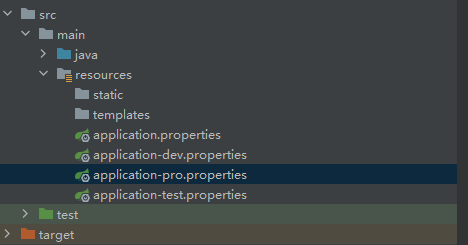
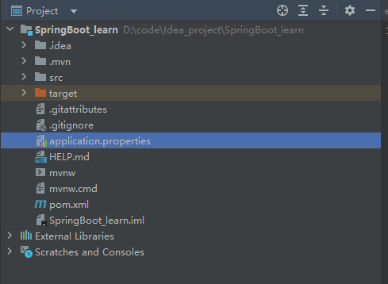

# SpringBoot快速入门

参考视频：[03-SpringBoot快速入门_哔哩哔哩_bilibili](https://www.bilibili.com/video/BV1Lq4y1J77x?spm_id_from=333.788.videopod.episodes&vd_source=f3cb3ea986b26c6910b4df6d37acd60d&p=4)

## 03-SpringBoot快速入门

搭建springboot工程，定义HelloController.hello()方法，返回"Hello SpringBoot"。

#### 1.创建maven项目

#### 2.导入依赖

```xml
<project xmlns="http://maven.apache.org/POM/4.0.0" xmlns:xsi="http://www.w3.org/2001/XMLSchema-instance"
  xsi:schemaLocation="http://maven.apache.org/POM/4.0.0 http://maven.apache.org/xsd/maven-4.0.0.xsd">
  <modelVersion>4.0.0</modelVersion>

  <groupId>org.example</groupId>
  <artifactId>springboot</artifactId>
  <version>1.0-SNAPSHOT</version>
  <packaging>jar</packaging>

  <name>springboot</name>
  <url>http://maven.apache.org</url>

  <properties>
    <project.build.sourceEncoding>UTF-8</project.build.sourceEncoding>
  </properties>

  <parent>			<!--注意这里不是dependency-->
    <!--SpringBoot工程需要继承的父工程-->
    <!--父工程里面定义了我们要用到的各种包的版本，这些版本之间不会产生冲突，所以因为导入了这个父工程，我们就不用自己去到各种依赖了，非常方便-->
    <groupId>org.springframework.boot</groupId>
    <artifactId>spring-boot-parent</artifactId>
    <version>2.3.0.RELEASE</version>
  </parent>

  <dependencies>
    <dependency>
      <groupId>junit</groupId>
      <artifactId>junit</artifactId>
      <version>3.8.1</version>
      <scope>test</scope>
    </dependency>


    <dependency>
      <groupId>org.springframework.boot</groupId>
      <artifactId>spring-boot-starter-web</artifactId>
    </dependency>
  </dependencies>

</project>
```


#### 3.定义controller

```java
import org.springframework.web.bind.annotation.RequestMapping;
import org.springframework.web.bind.annotation.RestController;

@RestController
public class HelloController {
    @RequestMapping("/hello")
    public String hello(){
        return "hello Spring Boot!";
    }
}
```


#### 4.编写引导类

```java
import org.springframework.boot.SpringApplication;
import org.springframework.boot.autoconfigure.SpringBootApplication;

/*
引导类，项目的入口
* */
@SpringBootApplication
public class HellowApplication {
    public static void main(String[] args) {
        SpringApplication.run(HellowApplication.class,args);
    }
}
```

注意引导类不能和Controller类放到同一目录下，下图所示文件结构是正确的


然后启动引导类，访问localhost8080/对应的路径就访问成功


## 04-快速构建SpringBoot工程

可以使用idea里的快速构建springboot工程的功能

新建模块，选择Spring Initializr


选择需要的依赖


## 06-SpringBoot配置-配置文件分类

SpringBoot提供了三种配置文件类型

但不管哪种文件类型，文件名都只能以`application`来命名，且它们之间也存在优先级


#### 1.properteis

```properties
server.port = 8081
```

优先级最高

#### 2.yml

yml实际上和yaml是同一个文件类型

```yaml
server:
  port: 8082
```

优先级第二

#### 3.yaml

```yam
server:
  port: 8083
```

优先级最低

## 07-SpringBoot配置-yaml基本语法

yaml语法非常简洁

```yaml
#yaml基本语法如下
#1.大小写敏感
#2.数据值前面至少要有一个空格否则会报错
port: 8080
#3.使用缩进表示层级关系
server:
  port: 8080
  address: 127.0.0.1
#但需要注意，缩进不能使用tab，因为不同工具不同系统tab缩进的字符可能不一样，会导致层级出错

```

## 08-SpringBoot配置-yaml数据格式

yaml有三种数据格式

#### 1.map键值对

```yaml
server:
  port: 8080  #这种就是键值对的形式
  address: 127.0.0.1
  
#还可以写成下面这样的行内写法
server: {port: 8080,address: 127.0.0.1}
```

#### 2.数组

```yaml
address:
  - 北京
  - 上海
#这种就是数组的形式，注意 - 后面一定要带上空格
#也可以写成下面这样
address: [北京,上海]
```

#### 3.纯量，不可再分的数据

纯量有两种写法，一种是单引号，另一种是双引号

```yaml
msg1: 'hello \n world'		#单引号不会识别转义字符
msg2: "hello \n world"      #双引号可以识别转义字符
```

#### 参数引用

可以使用${键值}来获取对应的参数

```yaml
address: 127.0.0.1
server:
  address: ${address}  #这里就会获取上面定义好的address参数
```


## 09-SpringBoot配置-获取数据_1

获取配置文件里面的数据有三种方式

示例为获取如下配置文件里的数据

```yaml
server:
  port: 8083

name: 123

person:
  name: zhangsan
  age: 20

address:
  - 北京
  - 上海

msg1: 'hello \n world'
msg2: "hello \n world"
```


#### 1.@Value获取数据

```java
//@Value获取配置文件的数据的方式如下
@Value("${配置文件里定义的键}")
private 数据类型 变量名;

	@Value("${name}")				
    private String name;

    @Value("${person.name}")
    private String persoName;

    @Value("${person.age}")
    private String personAge;

    @Value("${address[0]}")
    private String address0;

    @Value("${address[1]}")
    private String address1;

    @Value("${msg1}")
    private String msg1;

    @Value("${msg2}")
    private String msg2;
```


#### 2.使用Environment对象

```java
//首先要建立一个Environment的对象
@Autowired			//使用注解
private Environment environment;
//然后再使用
return environment.getProperty("对应的配置文件里定义的键值");

@Autowired
private Environment environment;
return "hello SpringBoot !"+environment.getProperty("person.name")+" "+environment.getProperty("address[1]");
```


#### 3.@ConfigurationProperties

先创建一个类

```java
//首先创建一个类
import org.springframework.boot.context.properties.ConfigurationProperties;
import org.springframework.stereotype.Component;

//使用以下注解
@Component                  //这个注解表示这个类被Spring识别，是一个bean
@ConfigurationProperties	
public class Person {
    private String name;
    private int age;

    @Override
    public String toString() {
        return "Person{" +
                "name='" + name + '\'' +
                ", age='" + age + '\'' +
                '}';
    }

    public void setName(String name) {
        this.name = name;
    }

    public void setAge(int age) {
        this.age = age;
    }

    public String getName() {
        return name;
    }

    public int getAge() {
        return age;
    }
}
```

然后创建一个类的对象

```java
    @Autowired          //自动注入数据
    private Person person;
```

接着访问相关数据

```java
return "hello SpringBoot !"+person.getAge()+" "+person.getName();
```

这里的访问结果如下，因为注入的数据只有配置文件中第一层的name，如果要注入person下面的name和age，就要添加前缀


添加前缀

```java
@Component                  
@ConfigurationProperties(prefix = "person")		//添加前缀
public class Person {
    private String name;
    private int age;
  ...............
```

这样注入的就是person里面的name和age数据了


## 11-SpringBoot配置-profile

一般情况下，软件在开发、测试、生产环境下使用的配置文件可能会有很大的不同，如果每次在切换环境时都去重新更改配置文件就会很麻烦。而profile功能就是来解决这个问题的

profile有两种配置方式

### profile配置方式

#### 1.多profile文件方式

给出不同环境下的不同配置文件，根据环境不同来切换即可



在主配置文件application.properties中设置使用哪个配置文件

```properties
spring.profiles.active=dev			#等号后面填配置文件名中 - 后面的字符 dev、pro、test
```

控制台中会显示生效的是哪个配置文件，这里是dev


#### 2.yaml多文档方式

下面这种是教学的写法，不过好像因为版本问题会报错

```yaml
---
server:
  port: 8081

spring:
  profiles: dev
---
server:
  port: 8082
spring:
  profiles: test
---
server:
  port: 8083
spring:
  profiles: pro
---
spring:				#这里设置启动哪个一部分的配置
  profiles:
    active: pro
```


写成下面这种就没问题

```yaml
---
server:
  port: 8081
spring:
  config:
    activate:
      on-profile: dev
---
server:
  port: 8082
spring:
  config:
    activate:
      on-profile: test
---
server:
  port: 8083
spring:
  config:
    activate:
      on-profile: pro
---
spring:					#这里设置启动哪一部分的配置
  profiles:
    active: pro
```

可以看到配置生效的提示


### profile激活方式

#### 1.配置文件激活

就是上面在properties或yaml文件中写的

```properties
spring.profiles.active=dev
```

```yaml]
spring:					#这里设置启动哪一部分的配置
  profiles:
    active: pro
```

但这个也不是很方便，因为也要去修改配置文件

#### 2.虚拟机参数激活

```cmd
#使用指令
-Dspring.profiles.active=dev
```

#### 3.命令行参数

```cmd
java -jar xxx.jar --spring.profiles.active=pro
```

可以看到激活的配置是pro


#### 注意事项

如果发生如下错误，说明当前使用的jdk和这个jar包用的jdk不一致


解决方法是去到系统变量里面把当前这个jar包用的jdk挪到最顶上，这个jar包是jdk17的，所以如下图所示

至少要把jdk17挪到jdk1.8上面，这样就可以正常运行了


## 12-SpringBoot配置-项目内部配置文件加载顺序

SpringBoot允许在项目中多个位置创建配置文件，SpringBoot启动时会在以下四个路径里面找配置文件，优先级从小到大

#### 1.classpath:/  classpath的根目录

前面一直在resources文件夹中建立配置文件就是这种，在打包是，resources下的文件就会放在classpath目录下

文件结构参考下图


#### 2.classpath:/config/  classpath的/config目录

文件结构参考下图


#### 3.file:/   当前项目下的根目录



#### 4.file:/config/  当前项目下根目录的config目录

