# 基本算法

这篇笔记用于记录我基本算法的学习。

参考资料：[代码随想录](https://programmercarl.com/)

# 数组

## 1.二分查找

### 题目

LeetCode原题：[704. 二分查找 - 力扣（LeetCode）](https://leetcode.cn/problems/binary-search/description/)

给定一个 n 个元素有序的（升序）整型数组 nums 和一个目标值 target  ，写一个函数搜索 nums 中的 target，如果目标值存在返回下标，否则返回 -1。

示例 1:

```text
输入: nums = [-1,0,3,5,9,12], target = 9     
输出: 4       
解释: 9 出现在 nums 中并且下标为 4     
```

示例 2:

```text
输入: nums = [-1,0,3,5,9,12], target = 2     
输出: -1        
解释: 2 不存在 nums 中因此返回 -1        
```

提示：

- 你可以假设 nums 中的所有元素是不重复的。
- n 将在 [1, 10000]之间。
- nums 的每个元素都将在 [-9999, 9999]之间。


### 思路

仅仅是一道简单的二分查找我也收获了很多。

我虽然能够把这题写出来，但是我没有一个完整的思路，属于是想到哪写到哪，这种写代码的方式很容易导致细节方面的错误，而且写的代码质量也不咋地，说实话，看起来杂乱无章。

我的代码

```java
public static int search(int[] nums, int target) {
    if(target<nums[0]||target>nums[nums.length-1]){
        //避免目标不不在数组内的时候还仍然跑到数组里去找
        return -1;
    }
    int left = 0;
    int right = nums.length - 1;
    int mid = (left + right) / 2;
    int rs = -1;
    //如果左边索引已经超过右边索引就退出循环
    while (left <= right) {
        if (nums[mid] == target) {
            rs = mid;
            break;
        } else {
            if (nums[mid] < target) {
                //说明目标值在右半部分
                left = mid + 1;
            } else {
                //说明目标值在左半部分
                right = mid - 1;
            }
        }
        mid = (left + right) / 2;
    }
    return rs;
}
```


一道简单的二分查找的思路也非常耐人寻味。因为说实话，确实如这个代码随想录这个教程所说，我在编写二分查找算法的时候经常会纠结于循环条件到底是`left<=right`,还是`left<right`，实际上这两种都对，只不过对应了两种不同的思路

思路一：

判断区间是[left,right]也就是左闭右闭，就是说判断值在在不在区间内会把两个边界值也考虑进去，这个时候我们在更改指针的时候应该这样做：当`target<nums[mid]`时，应该`right=mid-1`,当`target>nums[mid]`时，应该`left=mid+1`，并且循环条件应该是`left<=right`


思路二：

判断区间是[left,right)也就是左闭右开，也就是说判断时不会把最右边的值考虑进去，这个时候应该这样做：当`target<nums[mid]`时，应该`right=mid`，不用-1，因为判断时不会把最右边的包括进去。当`target>nums[mid]`时，应该`left=mid+1`，因为左边还是包含的，因此得加1。并且此时循环条件应该是`left<right`，因为等于的话就没有意义，反正最右边的值不会算入到判断中。


### 特别注意

如果二分查找中没有找到目标值，最终指针left指向的就是第一个比目标值大的位置。


## 2.移出元素（相向双指针）

### 题目

[27. 移除元素 - 力扣（LeetCode）](https://leetcode.cn/problems/remove-element/description/)

给你一个数组 nums 和一个值 val，你需要 原地 移除所有数值等于 val 的元素，并返回移除后数组的新长度。

不要使用额外的数组空间，你必须仅使用 O(1) 额外空间并**原地**修改输入数组。

元素的顺序可以改变。你不需要考虑数组中超出新长度后面的元素。

示例 1: 给定 nums = [3,2,2,3], val = 3, 函数应该返回新的长度 2, 并且 nums 中的前两个元素均为 2。 你不需要考虑数组中超出新长度后面的元素。

示例 2: 给定 nums = [0,1,2,2,3,0,4,2], val = 2, 函数应该返回新的长度 5, 并且 nums 中的前五个元素为 0, 1, 3, 0, 4。

**你不需要考虑数组中超出新长度后面的元素。**


### 思路

这道题我一开始想到的思路是相向双指针，但是写的时候也是依托，代码思路一点也不清晰，乱糟糟的，最后调试半天才过。

通过这道题，我重新学习了相向双指针的代码到底该如何写，真的，不看看这些大佬们的代码，真不知道自己写的代码真就是依托又依托

相向双指针思路

```java
public static int removeElement_My(int[] nums, int val) {
    //相向双指针
    int left = 0;
    int right = nums.length-1;
    while (right >= 0 && nums[right] == val) right--;       //从右往左找到第一个非val值
    while (left <= right) {
        if (nums[left] == val) {
            nums[left] = nums[right];
            right--;
            //如果是我，我会在这里写个count++，完全不会去想用left指针作为返回值
            //count++
        }
        left++;
        while (right >= 0 && nums[right] == val) right--;
    }
    //直接将索引作为返回值，不像我还得拿个什么count变量来记录
    return left;
}
```


除了重新认识了相向双指针外，还学会了快慢指针思路

```
快慢指针思路：
快慢指针同时出发
如果快指针所在位置的值与目标值不同，就交换快慢指针的值，并将快慢指针同时向前移动
如果快指针所在位置的值与目标值相同，就只移动快指针，慢指针不动
```

```java
public static int removeElement(int[] nums, int val) {
    //学到的思路，快慢指针
    int slowIndex = 0;
    for (int fastIndex = 0; fastIndex < nums.length; fastIndex++) {
        if (nums[fastIndex] != val) {
            nums[slowIndex] = nums[fastIndex];
            slowIndex++;
        }
    }
    return slowIndex;
}
```


## 3.有序数组的平方（相向双指针）

### 题目

[力扣题目链接](https://leetcode.cn/problems/squares-of-a-sorted-array/)

给你一个按 非递减顺序 排序的整数数组 nums，返回 每个数字的平方 组成的新数组，要求也按 非递减顺序 排序。

示例 1：

- 输入：nums = [-4,-1,0,3,10]
- 输出：[0,1,9,16,100]
- 解释：平方后，数组变为 [16,1,0,9,100]，排序后，数组变为 [0,1,9,16,100]

示例 2：

- 输入：nums = [-7,-3,2,3,11]
- 输出：[4,9,9,49,121]


### 思路

这题还是双指针，数组实际上是排好序的，只不过在平方后，前面的可能会比后面的大，所以可以分别用指针来指最前面和最后面，因为平方后的最大值一定是首尾两个中的一个

```java
public static int[] sortedSquares(int[] nums) {
    //相向双指针
    int left = 0;
    int right = nums.length - 1;
    int[] newArr = new int[nums.length];
    //逆向放入新数组，因为平方后最大值一定在最两边
    for (int i = newArr.length - 1; i >= 0; i--) {
        if((nums[left]*nums[left])>(nums[right]*nums[right])){
            newArr[i]=nums[left]*nums[left];
            left++;
        }else{
            newArr[i]=nums[right]*nums[right];
            right--;
        }
    }
    return newArr;
}
```


## 4.长度最小的子数组（滑动窗口）

### 题目

[力扣题目链接](https://leetcode.cn/problems/minimum-size-subarray-sum/)

给定一个含有 n 个正整数的数组和一个正整数 s ，找出该数组中满足其和 ≥ s 的长度最小的 连续 子数组，并返回其长度。如果不存在符合条件的子数组，返回 0。

示例：

- 输入：s = 7, nums = [2,3,1,2,4,3]
- 输出：2
- 解释：子数组 [4,3] 是该条件下的长度最小的子数组。

提示：

- 1 <= target <= 10^9
- 1 <= nums.length <= 10^5
- 1 <= nums[i] <= 10^5


### 思路

滑动窗口：**就是不断的调节子序列的起始位置和终止位置，从而得出我们要想的结果**。

这题的思路是滑动窗口，这里窗口指的就是子数组，滑动窗口指的就是动态改变子数组的长度，那这个动态是怎么个动态法？

如果当前子数组的和小于目标值，就扩大窗口，也就是向后移动移动右边的指针，并保持左边的指针不动

如果当前子数组的和小于目标值，就缩小窗口，也就是向后移动左边的指针，并保持右边的指针不动，直到子数组的和小于目标值。

这样就能一步步找到最短的子数组，就像试探一样，先一直加加加，当加到超过目标值后就尝试慢慢减，看到底减多少会刚好小于目标值

代码如下

```java
public static int minSubArrayLen(int target, int[] nums) {
    //思路：滑动窗口
    int rs = Integer.MAX_VALUE;
    //滑动窗口前面的指针
    int fast = 0;
    //滑动窗口后面的指针
    int slow = 0;
    //子数组的和
    int sum = 0;
    for (fast = 0; fast < nums.length; fast++) {
        sum += nums[fast];
        while (sum >= target) {
            int subLength = fast - slow + 1;
            rs = rs < subLength ? rs : subLength;
            sum-=nums[slow++];
        }
    }
    if(rs==Integer.MAX_VALUE) return 0;
    return rs;
}
```


## 5.螺旋矩阵II

### 题目

[力扣题目链接](https://leetcode.cn/problems/spiral-matrix-ii/)

给定一个正整数 n，生成一个包含 1 到 n^2 所有元素，且元素按顺时针顺序螺旋排列的正方形矩阵。

示例:

输入: 3 输出: [ [ 1, 2, 3 ], [ 8, 9, 4 ], [ 7, 6, 5 ] ]


### 思路

这题没有涉及到算法，主要是要掌握螺旋矩阵的模拟过程。这个模拟过程看似思路侵袭，实则处处碰壁。

我自己写代码的时候就有下面这些问题：

1.当n为1的特殊情况没有处理

2.无法正确把握下一次要填数据的位置


实际上就算是模拟也讲究思路的，这题主要要抓住一个循环不变量原则，这里的不变量指的是在分别处理上行、右列、下行、左列时到底是左闭右闭还是左闭右开还是其他，这里的话个人感觉左闭右开会好写很多，也就是在处理的时候每行，每列的最后一个不处理。

然后这题还有个技巧，就是每处理完一轮上行、右列、下行、左列可以看成是处理完一圈，也就是说可以按每圈每圈来处理，只不过这个圈每次都会逐渐变小，例如如果n为4，就有两圈，最外面一圈是边长为4的正方形，里面一圈是边长为2的正方形，如果n为3，最外面一圈就是边长为3的正方形，最里面是边长为1的正方形，也就是一个点。

所以我们可以得到一个结论，n阶矩阵可以看成n/2(向下取整)个正方形嵌套而成，其中如果n为奇数的时候还要在此基础上加上一个点，也就是1阶矩阵，这个要单独处理

仿照示例代码，并做出了点修改

```java
public static int[][] generateMatrix(int n) {
    //仿示例代码
    int[][] arr = new int[n][n];
    //每次要放入的数据
    int value = 1;
    //代表行
    int row = 0;
    //代表列
    int column = 0;
    //代表圈的边长,每圈的边长等于n-（循环圈数-1）*2
    int side = n;
    //代表循环的圈数
    int loop = 1;
    while (loop <= n / 2) {
        //处理上行
        for (int i = 0; i < side - 1; i++) {
            arr[row][column++] = value++;
        }
        //处理右列
        for (int i = 0; i < side - 1; i++) {
            arr[row++][column] = value++;
        }
        //处理下行
        for (int i = 0; i < side - 1; i++) {
            arr[row][column--] = value++;
        }
        //处理左列
        for (int i = 0; i < side - 1; i++) {
            arr[row--][column] = value++;
        }
        //处理完一圈，圈数加1
        loop++;
        //边长减2
        side -= 2;
        //重设每圈的起点
        row = loop - 1;
        column = loop - 1;
    }
    //对n为奇数时单独处理
    if (n % 2 == 1) {
        arr[row][column]=n*n;
    }
    return arr;

}
```


## 6.区间和（方法:前缀和）

### 题目

[题目链接](https://kamacoder.com/problempage.php?pid=1070)

题目描述

给定一个整数数组 Array，请计算该数组在每个指定区间内元素的总和。

输入描述

第一行输入为整数数组 Array 的长度 n，接下来 n 行，每行一个整数，表示数组的元素。随后的输入为需要计算总和的区间，直至文件结束。

输出描述

输出每个指定区间内元素的总和。

输入示例

```text
5
1
2
3
4
5
0 1
1 3
```

输出示例

```text
3
9
```

数据范围：

0 < n <= 100000


### 思路

最容易想到的就是暴力求解，直接先输入数组，在遍历数组取区间和。但是老是用这种暴力解法是没有办法进步的，暴力解法谁都能想到

这题要用的新思路是：前缀和。前缀和的思想是重复利用计算过的子数组之和，从而降低区间查询的次数。

在输入原数组的时候，就可以创建一个前缀和数组p[]来一步一步记录前缀和，p[i]代表的就是前i个元素的和，最终当数组输入完毕后，前缀和数组也就记录完毕。此时如果我们想要计算某个区间的和，例如计算a、b区间的和，只需要用前缀和p[b]减去前缀和p[a-1]，这里要注意的就是减的时候应该是减p[a-1]而不是p[a]，因为a、b区间的和包括a这个位置的元素。这样做，在每次计算区间和的时候就只用计算一次，不需要像暴力解法那样去重复查找原数组。

代码如下

```java
public static void subArrSum() {
    //前缀和
    Scanner sc = new Scanner(System.in);
    int n = sc.nextInt();
    //前缀和数组，p[i]表示arr[0]~arr[i]的和
    int[] p = new int[n];
    //初始化数组
    p[0] = sc.nextInt();
    for (int i = 1; i < n; i++) {
        int num = sc.nextInt();
        p[i] = p[i - 1] + num;
    }
    int a;
    int b;
    //这里循环条件注意别用true，用sc.hasNext这些
    while(sc.hasNextInt()){
        //输入区间
        a=sc.nextInt();
        b=sc.nextInt();
        if(a==0){
            //对左边界为0的时候特殊处理
            System.out.println(p[b]);
        }else {
            System.out.println(p[b] - p[a - 1]);
        }
    }
    sc.close();

}
```


## 7.开发商购买土地

### 题目

[题目链接](https://kamacoder.com/problempage.php?pid=1044)

【题目描述】

在一个城市区域内，被划分成了n * m个连续的区块，每个区块都拥有不同的权值，代表着其土地价值。目前，有两家开发公司，A 公司和 B 公司，希望购买这个城市区域的土地。

现在，需要将这个城市区域的所有区块分配给 A 公司和 B 公司。

然而，由于城市规划的限制，只允许将区域按横向或纵向划分成两个子区域，而且每个子区域都必须包含一个或多个区块。

为了确保公平竞争，你需要找到一种分配方式，使得 A 公司和 B 公司各自的子区域内的土地总价值之差最小。

注意：区块不可再分。

【输入描述】

第一行输入两个正整数，代表 n 和 m。

接下来的 n 行，每行输出 m 个正整数。

输出描述

请输出一个整数，代表两个子区域内土地总价值之间的最小差距。

【输入示例】

3 3 1 2 3 2 1 3 1 2 3

【输出示例】

0

【提示信息】

如果将区域按照如下方式划分：

1 2 | 3 2 1 | 3 1 2 | 3

两个子区域内土地总价值之间的最小差距可以达到 0。

【数据范围】：

- 1 <= n, m <= 100；
- n 和 m 不同时为 1。


### 思路

还好这题只要求横向划分和纵向划分，如果来个斜向划分就麻烦了。

横向划分，可以看成是由前几行组成一块区域，最后几行组成一块区域，而每块区域的权值和不就是对应那几行的数据加起来吗，然后我们可以把每一行数据先加起来看成一个值，假如说第一块区域由前3行组成，那么第一块区域的权值和就是第一行的权值和加上第二行的权值和再加上第三行的权值和，这样一来一个二位数组其实就可以看成是一维数组，一维数组的每个值对应的就是二维数组每一行的权值和，这样一来这个开发商问题就转化成了将一维数组划分为两个子数组，然后求两个子数组的最小差值的问题。

纵向划分也是同理。

问题一转化思路就清晰了，用前缀和就非常好求。假如我们的到一个横向划分的前缀和数组row[3]，row[0]代表前一行的权值和，row[1]代表前2行的权值和.....，此时我们就可以遍历所有划分情况，然后计算每一种划分情况的两块区域差值，比如以第一行为一个区域，剩下两行为另一个区域，那么这两区域的差值就是row[2]-row[0]*2，首先row[2]-row[0]就是第二个区域的权值和，再减去row[0]才是两个区域的差值。

要注意的是计算差值一定要关注需不需要求结果的绝对值，这题显然是要的。

代码如下

```java
import java.util.Scanner;

//开发商购买土地
public class KamaCoder44 {
    public static void main(String[] args) {
        buyLand();
    }

    public static void buyLand() {
        Scanner sc = new Scanner(System.in);
        int n = sc.nextInt();
        int m = sc.nextInt();
        int[][] lands = new int[n][m];
        //min表示两块区域土地的最小权值差
        int min = Integer.MAX_VALUE;
        //输入土地的权值，并顺便统计横向土地权值和以及纵向土地权值和
        //row[i]表示第i行的所有土地的权值和
        int[] row = new int[n];
        //column[j]表示第j列的所有土地权值和
        int[] column = new int[m];
        for (int i = 0; i < n; i++) {
            for (int j = 0; j < m; j++) {
                lands[i][j] = sc.nextInt();
                row[i] += lands[i][j];
                column[j] += lands[i][j];
            }
        }

        //计算横向前缀和，preRow[i]表示前i行的所有土地权值和
        int[] preRow = new int[n];
        preRow[0] = row[0];
        for (int i = 1; i < row.length; i++) {
            preRow[i] = preRow[i - 1] + row[i];
        }

        //计算纵向前缀和，preColumn[j]表示前j列的所有土地的权值和
        int[] preColumn = new int[m];
        preColumn[0] = column[0];
        for (int i = 1; i < column.length; i++) {
            preColumn[i] = preColumn[i - 1] + column[i];
        }

        //横向划分
        for (int i = 1; i < preRow.length; i++) {
            int dif = Math.abs(preRow[preRow.length - 1] - preRow[i - 1]*2);
            min = dif < min ? dif : min;
        }

        //纵向划分
        for (int i = 1; i < preColumn.length; i++) {
            int dif = Math.abs(preColumn[preColumn.length - 1] - preColumn[i - 1]*2);
            min = dif < min ? dif : min;
        }
        System.out.println(min);

    }
}
```


# 链表

## 1.链表理论基础

### 链表节点的定义

```java
public class ListNode {
    //节点的值
    int val;

    //下一个节点的地址
    ListNode next;

    public ListNode() {
    }

    public ListNode(int val) {
        this.val = val;
    }

    //这个好像不大需要
//    public ListNode(ListNode next) {
//        this.next = next;
//    }

    public ListNode(int val, ListNode next) {
        this.val = val;
        this.next = next;
    }
}
```


## 2.移出链表元素

### 题目

[力扣题目链接](https://leetcode.cn/problems/remove-linked-list-elements/)

题意：删除链表中等于给定值 val 的所有节点。

示例 1： 输入：head = [1,2,6,3,4,5,6], val = 6 输出：[1,2,3,4,5]

示例 2： 输入：head = [], val = 1 输出：[]

示例 3： 输入：head = [7,7,7,7], val = 7 输出：[]


### 思路

删除链表元素的思路没什么好讲的，就是遍历然后判断要不要删。

主要要知道的是涉及链表元素操作的两种方式：

1.直接使用原来的链表进行操作

这种方式在删除节点的时候是通过要删除节点前面那个节点来删除的，但是头节点前面没有节点，因此要单独处理头节点。

头节点的处理也很简单，当判断头节点符合被删除的要求时，只需要将头节点往前移，这样就相当于删除了原来的头节点。


2.设置一个虚拟头节点再进行操作

这种方式的好处在于删除头节点的操作方式与删除其他节点的方式一样了，因此不用单独处理头节点


这题我用的是第二种方式，代码如下，我一开始写的代码不是下面这样的，写的很烂，所以好好学一学下面的代码吧。

```java
public static ListNode removeElements(ListNode head, int val) {
    //参考的别人的代码
    ListNode dummyNode = new ListNode();
    dummyNode.next = head;
    //创建一个当前节点
    ListNode currentNode = dummyNode;
    while(currentNode.next!=null){
        if(currentNode.next.val==val){
            currentNode.next=currentNode.next.next;
        }else {
            currentNode=currentNode.next;
        }
    }
    return dummyNode.next;
}
```


## 3.设计链表

### 题目

[力扣题目链接](https://leetcode.cn/problems/design-linked-list/)

题意：

在链表类中实现这些功能：

- get(index)：获取链表中第 index 个节点的值。如果索引无效，则返回-1。
- addAtHead(val)：在链表的第一个元素之前添加一个值为 val 的节点。插入后，新节点将成为链表的第一个节点。
- addAtTail(val)：将值为 val 的节点追加到链表的最后一个元素。
- addAtIndex(index,val)：在链表中的第 index 个节点之前添加值为 val 的节点。如果 index 等于链表的长度，则该节点将附加到链表的末尾。如果 index 大于链表长度，则不会插入节点。如果index小于0，则在头部插入节点。
- deleteAtIndex(index)：如果索引 index 有效，则删除链表中的第 index 个节点。


### 思路

这道题模拟了链表的几个操作，用来熟悉练习链表非常不错。

做这道题我出现的问题主要是自己对链表这一数据结构没有一个标准的概念，我知道什么是链表，也直到链表怎么实现，但是实现链表的方式不止一种，在写这个代码的时候，我脑袋里一会儿想这这种实现方式，一会儿有想到了那种实现方式，导致整个过程非常混乱，思路不清晰。

所以我觉得做这种题，首先就要先明确自己到底要用那种方式，例如要先弄清楚size代表什么，是当前链表最大索引还是当前链表长度，再如链表要不要虚拟头节点。把这些基本的东西搞清除，制定一个规范再下笔，思路才会更清晰。

代码如下

```java
//设计链表
public class LeetCode707 {

}


/**
 * 在模拟链表这种数据结构的时候最好能有一个统一的规定，例如要先弄清楚size代表什么，是当前链表最大索引还是当前链表长度，再如链表要不要虚拟头节点。
 * 有一个统一的规定模拟起来才不会混乱，再下次遇到的时候心里也有一个整体的规范，不然脑袋里面就会变来变去，非常影响编写代码
 * 这里我就做一个统一的规范，以后遇到链表相关的模拟就按这个规范来
 * 1.采用单链表，一个节点只包含val和next
 * 2.采用虚拟头节点
 * 3.size代表链表的实际长度
 */
class MyLinkedList {
    class ListNode {
        int val;
        ListNode next;

        ListNode() {
        }

        ListNode(int val, ListNode next) {
            this.val = val;
            this.next = next;
        }
    }

    //链表的虚拟头节点
    ListNode head;
    //链表的实际长度
    int size;

    public MyLinkedList() {
        //初始化链表
        head = new ListNode();
        size = 0;
    }

    public int get(int index) {
        //获取指定索引的节点
        //首先处理非法索引
        if(index<0||index>=size){
            return -1;
        }
        //当前节点
        ListNode cur = head;
        for (int i = 0; i <= index; i++) {
            cur=cur.next;
        }
        return cur.val;
    }

    public void addAtHead(int val) {
        //在头节点前面添加元素
        //让新节点的next指向原来的头节点
        ListNode newNode = new ListNode(val,head.next);
        //只需让虚拟头节点指向要添加的节点即可
        head.next = newNode;
        //别忘了让链表的长度+1
        size++;
    }

    public void addAtTail(int val) {
        //在尾节点后面添加元素
        ListNode cur = head;
        //先遍历节点，一直到尾节点
        while(cur.next!=null){
            cur=cur.next;
        }
        //创建一个新节点并让旧尾节点指向新尾节点
        ListNode newNode = new ListNode(val,null);
        cur.next=newNode;
        //别忘了让链表长度+1
        size++;
    }

    public void addAtIndex(int index, int val) {
        //在指定索引位置添加元素
        //首先处理非法索引，在这里索引为size的情况并不是非法情况，如果索引为size，说明新节点是插入到链表尾部的
        if(index<0||index>size){
            return;
        }
        //遍历链表，直到目标索引的前驱节点
        ListNode cur = head;
        for (int i = 0; i < index; i++) {
            cur=cur.next;
        }
        //新建要插入的节点，并让新节点指向原来在这个索引位置的节点
        ListNode newNode = new ListNode(val,cur.next);
        //让前驱节点指向新节点
        cur.next=newNode;
        //别忘了让链表长度+1
        size++;
    }

    public void deleteAtIndex(int index) {
        //删除指定索引的节点
        //处理非法索引
        if(index<0||index>=size){
            return;
        }
        ListNode cur = head;
        //遍历到要删除节点的前驱节点
        for (int i = 0; i < index; i++) {
            cur=cur.next;
        }
        //直接让前驱节点指向被删除节点的下一个节点即可
        cur.next=cur.next.next;
        //别忘了让链表长度-1
        size--;
    }
}
```


## 4.翻转链表

### 题目

[力扣题目链接](https://leetcode.cn/problems/reverse-linked-list/)

题意：反转一个单链表。

示例: 输入: 1->2->3->4->5->NULL 输出: 5->4->3->2->1->NULL


### 思路

采用双指针法。定义一个cur指针代表当前节点，定义一个pre代表前驱节点，定义一个tmp代表临时节点，临时节点用于保存下一个节点的位置。

翻转时，只需将cur的next指向pre即可，完成翻转后cur和pre都向前移动一个节点直到翻转完所有节点

代码如下

```java
//反转链表
public class LeetCode206 {

}
class Solution {
    public ListNode reverseList(ListNode head) {
        //双指针法
        //当前节点
        ListNode cur = head;
        //前驱节点
        ListNode pre = null;
        //临时节点
        ListNode tmp = null;
        while(cur!=null){
            //保存下一个节点的位置
            tmp=cur.next;
            cur.next=pre;
            //两个指针都向前移动一个节点
            pre=cur;
            cur=tmp;
        }
        return pre;
    }
}

//LeetCode题目给的链表节点类，不是我自己定义的
class ListNode {
      int val;
      ListNode next;
      ListNode() {}
      ListNode(int val) { this.val = val; }
      ListNode(int val, ListNode next) { this.val = val; this.next = next; }
  }
```


## 5.两两交换链表中的节点

### 题目

[力扣题目链接](https://leetcode.cn/problems/swap-nodes-in-pairs/)

给定一个链表，两两交换其中相邻的节点，并返回交换后的链表。

你不能只是单纯的改变节点内部的值，而是需要实际的进行节点交换。


### 思路

思路就是模拟，但是模拟这东西真的是想着挺简单的，但是一敲代码真的有好多细节需要注意。

首先要想好模拟的过程，在脑袋里面要有一个清晰的过程，最好就拿草稿纸来写一下，不要太相信自己的脑袋，这道题我也并没有一遍过，代码写出来有有几个漏洞

模拟过程如下

先让当前节点指向第二个节点，然后让第二个指向第一个节点完成交换，最后让第一个节点指向第三个节点。这里特别要注意，第三个节点的地址要用一个临时变量记住，我就是在这里踩了坑。


代码如下

```java
import dataStructure.ListNode;

//两两交换链表中的节点
public class LeetCode24 {
    public ListNode swapPairs(ListNode head) {
        //处理空链表和长度为1的链表的情况
        if(head==null||head.next==null){
            return null;
        }
        //记住第二个节点，最后直接返回这个节点
        ListNode newHead = head.next;
        //使用虚拟头节点
        //让cur指向虚拟头节点
        ListNode cur = new ListNode(0,head);
        //如果当前节点为空并且当前节点后面的节点数不少于两个，就两两交换处理
        while(cur!=null&&cur.next!=null&&cur.next.next!=null){
            //创建两个变量来代表进行两两交换的节点，会让思路清晰一点
            ListNode first = cur.next;
            ListNode second = cur.next.next;
            //临时变量记住第三个节点
            ListNode tmp = second.next;
            //让当前节点指向第二个节点
            cur.next=second;
            //让第二个节点指向第一个节点
            second.next=first;
            //让第一个节点指向第二个节点的下一个节点
            //first.next=second.next;   这里注意一下，我第一次写的代码是这样的，但是前面second.next已经被修改了，所以这行代码实际上first.next=first，指向自己了
            //应该用于个临时变量来记住第三个节点
            first.next=tmp;
            //让当前节点的指针向前移动
            //cur=second;		这里也注意一下，我第一次写的是cur=second，脑袋里面想的确实是让cur向前移动两个节点，但是由于第一个节点和第二个节点已经交换了，此时第二个节点已经变成第一个节点，第一个节点变成第二个节点了，所以应该是cur=first;
            cur=first;
        }
        //处理好后直接返回处理前的第二个节点
        return newHead;
    }
}
```


## 6.删除链表的倒数第N个节点

### 题目

[力扣题目链接](https://leetcode.cn/problems/remove-nth-node-from-end-of-list/)

给你一个链表，删除链表的倒数第 n 个结点，并且返回链表的头结点。

进阶：你能尝试使用一趟扫描实现吗？

示例 1：


输入：head = [1,2,3,4,5], n = 2 输出：[1,2,3,5]

示例 2：

输入：head = [1], n = 1 输出：[]

示例 3：

输入：head = [1,2], n = 1 输出：[1]


### 思路

采用快慢指针法。

定义一个fast指针和一个slow指针同时指向开始节点（最好指向虚拟头节点）

先让fast指针向前移动n个节点

接着让slow和fast指针同时向前移动，直到fast到达链表的末尾，即：fast指针为null，注意不是指向尾节点，而是链表的结尾null

这时slow所指的节点就是要删除的节点


代码如下

```java
import dataStructure.ListNode;

//删除链表的倒数第N个节点
public class LeetCode19 {
    public ListNode removeNthFromEnd(ListNode head, int n) {
        /*思路：
        *快慢指针
        * 定义一个快指针fast和一个慢指针slow
        * 让fast先移动n个节点
        * 然后slow和fast同时移动，直到fast到达末尾，注意不是最后一个节点，而是链表的末尾，即：最后fast指针为null
        * 此时slow指向的节点就是要删除的节点
        * */

        //定义一个虚拟头节点
        ListNode dummy = new ListNode(0,head);
        //快指针,指向虚拟节点
        ListNode fast = dummy;
        //慢指针,指向虚拟节点
        ListNode slow = dummy;
        //快指针先移动n+1个节点，正常来说移动n个节点就可以了，这里移动n+1个节点是为了让slow指针指向要删除的节点的前驱节点，方便进行删除操作
        for (int i = 0; i < n+1; i++) {
            //注意处理异常情况，如果fast在这个过程中变为了null，说明倒数第n个节点根本不存在，直接返回原来的链表
            if(fast==null){
                return head;
            }
            fast=fast.next;
        }
        //接着让快慢指针同时移动，直到fast指向结尾的null
        while(fast!=null){
            fast=fast.next;
            slow=slow.next;
        }
        //循环结束，找到要删除节点的前驱节点，进行删除操作
        slow.next=slow.next.next;
        //返回虚拟头节点指向的节点，即新的头节点
        return dummy.next;
    }
}
```


## 7.链表相交

### 题目

同：160.链表相交

[力扣题目链接](https://leetcode.cn/problems/intersection-of-two-linked-lists-lcci/)

给你两个单链表的头节点 headA 和 headB ，请你找出并返回两个单链表相交的起始节点。如果两个链表没有交点，返回 null 。

图示两个链表在节点 c1 开始相交：


题目数据 保证 整个链式结构中不存在环。

注意，函数返回结果后，链表必须 保持其原始结构 。

示例 1：


示例 2：


示例 3：


### 思路

首先要明白什么是链表相交：链表相交是指两个链表在某个节点开始合并，共享相同的节点序列。

明白了链表相交的概念才能正确解题，我刚开始都不明白链表相交是啥。

思路如下：

首先统计A、B两条链表的长度，假设分别为n、m

使用curA、curB两个指针分别指向A、B链表

将两条链表尾部对齐，这里假设m>n，那么对齐方式就是curB先向前移动m-n个节点

尾部对齐后，curA和curB同时向前移动，移动的同时判断curA和curB地址是否相同，如果地址相同，那么该节点就是链表相交的起始节点


新思路：（2025年9月13日更新）

```
这个思路其实就是上面采用的思路的一种变形:
headA和headB同时开始遍历，如果headA到达链表末尾就重新让其指向headB，如果headB到达链表末尾，就重新让其指向headA
就这样一直遍历，知道两个指针指向同一个节点或者都指向null。
这种思路可以抽象成将两个链表连接到一块，如果两个链表存在相交的情况，那么最终两个指针一定会指向同一个节点
```

```java
//新思路
public ListNode getIntersectionNode2(ListNode headA, ListNode headB) {
    /**
     * 这个思路其实就是上面采用的思路的一种变形:
     * headA和headB同时开始遍历，如果headA到达链表末尾就重新让其指向headB，如果headB到达链表末尾，就重新让其指向headA
     * 就这样一直遍历，知道两个指针指向同一个节点或者都指向null。
     * 这种思路可以抽象成将两个链表连接到一块，如果两个链表存在相交的情况，那么最终两个指针一定会指向同一个节点
     */

    ListNode pA = headA;
    ListNode pB = headB;
    while (pA != pB) {
        pA = pA == null ? headB : pA.next;
        pB = pB == null ? headA : pB.next;
    }
    return pA;

}
```


代码如下

```java
import dataStructure.ListNode;

//链表相交
public class LeetCode160 {
    public ListNode getIntersectionNode(ListNode headA, ListNode headB) {
        /*思路：
         * 首先统计A、B两条链表的长度，假设分别为n、m
         * 使用curA、curB两个指针分别指向A、B链表
         * 将两条链表尾部对齐，这里假设m>n，那么对齐方式就是curB先向前移动m-n个节点
         * 尾部对齐后，curA和curB同时向前移动，移动的同时判断curA和curB地址是否相同，如果地址相同，那么该节点就是链表相交的起始节点
         * */

        //curA指针指向链表A
        ListNode curA = headA;
        //curB指针指向链表B
        ListNode curB = headB;
        //计算链表A的长度
        int lenA = 0;
        while (curA != null) {
            lenA++;
            curA = curA.next;
        }
        curA = headA;

        //计算链表B的长度
        int lenB = 0;
        while (curB != null) {
            lenB++;
            curB = curB.next;
        }
        curB=headB;

        //尾部对齐
        //如果链表A长
        if(lenA>lenB){
            for (int i = 0; i < lenA-lenB; i++) {
                curA=curA.next;
            }
        }
        //如果链表B长
        if(lenA<lenB){
            for (int i = 0; i < lenB-lenA; i++) {
                curB=curB.next;
            }
        }

        //尾部对齐后开始寻找链表相交的起始节点
        while(curA!=null){
            if(curA==curB){
                return curA;
            }else{
                curA=curA.next;
                curB=curB.next;
            }
        }
        return null;
    }
}
```


## 8.环形链表II

### 题目

[力扣题目链接](https://leetcode.cn/problems/linked-list-cycle-ii/)

题意： 给定一个链表，返回链表开始入环的第一个节点。 如果链表无环，则返回 null。

为了表示给定链表中的环，使用整数 pos 来表示链表尾连接到链表中的位置（索引从 0 开始）。 如果 pos 是 -1，则在该链表中没有环。

**说明**：不允许修改给定的链表。


### 思路

这道题的思路我是第一次见，以前从来没有写过这样的题，长见识了。这里笔记直接复制的原资料中的讲的思路


这道题目，不仅考察对链表的操作，而且还需要一些数学运算。

主要考察两知识点：

- 判断链表是否环
- 如果有环，如何找到这个环的入口

### 判断链表是否有环

可以使用快慢指针法，分别定义 fast 和 slow 指针，从头结点出发，fast指针每次移动两个节点，slow指针每次移动一个节点，如果 fast 和 slow指针在途中相遇 ，说明这个链表有环。

为什么fast 走两个节点，slow走一个节点，有环的话，一定会在环内相遇呢，而不是永远的错开呢

首先第一点：**fast指针一定先进入环中，如果fast指针和slow指针相遇的话，一定是在环中相遇，这是毋庸置疑的。**

那么来看一下，**为什么fast指针和slow指针一定会相遇呢？**

可以画一个环，然后让 fast指针在任意一个节点开始追赶slow指针。

会发现最终都是这种情况， 如下图：


fast和slow各自再走一步， fast和slow就相遇了

这是因为fast是走两步，slow是走一步，**其实相对于slow来说，fast是一个节点一个节点的靠近slow的**，所以fast一定可以和slow重合。

动画如下：


### 如果有环，如何找到这个环的入口

**此时已经可以判断链表是否有环了，那么接下来要找这个环的入口了。**

假设从头结点到环形入口节点 的节点数为x。 环形入口节点到 fast指针与slow指针相遇节点 节点数为y。 从相遇节点 再到环形入口节点节点数为 z。 如图所示：


那么相遇时： slow指针走过的节点数为: `x + y`， fast指针走过的节点数：`x + y + n (y + z)`，n为fast指针在环内走了n圈才遇到slow指针， （y+z）为 一圈内节点的个数A。

因为fast指针是一步走两个节点，slow指针一步走一个节点， 所以 fast指针走过的节点数 = slow指针走过的节点数 * 2：

```
(x + y) * 2 = x + y + n (y + z)
```

两边消掉一个（x+y）: `x + y = n (y + z)`

因为要找环形的入口，那么要求的是x，因为x表示 头结点到 环形入口节点的的距离。

所以要求x ，将x单独放在左面：`x = n (y + z) - y` ,

再从n(y+z)中提出一个 （y+z）来，整理公式之后为如下公式：`x = (n - 1) (y + z) + z` 注意这里n一定是大于等于1的，因为 fast指针至少要多走一圈才能相遇slow指针。

这个公式说明什么呢？

先拿n为1的情况来举例，意味着fast指针在环形里转了一圈之后，就遇到了 slow指针了。

当 n为1的时候，公式就化解为 `x = z`，

这就意味着，**从头结点出发一个指针，从相遇节点 也出发一个指针，这两个指针每次只走一个节点， 那么当这两个指针相遇的时候就是 环形入口的节点**。

也就是在相遇节点处，定义一个指针index1，在头结点处定一个指针index2。

让index1和index2同时移动，每次移动一个节点， 那么他们相遇的地方就是 环形入口的节点。

动画如下：


那么 n如果大于1是什么情况呢，就是fast指针在环形转n圈之后才遇到 slow指针。

其实这种情况和n为1的时候 效果是一样的，一样可以通过这个方法找到 环形的入口节点，只不过，index1 指针在环里 多转了(n-1)圈，然后再遇到index2，相遇点依然是环形的入口节点。


### 补充

在推理过程中，大家可能有一个疑问就是：**为什么第一次在环中相遇，slow的 步数 是 x+y 而不是 x + 若干环的长度 + y 呢？**

即文章[链表：环找到了，那入口呢？](https://programmercarl.com/0142.环形链表II.html)中如下的地方：

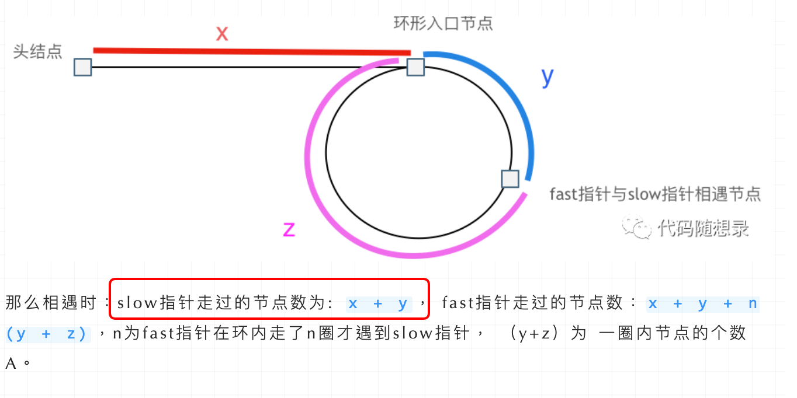

首先slow进环的时候，fast一定是先进环来了。

如果slow进环入口，fast也在环入口，那么把这个环展开成直线，就是如下图的样子：


可以看出如果slow 和 fast同时在环入口开始走，一定会在环入口3相遇，slow走了一圈，fast走了两圈。

重点来了，slow进环的时候，fast一定是在环的任意一个位置，如图：

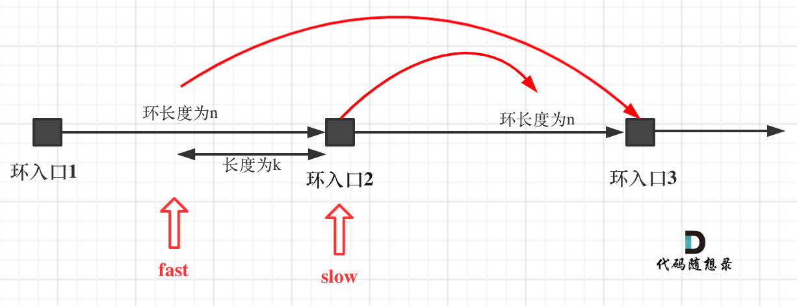

那么fast指针走到环入口3的时候，已经走了k + n 个节点，slow相应的应该走了(k + n) / 2 个节点。

因为k是小于n的（图中可以看出），所以(k + n) / 2 一定小于n。

**也就是说slow一定没有走到环入口3，而fast已经到环入口3了**。

这说明什么呢？

**在slow开始走的那一环已经和fast相遇了**。

那有同学又说了，为什么fast不能跳过去呢？ 在刚刚已经说过一次了，**fast相对于slow是一次移动一个节点，所以不可能跳过去**。

好了，这次把为什么第一次在环中相遇，slow的 步数 是 x+y 而不是 x + 若干环的长度 + y ，用数学推理了一下，算是对[链表：环找到了，那入口呢？](https://programmercarl.com/0142.环形链表II.html)的补充。


# 哈希表

## 2.有效的字母异位词

### 题目

[力扣题目链接](https://leetcode.cn/problems/valid-anagram/)

给定两个字符串 s 和 t ，编写一个函数来判断 t 是否是 s 的字母异位词。

示例 1: 输入: s = "anagram", t = "nagaram" 输出: true

示例 2: 输入: s = "rat", t = "car" 输出: false

**说明:** 你可以假设字符串只包含小写字母。


### 思路

首先要明白什么是字母异位词

字母异位词是通过重新排列不同单词或短语的字母而形成的单词或短语，并使用所有原字母一次。

也就是说两个单词的长度一致，所用过的字母也都一致


那么思路如下：

新建一个长度为26的整形数组，将每个字母依次映射为不同的索引，如：a映射为0，b映射为1，以此类推
首先遍历s的字符，每遍历一个字符就在对应索引位置+1
再遍历t的字符，每遍历一个字符就在对应索引位置-1
最后判断数组中是否存在不为0的位置，如果存在不为0的位置，说明s或t其中一个字符串存在多出来的字符


```java
//有效的字母异位词
public class LeetCode242 {
    public boolean isAnagram(String s, String t) {
        /*新建一个长度为26的整形数组，将每个字母依次映射为不同的索引，如：a映射为0，b映射为1，以此类推
        * 首先遍历s的字符，每遍历一个字符就在对应索引位置+1
        * 再遍历t的字符，每遍历一个字符就在对应索引位置-1
        * 最后判断数组中是否存在不为0的位置，如果存在不为0的位置，说明s或t其中一个字符串存在多出来的字符
        */

        //创建数组
        int[] arr = new int[26];
        //遍历字符串s
        for (int i = 0; i < s.length(); i++) {
            arr[s.charAt(i)-'a']++;
        }
        //遍历字符串t
        for (int i = 0; i < t.length(); i++) {
            arr[t.charAt(i)-'a']--;
        }
        //检查数组是否存在非0的位置
        for (int i : arr) {
            if(i!=0){
                return false;
            }
        }
        //如果数组所有位置都为0，说明t是s的字母异位词
        return true;
    }
}
```


## 3.两个数组的交集

### 题目

[力扣题目链接](https://leetcode.cn/problems/intersection-of-two-arrays/)

题意：给定两个数组，编写一个函数来计算它们的交集。


**说明：** 输出结果中的每个元素一定是唯一的。 我们可以不考虑输出结果的顺序。


### 思路

学会使用set集合，set集合的特点是无序、不重复、无索引的
利用set集合来存储，这里使用HashSet，由于HashSet不存储重复的元素，因此可以很好地记录nums1中出现了哪些数字
首先遍历nums1，将nums1中出现过的数字放在HashSet集合中
再遍历nums2，在HashSet集合中寻找nums2的数字，如果找到了就说明该数字是两数组的交集的元素。
这题思路上没那么复杂，但是要注意的是数组的转换问题，因为两个数组的交集的结果到底有多少个数字我们是没法明确得知的
所以要使用可变长集合来记录交集结果，而如何把这个可变长集合变成数组就是问题所在，有两种方法来解决这个问题：
1.使用Stream流
2.再创建一个长度等于结果集长度的数组


代码如下

```java
public int[] intersection(int[] nums1, int[] nums2) {
    /*思路：
     * 学会使用set集合，set集合的特点是无序、不重复、无索引的
     * 利用set集合来存储，这里使用HashSet，由于HashSet不存储重复的元素，因此可以很好地记录nums1中出现了哪些数字
     * 首先遍历nums1，将nums1中出现过的数字放在HashSet集合中
     * 再遍历nums2，在HashSet集合中寻找nums2的数字，如果找到了就说明该数字是两数组的交集的元素。
     * 这题思路上没那么复杂，但是要注意的是数组的转换问题，因为两个数组的交集的结果到底有多少个数字我们是没法明确得知的
     * 所以要使用可变长集合来记录交集结果，而如何把这个可变长集合变成数组就是问题所在，有两种方法来解决这个问题：
     * 1.使用Stream流
     * 2.再创建一个长度等于结果集长度的数组
     * */

    //创建set集合
    Set<Integer> set = new HashSet<>();
    //遍历nums1
    for (int i : nums1) {
        set.add(i);
    }
    //遍历nums2
    //再创建一个结果集，用来存放交集结果
    Set<Integer> result = new HashSet<>();
    for (int i : nums2) {
        //如果在set集合中能够找到nums2中的数字就将其放入结果集
        if(set.contains(i)){
            result.add(i);
        }
    }

    //方法2，创建一个长度与结果集相同的数组
    int[] arr = new int[result.size()];
    int i=0;
    for (Integer value : result) {
        arr[i++]=value;
    }


    //将集合转换成数组
    //方法1，使用Stream流
    return result.stream().mapToInt(new ToIntFunction<Integer>() {
        @Override
        public int applyAsInt(Integer value) {
            return value.intValue();
        }
    }).toArray();

}
```


## 4.快乐数

### 题目

[力扣题目链接](https://leetcode.cn/problems/happy-number/)

编写一个算法来判断一个数 n 是不是快乐数。

「快乐数」定义为：对于一个正整数，每一次将该数替换为它每个位置上的数字的平方和，然后重复这个过程直到这个数变为 1，也可能是 无限循环 但始终变不到 1。如果 可以变为 1，那么这个数就是快乐数。

如果 n 是快乐数就返回 True ；不是，则返回 False 。

**示例：**

输入：19
输出：true
解释：
1^2 + 9^2 = 82
8^2 + 2^2 = 68
6^2 + 8^2 = 100
1^2 + 0^2 + 0^2 = 1


### 思路

用一个Set集合来存储每次数字平方和的结果
每次计算平方和的时候都在Set集合里面找一下有没有重复的结果，如果有，说明出现了循环，直接返回false
没有重复就接着计算平方和，直到最后结果变为1

```java
import java.util.HashSet;
import java.util.Set;

//快乐数
public class LeetCode202 {

    public boolean isHappy_My(int n) {
        /*思路：
         * 用一个Set集合来存储每次数字平方和的结果
         * 每次计算平方和的时候都在Set集合里面找一下有没有重复的结果，如果有，说明出现了循环，直接返回false
         * 没有重复就接着计算平方和，直到最后结果变为1
         * */

        Set<Integer> set = new HashSet<>();
        //临时变量，用于计算平方和，tmp用于记住n的值，sum用于记住平方和的值，bit表示每一位的数字
        int tmp = 0;
        int sum = 0;
        int bit = 0;

        while (n != 1) {
            //计算平方和
            tmp = n;
            while (tmp != 0) {
                bit = tmp % 10;
                sum += bit * bit;
                tmp /= 10;
            }
            //判断是否重复
            if (set.contains(sum)) {
                return false;
            }
            set.add(sum);
            n = sum;
            sum = 0;
        }
        return true;
    }

    public boolean isHappy(int n) {
        //思路是一样的，但是代码的写法不一样，参考的别人的写法

        Set<Integer> record = new HashSet<>();

        while (n != 1 && !record.contains(n)) {
            record.add(n);
            n = nextNumber(n);
        }
        return n==1;
    }

    public int nextNumber(int n) {
        //该方法返回n的每位的平方和
        int sum = 0;
        while (n > 0) {
            int tmp = n%10;
            sum+=tmp*tmp;
            n/=10;
        }
        return sum;
    }
}
```


## 5.两数之和

### 题目

[力扣题目链接](https://leetcode.cn/problems/two-sum/)

给定一个整数数组 nums 和一个目标值 target，请你在该数组中找出和为目标值的那 两个 整数，并返回他们的数组下标。

你可以假设每种输入只会对应一个答案。但是，数组中同一个元素不能使用两遍。

**示例:**

给定 nums = [2, 7, 11, 15], target = 9

因为 nums[0] + nums[1] = 2 + 7 = 9

所以返回 [0, 1]


### 思路

这题使用的是哈希法，前面`2.有效的字母异位词`和`3.两个数组的交集`也是用的哈希法。

那么我们到底要在什么时候使用哈希法呢？当我们需要查询一个元素是否出现过，或者一个元素是否在集合里时，就要采用哈希法。


本题思路：

我自己思考时想用Set集合，要遍历两次数组，第一次遍历时，用Set集合记录target-nums[i]，第二次遍历时，去Set集合里面找有没有nums[i]这个元素，如果有说明这是要找的元素之一，记录当前元素的下标值，找到两个集合中存在的元素就可以返回结果了


别人的思路是使用一个Map集合，为什么使用Map集合而不使用Set集合呢？因为使用Map集合可以让key记录数组元素值，让value记录数组元素下标，这样就可以直接获取到下标了，比较方便快捷。

使用Map集合就只用遍历一次数组，每遍历一个元素就去Map集合中寻找有没有合适的值，这个合适的值就是target-nums[i]。如果找到了这个值，就将该值的下标获取出来，然后直接返回当前遍历元素的下标和获取出来的下标即可。

如果没有找到合适的值，就将当前遍历的数组元素及其下标存入Map集合中。


代码如下

```java
import java.util.HashMap;
import java.util.Map;

//两数之和
public class LeetCode1 {
    public int[] twoSum(int[] nums, int target) {
        /*思路：
        * 使用一个Map集合来记录已经访问过的数组元素，Map集合的Key代表数组元素，Value代表元素下标
        * 每遍历一个数组元素，就到Map集合中去寻找有没有合适的元素，即：找有没有元素与当前遍历的元素相加结果为target
        * 如：当前遍历数组元素值为2，目标值为9，那就去Map集合中找有没有7这个元素
        *
        * */

        Map<Integer,Integer> record = new HashMap<>();
        int[] result = new int[2];
        //遍历数组
        for (int i = 0; i < nums.length; i++) {
            if(record.containsKey(target-nums[i])){
                result[0]=i;
                result[1]=record.get(target-nums[i]);
                return result;
            }
            record.put(nums[i],i);
        }
        return result;
    }
}
```


## 6.四数相加II

### 题目

[力扣题目链接](https://leetcode.cn/problems/4sum-ii/)

给定四个包含整数的数组列表 A , B , C , D ,计算有多少个元组 (i, j, k, l) ，使得 A[i] + B[j] + C[k] + D[l] = 0。

为了使问题简单化，所有的 A, B, C, D 具有相同的长度 N，且 0 ≤ N ≤ 500 。所有整数的范围在 -2^28 到 2^28 - 1 之间，最终结果不会超过 2^31 - 1 。

**例如:**

输入:

- A = [ 1, 2]
- B = [-2,-1]
- C = [-1, 2]
- D = [ 0, 2]

输出:

2

**解释:**

两个元组如下:

1. (0, 0, 0, 1) -> A[0] + B[0] + C[0] + D[1] = 1 + (-2) + (-1) + 2 = 0
2. (1, 1, 0, 0) -> A[1] + B[1] + C[0] + D[0] = 2 + (-1) + (-1) + 0 = 0


### 思路

如果存在满足要求的元组，那么元组中前两个数，即nums1和nums2中的数的和一定和后两个数，即nums3和nums4中的数的和是互为相反数的
也就是说我们可以先统计前两个数组的所有可能的相加结果，用一个map集合存储，key为相加结果，value为该相加结果出现的次数
接着我们遍历后面两个数组，如果它们中的两个数相加的结果的相反数刚好在map集合中出现过，就说明找到了合适的元组，取出该相反数对应的值加到最终的统计结果中

画了张图，也不知道自己后面回来复习能不能看懂


```java
import java.util.HashMap;
import java.util.Map;

//四数相加
public class LeetCode454 {
    public int fourSumCount(int[] nums1, int[] nums2, int[] nums3, int[] nums4) {
        /*思路：
         * 如果存在满足要求的元组，那么元组中前两个数，即nums1和nums2中的数的和一定和后两个数，即nums3和nums4中的数的和是互为相反数的
         * 也就是说我们可以先统计前两个数组的所有可能的相加结果，用一个map集合存储，key为相加结果，value为该相加结果出现的次数
         * 接着我们遍历后面两个数组，如果它们中的两个数相加的结果的相反数刚好在map集合中出现过，就说明找到了合适的元组，取出该相反数对应的值加到最终的统计结果中
         */


        //map集合，用于存储前两个数组遍历的结果
        Map<Integer,Integer> map = new HashMap<>();
        //count用于统计满足要求的元组个数
        int count=0;

        //遍历前两个数组
        for (int num1 : nums1) {
            for (int num2 : nums2) {
               Integer key = num1+num2;
               map.put(key,map.getOrDefault(key,0)+1);
            }
        }

        //遍历后面两个数组
        for (int num3 : nums3) {
            for (int num4 : nums4) {
                Integer key = 0-num3-num4;
                count+=map.getOrDefault(key,0);
            }
        }
        return count;
    }
}
```


## 7.赎金信

### 题目

[力扣题目链接](https://leetcode.cn/problems/ransom-note/)

给定一个赎金信 (ransom) 字符串和一个杂志(magazine)字符串，判断第一个字符串 ransom 能不能由第二个字符串 magazines 里面的字符构成。如果可以构成，返回 true ；否则返回 false。

(题目说明：为了不暴露赎金信字迹，要从杂志上搜索各个需要的字母，组成单词来表达意思。杂志字符串中的每个字符只能在赎金信字符串中使用一次。)

**注意：**

你可以假设两个字符串均只含有小写字母。

canConstruct("a", "b") -> false
canConstruct("aa", "ab") -> false
canConstruct("aa", "aab") -> true


### 思路

和前面`2.有效的字母异位词`题目非常类似

创建一个长度为26的整形数组ch[]，ch[0]代表字母a出现的次数，ch[1]代表字母b出现的次数，以此类推
首先遍历ransomNote中的字符，用ch[]来统计每一个字符出现的次数
接着遍历magazine中的字符，每遍历一个字符就在ch[]中让其对应的次数减1
最后判断ch[]中是否存在大于0的元素，如果存在说明ransomNote不能由magazine的字符构成，反之则能。


```java
//383.赎金信
public class LeetCode383 {
    public boolean canConstruct(String ransomNote, String magazine) {
        /**思路：
         * 创建一个长度为26的整形数组ch[]，ch[0]代表字母a出现的次数，ch[1]代表字母b出现的次数，以此类推
         * 首先遍历ransomNote中的字符，用ch[]来统计每一个字符出现的次数
         * 接着遍历magazine中的字符，每遍历一个字符就在ch[]中让其对应的次数减1
         * 最后判断ch[]中是否存在大于0的元素，如果存在说明ransomNote不能由magazine的字符构成，反之则能。
         */

        if(ransomNote.length()>magazine.length()){
            //如果ransomNote的长度大于magazine，说明ransomNote根本不可能由magazine构成
            return false;
        }

        //创建数组
        int[] ch = new int[26];
        //遍历ransomNote中的字符
        for (int i = 0; i < ransomNote.length(); i++) {
            ch[ransomNote.charAt(i)-'a']++;
        }
        //遍历magazine中的字符
        for (int i = 0; i < magazine.length(); i++) {
            ch[magazine.charAt(i)-'a']--;
        }
        //判断ch[]中是否存在大于0的元素
        for (int i : ch) {
            if(i>0){
                return false;
            }
        }
        return true;
    }
}
```


## 8.三数之和

### 题目

[力扣题目链接](https://leetcode.cn/problems/3sum/)

给你一个包含 n 个整数的数组 nums，判断 nums 中是否存在三个元素 a，b，c ，使得 a + b + c = 0 ？请你找出所有满足条件且不重复的三元组。

**注意：** 答案中不可以包含重复的三元组。

示例：

给定数组 nums = [-1, 0, 1, 2, -1, -4]，

满足要求的三元组集合为： [ [-1, 0, 1], [-1, -1, 2] ]


### 思路

这里直接复制资料中的思路


 双指针

**其实这道题目使用哈希法并不十分合适**，因为在去重的操作中有很多细节需要注意，在面试中很难直接写出没有bug的代码。

而且使用哈希法 在使用两层for循环的时候，能做的剪枝操作很有限，虽然时间复杂度是O(n^2)，也是可以在leetcode上通过，但是程序的执行时间依然比较长 。

接下来我来介绍另一个解法：双指针法，**这道题目使用双指针法 要比哈希法高效一些**，那么来讲解一下具体实现的思路。

动画效果如下：


拿这个nums数组来举例，首先将数组排序，然后有一层for循环，i从下标0的地方开始，同时定一个下标left 定义在i+1的位置上，定义下标right 在数组结尾的位置上。

依然还是在数组中找到 abc 使得a + b +c =0，我们这里相当于 a = nums[i]，b = nums[left]，c = nums[right]。

接下来如何移动left 和right呢， 如果nums[i] + nums[left] + nums[right] > 0 就说明 此时三数之和大了，因为数组是排序后了，所以right下标就应该向左移动，这样才能让三数之和小一些。

如果 nums[i] + nums[left] + nums[right] < 0 说明 此时 三数之和小了，left 就向右移动，才能让三数之和大一些，直到left与right相遇为止。


去重逻辑

a的去重

说到去重，其实主要考虑三个数的去重。 a, b ,c, 对应的就是 nums[i]，nums[left]，nums[right]

a 如果重复了怎么办，a是nums里遍历的元素，那么应该直接跳过去。

但这里有一个问题，是判断 nums[i] 与 nums[i + 1]是否相同，还是判断 nums[i] 与 nums[i-1] 是否相同。

有同学可能想，这不都一样吗。

其实不一样！

都是和 nums[i]进行比较，是比较它的前一个，还是比较它的后一个。

如果我们的写法是 这样：

```text
if (nums[i] == nums[i + 1]) { // 去重操作
    continue;
}
```

那我们就把 三元组中出现重复元素的情况直接pass掉了。 例如{-1, -1 ,2} 这组数据，当遍历到第一个-1 的时候，判断 下一个也是-1，那这组数据就pass了。

**我们要做的是 不能有重复的三元组，但三元组内的元素是可以重复的！**

所以这里是有两个重复的维度。

那么应该这么写：

```text
if (i > 0 && nums[i] == nums[i - 1]) {
    continue;
}
```

这么写就是当前使用 nums[i]，我们判断前一位是不是一样的元素，在看 {-1, -1 ,2} 这组数据，当遍历到 第一个 -1 的时候，只要前一位没有-1，那么 {-1, -1 ,2} 这组数据一样可以收录到 结果集里。

这是一个非常细节的思考过程


代码

```java
import java.util.*;

//15.三数之和
public class LeetCode15 {

    public static void main(String[] args){
        System.out.println(threeSum(new int[]{-2,0,1,1,2}));
    }


    public static List<List<Integer>> threeSum(int[] nums){
        //参考别人写的代码
        List<List<Integer>> result = new ArrayList<>();
        //数组排序
        Arrays.sort(nums);
        //如果排序后的第一个元素就大于0，那么不可能存在元组和为0的情况
        if(nums[0]>0){
            return result;
        }

        for (int i = 0; i < nums.length; i++) {
            //去除重复情况
            //去重逻辑需要学习一下，如果元组的第一个数相等，在寻找元组后面两个数时由于寻找范围就是在nums这个数组中，因此符合题意的元组肯定也是一样的
            //因此只要第一个元素重复了，就说明元组也会重复
            //而这里是判断nums[i]==nums[i--]而不是nums[i]==nums[i++]
            //这是因为如果是后面的判断方式，会导致元组内部中不能出现重复元素，但是元组内出现重复元素是允许的，比如元组：-1,-1,2
            if(i>0&&nums[i]==nums[i-1]){
                continue;
            }
            int left=i+1;
            int right=nums.length-1;

            while(left<right){
                int sum = nums[i]+nums[left]+nums[right];
                if(sum>0){
                    //如果当前和的元组和大于0，就左移right指针，尝试减小当前元组和
                    right--;
                }else if (sum<0){
                    //如果当前和的元组和小于0，就右移left指针，尝试增大当前元组和
                    left++;
                }else {
                    result.add(Arrays.asList(nums[i],nums[left],nums[right]));
                    //对元组的后面两个数字去重，让当前找到的元组只会出现一次
                    while(left<right && nums[right]==nums[right-1]) right--;
                    while(left<right && nums[left]==nums[left+1]) left++;

                    //接着寻找新的元组
                    right--;
                    left++;
                }

            }

        }

        return result;
    }


    public static List<List<Integer>> threeSum_My(int[] nums) {
        //自己写的代码
        /**
         * 思路：双指针法
         * 首先将数组排序
         * 定义一个left和right指针
         * 接下来遍历数组，i表示索引，最开始时，i指向索引0，left指向索引i+1的元素，right指向最后一个元素
         * 计算两个指针和当前遍历到的元素nums[i]的和
         * 如果这个和小于0，就移动left，尝试让和变大；如果这个和大于0，就移动right，尝试让这个和变小
         * 直到这个和变为0或者left和right指针相遇，和变为0就记录这个元组
         * 接着让i索引加1，遍历下一个元素，left依然指向索引为i+1的元素，right依然指向最后一个元素
         * 再按照上面的步骤找到和为0的元组
         * 一直遍历，直到遍历完所有元素，即i指向数组倒数第三个元素时。
         */

        //返回结果
        Set<List<Integer>> result = new HashSet<>();

        //数组排序
        Arrays.sort(nums);
        //定义指针
        int left;
        int right;
        //遍历数组
        for (int i = 0; i < nums.length-2; i++) {
            left = i + 1;
            right=nums.length-1;
            int sum = nums[i] + nums[left] + nums[right];
            while (left < right) {
                if (sum>0){
                    //如果元组和大于0，就左移right指针，尝试减小这个和
                    right--;
                }else if(sum<0){
                    //如果元组和小于0，就右移left指针，尝试增大这个和
                    left++;
                }else{
                    //记录元组
                    List<Integer> list = new ArrayList<>();
                    list.add(nums[i]);
                    list.add(nums[left]);
                    list.add(nums[right]);
                    result.add(list);
                    left++;
                    right--;
                }
                sum=nums[i]+nums[left]+nums[right];
            }
        }
        return result.stream().toList();
    }
}
```


## 9.四数之和

### 题目

[力扣题目链接](https://leetcode.cn/problems/4sum/)

题意：给定一个包含 n 个整数的数组 nums 和一个目标值 target，判断 nums 中是否存在四个元素 a，b，c 和 d ，使得 a + b + c + d 的值与 target 相等？找出所有满足条件且不重复的四元组。

**注意：**

答案中不可以包含重复的四元组。

示例： 给定数组 nums = [1, 0, -1, 0, -2, 2]，和 target = 0。 满足要求的四元组集合为： [ [-1, 0, 0, 1], [-2, -1, 1, 2], [-2, 0, 0, 2] ]


### 思路

将四数之和分解为一个数和三个数之和
即：如果四数之和目标值为target，那么我们从nums中任意取出一个值nums[i]
然后再去找剩下三个值，剩下三个值的目标值就是target-nums[i]
然后再用之前写三数之和的方法去找那三个数

```java
import java.util.ArrayList;
import java.util.Arrays;
import java.util.List;

//四数之和
public class LeetCode18 {
    public List<List<Integer>> fourSum(int[] nums, int target) {
        /**
         * 思路：
         * 将四数之和分解为一个数和三个数之和
         * 即：如果四数之和目标值为target，那么我们从nums中任意取出一个值nums[i]
         * 然后再去找剩下三个值，剩下三个值的目标值就是target-nums[i]
         * 然后再用之前写三数之和的方法去找那三个数
         */

        List<List<Integer>> result = new ArrayList<>();
        Arrays.sort(nums);

        //剪枝
        if(target<nums[0]&&nums[0]>0){
            return result;
        }

        for (int i = 0; i < nums.length; i++) {
            //取出第一个数
            //去重
            if(i>0&&nums[i]==nums[i-1]){
                continue;
            }
            
            //寻找剩下三个数
            for (int j = i+1; j < nums.length; j++) {
                //去重
                if(j>i+1&&nums[j]==nums[j-1]){
                    continue;
                }
                int left=j+1;
                int right=nums.length-1;
                while(left<right){
                    int sum = nums[i]+nums[j]+nums[left]+nums[right];
                    if(sum>target){
                        //如果元组和大于目标值，就左移right指针，尝试减小元组的和
                        right--;
                    }else if(sum<target){
                        //如果元组和小于目标值，就右移left指针，尝试增大元组的和
                        left++;
                    }else{
                        //如果元组和等于目标值，记录元组
                        result.add(Arrays.asList(nums[i],nums[j],nums[left],nums[right]));
                        //去重
                        while(left<right&&nums[right]==nums[right-1]) right--;
                        while(left<right&&nums[left]==nums[left+1]) left++;

                        right--;
                        left++;
                    }
                }
            }
        }
        return result;
    }

}
```


# 字符串

## 1.反转字符串

### 题目

[力扣题目链接](https://leetcode.cn/problems/reverse-string/)

编写一个函数，其作用是将输入的字符串反转过来。输入字符串以字符数组 char[] 的形式给出。

不要给另外的数组分配额外的空间，你必须原地修改输入数组、使用 O(1) 的额外空间解决这一问题。

你可以假设数组中的所有字符都是 ASCII 码表中的可打印字符。

示例 1：
输入：["h","e","l","l","o"]
输出：["o","l","l","e","h"]

示例 2：
输入：["H","a","n","n","a","h"]
输出：["h","a","n","n","a","H"]


### 思路

这个简单，双指针，就不细讲了，前面刷数组部分题目时也讲过双指针

```java
//344.反转字符串
public class LeetCode344 {
    public void reverseString(char[] s) {
        //双指针法
        int left = 0;
        int right = s.length - 1;
        while (left < right) {
            char tmp = s[left];
            s[left] = s[right];
            s[right] = tmp;
            left++;
            right--;
        }
    }
}
```


## 2.反转字符串II

### 题目

[力扣题目链接](https://leetcode.cn/problems/reverse-string-ii/)

给定一个字符串 s 和一个整数 k，从字符串开头算起, 每计数至 2k 个字符，就反转这 2k 个字符中的前 k 个字符。

如果剩余字符少于 k 个，则将剩余字符全部反转。

如果剩余字符小于 2k 但大于或等于 k 个，则反转前 k 个字符，其余字符保持原样。

示例:

输入: s = "abcdefg", k = 2
输出: "bacdfeg"


### 思路

通过字符串长度和k就可以计算出最少要反转的次数为：n=s.length/2k
在第i次反转中，left指针为(i-1)*2k，right指针为left+k-1
如果最后剩下的字符数小于k，那么反转所有剩余字符时的left指针为n*2k，right指针为s.length-1
如果最后剩下的字符数大于k，left指针为n*2k，right指针为left+k-1

资料中的代码和我的代码有很大不同，思路上没啥不同，如果想学习一下那种代码风格所以可以去看看，这里我先按我自己的来。


```java
//541.反转字符串II
public class LeetCode541 {
    public static void main(String[] args) {
        System.out.println(reverseStr("abcdefg", 2));
    }

    public static String reverseStr(String s, int k) {
        /**
         * 思路：
         * 通过字符串长度和k就可以计算出最少要反转的次数为：n=s.length/2k
         * 在第i次反转中，left指针为(i-1)*2k，right指针为left+k-1
         * 如果最后剩下的字符数小于k，那么反转所有剩余字符时的left指针为n*2k，right指针为s.length-1
         * 如果最后剩下的字符数大于k，left指针为n*2k，right指针为left+k-1
         */
        char[] chars = s.toCharArray();
        int n = s.length()/(2*k);
        for (int i = 1; i <= n; i++) {
            int left = (i-1)*2*k;
            int right = left+k-1;
            reverse(left,right,chars);
        }

        int leftChars = s.length()%(2*k);
        if(leftChars<k){
            int left = n*2*k;
            int right = s.length()-1;
            reverse(left,right,chars);
        }else{
            int left=n*2*k;
            int right=left+k-1;
            reverse(left,right,chars);
        }
//        StringBuilder sb = new StringBuilder();
//        sb.append(chars);
//        String result = sb.toString();
//        return new String(chars);
        return String.valueOf(chars);
    }

    public static void reverse(int left,int right,char[] chars){
        while(left<right){
            char tmp = chars[left];
            chars[left]=chars[right];
            chars[right]=tmp;
            left++;
            right--;
        }
    }
}
```


## 3.替换数字

### 题目

[卡码网题目链接](https://kamacoder.com/problempage.php?pid=1064)

给定一个字符串 s，它包含小写字母和数字字符，请编写一个函数，将字符串中的字母字符保持不变，而将每个数字字符替换为number。

例如，对于输入字符串 "a1b2c3"，函数应该将其转换为 "anumberbnumbercnumber"。

对于输入字符串 "a5b"，函数应该将其转换为 "anumberb"

输入：一个字符串 s,s 仅包含小写字母和数字字符。

输出：打印一个新的字符串，其中每个数字字符都被替换为了number

样例输入：a1b2c3

样例输出：anumberbnumbercnumber

数据范围：1 <= s.length < 10000。


### 思路

这题我一看，用正则表达式直接替换就是结果，但这样就没意思了，资料中给的思路对我来说是新的思路，如下

首先根据原字符串中数字的个数来扩容字符数组，每有一个数字，字符数组长度就扩容5个
接着采用双指针法，left指向原数组的最后一个字符，right指向扩容后的数组的最后一个位置
两指针同时从后往前遍历，如果left所指的元素为字母，就将该字母复制到right所指向的位置
如果left所指的元素为数字，就将right-5到right这块区域的内容改为number
然后更新right指针为right-6，left指针也向前移动一位


```java
import java.util.Scanner;

//替换数字
public class KamaCoder54 {
    public static void main(String[] args) {
        Scanner sc = new Scanner(System.in);
        String s = sc.nextLine();
        System.out.println(replaceNumber(s));
    }

    public static String replaceNumber_My(String s){
        //使用正则表达式很简单，但是学不到啥东西
        String result = s.replaceAll("\\d", "number");
        return result;
    }

    public static String replaceNumber(String s){
        //不使用正则表达式
        /**
         * 思路：
         * 首先根据原字符串中数字的个数来扩容字符数组，每有一个数字，字符数组长度就扩容5个
         * 接着采用双指针法，left指向原数组的最后一个字符，right指向扩容后的数组的最后一个位置
         * 两指针同时从后往前遍历，如果left所指的元素为字母，就将该字母复制到right所指向的位置
         * 如果left所指的元素为数字，就将right-5到right这块区域的内容改为number
         * 然后更新right指针为right-6，left指针也向前移动一位
         *
         */

        int count=0;
        //判断原字符串中数字的个数
        for (int i = 0; i < s.length(); i++) {
            if(Character.isDigit(s.charAt(i))){
                count++;
            }
        }
        //扩容字符数组
        char[] newChars = new char[s.length()+count*5];
        //将原数组的内容复制到新数组中
        System.arraycopy(s.toCharArray(),0,newChars,0,s.length());
        //采用双指针从后往前遍历
        int left = s.length()-1;
        int right = newChars.length-1;
        while(left<right){
            if(!Character.isDigit(newChars[left])){
                //如果left所指的字符不是数字，直接将该字符复制到right位置上
                newChars[right]=newChars[left];
                right--;
                left--;
            }else{
                //如果left所指的字符是数字，就将right-5到right这块区域的内容改为number
                newChars[right--]='r';
                newChars[right--]='e';
                newChars[right--]='b';
                newChars[right--]='m';
                newChars[right--]='u';
                newChars[right--]='n';
                left--;
            }
        }
        return String.valueOf(newChars);
    }

}
```


## 4.翻转字符串里的单词

### 题目

[力扣题目链接](https://leetcode.cn/problems/reverse-words-in-a-string/)

给定一个字符串，逐个翻转字符串中的每个单词。

示例 1：
输入: "the sky is blue"
输出: "blue is sky the"

示例 2：
输入: "  hello world!  "
输出: "world! hello"
解释: 输入字符串可以在前面或者后面包含多余的空格，但是反转后的字符不能包括。

示例 3：
输入: "a good  example"
输出: "example good a"
解释: 如果两个单词间有多余的空格，将反转后单词间的空格减少到只含一个。


### 思路

不许使用库函数，要自己实现每个一方法。

整体思路：
首先移除字符串中多余的空格，多余的空格指的是字符串首尾的空格以及中间多出来的空格，分割单词的单个空格不算
然后将整个字符串反转，此时单词出现的顺序反转了，但同时单词内部字符出现的顺序也反转了
因此再将每个单词内部字符再反转回来，此时字符就仅仅只有单词出现的顺序反转了，而单词内部并没有反转


```java
import java.util.Arrays;

//151.反转字符串中的单词
public class LeetCode151 {
    public static void main(String[] args) {
        System.out.println(reverseWords("  hello world  "));
    }

    public static String reverseWords(String s){
        //不许用库函数
        /**
         * 整体思路：
         * 首先移除字符串中多余的空格，多余的空格指的是字符串首尾的空格以及中间多出来的空格，分割单词的单个空格不算
         * 然后将整个字符串反转，此时单词出现的顺序反转了，但同时单词内部字符出现的顺序也反转了
         * 因此再将每个单词内部字符再反转回来，此时字符就仅仅只有单词出现的顺序反转了，而单词内部并没有反转
         */

        //移除多余空格
        StringBuilder sb = removeSpace(s);
        //反转整个字符串
        reverseString(sb,0,sb.length()-1);
        //最后反转每个单词
        reverseSingleWord(sb);
        return  sb.toString();
    }

    public static StringBuilder removeSpace(String s){
        //这个移除多余空格的思路也要好好学一学
        StringBuilder sb = new StringBuilder();
        int left=0;
        int right=s.length()-1;
        //首先移除首尾多余的空格
        while(s.charAt(left)==' ') left++;
        while(s.charAt(right)==' ') right--;
        //接着移除中间多余的空格
        while(left<=right){
            if(s.charAt(left)!=' '||sb.charAt(sb.length()-1)!=' '){
                sb.append(s.charAt(left));
            }
            left++;
        }
        return sb;
    }

    public static void reverseString(StringBuilder sb,int left,int right){
        //反转指定区间的字符串
        //双指针反转
        while(left<right){
            char tmp = sb.charAt(left);
            sb.setCharAt(left,sb.charAt(right));
            sb.setCharAt(right,tmp);
            left++;
            right--;
        }
    }

    public static void reverseSingleWord(StringBuilder sb){
        //反转每个单词
        //start代表每个单词的起始位置
        int start=0;
        //end代表每个单词的结束位置
        int end = start+1;
        //n代表字符串的长度
        int n =sb.length();
        while (start<n){
            //寻找每个单词的结束位置
            while (end<n&&sb.charAt(end)!=' '){
                end++;
            }
            reverseString(sb,start,end-1);
            start=end+1;
            end=start+1;
        }
    }


    public static String reverseWords_My(String s) {
        //用库函数没啥意思
        s=s.trim();
        String[] words = s.split("\\s+");
        System.out.println(Arrays.toString(words));
        //双指针
        int left = 0;
        int right = words.length-1;
        while(left<right){
            String tmp = words[left];
            words[left]=words[right];
            words[right]=tmp;
            left++;
            right--;
        }
        StringBuilder sb = new StringBuilder();
        for (int i = 0; i < words.length; i++) {
            sb.append(words[i]);
            if(i!=words.length-1){
                sb.append(" ");
            }
        }
        return sb.toString();
    }

}
```


## 5.右旋字符串

### 题目

[卡码网题目链接](https://kamacoder.com/problempage.php?pid=1065)

字符串的右旋转操作是把字符串尾部的若干个字符转移到字符串的前面。给定一个字符串 s 和一个正整数 k，请编写一个函数，将字符串中的后面 k 个字符移到字符串的前面，实现字符串的右旋转操作。

例如，对于输入字符串 "abcdefg" 和整数 2，函数应该将其转换为 "fgabcde"。

输入：输入共包含两行，第一行为一个正整数 k，代表右旋转的位数。第二行为字符串 s，代表需要旋转的字符串。

输出：输出共一行，为进行了右旋转操作后的字符串。

样例输入：

```text
2
abcdefg 
```

样例输出：

```text
fgabcde
```

数据范围：1 <= k < 10000, 1 <= s.length < 10000;


### 思路

学到的新思路：
字符串的”负负得正“的思想，即：翻转的字符再翻转一遍就会恢复原样
在这里，我们根据k的值将字符串分成两部分，后面k个字符为一部分，剩下的字符为另一个部分
此时，这道题的思路就变得和`LeetCode151翻转字符串里的单词`很像，我们可以把第一个部分看成一个单词，另一个部分也看成一个单词
所以，先将字符串整体翻转，然后对每一个部分的字符串进行翻转


```java
package algorithm;

import java.util.Scanner;

//右旋字符串
public class KamaCoder55 {

    public static void main(String[] args) {
        /**
         * 学到的新思路：
         * 字符串的”负负得正“的思想，即：翻转的字符再翻转一遍就会恢复原样
         * 在这里，我们根据k的值将字符串分成两部分，后面k个字符为一部分，剩下的字符为另一个部分
         * 此时，这道题的思路就变得和LeetCode151翻转字符串里的单词很像，我们可以把第一个部分看成一个单词，另一个部分也看成一个单词
         * 所以，先将字符串整体翻转，然后对每一个部分的字符串进行翻转
         */
        Scanner sc = new Scanner(System.in);
        int k =sc.nextInt();
        String s = sc.next();
        StringBuilder sb = new StringBuilder(s);
        //先翻转整个字符串
        reverseSinglePart(sb,0,sb.length()-1);
        //再翻转每一个部分
        reverseSinglePart(sb,0,k-1);
        reverseSinglePart(sb,k,sb.length()-1);
        System.out.println(sb);

    }
    public static void reverseSinglePart(StringBuilder sb,int start,int end){
        //翻转部分字符串，范围为[start,end]，包前包后
        while (start<end){
            char tmp = sb.charAt(start);
            sb.setCharAt(start,sb.charAt(end));
            sb.setCharAt(end,tmp);
            start++;
            end--;
        }

    }


    public static void main_my(String[] args) {
        /**
         * 我的思路：
         * 约瑟夫回环，新建一个索引index指向倒数第k个字符
         * 输出索引指向的字符，然后index=（index+1）%字符串长度，一直循环输出索引指向的字符
         * 直到索引回到最开始的位置
         */
        Scanner sc = new Scanner(System.in);
        int k = sc.nextInt();
        String s = sc.next();
        int init = s.length()-k;
        int index = init;
        int len = s.length();
        StringBuilder sb = new StringBuilder();
        sb.append(s.charAt(index));
        index=(index+1)%len;
        while (index!=init){
            sb.append(s.charAt(index));
            index=(index+1)%len;
        }
        System.out.println(sb.toString());
    }
}
```


## 6.实现strStr()

### 题目

[力扣题目链接](https://leetcode.cn/problems/find-the-index-of-the-first-occurrence-in-a-string/)

实现 strStr() 函数。

给定一个 haystack 字符串和一个 needle 字符串，在 haystack 字符串中找出 needle 字符串出现的第一个位置 (从0开始)。如果不存在，则返回 -1。

示例 1: 输入: haystack = "hello", needle = "ll" 输出: 2

示例 2: 输入: haystack = "aaaaa", needle = "bba" 输出: -1

说明: 当 needle 是空字符串时，我们应当返回什么值呢？这是一个在面试中很好的问题。 对于本题而言，当 needle 是空字符串时我们应当返回 0 。这与C语言的 strstr() 以及 Java的 indexOf() 定义相符。


### 思路

KMP算法，这个算法很抽象，得花点时间来理解，这里直接复制资料的讲解

KMP的经典思想就是:**当出现字符串不匹配时，可以记录一部分之前已经匹配的文本内容，利用这些信息避免从头再去做匹配。**

本篇将以如下顺序来讲解KMP，

- 什么是KMP
- KMP有什么用
- 什么是前缀表
- 为什么一定要用前缀表
- 如何计算前缀表
- 前缀表与next数组
- 使用next数组来匹配
- 时间复杂度分析
- 构造next数组
- 使用next数组来做匹配
- 前缀表统一减一 C++代码实现
- 前缀表（不减一）C++实现
- 总结

读完本篇可以顺便把leetcode上28.实现strStr()题目做了。

### 什么是KMP

说到KMP，先说一下KMP这个名字是怎么来的，为什么叫做KMP呢。

因为是由这三位学者发明的：Knuth，Morris和Pratt，所以取了三位学者名字的首字母。所以叫做KMP

### KMP有什么用

KMP主要应用在字符串匹配上。

KMP的主要思想是**当出现字符串不匹配时，可以知道一部分之前已经匹配的文本内容，可以利用这些信息避免从头再去做匹配了。**

所以如何记录已经匹配的文本内容，是KMP的重点，也是next数组肩负的重任。

其实KMP的代码不好理解，一些同学甚至直接把KMP代码的模板背下来。

没有彻底搞懂，懵懵懂懂就把代码背下来太容易忘了。

不仅面试的时候可能写不出来，如果面试官问：**next数组里的数字表示的是什么，为什么这么表示？**

估计大多数候选人都是懵逼的。

下面Carl就带大家把KMP的精髓，next数组弄清楚。

### 什么是前缀表

写过KMP的同学，一定都写过next数组，那么这个next数组究竟是个啥呢？

next数组就是一个前缀表（prefix table）。

前缀表有什么作用呢？

**前缀表是用来回退的，它记录了模式串与主串(文本串)不匹配的时候，模式串应该从哪里开始重新匹配。**

为了清楚地了解前缀表的来历，我们来举一个例子：

要在文本串：aabaabaafa 中查找是否出现过一个模式串：aabaaf。

请记住文本串和模式串的作用，对于理解下文很重要，要不然容易看懵。所以说三遍：

要在文本串：aabaabaafa 中查找是否出现过一个模式串：aabaaf。

要在文本串：aabaabaafa 中查找是否出现过一个模式串：aabaaf。

要在文本串：aabaabaafa 中查找是否出现过一个模式串：aabaaf。

如动画所示：


动画里，我特意把 子串`aa` 标记上了，这是有原因的，大家先注意一下，后面还会说到。

可以看出，文本串中第六个字符b 和 模式串的第六个字符f，不匹配了。如果暴力匹配，发现不匹配，此时就要从头匹配了。

但如果使用前缀表，就不会从头匹配，而是从上次已经匹配的内容开始匹配，找到了模式串中第三个字符b继续开始匹配。

此时就要问了**前缀表是如何记录的呢？**

首先要知道前缀表的任务是当前位置匹配失败，找到之前已经匹配上的位置，再重新匹配，此也意味着在某个字符失配时，前缀表会告诉你下一步匹配中，模式串应该跳到哪个位置。

那么什么是前缀表：**记录下标i之前（包括i）的字符串中，有多大长度的相同前缀后缀。**

### 最长公共前后缀

文章中字符串的**前缀是指不包含最后一个字符的所有以第一个字符开头的连续子串**。

**后缀是指不包含第一个字符的所有以最后一个字符结尾的连续子串**。

**正确理解什么是前缀什么是后缀很重要**!

那么网上清一色都说 “kmp 最长公共前后缀” 又是什么回事呢？

我查了一遍 算法导论 和 算法4里KMP的章节，都没有提到 “最长公共前后缀”这个词，也不知道从哪里来了，我理解是用“最长相等前后缀” 更准确一些。

**因为前缀表要求的就是相同前后缀的长度。**

而最长公共前后缀里面的“公共”，更像是说前缀和后缀公共的长度。这其实并不是前缀表所需要的。

所以字符串a的最长相等前后缀为0。 字符串aa的最长相等前后缀为1。 字符串aaa的最长相等前后缀为2。 等等.....。

### 为什么一定要用前缀表

这就是前缀表，那为啥就能告诉我们 上次匹配的位置，并跳过去呢？

回顾一下，刚刚匹配的过程在下标5的地方遇到不匹配，模式串是指向f，如图： 

然后就找到了下标2，指向b，继续匹配：如图： 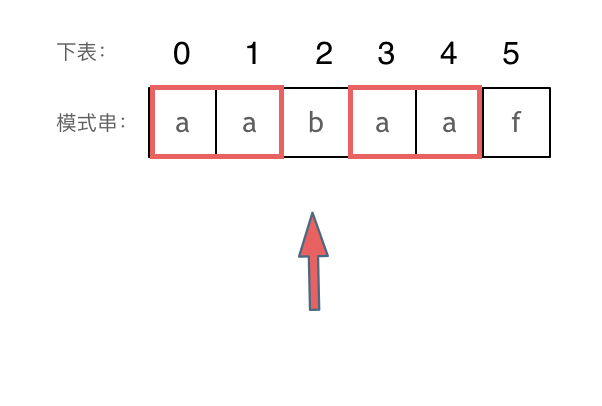

以下这句话，对于理解为什么使用前缀表可以告诉我们匹配失败之后跳到哪里重新匹配 非常重要！

**下标5之前这部分的字符串（也就是字符串aabaa）的最长相等的前缀 和 后缀字符串是 子字符串aa ，因为找到了最长相等的前缀和后缀，匹配失败的位置是后缀子串的后面，那么我们找到与其相同的前缀的后面重新匹配就可以了。**

所以前缀表具有告诉我们当前位置匹配失败，跳到之前已经匹配过的地方的能力。

**很多介绍KMP的文章或者视频并没有把为什么要用前缀表？这个问题说清楚，而是直接默认使用前缀表。**

### 如何计算前缀表

接下来就要说一说怎么计算前缀表。

如图：


长度为前1个字符的子串`a`，最长相同前后缀的长度为0。（注意字符串的**前缀是指不包含最后一个字符的所有以第一个字符开头的连续子串**；**后缀是指不包含第一个字符的所有以最后一个字符结尾的连续子串**。）


长度为前2个字符的子串`aa`，最长相同前后缀的长度为1。


长度为前3个字符的子串`aab`，最长相同前后缀的长度为0。

以此类推： 长度为前4个字符的子串`aaba`，最长相同前后缀的长度为1。 长度为前5个字符的子串`aabaa`，最长相同前后缀的长度为2。 长度为前6个字符的子串`aabaaf`，最长相同前后缀的长度为0。

那么把求得的最长相同前后缀的长度就是对应前缀表的元素，如图： 

可以看出模式串与前缀表对应位置的数字表示的就是：**下标i之前（包括i）的字符串中，有多大长度的相同前缀后缀。**

再来看一下如何利用 前缀表找到 当字符不匹配的时候应该指针应该移动的位置。如动画所示：


找到的不匹配的位置， 那么此时我们要看它的前一个字符的前缀表的数值是多少。

为什么要前一个字符的前缀表的数值呢，因为要找前面字符串的最长相同的前缀和后缀。

所以要看前一位的 前缀表的数值。

前一个字符的前缀表的数值是2， 所以把下标移动到下标2的位置继续比配。 可以再反复看一下上面的动画。

最后就在文本串中找到了和模式串匹配的子串了。

### 前缀表与next数组

很多KMP算法的实现都是使用next数组来做回退操作，那么next数组与前缀表有什么关系呢？

next数组就可以是前缀表，但是很多实现都是把前缀表统一减一（右移一位，初始位置为-1）之后作为next数组。

为什么这么做呢，其实也是很多文章视频没有解释清楚的地方。

其实**这并不涉及到KMP的原理，而是具体实现，next数组既可以就是前缀表，也可以是前缀表统一减一（右移一位，初始位置为-1）。**

后面我会提供两种不同的实现代码，大家就明白了。

### 使用next数组来匹配

**以下我们以前缀表统一减一之后的next数组来做演示**。

有了next数组，就可以根据next数组来 匹配文本串s，和模式串t了。

注意next数组是新前缀表（旧前缀表统一减一了）。

匹配过程动画如下：


### 时间复杂度分析

其中n为文本串长度，m为模式串长度，因为在匹配的过程中，根据前缀表不断调整匹配的位置，可以看出匹配的过程是O(n)，之前还要单独生成next数组，时间复杂度是O(m)。所以整个KMP算法的时间复杂度是O(n+m)的。

暴力的解法显而易见是O(n × m)，所以**KMP在字符串匹配中极大地提高了搜索的效率。**

为了和力扣题目28.实现strStr保持一致，方便大家理解，以下文章统称haystack为文本串, needle为模式串。

都知道使用KMP算法，一定要构造next数组。

### 构造next数组

我们定义一个函数getNext来构建next数组，函数参数为指向next数组的指针，和一个字符串。 代码如下：

```text
void getNext(int* next, const string& s)
```

**构造next数组其实就是计算模式串s，前缀表的过程。** 主要有如下三步：

1. 初始化
2. 处理前后缀不相同的情况
3. 处理前后缀相同的情况

接下来我们详解一下。

1. 初始化：

定义两个指针i和j，j指向前缀末尾位置，i指向后缀末尾位置。

然后还要对next数组进行初始化赋值，如下：

```cpp
int j = -1;
next[0] = j;
```

j 为什么要初始化为 -1呢，因为之前说过 前缀表要统一减一的操作仅仅是其中的一种实现，我们这里选择j初始化为-1，下文我还会给出j不初始化为-1的实现代码。

next[i] 表示 i（包括i）之前最长相等的前后缀长度（其实就是j）

所以初始化next[0] = j 。

1. 处理前后缀不相同的情况

因为j初始化为-1，那么i就从1开始，进行s[i] 与 s[j+1]的比较。

所以遍历模式串s的循环下标i 要从 1开始，代码如下：

```cpp
for (int i = 1; i < s.size(); i++) {
```

如果 s[i] 与 s[j+1]不相同，也就是遇到 前后缀末尾不相同的情况，就要向前回退。

怎么回退呢？

next[j]就是记录着j（包括j）之前的子串的相同前后缀的长度。

那么 s[i] 与 s[j+1] 不相同，就要找 j+1前一个元素在next数组里的值（就是next[j]）。

所以，处理前后缀不相同的情况代码如下：

```cpp
while (j >= 0 && s[i] != s[j + 1]) { // 前后缀不相同了
    j = next[j]; // 向前回退
}
```

1. 处理前后缀相同的情况

如果 s[i] 与 s[j + 1] 相同，那么就同时向后移动i 和j 说明找到了相同的前后缀，同时还要将j（前缀的长度）赋给next[i], 因为next[i]要记录相同前后缀的长度。

代码如下：

```text
if (s[i] == s[j + 1]) { // 找到相同的前后缀
    j++;
}
next[i] = j;
```

最后整体构建next数组的函数代码如下：

```cpp
void getNext(int* next, const string& s){
    int j = -1;
    next[0] = j;
    for(int i = 1; i < s.size(); i++) { // 注意i从1开始
        while (j >= 0 && s[i] != s[j + 1]) { // 前后缀不相同了
            j = next[j]; // 向前回退
        }
        if (s[i] == s[j + 1]) { // 找到相同的前后缀
            j++;
        }
        next[i] = j; // 将j（前缀的长度）赋给next[i]
    }
}
```

代码构造next数组的逻辑流程动画如下：


得到了next数组之后，就要用这个来做匹配了。

### 使用next数组来做匹配

在文本串s里 找是否出现过模式串t。

定义两个下标j 指向模式串起始位置，i指向文本串起始位置。

那么j初始值依然为-1，为什么呢？ **依然因为next数组里记录的起始位置为-1。**

i就从0开始，遍历文本串，代码如下：

```cpp
for (int i = 0; i < s.size(); i++) 
```

接下来就是 s[i] 与 t[j + 1] （因为j从-1开始的） 进行比较。

如果 s[i] 与 t[j + 1] 不相同，j就要从next数组里寻找下一个匹配的位置。

代码如下：

```cpp
while(j >= 0 && s[i] != t[j + 1]) {
    j = next[j];
}
```

如果 s[i] 与 t[j + 1] 相同，那么i 和 j 同时向后移动， 代码如下：

```cpp
if (s[i] == t[j + 1]) {
    j++; // i的增加在for循环里
}
```

如何判断在文本串s里出现了模式串t呢，如果j指向了模式串t的末尾，那么就说明模式串t完全匹配文本串s里的某个子串了。

本题要在文本串字符串中找出模式串出现的第一个位置 (从0开始)，所以返回当前在文本串匹配模式串的位置i 减去 模式串的长度，就是文本串字符串中出现模式串的第一个位置。

代码如下：

```cpp
if (j == (t.size() - 1) ) {
    return (i - t.size() + 1);
}
```

那么使用next数组，用模式串匹配文本串的整体代码如下：

```cpp
int j = -1; // 因为next数组里记录的起始位置为-1
for (int i = 0; i < s.size(); i++) { // 注意i就从0开始
    while(j >= 0 && s[i] != t[j + 1]) { // 不匹配
        j = next[j]; // j 寻找之前匹配的位置
    }
    if (s[i] == t[j + 1]) { // 匹配，j和i同时向后移动
        j++; // i的增加在for循环里
    }
    if (j == (t.size() - 1) ) { // 文本串s里出现了模式串t
        return (i - t.size() + 1);
    }
}
```

此时所有逻辑的代码都已经写出来了，力扣 28.实现strStr 题目的整体代码如下：

### 前缀表统一减一 C++代码实现

```cpp
class Solution {
public:
    void getNext(int* next, const string& s) {
        int j = -1;
        next[0] = j;
        for(int i = 1; i < s.size(); i++) { // 注意i从1开始
            while (j >= 0 && s[i] != s[j + 1]) { // 前后缀不相同了
                j = next[j]; // 向前回退
            }
            if (s[i] == s[j + 1]) { // 找到相同的前后缀
                j++;
            }
            next[i] = j; // 将j（前缀的长度）赋给next[i]
        }
    }
    int strStr(string haystack, string needle) {
        if (needle.size() == 0) {
            return 0;
        }
		vector<int> next(needle.size());
		getNext(&next[0], needle);
        int j = -1; // // 因为next数组里记录的起始位置为-1
        for (int i = 0; i < haystack.size(); i++) { // 注意i就从0开始
            while(j >= 0 && haystack[i] != needle[j + 1]) { // 不匹配
                j = next[j]; // j 寻找之前匹配的位置
            }
            if (haystack[i] == needle[j + 1]) { // 匹配，j和i同时向后移动
                j++; // i的增加在for循环里
            }
            if (j == (needle.size() - 1) ) { // 文本串s里出现了模式串t
                return (i - needle.size() + 1);
            }
        }
        return -1;
    }
};
```

- 时间复杂度: O(n + m)
- 空间复杂度: O(m), 只需要保存字符串needle的前缀表

### 前缀表（不减一）C++实现

那么前缀表就不减一了，也不右移的，到底行不行呢？

**行！**

我之前说过，这仅仅是KMP算法实现上的问题，如果就直接使用前缀表可以换一种回退方式，找j=next[j-1] 来进行回退。

主要就是j=next[x]这一步最为关键！

我给出的getNext的实现为：（前缀表统一减一）

```cpp
void getNext(int* next, const string& s) {
    int j = -1;
    next[0] = j;
    for(int i = 1; i < s.size(); i++) { // 注意i从1开始
        while (j >= 0 && s[i] != s[j + 1]) { // 前后缀不相同了
            j = next[j]; // 向前回退
        }
        if (s[i] == s[j + 1]) { // 找到相同的前后缀
            j++;
        }
        next[i] = j; // 将j（前缀的长度）赋给next[i]
    }
}
```

此时如果输入的模式串为aabaaf，对应的next为-1 0 -1 0 1 -1。

这里j和next[0]初始化为-1，整个next数组是以 前缀表减一之后的效果来构建的。

那么前缀表不减一来构建next数组，代码如下：

```cpp
    void getNext(int* next, const string& s) {
        int j = 0;
        next[0] = 0;
        for(int i = 1; i < s.size(); i++) {
            while (j > 0 && s[i] != s[j]) { // j要保证大于0，因为下面有取j-1作为数组下标的操作
                j = next[j - 1]; // 注意这里，是要找前一位的对应的回退位置了
            }
            if (s[i] == s[j]) {
                j++;
            }
            next[i] = j;
        }
    }
```

此时如果输入的模式串为aabaaf，对应的next为 0 1 0 1 2 0，（其实这就是前缀表的数值了）。

那么用这样的next数组也可以用来做匹配，代码要有所改动。

实现代码如下：

```cpp
class Solution {
public:
    void getNext(int* next, const string& s) {
        int j = 0;
        next[0] = 0;
        for(int i = 1; i < s.size(); i++) {
            while (j > 0 && s[i] != s[j]) {
                j = next[j - 1];
            }
            if (s[i] == s[j]) {
                j++;
            }
            next[i] = j;
        }
    }
    int strStr(string haystack, string needle) {
        if (needle.size() == 0) {
            return 0;
        }
        vector<int> next(needle.size());
        getNext(&next[0], needle);
        int j = 0;
        for (int i = 0; i < haystack.size(); i++) {
            while(j > 0 && haystack[i] != needle[j]) {
                j = next[j - 1];
            }
            if (haystack[i] == needle[j]) {
                j++;
            }
            if (j == needle.size() ) {
                return (i - needle.size() + 1);
            }
        }
        return -1;
    }
};
```

- 时间复杂度: O(n + m)
- 空间复杂度: O(m)


### Java代码

```java
/**
 * 28.找出字符串中第一个匹配项的下标
 */
public class LeetCode28 {
    public static void main(String[] args) {
        System.out.println(strStr("hello", "ll"));
    }


    public static int strStr(String haystack, String needle) {
        /**
         * 正确思路：KMP算法
         * 这个KMP算法挺抽象的，具体的算法讲解见笔记或资料。
         * 首先先构造needle的next数组，next数组就是模式串needle的每个字符对应的最长公共前后缀长度
         * 构造完next数组后就可以让haystack与needle进行比对
         * 定义两个指针，i指向haystack，j指向needle
         * 如果i，j指向的字符相同，i++ j++
         * 如果不同就根据j对应的next数组的值，让j回退到next数组指向的位置
         * 就这样一直比对
         * 直到j指向needle的末尾，说明成功匹配
         * 或者i指向haystack的末尾，但如果此时j没有指向needle的末尾，说明没有找到
         */

        //构造next数组，这是难点，next数组表示的就是当前位置的前面字符串的最长公共前后缀
        int[] next = new int[needle.length()];
        //初始化next数组
        next[0] = 0;          //开头第一个字符的最长公共前后缀长度为0
        int j = 0;            //j表示前缀字符串的末尾
        //i表示后缀字符串的末尾
        for (int i = 1; i < needle.length(); i++) {
            while (j > 0 && needle.charAt(i) != needle.charAt(j)) {
                //如果前后缀不匹配就回退
                j = next[j-1];
            }
            if (needle.charAt(i) == needle.charAt(j)) {
                //如果匹配成功，两个指针同时向前移动
                j++;
            }
            next[i] = j;
        }

        //构造完next数组后就可以使用next数组来匹配文本串haystack和模式串needle了
        //i指向haystack，j指向needle

        j = 0;
        for (int i = 0; i <haystack.length(); i++) {
            while(j>0&&haystack.charAt(i)!=needle.charAt(j)){
                j=next[j-1];
            }
            if(haystack.charAt(i)==needle.charAt(j)){
                j++;
            }
            if(j>=needle.length()){
                return i-needle.length()+1;
            }

        }
        return -1;
    }


    public int strStr_My(String haystack, String needle) {
        /**
         * 我的思路：双指针，该思路无法全部通过
         * 一个指针h指向haystack，另一个指针n指向needle
         * 如果h和n指向的字符相同，则h和n同时移动，否则n重新指向needle的开头
         * 直到h超出haystack的长度或n超出needle的长度
         * 如果h超出haystack的长度的同时n没有超出needle的长度说明haystack中不存在needle，返回-1
         * 如果n超出needle的长度说明haystack中存在needle，返回(h-needle的长度)。
         *
         */

        int h = 0;
        int n = 0;
        while (h < haystack.length() && n < needle.length()) {
            if (haystack.charAt(h) == needle.charAt(n)) {
                h++;
                n++;
            } else {
                h++;
                n = 0;
            }
        }
        if (h >= haystack.length() && n < needle.length()) {
            return -1;
        }

        return h - needle.length();
    }
}
```


## 7.重复的子字符串

### 题目

[力扣题目链接](https://leetcode.cn/problems/repeated-substring-pattern/)

给定一个非空的字符串，判断它是否可以由它的一个子串重复多次构成。给定的字符串只含有小写英文字母，并且长度不超过10000。

示例 1:

- 输入: "abab"
- 输出: True
- 解释: 可由子字符串 "ab" 重复两次构成。

示例 2:

- 输入: "aba"
- 输出: False

示例 3:

- 输入: "abcabcabcabc"
- 输出: True
- 解释: 可由子字符串 "abc" 重复四次构成。 (或者子字符串 "abcabc" 重复两次构成。）


### 思路

这题的思路也略显复杂（很有收获），直接贴资料的思路解释。

暴力的解法， 就是一个for循环获取 子串的终止位置， 然后判断子串是否能重复构成字符串，又嵌套一个for循环，所以是O(n^2)的时间复杂度。

有的同学可以想，怎么一个for循环就可以获取子串吗？ 至少得一个for获取子串起始位置，一个for获取子串结束位置吧。

其实我们只需要判断，以第一个字母为开始的子串就可以，所以一个for循环获取子串的终止位置就行了。 而且遍历的时候 都不用遍历结束，只需要遍历到中间位置，因为子串结束位置大于中间位置的话，一定不能重复组成字符串。

暴力的解法，这里就不详细讲解了。

主要讲一讲移动匹配 和 KMP两种方法。

### [#](https://programmercarl.com/0459.重复的子字符串.html#移动匹配)移动匹配

当一个字符串s：abcabc，内部由重复的子串组成，那么这个字符串的结构一定是这样的：

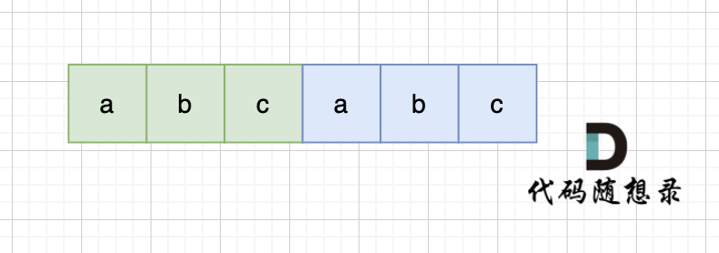

也就是由前后相同的子串组成。

那么既然前面有相同的子串，后面有相同的子串，用 s + s，这样组成的字符串中，后面的子串做前串，前面的子串做后串，就一定还能组成一个s，如图：


当然，我们在判断 s + s 拼接的字符串里是否出现一个s的的时候，**要刨除 s + s 的首字符和尾字符**，这样避免在s+s中搜索出原来的s，我们要搜索的是中间拼接出来的s。

以上证明的充分性，接下来证明必要性：

如果有一个字符串s，在 s + s 拼接后， 不算首尾字符，如果能凑成s字符串，说明s 一定是重复子串组成。

如图，字符串s，图中数字为数组下标，在 s + s 拼接后， 不算首尾字符，中间凑成s字符串。 （图中数字为数组下标）


图中，因为中间拼接成了s，根据红色框 可以知道 s[4] = s[0]， s[5] = s[1]， s[0] = s[2], s[1] = s[3] s[2] = s[4] ,s[3] = s[5]


以上相等关系我们串联一下：

s[4] = s[0] = s[2]

s[5] = s[1] = s[3]

即：s[4],s[5] = s[0],s[1] = s[2],s[3]

**说明这个字符串，是由 两个字符 s[0] 和 s[1] 重复组成的**！

这里可以有录友想，凭什么就是这样组成的s呢，我换一个方式组成s 行不行，如图：


s[3] = s[0]，s[4] = s[1] ，s[5] = s[2]，s[0] = s[3]，s[1] = s[4]，s[2] = s[5]

以上相等关系串联：

s[3] = s[0]

s[1] = s[4]

s[2] = s[5]

s[0] s[1] s[2] = s[3] s[4] s[5]

和以上推导过程一样，最后可以推导出，这个字符串是由 s[0] ，s[1] ，s[2] 重复组成。

如果是这样的呢，如图：


s[1] = s[0]，s[2] = s[1] ，s[3] = s[2]，s[4] = s[3]，s[5] = s[4]，s[0] = s[5]

以上相等关系串联

s[0] = s[1] = s[2] = s[3] = s[4] = s[5]

最后可以推导出，这个字符串是由 s[0] 重复组成。

以上 充分和必要性都证明了，所以判断字符串s是否由重复子串组成，只要两个s拼接在一起，里面还出现一个s的话，就说明是由重复子串组成。

代码如下：

```cpp
class Solution {
public:
    bool repeatedSubstringPattern(string s) {
        string t = s + s;
        t.erase(t.begin()); t.erase(t.end() - 1); // 掐头去尾
        if (t.find(s) != std::string::npos) return true; // r
        return false;
    }
};
```

1
2
3
4
5
6
7
8
9

- 时间复杂度: O(n)
- 空间复杂度: O(1)

不过这种解法还有一个问题，就是 我们最终还是要判断 一个字符串（s + s）是否出现过 s 的过程，大家可能直接用contains，find 之类的库函数， 却忽略了实现这些函数的时间复杂度（暴力解法是m * n，一般库函数实现为 O(m + n)）。

如果我们做过 [28.实现strStr (opens new window)](https://programmercarl.com/0028.实现strStr.html)题目的话，其实就知道，**实现一个 高效的算法来判断 一个字符串中是否出现另一个字符串是很复杂的**，这里就涉及到了KMP算法。

### [#](https://programmercarl.com/0459.重复的子字符串.html#kmp)KMP

#### [#](https://programmercarl.com/0459.重复的子字符串.html#为什么会使用kmp)为什么会使用KMP

以下使用KMP方式讲解，强烈建议大家先把以下两个视频看了，理解KMP算法，再来看下面讲解，否则会很懵。

- [视频讲解版：帮你把KMP算法学个通透！（理论篇）](https://www.bilibili.com/video/BV1PD4y1o7nd/)
- [视频讲解版：帮你把KMP算法学个通透！（求next数组代码篇）](https://www.bilibili.com/video/BV1M5411j7Xx)
- [文字讲解版：KMP算法(opens new window)](https://programmercarl.com/0028.实现strStr.html)

在一个串中查找是否出现过另一个串，这是KMP的看家本领。那么寻找重复子串怎么也涉及到KMP算法了呢？

KMP算法中next数组为什么遇到字符不匹配的时候可以找到上一个匹配过的位置继续匹配，靠的是有计算好的前缀表。

前缀表里，统计了各个位置为终点字符串的最长相同前后缀的长度。

那么 最长相同前后缀和重复子串的关系又有什么关系呢。

可能很多录友又忘了 前缀和后缀的定义，再回顾一下：

- 前缀是指不包含最后一个字符的所有以第一个字符开头的连续子串；
- 后缀是指不包含第一个字符的所有以最后一个字符结尾的连续子串

#### [#](https://programmercarl.com/0459.重复的子字符串.html#充分性证明)充分性证明

如果一个字符串s是由重复子串组成，那么 最长相等前后缀不包含的子串一定是字符串s的最小重复子串。

如果s 是由最小重复子串p组成，即 s = n * p

那么相同前后缀可以是这样：


也可以是这样：


最长的相等前后缀，也就是这样：


这里有录友就想：如果字符串s 是由最小重复子串p组成，最长相等前后缀就不能更长一些？ 例如这样：


如果这样的话，因为前后缀要相同，所以 p2 = p1，p3 = p2，如图：


p2 = p1，p3 = p2 即： p1 = p2 = p3

说明 p = p1 * 3。

这样p 就不是最小重复子串了，不符合我们定义的条件。

所以，**如果这个字符串s是由重复子串组成，那么最长相等前后缀不包含的子串是字符串s的最小重复子串**。

#### [#](https://programmercarl.com/0459.重复的子字符串.html#必要性证明)必要性证明

以上是充分性证明，以下是必要性证明：

**如果 最长相等前后缀不包含的子串是字符串s的最小重复子串， 那么字符串s一定由重复子串组成吗**？

最长相等前后缀不包含的子串已经是字符串s的最小重复子串，那么字符串s一定由重复子串组成，这个不需要证明了。

关键是要证明：最长相等前后缀不包含的子串什么时候才是字符串s的最小重复子串呢。

情况一， 最长相等前后缀不包含的子串的长度 比 字符串s的一半的长度还大，那一定不是字符串s的重复子串，如图：


图中：前后缀不包含的子串的长度 大于 字符串s的长度的 二分之一

------

情况二，最长相等前后缀不包含的子串的长度 可以被 字符串s的长度整除，如图：


步骤一：因为 这是相等的前缀和后缀，t[0] 与 k[0]相同， t[1] 与 k[1]相同，所以 s[0] 一定和 s[2]相同，s[1] 一定和 s[3]相同，即：，s[0]s[1]与s[2]s[3]相同 。

步骤二： 因为在同一个字符串位置，所以 t[2] 与 k[0]相同，t[3] 与 k[1]相同。

步骤三： 因为 这是相等的前缀和后缀，t[2] 与 k[2]相同 ，t[3]与k[3] 相同，所以，s[2]一定和s[4]相同，s[3]一定和s[5]相同，即：s[2]s[3] 与 s[4]s[5]相同。

步骤四：循环往复。

所以字符串s，s[0]s[1]与s[2]s[3]相同， s[2]s[3] 与 s[4]s[5]相同，s[4]s[5] 与 s[6]s[7] 相同。

可以推出，在由重复子串组成的字符串中，最长相等前后缀不包含的子串就是最小重复子串。

即 s[0]s[1] 是最小重复子串

以上推导中，录友可能想，你怎么知道 s[0] 和 s[1] 就不相同呢？ s[0] 为什么就不能是最小重复子串。

如果 s[0] 和 s[1] 也相同，同时 s[0]s[1]与s[2]s[3]相同，s[2]s[3] 与 s[4]s[5]相同，s[4]s[5] 与 s[6]s[7] 相同，那么这个字符串就是有一个字符构成的字符串。

那么它的最长相同前后缀，就不是上图中的前后缀，而是这样的的前后缀：


录友可能再问，由一个字符组成的字符串，最长相等前后缀凭什么就是这样的。

有这种疑惑的录友，就是还不知道 最长相等前后缀 是怎么算的。

可以看这里：[KMP讲解 (opens new window)](https://programmercarl.com/0028.实现strStr.html)，再去回顾一下。

或者说，自己举个例子，`aaaaaa`，这个字符串，他的最长相等前后缀是什么？

同上以上推导，最长相等前后缀不包含的子串的长度只要被 字符串s的长度整除，最长相等前后缀不包含的子串一定是最小重复子串。

------

**情况三，最长相等前后缀不包含的子串的长度 不被 字符串s的长度整除得情况**，如图：


步骤一：因为 这是相等的前缀和后缀，t[0] 与 k[0]相同， t[1] 与 k[1]相同，t[2] 与 k[2]相同。

所以 s[0] 与 s[3]相同，s[1] 与 s[4]相同，s[2] 与s[5]，即：，s[0]s[1]与s[2]s[3]相同 。

步骤二： 因为在同一个字符串位置，所以 t[3] 与 k[0]相同，t[4] 与 k[1]相同。

步骤三： 因为 这是相等的前缀和后缀，t[3] 与 k[3]相同 ，t[4]与k[5] 相同，所以，s[3]一定和s[6]相同，s[4]一定和s[7]相同，即：s[3]s[4] 与 s[6]s[7]相同。

以上推导，可以得出 s[0],s[1],s[2] 与 s[3],s[4],s[5] 相同，s[3]s[4] 与 s[6]s[7]相同。

那么 最长相等前后缀不包含的子串的长度 不被 字符串s的长度整除 ，最长相等前后缀不包含的子串就不是s的重复子串

------

充分条件：如果字符串s是由重复子串组成，那么 最长相等前后缀不包含的子串 一定是 s的最小重复子串。

必要条件：如果字符串s的最长相等前后缀不包含的子串 是 s最小重复子串，那么 s是由重复子串组成。

在必要条件，这个是 显而易见的，都已经假设 最长相等前后缀不包含的子串 是 s的最小重复子串了，那s必然是重复子串。

**关键是需要证明， 字符串s的最长相等前后缀不包含的子串 什么时候才是 s最小重复子串**。

同上我们证明了，当 最长相等前后缀不包含的子串的长度 可以被 字符串s的长度整除，那么不包含的子串 就是s的最小重复子串。


最后我根据思路自己写的代码如下

```java
//459.重复的子字符串
public class LeetCode459 {

    public static void main(String[] args) {
        System.out.println(repeatedSubstringPattern("ababac"));
    }
    public static boolean repeatedSubstringPattern(String s) {
        /**
         * 思路：
         * 一个字串如果是由重复字串组成，那么其最长相等前后缀所不包含的字串一定是重复的字串
         * 因此我们就去计算s的最长相等前后缀，此时不被包含的子串l与最长相等前后缀的关系有以下三种情况：
         * 1.不被包含的子串长度大于字符串s的一半，说明s不可能由重复字符串组成
         * 2.不被包含的子串长度刚好能够整除最长相等前后缀的长度，说明s由重复子串组成，且重复子串为不被包含的子串l
         * 3.不被包含的子串长度不能够整除最长相等前后缀的长度，说明s不是由重复子串组成。
         */

        int[] next = new int[s.length()];
        //获取字符串s的next数组
        getNext(next, s);
        //获取字符串s的最长前后缀长度
        //Arrays.sort(next);
        int max = next[s.length()-1];
        if((s.length()-max)>s.length()/2){
            //情况1
            return false;
        }else if(max%(s.length()-max)==0){
            //情况2
            return true;
        }
        //情况3
        return false;

    }

    public static void getNext(int[] next, String s) {
        //求s的next数组
        //初始化
        next[0] = 0;
        //j指向前缀末尾
        int j = 0;
        //i指向后缀末尾
        for (int i = 1; i < s.length(); i++) {
            while (j > 0 && s.charAt(i) != s.charAt(j)) {
                j=next[j-1];
            }
            if(s.charAt(j)==s.charAt(i)){
                j++;
            }
            next[i]=j;
        }
    }
}
```


# 栈与队列

## 2.用栈实现队列

### 题目

[力扣题目链接](https://leetcode.cn/problems/implement-queue-using-stacks/)

使用栈实现队列的下列操作：

push(x) -- 将一个元素放入队列的尾部。
pop() -- 从队列首部移除元素。
peek() -- 返回队列首部的元素。
empty() -- 返回队列是否为空。

示例:

```cpp
MyQueue queue = new MyQueue();
queue.push(1);
queue.push(2);
queue.peek();  // 返回 1
queue.pop();   // 返回 1
queue.empty(); // 返回 false
```

说明:

- 你只能使用标准的栈操作 -- 也就是只有 push to top, peek/pop from top, size, 和 is empty 操作是合法的。
- 你所使用的语言也许不支持栈。你可以使用 list 或者 deque（双端队列）来模拟一个栈，只要是标准的栈操作即可。
- 假设所有操作都是有效的 （例如，一个空的队列不会调用 pop 或者 peek 操作）。


### 思路

使用两个栈来模拟队列，一个栈作为输入栈`stackIn`，另一个栈作为输出栈`stackOut`。

队列的push操作就是向输入栈进行push操作

队列的pop和peek操作就是向输出栈进行pop和peek操作。如果输出栈为空需要将输入栈的数据倒入输出栈

队列的empty判断是否为空就是判断输入栈和输出栈是否为空，如果两个栈都为空说明队列为空

```java
//232.用栈实现队列
public class LeetCode232 {
    /**
     * 本题不涉及什么算法，主要要熟悉掌握队列和栈这个数据结构的使用
     */
}

class MyQueue {

    //输入栈
    private Stack<Integer> stackIn;
    //输出栈
    private Stack<Integer> stackOut;

    public MyQueue() {
        stackIn = new Stack<>();
        stackOut = new Stack<>();
    }

    public void push(int x) {
        stackIn.push(x);
    }

    public int pop() {
        //首先要确定输出栈是否为空，不为空才能弹出栈顶元素，为空需要将输入栈内容全部倒入输出栈
        dumpStackIn();
        return stackOut.pop();
    }

    public int peek() {
        dumpStackIn();
        return stackOut.peek();
    }

    public boolean empty() {
        return stackIn.isEmpty()&&stackOut.isEmpty();
    }

    private void dumpStackIn() {
        if(!stackOut.isEmpty()){
            return;
        }else{
            while(!stackIn.isEmpty()){
                stackOut.push(stackIn.pop());
            }
        }

    }
}
```


## 3.用队列实现栈

### 题目

[力扣题目链接](https://leetcode.cn/problems/implement-stack-using-queues/)

使用队列实现栈的下列操作：

- push(x) -- 元素 x 入栈
- pop() -- 移除栈顶元素
- top() -- 获取栈顶元素
- empty() -- 返回栈是否为空

注意:

- 你只能使用队列的基本操作-- 也就是 push to back, peek/pop from front, size, 和 is empty 这些操作是合法的。
- 你所使用的语言也许不支持队列。 你可以使用 list 或者 deque（双端队列）来模拟一个队列 , 只要是标准的队列操作即可。
- 你可以假设所有操作都是有效的（例如, 对一个空的栈不会调用 pop 或者 top 操作）。


### 思路

```
思路：
这里不能像用两个栈实现队列那样，一个作为输入队列，另一个作为输出队列
因为将一个队列中的元素倒到另一个队列中实际上元素的顺序还是没变。
这里的真正做法是将一个队列作为另一个队列的备份队列，比如队列1用来接收输入的元素
当栈要弹出栈顶的元素时，就先将队列1队列尾部前的所有元素备份到队列2，然后弹出队列1的尾部元素
弹出完成后就将队列2备份的元素重新放回队列1
```

```java
//225.用队列实现栈
public class LeetCode225 {
    public static void main(String[] args) {
        MyStack stack = new MyStack();
        stack.push(1);
        stack.push(2);
        stack.push(3);
        System.out.println(stack.top());
//        System.out.println(stack.pop());
//        System.out.println(stack.empty());
    }
}

class MyStack {
    /**
     * 思路：
     * 这里不能像用两个栈实现队列那样，一个作为输入队列，另一个作为输出队列
     * 因为将一个队列中的元素倒到另一个队列中实际上元素的顺序还是没变。
     * 这里的真正做法是将一个队列作为另一个队列的备份队列，比如队列1用来接收输入的元素
     * 当栈要弹出栈顶的元素时，就先将队列1队列尾部前的所有元素备份到队列2，然后弹出队列1的尾部元素
     * 弹出完成后就将队列2备份的元素重新放回队列1
     */

    //主队列
    private Queue<Integer> mainQueue;
    //备份队列
    private Queue<Integer> backupQueue;

    public MyStack() {
        mainQueue = new ArrayDeque<>();
        backupQueue= new ArrayDeque<>();
    }

    public void push(int x) {
        mainQueue.add(x);
    }

    public int pop() {
        backup();
        Integer poll = mainQueue.poll();
        load();
        return poll;
    }

    public int top() {
        backup();
        Integer peek = mainQueue.peek();
        load();
        return peek;
    }

    public boolean empty() {
        return mainQueue.isEmpty();
    }

    /**
     * 将主队列尾部前的元素备份到备份队列
     */
    private void backup(){
        int size = mainQueue.size();
        //这里踩了一个坑，由于mainQueue的长度每次循环后都会-1，因此如果在for循环中一直用size方法来获取长度，那这个长度就不是第一次获取的长度了，它会一直变小，导致中间有些元素没有被备份到备份队列中
//        for (int i = 0; i <mainQueue.size()-1; i++) {
        for (int i = 0; i < size-1; i++) {
            backupQueue.add(mainQueue.poll());
        }
    }

    /**
     * 将备份队列的元素重新加载到主队列
     */
    private void load(){
        Queue<Integer> tmp;
        if(mainQueue.isEmpty()){
            tmp = mainQueue;
            mainQueue = backupQueue;
            backupQueue = tmp;
        }else {
            backupQueue.add(mainQueue.poll());
            tmp = mainQueue;
            mainQueue = backupQueue;
            backupQueue = tmp;
        }
    }
}
```


## 4.有效的括号

### 题目

[力扣题目链接](https://leetcode.cn/problems/valid-parentheses/)

给定一个只包括 '('，')'，'{'，'}'，'['，']' 的字符串，判断字符串是否有效。

有效字符串需满足：

- 左括号必须用相同类型的右括号闭合。
- 左括号必须以正确的顺序闭合。
- 注意空字符串可被认为是有效字符串。

示例 1:

- 输入: "()"
- 输出: true

示例 2:

- 输入: "()[]{}"
- 输出: true

示例 3:

- 输入: "(]"
- 输出: false

示例 4:

- 输入: "([)]"
- 输出: false

示例 5:

- 输入: "{[]}"
- 输出: true


### 思路

```
思路：栈的经典应用
遍历字符串s
如果是左括号就入栈
如果是普通字符就不管
如果是右括号就弹出栈顶元素
然后将栈顶元素与当前遍历到的元素比较
判断字符串无效有如下3种情况：
1.遍历过程中弹出的栈顶元素与当前元素不匹配，说明字符串无效
2.遍历过程中栈为空，说明右括号多余了，字符串无效
3.遍历完后，栈中还有元素，说明左括号多余了，字符串无效
判断字符串有效的情况：
遍历完字符串且栈元素为空

但是这里有个技巧
与原本不同，原本是遇到左括号就将其入栈，现在是遇到左括号就将其对应的右括号入栈
如：当前元素为'(' 就将')'入栈，当前元素为'['就将']'入栈
这样的好处就是在遍历到右括号时可以直接比较当前元素与栈顶元素是否相等，如果相等说明匹配成功，不相等说明匹配失败。
代码会好写很多
```

```java
//20.有效的括号
public class LeetCode20 {

    public boolean isValid(String s) {
        /**
         * 思路与下面的一样，但是这里是技巧版的
         * 与原本不同，原本是遇到左括号就将其入栈，现在是遇到左括号就将其对应的右括号入栈
         * 如：当前元素为'(' 就将')'入栈，当前元素为'['就将']'入栈
         * 这样的好处就是在遍历到右括号时可以直接比较当前元素与栈顶元素是否相等，如果相等说明匹配成功，不相等说明匹配失败。
         * 代码会好写很多
         */
        Stack<Character> stack = new Stack<>();
        for (int i = 0; i < s.length(); i++) {
            char c = s.charAt(i);
            //遍历到左括号时直接将其对应的右括号入栈
            if(c=='('){
                stack.push(')');
            }else if(c=='['){
                stack.push(']');
            }else if(c=='{'){
                stack.push('}');
            }

            //遍历到右括号时直接然其与栈顶元素比较
            if(c==')'||c==']'||c=='}'){
                if(stack.isEmpty()){
                    return false;
                }
                if(c!=stack.pop()){
                    return false;
                }
            }
        }
        return stack.isEmpty();
    }

    public boolean isValid_My(String s) {
        /**
         * 思路：栈的经典应用
         * 遍历字符串s
         * 如果是左括号就入栈
         * 如果是普通字符就不管
         * 如果是右括号就弹出栈顶元素
         * 然后将栈顶元素与当前遍历到的元素比较
         * 判断字符串无效有如下3种情况：
         * 1.遍历过程中弹出的栈顶元素与当前元素不匹配，说明字符串无效
         * 2.遍历过程中栈为空，说明右括号多余了，字符串无效
         * 3.遍历完后，栈中还有元素，说明左括号多余了，字符串无效
         *
         * 判断字符串有效的情况：
         * 遍历完字符串且栈元素为空
         */
        Stack<Character> stack = new Stack<>();
        for (int i = 0; i < s.length(); i++) {
            Character c = s.charAt(i);
            if (c == '(' || c == '[' || c == '{') {
                stack.push(c);
            } else if (c == ')' || c == ']' || c == '}') {
                if (stack.isEmpty()) {
                    return false;
                }
                Character element = stack.pop();
                if (c == ')' && element != '(') {
                    return false;
                } else if (c == ']' && element != '[') {
                    return false;
                } else if (c == '}' && element != '{') {
                    return false;
                }
            }
        }
        if (!stack.isEmpty()) {
            //栈不为空，说明左括号多余了
            return false;
        }
        return true;
    }

}
```


## 5.删除字符串中的所有相邻重复项

### 题目

[力扣题目链接](https://leetcode.cn/problems/remove-all-adjacent-duplicates-in-string/)

给出由小写字母组成的字符串 S，重复项删除操作会选择两个相邻且相同的字母，并删除它们。

在 S 上反复执行重复项删除操作，直到无法继续删除。

在完成所有重复项删除操作后返回最终的字符串。答案保证唯一。

示例：

- 输入："abbaca"
- 输出："ca"
- 解释：例如，在 "abbaca" 中，我们可以删除 "bb" 由于两字母相邻且相同，这是此时唯一可以执行删除操作的重复项。之后我们得到字符串 "aaca"，其中又只有 "aa" 可以执行重复项删除操作，所以最后的字符串为 "ca"。

提示：

- 1 <= S.length <= 20000
- S 仅由小写英文字母组成。


### 思路

```
思路：
遍历字符串s，每遍历一个字符就将字符存入栈
如果当前字符与栈顶字符相同，则弹出栈顶元素
当遍历完字符串后，栈内剩余所有字符就是最终结果

小技巧：这里可以直接用字符串作为栈，省去了转换字符串的操作，耗时从原来的110ms变为了33ms
```

```java
//1047.删除字符串中的所有相邻重复项
public class LeetCode1047 {
    public static void main(String[] args) {
        System.out.println(removeDuplicates("abbaca"));
    }

    //耗时33ms
    public static String removeDuplicates(String s) {
        /**
         * 思路与下面一致，不过这里可以直接用字符串作为栈，省去了转换字符串的操作
         */
        StringBuffer result = new StringBuffer();
        //top代表result的最后一个字符的索引
        int top = -1;
        for (int i = 0; i < s.length(); i++) {
            char c = s.charAt(i);
            if(result.length()<=0||result.charAt(top)!=c){
                result.append(c);
                top++;
            }else if(result.charAt(top)==c){
                result.deleteCharAt(top);
                top--;
            }
        }
        return result.toString();
    }

    //耗时110ms
    public static String removeDuplicates_My(String s) {
        /**
         * 思路：
         * 遍历字符串s，每遍历一个字符就将字符存入栈
         * 如果当前字符与栈顶字符相同，则弹出栈顶元素
         * 当遍历完字符串后，栈内剩余所有字符就是最终结果
         */
        Stack<Character> stack = new Stack<>();
        for (int i = 0; i < s.length(); i++) {
            char c = s.charAt(i);
            if (stack.isEmpty() || stack.peek() != c) {
                stack.add(c);
            } else if (stack.peek() == c) {
                stack.pop();
            }
        }
        StringBuffer sb = new StringBuffer();
        while (!stack.isEmpty()) {
            sb.insert(0, stack.pop());
        }
        return sb.toString();
    }
}
```


## 6.逆波兰表达式求值

### 题目

[力扣题目链接](https://leetcode.cn/problems/evaluate-reverse-polish-notation/)

根据 逆波兰表示法，求表达式的值。

有效的运算符包括 + , - , * , / 。每个运算对象可以是整数，也可以是另一个逆波兰表达式。

说明：

整数除法只保留整数部分。 给定逆波兰表达式总是有效的。换句话说，表达式总会得出有效数值且不存在除数为 0 的情况。

示例 1：

- 输入: ["2", "1", "+", "3", " * "]
- 输出: 9
- 解释: 该算式转化为常见的中缀算术表达式为：((2 + 1) * 3) = 9

示例 2：

- 输入: ["4", "13", "5", "/", "+"]
- 输出: 6
- 解释: 该算式转化为常见的中缀算术表达式为：(4 + (13 / 5)) = 6

示例 3：

- 输入: ["10", "6", "9", "3", "+", "-11", " * ", "/", " * ", "17", "+", "5", "+"]

- 输出: 22

- 解释:该算式转化为常见的中缀算术表达式为：

  ```text
  ((10 * (6 / ((9 + 3) * -11))) + 17) + 5       
  = ((10 * (6 / (12 * -11))) + 17) + 5       
  = ((10 * (6 / -132)) + 17) + 5     
  = ((10 * 0) + 17) + 5     
  = (0 + 17) + 5    
  = 17 + 5    
  = 22    
  ```

逆波兰表达式：是一种后缀表达式，所谓后缀就是指运算符写在后面。

平常使用的算式则是一种中缀表达式，如 ( 1 + 2 ) * ( 3 + 4 ) 。

该算式的逆波兰表达式写法为 ( ( 1 2 + ) ( 3 4 + ) * ) 。

逆波兰表达式主要有以下两个优点：

- 去掉括号后表达式无歧义，上式即便写成 1 2 + 3 4 + * 也可以依据次序计算出正确结果。
- 适合用栈操作运算：遇到数字则入栈；遇到运算符则取出栈顶两个数字进行计算，并将结果压入栈中。


### 思路

```
思路：又一个栈的经典应用
遍历tokens中的每一个字符
如果当前字符为数字就直接压入栈中
如果当前字符为运算符，就从栈中弹出两个元素进行运算，然后将运算结果再压入栈中
当遍历完所有字符时，栈中剩下最后一个数字就是逆波兰表达式的结果
```

但是这里要特别学会使用Deque来代替Stack，因为Stack已经过时，Java官方也建议使用Deque来实现Stack，这部分内容也在`Java基础知识复习`笔记中更新，直接搜`Deque`


代码如下

```java
//150.逆波兰表达式求值
public class LeetCode150 {
    public static void main(String[] args) {
        System.out.println(evalRPN(new String[]{"4", "13", "5", "/", "+"}));
    }

    public static int evalRPN(String[] tokens) {
        /**
         * 思路：又一个栈的经典应用
         * 遍历tokens中的每一个字符
         * 如果当前字符为数字就直接压入栈中
         * 如果当前字符为运算符，就从栈中弹出两个元素进行运算，然后将运算结果再压入栈中
         * 当遍历完所有字符时，栈中剩下最后一个数字就是逆波兰表达式的结果
         */
        Deque<Integer> stack = new LinkedList<>();
        for (int i = 0; i < tokens.length; i++) {
            String exp3 = tokens[i];
            //注意先弹出的数字应该是作为减数和除数，后弹出的数组作为被减数和被除数
            if (exp3.equals("+")) {
                stack.push(stack.pop() + stack.pop());
            } else if (exp3.equals("-")) {
                stack.push(-stack.pop() + stack.pop());
            } else if (exp3.equals("*")) {
                stack.push(stack.pop() * stack.pop());
            } else if (exp3.equals("/")) {
                int exp1 = stack.pop();
                int exp2 = stack.pop();
                stack.push(exp2 / exp1);
            } else {
                stack.push(Integer.valueOf(exp3));
            }
        }
        return stack.pop().intValue();
    }
}
```


## 7.滑动窗口最大值

### 题目

[力扣题目链接](https://leetcode.cn/problems/sliding-window-maximum/)

给定一个数组 nums，有一个大小为 k 的滑动窗口从数组的最左侧移动到数组的最右侧。你只可以看到在滑动窗口内的 k 个数字。滑动窗口每次只向右移动一位。

返回滑动窗口中的最大值。

进阶：

你能在线性时间复杂度内解决此题吗？


提示：

- 1 <= nums.length <= 10^5
- -10^4 <= nums[i] <= 10^4
- 1 <= k <= nums.length

### 思路

这题是单调队列的经典题目

```
思路：
使用单调队列来记录滑动窗口中可能的最大值
维护一个单调递减的单调队列，用来存放滑动窗口中的元素
比如如果滑动窗口元素为[3,2,4],那么单调队列中存放的就是[4]
如果滑动窗口元素为[7,3,5],那么单调队列中存放的就是[7,5]
将滑动窗口中的元素存入单调队列时是按如下规则来的：
1.首先初始化单调队列，也就是滑动窗口还没开始移动的时候
遍历滑动窗口中的元素，如果当前元素大于单调队列的第一个元素，直接清空队列并将当前元素存入队列
如果当前元素小于单调队列的最后一个元素，直接将当前元素存入队列末尾
如果当前元素小于队列第一个元素，但是大于队列最后一个元素，则将队列末尾元素弹出，直到队列末尾元素大于当前元素，就将当前元素存入队列末尾
以上所有情况可以直接总结为：如果当前元素大于队尾元素，就弹出队尾元素，直到队尾元素大于或等于当前元素，即满足单调性时。

 2.初始化完成后，滑动窗口开始移动，此时滑动窗口就是移除一个元素的添加一个新元素
 如果移除的元素等于队列的第一个元素，则将队列第一个元素弹出，否则不用管
 如果添加的元素大于队列的第一个元素，则清空队列，并将添加的元素存入队列
 如果添加的元素小于队列的第一个元素，但是大于队列的最后一个元素，则将队列末尾元素弹出，直到队列末尾元素大于当前元素，就将新元素存入队列末尾  
 以上所有情况可以直接总结为：如果当前元素大于队尾元素，就弹出队尾元素，直到队尾元素大于或等于当前元素，即满足单调性时。
 要获取当前窗口的最大元素时，直接取出当前队列的第一个元素即可
```


```java
//239.滑动窗口最大值
public class LeetCode239 {

    public static void main(String[] args) {
        System.out.println(Arrays.toString(maxSlidingWindow(new int[]{1, 3, -1, -3, 5, 3, 6, 7}, 3)));
    }


    public static int[] maxSlidingWindow(int[] nums, int k) {
        //看了别人的代码自己写的，思路同样是单调队列，但是别人只用了大概20行代码就搞定了，我下面的代码却用了80多行，好好学学别人的代码是咋写的吧。。。

        //虽然同样采用的是单调队列，但是别人单调队列中存放的是数组下标，这样的好处是可以很方便地判断队列第一个元素是否在滑动窗口范围内
        Deque<Integer> deque = new ArrayDeque<>();
        int[] res = new int[nums.length - k + 1];
        //idx表示返回结果res的下标
        int idx = 0;
        for (int i = 0; i < nums.length; i++) {
            //滑动窗口范围为[i-k+1,i]
            //如果队列第一个元素不在滑动窗口范围内，就将其弹出
            while (!deque.isEmpty() && deque.peekFirst() < i - k + 1) {
                deque.pollFirst();
            }
            //如果新增元素大于队尾元素就弹出队尾元素，直到新增元素小于队尾元素
            while (!deque.isEmpty() && nums[deque.peekLast()] < nums[i]) {
                deque.pollLast();
            }

            //将新增元素存入单调队列（存下标）
            deque.offerLast(i);

            //每次滑动窗口，就将该窗口中的最大值存入返回结果中
            if (i >= k - 1) {
                res[idx++] = nums[deque.peekFirst()];
            }
        }

        return res;
    }


    public int[] maxSlidingWindow_My(int[] nums, int k) {
        /**
         * 思路：
         * 使用单调队列来记录滑动窗口中可能的最大值
         * 维护一个单调递减的单调队列，用来存放滑动窗口中的元素
         * 比如如果滑动窗口元素为[3,2,4],那么单调队列中存放的就是[4]
         * 如果滑动窗口元素为[7,3,5],那么单调队列中存放的就是[7,5]
         * 将滑动窗口中的元素存入单调队列时是按如下规则来的：
         * 1.首先初始化单调队列，也就是滑动窗口还没开始移动的时候
         * 遍历滑动窗口中的元素，如果当前元素大于单调队列的第一个元素，直接清空队列并将当前元素存入队列
         * 如果当前元素小于单调队列的最后一个元素，直接将当前元素存入队列末尾
         * 如果当前元素小于队列第一个元素，但是大于队列最后一个元素，则将队列末尾元素弹出，直到队列末尾元素大于当前元素，就将当前元素存入队列末尾
         * 以上所有情况可以直接总结为：如果当前元素大于队尾元素，就弹出队尾元素，直到队尾元素大于或等于当前元素，即满足单调性时。
         *
         *  2.初始化完成后，滑动窗口开始移动，此时滑动窗口就是移除一个元素的添加一个新元素
         *  如果移除的元素等于队列的第一个元素，则将队列第一个元素弹出，否则不用管
         *  如果添加的元素大于队列的第一个元素，则清空队列，并将添加的元素存入队列
         *  如果添加的元素小于队列的第一个元素，但是大于队列的最后一个元素，则将队列末尾元素弹出，直到队列末尾元素大于当前元素，就将新元素存入队列末尾
         *  以上所有情况可以直接总结为：如果当前元素大于队尾元素，就弹出队尾元素，直到队尾元素大于或等于当前元素，即满足单调性时。
         *  （所以就不要像我下面的代码那样分那么多种情况了，实际上一行代码就可以搞定，详见上面别人的代码）
         *
         *  要获取当前窗口的最大元素时，直接取出当前队列的第一个元素即可
         */

        //单调递减队列
        Deque<Integer> deque = new LinkedList<>();
        int[] result = new int[nums.length - k + 1];
        //left和right表示滑动窗口的范围
        int left = 0;
        int right = k - 1;
        //初始化队列
        for (int i = left; i <= right; i++) {
            addElement(nums[i], deque);
        }
        result[left] = deque.peekFirst();
        //开始移动滑动窗口
        left++;
        right++;
        while (right < nums.length) {
            //处理移除的元素
            if (nums[left - 1] == deque.peekFirst()) {
                //如果移除的元素为队列的第一个元素，直接弹出队列第一个元素
                deque.pollFirst();
            }
            //处理添加的元素
            addElement(nums[right], deque);
            result[left] = deque.peekFirst();
            left++;
            right++;

        }
        return result;
    }

    private static void addElement(int num, Deque<Integer> deque) {
        if (deque.isEmpty() || num > deque.peekFirst()) {
            deque.clear();
            deque.offerLast(num);
        } else if (num <= deque.peekFirst()) {
            while (deque.peekLast() < num) {
                //如果队列最后一个元素小于当前元素，则弹出最后一个元素
                deque.pollLast();
            }
            deque.offerLast(num);
        }
    }


}
```


## 8.前K个高频元素

### 题目

[力扣题目链接](https://leetcode.cn/problems/top-k-frequent-elements/)

给定一个非空的整数数组，返回其中出现频率前 k 高的元素。

示例 1:

- 输入: nums = [1,1,1,2,2,3], k = 2
- 输出: [1,2]

示例 2:

- 输入: nums = [1], k = 1
- 输出: [1]

提示：

- 你可以假设给定的 k 总是合理的，且 1 ≤ k ≤ 数组中不相同的元素的个数。
- 你的算法的时间复杂度必须优于 $O(n \log n)$ , n 是数组的大小。
- 题目数据保证答案唯一，换句话说，数组中前 k 个高频元素的集合是唯一的。
- 你可以按任意顺序返回答案。


### 思路

```
思路：
1.统计每个元素出现的次数
2.对每个元素出现的次数排序
3.依次取出前k个高频元素
具体实现如下：
1.使用一个Map集合来记录每个元素出现的次数，元素的值作为key，出现的次数作为value
2.使用优先队列来根据元素出现的次数排序元素
3.从优先队列中依次取出前k个元素
```

```java
//347.前k个高频元素
public class LeetCode347 {
    public static void main(String[] args) {
        System.out.println(Arrays.toString(topKFrequent(new int[]{1, 1, 1, 2, 2, 3}, 2)));
    }


    public static int[] topKFrequent(int[] nums, int k) {
        /**
         * 思路：
         * 1.统计每个元素出现的次数
         * 2.对每个元素出现的次数排序
         * 3.依次取出前k个高频元素
         *
         * 具体实现如下：
         * 1.使用一个Map集合来记录每个元素出现的次数，元素的值作为key，出现的次数作为value
         * 2.使用优先队列来根据元素出现的次数排序元素
         * 3.从优先队列中依次取出前k个元素
         *
         */

        Map<Integer,Integer> map = new HashMap<>();
        //统计每个元素出现的次数
        for (int num : nums) {
            if(map.containsKey(num)){
                map.put(num,map.get(num)+1);
            }else {
                map.put(num,1);
            }
        }

        //优先队列，存储类型为一个数组，数组第一个元素为nums的中出现过的元素，第二个元素为该元素出现的次数
        Queue<int[]> queue = new PriorityQueue<>((o1,o2)-> o2[1]-o1[1]);
        Set<Map.Entry<Integer, Integer>> entries = map.entrySet();
        for (Map.Entry<Integer, Integer> entry : entries) {
            int[] o = new int[2];
            o[0]=entry.getKey();
            o[1]=entry.getValue();
            queue.add(o);
        }

        //从优先队列中取出前k个元素
        int[] result = new int[k];
        for (int i = 0; i < k; i++) {
            result[i]=queue.poll()[0];
        }
        return result;
    }

}
```


# 二叉树

## 1.二叉树基本知识

### 二叉树的种类

#### 1.满二叉树

满二叉树的所有根节点都有两个子节点，所有子节点都有一个父节点。也就是说要么是叶子节点，要么恰好有两个子节点。

计算满二叉树的节点数的公式如下：其中k为满二叉树的深度
$$
2^k-1
$$


#### 2.完全二叉树

除了最后一层外，其他层的节点必须全满，且最后一层的节点是从左到右按顺序排列的。


#### 3.二叉搜索树

二叉搜索树中的所有子树满足如下要求：

```
左子树的所有节点<=根节点<=右子树的所有节点
```

二叉搜索树的查询时间复杂度为`logn`

如下图中查询数字5的过程为:数字5与根节点6比较，小于根节点，于是进入左子树继续寻找。进入左子树与根节点4比较，发现大于根节点，于是进入节点4的右子树继续寻找，最后成功找到5.


#### 4.平衡二叉搜索树

在搜索树的基础上保证所有左子树和右子树的高度差不超过1，可以避免二叉树退化成链表。


### 二叉树的存储方式

#### 1.链式存储

链式存储二叉树时，每一个节点除了存储本身的数据外还会存储左右节点的地址信息。


#### 2.顺序存储

顺序存储是将二叉树从上到下，从左到右，依次将节点存到数组中。

某一个节点的左右节点索引的计算公式为:

左节点
$$
i*2+1
$$
右节点
$$
i*2+2
$$
其中i为父节点的索引


## 二叉树的遍历方式

#### 1.深度优先搜索

深度优先搜索包括

前序遍历：中左右

中序遍历：左中右

后序遍历：左右中

对于下面的二叉树，三种遍历方式的结果分别是：

前序遍历：5、4、1、2、6、7、8

中序遍历：1、4、2、5、7、6、8

后序遍历：1、2、4、7、8、6、5


#### 2.广度优先搜索

层序遍历就是一种广度优先搜索的方式

遍历顺序为：按层从上到下，从左到右。

实现方式：使用队列，依次将根节点入队，遍历时就从队列中取出第一个节点，然后将取出节点的左右节点也入队，直到队列中节点被遍历完毕。


#### 3.遍历练习题目

##### LeetCode144（前序遍历）

[144. 二叉树的前序遍历 - 力扣（LeetCode）](https://leetcode.cn/problems/binary-tree-preorder-traversal/description/)

首先要学会构造二叉树的节点

```java
//树的节点
public class TreeNode {

    //当前节点的值
    public int val;
    //左节点
    public TreeNode left;
    //右节点
    public TreeNode right;

    public TreeNode(int val) {
        this.val = val;
    }

    public TreeNode(int val, TreeNode left, TreeNode right) {
        this.val = val;
        this.left = left;
        this.right = right;
    }
}
```


题目代码:

###### 递归法

```java
//144.二叉树的前序遍历
public class LeetCode144 {
    public List<Integer> preorderTraversal(TreeNode root) {
        /**
         * 二叉树的前序遍历 顺序为中左右
         */
        List<Integer> result = new ArrayList<>();
        //递归调用前序遍历方法
        preOrder(root,result);
        //返回遍历结果
        return result;
    }

    private void preOrder(TreeNode root, List<Integer> result) {
        //递归终止条件
        if(root==null){
            //如果节点为空就直接返回
            return;
        }

        //将根节点存入队列
        result.add(root.val);
        //遍历左子树
        preOrder(root.left,result);
        //遍历右子树
        preOrder(root.right,result);
    }


}
```


###### 迭代法

```java
/**
 * 迭代法
 *
 * @param root
 * @return
 */
public List<Integer> preorderTraversal(TreeNode root) {
    /**
     * 思路：
     * 迭代法是利用栈来实现的，迭代法进行前序遍历的过程如下
     * 先将根节点存入栈，完成初始化
     * 当栈不为空时，就将栈顶元素弹出，并存入队列。
     * 然后将栈顶元素的左右节点存入栈，这里注意，要先将右节点入栈，再将左节点入栈，因为栈是先进后出的，左节点后入栈才能先遍历左子树
     * 一直重复以上步骤，直到栈中元素全部弹出
     */
    List<Integer> result = new ArrayList<>();
    Deque<TreeNode> stack = new ArrayDeque<>();
    //初始化
    if (root != null) stack.push(root);
    while (!stack.isEmpty()) {
        //弹出栈顶元素
        TreeNode top = stack.pop();
        result.add(top.val);
        //将右节点压入栈
        if (top.right != null) stack.push(top.right);
        //将左节点压入栈
        if (top.left != null) stack.push(top.left);
    }

    return result;
}
```


##### LeetCode145（后序遍历）

[145. 二叉树的后序遍历 - 力扣（LeetCode）](https://leetcode.cn/problems/binary-tree-postorder-traversal/description/)


###### 递归法

```java
//145.二叉树的后续遍历
public class LeetCode145 {

    public List<Integer> postorderTraversal(TreeNode root) {
        //二叉树的后续遍历 顺序为：左右中

        List<Integer> result = new ArrayList<>();
        //递归调用后续遍历方法
        postOrder(root,result);
        return result;
    }

    private void postOrder(TreeNode root, List<Integer> result) {
        //递归终止条件，节点为空
        if(root==null){
            return;
        }

        //后序遍历
        //遍历左子树
        postOrder(root.left,result);
        //遍历右子树
        postOrder(root.right,result);
        //将根节点存入队列
        result.add(root.val);

    }

}
```


###### 迭代法

```java
/**
 * 迭代法
 *
 * @param root
 * @return
 */
public List<Integer> postorderTraversal(TreeNode root) {
    //后序遍历的迭代法可以沿用前序遍历迭代法的思路
    Deque<TreeNode> stack = new ArrayDeque<>();
    List<Integer> result = new ArrayList<>();
    if (root != null) stack.add(root);
    while (!stack.isEmpty()) {
        TreeNode top = stack.pop();
        result.add(top.val);
        if (top.left != null) stack.push(top.left);
        if (top.right != null) stack.push(top.right);
        //此时元素的访问顺序为中右左，因此最后需要将结果反转过来才是正确的遍历结果
    }
    Collections.reverse(result);
    return result;
}
```


##### LeetCode94（中序遍历）

[94. 二叉树的中序遍历 - 力扣（LeetCode）](https://leetcode.cn/problems/binary-tree-inorder-traversal/description/)


###### 递归法

```java
//94.二叉树的中序遍历
public class LeetCode94 {
    public List<Integer> inorderTraversal(TreeNode root) {
        /**
         * 二叉树的中序遍历 顺序为 左中右
         */

        List<Integer> result = new ArrayList<>();
        //递归调用中序遍历方法
        inOrder(root,result);
        return result;
    }

    private void inOrder(TreeNode root, List<Integer> result) {
        //递归终止条件
        if(root==null){
            return;
        }

        //遍历左子树
        inOrder(root.left,result);
        //将根节点存入队列
        result.add(root.val);
        //遍历右子树
        inOrder(root.right,result);
    }
}
```


###### 迭代法

中序遍历的迭代法相对前后序遍历思路会特殊一点，因为前后序遍历时，节点的访问顺序与节点的处理顺序是一致的，这样代码就会好写很多。但是在中序遍历中，节点的访问顺序和节点的处理顺序不一致，因此需要特殊处理，借助额外的指针来辅助处理。

```java
/**
 * 迭代法
 * @param root
 * @return
 */
public List<Integer> inorderTraversal(TreeNode root) {
    /**
     * 中序遍历的迭代法比较特殊，不能从沿用前序遍历迭代法的思路
     */

    Deque<TreeNode> stack = new ArrayDeque<>();
    List<Integer> result = new ArrayList<>();
    //cur指针用来表示当前访问到的指针
    TreeNode cur=root;
    while(cur!=null||!stack.isEmpty()){
        //如果当前指针不为空，就将当前节点存入栈中
        if(cur!=null){
            stack.push(cur);
            cur=cur.left;
        }else{
            //如果当前指针为空，就取出栈中元素进行处理
            TreeNode top = stack.pop();
            result.add(top.val);
            cur=top.right;

        }
    }
    return result;
}
```


#### 二叉树的统一迭代法

上面遍历二叉树的练习题中，用到了迭代法，可以发现其实三种迭代法的写法都有所不同，尤其是中序遍历的迭代法，那么有没有什么方法来将三种遍历方式的迭代法代码统一起来，让它们和迭代法一样，只需要修改一下就可以直接在三种方法中通用呢?

有两种方式可以统一迭代法，我们知道中序遍历的迭代法之所以和其他两种遍历的迭代法差别那么大的原因是因为中序遍历的元素访问顺序与元素处理顺序不一致，那么我们就可以尝试来用一种统一的方式来标记元素的处理顺序，这样三种遍历方法的迭代法就可以统一了。下面是标记元素处理的方式:

1.在存入遍历元素时，如果元素是需要被处理的元素（即需要存入结果集的元素），就在该元素后面添加NULL

2.添加一个额外的`boolean`值，来表示一个元素是否需要处理，如果为true代表元素需要处理，直接存入结果集，如果为false，代表元素不需要处理。


统一迭代法的中序遍历

```java
/**
 * 统一迭代法
 *
 * @param root
 * @return
 */
public List<Integer> inorderTraversal_All(TreeNode root) {
    //双端队列不允许存入null值，所以这里用stack
    Stack<TreeNode> stack = new Stack<>();
    List<Integer> result = new ArrayList<>();
    if (root != null) stack.push(root);
    while (!stack.isEmpty()) {
        //弹出栈顶元素
        TreeNode top = stack.pop();
        if (top != null) {
            //如果栈顶元素不为null，代表后面的元素不需要处理，而是要对元素的子节点进行遍历
            TreeNode cur = stack.pop();
            //存入右节点
            if (cur.right != null) stack.add(cur.right);
            //存入根节点
            stack.add(cur);
            //存入null，代表该节点需要被处理
            stack.add(null);
            //存入左节点
            if (cur.left != null) stack.add(cur.left);
        } else {
            //如果栈顶元素为null，代表后面的元素需要处理
            TreeNode cur = stack.pop();
            result.add(cur.val);
        }

    }
    return result;
}
```

其整体过程如下图：


## 5.二叉树的层序遍历

### 题目

[力扣题目链接](https://leetcode.cn/problems/binary-tree-level-order-traversal/)

给你一个二叉树，请你返回其按 层序遍历 得到的节点值。 （即逐层地，从左到右访问所有节点）。


### 思路

迭代法

```
思路：
利用一个队列来存放节点元素，并用一个变量len来记录每一层的节点个数
每处理一个节点，len减1
当len变为0时，说明当前层的所有节点已经遍历完毕，接着统计当前队列中的元素个数，更新len
新的len就是下一层要处理的节点个数
一直按上面的步骤处理，直到队列中的元素为空
```


递归法（相对难理解一点，建议配合代码一起看，不然可能看不懂）

```
思路：
在方法中维护一个deep变量，用于表示当前的深度
而由于题目中存储不同层的数据时用的是不同的结果集，即：第一层用第一个集合，第二层用第二个集合
题目需要返回的结果就是集合的集合，这里假定为List<List<Integer> res
因此可以使用deep来找到当前遍历的节点需要存到的集合，即如果是第deep层的节点，那么集合就是res.get(deep-1)
而每当res的大小小于deep的时候，就说明此时遍历到新的一层了，需要添加新的集合
```


```java
//102.二叉树的层序遍历
public class LeetCode102 {
    //将结果集设为成员变量，这样方便递归时来访问结果集
    public List<List<Integer>> res = new ArrayList<>();

    public List<List<Integer>> levelOrder(TreeNode root) {
        //方法1：迭代法
        //List<List<Integer>> result = solution1(root);
        //方法2：递归法
        solution2(root,0);
        return res;
    }

    /**
     * 迭代法
     *
     * @param root
     * @return
     */
    private List<List<Integer>> solution1(TreeNode root) {
        /**
         * 思路：
         * 利用一个队列来存放节点元素，并用一个变量len来记录每一层的节点个数
         * 每处理一个节点，len减1
         * 当len变为0时，说明当前层的所有节点已经遍历完毕，接着统计当前队列中的元素个数，更新len
         * 新的len就是下一层要处理的节点个数
         * 一直按上面的步骤处理，直到队列中的元素为空
         */

        if (root == null) return Collections.EMPTY_LIST;
        Queue<TreeNode> queue = new LinkedList<>();
        List<List<Integer>> result = new ArrayList<>();
        queue.offer(root);
        while (!queue.isEmpty()) {
            List<Integer> arr = new ArrayList<>();
            //获取每一层要遍历的节点个数
            int len = queue.size();
            while (len != 0) {
                //len不为0就代表当前层的节点没遍历完
                TreeNode top = queue.poll();
                //将当前节点数据存入结果集
                arr.add(top.val);
                //并将当前节点的子节点存入队列中
                if (top.left != null) queue.offer(top.left);
                if (top.right != null) queue.offer(top.right);
                //别忘了让len-1
                len--;
            }
            result.add(arr);
        }

        return result;
    }


    /**
     * 递归法
     * @param root
     * @return
     */
    private void solution2(TreeNode root,Integer deep) {
        /**
         * 思路：
         * 在方法中维护一个deep变量，用于表示当前的深度
         * 而由于题目中存储不同层的数据时用的是不同的结果集，即：第一层用第一个集合，第二层用第二个集合
         * 题目需要返回的结果就是集合的集合，这里假定为List<List<Integer> res
         * 因此可以使用deep来找到当前遍历的节点需要存到的集合，即如果是第deep层的节点，那么集合就是res.get(deep-1)
         * 而每当res的大小小于deep的时候，就说明此时遍历到新的一层了，需要添加新的集合
         *
         */

        //如果根节点不为空，层数加1
        if(root==null) return;
        deep++;

        //如果结果集的大小小于深度，说明当前是新的一层，需要添加新的集合
        if(res.size()<deep){
            res.add(new ArrayList<>());
        }

        //将当前遍历的节点存入该层对应的集合中
        res.get(deep-1).add(root.val);

        //递归处理当前节点的子节点
        solution2(root.left,deep);
        solution2(root.right,deep);
    }

}
```


## 6.翻转二叉树

### 题目

[力扣题目链接](https://leetcode.cn/problems/invert-binary-tree/)

翻转一棵二叉树。

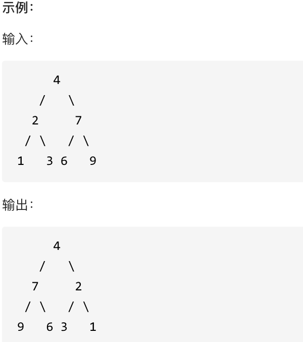


### 思路

这道题虽然比较简单，但是做的时候一定要弄清除自己是如何来遍历二叉树的，也就是按什么样的顺序来处理节点的翻转的。

这里我采用的是前序遍历，先处理根节点的翻转，将根节点的左右子节点交换，然后再去处理左节点、右节点。

这题还有很多种写法，迭代法，层序遍历法等等，以后有机会可以尝试写一写，这里因为赶进度，就只写了递归法。

```java
//226.翻转二叉树
public class LeetCode226 {
    public TreeNode invertTree(TreeNode root) {
        //递归法
        invertSolution1(root);

        return root;
    }

    /**
     * 递归法
     * @param root
     */
    private void invertSolution1(TreeNode root) {
        /**
         * 思路比较简单
         * 这里采用前序遍历
         * 先交换根节点的左右子节点
         * 再交换左节点的左右子节点
         * 最后再交换右节点的左右子节点
         */

        //递归终止条件
        if(root==null) return;

        //交换根节点的左右子节点
        TreeNode tmp;
        tmp=root.right;
        root.right=root.left;
        root.left=tmp;

        //递归处理左右子节点
        invertSolution1(root.left);
        invertSolution1(root.right);
    }
}
```


## 8.对称二叉树

### 题目

[力扣题目链接](https://leetcode.cn/problems/symmetric-tree/)

给定一个二叉树，检查它是否是镜像对称的。


### 思路

要判断一个树是否对称，只需要判断这个数的左右子树是否对称，而要判断两颗树是否对称，只需判断这两棵树的外侧是否相等、内侧是否相等，如果外侧和内侧都相等，就说明这两棵树是对称的。如下图所示，只要两个树的外侧相等、内侧也相等就说明这两个子树是对称的，即左树的左子树与右树的右子树相等、左树的右子树与右树的左子树相等。


```java
//101.对称二叉树
public class LeetCode101 {
    public boolean isSymmetric(TreeNode root) {
        //判断是否是对称二叉树其实就是判断左右子树是否对称。
        return compare(root.left,root.right);
    }

    private boolean compare(TreeNode left, TreeNode right) {
        /**
         * 思路：
         * 递归比较左右子树是否对称
         * 关键是比较两个子树的外侧和内侧是否相等，即左子树的左半部分是否与右子树的右半部分相等，左子树的右半部分是否与右子树的左半部分相等
         */

        //递归终止条件，两个节点中存在null节点，或者两个节点的值不相等
        if(left==null&&right!=null) return false;
        else if(left!=null&&right==null) return false;
        else if(left==null&&right==null) return true;
        else if(left.val!=right.val) return false;

        //比较外侧子树是否相等
        boolean outside = compare(left.left,right.right);
        //比较内侧子树是否相等
        boolean inside = compare(left.right,right.left);
        //如果外侧和内侧子树都相等，说明树是对称的
        return outside&&inside;
    }


}
```


## 9.二叉树的最大深度

### 题目

[力扣题目链接](https://leetcode.cn/problems/maximum-depth-of-binary-tree/)

给定一个二叉树，找出其最大深度。

二叉树的深度为根节点到最远叶子节点的最长路径上的节点数。

说明: 叶子节点是指没有子节点的节点。

示例： 给定二叉树 [3,9,20,null,null,15,7]，


返回它的最大深度 3 。


### 思路

```
首先要搞清楚的概念
二叉树的深度指的是从根节点到当前节点所经过的最少边数（从0开始）或经过的最少的节点数（从1开始）
二叉树的高度指的是当前节点到叶子节点所经过的最长路径的边数（从0开始）或经过的最多的节点数
如果要求二叉树的最大深度，只需要求出该二叉树左右子树的最大深度，然后取出两个当中的最大值，然后+1就是这颗二叉树的最大深度了。
并且本题中的深度指的是经过的最长路径上的节点数，因此深度从1开始
```


```java
//104.二叉树的最大深度
public class LeetCode104 {

    public int maxDepth(TreeNode root) {
        /**
         * 首先要搞清楚的概念
         * 二叉树的深度指的是从根节点到当前节点所经过的最少边数（从0开始）或经过的最少的节点数（从1开始）
         * 二叉树的高度指的是当前节点到叶子节点所经过的最长路径的边数（从0开始）或经过的最多的节点数
         *
         * 如果要求二叉树的最大深度，只需要求出该二叉树左右子树的最大深度，然后取出两个当中的最大值，然后+1就是这颗二叉树的最大深度了。
         * 并且本题中的深度指的是经过的最长路径上的节点数，因此深度从1开始
         */

        return maxDepthSolution(root);

    }


    /**
     * 递归法
     * @param root
     * @return
     */
    private int maxDepthSolution(TreeNode root) {
        //递归终止条件
        if(root==null) return 0;

        int leftDepth = maxDepthSolution(root.left);
        int rightDepth = maxDepthSolution(root.right);

        return Math.max(leftDepth,rightDepth)+1;
    }

}
```


## 10.二叉树的最小深度

### 题目

[力扣题目链接](https://leetcode.cn/problems/minimum-depth-of-binary-tree/)

给定一个二叉树，找出其最小深度。

最小深度是从根节点到最近叶子节点的最短路径上的节点数量。

说明: 叶子节点是指没有子节点的节点。

示例:

给定二叉树 [3,9,20,null,null,15,7],


返回它的最小深度 2.


### 思路

```
思路与求最大深度差不多，只不过这里取的是左右子树深度的较小值，而不是较大值
但是还有一个细节需要注意，如果存在左子树或右子树为空的时候，就不需要去计算为空的那个子树，
因为二叉树的深度指的是从根节点到叶子节点的深度，如果树为空，那哪来的叶子节点，因此不需要管为空的子树
```

比如下面这个树，最小深度是右边的子树的最小深度+1也就是2+1=3，而不是左边空子树的最小深度+1也就是0+1=1


```java
//111.二叉树的最小深度
public class LeetCode111 {

    public int minDepth(TreeNode root) {
        //递归法
        return minDepthSolution1(root);


    }

    /**
     * 递归法
     * @param root
     * @return
     */
    private int minDepthSolution1(TreeNode root) {
        /**
         * 思路与求最大深度差不多，只不过这里取的是左右子树深度的较小值，而不是较大值
         * 但是还有一个细节需要注意，如果存在左子树或右子树为空的时候，就不需要去计算为空的那个子树，
         * 因为二叉树的深度指的是从根节点到叶子节点的深度，如果树为空，那哪来的叶子节点，因此不需要管为空的子树
         */

        //递归终止条件
        if(root==null) return 0;
        //这里采用后序遍历，也就是求当前节点的高度
        //先获取左右子树的高度
        int leftDepth = minDepthSolution1(root.left);
        int rightDepth = minDepthSolution1(root.right);

        //要对存在空树的情况进行特别处理
        if(root.left==null&&root.right!=null){
            return 1+rightDepth;
        }
        if(root.left!=null&&root.right==null){
            return 1+leftDepth;
        }
        //如果不存在空树的情况就取左右子树中高度最小的一个
        return 1+Math.min(leftDepth,rightDepth);
    }

}
```


## 11.完全二叉树的节点个数

### 题目

[力扣题目链接](https://leetcode.cn/problems/count-complete-tree-nodes/)

给出一个完全二叉树，求出该树的节点个数。

示例 1：

- 输入：root = [1,2,3,4,5,6]
- 输出：6

示例 2：

- 输入：root = []
- 输出：0

示例 3：

- 输入：root = [1]
- 输出：1

提示：

- 树中节点的数目范围是[0, 5 * 10^4]
- 0 <= Node.val <= 5 * 10^4
- 题目数据保证输入的树是 完全二叉树


### 思路

```
思路：
这里当然可以直接用遍历普通二叉树的方法来统计节点个数，使用前中后序遍历啥的都行
但是这里既然是完全二叉树，那我们就多利用一下完全二叉树的特性
完全二叉树除了底层外，其他层的节点一定是满的。
而要计算一个完全二叉树的节点个数，可以直接使用公式：2^n-1，n为树的深度，从1开始
我们又直到，满二叉树是一个特殊的完全二叉树，因此如果题目给的二叉树是满二叉树我们就可以直接使用公式
那我们要做的就是来判断这颗完全二叉树是不是满二叉树，而判断完全二叉树树是不是满二叉树可以使用如下思路：
一直遍历左节点，获取左树的深度；一直遍历右节点，获取右树的深度。最后比较两树的深度是否一致，如果一致就说明是满二叉树
以上的思路只有在给的树是完全二叉树时才有效。
所以我们接下来的步骤就变成了，先判断这棵树是不是满二叉树，如果是直接用公式计算，然后返回结果，如果不是，就分别进入左右子树去判断左右子树是不是满二叉树
就这样一直递归。
```

这里再补充一张判断完全二叉树是否为满二叉树的原理图，如下图就是满二叉树的完全二叉树。

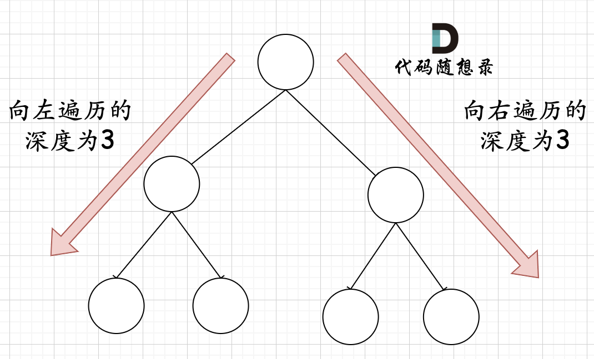

而下图就是不是满二叉树的完全二叉树

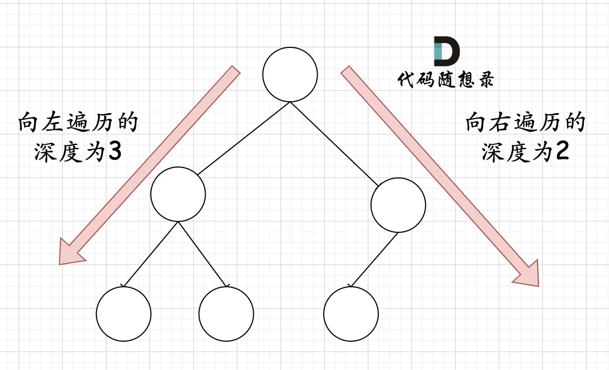

那为什么这种判断方法只适用于完全二叉树呢？如下图所示，如果是普通二叉树，如果向左遍历结果与向右遍历结果相等，并不能代表这是一个满二叉树


```java
//222.完全二叉树的节点个数
public class LeetCode222 {
    public int countNodes(TreeNode root) {
        /**
         * 思路：
         * 这里当然可以直接用遍历普通二叉树的方法来统计节点个数，使用前中后序遍历啥的都行
         * 但是这里既然是完全二叉树，那我们就多利用一下完全二叉树的特性
         * 完全二叉树除了底层外，其他层的节点一定是满的。
         * 而要计算一个完全二叉树的节点个数，可以直接使用公式：2^n-1，n为树的深度，从1开始
         * 我们又直到，满二叉树是一个特殊的完全二叉树，因此如果题目给的二叉树是满二叉树我们就可以直接使用公式
         * 那我们要做的就是来判断这颗完全二叉树是不是满二叉树，而判断完全二叉树树是不是满二叉树可以使用如下思路：
         * 一直遍历左节点，获取左树的深度；一直遍历右节点，获取右树的深度。最后比较两树的深度是否一致，如果一致就说明是满二叉树
         * 以上的思路只有在给的树是完全二叉树时才有效。
         *
         * 所以我们接下来的步骤就变成了，先判断这棵树是不是满二叉树，如果是直接用公式计算，然后返回结果，如果不是，就分别进入左右子树去判断左右子树是不是满二叉树
         * 就这样一直递归。
         */

        if(root==null) return 0;
        //首先判断当前的完全二叉树是不是满二叉树
        int countLeft = 0;
        int countRight = 0;
        TreeNode left = root.left;
        TreeNode right = root.right;
        //一直遍历左节点
        while (left!=null){
            countLeft++;
            left=left.left;
        }
        //一直遍历右节点
        while (right!=null){
            countRight++;
            right=right.right;
        }
        //如果是满二叉树直接用公式计算结果返回
        if(countLeft==countRight){
            //注意，位运算的优先级比加减要小
            return (2<<countLeft)-1;
        }

        //如果不是满二叉树进入子树
        return countNodes(root.left)+countNodes(root.right)+1;

    }
}
```


## 12.平衡二叉树

### 题目

[力扣题目链接](https://leetcode.cn/problems/balanced-binary-tree/)

给定一个二叉树，判断它是否是高度平衡的二叉树。

本题中，一棵高度平衡二叉树定义为：一个二叉树每个节点 的左右两个子树的高度差的绝对值不超过1。

示例 1:

给定二叉树 [3,9,20,null,null,15,7]


返回 true 。

示例 2:

给定二叉树 [1,2,2,3,3,null,null,4,4]


返回 false 。


### 思路

递归获取左右子树的高度，获取两子树的高度差，如果大于1就返回-1，表示不是平衡二叉树，如果高度差小于等于1，就返回两个子树的最高的高度。

```java
//110.平衡二叉树
public class LeetCode110 {

    public boolean isBalanced(TreeNode root) {
        /**
         * 思路：
         * 递归获取左右子树的高度，比较左右子树的高度，
         * 如果高度差大于1，则返回-1表示不是平衡二叉树
         * 如果高度差小于等于1，则返回最高的高度，表示根节点的高度
         */
        if (root == null) return true;

        //获取左子树的高度
        int leftHeight = getHeight(root.left);
        //如果子树不是平衡二叉树，直接返回false，表示该树不是平衡二叉树
        if (leftHeight == -1) return false;
        //获取右子树的高度
        int rightHeight = getHeight(root.right);
        if (rightHeight == -1) return false;

        return Math.abs(leftHeight - rightHeight) > 1 ? false : true;
    }

    private int getHeight(TreeNode root) {
        if (root == null) return 0;

        //采用后序遍历获取树的高度
        int leftHeight = getHeight(root.left);
        if (leftHeight == -1) return -1;
        int rightHeight = getHeight(root.right);
        if (rightHeight == -1) return -1;

        //如果获取到的子树的高度差大于1，返回-1表示不是平衡二叉树
        return Math.abs(leftHeight - rightHeight) > 1 ? -1 : 1 + Math.max(leftHeight, rightHeight);

    }

}
```


## 13.二叉树的所有路径

### 题目

[力扣题目链接](https://leetcode.cn/problems/binary-tree-paths/)

给定一个二叉树，返回所有从根节点到叶子节点的路径。

说明: 叶子节点是指没有子节点的节点。

示例: 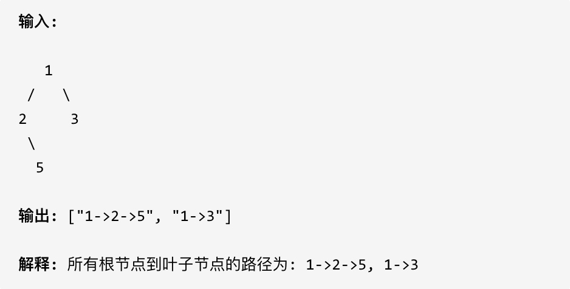


### 思路

#### 1.递归法

```
递归+回溯
采用前序遍历，当根节点的左右子节点为null时，说明到达了叶子节点，此时可以将path中的节点取出来然后拼成一个字符串存入到result集合中
如果没有到达叶子节点，就递归调用，继续遍历节点
```

```java
//257.二叉树的所有路径
public class LeetCode257 {
    public List<String> binaryTreePaths(TreeNode root) {
        //path用于记录经过的路径节点
        List<Integer> path = new ArrayList<>();
        //result用于记录所有的路径字符串结果
        List<String> result = new ArrayList<>();
        binaryTreePathsSolution(root, path, result);
        return result;
    }

    private void binaryTreePathsSolution(TreeNode root, List<Integer> path, List<String> result) {
        /**
         * 思路：
         * 递归+回溯
         * 采用前序遍历，当根节点的左右子节点为null时，说明到达了叶子节点，此时可以将path中的节点取出来然后拼成一个字符串存入到result集合中
         * 如果没有到达叶子节点，就递归调用，继续遍历节点
         */

        //前序遍历，先将根节点存入path
        path.add(root.val);

        //递归终止条件，找到叶子节点
        if (root.left == null && root.right == null) {
            //取出path中的节点
//            String res = "";
            //使用StringBuilder可以明显提高速度，原本使用String耗时为10ms，使用StringBuilder后耗时为2ms
            StringBuilder res = new StringBuilder();
            for (int i = 0; i < path.size(); i++) {
                if (i != path.size() - 1) {
                    res.append(path.get(i) + "->");
                } else {
                    res.append(path.get(i));
                }
            }
            result.add(res.toString());
            return;
        }
        //没有到达叶子节点就继续遍历
        if (root.left != null) {
            binaryTreePathsSolution(root.left, path, result);
            //回溯
            path.remove(path.size() - 1);
        }
        if (root.right != null) {
            binaryTreePathsSolution(root.right, path, result);
            path.remove(path.size() - 1);
        }

    }
}
```


#### 2.迭代法

```
迭代法思路：
将节点与到达当前节点的路径一起存入到栈中
处理节点时就将节点和其对应的路径一起弹出
如果该节点是叶子节点，直接将路径存入结果集
如果该节点不是叶子节点，就将其子节点以及子节点的路径存入栈中
重复以上操作，直到栈中元素为空
```


```java
/**
 * 迭代法
 */
class Solution2 {
    /**
     * 迭代法思路：
     * 将节点与到达当前节点的路径一起存入到栈中
     * 处理节点时就将节点和其对应的路径一起弹出
     * 如果该节点是叶子节点，直接将路径存入结果集
     * 如果该节点不是叶子节点，就将其子节点以及子节点的路径存入栈中
     * 重复以上操作，直到栈中元素为空
     */

    //结果集
    private List<String> result = new ArrayList<>();

    public List<String> binaryTreePaths(TreeNode root) {
        if(root==null) return result;
        //因为要同时存入节点和路径，因此泛型选择为Object
        Deque<Object> stack = new LinkedList<>();
        StringBuilder path = new StringBuilder();
        path.append(root.val);
        stack.push(root);
        stack.push(path);
        deal(stack);
        return result;
    }

    private void deal(Deque<Object> stack) {
        while (!stack.isEmpty()){
            //弹出栈顶元素
            StringBuilder path = (StringBuilder) stack.pop();
            TreeNode root = (TreeNode) stack.pop();
            //如果是叶子节点
            if(root.left==null&&root.right==null){
                result.add(path.toString());
                continue;
            }
            //如果不是叶子节点
            if(root.left!=null){
                stack.push(root.left);
                stack.push(new StringBuilder(path).append("->"+root.left.val));
            }
            if(root.right!=null){
                stack.push(root.right);
                stack.push(new StringBuilder(path).append("->"+root.right.val));
            }
        }
    }


}
```


## 15.左叶子之和

### 题目

[力扣题目链接](https://leetcode.cn/problems/sum-of-left-leaves/)

计算给定二叉树的所有左叶子之和。

示例：

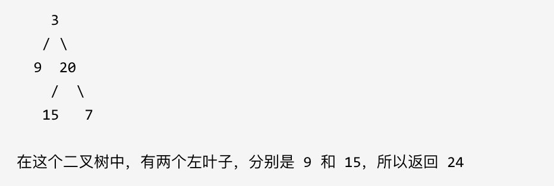


### 思路

首先要明白左叶子节点是什么：

**节点A的左孩子不为空，且左孩子的左右孩子都为空（说明是叶子节点），那么A节点的左孩子为左叶子节点**


```
思路：
采用后序遍历，先获取左右子树的左叶子节点之和，然后相加就是根节点的左叶子节点之和
要判断一个节点是不是左叶子节点，只能根据它的父节点来判断。
如果该节点是其父节点的左节点，且该节点是叶子节点，说明这个节点就是左叶子节点
如果是左叶子节点，直接返回这个节点的值
如果不是，就递归调用方法获取左树和右树的左叶子节点之和
```

```java
//404.左叶子之和
public class LeetCode404 {
    public int sumOfLeftLeaves(TreeNode root) {
        /**
         * 思路：
         * 采用后序遍历，先获取左右子树的左叶子节点之和，然后相加就是根节点的左叶子节点之和
         * 要判断一个节点是不是左叶子节点，只能根据它的父节点来判断。
         * 如果该节点是其父节点的左节点，且该节点是叶子节点，说明这个节点就是左叶子节点
         * 如果是左叶子节点，直接返回这个节点的值
         * 如果不是，就递归调用方法获取左树和右树的左叶子节点之和
         */

        //如果是节点为空，或者节点为叶子节点，直接返回0
        if(root==null) return 0;
        if(root.left==null&&root.right==null) return 0;

        //判断左节点是否是左叶子节点，如果是，就返回左节点的值和左节点的右子树的左叶子节点之和
        if(root.left!=null&&root.left.left==null&&root.left.right==null){
            return root.left.val+sumOfLeftLeaves(root.right);
        }

        //如果左节点不是左叶子节点，就返回左子树和右子树的左叶子节点之和
        return sumOfLeftLeaves(root.left)+sumOfLeftLeaves(root.right);
    }
}
```


## 16.找数左下角的值

### 题目

[力扣题目链接](https://leetcode.cn/problems/find-bottom-left-tree-value/)

给定一个二叉树，在树的最后一行找到最左边的值。

示例 1:


示例 2:


### 思路

思路比较简单，递归法和迭代法都行

#### 1.递归法

```
递归获取左右子树的最底层 最左边的叶子节点
如果叶子节点的深度大于最大深度，就更新最大深度以及最终结果result
```

```java
public class LeetCode513 {

    private int maxDepth;
    private int result;

    public int findBottomLeftValue(TreeNode root) {
        /**
         * 递归法
         */
        findBottomLeftValueSolution1(root, 1);
        return result;
    }

    /**
     * 递归法
     *
     * @param root
     * @param depth
     */
    private void findBottomLeftValueSolution1(TreeNode root, int depth) {
        /**
         * 思路：
         * 递归获取左右子树的最底层 最左边的叶子节点
         * 如果叶子节点的深度大于最大深度，就更新最大深度以及最终结果result
         */

        if (root.left == null && root.right == null) {
            if (depth > maxDepth) {
                maxDepth = depth;
                result = root.val;
            }
            return;
        }

        //递归获取左右子树的最底层 最左边的叶子节点
        if (root.left != null) {
            findBottomLeftValueSolution1(root.left, depth + 1);

        }
        if (root.right != null) {
            findBottomLeftValueSolution1(root.right, depth + 1);
        }

    }

}
```


#### 2.迭代法

```java
class Solution513 {

    public int findBottomLeftValue(TreeNode root) {
        /**
         * 迭代法，层序遍历
         * 遍历每一层，然后记录每一层的第一个节点即可
         */

        int result = 0;
        Queue<TreeNode> queue = new LinkedList<>();
        //初始化栈
        queue.add(root);
        while (!queue.isEmpty()) {
            int size = queue.size();
            for (int i = 0; i < size; i++) {
                //记录每一层的第一个节点
                TreeNode pop = queue.poll();
                if(i==0) result=pop.val;
                if(pop.left!=null) queue.add(pop.left);
                if(pop.right!=null) queue.add(pop.right);
            }
        }
        return result;
    }

}
```


## 17.路径总和

### 1.路径总和I

[力扣题目链接](https://leetcode.cn/problems/path-sum/)

给定一个二叉树和一个目标和，判断该树中是否存在根节点到叶子节点的路径，这条路径上所有节点值相加等于目标和。

说明: 叶子节点是指没有子节点的节点。

示例: 给定如下二叉树，以及目标和 sum = 22，


返回 true, 因为存在目标和为 22 的根节点到叶子节点的路径 5->4->11->2。

```java
//112.路径总和
public class LeetCode112 {

    public boolean hasPathSum(TreeNode root, int targetSum) {
        //1.递归法
        if(root==null) return false;
        return hasPathSumSolution1(root, targetSum);

    }

    private boolean hasPathSumSolution1(TreeNode root, int targetSum) {
        /**
         * 思路：
         * 递归判断子节点是否存在符合条件的路径
         * 递归时采用递减，每经过一个节点就用目标值减去经过节点的值，然后再从节点的子节点中去寻找有没有路径的和为剩余的值
         * 当遇到叶子节点时就是递归的终止条件
         * 遇到叶子节点时判断目标值减去当前节点的值后是否为0，如果为0返回true，表示找到了符合条件的路径
         * 如果不为0，就返回false
         */

        //终止条件
        targetSum -= root.val;
        if (root.left == null && root.right == null && targetSum == 0) return true;
        if (root.left == null && root.right == null) return false;

        if(root.left!=null) {
            if(hasPathSumSolution1(root.left,targetSum)){
                return true;
            }
        }
        if(root.right!=null) {
            if(hasPathSumSolution1(root.right,targetSum)){
                return true;
            }
        }

        return false;
    }
}
```


### 2.路径总和II

[力扣题目链接](https://leetcode.cn/problems/path-sum-ii/)

给定一个二叉树和一个目标和，找到所有从根节点到叶子节点路径总和等于给定目标和的路径。

说明: 叶子节点是指没有子节点的节点。

示例: 给定如下二叉树，以及目标和 sum = 22，


```java
//113.路径总和II
public class LeetCode113 {

    List<List<Integer>> result = new ArrayList<>();

    public List<List<Integer>> pathSum(TreeNode root, int targetSum) {

        if (root == null) return result;
        List<Integer> path = new ArrayList<>();
        pathSumSolution(root, path, targetSum);
        return result;
    }

    private void pathSumSolution(TreeNode root, List<Integer> path, int targetSum) {
        path.add(root.val);
        targetSum -= root.val;
        if (root.left == null && root.right == null && targetSum == 0) {
            //这里需要注意，添加路径时一定要重新创建一个新的集合，不然会共享同一个集合，导致最后结果都只有一个根节点
            //result.add(path);
            result.add(new ArrayList<>(path));
        }
        if (root.left == null && root.right == null) return;


        if(root.left!=null){
            pathSumSolution(root.left,path,targetSum);
            //回溯
            path.remove(path.size()-1);
        }
        if(root.right!=null){
            pathSumSolution(root.right,path,targetSum);
            //回溯
            path.remove(path.size()-1);
        }

    }

}
```


## 18.从中序与后序遍历序列构造二叉树

### 题目

[力扣题目链接](https://leetcode.cn/problems/construct-binary-tree-from-inorder-and-postorder-traversal/)

根据一棵树的中序遍历与后序遍历构造二叉树。

注意: 你可以假设树中没有重复的元素。

例如，给出

- 中序遍历 inorder = [9,3,15,20,7]
- 后序遍历 postorder = [9,15,7,20,3] 返回如下的二叉树：


 

### 思路

根据两个遍历顺序可以唯一确定一颗二叉树，分为两种情况：1.后序遍历+中序遍历  2.前序遍历+中序遍历

其中中序遍历是必须的，因为没有中序遍历，就无法确定哪些节点是左半部分的，哪些节点是右半部分的

举一个例子：


tree1 的前序遍历是[1 2 3]， 后序遍历是[3 2 1]。

tree2 的前序遍历是[1 2 3]， 后序遍历是[3 2 1]。

那么tree1 和 tree2 的前序和后序完全相同，这是一棵树么，很明显是两棵树！

所以前序和后序不能唯一确定一棵二叉树！


回到题目，思路如下：

```
这里用到的就是后序遍历+中序遍历
具体思路为：
首先从后序遍历中获取到树的根节点，然后用这个根节点去将中序遍历切割成左子树的中序遍历和右子树的中序遍历
然后根据左子树中序遍历的节点数和右子树中序遍历的节点数去切割后序遍历，将后序遍历切割成左子树的后序遍历和右子树的后序遍历
重复以上步骤，就能逐步还原出一个完整二叉树
这里还需要注意的是切割时的区间范围，采用左闭右开，还是左闭右闭，这个是要在递归中固定好的，不然会导致切割混乱
这里采用左闭右开
```


```java
//106.从中序与后序遍历序列构造二叉树
public class LeetCode106 {

    private Map<Integer,Integer> map = new HashMap<>();

    //耗时2ms
    public TreeNode buildTree(int[] inorder, int[] postorder) {
        /**
         * 参考别人的代码：
         * 使用首尾索引来分割数组，避免了创建新数组导致的耗时
         */

        //先将中序遍历数组的值及其索引存入Map，方便后序寻找对应数据的索引

        for (int i = 0; i <inorder.length; i++) {
            map.put(inorder[i],i);
        }
        //这里的索引范围是左闭右开的
        return buildTreeSolution(inorder,0,inorder.length,postorder,0,postorder.length);

    }

    private TreeNode buildTreeSolution(int[] inorder, int inBegin, int inEnd, int[] postorder, int postBegin, int postEnd) {
        //如果没有元素，直接返回null
        if(inBegin>=inEnd) return null;

        //获取根节点
        int rootVal = postorder[postEnd-1];
        TreeNode root = new TreeNode(rootVal);
        //获取根节点在中序遍历中的位置
        int index = map.get(rootVal);
        //切割中序遍历
        int leftInEnd = index;
        int rightInBegin = index+1;

        //切割后序遍历
        int leftPostEnd = postBegin+leftInEnd-inBegin;
        int rightPostBegin = leftPostEnd;

        //递归获取左右子树的根节点
        root.left = buildTreeSolution(inorder,inBegin,leftInEnd,postorder,postBegin,leftPostEnd);
        root.right = buildTreeSolution(inorder,rightInBegin,inEnd,postorder,rightPostBegin,postEnd-1);

        return root;
    }


    //以下代码是我自己写的，由于每次递归都要创建新的数组，所以耗时很大，并且空间占用也高，上面的代码参考了别人的代码，用首尾索引来代替创建新数组，耗时比较低。
    //耗时7ms
    public TreeNode buildTree_My(int[] inorder, int[] postorder) {
        /**
         * 思路：
         * 要做这道题首先要明白如何根据两个顺序构造一个唯一的二叉树
         * 有两种情况：1.前序遍历+中序遍历 2.后序遍历+中序遍历
         *
         * 这里用到的就是后序遍历+中序遍历
         * 具体思路为：
         * 首先从后序遍历中获取到树的根节点，然后用这个根节点去将中序遍历切割成左子树的中序遍历和右子树的中序遍历
         * 然后根据左子树中序遍历的节点数和右子树中序遍历的节点数去切割后序遍历，将后序遍历切割成左子树的后序遍历和右子树的后序遍历
         * 重复以上步骤，就能逐步还原出一个完整二叉树
         *
         * 这里还需要注意的是切割时的区间范围，采用左闭右开，还是左闭右闭，这个是要在递归中固定好的，不然会导致切割混乱
         * 这里采用左闭右开
         */

        if(inorder==null||postorder==null||inorder.length==0||postorder.length==0) return null;
        //如果是叶子节点
        if(inorder.length==1||postorder.length==1) return new TreeNode(inorder[0]);
        //从后序遍历中获取根节点
        int rootVal = postorder[postorder.length-1];
        TreeNode root = new TreeNode(rootVal);

        //获取根节点在中序遍历中的位置
        int index = 0;
        while (inorder[index]!=rootVal){
            index++;
        }
        //切割中序遍历，左闭右开
        int[] leftInorder = Arrays.copyOfRange(inorder, 0, index);
        int[] rightInorder = Arrays.copyOfRange(inorder, index + 1, inorder.length);

        //然后再切割后序遍历
        int[] leftPostorder = Arrays.copyOfRange(postorder, 0, leftInorder.length);
        int[] rightPostorder = Arrays.copyOfRange(postorder, leftPostorder.length, postorder.length - 1);

        //递归获取左右子树的根节点
        root.left = buildTree(leftInorder,leftPostorder);
        root.right = buildTree(rightInorder,rightPostorder);

        return root;
    }


}
```


## 19.最大二叉树

### 题目

[力扣题目地址](https://leetcode.cn/problems/maximum-binary-tree/)

给定一个不含重复元素的整数数组。一个以此数组构建的最大二叉树定义如下：

- 二叉树的根是数组中的最大元素。
- 左子树是通过数组中最大值左边部分构造出的最大二叉树。
- 右子树是通过数组中最大值右边部分构造出的最大二叉树。

通过给定的数组构建最大二叉树，并且输出这个树的根节点。

示例 ：


提示：

给定的数组的大小在 [1, 1000] 之间。


### 思路

```
思路原题目都已经说出来了：
创建一个根节点，其值为 nums 中的最大值。
递归地在最大值 左边 的 子数组前缀上 构建左子树。
递归地在最大值 右边 的 子数组后缀上 构建右子树。
就根据这个步骤来
就是需要注意一些递归的细节：
递归的终止条件是当数组长度为1的时候，就直接创建一个新节点返回即可，因为题目说明了数组长度大于等于1
也因此我们在构建左右子树时也要判断左右数组的长度是否大于等于1
还有就是分割数组采用索引来分割，而不是新创建一个数组，这样可以减少创建数组的耗时
使用索引来分割数组就还要注意区间的范围是什么，这里我用的是左闭右开
```

```java
//654.最大二叉树
public class LeetCode654 {
    public static void main(String[] args) {
        constructMaximumBinaryTree(new int[]{3,2,1,6,0,5});
    }

    public static TreeNode constructMaximumBinaryTree(int[] nums) {
        /**
         * 思路原题目都已经说出来了：
         * 创建一个根节点，其值为 nums 中的最大值。
         * 递归地在最大值 左边 的 子数组前缀上 构建左子树。
         * 递归地在最大值 右边 的 子数组后缀上 构建右子树。
         * 就根据这个步骤来
         *
         * 就是需要注意一些递归的细节：
         * 递归的终止条件是当数组长度为1的时候，就直接创建一个新节点返回即可，因为题目说明了数组长度大于等于1
         * 也因此我们在构建左右子树时也要判断左右数组的长度是否大于等于1
         * 还有就是分割数组采用索引来分割，而不是新创建一个数组，这样可以减少创建数组的耗时
         * 使用索引来分割数组就还要注意区间的范围是什么，这里我用的是左闭右开
         *
         */

        return constructMaximumBinaryTreeSolution(nums, 0, nums.length);

    }

    private static TreeNode constructMaximumBinaryTreeSolution(int[] nums, int begin, int end) {
        //如果数组长度为1
        if (end - begin == 1) return new TreeNode(nums[begin]);

        //找出当前数组范围的最大值
        int maxIndex = begin;
        for (int i = begin; i < end; i++) {
            if (nums[i] > nums[maxIndex]) maxIndex = i;
        }
        TreeNode root = new TreeNode(nums[maxIndex]);

        //递归获取左右子树
        if (maxIndex - begin >= 1) {
            root.left = constructMaximumBinaryTreeSolution(nums, begin, maxIndex);
        } else {
            root.left = null;
        }

        if (end - maxIndex - 1 >= 1) {
            root.right = constructMaximumBinaryTreeSolution(nums, maxIndex + 1, end);
        } else {
            root.right = null;
        }
        return root;
    }

}
```


## 21.合并二叉树

### 题目

[力扣题目链接](https://leetcode.cn/problems/merge-two-binary-trees/)

给定两个二叉树，想象当你将它们中的一个覆盖到另一个上时，两个二叉树的一些节点便会重叠。

你需要将他们合并为一个新的二叉树。合并的规则是如果两个节点重叠，那么将他们的值相加作为节点合并后的新值，否则不为 NULL 的节点将直接作为新二叉树的节点。

示例 1:

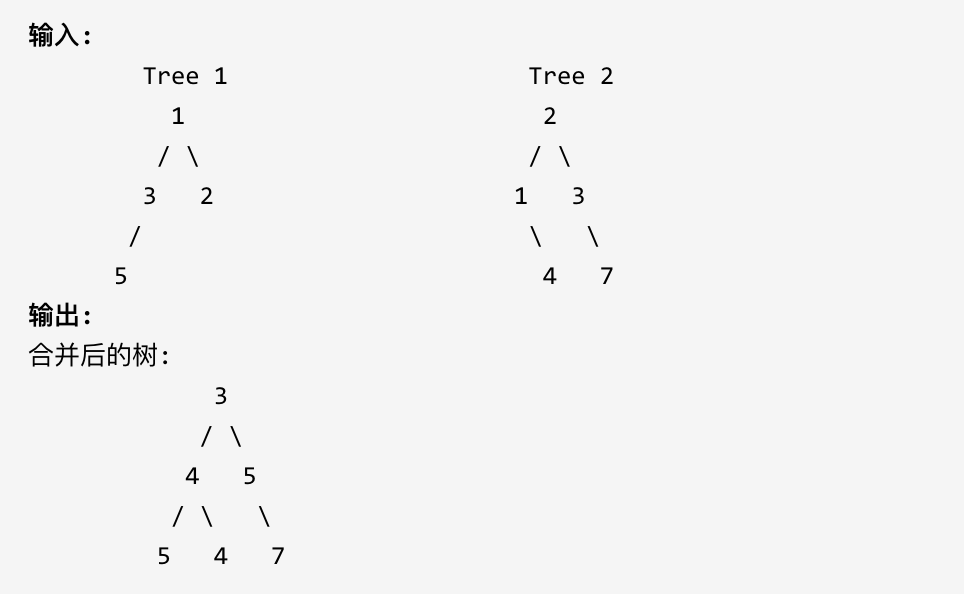

注意: 合并必须从两个树的根节点开始。


### 思路

```
思路：
要合并两个二叉树，其实就是要同时操作两颗树，同时去遍历两颗树
可以采用任何遍历方式，这里使用前序遍历
首先对于传进来的两颗树的根节点
如果其中一个根节点为空，就直接返回不为空的那个根节点
如果都为空，直接返回null
如果都不为空，就合并两个节点
接着去递归合并两个根节点的左右子树
```


对于以上思路，我当时还在疑惑一个问题，如下图所示，对于下图中的二叉树，在合并到2号节点的左树时，（左图为A树，右图为B树）由于A树的2号节点的左节点不为空，而B树的2号节点的左节点为空，因此在合并这两个节点时会直接返回A树的4号节点。而我的疑惑是，如果直接返回了4号节点，那4号节点后序的节点，比如5号节点又要如何去合并呢？

后面我想了想这个问题，发现完全没有必要去接着去合并4号节点后面的节点，因为从4号节点开始，就算去执行合并操作，返回的都会是4号节点原本的子节点，因为在B树中同样的地方开始节点就全部为空了嘛。


```java
//617.合并二叉树
public class LeetCode617 {

    public TreeNode mergeTrees(TreeNode root1, TreeNode root2) {

        //递归法
        return mergeTreesSolution1(root1, root2);

    }

    private TreeNode mergeTreesSolution1(TreeNode root1, TreeNode root2) {
        /**
         * 思路：
         * 要合并两个二叉树，其实就是要同时操作两颗树，同时去遍历两颗树
         * 可以采用任何遍历方式，这里使用前序遍历
         * 首先对于传进来的两颗树的根节点
         * 如果其中一个根节点为空，就直接返回不为空的那个根节点
         * 如果都为空，直接返回null
         * 如果都不为空，就合并两个节点
         * 接着去递归合并两个根节点的左右子树
         */

        //这里如果两个根节点都为空，也就直接返回null了
        if (root1 == null) return root2;
        if (root2 == null) return root1;

        //合并两个根节点的左右子树，这里直接修改第一个树上进行修改来作为合并后的树
        root1.val += root2.val;
        root1.left = mergeTreesSolution1(root1.left, root2.left);
        root1.right = mergeTreesSolution1(root1.right, root2.right);

        return root1;
    }

}
```


## 22.二叉搜索树中的搜索

### 题目

[力扣题目地址](https://leetcode.cn/problems/search-in-a-binary-search-tree/)

给定二叉搜索树（BST）的根节点和一个值。 你需要在BST中找到节点值等于给定值的节点。 返回以该节点为根的子树。 如果节点不存在，则返回 NULL。

例如，


在上述示例中，如果要找的值是 5，但因为没有节点值为 5，我们应该返回 NULL。


### 思路

这道题其实就是在搜索二叉树中去寻找某个节点

#### 1.递归法

```java
//递归法
public TreeNode searchBST(TreeNode root, int val) {
    /**
     * 思路：
     * 这题实际上就是在二叉搜索树中寻找一个节点
     * 采用递归
     * 如果当前节点为空或者当前节点的值为目标值，就返回null或当前节点
     * 如果当前节点的值大于目标值，就去递归搜索左子树
     * 如果当前节点的值小于目标值，就去递归搜索右子树
     */

    if(root==null||root.val==val) return root;

    TreeNode result = null;
    if(root.val>val) result = searchBST(root.left,val);
    if(root.val<val) result = searchBST(root.right,val);
    return result;
}
```


#### 2.迭代法

```java
//迭代法
public TreeNode searchBST2(TreeNode root, int val) {
    /**
     * 迭代法也非常简单
     * 对于普通二叉树的迭代法，我们需要借助一个队列来存储要遍历的节点
     * 而对于搜索二叉树来说，不需要，因为搜索二叉树的有序性，我们在遍历一个节点时，就能够确定下一个应该遍历哪一个节点了
     * 因此不需要额外的队列来存储要遍历的节点，我们知道是那个节点就直接去遍历就行
     */

    while (root!=null){
        if(root.val==val){
            break;
        }
        if(root.val>val){
            root=root.left;
        }else if(root.val<val){
            root=root.right;
        }
    }
    return root;
}
```


## 23.验证二叉搜索树

### 题目

[力扣题目链接](https://leetcode.cn/problems/validate-binary-search-tree/)

给定一个二叉树，判断其是否是一个有效的二叉搜索树。

假设一个二叉搜索树具有如下特征：

- 节点的左子树只包含小于当前节点的数。
- 节点的右子树只包含大于当前节点的数。
- 所有左子树和右子树自身必须也是二叉搜索树。


### 思路

```
首先要知道一个知识点：对于二叉搜索树使用中序遍历，遍历出来的结果一定是递增的。
因此我们就可以通过判断中序遍历的结果是否为递增，从而判断这颗树是否为二叉搜索树
```

```java
//98.验证二叉搜索树
public class LeetCode98 {

    private TreeNode max;

    public boolean isValidBST(TreeNode root) {
        /**
         * 思路：
         * 首先要知道一个知识点：对于二叉搜索树使用中序遍历，遍历出来的结果一定是递增的。
         * 因此我们就可以通过判断中序遍历的结果是否为递增，从而判断这颗树是否为二叉搜索树
         */

        if (root == null) return true;
        boolean left = isValidBST(root.left);
        if (max != null && root.val <= max.val) {
            return false;
        }
        max = root;
        boolean right = isValidBST(root.right);

        return left && right;

    }
}
```


## 24.二叉搜索树的最小绝对差

### 题目

[力扣题目链接](https://leetcode.cn/problems/minimum-absolute-difference-in-bst/)

给你一棵所有节点为非负值的二叉搜索树，请你计算树中任意两节点的差的绝对值的最小值。

示例：


提示：树中至少有 2 个节点。


### 思路

#### 1.递归法

```
思路：
我们知道，二叉搜索树通过中序遍历的结果是一个递增的有序数组
因此，这题最简单的思路就是直接中序遍历整个二叉树，得到一个有序的数组，然后再遍历有序数组找到最小的绝对差
但是这里可以再简化一下，通过记录前一个节点，直接再遍历的过程中进行比较，就不需要得到数组后再遍历一遍了
```

```java
//530.二叉搜索树的最小绝对差
public class LeetCode530 {

    private TreeNode pre;
    int min;

    public int getMinimumDifference(TreeNode root) {
        /**
         * 思路：
         * 我们知道，二叉搜索树通过中序遍历的结果是一个递增的有序数组
         * 因此，这题最简单的思路就是直接中序遍历整个二叉树，得到一个有序的数组，然后再遍历有序数组找到最小的绝对差
         * 但是这里可以再简化一下，通过记录前一个节点，直接再遍历的过程中进行比较，就不需要得到数组后再遍历一遍了
         */

        pre = null;
        min = Integer.MAX_VALUE;
        //题目说树最少有两个节点，因此可以不处理root为null的情况
        getMinimumDifferenceSolution(root);
        return min;
    }

    private void getMinimumDifferenceSolution(TreeNode cur) {
        if(cur.left!=null) getMinimumDifferenceSolution(cur.left);
        if(pre!=null){
            int tmp = Math.abs(cur.val- pre.val);
            if(tmp<min){
                min = tmp;
            }
        }
        pre = cur;
        if(cur.right!=null) getMinimumDifferenceSolution(cur.right);


    }

}
```


#### 2.迭代法

```java
//迭代法
public int getMinimumDifference_2(TreeNode root) {
    /**
     * 采用统一迭代法来进行中序遍历，即将节点存入栈中，如果是需要处理的节点，就在其后面加上null
     * 当弹出null时，就再弹出一个节点，将该节点与pre节点相减，得到差值，再与min对比
     */

    Stack<TreeNode> stack = new Stack<>();
    stack.push(root);
    //这里忘记初始化了，出现了一次错误
    pre = null;
    min = Integer.MAX_VALUE;
    while (!stack.isEmpty()) {
        TreeNode top = stack.pop();
        if (top != null) {
            if (top.right != null) stack.push(top.right);
            stack.push(top);
            stack.push(null);
            if (top.left != null) stack.push(top.left);
        } else {
            top = stack.pop();
            if (pre != null) {
                min = Math.min(min, Math.abs(top.val - pre.val));
            }
            //这里忘记让pre=top了，也出现一次错误，要特别注意
            pre = top;
        }
    }
    return min;
}
```


## 25.二叉搜索树中的众数

### 题目

[力扣题目链接](https://leetcode.cn/problems/find-mode-in-binary-search-tree/)

给定一个有相同值的二叉搜索树（BST），找出 BST 中的所有众数（出现频率最高的元素）。

假定 BST 有如下定义：

- 结点左子树中所含结点的值小于等于当前结点的值
- 结点右子树中所含结点的值大于等于当前结点的值
- 左子树和右子树都是二叉搜索树

例如：

给定 BST [1,null,2,2],


返回[2].

提示：如果众数超过1个，不需考虑输出顺序

进阶：你可以不使用额外的空间吗？（假设由递归产生的隐式调用栈的开销不被计算在内）


### 思路

```
思路：
如果是在普通的二叉树中，就只能遍历所有节点，用一个Map集合来统计节点出现的次数，然后返回Map集合中出现频率最高的节点
但是再二叉搜索树中，由于中序遍历的结果是一个递增数组，因此在遍历二叉树的同时就能获取到节点出现的频率。
我们可以维护一个maxCount变量，用于表示最大的频率。
遍历二叉搜索树时，判断当前节点出现频率是否等于maxCount，如果等于，就将当前节点存入结果集中
但是，特别注意，如果当前节点出现的频率已经大于maxCount时，我们需要先清空结果集，因为此时，结果集中所有结果均已失效，需要存入最新的出现频率最高的节点，也就是当前节点
当然，需要使用一个pre指针，方便判断当前节点cur出现的次数，如果pre.val==cur.val，频率就+1，否则频率就重置为1
```

```java
//501.二叉搜索树中的众数
public class LeetCode501 {

    List<Integer> list = new ArrayList<>();
    int maxCount;
    TreeNode pre = null;
    int count;

    public int[] findMode(TreeNode root) {
        /**
         * 思路：
         * 如果是在普通的二叉树中，就只能遍历所有节点，用一个Map集合来统计节点出现的次数，然后返回Map集合中出现频率最高的节点
         * 但是再二叉搜索树中，由于中序遍历的结果是一个递增数组，因此在遍历二叉树的同时就能获取到节点出现的频率。
         * 我们可以维护一个maxCount变量，用于表示最大的频率。
         * 遍历二叉搜索树时，判断当前节点出现频率是否等于maxCount，如果等于，就将当前节点存入结果集中
         * 但是，特别注意，如果当前节点出现的频率已经大于maxCount时，我们需要先清空结果集，因为此时，结果集中所有结果均已失效，需要存入最新的出现频率最高的节点，也就是当前节点
         * 当然，需要使用一个pre指针，方便判断当前节点cur出现的次数，如果pre.val==cur.val，频率就+1，否则频率就重置为1
         */

        maxCount = 1;
        count = 1;
        findModeSolution(root);
        //这个Integer类型集合转换成int数组的方式一定要记住。
//        return list.stream().mapToInt(new ToIntFunction<Integer>() {
//            @Override
//            public int applyAsInt(Integer value) {
//                return value.intValue();
//            }
//        }).toArray();

        //Lambda简化形式
        return list.stream().mapToInt(Integer::intValue).toArray();
    }

    private void findModeSolution(TreeNode cur) {
        if (cur.left != null) findModeSolution(cur.left);

        if (pre != null) {
            if (cur.val == pre.val) {
                count++;
            } else {
                count = 1;
            }
        }
        if (maxCount == count) {
            list.add(cur.val);
        } else if (maxCount < count) {
            list.clear();
            maxCount = count;
            list.add(cur.val);
        }
        pre = cur;

        if (cur.right != null) findModeSolution(cur.right);
    }
}
```


## 26.二叉树的最近公共祖先

### 题目

[力扣题目链接](https://leetcode.cn/problems/lowest-common-ancestor-of-a-binary-tree/)

给定一个二叉树, 找到该树中两个指定节点的最近公共祖先。

百度百科中最近公共祖先的定义为：“对于有根树 T 的两个结点 p、q，最近公共祖先表示为一个结点 x，满足 x 是 p、q 的祖先且 x 的深度尽可能大（一个节点也可以是它自己的祖先）。”

例如，给定如下二叉树: root = [3,5,1,6,2,0,8,null,null,7,4]


示例 1: 输入: root = [3,5,1,6,2,0,8,null,null,7,4], p = 5, q = 1 输出: 3 解释: 节点 5 和节点 1 的最近公共祖先是节点 3。

示例 2: 输入: root = [3,5,1,6,2,0,8,null,null,7,4], p = 5, q = 4 输出: 5 解释: 节点 5 和节点 4 的最近公共祖先是节点 5。因为根据定义最近公共祖先节点可以为节点本身。

说明:

- 所有节点的值都是唯一的。
- p、q 为不同节点且均存在于给定的二叉树中。


### 思路

这题思路刚开始没看太懂，看了一小会儿才明白。结合下面这个图来看可能会好懂很多

```
思路：
采用后序遍历，优先处理子节点，这样得到的结果就一定是最深的公共祖先也就是最近公共祖先
对左右子树的处理逻辑如下：
1.在左右子树中寻找目标值（p或q），如果找到目标值，就直接返回，根节点获取左右子树的寻找结果，如果左右子树的返回结果都不为空，说明该根节点就是最近的公共祖先
2.如果已经找到了最近的公共祖先，就直接返回公共祖先节点
3.如果左子树返回结果为空，就返回右子树的返回结果；反之，如果右子树的节点为空，就返回左子树的返回结果
4.如果都为空，说明根节点不是公共祖先节点，直接返回null（实际上这一点已经被包含在第3点了）
```


```java
//236.二叉树的最近公共祖先
public class LeetCode236 {
    //我这里有个自己的思路：找到两条到达目标值的路径，用两个集合分别记录到达目标值的路径经过的节点，然后从后往前对比两个集合，找到第一个不同的节点，这个不同节点的后面那个节点就是最近公共祖先
    //这个思路没来得及写，留个坑先。


    public TreeNode lowestCommonAncestor(TreeNode root, TreeNode p, TreeNode q) {
        /**
         * 思路：
         * 采用后序遍历，优先处理子节点，这样得到的结果就一定是最深的公共祖先也就是最近公共祖先
         * 对左右子树的处理逻辑如下：
         * 1.在左右子树中寻找目标值（p或q），如果找到目标值，就直接返回，根节点获取左右子树的寻找结果，如果左右子树的返回结果都不为空，说明该根节点就是最近的公共祖先
         * 2.如果已经找到了最近的公共祖先，就直接返回公共祖先节点
         * 3.如果左子树返回结果为空，就返回右子树的返回结果；反之，如果右子树的节点为空，就返回左子树的返回结果
         * 4.如果都为空，说明根节点不是公共祖先节点，直接返回null（实际上这一点已经被包含在第3点了）
         */

        //后序遍历处理子节点
        TreeNode leftRes = null;
        TreeNode rightRes = null;
        if (root.left != null) {
            leftRes = lowestCommonAncestor(root.left, p, q);
        }
        if (root.right != null) {
            rightRes = lowestCommonAncestor(root.right, p, q);
        }
        //如果左右子树的返回结果都不为空，说明当前节点就是最近公共祖先
        if(leftRes!=null&&rightRes!=null){
            return root;
        }
        //处理根节点,如果找到了目标值
        if(root.val==p.val||root.val==q.val) return root;

        if(leftRes==null) return rightRes;
        return leftRes;
    }
}
```


## 28.二叉搜索树的最近公共祖先

### 题目

[力扣题目链接](https://leetcode.cn/problems/lowest-common-ancestor-of-a-binary-search-tree/)

给定一个二叉搜索树, 找到该树中两个指定节点的最近公共祖先。

百度百科中最近公共祖先的定义为：“对于有根树 T 的两个结点 p、q，最近公共祖先表示为一个结点 x，满足 x 是 p、q 的祖先且 x 的深度尽可能大（一个节点也可以是它自己的祖先）。”

例如，给定如下二叉搜索树: root = [6,2,8,0,4,7,9,null,null,3,5]


示例 1:

- 输入: root = [6,2,8,0,4,7,9,null,null,3,5], p = 2, q = 8
- 输出: 6
- 解释: 节点 2 和节点 8 的最近公共祖先是 6。

示例 2:

- 输入: root = [6,2,8,0,4,7,9,null,null,3,5], p = 2, q = 4
- 输出: 2
- 解释: 节点 2 和节点 4 的最近公共祖先是 2, 因为根据定义最近公共祖先节点可以为节点本身。

说明:

- 所有节点的值都是唯一的。
- p、q 为不同节点且均存在于给定的二叉搜索树中。


### 思路

```
思路：
对于二叉搜索数，由于它的节点是有序的，因此如果一个节点n是某两个节点p,q的公共祖先，那么n一定在[p,q]这个区间范围内
并且，如果n在[p,q]范围内，说明n一定是p，q的最近公共祖先
```

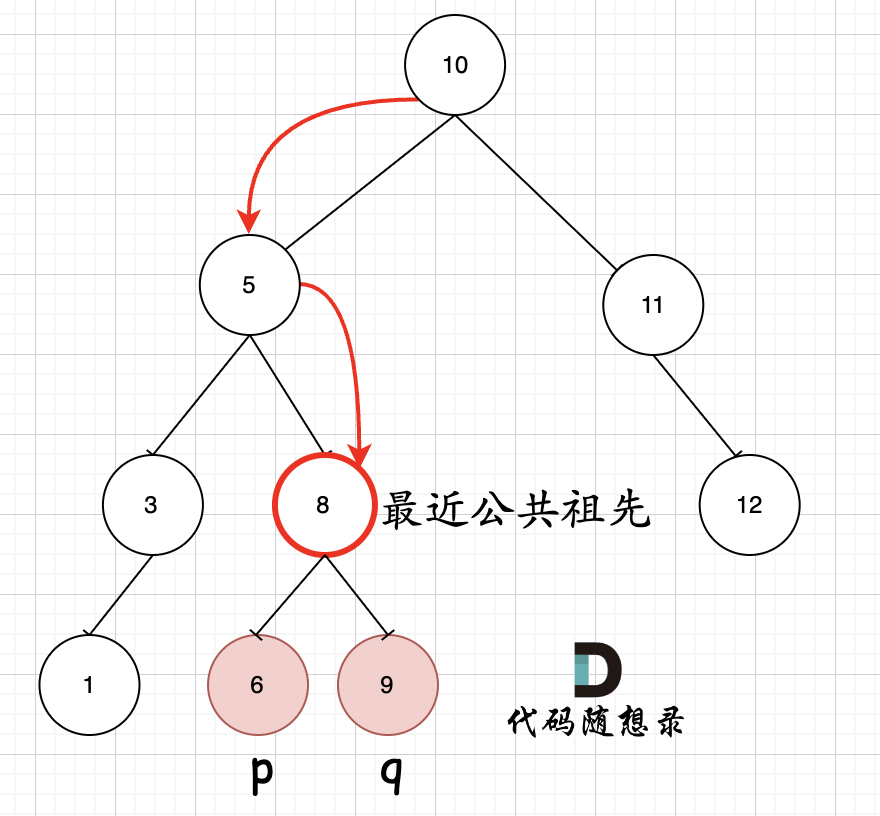

```java
//235.二叉搜索树的最近公共祖先
public class LeetCode235 {

    public TreeNode lowestCommonAncestor(TreeNode root, TreeNode p, TreeNode q) {
        /**
         * 思路：
         * 同样的思路，学习一下别人的代码
         */
        if (root.val > p.val && root.val > q.val) return lowestCommonAncestor(root.left, p, q);
        if (root.val < p.val && root.val < q.val) return lowestCommonAncestor(root.right, p, q);
        return root;

    }


    public TreeNode lowestCommonAncestor_My(TreeNode root, TreeNode p, TreeNode q) {
        /**
         * 思路：
         * 对于二叉搜索数，由于它的节点是有序的，因此如果一个节点n是某两个节点p,q的公共祖先，那么n一定在[p,q]这个区间范围内
         * 并且，如果n在[p,q]范围内，说明n一定是p，q的最近公共祖先
         */

        if (root == null) return root;
        if ((p.val <= root.val && root.val <= q.val) || (q.val <= root.val && root.val <= p.val)) {
            return root;
        }
        TreeNode left = null;
        if (root.left != null) left = lowestCommonAncestor(root.left, p, q);
        if (left != null) return left;

        TreeNode right = null;
        if (root.right != null) right = lowestCommonAncestor(root.right, p, q);
        return right;
    }
}
```


## 29.二叉搜索树中的插入操作

### 题目

[力扣题目链接](https://leetcode.cn/problems/insert-into-a-binary-search-tree/)

给定二叉搜索树（BST）的根节点和要插入树中的值，将值插入二叉搜索树。 返回插入后二叉搜索树的根节点。 输入数据保证，新值和原始二叉搜索树中的任意节点值都不同。

注意，可能存在多种有效的插入方式，只要树在插入后仍保持为二叉搜索树即可。 你可以返回任意有效的结果。


提示：

- 给定的树上的节点数介于 0 和 10^4 之间
- 每个节点都有一个唯一整数值，取值范围从 0 到 10^8
- -10^8 <= val <= 10^8
- 新值和原始二叉搜索树中的任意节点值都不同


### 思路

```
思路：
我一开始以为这是平衡二叉搜索树，需要在插入节点后保持二叉树平衡，所以觉得很难，结果发现就是普通的二叉搜索树。
普通的二叉搜索树插入节点，只需要按顺序遍历，一直遍历到空节点为止，空节点的位置就是插入节点的位置
```


```java
//701.二叉搜索树中的插入操作
public class LeetCode701 {
    public TreeNode insertIntoBST(TreeNode root, int val) {
        /**
         * 思路：
         * 我一开始以为这是平衡二叉搜索树，需要在插入节点后保持二叉树平衡，所以觉得很难，结果发现就是普通的二叉搜索树。
         * 普通的二叉搜索树插入节点，只需要按顺序遍历，一直遍历到空节点为止，空节点的位置就是插入节点的位置
         */
        if(root==null){
            return new TreeNode(val);
        }

        if(val<root.val) root.left = insertIntoBST(root.left,val);
        if(val>root.val) root.right = insertIntoBST(root.right,val);
        return root;

    }
}
```


## 30.删除二叉搜索树中的节点

### 题目

[力扣题目链接](https://leetcode.cn/problems/delete-node-in-a-bst/)

给定一个二叉搜索树的根节点 root 和一个值 key，删除二叉搜索树中的 key 对应的节点，并保证二叉搜索树的性质不变。返回二叉搜索树（有可能被更新）的根节点的引用。

一般来说，删除节点可分为两个步骤：

首先找到需要删除的节点； 如果找到了，删除它。 说明： 要求算法时间复杂度为 $O(h)$，h 为树的高度。

示例:


### 思路

```
思路：
如果找到了要删除的节点root，处理方法有以下几种情况：
1.该节点的左右子节点都为空，直接删除该节点
2.该节点的左子节点为空，用右子节点替换该节点
3.该节点的右子节点为空，用左子节点替换该节点
4.该节点的左右子节点都不为空，先将左节点交给右子树的左下角的节点作为左子节点，然后用该节点(root)的右子节点替换该节点(root)
```

对于第四种情况，可见下图


```java
//450.删除二叉搜索树中的节点
public class LeetCode450 {
    public TreeNode deleteNode(TreeNode root, int key) {
        /**
         * 思路：
         * 如果找到了要删除的节点root，处理方法有以下几种情况：
         * 1.该节点的左右子节点都为空，直接删除该节点
         * 2.该节点的左子节点为空，用右子节点替换该节点
         * 3.该节点的右子节点为空，用左子节点替换该节点
         * 4.该节点的左右子节点都不为空，先将左节点交给右子树的左下角的节点作为左子节点，然后用该节点(root)的右子节点替换该节点(root)
         */

        if (root == null) return null;
        if (root.val == key) {
            if (root.left == null) {
                return root.right;
            } else if (root.right == null) {
                return root.left;
            } else {
                TreeNode cur = root.right;
                while (cur.left != null) {
                    cur = cur.left;
                }
                //将左节点交给右子树的左下角的节点作为左子节点
                cur.left = root.left;

                //删除根节点，用根节点的右子节点替换根节点
                root = root.right;
            }
        }

        if (root.val > key) {
            root.left = deleteNode(root.left, key);
        }
        if (root.val < key) {
            root.right = deleteNode(root.right, key);
        }

        return root;
    }

}
```


## 31.修剪二叉搜索树

### 题目

[力扣题目链接](https://leetcode.cn/problems/trim-a-binary-search-tree/)

给定一个二叉搜索树，同时给定最小边界L 和最大边界 R。通过修剪二叉搜索树，使得所有节点的值在[L, R]中 (R>=L) 。你可能需要改变树的根节点，所以结果应当返回修剪好的二叉搜索树的新的根节点。


### 思路

```
思路：
遍历左右子树，找到左右子树在修剪完成后的根节点
对于每一个根节点，如果该根节点的值小于low，说明该节点以及该节点的左子树全都要删除，所以返回右子树修剪完成后的根节点
如果该根节点的值大于high，说明该节点以及该节点的右子树全都要删除，所以返回左子树修剪完成后的根节点
如果根节点在low，high范围内，说明该根节点要保留，就去寻找该根节点的左右子树修剪完成后的根节点
```

结合图来看可能会更好理解


```java
//669.修剪二叉搜索树
public class LeetCode669 {
    public TreeNode trimBST(TreeNode root, int low, int high) {
        /**
         * 思路：
         * 遍历左右子树，找到左右子树在修剪完成后的根节点
         * 对于每一个根节点，如果该根节点的值小于low，说明该节点以及该节点的左子树全都要删除，所以返回右子树修剪完成后的根节点
         * 如果该根节点的值大于high，说明该节点以及该节点的右子树全都要删除，所以返回左子树修剪完成后的根节点
         * 如果根节点在low，high范围内，说明该根节点要保留，就去寻找该根节点的左右子树修剪完成后的根节点
         */

        if(root==null) return null;

        if(root.val<low){
            //如果根节点小于low
            return trimBST(root.right,low,high);
        }
        if(root.val>high){
            //如果根节点大于high
            return trimBST(root.left,low,high);
        }

        //如果根节点在low，high范围内，说明该根节点要保留
        root.left = trimBST(root.left,low,high);
        root.right = trimBST(root.right,low,high);
        return root;
    }

}
```


## 32.将有序数组转换为二叉搜索树

### 题目

[力扣题目链接](https://leetcode.cn/problems/convert-sorted-array-to-binary-search-tree/)

将一个按照升序排列的有序数组，转换为一棵高度平衡二叉搜索树。

本题中，一个高度平衡二叉树是指一个二叉树每个节点 的左右两个子树的高度差的绝对值不超过 1。

示例:


### 思路

```
思路：
通过数组构造一颗二叉树的关键点在于找到数组的分割点，以分割点作为根节点，然后对左半部分和右半部分递归构造二叉树
而对于平衡二叉搜索树会更加简单，因为平衡二叉搜索树的根节点一定在中间
只不过如果数组长度为偶数，数组的中间值有两个，可能需要想一想到底去中间的哪一个，但实际上选哪个都一样，只不过构造出来的二叉树略有不同，但都是符合题意的
```

例如：输入：[-10,-3,0,5,9]

如下两棵树，都是这个数组的平衡二叉搜索树：


如果要分割的数组长度为偶数的时候，中间元素为两个，是取左边元素 就是树1，取右边元素就是树2。

```java
//108.将有序数组转换为二叉搜索树
public class LeetCode108 {
    public TreeNode sortedArrayToBST(int[] nums) {
        /**
         * 思路：
         * 通过数组构造一颗二叉树的关键点在于找到数组的分割点，以分割点作为根节点，然后对左半部分和右半部分递归构造二叉树
         * 而对于平衡二叉搜索树会更加简单，因为平衡二叉搜索树的根节点一定在中间
         * 只不过如果数组长度为偶数，数组的中间值有两个，可能需要想一想到底去中间的哪一个，但实际上选哪个都一样，只不过构造出来的二叉树略有不同，但都是符合题意的
         */

        return findRoot(nums, 0, nums.length);

    }

    private TreeNode findRoot(int[] nums, int begin, int end) {
        //注意，需要明确区间范围，这里选择包前不包后
        //踩坑点1：忘记了终止条件，当范围内只有一个节点时，直接返回该节点
        if (end - begin == 1) return new TreeNode(nums[begin]);
        int mid = (begin + end) / 2;
        TreeNode root = new TreeNode(nums[mid]);
        //踩坑点2：没有考虑到数组范围长度为0的情况。
        if (begin < mid) root.left = findRoot(nums, begin, mid);
        if (mid + 1 < end) root.right = findRoot(nums, mid + 1, end);
        return root;
    }

}
```


## 33.把二叉搜索树转换为累加树

### 题目

[力扣题目链接](https://leetcode.cn/problems/convert-bst-to-greater-tree/)

给出二叉 搜索 树的根节点，该树的节点值各不相同，请你将其转换为累加树（Greater Sum Tree），使每个节点 node 的新值等于原树中大于或等于 node.val 的值之和。

提醒一下，二叉搜索树满足下列约束条件：

节点的左子树仅包含键 小于 节点键的节点。 节点的右子树仅包含键 大于 节点键的节点。 左右子树也必须是二叉搜索树。

示例 1：


- 输入：[4,1,6,0,2,5,7,null,null,null,3,null,null,null,8]
- 输出：[30,36,21,36,35,26,15,null,null,null,33,null,null,null,8]

示例 2：

- 输入：root = [0,null,1]
- 输出：[1,null,1]

示例 3：

- 输入：root = [1,0,2]
- 输出：[3,3,2]

示例 4：

- 输入：root = [3,2,4,1]
- 输出：[7,9,4,10]

提示：

- 树中的节点数介于 0 和 104 之间。
- 每个节点的值介于 -104 和 104 之间。
- 树中的所有值 互不相同 。
- 给定的树为二叉搜索树。


### 思路

```
思路：
首先要清除什么是累加树，累加树是使得每个节点的值是原来的节点值加上所有大于它的节点值之和。
而对于二叉搜索树，它的值是有序的，所以要得到二叉搜索树的累加树，只需要从后往前累加即可
通过中序遍历可以得到一个递增的数组，而通过反中序遍历（右中左），就可以实现从后往前累加
```

```java
//538.把二叉搜索树转换为累加树
public class LeetCode538 {
    int sum = 0;
    public TreeNode convertBST(TreeNode root) {
        /**
         * 思路：
         * 首先要清除什么是累加树，累加树是使得每个节点的值是原来的节点值加上所有大于它的节点值之和。
         * 而对于二叉搜索树，它的值是有序的，所以要得到二叉搜索树的累加树，只需要从后往前累加即可
         * 通过中序遍历可以得到一个递增的数组，而通过反中序遍历（右中左），就可以实现从后往前累加
         */
        if(root==null) return root;
        convertBSTSolution(root);
        return root;
    }

    private void convertBSTSolution(TreeNode root) {
        if(root.left==null&&root.right==null){
            root.val+=sum;
            sum = root.val;
            //踩坑点1：忘记返回了
            return;
        }

        if(root.right!=null) convertBSTSolution(root.right);
        root.val+=sum;
        sum=root.val;
        if(root.left!=null) convertBSTSolution(root.left);
    }

}
```


# 回溯

## 2.组合问题

### 题目

[力扣题目链接](https://leetcode.cn/problems/combinations/)

给定两个整数 n 和 k，返回 1 ... n 中所有可能的 k 个数的组合。

示例: 输入: n = 4, k = 2 输出: [ [2,4], [3,4], [2,3], [1,2], [1,3], [1,4], ]


### 思路

```java
//77.组合
public class LeetCode77 {
    List<List<Integer>> results = new ArrayList<>();
    List<Integer> res = new ArrayList<>();

    public List<List<Integer>> combine(int n, int k) {
        /**
         * 思路：
         * 回溯算法的经典题目。
         * 利用一个for循环从数组范围内依次取一个数num，然后递归从num后面剩下的数中取剩下的值，直到已经取了k个数字。
         * 在递归时，利用begin代表取值范围的开始索引，防止取值重复
         */

        getNums(n, 1, k);
        return results;
    }

    //没有剪枝优化，耗时为20ms
    private void getNums(int n, int begin, int k) {
        if (res.size() == k) {
            //将其中一种组合添加到最终结果集中
            results.add(new ArrayList<>(res));
            return;
        }
        for (int i = begin; i <= n; i++) {
            res.add(i);
            getNums(n, i + 1, k);
            //回溯
            res.remove(res.size() - 1);
        }

    }

    //剪枝优化 耗时18ms
    private void getNums_Optimize(int n, int begin, int k) {
        /**
         * 剪枝优化的思路是，如果发现加上剩下的所有数都无法组合成一个长度为k的组合，就直接返回
         */
        if (res.size() == k) {
            //将其中一种组合添加到最终结果集中
            results.add(new ArrayList<>(res));
            return;
        }
        for (int i = begin; i <= n; i++) {
            res.add(i);
            //剪枝优化
            if (res.size() + n - i >= k) {
                getNums_Optimize(n, i + 1, k);
            }else{
                res.remove(res.size()-1);
                return;
            }
            //回溯
            res.remove(res.size() - 1);
        }

    }
}
```


## 4.组合总和III

### 题目

[力扣题目链接](https://leetcode.cn/problems/combination-sum-iii/)

找出所有相加之和为 n 的 k 个数的组合。组合中只允许含有 1 - 9 的正整数，并且每种组合中不存在重复的数字。

说明：

- 所有数字都是正整数。
- 解集不能包含重复的组合。

示例 1: 输入: k = 3, n = 7 输出: [[1,2,4]]

示例 2: 输入: k = 3, n = 9 输出: [[1,2,6], [1,3,5], [2,3,4]]


### 思路

```
思路：
同样的回溯，9是树的宽度，而k就是递归的深度。
因此这里的终止条件就是path中的节点个数为k时，此时计算path的总和，如果等于n就存入结果集
```

剪枝优化思路

```
剪枝优化思路：
如果当前路径总和已经大于n，直接剪枝
循环范围也可以优化，循环索引最大为：9-(k-path.size())+1
```


```java
//216.组合总和III
public class LeetCode216 {
    List<List<Integer>> result = new ArrayList<>();
    List<Integer> path = new ArrayList<>();
    public List<List<Integer>> combinationSum3(int k, int n) {
        findPath(k,n,1,0);
        return result;
    }

    //未剪枝优化 耗时1ms
    private void findPath(int k, int n, int begin, int curSum) {
        /**
         * 思路：
         * 同样的回溯，9是树的宽度，而k就是递归的深度。
         * 因此这里的终止条件就是path中的节点个数为k时，此时计算path的总和，如果等于n就存入结果集
         */
        if(path.size()==k){
            if(curSum==n){
                result.add(new ArrayList<>(path));
            }
            //踩坑点1:忘记return了
            return;
        }

        for (int i = begin; i < 10; i++) {
            path.add(i);
            findPath(k,n,i+1,curSum+i);
            //回溯
            path.remove(path.size()-1);
        }

    }

    //剪枝优化  耗时0ms
    private void findPath_Optimize(int k, int n, int begin, int curSum) {
        /**
         * 剪枝优化思路：
         * 如果当前路径总和已经大于n，直接剪枝
         * 循环范围也可以优化，循环索引最大为：9-(k-path.size())+1
         */

        //剪枝
        if(curSum>n){
            return;
        }
        if(path.size()==k){
            if(curSum==n){
                result.add(new ArrayList<>(path));
            }
            return;
        }

        //循环范围剪枝
        for (int i = begin; i <= 9-(k-path.size())+1; i++) {
            path.add(i);
            findPath_Optimize(k,n,i+1,curSum+i);
            //回溯
            path.remove(path.size()-1);
        }

    }
}
```


## 5.电话号码的字母组合

### 题目

[力扣题目链接](https://leetcode.cn/problems/letter-combinations-of-a-phone-number/)

给定一个仅包含数字 2-9 的字符串，返回所有它能表示的字母组合。

给出数字到字母的映射如下（与电话按键相同）。注意 1 不对应任何字母。


示例:

- 输入："23"
- 输出：["ad", "ae", "af", "bd", "be", "bf", "cd", "ce", "cf"].

说明：尽管上面的答案是按字典序排列的，但是你可以任意选择答案输出的顺序。


### 思路

```java
//17.电话号码的字母组合
public class LeetCode17 {
    List<String> result = new ArrayList<>();
    StringBuilder path = new StringBuilder();
    //建立数字到字母的映射表
    private static final String[][] LETTER_MAP = {
            {}, //0
            {}, //1
            {"a","b","c"}, //2
            {"d","e","f"},
            {"g","h","i"},
            {"j","k","l"},
            {"m","n","o"},
            {"p","q","r","s"},
            {"t","u","v"},
            {"w","x","y","z"},
    };
    public List<String> letterCombinations(String digits) {
        backtracking(digits,0);
        if(digits.length()==0) return Collections.emptyList();
        return result;
    }


    private void backtracking(String digits,int index) {
        //回溯终止条件：path的长度等于digits的长度
        if(path.length()==digits.length()){
            result.add(path.toString());
            return;
        }

        int num = digits.charAt(index)-'0';
        String[] arr = LETTER_MAP[num];
        for (int i = 0; i < arr.length; i++) {
            path.append(arr[i]);
            backtracking(digits,index+1);
            //回溯
            path.deleteCharAt(path.length()-1);
        }

    }
}
```


## 7.组合总和

### 题目

[力扣题目链接](https://leetcode.cn/problems/combination-sum/)

给定一个无重复元素的数组 candidates 和一个目标数 target ，找出 candidates 中所有可以使数字和为 target 的组合。

candidates 中的数字可以无限制重复被选取。

说明：

- 所有数字（包括 target）都是正整数。
- 解集不能包含重复的组合。

示例 1：

- 输入：candidates = [2,3,6,7], target = 7,
- 所求解集为： [ [7], [2,2,3] ]

示例 2：

- 输入：candidates = [2,3,5], target = 8,
- 所求解集为： [ [2,2,2,2], [2,3,3], [3,5] ]

### 思路

```java
//39.组合总和
public class LeetCode39 {
    List<List<Integer>> result = new ArrayList<>();
    List<Integer> path = new ArrayList<>();

    public List<List<Integer>> combinationSum(int[] candidates, int target) {
        //踩坑点1：没有将数组排序，如果不排序，后面的剪枝优化就没有用。
        //把数组排序一下
        Arrays.sort(candidates);
        backtracking(candidates,target,0,0);
        return result;
    }

    private void backtracking(int[] candidates, int target, int begin, int sum) {
        //终止条件，当总和大于等于目标值时
        if(sum==target){
            result.add(new ArrayList<>(path));
            return;
        }
        if(sum>target) return;

        for (int i = begin; i < candidates.length; i++) {
            //剪枝优化：如果sum+当前遍历的值已经大于target时，说明后续的遍历都会大于target，就没有必要遍历下去了
            if(sum+candidates[i]>target) break;
            path.add(candidates[i]);
            backtracking(candidates,target,i,sum+candidates[i]);
            //回溯
            path.remove(path.size()-1);
        }
    }
}
```


## 8.组合总和II

### 题目

[力扣题目链接](https://leetcode.cn/problems/combination-sum-ii/)

给定一个数组 candidates 和一个目标数 target ，找出 candidates 中所有可以使数字和为 target 的组合。

candidates 中的每个数字在每个组合中只能使用一次。

说明： 所有数字（包括目标数）都是正整数。解集不能包含重复的组合。

- 示例 1:
- 输入: candidates = [10,1,2,7,6,1,5], target = 8,
- 所求解集为:

```text
[
  [1, 7],
  [1, 2, 5],
  [2, 6],
  [1, 1, 6]
]
```


- 示例 2:
- 输入: candidates = [2,5,2,1,2], target = 5,
- 所求解集为:

```text
[
  [1,2,2],
  [5]
]
```


### 思路

```
思路：
这里主要是要讲一下如何去除重复的组合
对于同一层的取值，如果当前取值在前面已经使用过了，就认为这是一个重复的组合
比如这个已经排好序的数组：[1,1,3]
此时处理第一层的时候，首先取的值就是第一个1，接着就会取第二个1，而这个第二个1就认为是重复的组合
要想在代码中来进行上面说的重复判断，就要借助used数组：
当candidates[i]==candidates[i-1]并且used[i-1]==false，就说明当前取值与前面的产生了重复，used[i-1]==false说明的是这第i-1个数是回溯过来的
当candidates[i]==candidates[i-1]并且used[i-1]==true，就说明没有产生重复
```

如果思路看不懂，可以结合下面的图来看


```java
//40.组合总和II
public class LeetCode40 {
    List<List<Integer>> result = new ArrayList<>();
    List<Integer> path = new ArrayList<>();

    public List<List<Integer>> combinationSum2(int[] candidates, int target) {
        //used[i]表示第i个数是否已经被使用过
        boolean[] used = new boolean[candidates.length];
        //对数组进行排序
        Arrays.sort(candidates);
        backtracking(candidates, target, used, 0, 0);
        return result;
    }

    private void backtracking(int[] candidates, int target, boolean[] used, int begin, int sum) {
        /**
         * 思路：
         * 这里主要是要讲一下如何去除重复的组合
         * 对于同一层的取值，如果当前取值在前面已经使用过了，就认为这是一个重复的组合
         * 比如这个已经排好序的数组：[1,1,3]
         * 此时处理第一层的时候，首先取的值就是第一个1，接着就会取第二个1，而这个第二个1就认为是重复的组合
         * 要想在代码中来进行上面说的重复判断，就要借助used数组：
         * 当candidates[i]==candidates[i-1]并且used[i-1]==false，就说明当前取值与前面的产生了重复，used[i-1]==false说明的是这第i-1个数是回溯过来的
         * 当candidates[i]==candidates[i-1]并且used[i-1]==true，就说明没有产生重复
         */

        if (sum == target) {
            result.add(new ArrayList<>(path));
            return;
        }

        //剪枝优化，如果sum+当前值已经大于目标值，就直接停止循环
        for (int i = begin; i < candidates.length && sum + candidates[i] <= target; i++) {
            if (i > 0 && candidates[i] == candidates[i - 1] && !used[i - 1]) {
                continue;
            }
            path.add(candidates[i]);
            used[i] = true;
            backtracking(candidates, target, used, i + 1, sum + candidates[i]);
            //回溯
            used[i] = false;
            path.remove(path.size() - 1);
        }

    }
}
```


## 9.分割回文串

### 题目

[力扣题目链接](https://leetcode.cn/problems/palindrome-partitioning/)

给定一个字符串 s，将 s 分割成一些子串，使每个子串都是回文串。

返回 s 所有可能的分割方案。

示例: 输入: "aab" 输出: [ ["aa","b"], ["a","a","b"] ]


### 思路

```
思路：
用begin代表待分割范围的起点
每次分割选择begin后面的一个数end，判断[begin,end]这个范围的字符串是否为回文串，分割范围本题采用包前包后
如果是，就继续分割end后面的数，如果不是，直接返回
终止条件：
当begin>=字符串s的长度时，代表已经分割完毕

这题其实挺难的，我刚开始看到这个题也不知道到底该如何分割字符串，结合下面的图来看会容易理解一点
```


```java
//131.分割回文串
public class LeetCode131 {
    List<List<String>> result = new ArrayList<>();
    List<String> path = new ArrayList<>();
    public List<List<String>> partition(String s) {
        backtracking(s,0);
        return result;

    }

    private void backtracking(String s, int begin) {
        /**
         * 思路：
         * 用begin代表待分割范围的起点
         * 每次分割选择begin后面的一个数end，判断[begin,end]这个范围的字符串是否为回文串，分割范围本题采用包前包后
         * 如果是，就继续分割end后面的数，如果不是，直接返回
         * 终止条件：
         * 当begin>=字符串s的长度时，代表已经分割完毕
         */

        if(begin>=s.length()){
            result.add(new ArrayList<>(path));
            return;
        }

        for (int i = begin; i < s.length(); i++) {
            String subString = s.substring(begin,i+1);
            if(isTrue(subString)){
                path.add(subString);
                backtracking(s,i+1);
                //回溯
                path.remove(path.size()-1);
            }
        }

    }

    //判断是否为回文
    private boolean isTrue(String subString) {
        boolean flag = true;
        int left = 0;
        int right = subString.length()-1;
        while (left<right){
            if(subString.charAt(left)!=subString.charAt(right)) flag = false;
            left++;
            right--;
        }
        return flag;
    }
}
```


这里判断回文串可以用动态规划来优化，先留个坑


## 10.复原IP地址

### 题目

[力扣题目链接](https://leetcode.cn/problems/restore-ip-addresses/)

给定一个只包含数字的字符串，复原它并返回所有可能的 IP 地址格式。

有效的 IP 地址 正好由四个整数（每个整数位于 0 到 255 之间组成，且不能含有前导 0），整数之间用 '.' 分隔。

例如："0.1.2.201" 和 "192.168.1.1" 是 有效的 IP 地址，但是 "0.011.255.245"、"192.168.1.312" 和 "192.168@1.1" 是 无效的 IP 地址。

示例 1：

- 输入：s = "25525511135"
- 输出：["255.255.11.135","255.255.111.35"]

示例 2：

- 输入：s = "0000"
- 输出：["0.0.0.0"]

示例 3：

- 输入：s = "1111"
- 输出：["1.1.1.1"]

示例 4：

- 输入：s = "010010"
- 输出：["0.10.0.10","0.100.1.0"]

示例 5：

- 输入：s = "101023"
- 输出：["1.0.10.23","1.0.102.3","10.1.0.23","10.10.2.3","101.0.2.3"]

提示：

- 0 <= s.length <= 3000
- s 仅由数字组成


### 思路

```
思路：
其实就是相当于对一个数组进行分割，类似LeetCode131分割回文串
这里pointCount代表已经插入点`.`分隔符的个数，回溯的终止条件就是当插入的点分隔符等于3个时，此时正好就是一个IP地址
```

```java
//93.复原IP地址
public class LeetCode93 {

    public static void main(String[] args) {
        restoreIpAddresses("25525511135");
    }

    private static List<String> result = new ArrayList<>();

    public static List<String> restoreIpAddresses(String s) {
        StringBuilder sb = new StringBuilder(s);
        backtracking(sb, 0, 0);
        return result;
    }

    private static void backtracking(StringBuilder sb, int begin, int pointCount) {
        /**
         * 思路：
         * 其实就是相当于对一个数组进行分割，类似LeetCode131分割回文串
         * 这里pointCount代表已经插入点`.`分隔符的个数，回溯的终止条件就是当插入的点分隔符等于3个时，此时正好就是一个IP地址
         *
         */

        //终止条件
        if (pointCount == 3) {
            //判断IP地址的最后一段是否合法
            String substring = sb.substring(begin, sb.length());
            if (isVaild(substring)) {
                //如果合法，才将其加入到结果集
                result.add(sb.toString());
            }
            return;
        }
        //这个也可以，耗时会更低
//        for (int i = begin; i < begin + 3 &&i < sb.length(); i++) {
        for (int i = begin; i <sb.length(); i++) {
            String substring = sb.substring(begin, i + 1);
            if (isVaild(substring)) {
                sb.insert(i + 1, ".");
                //踩坑点1：不能是pointCount++，因为pointCount++是先使用再自增，比如pointCount原本为1，那么实际传给函数的值还是1而不是2，传给函数后才会变成2
                //backtracking(sb, i + 2, pointCount++);
                backtracking(sb, i + 2, pointCount+1);
                //回溯
                sb.deleteCharAt(i + 1);
            }else {
                break;
            }
        }


    }

    //判断IP的某个部分是否合法
    private static boolean isVaild(String substring) {
        if(substring.isEmpty()) return false;
        //前导为0
        if (substring.charAt(0) == '0' && substring.length() != 1) {
            return false;
        }

        int num = 0;
        for (int i = 0; i < substring.length(); i++) {
            if (substring.charAt(i) < '0' || substring.charAt(i) > '9') {
                //存在非数字字符
                return false;
            }
            num = num * 10 + substring.charAt(i) - '0';
        }
        //范围在0~255之间才合法
        return num >= 0 && num <= 255;
    }
}
```


## 11.子集问题

### 题目

[力扣题目链接](https://leetcode.cn/problems/subsets/)

给定一组不含重复元素的整数数组 nums，返回该数组所有可能的子集（幂集）。

说明：解集不能包含重复的子集。

示例: 输入: nums = [1,2,3] 输出: [ [3],  [1],  [2],  [1,2,3],  [1,3],  [2,3],  [1,2],  [] ]


### 思路

这么简单的回溯，思路简单到不需要写也能明白，就是写这题时踩的坑要注意（这个坑之前已经踩过一次了。。。事不过三）。

```java
//78.子集
public class LeetCode78 {
    List<List<Integer>> result = new ArrayList<>();
    List<Integer> path = new ArrayList<>();

    public List<List<Integer>> subsets(int[] nums) {
        backtracking(nums,0);
        return result;
    }

    private void backtracking(int[] nums, int begin) {
        //终止条件按理来说是当begin大于数组的长度时就该终止，但是当begin大于数组长度时循环也不会执行，因此这里终止条件可以不写
        for (int i = begin; i < nums.length; i++) {
            path.add(nums[i]);
            backtracking(nums,i+1);
            //回溯
            path.remove(path.size()-1);
        }
        result.add(new ArrayList<>(path));
        //踩坑点：保存集合时要注意重新创建一个集合
//        result.add(path);

    }
}
```


## 13.子集II

### 题目

[力扣题目链接](https://leetcode.cn/problems/subsets-ii/)

给定一个可能包含重复元素的整数数组 nums，返回该数组所有可能的子集（幂集）。

说明：解集不能包含重复的子集。

示例:

- 输入: [1,2,2]
- 输出: [ [2], [1], [1,2,2], [2,2], [1,2], [] ]


### 思路

```
思路：
这题就是在LeetCode78（11.子集问题）求子集的基础上加上去重
去重逻辑和LeetCode40（8.组合总和II）相似，去重的步骤如下：
1.对数组进行排序，用一个used数组标记第i个元素是否已经被使用过
2.遍历数组中的元素，如果遍历到的元素与前一个元素相等，并且前一个元素没有被使用过，则认为以该元素开始的子集就是重复子集
3.如果遍历到的元素与前一个元素相等，并且前一个元素已经被使用过了，则认为不是重复子集，而认为这两个元素是属于同一个子集
```

结合下图更好理解：


```java
//90.子集II
public class LeetCode90 {
    List<List<Integer>> result = new ArrayList<>();
    List<Integer> path = new ArrayList<>();

    public List<List<Integer>> subsetsWithDup(int[] nums) {
        /**
         * 思路：
         * 这题就是在LeetCode78求子集的基础上加上去重
         * 去重逻辑和LeetCode40相似，去重的步骤如下：
         * 1.对数组进行排序，用一个used数组标记第i个元素是否已经被使用过
         * 2.遍历数组中的元素，如果遍历到的元素与前一个元素相等，并且前一个元素没有被使用过，则认为以该元素开始的子集就是重复子集
         * 3.如果遍历到的元素与前一个元素相等，并且前一个元素已经被使用过了，则认为不是重复子集，而认为这两个元素是属于同一个子集
         */

        //对数组排序
        Arrays.sort(nums);
        boolean[] used = new boolean[nums.length];
        backtracking(nums, 0, used);
        return result;
    }

    private void backtracking(int[] nums, int begin, boolean[] used) {
        result.add(new ArrayList<>(path));
        for (int i = begin; i < nums.length; i++) {
            if (i > 1 && nums[i] == nums[i - 1] && !used[i - 1]) {
                continue;
            }
            path.add(nums[i]);
            used[i] = true;
            backtracking(nums, i + 1, used);
            //回溯
            used[i] = false;
            path.remove(path.size() - 1);
        }

    }
}
```


## 14.递增子序列

### 题目

[力扣题目链接](https://leetcode.cn/problems/non-decreasing-subsequences/)

给定一个整型数组, 你的任务是找到所有该数组的递增子序列，递增子序列的长度至少是2。

示例:

- 输入: [4, 6, 7, 7]
- 输出: [[4, 6], [4, 7], [4, 6, 7], [4, 6, 7, 7], [6, 7], [6, 7, 7], [7,7], [4,7,7]]

说明:

- 给定数组的长度不会超过15。
- 数组中的整数范围是 [-100,100]。
- 给定数组中可能包含重复数字，相等的数字应该被视为递增的一种情况。


### 思路

```
思路：
这题实际上也是找子集，但是子集要求是递增的
此外，还需要对子集去重，但是这里去重的方式与之前用的通过used数组的方式不同，因为这里不能对数组进行排序
那么这里的去重逻辑为：
1.用set集合来记录同一层中使用过的数字
2.遍历数组时，如果该元素在set集合中已经出现过了，说明是重复的子集，就跳过该元素
```

结合下面的图来看：


```java
//491.非递减子序列
public class LeetCode491 {
    List<List<Integer>> result = new ArrayList<>();
    List<Integer> path = new ArrayList<>();

    public List<List<Integer>> findSubsequences(int[] nums) {
        /**
         * 思路：
         * 这题实际上也是找子集，但是子集要求是递增的
         * 此外，还需要对子集去重，但是这里去重的方式与之前用的通过used数组的方式不同，因为这里不能对数组进行排序
         * 那么这里的去重逻辑为：
         * 1.用set集合来记录同一层中使用过的数字
         * 2.遍历数组时，如果该元素在set集合中已经出现过了，说明是重复的子集，就跳过该元素
         */

        backtracking(nums, 0);
        return result;
    }

    private void backtracking(int[] nums, int begin) {
        //终止条件，如果path长度大于等于2，就将其添加到结果集中
        if (path.size() > 1) {
            result.add(new ArrayList<>(path));
        }

        Set<Integer> set = new HashSet<>();

        for (int i = begin; i < nums.length; i++) {
            //踩坑点：对于这个用例[1,2,3,4,5,6,7,8,9,10,1,1,1,1,1]，使用下面的代码会出错，因为下面的代码对于第一个元素没有做到去重，只要是第一个元素都会直接进入path中，所以导致重复出现了以1开头子集。
//          if(path.isEmpty()||(nums[i]>=path.get(path.size()-1)&&!set.contains(nums[i]))){
            if ((path.isEmpty() || nums[i] >= path.get(path.size() - 1)) && !set.contains(nums[i])) {
                path.add(nums[i]);
                set.add(nums[i]);
                backtracking(nums, i + 1);
                //回溯
                path.remove(path.size() - 1);
            }
        }

    }
}
```


## 15.全排列

### 题目

[力扣题目链接](https://leetcode.cn/problems/permutations/)

给定一个 没有重复 数字的序列，返回其所有可能的全排列。

示例:

- 输入: [1,2,3]
- 输出: [ [1,2,3], [1,3,2], [2,1,3], [2,3,1], [3,1,2], [3,2,1] ]


### 思路

```
思路：
这题与组合问题的区别在于，排列中出现的元素是可以重复的，只要顺序不一样就属于不同的排列，比如[1,3,2]和[1,2,3]就属于不同的排列但属于相同的组合
因此这里就不需要用begin来标记起始的位置了
```


```java
//46.全排列
public class LeetCode46 {
    List<List<Integer>> result = new ArrayList<>();
    List<Integer> path = new ArrayList<>();

    public List<List<Integer>> permute(int[] nums) {
        boolean[] used = new boolean[nums.length];
        backtracking(nums,used);
        return result;
    }

    private void backtracking(int[] nums, boolean[] used) {
        /**
         * 思路：
         * 这题与组合问题的区别在于，排列中出现的元素是可以重复的，只要顺序不一样就属于不同的排列，比如[1,3,2]和[1,2,3]就属于不同的排列但属于相同的组合
         * 因此这里就不需要用begin来标记起始的位置了
         */

        //终止条件，当path的长度刚好为数组长度时就找到了一种排列
        if(path.size()==nums.length){
            result.add(new ArrayList<>(path));
        }

        for (int i = 0; i < nums.length; i++) {
            if(!used[i]){
                path.add(nums[i]);
                used[i] = true;
                backtracking(nums,used);
                //回溯
                used[i]=false;
                path.remove(path.size()-1);
            }
        }
    }
}
```


## 16.全排列II

### 题目

[力扣题目链接](https://leetcode.cn/problems/permutations-ii/)

给定一个可包含重复数字的序列 nums ，按任意顺序 返回所有不重复的全排列。

示例 1：

- 输入：nums = [1,1,2]
- 输出： [[1,1,2], [1,2,1], [2,1,1]]

示例 2：

- 输入：nums = [1,2,3]
- 输出：[[1,2,3],[1,3,2],[2,1,3],[2,3,1],[3,1,2],[3,2,1]]

提示：

- 1 <= nums.length <= 8
- -10 <= nums[i] <= 10

### 思路

这题的难点还是在于去重，去重原理如下图所示：


```java
//47.全排列II
public class LeetCode47 {
    List<List<Integer>> result = new ArrayList<>();
    List<Integer> path = new ArrayList<>();

    public List<List<Integer>> permuteUnique(int[] nums) {
        //需要去重，先对数组排序
        Arrays.sort(nums);
        boolean[] used = new boolean[nums.length];
        backtracking(nums, used);
        return result;
    }

    private void backtracking(int[] nums, boolean[] used) {
        /**
         * 思路：
         * 去重还是通过used数组，判断同一层中是否出现重复的数字，如果出现，则说明排列重复了
         */
        if (path.size() >= nums.length) {
            result.add(new ArrayList<>(path));
        }

        for (int i = 0; i < nums.length; i++) {
            if (!used[i] && (i == 0 || nums[i] != nums[i - 1] || used[i - 1])) {
                path.add(nums[i]);
                used[i]=true;
                backtracking(nums,used);
                //回溯
                used[i]=false;
                path.remove(path.size()-1);
            }
        }
    }
}
```


# 贪心

## 2.分发饼干

### 题目

[力扣题目链接](https://leetcode.cn/problems/assign-cookies/)

假设你是一位很棒的家长，想要给你的孩子们一些小饼干。但是，每个孩子最多只能给一块饼干。

对每个孩子 i，都有一个胃口值  g[i]，这是能让孩子们满足胃口的饼干的最小尺寸；并且每块饼干 j，都有一个尺寸 s[j] 。如果 s[j] >= g[i]，我们可以将这个饼干 j 分配给孩子 i ，这个孩子会得到满足。你的目标是尽可能满足越多数量的孩子，并输出这个最大数值。

示例  1:

- 输入: g = [1,2,3], s = [1,1]
- 输出: 1 解释:你有三个孩子和两块小饼干，3 个孩子的胃口值分别是：1,2,3。虽然你有两块小饼干，由于他们的尺寸都是 1，你只能让胃口值是 1 的孩子满足。所以你应该输出 1。

示例  2:

- 输入: g = [1,2], s = [1,2,3]
- 输出: 2
- 解释:你有两个孩子和三块小饼干，2 个孩子的胃口值分别是 1,2。你拥有的饼干数量和尺寸都足以让所有孩子满足。所以你应该输出 2.

提示：

- 1 <= g.length <= 3 * 10^4
- 0 <= s.length <= 3 * 10^4
- 1 <= g[i], s[j] <= 2^31 - 1


### 思路

```java
//455.分发饼干
public class LeetCode455 {
    public int findContentChildren(int[] g, int[] s) {
        /**
         * 思路：采用贪心策略
         * 尽可能使用最小的饼干满足某一个孩子
         */
        Arrays.sort(g);
        Arrays.sort(s);
        int indexG = 0;
        int indexS = 0;

        int count = 0;

        while (indexG < g.length && indexS < s.length) {
            if(s[indexS]>=g[indexG]){
                count++;
                indexG++;
                indexS++;
            }else {
                indexS++;
            }
        }
        return count;
    }
}
```


## 3.摆动序列

### 题目

[力扣题目链接](https://leetcode.cn/problems/wiggle-subsequence/)

如果连续数字之间的差严格地在正数和负数之间交替，则数字序列称为摆动序列。第一个差（如果存在的话）可能是正数或负数。少于两个元素的序列也是摆动序列。

例如， [1,7,4,9,2,5] 是一个摆动序列，因为差值 (6,-3,5,-7,3) 是正负交替出现的。相反, [1,4,7,2,5] 和  [1,7,4,5,5] 不是摆动序列，第一个序列是因为它的前两个差值都是正数，第二个序列是因为它的最后一个差值为零。

给定一个整数序列，返回作为摆动序列的最长子序列的长度。 通过从原始序列中删除一些（也可以不删除）元素来获得子序列，剩下的元素保持其原始顺序。

示例 1:

- 输入: [1,7,4,9,2,5]
- 输出: 6
- 解释: 整个序列均为摆动序列。

示例 2:

- 输入: [1,17,5,10,13,15,10,5,16,8]
- 输出: 7
- 解释: 这个序列包含几个长度为 7 摆动序列，其中一个可为[1,17,10,13,10,16,8]。

示例 3:

- 输入: [1,2,3,4,5,6,7,8,9]
- 输出: 2


### 思路

这题我感觉非常抽象，难以理解

```
可以根据数组的值，画出一个折线图，不难发现，折线图的峰顶或者坡底都能算一个摆动序列的一个点
也就是当前节点nums[i]减去前一个节点nums[i-1]的差previousDiff
与后一个节点nums[i+1]减去当前节点nums[i]的差beforeDiff正负是不同的时候，说明就是峰顶或坡底
```


```
但是这里需要考虑三种特殊情况：
1.对于连续的水平坡面应该算几个节点呢？
对于水平坡面，比如 1 2 2 2 1
只需要在水平坡面的多个节点中取出一个即可，为了方便，统一取最后一个，也就是当nums[i]-nums[i-1]=0&&nums[i+1]-nums[i]<0的时候
对于 2 1 1 1 2这个序列也是同理，也就是当nums[i]-nums[i-1]=0&&nums[i+1]-nums[i]>0的时候
```


```
2.对于单调坡与水平坡同时出现的情况
比如 1 2 2 2 3 4 这个序列
中间的2 2 2就是水平坡，但是整个序列的坡是单调的，这个时候就不能像第一种特殊情况那样取水平坡的最后一个2了
要解决这种情况，我们可以通过仅在出现峰顶或坡底的时候才去更新previousDiff来避免错误地记录这个序列中水平坡的最后一个2的情况
```

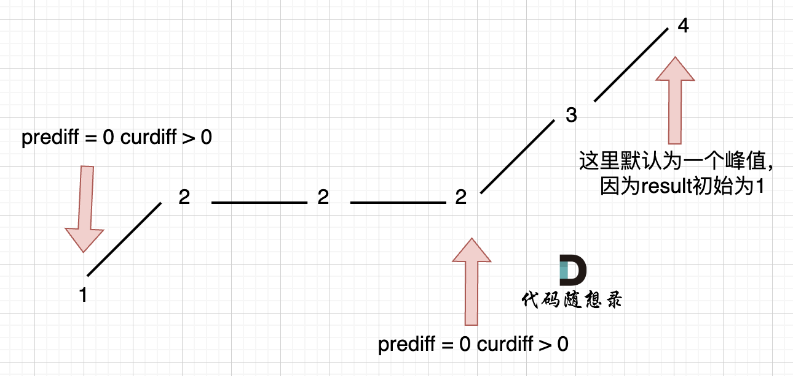


```
3.对于首尾节点，我们无法通过previousDiff和beforeDiff来判断节点是否满足条件，因为首尾节点最多只会关联2个节点
要解决这个问题，我们可以假设首节点前面已经存在一个与首节点相同的节点，这样对于首节点就可以通过previousDiff和beforeDiff来判断
对于末尾节点，我们就默认存在一个峰顶或坡底（实际上确实至少存在一个），也就是末尾节点
```


```java
//376.摆动序列
public class LeetCode376 {
    public int wiggleMaxLength(int[] nums) {
        /**
         * 思路：
         * 可以根据数组的值，画出一个折线图，不难发现，折线图的峰顶或者坡底都能算一个摆动序列的一个点
         * 也就是当前节点nums[i]减去前一个节点nums[i-1]的差previousDiff
         * 与后一个节点nums[i+1]减去当前节点nums[i]的差beforeDiff正负是不同的时候，说明就是峰顶或坡底
         * 但是这里需要考虑三种特殊情况：
         * 1.对于连续的水平坡面应该算几个节点呢？
         * 对于水平坡面，比如 1 2 2 2 1
         * 只需要在水平坡面的多个节点中取出一个即可，为了方便，统一取最后一个，也就是当nums[i]-nums[i-1]=0&&nums[i+1]-nums[i]<0的时候
         * 对于 2 1 1 1 2这个序列也是同理，也就是当nums[i]-nums[i-1]=0&&nums[i+1]-nums[i]>0的时候
         *
         * 2.对于单调坡与水平坡同时出现的情况
         * 比如 1 2 2 2 3 4 这个序列
         * 中间的2 2 2就是水平坡，但是整个序列的坡是单调的，这个时候就不能像第一种特殊情况那样取水平坡的最后一个2了
         * 要解决这种情况，我们可以通过仅在出现峰顶或坡底的时候才去更新previousDiff来避免错误地记录这个序列中水平坡的最后一个2的情况
         *
         * 3.对于首尾节点，我们无法通过previousDiff和beforeDiff来判断节点是否满足条件，因为首尾节点最多只会关联2个节点
         * 要解决这个问题，我们可以假设首节点前面已经存在一个与首节点相同的节点，这样对于首节点就可以通过previousDiff和beforeDiff来判断
         * 对于末尾节点，我们就默认存在一个峰顶或坡底（实际上确实至少存在一个），也就是末尾节点
         *
         *
         * 其实就可以把previousDiff和beforeDiff看成是单调的趋势，如果大于0，说明单调递增，小于0，说明单调递减
         */

        int result = 1;
        //假设首节点前面存在一个与首节点相同的节点，这样的话刚开始previousDiff就为0
        int previousDiff = 0;
        int beforeDiff = 0;

        for (int i = 0; i < nums.length-1; i++) { //最后一个节点不需要判断
            beforeDiff = nums[i+1]-nums[i];
            if((previousDiff<=0&&beforeDiff>0)||(previousDiff>=0&&beforeDiff<0)){
                result++;
                //仅在出现峰顶或坡底时才更新previousDiff
                previousDiff = beforeDiff;
            }

        }

        return result;
    }
}
```


## 4.最大子序和

### 题目

[力扣题目链接](https://leetcode.cn/problems/maximum-subarray/)

给定一个整数数组 nums ，找到一个具有最大和的连续子数组（子数组最少包含一个元素），返回其最大和。

示例:

- 输入: [-2,1,-3,4,-1,2,1,-5,4]
- 输出: 6
- 解释: 连续子数组  [4,-1,2,1] 的和最大，为  6。


### 思路

```
这题可以使用贪心
贪心点在于：当目前的连续数组和小于0时，那么认为这个连续数组必然会使后面的连续数组的值减小，所以放弃当前的连续数组，直接取下一个值
```


```java
//53.最大子数组和
public class LeetCode53 {
    public int maxSubArray(int[] nums) {
        /**
         * 思路：
         * 这题可以使用贪心
         * 贪心点在于：当目前的连续数组和小于0时，那么认为这个连续数组必然会使后面的连续数组的值减小，所以放弃当前的连续数组，直接取下一个值
         */

        int result = Integer.MIN_VALUE;
        //目前的连续数组和
        int count = 0;
        for (int i = 0; i < nums.length; i++) {
            count += nums[i];
            result = Math.max(result, count);
            if (count < 0) count = 0;
        }

        return result;
    }
}
```


## 6.买卖股票的最佳时机II（贪心）

### 题目

[力扣题目链接](https://leetcode.cn/problems/best-time-to-buy-and-sell-stock-ii/)

给定一个数组，它的第  i 个元素是一支给定股票第 i 天的价格。

设计一个算法来计算你所能获取的最大利润。你可以尽可能地完成更多的交易（多次买卖一支股票）。

注意：你不能同时参与多笔交易（你必须在再次购买前出售掉之前的股票）。

示例 1:

- 输入: [7,1,5,3,6,4]
- 输出: 7
- 解释: 在第 2 天（股票价格 = 1）的时候买入，在第 3 天（股票价格 = 5）的时候卖出, 这笔交易所能获得利润 = 5-1 = 4。随后，在第 4 天（股票价格 = 3）的时候买入，在第 5 天（股票价格 = 6）的时候卖出, 这笔交易所能获得利润 = 6-3 = 3 。

示例 2:

- 输入: [1,2,3,4,5]
- 输出: 4
- 解释: 在第 1 天（股票价格 = 1）的时候买入，在第 5 天 （股票价格 = 5）的时候卖出, 这笔交易所能获得利润 = 5-1 = 4 。注意你不能在第 1 天和第 2 天接连购买股票，之后再将它们卖出。因为这样属于同时参与了多笔交易，你必须在再次购买前出售掉之前的股票。

示例  3:

- 输入: [7,6,4,3,1]
- 输出: 0
- 解释: 在这种情况下, 没有交易完成, 所以最大利润为 0。

提示：

- 1 <= prices.length <= 3 * 10 ^ 4
- 0 <= prices[i] <= 10 ^ 4


### 思路

```
这道题的贪心点在于，只要利润是正利润，那就是买卖股票的最佳时机
因此对于prices数组，可以先获取相邻元素的差（也就是两天之间的利润）
只要利润是正数，就将其累加到结果中
```


```java
//122.买卖股票的最佳时机II
public class LeetCode122 {
    public int maxProfit(int[] prices) {
        /**
         * 思路：
         * 这道题的贪心点在于，只要利润是正利润，那就是买卖股票的最佳时机
         * 因此对于prices数组，可以先获取相邻元素的差（也就是两天之间的利润）
         * 只要利润是正数，就将其累加到结果中
         */

        int result = 0;
        for (int i = 1; i < prices.length; i++) {
            int profit = prices[i] - prices[i - 1];
            if (profit > 0) result += profit;
        }
        return result;
    }
}
```


## 7.跳跃游戏

### 题目

[力扣题目链接](https://leetcode.cn/problems/jump-game/)

给定一个非负整数数组，你最初位于数组的第一个位置。

数组中的每个元素代表你在该位置可以跳跃的最大长度。

判断你是否能够到达最后一个位置。

示例  1:

- 输入: [2,3,1,1,4]
- 输出: true
- 解释: 我们可以先跳 1 步，从位置 0 到达 位置 1, 然后再从位置 1 跳 3 步到达最后一个位置。

示例  2:

- 输入: [3,2,1,0,4]
- 输出: false
- 解释: 无论怎样，你总会到达索引为 3 的位置。但该位置的最大跳跃长度是 0 ， 所以你永远不可能到达最后一个位置。


### 思路

```
对于每一个元素，它能够到达的范围就是它本身的索引加上其对应的值，
比如第1个元素，该元素值为3，那么这个元素能够到达的最大范围就是（索引）0+3 = 3（索引）
而在（索引）1到（索引）3这个范围内的每一个元素又可以扩充覆盖的范围，例如：假如（索引）1的值也为3，那么该元素能够覆盖的范围就是1+3=4，此时说明能够到达的最大范围就变为了4
依次类推，每遍历一个元素都可以尝试扩充覆盖范围
如果扩充后的范围大于等于最后一个元素的下标，说明能够到达最后一个元素
```


```java
//55.跳跃游戏
public class LeetCode55 {
    public boolean canJump(int[] nums) {
        /**
         * 思路：
         * 对于每一个元素，它能够到达的范围就是它本身的索引加上其对应的值，
         * 比如第1个元素，该元素值为3，那么这个元素能够到达的最大范围就是（索引）0+3 = 3（索引）
         * 而在（索引）1到（索引）3这个范围内的每一个元素又可以扩充覆盖的范围，例如：假如（索引）1的值也为3，那么该元素能够覆盖的范围就是1+3=4，此时说明能够到达的最大范围就变为了4
         * 依次类推，每遍历一个元素都可以尝试扩充覆盖范围
         * 如果扩充后的范围大于等于最后一个元素的下标，说明能够到达最后一个元素
         */

        int cover = 0;
        for (int i = 0; i <= cover; i++) {
            cover = Math.max(cover, nums[i] + i);
            if (cover >= nums.length - 1) return true;
        }

        return false;

    }
}
```


## 8.跳跃游戏II

### 题目

[力扣题目链接](https://leetcode.cn/problems/jump-game-ii/)

给定一个非负整数数组，你最初位于数组的第一个位置。

数组中的每个元素代表你在该位置可以跳跃的最大长度。

你的目标是使用最少的跳跃次数到达数组的最后一个位置。

示例:

- 输入: [2,3,1,1,4]
- 输出: 2
- 解释: 跳到最后一个位置的最小跳跃数是 2。从下标为 0 跳到下标为 1 的位置，跳  1 步，然后跳  3 步到达数组的最后一个位置。

说明: 假设你总是可以到达数组的最后一个位置。


### 思路

```java
//45.跳跃游戏II
public class LeetCode45 {
    public int jump(int[] nums) {
        /**
         * 思路：
         * 要使得到达最后一个元素的跳跃次数最少，那就只在必须要跳的时候才跳
         * 而什么时候是必须要跳的时候呢？就是在当前元素的覆盖范围够不到最后一个元素的时候就必须要跳
         * 至于要跳到具体哪一个元素，这个不重要，重要的是跳跃后新的覆盖范围是否能够覆盖到最后一个元素
         * 如果可以，说明就不用继续跳了，如果不行，说明还需要接着跳跃
         * 所以我们需要不断更新下一次跳跃后的最大覆盖范围
         */

        //当前元素的覆盖范围
        int curCover = 0;
        //下一次跳跃的覆盖范围
        int nextCover = 0;
        int result = 0;

        for (int i = 0; i < nums.length; i++) {
            if(i>curCover){
                //如果当前覆盖范围无法到达目前遍历到的索引，自然也无法到达最后一个元素，所以此时需要跳跃
                curCover = nextCover;
                result++;
            }
            //获取下一次跳跃的最大覆盖范围
            nextCover = Math.max(nextCover,nums[i]+i);

            //如果当前覆盖范围已经大于等于最后一个元素的索引时，说明不需要再进行跳跃了
            if(curCover>=nums.length-1) break;
        }
        return result;

    }
}
```


## 9.K次取反后最大化的数组和

### 题目

[力扣题目链接](https://leetcode.cn/problems/maximize-sum-of-array-after-k-negations/)

给定一个整数数组 A，我们只能用以下方法修改该数组：我们选择某个索引 i 并将 A[i] 替换为 -A[i]，然后总共重复这个过程 K 次。（我们可以多次选择同一个索引 i。）

以这种方式修改数组后，返回数组可能的最大和。

示例 1：

- 输入：A = [4,2,3], K = 1
- 输出：5
- 解释：选择索引 (1) ，然后 A 变为 [4,-2,3]。

示例 2：

- 输入：A = [3,-1,0,2], K = 3
- 输出：6
- 解释：选择索引 (1, 2, 2) ，然后 A 变为 [3,1,0,2]。

示例 3：

- 输入：A = [2,-3,-1,5,-4], K = 2
- 输出：13
- 解释：选择索引 (1, 4) ，然后 A 变为 [2,3,-1,5,4]。

提示：

- 1 <= A.length <= 10000
- 1 <= K <= 10000
- -100 <= A[i] <= 100


### 思路

这题要学会用stream流对数组进行处理

```java
//1005.k次取反后最大化的数组和
public class LeetCode1005 {
    public int largestSumAfterKNegations(int[] nums, int k) {
        /**
         * 思路：贪心
         * 如果希望数组和最大，只需要尽可能将所有数变成正数
         * 如果k大于负数个数，就可以保证所有负数都能够变成正数，然后只需要把剩下的变换次数全部给到绝对值最小的那个数即可
         * 如果k小于负数个数，就优先将绝对值最大的负数变成正数，最大限对提高数组和的大小
         */

        //对原数组按照绝对值大小排序，这个数组排序方法要掌握
        nums = IntStream.of(nums).boxed().sorted((o1, o2) -> Math.abs(o2) - Math.abs(o1)).mapToInt(Integer::intValue).toArray();

        //从前往后遍历数组，如果遇到负数，就将其变为正数，如果遇到正数，就跳过
        for (int i = 0; i < nums.length; i++) {
            if (nums[i] < 0 && k > 0) {
                nums[i] = -nums[i];
                k--;
                if(k==0) break;
            }
        }
//        while (k>0){
//            nums[nums.length-1] = -nums[nums.length-1];
//            k--;
//        }
        //优化上面的代码
        if(k%2==1) nums[nums.length-1] = -nums[nums.length-1];

//        int result = 0;
//        for (int i = 0; i < nums.length; i++) {
//            result+=nums[i];
//        }
//        return result;

        //优化上面的代码
        return Arrays.stream(nums).sum();

    }
}
```


## 11.加油站

### 题目

[力扣题目链接](https://leetcode.cn/problems/gas-station/)

在一条环路上有 N 个加油站，其中第 i 个加油站有汽油 gas[i] 升。

你有一辆油箱容量无限的的汽车，从第 i 个加油站开往第 i+1 个加油站需要消耗汽油 cost[i] 升。你从其中的一个加油站出发，开始时油箱为空。

如果你可以绕环路行驶一周，则返回出发时加油站的编号，否则返回 -1。

说明:

- 如果题目有解，该答案即为唯一答案。
- 输入数组均为非空数组，且长度相同。
- 输入数组中的元素均为非负数。

示例 1: 输入:

- gas = [1,2,3,4,5]
- cost = [3,4,5,1,2]

输出: 3 解释:

- 从 3 号加油站(索引为 3 处)出发，可获得 4 升汽油。此时油箱有 = 0 + 4 = 4 升汽油
- 开往 4 号加油站，此时油箱有 4 - 1 + 5 = 8 升汽油
- 开往 0 号加油站，此时油箱有 8 - 2 + 1 = 7 升汽油
- 开往 1 号加油站，此时油箱有 7 - 3 + 2 = 6 升汽油
- 开往 2 号加油站，此时油箱有 6 - 4 + 3 = 5 升汽油
- 开往 3 号加油站，你需要消耗 5 升汽油，正好足够你返回到 3 号加油站。
- 因此，3 可为起始索引。

示例 2: 输入:

- gas = [2,3,4]
- cost = [3,4,3]
- 输出: -1
- 解释: 你不能从 0 号或 1 号加油站出发，因为没有足够的汽油可以让你行驶到下一个加油站。我们从 2 号加油站出发，可以获得 4 升汽油。 此时油箱有 = 0 + 4 = 4 升汽油。开往 0 号加油站，此时油箱有 4 - 3 + 2 = 3 升汽油。开往 1 号加油站，此时油箱有 3 - 3 + 3 = 3 升汽油。你无法返回 2 号加油站，因为返程需要消耗 4 升汽油，但是你的油箱只有 3 升汽油。因此，无论怎样，你都不可能绕环路行驶一周。


### 思路


```java
//134.加油站
public class LeetCode134 {
    public static void main(String[] args) {
        canCompleteCircuit(new int[]{1,2,3,4,5},new int[]{3,4,5,1,2});
    }

    public static int canCompleteCircuit(int[] gas, int[] cost) {
        /**
         * 思路：
         * 计算每一个节点能够剩下的油
         * 从0开始累加剩下的油，也就是计算[0,i]这个区间的剩余油总和
         * 如果这个剩余油的总和出现小于0的情况，说明从0节点开始，中间出现了断油情况
         * 说明，就不能从节点0开始，因此需要更新起点为i+1，再从起点i+1重新开始计算剩余油总和，重复上面的步骤
         * 如果累加到了最后一个节点，并且当前起点i到最后一个节点的总和能够满足起点前面所有节点的用油需求，就说明当前起点是最终结果
         */

        //当前区间的剩余油量总和
        int curSum = 0;
        //从0到当前节点的剩余油总和，如果该值大于0，说明当前区间的剩余油总和能够满足前面节点的用油需求
        int total = 0;
        //起点
        int start = 0;
        for (int i = 0; i < gas.length; i++) {
            int rest = gas[i] - cost[i];
            //踩坑点，这里写反了
//            int rest = cost[i] - gas[i];
            curSum += rest;
            total += rest;
            //如果出现小于0的情况，说明出现了断油
            if (curSum < 0) {
                start = i + 1;
                curSum = 0;
            }

        }

        //如果total小于0，说明当前区间剩余油无法满足前面节点的用油需求
        if (total < 0) return -1;
        return start;

    }
}
```


## 12.分发糖果（hard，暂时跳过）


## 13.柠檬水找零

### 题目

[力扣题目链接](https://leetcode.cn/problems/lemonade-change/)

在柠檬水摊上，每一杯柠檬水的售价为 5 美元。

顾客排队购买你的产品，（按账单 bills 支付的顺序）一次购买一杯。

每位顾客只买一杯柠檬水，然后向你付 5 美元、10 美元或 20 美元。你必须给每个顾客正确找零，也就是说净交易是每位顾客向你支付 5 美元。

注意，一开始你手头没有任何零钱。

如果你能给每位顾客正确找零，返回 true ，否则返回 false 。

示例 1：

- 输入：[5,5,5,10,20]
- 输出：true
- 解释：
  - 前 3 位顾客那里，我们按顺序收取 3 张 5 美元的钞票。
  - 第 4 位顾客那里，我们收取一张 10 美元的钞票，并返还 5 美元。
  - 第 5 位顾客那里，我们找还一张 10 美元的钞票和一张 5 美元的钞票。
  - 由于所有客户都得到了正确的找零，所以我们输出 true。

示例 2：

- 输入：[5,5,10]
- 输出：true

示例 3：

- 输入：[10,10]
- 输出：false

示例 4：

- 输入：[5,5,10,10,20]
- 输出：false
- 解释：
  - 前 2 位顾客那里，我们按顺序收取 2 张 5 美元的钞票。
  - 对于接下来的 2 位顾客，我们收取一张 10 美元的钞票，然后返还 5 美元。
  - 对于最后一位顾客，我们无法退回 15 美元，因为我们现在只有两张 10 美元的钞票。
  - 由于不是每位顾客都得到了正确的找零，所以答案是 false。

提示：

- 0 <= bills.length <= 10000
- bills[i] 不是 5 就是 10 或是 20


### 思路

```
思路：
题目说了我们只需要维护5、10、20这三种数据
于是收钱策略为：
1.收到5块，直接收下
2.收到10块，消耗一张5块，收下一张10块
3.收到20块，优先使用一张10块加一张5块找零，如果没有足够的钱满足这种方式，就再选择用三张5块找零
贪心策略体现在第三种情况，优先使用10块来找零，因为10块只能用来找零20，而5块既能用于找零10也能用于找零20
```

```java
//860.柠檬水找零
public class LeetCode860 {
    public boolean lemonadeChange(int[] bills) {
        /**
         * 思路：
         * 我们只需要维护5、10、20这三种数据
         * 于是收钱策略为：
         * 1.收到5块，直接收下
         * 2.收到10块，消耗一张5块，收下一张10块
         * 3.收到20块，优先使用一张10块加一张5块找零，如果没有足够的钱满足这种方式，就再选择用三张5块找零
         */

        //表示5块有多少张
        int five = 0;
        //表示10块有多少张
        int ten =0;
        for (int i = 0; i < bills.length; i++) {
            if(bills[i]==5) {
                //情况一
                five++;
            }else if(bills[i]==10){
                //情况二
                ten++;
                five--;
            }else {
                //情况三
                if(ten>0&&five>0){
                    ten--;
                    five--;
                }else {
                    five-=3;
                }
            }
            if(five<0||ten<0){
                return false;
            }
        }
        return true;
    }
}
```


## 14.根据身高重建队列

### 题目

[力扣题目链接](https://leetcode.cn/problems/queue-reconstruction-by-height/)

假设有打乱顺序的一群人站成一个队列，数组 people 表示队列中一些人的属性（不一定按顺序）。每个 people[i] = [hi, ki] 表示第 i 个人的身高为 hi ，前面 正好 有 ki 个身高大于或等于 hi 的人。

请你重新构造并返回输入数组 people 所表示的队列。返回的队列应该格式化为数组 queue ，其中 queue[j] = [hj, kj] 是队列中第 j 个人的属性（queue[0] 是排在队列前面的人）。

示例 1：

- 输入：people = [[7,0],[4,4],[7,1],[5,0],[6,1],[5,2]]
- 输出：[[5,0],[7,0],[5,2],[6,1],[4,4],[7,1]]
- 解释：
  - 编号为 0 的人身高为 5 ，没有身高更高或者相同的人排在他前面。
  - 编号为 1 的人身高为 7 ，没有身高更高或者相同的人排在他前面。
  - 编号为 2 的人身高为 5 ，有 2 个身高更高或者相同的人排在他前面，即编号为 0 和 1 的人。
  - 编号为 3 的人身高为 6 ，有 1 个身高更高或者相同的人排在他前面，即编号为 1 的人。
  - 编号为 4 的人身高为 4 ，有 4 个身高更高或者相同的人排在他前面，即编号为 0、1、2、3 的人。
  - 编号为 5 的人身高为 7 ，有 1 个身高更高或者相同的人排在他前面，即编号为 1 的人。
  - 因此 [[5,0],[7,0],[5,2],[6,1],[4,4],[7,1]] 是重新构造后的队列。

示例 2：

- 输入：people = [[6,0],[5,0],[4,0],[3,2],[2,2],[1,4]]
- 输出：[[4,0],[5,0],[2,2],[3,2],[1,4],[6,0]]

提示：

- 1 <= people.length <= 2000
- 0 <= hi <= 10^6
- 0 <= ki < people.length

题目数据确保队列可以被重建


### 思路

这题和12.分发糖果有相似之处

```
思路：
对于这种存在两个维度的题，最好先将一个维度确定下来，再接着去确定另一个维度
这题就可以先根据身高这个维度，将身高从大到小排列
然后再依次处理每一个元素的k，而在处理k的时候，就可以放心把元素随便地往前插入，因为前面的身高总是大于当前元素的，k为多少，就将元素插到索引为k的位置
这样一来，当前元素往前插入，前面的元素的k也能符合结果（因为后面插入进来的身高始终小于前面元素的身高）
```


```java
//406.根据身高重建队列
public class LeetCode406 {
    public int[][] reconstructQueue(int[][] people) {
        /**
         * 思路：
         * 对于这种存在两个维度的题，最好先将一个维度确定下来，再接着去确定另一个维度
         * 这题就可以先根据身高这个维度，将身高从大到小排列
         * 然后再依次处理每一个元素的k，而在处理k的时候，就可以放心把元素随便地往前插入，因为前面的身高总是大于当前元素的，k为多少，就将元素插到索引为k的位置
         * 这样一来，当前元素往前插入，前面的元素的k也能符合结果（因为后面插入进来的身高始终小于前面元素的身高）
         */

        //先将数组根据身高这一维度排序
        Arrays.sort(people, new Comparator<int[]>() {
            @Override
            public int compare(int[] o1, int[] o2) {
                //当身高相同时，根据k升序排序
                if(o1[0]==o2[0]) return o1[1]-o2[1];
                //身高不同时，根据身高降序排序
                return o2[0]-o1[0];
            }
        });

        LinkedList<int[]> result = new LinkedList<>();

        //接着遍历每一个元素，根据k重新插入新的位置
        for (int i = 0; i < people.length; i++) {
            result.add(people[i][1],people[i]);
        }

        return result.toArray(new int[people.length][]);
    }
}
```


## 17.用最少数量的箭引爆气球

### 题目

[力扣题目链接](https://leetcode.cn/problems/minimum-number-of-arrows-to-burst-balloons/)

在二维空间中有许多球形的气球。对于每个气球，提供的输入是水平方向上，气球直径的开始和结束坐标。由于它是水平的，所以纵坐标并不重要，因此只要知道开始和结束的横坐标就足够了。开始坐标总是小于结束坐标。

一支弓箭可以沿着 x 轴从不同点完全垂直地射出。在坐标 x 处射出一支箭，若有一个气球的直径的开始和结束坐标为 xstart，xend， 且满足  xstart ≤ x ≤ xend，则该气球会被引爆。可以射出的弓箭的数量没有限制。 弓箭一旦被射出之后，可以无限地前进。我们想找到使得所有气球全部被引爆，所需的弓箭的最小数量。

给你一个数组 points ，其中 points [i] = [xstart,xend] ，返回引爆所有气球所必须射出的最小弓箭数。

示例 1：

- 输入：points = [[10,16],[2,8],[1,6],[7,12]]
- 输出：2
- 解释：对于该样例，x = 6 可以射爆 [2,8],[1,6] 两个气球，以及 x = 11 射爆另外两个气球

示例 2：

- 输入：points = [[1,2],[3,4],[5,6],[7,8]]
- 输出：4

示例 3：

- 输入：points = [[1,2],[2,3],[3,4],[4,5]]
- 输出：2

示例 4：

- 输入：points = [[1,2]]
- 输出：1

示例 5：

- 输入：points = [[2,3],[2,3]]
- 输出：1

提示：

- 0 <= points.length <= 10^4
- points[i].length == 2
- -2^31 <= xstart < xend <= 2^31 - 1


### 思路

```
思路：
贪心策略，贪心点在于对于所有出现重叠气球的区间，都使用一支箭
将points气球按起点排序，去寻找每一个重叠区域，比如有气球[1,6] [2,8] [7,12] [10,16]
第一个重叠区域就是1~6，凡是起点在这个范围内的气球，都可以被一支箭射爆，所以[1,6]和[2,8]就被同一支箭射爆了
接着去找第二个重叠区域：7~12（[2,8]已经被射爆了）,在这个重叠区域内[7,12]和[10,16]会被同一支箭射爆
最终结果就是最少只需要2支箭
```


```java
//452.用最少的数量的箭射爆气球
public class LeetCode452 {
    public static void main(String[] args) {
        findMinArrowShots(new int[][]{{-2147483646,-2147483645},{2147483646,2147483647}});
    }

    public static int findMinArrowShots(int[][] points) {
        /**
         * 思路：
         * 贪心策略，贪心点在于对于所有出现重叠气球的区间，都使用一支箭
         * 将points气球按起点排序，去寻找每一个重叠区域，比如有气球[1,6] [2,8] [7,12] [10,16]
         * 第一个重叠区域就是1~6，凡是起点在这个范围内的气球，都可以被一支箭射爆，所以[1,6]和[2,8]就被同一支箭射爆了
         * 接着去找第二个重叠区域：7~12（[2,8]已经被射爆了）,在这个重叠区域内[7,12]和[10,16]会被同一支箭射爆
         * 最终结果就是最少只需要2支箭
         */

        //将所有气球按照起点排序
        Arrays.sort(points, new Comparator<int[]>() {
            @Override
            public int compare(int[] o1, int[] o2) {
                //踩坑点1，这里会溢出，对于这个用例就会排序错误{-2147483646,-2147483645},{2147483646,2147483647}
//                return o1[0]-o2[0];
                //使用Integer内置比较方法，不会溢出
                return Integer.compare(o1[0],o2[0]);
            }
        });

        //最终所消耗的箭
        int result = 0;
        //cover表示重叠范围的右边界,初始化为第一个气球的右边界
        int cover = points[0][1];

        //从前往后遍历
        for (int i = 1; i < points.length; i++) {
            if(points[i][0]>cover){
                cover=points[i][1];
                result++;
            }else {
                //踩坑点2：没有考虑这里的情况
                //如果某一个气球在重叠范围内，需要不断更新cover的范围，让cover范围是所有重叠气球中右边界最小的那一个
                cover=Math.min(cover,points[i][1]);
            }

        }
        //最后再将剩下的气球射爆
        result++;

        return result;
    }
}
```


## 18.无重叠区间

### 题目

[力扣题目链接](https://leetcode.cn/problems/non-overlapping-intervals/)

给定一个区间的集合，找到需要移除区间的最小数量，使剩余区间互不重叠。

注意: 可以认为区间的终点总是大于它的起点。 区间 [1,2] 和 [2,3] 的边界相互“接触”，但没有相互重叠。

示例 1:

- 输入: [ [1,2], [2,3], [3,4], [1,3] ]
- 输出: 1
- 解释: 移除 [1,3] 后，剩下的区间没有重叠。

示例 2:

- 输入: [ [1,2], [1,2], [1,2] ]
- 输出: 2
- 解释: 你需要移除两个 [1,2] 来使剩下的区间没有重叠。

示例 3:

- 输入: [ [1,2], [2,3] ]
- 输出: 0
- 解释: 你不需要移除任何区间，因为它们已经是无重叠的了。


### 思路

```
思路：
这道题说实话，我觉得非常难以理解
这道题的贪心策略在于如果出现重叠，就优先移除区间范围更大的区间
因为区间越大，就代表越有可能与其他区间发生重叠
想法是这么想的，但是实现起来就显得有点抽象
1.首先将区间按左边界或者右边界进行排序，这里选择右边界
比如[1,2] [2,3] [3,4] [1,3]
排序后就是 [1,2] [1,3] [2,3] [3,4]
2.接着从左往右依次获取区间范围最小的区间，比如这里是[1,2]，与这个区间重叠的所有区间都要移除，比如这里需要移除[1,3]
3.当遍历到第一个不与上面区间重叠的区间时，就记录最终剩余的区间数加1（[1,2]区间一定会被保留），比如这里第一个不与[1,2]重叠的区间就是[2,3]
4.此时就用这个新的[2,3]区间去判断后面的区间，凡是与这个区间重叠的都要移除，与上面的步骤一样，直到遍历完所有区间
最后得到的剩余区间数就是能够剩余的最大区间数maxCount，用原本的区间数减去这个值就是最终的结果
```

解释一下下面这个图，下面这个图也是按右边界排序的

首先遍历区间1，然后往后接着遍历，发现区间2和区间3都与区间一重叠，所以这两个区间都需要移除。

接着遍历到区间4，发现区间4不与区间1重叠，于是更新区间为区间4的区间，并maxCount++，用区间4去判断后面重叠的情况（因为前面重叠的区间已经移除完了）

接着往后，发现区间5与区间4重叠，于是区间5也要被移除，最后到区间6，发现区间6不与区间4重叠，于是又maxCount++，更新区间为区间6，由于后面没有区间了，所以此时判断结束。

最终剩下的区间就是1、4、6


```java
//435.无重叠区间
public class LeetCode435 {


    public int eraseOverlapIntervals(int[][] intervals) {
        /**
         * 思路：
         * 这道题说实话，我觉得非常难以理解
         * 这道题的贪心策略在于如果出现重叠，就优先移除区间范围更大的区间
         * 因为区间越大，就代表越有可能与其他区间发生重叠
         * 想法是这么想的，但是实现起来就显得有点抽象
         * 1.首先将区间按左边界或者右边界进行排序，这里选择右边界
         * 比如[1,2] [2,3] [3,4] [1,3]
         * 排序后就是 [1,2] [1,3] [2,3] [3,4]
         * 2.接着从左往右依次获取区间范围最小的区间，比如这里是[1,2]，与这个区间重叠的所有区间都要移除，比如这里需要移除[1,3]
         * 3.当遍历到第一个不与上面区间重叠的区间时，就记录最终剩余的区间数加1（[1,2]区间一定会被保留），比如这里第一个不与[1,2]重叠的区间就是[2,3]
         * 4.此时就用这个新的[2,3]区间去判断后面的区间，凡是与这个区间重叠的都要移除，与上面的步骤一样，直到遍历完所有区间
         * 最后得到的剩余区间数就是能够剩余的最大区间数maxCount，用原本的区间数减去这个值就是最终的结果
         */

        //根据右边界排序
        Arrays.sort(intervals,(o1,o2)->{
            //如果右边界相同，就按左边界从小到大排序
            if(o1[1]==o2[1]) return o1[0]-o2[0];
            return o1[1]-o2[1];
        });

        //初始化最小右边界,代表的就是每次获取的范围最小的区间的右边界
        int minRight = Integer.MIN_VALUE;
        //最终剩余的最大区间数
        int maxCount = 0;
        //从左遍历区间
        for (int i = 0; i < intervals.length; i++) {
            //如果区间的左边界小于minRight，说明重叠了，该区间需要去除
            if(intervals[i][0]>=minRight){
                //如果区间左边界大于等于minRight，就更新区间
                minRight = intervals[i][1];
                maxCount++;
            }
        }

        return intervals.length-maxCount;

    }
}
```


## 19.划分字母区间

### 题目

[力扣题目链接](https://leetcode.cn/problems/partition-labels/)

字符串 S 由小写字母组成。我们要把这个字符串划分为尽可能多的片段，同一字母最多出现在一个片段中。返回一个表示每个字符串片段的长度的列表。

示例：

- 输入：S = "ababcbacadefegdehijhklij"
- 输出：[9,7,8] 解释： 划分结果为 "ababcbaca", "defegde", "hijhklij"。 每个字母最多出现在一个片段中。 像 "ababcbacadefegde", "hijhklij" 的划分是错误的，因为划分的片段数较少。

提示：

- S的长度在[1, 500]之间。
- S只包含小写字母 'a' 到 'z' 。


### 思路

```
要保证一个区间内的所有字母都只会出现在这个区间内，只需要区间内所有字母的最远边界不会超过当前区间的最远边界
比如这个区间[abab],a字母的最远边界为3，b字母的最远边界为4，此时a、b两个字母的边界都没有超过这个区间的边界
因此对于字符串s中的字母，我们先统计每一个字母的最远边界
然后依次遍历每一个字符，如果到达的位置是前面字母的最远边界，则这个位置就是一个区间的右边界
比如对于ababcc这个字符串，依次统计字母的最远边界为：a为3，b为4，c为6
那么从左往右遍历的流程为，先遍历a，此时前面所有字母的最远边界为3，然后遍历到b，发现b的最远边界为4，于是更新前面所有字母的最远边界为4
接着往后遍历，直到到达4这个位置，前面所有字母的最远边界为4，说明这个位置就是前面字母组成区间的右边界。
找到一个区间后接着遍历后面的字母，采用同样的方式去获取后面的区间
```


```java
//763.划分字母区间
public class LeetCode763 {

    //优化代码,优化后耗时4ms
    public List<Integer> partitionLabels_Optimize(String s) {
        /**
         * 下面的代码每次遍历字母时都要调用字符串的lastIndexOf方法，这会非常耗时
         * 因此可以提前统计出所有字母的最远边界
         */

        //Edge[0]表示a的最远边界
        int[] Edge = new int[26];
        //统计字母的最远边界
        for (int i = 0; i < s.length(); i++) {
            Edge[s.charAt(i)-'a'] = i;
        }

        List<Integer> result = new ArrayList<>();
        //这个last表示上一个区间的右边界
        int last = -1;
        //cur代表当前区间所有字母的最远边界
        int cur = 0;
        for (int i = 0; i < s.length(); i++) {
            cur = Math.max(cur,Edge[s.charAt(i)-'a']);
            if(cur==i){
                //到达区间分界点
                result.add(i-last);
                last = cur;
            }
        }

        return result;
    }

    //优化前耗时10ms
    public List<Integer> partitionLabels(String s) {
        /**
         * 思路：
         * 要保证一个区间内的所有字母都只会出现在这个区间内，只需要区间内所有字母的最远边界不会超过当前区间的最远边界
         * 比如这个区间[abab],a字母的最远边界为3，b字母的最远边界为4，此时a、b两个字母的边界都没有超过这个区间的边界
         * 因此对于字符串s中的字母，我们先统计每一个字母的最远边界
         * 然后依次遍历每一个字符，如果到达的位置是前面字母的最远边界，则这个位置就是一个区间的右边界
         * 比如对于ababcc这个字符串，依次统计字母的最远边界为：a为3，b为4，c为6
         * 那么从左往右遍历的流程为，先遍历a，此时前面所有字母的最远边界为3，然后遍历到b，发现b的最远边界为4，于是更新前面所有字母的最远边界为4
         * 接着往后遍历，直到到达4这个位置，前面所有字母的最远边界为4，说明这个位置就是前面字母组成区间的右边界。
         * 找到一个区间后接着遍历后面的字母，采用同样的方式去获取后面的区间
         */

        List<Integer> result = new ArrayList<>();

        //当前区间的最远边界
        int curBorder = s.lastIndexOf(s.charAt(0));
        //len表示区间的长度
        int len = 0;
        for (int i = 0; i < s.length(); i++) {
            len++;
            //更新前面字母的最远边界
            curBorder = Math.max(curBorder,s.lastIndexOf(s.charAt(i)));
            if(curBorder==i){
                //如果当前位置到达了区间的最远边界，说明当前位置就是一个分割点
                result.add(len);
                //踩坑点：忘记将len置0了
                len = 0;
            }
        }
        return result;
    }
}
```


## 20.合并区间

### 题目

[力扣题目链接](https://leetcode.cn/problems/merge-intervals/)

给出一个区间的集合，请合并所有重叠的区间。

示例 1:

- 输入: intervals = [[1,3],[2,6],[8,10],[15,18]]
- 输出: [[1,6],[8,10],[15,18]]
- 解释: 区间 [1,3] 和 [2,6] 重叠, 将它们合并为 [1,6].

示例 2:

- 输入: intervals = [[1,4],[4,5]]
- 输出: [[1,5]]
- 解释: 区间 [1,4] 和 [4,5] 可被视为重叠区间。
- 注意：输入类型已于2019年4月15日更改。 请重置默认代码定义以获取新方法签名。


### 思路

```
思路：
对区间按左边界或右边界进行排序
依次遍历排序后的区间
用一个cover变量记录当前合并后区间的右边界，用start表示当前合并区间的左边界
如果遍历到的区间的左边界小于等于cover，并且当前遍历区间的右边界大于cover，就更新cover
如果遍历到的区间的左边界大于cover，说明当前区间不属于cover这个合并后的区间，此时将合并区间加入到结果集中，并更新cover为当前区间的右边界，寻找新的合并区间
```

```java
//56.合并区间
public class LeetCode56 {
    public int[][] merge(int[][] intervals) {
        /**
         * 思路：
         * 对区间按左边界或右边界进行排序
         * 依次遍历排序后的区间
         * 用一个cover变量记录当前合并后区间的右边界，用start表示当前合并区间的左边界
         * 如果遍历到的区间的左边界小于等于cover，并且当前遍历区间的右边界大于cover，就更新cover
         * 如果遍历到的区间的左边界大于cover，说明当前区间不属于cover这个合并后的区间，此时将合并区间加入到结果集中，并更新cover为当前区间的右边界，寻找新的合并区间
         */

        //将区间按左边界排序
        Arrays.sort(intervals,(o1,o2)->{
            //如果左边界相等，就按右边界从小到大排序
            if(o1[0]==o2[0]) return o1[1]-o2[1];
            return o1[0]-o2[0];
        });

        //初始化合并区间的右边界
        int cover = intervals[0][1];
        //初始化合并区间的左边界
        int start = intervals[0][0];
        List<int[]> result = new ArrayList<>();
        //依次遍历每一个区间
        for (int i = 1; i < intervals.length; i++) {
            if(intervals[i][0]<=cover){
                //出现重叠
                cover=Math.max(cover,intervals[i][1]);
            }else {
                //没有出现重叠
                result.add(new int[]{start,cover});
                start=intervals[i][0];
                cover=intervals[i][1];
            }
        }
        //特殊处理最后一个区间
        result.add(new int[]{start,cover});


        return result.toArray(new int[result.size()][]);
    }
}
```


## 22.单调递增的数字

### 题目

[力扣题目链接](https://leetcode.cn/problems/monotone-increasing-digits/)

给定一个非负整数 N，找出小于或等于 N 的最大的整数，同时这个整数需要满足其各个位数上的数字是单调递增。

（当且仅当每个相邻位数上的数字 x 和 y 满足 x <= y 时，我们称这个整数是单调递增的。）

示例 1:

- 输入: N = 10
- 输出: 9

示例 2:

- 输入: N = 1234
- 输出: 1234

示例 3:

- 输入: N = 332
- 输出: 299

说明: N 是在 [0, 10^9] 范围内的一个整数。


### 思路

这道题的细节还是挺多的，对于按每一位处理数字的这种方式（转换成字符数组）值得学习。

```
思路：
对于一个数字，如果它是单增的，直接返回即可
如果它不是单增的，中间出现了递减的情况，也就是 number[i-1]>number[i]的情况，就可以将第i-1个数字减1然后将第i个数字设置为9
这样一来，获取的就是最大的、且每位数字是递增的结果
从后往前遍历，因为如果从前往后遍历就可能导致后面的数字又小于前面的数字了，比如332，从前往后遍历时就会变成329，导致第二个数字小于第1个数字了
```

```java
//738.单调递增的数字
public class LeetCode738 {
    public int monotoneIncreasingDigits(int n) {
        /**
         * 思路：
         * 对于一个数字，如果它是单增的，直接返回即可
         * 如果它不是单增的，中间出现了递减的情况，也就是 number[i-1]>number[i]的情况，就可以将第i-1个数字减1然后将第i个数字设置为9
         * 这样一来，获取的就是最大的、且每位数字是递增的结果
         * 从后往前遍历，因为如果从前往后遍历就可能导致后面的数字又小于前面的数字了，比如332，从前往后遍历时就会变成329，导致第二个数字小于第1个数字了
         */

        //将数字转换成数组
        String s = n + "";
        char[] charArray = s.toCharArray();
        //要变成9的数字起点
        int start = charArray.length;

        //从后往前遍历
        for (int i = charArray.length - 2; i >= 0; i--) {
            if (charArray[i] > charArray[i + 1]) {
                charArray[i]--;
                //这里不能直接赋值为9，因为对于100这种情况最后一个0无法被赋为9，最终结果会是90而不是99
//                charArray[i+1] = '9';
                //记录要变成9的起点，后面统一赋值为9
                start = i + 1;
            }
        }
        //统一给后面的数字赋值为9
        for (int i = start; i < charArray.length; i++) {
            charArray[i] = '9';
        }


        String result = new String(charArray);
        return Integer.parseInt(result);

    }
}
```


# 动态规划

## 1.动态规划整体思路

在做动态规划问题时，可以按照以下思路来思考：

1.确定dp数组，思考dp[i]代表什么意思，比如在斐波那契数那题中dp[i]就表示第i个斐波那契数是多少

2.确定状态转移方程，比如斐波那契数中dp[i]=dp[i-1]+dp[i-2]

3.初始化dp数组，比如斐波那契数中dp[0]=0,dp[1]=1

4.确定遍历顺序，比如斐波那契数中dp数组遍历顺序为从前往后遍历


## 2.斐波那契数

### 题目

[力扣题目链接](https://leetcode.cn/problems/fibonacci-number/)

斐波那契数，通常用 F(n) 表示，形成的序列称为 斐波那契数列 。该数列由 0 和 1 开始，后面的每一项数字都是前面两项数字的和。也就是： F(0) = 0，F(1) = 1 F(n) = F(n - 1) + F(n - 2)，其中 n > 1 给你n ，请计算 F(n) 。

示例 1：

- 输入：2
- 输出：1
- 解释：F(2) = F(1) + F(0) = 1 + 0 = 1

示例 2：

- 输入：3
- 输出：2
- 解释：F(3) = F(2) + F(1) = 1 + 1 = 2

示例 3：

- 输入：4
- 输出：3
- 解释：F(4) = F(3) + F(2) = 2 + 1 = 3

提示：

- 0 <= n <= 30


### 思路

要注意初始化那一步的细节，需要考虑数组长度小于1或小于2的情况，我在那出了错

```
思路：
动态规划经典题
1.确定dp数组,dp[i]代表第i个斐波那契数为dp[i]
2.确定状态转移公式，dp[i]=dp[i-1]+dp[i-2]
3.初始化dp数组 dp[0]=0 dp[1]=1
4.确定dp数组遍历顺序：从前往后遍历
```


```java
//509.斐波那契数
public class LeetCode509 {
    public int fib(int n) {
        /**
         * 思路：
         * 动态规划经典题
         * 1.确定dp数组,dp[i]代表第i个斐波那契数为dp[i]
         * 2.确定状态转移公式，dp[i]=dp[i-1]+dp[i-2]
         * 3.初始化dp数组 dp[0]=0 dp[1]=1
         * 4.确定dp数组遍历顺序：从前往后遍历
         */

        //确定dp数组
        int[] dp = new int[n+1];

        //初始化dp数组,这里有个细节，需要考虑n小于1这些情况
        if(n>=0) dp[0]=0;
        if(n>=1) dp[1]=1;

        //遍历dp数组
        for (int i = 2; i < dp.length; i++) {
            dp[i]=dp[i-1]+dp[i-2];
        }

        return dp[n];
    }
}
```


## 3.爬楼梯

### 题目

[力扣题目链接](https://leetcode.cn/problems/climbing-stairs/)

假设你正在爬楼梯。需要 n 阶你才能到达楼顶。

每次你可以爬 1 或 2 个台阶。你有多少种不同的方法可以爬到楼顶呢？

注意：给定 n 是一个正整数。

示例 1：

- 输入： 2
- 输出： 2
- 解释： 有两种方法可以爬到楼顶。
  - 1 阶 + 1 阶
  - 2 阶

示例 2：

- 输入： 3
- 输出： 3
- 解释： 有三种方法可以爬到楼顶。
  - 1 阶 + 1 阶 + 1 阶
  - 1 阶 + 2 阶
  - 2 阶 + 1 阶


### 思路

```
思路：
和斐波那契数一样，都是经典的动态规划题目
1.定义dp数组,dp[i]代表爬到第i阶的方法数
2.确定状态转移方程，dp[i]=dp[i-1]+dp[i-2]
3.初始化dp数组,dp[0]=1,dp[1]=1或者不管dp[0]，直接dp[1]=1 dp[2]=2
4.确定遍历顺序，从前往后遍历
```


```java
//70.爬楼梯
public class LeetCode70 {
    public int climbStairs(int n) {
        /**
         * 思路：
         * 和斐波那契数一样，都是经典的动态规划题目
         * 1.定义dp数组,dp[i]代表爬到第i阶的方法数
         * 2.确定状态转移方程，dp[i]=dp[i-1]+dp[i-2]
         * 3.初始化dp数组,dp[0]=1,dp[1]=1或者不管dp[0]，直接dp[1]=1 dp[2]=2
         * 4.确定遍历顺序，从前往后遍历
         */

        //定义dp数组
        int[] dp = new int[n + 1];

        //初始化dp数组，这里的这个细节在前面做斐波那契数的时候已经体验过了
        if (n >= 1) dp[1] = 1;
        if (n >= 2) dp[2] = 2;

        //遍历dp数组
        for (int i = 3; i < dp.length; i++) {
            dp[i]=dp[i-1]+dp[i-2];
        }

        return dp[n];
    }
}
```


## 4.使用最小花费爬楼梯

### 题目

[力扣题目链接](https://leetcode.cn/problems/min-cost-climbing-stairs/)

给你一个整数数组 cost ，其中 cost[i] 是从楼梯第 i 个台阶向上爬需要支付的费用。一旦你支付此费用，即可选择向上爬一个或者两个台阶。

你可以选择从下标为 0 或下标为 1 的台阶开始爬楼梯。

请你计算并返回达到楼梯顶部的最低花费。

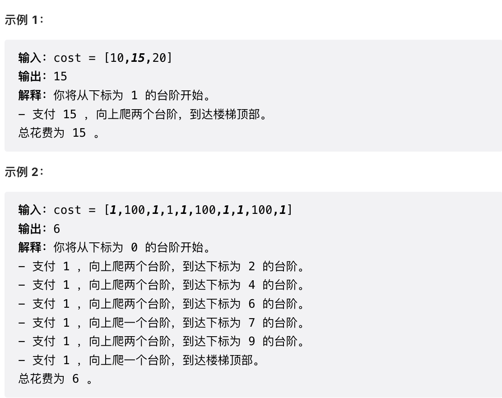


### 思路

```
思路：
1.定义dp数组，dp[i]表示到达第i阶台阶需要的最小花费
2.定义状态转移方程，dp[i]=Min(dp[i-1]+cost[i-1],dp[i-2]+cost[i-2])
3.初始化dp数组,dp[0]=0,dp[1]=1
4.从2开始遍历
```

```java
//746.使用最小花费爬楼梯
public class LeetCode746 {
    public int minCostClimbingStairs(int[] cost) {
        /**
         * 思路：
         * 1.定义dp数组，dp[i]表示到达第i阶台阶需要的最小花费
         * 2.定义状态转移方程，dp[i]=Min(dp[i-1]+cost[i-1],dp[i-2]+cost[i-2])
         * 3.初始化dp数组,dp[0]=0,dp[1]=1
         * 4.从2开始遍历
         */

        //定义dp数组
        int[] dp = new int[cost.length+1];

        //初始化dp数组
        dp[0]=0;
        dp[1]=0;

        //遍历dp数组
        for (int i = 2; i < dp.length; i++) {
            dp[i] = Math.min(dp[i-1]+cost[i-1],dp[i-2]+cost[i-2]);
        }
        return dp[cost.length];
    }
}
```


## 6.不同路径

### 题目

[力扣题目链接](https://leetcode.cn/problems/unique-paths/)

一个机器人位于一个 m x n 网格的左上角 （起始点在下图中标记为 “Start” ）。

机器人每次只能向下或者向右移动一步。机器人试图达到网格的右下角（在下图中标记为 “Finish” ）。

问总共有多少条不同的路径？

示例 1：


- 输入：m = 3, n = 7
- 输出：28

示例 2：

- 输入：m = 2, n = 3
- 输出：3

解释： 从左上角开始，总共有 3 条路径可以到达右下角。

1. 向右 -> 向右 -> 向下
2. 向右 -> 向下 -> 向右
3. 向下 -> 向右 -> 向右

示例 3：

- 输入：m = 7, n = 3
- 输出：28

示例 4：

- 输入：m = 3, n = 3
- 输出：6

提示：

- 1 <= m, n <= 100
- 题目数据保证答案小于等于 2 * 10^9


### 思路

这题有些细节需要注意，比如dp数组的初始化以及遍历顺序

```
思路：
1.确定dp数组,dp[i][j]表示到达坐标(i,j)的不同路径数
2.确定状态转移方程，dp[i][j] = dp[i-1][j]+dp[i][j-1]
3.初始化dp数组，这里第一行和第一列的路径数其实都可以确定了，都是1，这样初始化也不用担心遍历时的数组越界问题
4.确定遍历顺序，从(1,1)坐标开始，从左往右，从上往下，这样就能保证在遍历的过程中前面的值不会出现空值
```


```java
//62.不同路径
public class LeetCode62 {
    public int uniquePaths(int m, int n) {
        /**
         * 思路：
         * 1.确定dp数组,dp[i][j]表示到达坐标(i,j)的不同路径数
         * 2.确定状态转移方程，dp[i][j] = dp[i-1][j]+dp[i][j-1]
         * 3.初始化dp数组，这里第一行和第一列的路径数其实都可以确定了，都是1，这样初始化也不用担心遍历时的数组越界问题
         * 4.确定遍历顺序，从(1,1)坐标开始，从左往右，从上往下，这样就能保证在遍历的过程中前面的值不会出现空值
         */

        //创建dp数组
        int[][] dp = new int[m][n];

        //初始化dp数组
        //初始化第一列
        for (int i = 0; i < m; i++) {
            dp[i][0]=1;
        }
        //初始化第一行
        for (int i = 0; i < n; i++) {
            dp[0][i]=1;
        }

        //遍历dp数组
        for (int i = 1; i < m; i++) {
            for (int j = 1; j < n; j++) {
                dp[i][j] = dp[i-1][j]+dp[i][j-1];
            }
        }

        return dp[m-1][n-1];
    }
}
```


## 7.不同路径II

### 题目

[力扣题目链接(opens new window)](https://leetcode.cn/problems/unique-paths-ii/)

一个机器人位于一个 m x n 网格的左上角 （起始点在下图中标记为“Start” ）。

机器人每次只能向下或者向右移动一步。机器人试图达到网格的右下角（在下图中标记为“Finish”）。

现在考虑网格中有障碍物。那么从左上角到右下角将会有多少条不同的路径？

网格中的障碍物和空位置分别用 1 和 0 来表示。

示例 1：


- 输入：obstacleGrid = [[0,0,0],[0,1,0],[0,0,0]]
- 输出：2 解释：
- 3x3 网格的正中间有一个障碍物。
- 从左上角到右下角一共有 2 条不同的路径：
  1. 向右 -> 向右 -> 向下 -> 向下
  2. 向下 -> 向下 -> 向右 -> 向右

示例 2：


- 输入：obstacleGrid = [[0,1],[0,0]]
- 输出：1

提示：

- m == obstacleGrid.length
- n == obstacleGrid[i].length
- 1 <= m, n <= 100
- obstacleGrid[i][j] 为 0 或 1


### 思路

```
思路：
这题和LeetCode62思路上类似，不过有些地方需要特殊处理
对于存在障碍的坐标，就让其dp[i][j]=0即可
然后在初始化时，初始化第一行和第一列时，只要遇到障碍，后面的dp[i][j]就都是0，因为有障碍，后面的坐标就肯定无法到达
```

```java
//63.不同路径II
public class LeetCode63 {
    public int uniquePathsWithObstacles(int[][] obstacleGrid) {
        /**
         * 思路：
         * 这题和LeetCode62思路上类似，不过有些地方需要特殊处理
         * 对于存在障碍的坐标，就让其dp[i][j]=0即可
         * 然后在初始化时，初始化第一行和第一列时，只要遇到障碍，后面的dp[i][j]就都是0，因为有障碍，后面的坐标就肯定无法到达
         */

        //定义dp数组
        int[][] dp = new int[obstacleGrid.length][obstacleGrid[0].length];

        //初始化dp数组
        //初始化行
        for (int i = 0; i < obstacleGrid[0].length && obstacleGrid[0][i] == 0; i++) {
            dp[0][i] = 1;
        }
        //初始化列
        for (int i = 0; i < obstacleGrid.length && obstacleGrid[i][0] == 0; i++) {
            dp[i][0]=1;
        }

        //遍历dp数组
        for (int i = 1; i < obstacleGrid.length; i++) {
            for (int j = 1; j < obstacleGrid[0].length; j++) {
                //如果坐标上不存在障碍物才更新其值
                if(obstacleGrid[i][j]==0){
                    dp[i][j]=dp[i-1][j]+dp[i][j-1];
                }

            }
        }

        return dp[obstacleGrid.length-1][obstacleGrid[0].length-1];
    }
}
```


## 8.整数拆分

### 题目

[力扣题目链接](https://leetcode.cn/problems/integer-break/)

给定一个正整数 n，将其拆分为至少两个正整数的和，并使这些整数的乘积最大化。 返回你可以获得的最大乘积。

示例 1:

- 输入: 2
- 输出: 1
- 解释: 2 = 1 + 1, 1 × 1 = 1。

示例 2:

- 输入: 10
- 输出: 36
- 解释: 10 = 3 + 3 + 4, 3 × 3 × 4 = 36。
- 说明: 你可以假设 n 不小于 2 且不大于 58。


### 思路

```
思路：
1.定义dp数组，dp[i]表示拆分数字i的乘积最大值
2.定义状态转移方程，这里有点复杂
对于一个数字i，它都有多种拆分情况，比如拆分成1+(i-1),2+(i-2)....
因此我们需要考虑到所有的拆分情况，并且对于每一种拆分情况，它们的乘积都分为两种情况：
一种是就拆分未两个数字进行乘积，比如1+(i-1)就是1*(i-1)
另一种就是在拆分的情况下继续拆分，比如1+(i-1)就是(i-1)还要继续拆分，所以这种情况的最大乘积为1*dp[i-1]，因为dp[i-1]就表示拆分i-1的最大乘积
由此可以推导出dp[i]的状态转移方程：dp[i]=Max(j*(i-j),j*dp[i-j],dp[i])
这里j就是代表上面多种拆分情况中的左边的值，然后之所以还要比较dp[i]是因为i的拆分有多种拆分情况，每一种拆分情况dp[i]都在不断更新
3.初始化dp数组，初始化dp[2]为1
4.确定遍历顺序，由于dp[i]要依赖于dp[i-j]，因此遍历顺序为从前往后遍历
```

```java
//343.整数拆分
public class LeetCode343 {
    public int integerBreak(int n) {
        /**
         * 思路：
         * 1.定义dp数组，dp[i]表示拆分数字i的乘积最大值
         * 2.定义状态转移方程，这里有点复杂
         * 对于一个数字i，它都有多种拆分情况，比如拆分成1+(i-1),2+(i-2)....
         * 因此我们需要考虑到所有的拆分情况，并且对于每一种拆分情况，它们的乘积都分为两种情况：
         * 一种是就拆分未两个数字进行乘积，比如1+(i-1)就是1*(i-1)
         * 另一种就是在拆分的情况下继续拆分，比如1+(i-1)就是(i-1)还要继续拆分，所以这种情况的最大乘积为1*dp[i-1]，因为dp[i-1]就表示拆分i-1的最大乘积
         * 由此可以推导出dp[i]的状态转移方程：dp[i]=Max(j*(i-j),j*dp[i-j],dp[i])
         * 这里j就是代表上面多种拆分情况中的左边的值，然后之所以还要比较dp[i]是因为i的拆分有多种拆分情况，每一种拆分情况dp[i]都在不断更新
         * 3.初始化dp数组，初始化dp[2]为1
         * 4.确定遍历顺序，由于dp[i]要依赖于dp[i-j]，因此遍历顺序为从前往后遍历
         *
         */

        //定义dp数组
        int[] dp = new int[n + 1];

        //初始化dp数组
        dp[2] = 1;

        //遍历dp数组
        for (int i = 3; i <= n; i++) {
            //这里之所以是i-1，是为了保证拆分后右边的数一定大于等于2
            for (int j = 1; j < i - 1; j++) {
                dp[i] = Math.max(Math.max(j * dp[i - j], j * (i - j)), dp[i]);
            }
        }

        return dp[n];

    }
}
```


## 9.不同的二叉搜索树

### 题目

[力扣题目链接](https://leetcode.cn/problems/unique-binary-search-trees/)

给定一个整数 n，求以 1 ... n 为节点组成的二叉搜索树有多少种？

示例:


### 思路

```
思路：
这题做起来有点有点让人不那么好理解
假如要求节点个数为n的不同二叉搜索树的个数
那么这个二叉搜索树首先要拿一个节点来作为根节点，然后剩下的节点作为左右子树
例如左子树可以分配i个节点，那么右子树就可以分配n-i-1个节点
在这种情况下，不同的二叉搜索树的个数为节点数为i的不同二叉树个数乘以节点数为n-i-1的不同二叉树个数
假设dp[i]代表i个节点的不同二叉搜素树个数，那么dp[n] = dp[i]*dp[n-i-1]
于是就可以有下面的步骤：
1.定义dp数组，dp[i]表示i个节点的不同二叉搜索树个数
2.确定递推公式，dp[i] = dp[j]*dp[i-j-1]   0<=j<=i-1
3.初始化dp数组，dp[0]=1,dp[1]=1
4.确定遍历顺序，从小到大遍历
```

```java
//96.不同的二叉搜索树
public class LeetCode96 {
    public int numTrees(int n) {
        /**
         * 思路：
         * 这题做起来有点有点让人不那么好理解
         * 假如要求节点个数为n的不同二叉搜索树的个数
         * 那么这个二叉搜索树首先要拿一个节点来作为根节点，然后剩下的节点作为左右子树
         * 例如左子树可以分配i个节点，那么右子树就可以分配n-i-1个节点
         * 在这种情况下，不同的二叉搜索树的个数为节点数为i的不同二叉树个数乘以节点数为n-i-1的不同二叉树个数
         * 假设dp[i]代表i个节点的不同二叉搜素树个数，那么dp[n] = dp[i]*dp[n-i-1]
         * 于是就可以有下面的步骤：
         * 1.定义dp数组，dp[i]表示i个节点的不同二叉搜索树个数
         * 2.确定递推公式，dp[i] = dp[j]*dp[i-j-1]   0<=j<=i-1
         * 3.初始化dp数组，dp[0]=1,dp[1]=1
         * 4.确定遍历顺序，从小到大遍历
         */

        //定义dp数组
        int[] dp = new int[n+1];
        
        //初始化dp数组
        dp[0]=1;
        dp[1]=1;
        
        //遍历dp数组
        for (int i = 2; i < n+1; i++) {
            for (int j = 0; j <= i-1; j++) {
                dp[i]+=dp[j]*dp[i-j-1];
            }
        }

        return dp[n];
    }
}
```


## 11.01背包基础理论（一、二维数组）

### 题目

[46. 携带研究材料（第六期模拟笔试）](https://kamacoder.com/problempage.php?pid=1046)


### 思路

背包问题，其实之前都做过好多次了，也在学算法导论的时候学过，但是这次来做这道题的时候又忘了，需要加强巩固。

```
思路： 01背包问题
1.确定dp数组，dp[i][j]表示容量为j的背包只放如前i个物品时的最大价值,假设weight[i]表示第i个物品的重量，value[i]表示第i个物品的价值
2.确定递推公式，每一个物品可以选择放入或不放入，因此会有如下两种情况
放入第i个物品：那么此时背包中物品的总价值应该为：dp[i-1][j-[i]]+value[i]
不放入第i个物品，那么此时背包中物品的总价值应该为：dp[i-1][j]
而dp[i][j]就是取这两种情况的最大值
因此可以推出递推公式为：dp[i][j] = Max(dp[i-1][j-[i]]+value[i],dp[i-1][j])
3.初始化dp数组
首先可以明确知道，当背包容量为0时，dp[i][0]都为0
其次，看上面推导出来的递推公式，可以发现递推公式依赖于i-1,因此需要先初始化i为0的情况
i为0时，如果容量大于weight[0],那么dp[0][j] = value[0]
如果容量小于weight[0]，那么dp[0][j] = 0
4.确定遍历顺序
不管是先遍历物品后遍历容量还是先遍历容量后遍历物品都可以
因为dp[i][j]的值依赖于dp[i][j]的上面的值（dp[i-1][j]）或者左上角的值(dp[i-1][j-weight[i]]+value[i])
```

```java
//46.携带研究材料
public class KamaCoder46 {
    public static void main(String[] args) {
        /**
         * 思路： 01背包问题
         * 1.确定dp数组，dp[i][j]表示容量为j的背包只放如前i个物品时的最大价值,假设weight[i]表示第i个物品的重量，value[i]表示第i个物品的价值
         * 2.确定递推公式，每一个物品可以选择放入或不放入，因此会有如下两种情况
         * 放入第i个物品：那么此时背包中物品的总价值应该为：dp[i-1][j-[i]]+value[i]
         * 不放入第i个物品，那么此时背包中物品的总价值应该为：dp[i-1][j]
         * 而dp[i][j]就是取这两种情况的最大值
         * 因此可以推出递推公式为：dp[i][j] = Max(dp[i-1][j-[i]]+value[i],dp[i-1][j])
         * 3.初始化dp数组
         * 首先可以明确知道，当背包容量为0时，dp[i][0]都为0
         * 其次，看上面推导出来的递推公式，可以发现递推公式依赖于i-1,因此需要先初始化i为0的情况
         * i为0时，如果容量大于weight[0],那么dp[0][j] = value[0]
         * 如果容量小于weight[0]，那么dp[0][j] = 0
         *
         * 4.确定遍历顺序
         * 不管是先遍历物品后遍历容量还是先遍历容量后遍历物品都可以
         * 因为dp[i][j]的值依赖于dp[i][j]的上面的值（dp[i-1][j]）或者左上角的值(dp[i-1][j-weight[i]]+value[i])
         */

        Scanner sc  = new Scanner(System.in);
        int M = sc.nextInt();
        int N = sc.nextInt();

        //物品重量
        int[] weight = new int[M];
        //物品价值
        int[] value = new int[M];

        for (int i = 0; i < M; i++) {
            weight[i] = sc.nextInt();
        }

        for (int i = 0; i < M; i++) {
            value[i] = sc.nextInt();
        }

        //定义dp数组
        int[][] dp = new int[M][N+1];

        //初始化dp数组
        for (int i = 0; i < M; i++) {
            dp[i][0] = 0;
        }
        for (int i = 1; i < N+1; i++) {
            if(i>=weight[0]) dp[0][i] = value[0];
            else dp[0][i]=0;
        }

        //遍历dp数组，这里采用先遍历物品，后遍历容量
        for (int i = 1; i < M; i++) {
            for (int j = 1; j < N + 1; j++) {
                //如果容量放不下你
                if(j<weight[i]) dp[i][j] = dp[i-1][j];
                //如果放得下
                else dp[i][j] = Math.max(dp[i-1][j],dp[i-1][j-weight[i]]+value[i]);
            }

        }

        System.out.println(dp[M - 1][N]);


    }
}
```


## 12.01背包基础理论（二、滚动数组）

### 题目

[46. 携带研究材料（第六期模拟笔试）](https://kamacoder.com/problempage.php?pid=1046)

### 思路（重点）

这里采用的是滚动数组的方式，这种方式我觉得更难理解一点，所以一定要重点看

```
思路：
背包问题的另一种写法：滚动数组
1.定义dp数组 dp[j]表示容量为j时背包能够存放物品的最大价值
2.推导递推公式，dp[j] = max(dp[j],dp[j-weight[i]]+value[i]),i表示物品的索引
所以实际上滚动数组也是在遍历每一个物品，在遍历每一个物品时，如果发现更大的值就可以随时更新dp[j],否则dp[j]就不会变。
其实这种方法我最开始疑惑的点在于dp[j-weight[i]]+value[i]是如何保证不会放入重复的物品的
实际上为了保证不会放入重复的物品，可以采用倒序遍历的方式，即遍历dp[j]时从背包容量最大值往前遍历
3.初始化dp数组，dp[0] = 0
4.确定遍历顺序
滚动数组的遍历方式一定要弄明白
遍历时先遍历物品，再遍历容量，并且容量是倒序遍历
先遍历物品是为了保证背包中可以放入多个物品，如果先遍历容量，再遍历物品，那么背包中最终放入的物品只有一个（因为容量是倒序遍历的，在遍历后面的容量时，前面的容量还没放东西）
容量倒序遍历就是保证物品不会被重复放入
```

```java
//动态规划方法二：滚动数组
public static void bag_solution2(){
    /**
     * 思路：
     * 背包问题的另一种写法：滚动数组
     * 1.定义dp数组 dp[j]表示容量为j时背包能够存放物品的最大价值
     * 2.推导递推公式，dp[j] = max(dp[j],dp[j-weight[i]]+value[i]),i表示物品的索引
     * 所以实际上滚动数组也是在遍历每一个物品，在遍历每一个物品时，如果发现更大的值就可以随时更新dp[j],否则dp[j]就不会变。
     * 其实这种方法我最开始疑惑的点在于dp[j-weight[i]]+value[i]是如何保证不会放入重复的物品的
     * 实际上为了保证不会放入重复的物品，可以采用倒序遍历的方式，即遍历dp[j]时从背包容量最大值往前遍历
     * 3.初始化dp数组，dp[0] = 0
     * 4.确定遍历顺序
     * 滚动数组的遍历方式一定要弄明白
     * 遍历时先遍历物品，再遍历容量，并且容量是倒序遍历
     * 先遍历物品是为了保证背包中可以放入多个物品，如果先遍历容量，再遍历物品，那么背包中最终放入的物品只有一个（因为容量是倒序遍历的，在遍历后面的容量时，前面的容量还没放东西）
     * 容量倒序遍历就是保证物品不会被重复放入
     */

    //处理数据
    Scanner sc  = new Scanner(System.in);
    int M = sc.nextInt();
    int N = sc.nextInt();

    //物品重量
    int[] weight = new int[M];
    //物品价值
    int[] value = new int[M];

    for (int i = 0; i < M; i++) {
        weight[i] = sc.nextInt();
    }

    for (int i = 0; i < M; i++) {
        value[i] = sc.nextInt();
    }

    //定义dp数组
    int[] dp = new int[N+1];

    //初始化dp数组
    dp[0] = 0;

    //遍历dp数组，先遍历物品，再倒序遍历容量
    for (int i = 0; i < M; i++) {
        for (int j = N; j > 0; j--) {
            //这里不能忘了做健壮性判断
            if(j-weight[i]>=0) dp[j] = Math.max(dp[j],dp[j-weight[i]]+value[i]);
        }
    }


    System.out.println(dp[N]);
}
```


## 13.分割等和子集

### 题目

[力扣题目链接](https://leetcode.cn/problems/partition-equal-subset-sum/)

题目难易：中等

给定一个只包含正整数的非空数组。是否可以将这个数组分割成两个子集，使得两个子集的元素和相等。

注意: 每个数组中的元素不会超过 100 数组的大小不会超过 200

示例 1:

- 输入: [1, 5, 11, 5]
- 输出: true
- 解释: 数组可以分割成 [1, 5, 5] 和 [11].

示例 2:

- 输入: [1, 2, 3, 5]
- 输出: false
- 解释: 数组不能分割成两个元素和相等的子集.

提示：

- 1 <= nums.length <= 200
- 1 <= nums[i] <= 100


### 思路

```
思路：实际上是背包问题（滚动数组）
要将数组分割成两个子集，并且两个子集和要相等，那这个值其实就是整个数组的和的一半嘛
所以题目也就转化成了是否存在一个子集的和为整个数组和的一半
然后这个问题又可以转换成背包问题，背包容量为数组和的一半，物品的重量weight和价值value都是数组中每一个元素的值
也就是判断dp[n]的最大值是否能够等于数组和的一半，n就是背包容量，大小也为数组和的一半
```

```java
//416.分割等和子集
public class LeetCode416 {
    public boolean canPartition(int[] nums) {
        /**
         * 思路：实际上是背包问题（滚动数组）
         * 要将数组分割成两个子集，并且两个子集和要相等，那这个值其实就是整个数组的和的一半嘛
         * 所以题目也就转化成了是否存在一个子集的和为整个数组和的一半
         * 然后这个问题又可以转换成背包问题，背包容量为数组和的一半，物品的重量weight和价值value都是数组中每一个元素的值
         * 也就是判断dp[n]的最大值是否能够等于数组和的一半，n就是背包容量，大小也为数组和的一半
         */


        //计算数组的和
        int sum = 0;
        for (int i = 0; i < nums.length; i++) {
            sum+=nums[i];
        }
        //如果是奇数，直接返回false
        if(sum%2==1) return false;

        //定义dp数组
        int[] dp = new int[sum/2+1];

        //初始化dp数组
        dp[0] = 0;

        //遍历dp数组
        for (int i = 0; i < nums.length; i++) {
            for (int j = sum/2; j > 0; j--) {
                if(j-nums[i]>=0) dp[j] = Math.max(dp[j],dp[j-nums[i]]+nums[i]);
            }
        }

        if(dp[sum/2]==sum/2) return true;

        return false;
    }
}
```


## 14.最后一块石头的总量II

### 题目

[力扣题目链接](https://leetcode.cn/problems/last-stone-weight-ii/)

题目难度：中等

有一堆石头，每块石头的重量都是正整数。

每一回合，从中选出任意两块石头，然后将它们一起粉碎。假设石头的重量分别为 x 和 y，且 x <= y。那么粉碎的可能结果如下：

如果 x == y，那么两块石头都会被完全粉碎；

如果 x != y，那么重量为 x 的石头将会完全粉碎，而重量为 y 的石头新重量为 y-x。

最后，最多只会剩下一块石头。返回此石头最小的可能重量。如果没有石头剩下，就返回 0。

示例：

- 输入：[2,7,4,1,8,1]
- 输出：1

解释：

- 组合 2 和 4，得到 2，所以数组转化为 [2,7,1,8,1]，
- 组合 7 和 8，得到 1，所以数组转化为 [2,1,1,1]，
- 组合 2 和 1，得到 1，所以数组转化为 [1,1,1]，
- 组合 1 和 1，得到 0，所以数组转化为 [1]，这就是最优值。

提示：

- 1 <= stones.length <= 30
- 1 <= stones[i] <= 1000


### 思路

```
思路：
可以想象一下这题的意思，两个石头相撞，如果它们重量相同，那两个石头都没了，如果重量不同，重量大的石头会减去重量小的石头的重量
在这样一个情况下，如果要保证最后剩下的石头重量最小，就只需要尽可能将所有石头分成两堆，这两堆的重量尽量相等，这样一来，最后剩下的石头的重量也就尽可能的小了。
所以这题其实也就转换成了背包问题，背包容量为所有石头总量的二分之一，向该背包放入石头，让放入石头的重量尽可能的大，石头就可以看作是重量和价值相等的物品
```

```java
//1049.最后一块石头的重量II
public class LeetCode1049 {
    public int lastStoneWeightII(int[] stones) {
        /**
         * 思路：
         * 可以想象一下这题的意思，两个石头相撞，如果它们重量相同，那两个石头都没了，如果重量不同，重量大的石头会减去重量小的石头的重量
         * 在这样一个情况下，如果要保证最后剩下的石头重量最小，就只需要尽可能将所有石头分成两堆，这两堆的重量尽量相等，这样一来，最后剩下的石头的重量也就尽可能的小了。
         * 所以这题其实也就转换成了背包问题，背包容量为所有石头总量的二分之一，向该背包放入石头，让放入石头的重量尽可能的大，石头就可以看作是重量和价值相等的物品
         */

        //计算石头的总重量
        int sum = 0;
        for (int stone : stones) {
            sum+=stone;
        }

        //石头总重量的一半
        int target = sum/2;

        //定义dp数组
        int[] dp = new int[target+1];

        //初始化dp数组
        dp[0]=0;

        //遍历dp数组，背包问题，滚动数组的方式
        for (int i = 0; i < stones.length; i++) {
            //倒序遍历背包容量
            for (int j = target; j > 0; j--) {
                //别忘了判断j-stones[i]是否会小于0
                if(j-stones[i]>=0) dp[j] = Math.max(dp[j],dp[j-stones[i]]+stones[i]);
            }
        }

        return sum-2*dp[target];

    }

}
```


## 16.目标和（滚动数组待学习）

### 题目

这题目前只用了二维数组的方式，滚动数组还没用过，先挖个坑

[力扣题目链接](https://leetcode.cn/problems/target-sum/)

难度：中等

给定一个非负整数数组，a1, a2, ..., an, 和一个目标数，S。现在你有两个符号 + 和 -。对于数组中的任意一个整数，你都可以从 + 或 -中选择一个符号添加在前面。

返回可以使最终数组和为目标数 S 的所有添加符号的方法数。

示例：

- 输入：nums: [1, 1, 1, 1, 1], S: 3
- 输出：5

解释：

- -1+1+1+1+1 = 3
- +1-1+1+1+1 = 3
- +1+1-1+1+1 = 3
- +1+1+1-1+1 = 3
- +1+1+1+1-1 = 3

一共有5种方法让最终目标和为3。

提示：

- 数组非空，且长度不会超过 20 。
- 初始的数组的和不会超过 1000 。
- 保证返回的最终结果能被 32 位整数存下。


### 思路

```
思路：这道题也可以转换成背包问题
给每一个数前面添加正号+或符号-，其实就是将整个数组分成了两部分，最终结果就是这两部分相减
因此可以得出这个公式，left-right = target left就是被添加了+号的数的集合，right就是被添加了-号的数的集合
又由于 right = sum - left ，sum就是整个nums数组之和，可以推出 left = target + sum - left
进一步推出 left = (sum+target)/2，也就是说如果要符合题意，那么被分配+号的数的和一定等于left
所以，题目最终就转化成了，使用nums中的数来填满容量为left的背包共有几种方法。
1.定义dp数组，dp[i][j]表示使用前i个数来填满容量为j的背包的方法数
2.写出递推公式，对于第i个数，可以选择放或不放
如果选择放，那么填满背包的方法数就是dp[i-1][j-nums[i]]
如果选择不妨，那么填满背包的方法数就是dp[i-1][j]
所以用前i个物品填满容量为j的背包总的方法数就是上面两种情况的方法数之和，即递推公式为：dp[i][j] = dp[i-1][j-nums[i]]+dp[i-1][j]
3.初始化dp数组
由于dp[i][j]依赖于其左上角和正上方的两个数，因此第一行和第一列一定要先初始化
对于第一行，当前仅当背包容量等于第0个数的值时,dp[i][j]=1，其他情况dp[i][j] = 0
对于第一列，按理来说，dp[i][0]应该都为1，也就是不需要放任何数字，背包就被填满了
但是题目要求nums可能存在 数字0，所以，dp[i][0]= 2的n次方 n为前i个数中 数字0的个数。
4.确定遍历顺序
遍历顺序为从上到下，从左到右
```

```java
//494.目标和
public class LeetCode494 {
    public int findTargetSumWays(int[] nums, int target) {
        /**
         * 思路：这道题也可以转换成背包问题
         * 给每一个数前面添加正号+或符号-，其实就是将整个数组分成了两部分，最终结果就是这两部分相减
         * 因此可以得出这个公式，left-right = target left就是被添加了+号的数的集合，right就是被添加了-号的数的集合
         * 又由于 right = sum - left ，sum就是整个nums数组之和，可以推出 left = target + sum - left
         * 进一步推出 left = (sum+target)/2，也就是说如果要符合题意，那么被分配+号的数的和一定等于left
         * 所以，题目最终就转化成了，使用nums中的数来填满容量为left的背包共有几种方法。
         *
         * 1.定义dp数组，dp[i][j]表示使用前i个数来填满容量为j的背包的方法数
         * 2.写出递推公式，对于第i个数，可以选择放或不放
         * 如果选择放，那么填满背包的方法数就是dp[i-1][j-nums[i]]
         * 如果选择不妨，那么填满背包的方法数就是dp[i-1][j]
         * 所以用前i个物品填满容量为j的背包总的方法数就是上面两种情况的方法数之和，即递推公式为：dp[i][j] = dp[i-1][j-nums[i]]+dp[i-1][j]
         * 3.初始化dp数组
         * 由于dp[i][j]依赖于其左上角和正上方的两个数，因此第一行和第一列一定要先初始化
         * 对于第一行，当前仅当背包容量等于第0个数的值时,dp[i][j]=1，其他情况dp[i][j] = 0
         * 对于第一列，按理来说，dp[i][0]应该都为1，也就是不需要放任何数字，背包就被填满了
         * 但是题目要求nums可能存在 数字0，所以，dp[i][0]= 2的n次方 n为前i个数中 数字0的个数。
         *
         * 4.确定遍历顺序
         * 遍历顺序为从上到下，从左到右
         */

        //计算sum
        int sum = 0;
        for (int num : nums) {
            sum+=num;
        }

        //计算left
        int left = 0;
        if((sum+target)%2==1){
            //如果为奇数，无解，因为，nums的数字都为整数，因此left的值不可能为奇数
            return 0;
        }else {
            left = (sum+target)/2;
        }

        //如果target的绝对值已经大于sum了，也无解
        if(Math.abs(target)>Math.abs(sum)){
            return 0;
        }

        
        //定义dp数组
        int[][] dp = new int[nums.length][left+1];
        
        //初始化dp数组
        //初始化第一行
        if(nums[0]<=left) dp[0][nums[0]] = 1;
        //初始化第一列
        int zeroCount = 0;      //记录前i个数中0的个数
        for (int i = 0; i < nums.length; i++) {
            if(nums[i]==0) zeroCount++;
            dp[i][0] = (int) Math.pow(2,zeroCount);
        }
        
        //遍历dp数组
        for (int i = 1; i < nums.length; i++) {
            for (int j = 1; j < left+1; j++) {
                //这里要注意看nums[i]的值是否大于背包容量j
                if(nums[i]>j) dp[i][j] = dp[i-1][j];
                else dp[i][j] = dp[i-1][j]+dp[i-1][j-nums[i]];
            }
        }
        return dp[nums.length-1][left];
    }
}
```


## 17.一和零

### 题目

[力扣题目链接](https://leetcode.cn/problems/ones-and-zeroes/)

给你一个二进制字符串数组 strs 和两个整数 m 和 n 。

请你找出并返回 strs 的最大子集的大小，该子集中 最多 有 m 个 0 和 n 个 1 。

如果 x 的所有元素也是 y 的元素，集合 x 是集合 y 的 子集 。

示例 1：

- 输入：strs = ["10", "0001", "111001", "1", "0"], m = 5, n = 3
- 输出：4
- 解释：最多有 5 个 0 和 3 个 1 的最大子集是 {"10","0001","1","0"} ，因此答案是 4 。 其他满足题意但较小的子集包括 {"0001","1"} 和 {"10","1","0"} 。{"111001"} 不满足题意，因为它含 4 个 1 ，大于 n 的值 3 。

示例 2：

- 输入：strs = ["10", "0", "1"], m = 1, n = 1
- 输出：2
- 解释：最大的子集是 {"0", "1"} ，所以答案是 2 。

提示：

- 1 <= strs.length <= 600
- 1 <= strs[i].length <= 100
- strs[i] 仅由 '0' 和 '1' 组成
- 1 <= m, n <= 100


### 思路

```
思路：
看起来像背包问题，就把m、n抽象成背包的容量，背包最多只能放m个0和n个1
把strs抽象成物品
1.定义dp数组
dp[i][j]表示背包放i个0和j个1时，最大的子集长度
2.写出状态转移方程
遍历strs数组的每一个元素，每遍历一个元素的同时都要遍历dp数组，更新dp的最大值
假设当前遍历的strs的元素有x个0和y个1，那么状态转移方程就为：
dp[i][j] = Max(dp[i][j],dp[i-x][j-y]+1);
3.初始化dp数组
dp[0][0] = 0
4.确定遍历顺序
特别注意，在二维背包问题中，需要先遍历物品，确保放入背包中的物品有多个，而不是只有一个
后遍历容量，且一定要注意遍历容量时要从后往前遍历，这样可以保证物品不会被重复放
```

```java
//474.一和零
public class LeetCode474 {

    public int findMaxForm(String[] strs, int m, int n) {
        /**
         * 思路：
         * 看起来像背包问题，就把m、n抽象成背包的容量，背包最多只能放m个0和n个1
         * 把strs抽象成物品
         * //1.定义dp数组
         * dp[i][j]表示背包放i个0和j个1时，最大的子集长度
         *
         * //2.写出状态转移方程
         * 遍历strs数组的每一个元素，每遍历一个元素的同时都要遍历dp数组，更新dp的最大值
         * 假设当前遍历的strs的元素有x个0和y个1，那么状态转移方程就为：
         * dp[i][j] = Max(dp[i][j],dp[i-x][j-y]+1);
         *
         * //3.初始化dp数组
         * dp[0][0] = 0
         * 
         * //4.确定遍历顺序
         * 特别注意，在二维背包问题中，需要先遍历物品，确保放入背包中的物品有多个，而不是只有一个
         * 后遍历容量，且一定要注意遍历容量时要从后往前遍历，这样可以保证物品不会被重复放
         */

        //定义dp数组
        int[][] dp = new int[m + 1][n + 1];

        //初始化dp数组
        dp[0][0] = 0;

        //遍历strs数组（先遍历物品）
        for (String str : strs) {
            //计算str中有多少个0，多少个1
            int zeroCnt = 0;
            int oneCnt = 0;
            char[] charArray = str.toCharArray();
            for (int i = 0; i < str.length(); i++) {
                if (charArray[i] == '0') {
                    zeroCnt++;
                } else {
                    oneCnt++;
                }
            }

            //遍历dp数组（后遍历容量） 注意：遍历容量一定要从后往前遍历，这样可以防止物品被重复放入
            for (int i = m; i >= 0; i--) {
                for (int j = n; j >= 0; j--) {
                    if (i - zeroCnt >= 0 && j - oneCnt >= 0) {
                        dp[i][j] = Math.max(dp[i][j], dp[i - zeroCnt][j - oneCnt] + 1);
                    }
                }
            }
        }

        return dp[m][n];
    }

}
```


## 18.完全背包理论知识

### 题目

[52. 携带研究材料（第七期模拟笔试）](https://kamacoder.com/problempage.php?pid=1052)


### 思路

```java
//KamaCoder52.携带研究材料（完全背包问题）
public class KamaCoder52 {

    public static void main(String[] args) {
        Scanner sc = new Scanner(System.in);
        int n = sc.nextInt();
        int v = sc.nextInt();
        int[] weight = new int[n];
        int[] value = new int[n];
        for (int i = 0; i < n; i++) {
            weight[i] = sc.nextInt();
            value[i] = sc.nextInt();
        }

        //1.定义dp数组,dp[i][j]表示将前i个物品放入容量为j的背包能获得的最大价值
        int[][] dp = new int[n][v + 1];

        /**
         *2.确定状态转移方程，对于第i件物品，可以选择放与不放
         *  如果选择不放，那么dp[i][j] = dp[i-1][j]
         *  如果选择放，那么dp[i][j] = dp[i][j-weight[i]]+value[i]
         *  这里与01背包的不同点就在于，每一个物品都可以无限放入，所以当选择放入物品时，很可能是多次放入，所以是dp[i][j-weight[i]]+value[i]而不是dp[i-1][j-weight[i]]+value[i]
         */

        //3.初始化dp数组，由状态转移方程可以知道，dp[i][j]是有上方和左方推导而来，所以需要初始化dp[i][0]和dp[0][i],遍历顺序也是从左到右

        //注意这里初始化的代码，不能用
//        for (int i = 0; i < v + 1; i++) {
//            dp[0][i] = i * value[0] / weight[0];
//        }
        for (int i = weight[0]; i < v + 1; i++) {
            dp[0][i] = dp[0][i - weight[0]] + value[0];
        }

        for (int i = 1; i < n; i++) {
            for (int j = 1; j < v + 1; j++) {
                if (j - weight[i] >= 0) {
                    dp[i][j] = Math.max(dp[i - 1][j], dp[i][j - weight[i]] + value[i]);
                } else {
                    dp[i][j] = dp[i - 1][j];
                }
            }
        }

        System.out.println(dp[n - 1][v]);
        sc.close();
    }
}
```


## 19.零钱兑换II

### 题目

[力扣题目链接](https://leetcode.cn/problems/coin-change-ii/)

给定不同面额的硬币和一个总金额。写出函数来计算可以凑成总金额的硬币组合数。假设每一种面额的硬币有无限个。

示例 1:

- 输入: amount = 5, coins = [1, 2, 5]
- 输出: 4

解释: 有四种方式可以凑成总金额:

- 5=5
- 5=2+2+1
- 5=2+1+1+1
- 5=1+1+1+1+1

示例 2:

- 输入: amount = 3, coins = [2]
- 输出: 0
- 解释: 只用面额2的硬币不能凑成总金额3。

示例 3:

- 输入: amount = 10, coins = [10]
- 输出: 1

注意，你可以假设：

- 0 <= amount (总金额) <= 5000
- 1 <= coin (硬币面额) <= 5000
- 硬币种类不超过 500 种
- 结果符合 32 位符号整数


### 思路

```java
//518.零钱兑换II
public class LeetCode518 {

    public int change(int amount, int[] coins) {
        /**
         * 思路：完全背包问题，总金额可以看成背包容量，每种硬币可以看成要放入背包的物品
         * 1.定义dp数组，dp[i][j]表示用前i种硬币组合成j价值共有多少种组合方法
         * 2.确定状态转移方程
         *   如果用当前这枚硬币，那么组合数就是dp[i][j-value[i]]
         *   如果不用当前这枚硬币，那么组合数就是dp[i-1][j]
         *   最终组合数就是这两个结果相加
         * 3.初始化dp数组，对于第1枚硬币，也就是dp[0][j]，如果价值能被面值整除，组合数就为1，否则为0
         *               如果价值为0，也就是dp[i][0]，那么组合数永远为1，即用任何硬币都可以组合成价值为0的结果，也就是不放硬币（这里是个坑点，我原本这里初始化的为0）
         *
         * 4.确定遍历顺序
         *   从状态转移方程不难得知，dp[i][j]由上方和左方的值推导而来，所以遍历顺序为从左到右，从上到下
         */

        //定义dp数组
        int[][] dp = new int[coins.length][amount + 1];

        //初始化
        for (int i = 0; i < amount + 1; i++) {
            dp[0][i] = i % coins[0] == 0 ? 1 : 0;
        }
        for (int i = 0; i < coins.length; i++) {
            dp[i][0] = 1;
        }

        //遍历数组
        for (int i = 1; i < coins.length; i++) {
            for (int j = 1; j < amount + 1; j++) {
                if (j - coins[i] >= 0) {
                    dp[i][j] = dp[i - 1][j] + dp[i][j - coins[i]];
                } else {
                    dp[i][j] = dp[i - 1][j];
                }
            }
        }
        return dp[coins.length - 1][amount];
    }

}
```


## 21.组合总数IV

### 题目

[力扣题目链接](https://leetcode.cn/problems/combination-sum-iv/)

难度：中等

给定一个由正整数组成且不存在重复数字的数组，找出和为给定目标正整数的组合的个数。

示例:

- nums = [1, 2, 3]
- target = 4

所有可能的组合为： (1, 1, 1, 1) (1, 1, 2) (1, 2, 1) (1, 3) (2, 1, 1) (2, 2) (3, 1)

请注意，顺序不同的序列被视作不同的组合。

因此输出为 7。


### 思路

```
思路：还是完全背包问题，不同点在于这题说如果元素的顺序不同则认为是不同的组合，这就很关键了
对于排列问题，通常用一维数组来做
对于组合问题，通常用二维数组来做
因为二维数组通常会将可用元素限制在前i个，但对排列来说，元素是可以任意且无限次使用的，所以不大合适。
```

一开始想用二维数组，但是写不出来，看看AI怎么说吧


```java
//377.组合总和
public class LeetCode377 {

    public int combinationSum4(int[] nums, int target) {
        /**
         * 思路：还是完全背包问题，不同点在于这题说如果元素的顺序不同则认为是不同的组合，这就很关键了
         * 对于排列问题，通常用一维数组来做
         * 对于组合问题，通常用二维数组来做
         * 因为二维数组通常会将可用元素限制在前i个，但对排列来说，元素是可以任意且无限次使用的，所以不大合适。
         */

        //1.定义dp数组,dp[i]表示结果为i的排列数
        //那么状态转移方程应该为dp[i] = dp[i-nums[0]]+dp[i-nums[1]]+...+dp[i-nums[n-1]]  (假设数组长度为n)
        int[] dp = new int[target + 1];

        //2.初始化dp数组
        dp[0] = 1;

        //3.遍历数组,这里注意，对于排列来说，应该是先遍历背包，再遍历“物品”，因为“物品”的存放顺序是任意的
        for (int i = 1; i < target + 1; i++) {
            for (int j = 0; j < nums.length; j++) {
                if (i - nums[j] >= 0) {
                    dp[i] += dp[i - nums[j]];
                }
            }
        }
        return dp[target];
    }
}
```


## 27.多重背包问题

### 题目

对于多重背包，我在力扣上还没发现对应的题目，所以这里就做一下简单介绍，大家大概了解一下。

有N种物品和一个容量为V 的背包。第i种物品最多有Mi件可用，每件耗费的空间是Ci ，价值是Wi 。求解将哪些物品装入背包可使这些物品的耗费的空间 总和不超过背包容量，且价值总和最大。

多重背包和01背包是非常像的， 为什么和01背包像呢？

每件物品最多有Mi件可用，把Mi件摊开，其实就是一个01背包问题了。

例如：

背包最大重量为10。

物品为：

|       | 重量 | 价值 | 数量 |
| ----- | ---- | ---- | ---- |
| 物品0 | 1    | 15   | 2    |
| 物品1 | 3    | 20   | 3    |
| 物品2 | 4    | 30   | 2    |

问背包能背的物品最大价值是多少？

和如下情况有区别么？

|       | 重量 | 价值 | 数量 |
| ----- | ---- | ---- | ---- |
| 物品0 | 1    | 15   | 1    |
| 物品0 | 1    | 15   | 1    |
| 物品1 | 3    | 20   | 1    |
| 物品1 | 3    | 20   | 1    |
| 物品1 | 3    | 20   | 1    |
| 物品2 | 4    | 30   | 1    |
| 物品2 | 4    | 30   | 1    |

毫无区别，这就转成了一个01背包问题了，且每个物品只用一次。

练习题目：[卡码网第56题，多重背包](https://kamacoder.com/problempage.php?pid=1066)


### 思路

```java
//KamaCoder56.携带矿石资源
public class KamaCoder56 {

    public static void main(String[] args) {
        /**
         * 思路：多重背包问题
         * 多重背包与01背包的区别在于，01背包的物品只有一个，而多重背包的物品可能有多个
         * 所以多重背包也可以看成是01背包问题，只需要将数量为n(n>1)的物品，看成n个不同的物品即可，只不过这物品的价值和重量都是相同的
         *
         */

        Scanner sc = new Scanner(System.in);
        int c = sc.nextInt();
        int n = sc.nextInt();

        int[] weight = new int[n];
        int[] value = new int[n];
        int[] num = new int[n];
        for (int i = 0; i < n; i++) {
            weight[i] = sc.nextInt();
        }
        for (int i = 0; i < n; i++) {
            value[i] = sc.nextInt();
        }
        for (int i = 0; i < n; i++) {
            num[i] = sc.nextInt();
        }

        int[] dp = new int[c + 1];

        for (int i = 0; i < n; i++) {
            for (int j = 0; j < num[i]; j++) {
                for (int k = c; k >= weight[i]; k--) {
                    dp[k] = Math.max(dp[k], dp[k - weight[i]] + value[i]);
                }
            }
        }

        System.out.println(dp[c]);
    }
}
```


## 30.打家劫舍II

### 题目

[力扣题目链接](https://leetcode.cn/problems/house-robber-ii/)

你是一个专业的小偷，计划偷窃沿街的房屋，每间房内都藏有一定的现金。这个地方所有的房屋都 围成一圈 ，这意味着第一个房屋和最后一个房屋是紧挨着的。同时，相邻的房屋装有相互连通的防盗系统，如果两间相邻的房屋在同一晚上被小偷闯入，系统会自动报警 。

给定一个代表每个房屋存放金额的非负整数数组，计算你 在不触动警报装置的情况下 ，能够偷窃到的最高金额。

示例 1：

- 输入：nums = [2,3,2]
- 输出：3
- 解释：你不能先偷窃 1 号房屋（金额 = 2），然后偷窃 3 号房屋（金额 = 2）, 因为他们是相邻的。
- 示例 2：
- 输入：nums = [1,2,3,1]
- 输出：4
- 解释：你可以先偷窃 1 号房屋（金额 = 1），然后偷窃 3 号房屋（金额 = 3）。偷窃到的最高金额 = 1 + 3 = 4 。
- 示例 3：
- 输入：nums = [0]
- 输出：0

提示：

- 1 <= nums.length <= 100
- 0 <= nums[i] <= 1000


### 思路

这道题目和[198.打家劫舍 ](https://programmercarl.com/0198.打家劫舍.html)是差不多的，唯一区别就是成环了。

对于一个数组，成环的话主要有如下三种情况：

- 情况一：考虑不包含首尾元素


- 情况二：考虑包含首元素，不包含尾元素


- 情况三：考虑包含尾元素，不包含首元素


**注意我这里用的是"考虑"**，例如情况三，虽然是考虑包含尾元素，但不一定要选尾部元素！ 对于情况三，取nums[1] 和 nums[3]就是最大的。

**而情况二 和 情况三 都包含了情况一了，所以只考虑情况二和情况三就可以了**。

分析到这里，本题其实比较简单了。 剩下的和[198.打家劫舍 ](https://programmercarl.com/0198.打家劫舍.html)就是一样的了。

```java
//213.打家劫舍II
public class LeetCode213 {

    public static void main(String[] args) {
        LeetCode213 test = new LeetCode213();
        System.out.println(test.rob(new int[]{1, 3, 1, 3, 100}));
    }

    public int rob(int[] nums) {
        /**
         * 这题和打家劫舍I的不同点在于现在首尾房屋是相连的
         * 所以此时，要么偷第一间房，不偷最后一间，也就是只考虑第一间到倒数第二间
         * 要么偷最后一间，不偷第一间，也就是只考虑第二间到最后一间
         * 此时问题就转化成了打家劫舍I的问题。
         * 只需要取两种情况的最大值即可
         */

        if (nums == null || nums.length == 0) {
            return 0;
        }

        if (nums.length == 1) {
            return nums[0];
        }

        //情况1
        int[] dp1 = new int[nums.length + 1];

        for (int i = 2; i < nums.length + 1; i++) {
            if (i > 2) {
                dp1[i] = Math.max(dp1[i - 1], dp1[i - 2] + nums[i - 1]);
            } else {
                dp1[i] = nums[i - 1];
            }
        }

        //情况2
        int[] dp2 = new int[nums.length + 1];

        for (int i = 1; i < nums.length; i++) {
            if (i > 1) {
                dp2[i] = Math.max(dp2[i - 1], dp2[i - 2] + nums[i - 1]);
            } else {
                dp2[i] = nums[i - 1];
            }
        }

        return Math.max(dp1[nums.length], dp2[nums.length - 1]);
    }
}
```


## 31.打家劫舍III

### 题目

[力扣题目链接(opens new window)](https://leetcode.cn/problems/house-robber-iii/)

在上次打劫完一条街道之后和一圈房屋后，小偷又发现了一个新的可行窃的地区。这个地区只有一个入口，我们称之为“根”。 除了“根”之外，每栋房子有且只有一个“父“房子与之相连。一番侦察之后，聪明的小偷意识到“这个地方的所有房屋的排列类似于一棵二叉树”。 如果两个直接相连的房子在同一天晚上被打劫，房屋将自动报警。

计算在不触动警报的情况下，小偷一晚能够盗取的最高金额。


### 思路

### 动态规划

在上面两种方法，其实对一个节点 偷与不偷得到的最大金钱都没有做记录，而是需要实时计算。

而动态规划其实就是使用状态转移容器来记录状态的变化，这里可以使用一个长度为2的数组，记录当前节点偷与不偷所得到的的最大金钱。

**这道题目算是树形dp的入门题目，因为是在树上进行状态转移，我们在讲解二叉树的时候说过递归三部曲，那么下面我以递归三部曲为框架，其中融合动规五部曲的内容来进行讲解**。

1. 确定递归函数的参数和返回值

这里我们要求一个节点 偷与不偷的两个状态所得到的金钱，那么返回值就是一个长度为2的数组。

参数为当前节点，代码如下：

```cpp
vector<int> robTree(TreeNode* cur) {
```

其实这里的返回数组就是dp数组。

所以dp数组（dp table）以及下标的含义：下标为0记录不偷该节点所得到的的最大金钱，下标为1记录偷该节点所得到的的最大金钱。

**所以本题dp数组就是一个长度为2的数组！**

那么有同学可能疑惑，长度为2的数组怎么标记树中每个节点的状态呢？

**别忘了在递归的过程中，系统栈会保存每一层递归的参数**。

如果还不理解的话，就接着往下看，看到代码就理解了哈。

1. 确定终止条件

在遍历的过程中，如果遇到空节点的话，很明显，无论偷还是不偷都是0，所以就返回

```text
if (cur == NULL) return vector<int>{0, 0};
```

这也相当于dp数组的初始化

1. 确定遍历顺序

首先明确的是使用后序遍历。 因为要通过递归函数的返回值来做下一步计算。

通过递归左节点，得到左节点偷与不偷的金钱。

通过递归右节点，得到右节点偷与不偷的金钱。

代码如下：

```cpp
// 下标0：不偷，下标1：偷
vector<int> left = robTree(cur->left); // 左
vector<int> right = robTree(cur->right); // 右
// 中
```

1. 确定单层递归的逻辑

如果是偷当前节点，那么左右孩子就不能偷，val1 = cur->val + left[0] + right[0]; （**如果对下标含义不理解就再回顾一下dp数组的含义**）

如果不偷当前节点，那么左右孩子就可以偷，至于到底偷不偷一定是选一个最大的，所以：val2 = max(left[0], left[1]) + max(right[0], right[1]);

最后当前节点的状态就是{val2, val1}; 即：{不偷当前节点得到的最大金钱，偷当前节点得到的最大金钱}

代码如下：

```cpp
vector<int> left = robTree(cur->left); // 左
vector<int> right = robTree(cur->right); // 右

// 偷cur
int val1 = cur->val + left[0] + right[0];
// 不偷cur
int val2 = max(left[0], left[1]) + max(right[0], right[1]);
return {val2, val1};
```

1. 举例推导dp数组

以示例1为例，dp数组状态如下：（**注意用后序遍历的方式推导**）


**最后头结点就是 取下标0 和 下标1的最大值就是偷得的最大金钱**。

```java
import dataStructure.TreeNode;

//337.打家劫舍III
public class LeetCode337 {

    public int rob(TreeNode root) {
        /**
         * 这题是树型dp，没看解析前确实不会
         * 解析详见笔记或代码随想录
         */

        int[] money = getMoney(root);
        return Math.max(money[0], money[1]);
    }

    //获取从某个节点开始，偷或不偷的最大金额，返回一个长度为2的数组，分别表示偷或不偷
    public int[] getMoney(TreeNode node) {
        if (node == null) {
            return new int[]{0, 0};
        }

        int[] arr = new int[2];

        int[] left = getMoney(node.left);
        int[] right = getMoney(node.right);

        //当前节点要偷
        arr[0] = left[1] + right[1] + node.val;

        //当前节点不偷
        arr[1] = Math.max(left[0], left[1]) + Math.max(right[0], right[1]);
        return arr;
    }
}
```


## 32.买卖股票的最佳时机

### 题目

[力扣题目链接](https://leetcode.cn/problems/best-time-to-buy-and-sell-stock/)

给定一个数组 prices ，它的第 i 个元素 prices[i] 表示一支给定股票第 i 天的价格。

你只能选择 某一天 买入这只股票，并选择在 未来的某一个不同的日子 卖出该股票。设计一个算法来计算你所能获取的最大利润。

返回你可以从这笔交易中获取的最大利润。如果你不能获取任何利润，返回 0 。

- 示例 1：
- 输入：[7,1,5,3,6,4]
- 输出：5
  解释：在第 2 天（股票价格 = 1）的时候买入，在第 5 天（股票价格 = 6）的时候卖出，最大利润 = 6-1 = 5 。注意利润不能是 7-1 = 6, 因为卖出价格需要大于买入价格；同时，你不能在买入前卖出股票。
- 示例 2：
- 输入：prices = [7,6,4,3,1]
- 输出：0
  解释：在这种情况下, 没有交易完成, 所以最大利润为 0。


### 思路

### 动态规划

动规五部曲分析如下：

1. 确定dp数组（dp table）以及下标的含义

dp[i][0] 表示第i天持有股票所得最多现金 ，**这里可能有同学疑惑，本题中只能买卖一次，持有股票之后哪还有现金呢？**

其实一开始现金是0，那么加入第i天买入股票现金就是 -prices[i]， 这是一个负数。

dp[i][1] 表示第i天不持有股票所得最多现金

**注意这里说的是“持有”，“持有”不代表就是当天“买入”！也有可能是昨天就买入了，今天保持持有的状态**

很多同学把“持有”和“买入”没区分清楚。

在下面递推公式分析中，我会进一步讲解。

1. 确定递推公式

如果第i天持有股票即dp[i][0]， 那么可以由两个状态推出来

- 第i-1天就持有股票，那么就保持现状，所得现金就是昨天持有股票的所得现金 即：dp[i - 1][0]
- 第i天买入股票，所得现金就是买入今天的股票后所得现金即：-prices[i]

那么dp[i][0]应该选所得现金最大的，所以dp[i][0] = max(dp[i - 1][0], -prices[i]);

如果第i天不持有股票即dp[i][1]， 也可以由两个状态推出来

- 第i-1天就不持有股票，那么就保持现状，所得现金就是昨天不持有股票的所得现金 即：dp[i - 1][1]
- 第i天卖出股票，所得现金就是按照今天股票价格卖出后所得现金即：prices[i] + dp[i - 1][0]

同样dp[i][1]取最大的，dp[i][1] = max(dp[i - 1][1], prices[i] + dp[i - 1][0]);

这样递推公式我们就分析完了

1. dp数组如何初始化

由递推公式 dp[i][0] = max(dp[i - 1][0], -prices[i]); 和 dp[i][1] = max(dp[i - 1][1], prices[i] + dp[i - 1][0]);可以看出

其基础都是要从dp[0][0]和dp[0][1]推导出来。

那么dp[0][0]表示第0天持有股票，此时的持有股票就一定是买入股票了，因为不可能有前一天推出来，所以dp[0][0] -= prices[0];

dp[0][1]表示第0天不持有股票，不持有股票那么现金就是0，所以dp[0][1] = 0;

1. 确定遍历顺序

从递推公式可以看出dp[i]都是由dp[i - 1]推导出来的，那么一定是从前向后遍历。

1. 举例推导dp数组

以示例1，输入：[7,1,5,3,6,4]为例，dp数组状态如下：


dp[5][1]就是最终结果。

为什么不是dp[5][0]呢？

**因为本题中不持有股票状态所得金钱一定比持有股票状态得到的多！**

```java
//121.买卖股票的最佳时机
public class LeetCode121 {

    public int maxProfit(int[] prices) {
        /**
         * 思路：贪心
         * 依次遍历数组，逐步更新当前的股票的最低价格和最高价格
         * 一旦最低价格发生变化，先结算前面找到的最高价和最低价能赚的钱，如果更高就更新最终答案，然后将最高价格也一起发生变化。
         */

        if (prices.length == 0) {
            return 0;
        }

        int ans = 0;
        int min = prices[0];
        int max = prices[0];
        for (int i = 0; i < prices.length; i++) {
            if (min > prices[i]) {
                ans = Math.max(ans, max - min);
                min = prices[i];
                max = prices[i];
            } else {
                max = Math.max(max, prices[i]);
            }
        }
        ans = Math.max(ans, max - min);
        return ans;
    }

    //复习-2025-11-24-动态规划
    public int maxProfit_Review(int[] prices) {
        //1.定义dp数组，dp[i][0]表示第i天持有股票时的最大现金，dp[i][1]表示第i天不持有股票时的最大现金
        int[][] dp = new int[prices.length][2];

        dp[0][0] = -prices[0];
        dp[0][1] = 0;

        /**
         *2.定义状态转移方程
         *dp[i][0]=Max(dp[i-1][0],-prices[i])       要么是前一天就持有股票保留到今天，要么就是今天买的股票
         * dp[i][1]=Max(dp[i-1][1],dp[i-1][0]+prices[i])    要么是前一天你不持有股票保留到今天，要么就是今天卖掉股票
         */
        for (int i = 1; i < prices.length; i++) {
            dp[i][0] = Math.max(dp[i - 1][0], -prices[i]);
            dp[i][1] = Math.max(dp[i - 1][1], dp[i - 1][0] + prices[i]);
        }

        return Math.max(dp[prices.length - 1][0], dp[prices.length - 1][1]);
    }

}
```


## 34.买卖股票的最佳时机II

### 题目

[力扣题目链接](https://leetcode.cn/problems/best-time-to-buy-and-sell-stock-ii/)

给定一个数组，它的第 i 个元素是一支给定股票第 i 天的价格。

设计一个算法来计算你所能获取的最大利润。你可以尽可能地完成更多的交易（多次买卖一支股票）。

注意：你不能同时参与多笔交易（你必须在再次购买前出售掉之前的股票）。

- 示例 1:
- 输入: [7,1,5,3,6,4]
- 输出: 7
  解释: 在第 2 天（股票价格 = 1）的时候买入，在第 3 天（股票价格 = 5）的时候卖出, 这笔交易所能获得利润 = 5-1 = 4。随后，在第 4 天（股票价格 = 3）的时候买入，在第 5 天（股票价格 = 6）的时候卖出, 这笔交易所能获得利润 = 6-3 = 3 。
- 示例 2:
- 输入: [1,2,3,4,5]
- 输出: 4
  解释: 在第 1 天（股票价格 = 1）的时候买入，在第 5 天 （股票价格 = 5）的时候卖出, 这笔交易所能获得利润 = 5-1 = 4 。注意你不能在第 1 天和第 2 天接连购买股票，之后再将它们卖出。因为这样属于同时参与了多笔交易，你必须在再次购买前出售掉之前的股票。
- 示例 3:
- 输入: [7,6,4,3,1]
- 输出: 0
  解释: 在这种情况下, 没有交易完成, 所以最大利润为 0。

提示：

- 1 <= prices.length <= 3 * 10 ^ 4
- 0 <= prices[i] <= 10 ^ 4


### 思路

本题和[121. 买卖股票的最佳时机 ](https://programmercarl.com/0121.买卖股票的最佳时机.html)的唯一区别是本题股票可以买卖多次了（注意只有一只股票，所以再次购买前要出售掉之前的股票）

**在动规五部曲中，这个区别主要是体现在递推公式上，其他都和[121. 买卖股票的最佳时机 ](https://programmercarl.com/0121.买卖股票的最佳时机.html)一样一样的**。

所以我们重点讲一讲递推公式。

这里重申一下dp数组的含义：

- dp\[i][0] 表示第i天持有股票所得现金。
- dp\[i][1] 表示第i天不持有股票所得最多现金

如果第i天持有股票即dp[i][0]， 那么可以由两个状态推出来

- 第i-1天就持有股票，那么就保持现状，所得现金就是昨天持有股票的所得现金 即：dp\[i - 1][0]
- 第i天买入股票，所得现金就是昨天不持有股票的所得现金减去 今天的股票价格 即：dp\[i - 1][1] - prices[i]

**注意这里和[121. 买卖股票的最佳时机唯一不同的地方，就是推导dp[i][0]的时候，第i天买入股票的情况**。

在[121. 买卖股票的最佳时机](https://programmercarl.com/0121.买卖股票的最佳时机.html)中，因为股票全程只能买卖一次，所以如果买入股票，那么第i天持有股票即dp\[i][0]一定就是 -prices[i]。

而本题，因为一只股票可以买卖多次，所以当第i天买入股票的时候，所持有的现金可能有之前买卖过的利润。

那么第i天持有股票即dp[i][0]，如果是第i天买入股票，所得现金就是昨天不持有股票的所得现金 减去 今天的股票价格 即：dp\[i - 1][1] - prices[i]。

再来看看如果第i天不持有股票即dp[i][1]的情况， 依然可以由两个状态推出来

- 第i-1天就不持有股票，那么就保持现状，所得现金就是昨天不持有股票的所得现金 即：dp\[i - 1][1]
- 第i天卖出股票，所得现金就是按照今天股票价格卖出后所得现金即：prices[i] + dp\[i - 1][0]

**注意这里和[121. 买卖股票的最佳时机](https://programmercarl.com/0121.买卖股票的最佳时机.html)就是一样的逻辑，卖出股票收获利润（可能是负值）天经地义！**

```java
//122.买卖股票的最佳时机II
public class LeetCode122 {
    public int maxProfit(int[] prices) {
        /**
         * 思路：
         * 这道题的贪心点在于，只要利润是正利润，那就是买卖股票的最佳时机
         * 因此对于prices数组，可以先获取相邻元素的差（也就是两天之间的利润）
         * 只要利润是正数，就将其累加到结果中
         */

        int result = 0;
        for (int i = 1; i < prices.length; i++) {
            int profit = prices[i] - prices[i - 1];
            if (profit > 0) result += profit;
        }
        return result;
    }


    //复习-2025-11-24-动态规划法
    public int maxProfit_Review(int[] prices) {

        //dp[i][0]表示第i天持有股票时的最大现金，dp[i][1]表示第i天不持有股票是的最大现金
        int[][] dp = new int[prices.length][2];

        dp[0][0] = -prices[0];
        dp[0][1] = 0;

        for (int i = 1; i < prices.length; i++) {
            dp[i][0] = Math.max(dp[i - 1][0], dp[i - 1][1] - prices[i]);
            dp[i][1] = Math.max(dp[i - 1][1], dp[i - 1][0] + prices[i]);
        }

        return dp[prices.length - 1][1];
    }
}
```


## 35.买卖股票的最佳时机III

### 题目

[力扣题目链接](https://leetcode.cn/problems/best-time-to-buy-and-sell-stock-iii/)

给定一个数组，它的第 i 个元素是一支给定的股票在第 i 天的价格。

设计一个算法来计算你所能获取的最大利润。你最多可以完成 两笔 交易。

注意：你不能同时参与多笔交易（你必须在再次购买前出售掉之前的股票）。

- 示例 1:
- 输入：prices = [3,3,5,0,0,3,1,4]
- 输出：6 解释：在第 4 天（股票价格 = 0）的时候买入，在第 6 天（股票价格 = 3）的时候卖出，这笔交易所能获得利润 = 3-0 = 3 。随后，在第 7 天（股票价格 = 1）的时候买入，在第 8 天 （股票价格 = 4）的时候卖出，这笔交易所能获得利润 = 4-1 = 3。
- 示例 2：
- 输入：prices = [1,2,3,4,5]
- 输出：4 解释：在第 1 天（股票价格 = 1）的时候买入，在第 5 天 （股票价格 = 5）的时候卖出, 这笔交易所能获得利润 = 5-1 = 4。注意你不能在第 1 天和第 2 天接连购买股票，之后再将它们卖出。因为这样属于同时参与了多笔交易，你必须在再次购买前出售掉之前的股票。
- 示例 3：
- 输入：prices = [7,6,4,3,1]
- 输出：0 解释：在这个情况下, 没有交易完成, 所以最大利润为0。
- 示例 4：
- 输入：prices = [1] 输出：0

提示：

- 1 <= prices.length <= 10^5
- 0 <= prices[i] <= 10^5


### 思路

这道题目相对 [121.买卖股票的最佳时机 ](https://programmercarl.com/0121.买卖股票的最佳时机.html)和 [122.买卖股票的最佳时机II 难了不少。

关键在于至多买卖两次，这意味着可以买卖一次，可以买卖两次，也可以不买卖。

接来下我用动态规划五部曲详细分析一下：

1. 确定dp数组以及下标的含义

一天一共就有五个状态，

1. 没有操作 （其实我们也可以不设置这个状态）
2. 第一次持有股票
3. 第一次不持有股票
4. 第二次持有股票
5. 第二次不持有股票

dp[i][j]中 i表示第i天，j为 [0 - 4] 五个状态，dp[i][j]表示第i天状态j所剩最大现金。

需要注意：dp[i][1]，**表示的是第i天，买入股票的状态，并不是说一定要第i天买入股票，这是很多同学容易陷入的误区**。

例如 dp[i][1] ，并不是说 第i天一定买入股票，有可能 第 i-1天 就买入了，那么 dp[i][1] 延续买入股票的这个状态。

1. 确定递推公式

达到dp[i][1]状态，有两个具体操作：

- 操作一：第i天买入股票了，那么dp[i][1] = dp\[i-1][0] - prices[i]
- 操作二：第i天没有操作，而是沿用前一天买入的状态，即：dp\[i][1] = dp\[i - 1][1]

那么dp\[i][1]究竟选 dp\[i-1][0] - prices[i]，还是dp\[i - 1][1]呢？

一定是选最大的，所以 dp[i][1] = max(dp\[i-1][0] - prices[i], dp\[i - 1][1]);

同理dp[i][2]也有两个操作：

- 操作一：第i天卖出股票了，那么dp\[i][2] = dp\[i - 1][1] + prices[i]
- 操作二：第i天没有操作，沿用前一天卖出股票的状态，即：dp\[i][2] = dp\[i - 1][2]

所以dp[i][2] = max(dp\[i - 1][1] + prices[i], dp\[i - 1][2])

同理可推出剩下状态部分：

dp[i][3] = max(dp\[i - 1][3], dp\[i - 1][2] - prices[i]);

dp[i][4] = max(dp\[i - 1][4], dp\[i - 1][3] + prices[i]);

1. dp数组如何初始化

第0天没有操作，这个最容易想到，就是0，即：dp\[0][0] = 0;

第0天做第一次买入的操作，dp\[0][1] = -prices[0];

第0天做第一次卖出的操作，这个初始值应该是多少呢？

此时还没有买入，怎么就卖出呢？ 其实大家可以理解当天买入，当天卖出，所以dp\[0][2] = 0;

第0天第二次买入操作，初始值应该是多少呢？应该不少同学疑惑，第一次还没买入呢，怎么初始化第二次买入呢？

第二次买入依赖于第一次卖出的状态，其实相当于第0天第一次买入了，第一次卖出了，然后再买入一次（第二次买入），那么现在手头上没有现金，只要买入，现金就做相应的减少。

所以第二次买入操作，初始化为：dp\[0][3] = -prices[0];

同理第二次卖出初始化dp\[0][4] = 0;

1. 确定遍历顺序

从递归公式其实已经可以看出，一定是从前向后遍历，因为dp[i]，依靠dp[i - 1]的数值。

1. 举例推导dp数组

以输入[1,2,3,4,5]为例


大家可以看到红色框为最后两次卖出的状态。

现在最大的时候一定是卖出的状态，而两次卖出的状态现金最大一定是最后一次卖出。如果想不明白的录友也可以这么理解：如果第一次卖出已经是最大值了，那么我们可以在当天立刻买入再立刻卖出。所以dp[4][4]已经包含了dp[4][2]的情况。也就是说第二次卖出手里所剩的钱一定是最多的。

所以最终最大利润是dp\[4][4]

```java
//123.买卖股票的最佳时机III
public class LeetCode123 {

    public int maxProfit(int[] prices) {

        /**
         * 1.定义dp数组，dp[i][0~4]
         * 这里有5种状态
         * 0.第i天不做任何操作时的最大现金，啥都没做，没有买过卖过任何股票
         * 1.第i天第一次不持有股票时的最大现金
         * 2.第i天第一次持有股票时的最大现金
         * 3.第i天第二次不持有股票时的最大现金
         * 4.第i天第二次持有股票时的最大现金
         */
        int[][] dp = new int[prices.length][5];

        //2.初始化dp数组
        dp[0][0] = 0;
        dp[0][1] = 0;   //第一天就买入并卖出
        dp[0][2] = -prices[0];  //第一天买入
        dp[0][3] = 0;   //第一天就买入并卖出，然后再买入再卖出
        dp[0][4] = -prices[0];  //第一天买入并卖出后，再买入

        /**
         * 3.状态转移方程
         * dp[i][0] = dp[i-1][0]
         * dp[i][1] = Max(dp[i-1][2]+prices[i],dp[i-1][1])    要么前一天第一次持有股票，然后今天卖掉；要么和前一天一样都是第一次不持有股票
         * dp[i][2] = Max(dp[i-1][0]-prices[i],dp[i-1][2])
         * dp[i][3] = Max(dp[i-1][2]+prices[i],dp[i-1][3])
         * dp[i][4] = Max(dp[i-1][1]-prices[i],dp[i-1][4])
         */

        for (int i = 1; i < prices.length; i++) {
            dp[i][0] = dp[i - 1][0];
            dp[i][1] = Math.max(dp[i - 1][2] + prices[i], dp[i - 1][1]);
            dp[i][2] = Math.max(dp[i - 1][0] - prices[i], dp[i - 1][2]);
            dp[i][3] = Math.max(dp[i - 1][4] + prices[i], dp[i - 1][3]);
            dp[i][4] = Math.max(dp[i - 1][1] - prices[i], dp[i - 1][4]);
        }

        return dp[prices.length - 1][3];
    }

}
```


## 36.买卖股票的最佳时机IV

### 题目

[力扣题目链接](https://leetcode.cn/problems/best-time-to-buy-and-sell-stock-iv/)

给定一个整数数组 prices ，它的第 i 个元素 prices[i] 是一支给定的股票在第 i 天的价格。

设计一个算法来计算你所能获取的最大利润。你最多可以完成 k 笔交易。

注意：你不能同时参与多笔交易（你必须在再次购买前出售掉之前的股票）。

- 示例 1：
- 输入：k = 2, prices = [2,4,1]
- 输出：2 解释：在第 1 天 (股票价格 = 2) 的时候买入，在第 2 天 (股票价格 = 4) 的时候卖出，这笔交易所能获得利润 = 4-2 = 2。
- 示例 2：
- 输入：k = 2, prices = [3,2,6,5,0,3]
- 输出：7 解释：在第 2 天 (股票价格 = 2) 的时候买入，在第 3 天 (股票价格 = 6) 的时候卖出, 这笔交易所能获得利润 = 6-2 = 4。随后，在第 5 天 (股票价格 = 0) 的时候买入，在第 6 天 (股票价格 = 3) 的时候卖出, 这笔交易所能获得利润 = 3-0 = 3 。

提示：

- 0 <= k <= 100
- 0 <= prices.length <= 1000
- 0 <= prices[i] <= 1000


### 思路

会买卖股票的最佳时机III就会IV

```java
//188.买卖股票的最佳时机IV
public class LeetCode188 {

    public int maxProfit(int k, int[] prices) {

        /**
         * 思路和买卖股票的最佳时机III很相似
         */

        //定义dp数组
        /**
         * dp[i][1]表示第一次持有股票
         * dp[i][2]表示第一次不持有股票
         * dp[i][3]表示第二次持有股票
         * dp[i][4]表示第二次不持有股票
         * 奇数表示持有股票，偶数表示不持有股票
         */
        int[][] dp = new int[prices.length][2 * k + 1];

        //初始化
        dp[0][0] = 0;
        for (int i = 1; i < 2 * k + 1; i++) {
            if (i % 2 != 0) {
                dp[0][i] = -prices[0];
            }
        }

        for (int i = 1; i < prices.length; i++) {
            for (int j = 1; j < 2 * k + 1; j++) {
                if (j % 2 == 0) {
                    dp[i][j] = Math.max(dp[i - 1][j - 1] + prices[i], dp[i - 1][j]);
                } else {
                    dp[i][j] = Math.max(dp[i - 1][j - 1] - prices[i], dp[i - 1][j]);
                }
            }
        }

        return dp[prices.length - 1][2 * k];
    }

}
```


## 37.买卖股票的最佳时机含冷冻期

### 题目

[力扣题目链接](https://leetcode.cn/problems/best-time-to-buy-and-sell-stock-with-cooldown/)

给定一个整数数组，其中第 i 个元素代表了第 i 天的股票价格 。

设计一个算法计算出最大利润。在满足以下约束条件下，你可以尽可能地完成更多的交易（多次买卖一支股票）:

- 你不能同时参与多笔交易（你必须在再次购买前出售掉之前的股票）。
- 卖出股票后，你无法在第二天买入股票 (即冷冻期为 1 天)。

示例:

- 输入: [1,2,3,0,2]
- 输出: 3
- 解释: 对应的交易状态为: [买入, 卖出, 冷冻期, 买入, 卖出]


### 思路

相对于[动态规划：122.买卖股票的最佳时机II](https://programmercarl.com/0122.买卖股票的最佳时机II（动态规划）.html)，本题加上了一个冷冻期

在[动态规划：122.买卖股票的最佳时机II 中有两个状态，持有股票后的最多现金，和不持有股票的最多现金。

动规五部曲，分析如下：

1. 确定dp数组以及下标的含义

dp[i][j]，第i天状态为j，所剩的最多现金为dp[i][j]。

**其实本题很多同学搞的比较懵，是因为出现冷冻期之后，状态其实是比较复杂度**，例如今天买入股票、今天卖出股票、今天是冷冻期，都是不能操作股票的。

具体可以区分出如下四个状态：

- 状态一：持有股票状态（今天买入股票，或者是之前就买入了股票然后没有操作，一直持有）
- 不持有股票状态，这里就有两种卖出股票状态
  - 状态二：保持卖出股票的状态（两天前就卖出了股票，度过一天冷冻期。或者是前一天就是卖出股票状态，一直没操作）
  - 状态三：今天卖出股票
- 状态四：今天为冷冻期状态，但冷冻期状态不可持续，只有一天！


j的状态为：

- 0：状态一
- 1：状态二
- 2：状态三
- 3：状态四

很多题解为什么讲的比较模糊，是因为把这四个状态合并成三个状态了，其实就是把状态二和状态四合并在一起了。

从代码上来看确实可以合并，但从逻辑上分析合并之后就很难理解了，所以我下面的讲解是按照这四个状态来的，把每一个状态分析清楚。

如果大家按照代码随想录顺序来刷的话，会发现 买卖股票最佳时机 1，2，3，4 的题目讲解中

- [动态规划：121.买卖股票的最佳时机](https://programmercarl.com/0121.买卖股票的最佳时机.html)
- [动态规划：122.买卖股票的最佳时机II](https://programmercarl.com/0122.买卖股票的最佳时机II（动态规划）.html)
- [动态规划：123.买卖股票的最佳时机III](https://programmercarl.com/0123.买卖股票的最佳时机III.html)
- [动态规划：188.买卖股票的最佳时机IV](https://programmercarl.com/0188.买卖股票的最佳时机IV.html)

「今天卖出股票」我是没有单独列出一个状态的归类为「不持有股票的状态」，而本题为什么要单独列出「今天卖出股票」 一个状态呢？

因为本题我们有冷冻期，而冷冻期的前一天，只能是 「今天卖出股票」状态，如果是 「不持有股票状态」那么就很模糊，因为不一定是 卖出股票的操作。

如果没有按照 代码随想录 顺序去刷的录友，可能看这里的讲解 会有点困惑，建议把代码随想录本篇之前股票内容的讲解都看一下，领会一下每天 状态的设置。

**注意这里的每一个状态，例如状态一，是持有股票股票状态并不是说今天一定就买入股票，而是说保持买入股票的状态即：可能是前几天买入的，之后一直没操作，所以保持买入股票的状态**。

1. 确定递推公式

**达到买入股票状态**（状态一）即：dp[i][0]，有两个具体操作：

- 操作一：前一天就是持有股票状态（状态一），dp\[i][0] = dp\[i - 1][0]
- 操作二：今天买入了，有两种情况
  - 前一天是冷冻期（状态四），dp\[i - 1][3] - prices[i]
  - 前一天是保持卖出股票的状态（状态二），dp\[i - 1][1] - prices[i]

那么dp[i][0] = max(dp\[i - 1][0], dp\[i - 1][3] - prices[i], dp\[i - 1][1] - prices[i]);

**达到保持卖出股票状态**（状态二）即：dp[i][1]，有两个具体操作：

- 操作一：前一天就是状态二
- 操作二：前一天是冷冻期（状态四）

dp[i][1] = max(dp\[i - 1][1], dp\[i - 1][3]);

**达到今天就卖出股票状态**（状态三），即：dp\[i][2] ，只有一个操作：

昨天一定是持有股票状态（状态一），今天卖出

即：dp[i][2] = dp\[i - 1][0] + prices[i];

**达到冷冻期状态**（状态四），即：dp[i][3]，只有一个操作：

昨天卖出了股票（状态三）

dp\[i][3] = dp\[i - 1][2];

综上分析，递推代码如下：

```cpp
dp[i][0] = max(dp[i - 1][0], max(dp[i - 1][3], dp[i - 1][1]) - prices[i]);
dp[i][1] = max(dp[i - 1][1], dp[i - 1][3]);
dp[i][2] = dp[i - 1][0] + prices[i];
dp[i][3] = dp[i - 1][2];
```

1. dp数组如何初始化

这里主要讨论一下第0天如何初始化。

如果是持有股票状态（状态一）那么：dp\[0][0] = -prices[0]，一定是当天买入股票。

保持卖出股票状态（状态二），这里其实从 「状态二」的定义来说 ，很难明确应该初始多少，这种情况我们就看递推公式需要我们给他初始成什么数值。

如果i为1，第1天买入股票，那么递归公式中需要计算 dp\[i - 1][1] - prices[i] ，即 dp\[0][1] - prices[1]，那么大家感受一下 dp\[0][1] （即第0天的状态二）应该初始成多少，只能初始为0。想一想如果初始为其他数值，是我们第1天买入股票后 手里还剩的现金数量是不是就不对了。

今天卖出了股票（状态三），同上分析，dp\[0][2]初始化为0，dp\[0][3]也初始为0。

1. 确定遍历顺序

从递归公式上可以看出，dp[i] 依赖于 dp[i-1]，所以是从前向后遍历。

1. 举例推导dp数组

以 [1,2,3,0,2] 为例，dp数组如下：


最后结果是取 状态二，状态三，和状态四的最大值，不少同学会把状态四忘了，状态四是冷冻期，最后一天如果是冷冻期也可能是最大值。

```java
//309.买卖股票的最佳时机含冷冻期
public class LeetCode309 {

    public int maxProfit(int[] prices) {
        /**
         * 这题可以定义四个状态，dp[i][1~4]
         * 1.今天持有股票
         * 2.今天因卖出股票而处于不持有股票状态
         * 3.今天延续前一天的不持有股票状态
         * 4.今天处于冷冻期
         */

        int[][] dp = new int[prices.length][5];
        dp[0][1] = -prices[0];
        dp[0][2] = 0;
        dp[0][3] = 0;
        dp[0][4] = 0;

        for (int i = 1; i < prices.length; i++) {
            dp[i][1] = Math.max(Math.max(dp[i - 1][3] - prices[i], dp[i - 1][4] - prices[i]), dp[i - 1][1]);
            dp[i][2] = dp[i - 1][1] + prices[i];
            dp[i][3] = Math.max(dp[i - 1][2], dp[i - 1][3]);
            dp[i][4] = dp[i - 1][2];
        }

        return Math.max(Math.max(dp[prices.length - 1][2], dp[prices.length - 1][3]), dp[prices.length - 1][4]);
    }

}
```


# 高频面试算法题

## 判断回文链表

### 题目

[234. 回文链表 - 力扣（LeetCode）](https://leetcode.cn/problems/palindrome-linked-list/)


### 思路

两种思路：

第一种思路：

直接遍历链表，将遍历结果存入一个数组，然后对数组用双指针判断即可。


第二种思路：

1.使用快慢指针找到链表的中间节点，快指针每次走两个节点，慢指针每次走一个节点，两个指针同时从虚拟头节点出发，当快指针到达尾节点时或快指针为null时，慢指针指向的就是中间节点（如果快指针为null，那么慢指针就是中间节点，如果快指针为链表的尾节点，那么慢指针就是前半部分的尾节点）

2.将后半部分链表反转

3.依次遍历前半部分链表和后半部分链表来判断是否是回文


第三种思路：递归（2025年9月13日更新）


第二种思路：

```java
//234.回文链表
public class LeetCode234 {
    public boolean isPalindrome(ListNode head) {
        ListNode mid = getMid(head);
        //获取后半部分链表的头节点
        ListNode head2 = reverseList(mid);
        while (head2 != null) {
            if (head.val != head2.val) {
                return false;
            }
            head = head.next;
            head2 = head2.next;
        }
        return true;
    }

    //获取中间节点
    public ListNode getMid(ListNode head) {
        //定义快慢指针
        ListNode fast = head;
        ListNode slow = head;
        while (fast != null && fast.next != null) {
            fast = fast.next.next;
            slow = slow.next;
        }
        return slow;
    }

    //反转后半部分链表，返回后半部分链表的头指针
    public ListNode reverseList(ListNode head) {
        //前驱节点
        ListNode preNode = null;
        //当前节点
        ListNode curNode = head;
        //临时节点
        ListNode tmpNode = null;
        while (curNode != null) {
            tmpNode = curNode.next;
            curNode.next = preNode;
            preNode = curNode;
            curNode = tmpNode;
        }
        return preNode;
    }

}
```


## 无重复字符的最长字串

### 题目

[3. 无重复字符的最长子串 - 力扣（LeetCode）](https://leetcode.cn/problems/longest-substring-without-repeating-characters/description/)


### 思路

```
思路：看的LeetCode官方题解
滑动窗口
对于abcabcbb这个字符串
从a开始，先找到以a开头的最长不重复字串，也就是abc
那么此时，如果起点向前移动一位，也就是起点变成了b，那么b到上一个字串终点（也就是c）的字符串肯定是不重复的
那么此时可以尝试去扩充字符，字符串的终点也向后移动，直到子串中出现重复字符
一直按这个方法遍历所有起点，不断更新最长的字串长度，就可以找到最终结果
```

写代码时要注意，终点位置的索引，我这里终点位置的索引是实际终点往后一位，并且需要注意判断这个终点索引是否越界

```java
//3.无重复字符的最长字串
public class LeetCode3 {
    public int lengthOfLongestSubstring(String s) {
        /**
         * 思路：看的LeetCode官方题解
         * 滑动窗口
         * 对于abcabcbb这个字符串
         * 从a开始，先找到以a开头的最长不重复字串，也就是abc
         * 那么此时，如果起点向前移动一位，也就是起点变成了b，那么b到上一个字串终点（也就是c）的字符串肯定是不重复的
         * 那么此时可以尝试去扩充字符，字符串的终点也向后移动，直到子串中出现重复字符
         * 一直按这个方法遍历所有起点，不断更新最长的字串长度，就可以找到最终结果
         *
         */

        //字串的起点
        int left = 0;
        //字串的终点
        int right = 0;
        int result = 0;

        //用来记录子串中出现过的字符
        Set<Character> set = new HashSet<>();

        for (left = 0; left < s.length(); left++) {
            //别忘了判断终点索引是否越界，这里终点索引是实际终点位置往后一位
            while (right < s.length() && !set.contains(s.charAt(right))) {
                set.add(s.charAt(right++));
            }
            result = Math.max(result, right - left);
            //起点向前移动
            set.remove(s.charAt(left));
        }

        return result;
    }
}
```


## 最长回文子串

### 题目

[5. 最长回文子串 - 力扣（LeetCode）](https://leetcode.cn/problems/longest-palindromic-substring/description/)


### 思路

看的LeetCode官方题解

```
思路：
对于一个字符串，如果它的首尾不同，那么它一定不是回文串，如果它首尾相同，并且去掉首尾的子字符串是回文串，那么这个字符串也一定是回文串
1.定义dp数组  dp[i][j]表示从下标i到下标j的子字符串是否为回文串
2.定义状态转移方程
有两种情况，对于长度为2的字串，只要首尾字符串相同，那它就是回文串
对于长度大于2的子串，首尾字符相同的同时，只要去掉首尾的子串是回文串，它就是回文串
3.初始化dp数组，对于长度为1的子串，一定是回文串，所以初始化dp[i][i]为true
4.确定遍历顺序，由于长度越长的字符串的判断依赖于它的子串，因此按长度从小到大来遍历
```

```java
//5.最长回文字串
public class LeetCode5 {
    /**
     * 思路：
     * 对于一个字符串，如果它的首尾不同，那么它一定不是回文串，如果它首尾相同，并且去掉首尾的子字符串是回文串，那么这个字符串也一定是回文串
     * 1.定义dp数组  dp[i][j]表示从下标i到下标j的子字符串是否为回文串
     * 2.定义状态转移方程
     * 有两种情况，对于长度为2的字串，只要首尾字符串相同，那它就是回文串
     * 对于长度大于2的子串，首尾字符相同的同时，只要去掉首尾的子串是回文串，它就是回文串
     * 3.初始化dp数组，对于长度为1的子串，一定是回文串，所以初始化dp[i][i]为true
     * 4.确定遍历顺序，由于长度越长的字符串的判断依赖于它的子串，因此按长度从小到大来遍历
     */
    public String longestPalindrome(String s) {
        //特殊处理
        if (s.length() < 2) return s;
        if (s.length() == 2 && s.charAt(0) == s.charAt(1)) {
            return s;
        }

        //最长回文串的起始位置
        int begin = 0;
        //最大长度,最少存在一个长度为1的回文串
        int maxLen = 1;

        //定义dp数组
        boolean[][] dp = new boolean[s.length()][s.length()];

        //初始化dp数组
        for (int i = 0; i < s.length(); i++) {
            dp[i][i] = true;
        }

        //遍历dp数组
        for (int len = 2; len <= s.length(); len++) {
            for (int i = 0; i < s.length() - len + 1; i++) {
                if (s.charAt(i) == s.charAt(i + len - 1)) {
                    if(len==2){
                        dp[i][i+len-1]=true;
                    }else {
                        dp[i][i+len-1] = dp[i+1][i+len-2];
                    }
                }
                if(dp[i][i+len-1]&&len>maxLen){
                    maxLen = len;
                    begin = i;
                }

            }

        }
        return s.substring(begin,begin+maxLen);

    }
}
```


# LeetCodeHot100

## 哈希

### 字母异位词分组

#### 题目

[49. 字母异位词分组 - 力扣（LeetCode）](https://leetcode.cn/problems/group-anagrams/submissions/637025506/?envType=study-plan-v2&envId=top-100-liked)


#### 思路

```
思路：
如果两个词的是字母异位词，那么它们的字符排序后的结果一定是一致的
所以可以将字符排序结果一致的词分为一组
使用Map来存储，字符排序后的字符串作为key，value就是一个集合，用来存储同一组中的所有词
```

```java
//49.字母异位词分组
public class LeetCode49 {

    //优化,耗时6ms
    public List<List<String>> groupAnagrams_Optimize(String[] strs) {
        Map<String,List<String>> map = new HashMap<>();

        for (String str : strs) {
            //字符串可以直接转换成字符数组
            char[] charArray = str.toCharArray();
            Arrays.sort(charArray);
            //字符数组可以直接转化成字符串
            String key = new String(charArray);

            //学会使用getOrDefault
            List<String> list = map.getOrDefault(key,new ArrayList<String>());

            list.add(str);
            map.put(key,list);
        }

        //直接用map集合中的所有结果来创建集合
        return new ArrayList<>(map.values());
    }

    //耗时36ms
    public List<List<String>> groupAnagrams(String[] strs) {
        /**
         * 思路：
         * 如果两个词的是字母异位词，那么它们的字符排序后的结果一定是一致的
         * 所以可以将字符排序结果一致的词分为一组
         * 使用Map来存储，字符排序后的字符串作为key，value就是一个集合，用来存储同一组中的所有词
         */

        Map<String,List<String>> map = new HashMap<>();

        for (String str : strs) {
            String[] split = str.split("");
            Arrays.sort(split);
            if(map.containsKey(Arrays.toString(split))){
                map.get(Arrays.toString(split)).add(str);
            }else {
                List<String> list = new ArrayList<>();
                list.add(str);
                map.put(Arrays.toString(split),list);
            }
        }

        List<List<String>> res = new ArrayList<>();
        Set<String> keys = map.keySet();
        for (String key : keys) {
            res.add(map.get(key));
        }

        return res;
    }
}
```


### 最长连续序列

#### 题目

[128. 最长连续序列 - 力扣（LeetCode）](https://leetcode.cn/problems/longest-consecutive-sequence/description/?envType=study-plan-v2&envId=top-100-liked)


#### 思路

```
思路：
题目要求要O(n)的时间复杂度，那么排序自然就不行了，排序的最小时间复杂度为O(nlogn)
这题可以用哈希，可以使用HashSet来存储数组中的每一个元素
然后遍历哈希集合，对于每一个元素x，去判断x+1、x+2、x+3是否存在于哈希集合中，存在就更新数字连续序列的长度
这里一个比较关键的点在于，对于一个元素x应该先判断x-1是否存在于集合中，如果存在，就跳过x，因为到时候遍历到x-1时就可以直接得出答案
```

```java
//128.最长连续序列
public class LeetCode128 {
    public int longestConsecutive(int[] nums) {
        /**
         * 思路：
         * 题目要求要O(n)的时间复杂度，那么排序自然就不行了，排序的最小时间复杂度为O(nlogn)
         * 这题可以用哈希，可以使用HashSet来存储数组中的每一个元素
         * 然后遍历哈希集合，对于每一个元素x，去判断x+1、x+2、x+3是否存在于哈希集合中，存在就更新数字连续序列的长度
         * 这里一个比较关键的点在于，对于一个元素x应该先判断x-1是否存在于集合中，如果存在，就跳过x，因为到时候遍历到x-1时就可以直接得出答案
         */

        //将数组元素存入HashSet集合中
        Set<Integer> set = new HashSet<>();
        for (int num : nums) {
            set.add(num);
        }

        //最长序列
        int maxLen = 0;
        //当前序列长度
        int curLen = 0;
        for (Integer x : set) {
            //判断x-1是否存在于集合中
            if (set.contains(x - 1)) {
                continue;
            }
            while (set.contains(x + curLen)) {
                curLen++;
            }
            maxLen = Math.max(maxLen,curLen);
            curLen=0;
        }

        return maxLen;
    }
}
```


## 双指针

### 移动零

#### 题目

[283. 移动零 - 力扣（LeetCode）](https://leetcode.cn/problems/move-zeroes/description/?envType=study-plan-v2&envId=top-100-liked)


#### 思路

```java
//283.移动零
public class LeetCode283 {

    //优化后，耗时2ms
    public void moveZeroes_Optimize(int[] nums) {
        /**
         * 慢指针实际上指向的就是已经处理好的序列的末尾位置
         * 快指针就用来遍历数组，如果发现元素不等于0，就与慢指针指向的位置交换
         */
        
        int slow = 0;
        int fast = 0;
        while (fast<nums.length){
            //这里也不能大于0，因为元素可能是小于0的
            //if(nums[fast]>0){
            if(nums[fast]!=0){
                swap(slow,fast,nums);
                slow++;
            }
            fast++;
        }
    }

    public void swap(int slow,int fast,int[] target){
        int tmp = target[slow];
        target[slow] = target[fast];
        //这里不能直接等于0，因为slow和fast可能指向的是同一个位置
        //target[fast] = 0;
        target[fast] = tmp;
    }


    //耗时33ms
    public void moveZeroes(int[] nums) {
        /**
         * 思路：快慢指针
         * 其中慢指针指向0的位置，也就是要交换的位置
         * 快指针从慢指针后面开始寻找，找到第一个不为0的数，指向指向非0的位置，
         * 然后交换两个指针的数值
         * 如果快指针已经超出了数组的长度，但是还没有找到非0元素，说明所有非0元素已经全部到最左边了，结束
         */

        int slow = 0;
        int fast = 0;

        int tmp = 0;
        while (fast != nums.length && slow != nums.length) {
            //寻找第一个0
            while (slow < nums.length && nums[slow] != 0) {
                slow++;
            }
            //寻找slow后面的第一个非0元素
            fast = slow;
            while (fast < nums.length && nums[fast] == 0) {
                fast++;
            }

            if (fast < nums.length) {
                //交换两数
                nums[slow] = nums[fast];
                nums[fast] = 0;
            }
        }
    }
}
```


### 盛最多水的容器

#### 题目

[11. 盛最多水的容器 - 力扣（LeetCode）](https://leetcode.cn/problems/container-with-most-water/solutions/207215/sheng-zui-duo-shui-de-rong-qi-by-leetcode-solution/?envType=study-plan-v2&envId=top-100-liked)


#### 思路

```
思路：双指针
左指针指向最左边的边界，右指针指向最右边的边界，假设此时左右指针的距离为t
那么此时 体积 area = height[left]*height[right]*t
此时如果我们想获取更大的体积，只能移动左右指针中值较小的那一个，因为移动指针的同时t一定会变小，所以要尝试让另一个边界变大，也就是移动值较小的那个指针
这样一来我们就可以尽可能地找到较大的值，从而不断更新结果
```

```java
//11.盛最多水的容器
public class LeetCode11 {

    //最优解法，双指针
    public int maxArea(int[] height) {
        /**
         * 思路：双指针
         * 左指针指向最左边的边界，右指针指向最右边的边界，假设此时左右指针的距离为t
         * 那么此时 体积 area = height[left]*height[right]*t
         * 此时如果我们想获取更大的体积，只能移动左右指针中值较小的那一个，因为移动指针的同时t一定会变小，所以要尝试让另一个边界变大，也就是移动值较小的那个指针
         * 这样一来我们就可以尽可能地找到较大的值，从而不断更新结果
         */

        int area = 0;
        int left = 0;
        int right = height.length-1;

        int curArea = 0;
        while (left<right){
            curArea = (right-left)*Math.min(height[left],height[right]);
            area = Math.max(area,curArea);
            if(height[left]<height[right]){
                left++;
            }else {
                right--;
            }
        }
        return area;

    }

    public int maxArea_My(int[] height) {
        /**
         * 思路：最简单的暴力解法，遍历每一种垂线的组合
         * 但是肯定会超时
         */

        int area = 0;

        for (int i = 0; i < height.length-1; i++) {
            for (int j = i+1; j < height.length; j++) {
                int curArea = (j-i)*Math.min(height[i],height[j]);
                area = Math.max(area,curArea);
            }
        }
        return area;
    }
}
```


## 滑动窗口

### 找到字符串中所有字母异位词

#### 题目

[438. 找到字符串中所有字母异位词 - 力扣（LeetCode）](https://leetcode.cn/problems/find-all-anagrams-in-a-string/description/?envType=study-plan-v2&envId=top-100-liked)


#### 思路

```
思路：
由于互为字母异位词的两个字符串它们的长度一定是一样的，所以我们可以维护一个长度与字母异位词长度相同的滑动窗口
统计目标字符串p中每个字符出现的次数pCount，并统计滑动窗口范围内的字符串中每个字符出现的次数sCount
如果pCount与sCount相同，说明它们是字母异位词，就将此时的滑动窗口的开始所以添加到结果集中
```

```java
//438.找到字符串中所有字母异位词
public class LeetCode438 {
    public List<Integer> findAnagrams(String s, String p) {
        /**
         * 思路：
         * 由于互为字母异位词的两个字符串它们的长度一定是一样的，所以我们可以维护一个长度与字母异位词长度相同的滑动窗口
         * 统计目标字符串p中每个字符出现的次数pCount，并统计滑动窗口范围内的字符串中每个字符出现的次数sCount
         * 如果pCount与sCount相同，说明它们是字母异位词，就将此时的滑动窗口的开始所以添加到结果集中
         */

        int sLen = s.length();
        int pLen = p.length();

        //如果目标字符的长度比s字符串长，说明在s字符串中肯定找不到p的字母异位词，直接返回空集合
        if(pLen>sLen) return Collections.emptyList();

        //统计目标字符串中所有字母出现的次数
        int[] pCount = new int[26];
        for (int i = 0; i < pLen; i++) {
            pCount[p.charAt(i)-'a']++;
        }

        //初始化sCount
        int[] sCount = new int[26];
        for (int i = 0; i < pLen; i++) {
            sCount[s.charAt(i)-'a']++;
        }

        List<Integer> result = new ArrayList<>();

        //如果此时pCount与sCount相同，说明开始索引为0的滑动窗口中的字符串符合要求
        if(Arrays.equals(pCount,sCount)){
            result.add(0);
        }

        //接着开始移动滑动窗口
        for (int i = 0; i < sLen-pLen; i++) {
            //先移出前面的字符
            sCount[s.charAt(i)-'a']--;
            //再添加后面新的字符
            sCount[s.charAt(i+pLen)-'a']++;

            //再判断新的滑动窗口内的字符串是否为字母异位词
            if(Arrays.equals(sCount,pCount)){
                result.add(i+1);
            }

        }

        return result;
    }
}
```


## 普通数组

### 轮转数组（挖个坑）

#### 题目

[189. 轮转数组 - 力扣（LeetCode）](https://leetcode.cn/problems/rotate-array/description/?envType=study-plan-v2&envId=top-100-liked)


#### 思路

```java
//189.轮转数组
public class LeetCode189 {

    public static void main(String[] args) {
        rotate(new int[]{1,2,3,4,5,6,7},3);
    }

    public static void rotate(int[] nums, int k) {
        /**
         * 思路：
         * 借助另一个数组，对于原数组中的第i个数，其轮转后的位置就是（i+k）%数组长度
         */

        int[] newNums = new int[nums.length];

        for (int i = 0; i < nums.length; i++) {
            newNums[(i+k)%nums.length] = nums[i];
        }

        System.arraycopy(newNums,0,nums,0,nums.length);
    }
}
```


## 子串

### 和为k的子数组

#### 题目

[560. 和为 K 的子数组 - 力扣（LeetCode）](https://leetcode.cn/problems/subarray-sum-equals-k/description/?envType=study-plan-v2&envId=top-100-liked)


#### 思路

```java
//560.和为k的子数组
public class LeetCode560 {

    public static void main(String[] args) {
        System.out.println(subarraySum(new int[]{1, 2, 3}, 3));
    }

    public static int subarraySum(int[] nums, int k) {
        /**
         * 思路1(自己想的，用例：54/93)：前缀和
         * 用一个set集合记录所有的前缀和，然后统计两种情况出现的次数：
         * 1.前缀和的结果就是k
         * 2.某一个前缀和+k在集合中存在，也就是说存在前缀和B-前缀和A等于k，也就说明存在连续子数组之和等于k
         *  这个思路在数字全是非负数的情况下可能是正确的
         *
         * 思路2（LeetCode官方题解）：前缀和+map集合优化
         * 从左到右遍历数组，并记录前缀和，用map集合存储某一个和的值出现的次数
         * 如果存在一个连续的数组的和等于k，那么一定有下面的关系：
         * pre[i]+k = pre[j]    i<j
         * 转换一下就是pre[i]=pre[j]-k
         * 在遍历的过程中就可以统计pre[j]-k出现的次数，将其加到结果中，最后遍历完的结果就是最终答案
         */

        int result = 0;
        //统计前缀和
        Map<Integer,Integer> map = new HashMap<>();
        int sum = 0;
        map.put(0,1);
        for (int i = 0; i < nums.length; i++) {
            sum += nums[i];
            result+=map.getOrDefault(sum-k,0);      //这一行和下面一行的代码执行顺序不能反过来，反过来会导致k=0时，错误地算上自己减自己，也就是子数组长度为0的情况。
            map.put(sum,map.getOrDefault(sum,0)+1);
        }

        return result;
    }
}
```


### 普通数组

#### 题目

[238. 除自身以外数组的乘积](https://leetcode.cn/problems/product-of-array-except-self/description/?envType=study-plan-v2&envId=top-100-liked)


#### 思路

```
思路：
最简单的方法就是先算出所有元素的乘积，然后除以当前索引位置的元素。但是题目要求不能使用除法，所以这种方法不可行。
第二种方法：
对于第i个元素，除它以外所有元素的乘积可以用该元素左边所有元素的乘积 * 该元素右边素有元素的乘积
用L[i]表示第i个元素左边所有元素的乘积，用R[i]表示第i个元素右边所有元素的乘积。
这样一来，除第i个元素外，其他所有元素的乘积就可以表示成：L[i]*R[i]
所以只需要提前填充好所有的L[i]和R[i]，就能得出最终结果。
特别注意，当i等于0时，当前元素的左边并没有任何元素，所以L[0]可以初始化为1
```


```java
//238.除自身以外数组的乘积
public class LeetCode238 {
    public int[] productExceptSelf(int[] nums) {
        /**
         * 思路：
         * 最简单的方法就是先算出所有元素的乘积，然后除以当前索引位置的元素。但是题目要求不能使用除法，所以这种方法不可行。
         * 第二种方法：
         * 对于第i个元素，除它以外所有元素的乘积可以用该元素左边所有元素的乘积 * 该元素右边素有元素的乘积
         * 用L[i]表示第i个元素左边所有元素的乘积，用R[i]表示第i个元素右边所有元素的乘积。
         * 这样一来，除第i个元素外，其他所有元素的乘积就可以表示成：L[i]*R[i]
         * 所以只需要提前填充好所有的L[i]和R[i]，就能得出最终结果。
         * 特别注意，当i等于0时，当前元素的左边并没有任何元素，所以L[0]可以初始化为1
         */

        //首先利用多层循环来填充L[i]和R[i]
        int[] L = new int[nums.length];
        int[] R = new int[nums.length];
        Arrays.fill(L, 1);
        Arrays.fill(R, 1);

        //题目要求时间复杂度为n，这一块超时了
//        for (int i = 0; i < nums.length; i++) {
//            for (int j = 0; j < i; j++) {
//                L[i] *= nums[j];
//            }
//            for (int j = i + 1; j < nums.length; j++) {
//                R[i] *= nums[j];
//            }
//
//        }

        for (int i = 1; i < nums.length; i++) {
            L[i] = L[i-1]*nums[i-1];
        }

        for (int i = nums.length-2; i >= 0; i--) {
            R[i] = R[i+1]*nums[i+1];
        }

        //计算结果
        int[] result = new int[nums.length];
        for (int i = 0; i < nums.length; i++) {
            result[i] = L[i] * R[i];
        }

        return result;

    }

}
```


## 矩阵

### 矩阵置零

#### 题目

[73. 矩阵置零 - 力扣](https://leetcode.cn/problems/set-matrix-zeroes/description/?envType=study-plan-v2&envId=top-100-liked)


#### 思路

```
思路：
这题首先不能一边遍历，判断是否为0，一边对原矩阵进行修改，因为这样会导致原矩阵发生变化。
可以采用标记数组，如果matrix[i][j]为0，那么就将该位置对应的行和列标记为true，被标记为true的行列的值最终都应该变为0
```


```java
//73.矩阵置零
public class LeetCode73 {
    public void setZeroes(int[][] matrix) {
        /**
         * 思路：
         * 这题首先不能一边遍历，判断是否为0，一边对原矩阵进行修改，因为这样会导致原矩阵发生变化。
         * 可以采用标记数组，如果matrix[i][j]为0，那么就将该位置对应的行和列标记为true，被标记为true的行列的值最终都应该变为0
         */

        //开始标记
        //行标记
        boolean[] row = new boolean[matrix.length];
        //列标记
        boolean[] col = new boolean[matrix[0].length];
        for (int i = 0; i < matrix.length; i++) {
            for (int j = 0; j < matrix[0].length; j++) {
                if (matrix[i][j] == 0) {
                    row[i] = true;
                    col[j] = true;
                }
            }
        }

        //开始置零
        for (int i = 0; i < matrix.length; i++) {
            for (int j = 0; j < matrix[0].length; j++) {
                if (row[i] || col[j]) {
                    matrix[i][j] = 0;
                }
            }
        }

    }
}
```


## 链表

### 环形链表

#### 题目

[141. 环形链表 - 力扣（LeetCode）](https://leetcode.cn/problems/linked-list-cycle/description/?envType=study-plan-v2&envId=top-100-liked)


#### 思路

```
思路：
这道题只要求判断是否有环，并没有要求给出从哪个节点开始进入环，所以相对比较简单。
采用快慢指针（龟兔赛跑算法）
快指针一次走两步，慢指针一次走一步，一旦这两个指针相遇，就说明链表有环
```

```java
//141.环形链表
public class LeetCode141 {

    public boolean hasCycle(ListNode head) {
        /**
         * 思路：
         * 这道题只要求判断是否有环，并没有要求给出从哪个节点开始进入环，所以相对比较简单。
         * 采用快慢指针（龟兔赛跑算法）
         * 快指针一次走两步，慢指针一次走一步，一旦这两个指针相遇，就说明链表有环
         */

        ListNode fast = head;
        ListNode slow = head;

        while (fast != null && slow != null) {
            if (fast.next != null) {
                //这里注意要是没有上面的if判断，可能会产生空指针。
                fast = fast.next.next;
            }else {
                return false;
            }
            slow = slow.next;
            if (fast == slow) {
                return true;
            }
        }
        return false;

    }

}
```


### 随机链表的复制

#### 题目

[138. 随机链表的复制 - 力扣（LeetCode）](https://leetcode.cn/problems/copy-list-with-random-pointer/description/?envType=study-plan-v2&envId=top-100-liked)


#### 思路

```
思路：
递归（回溯）+哈希表
对于每一个节点，我们只认为当该节点的next节点和random节点拷贝完成时，该节点才算拷贝完成。
所以我们可以采用递归，拷贝一个节点时，递归地拷贝它地next节点和random节点。
由于random节点是指向随机的节点，所以可能会有节点被多次拷贝，为了防止节点被多次拷贝，我们可以将已经完成拷贝的节点放到一个哈希表中
在拷贝某个节点之前，先判断哈希表中是否已经存在拷贝完成的节点，如果存在直接取出，无需重复拷贝
```

```java
//138.随机链表的复制
public class LeetCode138 {

    //哈希表
    Map<Node,Node> map = new HashMap<>();

    class Node {
        int val;
        Node next;
        Node random;

        public Node(int val) {
            this.val = val;
            this.next = null;
            this.random = null;
        }
    }

    public Node copyRandomList(Node head) {
        /**
         * 思路：
         * 递归（回溯）+哈希表
         * 对于每一个节点，我们只认为当该节点的next节点和random节点拷贝完成时，该节点才算拷贝完成。
         * 所以我们可以采用递归，拷贝一个节点时，递归地拷贝它地next节点和random节点。
         * 由于random节点是指向随机的节点，所以可能会有节点被多次拷贝，为了防止节点被多次拷贝，我们可以将已经完成拷贝的节点放到一个哈希表中
         * 在拷贝某个节点之前，先判断哈希表中是否已经存在拷贝完成的节点，如果存在直接取出，无需重复拷贝
         */

        //如果节点为空，无需拷贝
        if(head==null){
            return null;
        }

        if(!map.containsKey(head)){
            Node node = new Node(head.val);
            //拷贝节点一旦创建完成，立刻将其放入map集合
            map.put(head,node);
            //拷贝next节点
            node.next = copyRandomList(head.next);
            //拷贝random节点
            node.random = copyRandomList(head.random);
            //注意，应当在拷贝节点创建完成时就将其放到map集合中，因为在拷贝next，random节点时可能会有节点指向自己，所以不能等到节点完全拷贝完成后才将其放到map集合中
            //map.put(head,node);
            //这是递归终止条件，别忘了
            return node;
        }

        return map.get(head);

    }


}
```


### 删除排序链表中的重复元素

#### 题目

[删除排序链表中的重复元素](https://leetcode.cn/problems/remove-duplicates-from-sorted-list/)


#### 思路

```
思路：
用两个指针来遍历，一个指向当前节点cur，另一个指向当前节点的下一个节点curNext
判断当前节点是否与下一个节点值相同，如果相同，就将当前节点的next指向下一个节点的下一个节点
如果不同，就仍然指向下一个节点。
注意：当cur遍历到最后一个元素是，cur.next为空，所以其实不需要遍历到最后一个节点，cur只需要遍历到倒数第二个节点即可。
```

```java
//83.删除排序链表中的重复元素
public class LeetCode83 {
    public ListNode deleteDuplicates(ListNode head) {
        /**
         * 思路：
         * 用两个指针来遍历，一个指向当前节点cur，另一个指向当前节点的下一个节点curNext
         * 判断当前节点是否与下一个节点值相同，如果相同，就将当前节点的next指向下一个节点的下一个节点
         * 如果不同，就仍然指向下一个节点。
         *
         * 注意：当cur遍历到最后一个元素是，cur.next为空，所以其实不需要遍历到最后一个节点，cur只需要遍历到倒数第二个节点即可。
         */

        if (head == null || head.next == null) {
            return head;
        }

        ListNode cur = head;
        while (cur.next != null) {
            if (cur.val == cur.next.val) {
                cur.next = cur.next.next;
            } else {
                cur = cur.next;
            }
        }

        return head;

    }

}
```


### K个一组翻转链表

#### 题目

[25. K 个一组翻转链表 - 力扣（LeetCode）](https://leetcode.cn/problems/reverse-nodes-in-k-group/description/?envType=study-plan-v2&envId=top-100-liked)


#### 思路

直接模拟，不大好写，看的官解

```java
//25.K个一组翻转链表
public class LeetCode25 {

    public ListNode reverseKGroup(ListNode head, int k) {
        ListNode dummyHead = new ListNode();
        dummyHead.next = head;
        ListNode prev = dummyHead;
        while (head != null) {
            ListNode tail = prev;
            for (int i = 0; i < k; i++) {
                tail = tail.next;
                if (tail == null) {
                    return dummyHead.next;
                }
            }
            ListNode[] reverse = reverse(prev.next, tail);
            prev.next = reverse[0];
            prev = reverse[1];
            head = tail.next;
        }
        return dummyHead.next;
    }

    public ListNode[] reverse(ListNode head, ListNode tail) {
        ListNode prev = tail.next;
        ListNode cur = head;
        while (prev != tail) {
            ListNode tmp = cur.next;
            cur.next = prev;
            prev = cur;
            cur = tmp;
        }
        return new ListNode[]{tail, head};
    }

}
```


## 二叉树

### 二叉树的直径

#### 题目

[543. 二叉树的直径 - 力扣（LeetCode）](https://leetcode.cn/problems/diameter-of-binary-tree/description/?envType=study-plan-v2&envId=top-100-liked)


#### 思路

```
思路：
一个二叉树中有多个节点，每一个节点都有左右两边通向最深节点的路径L、R，L+R就是经过这个节点的最长路径，
因此整个二叉树的直径就是所有节点中的最长路径中最长的那个，
```

```java
//543.二叉树的直径
public class LeetCode543 {

    //最长直径
    int result = 0;

    public int diameterOfBinaryTree(TreeNode root) {
        /**
         * 思路：
         * 一个二叉树中有多个节点，每一个节点都有左右两边通向最深节点的路径L、R，L+R就是经过这个节点的最长路径，
         * 因此整个二叉树的直径就是所有节点中的最长路径中最长的那个，
         */

        getMaxPath(root);
        return result;

    }

    public int getMaxPath(TreeNode root) {
        if(root==null){
            return 0;
        }
        int L = getMaxPath(root.left);
        int R = getMaxPath(root.right);

        result = result < L + R ? L + R : result;
        return (L < R ? R : L) + 1;
    }

}
```


### 二叉搜索树中第 K 小的元素

#### 题目

[二叉搜索树中第 K 小的元素](https://leetcode.cn/problems/kth-smallest-element-in-a-bst/)


#### 思路

```
思路：
首先要明白二叉搜索树的特点，二叉搜索树的所有子树都满足：左子树的所有节点<=根节点<=右子树的所有节点
基于这个特性，我们可以确定每一个根节点是第几小，比如有一个根节点，它的左子树共有3个节点，那么这个根节点在整个二叉搜索树就是第4小
所以，回到题目，要想获得二叉搜索树的第k小的数，只需要基于上面的思路来实现
首先统计左右子树的节点个数L、R，
如果L=k-1，那么根节点本身就是第k小的节点
如果L>k-1，那么说明第k小的节点在左子树里面，直接递归寻找左子树中第k个小的节点即可
如果L<k-1，那么说明第k小的节点在右子树里面，直接递归寻找右子树第k-L-1个小的节点即可
```

```java
//230.二叉搜索树中第 K 小的元素
public class LeetCode230 {

    public int kthSmallest(TreeNode root, int k) {
        /**
         * 思路：
         * 首先要明白二叉搜索树的特点，二叉搜索树的所有子树都满足：左子树的所有节点<=根节点<=右子树的所有节点
         * 基于这个特性，我们可以确定每一个根节点是第几小，比如有一个根节点，它的左子树共有3个节点，那么这个根节点在整个二叉搜索树就是第4小
         * 所以，回到题目，要想获得二叉搜索树的第k小的数，只需要基于上面的思路来实现
         * 首先统计左右子树的节点个数L、R，
         * 如果L=k-1，那么根节点本身就是第k小的节点
         * 如果L>k-1，那么说明第k小的节点在左子树里面，直接递归寻找左子树中第k个小的节点即可
         * 如果L<k-1，那么说明第k小的节点在右子树里面，直接递归寻找右子树第k-L-1个小的节点即可
         */

        int L = getNodeCount(root.left);
        if(L==k-1){
            return root.val;
        }else if(L>k-1){
            return kthSmallest(root.left,k);
        }else {
            return kthSmallest(root.right,k-L-1);
        }

    }

    //获取某个树的节点个数
    public int getNodeCount(TreeNode node) {
        if(node==null){
            return 0;
        }
        //算上本身
        int result = 1;
        if (node.left != null) {
            result += getNodeCount(node.left);
        }
        if (node.right != null) {
            result += getNodeCount(node.right);
        }

        return result;
    }
    
}
```


## 二分查找

### 搜索插入位置

#### 题目

[搜索插入位置](https://leetcode.cn/problems/search-insert-position/)


#### 思路

```java
//35.搜索插入位置
public class LeetCode35 {

    public int searchInsert(int[] nums, int target) {
        /**
         * 思路：
         * 简单的二分查找
         */
        int begin = 0;
        int end = nums.length - 1;
        while (begin < end) {
            int mid = (begin + end) / 2;
            if (nums[mid] == target) {
                return mid;
            } else if (nums[mid] < target) {
                begin = mid + 1;
            } else {
                end = mid - 1;
            }
        }

        return nums[begin] < target ? begin + 1 : begin;
//        return nums[end] < target ? end + 1 : end;         这种不行，会有数组越界。

    }

}
```


### 搜索二维矩阵

#### 题目

[74. 搜索二维矩阵 - 力扣（LeetCode）](https://leetcode.cn/problems/search-a-2d-matrix/description/?envType=study-plan-v2&envId=top-100-liked)


#### 思路

```
思路：二分查找
先查找目标值可能在哪一行，然后再在那一行中二分查找目标值
对于二分查找，一定要记住，如果没有找到目标值，那么最终begin（left）指针指向的位置就是第一个大于目标值的位置
```

```java
//74.搜索二维矩阵
public class LeetCode74 {

    public boolean searchMatrix(int[][] matrix, int target) {
        /**
         * 思路：二分查找
         * 先查找目标值可能在哪一行，然后再在那一行中二分查找目标值
         * 对于二分查找，一定要记住，如果没有找到目标值，那么最终begin（left）指针指向的位置就是第一个大于目标值的位置
         */

        int m = matrix.length;
        int n = matrix[0].length;

        int begin = 0;
        int end = m - 1;

        //先查找行
        while (begin <= end) {
            int mid = (begin + end) / 2;
            if (matrix[mid][0] == target) {
                return true;
            } else if (matrix[mid][0] < target) {
                begin = mid + 1;
            } else {
                end = mid - 1;
            }
        }

        if(begin<=0){
            return false;
        }

        int line = begin-1;

        //查找列
        begin = 0;
        end = n - 1;

        while (begin <= end) {
            int mid = (begin + end) / 2;
            if (matrix[line][mid] == target) {
                return true;
            } else if (matrix[line][mid] < target) {
                begin = mid + 1;
            } else {
                end = mid - 1;
            }

        }
        return false;
    }
}
```


### 在排序数组中查找元素的第一个和最后一个位置

#### 题目

[在排序数组中查找元素的第一个和最后一个位置](https://leetcode.cn/problems/find-first-and-last-position-of-element-in-sorted-array/)


#### 思路

说实话不大好理解，这个二分查找，老是分不清边界在哪。

```java
//34.在排序数组中查找元素的第一个和最后一个位置
public class LeetCode34 {

    public int[] searchRange(int[] nums, int target) {
        /**
         * 思路：
         * 官解，找到第一个等于目标值的位置leftIdx，以及第一个大于目标值的位置rightIdx
         * 最终[leftIdx,rightIdx-1]就是答案
         */
        int leftIdx = binarySearch(nums, target, true);
        int rightIdx = binarySearch(nums, target, false) - 1;
        if (leftIdx < 0 || rightIdx < 0 || leftIdx >= nums.length || rightIdx >= nums.length ||leftIdx>rightIdx){
            return new int[]{-1,-1};
        }
        return new int[]{leftIdx,rightIdx};
    }

    //lower为false表示查找第一个大于目标值的位置
    public int binarySearch(int[] nums, int target, boolean lower) {
        int left = 0;
        int right = nums.length - 1;
        int ans = nums.length;
        while (left <= right) {
            int mid = (left + right) / 2;
            if (nums[mid] > target || (lower && nums[mid] >= target)) {
                ans = mid;
                right = mid - 1;
            } else {
                left = mid + 1;
            }
        }
        return ans;
    }

}
```


### 搜索旋转排序数组

#### 题目

[33. 搜索旋转排序数组 - 力扣（LeetCode）](https://leetcode.cn/problems/search-in-rotated-sorted-array/description/?envType=study-plan-v2&envId=top-100-liked)


#### 思路

```
思路：
我们直到二分查找法一般只能用在有序数组中，而旋转排序数组并不是有序数组。
但是，旋转排序数组就是两个有序数组组合而来的，这样的话二分查找也能够使用，思路如下：
对于范围为[left,right]的数组，找出中间索引mid
此时数组就会被分成[left,mid-1]、[mid+1,right]两个部分
那么这个时候可以先判断这两个数组哪一个是有序数组，因为旋转排序数组分成两半后一定有一半是有序的
如果[left,mid-1]是有序的，那么就判断目标值是否在[left,mid-1]范围内，如果在就到该数组内去找，如果不在，就到[mid+1,right]中去找
如果[mid+1,right]是有序的，那么还是判断目标值是否在该数组范围内，原理同上。
```

```java
//33.搜索旋转排序数组
public class LeetCode33 {

    public int search(int[] nums, int target) {
        /**
         * 思路：
         * 我们直到二分查找法一般只能用在有序数组中，而旋转排序数组并不是有序数组。
         * 但是，旋转排序数组就是两个有序数组组合而来的，这样的话二分查找也能够使用，思路如下：
         * 对于范围为[left,right]的数组，找出中间索引mid
         * 此时数组就会被分成[left,mid-1]、[mid+1,right]两个部分
         * 那么这个时候可以先判断这两个数组哪一个是有序数组，因为旋转排序数组分成两半后一定有一半是有序的
         * 如果[left,mid-1]是有序的，那么就判断目标值是否在[left,mid-1]范围内，如果在就到该数组内去找，如果不在，就到[mid+1,right]中去找
         * 如果[mid+1,right]是有序的，那么还是判断目标值是否在该数组范围内，原理同上。
         */

        int left = 0;
        int right = nums.length - 1;
        while (left <= right) {
            int mid = (left + right) / 2;
            if (nums[mid] == target) {
                return mid;
            } else if (nums[left] <= nums[mid]) {
                //左半部分是有序的
                if (nums[left] <= target && target <= nums[mid]) {
                    right = mid - 1;
                } else {
                    left = mid + 1;
                }
            } else if (nums[mid] <= nums[right]) {
                //右半部分有序
                if (nums[mid] < target && target <= nums[right]) {
                    left = mid + 1;
                } else {
                    right = mid - 1;
                }
            }
        }
        return -1;
    }

}
```


## 栈

### 最小栈

#### 题目

[155. 最小栈 - 力扣（LeetCode）](https://leetcode.cn/problems/min-stack/description/?envType=study-plan-v2&envId=top-100-liked)


#### 思路

```
思路：
利用辅助栈，核心思想是，基于栈的先进后出的特性，如果向栈内依次存入a、b、c、d，那么只要d还在栈顶，a、b、c就依然存在于栈内
这样一来，每一个栈顶元素实际上都对应着一个最小值，这个最小值就是当本元素成为栈顶元素时，栈内所有元素的最小值。
所以，每当存入一个元素时，都向辅助栈存入当前栈顶元素所对应的最小值，每次取最小值时就从辅助栈中获取最小值，栈顶元素出栈时，辅助栈对应的栈顶元素也出栈。
```

```java
//155.最小栈
public class LeetCode155 {
    /**
     * 思路：
     * 利用辅助栈，核心思想是，基于栈的先进后出的特性，如果向栈内依次存入a、b、c、d，那么只要d还在栈顶，a、b、c就依然存在于栈内
     * 这样一来，每一个栈顶元素实际上都对应着一个最小值，这个最小值就是当本元素成为栈顶元素时，栈内所有元素的最小值。
     * 所以，每当存入一个元素时，都向辅助栈存入当前栈顶元素所对应的最小值，每次取最小值时就从辅助栈中获取最小值，栈顶元素出栈时，辅助栈对应的栈顶元素也出栈。
     */
}

class MinStack {

    Deque<Integer> mainStack = new LinkedList<>();
    Deque<Integer> supportStack = new LinkedList<>();

    public MinStack() {
        //初始化时向辅助栈中存入一个最大值
        supportStack.push(Integer.MAX_VALUE);
    }

    public void push(int val) {
        mainStack.push(val);
        supportStack.push(Math.min(val,supportStack.peek()));
    }

    public void pop() {
        mainStack.pop();
        supportStack.pop();
    }

    public int top() {
        return mainStack.peek();
    }

    public int getMin() {
        return supportStack.peek();
    }
}
```


### 字符串编码

#### 题目

[394. 字符串解码 - 力扣（LeetCode）](https://leetcode.cn/problems/decode-string/description/?envType=study-plan-v2&envId=top-100-liked)


#### 思路

```
思路：
遍历s的每一个字符
每次遇到 ] 就依次取出栈顶元素，用一个临时字符串tmp存储，直到遇到 [，
接着如果栈顶元素是数字n，就将tmp重复n次压入栈中，如果不是数字，直接将tmp压入栈中一次。
如果不是 ] 就将其压入栈中
最终s的每一个字符遍历完毕后，就取出栈内所有所有元素并反转就是最终编码后的结果
```

```java
//394.字符串编码
public class LeetCode394 {

    public String decodeString(String s) {
        /**
         * 思路：
         * 遍历s的每一个字符
         * 每次遇到 ] 就依次取出栈顶元素，用一个临时字符串tmp存储，直到遇到 [，
         * 接着如果栈顶元素是数字n，就将tmp重复n次压入栈中，如果不是数字，直接将tmp压入栈中一次。
         * 如果不是 ] 就将其压入栈中
         * 最终s的每一个字符遍历完毕后，就取出栈内所有所有元素并反转就是最终编码后的结果
         */

        Deque<String> stack = new LinkedList<>();
        StringBuilder result = new StringBuilder();
        StringBuilder number = new StringBuilder();

        for (int i = 0; i < s.length(); i++) {
            String c = s.substring(i, i + 1);
            if (c.equals("]")) {
                StringBuilder tmp = new StringBuilder();
                Integer repeat = 1;
                while (!stack.isEmpty()) {
                    String pop = stack.pop();
                    if (!pop.equals("[")) {
                        tmp.append(pop);
                    } else {
                        String num = stack.peek();
                        if ('0' <= num.charAt(0) && num.charAt(0) <= '9') {
                            repeat = Integer.valueOf(num);
                            stack.pop();
                        }
                        break;
                    }
                }
                for (int j = 0; j < repeat; j++) {
                    stack.push(tmp.toString());
                }
            } else if ('0' <= c.charAt(0) && c.charAt(0) <= '9') {
                //数字可能不止一位
                number.append(c);
            } else {
                if (!number.isEmpty()) {
                    stack.push(number.toString());
                    number.delete(0, number.length());
                }
                stack.push(c);
            }
        }

        while (!stack.isEmpty()) {
            result.append(stack.pop());
        }

        return result.reverse().toString();
    }

}
```


## 贪心

### 买卖股票的最佳时期

#### 题目

[121. 买卖股票的最佳时机 - 力扣（LeetCode）](https://leetcode.cn/problems/best-time-to-buy-and-sell-stock/description/?envType=study-plan-v2&envId=top-100-liked)


#### 思路

```
思路：贪心
依次遍历数组，逐步更新当前的股票的最低价格和最高价格
一旦最低价格发生变化，先结算前面找到的最高价和最低价能赚的钱，如果更高就更新最终答案，然后将最高价格也一起发生变化。
```

```java
//121.买卖股票的最佳时机
public class LeetCode121 {

    public int maxProfit(int[] prices) {
        /**
         * 思路：贪心
         * 依次遍历数组，逐步更新当前的股票的最低价格和最高价格
         * 一旦最低价格发生变化，先结算前面找到的最高价和最低价能赚的钱，如果更高就更新最终答案，然后将最高价格也一起发生变化。
         */

        if(prices.length==0){
            return 0;
        }

        int ans = 0;
        int min = prices[0];
        int max = prices[0];
        for (int i = 0; i < prices.length; i++) {
            if (min > prices[i]) {
                ans = Math.max(ans,max-min);
                min = prices[i];
                max = prices[i];
            } else {
                max = Math.max(max, prices[i]);
            }
        }
        ans = Math.max(ans, max - min);
        return ans;
    }

}
```


## 动态规划

### 杨辉三角

#### 题目

[118. 杨辉三角 - 力扣（LeetCode）](https://leetcode.cn/problems/pascals-triangle/submissions/662710430/?envType=study-plan-v2&envId=top-100-liked)


#### 思路

```java
//118.杨辉三角
public class LeetCode118 {

    public List<List<Integer>> generate(int numRows) {
        List<List<Integer>> result = new ArrayList<>();
        for (int i = 0; i < numRows; i++) {
            List<Integer> row = new ArrayList<>();
            for (int j = 0; j <= i; j++) {
                if (j == 0 || j == i) {
                    row.add(1);
                }else {
                    row.add(result.get(i - 1).get(j - 1) + result.get(i - 1).get(j));
                }
            }
            result.add(row);
        }

        return result;

    }

}
```


## 多维动态规划

### 最小路径和

#### 题目

[64. 最小路径和 - 力扣（LeetCode）](https://leetcode.cn/problems/minimum-path-sum/description/?envType=study-plan-v2&envId=top-100-liked)


#### 思路

```
2025-09-23小红书一面第二道手撕，用了回溯做的，当时一眼就看出来是动规，但一时间想不出状态转移方程，所以改用回溯来做了
思路：
1.定义dp数组
dp[i][j]表示到坐标为i、j的最短路径和
2.状态转移方程
dp[i][j] = Math.min(dp[i-1][j],dp[i][j-1])+grid[i][j]
需要注意i-1和j-1是否越界
3.初始化
dp[0][0] = grid[0][0]
4.确定遍历顺序
dp[i][j]依赖左边或上面的值，因此遍历顺序为从左到右，从上到下。
```

```java
//64.最小路径和
public class LeetCode64 {

    public int minPathSum(int[][] grid) {
        /**
         * 2025-09-23小红书一面第二道手撕，用了回溯做的，当时一眼就看出来是动规，但一时间想不出状态转移方程，所以改用回溯来做了
         * 思路：
         * 1.定义dp数组
         * dp[i][j]表示到坐标为i、j的最短路径和
         *
         * 2.状态转移方程
         * dp[i][j] = Math.min(dp[i-1][j],dp[i][j-1])+grid[i][j]
         * 需要注意i-1和j-1是否越界
         *
         * 3.初始化
         * dp[0][0] = grid[0][0]
         *
         * 4.确定遍历顺序
         * dp[i][j]依赖左边或上面的值，因此遍历顺序为从左到右，从上到下。
         */

        int[][] dp = new int[grid.length][grid[0].length];

        //dp[0][0] = grid[0][0];      //其实可以不用初始化

        for (int i = 0; i < grid.length; i++) {
            for (int j = 0; j < grid[0].length; j++) {
                int min = Integer.MAX_VALUE;
                if(i-1>=0){
                    min = Math.min(min,dp[i-1][j]);
                }
                if(j-1>=0){
                    min = Math.min(min,dp[i][j-1]);
                }
                if(min!=Integer.MAX_VALUE){
                    dp[i][j] +=min;
                }
                dp[i][j] += grid[i][j];
            }
        }

        return dp[grid.length-1][grid[0].length-1];
    }

}
```


## 技巧

### 只出现1次的数字

#### 题目

[136. 只出现一次的数字 - 力扣（LeetCode）](https://leetcode.cn/problems/single-number/description/?envType=study-plan-v2&envId=top-100-liked)


#### 思路

```
官解思路：
采用异或位运算，学会下面三个异或计算的性质：
1.a^a=0
2.a^0=a
3.异或满足交换律和结合律
所以这道题要找到只出现一次的数，只需将所有的数进行异或运算，最终结果就是只出现一次的数
因为出现两次的数在异或计算后都会变成0，最后由0与出现一次的数进行计算，所以最终结果就是只出现一次的数
```

```java
//136.只出现一次的数字
public class LeetCode136 {

    public int singleNumber(int[] nums) {
        /**
         * 官解思路：
         * 采用异或位运算，学会下面三个异或计算的性质：
         * 1.a^a=0
         * 2.a^0=a
         * 3.异或满足交换律和结合律
         *
         * 所以这道题要找到只出现一次的数，只需将所有的数进行异或运算，最终结果就是只出现一次的数
         * 因为出现两次的数在异或计算后都会变成0，最后由0与出现一次的数进行计算，所以最终结果就是只出现一次的数
         */
        int ans = 0;
        for (int i = 0; i < nums.length; i++) {
            ans^=nums[i];
        }
        return ans;
    }


}
```


### 多数元素

#### 题目

[169. 多数元素 - 力扣（LeetCode）](https://leetcode.cn/problems/majority-element/description/?envType=study-plan-v2&envId=top-100-liked)


#### 思路

##### 方法一


```java
//169.多数元素
public class LeetCode169 {

    public int majorityElement(int[] nums) {
        /**
         * 官解
         * 如果一个数字出现的次数超过所有数字个数的一半，那么将这个数组排序后，该数字一定会出现在下标n/2处。
         */
        int index = nums.length / 2;
        Arrays.sort(nums);
        return nums[index];
    }
}
```


# 日常刷LeetCode

## 143.重排链表

### 题目

[143. 重排链表 - 力扣（LeetCode）](https://leetcode.cn/problems/reorder-list/description/)


### 思路

```java
//143.重排链表 - 2025-10-30 东方财富一面手撕，没写出来
public class LeetCode143 {

    //方法一，线性表
    public void reorderList(ListNode head) {
        List<ListNode> nodes = new ArrayList<>();
        ListNode tmp = head;
        while (tmp != null) {
            nodes.add(tmp);
            tmp = tmp.next;
        }

        int left = 0;
        int right = nodes.size() - 1;

        while (left < right) {
            ListNode leftNode = nodes.get(left);
            ListNode rightNode = nodes.get(right);
            tmp = leftNode.next;

            leftNode.next = rightNode;
            rightNode.next = tmp;
            left++;
            right--;
        }

        //将最后一个节点的next置为null
        nodes.get(left).next = null;

    }

    //方法二
    public void reorderList2(ListNode head) {
        /**
         * 将链表分为两半，将右半部分翻转，然后合并两个链表就是最终答案
         */

        //寻找链表中点
        ListNode midNode = getMidNode(head);

        //翻转链表
        ListNode head2 = reverseList(midNode.next);

        midNode.next = null;

        //合并链表
        ListNode dummyNode = new ListNode();
        ListNode list1 = head;
        ListNode list2 = head2;
        ListNode tmpList1 = null;
        ListNode tmpList2 = null;

        while (list1 != null && list2 != null) {
            tmpList1 = list1.next;
            tmpList2 = list2.next;

            list1.next = list2;
            list2.next = tmpList1;

            list1 = tmpList1;
            list2 = tmpList2;
        }
    }


    public ListNode getMidNode(ListNode head) {
        ListNode slow = head;
        ListNode fast = head;

        while (fast.next != null && fast.next.next != null) {
            fast = fast.next.next;
            slow = slow.next;
        }

        return slow;

    }

    //翻转链表，返回翻转后的头节点
    public ListNode reverseList(ListNode head) {
        ListNode pre = null;
        ListNode cur = head;
        ListNode tmp = null;
        while (cur != null) {
            tmp = cur.next;
            cur.next = pre;
            pre = cur;
            cur = tmp;
        }
        return pre;
    }

}
```


# 排序算法

## 归并排序（Merge Sort）

时间复杂度：nlogn

空间复杂度：n	需要一个相同长度的辅助数组

稳定性：稳定

### 思路

```
思路：
归并排序是基于分治的排序算法。
下面基于例子来讲解思路，排序：1、4、6、2、3、5、8、7
首先是分：将数组均分成两部分，一直分，直到数组最终只剩下一个元素
此时，数组依次被分为了8组，顺序是1、4、6、2、3、5、8、7
然后就是合并：
合并就是两两合并，排序就是发生在合并的时候
合并1、4，结果为：1、4
合并6、2，结果为：2，6
合并3、5，结果为：3、5
合并8、7，结果为：7、8
接着两两合并：
合并1、4和2、6，结果为：1、2、4、6 这里合并原理实际上是双指针，两个指针分别指向两个数组，哪个小就先放哪个
合并3、5和7、8，结果为：3、5、7、8
最后合并剩下的两个数组：
合并1、2、4、6和3、5、7、8，结果为：1、2、3、4、5、6、7、8
```


### 图解

分治：


合并：


### 代码实现

```java
//排序算法：归并排序
public class MergeSort {


    public static int[] mergeSort(int[] num, int start, int end) {
        /**
         * 思路：
         * 归并排序是基于分治的排序算法。
         * 下面基于例子来讲解思路，排序：1、4、6、2、3、5、8、7
         * 首先是分：将数组均分成两部分，一直分，直到数组最终只剩下一个元素
         * 此时，数组依次被分为了8组，顺序是1、4、6、2、3、5、8、7
         *
         * 然后就是合并：
         * 合并就是两两合并，排序就是发生在合并的时候
         * 合并1、4，结果为：1、4
         * 合并6、2，结果为：2，6
         * 合并3、5，结果为：3、5
         * 合并8、7，结果为：7、8
         *
         * 接着两两合并：
         * 合并1、4和2、6，结果为：1、2、4、6 这里合并原理实际上是双指针，两个指针分别指向两个数组，哪个小就先放哪个
         * 合并3、5和7、8，结果为：3、5、7、8
         *
         * 最后合并剩下的两个数组：
         * 合并1、2、4、6和3、5、7、8，结果为：1、2、3、4、5、6、7、8
         */

        //如果数组只剩下一个元素，直接返回
        if (start == end) {
            return new int[]{num[start]};
        }

        //分，将数组分成两份
        int mid =  (end + start) / 2;
        //递归排序分割后的两组数组
        int[] num1 = mergeSort(num, start, mid);
        int[] num2 = mergeSort(num, mid + 1, end);
        //切割后的两个数组排序好后就再将它们合并
        int i = 0;
        int j = 0;
        int[] sortNum = new int[end - start + 1];
        while (i < num1.length && j < num2.length) {
            if (num1[i] < num2[j]) {
                sortNum[i + j] = num1[i++];
            } else {
                sortNum[i + j] = num2[j++];
            }
        }

        while (i < num1.length) {
            sortNum[i + j] = num1[i++];
        }


        while (j < num2.length) {
            sortNum[i + j] = num2[j++];
        }

        return sortNum;
    }


    public static void main(String[] args) {
        int[] nums = new int[]{1, 4, 6, 2, 3, 5, 8, 7};
        System.out.println(Arrays.toString(mergeSort(nums, 0, nums.length - 1)));
    }

}
```


## 快速排序（Quick Sort）

### 思路

```
思路：
快排的基本思路：从待排序的数组中随机选择一个元素作为基准值，然后遍历数组中的其他元素，如果比基准值大就将其放到基准值的右边，反之放到基准值的左边
遍历完毕后，数组就被基准值分成了两部分，一部分全部小于基准值，另一部分全部大于基准值
接着只需对这两部分递归进行快速排序，直到最终整个数组排序完成
快速排序的代码有很多种实现方式：
1.hoare
选取最左边或最右边的元素为基准值，这里以选取最右边的元素为例
定义两个指针left、right分别指向数组最开始的位置和右边基准值的前一个位置
首先移动left指针，如果left指向的元素小于基准值，那么left就向后移动，反之，left就停止移动
left停止移动后，就再移动right，如果right指向的元素大于基准值，right就向前移动，反之，right就停止移动
当right停止移动时，就交换left、right所指向的元素
重复执行上面的操作，直到left==right
当遍历完基准值以外的所有元素后，还需要将基准值与left指向的位置进行交换
```


### 代码实现

```java
//快速排序
public class QuickSort {

    public static void quickSort(int[] nums, int i, int j) {
        /**
         * 思路：
         * 快排的基本思路：从待排序的数组中随机选择一个元素作为基准值，然后遍历数组中的其他元素，如果比基准值大就将其放到基准值的右边，反之放到基准值的左边
         * 遍历完毕后，数组就被基准值分成了两部分，一部分全部小于基准值，另一部分全部大于基准值
         * 接着只需对这两部分递归进行快速排序，直到最终整个数组排序完成
         *
         * 快速排序的代码有很多种实现方式：
         * 1.hoare
         * 选取最左边或最右边的元素为基准值，这里以选取最右边的元素为例
         * 定义两个指针left、right分别指向数组最开始的位置和右边基准值的前一个位置
         * 首先移动left指针，如果left指向的元素小于基准值，那么left就向后移动，反之，left就停止移动
         * left停止移动后，就再移动right，如果right指向的元素大于基准值，right就向前移动，反之，right就停止移动
         * 当right停止移动时，就交换left、right所指向的元素
         * 重复执行上面的操作，直到left==right
         * 当遍历完基准值以外的所有元素后，还需要将基准值与left指向的位置进行交换
         *
         */

        if (i >= j) {
            return;
        }

        //基准值
        int standard = nums[j];
        int left = i;
        int right = j;
        while (left < right) {
            while (left < right && nums[left] <= standard) {
                left++;
            }
            while (left < right && nums[right] >= standard) {
                right--;
            }
            int tmp = nums[left];
            nums[left] = nums[right];
            nums[right] = tmp;
        }
        nums[j] = nums[left];
        nums[left] = standard;

        quickSort(nums, i, left - 1);
        quickSort(nums, left + 1, j);
    }

    public static void main(String[] args) {
//        int[] nums = new int[]{1, 4, 6, 2, 3, 5, 8, 7,2};
        int[] nums = new int[]{1};
        quickSort(nums, 0, nums.length - 1);
        System.out.println(Arrays.toString(nums));
    }

}
```


# 面试

记录面试遇到的算法


## 小雨智造一面

### 题目

在二维字符数组中搜索某个字符串是否存在。

例如：

```
char[][] chars = {
        {'a', 'b', 'c'},
        {'c', 'b', 'a'},
        {'e', 'f', 'g'}
};

String input = "abcef";		//返回true
String input = 'aaaa';		//返回false
```


### 思路

先找到第一个字符，然后直接搜索。

```java
public class Test117 {

    public static void main(String[] args) {
        /**
         * 在二维字符数组中搜索某个字符串是否存在
         */

        char[][] chars = {
                {'a', 'b', 'c'},
                {'c', 'b', 'a'},
                {'e', 'f', 'g'}
        };
        String input = "abcef";

        Map<Integer, Integer> firstChar = new HashMap<>();
        char first = input.charAt(0);

        for (int i = 0; i < chars.length; i++) {
            for (int j = 0; j < chars[0].length; j++) {
                if (first == chars[i][j]) {
                    firstChar.put(i, j);
                }
            }
        }


        for (Map.Entry<Integer, Integer> integerIntegerEntry : firstChar.entrySet()) {
            if (ifFound(chars, input, integerIntegerEntry.getKey(), integerIntegerEntry.getValue())) {
                System.out.println("true");
                return;
            }
        }
        System.out.println("false");
    }

    public static boolean ifFound(char[][] chars, String input, int x, int y) {
        boolean[][] visited = new boolean[chars.length][chars[0].length];
        int[][] directions = {
                {-1, 0},
                {1, 0},
                {0, -1},
                {0, 1}
        };

        for (int i = 1; i < input.length(); i++) {
            boolean flag = false;
            for (int j = 0; j < 4; j++) {
                int xx = x + directions[j][0];
                int yy = y + directions[j][1];
                if (0 <= xx && xx < chars[0].length && 0 <= yy && yy < chars.length && !visited[xx][yy] && chars[xx][yy] == input.charAt(i)) {
                    x = xx;
                    y = yy;
                    visited[xx][yy] = true;
                    flag = true;
                    break;
                }
            }
            if (!flag) {
                return false;
            }

        }
        return true;
    }

}
```


## 小雨智造二面

### 题目

```
给定一个整数数组 nums 和一个整数 K ，请你找到一个最长的连续子序列，使得该子序列中所有元素的和不超过 K ，并且该子序列中必须包含至少一个指定的元素 target 。
输入：
• 一个整数列表 nums ，表示数组，数组里面每个数都>=0，可能重复。
• 一个整数 K ，表示子序列和的上限。
• 一个整数 target ，表示必须包含在子序列中的特定元素。
输出：一个整数，表示最长的连续子序列的长度。如果不存在满足条件的子序列，返回 -1 。
比如：
输入：nums = [1, 2, 3, 0, 4, 5, 5]，K = 7，target = 3；
输出： 4
```


### 思路

```java
public static void main(String[] args) {
    /*
    # 给定一个整数数组 nums 和一个整数 K ，请你找到一个最长的连续子序列，使得该子序列中所有元素的和不超过 K ，并且该子序列中必须包含至少一个指定的元素 target 。
    # 输入：
    # • 一个整数列表 nums ，表示数组，数组里面每个数都>=0，可能重复。
    # • 一个整数 K ，表示子序列和的上限。
    # • 一个整数 target ，表示必须包含在子序列中的特定元素。
    # 输出：一个整数，表示最长的连续子序列的长度。如果不存在满足条件的子序列，返回 -1 。
    # 比如：
    # 输入：nums = [1, 2, 3, 0, 4, 5, 5]，K = 7，target = 3；
    # 输出： 4
    */

    /**
     * 思路：滑动窗口
     * 计算滑动窗口的总和sum，因为数组中所有数都是大于0的，所以滑动窗口的数字个数减少就代表sum减小，反之增大
     * 所以，当sum>k时，就移动left指针，left++
     * 当sum<k时，判断滑动窗口中是否有target值，如果有，就记录当前滑动窗口的长度，不断更新结果的最大值即可，然后移动right指针，right++。
     *
     *  边界条件：
     *  右指针到达数组结尾的时候。
     */

    int[] nums = {1, 2, 3, 0, 4, 5, 5};
    int k = 7;
    int target = 3;

    int left = 0;

    int res = -1;
    int sum = 0;
    int count = 0;      //count用来统计target值出现的次数

    //扩展右边界
    for (int i = 0; i < nums.length; i++) {
        sum += nums[i];
        if (nums[i] == target) {
            count++;
        }

        //不断缩小左边界
        while (left < i && sum > k) {
            if (nums[left] == target) {
                count--;
            }
            sum -= nums[left++];
        }

        //更新长度
        if (sum <= k && count > 0) {
            res = Math.max(res, i - left + 1);
        }
    }

    System.out.println(res);
}
```


