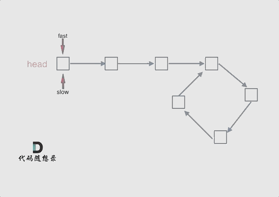

# 基本算法

这篇笔记用于记录我基本算法的学习。

参考资料：[代码随想录](https://programmercarl.com/)

# 数组

## 1.二分查找

### 题目

LeetCode原题：[704. 二分查找 - 力扣（LeetCode）](https://leetcode.cn/problems/binary-search/description/)

给定一个 n 个元素有序的（升序）整型数组 nums 和一个目标值 target  ，写一个函数搜索 nums 中的 target，如果目标值存在返回下标，否则返回 -1。

示例 1:

```text
输入: nums = [-1,0,3,5,9,12], target = 9     
输出: 4       
解释: 9 出现在 nums 中并且下标为 4     
```

示例 2:

```text
输入: nums = [-1,0,3,5,9,12], target = 2     
输出: -1        
解释: 2 不存在 nums 中因此返回 -1        
```

提示：

- 你可以假设 nums 中的所有元素是不重复的。
- n 将在 [1, 10000]之间。
- nums 的每个元素都将在 [-9999, 9999]之间。


### 思路

仅仅是一道简单的二分查找我也收获了很多。

我虽然能够把这题写出来，但是我没有一个完整的思路，属于是想到哪写到哪，这种写代码的方式很容易导致细节方面的错误，而且写的代码质量也不咋地，说实话，看起来杂乱无章。

我的代码

```java
public static int search(int[] nums, int target) {
    if(target<nums[0]||target>nums[nums.length-1]){
        //避免目标不不在数组内的时候还仍然跑到数组里去找
        return -1;
    }
    int left = 0;
    int right = nums.length - 1;
    int mid = (left + right) / 2;
    int rs = -1;
    //如果左边索引已经超过右边索引就退出循环
    while (left <= right) {
        if (nums[mid] == target) {
            rs = mid;
            break;
        } else {
            if (nums[mid] < target) {
                //说明目标值在右半部分
                left = mid + 1;
            } else {
                //说明目标值在左半部分
                right = mid - 1;
            }
        }
        mid = (left + right) / 2;
    }
    return rs;
}
```


一道简单的二分查找的思路也非常耐人寻味。因为说实话，确实如这个代码随想录这个教程所说，我在编写二分查找算法的时候经常会纠结于循环条件到底是`left<=right`,还是`left<right`，实际上这两种都对，只不过对应了两种不同的思路

思路一：

判断区间是[left,right]也就是左闭右闭，就是说判断值在在不在区间内会把两个边界值也考虑进去，这个时候我们在更改指针的时候应该这样做：当`target<nums[mid]`时，应该`right=mid-1`,当`target>nums[mid]`时，应该`left=mid+1`，并且循环条件应该是`left<=right`


思路二：

判断区间是[left,right)也就是左闭右开，也就是说判断时不会把最右边的值考虑进去，这个时候应该这样做：当`target<nums[mid]`时，应该`right=mid`，不用-1，因为判断时不会把最右边的包括进去。当`target>nums[mid]`时，应该`left=mid+1`，因为左边还是包含的，因此得加1。并且此时循环条件应该是`left<right`，因为等于的话就没有意义，反正最右边的值不会算入到判断中。


## 2.移出元素（相向双指针）

### 题目

[27. 移除元素 - 力扣（LeetCode）](https://leetcode.cn/problems/remove-element/description/)

给你一个数组 nums 和一个值 val，你需要 原地 移除所有数值等于 val 的元素，并返回移除后数组的新长度。

不要使用额外的数组空间，你必须仅使用 O(1) 额外空间并**原地**修改输入数组。

元素的顺序可以改变。你不需要考虑数组中超出新长度后面的元素。

示例 1: 给定 nums = [3,2,2,3], val = 3, 函数应该返回新的长度 2, 并且 nums 中的前两个元素均为 2。 你不需要考虑数组中超出新长度后面的元素。

示例 2: 给定 nums = [0,1,2,2,3,0,4,2], val = 2, 函数应该返回新的长度 5, 并且 nums 中的前五个元素为 0, 1, 3, 0, 4。

**你不需要考虑数组中超出新长度后面的元素。**


### 思路

这道题我一开始想到的思路是相向双指针，但是写的时候也是依托，代码思路一点也不清晰，乱糟糟的，最后调试半天才过。

通过这道题，我重新学习了相向双指针的代码到底该如何写，真的，不看看这些大佬们的代码，真不知道自己写的代码真就是依托又依托

相向双指针思路

```java
public static int removeElement_My(int[] nums, int val) {
    //相向双指针
    int left = 0;
    int right = nums.length-1;
    while (right >= 0 && nums[right] == val) right--;       //从右往左找到第一个非val值
    while (left <= right) {
        if (nums[left] == val) {
            nums[left] = nums[right];
            right--;
            //如果是我，我会在这里写个count++，完全不会去想用left指针作为返回值
            //count++
        }
        left++;
        while (right >= 0 && nums[right] == val) right--;
    }
    //直接将索引作为返回值，不像我还得拿个什么count变量来记录
    return left;
}
```


除了重新认识了相向双指针外，还学会了快慢指针思路

```java
public static int removeElement(int[] nums, int val) {
    //学到的思路，快慢指针
    int slowIndex = 0;
    for (int fastIndex = 0; fastIndex < nums.length; fastIndex++) {
        if (nums[fastIndex] != val) {
            nums[slowIndex] = nums[fastIndex];
            slowIndex++;
        }
    }
    return slowIndex;
}
```


## 3.有序数组的平方（相向双指针）

### 题目

[力扣题目链接](https://leetcode.cn/problems/squares-of-a-sorted-array/)

给你一个按 非递减顺序 排序的整数数组 nums，返回 每个数字的平方 组成的新数组，要求也按 非递减顺序 排序。

示例 1：

- 输入：nums = [-4,-1,0,3,10]
- 输出：[0,1,9,16,100]
- 解释：平方后，数组变为 [16,1,0,9,100]，排序后，数组变为 [0,1,9,16,100]

示例 2：

- 输入：nums = [-7,-3,2,3,11]
- 输出：[4,9,9,49,121]


### 思路

这题还是双指针，数组实际上是排好序的，只不过在平方后，前面的可能会比后面的大，所以可以分别用指针来指最前面和最后面，因为平方后的最大值一定是首尾两个中的一个

```java
public static int[] sortedSquares(int[] nums) {
    //相向双指针
    int left = 0;
    int right = nums.length - 1;
    int[] newArr = new int[nums.length];
    //逆向放入新数组，因为平方后最大值一定在最两边
    for (int i = newArr.length - 1; i >= 0; i--) {
        if((nums[left]*nums[left])>(nums[right]*nums[right])){
            newArr[i]=nums[left]*nums[left];
            left++;
        }else{
            newArr[i]=nums[right]*nums[right];
            right--;
        }
    }
    return newArr;
}
```


## 4.长度最小的子数组（滑动窗口）

### 题目

[力扣题目链接](https://leetcode.cn/problems/minimum-size-subarray-sum/)

给定一个含有 n 个正整数的数组和一个正整数 s ，找出该数组中满足其和 ≥ s 的长度最小的 连续 子数组，并返回其长度。如果不存在符合条件的子数组，返回 0。

示例：

- 输入：s = 7, nums = [2,3,1,2,4,3]
- 输出：2
- 解释：子数组 [4,3] 是该条件下的长度最小的子数组。

提示：

- 1 <= target <= 10^9
- 1 <= nums.length <= 10^5
- 1 <= nums[i] <= 10^5


### 思路

滑动窗口：**就是不断的调节子序列的起始位置和终止位置，从而得出我们要想的结果**。

这题的思路是滑动窗口，这里窗口指的就是子数组，滑动窗口指的就是动态改变子数组的长度，那这个动态是怎么个动态法？

如果当前子数组的和小于目标值，就扩大窗口，也就是向后移动移动右边的指针，并保持左边的指针不动

如果当前子数组的和小于目标值，就缩小窗口，也就是向后移动左边的指针，并保持右边的指针不动，直到子数组的和小于目标值。

这样就能一步步找到最短的子数组，就像试探一样，先一直加加加，当加到超过目标值后就尝试慢慢减，看到底减多少会刚好小于目标值

代码如下

```java
public static int minSubArrayLen(int target, int[] nums) {
    //思路：滑动窗口
    int rs = Integer.MAX_VALUE;
    //滑动窗口前面的指针
    int fast = 0;
    //滑动窗口后面的指针
    int slow = 0;
    //子数组的和
    int sum = 0;
    for (fast = 0; fast < nums.length; fast++) {
        sum += nums[fast];
        while (sum >= target) {
            int subLength = fast - slow + 1;
            rs = rs < subLength ? rs : subLength;
            sum-=nums[slow++];
        }
    }
    if(rs==Integer.MAX_VALUE) return 0;
    return rs;
}
```


## 5.螺旋矩阵II

### 题目

[力扣题目链接](https://leetcode.cn/problems/spiral-matrix-ii/)

给定一个正整数 n，生成一个包含 1 到 n^2 所有元素，且元素按顺时针顺序螺旋排列的正方形矩阵。

示例:

输入: 3 输出: [ [ 1, 2, 3 ], [ 8, 9, 4 ], [ 7, 6, 5 ] ]


### 思路

这题没有涉及到算法，主要是要掌握螺旋矩阵的模拟过程。这个模拟过程看似思路侵袭，实则处处碰壁。

我自己写代码的时候就有下面这些问题：

1.当n为1的特殊情况没有处理

2.无法正确把握下一次要填数据的位置


实际上就算是模拟也讲究思路的，这题主要要抓住一个循环不变量原则，这里的不变量指的是在分别处理上行、右列、下行、左列时到底是左闭右闭还是左闭右开还是其他，这里的话个人感觉左闭右开会好写很多，也就是在处理的时候每行，每列的最后一个不处理。

然后这题还有个技巧，就是每处理完一轮上行、右列、下行、左列可以看成是处理完一圈，也就是说可以按每圈每圈来处理，只不过这个圈每次都会逐渐变小，例如如果n为4，就有两圈，最外面一圈是边长为4的正方形，里面一圈是边长为2的正方形，如果n为3，最外面一圈就是边长为3的正方形，最里面是边长为1的正方形，也就是一个点。

所以我们可以得到一个结论，n阶矩阵可以看成n/2(向下取整)个正方形嵌套而成，其中如果n为奇数的时候还要在此基础上加上一个点，也就是1阶矩阵，这个要单独处理

仿照示例代码，并做出了点修改

```java
public static int[][] generateMatrix(int n) {
    //仿示例代码
    int[][] arr = new int[n][n];
    //每次要放入的数据
    int value = 1;
    //代表行
    int row = 0;
    //代表列
    int column = 0;
    //代表圈的边长,每圈的边长等于n-（循环圈数-1）*2
    int side = n;
    //代表循环的圈数
    int loop = 1;
    while (loop <= n / 2) {
        //处理上行
        for (int i = 0; i < side - 1; i++) {
            arr[row][column++] = value++;
        }
        //处理右列
        for (int i = 0; i < side - 1; i++) {
            arr[row++][column] = value++;
        }
        //处理下行
        for (int i = 0; i < side - 1; i++) {
            arr[row][column--] = value++;
        }
        //处理左列
        for (int i = 0; i < side - 1; i++) {
            arr[row--][column] = value++;
        }
        //处理完一圈，圈数加1
        loop++;
        //边长减2
        side -= 2;
        //重设每圈的起点
        row = loop - 1;
        column = loop - 1;
    }
    //对n为奇数时单独处理
    if (n % 2 == 1) {
        arr[row][column]=n*n;
    }
    return arr;

}
```


## 6.区间和（方法:前缀和）

### 题目

[题目链接](https://kamacoder.com/problempage.php?pid=1070)

题目描述

给定一个整数数组 Array，请计算该数组在每个指定区间内元素的总和。

输入描述

第一行输入为整数数组 Array 的长度 n，接下来 n 行，每行一个整数，表示数组的元素。随后的输入为需要计算总和的区间，直至文件结束。

输出描述

输出每个指定区间内元素的总和。

输入示例

```text
5
1
2
3
4
5
0 1
1 3
```

输出示例

```text
3
9
```

数据范围：

0 < n <= 100000


### 思路

最容易想到的就是暴力求解，直接先输入数组，在遍历数组取区间和。但是老是用这种暴力解法是没有办法进步的，暴力解法谁都能想到

这题要用的新思路是：前缀和。前缀和的思想是重复利用计算过的子数组之和，从而降低区间查询的次数。

在输入原数组的时候，就可以创建一个前缀和数组p[]来一步一步记录前缀和，p[i]代表的就是前i个元素的和，最终当数组输入完毕后，前缀和数组也就记录完毕。此时如果我们想要计算某个区间的和，例如计算a、b区间的和，只需要用前缀和p[b]减去前缀和p[a-1]，这里要注意的就是减的时候应该是减p[a-1]而不是p[a]，因为a、b区间的和包括a这个位置的元素。这样做，在每次计算区间和的时候就只用计算一次，不需要像暴力解法那样去重复查找原数组。

代码如下

```java
public static void subArrSum() {
    //前缀和
    Scanner sc = new Scanner(System.in);
    int n = sc.nextInt();
    //前缀和数组，p[i]表示arr[0]~arr[i]的和
    int[] p = new int[n];
    //初始化数组
    p[0] = sc.nextInt();
    for (int i = 1; i < n; i++) {
        int num = sc.nextInt();
        p[i] = p[i - 1] + num;
    }
    int a;
    int b;
    //这里循环条件注意别用true，用sc.hasNext这些
    while(sc.hasNextInt()){
        //输入区间
        a=sc.nextInt();
        b=sc.nextInt();
        if(a==0){
            //对左边界为0的时候特殊处理
            System.out.println(p[b]);
        }else {
            System.out.println(p[b] - p[a - 1]);
        }
    }
    sc.close();

}
```


## 7.开发商购买土地

### 题目

[题目链接](https://kamacoder.com/problempage.php?pid=1044)

【题目描述】

在一个城市区域内，被划分成了n * m个连续的区块，每个区块都拥有不同的权值，代表着其土地价值。目前，有两家开发公司，A 公司和 B 公司，希望购买这个城市区域的土地。

现在，需要将这个城市区域的所有区块分配给 A 公司和 B 公司。

然而，由于城市规划的限制，只允许将区域按横向或纵向划分成两个子区域，而且每个子区域都必须包含一个或多个区块。

为了确保公平竞争，你需要找到一种分配方式，使得 A 公司和 B 公司各自的子区域内的土地总价值之差最小。

注意：区块不可再分。

【输入描述】

第一行输入两个正整数，代表 n 和 m。

接下来的 n 行，每行输出 m 个正整数。

输出描述

请输出一个整数，代表两个子区域内土地总价值之间的最小差距。

【输入示例】

3 3 1 2 3 2 1 3 1 2 3

【输出示例】

0

【提示信息】

如果将区域按照如下方式划分：

1 2 | 3 2 1 | 3 1 2 | 3

两个子区域内土地总价值之间的最小差距可以达到 0。

【数据范围】：

- 1 <= n, m <= 100；
- n 和 m 不同时为 1。


### 思路

还好这题只要求横向划分和纵向划分，如果来个斜向划分就麻烦了。

横向划分，可以看成是由前几行组成一块区域，最后几行组成一块区域，而每块区域的权值和不就是对应那几行的数据加起来吗，然后我们可以把每一行数据先加起来看成一个值，假如说第一块区域由前3行组成，那么第一块区域的权值和就是第一行的权值和加上第二行的权值和再加上第三行的权值和，这样一来一个二位数组其实就可以看成是一维数组，一维数组的每个值对应的就是二维数组每一行的权值和，这样一来这个开发商问题就转化成了将一维数组划分为两个子数组，然后求两个子数组的最小差值的问题。

纵向划分也是同理。

问题一转化思路就清晰了，用前缀和就非常好求。假如我们的到一个横向划分的前缀和数组row[3]，row[0]代表前一行的权值和，row[1]代表前2行的权值和.....，此时我们就可以遍历所有划分情况，然后计算每一种划分情况的两块区域差值，比如以第一行为一个区域，剩下两行为另一个区域，那么这两区域的差值就是row[2]-row[0]*2，首先row[2]-row[0]就是第二个区域的权值和，再减去row[0]才是两个区域的差值。

要注意的是计算差值一定要关注需不需要求结果的绝对值，这题显然是要的。

代码如下

```java
import java.util.Scanner;

//开发商购买土地
public class KamaCoder44 {
    public static void main(String[] args) {
        buyLand();
    }

    public static void buyLand() {
        Scanner sc = new Scanner(System.in);
        int n = sc.nextInt();
        int m = sc.nextInt();
        int[][] lands = new int[n][m];
        //min表示两块区域土地的最小权值差
        int min = Integer.MAX_VALUE;
        //输入土地的权值，并顺便统计横向土地权值和以及纵向土地权值和
        //row[i]表示第i行的所有土地的权值和
        int[] row = new int[n];
        //column[j]表示第j列的所有土地权值和
        int[] column = new int[m];
        for (int i = 0; i < n; i++) {
            for (int j = 0; j < m; j++) {
                lands[i][j] = sc.nextInt();
                row[i] += lands[i][j];
                column[j] += lands[i][j];
            }
        }

        //计算横向前缀和，preRow[i]表示前i行的所有土地权值和
        int[] preRow = new int[n];
        preRow[0] = row[0];
        for (int i = 1; i < row.length; i++) {
            preRow[i] = preRow[i - 1] + row[i];
        }

        //计算纵向前缀和，preColumn[j]表示前j列的所有土地的权值和
        int[] preColumn = new int[m];
        preColumn[0] = column[0];
        for (int i = 1; i < column.length; i++) {
            preColumn[i] = preColumn[i - 1] + column[i];
        }

        //横向划分
        for (int i = 1; i < preRow.length; i++) {
            int dif = Math.abs(preRow[preRow.length - 1] - preRow[i - 1]*2);
            min = dif < min ? dif : min;
        }

        //纵向划分
        for (int i = 1; i < preColumn.length; i++) {
            int dif = Math.abs(preColumn[preColumn.length - 1] - preColumn[i - 1]*2);
            min = dif < min ? dif : min;
        }
        System.out.println(min);

    }
}
```


# 链表

## 1.链表理论基础

### 链表节点的定义

```java
public class ListNode {
    //节点的值
    int val;

    //下一个节点的地址
    ListNode next;

    public ListNode() {
    }

    public ListNode(int val) {
        this.val = val;
    }

    //这个好像不大需要
//    public ListNode(ListNode next) {
//        this.next = next;
//    }

    public ListNode(int val, ListNode next) {
        this.val = val;
        this.next = next;
    }
}
```


## 2.移出链表元素

### 题目

[力扣题目链接](https://leetcode.cn/problems/remove-linked-list-elements/)

题意：删除链表中等于给定值 val 的所有节点。

示例 1： 输入：head = [1,2,6,3,4,5,6], val = 6 输出：[1,2,3,4,5]

示例 2： 输入：head = [], val = 1 输出：[]

示例 3： 输入：head = [7,7,7,7], val = 7 输出：[]


### 思路

删除链表元素的思路没什么好讲的，就是遍历然后判断要不要删。

主要要知道的是涉及链表元素操作的两种方式：

1.直接使用原来的链表进行操作

这种方式在删除节点的时候是通过要删除节点前面那个节点来删除的，但是头节点前面没有节点，因此要单独处理头节点。

头节点的处理也很简单，当判断头节点符合被删除的要求时，只需要将头节点往前移，这样就相当于删除了原来的头节点。


2.设置一个虚拟头节点再进行操作

这种方式的好处在于删除头节点的操作方式与删除其他节点的方式一样了，因此不用单独处理头节点


这题我用的是第二种方式，代码如下，我一开始写的代码不是下面这样的，写的很烂，所以好好学一学下面的代码吧。

```java
public static ListNode removeElements(ListNode head, int val) {
    //参考的别人的代码
    ListNode dummyNode = new ListNode();
    dummyNode.next = head;
    //创建一个当前节点
    ListNode currentNode = dummyNode;
    while(currentNode.next!=null){
        if(currentNode.next.val==val){
            currentNode.next=currentNode.next.next;
        }else {
            currentNode=currentNode.next;
        }
    }
    return dummyNode.next;
}
```


## 3.设计链表

### 题目

[力扣题目链接](https://leetcode.cn/problems/design-linked-list/)

题意：

在链表类中实现这些功能：

- get(index)：获取链表中第 index 个节点的值。如果索引无效，则返回-1。
- addAtHead(val)：在链表的第一个元素之前添加一个值为 val 的节点。插入后，新节点将成为链表的第一个节点。
- addAtTail(val)：将值为 val 的节点追加到链表的最后一个元素。
- addAtIndex(index,val)：在链表中的第 index 个节点之前添加值为 val 的节点。如果 index 等于链表的长度，则该节点将附加到链表的末尾。如果 index 大于链表长度，则不会插入节点。如果index小于0，则在头部插入节点。
- deleteAtIndex(index)：如果索引 index 有效，则删除链表中的第 index 个节点。


### 思路

这道题模拟了链表的几个操作，用来熟悉练习链表非常不错。

做这道题我出现的问题主要是自己对链表这一数据结构没有一个标准的概念，我知道什么是链表，也直到链表怎么实现，但是实现链表的方式不止一种，在写这个代码的时候，我脑袋里一会儿想这这种实现方式，一会儿有想到了那种实现方式，导致整个过程非常混乱，思路不清晰。

所以我觉得做这种题，首先就要先明确自己到底要用那种方式，例如要先弄清楚size代表什么，是当前链表最大索引还是当前链表长度，再如链表要不要虚拟头节点。把这些基本的东西搞清除，制定一个规范再下笔，思路才会更清晰。

代码如下

```java
//设计链表
public class LeetCode707 {

}


/**
 * 在模拟链表这种数据结构的时候最好能有一个统一的规定，例如要先弄清楚size代表什么，是当前链表最大索引还是当前链表长度，再如链表要不要虚拟头节点。
 * 有一个统一的规定模拟起来才不会混乱，再下次遇到的时候心里也有一个整体的规范，不然脑袋里面就会变来变去，非常影响编写代码
 * 这里我就做一个统一的规范，以后遇到链表相关的模拟就按这个规范来
 * 1.采用单链表，一个节点只包含val和next
 * 2.采用虚拟头节点
 * 3.size代表链表的实际长度
 */
class MyLinkedList {
    class ListNode {
        int val;
        ListNode next;

        ListNode() {
        }

        ListNode(int val, ListNode next) {
            this.val = val;
            this.next = next;
        }
    }

    //链表的虚拟头节点
    ListNode head;
    //链表的实际长度
    int size;

    public MyLinkedList() {
        //初始化链表
        head = new ListNode();
        size = 0;
    }

    public int get(int index) {
        //获取指定索引的节点
        //首先处理非法索引
        if(index<0||index>=size){
            return -1;
        }
        //当前节点
        ListNode cur = head;
        for (int i = 0; i <= index; i++) {
            cur=cur.next;
        }
        return cur.val;
    }

    public void addAtHead(int val) {
        //在头节点前面添加元素
        //让新节点的next指向原来的头节点
        ListNode newNode = new ListNode(val,head.next);
        //只需让虚拟头节点指向要添加的节点即可
        head.next = newNode;
        //别忘了让链表的长度+1
        size++;
    }

    public void addAtTail(int val) {
        //在尾节点后面添加元素
        ListNode cur = head;
        //先遍历节点，一直到尾节点
        while(cur.next!=null){
            cur=cur.next;
        }
        //创建一个新节点并让旧尾节点指向新尾节点
        ListNode newNode = new ListNode(val,null);
        cur.next=newNode;
        //别忘了让链表长度+1
        size++;
    }

    public void addAtIndex(int index, int val) {
        //在指定索引位置添加元素
        //首先处理非法索引，在这里索引为size的情况并不是非法情况，如果索引为size，说明新节点是插入到链表尾部的
        if(index<0||index>size){
            return;
        }
        //遍历链表，直到目标索引的前驱节点
        ListNode cur = head;
        for (int i = 0; i < index; i++) {
            cur=cur.next;
        }
        //新建要插入的节点，并让新节点指向原来在这个索引位置的节点
        ListNode newNode = new ListNode(val,cur.next);
        //让前驱节点指向新节点
        cur.next=newNode;
        //别忘了让链表长度+1
        size++;
    }

    public void deleteAtIndex(int index) {
        //删除指定索引的节点
        //处理非法索引
        if(index<0||index>=size){
            return;
        }
        ListNode cur = head;
        //遍历到要删除节点的前驱节点
        for (int i = 0; i < index; i++) {
            cur=cur.next;
        }
        //直接让前驱节点指向被删除节点的下一个节点即可
        cur.next=cur.next.next;
        //别忘了让链表长度-1
        size--;
    }
}
```


## 4.翻转链表

### 题目

[力扣题目链接](https://leetcode.cn/problems/reverse-linked-list/)

题意：反转一个单链表。

示例: 输入: 1->2->3->4->5->NULL 输出: 5->4->3->2->1->NULL


### 思路

采用双指针法。定义一个cur指针代表当前节点，定义一个pre代表前驱节点，定义一个tmp代表临时节点，临时节点用于保存下一个节点的位置。

翻转时，只需将cur的next指向pre即可，完成翻转后cur和pre都向前移动一个节点直到翻转完所有节点

代码如下

```java
//反转链表
public class LeetCode206 {

}
class Solution {
    public ListNode reverseList(ListNode head) {
        //双指针法
        //当前节点
        ListNode cur = head;
        //前驱节点
        ListNode pre = null;
        //临时节点
        ListNode tmp = null;
        while(cur!=null){
            //保存下一个节点的位置
            tmp=cur.next;
            cur.next=pre;
            //两个指针都向前移动一个节点
            pre=cur;
            cur=tmp;
        }
        return pre;
    }
}

//LeetCode题目给的链表节点类，不是我自己定义的
class ListNode {
      int val;
      ListNode next;
      ListNode() {}
      ListNode(int val) { this.val = val; }
      ListNode(int val, ListNode next) { this.val = val; this.next = next; }
  }
```


## 5.两两交换链表中的节点

### 题目

[力扣题目链接](https://leetcode.cn/problems/swap-nodes-in-pairs/)

给定一个链表，两两交换其中相邻的节点，并返回交换后的链表。

你不能只是单纯的改变节点内部的值，而是需要实际的进行节点交换。


### 思路

思路就是模拟，但是模拟这东西真的是想着挺简单的，但是一敲代码真的有好多细节需要注意。

首先要想好模拟的过程，在脑袋里面要有一个清晰的过程，最好就拿草稿纸来写一下，不要太相信自己的脑袋，这道题我也并没有一遍过，代码写出来有有几个漏洞

模拟过程如下

先让当前节点指向第二个节点，然后让第二个指向第一个节点完成交换，最后让第一个节点指向第三个节点。这里特别要注意，第三个节点的地址要用一个临时变量记住，我就是在这里踩了坑。


代码如下

```java
import dataStructure.ListNode;

//两两交换链表中的节点
public class LeetCode24 {
    public ListNode swapPairs(ListNode head) {
        //处理空链表和长度为1的链表的情况
        if(head==null||head.next==null){
            return null;
        }
        //记住第二个节点，最后直接返回这个节点
        ListNode newHead = head.next;
        //使用虚拟头节点
        //让cur指向虚拟头节点
        ListNode cur = new ListNode(0,head);
        //如果当前节点为空并且当前节点后面的节点数不少于两个，就两两交换处理
        while(cur!=null&&cur.next!=null&&cur.next.next!=null){
            //创建两个变量来代表进行两两交换的节点，会让思路清晰一点
            ListNode first = cur.next;
            ListNode second = cur.next.next;
            //临时变量记住第三个节点
            ListNode tmp = second.next;
            //让当前节点指向第二个节点
            cur.next=second;
            //让第二个节点指向第一个节点
            second.next=first;
            //让第一个节点指向第二个节点的下一个节点
            //first.next=second.next;   这里注意一下，我第一次写的代码是这样的，但是前面second.next已经被修改了，所以这行代码实际上first.next=first，指向自己了
            //应该用于个临时变量来记住第三个节点
            first.next=tmp;
            //让当前节点的指针向前移动
            //cur=second;		这里也注意一下，我第一次写的是cur=second，脑袋里面想的确实是让cur向前移动两个节点，但是由于第一个节点和第二个节点已经交换了，此时第二个节点已经变成第一个节点，第一个节点变成第二个节点了，所以应该是cur=first;
            cur=first;
        }
        //处理好后直接返回处理前的第二个节点
        return newHead;
    }
}
```


## 6.删除链表的倒数第N个节点

### 题目

[力扣题目链接](https://leetcode.cn/problems/remove-nth-node-from-end-of-list/)

给你一个链表，删除链表的倒数第 n 个结点，并且返回链表的头结点。

进阶：你能尝试使用一趟扫描实现吗？

示例 1：


输入：head = [1,2,3,4,5], n = 2 输出：[1,2,3,5]

示例 2：

输入：head = [1], n = 1 输出：[]

示例 3：

输入：head = [1,2], n = 1 输出：[1]


### 思路

采用快慢指针法。

定义一个fast指针和一个slow指针同时指向开始节点（最好指向虚拟头节点）

先让fast指针向前移动n个节点

接着让slow和fast指针同时向前移动，直到fast到达链表的末尾，即：fast指针为null，注意不是指向尾节点，而是链表的结尾null

这时slow所指的节点就是要删除的节点


代码如下

```java
import dataStructure.ListNode;

//删除链表的倒数第N个节点
public class LeetCode19 {
    public ListNode removeNthFromEnd(ListNode head, int n) {
        /*思路：
        *快慢指针
        * 定义一个快指针fast和一个慢指针slow
        * 让fast先移动n个节点
        * 然后slow和fast同时移动，直到fast到达末尾，注意不是最后一个节点，而是链表的末尾，即：最后fast指针为null
        * 此时slow指向的节点就是要删除的节点
        * */

        //定义一个虚拟头节点
        ListNode dummy = new ListNode(0,head);
        //快指针,指向虚拟节点
        ListNode fast = dummy;
        //慢指针,指向虚拟节点
        ListNode slow = dummy;
        //快指针先移动n+1个节点，正常来说移动n个节点就可以了，这里移动n+1个节点是为了让slow指针指向要删除的节点的前驱节点，方便进行删除操作
        for (int i = 0; i < n+1; i++) {
            //注意处理异常情况，如果fast在这个过程中变为了null，说明倒数第n个节点根本不存在，直接返回原来的链表
            if(fast==null){
                return head;
            }
            fast=fast.next;
        }
        //接着让快慢指针同时移动，直到fast指向结尾的null
        while(fast!=null){
            fast=fast.next;
            slow=slow.next;
        }
        //循环结束，找到要删除节点的前驱节点，进行删除操作
        slow.next=slow.next.next;
        //返回虚拟头节点指向的节点，即新的头节点
        return dummy.next;
    }
}
```


## 7.链表相交

### 题目

同：160.链表相交

[力扣题目链接](https://leetcode.cn/problems/intersection-of-two-linked-lists-lcci/)

给你两个单链表的头节点 headA 和 headB ，请你找出并返回两个单链表相交的起始节点。如果两个链表没有交点，返回 null 。

图示两个链表在节点 c1 开始相交：


题目数据 保证 整个链式结构中不存在环。

注意，函数返回结果后，链表必须 保持其原始结构 。

示例 1：


示例 2：


示例 3：


### 思路

首先要明白什么是链表相交：链表相交是指两个链表在某个节点开始合并，共享相同的节点序列。

明白了链表相交的概念才能正确解题，我刚开始都不明白链表相交是啥。

思路如下：

首先统计A、B两条链表的长度，假设分别为n、m

使用curA、curB两个指针分别指向A、B链表

将两条链表尾部对齐，这里假设m>n，那么对齐方式就是curB先向前移动m-n个节点

尾部对齐后，curA和curB同时向前移动，移动的同时判断curA和curB地址是否相同，如果地址相同，那么该节点就是链表相交的起始节点


代码如下

```java
import dataStructure.ListNode;

//链表相交
public class LeetCode160 {
    public ListNode getIntersectionNode(ListNode headA, ListNode headB) {
        /*思路：
         * 首先统计A、B两条链表的长度，假设分别为n、m
         * 使用curA、curB两个指针分别指向A、B链表
         * 将两条链表尾部对齐，这里假设m>n，那么对齐方式就是curB先向前移动m-n个节点
         * 尾部对齐后，curA和curB同时向前移动，移动的同时判断curA和curB地址是否相同，如果地址相同，那么该节点就是链表相交的起始节点
         * */

        //curA指针指向链表A
        ListNode curA = headA;
        //curB指针指向链表B
        ListNode curB = headB;
        //计算链表A的长度
        int lenA = 0;
        while (curA != null) {
            lenA++;
            curA = curA.next;
        }
        curA = headA;

        //计算链表B的长度
        int lenB = 0;
        while (curB != null) {
            lenB++;
            curB = curB.next;
        }
        curB=headB;

        //尾部对齐
        //如果链表A长
        if(lenA>lenB){
            for (int i = 0; i < lenA-lenB; i++) {
                curA=curA.next;
            }
        }
        //如果链表B长
        if(lenA<lenB){
            for (int i = 0; i < lenB-lenA; i++) {
                curB=curB.next;
            }
        }

        //尾部对齐后开始寻找链表相交的起始节点
        while(curA!=null){
            if(curA==curB){
                return curA;
            }else{
                curA=curA.next;
                curB=curB.next;
            }
        }
        return null;
    }
}
```


## 8.环形链表II

### 题目

[力扣题目链接](https://leetcode.cn/problems/linked-list-cycle-ii/)

题意： 给定一个链表，返回链表开始入环的第一个节点。 如果链表无环，则返回 null。

为了表示给定链表中的环，使用整数 pos 来表示链表尾连接到链表中的位置（索引从 0 开始）。 如果 pos 是 -1，则在该链表中没有环。

**说明**：不允许修改给定的链表。


### 思路

这道题的思路我是第一次见，以前从来没有写过这样的题，长见识了。这里笔记直接复制的原资料中的讲的思路


这道题目，不仅考察对链表的操作，而且还需要一些数学运算。

主要考察两知识点：

- 判断链表是否环
- 如果有环，如何找到这个环的入口

### 判断链表是否有环

可以使用快慢指针法，分别定义 fast 和 slow 指针，从头结点出发，fast指针每次移动两个节点，slow指针每次移动一个节点，如果 fast 和 slow指针在途中相遇 ，说明这个链表有环。

为什么fast 走两个节点，slow走一个节点，有环的话，一定会在环内相遇呢，而不是永远的错开呢

首先第一点：**fast指针一定先进入环中，如果fast指针和slow指针相遇的话，一定是在环中相遇，这是毋庸置疑的。**

那么来看一下，**为什么fast指针和slow指针一定会相遇呢？**

可以画一个环，然后让 fast指针在任意一个节点开始追赶slow指针。

会发现最终都是这种情况， 如下图：


fast和slow各自再走一步， fast和slow就相遇了

这是因为fast是走两步，slow是走一步，**其实相对于slow来说，fast是一个节点一个节点的靠近slow的**，所以fast一定可以和slow重合。

动画如下：



### 如果有环，如何找到这个环的入口

**此时已经可以判断链表是否有环了，那么接下来要找这个环的入口了。**

假设从头结点到环形入口节点 的节点数为x。 环形入口节点到 fast指针与slow指针相遇节点 节点数为y。 从相遇节点 再到环形入口节点节点数为 z。 如图所示：


那么相遇时： slow指针走过的节点数为: `x + y`， fast指针走过的节点数：`x + y + n (y + z)`，n为fast指针在环内走了n圈才遇到slow指针， （y+z）为 一圈内节点的个数A。

因为fast指针是一步走两个节点，slow指针一步走一个节点， 所以 fast指针走过的节点数 = slow指针走过的节点数 * 2：

```
(x + y) * 2 = x + y + n (y + z)
```

两边消掉一个（x+y）: `x + y = n (y + z)`

因为要找环形的入口，那么要求的是x，因为x表示 头结点到 环形入口节点的的距离。

所以要求x ，将x单独放在左面：`x = n (y + z) - y` ,

再从n(y+z)中提出一个 （y+z）来，整理公式之后为如下公式：`x = (n - 1) (y + z) + z` 注意这里n一定是大于等于1的，因为 fast指针至少要多走一圈才能相遇slow指针。

这个公式说明什么呢？

先拿n为1的情况来举例，意味着fast指针在环形里转了一圈之后，就遇到了 slow指针了。

当 n为1的时候，公式就化解为 `x = z`，

这就意味着，**从头结点出发一个指针，从相遇节点 也出发一个指针，这两个指针每次只走一个节点， 那么当这两个指针相遇的时候就是 环形入口的节点**。

也就是在相遇节点处，定义一个指针index1，在头结点处定一个指针index2。

让index1和index2同时移动，每次移动一个节点， 那么他们相遇的地方就是 环形入口的节点。

动画如下：


那么 n如果大于1是什么情况呢，就是fast指针在环形转n圈之后才遇到 slow指针。

其实这种情况和n为1的时候 效果是一样的，一样可以通过这个方法找到 环形的入口节点，只不过，index1 指针在环里 多转了(n-1)圈，然后再遇到index2，相遇点依然是环形的入口节点。


### 补充

在推理过程中，大家可能有一个疑问就是：**为什么第一次在环中相遇，slow的 步数 是 x+y 而不是 x + 若干环的长度 + y 呢？**

即文章[链表：环找到了，那入口呢？](https://programmercarl.com/0142.环形链表II.html)中如下的地方：


首先slow进环的时候，fast一定是先进环来了。

如果slow进环入口，fast也在环入口，那么把这个环展开成直线，就是如下图的样子：


可以看出如果slow 和 fast同时在环入口开始走，一定会在环入口3相遇，slow走了一圈，fast走了两圈。

重点来了，slow进环的时候，fast一定是在环的任意一个位置，如图：


那么fast指针走到环入口3的时候，已经走了k + n 个节点，slow相应的应该走了(k + n) / 2 个节点。

因为k是小于n的（图中可以看出），所以(k + n) / 2 一定小于n。

**也就是说slow一定没有走到环入口3，而fast已经到环入口3了**。

这说明什么呢？

**在slow开始走的那一环已经和fast相遇了**。

那有同学又说了，为什么fast不能跳过去呢？ 在刚刚已经说过一次了，**fast相对于slow是一次移动一个节点，所以不可能跳过去**。

好了，这次把为什么第一次在环中相遇，slow的 步数 是 x+y 而不是 x + 若干环的长度 + y ，用数学推理了一下，算是对[链表：环找到了，那入口呢？](https://programmercarl.com/0142.环形链表II.html)的补充。


# 哈希表

## 2.有效的字母异位词

### 题目

[力扣题目链接](https://leetcode.cn/problems/valid-anagram/)

给定两个字符串 s 和 t ，编写一个函数来判断 t 是否是 s 的字母异位词。

示例 1: 输入: s = "anagram", t = "nagaram" 输出: true

示例 2: 输入: s = "rat", t = "car" 输出: false

**说明:** 你可以假设字符串只包含小写字母。


### 思路

首先要明白什么是字母异位词

字母异位词是通过重新排列不同单词或短语的字母而形成的单词或短语，并使用所有原字母一次。

也就是说两个单词的长度一致，所用过的字母也都一致


那么思路如下：

新建一个长度为26的整形数组，将每个字母依次映射为不同的索引，如：a映射为0，b映射为1，以此类推
首先遍历s的字符，每遍历一个字符就在对应索引位置+1
再遍历t的字符，每遍历一个字符就在对应索引位置-1
最后判断数组中是否存在不为0的位置，如果存在不为0的位置，说明s或t其中一个字符串存在多出来的字符


```java
//有效的字母异位词
public class LeetCode242 {
    public boolean isAnagram(String s, String t) {
        /*新建一个长度为26的整形数组，将每个字母依次映射为不同的索引，如：a映射为0，b映射为1，以此类推
        * 首先遍历s的字符，每遍历一个字符就在对应索引位置+1
        * 再遍历t的字符，每遍历一个字符就在对应索引位置-1
        * 最后判断数组中是否存在不为0的位置，如果存在不为0的位置，说明s或t其中一个字符串存在多出来的字符
        */

        //创建数组
        int[] arr = new int[26];
        //遍历字符串s
        for (int i = 0; i < s.length(); i++) {
            arr[s.charAt(i)-'a']++;
        }
        //遍历字符串t
        for (int i = 0; i < t.length(); i++) {
            arr[t.charAt(i)-'a']--;
        }
        //检查数组是否存在非0的位置
        for (int i : arr) {
            if(i!=0){
                return false;
            }
        }
        //如果数组所有位置都为0，说明t是s的字母异位词
        return true;
    }
}
```


## 3.两个数组的交集

### 题目

[力扣题目链接](https://leetcode.cn/problems/intersection-of-two-arrays/)

题意：给定两个数组，编写一个函数来计算它们的交集。


**说明：** 输出结果中的每个元素一定是唯一的。 我们可以不考虑输出结果的顺序。


### 思路

学会使用set集合，set集合的特点是无序、不重复、无索引的
利用set集合来存储，这里使用HashSet，由于HashSet不存储重复的元素，因此可以很好地记录nums1中出现了哪些数字
首先遍历nums1，将nums1中出现过的数字放在HashSet集合中
再遍历nums2，在HashSet集合中寻找nums2的数字，如果找到了就说明该数字是两数组的交集的元素。
这题思路上没那么复杂，但是要注意的是数组的转换问题，因为两个数组的交集的结果到底有多少个数字我们是没法明确得知的
所以要使用可变长集合来记录交集结果，而如何把这个可变长集合变成数组就是问题所在，有两种方法来解决这个问题：
1.使用Stream流
2.再创建一个长度等于结果集长度的数组


代码如下

```java
public int[] intersection(int[] nums1, int[] nums2) {
    /*思路：
     * 学会使用set集合，set集合的特点是无序、不重复、无索引的
     * 利用set集合来存储，这里使用HashSet，由于HashSet不存储重复的元素，因此可以很好地记录nums1中出现了哪些数字
     * 首先遍历nums1，将nums1中出现过的数字放在HashSet集合中
     * 再遍历nums2，在HashSet集合中寻找nums2的数字，如果找到了就说明该数字是两数组的交集的元素。
     * 这题思路上没那么复杂，但是要注意的是数组的转换问题，因为两个数组的交集的结果到底有多少个数字我们是没法明确得知的
     * 所以要使用可变长集合来记录交集结果，而如何把这个可变长集合变成数组就是问题所在，有两种方法来解决这个问题：
     * 1.使用Stream流
     * 2.再创建一个长度等于结果集长度的数组
     * */

    //创建set集合
    Set<Integer> set = new HashSet<>();
    //遍历nums1
    for (int i : nums1) {
        set.add(i);
    }
    //遍历nums2
    //再创建一个结果集，用来存放交集结果
    Set<Integer> result = new HashSet<>();
    for (int i : nums2) {
        //如果在set集合中能够找到nums2中的数字就将其放入结果集
        if(set.contains(i)){
            result.add(i);
        }
    }

    //方法2，创建一个长度与结果集相同的数组
    int[] arr = new int[result.size()];
    int i=0;
    for (Integer value : result) {
        arr[i++]=value;
    }


    //将集合转换成数组
    //方法1，使用Stream流
    return result.stream().mapToInt(new ToIntFunction<Integer>() {
        @Override
        public int applyAsInt(Integer value) {
            return value.intValue();
        }
    }).toArray();

}
```
