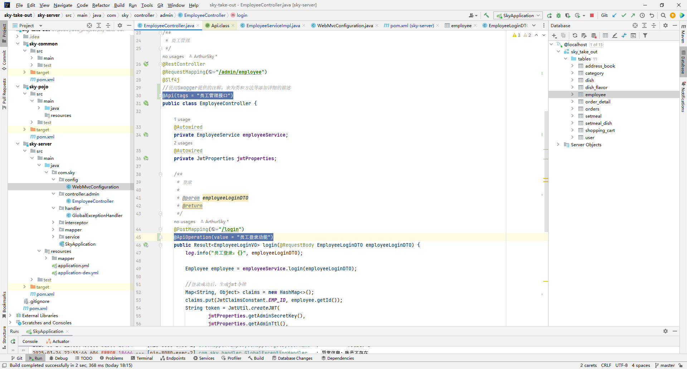
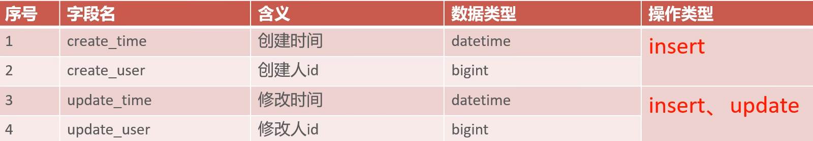

# 卢布朗餐厅开发日志

## 项目结构

整个项目包含三个模块，sky-common是项目的通用类模块，sky-pojo是项目的实体类模块，sky-server是项目的后端模块


sky-common包括工具类、异常、配置类等通用类


sky-pojo包括

dto数据传输对象：用于程序中各层之间数据传递

entity实体：数据库表对应的实体类

vo视图对象：为前端展示数据提供的对象


sky-server包括Controller、Service、Mapper等类


## 前后端联调

在本项目中，前端发出的请求地址和后端的实际接口地址是不一样的，如下图，是进行登录时，前端的请求地址和后端的实际的接口地址


我们打开控制台可以看见，浏览器发出的请求地址


那为什么请求地址对不上但后端却能够正常响应呢？

那是因为本项目使用了Nginx反向代理，浏览器发出的请求并没有直接到达后端服务器，而是先到达了Nginx反向代理服务器，然后再由Nginx服务器再对后端服务器发送请求。

使用Nginx反向代理的好处：

1.可以提高访问速度。

使用Nginx反向代理服务器，可以缓存请求到的数据，这样下次再进行相同请求时就不用再访问后端服务器了，直接从缓存中取出结果。

2.可以实现负载均衡。

所谓负载均衡就是把大量的请求按照我们指定的方式均衡的分配给集群中的每台服务器。

由Nginx服务器来管理前端请求，将请求分配到不同的服务器上，从而实现负载均衡。如果不使用Nginx，前端访问的服务器就只有一台，无法实现负载均衡

3.可以保证后端的安全性

使用Nginx反向代理，后端接口就可以不用暴露在公网环境中，前端发出请求后，由Nginx反向代理服务器来处理，再由Nginx服务器通过内网将请求转发给后端。


## 配置Nginx反向代理

在nginx.conf文件中配置反向代理，下面是一个示例

```
# 反向代理,处理管理端发送的请求
server{
	listen 80;			#监听80端口
	server_name localhost;
	
	location /api/ {
	proxy_pass   http://localhost:8080/admin/;
	}
}
```

这个配置的意思是，如果请求地址中包含有`/api/`，那么就将该请求地址替换为`http://localhost:8080/admin/`，后面还会拼接原来地址中`/api/`后面剩余的部分。如请求地址为`http://localhost/api/employee/login`，最终就会被替换为`http://localhost:8080/admin/employee/login`


## 配置Nginx负载均衡

负载均衡实际上也用到了反向代理。

负载均衡也在nginx.conf文件中进行配置，下面是一个示例

```
upstream webservers{
	  server 192.168.100.128:8080;
	  server 192.168.100.129:8088;
}

server{
	listen 80;
	server_name localhost;
	
	location /api/ {
	proxy_pass   http://localhost:8080/admin/;
	}
}
	
```

这个配置的意思是，会将收到的请求转发到192.168.100.128:8080、192.168.100.129:8088这两台服务器上，默认采用的负载均衡策略是轮询。

下面是负载均衡的几种策略


## 项目部署

使用Docker来部署，将所需的包，以及需要挂载的路径放在一个文件夹中，如下图所示


Java后端的Dockfile

```
# 基础镜像
FROM openjdk:17
# 设定时区
ENV TZ=Asia/Shanghai
RUN ln -snf /usr/share/zoneinfo/$TZ /etc/localtime && echo $TZ > /etc/timezone
# 拷贝jar包
COPY sky-common-1.0-SNAPSHOT.jar /sky-common-1.0-SNAPSHOT.jar
COPY sky-pojo-1.0-SNAPSHOT.jar /sky-pojo-1.0-SNAPSHOT.jar
COPY sky-server-1.0-SNAPSHOT.jar /sky-server-1.0-SNAPSHOT.jar
# 入口
ENTRYPOINT ["java", "-jar", "/sky-server-1.0-SNAPSHOT.jar"]
```

docker-compose.yml

```yaml
version: "3.8"

services:
    mysql:
        image: mysql
        container_name: mysql-sky-take-out
        ports:
            - "3307:3306"
        environment:
            TZ: Asia/Shanghai
            MYSQL_ROOT_PASSWORD: 123
        volumes:
            - "./mysql/conf:/etc/mysql/conf.d"
            - "./mysql/data:/var/lib/mysql"
            - "./mysql/init:/docker-entrypoint-initdb.d"
        networks:
            - sky-net
    skytakeout:
        build:
            context: ./java/ #.表示当前目录
            dockerfile: Dockerfile
        container_name: skytakeout
        ports:
            - "8080:8080"
        networks:
            - sky-net
        depends_on:
            #depends_on代表依赖，指定依赖后会在依赖的容器创建好后才会创建本容器
            - mysql
    nginx:
        image: nginx
        container_name: nginx-sky-take-out
        ports:
            - "81:80"
        volumes:
            - "./nginx/nginx.conf:/etc/nginx/nginx.conf"
            - "./nginx/html:/usr/share/nginx/html"
        depends_on:
            - skytakeout
        networks:
            - sky-net
    redis:
        image: redis
        container_name: redis-sky-take-out
        ports:
            - "6380:6379"
        volumes:
            - "./redis/conf:/usr/local/etc/redis"
        networks:
            - sky-net
        
networks:
    sky-net:
        #网络标识，在这个模板文件中用这个来代表要连接的网络
        name: skytakeout #自定义网络名称，这是自定义网络真正创建时的名称

```

执行以下命令完成一键部署

```
docker compose up -d
```


## 本项目涉及到的技术

### HttpClient

#### 什么是HttpClient

HttpClient是一个支持Http协议的客户端编程工具包，它支持Http协议最新版本和建议。

也就是说，我们可以使用HttpClient在Java程序中发送Http请求


#### 使用HttpClient

1.导入HttpClient的依赖

```xml
<dependency>
    <groupId>org.apache.httpcomponents</groupId>
    <artifactId>httpclient</artifactId>
    <version>4.5.13</version>
</dependency>
```

由于本项目已经导入了阿里云oss相关依赖，而阿里云oss相关依赖也导入了HttpClient依赖，因此可以不用在本项目pom文件中导入HttpClient依赖

2.获取HttpClient对象

3.获取请求对象

4.发送请求

5.获取请求结果

```java
/**
     * 通过HttpClient发送get请求
     */
    @Test
    public void testHttpClientGet() throws IOException {
        //创建HttpClient对象,CloseableHttpClient是HttpClient的实现类
        CloseableHttpClient httpClient = HttpClients.createDefault();
        //创建请求对象
        HttpGet httpGet = new HttpGet("http://localhost:8080/user/shop/status");
        //发送请求
        CloseableHttpResponse response = httpClient.execute(httpGet);
        //获取返回结果的状态码
        int statusCode = response.getStatusLine().getStatusCode();
        System.out.println("请求响应的状态码为："+statusCode);

        HttpEntity entity = response.getEntity();
        String body = entity.toString();
        System.out.println("请求响应的数据为："+body);

        //关闭资源
        response.close();
        httpClient.close();
    }


    /**
     * 通过HttpClient来发送Post请求
     */
    @Test
    public void testHttpClientPost() throws Exception {
        //创建HttpClient对象
        CloseableHttpClient httpClient = HttpClients.createDefault();
        //创建请求对象
        HttpPost httpPost = new HttpPost("http://localhost:8080/admin/employee/login");
        //创建post请求的请求体
        JSONObject jsonObject = new JSONObject();
        jsonObject.put("username","arthur");
        jsonObject.put("password","123456");

        StringEntity entity = new StringEntity(jsonObject.toString());

        //设置请求的编码方式
        entity.setContentEncoding("UTF-8");
        //设置数据格式
        entity.setContentType("application/json");
        httpPost.setEntity(entity);

        //发送请求
        CloseableHttpResponse response = httpClient.execute(httpPost);

        //解析请求结果
        int statusCode = response.getStatusLine().getStatusCode();
        System.out.println("请求响应码为："+statusCode);
        HttpEntity result = response.getEntity();
        String body = EntityUtils.toString(result);
        System.out.println("请求响应数据为："+body);

        //释放资源
        response.close();
        httpClient.close();

    }
```


本项目中构建了一个工具类HttpClientUtil专门用来通过HttpClient发送请求

```java
/**
 * Http工具类
 */
public class HttpClientUtil {

    static final  int TIMEOUT_MSEC = 5 * 1000;

    /**
     * 发送GET方式请求
     * @param url
     * @param paramMap
     * @return
     */
    public static String doGet(String url,Map<String,String> paramMap){
        // 创建Httpclient对象
        CloseableHttpClient httpClient = HttpClients.createDefault();

        String result = "";
        CloseableHttpResponse response = null;

        try{
            URIBuilder builder = new URIBuilder(url);
            if(paramMap != null){
                for (String key : paramMap.keySet()) {
                    builder.addParameter(key,paramMap.get(key));
                }
            }
            URI uri = builder.build();

            //创建GET请求
            HttpGet httpGet = new HttpGet(uri);

            //发送请求
            response = httpClient.execute(httpGet);

            //判断响应状态
            if(response.getStatusLine().getStatusCode() == 200){
                result = EntityUtils.toString(response.getEntity(),"UTF-8");
            }
        }catch (Exception e){
            e.printStackTrace();
        }finally {
            try {
                response.close();
                httpClient.close();
            } catch (IOException e) {
                e.printStackTrace();
            }
        }

        return result;
    }

    /**
     * 发送POST方式请求
     * @param url
     * @param paramMap
     * @return
     * @throws IOException
     */
    public static String doPost(String url, Map<String, String> paramMap) throws IOException {
        // 创建Httpclient对象
        CloseableHttpClient httpClient = HttpClients.createDefault();
        CloseableHttpResponse response = null;
        String resultString = "";

        try {
            // 创建Http Post请求
            HttpPost httpPost = new HttpPost(url);

            // 创建参数列表
            if (paramMap != null) {
                List<NameValuePair> paramList = new ArrayList();
                for (Map.Entry<String, String> param : paramMap.entrySet()) {
                    paramList.add(new BasicNameValuePair(param.getKey(), param.getValue()));
                }
                // 模拟表单
                UrlEncodedFormEntity entity = new UrlEncodedFormEntity(paramList);
                httpPost.setEntity(entity);
            }

            httpPost.setConfig(builderRequestConfig());

            // 执行http请求
            response = httpClient.execute(httpPost);

            resultString = EntityUtils.toString(response.getEntity(), "UTF-8");
        } catch (Exception e) {
            throw e;
        } finally {
            try {
                response.close();
            } catch (IOException e) {
                e.printStackTrace();
            }
        }

        return resultString;
    }

    /**
     * 发送POST方式请求
     * @param url
     * @param paramMap
     * @return
     * @throws IOException
     */
    public static String doPost4Json(String url, Map<String, String> paramMap) throws IOException {
        // 创建Httpclient对象
        CloseableHttpClient httpClient = HttpClients.createDefault();
        CloseableHttpResponse response = null;
        String resultString = "";

        try {
            // 创建Http Post请求
            HttpPost httpPost = new HttpPost(url);

            if (paramMap != null) {
                //构造json格式数据
                JSONObject jsonObject = new JSONObject();
                for (Map.Entry<String, String> param : paramMap.entrySet()) {
                    jsonObject.put(param.getKey(),param.getValue());
                }
                StringEntity entity = new StringEntity(jsonObject.toString(),"utf-8");
                //设置请求编码
                entity.setContentEncoding("utf-8");
                //设置数据类型
                entity.setContentType("application/json");
                httpPost.setEntity(entity);
            }

            httpPost.setConfig(builderRequestConfig());

            // 执行http请求
            response = httpClient.execute(httpPost);

            resultString = EntityUtils.toString(response.getEntity(), "UTF-8");
        } catch (Exception e) {
            throw e;
        } finally {
            try {
                response.close();
            } catch (IOException e) {
                e.printStackTrace();
            }
        }

        return resultString;
    }
    private static RequestConfig builderRequestConfig() {
        return RequestConfig.custom()
                .setConnectTimeout(TIMEOUT_MSEC)
                .setConnectionRequestTimeout(TIMEOUT_MSEC)
                .setSocketTimeout(TIMEOUT_MSEC).build();
    }

}
```


### 微信小程序开发

要进行微信小程序开发首先要在官网注册小程序，然后在开发管理页面获取AppID和AppSecret，项目中要用到。

#### 微信小程序代码文件结构

微信小程序实际上是一个前端技术，其项目的文件结构如下图


一个微信小程序的主体部分由三个文件组成和多个描述各自页面的pages，这三个文件必须放在项目的根目录下。

1.app.js。该文件是微信小程序的逻辑。

2.app.json。该文件是微信小程序的公共配置。

3.app.wxss。该文件是微信小程序的公共样式表。


pages文件夹下的文件结构目录如下


微信小程序的一个页面由四个文件组成

1.index.js

2.index.json

3.index.wxml

4.index.wxss


#### 微信小程序入门案例

完成获取用户信息、获取用户授权码、通过小程序发送异步请求的功能

index.wxml文件

```html
<!--index.wxml-->
<navigation-bar title="Weixin" back="{{false}}" color="black" background="#FFF"></navigation-bar>
<scroll-view class="scrollarea" scroll-y type="list">
  <!-- view标签相当于html中的div标签 -->
  <view>
    ToTheSky
    <!-- 获取用户信息 -->
    <button bind:tap="getUserInfo" type="warn">获取用户信息</button>
    用户名：{{nickname}}
    <image style="width: 100px;height: 100px;" src="{{url}}"></image>

  </view>
  <view>
    <!--获取用户的授权码-->
    <button bind:tap="userLogin" type="primary">登录</button>
    授权码：{{code}}
  </view>
  <view>
    <button bind:tap="sendRequest" type="warn">发送请求</button>
  </view>
</scroll-view>

```

index.js文件

```javascript
// index.js
Page({
  data:{
    msg: 'hello world',
    nickname: '',
    url:'',
    code:'',
  },

  //获取用户信息
  getUserInfo(){
    wx.getUserProfile({
      desc: '获取用户信息',
      success: (res) =>{
        console.log(res.userInfo)
        //为上面定义的数据赋值
        this.setData({
          nickname:res.userInfo.nickName,
          url:res.userInfo.avatarUrl,
        })
      }
    })
  },
  //获取微信用户的授权码
  userLogin(){
    wx.login({
      success: (res) => {
        console.log(res.code);
        this.setData({
          code:res.code,
        })        
      },
    })
  },
  //发送请求
  sendRequest(){
    wx.request({
      url: 'http://localhost:8080/user/shop/status',
      method: 'GET',
      success: (res) =>{
        console.log(res.data);
      }
    })
  }

})

```


### Spring Cache

#### 什么是Spring Cache

Spring Cache是一个框架，实现了基于注解的缓存功能，只需要一个注解，就能够实现缓存。

Spring Cache提供了一层抽象，底层可以实现不同的缓存实现。如：EHCache、Redis


#### Spring Cache入门

Spring Cache提供的常用注解如下


导入Spring Cache的依赖

```xml
<dependency>
    <groupId>org.springframework.boot</groupId>
    <artifactId>spring-boot-starter-cache</artifactId>
</dependency>
```

开启缓存注解功能

```java
@Slf4j
@SpringBootApplication
@EnableCaching
public class CacheDemoApplication {
    public static void main(String[] args) {
        SpringApplication.run(CacheDemoApplication.class,args);
        log.info("项目启动成功...");
    }
}
```

使用注解来完成缓存功能

```java
@RestController
@RequestMapping("/user")
@Slf4j
public class UserController {

    @Autowired
    private UserMapper userMapper;

    @PostMapping
    //CachePut注解表示将方法的返回值存入缓存中
    //使用该注解生成的缓存的key值是根据cacheNames和key属性组合而成的
    //组合语法为：cacheNames::key，如本方法的存入缓存中的key就为:userCache::用户具体的id
    //获取用户的具体ID时，我们可以动态地来计算这个id值。
    //该注解提供了SpEL（Spring Expression Language）来动态计算key值
    @CachePut(cacheNames = "userCache",key = "#user.id")
    //@CachePut(cacheNames = "userCache",key = "#result.id")//result代表方法的返回结果
    //@CachePut(cacheNames = "userCache",key = "#p0.id")//p0代表该方法的第1个参数，p1代表第二个参数，以此类推
    //@CachePut(cacheNames = "userCache",key = "#a0.id")//a0代表第一个参数，与上面的p0用法一致
    //@CachePut(cacheNames = "userCache",key = "#root.args[0].id")//也代表第一个参数的id
    public User save(@RequestBody User user){
        userMapper.insert(user);
        return user;
    }

    @DeleteMapping
    //删除key为userCache::#id的缓存
    @CacheEvict(cacheNames = "userCache",key = "#id")
    public void deleteById(Long id){
        userMapper.deleteById(id);
    }

	@DeleteMapping("/delAll")
    //删除userCache下的所有缓存
    @CacheEvict(cacheNames = "userCache",allEntries = true)
    public void deleteAll(){
        userMapper.deleteAll();
    }

    @GetMapping
    //加入id为10，首先查看缓存中有没有userCache::10这个缓存。
    //有的话方法都不用执行了，直接返回缓存结果，没有的话就通过反射调用该方法
    @Cacheable(cacheNames = "userCache",key = "#id")
    public User getById(Long id){
        User user = userMapper.getById(id);
        return user;
    }

}
```


### 内网穿透工具

在开发项目时，我们通常是在本地测试的，但是有些功能需要在公网下来访问，因此我们需要一个工具来为我们的项目生成一个公网域名。使用cpolar工具，这个工具可以给我们的开发时用的电脑生成一个公网域名，通过这个公网域名，就能访问到我们电脑中的项目。

下载安装cpolar


为本地电脑配置隧道Authtoken

输入以下命令

```cmd
cpolar.exe authtoken 自己账号的authtoken
cpolar.exe authtoken NmQ5M2JhNWQtMjA5Mi00ZDlkLWI0YzgtZjliYWJmZjdkOTlj
```

执行该命令后生成了一个配置文件，


启动该应用，生成我们本机的公网域名，执行以下命令

```cmd
cpolar.exe http 端口号
cpolar.exe http 8080
```

执行后的结果如下，显示出的域名就是我们本机的临时公网域名，可以通过这个域名来访问我们本机的资源。


### Spring Task

Spring Task是Spring框架提供的任务调度工具，可以按照约定的时间自动执行代码逻辑。


#### cron表达式

cron表达式是一个字符串，用它来定义任务触发的时间。

cron表达式有6个或7个域，分别代表：秒、分钟、小时、日、月、周几、年（可选）

2022年10月12日上午9点整对于的cron表达式如下

```
0 0 9 12 10 ? 2022
```

周几没有具体指定就用`?`表示

可以使用在线生成cron表达式的工具：[在线Cron表达式生成器](https://cron.qqe2.com/)


#### Spring Task入门

1.导入相关依赖，Spring Task的依赖包是spring-context，已经包含在spring-boot-starter依赖中了。

2.在启动类上添加`@EnableScheduling`注解，开启定时任务功能

3.编写任务类

```java
import lombok.extern.slf4j.Slf4j;
import org.springframework.scheduling.annotation.Scheduled;
import org.springframework.stereotype.Component;

import java.time.LocalDateTime;

/**
 * 自定义定时任务类
 */
@Component
@Slf4j
public class MyTask {


    //定义任务触发时间
    @Scheduled(cron = "0/5 * * * * ? ")
    //定时任务的返回值只能是void
    public void myTask(){
        log.info("定时任务触发了：{}", LocalDateTime.now());
    }
}
```

此时可以在控制台中看到定时执行的任务


### WebSocket

WebSocket是一种基于TCP的新的网络协议。它实现了浏览器与服务器的全双工通信，浏览器与服务器只需完成一次握手，两者之间就可以建立持久性的连接，并进行双向数据传输。

#### WebSocket与Http的对比

1.WebSokcet是长连接，而Http是短链接

2.Http通信是单向的，基于请求响应模式，而WebSocket通信是双向的。

3.WebSocket和Http都是基于TCP协议的。

4.WebSocket 使用 ws:// 或 wss://（使用 SSL/TLS 加密后的协议，类似于 HTTP 和 HTTPS 的关系） 作为协议前缀，HTTP 使用 http:// 或 https:// 作为协议前缀。

5.WebSocket 可以支持扩展，用户可以扩展协议，实现部分自定义的子协议，如支持压缩、加密等。

6.WebSocket 通信数据格式比较轻量，用于协议控制的数据包头部相对较小，网络开销小，而 HTTP 通信每次都要携带完整的头部，网络开销较大（HTTP/2.0 使用二进制帧进行数据传输，还支持头部压缩，减少了网络开销）


#### WebSocket工作过程

WebSocket 的工作过程可以分为以下几个步骤：

1. 客户端向服务器发送一个 HTTP 请求，请求头中包含 `Upgrade: websocket` 和 `Sec-WebSocket-Key` 等字段，表示要求升级协议为 WebSocket；
2. 服务器收到这个请求后，会进行升级协议的操作，如果支持 WebSocket，它将回复一个 HTTP 101 状态码，响应头中包含 ，`Connection: Upgrade`和 `Sec-WebSocket-Accept: xxx` 等字段、表示成功升级到 WebSocket 协议。
3. 客户端和服务器之间建立了一个 WebSocket 连接，可以进行双向的数据传输。数据以帧（frames）的形式进行传送，WebSocket 的每条消息可能会被切分成多个数据帧（最小单位）。发送端会将消息切割成多个帧发送给接收端，接收端接收消息帧，并将关联的帧重新组装成完整的消息。
4. 客户端或服务器可以主动发送一个关闭帧，表示要断开连接。另一方收到后，也会回复一个关闭帧，然后双方关闭 TCP 连接。

另外，建立 WebSocket 连接之后，通过心跳机制来保持 WebSocket 连接的稳定性和活跃性。


#### WebSocket入门

1.导入WebSocket依赖

```xml
<dependency>
	<groupId>org.springframework.boot</groupId>
	<artifactId>spring-boot-starter-websocket</artifactId>
</dependency>
```

2.编写配置类

```java
import org.springframework.context.annotation.Bean;
import org.springframework.context.annotation.Configuration;
import org.springframework.web.socket.server.standard.ServerEndpointExporter;

/**
 * WebSocket配置类，用于注册WebSocket的Bean
 */
@Configuration
public class WebSocketConfiguration {

    @Bean
    public ServerEndpointExporter serverEndpointExporter() {
        return new ServerEndpointExporter();
    }

}
```

3.编写WebSocket服务类

```java
import org.springframework.stereotype.Component;
import javax.websocket.OnClose;
import javax.websocket.OnMessage;
import javax.websocket.OnOpen;
import javax.websocket.Session;
import javax.websocket.server.PathParam;
import javax.websocket.server.ServerEndpoint;
import java.util.Collection;
import java.util.HashMap;
import java.util.Map;

/**
 * WebSocket服务
 */
@Component
@ServerEndpoint("/ws/{sid}")
public class WebSocketServer {

    //存放会话对象
    private static Map<String, Session> sessionMap = new HashMap();

    /**
     * 连接建立成功调用的方法
     */
    @OnOpen
    public void onOpen(Session session, @PathParam("sid") String sid) {
        System.out.println("客户端：" + sid + "建立连接");
        sessionMap.put(sid, session);
    }

    /**
     * 收到客户端消息后调用的方法
     *
     * @param message 客户端发送过来的消息
     */
    @OnMessage
    public void onMessage(String message, @PathParam("sid") String sid) {
        System.out.println("收到来自客户端：" + sid + "的信息:" + message);
    }

    /**
     * 连接关闭调用的方法
     *
     * @param sid
     */
    @OnClose
    public void onClose(@PathParam("sid") String sid) {
        System.out.println("连接断开:" + sid);
        sessionMap.remove(sid);
    }

    /**
     * 群发
     *
     * @param message
     */
    public void sendToAllClient(String message) {
        Collection<Session> sessions = sessionMap.values();
        for (Session session : sessions) {
            try {
                //服务器向客户端发送消息
                session.getBasicRemote().sendText(message);
            } catch (Exception e) {
                e.printStackTrace();
            }
        }
    }

}

```


### Apache POI

Apache POI是一个处理Miscrosoft Office各种文件格式的开源项目。通过使用Apache POI我们可以在Java程序中对MicroSoft Office的

各种文件进行读写操作。


#### Apache POI入门

 1.导入Apache POI的依赖

```xml
<!-- poi -->
<dependency>
    <groupId>org.apache.poi</groupId>
    <artifactId>poi</artifactId>
    <version>3.16</version>
</dependency>
<dependency>
    <groupId>org.apache.poi</groupId>
    <artifactId>poi-ooxml</artifactId>
    <version>3.16</version>
</dependency>
```


2.编写使用Apache POI的代码

首先要知道这几个方法：

1）在内存中创建一个excel文件

```java
XSSFWorkbook excel = new XSSFWorkbook();
```

2）为excel文件创建一个sheet，参数为sheet的名字，sheet在excel中就代表一个表

```java
XSSFSheet sheet = excel.createSheet("info");
```

3）在sheet对象中创建行对象，行编号从0开始，这里1代表创建的是第二行

```java
XSSFRow row = sheet.createRow(1);
```

4）在row对象中创建单元格（列），单元格编号从0开始，这里1代表创建的是第2个单元格

```java
XSSFCell cell = row.createCell(1);
```

5）向单元格中写入数据

```java
cell.setCellValue("姓名");
```


整体使用示例如下：

```java
public class poiTest {

    /**
     *通过Apache POI创建excel文件并写入内容
     */
    public static void write() throws Exception {
        //在内存中创建excel文件
        XSSFWorkbook excel = new XSSFWorkbook();
        //在excel文件中创建sheet
        XSSFSheet sheet = excel.createSheet();
        //在sheet中创建行
        XSSFRow row = sheet.createRow(1);
        //在row行中创建单元格（列）
        XSSFCell cell = row.createCell(1);
        //在单元格中写入数据
        cell.setCellValue("姓名");
        cell = row.createCell(2);
        cell.setCellValue("地址");

        row = sheet.createRow(2);
        row.createCell(1).setCellValue("Arthur");
        row.createCell(2).setCellValue("深圳");

        row = sheet.createRow(3);
        row.createCell(1).setCellValue("Sky");
        row.createCell(2).setCellValue("上海");

        //将内存中的excel文件写到磁盘中
        FileOutputStream fos = new FileOutputStream(new File("D:\\zzz\\info.xlsx"));
        excel.write(fos);

        //别忘了关闭资源
        fos.close();
        excel.close();
    }


    /**
     * 通过Apache POI读取excel文件
     */
    public static void read() throws Exception{
        //读取excel文件
        FileInputStream fis = new FileInputStream(new File("D:\\zzz\\info.xlsx"));
        XSSFWorkbook excel = new XSSFWorkbook(fis);

        //获取excel文件的sheet对象，可以使用sheet的编号来获取（getSheetAt(int index)），也可以使用sheet的名字来获取（getSheet(String name)）
        XSSFSheet sheet = excel.getSheetAt(0);

        //获取sheet对象的最后一行的行号
        int lastRowNum = sheet.getLastRowNum();

        //读取sheet中的信息
        for (int i = 1; i <= lastRowNum; i++) {
            XSSFRow row = sheet.getRow(i);
            String stringCellValue1 = row.getCell(1).getStringCellValue();
            String stringCellValue2 = row.getCell(2).getStringCellValue();
            System.out.println(stringCellValue1+" "+stringCellValue2);
        }

        //关闭资源
        excel.close();
        fis.close();

    }


    public static void main(String[] args) throws Exception{
        //write();
        read();
    }

}
```


创建出来的文件


读取文件的结果


## 完善登录功能

### 明文加密

对于数据库中的账号密码，我们不能直接存储明文数据，这样不能保证信息的安全。


本项目中，我们采用MD5加密算法来对密码进行加密，将密码加密后再将其存储到数据库中。

MD5加密算法是不可逆的，一个明文一旦被加密，生成一个密文后，就不能再通过密文解密回原来的明文。


使用spring提供的DigestUtils工具类来实现MD5加密处理，DigestUtils提供了md5DigestAsHex方法进行MD5加密。

```java
// 对明文密码进行md5加密处理
password=DigestUtils.md5DigestAsHex(password.getBytes());
```


## 使用Swagger

Swagger是一个可以帮助我们快速生成接口文档并进行在线接口测试的工具。

要使用Swagger可以使用Knife4j，这是为JavaMVC框架集成Swagger生成api文档的增强解决方案。

1.首先导入Knife4j依赖

```xml
<dependency>
    <groupId>com.github.xiaoymin</groupId>
    <artifactId>knife4j-spring-boot-starter</artifactId>
</dependency>
```


2.在配置类中加入Knife4j相关配置

本项目中有一个WebMvcConfiguration配置类，在该配置类中就定义了Knife4j的相关配置

```java
/**
 * 配置类，注册web层相关组件
 */
@Configuration
@Slf4j
public class WebMvcConfiguration extends WebMvcConfigurationSupport {

    @Autowired
    private JwtTokenAdminInterceptor jwtTokenAdminInterceptor;

    /**
     * 注册自定义拦截器
     *
     * @param registry
     */
    protected void addInterceptors(InterceptorRegistry registry) {
        log.info("开始注册自定义拦截器...");
        registry.addInterceptor(jwtTokenAdminInterceptor)
                .addPathPatterns("/admin/**")
                .excludePathPatterns("/admin/employee/login");
    }

    /**
     * 通过knife4j生成接口文档
     * 被@Bean注解标记的方法会自动执行，该方法返回的Docket对象会自动交给IOC容器管理
     * @return
     */
    @Bean
    public Docket docket() {
        //这部分用于构建生成的接口文档的信息
        ApiInfo apiInfo = new ApiInfoBuilder()
                .title("苍穹外卖项目接口文档")
                .version("2.0")
                .description("苍穹外卖项目接口文档")
                .build();
        
        Docket docket = new Docket(DocumentationType.SWAGGER_2)
                .apiInfo(apiInfo)
                .select()
            	//指定生成接口需要扫描的包
                .apis(RequestHandlerSelectors.basePackage("com.sky.controller"))
                .paths(PathSelectors.any())
                .build();
        return docket;
    }

    /**
     * 设置静态资源映射
     * @param registry
     */
    protected void addResourceHandlers(ResourceHandlerRegistry registry) {
        registry.addResourceHandler("/doc.html").addResourceLocations("classpath:/META-INF/resources/");
        registry.addResourceHandler("/webjars/**").addResourceLocations("classpath:/META-INF/resources/webjars/");
    }
}
```


3.设置静态资源映射。

这部分也是在配置类中配置，如上面代码所示。

实际上Swagger就是生成了一个网页，网页里面就有我们项目中的接口，设置静态资源映射就是配置要将这个生成的网页放在我们项目的静态资源目录下，否则就无法访问到。

可以通过localhost:8080/doc.html来访问Swagger生成的项目接口文档


并且可以直接在这个页面上进行接口测试


使用Swagger提供的注解，让生成的接口文档拥有更好的可读性


如下图所示，我们为类和方法添加了相关注解



为实体类也添加了相关注解


此时生成的接口文档就有对接口的详细描述


## 管理端-添加员工

### 基本实现

由于前端只发送了员工的部分信息，所以我们在接收前端信息时用一个员工DTO来接收数据，然后在Service层对数据进行增加，再封装到员工实体类中。这里涉及到将一个对象中的属性值复制给另一个对象中对应的属性值，我们不需要一个一个手动去取值赋值，Spring提供了一个BeanUtils工具类，里面提供了一个copyProperties方法，用于将一个对象的属性值复制给另一个类的对象，当然属性名要对的上


Controller层

```java
/**
 * 添加员工
 * @param employeeDTO
 * @return
 */
@PostMapping
@ApiOperation("添加员工")
public Result<String> insert(@RequestBody EmployeeDTO employeeDTO){
    log.info("添加员工 {}",employeeDTO);
    employeeService.save(employeeDTO);
    return Result.success();
}
```

Service层

```java
/**
 * 添加员工
 * @param employeeDTO
 */
@Override
public void save(EmployeeDTO employeeDTO) {
    //首先进行属性拷贝，将DTO中的属性拷贝到entity中
    Employee employee = new Employee();
    BeanUtils.copyProperties(employeeDTO,employee);

    //完善员工实体类对象的数据
    //设置密码默认为123456
    employee.setPassword(DigestUtils.md5DigestAsHex(PasswordConstant.DEFAULT_PASSWORD.getBytes()));

    employee.setStatus(StatusConstant.ENABLE);
    employee.setCreateTime(LocalDateTime.now());
    employee.setUpdateTime(LocalDateTime.now());

    //设置创建人的id
    // TODO 后续将创建人的ID改为真实ID
    employee.setCreateUser(10L);
    employee.setUpdateUser(10L);

    employeeMapper.insert(employee);

}
```


Mapper层

```java
/**
 * 添加新员工
 * @param employee
 */
@Insert("insert into employee(name, username, password, phone, sex, id_number, status, create_time, update_time, create_user, update_user) " +
        "values(#{name},#{username},#{password},#{phone},#{sex},#{idNumber},#{status},#{createTime},#{updateTime},#{createUser},#{updateUser}) ")
void insert(Employee employee);
```


### 异常处理

由于用户名有唯一约束，如果添加重复的用户名会出现以下异常，


我们可以使用全局异常处理器对它进行捕获并处理，本项目中全局异常处理器在handler包下

```java
/**
 * 捕获用户名重复异常
 * @param e
 * @return
 */
@ExceptionHandler
public Result SQLIntegrityConstraintViolationExceptionHandler(SQLIntegrityConstraintViolationException e){
    String message = e.getMessage();
    if (message.contains("Duplicate entry")){
        String[] s = message.split(" ");
        //返回的错误信息使用了常量，避免了硬编码问题
        return Result.error(s[2]+ MessageConstant.ALREADY_EXIST);
    }else {
        return Result.error(MessageConstant.UNKNOWN_ERROR);
    }
}
```


### 动态获取操作人ID（ThreadLocal）

前面基本实现时操作人ID我们给的是一个固定值，这里就要来动态地获取操作人的ID。

要获取操作人ID，肯定是通过解析JWT令牌来获取的，而解析jWT令牌的操作在拦截器里校验用户是否登录时已经实现了，并且成功解析出了操作人ID。


那我们要如何把拦截器中的变量传到Service层去呢？

答案是使用ThreadLocal。

ThreadLocal并不是一个线程，而是线程的局部变量。

ThreadLocal单独为每一个线程提供一份存储空间，具有线程隔离的效果，只有在同一个线程内才能够访问，在线程外不可访问。

实际上浏览器的每次一请求在后端都属于一个线程，这次请求会经过拦截器、Controller层、Service层、Mapper层等处理，这些处理都属于同一个线程。因此可以将拦截器中解析出来的操作人ID放在ThreadLocal中，然后再Service层来获取。

ThreadLocal类提供了以下常用方法：


通常使用ThreaLocal时会将其封装成一个工具类，本项目中就将其封装成了工具类

```java
public class BaseContext {

    public static ThreadLocal<Long> threadLocal = new ThreadLocal<>();

    public static void setCurrentId(Long id) {
        threadLocal.set(id);
    }

    public static Long getCurrentId() {
        return threadLocal.get();
    }

    public static void removeCurrentId() {
        threadLocal.remove();
    }

}
```

将解析出来的用户ID放入ThreadLocal

```java
/**
 * 校验jwt
 *
 * @param request
 * @param response
 * @param handler
 * @return
 * @throws Exception
 */
public boolean preHandle(HttpServletRequest request, HttpServletResponse response, Object handler) throws Exception {
    //判断当前拦截到的是Controller的方法还是其他资源
    if (!(handler instanceof HandlerMethod)) {
        //当前拦截到的不是动态方法，直接放行
        return true;
    }

    //1、从请求头中获取令牌
    String token = request.getHeader(jwtProperties.getAdminTokenName());

    //2、校验令牌
    try {
        log.info("jwt校验:{}", token);
        Claims claims = JwtUtil.parseJWT(jwtProperties.getAdminSecretKey(), token);
        Long empId = Long.valueOf(claims.get(JwtClaimsConstant.EMP_ID).toString());
        
        //将当前用户ID放入ThreadLocal中
        BaseContext.setCurrentId(empId);
        
        log.info("当前员工id：", empId);
        //3、通过，放行
        return true;
    } catch (Exception ex) {
        //4、不通过，响应401状态码
        response.setStatus(401);
        return false;
    }
}
```


在Service层获取ThreadLocal中的ID

```java
//设置创建人的id
employee.setCreateUser(BaseContext.getCurrentId());
employee.setUpdateUser(BaseContext.getCurrentId());
```


## 管理端-分页查询员工

### 基本实现

本项目中用EmployeePageQueryDTO来封装分页查询的参数，并使用PageHelper插件来进行分页查询

```java
@Data
public class EmployeePageQueryDTO implements Serializable {

    //员工姓名
    private String name;

    //页码
    private int page;

    //每页显示记录数
    private int pageSize;

}
```

Controller层

```java
/**
 * 分页查询员工
 *
 * @param employeePageQueryDTO
 * @return
 */
@GetMapping("/page")
@ApiOperation("员工分页查询")
public Result<PageResult> page(EmployeePageQueryDTO employeePageQueryDTO) {
    log.info("分页查询:{}",employeePageQueryDTO);
    PageResult pageResult = employeeService.page(employeePageQueryDTO);

    return Result.success(pageResult);
}
```

Service层

```java
@Override
public PageResult page(EmployeePageQueryDTO employeePageQueryDTO) {
    //设置分页参数
    PageHelper.startPage(employeePageQueryDTO.getPage(),employeePageQueryDTO.getPageSize());

    //直接执行查询
    Page<Employee> pageResult =  employeeMapper.pageQuery(employeePageQueryDTO);

    //封装查询结果
    long total = pageResult.getTotal();
    List<Employee> records = pageResult.getResult();

    return new PageResult(total,records);
}
```


Mapper层

```java
/**
 * 分页查询员工
 * @param employeePageQueryDTO
 * @return
 */
Page<Employee> pageQuery(EmployeePageQueryDTO employeePageQueryDTO);
```

Mapper映射文件

```xml
<select id="pageQuery" resultType="com.sky.entity.Employee">
    select * from employee
    <where>
        <if test="name!=null and name!=''">
            name like concat('%',#{name},'%')
        </if>
    </where>
    order by update_time desc
</select>
```


### 解决页面时间显示格式异常问题

下图查询结果中，最后操作时间的格式是异常的


解决这个问题有两种方式

1.在实体类中为对应的事件属性加上@JsonFormat注解，并指定时间格式

```java
@JsonFormat(pattern = "yyyy-MM-dd HH:mm:ss")
private LocalDateTime createTime;

@JsonFormat(pattern = "yyyy-MM-dd HH:mm:ss")
private LocalDateTime updateTime;
```


2.扩展Spring MVC的消息转换器

在配置类中，通过重写extendMessageConverters方法来扩展Spring MVC框架的消息转换器

```java
    /**
     * 扩展Spring MVC的消息转换器
     * @param converters
     */
    //形参converters就是目前spring MVC框架中所有的消息转换器
    @Override
    protected void extendMessageConverters(List<HttpMessageConverter<?>> converters) {
        log.info("扩展Spring MVC的消息转换器");
        //创建一个消息转换器对象
        MappingJackson2HttpMessageConverter converter = new MappingJackson2HttpMessageConverter();

        //为新建的消息转换器对象设定一个对象转换器，本次设定的对象转换器是用于将Java对象序列化为JSON格式数据
        //本项目提供了一个对象转换器JacksonObjectMapper，里面指定了时间类序列化为JSON数据时的格式。
        converter.setObjectMapper(new JacksonObjectMapper());

        //将新的消息转换器添加到Spring MVC的转换器集合中
        //这里要注意，converters是一个List集合，如果想要我们自己的转换器生效，就要将其添加到集合的前面
        converters.add(0,converter);
    }
```

本项目中用的对象转换器代码如下

```java
/**
 * 对象映射器:基于jackson将Java对象转为json，或者将json转为Java对象
 * 将JSON解析为Java对象的过程称为 [从JSON反序列化Java对象]
 * 从Java对象生成JSON的过程称为 [序列化Java对象到JSON]
 */
public class JacksonObjectMapper extends ObjectMapper {

    public static final String DEFAULT_DATE_FORMAT = "yyyy-MM-dd";
    //public static final String DEFAULT_DATE_TIME_FORMAT = "yyyy-MM-dd HH:mm:ss";
    public static final String DEFAULT_DATE_TIME_FORMAT = "yyyy-MM-dd HH:mm";
    public static final String DEFAULT_TIME_FORMAT = "HH:mm:ss";

    public JacksonObjectMapper() {
        super();
        //收到未知属性时不报异常
        this.configure(FAIL_ON_UNKNOWN_PROPERTIES, false);

        //反序列化时，属性不存在的兼容处理
        this.getDeserializationConfig().withoutFeatures(DeserializationFeature.FAIL_ON_UNKNOWN_PROPERTIES);

        SimpleModule simpleModule = new SimpleModule()
                .addDeserializer(LocalDateTime.class, new LocalDateTimeDeserializer(DateTimeFormatter.ofPattern(DEFAULT_DATE_TIME_FORMAT)))
                .addDeserializer(LocalDate.class, new LocalDateDeserializer(DateTimeFormatter.ofPattern(DEFAULT_DATE_FORMAT)))
                .addDeserializer(LocalTime.class, new LocalTimeDeserializer(DateTimeFormatter.ofPattern(DEFAULT_TIME_FORMAT)))
                .addSerializer(LocalDateTime.class, new LocalDateTimeSerializer(DateTimeFormatter.ofPattern(DEFAULT_DATE_TIME_FORMAT)))
                .addSerializer(LocalDate.class, new LocalDateSerializer(DateTimeFormatter.ofPattern(DEFAULT_DATE_FORMAT)))
                .addSerializer(LocalTime.class, new LocalTimeSerializer(DateTimeFormatter.ofPattern(DEFAULT_TIME_FORMAT)));

        //注册功能模块 例如，可以添加自定义序列化器和反序列化器
        this.registerModule(simpleModule);
    }
}
```

扩展完转换器后，页面中的时间就能正常显示了


## 管理端-启用或禁用员工账号

传入员工id以及要修改的状态

Controller层

```java
/**
 * 启用或禁用员工账户
 * @param status
 * @param id
 * @return
 */
@PostMapping("/status/{status}")
@ApiOperation("启用或禁用员工账户")
public Result startOrStop(@PathVariable Integer status,Long id){
    log.info("启用或禁用员工账户,status:{},id:{}",status,id);
    employeeService.startOrStop(status,id);
    return Result.success();
}
```

Service层

```java
    /**
     * 启用或禁用员工账户
     *
     * @param status
     * @param id
     */
    @Override
    public void startOrStop(Integer status, Long id) {
        //原始方法，新建一个对象，然后给对象的属性一个一个赋值
//        Employee employee = new Employee();
//        employee.setStatus(status);
//        employee.setId(id);

        //使用构造器来构建对象,前提是该实体类被@Build注解标记了
        Employee employee = Employee.builder()
                .status(status)
                .id(id)
                .build();

        employeeMapper.update(employee);
    }
```

Mapper层

使用更新员工信息的方法更通用，既可以修改员工状态，也可以修改其他信息，提高了代码的复用性

```java
/**
 * 更新员工信息
 * @param employee
 */
void update(Employee employee);
```

xml映射文件

```xml
<!--这里可以不写全类名，因为在配置文件中配置了mybatis的包扫描范围-->
    <update id="update" parameterType="Employee">
        update employee
        <set>
            <if test="username!=null and username!=''">username=#{username},</if>
            <if test="name!=null and name!=''">name=#{name},</if>
            <if test="password!=null and password!=''">password=#{password},</if>
            <if test="phone!=null and phone!=''">phone=#{phone},</if>
            <if test="sex!=null and sex!=''">sex=#{sex},</if>
            <if test="idNumber!=null and idNumber!=''">id_number=#{idNumber},</if>
            <if test="status!=null">status=#{status},</if>
            <if test="createTime!=null">create_time=#{createTime},</if>
            <if test="updateTime!=null">update_time=#{updateTime},</if>
            <if test="createUser!=null">create_user=#{createUser},</if>
            <if test="updateUser!=null">update_user=#{updateUser},</if>
        </set>
        where id=#{id}
    </update>
```

这个xml映射文件要注意三个问题:

1.不要忘了where条件，不然表中所有记录都会被修改

2.LocalDateTime类型的数据在判断时不需要判断是否为空字符串，即：不需要进行createTime!=''这种操作，否则会出现类型转换异常

3.每一个修改资源的sql语句后面要加上`,`


## 管理端-修改员工信息

修改员工信息需要两个接口，一个是根据id查询员工信息，用于数据回显；另一个是根据id更新员工信息。

### 根据id查询员工信息

Controller层

```java
/**
 * 根据id查询员工信息
 * @param id
 * @return
 */
@GetMapping("/{id}")
@ApiOperation("根据id查询员工信息")
public Result<Employee> selectById(@PathVariable Long id){
    log.info("根据id查询员工信息");
    Employee employee = employeeService.selectById(id);
    //为了防止密码泄露，还可以将查询出来的员工信息中的密码修改一下
    employee.setPassword("***");

    return Result.success(employee);
}
```

Service层

```java
/**
 * 根据id查询员工信息
 *
 * @param id
 * @return
 */
@Override
public Employee selectById(Long id) {
    Employee employee = employeeMapper.selectById(id);
    return employee;
}
```

Mapper层

```java
/**
 * 根据id查询员工信息
 * @param id
 * @return
 */
@Select("select * from employee where id=#{id}")
Employee selectById(Long id);
```


### 根据id修改员工信息

Controller层

```java
/**
 * 修改员工信息
 * @param employeeDTO
 * @return
 */
@PutMapping
@ApiOperation("修改员工信息")
//由于接收的是JSON格式的数据，所以不要忘了添加@RequestBody注解
public Result update(@RequestBody EmployeeDTO employeeDTO){
    log.info("修改员工信息{}",employeeDTO);
    employeeService.update(employeeDTO);
    return Result.success();

}
```

Service层

```java
/**
 * 修改员工信息
 * @param employeeDTO
 */
@Override
public void update(EmployeeDTO employeeDTO) {
    Employee employee = new Employee();
    BeanUtils.copyProperties(employeeDTO,employee);

    //完善修改信息
    //修改更新时间
    employee.setUpdateTime(LocalDateTime.now());
    //修改更新操作人的id
    employee.setUpdateUser(BaseContext.getCurrentId());

    employeeMapper.update(employee);

}
```


Mapper层

```java
/**
 * 更新员工信息
 * @param employee
 */
void update(Employee employee);
```


xml映射文件

```xml
<!--这里可以不写全类名，因为在配置文件中配置了mybatis的包扫描范围-->
<update id="update" parameterType="Employee">
    update employee
    <set>
        <if test="username!=null and username!=''">username=#{username},</if>
        <if test="name!=null and name!=''">name=#{name},</if>
        <if test="password!=null and password!=''">password=#{password},</if>
        <if test="phone!=null and phone!=''">phone=#{phone},</if>
        <if test="sex!=null and sex!=''">sex=#{sex},</if>
        <if test="idNumber!=null and idNumber!=''">id_number=#{idNumber},</if>
        <if test="status!=null">status=#{status},</if>
        <if test="createTime!=null">create_time=#{createTime},</if>
        <if test="updateTime!=null">update_time=#{updateTime},</if>
        <if test="createUser!=null">create_user=#{createUser},</if>
        <if test="updateUser!=null">update_user=#{updateUser},</if>
    </set>
    where id=#{id}
</update>
```


## 管理端-分类相关接口

增删改查思路与员工管理思路一致。但要注意在执行删除分类信息时要先判断该分类下还有没有菜品或套餐，如果没有才能进行删除，否则抛出异常

Controller层

```java
@RestController
@RequestMapping("/admin/category")
@Api(tags = "分类管理接口")
@Slf4j
public class CategoryController {

    @Autowired
    CategoryService categoryService;

    /**
     * 分页查询分类信息
     *
     * @param categoryPageQueryDTO
     * @return
     */
    @GetMapping("/page")
    @ApiOperation("分页查询分类信息")
    public Result<PageResult> page(CategoryPageQueryDTO categoryPageQueryDTO) {
        log.info("分页查询分类信息:{}", categoryPageQueryDTO);
        PageResult pageResult = categoryService.pageQuery(categoryPageQueryDTO);
        return Result.success(pageResult);

    }

    /**
     * 新增分类
     *
     * @param categoryDTO
     * @return
     */
    @PostMapping
    @ApiOperation("新增分类")
    public Result insert(@RequestBody CategoryDTO categoryDTO) {
        log.info("新增分类{}", categoryDTO);
        categoryService.save(categoryDTO);
        return Result.success();
    }

    /**
     * 启用或禁用分类
     *
     * @param status
     * @param id
     * @return
     */
    @PostMapping("/status/{status}")
    @ApiOperation("启用或禁用分类")
    public Result startOrStop(@PathVariable Integer status, Long id) {
        log.info("启用或禁用分类：{},{}", status, id);
        categoryService.startOrStop(status, id);

        return Result.success();
    }


    /**
     * 更新分类信息
     *
     * @param categoryDTO
     * @return
     */
    @PutMapping
    @ApiOperation("更新分类信息")
    public Result update(@RequestBody CategoryDTO categoryDTO) {
        log.info("更新分类信息：{}", categoryDTO);
        categoryService.update(categoryDTO);
        return Result.success();
    }

    /**
     * 根据id删除分类
     *
     * @param id
     * @return
     */
    @DeleteMapping
    @ApiOperation("根据id删除分类")
    public Result deleteById(Long id) {
        log.info("根据id删除分类：{}",id);
        categoryService.deleteById(id);
        return Result.success();
    }

    /**
     * 根据类型查询分类
     * @param type
     * @return
     */
    @GetMapping("/list")
    @ApiOperation("根据类型查询分类")
    public Result<List<Category>> list(Integer type){
        log.info("根据类型查询分类：{}",type);
        List<Category> list=categoryService.list(type);

        return Result.success(list);
    }
}
```


Service层

```java
@Service
public class CategoryServiceImpl implements CategoryService {

    @Autowired
    CategoryMapper categoryMapper;

    @Autowired
    DishMapper dishMapper;

    @Autowired
    SetMealMapper setMealMapper;


    /**
     * 分页查询分类信息
     *
     * @param categoryPageQueryDTO
     * @return
     */
    @Override
    public PageResult pageQuery(CategoryPageQueryDTO categoryPageQueryDTO) {
        //使用PageHelper插件
        PageHelper.startPage(categoryPageQueryDTO.getPage(), categoryPageQueryDTO.getPageSize());
        //执行查询语句
        Page<Category> page = categoryMapper.pageQuery(categoryPageQueryDTO);
        //返回结果
        return new PageResult(page.getTotal(), page.getResult());

    }

    /**
     * 新增分类
     *
     * @param categoryDTO
     */
    @Override
    public void save(CategoryDTO categoryDTO) {
        Category category = new Category();
        //将数据传输对象封装为实体类对象
        BeanUtils.copyProperties(categoryDTO, category);
        //完善分类信息的数据
        category.setStatus(StatusConstant.DISABLE);
        category.setCreateTime(LocalDateTime.now());
        category.setUpdateTime(LocalDateTime.now());
        category.setCreateUser(BaseContext.getCurrentId());
        category.setUpdateUser(BaseContext.getCurrentId());

        categoryMapper.insert(category);


    }


    /**
     * 启用或禁用分类
     *
     * @param status
     * @param id
     */
    @Override
    public void startOrStop(Integer status, Long id) {
        Category category = Category.builder()
                .id(id)
                .status(status)
                .build();

        categoryMapper.update(category);
    }

    /**
     * 更新分类信息
     *
     * @param categoryDTO
     */
    @Override
    public void update(CategoryDTO categoryDTO) {
        Category category = new Category();
        //完善实体类的数据
        BeanUtils.copyProperties(categoryDTO, category);
        category.setUpdateTime(LocalDateTime.now());
        category.setUpdateUser(BaseContext.getCurrentId());

        categoryMapper.update(category);
    }

    /**
     * 根据id删除分类
     * 删除功能需要注意，由于分类表与菜品表关联，所以在删除分类之前要判断该分类是否还关联了相关菜品
     *
     * @param id
     */
    @Override
    public void deleteById(Long id) {
        //判断当前分类下还有没有菜品
        Integer countDish = dishMapper.countDish(id);
        if (countDish > 0) {
            throw new DeletionNotAllowedException(MessageConstant.CATEGORY_BE_RELATED_BY_DISH);
        }

        //判断当前分类下还有没有套餐
        Integer countSetMeal = setMealMapper.countSetMeal(id);
        if (countSetMeal > 0) {
            throw new DeletionNotAllowedException(MessageConstant.CATEGORY_BE_RELATED_BY_SETMEAL);
        }

        categoryMapper.deleteById(id);
    }

    /**
     * 根据类型查询分类
     *
     * @param type
     * @return
     */
    @Override
    public List<Category> list(Integer type) {
        List<Category> list = categoryMapper.list(type);
        return list;
    }
}
```


Mapper层

```java
public interface CategoryService {

    /**
     * 分页查询分类信息
     * @param categoryPageQueryDTO
     * @return
     */
    PageResult pageQuery(CategoryPageQueryDTO categoryPageQueryDTO);

    /**
     * 新增分类
     * @param categoryDTO
     */
    void save(CategoryDTO categoryDTO);


    /**
     * 启用或禁用分类
     * @param status
     * @param id
     */
    void startOrStop(Integer status, Long id);

    /**
     * 更新分类信息
     * @param categoryDTO
     */
    void update(CategoryDTO categoryDTO);

    /**
     * 根据id删除分类
     * @param id
     */
    void deleteById(Long id);

    /**
     * 根据类型查询分类
     * @param type
     * @return
     */
    List<Category> list(Integer type);
}
```


xml映射文件

```xml
<?xml version="1.0" encoding="UTF-8" ?>
<!DOCTYPE mapper PUBLIC "-//mybatis.org//DTD Mapper 3.0//EN"
        "http://mybatis.org/dtd/mybatis-3-mapper.dtd" >
<mapper namespace="com.sky.mapper.CategoryMapper">
    <update id="update" parameterType="category">
        update category
        <set>
            <if test="type!=null">type = #{type},</if>
            <if test="name!=null and name!=''">name = #{name},</if>
            <if test="sort!=null">sort = #{sort},</if>
            <if test="status!=null">status = #{status},</if>
            <if test="createTime!=null">creat_time = #{createTime},</if>
            <if test="updateTime!=null">update_time = #{updateTime},</if>
            <if test="createUser!=null">create_user = #{createUser},</if>
            <if test="updateUser!=null">update_user = #{updateUser},</if>

        </set>
        where id=#{id}
    </update>

    <select id="pageQuery" resultType="com.sky.entity.Category">
        select * from category
        <where>
            <if test="name!=null and name!=''">name like concat('%',#{name},'%')</if>
            <if test="type!=null">and type = #{type}</if>
        </where>
        order by update_time desc
    </select>
</mapper>
```


 

## 公共字段自动填充

本项目中很多表都有create_time,create_user,update_time,update_user这四个字段，这四个字段就属于公共字段。

而我们每次进行表操作时，很多时候都要自己手动的去填写补充这四个字段，这就导致了代码冗余。

要解决这个问题，可以使用AOP。首先确定需要被AOP拦截的方法，可以发现，只有在对表进行插入和修改的时候才会对这四个字段进行修改，所以，我们只要将这些操作交给AOP来管理就可以实现这些公共字段的自动填充，就不需要我们手动的一个一个去补充了。




实现步骤：

1.自定义AutoFill注解，用于标识需要进行公共字段填充的方法

2.自定义切面类AutoFillAspect，统一拦截被AutoFill注解标记的方法，再通过反射为公共字段赋值。


自定义注解AutoFill

```java
/**
 * 自定义注解，用于标记要被切面类拦截的方法
 */
@Target(ElementType.METHOD)
@Retention(RetentionPolicy.RUNTIME)
public @interface AutoFill {
    //属性为被标记方法的操作类型
    OperationType value();
}
```

自定义切面类AutoFillAspect

```java
/**
 * 自定义切面类，用于拦截方法，实现公共字段自动填充
 */
@Component
@Aspect
@Slf4j
public class AutoFillAspect {

    /**
     *  切入点表达式
     */
    @Pointcut("execution(* com.sky.mapper.*.*(..)) && @annotation(com.sky.annotation.AutoFill)")
    private void pt(){}

    /**
     * 在前置通知中实现自动公共字段填充
     */
    @Before("pt()")
    public void autoFill(JoinPoint joinPoint){
        //获取连接点方法的数据库操作类型，根据操作类型来判断要如何操作
        //数据库操作类型在自定义注解AutoFill的属性里面，所以要先获取方法的注解对象
        MethodSignature signature = (MethodSignature) joinPoint.getSignature();
        //获取方法上的注解
        AutoFill annotation = signature.getMethod().getAnnotation(AutoFill.class);
        //获取注解对象中的数据库操作类型
        OperationType operationType = annotation.value();

        //获取连接点方法的实体类对象，我们约定将实体类对象放在方法形参列表的第一个
        Object[] args = joinPoint.getArgs();
        //处理异常情况，如果方法没有参数
        if(args==null&&args.length==0){
            return;
        }
        //因为不同表的实体类不一样，所以这里统一用Object来接收
        Object entity = args[0];

        //准备好要传入的数据
        LocalDateTime now = LocalDateTime.now();
        Long id = BaseContext.getCurrentId();

        //获取实体类对象的set方法来为对象赋值，根据数据库操作类型的不同，要获取的set方法也不同
        if(operationType==OperationType.INSERT){
            //如果是插入操作，就要获取四个set方法
            try {
                Method setCreateTime = entity.getClass().getDeclaredMethod(AutoFillConstant.SET_CREATE_TIME, LocalDateTime.class);
                Method setCreateUser = entity.getClass().getDeclaredMethod(AutoFillConstant.SET_CREATE_USER, Long.class);
                Method setUpdateTime = entity.getClass().getDeclaredMethod(AutoFillConstant.SET_UPDATE_TIME, LocalDateTime.class);
                Method setUpdateUser = entity.getClass().getDeclaredMethod(AutoFillConstant.SET_UPDATE_USER, Long.class);

                //执行set方法来为实体类对象赋值
                setCreateTime.invoke(entity,now);
                setCreateUser.invoke(entity,id);
                setUpdateTime.invoke(entity,now);
                setUpdateUser.invoke(entity,id);
            } catch (Exception e) {
                e.printStackTrace();
            }

        }else if(operationType==OperationType.UPDATE){
            //如果是更新方法，就只需要获取两个set方法
            try {
                Method setUpdateTime = entity.getClass().getDeclaredMethod(AutoFillConstant.SET_UPDATE_TIME, LocalDateTime.class);
                Method setUpdateUser = entity.getClass().getDeclaredMethod(AutoFillConstant.SET_UPDATE_USER, Long.class);

                //执行set方法来为实体类对象赋值
                setUpdateTime.invoke(entity,now);
                setUpdateUser.invoke(entity,id);
            } catch (Exception e) {
                e.printStackTrace();
            }
        }

    }
}
```


## 管理端-文件上传接口

文件上传使用的是阿里云的Bucket，根据阿里云官方提供的JDK，进行适当修改，我们可以得到下面的AliOssUtil工具类，该工具类专门用来上传文件到阿里云Bucket中

首先要导入相关依赖

```xml
<dependency>
    <groupId>com.aliyun.oss</groupId>
    <artifactId>aliyun-sdk-oss</artifactId>
    <version>3.17.4</version>
</dependency>
<dependency>
    <groupId>javax.xml.bind</groupId>
    <artifactId>jaxb-api</artifactId>
    <version>2.3.1</version>
</dependency>
<dependency>
    <groupId>javax.activation</groupId>
    <artifactId>activation</artifactId>
    <version>1.1.1</version>
</dependency>
<!-- no more than 2.3.3-->
<dependency>
    <groupId>org.glassfish.jaxb</groupId>
    <artifactId>jaxb-runtime</artifactId>
    <version>2.3.3</version>
</dependency>
```

```java
@Data
@AllArgsConstructor
@Slf4j
public class AliOssUtil {
    //桶地址
    private String endpoint;
    //桶名称
    private String bucketName;
    //桶所在区域
    private String region;
    //文件存储路径
    private String filePath;


    public String upload(MultipartFile file) throws Exception{
        log.info("文件上传：{}",file);
        // 从环境变量中获取访问凭证。运行本代码示例之前，请确保已设置环境变量OSS_ACCESS_KEY_ID和OSS_ACCESS_KEY_SECRET。
        EnvironmentVariableCredentialsProvider credentialsProvider = CredentialsProviderFactory.newEnvironmentVariableCredentialsProvider();

        //截取原始文件后缀名
        String originalFileName = file.getOriginalFilename();
        int index = originalFileName.lastIndexOf(".");

        String objectName = filePath+ UUID.randomUUID()+originalFileName.substring(index);


        // 创建OSSClient实例。
        ClientBuilderConfiguration clientBuilderConfiguration = new ClientBuilderConfiguration();
        clientBuilderConfiguration.setSignatureVersion(SignVersion.V4);
        OSS ossClient = OSSClientBuilder.create()
                .endpoint(endpoint)
                .credentialsProvider(credentialsProvider)
                .clientConfiguration(clientBuilderConfiguration)
                .region(region)
                .build();

        try {
            InputStream inputStream = file.getInputStream();
            // 创建PutObjectRequest对象。
            PutObjectRequest putObjectRequest = new PutObjectRequest(bucketName, objectName, inputStream);
            // 创建PutObject请求。
            PutObjectResult result = ossClient.putObject(putObjectRequest);
        } catch (OSSException oe) {
            System.out.println("Caught an OSSException, which means your request made it to OSS, "
                    + "but was rejected with an error response for some reason.");
            System.out.println("Error Message:" + oe.getErrorMessage());
            System.out.println("Error Code:" + oe.getErrorCode());
            System.out.println("Request ID:" + oe.getRequestId());
            System.out.println("Host ID:" + oe.getHostId());
        } catch (ClientException ce) {
            System.out.println("Caught an ClientException, which means the client encountered "
                    + "a serious internal problem while trying to communicate with OSS, "
                    + "such as not being able to access the network.");
            System.out.println("Error Message:" + ce.getMessage());
        } finally {
            if (ossClient != null) {
                ossClient.shutdown();
            }
        }
        //拼接文件访问路径
        String url = endpoint.split("//")[0] + "//" + bucketName + "." + endpoint.split("//")[1] + "/" + objectName;
        return url;
    }
}
```

我们不需要自己创建工具类，可以通过配置类来将该工具类注册到IOC容器中

```java
//oss配置类，用于生成一个阿里云oss工具类到IOC容器中
@Configuration
@Slf4j		//不需要继承WebMvcConfigurationSupport，继承该类的配置类在springboot中最多只有一个，配置多个只有一个会生效
public class OssConfiguration{ //extends WebMvcConfigurationSupport { 

    @Bean
    @ConditionalOnMissingBean
    public AliOssUtil aliOssUtil(AliOssProperties aliOssProperties) {
        log.info("开始创建阿里云工具类：{}",aliOssProperties);
        return new AliOssUtil(aliOssProperties.getEndpoint(),
                aliOssProperties.getBucketName(),
                aliOssProperties.getRegion(),
                aliOssProperties.getFilePath());
    }
}
```

配置类中传入的AliOssProperties类型参数是封装配置信息的一个类

```java
@Component
@ConfigurationProperties(prefix = "sky.alioss")
@Data
public class AliOssProperties {

    //桶地址
    private String endpoint;
    //桶名称
    private String bucketName;
    //桶所在区域
    private String region;
    //文件存储路径
    private String filePath;

}
```

配置信息存储在配置文件中

application.yml

```yaml
server:
  port: 8080

spring:
  profiles:
    active: dev		#在这里可以方便地切换生效的配置文件
  main:
    allow-circular-references: true
  datasource:
    druid:
      driver-class-name: ${sky.datasource.driver-class-name}
      url: jdbc:mysql://${sky.datasource.host}:${sky.datasource.port}/${sky.datasource.database}?serverTimezone=Asia/Shanghai&useUnicode=true&characterEncoding=utf-8&zeroDateTimeBehavior=convertToNull&useSSL=false&allowPublicKeyRetrieval=true
      username: ${sky.datasource.username}
      password: ${sky.datasource.password}

mybatis:
  #mapper配置文件
  mapper-locations: classpath:mapper/*.xml
  type-aliases-package: com.sky.entity
  configuration:
    #开启驼峰命名
    map-underscore-to-camel-case: true

logging:
  level:
    com:
      sky:
        mapper: debug
        service: info
        controller: info

sky:
  jwt:
    # 设置jwt签名加密时使用的秘钥
    admin-secret-key: itcast
    # 设置jwt过期时间
    admin-ttl: 86400000
    # 设置前端传递过来的令牌名称
    admin-token-name: token
  alioss:
  	#具体信息在application-dev.yml文件中
    endpoint: ${sky.alioss.endpoint}
    bucket-name: ${sky.alioss.bucket-name}
    region: ${sky.alioss.region}
    file-path: ${sky.alioss.file-path}
```

还有一个配置文件application-dev.yml，与这个对应的还有一个application-pro.yml，这两配置文件一个代表开发时的，一个代表部署上线时的，在application.yml原本的配置文件中选择要使用哪一个配置文件

```yaml
sky:
  datasource:
    driver-class-name: com.mysql.cj.jdbc.Driver
    host: localhost
    port: 3306
    database: sky_take_out
    username: root
    password: gt1303190518

  alioss:
    endpoint: https://oss-cn-beijing.aliyuncs.com
    bucket-name: arthur-sky-takeout
    region: cn-beijing
    file-path: dishImages/
```


## 管理端-新增菜品

实现这个功能我踩了很多坑，有很多要注意的点

1.在新增菜品时可能还有菜品口味也需要添加，此时就涉及到dish和dish_flavor两个表的新增，那为了保证这两个表的数据一致性，需要用到事务管理。可以在Service层的新增菜品这个方法上加上`@Transactional`注解来开启事务

2.前面实现文件上传功能时，我创建了一阿里云的配置类，但是这个配置类继承了WebMvcConfigurationSupport，这就导致了项目中原本继承了WebMvcConfigurationSupport的WebMvcConfiguration失效了。因为在springboot中，WebMvcConfigurationSupport配置类只能有一个。

3.由于菜品的口味信息是可选的，所以添加的菜品的口味信息可能为空，因此我们在添加口味信息之前要验证口味信息是否为空，不为空才调用添加口味信息的Mapper方法，否则容易出现异常

4.添加口味信息时需要菜品信息的id，这就需要主键返回，在添加完菜品后获取刚添加的菜品的主键id。

5.学会批量添加的动态sql语句写法。批量添加用到了foreach来动态生成sql语句。


Controller层

```java
/**
 * 保存菜品
 * @param dishDTO
 * @return
 */
@PostMapping
@ApiOperation("保存菜品")
public Result save(@RequestBody DishDTO dishDTO){
    dishService.saveDishAndFlavor(dishDTO);
    return Result.success();

}
```


Service层

```java
/**
 * 保存菜品
 *
 * @param dishDTO
 */
@Override
@Transactional      //开启事务
public void saveDishAndFlavor(DishDTO dishDTO) {
    //添加菜品需要两个接口，一个添加菜品信息，另一个添加菜品的口味信息
    Dish dish = new Dish();
    BeanUtils.copyProperties(dishDTO, dish);

    //1.添加菜品信息
    dishMapper.save(dish);


    // TODO 记得把这个异常删掉
    int i = 10/0;       //异常

    //添加菜品口味信息需要先获取刚插入的菜品的id，主键返回
    Long id = dish.getId();

    //2.添加菜品口味信息
    //先判断有没有口味信息，没有的话就不要添加了
    List<DishFlavor> flavors = dishDTO.getFlavors();
    if (flavors != null && flavors.size() != 0) {
        //将菜品的主键id放入口味信息中
        flavors.forEach(flavor ->{
            flavor.setDishId(id);
        });
        //批量添加口味信息
        dishFlavorMapper.saveBatch(dishDTO.getFlavors());

    }
```


Mapper层

dishMapper

```java
/**
 * 添加菜品信息
 * @param dish
 */
@AutoFill(OperationType.INSERT)
void save(Dish dish);
```

DishFlavorMapper

```java
/**
 * 批量添加口味信息
 *
 * @param flavors
 */
void saveBatch(List<DishFlavor> flavors);
```


xml映射文件

dish

```xml
<insert id="save" parameterType="Dish" useGeneratedKeys="true" keyProperty="id">
    insert into dish(id,name, category_id, price, image, description, status, create_time, update_time, create_user, update_user)
        values (#{id},#{name},#{categoryId},#{price},#{image},#{description},#{status},#{createTime},#{updateTime},#{createUser},#{updateUser})
</insert>
```

dishFlavor

```xml
<insert id="saveBatch">
    insert into dish_flavor(dish_id, name, value)
    values 
    <foreach collection="flavors" item="flavor" separator=",">
        (#{flavor.dishId},#{flavor.name},#{flavor.value})
    </foreach>
</insert>
```


## 管理端-菜品分页查询

Controller层

```java
/**
 * 菜品分页查询
 * @param dishPageQueryDTO
 * @return
 */
@GetMapping("/page")
@ApiOperation("菜品分页查询")
public Result<PageResult> page(DishPageQueryDTO dishPageQueryDTO){
    PageResult pageResult = dishService.pageQuery(dishPageQueryDTO);
    return Result.success(pageResult);
}
```


Service层

```java
/**
 * 菜品分页查询
 * @param dishPageQueryDTO
 * @return
 */
@Override
public PageResult pageQuery(DishPageQueryDTO dishPageQueryDTO) {
    PageHelper.startPage(dishPageQueryDTO.getPage(),dishPageQueryDTO.getPageSize());
    Page<DishVO> page = dishMapper.pageQuery(dishPageQueryDTO);
    return new PageResult(page.getTotal(),page.getResult());

}
```


Mapper层

```java
/**
 * 菜品分页查询
 * @param dishPageQueryDTO
 * @return
 */
Page<DishVO> pageQuery(DishPageQueryDTO dishPageQueryDTO);
```


xml映射文件

```xml
<select id="pageQuery" resultType="com.sky.vo.DishVO">
    select d.*,c.name categoryName from dish d left outer join category c on d.category_id = c.id
        <where>
            <if test="name!=null and name!=''">
                and d.name like concat('%',#{name},'%')
            </if>
            <if test="categoryId!=null">
                and d.category_id = #{categoryId}
            </if>
            <if test="status!=null">
                and d.status = #{status}
            </if>
        </where>
        order by d.create_time desc
</select>
```


## 管理端-批量删除菜品

实现这个功能要注意的点如下：

1.删除菜品时要先检查能否删除菜品，如果菜品处于起售状态不能删除，菜品与套餐关联也不能删除。

2.删除菜品时需要连同菜品对应的口味信息也一起删除，这就涉及到多个表的操作，因此为了保证数据完整性，需要开启事务管理。


Controller层

```java

    /**
     * 批量删除菜品
     * @param ids
     * @return
     */
    @DeleteMapping
    @ApiOperation("批量删除菜品")
    public Result delete(@RequestParam List<Long> ids){
        log.info("批量删除菜品：{}",ids);
        dishService.deleteByIds(ids);
        return Result.success();
    }
```


Service层

```java
    /**
     * 批量删除菜品
     * @param ids
     */
    @Transactional
    @Override
    public void deleteByIds(List<Long> ids) {
        //判断菜品是否可以删除--菜品是否关联套餐
        List<Long> list = setmealDishMapper.selectByDishId(ids);
        if(list!=null && list.size()>0){
            //菜品有关联套餐
            throw new DeletionNotAllowedException(MessageConstant.DISH_BE_RELATED_BY_SETMEAL);
        }
        //判断菜品是否可以删除--菜品处于起售状态
        for (Long dishId : ids) {
            Dish dish = dishMapper.selectById(dishId);
            if(dish.getStatus()== StatusConstant.ENABLE){
                throw new DeletionNotAllowedException(MessageConstant.DISH_ON_SALE);
            }
        }

        //批量删除菜品
        dishMapper.deleteBatch(ids);

        //删除菜品对应的口味信息
        dishFlavorMapper.deleteBatchByDishId(ids);
    }
```


Mapper层

DishMapper

```java
    /**
     * 批量删除菜品
     * @param ids
     */
    void deleteBatch(List<Long> ids);

    /**
     * 根据id查询菜品
     * @param dishId
     * @return
     */
    @Select("select * from dish where id=#{dishId}")
    Dish selectById(Long dishId);
```


DishFlavorMapper

```java
/**
 * 根据菜品id批量删除口味信息
 * @param ids
 */
void deleteBatchByDishId(List<Long> ids);
```


xml映射文件

DishMapper

```xml
    <delete id="deleteBatch">
        delete from dish where id in
        <foreach collection="ids" item="id" separator="," open="(" close=")">
            #{id}
        </foreach>
    </delete>
```

DishFlavorMapper

```xml
<delete id="deleteBatchByDishId">
    delete from dish_flavor where id in
    <foreach collection="ids" item="id" open="(" close=")" separator=",">
        #{id}
    </foreach>
</delete>
```


## 管理端-更新菜品

Controller层

```java
    /**
     * 更新菜品
     * @param dishDTO
     * @return
     */
    @PutMapping
    @ApiOperation("更新菜品")
    public Result update(@RequestBody DishDTO dishDTO){
        log.info("更新菜品：{}",dishDTO);
        dishService.updateWithFlavor(dishDTO);
        return Result.success();
    }
```


Service层

```java
    /**
     * 更新菜品
     * @param dishDTO
     */
    @Transactional
    @Override
    public void updateWithFlavor(DishDTO dishDTO) {
        //更新菜品信息
        Dish dish = new Dish();
        BeanUtils.copyProperties(dishDTO,dish);
        dishMapper.update(dish);

        //删除原本的口味信息
        dishFlavorMapper.deleteByDishId(dishDTO.getId());

        //插入新的口味信息
        //先判断有没有口味信息，没有的话就不要添加了
        List<DishFlavor> flavors = dishDTO.getFlavors();
        if (flavors != null && flavors.size() != 0) {
            //将菜品的主键id放入口味信息中
            flavors.forEach(flavor ->{
                flavor.setDishId(dishDTO.getId());
            });
            //批量添加口味信息
            dishFlavorMapper.saveBatch(dishDTO.getFlavors());

        }
    }
```


Mapper层

```java
    /**
     * 更新菜品
     * @param dish
     */
    @AutoFill(OperationType.UPDATE)
    void update(Dish dish);
```

xml映射文件

```xml
    <update id="update">
        update dish
        <set>
            <if test="name!=null and name!=''">name=#{name},</if>
            <if test="categoryId!=null">category_id=#{categoryId},</if>
            <if test="price!=null">price=#{price},</if>
            <if test="image!=null and image!=''">image=#{image},</if>
            <if test="description!=null and description!=''">description=#{description},</if>
            <if test="status!=null">status=#{status},</if>
            <if test="updateTime!=null">update_time=#{updateTime},</if>
            <if test="updateUser!=null">update_user=#{updateUser},</if>

        </set>
        where id=#{id}
    </update>
```


## 管理端-店铺营业状态设置、查询

由于店铺营业状态就是一个数字，所以没必要存在mysql中，并且店铺营业状态是一个热点数据，因此可以将其存在redis中

Controller层

管理端

```java
@RestController("adminShopController")
@RequestMapping("/admin/shop")
@Api(tags = "店铺操作接口-管理端")
@Slf4j
public class ShopController {

    private static final String KEY="SHOP_STATUS";

    @Autowired
    private RedisTemplate redisTemplate;

    /**
     * 设置店铺营业状态
     * @param status
     * @return
     */
    @PutMapping("/{status}")
    @ApiOperation("设置店铺营业状态")
    public Result setShopStatus(@PathVariable Integer status){
        log.info("设置店铺状态为：{}",status==1?"营业中":"打烊中");
        ValueOperations valueOperations = redisTemplate.opsForValue();
        valueOperations.set(KEY,status);
        return Result.success();
    }


    /**
     * 获取店铺状态
     * @return
     */
    @GetMapping("/status")
    @ApiOperation("获取店铺状态")
    public Result getShopStatus(){
        ValueOperations valueOperations = redisTemplate.opsForValue();
        Integer status = (Integer) valueOperations.get(KEY);
        log.info("获取店铺状态为：{}",status==1?"营业中":"打烊中");
        return Result.success(status);
    }
}
```


用户端

```java
@RestController("userShopController")
@RequestMapping("/user/shop")
@Api(tags = "店铺操作接口-用户端")
@Slf4j
public class ShopController {

    private static final String KEY="SHOP_STATUS";

    @Autowired
    private RedisTemplate redisTemplate;


    /**
     * 获取店铺状态
     * @return
     */
    @GetMapping("/status")
    @ApiOperation("获取店铺状态")
    public Result getShopStatus(){
        ValueOperations valueOperations = redisTemplate.opsForValue();
        Integer status = (Integer) valueOperations.get(KEY);
        log.info("获取店铺状态为：{}",status==1?"营业中":"打烊中");
        return Result.success(status);
    }
}
```


## 管理端-营业额统计

根据浏览器传来的时间动态查询每天的营业额。

Controller层

```java
/**
 * 营业额统计
 * @param begin
 * @param end
 * @return
 */
@GetMapping("/turnoverStatistics")
@ApiOperation("营业额统计")
public Result turnoverStatistics(
        @DateTimeFormat(pattern = "yyyy-MM-dd") LocalDate begin,
        @DateTimeFormat(pattern = "yyyy-MM-dd") LocalDate end) {
    log.info("营业额统计：{},{}",begin,end);
    return Result.success(reportService.turnoverReport(begin,end));
}
```


Service层

```java
/**
 * 营业额统计
 *
 * @param start
 * @param end
 * @return
 */
@Override
public TurnoverReportVO turnoverReport(LocalDate start, LocalDate end) {
    //封装dateList
    List<LocalDate> time = new ArrayList<>();
    time.add(start);
    LocalDate begin = start;
    while (!begin.equals(end)) {
        begin = begin.plusDays(1);
        time.add(begin);
    }


    List<Double> amountList = new ArrayList<>();
    //统计每一天的营业额
    //数据库中的时间用的是LocalDateTime，因此这里要把LocalDate转成LocalDateTime
    for (LocalDate date : time) {
        LocalDateTime startTime = LocalDateTime.of(date, LocalTime.MIN);
        LocalDateTime endTime = LocalDateTime.of(date, LocalTime.MAX);
        Map<String, Object> map = new HashMap<>();
        map.put("start", startTime);
        map.put("end", endTime);
        map.put("status", Orders.COMPLETED);
        Double amount = orderMapper.getTurnoverByMap(map);
        //小细节，如果返回的amount为空就要将其转为0，否则后面转为字符串时空也会被转为字符串
        amount = amount == null ? 0.0 : amount;
        amountList.add(amount);
    }


    return TurnoverReportVO
            .builder().
            dateList(StringUtils.join(time, ','))
            .turnoverList(StringUtils.join(amountList, ','))
            .build();
}
```


Mapper层

```java
/**
 * 查询营业额
 * @param map
 * @return
 */
Double getTurnoverByMap(Map<String, Object> map);
```


xml映射文件

```xml
<select id="getTurnoverByMap" resultType="java.lang.Double">
        select sum(amount) from orders
        <where>
            <if test="start!=null and end!=null">
                and order_time between #{start} and #{end}
            </if>
            <if test="status!=null">
                and status = #{status}
            </if>
        </where>
</select>
```


## 管理端-用户统计

用户统计需要统计每天的用户总量和截至当日的所有用户总量

Controller层

```java
/**
 * 用户统计
 * @param begin
 * @param end
 * @return
 */
@GetMapping("/userStatistics")
@ApiOperation("用户统计")
public Result<UserReportVO> UserStatistics(
        @DateTimeFormat(pattern = "yyyy-MM-dd") LocalDate begin,
        @DateTimeFormat(pattern = "yyyy-MM-dd") LocalDate end) {
    log.info("用户统计：{},{}", begin, end);
    return Result.success(reportService.userReport(begin, end));
}
```

Service层

```java
/**
 * 用户统计
 *
 * @param start
 * @param end
 * @return
 */
@Override
public UserReportVO userReport(LocalDate start, LocalDate end) {
    List<LocalDate> dateList = new ArrayList<>();
    dateList.add(start);
    while (!start.equals(end)) {
        start = start.plusDays(1);
        dateList.add(start);
    }

    //存放每天的新增用户数量
    List<Integer> newUserCount = new ArrayList<>();
    //存放用户总数量
    List<Integer> allUserCount = new ArrayList<>();

    for (LocalDate date : dateList) {
        Map<String, Object> map = new HashMap<>();
        map.put("end", LocalDateTime.of(date, LocalTime.MAX));
        //统计截至当前的用户总数
        Integer allUsers = userMapper.countUser(map);
        allUserCount.add(allUsers);

        //统计新用户
        map.put("start", LocalDateTime.of(date, LocalTime.MIN));
        Integer newUsers = userMapper.countUser(map);
        newUserCount.add(newUsers);

    }

    return UserReportVO.builder()
            .dateList(StringUtils.join(dateList, ','))
            .newUserList(StringUtils.join(newUserCount,','))
            .totalUserList(StringUtils.join(allUserCount,','))
            .build();
}
```

Mapper层

```java
/**
 * 动态统计用户数量
 * @param map
 * @return
 */
Integer countUser(Map<String, Object> map);
```


xml映射文件

```xml
    <select id="countUser" resultType="java.lang.Integer">
        select count(0) from user
        <where>
            <if test="start!=null">
                and create_time &gt; #{start}
            </if>
            <if test="end!=null">
                and create_time &lt; #{end}
            </if>
        </where>

    </select>
```


## 管理端-订单统计

订单统计需要统计当日的有效订单数以及总订单数

还需统计开业以来所有的有效订单数以及总订单数，还有有效订单率：总订单数/有效订单数


Controller层

```java
/**
 * 订单统计
 * @param begin
 * @param end
 * @return
 */
@GetMapping("/ordersStatistics")
@ApiOperation("订单统计")
public Result<OrderReportVO> ordersStatistics(
        @DateTimeFormat(pattern = "yyyy-MM-dd") LocalDate begin,
        @DateTimeFormat(pattern = "yyyy-MM-dd") LocalDate end) {
    log.info("订单统计：{},{}", begin, end);
    return Result.success(reportService.ordersReport(begin, end));
}
```

Service层

```java
/**
 * 订单统计
 * @param begin
 * @param end
 * @return
 */
@Override
public OrderReportVO ordersReport(LocalDate begin, LocalDate end) {
    List<LocalDate> dateList = new ArrayList<>();
    LocalDate tmpDate = begin;
    dateList.add(begin);
    while (!tmpDate.equals(end)){
        tmpDate = tmpDate.plusDays(1);
        dateList.add(tmpDate);
    }
    //统计总的订单数
    Map<String,Object> map = new HashMap<>();
    map.put("end",LocalDateTime.of(end,LocalTime.MAX));
    Integer totalOrderCount = orderMapper.countByMap(map);

    //统计总的有效订单数
    map.put("status",Orders.COMPLETED);
    Integer validOrderCount = orderMapper.countByMap(map);

    //计算有效订单率
    Double orderCompletionRate = validOrderCount.doubleValue()/totalOrderCount.doubleValue();

    //统计每天有效订单数
    //统计每天总的订单数
    List<Integer> orderCountList = new ArrayList<>();
    List<Integer> validOrderCountList = new ArrayList<>();
    for (LocalDate date : dateList) {
        map.clear();
        map.put("begin",LocalDateTime.of(date,LocalTime.MIN));
        map.put("end",LocalDateTime.of(date,LocalTime.MAX));
        orderCountList.add(orderMapper.countByMap(map));

        map.put("status",Orders.COMPLETED);
        validOrderCountList.add(orderMapper.countByMap(map));
    }

    return OrderReportVO.builder()
            .dateList(StringUtils.join(dateList,','))
            .orderCountList(StringUtils.join(orderCountList,','))
            .validOrderCountList(StringUtils.join(validOrderCountList,','))
            .totalOrderCount(totalOrderCount)
            .validOrderCount(validOrderCount)
            .orderCompletionRate(orderCompletionRate)
            .build();
}
```

Mapper层

```java
/**
 * 统计订单情况
 * @param map
 * @return
 */
Integer countByMap(Map<String, Object> map);
```

xml映射文件

```xml
<select id="countByMap" resultType="java.lang.Integer">
    select count(0) from orders
    <where>
        <if test="begin!=null">
            and order_time &gt; #{begin}
        </if>
        <if test="end!=null">
            and order_time &lt; #{end}
        </if>
        <if test="status!=null">
            and status = #{status}
        </if>
    </where>

</select>
```


## 管理端-销量排名Top10

这个功能相对于前面几个数据统计来说会稍微复杂一点，因为这个功能涉及到两个表，一个order_detail，另一个orders。

查询时使用内连接将两个表联系起来，并根据菜品或套餐的名称来分组，分组计算销量。

要注意的是，查询时应该查询已完成的订单，其他订单的销量不能算进来。

由于是要获取Top10，因此可以在sql语句后面先按销量从高到低排序，然后使用limit来指定查询条数。


Controller层

```java
    /**
     * 查询销量排名Top10菜品
     * @param begin
     * @param end
     * @return
     */
    @GetMapping("/top10")
    @ApiOperation("查询销量排名Top10菜品")
    public Result<SalesTop10ReportVO> salesTopTen(
            @DateTimeFormat(pattern = "yyyy-MM-dd") LocalDate begin,
            @DateTimeFormat(pattern = "yyyy-MM-dd") LocalDate end){
        log.info("查询销量排名Top10：{}，{}",begin,end);
        return Result.success(reportService.salesTop10(begin,end));
    }
```


Service层

```java
    /**
     * 统计销量排名前10的菜品
     *
     * @param begin
     * @param end
     * @return
     */
    @Override
    public SalesTop10ReportVO salesTop10(LocalDate begin, LocalDate end) {
        List<GoodsSalesDTO> sales = orderDetailMapper.getTop10(LocalDateTime.of(begin,LocalTime.MIN), LocalDateTime.of(end,LocalTime.MAX));
        //封装查询结果
        List<String> nameList = new ArrayList<>();
        List<Integer> numberList = new ArrayList<>();


//         不使用stream流
//        for (GoodsSalesDTO sale : sales) {
//            nameList.add(sale.getName());
//            numberList.add(sale.getNumber());
//        }
        //使用stream流
        nameList = sales.stream().map(GoodsSalesDTO::getName).collect(Collectors.toList());
        numberList = sales.stream().map(GoodsSalesDTO::getNumber).collect(Collectors.toList());
        return SalesTop10ReportVO
                .builder()
                .nameList(StringUtils.join(nameList,','))
                .numberList(StringUtils.join(numberList,','))
                .build();
    }
```


Mapper层

```java
    /**
     * 销量排名前10的商品
     * @param begin
     * @param end
     * @return
     */
    List<GoodsSalesDTO> getTop10(LocalDateTime begin, LocalDateTime end);
```


xml映射文件

```xml
    <select id="getTop10" resultType="com.sky.dto.GoodsSalesDTO">
        select od.name,sum(od.number) number from order_detail od,orders o
        <where>
                and od.order_id = o.id
                and o.status = 5
            <if test="begin!=null">
                and o.order_time &gt; #{begin}
            </if>
            <if test="end!=null">
                and o.order_time &lt;#{end}
            </if>
        </where>
        group by od.name
        order by number desc
        limit 0,10
    </select>
```


## 管理端-导出运营数据Excel报表

这个功能的实现要使用Apache POI。

导出的Excel肯定不是直接通过代码生成的，是有一个事先定义好模板文件，导出时只需要在代码中读取模板文件，然后在该模板文件中填入相关的值，然后输出给客户端即可。

Controller层

```java
/**
 * 导出Excel报表
 * @param response
 */
@GetMapping("/export")
@ApiOperation("导出Excel报表")
public void exportBusinessData(HttpServletResponse response){
    log.info("导出Excel报表");
    reportService.exportBusinessData(response);
}
```


Service层

```java
/**
 * 导出Excel报表
 *
 * @param response
 */
@Override
public void exportBusinessData(HttpServletResponse response) {
    try {
        //获取Excel模板文件
        //InputStream in = this.getClass().getClassLoader().getResourceAsStream("template/运营数据报表模板.xlsx");
        //优化一下读取resource文件夹下文件的方式，使用ClassPtahResource
        InputStream in = new ClassPathResource("template/运营数据报表模板.xlsx").getInputStream();
        XSSFWorkbook excel = new XSSFWorkbook(in);
        //获取近30天的基本运营数据
        LocalDate beginDay = LocalDate.now().minusDays(30);
        LocalDate endDay = LocalDate.now().minusDays(1);
        BusinessDataVO businessData = workSpaceService.businessData(LocalDateTime.of(beginDay, LocalTime.MIN), LocalDateTime.of(endDay, LocalTime.MAX));

        //填入相关数据
        XSSFSheet sheet = excel.getSheet("sheet1");
        XSSFRow row = sheet.getRow(1);
        row.getCell(1).setCellValue("时间：" + beginDay + "至" + endDay);

        row = sheet.getRow(3);
        row.getCell(2).setCellValue(businessData.getTurnover());
        row.getCell(4).setCellValue(businessData.getOrderCompletionRate());
        row.getCell(6).setCellValue(businessData.getNewUsers());

        row = sheet.getRow(4);
        row.getCell(2).setCellValue(businessData.getValidOrderCount());
        row.getCell(4).setCellValue(businessData.getUnitPrice());


        //遍历近30天，每天的运营数据
        for (int i = 0; i < 30; i++) {
            LocalDate date = beginDay.plusDays(i);
            businessData = workSpaceService.businessData(LocalDateTime.of(date, LocalTime.MIN), LocalDateTime.of(date, LocalTime.MAX));
            row = sheet.getRow(7 + i);
            row.getCell(1).setCellValue(date.toString());
            row.getCell(2).setCellValue(businessData.getTurnover());
            row.getCell(3).setCellValue(businessData.getValidOrderCount());
            row.getCell(4).setCellValue(businessData.getOrderCompletionRate());
            row.getCell(5).setCellValue(businessData.getUnitPrice());
            row.getCell(6).setCellValue(businessData.getNewUsers());

        }

        //向客户端输出文件
        ServletOutputStream outputStream = response.getOutputStream();
        excel.write(outputStream);

        //关闭资源
        outputStream.close();
        excel.close();
        in.close();

    } catch (IOException e) {
        throw new RuntimeException(e);
    }


}
```


## 微信小程序-用户登录功能

微信小程序的用户登录功能实现流程为：

1.在小程序端获取用户授权码，并向后端发送登录请求

2.后端收到登录请求，拿到用户授权码，再向微信官方进行请求，获取用户微信唯一id等信息

3.后端获取到用户唯一id后，判断用户是否为新用户，如果为新用户就存入数据库中，并生成jwt令牌


Controller层

```java
@RestController
@RequestMapping("/user/user")
@Api("C端用户相关接口")
@Slf4j
public class UserController {

    @Autowired
    UserService userService;

    @Autowired
    JwtProperties jwtProperties;

    /**
     * 用户登录
     * @param userLoginDTO
     * @return
     */
    @PostMapping("/login")
    @ApiOperation("用户登录")
    public Result<UserLoginVO> login(@RequestBody UserLoginDTO userLoginDTO){
        log.info("用户登录：{}",userLoginDTO.getCode());
        //获取用户信息
        User user = userService.login(userLoginDTO);
        //生成jwt令牌
        Map<String,Object> claims = new HashMap<>();
        claims.put(JwtClaimsConstant.USER_ID,user.getId());
        String token = JwtUtil.createJWT(jwtProperties.getUserSecretKey(), jwtProperties.getUserTtl(), claims);

        UserLoginVO userLoginVO = UserLoginVO.builder()
                .id(user.getId())
                .token(token)
                .openid(user.getOpenid())
                .build();

        return Result.success(userLoginVO);
    }


}
```


Service层

```java
@Service
public class UserServiceImpl implements UserService {


    private static final String WECHAT_URL = "https://api.weixin.qq.com/sns/jscode2session";

    @Autowired
    private WeChatProperties weChatProperties;

    @Autowired
    private UserMapper userMapper;

    /**
     * 用户登录
     *
     * @param userLoginDTO
     * @return
     */
    @Override
    public User login(UserLoginDTO userLoginDTO) {

        String openId = getOpenId(userLoginDTO.getCode());
        User user = userMapper.selectByOpenId(openId);

        //判断用户是否为新用户
        if (user == null) {
            //如果为新用户就将用户存入数据库中
            user = User.builder()
                    .openid(openId)
                    .createTime(LocalDateTime.now())
                    .build();
            userMapper.insert(user);
        }

        //返回用户信息
        return user;
    }

    /**
     * 将获取openId的逻辑抽取出来
     *
     * @param code
     * @return
     */
    private String getOpenId(String code) {
        //向微信官方发起请求，获取用户的openId
        Map<String, String> map = new HashMap<>();
        map.put("appid", weChatProperties.getAppid());
        map.put("secret", weChatProperties.getSecret());
        map.put("js_code", code);
        map.put("grant_type", "authorization_code");

        String json = HttpClientUtil.doGet(WECHAT_URL, map);

        JSONObject jsonObject = JSONObject.parseObject(json);
        String openId = jsonObject.getString("openid");
        return openId;
    }
}

```


Mapper层

```java
@Mapper
public interface UserMapper {

    /**
     * 根据openId查询用户
     * @param openId
     * @return
     */
    @Select("select * from user where openid=#{openId}")
    public User selectByOpenId(String openId);


    /**
     * 插入用户信息
     * @param user
     */
    void insert(User user);
}
```


xml映射文件

```xml
    <insert id="insert" useGeneratedKeys="true" keyProperty="id">
        insert into user(openid, name, phone, sex, id_number, avatar, create_time)
            values (#{openid},#{name},#{phone},#{sex},#{idNumber},#{avatar},#{createTime})
    </insert>
```


## 微信小程序-用户浏览菜品功能

这个功能实现时一定要细心，要注意以下点：

1.查询菜品和套餐信息时要注意是否起售，用户只能获取起售的菜品和套餐

2.查询菜品信息还需要把菜品的口味信息也查出来。

我在实现该功能时就是没有注意上面这两点细节，导致后面改代码非常难受，这里就明白了写程序的一个重要点：思路理清楚后再下手。

还有一个经验，对于查询比较多的表可以写一个动态条件查询，这样每次查询时很多时候就可以直接使用这个动态条件查询，就不用再写单独的查询代码了。


Controller层

DishController

```java
/**
 * 菜品相关接口
 */
@RestController("userDishController")
@Slf4j
@Api(tags = "C端-菜品相关接口")
@RequestMapping("/user/dish")
public class DishController {

    @Autowired
    DishService dishService;

    /**
     * 根据分类id查询起售中的菜品
     *
     * @return
     */
    @GetMapping("/list")
    @ApiOperation("根据分类id查询菜品")
    public Result<List<DishVO>> list(Long categoryId) {
        Dish dish = Dish.builder()
                .status(StatusConstant.ENABLE)
                .categoryId(categoryId)
                .build();
        List<DishVO> dishes = dishService.userGetDishes(dish);
        return Result.success(dishes);
    }
}

```

SetmealController

```java
@RestController("userSetmealController")
@Slf4j
@Api(tags = "C端-套餐相关接口")
@RequestMapping("/user/setmeal")
public class SetmealController {


    @Autowired
    SetmealService setmealService;
    @Autowired
    DishService dishService;


    /**
     * 根据分类id查询起售中的套餐
     * @param categoryId
     * @return
     */
    @GetMapping("/list")
    @ApiOperation("根据分类id查询套餐")
    public Result<List<Setmeal>> list(Long categoryId){
        log.info("根据分类id查询套餐");
        Setmeal setmeal = Setmeal.builder()
                .status(StatusConstant.ENABLE)
                .categoryId(categoryId)
                .build();
        List<Setmeal> setmeals = setmealService.list(setmeal);
        return Result.success(setmeals);

    }


    /**
     * 根据套餐id查询菜品
     * @param id
     * @return
     */
    @GetMapping("/dish/{id}")
    @ApiOperation("根据套餐id查询菜品")
    public Result<List<DishItemVO>> dish(@PathVariable Long id){
        log.info("根据套餐id查询菜品");
        List<DishItemVO> dishes = dishService.selectBySetmealId(id);
        return Result.success(dishes);
    }

}
```


Service层

DishServiceImpl

```java
    /**
     * 根据套餐id查询菜品
     *
     * @param setmealId
     * @return
     */
    @Override
    public List<DishItemVO> selectBySetmealId(Long setmealId) {


        List<DishItemVO> dishes = dishMapper.selectBySetmealId(setmealId);
        return dishes;
    }


    /**
     * 用户获取起售的菜品信息
     * @param dish
     * @return
     */
    @Override
    public List<DishVO> userGetDishes(Dish dish) {
        //查询菜品信息
        List<DishVO> dishes = dishMapper.select(dish);
        //查询菜品相关的口味信息

        for (DishVO dishVO : dishes) {
            List<DishFlavor> flavors = dishFlavorMapper.selectByDishID(dishVO.getId());
            dishVO.setFlavors(flavors);
        }
        return dishes;
    }
```

SetmealServiceImpl

```java
    /**
     * 动态条件查询
     * @param setmeal
     * @return
     */
    @Override
    public List<Setmeal> list(Setmeal setmeal) {
        List<Setmeal> setmeals =setMealMapper.list(setmeal);
        return setmeals;
    }
```


Mapper层

DishMapper

```java

    /**
     * 条件查询菜品
     * @param dish
     * @return
     */
    List<DishVO> select(Dish dish);


    /**
     * 根据分类id查询菜品
     * @param categoryId
     * @return
     */
    @Select("select * from dish where category_id = #{categoryId}")
    List<Dish> selectByCategoryId(Long categoryId);
```

SetmealMapper

```java
    /**
     * 根据分类id查询套餐
     * @param setmeal
     * @return
     */
    List<Setmeal> selectByCategoryId(Setmeal setmeal);


    /**
     * 动态条件查询套餐
     * @param setmeal
     * @return
     */
    List<Setmeal> list(Setmeal setmeal);
```


xml映射文件

DishMapper

```xml
    <select id="select" resultType="com.sky.vo.DishVO">
        select * from dish
        <where>
            <if test="id!=null">and id=#{id}</if>
            <if test="name!=null and name!=''">and name like concat('%',#{name},'%')</if>
            <if test="categoryId!=null">and category_id=#{categoryId}</if>
            <if test="price!=null">and price=#{price}</if>
            <if test="image!=null and image!=''">and image=#{image}</if>
            <if test="description!=null and description!=''">and description=#{description}</if>
            <if test="status!=null">and status=#{status}</if>
            <if test="createTime!=null">and create_time=#{createTime}</if>
            <if test="updateTime!=null">and update_time=#{updateTime}</if>
            <if test="createUser!=null">and create_user=#{createUser}</if>
            <if test="updateUser!=null">and update_user=#{updateUser}</if>
        </where>
    </select>
```

SetmealMapper

```xml
    <select id="list" resultType="com.sky.entity.Setmeal">
        select * from setmeal
        <where>
            <if test="id!=null">and id=#{id}</if>
            <if test="categoryId!=null">and category_id=#{categoryId}</if>
            <if test="name!=null and name!=''">and name like concat('%',#{name},'%')</if>
            <if test="price!=null">and price=#{price}</if>
            <if test="status!=null">and status=#{status}</if>
            <if test="description!=null and description!=''">and description=#{description}</if>
            <if test="image!=null and image!=''">and image=#{image}</if>
            <if test="createTime!=null">and create_time=#{createTime}</if>
            <if test="updateTime!=null">and update_time=#{updateTime}</if>
            <if test="createUser!=null">and create_user=#{createUser}</if>
            <if test="updateUser!=null">and update_user=#{updateUser}</if>

        </where>
    </select>
```


## 缓存菜品

当很多用户同时访问菜品时，如果还是每次访问都查询数据库，那这个速度是非常慢的。为了解决这个问题，我们需要将菜品缓存到Redis数据库中，以提高查询速度。

缓存菜品的实现思路如下:

当后端收到访问菜品的请求时，先查询Redis数据库中是否已经存在相关菜品的缓存，如果存在就直接从缓存中取出数据。如果不存在相关缓存，就向MySQL数据库查询数据，然后将查询的数据添加到缓存中，这样下次再次访问该数据时就可以直接从缓存中获取。


这里还要注意一点，如果菜品的相关信息发生改变，我们需要将修改结果及时更新到Redis数据库中。

修改用户查询菜品接口代码即可

```java
@RestController("userDishController")
@Slf4j
@Api(tags = "C端-菜品相关接口")
@RequestMapping("/user/dish")
public class DishController {

    @Autowired
    DishService dishService;
    @Autowired
    RedisTemplate redisTemplate;

    /**
     * 根据分类id查询起售中的菜品
     *
     * @return
     */
    @GetMapping("/list")
    @ApiOperation("根据分类id查询菜品")
    public Result<List<DishVO>> list(Long categoryId) {
        log.info("根据分类id查询菜品：{}", categoryId);
        //查询Redis数据库
        String key = "dish_" + categoryId;
        ValueOperations valueOperations = redisTemplate.opsForValue();
        List<DishVO> dishes = (List<DishVO>) valueOperations.get(key);
        if (dishes != null && dishes.size() > 0) {
            //如果存在缓存，直接返回缓存结果
            return Result.success(dishes);
        }

        //如果不存再缓存，就查询数据库
        Dish dish = Dish.builder()
                .status(StatusConstant.ENABLE)
                .categoryId(categoryId)
                .build();
        dishes = dishService.userGetDishes(dish);
        //然后将查询结果存入数据库
        valueOperations.set(key,dishes);
        return Result.success(dishes);
    }
}
```


## 清除菜品缓存

当菜品信息发生改变时，我们需要及时更新最新的信息，在更新信息前需要将清除原本的缓存。

首先我们要搞清楚对菜品的哪些操作才需要我们清除缓存。

1.删除菜品

2.修改菜品名称、菜品价格等信息

3.起售、停售菜品

修改菜品管理接口即可

```java
@RestController("adminDishController")
@Slf4j
@Api(tags = "菜品相关接口")
@RequestMapping("/admin/dish")
public class DishController {

    @Autowired
    DishService dishService;
    @Autowired
    RedisTemplate redisTemplate;

    /**
     * 保存菜品
     *
     * @param dishDTO
     * @return
     */
    @PostMapping
    @ApiOperation("保存菜品")
    public Result save(@RequestBody DishDTO dishDTO) {
        dishService.saveDishAndFlavor(dishDTO);
        String key = "dish_"+dishDTO.getCategoryId();
        cleanCache(key);
        return Result.success();

    }


    /**
     * 菜品分页查询
     *
     * @param dishPageQueryDTO
     * @return
     */
    @GetMapping("/page")
    @ApiOperation("菜品分页查询")
    public Result<PageResult> page(DishPageQueryDTO dishPageQueryDTO) {
        log.info("菜品分页查询:{}", dishPageQueryDTO);
        PageResult pageResult = dishService.pageQuery(dishPageQueryDTO);
        return Result.success(pageResult);
    }


    /**
     * 批量删除菜品
     *
     * @param ids
     * @return
     */
    @DeleteMapping
    @ApiOperation("批量删除菜品")
    public Result delete(@RequestParam List<Long> ids) {
        log.info("批量删除菜品：{}", ids);
        dishService.deleteByIds(ids);
        //删除所有缓存
        cleanCache("dish_*");
        return Result.success();
    }


    /**
     * 根据id查询菜品信息
     *
     * @param id
     * @return
     */
    @GetMapping("/{id}")
    @ApiOperation("根据id查询菜品信息")
    public Result<DishVO> selectById(@PathVariable Long id) {
        log.info("根据id查询菜品信息:{}", id);
        DishVO dishVO = dishService.selectById(id);
        return Result.success(dishVO);
    }

    /**
     * 更新菜品
     *
     * @param dishDTO
     * @return
     */
    @PutMapping
    @ApiOperation("更新菜品")
    public Result update(@RequestBody DishDTO dishDTO) {
        log.info("更新菜品：{}", dishDTO);
        dishService.updateWithFlavor(dishDTO);
        //删除所有缓存，因为可能更新的是菜品的分类，那这样就涉及到两个分类，要具体找到这两个分类会比较麻烦，所有这里先直接全删除
        cleanCache("dish_*");
        return Result.success();
    }


    /**
     * 菜品起售、停售
     *
     * @param status
     * @param id
     * @return
     */
    @PostMapping("/status/{status}")
    @ApiOperation("菜品起售、停售")
    public Result startOrStop(@PathVariable Integer status, Long id) {
        dishService.startOrStop(status, id);
        //删除缓存
        cleanCache("dish_*");
        return Result.success();
    }

    /**
     * 根据分类id查询菜品
     *
     * @return
     */
    @GetMapping("/list")
    @ApiOperation("根据分类id查询菜品")
    public Result<List<Dish>> list(Long categoryId) {
        List<Dish> dishes = dishService.selectByCategoryId(categoryId);
        return Result.success(dishes);
    }

    /**
     * 定义一个删除缓存的方法
     * @param pattern
     */
    private void cleanCache(String pattern){
        log.info("删除缓存：{}",pattern);
        //查找缓存key
        Set keys = redisTemplate.keys(pattern);
        //删除缓存
        redisTemplate.delete(keys);


    }
}
```


## 缓存套餐（Spring Cache）

与清除菜品缓存思路上没什么区别，只不过用了Spring Cache，尝试一下不同的方法

```java
    /**
     * 根据分类id查询起售中的套餐
     * @param categoryId
     * @return
     */
    @GetMapping("/list")
    //通过使用Spring Cache框架提供的注解来实现缓存
    @Cacheable(cacheNames = "setmealCache",key = "#categoryId")
    @ApiOperation("根据分类id查询套餐")
    public Result<List<Setmeal>> list(Long categoryId){
        log.info("根据分类id查询套餐");
        Setmeal setmeal = Setmeal.builder()
                .status(StatusConstant.ENABLE)
                .categoryId(categoryId)
                .build();
        List<Setmeal> setmeals = setmealService.list(setmeal);
        return Result.success(setmeals);

    }
```


## 清除套餐缓存（Spring Cache）

```java
@RestController("adminSetmealController")
@Slf4j
@Api(tags = "套餐相关接口")
@RequestMapping("/admin/setmeal")
public class SetmealController {


    @Autowired
    SetmealService setmealService;

    /**
     * 新增套餐
     * @param setmealDTO
     * @return
     */
    @PostMapping
    //使用Spring Cache提供的注解来实现清除缓存功能
    @CacheEvict(cacheNames = "setmealCache",key = "#setmealDTO.categoryId")
    @ApiOperation("新增套餐")
    public Result save(@RequestBody SetmealDTO setmealDTO){
        log.info("新增套餐：{}",setmealDTO);
        setmealService.saveSetmeal(setmealDTO);
        return Result.success();
    }


    /**
     * 套餐分页查询
     * @return
     */
    @GetMapping("/page")
    @ApiOperation("套餐分页查询")
    public Result<PageResult> pageQuery(SetmealPageQueryDTO setmealPageQueryDTO){
        log.info("套餐分页查询：{}",setmealPageQueryDTO);
        PageResult pageResult =  setmealService.pageQuery(setmealPageQueryDTO);
        return Result.success(pageResult);
    }


    /**
     * 根据id查询套餐
     * @param id
     * @return
     */
    @GetMapping("/{id}")
    @ApiOperation("根据id查询套餐")
    public Result<SetmealVO> selectById(@PathVariable Long id){
        log.info("根据id查询套餐：{}",id);
        SetmealVO setmealVO = setmealService.selectById(id);
        return Result.success(setmealVO);
    }


    /**
     * 更新套餐
     * @param setmealDTO
     * @return
     */
    @PutMapping
    //使用Spring Cache提供的注解来实现清除缓存功能
    @CacheEvict(cacheNames = "setmealCache",allEntries = true)
    @ApiOperation("更新套餐")
    public Result update(@RequestBody SetmealDTO setmealDTO){
        log.info("更新套餐");
        setmealService.update(setmealDTO);
        return Result.success();
    }

    /**
     * 套餐启用、禁用
     * @param status
     * @param id
     * @return
     */
    @PostMapping("/status/{status}")
    //使用Spring Cache提供的注解来实现清除缓存功能
    @CacheEvict(cacheNames = "setmealCache",allEntries = true)
    @ApiOperation("套餐启用、禁用")
    public Result startOrStop(@PathVariable Integer status,Long id){
        log.info("套餐启用、禁用：{},{}",status,id);
        setmealService.startOrStop(status,id);
        return Result.success();

    }


    /**
     * 批量删除套餐
     * @param ids
     * @return
     */
    @DeleteMapping
    //使用Spring Cache提供的注解来实现清除缓存功能
    @CacheEvict(cacheNames = "setmealCache",allEntries = true)
    @ApiOperation("批量删除套餐")
    public Result deleteBatch(@RequestParam List<Long> ids){
        log.info("批量删除套餐：{}",ids);
        setmealService.deleteBatch(ids);
        return Result.success();
    }

}
```


## 微信小程序-添加购物车

添加购物车功能要注意的是每次添加时要先判断购物车内是否已经存在相同的菜品了，如果不存在就添加，如果存在了就在原来基础上让数量加1


