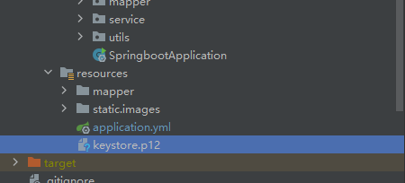

# 服务器部署问题大全

## 如何把springboot项目从http改成https

### 1.获取证书

获取免费证书可以在网站[Dashboard - ZeroSSL](https://app.zerossl.com/dashboard)获取，这个网站不仅是免费的，而且支持ip地址直接获取，不需要域名

教程可以看这个：[如何免费获取基于公网 IP 的 SSL 证书 (无需域名) - 技术颜良 - 博客园](https://www.cnblogs.com/cheyunhua/p/16242124.html)

获取到证书后就把证书文件下载下来，然后这个证书的网站我没有找到p12或pfx格式的证书文件下载方式，所以就需要下面的转格式步骤

### 2.（可选）如果证书下载没有p12或pfx格式的就先转格式

转格式要使用一个开源工具:`openSSL`，安装配置方法可参考：[保姆级OpenSSL下载及安装教程,OpenSSL下载及安装教程-CSDN博客](https://blog.csdn.net/loveryunz/article/details/136739887)

环境配置好后在证书文件夹下打开cmd，按下面步骤转格式

#### 1.输入命令

```cmd
openssl pkcs12 -export -out certificate.pfx -inkey private.key -in certificate.crt
```

执行过程中会提示设置密码，这个密码就是后面配置文件要用到的密码

#### 2.检验转换后证书的正确性

```cmd
openssl pkcs12 -info -in certificate.pfx
```

如果没有报错说明证书没问题

#### 3.（可选）如果有需要还可以再转换成p12格式

```cmd
openssl pkcs12 -export -in certificate.pfx -out certificate.p12
```


### 3.将证书文件放入springboot项目的resources目录下

参考文章：[SpringBoot后端服务开启Https协议提供访问（使用阿里云资源）_springboot 部署后怎么访问-CSDN博客](https://blog.csdn.net/m0_60155232/article/details/132259190)

我这里使用的是p12格式的证书，如下图所示，将证书文件复制一份到resources目录下




### 4.编写配置文件

在application.yml文件中添加如下配置

```yml
server:
  port: 443
  ssl:
    protocol: TLS
    key-store: classpath:keystore.p12       #证书文件的位置
    key-store-password: 123456              #证书的访问密码
    key-store-type: PKCS12                  #证书的格式
```


### 5.打包上传到服务器部署


### 6.注意事项

要注意使用的jdk会影响证书的读取，我这里原来用的jdk1.8，一直报错，弄了好久才发现是jdk的问题

#### **Java 版本不支持密钥库文件的加密算法**

某些密钥库文件可能使用了 Java 不支持的加密算法（如 AES-256）。Java 8 默认不支持高强度加密算法，除非安装了额外的 JCE 策略文件。

#### 解决方法

1. 下载适用于 Java 8 的 JCE 策略文件： [Oracle JCE 下载页面](https://www.oracle.com/java/technologies/javase-jce8-downloads.html)
2. 将下载的 `local_policy.jar` 和 `US_export_policy.jar` 替换到 `$JAVA_HOME/jre/lib/security/` 目录下。
3. 重启 Spring Boot 应用。

直接点的解决方式就是升级jdk版本，我这边直接升级到jdk21了，然后就解决了


